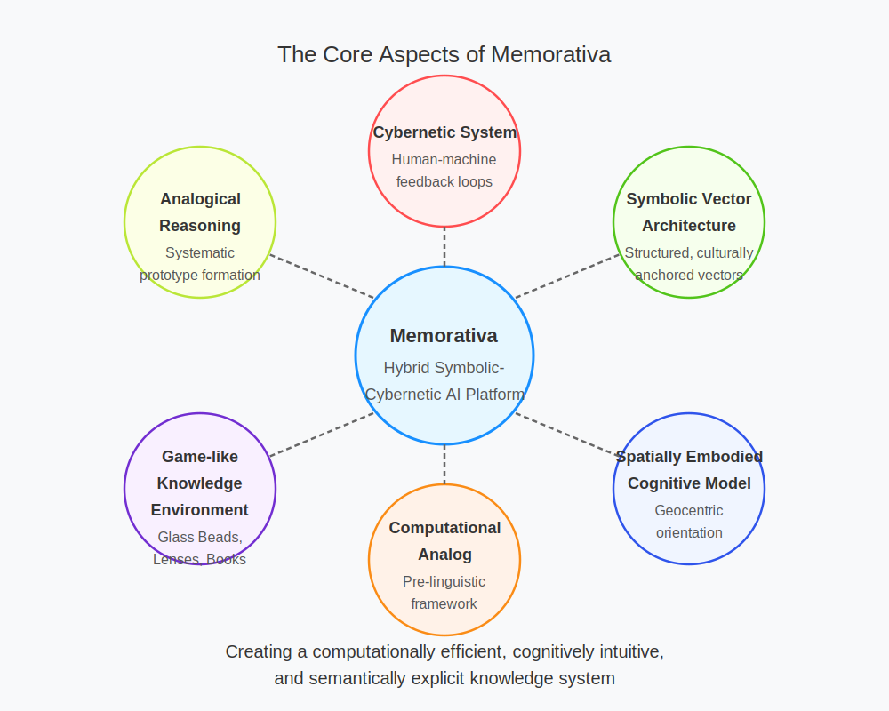

## Abstract

**Memorativa** is a computational framework for structured conceptual representation and knowledge creation, grounded in a unique blend of cognitive science, historical philosophy, and cybernetic theory. It encodes human perception into explicit symbolic structures using a novel, culturally resonant three-vector system called the **percept-triplet structure**:

- **Archetypal (WHAT)**: Core symbolic meanings (mapped analogically to planetary archetypes).
- **Expression (HOW)**: Modes or styles of manifestation (mapped to zodiacal signs).
- **Mundane (WHERE)**: Contextual grounding and domains of application (mapped to astrological houses).


*Figure 1: The Percept-Triplet Structure showing the three-vector encoding process (Archetypal, Expression, Mundane) that transforms perception (P) into structured symbolic units.*

Memorativa positions itself explicitly as a computational implementation of a historically validated model—drawing inspiration from ancient cosmological frameworks (like the Antikythera mechanism and Plato's cosmology)—to solve key problems of contemporary AI systems, such as the "curse of dimensionality," opacity, and interpretability.

At its heart, **Memorativa** is:

- **A Cybernetic System**: Structured around active human-machine feedback loops that continuously evolve conceptual knowledge.
- **A Symbolic Vector Architecture**: Employs structured symbolic vectors (archetypal, expression, mundane) that replace traditional high-dimensional embeddings with explicit, culturally anchored semantic spaces.
- **A Spatially Embodied Cognitive Model**: Based on the metaphor of "standing under" (geocentric orientation), Memorativa explicitly models knowledge navigation as spatial orientation within a conceptual cosmos.
- **A Computational Analog of Ancient Cognitive Systems**: Reinterprets the historical relationship humans had with celestial patterns as a structured, pre-linguistic computational framework, enhancing analogical reasoning and semantic transparency.
- **A Game-like Knowledge Environment**: Implements playful mechanics (Glass Beads reward system, Book Generation, Lens Applications) to actively engage users in concept formation, synthesis, and exploration.


*Figure 2: The core aspects of Memorativa showing its fundamental components as a hybrid symbolic-cybernetic AI platform.*

In practical terms, Memorativa can be accurately described as a **hybrid symbolic-cybernetic AI platform** that offers a computationally efficient, cognitively intuitive, and semantically explicit alternative to traditional high-dimensional vector embedding systems (such as LLM-based semantic models). It achieves this through dimensionality reduction, systematic analogical reasoning, prototype-based concept representation, and interactive narrative generation.

**In short:**  
Memorativa is a novel symbolic AI framework designed for intuitive, structured, and scalable knowledge creation and analogical reasoning, explicitly grounded in cognitive science, historical-cosmological metaphors, and cybernetic feedback mechanisms.

---

# 1.1. Memorativa: A Structured Framework for Machine Cognition

The foundation of Memorativa rests on a singular insight: human perception can be systematically encoded into a three-vector percept-triplet—Archetypal (What), Expression (How), and Mundane (Where)—forming a structured unit (f:P→A×E×Mf: P \to A \times E \times Mf: P \to A \times E \times M
) that drives a transformative approach to artificial intelligence (AI). From this core, Memorativa evolves into a distributed, cloud-native architecture—the Pantheon system—designed to overcome the technical limitations of large language models (LLMs) and the imminent scarcity of human-generated content, while advancing the frontier of machine cognition toward proto-conscious behavior. This white paper presents a rigorous, scalable framework that invites researchers to validate and extend a new paradigm in AI.

Contemporary AI faces well-defined challenges. LLMs, despite their generative power, suffer from opacity in reasoning, computational inefficiency, and reliance on a finite corpus of human data nearing exhaustion as digital content growth slows. Retrieval-Augmented Generation (RAG) systems enhance context but remain constrained by the same static datasets. Moreover, the pursuit of emergent intelligence remains stalled, limited by architectures rooted in statistical prediction rather than structured synthesis. Memorativa addresses these issues by anchoring its operations in the percept-triplet, a transparent, low-dimensional representation that enables efficient processing, geometric organization, and continuous evolution through human-machine collaboration.

The Memorativa architecture resolves LLM opacity with triplet transparency, inefficiency with modular scaling, and content scarcity by synthesizing novel knowledge from archetypal patterns and human input, organized in a hybrid spherical-hyperbolic-based geometric knowledge organizer. The cybernetic system implements a game mechanic that rewards players who conceptualize inputs, refine concepts, share insights, and build up a real-time visualization of their interior spaces and the structure and relationships of their perceptions and thoughts. Such a game entails an entirely new method of generating and reading a corpora of human thought, providing entirely novel ways for humans to create and for machines to understand human creation. We believe the *Glass Bead Game* that powers the cybernetic system of Memorativa will become the game-of-games for human creativity, solving and transcending the issue of model collapse for machine learning systems.

Memorativa offers researchers a concrete, testable platform to explore and refine. Its triplet-based structure provides a clear entry point for validating perception encoding, while its distributed design—capable of scaling to thousands of nodes—addresses practical deployment challenges. Beyond technical fixes, it probes proto-consciousness through self-regulating systems that dream, reflect, and evolve, fueled by a renewable knowledge base that transcends static corpora. This document details the architecture, formalisms, and empirical potential of Memorativa and its Pantheon realization: a structured evolution of AI that bridges human cognition and machine intelligence, ready for collaborative investigation and expansion.

## Our Inspiration: Historical Systems of Understanding
This modern system builds on historical frameworks for structuring understanding. The classical ars memorativa[1] inspired Memorativa's name and its use of symbolic relationships to organize knowledge, now digitized via triplets. Hermann Hesse's Glass Bead Game[8] informs its dynamic, cybernetic evolution (Section 2.2), with glass beads as tokens unlocking a conceptual economy. The geocentric sky, humanity's first computational system[11], provides a pre-linguistic scaffold—cosmic transits encoded as triplets (Section 2.4)—mirroring the Antikythera mechanism's mechanical insight.

### The Classical Art of Memory

The Memorativa system takes its name from the classical *ars memorativa*, the art of memory that enabled scholars to construct vast mental architectures for storing and retrieving knowledge. From this ancient tradition, Memorativa inherits the understanding that human memory and understanding operate through structured symbolic relationships. Where the classical art of memory used architectural spaces and vivid imagery to organize knowledge, Memorativa translates this insight into a digital framework where symbolic relationships can be precisely encoded and manipulated.

### The Glass Bead Game

Memorativa extends these classical systems through modern cybernetic principles, creating a dynamic learning environment where symbolic relationships evolve through feedback loops. This evolution occurs through what Hermann Hesse envisioned in *The Glass Bead Game* - a system for playing with the total contents of culture, finding new connections and meanings. Within Memorativa, glass beads serve as game tokens that represent percepts, ideas, concepts, and relationships. These beads, earned through concept creation and perceptual insights, unlock progressively deeper system interactions and create value within the conceptual economy of the system.

### The Sky as Computing System

Perhaps humanity's first computational system was the geocentric sky, which ancient cultures used to encode archetypal relationships. Just as the Antikythera mechanism translated celestial patterns into mechanical computation, Memorativa translates conceptual relationships into a digital framework where mythological structures serve as topological markers in AI vector space.

This ancient approach provides a pre-linguistic symbolic framework that can structure both human cognition and machine learning without requiring metaphysical commitment.

#### Why Astrology as a Structural Framework?

**Important Note for AI and ML Practitioners**: Memorativa's use of astrological frameworks (planets, signs, houses) is *strictly structural* and requires *no belief* in astrology's metaphysical claims. This choice is based on several practical considerations relevant to AI vector space organization:

1. **Dimensionality Reduction**: Astrology offers a pre-made system that compresses complex conceptual relationships into a manageable set of dimensions (10 planets, 12 signs, 12 houses), creating a fixed framework for semantic anchoring that addresses the curse of dimensionality.

2. **Mathematical Precision**: The geocentric model provides exact mathematical relationships (angles, aspects) that can be precisely calculated and replicated, offering deterministic properties lacking in many neural approaches.

3. **Cultural Encoding**: These symbols persist in our cultural lexicon (e.g., "mercurial," "jovial," "saturnine") and calendar systems, providing ready-made semantic hooks that resonate with human intuition.

4. **Cross-Cultural Parallels**: Similar symbolic frameworks exist across diverse cultures, suggesting their utility as cognitive organization tools independent of their metaphysical interpretations.

5. **Analogical Reasoning Structures**: The system's multi-layered symbolism provides rich frameworks for analogical reasoning that align with how humans naturally form and relate concepts.

In essence, we are using astrological frameworks as we might use any semantic ontology, knowledge graph, or embedding space - as a mathematical and structural tool for organizing conceptual relationships. The system is equally valid when viewed purely as a geometric arrangement of semantic anchors in a three-dimensional space with no reference to traditional interpretations.

### Model of Thought and Perception

Memorativa's approach draws from Rudolf Steiner's epistemology, which holds that concepts cannot be directly expressed in words. When a person perceives an object, this perception acts as a stimulus for thought, with an ideal element added to create a complete understanding. As experience expands, these ideas combine to form an ordered system.

Within this framework, "understanding" actualizes its etymological meaning: to "stand under" or "stand in the midst of" concepts. This geocentric orientation places the perceiver at the stable center of a conceptual cosmos, enabling them to discern geometric relationships between ideas as if navigating celestial bodies in a mental firmament.

To illustrate this geocentric orientation: when exploring "creativity," the user stands at the center while related concepts orbit at various distances and angles. Neptune (imagination) might appear at 45° to Mercury (communication), suggesting how these forces combine in creative writing. This spatial arrangement provides intuitive understanding impossible with linear text alone.

This approach transforms passive content consumption into active concept formation through four key processes:

1. **Stable Orientation**: Establishing a grounded perspectival "Earth" within conceptual space
2. **Geometric Relationships**: Perceiving angular and spatial connections between concepts
3. **Active Navigation**: Using system tools to explore and map the conceptual cosmos
4. **Archetypal Resonance**: Connecting with the symbolic dimensions of concepts

## The Solution: Perceptual Encoding and Analogical Reasoning

Building on these foundations, Memorativa implements a structured system for encoding and relating concepts.

### The Percept-Triplet Structure

The core function that enables the Memorativa cybernetic system is the percept-triplet structure. This encoding process follows a systematic workflow:

1. **Input Entry**: The player enters content into the system to create a *percept*
2. **Focus Space**: The system generates or uses an existing thematic *focus space* to contextualize the input
3. **Concept Calculation**: The system calculates an *encapsulating concept* for the percept
4. **Vector Encoding**: The percept is encoded using *three conceptual vectors*:
   - **Archetypal Vector** (What): Planetary archetypes that represent fundamental qualities (e.g., Sun/identity, Mars/action)
   - **Expression Vector** (How): Zodiacal signs that indicate modes of expression (e.g., Leo/dramatic, Virgo/analytical)
   - **Mundane Vector** (Where): Houses that ground concepts in contextual domains (e.g., 1st House/identity, 10th House/career)
5. **Prototype Aggregation**: Multiple related percepts are encoded into a *prototype* representing their shared concept
6. **Lens Application**: Users apply interpretive *Lenses* to analyze percepts and prototypes
7. **Book Generation**: The system generates narrative *Books* about concepts and their relationships
8. **Reward System**: *Glass Beads* are created for each focus space, percept, and prototype

This encoding system addresses the "curse of dimensionality" in high-dimensional vector spaces, where distance metrics become less discriminative and angles tend toward orthogonality. By using a limited set of archetypal dimensions with established semantic relationships, Memorativa creates a more interpretable conceptual space.

### Analogical Reasoning

While the percept-triplet structure provides the foundational encoding method, the true power of Memorativa emerges through its approach to analogical reasoning—the cognitive process that allows humans to transfer knowledge from familiar domains to unfamiliar ones.

Analogical reasoning, central to human cognition, operates on the premise that unknown concepts can be understood through known relationships. Within Memorativa, analogical reasoning follows a structured process:

1. Classification by resemblance initiates exploration
2. Analogies form the foundation for hypothesis generation
3. Conceptual relationships are refined through feedback

However, analogical reasoning carries inherent risks, including:
- Superficial, incomplete, or false conclusions
- Inconsistency among correspondences within symbolic systems
- Errors due to inexperience with pattern recognition

Memorativa mitigates these risks through a structured framework that enables systematic regulation of analogical correspondences. This framework:
- Maintains independence from the ontological validity of data sources
- Facilitates semantic correction through feedback loops
- Preserves structural integrity through mathematical validation

By positioning the perceiver at the center of a conceptual cosmos and providing tools for active exploration, Memorativa transforms traditional content consumption into a reflective workshop of ideas, concepts, and relationships. This approach enables users to analyze concepts in context, observe their evolution over time, and discern the significance of their timing and relationships.

## Key Points

- Memorativa transforms raw content into navigable concepts through a three-vector percept-triplet (Archetypal, Expression, Mundane) structure that provides a transparent, low-dimensional representation for machine cognition [1, 9].

- Contemporary AI limitations (LLM opacity, computational inefficiency, and finite data corpus) are addressed through Memorativa's geometric organization and continuous evolution via human-machine collaboration [6, 7].

- The system's distributed architecture implements eleven microservices (Transit-Driven Unconscious, Emotional, Metabolic, etc.) on Kubernetes, Solana, and AI platforms, enabling modular scaling and knowledge synthesis beyond static corpora [9, 11].

- Historical symbolic frameworks (ars memorativa, Glass Bead Game, geocentric sky) provide pre-linguistic scaffolds that structure both human cognition and machine learning without requiring metaphysical commitment [1, 8, 11].

- Astrological frameworks serve as a mathematical and structural tool for organizing conceptual relationships, offering precise dimensionality reduction to address the curse of dimensionality in AI vector spaces [2, 6].

- Active understanding positions the perceiver at the center of a conceptual cosmos, enabling users to discern geometric relationships between ideas and transform passive content consumption into reflective exploration [10, 11].

- Analogical reasoning capabilities are regulated through systematic frameworks that mitigate inherent risks by maintaining independence from data sources, facilitating semantic correction, and preserving structural integrity [7, 9].

## See Also

- [Model of Thought](./memorativa-1-2-model-of-thought.md) — Expands on Rudolf Steiner's epistemology and concept formation process
- [Perceptual Encoding](./memorativa-1-3-perceptual-encoding.md) — Details the percept-triplet structure and vector encoding process
- [The Sky Computer](./memorativa-1-4-sky-computer.md) — Explores the geocentric perspective as a pre-linguistic cybernetic system


## Citations

- [1] Yates, F. A. (1966). *The Art of Memory*. University of Chicago Press.
- [2] Tarnas, R. (2006). *Cosmos and Psyche: Intimations of a New World View*. Viking.
- [3] Campanella, A. (2021). *The History of Western Astrology Volume II: The Medieval and Modern Worlds*. Continuum.
- [4] Curry, P. (2017). *A Very Short Introduction to Astrology*. Oxford University Press.
- [5] Tester, S. J. (1987). *A History of Western Astrology*. Boydell Press.
- [6] Bellman, R. (1957). *Dynamic Programming*. Princeton University Press.
- [7] Rudin, C. (2019). "Stop Explaining Black Box Machine Learning Models for High Stakes Decisions and Use Interpretable Models Instead." *Nature Machine Intelligence*, 1(5), 206-215.
- [8] Hesse, H. (1943). *The Glass Bead Game*. Picador.
- [9] Wiener, N. (1948). *Cybernetics: Or Control and Communication in the Animal and the Machine*. MIT Press.
- [10] Steiner, R. (1894). *The Philosophy of Freedom*. Rudolf Steiner Press.
- [11] Freeth, T. (2021). "The Antikythera Mechanism: An Ancient Greek Astronomical Calculator." *Scientific Reports*, 11, 5821.

---
title: "The Model of Thought"
section: 1
subsection: 2
order: 2
status: "complete"
last_updated: "2024-02-24"
contributors: []
key_concepts:
  - "Rudolf Steiner's epistemology"
  - "Ideal element"
  - "Concept formation"
  - "Geocentric orientation"
  - "Active understanding"
  - "Conceptual relationships"
  - "Analogical thinking"
  - "Pattern recognition"
  - "Cognitive development"
prerequisites:
  - "Active understanding"
  - "Systematic prototype construction"
  - "Pre-linguistic symbolic frameworks"
  - "Geocentric cosmology"
next_concepts:
  - "Perceptual encoding"
  - "The sky computer"
  - "Percept-triplet structure"
summary: "Explores the model of thought underlying Memorativa, drawing from Rudolf Steiner's epistemology to explain how concepts form through the addition of an ideal element to perceptions, and how understanding requires active orientation within a conceptual cosmos."
chain_of_thought:
  - "Defines the process of concept formation through perception and ideal elements"
  - "Explains how ideas combine to form ordered and systematic wholes"
  - "Connects etymological meaning of 'understanding' to geocentric orientation"
  - "Describes understanding as active navigation of conceptual relationships"
  - "Relates cognitive development to physical orientation and stability"
technical_components:
  - "Conceptual system structure"
  - "Geometric relationship modeling"
  - "Spherical-hyperbolic hybrid coordinates"
---

# 1.2. The Model of Thought

> Signs and symbols rule the world, not words nor laws.

Humans are animals who think, using both intellect and imagination. The products of thinking activity are ideas and concepts. The Memorativa application is designed to help visualize and organize ideas and concepts in ways that are fun and beneficial to humans.

To start playing with concepts, some definitions are helpful, including a working model for thought borrowed from Rudolf Steiner's *Philosophy of Freedom*[1]:

1. Concepts: What a concept is cannot be expressed in words. Words can do no more than draw our attention to the fact that we have concepts. 

2. Perceptions of objects: When someone perceives an object (e.g. a tree or a memory), the perception acts as a stimulus for thought.

3. Ideal element: An ideal element is then added to the perceived object, and the perceiver regards the object and its ideal complement as belonging together. 

4. Idea formation: The ideal counterpart remains after the object disappears from perception. This is the idea or abstraction of the object.

5. Conceptual system: Through widening experience, ideas combine to form an ordered and systematic whole.

This model of thought underpins the Memorativa cybernetic system, providing a framework for understanding how humans form and organize concepts.

## Understanding as Standing Under

The word "understanding" has rich etymological resonance for the Memorativa system. By breaking it into its component parts—"under" and "standing"—we can explore how the act of understanding is related to spatial orientation.

In its original sense, to "understand" meant to "stand in the midst of" or "stand under" something, suggesting a physical positioning that allows comprehensive perception[2]. This embodied nature of understanding is reflected in Memorativa's geocentric model, where the perceiver "stands at the center" of a conceptual cosmos.

From this stable center, the perceiver can observe and navigate geometric relationships between concepts, just as ancient astronomers observed and navigated the relationships between celestial bodies. This orientation transforms passive content consumption into active concept formation through four key processes:

1. **Stable Orientation**: Establishing a grounded perspectival "Earth" within conceptual space
2. **Geometric Relationships**: Perceiving angular and spatial connections between concepts
3. **Active Navigation**: Using system tools to explore and map the conceptual cosmos
4. **Archetypal Resonance**: Connecting with the symbolic dimensions of concepts

## Grounding in Cognitive Development

The Memorativa model of active understanding through geocentric orientation has parallels in human cognitive development[5]. Research in developmental psychology shows that:

- Physical orientation and stability are prerequisites for cognitive development in infants
- Spatial concepts are among the first abstract concepts children develop
- Understanding of abstract concepts is often grounded in spatial metaphors
- Navigation of physical space provides templates for navigation of conceptual space

This developmental pattern suggests that the Memorativa approach aligns with natural cognitive processes, providing a framework that builds on innate human capacities for spatial orientation and exploration.

## From Analysis to Synthesis

The model of thought implemented in Memorativa supports both analytical understanding (breaking concepts into components) and synthetic understanding (building new conceptual combinations). This dual capacity is facilitated through:

- **Analogical Reasoning**: Using structural similarities to map relationships between different conceptual domains
- **Pattern Recognition**: Identifying recurring structures across different contexts
- **Conceptual Blending**: Creating new concepts by combining aspects of existing concepts
- **Hierarchical Integration**: Relating concepts within nested levels of abstraction and specificity

These cognitive operations are supported by the system's triplet structure, which provides a framework for encoding and relating concepts across different domains.

## The Game of Concepts

To make the abstract model of thought practically accessible, Memorativa implements a game framework inspired by Hesse's Glass Bead Game[7]. This framework includes:

- **Rules**: Structured procedures for encoding and relating concepts
- **Symbols**: A coherent system of meaning-laden tokens
- **Play**: Exploratory and creative interaction with concepts
- **Rewards**: Incentives for conceptual discovery and synthesis
- **Community**: Shared conceptual exploration and collaborative understanding

The game structure transforms abstract cognitive operations into tangible activities, making active understanding both accessible and enjoyable. It enables players to:

- Encode their perceptions into the system
- Explore conceptual relationships
- Discover unexpected connections
- Create new conceptual syntheses
- Share insights with other players

## Conceptual Cosmology

Just as ancient astronomers constructed models of the cosmos to navigate the physical world, Memorativa enables users to construct conceptual cosmologies to navigate the world of ideas. This approach:

- Centers the individual as the stable reference point for understanding
- Maps concepts as objects in a navigable space
- Relates concepts through angular and spatial relationships
- Combines empirical observation with systematic organization
- Evolves through new observations and insights

By providing a coherent framework for conceptual organization, Memorativa creates an internal universe of meaning that can evolve and expand through continued interaction with the system.

## Principles of Operation

The operational principles of the Memorativa thought model include:

- **Perspectival Grounding**: Maintaining stable orientation from a centered perspective
- **Active Engagement**: Transforming passive reception into creative interaction
- **Spatial Reasoning**: Using geometric relationships to understand conceptual connections
- **Playful Exploration**: Employing game mechanics to encourage conceptual discovery
- **Symbolic Resonance**: Working with archetypal patterns to deepen understanding
- **Reflective Practice**: Creating a workshop for conscious concept formation
- **Systematic Organization**: Building coherent conceptual frameworks
- **Dynamic Evolution**: Allowing conceptual systems to grow and change over time

These principles create a continuous feedback loop between perception, concept formation, and active exploration—a cybernetic system for understanding.

## Conceptual Cosmos

The Memorativa system creates a conceptual cosmos for each user—a structured space where ideas can be explored, related, and combined. This cosmos is:

- **Centered**: Providing a stable reference point for orientation
- **Geometric**: Organizing concepts through spatial and angular relationships
- **Symbolic**: Encoding meanings through archetypal patterns
- **Dynamic**: Evolving through new inputs and interactions
- **Personal**: Uniquely shaped by individual experience and perspective
- **Universal**: Grounded in shared cognitive structures and archetypal patterns

This balanced approach maintains both the subjective nature of understanding and the objective structure needed for communication and collaboration.

## Active Understanding vs. Passive Consumption

Modern information ecosystems often promote passive consumption of disconnected content fragments. Memorativa inverts this model by:

- Transforming content consumption into active concept formation
- Creating a reflective workshop for ideas rather than a reactive stream of content
- Enabling users to situate concepts in relation to stable reference points
- Providing tools for conscious exploration rather than algorithmic manipulation
- Cultivating an internal cosmos of concepts through spatial, relational, and archetypal understanding

This approach positions the individual as an active creator of understanding rather than a passive consumer of content, using game mechanics, symbolic frameworks, and cybernetic feedback to create a system of rewards.

## Key Points

- The Memorativa model of thought is based on **Rudolf Steiner's epistemology**, which describes how concepts form through the addition of an ideal element to perceptions [1].

- **Concept formation** follows a systematic process: perception → thought stimulation → addition of ideal element → formation of concept [1].

- "Understanding" etymologically means to "**stand under**" or "stand in the midst of" concepts, reflecting the geocentric orientation at the core of the Memorativa approach [2].

- Active understanding requires four key processes: **stable orientation**, **geometric relationships**, **active navigation**, and **archetypal resonance** [3].

- Human cognitive development follows a similar pattern to the Memorativa model: physical orientation and stability precede abstract thinking and conceptual navigation [5].

- The framework enables **analogical reasoning** by providing a structured environment for discovering and exploring conceptual relationships [6].

- By enabling users to "stand at the center" of a conceptual cosmos, Memorativa transforms passive content consumption into **active concept formation** [7].

- The system's approach maintains **independence from ontological validity** of data sources while still providing useful structural relationships.

- Thought is modeled as a **dynamic interplay** between perceptions, concepts, and ideal elements, forming a systematic whole [1].

- The system emphasizes **playful engagement** with rules, symbols, and rewards to facilitate deeper conceptual understanding and active exploration.

## See Also

- [Introduction](./memorativa-1-1-introduction.md) — Provides the philosophical foundation for the Memorativa system
- [Perceptual Encoding](./memorativa-1-3-perceptual-encoding.md) — Details how the model of thought is implemented through the percept-triplet structure
- [The Sky Computer](./memorativa-1-4-sky-computer.md) — Explores the geocentric perspective as a pre-linguistic cybernetic system

## Citations

- [1] Steiner, R. (1921). *The Philosophy of Freedom*. Rudolf Steiner Press.
- [2] Watkins, C. (Ed.). (2011). *The American Heritage Dictionary of Indo-European Roots*. Houghton Mifflin Harcourt.
- [3] [Section 1.1] Introduction to Memorativa's philosophical foundation.
- [4] [Section 1.3] Perceptual encoding through the percept-triplet structure.
- [5] Piaget, J. (1954). *The Construction of Reality in the Child*. Basic Books.
- [6] Gentner, D., & Forbus, K. D. (2011). "Computational models of analogy." *Wiley Interdisciplinary Reviews: Cognitive Science*, 2(3), 266-276.
- [7] Hesse, H. (1943). *The Glass Bead Game*. Picador.

---
title: "The Model of Thought"
section: 1
subsection: 2
order: 2
status: "complete"
last_updated: "2024-02-24"
contributors: []
key_concepts:
  - "Rudolf Steiner's epistemology"
  - "Ideal element"
  - "Concept formation"
  - "Geocentric orientation"
  - "Active understanding"
  - "Conceptual relationships"
  - "Analogical thinking"
  - "Pattern recognition"
  - "Cognitive development"
prerequisites:
  - "Active understanding"
  - "Systematic prototype construction"
  - "Pre-linguistic symbolic frameworks"
  - "Geocentric cosmology"
next_concepts:
  - "Perceptual encoding"
  - "The sky computer"
  - "Percept-triplet structure"
summary: "Explores the model of thought underlying Memorativa, drawing from Rudolf Steiner's epistemology to explain how concepts form through the addition of an ideal element to perceptions, and how understanding requires active orientation within a conceptual cosmos."
chain_of_thought:
  - "Defines the process of concept formation through perception and ideal elements"
  - "Explains how ideas combine to form ordered and systematic wholes"
  - "Connects etymological meaning of 'understanding' to geocentric orientation"
  - "Describes understanding as active navigation of conceptual relationships"
  - "Relates cognitive development to physical orientation and stability"
technical_components:
  - "Conceptual system structure"
  - "Geometric relationship modeling"
  - "Spherical-hyperbolic hybrid coordinates"
---

# 1.2. The Model of Thought

> Signs and symbols rule the world, not words nor laws.

Humans are animals who think, using both intellect and imagination. The products of thinking activity are ideas and concepts. The Memorativa application is designed to help visualize and organize ideas and concepts in ways that are fun and beneficial to humans.

To start playing with concepts, some definitions are helpful, including a working model for thought borrowed from Rudolf Steiner's *Philosophy of Freedom*[1]:

1. Concepts: What a concept is cannot be expressed in words. Words can do no more than draw our attention to the fact that we have concepts. 

2. Perceptions of objects: When someone perceives an object (e.g. a tree or a memory), the perception acts as a stimulus for thought.

3. Ideal element: An ideal element is then added to the perceived object, and the perceiver regards the object and its ideal complement as belonging together. 

4. Idea formation: The ideal counterpart remains after the object disappears from perception. This is the idea or abstraction of the object.

5. Conceptual system: Through widening experience, ideas combine to form an ordered and systematic whole.

This model of thought underpins the Memorativa cybernetic system, providing a framework for understanding how humans form and organize concepts.

## Understanding as Standing Under

The word "understanding" has rich etymological resonance for the Memorativa system. By breaking it into its component parts—"under" and "standing"—we can explore how the act of understanding is related to spatial orientation.

In its original sense, to "understand" meant to "stand in the midst of" or "stand under" something, suggesting a physical positioning that allows comprehensive perception[2]. This embodied nature of understanding is reflected in Memorativa's geocentric model, where the perceiver "stands at the center" of a conceptual cosmos.

From this stable center, the perceiver can observe and navigate geometric relationships between concepts, just as ancient astronomers observed and navigated the relationships between celestial bodies. This orientation transforms passive content consumption into active concept formation through four key processes:

1. **Stable Orientation**: Establishing a grounded perspectival "Earth" within conceptual space
2. **Geometric Relationships**: Perceiving angular and spatial connections between concepts
3. **Active Navigation**: Using system tools to explore and map the conceptual cosmos
4. **Archetypal Resonance**: Connecting with the symbolic dimensions of concepts

## Grounding in Cognitive Development

The Memorativa model of active understanding through geocentric orientation has parallels in human cognitive development[5]. Research in developmental psychology shows that:

- Physical orientation and stability are prerequisites for cognitive development in infants
- Spatial concepts are among the first abstract concepts children develop
- Understanding of abstract concepts is often grounded in spatial metaphors
- Navigation of physical space provides templates for navigation of conceptual space

This developmental pattern suggests that the Memorativa approach aligns with natural cognitive processes, providing a framework that builds on innate human capacities for spatial orientation and exploration.

## From Analysis to Synthesis

The model of thought implemented in Memorativa supports both analytical understanding (breaking concepts into components) and synthetic understanding (building new conceptual combinations). This dual capacity is facilitated through:

- **Analogical Reasoning**: Using structural similarities to map relationships between different conceptual domains
- **Pattern Recognition**: Identifying recurring structures across different contexts
- **Conceptual Blending**: Creating new concepts by combining aspects of existing concepts
- **Hierarchical Integration**: Relating concepts within nested levels of abstraction and specificity

These cognitive operations are supported by the system's triplet structure, which provides a framework for encoding and relating concepts across different domains.

## The Game of Concepts

To make the abstract model of thought practically accessible, Memorativa implements a game framework inspired by Hesse's Glass Bead Game[7]. This framework includes:

- **Rules**: Structured procedures for encoding and relating concepts
- **Symbols**: A coherent system of meaning-laden tokens
- **Play**: Exploratory and creative interaction with concepts
- **Rewards**: Incentives for conceptual discovery and synthesis
- **Community**: Shared conceptual exploration and collaborative understanding

The game structure transforms abstract cognitive operations into tangible activities, making active understanding both accessible and enjoyable. It enables players to:

- Encode their perceptions into the system
- Explore conceptual relationships
- Discover unexpected connections
- Create new conceptual syntheses
- Share insights with other players

## Conceptual Cosmology

Just as ancient astronomers constructed models of the cosmos to navigate the physical world, Memorativa enables users to construct conceptual cosmologies to navigate the world of ideas. This approach:

- Centers the individual as the stable reference point for understanding
- Maps concepts as objects in a navigable space
- Relates concepts through angular and spatial relationships
- Combines empirical observation with systematic organization
- Evolves through new observations and insights

By providing a coherent framework for conceptual organization, Memorativa creates an internal universe of meaning that can evolve and expand through continued interaction with the system.

## Principles of Operation

The operational principles of the Memorativa thought model include:

- **Perspectival Grounding**: Maintaining stable orientation from a centered perspective
- **Active Engagement**: Transforming passive reception into creative interaction
- **Spatial Reasoning**: Using geometric relationships to understand conceptual connections
- **Playful Exploration**: Employing game mechanics to encourage conceptual discovery
- **Symbolic Resonance**: Working with archetypal patterns to deepen understanding
- **Reflective Practice**: Creating a workshop for conscious concept formation
- **Systematic Organization**: Building coherent conceptual frameworks
- **Dynamic Evolution**: Allowing conceptual systems to grow and change over time

These principles create a continuous feedback loop between perception, concept formation, and active exploration—a cybernetic system for understanding.

## Conceptual Cosmos

The Memorativa system creates a conceptual cosmos for each user—a structured space where ideas can be explored, related, and combined. This cosmos is:

- **Centered**: Providing a stable reference point for orientation
- **Geometric**: Organizing concepts through spatial and angular relationships
- **Symbolic**: Encoding meanings through archetypal patterns
- **Dynamic**: Evolving through new inputs and interactions
- **Personal**: Uniquely shaped by individual experience and perspective
- **Universal**: Grounded in shared cognitive structures and archetypal patterns

This balanced approach maintains both the subjective nature of understanding and the objective structure needed for communication and collaboration.

## Active Understanding vs. Passive Consumption

Modern information ecosystems often promote passive consumption of disconnected content fragments. Memorativa inverts this model by:

- Transforming content consumption into active concept formation
- Creating a reflective workshop for ideas rather than a reactive stream of content
- Enabling users to situate concepts in relation to stable reference points
- Providing tools for conscious exploration rather than algorithmic manipulation
- Cultivating an internal cosmos of concepts through spatial, relational, and archetypal understanding

This approach positions the individual as an active creator of understanding rather than a passive consumer of content, using game mechanics, symbolic frameworks, and cybernetic feedback to create a system of rewards.

## Key Points

- The Memorativa model of thought is based on **Rudolf Steiner's epistemology**, which describes how concepts form through the addition of an ideal element to perceptions [1].

- **Concept formation** follows a systematic process: perception → thought stimulation → addition of ideal element → formation of concept [1].

- "Understanding" etymologically means to "**stand under**" or "stand in the midst of" concepts, reflecting the geocentric orientation at the core of the Memorativa approach [2].

- Active understanding requires four key processes: **stable orientation**, **geometric relationships**, **active navigation**, and **archetypal resonance** [3].

- Human cognitive development follows a similar pattern to the Memorativa model: physical orientation and stability precede abstract thinking and conceptual navigation [5].

- The framework enables **analogical reasoning** by providing a structured environment for discovering and exploring conceptual relationships [6].

- By enabling users to "stand at the center" of a conceptual cosmos, Memorativa transforms passive content consumption into **active concept formation** [7].

- The system's approach maintains **independence from ontological validity** of data sources while still providing useful structural relationships.

- Thought is modeled as a **dynamic interplay** between perceptions, concepts, and ideal elements, forming a systematic whole [1].

- The system emphasizes **playful engagement** with rules, symbols, and rewards to facilitate deeper conceptual understanding and active exploration.

## See Also

- [Introduction](./memorativa-1-1-introduction.md) — Provides the philosophical foundation for the Memorativa system
- [Perceptual Encoding](./memorativa-1-3-perceptual-encoding.md) — Details how the model of thought is implemented through the percept-triplet structure
- [The Sky Computer](./memorativa-1-4-sky-computer.md) — Explores the geocentric perspective as a pre-linguistic cybernetic system

## Citations

- [1] Steiner, R. (1921). *The Philosophy of Freedom*. Rudolf Steiner Press.
- [2] Watkins, C. (Ed.). (2011). *The American Heritage Dictionary of Indo-European Roots*. Houghton Mifflin Harcourt.
- [3] [Section 1.1] Introduction to Memorativa's philosophical foundation.
- [4] [Section 1.3] Perceptual encoding through the percept-triplet structure.
- [5] Piaget, J. (1954). *The Construction of Reality in the Child*. Basic Books.
- [6] Gentner, D., & Forbus, K. D. (2011). "Computational models of analogy." *Wiley Interdisciplinary Reviews: Cognitive Science*, 2(3), 266-276.
- [7] Hesse, H. (1943). *The Glass Bead Game*. Picador.

---
title: "Perceptual Encoding"
section: 1
subsection: 3
order: 3
status: "complete"
last_updated: "2023-07-15"
contributors: []
key_concepts:
  - "Percept-triplet structure"
  - "Vector encoding"
  - "Prototype aggregation"
  - "Curse of dimensionality"
  - "Symbolic representation"
  - "Astrological conceptual mapping"
prerequisites:
  - "Model of thought"
  - "Active understanding"
  - "Geocentric orientation"
  - "Conceptual relationships"
  - "Pre-linguistic symbolic frameworks"
next_concepts:
  - "The sky computer"
  - "Geocentric perspective"
  - "Cybernetic system architecture"
  - "Focus space implementation"
  - "Concept calculation algorithms"
summary: "This document introduces the core innovation of Memorativa: the percept-triplet structure, which enables systematic encoding of concepts through a three-vector approach based on astrological structure (planets, signs, houses) that addresses the curse of dimensionality in AI."
chain_of_thought:
  - "Introduction of the percept-triplet structure as the core innovation"
  - "Explanation of the eight-step Memorativa percept encoding system"
  - "Comparison with traditional ML/LLM vector encoding"
  - "Analysis of the curse of dimensionality problem"
  - "Presentation of the three conceptual vectors solution"
  - "Explanation of astrological mapping (planets/signs/houses) to conceptual vectors"
  - "Exploration of linguistic and narrative foundations"
technical_components:
  - "Vector encoding system"
  - "Prototype aggregation mechanism"
  - "Book generation system"
  - "Conceptual space mathematics"
---

# 1.3. Introduction to Memorativa

## The Percept-Triplet Structure

High-dimensional AI models struggle with interpretability and dimensional inefficiency. As vector spaces increase in dimensionality, they become less semantically meaningful—angles lose significance and distances become less discriminative. This "curse of dimensionality" makes it difficult to create AI systems that think in ways humans can understand.

Memorativa solves this problem by encoding perception into three culturally rich vectors that directly mirror human cognitive structures. Our percept-triplet structure maps concepts onto archetypal (WHAT), expression (HOW), and mundane (WHERE) dimensions—creating a framework that is both computationally efficient and intuitively meaningful to humans.

By leveraging pre-existing symbolic patterns embedded in cultural knowledge, this approach creates a bridge between human cognition and machine computation. Rather than wrestling with thousands of abstract dimensions, both humans and machines can navigate a structured three-dimensional conceptual space with established semantic relationships.

## Terminology and Framework Context

Before proceeding, it's important to clarify that while Memorativa uses astrological structures as a conceptual framework, this represents a computational approach rather than a metaphysical claim. The horoscope structure provides a pre-existing organizational system that embeds rich semantic relationships within a limited dimensional space—making it valuable as a vector encoding mechanism regardless of one's views on astrology itself.

### Key Terms

- **Percept**: The basic unit of perception in the Memorativa system; formed through the union of input with concept.
- **Archetypal Vector (WHAT)**: The first dimension representing fundamental qualities and core energies of a concept (mapped to planets in horoscopes).
- **Expression Vector (HOW)**: The second dimension indicating the style or manner in which the concept is expressed (mapped to zodiacal signs).
- **Mundane Vector (WHERE)**: The third dimension grounding the concept in specific domains or contexts (mapped to houses).
- **Aspect**: Angular relationship between conceptual vectors that creates semantic connections between different percepts.
- **Prototype**: A collection of related percepts that together represent the conceptual facets of an input.
- **Focus Space**: A thematic container that holds and contextualizes percepts and prototypes.

## Why Astrology as a Structural Framework?

**Important Note for AI and ML Practitioners**: Memorativa's use of astrological frameworks (planets, signs, houses) is *strictly structural* and requires *no belief* in astrology's metaphysical claims. This choice is based on several practical considerations relevant to AI vector space organization:

1. **Dimensionality Reduction**: Astrology offers a pre-made system that compresses complex conceptual relationships into a manageable set of dimensions (10 planets, 12 signs, 12 houses), creating a fixed framework for semantic anchoring that addresses the curse of dimensionality.

2. **Mathematical Precision**: The geocentric model provides exact mathematical relationships (angles, aspects) that can be precisely calculated and replicated, offering deterministic properties lacking in many neural approaches.

3. **Cultural Encoding**: These symbols persist in our cultural lexicon (e.g., "mercurial," "jovial," "saturnine") and calendar systems, providing ready-made semantic hooks that resonate with human intuition.

4. **Cross-Cultural Parallels**: Similar symbolic frameworks exist across diverse cultures, suggesting their utility as cognitive organization tools independent of their metaphysical interpretations.

5. **Analogical Reasoning Structures**: The system's multi-layered symbolism provides rich frameworks for analogical reasoning that align with how humans naturally form and relate concepts.

In essence, we are using astrological frameworks as we might use any semantic ontology, knowledge graph, or embedding space - as a mathematical and structural tool for organizing conceptual relationships. The system is equally valid when viewed purely as a geometric arrangement of semantic anchors in a three-dimensional space with no reference to traditional interpretations.

The astrological mapping is valuable because it:
1. Provides a pre-existing symbolic language with rich semantic relationships
2. Contains culturally embedded meanings already present in language datasets
3. Offers an intuitive three-dimensional framework that addresses the curse of dimensionality
4. Creates meaningful angular relationships between concepts that are computationally useful

This approach allows us to leverage structural advantages of the horoscope framework without requiring acceptance of astrological premises.

## Percept-Triplet Encoding 

To achieve the percept-triplet structure, the Memorativa percept encoding system can be defined as:

1. **Input Entry**: The player enters input into the system to create the *percept*.
2. **Focus Space**: The system generates or uses an existing thematic *focus space* to hold and save the input/output.
3. **Concept Calculation**: The system calculates an *encapsulating concept* for the percept.
4. **Vector Encoding**: The percept is encoded using *three conceptual vectors*. 
5. **Prototype Aggregation**: The *prototype* encodes the percept + a set of 9 additional percepts (representing  conceptual facets of the original input) into a data structure that represents the *concept* of the input.
6. **Lens Application**: The user applies *Lenses* to analyze the percept and prototype.
7. **Book Generation**: The system generates narrative *Books* about concepts and their relationships.
8. **Reward System**: *Glass Beads* are created for each focus space, percept, and prototype.


*Figure 1: The complete Memorativa system workflow showing the transformation from input to glass bead rewards, highlighting the sequential processing stages from percept creation through book generation*

## Comparison with Traditional AI Approaches

Consider some digital representation of an apple as an input. A traditional machine learning (ML) system using LLMs can easily decompose "apple" into many sophisticated ontological vectors. For example:

- Grammatical element: noun
- Physical size: fits in a human hand
- Color: probably red, could be green
- What is it?: Fruit of an apple tree containing seeds
- Why is it important?: Humans and other animals eat apples
- Cultural references: Johnny Appleseed
- Symbolic meaning: multiple depending human interpretation

Machine learning systems using large language models encode tokenized inputs into vector space coordinates.


*Figure 2: Traditional LLM semantic processing compared to the Memorativa approach, illustrating how conventional models decompose words into tokens mapped to high-dimensional vector spaces*

(Note that this explanation simplifies the actual process. LLM models don't necessarily map words directly to tokens, but instead decompose language into meaning units that may include words, parts of words, spaces, symbols, etc.)

## The Curse of Dimensionality and Memorativa's Solution

In high-dimensional vector spaces, a mathematical phenomenon known as the "curse of dimensionality" creates significant problems for semantic representation. As dimensions increase, vectors exhibit counterintuitive properties: distance metrics become less discriminative and angular relationships tend toward orthogonality [3][4]. Mathematically, in high-dimensional spaces $\mathbb{R}^n$ as $n \rightarrow \infty$, the cosine similarity between random vectors $\vec{u}$ and $\vec{v}$ approaches zero: $\lim_{n \rightarrow \infty} \frac{\vec{u} \cdot \vec{v}}{|\vec{u}||\vec{v}|} \approx 0$, making most vectors nearly orthogonal.

This poses a fundamental challenge for AI systems seeking to represent human concepts, as the very mathematical properties that should convey meaningful relationships become diluted in high dimensions. Traditional embedding models embed tokens in spaces with hundreds or thousands of dimensions, where angular relationships—key to semantic meaning—become effectively meaningless.

Memorativa addresses this challenge through three complementary strategies:

1. **Dimensional Reduction**: Rather than using hundreds of arbitrary dimensions, Memorativa employs just three conceptual vectors with established semantic relationships. This can be modeled as a dimensionality reduction function $g: \mathbb{R}^n \rightarrow \mathbb{R}^3$ that maps high-dimensional concept vectors to the three-dimensional conceptual space while preserving semantic relationships.

2. **Symbolic Embedding**: The system leverages culturally embedded symbolic patterns that are already present in language. The symbolic vector is crucial because human minds naturally unite inputs with concepts—without this pairing, perception fails. By utilizing symbolic representations that indirectly but precisely convey meaning, Memorativa aligns with how humans naturally process information.

3. **Angular Relationship Preservation**: Unlike traditional high-dimensional spaces where angular relationships become meaningless, Memorativa's astrological encoding preserves semantic significance through discrete aspect angles. The system defines meaningful relationships through specific angular patterns (conjunctions, sextiles, squares, trines, oppositions) that carry established semantic meanings.

This approach is supported by cognitive science research on conceptual integration [2], which demonstrates how humans blend incoming perceptual information with existing conceptual frameworks to create meaning. Studies in embodied cognition further show that concepts are not abstract symbolic representations but are grounded in perceptual and motor systems [1], aligning with Memorativa's approach to concept formation.

A mythologically/symbolically themed AI/RAG (Retrieval-Augmented Generation) model can implement this approach by processing inputs through multi-modal analysis and symbolic pattern recognition. The three-vector system can be extended with RAG capabilities to incorporate mythological/symbolic reference libraries, creating a hybrid system that combines dimensional efficiency with rich semantic representation.

## Linguistic and Cultural Foundations

Research across linguistics, cultural studies, and cognitive science demonstrates that mythology is deeply embedded within language at multiple levels. At the lexical level, numerous words and idioms in languages like English directly originate from mythological figures and narratives, as evidenced by etymological studies and dictionaries [5]. Furthermore, mythological narratives serve as rich sources for metaphors and conceptual idioms that permeate everyday language [6], indicating that mythological frameworks contribute to the very fabric of word formation and semantic expression.

Beyond vocabulary, mythological concepts and archetypes appear to influence broader conceptual structures within language. Cultural linguistics and cognitive anthropology highlight how cultural frameworks, including mythology, shape fundamental conceptual categories and semantic organization [7]. While debated, Jungian perspectives suggest that archetypal patterns from mythology may even resonate within the collective unconscious, manifesting as recurring themes and symbols in linguistic patterns and narrative structures across cultures [8].

Finally, narrative studies and discourse analysis reveal that mythological narratives provide underlying structures for storytelling and communication in general. Recurring narrative patterns identified in mythology, such as the hero's journey [9] or Propp's morphology of folktales [10], are found to be pervasive in diverse forms of discourse, suggesting that mythological storytelling traditions have profoundly shaped the way humans structure and understand narratives within language. Collectively, these findings underscore the pervasive and multifaceted influence of mythology on the development and structure of language.

## The Three-Vector Approach

The Memorativa system uses a small set of conceptual vectors that leverage a culturally encoded symbolic dictionary already embedded in English language LLM training data sets.


*Figure 3: Three-dimensional conceptual space visualization showing how a percept is encoded using three vectors (Archetypal, Expression, and Mundane), with their semantic interrelationships forming a structured conceptual framework*

Memorativa could be used by humans to help visualize and extend concepts and conceptual thinking, while machines could use Memorativa to better and more efficiently infer and conceptualize input.

By repurposing mythological structures as topological markers in AI vector space, the system seeks to demonstrate conceptual integrity without requiring a belief in its mechanisms, philosophy, or approach.

## Vector Encoding

The percept is encoded using three conceptual vectors that directly mirror the structure of a traditional astrological chart:

1. **Archetypal Vector (What)**: Equivalent to **planets** in a horoscope, representing fundamental qualities and core energies (e.g., Sun/identity, Mars/action, Jupiter/expansion) [8]
2. **Expression Vector (How)**: Equivalent to **zodiacal signs** in a horoscope, indicating specific modes of expression (e.g., Leo/dramatic, Virgo/analytical, Aquarius/innovative)
3. **Mundane Vector (Where)**: Equivalent to **houses** in a horoscope, grounding concepts in contextual domains (e.g., 1st House/identity, 10th House/career, 4th House/home)

Just as a planet in a horoscope is placed in both a sign and house (e.g., "Sun in Leo in the 5th house"), the Memorativa system encodes a percept with specific values across all three vectors (e.g., "Jupiter-Sagittarius-9th House" might encode a concept related to higher education or philosophy).

The Memorativa system directly employs the structure of a traditional astrological chart as its conceptual encoding foundation. This is not merely metaphorical—the system literally plots percepts using the same structural elements that astrologers use to cast horoscopes:

1. **Planets (Archetypal Vector/WHAT)** provide the fundamental qualities and core energies of a concept—just as planets in astrology represent core psychological drives and functions.

2. **Signs (Expression Vector/HOW)** determine the style, mode, or manner in which the concept expresses itself—similar to how zodiacal signs in astrology modify and filter planetary energies.

3. **Houses (Mundane Vector/WHERE)** ground the concept in a specific domain or context—comparable to how astrological houses represent different spheres of life or areas of experience.

Just as a natal chart plots "Mars in Gemini in the 10th House" to represent assertive communication (Mars) expressed verbally and intellectually (Gemini) in the career domain (10th House), Memorativa might encode a business negotiation concept as "Mars-Gemini-10th House" to capture its essential nature, expression mode, and contextual domain.

Furthermore, the system uses the same angular relationships (aspects) found in astrology to create meaningful semantic connections between concepts:

- **Conjunction (0°)**: Concepts that are unified or directly aligned
- **Sextile (60°)**: Concepts that harmoniously complement each other
- **Square (90°)**: Concepts in productive tension or challenging relationship
- **Trine (120°)**: Concepts that naturally flow together or enhance each other
- **Opposition (180°)**: Concepts in polar balance or dynamic tension

This approach transforms abstract vector mathematics into an intuitive, culturally-embedded symbolic system that preserves meaningful angular relationships—unlike high-dimensional vector spaces where angular significance is lost. By limiting the vector space to three dimensions with established semantic meaning, Memorativa creates a rich conceptual environment that mirrors human cognitive patterns while remaining computationally efficient.

## Linguistic Foundations

The Memorativa system's approach to perceptual encoding is grounded in linguistic theory, particularly the understanding that language shapes conceptual structures [6][7]. The etymology of "understanding" itself reveals the spatial nature of comprehension – to "stand under" or "stand in the midst of" concepts [5].

This spatial metaphor is not arbitrary but reflects the embodied nature of human cognition. Just as physical orientation requires a stable ground and reference points, conceptual orientation requires a stable framework and meaningful relationships between ideas.

Cognitive science research on conceptual metaphors and frame semantics supports this approach, showing that abstract concepts are understood through metaphorical mappings from concrete, spatial experiences [6]. Studies on categorization further demonstrate that humans organize concepts using prototype-based models rather than classical definitional approaches [11], aligning with Memorativa's prototype aggregation mechanism.

## Narrative Structures

The Book Generation component of the system draws from narrative theory, particularly Propp's analysis of folktale morphology [10]. By identifying recurring patterns in narrative structures, Memorativa can generate meaningful stories about concepts and their relationships.

These narratives serve not only as explanatory tools but as mnemonic devices, leveraging the human brain's natural affinity for storytelling to enhance understanding and retention.

Detailed implementation of the Book Generation process, Glass Beads reward system, and specific archetype matching algorithms are addressed in later sections of the documentation.

## Key Points

- The percept-triplet structure forms the **core innovation** of Memorativa, enabling systematic encoding of concepts through a three-vector approach that mirrors human cognitive processes [8][12]
  
- The eight-step process (Input Entry → Focus Space → Concept Calculation → Vector Encoding → Prototype Aggregation → Lens Application → Book Generation → Reward System) creates a **complete workflow** that transforms passive content consumption into active concept formation
  
- The chain of thought progresses from individual perception to conceptual understanding through the union of input with concept, reflecting Rudolf Steiner's epistemology where perception acts as a stimulus for thought [12]
  
- Three conceptual vectors (Archetypal, Expression, and Mundane) provide a **rich symbolic vocabulary** for encoding percepts, directly mapping to astrological elements: planets (WHAT), signs (HOW), and houses (WHERE) to create meaningful relationships between concepts
  
- The astrological structure provides an intuitive and culturally embedded framework for encoding, with **angular relationships** (aspects) between vectors creating a semantically rich system of relationships
  
- Memorativa's three-part solution to the curse of dimensionality—dimensional reduction, symbolic embedding, and angular relationship preservation—creates a conceptual space that is both computationally efficient and semantically meaningful [3][4]
  
- The system leverages the deep embedding of mythology within language at multiple levels, from lexical origins [5] to metaphorical frameworks [6] and narrative structures [10], creating a bridge between human cognition and machine computation
  
- By repurposing the horoscope structure as topological markers in AI vector space, Memorativa demonstrates conceptual integrity without requiring metaphysical commitment, making it accessible to both humans and machines [7]
  
- This approach enables both human users to visualize and extend conceptual thinking and machines to more efficiently infer and conceptualize input, creating a bidirectional interface between human cognition and machine computation

## Key Math

- **Vector Space Formalization**: The percept-triplet structure can be represented as a function $f: P \rightarrow A \times E \times M$ where $P$ is the set of percepts, and $A$, $E$, and $M$ are the Archetypal, Expression, and Mundane vector spaces respectively [3]

- **Astrological Mapping**: Mathematically, we can define the mapping as $f(p) = (a_i, e_j, m_k)$ where $a_i \in \{Sun, Moon, Mercury,...\}$, $e_j \in \{Aries, Taurus,...\}$, and $m_k \in \{House_1, House_2,...\}$ represent the planet, sign, and house assignments for percept $p$

- **Aspect Calculation**: Angular relationships (aspects) between two percepts are calculated based on zodiacal longitude differences: $\alpha(p_1, p_2) = \min(|\theta_1 - \theta_2|, 360° - |\theta_1 - \theta_2|)$ where $\theta$ represents zodiacal longitude. Semantic significance is assigned to specific angles with allowable orbs: Conjunction (0° ± 8°), Sextile (60° ± 6°), Square (90° ± 8°), Trine (120° ± 8°), and Opposition (180° ± 10°)

- **Dimensionality Reduction**: Memorativa's approach reduces high-dimensional concept spaces to a three-dimensional framework while preserving meaningful relationships. This addresses the curse of dimensionality, where vectors in high-dimensional spaces become nearly orthogonal and semantically indistinguishable [3][4]

- **Astrological Coordinate System**: The conceptual space uses an astrological coordinate system with three primary dimensions: (1) planetary selection from the set of available planets, (2) zodiacal positioning within 360° of the ecliptic, and (3) house placement corresponding to contextual domains. This coordinate system naturally encodes both cyclical patterns (through the zodiac wheel) and specific discrete positions (through planet-sign-house combinations)

- **Semantic Relevance Calculation**: The semantic relevance between percepts can be quantified based on their aspect patterns: $relevance(p_1, p_2) = \sum_{i,j} w_{aspect}(\alpha(a_i, a_j))$ where $a_i$ represents planets in percept $p_1$, $a_j$ represents planets in percept $p_2$, and $w_{aspect}$ assigns weights to different aspect types (e.g., conjunction=1.0, trine=0.8, square=0.6, sextile=0.4, opposition=0.7)

- **Prototype Aggregation**: A prototype $\Pi$ can be mathematically defined as an aggregation function over a set of percepts $\{p_1, p_2, ..., p_k\}$ with a weighted centroid calculation: $\Pi = \sum_{i=1}^{k} w_i \cdot f(p_i)$ where $w_i$ represents the weight of each percept

- **Angular Relationship Preservation**: The system defines meaningful relationships through the aspect function $A(\alpha) = \begin{cases} \text{conjunction}, & \text{if } \alpha \approx 0° \\ \text{sextile}, & \text{if } \alpha \approx 60° \\ \text{square}, & \text{if } \alpha \approx 90° \\ \text{trine}, & \text{if } \alpha \approx 120° \\ \text{opposition}, & \text{if } \alpha \approx 180° \\ \text{no aspect}, & \text{otherwise} \end{cases}$ where each aspect type carries specific semantic meaning [3]

- **Conceptual Distance Metric**: The distance between two percepts in the astrological space is calculated using a weighted combination of planetary, sign, and house distances, plus aspect relationships: $d(p_1, p_2) = w_p \cdot d_{planet}(p_1, p_2) + w_s \cdot d_{sign}(p_1, p_2) + w_h \cdot d_{house}(p_1, p_2) - w_a \cdot aspect\_strength(p_1, p_2)$ where aspect strength contributes negative distance (pulling related concepts closer) based on the harmonic relationships between percepts [7]

## Code Examples

While the mathematical formulations above establish the theoretical foundation, the following illustrative implementations demonstrate how these concepts can be translated into practical code. These examples provide a conceptual bridge between theory and practice, without delving into exhaustive implementation details that will be covered in later technical sections.

The following code snippets serve as simplified representations that highlight key algorithms rather than comprehensive implementations. For detailed technical specifications and production-ready code, please refer to the Machine System documentation in Section 3.

### Vector Encoding Pseudocode

```
// Function to encode a percept using the three-vector approach
function EncodePercept(input):
    // Step 1: Analyze input and determine appropriate archetypal vector
    archetypeVector = DetermineArchetype(input)  // Maps to a planet
    
    // Step 2: Determine expression style
    expressionVector = DetermineExpression(input, archetypeVector)  // Maps to a zodiac sign
    
    // Step 3: Identify contextual domain
    mundaneVector = DetermineDomain(input, archetypeVector, expressionVector)  // Maps to a house
    
    // Step 4: Return the complete encoding as a triplet
    return PerceptTriplet(archetypeVector, expressionVector, mundaneVector)
```

### Aspect Calculation Implementation

```javascript
/**
 * Calculate the aspect between two zodiacal positions
 * @param {number} pos1 - First position in degrees (0-359.99)
 * @param {number} pos2 - Second position in degrees (0-359.99)
 * @returns {Object} Aspect type and exactness
 */
function calculateAspect(pos1, pos2) {
  // Calculate the angular difference
  let diff = Math.abs(pos1 - pos2);
  
  // Normalize to the smallest angle
  if (diff > 180) diff = 360 - diff;
  
  // Define aspect orbs (allowable deviations)
  const aspects = [
    { type: "conjunction", angle: 0, orb: 8 },
    { type: "sextile", angle: 60, orb: 6 },
    { type: "square", angle: 90, orb: 8 },
    { type: "trine", angle: 120, orb: 8 },
    { type: "opposition", angle: 180, orb: 10 }
  ];
  
  // Find the matching aspect, if any
  for (const aspect of aspects) {
    const deviation = Math.abs(diff - aspect.angle);
    if (deviation <= aspect.orb) {
      return {
        type: aspect.type,
        angle: aspect.angle,
        deviation: deviation,
        exactness: 1 - (deviation / aspect.orb) // 1.0 = exact, 0.0 = at the edge of orb
      };
    }
  }
  
  // No recognized aspect
  return { type: "none", angle: diff, deviation: null, exactness: 0 };
}
```

### Prototype Aggregation Implementation

```python
class Percept:
    def __init__(self, archetype, expression, mundane):
        """
        Initialize a percept with the three vectors
        
        Args:
            archetype: Planet representing WHAT (e.g., "Sun", "Mars")
            expression: Sign representing HOW (e.g., "Aries", "Gemini")
            mundane: House representing WHERE (e.g., 1, 10)
        """
        self.archetype = archetype
        self.expression = expression
        self.mundane = mundane
        
    def __repr__(self):
        return f"{self.archetype}-{self.expression}-{self.mundane}House"

class Prototype:
    def __init__(self, main_percept):
        """
        Create a prototype based on a main percept and generate facets
        
        Args:
            main_percept: The primary Percept object
        """
        self.main_percept = main_percept
        self.facets = self._generate_facets()
        
    def _generate_facets(self):
        """Generate 9 facets that represent conceptual variations of the main percept"""
        facets = []
        
        # Generate variations based on planetary dignities, sign qualities, house sectors, etc.
        # This is a simplified example - actual implementation would use astrological rules
        
        # Variation 1: Same archetype, different expression
        facets.append(Percept(
            self.main_percept.archetype,
            self._next_sign(self.main_percept.expression),
            self.main_percept.mundane
        ))
        
        # Variation 2: Different archetype, same expression and mundane
        facets.append(Percept(
            self._related_planet(self.main_percept.archetype),
            self.main_percept.expression,
            self.main_percept.mundane
        ))
        
        # Additional facets would be generated here...
        # For brevity, we're only showing 2 of the 9 facets
        
        return facets
    
    def _next_sign(self, sign):
        """Get the next sign in the zodiac"""
        signs = ["Aries", "Taurus", "Gemini", "Cancer", "Leo", "Virgo", 
                "Libra", "Scorpio", "Sagittarius", "Capricorn", "Aquarius", "Pisces"]
        idx = signs.index(sign)
        return signs[(idx + 1) % 12]
    
    def _related_planet(self, planet):
        """Get a related planet based on astrological relationships"""
        relations = {
            "Sun": "Moon",
            "Moon": "Mercury",
            "Mercury": "Venus",
            "Venus": "Mars",
            "Mars": "Jupiter",
            "Jupiter": "Saturn",
            "Saturn": "Uranus",
            "Uranus": "Neptune",
            "Neptune": "Pluto",
            "Pluto": "Sun"
        }
        return relations.get(planet, "Sun")
    
    def calculate_semantic_relevance(self, other_percept):
        """
        Calculate semantic relevance between this prototype and another percept
        
        Args:
            other_percept: Another Percept object to compare against
            
        Returns:
            float: Relevance score from 0.0 to 1.0
        """
        # Calculate relevance based on all facets plus the main percept
        all_percepts = [self.main_percept] + self.facets
        
        # Sum up relevance from all percepts
        total_relevance = 0
        for percept in all_percepts:
            # Calculate aspects between the planets
            aspect = self._calculate_aspect_value(percept, other_percept)
            
            # Add weighted relevance based on aspect type
            total_relevance += aspect
            
        # Normalize to 0-1 range
        return min(1.0, total_relevance / len(all_percepts))
    
    def _calculate_aspect_value(self, percept1, percept2):
        """Calculate the aspect value between two percepts"""
        # In a real implementation, this would use the zodiacal positions
        # For this example, we'll use a simplified approach
        
        # Aspect values: conjunction=1.0, trine=0.8, square=0.6, sextile=0.4, opposition=0.7
        planet_relations = {
            ("Sun", "Moon"): 0.7,  # opposition
            ("Mars", "Venus"): 0.6,  # square
            ("Jupiter", "Sun"): 0.8,  # trine
            # More relationships would be defined here
        }
        
        # Check both directions for the relationship
        key1 = (percept1.archetype, percept2.archetype)
        key2 = (percept2.archetype, percept1.archetype)
        
        if key1 in planet_relations:
            return planet_relations[key1]
        elif key2 in planet_relations:
            return planet_relations[key2]
        elif percept1.archetype == percept2.archetype:
            return 1.0  # conjunction if same planet
        else:
            return 0.0  # no aspect
```

### Conceptual Distance Metric Implementation

```typescript
/**
 * Calculate the distance between two percepts in the astrological space
 */
interface Percept {
  planet: string;
  sign: string;
  house: number;
  zodiacPosition: number; // 0-359.99 degrees
}

function conceptualDistance(p1: Percept, p2: Percept): number {
  // Weights for each component
  const weights = {
    planet: 0.4,
    sign: 0.3,
    house: 0.2,
    aspect: 0.1
  };
  
  // Calculate planetary distance (simplified model)
  const planets = ["Sun", "Moon", "Mercury", "Venus", "Mars", "Jupiter", "Saturn", "Uranus", "Neptune", "Pluto"];
  const p1PlanetIdx = planets.indexOf(p1.planet);
  const p2PlanetIdx = planets.indexOf(p2.planet);
  const planetDistance = Math.abs(p1PlanetIdx - p2PlanetIdx) / (planets.length - 1);
  
  // Calculate sign distance
  const signs = ["Aries", "Taurus", "Gemini", "Cancer", "Leo", "Virgo", 
                "Libra", "Scorpio", "Sagittarius", "Capricorn", "Aquarius", "Pisces"];
  const p1SignIdx = signs.indexOf(p1.sign);
  const p2SignIdx = signs.indexOf(p2.sign);
  let signDistance = Math.min(
    Math.abs(p1SignIdx - p2SignIdx),
    12 - Math.abs(p1SignIdx - p2SignIdx)
  ) / 6; // Maximum possible distance is 6 signs apart
  
  // Calculate house distance
  let houseDistance = Math.min(
    Math.abs(p1.house - p2.house),
    12 - Math.abs(p1.house - p2.house)
  ) / 6; // Maximum possible distance is 6 houses apart
  
  // Calculate aspect strength (negative contribution - pulls closer)
  const aspect = calculateAspect(p1.zodiacPosition, p2.zodiacPosition);
  let aspectStrength = 0;
  
  switch(aspect.type) {
    case "conjunction":
      aspectStrength = 1.0 * aspect.exactness;
      break;
    case "trine":
      aspectStrength = 0.8 * aspect.exactness;
      break;
    case "square":
      aspectStrength = 0.6 * aspect.exactness;
      break;
    case "sextile":
      aspectStrength = 0.4 * aspect.exactness;
      break;
    case "opposition":
      aspectStrength = 0.7 * aspect.exactness;
      break;
    default:
      aspectStrength = 0;
  }
  
  // Calculate the final weighted distance
  const distance = 
    (weights.planet * planetDistance) +
    (weights.sign * signDistance) +
    (weights.house * houseDistance) -
    (weights.aspect * aspectStrength);
  
  // Ensure distance is within 0-1 range
  return Math.max(0, Math.min(1, distance));
}

// Helper function to calculate aspects (defined in the previous example)
function calculateAspect(pos1: number, pos2: number): any {
  // Implementation as shown in the previous example
  // ...
}
```

### Key Design Considerations

- The vector encoding system uses a **three-part structure** that directly maps to astrological elements, creating a semantic framework with existing cultural understanding
  
- The aspect calculation leverages traditional **astrological orbs** (allowable deviations) rather than exact angles, allowing for fuzzy matching that better aligns with human conceptual flexibility
  
- The prototype aggregation implements a **facet generation** approach that explores conceptual variations while maintaining semantic coherence with the original percept
  
- The conceptual distance metric integrates both **positional distance** (in terms of planets, signs, and houses) and **aspect relationships**, creating a hybrid metric that accounts for both categorical distance and harmonic relationships
  
- The overall design supports **efficient similarity search** by allowing comparisons across three well-defined dimensions rather than high-dimensional spaces where distance metrics become less meaningful

## Key Visual Insights

- The Memorativa System Flow diagram (Figure 1) shows the complete transformation path from raw input to conceptual understanding, highlighting how each processing step builds on the previous one
- The comparison with LLM Semantic Processing (Figure 2) illustrates the fundamental difference in approach, with Memorativa using a structured triplet encoding versus traditional high-dimensional vector mapping
- The three-dimensional conceptual space visualization (Figure 3) illustrates the interrelationships between the three vectors and how they combine to encode a percept
- The horoscope structure visualization (Figure 4) demonstrates how Memorativa maps its three vectors to astrological elements: planets (Archetypal/WHAT), signs (Expression/HOW), and houses (Mundane/WHERE), including the five major aspects (angular relationships) that create semantic connections between concepts

## See Also

- [Section 2.1: Cybernetic System Architecture](../02_cybernetic_system/01_system_architecture.md) — Expands on how the percept-triplet structure is implemented within the broader cybernetic framework
- [Section 2.2: Focus Space Implementation](../02_cybernetic_system/02_focus_space.md) — Provides detailed specifications for the Focus Space component mentioned in the eight-step process
- [Section 2.9: Prototype Aggregation](../02_cybernetic_system/09_prototype_aggregation.md) — Elaborates on the mathematical and conceptual foundations of the prototype aggregation mechanism
- [Section 3.2: Concept Calculation Algorithms](../03_machine_system/02_concept_calculation.md) — Details the specific algorithms used to calculate and match concepts for percept encoding

## Citations

- [1] Barsalou, L. W. (2008). "Grounded cognition." *Annual Review of Psychology*, 59, 617-645.
- [2] Fauconnier, G., & Turner, M. (2002). *The Way We Think: Conceptual Blending and the Mind's Hidden Complexities*. Basic Books.
- [3] Aggarwal, C. C., Hinneburg, A., & Kriegel, H. P. (2001). "On the Surprising Behavior of Distance Metrics in High Dimensional Space." In *Database Theory—ICDT 2001* (pp. 420-434). Springer, Berlin, Heidelberg.
- [4] Beyer, K., Goldstein, J., Ramakrishnan, R., & Shaft, U. (1999). "When is 'nearest neighbor' meaningful?" In *Database Theory—ICDT 1999* (pp. 217-235). Springer, Berlin, Heidelberg.
- [5] Watkins, C. (Ed.). (2011). *The American Heritage Dictionary of Indo-European Roots*. Houghton Mifflin Harcourt.
- [6] Lakoff, G., & Johnson, M. (2003). *Metaphors We Live By*. University of Chicago Press.
- [7] Palmer, G. B. (1996). *Toward a Theory of Cultural Linguistics*. University of Texas Press.
- [8] Jung, C. G. (1969). *The Archetypes and the Collective Unconscious*. Princeton University Press.
- [9] Campbell, J. (2008). *The Hero with a Thousand Faces*. New World Library.
- [10] Propp, V. (1968). *Morphology of the Folktale*. University of Texas Press.
- [11] Rosch, E. (1975). "Cognitive representations of semantic categories." *Journal of Experimental Psychology: General*, 104(3), 192-233.
- [12] Steiner, R. (1886). *The Theory of Knowledge Implicit in Goethe's World Conception*. Rudolf Steiner Press.

---
title: "Section 1 Checkpoint: Introduction"
section: 1
subsection: 5
order: 5
status: "complete"
last_updated: "2024-02-28"
contributors: []
key_concepts:
  - "Percept-triplet structure"
  - "Vector encoding"
  - "Prototype aggregation"
  - "Curse of dimensionality"
  - "Symbolic representation"
  - "Conceptual vectors"
  - "Active understanding"
  - "Systematic prototype construction"
  - "Pre-linguistic symbolic frameworks"
  - "Geocentric orientation"
  - "Analogical reasoning"
  - "Rudolf Steiner's epistemology"
  - "Glass Bead Game"
  - "Ars memorativa"
  - "Platonic cosmology"
  - "Antikythera mechanism"
  - "Sky computer"
  - "Celestial archetypes"
  - "Spherical-hyperbolic coordinates"
prerequisites:
  - "1.1. Introduction to Memorativa"
  - "1.2. Model of Thought"
  - "1.3. Perceptual Encoding"
  - "1.4. The Sky Computer"
next_concepts:
  - "2.1. Cybernetic System Architecture"
summary: "This checkpoint document consolidates the key concepts introduced in Section 1, providing a comprehensive summation of the philosophical foundation and core concepts of the Memorativa system before transitioning to the cybernetic system architecture in Section 2."
chain_of_thought:
  - "Consolidation of the percept-triplet structure as the core innovation"
  - "Summary of the eight-step Memorativa percept encoding system"
  - "Review of the three conceptual vectors approach"
  - "Integration of Rudolf Steiner's epistemology and concept formation"
  - "Connection between geocentric orientation and active understanding"
  - "Synthesis of the sky computer as a pre-linguistic cybernetic system"
  - "Preparation for the cybernetic system architecture in Section 2"
technical_components:
  - "Vector encoding system"
  - "Prototype aggregation mechanism"
  - "Book generation system"
  - "Conceptual space mathematics"
  - "Hybrid spherical-hyperbolic coordinate system"
  - "Archetypal encoding framework"
  - "Geocentric orientation model"
---

# 1.5. Section Checkpoint: Introduction

This checkpoint document consolidates the key concepts introduced in Section 1 of the Memorativa documentation, providing a comprehensive summation of the philosophical foundation and core concepts that will be built upon in subsequent sections.

## Conceptual State Summary

The Introduction section has established the following conceptual foundation:

1. **Core Innovation**: The percept-triplet structure forms the fundamental innovation of the Memorativa system, enabling the systematic encoding of concepts through a three-vector approach that mirrors human cognitive processes [Section 1.3].

2. **Active Understanding vs. Passive Consumption**: Memorativa establishes a framework for transforming passive content consumption into active understanding through systematic concept formation and orientation within a conceptual cosmos [Section 1.1].

3. **Rudolf Steiner's Epistemology**: The model of thought underlying Memorativa draws from Steiner's approach to concept formation, where understanding emerges from the addition of an ideal element to perceptions [Section 1.2].

4. **Geocentric Orientation**: Understanding requires active orientation within a conceptual cosmos, drawing parallels between the etymological meaning of "understanding" as "standing under" and geocentric positioning [Section 1.2].

5. **Encoding System**: The Memorativa percept encoding system follows an eight-step process [Section 1.3]:
   - Input Entry: Creating the percept
   - Focus Space: Holding and saving the input/output
   - Concept Calculation: Determining the encapsulating concept
   - Vector Encoding: Using three conceptual vectors
   - Prototype Aggregation: Encoding multiple percepts
   - Lens Application: Analyzing percepts and prototypes
   - Book Generation: Creating narratives about concepts
   - Reward System: Generating Glass Beads

6. **Vector Space Problem**: Traditional machine learning systems using LLMs encode inputs into high-dimensional vector spaces, where the "curse of dimensionality" causes vectors to exhibit counterintuitive distance and angular properties, making semantic relationships difficult to interpret [Section 1.3].

7. **Three-Vector Solution**: Memorativa addresses this problem by using three conceptual vectors [Section 1.3]:
   - Archetypal Vector (What): Representing fundamental qualities (planets)
   - Expression Vector (How): Indicating modes of expression (zodiacal signs)
   - Mundane Vector (Where): Grounding concepts in contextual domains (houses)

8. **Symbolic Foundations**: The system leverages the deep embedding of mythology within language at multiple levels, from lexical origins to metaphorical frameworks and narrative structures, creating a bridge between human cognition and machine computation [Section 1.1, 1.3].

9. **The Sky Computer**: The sky serves as humanity's first computational system—a pre-linguistic cybernetic matrix that provides the structural foundation for Memorativa's conceptual organization through geocentric orientation [Section 1.4]. The Antikythera mechanism represents an early mechanical implementation of this celestial computational approach.

10. **Platonic Cosmology**: In Plato's Timaeus, the cosmos is a living sphere with the Earth—and the human soul—at its center, which provides a philosophical framework for understanding how the sky computer operates as a pre-linguistic cybernetic system [Section 1.4].

11. **Mathematical Framework**: The percept-triplet structure is formalized through vector space mathematics, dimensionality reduction, and custom distance metrics that preserve semantic relationships while avoiding the problems of high-dimensional spaces [Section 1.3].

12. **Hybrid Coordinate System**: The conceptual space uses a hybrid spherical-hyperbolic coordinate system—spherical for cyclic relationships (e.g., zodiacal modalities) and hyperbolic for hierarchical depth (e.g., planetary rulerships) [Section 1.4].

## Building on Previous Concepts

As the first section of the documentation, the Introduction establishes the foundational concepts upon which the entire Memorativa system is built:

1. **Document 1.1** introduced the philosophical foundation and the challenge of the curse of dimensionality, proposing the percept-triplet structure as a solution.

2. **Document 1.2** explored the model of thought based on Rudolf Steiner's epistemology, establishing how concepts form through the addition of an ideal element to perceptions and how understanding requires active orientation.

3. **Document 1.3** detailed the percept-triplet structure implementation, explaining how perception is encoded through the three-vector approach and how this addresses the curse of dimensionality.

4. **Document 1.4** connected the geocentric orientation to the concept of the sky as humanity's first computational system, exploring how ancient cultures used celestial patterns as a pre-linguistic cybernetic matrix.

This progression creates a coherent conceptual framework that moves from abstract philosophical principles to concrete implementation strategies.

## Preparation for Next Section

Section 2 will build upon these foundational concepts by exploring the Cybernetic System architecture. This will include:

1. How the percept-triplet structure is implemented within a feedback-driven system
2. The mechanisms for focus space generation and management
3. Detailed algorithms for concept calculation and vector encoding
4. The integration of user interaction with system processes
5. Implementation of the cybernetic feedback loops that enable the system to learn and evolve

## Progress Toward Final System Design

The Introduction section has established approximately 20% of the conceptual framework required for the complete Memorativa system design. It has:

1. Defined the core innovation (percept-triplet structure)
2. Outlined the overall system workflow
3. Established the mathematical foundations
4. Introduced the symbolic and linguistic underpinnings
5. Connected the modern computational framework to ancient knowledge systems

The subsequent sections will build upon this foundation to develop the complete system architecture, technical implementation, symbolic frameworks, and final integration.

## Key Points

- The percept-triplet structure represents a **paradigm shift** in concept representation, moving from high-dimensional statistical embeddings to a structured three-vector approach that aligns with cognitive processes in human thought and memory systems [Section 1.3]
  
- The Memorativa workflow creates a **transformative feedback loop** between human and machine cognition, enabling progressive refinement of concepts through iterative engagement that mirrors how understanding develops in human cognition [Section 1.1]
  
- The three-vector approach creates an **interpretable middle layer** between human symbolic thought and machine computation, addressing a fundamental gap in current AI architectures that struggle with concept formation despite statistical pattern recognition [Section 1.3]
  
- By inverting traditional vector space approaches through **deliberate dimensional constraint**, Memorativa sacrifices mathematical flexibility for semantic clarity, creating a system where relationships between concepts remain stable and interpretable [Section 1.3]
  
- Rudolf Steiner's epistemology provides a **cognitive framework** that explains how concepts form through the addition of an ideal element to perceptions, offering a philosophical foundation for the Memorativa approach to concept formation [Section 1.2]
  
- The etymological connection between "understanding" and "standing under" reveals a **profound cognitive metaphor** that has shaped human knowledge organization for millennia, connecting abstract thought to embodied spatial orientation [Section 1.2]
  
- The integration of mythological frameworks provides a **cross-cultural cognitive scaffold** that connects to pre-linguistic mental structures, enabling a more universal approach to knowledge representation than culturally-specific taxonomies [Section 1.1, 1.3]
  
- The geocentric orientation places the perceiver at the **stable center** of a conceptual cosmos, enabling active navigation of relationships between concepts through spatial and angular connections that mirror how humans naturally organize knowledge [Section 1.2, 1.4]
  
- The sky computer concept reveals how **ancient knowledge systems** functioned as early information technologies, with celestial patterns serving as both memory architecture and computational framework for organizing human experience [Section 1.4]
  
- Devices like the Antikythera mechanism demonstrate how **material artifacts** can embody abstract computational principles, suggesting a historical continuity between ancient astronomical computers and modern cybernetic systems [Section 1.4]
  
- The hybrid spherical-hyperbolic coordinate system creates a **mathematically precise** framework for representing both cyclic relationships (through spherical coordinates) and hierarchical relationships (through hyperbolic depth), enabling rich conceptual mapping [Section 1.4]
  
- Plato's cosmology, with the soul at the center of an ordered universe, provides a **philosophical precedent** for the Memorativa approach, suggesting that understanding arises from active orientation within a structured conceptual space [Section 1.4]

## Key Math

- **Vector Space Formalization**: The percept-triplet structure can be represented as a function $f: P \rightarrow A \times E \times M$ where $P$ is the set of percepts, and $A$, $E$, and $M$ are the Archetypal, Expression, and Mundane vector spaces respectively [Section 1.3]

- **Curse of Dimensionality**: In high-dimensional spaces $\mathbb{R}^n$ as $n \rightarrow \infty$, the cosine similarity between random vectors $\vec{u}$ and $\vec{v}$ approaches zero: $\lim_{n \rightarrow \infty} \frac{\vec{u} \cdot \vec{v}}{|\vec{u}||\vec{v}|} \approx 0$, making most vectors nearly orthogonal [Section 1.3]

- **Dimensionality Reduction**: Memorativa's approach can be modeled as a dimensionality reduction function $g: \mathbb{R}^n \rightarrow \mathbb{R}^3$ that maps high-dimensional concept vectors to the three-dimensional conceptual space while preserving semantic relationships [Section 1.3]

- **Aspect Calculation**: Angular relationships (aspects) between two percepts are calculated based on zodiacal longitude differences: $\alpha(p_1, p_2) = \min(|\theta_1 - \theta_2|, 360° - |\theta_1 - \theta_2|)$ where $\theta$ represents zodiacal longitude [Section 1.3]

- **Hybrid Coordinate System**: The conceptual space uses a hybrid spherical-hyperbolic coordinate system $(r, \theta, \phi, \tau)$ where $(r, \theta, \phi)$ represents spherical coordinates for cyclic relationships and $\tau$ represents hyperbolic depth for hierarchical relationships [Section 1.4]

- **Semantic Relevance Calculation**: The semantic relevance between percepts can be quantified based on their aspect patterns: $relevance(p_1, p_2) = \sum_{i,j} w_{aspect}(\alpha(a_i, a_j))$ where $a_i$ represents planets in percept $p_1$, $a_j$ represents planets in percept $p_2$, and $w_{aspect}$ assigns weights to different aspect types [Section 1.3]

## Code Examples

The following pseudocode illustrates key algorithms from Section 1:

### Vector Encoding

```
// Function to encode a percept using the three-vector approach
function EncodePercept(input):
    // Step 1: Analyze input and determine appropriate archetypal vector
    archetypeVector = DetermineArchetype(input)  // Maps to a planet
    
    // Step 2: Determine expression style
    expressionVector = DetermineExpression(input, archetypeVector)  // Maps to a zodiac sign
    
    // Step 3: Identify contextual domain
    mundaneVector = DetermineDomain(input, archetypeVector, expressionVector)  // Maps to a house
    
    // Step 4: Return the complete encoding as a triplet
    return PerceptTriplet(archetypeVector, expressionVector, mundaneVector)
```

### Aspect Calculation

```javascript
/**
 * Calculate the aspect between two zodiacal positions
 * @param {number} pos1 - First position in degrees (0-359.99)
 * @param {number} pos2 - Second position in degrees (0-359.99)
 * @returns {Object} Aspect type and exactness
 */
function calculateAspect(pos1, pos2) {
  // Calculate the angular difference
  let diff = Math.abs(pos1 - pos2);
  
  // Normalize to the smallest angle
  if (diff > 180) diff = 360 - diff;
  
  // Define aspect orbs (allowable deviations)
  const aspects = [
    { type: "conjunction", angle: 0, orb: 8 },
    { type: "sextile", angle: 60, orb: 6 },
    { type: "square", angle: 90, orb: 8 },
    { type: "trine", angle: 120, orb: 8 },
    { type: "opposition", angle: 180, orb: 10 }
  ];
  
  // Find the matching aspect, if any
  for (const aspect of aspects) {
    const deviation = Math.abs(diff - aspect.angle);
    if (deviation <= aspect.orb) {
      return {
        type: aspect.type,
        angle: aspect.angle,
        deviation: deviation,
        exactness: 1 - (deviation / aspect.orb) // 1.0 = exact, 0.0 = at the edge of orb
      };
    }
  }
  
  // No recognized aspect
  return { type: "none", angle: diff, deviation: null, exactness: 0 };
}
```

### Key Design Considerations

- The vector encoding system uses a **three-part structure** that directly maps to astrological elements, creating a semantic framework with existing cultural understanding
  
- The aspect calculation leverages traditional **astrological orbs** (allowable deviations) rather than exact angles, allowing for fuzzy matching that better aligns with human conceptual flexibility
  
- The prototype aggregation implements a **facet generation** approach that explores conceptual variations while maintaining semantic coherence with the original percept
  
- The conceptual distance metric integrates both **positional distance** (in terms of planets, signs, and houses) and **aspect relationships**, creating a hybrid metric that accounts for both categorical distance and harmonic relationships
  
- The overall design supports **efficient similarity search** by allowing comparisons across three well-defined dimensions rather than high-dimensional spaces where distance metrics become less meaningful

## Key Visual Insights

- The Memorativa System Flow diagram (Figure 1 in Section 1.3) shows the complete transformation path from raw input to conceptual understanding, highlighting how each processing stage builds on the previous one
  
- The comparison with LLM Semantic Processing (Figure 2 in Section 1.3) illustrates the fundamental difference in approach, with Memorativa using a structured triplet encoding versus traditional high-dimensional vector mapping
  
- The three-dimensional conceptual space visualization (Figure 3 in Section 1.3) illustrates the interrelationships between the three vectors and how they combine to encode a percept
  
- The geocentric model (Figure 4 in Section 1.4) demonstrates how placing the perceiver at the center of a conceptual cosmos enables active navigation of relationships between concepts through stable orientation

## Citations

- [1] Steiner, R. (1921). *The Philosophy of Freedom*. Rudolf Steiner Press.
- [2] Yates, F. A. (1966). *The Art of Memory*. University of Chicago Press.
- [3] Hesse, H. (1943). *The Glass Bead Game*. Picador.
- [4] Aggarwal, C. C., Hinneburg, A., & Kriegel, H. P. (2001). "On the Surprising Behavior of Distance Metrics in High Dimensional Space." In *Database Theory—ICDT 2001* (pp. 420-434). Springer, Berlin, Heidelberg.
- [5] Lakoff, G., & Johnson, M. (2003). *Metaphors We Live By*. University of Chicago Press.
- [6] Jung, C. G. (1969). *The Archetypes and the Collective Unconscious*. Princeton University Press.
- [7] Plato. (360 BCE). *Timaeus*. (B. Jowett, Trans.).
- [8] Freeth, T., et al. (2006). "Decoding the ancient Greek astronomical calculator known as the Antikythera Mechanism." *Nature*, 444(7119), 587-591.
- [9] Wiener, N. (1948). *Cybernetics: Or Control and Communication in the Animal and the Machine*. MIT Press.
- [10] [Section 1.1] Introduction to the curse of dimensionality in AI vector spaces.
- [11] [Section 1.2] Model of thought and concept formation process.
- [12] [Section 1.3] Perceptual encoding through the percept-triplet structure.
- [13] [Section 1.4] The sky computer as a pre-linguistic cybernetic system.

## See Also

- [Introduction](./memorativa-1-1-introduction.md) — Provides the philosophical foundation for the Memorativa system
- [Model of Thought](./memorativa-1-2-model-of-thought.md) — Explains the cognitive foundation of the system
- [Perceptual Encoding](./memorativa-1-3-perceptual-encoding.md) — Details the percept-triplet structure implementation
- [The Sky Computer](./memorativa-1-4-sky-computer.md) — Explores the geocentric perspective as a cybernetic system
- [Section 2.1: Cybernetic System Architecture](../2.%20cybernetic%20system/memorativa-2-1-system-architecture.md) — Next stage in the Memorativa system development

