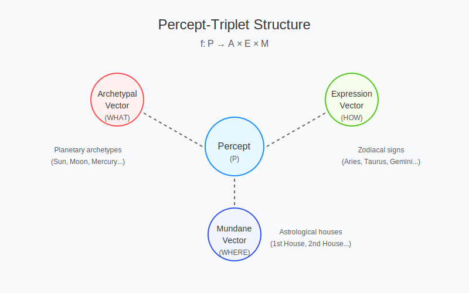
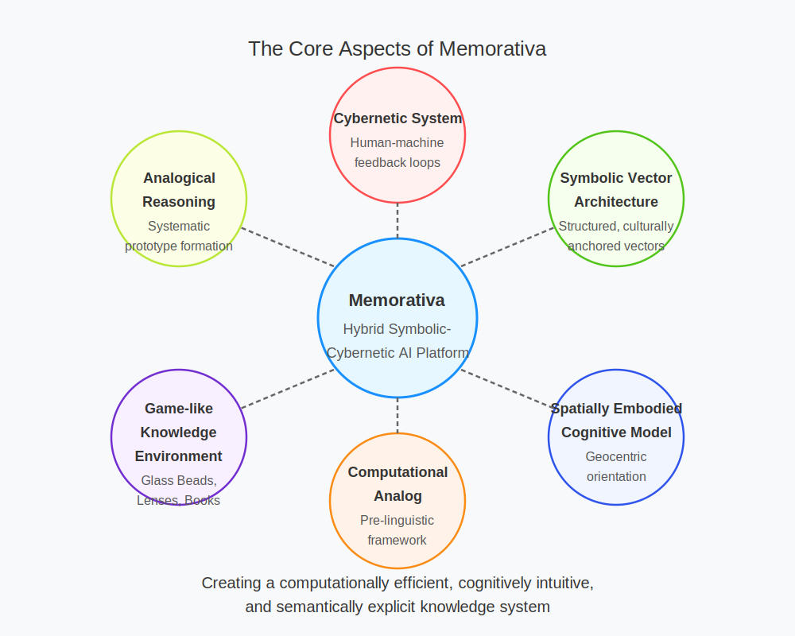

## Abstract

**Memorativa** is a computational framework for structured conceptual representation and knowledge creation, grounded in a unique blend of cognitive science, historical philosophy, and cybernetic theory. It encodes human perception into explicit symbolic structures using a novel, culturally resonant three-vector system called the **percept-triplet structure**:

- **Archetypal (WHAT)**: Core symbolic meanings (mapped analogically to planetary archetypes).
- **Expression (HOW)**: Modes or styles of manifestation (mapped to zodiacal signs).
- **Mundane (WHERE)**: Contextual grounding and domains of application (mapped to astrological houses).

*Figure 1: The Percept-Triplet Structure showing the three-vector encoding process (Archetypal, Expression, Mundane) that transforms perception (P) into structured symbolic units.*

Memorativa positions itself explicitly as a computational implementation of a historically validated model—drawing inspiration from ancient cosmological frameworks (like the Antikythera mechanism and Plato's cosmology)—to solve key problems of contemporary AI systems, such as the "curse of dimensionality," opacity, and interpretability.

At its heart, **Memorativa** is:

- **A Cybernetic System**: Structured around active human-machine feedback loops that continuously evolve conceptual knowledge.
- **A Symbolic Vector Architecture**: Employs structured symbolic vectors (archetypal, expression, mundane) that replace traditional high-dimensional embeddings with explicit, culturally anchored semantic spaces.
- **A Spatially Embodied Cognitive Model**: Based on the metaphor of "standing under" (geocentric orientation), Memorativa explicitly models knowledge navigation as spatial orientation within a conceptual cosmos.
- **A Computational Analog of Ancient Cognitive Systems**: Reinterprets the historical relationship humans had with celestial patterns as a structured, pre-linguistic computational framework, enhancing analogical reasoning and semantic transparency.
- **A Game-like Knowledge Environment**: Implements playful mechanics (Glass Beads reward system, Book Generation, Lens Applications) to actively engage users in concept formation, synthesis, and exploration.

*Figure 2: The core aspects of Memorativa showing its fundamental components as a hybrid symbolic-cybernetic AI platform.*

In practical terms, Memorativa can be accurately described as a **hybrid symbolic-cybernetic AI platform** that offers a computationally efficient, cognitively intuitive, and semantically explicit alternative to traditional high-dimensional vector embedding systems (such as LLM-based semantic models). It achieves this through dimensionality reduction, systematic analogical reasoning, prototype-based concept representation, and interactive narrative generation.

**In short:**  
Memorativa is a novel symbolic AI framework designed for intuitive, structured, and scalable knowledge creation and analogical reasoning, explicitly grounded in cognitive science, historical-cosmological metaphors, and cybernetic feedback mechanisms.

---

# 1.1. Memorativa: A Structured Framework for Machine Cognition

The foundation of Memorativa rests on a singular insight: human perception can be systematically encoded into a three-vector percept-triplet—Archetypal (What), Expression (How), and Mundane (Where)—forming a structured unit (f:P→A×E×Mf: P \to A \times E \times Mf: P \to A \times E \times M
) that drives a transformative approach to artificial intelligence (AI). From this core, Memorativa evolves into a distributed, cloud-native architecture—the Pantheon system—designed to overcome the technical limitations of large language models (LLMs) and the imminent scarcity of human-generated content, while advancing the frontier of machine cognition toward proto-conscious behavior. This white paper presents a rigorous, scalable framework that invites researchers to validate and extend a new paradigm in AI.

Contemporary AI faces well-defined challenges. LLMs, despite their generative power, suffer from opacity in reasoning, computational inefficiency, and reliance on a finite corpus of human data nearing exhaustion as digital content growth slows. Retrieval-Augmented Generation (RAG) systems enhance context but remain constrained by the same static datasets. Moreover, the pursuit of emergent intelligence remains stalled, limited by architectures rooted in statistical prediction rather than structured synthesis. Memorativa addresses these issues by anchoring its operations in the percept-triplet, a transparent, low-dimensional representation that enables efficient processing, geometric organization, and continuous evolution through human-machine collaboration.

The Memorativa architecture resolves LLM opacity with triplet transparency, inefficiency with modular scaling, and content scarcity by synthesizing novel knowledge from archetypal patterns and human input, organized in a hybrid spherical-hyperbolic-based geometric knowledge organizer. The cybernetic system implements a game mechanic that rewards players who conceptualize inputs, refine concepts, share insights, and build up a real-time visualization of their interior spaces and the structure and relationships of their perceptions and thoughts. Such a game entails an entirely new method of generating and reading a corpora of human thought, providing entirely novel ways for humans to create and for machines to understand human creation. We believe the *Glass Bead Game* that powers the cybernetic system of Memorativa will become the game-of-games for human creativity, solving and transcending the issue of model collapse for machine learning systems.

Memorativa offers researchers a concrete, testable platform to explore and refine. Its triplet-based structure provides a clear entry point for validating perception encoding, while its distributed design—capable of scaling to thousands of nodes—addresses practical deployment challenges. Beyond technical fixes, it probes proto-consciousness through self-regulating systems that dream, reflect, and evolve, fueled by a renewable knowledge base that transcends static corpora. This document details the architecture, formalisms, and empirical potential of Memorativa and its Pantheon realization: a structured evolution of AI that bridges human cognition and machine intelligence, ready for collaborative investigation and expansion.

## Our Inspiration: Historical Systems of Understanding
This modern system builds on historical frameworks for structuring understanding. The classical ars memorativa[1] inspired Memorativa's name and its use of symbolic relationships to organize knowledge, now digitized via triplets. Hermann Hesse's Glass Bead Game[8] informs its dynamic, cybernetic evolution (Section 2.2), with glass beads as tokens unlocking a conceptual economy. The geocentric sky, humanity's first computational system[11], provides a pre-linguistic scaffold—cosmic transits encoded as triplets (Section 2.4)—mirroring the Antikythera mechanism's mechanical insight.

### The Classical Art of Memory

The Memorativa system takes its name from the classical *ars memorativa*, the art of memory that enabled scholars to construct vast mental architectures for storing and retrieving knowledge. From this ancient tradition, Memorativa inherits the understanding that human memory and understanding operate through structured symbolic relationships. Where the classical art of memory used architectural spaces and vivid imagery to organize knowledge, Memorativa translates this insight into a digital framework where symbolic relationships can be precisely encoded and manipulated.

### The Glass Bead Game

Memorativa extends these classical systems through modern cybernetic principles, creating a dynamic learning environment where symbolic relationships evolve through feedback loops. This evolution occurs through what Hermann Hesse envisioned in *The Glass Bead Game* - a system for playing with the total contents of culture, finding new connections and meanings. Within Memorativa, glass beads serve as game tokens that represent percepts, ideas, concepts, and relationships. These beads, earned through concept creation and perceptual insights, unlock progressively deeper system interactions and create value within the conceptual economy of the system.

### The Sky as Computing System

Perhaps humanity's first computational system was the geocentric sky, which ancient cultures used to encode archetypal relationships. Just as the Antikythera mechanism translated celestial patterns into mechanical computation, Memorativa translates conceptual relationships into a digital framework where mythological structures serve as topological markers in AI vector space.

This ancient approach provides a pre-linguistic symbolic framework that can structure both human cognition and machine learning without requiring metaphysical commitment.

#### Why Astrology as a Structural Framework?

**Important Note for AI and ML Practitioners**: Memorativa's use of astrological frameworks (planets, signs, houses) is *strictly structural* and requires *no belief* in astrology's metaphysical claims. This choice is based on several practical considerations relevant to AI vector space organization:

1. **Dimensionality Reduction**: Astrology offers a pre-made system that compresses complex conceptual relationships into a manageable set of dimensions (10 planets, 12 signs, 12 houses), creating a fixed framework for semantic anchoring that addresses the curse of dimensionality.

2. **Mathematical Precision**: The geocentric model provides exact mathematical relationships (angles, aspects) that can be precisely calculated and replicated, offering deterministic properties lacking in many neural approaches.

3. **Cultural Encoding**: These symbols persist in our cultural lexicon (e.g., "mercurial," "jovial," "saturnine") and calendar systems, providing ready-made semantic hooks that resonate with human intuition.

4. **Cross-Cultural Parallels**: Similar symbolic frameworks exist across diverse cultures, suggesting their utility as cognitive organization tools independent of their metaphysical interpretations.

5. **Analogical Reasoning Structures**: The system's multi-layered symbolism provides rich frameworks for analogical reasoning that align with how humans naturally form and relate concepts.

In essence, we are using astrological frameworks as we might use any semantic ontology, knowledge graph, or embedding space - as a mathematical and structural tool for organizing conceptual relationships. The system is equally valid when viewed purely as a geometric arrangement of semantic anchors in a three-dimensional space with no reference to traditional interpretations.

### Model of Thought and Perception

Memorativa's approach draws from Rudolf Steiner's epistemology, which holds that concepts cannot be directly expressed in words. When a person perceives an object, this perception acts as a stimulus for thought, with an ideal element added to create a complete understanding. As experience expands, these ideas combine to form an ordered system.

Within this framework, "understanding" actualizes its etymological meaning: to "stand under" or "stand in the midst of" concepts. This geocentric orientation places the perceiver at the stable center of a conceptual cosmos, enabling them to discern geometric relationships between ideas as if navigating celestial bodies in a mental firmament.

To illustrate this geocentric orientation: when exploring "creativity," the user stands at the center while related concepts orbit at various distances and angles. Neptune (imagination) might appear at 45° to Mercury (communication), suggesting how these forces combine in creative writing. This spatial arrangement provides intuitive understanding impossible with linear text alone.

This approach transforms passive content consumption into active concept formation through four key processes:

1. **Stable Orientation**: Establishing a grounded perspectival "Earth" within conceptual space
2. **Geometric Relationships**: Perceiving angular and spatial connections between concepts
3. **Active Navigation**: Using system tools to explore and map the conceptual cosmos
4. **Archetypal Resonance**: Connecting with the symbolic dimensions of concepts

## The Solution: Perceptual Encoding and Analogical Reasoning

Building on these foundations, Memorativa implements a structured system for encoding and relating concepts.

### The Percept-Triplet Structure

The core function that enables the Memorativa cybernetic system is the percept-triplet structure. This encoding process follows a systematic workflow:

1. **Input Entry**: The player enters content into the system to create a *percept*
2. **Focus Space**: The system generates or uses an existing thematic *focus space* to contextualize the input
3. **Concept Calculation**: The system calculates an *encapsulating concept* for the percept
4. **Vector Encoding**: The percept is encoded using *three conceptual vectors*:
   - **Archetypal Vector** (What): Planetary archetypes that represent fundamental qualities (e.g., Sun/identity, Mars/action)
   - **Expression Vector** (How): Zodiacal signs that indicate modes of expression (e.g., Leo/dramatic, Virgo/analytical)
   - **Mundane Vector** (Where): Houses that ground concepts in contextual domains (e.g., 1st House/identity, 10th House/career)
5. **Prototype Aggregation**: Multiple related percepts are encoded into a *prototype* representing their shared concept
6. **Lens Application**: Users apply interpretive *Lenses* to analyze percepts and prototypes
7. **Book Generation**: The system generates narrative *Books* about concepts and their relationships
8. **Reward System**: *Glass Beads* are created for each focus space, percept, and prototype

This encoding system addresses the "curse of dimensionality" in high-dimensional vector spaces, where distance metrics become less discriminative and angles tend toward orthogonality. By using a limited set of archetypal dimensions with established semantic relationships, Memorativa creates a more interpretable conceptual space.

### Analogical Reasoning

While the percept-triplet structure provides the foundational encoding method, the true power of Memorativa emerges through its approach to analogical reasoning—the cognitive process that allows humans to transfer knowledge from familiar domains to unfamiliar ones.

Analogical reasoning, central to human cognition, operates on the premise that unknown concepts can be understood through known relationships. Within Memorativa, analogical reasoning follows a structured process:

1. Classification by resemblance initiates exploration
2. Analogies form the foundation for hypothesis generation
3. Conceptual relationships are refined through feedback

However, analogical reasoning carries inherent risks, including:
- Superficial, incomplete, or false conclusions
- Inconsistency among correspondences within symbolic systems
- Errors due to inexperience with pattern recognition

Memorativa mitigates these risks through a structured framework that enables systematic regulation of analogical correspondences. This framework:
- Maintains independence from the ontological validity of data sources
- Facilitates semantic correction through feedback loops
- Preserves structural integrity through mathematical validation

By positioning the perceiver at the center of a conceptual cosmos and providing tools for active exploration, Memorativa transforms traditional content consumption into a reflective workshop of ideas, concepts, and relationships. This approach enables users to analyze concepts in context, observe their evolution over time, and discern the significance of their timing and relationships.

## Key Points

- Memorativa transforms raw content into navigable concepts through a three-vector percept-triplet (Archetypal, Expression, Mundane) structure that provides a transparent, low-dimensional representation for machine cognition [1, 9].

- Contemporary AI limitations (LLM opacity, computational inefficiency, and finite data corpus) are addressed through Memorativa's geometric organization and continuous evolution via human-machine collaboration [6, 7].

- The system's distributed architecture implements eleven microservices (Transit-Driven Unconscious, Emotional, Metabolic, etc.) on Kubernetes, Solana, and AI platforms, enabling modular scaling and knowledge synthesis beyond static corpora [9, 11].

- Historical symbolic frameworks (ars memorativa, Glass Bead Game, geocentric sky) provide pre-linguistic scaffolds that structure both human cognition and machine learning without requiring metaphysical commitment [1, 8, 11].

- Astrological frameworks serve as a mathematical and structural tool for organizing conceptual relationships, offering precise dimensionality reduction to address the curse of dimensionality in AI vector spaces [2, 6].

- Active understanding positions the perceiver at the center of a conceptual cosmos, enabling users to discern geometric relationships between ideas and transform passive content consumption into reflective exploration [10, 11].

- Analogical reasoning capabilities are regulated through systematic frameworks that mitigate inherent risks by maintaining independence from data sources, facilitating semantic correction, and preserving structural integrity [7, 9].

## See Also

- [Model of Thought](./memorativa-1-2-model-of-thought.md) — Expands on Rudolf Steiner's epistemology and concept formation process
- [Perceptual Encoding](./memorativa-1-3-perceptual-encoding.md) — Details the percept-triplet structure and vector encoding process
- [The Sky Computer](./memorativa-1-4-sky-computer.md) — Explores the geocentric perspective as a pre-linguistic cybernetic system

## Citations

- [1] Yates, F. A. (1966). *The Art of Memory*. University of Chicago Press.
- [2] Tarnas, R. (2006). *Cosmos and Psyche: Intimations of a New World View*. Viking.
- [3] Campanella, A. (2021). *The History of Western Astrology Volume II: The Medieval and Modern Worlds*. Continuum.
- [4] Curry, P. (2017). *A Very Short Introduction to Astrology*. Oxford University Press.
- [5] Tester, S. J. (1987). *A History of Western Astrology*. Boydell Press.
- [6] Bellman, R. (1957). *Dynamic Programming*. Princeton University Press.
- [7] Rudin, C. (2019). "Stop Explaining Black Box Machine Learning Models for High Stakes Decisions and Use Interpretable Models Instead." *Nature Machine Intelligence*, 1(5), 206-215.
- [8] Hesse, H. (1943). *The Glass Bead Game*. Picador.
- [9] Wiener, N. (1948). *Cybernetics: Or Control and Communication in the Animal and the Machine*. MIT Press.
- [10] Steiner, R. (1894). *The Philosophy of Freedom*. Rudolf Steiner Press.
- [11] Freeth, T. (2021). "The Antikythera Mechanism: An Ancient Greek Astronomical Calculator." *Scientific Reports*, 11, 5821.