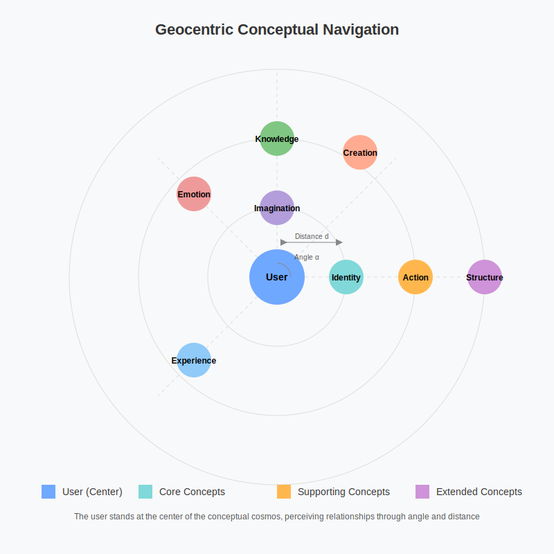

# Introduction

## 1.2. The Model of Thought

> Signs and symbols rule the world, not words nor laws.

Humans are animals who think, using both intellect and imagination. The products of thinking activity are ideas and concepts. The Memorativa application is designed to help visualize and organize ideas and concepts in ways that are fun and beneficial to humans.

To start playing with concepts, some definitions are helpful, including a working model for thought borrowed from Rudolf Steiner's *Philosophy of Freedom*[1]:

1. Concepts: What a concept is cannot be expressed in words. Words can do no more than draw our attention to the fact that we have concepts. 

2. Perceptions of objects: When someone perceives an object (e.g. a tree or a memory), the perception acts as a stimulus for thought.

3. Ideal element: An ideal element is then added to the perceived object, and the perceiver regards the object and its ideal complement as belonging together. 

4. Idea formation: The ideal counterpart remains after the object disappears from perception. This is the idea or abstraction of the object.

5. Conceptual system: Through widening experience, ideas combine to form an ordered and systematic whole.

This model of thought underpins the Memorativa cybernetic system, providing a framework for understanding how humans form and organize concepts.

### 1.2.1. Understanding as Standing Under

The word "understanding" has rich etymological resonance for the Memorativa system. By breaking it into its component parts—"under" and "standing"—we can explore how the act of understanding is related to spatial orientation.

In its original sense, to "understand" meant to "stand in the midst of" or "stand under" something, suggesting a physical positioning that allows comprehensive perception[2]. This embodied nature of understanding is reflected in Memorativa's geocentric model, where the perceiver "stands at the center" of a conceptual cosmos.

From this stable center, the perceiver can observe and navigate geometric relationships between concepts, just as ancient astronomers observed and navigated the relationships between celestial bodies.

*Figure 1: Geocentric Conceptual Navigation, showing the user positioned at the center with concepts arranged in orbital relationships, illustrating how spatial orientation facilitates comprehension of conceptual relationships through angular and distance-based organization*

This orientation transforms passive content consumption into active concept formation through four key processes:

1. **Stable Orientation**: Establishing a grounded perspectival "Earth" within conceptual space
2. **Geometric Relationships**: Perceiving angular and spatial connections between concepts
3. **Active Navigation**: Using system tools to explore and map the conceptual cosmos
4. **Archetypal Resonance**: Connecting with the symbolic dimensions of concepts

#### 1.2.1.1. Connection to the Percept-Triplet Structure

This geocentric model of understanding directly informs Memorativa's core percept-triplet structure, which encodes human perception into three vectors:

- **Archetypal Vector (WHAT)**: Core symbolic meanings that represent fundamental qualities or essences, mapped analogically to planetary archetypes
- **Expression Vector (HOW)**: Modes or styles of manifestation, mapped to zodiacal expressions
- **Mundane Vector (WHERE)**: Contextual grounding and domains of application, mapped to houses or life domains

It's important to emphasize that this use of astrological frameworks is **strictly structural** and requires no belief in their metaphysical claims. These frameworks serve as geometric semantic anchors—similar to how one might use any knowledge graph or ontology—providing dimensionality reduction, mathematical precision, and culturally resonant symbolic anchors.

### 1.2.2. Grounding in Cognitive Development

The Memorativa model of active understanding through geocentric orientation has parallels in human cognitive development[3]. Research in developmental psychology shows that:

- Physical orientation and stability are prerequisites for cognitive development in infants, with vestibular system development and postural control emerging by 6-8 months
- Spatial concepts are among the first abstract concepts children develop, with basic spatial reasoning appearing around 12-18 months
- Understanding of abstract concepts is often grounded in spatial metaphors, becoming increasingly sophisticated between 3-7 years
- Navigation of physical space provides templates for navigation of conceptual space, with mature spatial reasoning capabilities evident by 10-12 years

This developmental pattern suggests that the Memorativa approach aligns with natural cognitive processes, providing a framework that builds on innate human capacities for spatial orientation and exploration. The system's geocentric model mirrors the developmental progression from physical orientation to abstract conceptualization, offering an interface that feels intuitive because it maps to deeply embedded cognitive structures.

### 1.2.3. From Analysis to Synthesis

The Memorativa model of thought supports both analytical understanding (breaking concepts into components) and synthetic understanding (building new conceptual combinations). This dual capacity is facilitated through:

- **Analogical Reasoning**: Using structural similarities to map relationships between different conceptual domains
- **Pattern Recognition**: Identifying recurring structures across different contexts
- **Conceptual Blending**: Creating new concepts by combining aspects of existing concepts
- **Hierarchical Integration**: Relating concepts within nested levels of abstraction and specificity

These cognitive operations are supported by the system's triplet structure, which provides a framework for encoding and relating concepts across different domains.

#### 1.2.3.1. Mathematical Representation of Concept Formation

The dynamic interplay between perception, ideal elements, and concepts can be formalized mathematically as:

Concept(t+1) = f(Perception(t), Ideal(t), Concept(t))

Where:
- Concept(t+1) represents the evolved concept at the next time step
- Perception(t) is the current perceptual input
- Ideal(t) is the ideal element added to the perception
- Concept(t) is the current conceptual understanding
- f represents the synthesis function governed by the system principles of active orientation and geometric relationship

This formulation captures how concepts evolve through the continuous integration of new perceptions, ideal elements, and existing conceptual frameworks. The function f implements the specific mechanisms of the Memorativa system, including analogical reasoning, pattern recognition, and conceptual blending described above.

### 1.2.4. The Game of Concepts

To make the abstract model of thought practically accessible, Memorativa implements a game framework inspired by Hesse's Glass Bead Game[4]. This framework includes:

- **Rules**: Structured procedures for encoding and relating concepts
- **Symbols**: A coherent system of meaning-laden tokens
- **Play**: Exploratory and creative interaction with concepts
- **Rewards**: Incentives for conceptual discovery and synthesis
- **Community**: Shared conceptual exploration and collaborative understanding

The game structure transforms abstract cognitive operations into tangible activities, making active understanding both accessible and enjoyable. It enables players to:

- Encode their perceptions into the system
- Explore conceptual relationships
- Discover unexpected connections
- Create new conceptual syntheses
- Share insights with other players

### 1.2.5. Conceptual Cosmology

Just as ancient astronomers constructed models of the cosmos to navigate the physical world, Memorativa enables users to construct conceptual cosmologies to navigate the world of ideas. This approach:

- Centers the individual as the stable reference point for understanding
- Maps concepts as objects in a navigable space
- Relates concepts through angular and spatial relationships
- Combines empirical observation with systematic organization
- Evolves through new observations and insights

By providing a coherent framework for conceptual organization, Memorativa creates an internal universe of meaning that can evolve and expand through continued interaction with the system.

### 1.2.6. Principles of Operation

The operational principles of the Memorativa thought model include:

- **Perspectival Grounding**: Maintaining stable orientation from a centered perspective
- **Active Engagement**: Transforming passive reception into creative interaction
- **Spatial Reasoning**: Using geometric relationships to understand conceptual connections
- **Playful Exploration**: Employing game mechanics to encourage conceptual discovery
- **Symbolic Resonance**: Working with archetypal patterns to deepen understanding
- **Reflective Practice**: Creating a workshop for conscious concept formation
- **Systematic Organization**: Building coherent conceptual frameworks
- **Dynamic Evolution**: Allowing conceptual systems to grow and change over time

These principles create a continuous feedback loop between perception, concept formation, and active exploration—a cybernetic system for understanding.

### 1.2.7. Conceptual Cosmos

The Memorativa system creates a conceptual cosmos for each user—a structured space where ideas can be explored, related, and combined. This cosmos is:

- **Centered**: Providing a stable reference point for orientation
- **Geometric**: Organizing concepts through spatial and angular relationships
- **Symbolic**: Encoding meanings through archetypal patterns
- **Dynamic**: Evolving through new inputs and interactions
- **Personal**: Uniquely shaped by individual experience and perspective
- **Universal**: Grounded in shared cognitive structures and archetypal patterns

This balanced approach maintains both the subjective nature of understanding and the objective structure needed for communication and collaboration.

### 1.2.8. The Game of Concepts and Economic Framework

The model of thought in Memorativa is not only a cognitive framework but also the foundation for an economic system that addresses post-automation challenges. By implementing the Glass Bead Game mechanics described by Hesse[4], Memorativa creates a value-generating framework where human perception and conceptualization—activities that remain uniquely human—become the foundation for economic activity.

This economic framework addresses two critical contemporary challenges:
1. **AI Model Collapse**: The diminishing returns from training AI on increasingly exhausted static datasets
2. **Economic Displacement**: The systematic elimination of traditional employment categories through automation

Within this framework:
- **Value Creation Through Perception**: The system rewards users for encoding perceptions into the triplet structure, creating a renewable resource of structured human insight
- **Concept Refinement Markets**: Communities develop around specific focus spaces, creating specialized knowledge economies
- **Glass Beads as Tokens**: Beads function as both reputation markers and economic tokens, creating a direct correlation between conceptual contribution and economic reward

This approach positions perceptual labor and concept formation as economically valuable activities in a post-automation economy, while simultaneously addressing the technical limitations of current AI approaches through renewed sources of structured human insight.

### 1.2.9. Active Understanding vs. Passive Consumption

Modern information ecosystems often promote passive consumption of disconnected content fragments. Memorativa inverts this model by:

- Transforming content consumption into active concept formation
- Creating a reflective workshop for ideas rather than a reactive stream of content
- Enabling users to situate concepts in relation to stable reference points
- Providing tools for conscious exploration rather than algorithmic manipulation
- Cultivating an internal cosmos of concepts through spatial, relational, and archetypal understanding

This approach positions the individual as an active creator of understanding rather than a passive consumer of content, using game mechanics, symbolic frameworks, and cybernetic feedback to create a system of rewards.

### 1.2.10. Extended Analysis of Cognitive Validity

The Memorativa model of thought demonstrates strong alignment with established frameworks in contemporary cognitive science, providing a theoretical foundation grounded in empirically-validated research:

#### 1.2.10.1. Alignment with Cognitive Science Frameworks

- **Active Perception and Ideal Construction**: The Steiner-based model aligns with Barsalou's perceptual symbol systems theory[5], which emphasizes that concepts are grounded in sensorimotor experience rather than abstract symbols. This converges with Piaget's constructivist understanding of concept formation[3], where knowledge structures are actively built through interaction with the environment.

- **Spatial and Embodied Cognition**: Memorativa's geocentric orientation directly implements Lakoff and Johnson's theory that abstract concepts are understood through spatial metaphors[6]. This also corresponds with Clark's embodied mind theory[7], which positions cognition as fundamentally shaped by the body's interaction with its environment.

- **Explicit Semantic Structure**: In contrast to the implicit, statistically-inferred relationships of neural embedding models, Memorativa implements an explicit semantic structure with clearly defined dimensions. This approach aligns with Gentner's structure-mapping theory of analogy[8], which emphasizes the importance of relational structure in concept formation.

#### 1.2.10.2. Cognitive Advantages and Validation Pathways

The cognitive model offers potential advantages that can be empirically validated:

- **Enhanced Interpretability**: The explicit structure of the percept-triplet encoding enables users to understand why particular concepts are related, rather than relying on the "black box" relationships of high-dimensional vector spaces.

- **Reduced Cognitive Load**: By mapping concepts to culturally-resonant symbolic anchors in a structured space, the system potentially reduces the cognitive effort required to comprehend and navigate conceptual relationships.

- **Improved Memory and Recall**: The spatial organization of concepts corresponds to established memory techniques like the method of loci[9], suggesting potential improvements in concept retention and recall.

To further validate these cognitive benefits, future research should:

1. Conduct comparative studies with established cognitive architectures like ACT-R and SOAR to measure performance on standardized cognitive tasks
2. Develop quantitative metrics for evaluating concept navigation efficiency, creative synthesis capacity, and reasoning accuracy
3. Perform longitudinal studies tracking conceptual understanding and retention over time
4. Validate cross-cultural applicability of the symbolic frameworks through diverse user studies

This empirical validation would strengthen the cognitive foundations of the Memorativa approach while identifying areas for refinement and optimization.

### 1.2.11. Key Comparisons

| Aspect | Traditional Knowledge Systems | Conventional AI Systems | Memorativa |
|--------|--------------------------|------------------------|------------|
| Knowledge Representation | Textual documents, linear narratives | High-dimensional embeddings, latent spaces | Geocentric conceptual space with triplet structure |
| Understanding Model | Reading as passive consumption | Statistical pattern recognition | Active navigation of conceptual cosmos |
| Concept Organization | Taxonomic/hierarchical categorization | Proximity in vector space | Geometric relationships in conceptual space |
| User Position | External observer of content | Training data provider and query issuer | Centered participant in conceptual cosmos |
| Epistemological Approach | Subject-object division | Statistical inference | Subject-centered active synthesis |
| Development Pattern | Accumulation of isolated facts | Expansion of training data | Systematic building of coherent conceptual frameworks |
| Cognitive Basis | Abstract reasoning divorced from embodiment | No explicit cognitive model | Grounded in natural cognitive development and orientation |

#### 1.2.11.1. Comparison with Cognitive and AI Frameworks

| Cognitive/AI Model | Comparative Assessment with Memorativa |
|-------------------|----------------------------------------|
| **Rudolf Steiner's Epistemology** | Direct foundation for Memorativa, explicitly formalized as a step-wise cognitive process (perception → thought stimulation → ideal element → concept formation) [1]. |
| **ACT-R (Anderson)** | Both involve perceptual-cognitive integration, but ACT-R lacks explicit spatial-symbolic orientation that Memorativa provides through its geocentric model [10]. |
| **Perceptual Symbol Systems (Barsalou)** | Closely aligned; Memorativa extends Barsalou's framework with concrete formalism (triplet vectors) and explicit symbolic, cultural scaffolds [5]. |
| **Predictive Processing (Friston)** | Both leverage active, contextual cognition; Memorativa complements predictive inference with structured symbolic representation and geometric relationships [11]. |
| **Vector-Symbolic Architectures** | Memorativa's triplets function as specialized VSAs for encoding perceptual content, but with richer semantic anchoring through cultural archetypes [12]. |
| **Traditional Embeddings (Word2Vec, etc.)** | Both map concepts to vector spaces, but Memorativa uses explicit, interpretable dimensions (34 total) versus thousands of opaque dimensions [13]. |
| **Large Language Models** | LLMs use statistical prediction for understanding; Memorativa implements active concept formation through explicit structure and geocentric orientation [14]. |

### 1.2.12. Key Innovations

- **Geocentric Conceptual Model**: A novel approach to knowledge organization that positions the individual at the center of a conceptual cosmos, enabling active orientation and navigation rather than passive consumption [1, 2].

- **Active Understanding Framework**: Recontextualization of understanding as an embodied, spatial activity rather than a disembodied mental process, leveraging the etymological roots of "understanding" to create a more intuitive knowledge system [2, 3].

- **Concept Formation Game**: Implementation of systematic concept formation as a game with rules, symbols, and rewards, making abstract cognitive operations tangible and engaging while building on Hesse's Glass Bead Game concept [4].

- **Steiner-Based Epistemology Implementation**: First systematic implementation of Rudolf Steiner's epistemological model into a digital knowledge system, providing a structured framework for concept formation through the addition of ideal elements to perceptions [1].

- **Developmental-Cognitive Alignment**: Aligning the system's conceptual navigation with natural cognitive development patterns, creating an interface that builds on innate human capacities for spatial orientation and exploration [3].

### 1.2.13. Key Math

The Memorativa model of thought can be formalized mathematically using several interconnected frameworks that represent the core processes of perception, concept formation, and conceptual relationships.

#### 1.2.13.1. Perception-Concept Transformation

The fundamental process of concept formation can be expressed as a function:

$$C = f(P, I)$$

Where:
- $C$ represents a concept
- $P$ represents a perception
- $I$ represents the ideal element
- $f$ is the transformation function that combines perception and ideal element

This formulation captures Rudolf Steiner's epistemological model [1], where concepts form through the addition of an ideal element to perceptions.

#### 1.2.13.2. Conceptual System Evolution

The evolution of concepts over time can be expressed as:

$$C(t+1) = f(P(t), I(t), C(t))$$

Where:
- $C(t+1)$ represents the evolved concept at the next time step
- $P(t)$ is the current perceptual input
- $I(t)$ is the ideal element added to the perception
- $C(t)$ is the current conceptual understanding
- $f$ represents the synthesis function

This recursive formulation shows how concepts evolve through continuous integration of new perceptions, ideal elements, and existing conceptual frameworks [1].

#### 1.2.13.3. Geocentric Conceptual Space

The geometric relationships in the conceptual cosmos can be defined in a spherical coordinate system centered on the perceiver:

$$\text{Concept}_i = (r_i, \theta_i, \phi_i)$$

Where:
- $r_i$ is the radial distance from the perceiver to concept $i$ (representing conceptual distance/abstractness)
- $\theta_i$ is the azimuthal angle in the conceptual plane (representing categorical relationship)
- $\phi_i$ is the polar angle from the conceptual zenith (representing hierarchical relationship)

The angular relationships between concepts can be calculated using spherical geometry:

$$\text{Relationship}(i,j) = \arccos(\sin\phi_i\sin\phi_j\cos(\theta_i-\theta_j) + \cos\phi_i\cos\phi_j)$$

This formulation provides a mathematical basis for the "standing under" metaphor [2], positioning the perceiver at the center of a structured conceptual space.

#### 1.2.13.4. Hybrid Spherical-Hyperbolic Coordinates

To accommodate both hierarchical relationships and radial expansion, the system combines spherical coordinates with hyperbolic space using a piecewise metric:

$$ds^2 = \begin{cases}
dr^2 + r^2(d\theta^2 + \sin^2\theta d\phi^2) & \text{for } r < r_0 \\
dr^2 + r_0^2\sinh^2(r/r_0)(d\theta^2 + \sin^2\theta d\phi^2) & \text{for } r \geq r_0
\end{cases}$$

Where $r_0$ is the transition radius between spherical and hyperbolic geometry. This hybrid space allows for exponential expansion of conceptual territory while maintaining a stable center [15].

#### 1.2.13.5. Percept-Triplet Encoding

The percept-triplet structure that encodes human perception can be formalized as a mapping:

$$T: P \rightarrow A \times E \times M$$

Where:
- $T$ is the triplet encoding function
- $P$ is the space of perceptions
- $A$ is the space of archetypal vectors (dimension 10, representing planetary archetypes)
- $E$ is the space of expression vectors (dimension 12, representing zodiacal signs)
- $M$ is the space of mundane vectors (dimension 12, representing houses)

Each perception $p \in P$ is mapped to a triplet $(a, e, m) \in A \times E \times M$, creating a structured representation in a 34-dimensional space that addresses the curse of dimensionality through meaningful semantic compression [16].

#### 1.2.13.6. Game Mechanics and Value Creation

The economic value generated through concept formation can be formalized as:

$$V(p) = \alpha \cdot \text{novelty}(p) + \beta \cdot \text{coherence}(p) + \gamma \cdot \text{utility}(p)$$

Where:
- $V(p)$ is the value of a percept $p$
- $\text{novelty}(p)$ measures how the percept differs from existing concepts
- $\text{coherence}(p)$ measures how well the percept integrates with the conceptual system
- $\text{utility}(p)$ measures the practical applications of the percept
- $\alpha$, $\beta$, and $\gamma$ are weighting parameters that can be adjusted based on system goals

This value function forms the basis for the Glass Bead reward system [4], creating an economic framework for concept formation activities.

### 1.2.14. Key Points

- The Memorativa model of thought is based on **Rudolf Steiner's epistemology**, which describes how concepts form through the addition of an ideal element to perceptions [1].

- **Concept formation** follows a systematic process: perception → thought stimulation → addition of ideal element → formation of concept [1].

- "Understanding" etymologically means to "**stand under**" or "stand in the midst of" concepts, reflecting the geocentric orientation at the core of the Memorativa approach [2].

- Active understanding requires four key processes: **stable orientation**, **geometric relationships**, **active navigation**, and **archetypal resonance** [2].

- Human cognitive development follows a similar pattern to the Memorativa model: physical orientation and stability precede abstract thinking and conceptual navigation [3].

- The framework enables **analogical reasoning** by providing a structured environment for discovering and exploring conceptual relationships [8].

- By enabling users to "stand at the center" of a conceptual cosmos, Memorativa transforms passive content consumption into **active concept formation** [1, 2].

- The system's approach maintains **independence from ontological validity** of data sources while still providing useful structural relationships.

- Thought is modeled as a **dynamic interplay** between perceptions, concepts, and ideal elements, forming a systematic whole [1].

- The system emphasizes **playful engagement** with rules, symbols, and rewards to facilitate deeper conceptual understanding and active exploration [4].

### 1.2.15. Citations

- [1] Steiner, R. (1921). *The Philosophy of Freedom*. Rudolf Steiner Press.
- [2] Watkins, C. (Ed.). (2011). *The American Heritage Dictionary of Indo-European Roots*. Houghton Mifflin Harcourt.
- [3] Piaget, J. (1954). *The Construction of Reality in the Child*. Basic Books.
- [4] Hesse, H. (1943). *The Glass Bead Game*. Picador.
- [5] Barsalou, L.W. (1999). "Perceptual symbol systems." *Behavioral and Brain Sciences*, 22(4), 577-660.
- [6] Lakoff, G., & Johnson, M. (1980). *Metaphors We Live By*. University of Chicago Press.
- [7] Clark, A. (1997). *Being There: Putting Brain, Body, and World Together Again*. MIT Press.
- [8] Gentner, D., & Forbus, K. D. (2011). "Computational models of analogy." *Wiley Interdisciplinary Reviews: Cognitive Science*, 2(3), 266-276.
- [9] Yates, F. A. (1966). *The Art of Memory*. University of Chicago Press.
- [10] Anderson, J. R. (1996). *ACT: A simple theory of complex cognition*. American Psychologist, 51(4), 355-365.
- [11] Friston, K. (2010). "The free-energy principle: A unified brain theory?" *Nature Reviews Neuroscience*, 11(2), 127-138.
- [12] Kanerva, P. (2009). "Hyperdimensional computing: An introduction to computing in distributed representation with high-dimensional random vectors." *Cognitive Computation*, 1(2), 139-159.
- [13] Mikolov, T., Sutskever, I., Chen, K., Corrado, G., & Dean, J. (2013). "Distributed representations of words and phrases and their compositionality." *Advances in Neural Information Processing Systems*, 26, 3111-3119.
- [14] Brown, T. B., et al. (2020). "Language models are few-shot learners." *Advances in Neural Information Processing Systems*, 33, 1877-1901.
- [15] Krioukov, D., et al. (2010). "Hyperbolic geometry of complex networks." *Physical Review E*, 82(3), 036106.
- [16] See [Section 1.3: Perceptual Encoding](./memorativa-1-3-perceptual-encoding.md) for detailed implementation.

### 1.2.16. See Also

- [Introduction](./memorativa-1-1-introduction.md) — Provides the philosophical foundation for the Memorativa system
- [Perceptual Encoding](./memorativa-1-3-perceptual-encoding.md) — Details how the model of thought is implemented through the percept-triplet structure
- [The Sky Computer](./memorativa-1-4-sky-computer.md) — Explores the geocentric perspective as a pre-linguistic cybernetic system