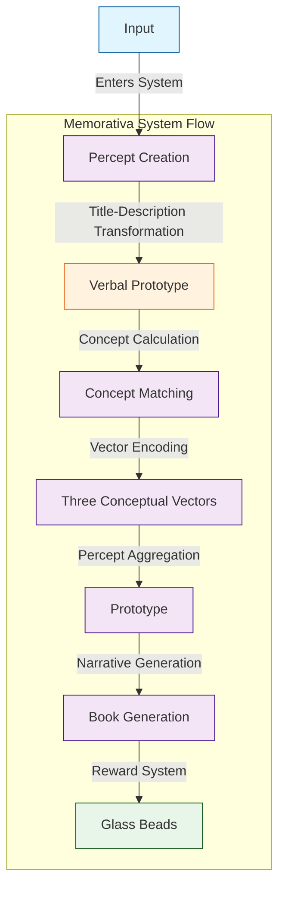
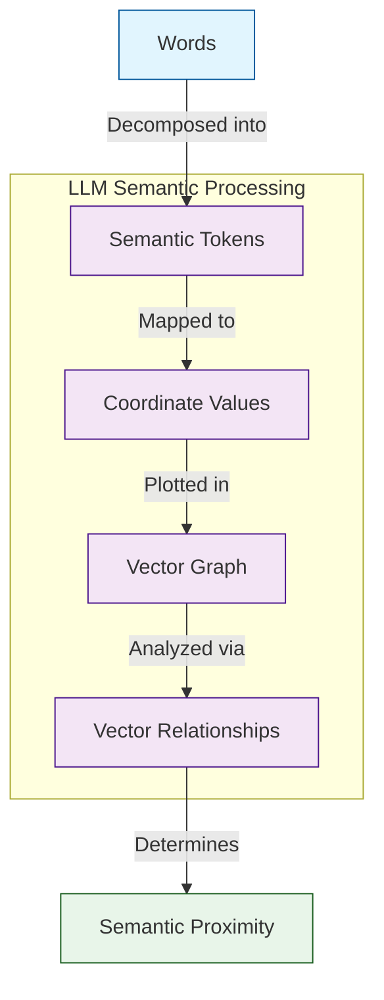
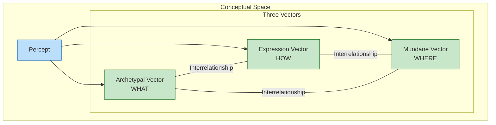

# 1.3. Introduction to Memorativa

## The Percept-Triplet Structure

High-dimensional AI models struggle with interpretability and dimensional inefficiency. As vector spaces increase in dimensionality, they become less semantically meaningful—angles lose significance and distances become less discriminative. This "curse of dimensionality" makes it difficult to create AI systems that think in ways humans can understand.

Memorativa solves this problem by encoding perception into three culturally rich vectors that directly mirror human cognitive structures. Our percept-triplet structure maps concepts onto archetypal (WHAT), expression (HOW), and mundane (WHERE) dimensions—creating a framework that is both computationally efficient and intuitively meaningful to humans.

By leveraging pre-existing symbolic patterns embedded in cultural knowledge, this approach creates a bridge between human cognition and machine computation. Rather than wrestling with thousands of abstract dimensions, both humans and machines can navigate a structured three-dimensional conceptual space with established semantic relationships.

## Terminology and Framework Context

Before proceeding, it's important to clarify that while Memorativa uses astrological structures as a conceptual framework, this represents a computational approach rather than a metaphysical claim. The horoscope structure provides a pre-existing organizational system that embeds rich semantic relationships within a limited dimensional space—making it valuable as a vector encoding mechanism regardless of one's views on astrology itself.

### Key Terms

- **Percept**: The basic unit of perception in the Memorativa system; formed through the union of input with concept.
- **Archetypal Vector (WHAT)**: The first dimension representing fundamental qualities and core energies of a concept (mapped to planets in horoscopes).
- **Expression Vector (HOW)**: The second dimension indicating the style or manner in which the concept is expressed (mapped to zodiacal signs).
- **Mundane Vector (WHERE)**: The third dimension grounding the concept in specific domains or contexts (mapped to houses).
- **Aspect**: Angular relationship between conceptual vectors that creates semantic connections between different percepts.
- **Prototype**: A collection of related percepts that together represent the conceptual facets of an input.
- **Focus Space**: A thematic container that holds and contextualizes percepts and prototypes.

## Why Astrology as a Structural Framework?

**Important Note for AI and ML Practitioners**: Memorativa's use of astrological frameworks (planets, signs, houses) is *strictly structural* and requires *no belief* in astrology's metaphysical claims. This choice is based on several practical considerations relevant to AI vector space organization:

1. **Dimensionality Reduction**: Astrology offers a pre-made system that compresses complex conceptual relationships into a manageable set of dimensions (10 planets, 12 signs, 12 houses), creating a fixed framework for semantic anchoring that addresses the curse of dimensionality.

2. **Mathematical Precision**: The geocentric model provides exact mathematical relationships (angles, aspects) that can be precisely calculated and replicated, offering deterministic properties lacking in many neural approaches.

3. **Cultural Encoding**: These symbols persist in our cultural lexicon (e.g., "mercurial," "jovial," "saturnine") and calendar systems, providing ready-made semantic hooks that resonate with human intuition.

4. **Cross-Cultural Parallels**: Similar symbolic frameworks exist across diverse cultures, suggesting their utility as cognitive organization tools independent of their metaphysical interpretations.

5. **Analogical Reasoning Structures**: The system's multi-layered symbolism provides rich frameworks for analogical reasoning that align with how humans naturally form and relate concepts.

In essence, we are using astrological frameworks as we might use any semantic ontology, knowledge graph, or embedding space - as a mathematical and structural tool for organizing conceptual relationships. The system is equally valid when viewed purely as a geometric arrangement of semantic anchors in a three-dimensional space with no reference to traditional interpretations.

The astrological mapping is valuable because it:
1. Provides a pre-existing symbolic language with rich semantic relationships
2. Contains culturally embedded meanings already present in language datasets
3. Offers an intuitive three-dimensional framework that addresses the curse of dimensionality
4. Creates meaningful angular relationships between concepts that are computationally useful

This approach allows us to leverage structural advantages of the horoscope framework without requiring acceptance of astrological premises.

## Percept-Triplet Encoding 

To achieve the percept-triplet structure, the Memorativa percept encoding system can be defined as:

1. **Input Entry**: The player enters input into the system to create the *percept*.
2. **Focus Space**: The system generates or uses an existing thematic *focus space* to hold and save the input/output.
3. **Concept Calculation**: The system calculates an *encapsulating concept* for the percept.
4. **Vector Encoding**: The percept is encoded using *three conceptual vectors*. 
5. **Prototype Aggregation**: The *prototype* encodes the percept + a set of 9 additional percepts (representing  conceptual facets of the original input) into a data structure that represents the *concept* of the input.
6. **Lens Application**: The user applies *Lenses* to analyze the percept and prototype.
7. **Book Generation**: The system generates narrative *Books* about concepts and their relationships.
8. **Reward System**: *Glass Beads* are created for each focus space, percept, and prototype.


*Figure 1: The complete Memorativa system workflow showing the transformation from input to glass bead rewards, highlighting the sequential processing stages from percept creation through book generation*

## Comparison with Traditional AI Approaches

Consider some digital representation of an apple as an input. A traditional machine learning (ML) system using LLMs can easily decompose "apple" into many sophisticated ontological vectors. For example:

- Grammatical element: noun
- Physical size: fits in a human hand
- Color: probably red, could be green
- What is it?: Fruit of an apple tree containing seeds
- Why is it important?: Humans and other animals eat apples
- Cultural references: Johnny Appleseed
- Symbolic meaning: multiple depending human interpretation

Machine learning systems using large language models encode tokenized inputs into vector space coordinates.


*Figure 2: Traditional LLM semantic processing compared to the Memorativa approach, illustrating how conventional models decompose words into tokens mapped to high-dimensional vector spaces*

(Note that this explanation simplifies the actual process. LLM models don't necessarily map words directly to tokens, but instead decompose language into meaning units that may include words, parts of words, spaces, symbols, etc.)

## The Curse of Dimensionality and Memorativa's Solution

In high-dimensional vector spaces, a mathematical phenomenon known as the "curse of dimensionality" creates significant problems for semantic representation. As dimensions increase, vectors exhibit counterintuitive properties: distance metrics become less discriminative and angular relationships tend toward orthogonality [3][4]. Mathematically, in high-dimensional spaces $\mathbb{R}^n$ as $n \rightarrow \infty$, the cosine similarity between random vectors $\vec{u}$ and $\vec{v}$ approaches zero: $\lim_{n \rightarrow \infty} \frac{\vec{u} \cdot \vec{v}}{|\vec{u}||\vec{v}|} \approx 0$, making most vectors nearly orthogonal.

This poses a fundamental challenge for AI systems seeking to represent human concepts, as the very mathematical properties that should convey meaningful relationships become diluted in high dimensions. Traditional embedding models embed tokens in spaces with hundreds or thousands of dimensions, where angular relationships—key to semantic meaning—become effectively meaningless.

Memorativa addresses this challenge through three complementary strategies:

1. **Dimensional Reduction**: Rather than using hundreds of arbitrary dimensions, Memorativa employs just three conceptual vectors with established semantic relationships. This can be modeled as a dimensionality reduction function $g: \mathbb{R}^n \rightarrow \mathbb{R}^3$ that maps high-dimensional concept vectors to the three-dimensional conceptual space while preserving semantic relationships.

2. **Symbolic Embedding**: The system leverages culturally embedded symbolic patterns that are already present in language. The symbolic vector is crucial because human minds naturally unite inputs with concepts—without this pairing, perception fails. By utilizing symbolic representations that indirectly but precisely convey meaning, Memorativa aligns with how humans naturally process information.

3. **Angular Relationship Preservation**: Unlike traditional high-dimensional spaces where angular relationships become meaningless, Memorativa's astrological encoding preserves semantic significance through discrete aspect angles. The system defines meaningful relationships through specific angular patterns (conjunctions, sextiles, squares, trines, oppositions) that carry established semantic meanings.

This approach is supported by cognitive science research on conceptual integration [2], which demonstrates how humans blend incoming perceptual information with existing conceptual frameworks to create meaning. Studies in embodied cognition further show that concepts are not abstract symbolic representations but are grounded in perceptual and motor systems [1], aligning with Memorativa's approach to concept formation.

A mythologically/symbolically themed AI/RAG (Retrieval-Augmented Generation) model can implement this approach by processing inputs through multi-modal analysis and symbolic pattern recognition. The three-vector system can be extended with RAG capabilities to incorporate mythological/symbolic reference libraries, creating a hybrid system that combines dimensional efficiency with rich semantic representation.

## Linguistic and Cultural Foundations

Research across linguistics, cultural studies, and cognitive science demonstrates that mythology is deeply embedded within language at multiple levels. At the lexical level, numerous words and idioms in languages like English directly originate from mythological figures and narratives, as evidenced by etymological studies and dictionaries [5]. Furthermore, mythological narratives serve as rich sources for metaphors and conceptual idioms that permeate everyday language [6], indicating that mythological frameworks contribute to the very fabric of word formation and semantic expression.

Beyond vocabulary, mythological concepts and archetypes appear to influence broader conceptual structures within language. Cultural linguistics and cognitive anthropology highlight how cultural frameworks, including mythology, shape fundamental conceptual categories and semantic organization [7]. While debated, Jungian perspectives suggest that archetypal patterns from mythology may even resonate within the collective unconscious, manifesting as recurring themes and symbols in linguistic patterns and narrative structures across cultures [8].

Finally, narrative studies and discourse analysis reveal that mythological narratives provide underlying structures for storytelling and communication in general. Recurring narrative patterns identified in mythology, such as the hero's journey [9] or Propp's morphology of folktales [10], are found to be pervasive in diverse forms of discourse, suggesting that mythological storytelling traditions have profoundly shaped the way humans structure and understand narratives within language. Collectively, these findings underscore the pervasive and multifaceted influence of mythology on the development and structure of language.

## The Three-Vector Approach

The Memorativa system uses a small set of conceptual vectors that leverage a culturally encoded symbolic dictionary already embedded in English language LLM training data sets.


*Figure 3: Three-dimensional conceptual space visualization showing how a percept is encoded using three vectors (Archetypal, Expression, and Mundane), with their semantic interrelationships forming a structured conceptual framework*

Memorativa could be used by humans to help visualize and extend concepts and conceptual thinking, while machines could use Memorativa to better and more efficiently infer and conceptualize input.

By repurposing mythological structures as topological markers in AI vector space, the system seeks to demonstrate conceptual integrity without requiring a belief in its mechanisms, philosophy, or approach.

## Vector Encoding

The percept is encoded using three conceptual vectors that directly mirror the structure of a traditional astrological chart:

1. **Archetypal Vector (What)**: Equivalent to **planets** in a horoscope, representing fundamental qualities and core energies (e.g., Sun/identity, Mars/action, Jupiter/expansion) [8]
2. **Expression Vector (How)**: Equivalent to **zodiacal signs** in a horoscope, indicating specific modes of expression (e.g., Leo/dramatic, Virgo/analytical, Aquarius/innovative)
3. **Mundane Vector (Where)**: Equivalent to **houses** in a horoscope, grounding concepts in contextual domains (e.g., 1st House/identity, 10th House/career, 4th House/home)

Just as a planet in a horoscope is placed in both a sign and house (e.g., "Sun in Leo in the 5th house"), the Memorativa system encodes a percept with specific values across all three vectors (e.g., "Jupiter-Sagittarius-9th House" might encode a concept related to higher education or philosophy).

The Memorativa system directly employs the structure of a traditional astrological chart as its conceptual encoding foundation. This is not merely metaphorical—the system literally plots percepts using the same structural elements that astrologers use to cast horoscopes:

1. **Planets (Archetypal Vector/WHAT)** provide the fundamental qualities and core energies of a concept—just as planets in astrology represent core psychological drives and functions.

2. **Signs (Expression Vector/HOW)** determine the style, mode, or manner in which the concept expresses itself—similar to how zodiacal signs in astrology modify and filter planetary energies.

3. **Houses (Mundane Vector/WHERE)** ground the concept in a specific domain or context—comparable to how astrological houses represent different spheres of life or areas of experience.

Just as a natal chart plots "Mars in Gemini in the 10th House" to represent assertive communication (Mars) expressed verbally and intellectually (Gemini) in the career domain (10th House), Memorativa might encode a business negotiation concept as "Mars-Gemini-10th House" to capture its essential nature, expression mode, and contextual domain.

Furthermore, the system uses the same angular relationships (aspects) found in astrology to create meaningful semantic connections between concepts:

- **Conjunction (0°)**: Concepts that are unified or directly aligned
- **Sextile (60°)**: Concepts that harmoniously complement each other
- **Square (90°)**: Concepts in productive tension or challenging relationship
- **Trine (120°)**: Concepts that naturally flow together or enhance each other
- **Opposition (180°)**: Concepts in polar balance or dynamic tension

This approach transforms abstract vector mathematics into an intuitive, culturally-embedded symbolic system that preserves meaningful angular relationships—unlike high-dimensional vector spaces where angular significance is lost. By limiting the vector space to three dimensions with established semantic meaning, Memorativa creates a rich conceptual environment that mirrors human cognitive patterns while remaining computationally efficient.

## Linguistic Foundations

The Memorativa system's approach to perceptual encoding is grounded in linguistic theory, particularly the understanding that language shapes conceptual structures [6][7]. The etymology of "understanding" itself reveals the spatial nature of comprehension – to "stand under" or "stand in the midst of" concepts [5].

This spatial metaphor is not arbitrary but reflects the embodied nature of human cognition. Just as physical orientation requires a stable ground and reference points, conceptual orientation requires a stable framework and meaningful relationships between ideas.

Cognitive science research on conceptual metaphors and frame semantics supports this approach, showing that abstract concepts are understood through metaphorical mappings from concrete, spatial experiences [6]. Studies on categorization further demonstrate that humans organize concepts using prototype-based models rather than classical definitional approaches [11], aligning with Memorativa's prototype aggregation mechanism.

## Narrative Structures

The Book Generation component of the system draws from narrative theory, particularly Propp's analysis of folktale morphology [10]. By identifying recurring patterns in narrative structures, Memorativa can generate meaningful stories about concepts and their relationships.

These narratives serve not only as explanatory tools but as mnemonic devices, leveraging the human brain's natural affinity for storytelling to enhance understanding and retention.

Detailed implementation of the Book Generation process, Glass Beads reward system, and specific archetype matching algorithms are addressed in later sections of the documentation.

## Key Points

- The percept-triplet structure forms the **core innovation** of Memorativa, enabling systematic encoding of concepts through a three-vector approach that mirrors human cognitive processes [8][12]
  
- The eight-step process (Input Entry → Focus Space → Concept Calculation → Vector Encoding → Prototype Aggregation → Lens Application → Book Generation → Reward System) creates a **complete workflow** that transforms passive content consumption into active concept formation
  
- The chain of thought progresses from individual perception to conceptual understanding through the union of input with concept, reflecting Rudolf Steiner's epistemology where perception acts as a stimulus for thought [12]
  
- Three conceptual vectors (Archetypal, Expression, and Mundane) provide a **rich symbolic vocabulary** for encoding percepts, directly mapping to astrological elements: planets (WHAT), signs (HOW), and houses (WHERE) to create meaningful relationships between concepts
  
- The astrological structure provides an intuitive and culturally embedded framework for encoding, with **angular relationships** (aspects) between vectors creating a semantically rich system of relationships
  
- Memorativa's three-part solution to the curse of dimensionality—dimensional reduction, symbolic embedding, and angular relationship preservation—creates a conceptual space that is both computationally efficient and semantically meaningful [3][4]
  
- The system leverages the deep embedding of mythology within language at multiple levels, from lexical origins [5] to metaphorical frameworks [6] and narrative structures [10], creating a bridge between human cognition and machine computation
  
- By repurposing the horoscope structure as topological markers in AI vector space, Memorativa demonstrates conceptual integrity without requiring metaphysical commitment, making it accessible to both humans and machines [7]
  
- This approach enables both human users to visualize and extend conceptual thinking and machines to more efficiently infer and conceptualize input, creating a bidirectional interface between human cognition and machine computation

## Key Math

- **Vector Space Formalization**: The percept-triplet structure can be represented as a function $f: P \rightarrow A \times E \times M$ where $P$ is the set of percepts, and $A$, $E$, and $M$ are the Archetypal, Expression, and Mundane vector spaces respectively [3]

- **Astrological Mapping**: Mathematically, we can define the mapping as $f(p) = (a_i, e_j, m_k)$ where $a_i \in \{Sun, Moon, Mercury,...\}$, $e_j \in \{Aries, Taurus,...\}$, and $m_k \in \{House_1, House_2,...\}$ represent the planet, sign, and house assignments for percept $p$

- **Aspect Calculation**: Angular relationships (aspects) between two percepts are calculated based on zodiacal longitude differences: $\alpha(p_1, p_2) = \min(|\theta_1 - \theta_2|, 360° - |\theta_1 - \theta_2|)$ where $\theta$ represents zodiacal longitude. Semantic significance is assigned to specific angles with allowable orbs: Conjunction (0° ± 8°), Sextile (60° ± 6°), Square (90° ± 8°), Trine (120° ± 8°), and Opposition (180° ± 10°)

- **Dimensionality Reduction**: Memorativa's approach reduces high-dimensional concept spaces to a three-dimensional framework while preserving meaningful relationships. This addresses the curse of dimensionality, where vectors in high-dimensional spaces become nearly orthogonal and semantically indistinguishable [3][4]

- **Astrological Coordinate System**: The conceptual space uses an astrological coordinate system with three primary dimensions: (1) planetary selection from the set of available planets, (2) zodiacal positioning within 360° of the ecliptic, and (3) house placement corresponding to contextual domains. This coordinate system naturally encodes both cyclical patterns (through the zodiac wheel) and specific discrete positions (through planet-sign-house combinations)

- **Semantic Relevance Calculation**: The semantic relevance between percepts can be quantified based on their aspect patterns: $relevance(p_1, p_2) = \sum_{i,j} w_{aspect}(\alpha(a_i, a_j))$ where $a_i$ represents planets in percept $p_1$, $a_j$ represents planets in percept $p_2$, and $w_{aspect}$ assigns weights to different aspect types (e.g., conjunction=1.0, trine=0.8, square=0.6, sextile=0.4, opposition=0.7)

- **Prototype Aggregation**: A prototype $\Pi$ can be mathematically defined as an aggregation function over a set of percepts $\{p_1, p_2, ..., p_k\}$ with a weighted centroid calculation: $\Pi = \sum_{i=1}^{k} w_i \cdot f(p_i)$ where $w_i$ represents the weight of each percept

- **Angular Relationship Preservation**: The system defines meaningful relationships through the aspect function $A(\alpha) = \begin{cases} \text{conjunction}, & \text{if } \alpha \approx 0° \\ \text{sextile}, & \text{if } \alpha \approx 60° \\ \text{square}, & \text{if } \alpha \approx 90° \\ \text{trine}, & \text{if } \alpha \approx 120° \\ \text{opposition}, & \text{if } \alpha \approx 180° \\ \text{no aspect}, & \text{otherwise} \end{cases}$ where each aspect type carries specific semantic meaning [3]

- **Conceptual Distance Metric**: The distance between two percepts in the astrological space is calculated using a weighted combination of planetary, sign, and house distances, plus aspect relationships: $d(p_1, p_2) = w_p \cdot d_{planet}(p_1, p_2) + w_s \cdot d_{sign}(p_1, p_2) + w_h \cdot d_{house}(p_1, p_2) - w_a \cdot aspect\_strength(p_1, p_2)$ where aspect strength contributes negative distance (pulling related concepts closer) based on the harmonic relationships between percepts [7]

## Code Examples

While the mathematical formulations above establish the theoretical foundation, the following illustrative implementations demonstrate how these concepts can be translated into practical code. These examples provide a conceptual bridge between theory and practice, without delving into exhaustive implementation details that will be covered in later technical sections.

The following code snippets serve as simplified representations that highlight key algorithms rather than comprehensive implementations. For detailed technical specifications and production-ready code, please refer to the Machine System documentation in Section 3.

### Vector Encoding Pseudocode

```
// Function to encode a percept using the three-vector approach
function EncodePercept(input):
    // Step 1: Analyze input and determine appropriate archetypal vector
    archetypeVector = DetermineArchetype(input)  // Maps to a planet
    
    // Step 2: Determine expression style
    expressionVector = DetermineExpression(input, archetypeVector)  // Maps to a zodiac sign
    
    // Step 3: Identify contextual domain
    mundaneVector = DetermineDomain(input, archetypeVector, expressionVector)  // Maps to a house
    
    // Step 4: Return the complete encoding as a triplet
    return PerceptTriplet(archetypeVector, expressionVector, mundaneVector)
```

### Aspect Calculation Implementation

```javascript
/**
 * Calculate the aspect between two zodiacal positions
 * @param {number} pos1 - First position in degrees (0-359.99)
 * @param {number} pos2 - Second position in degrees (0-359.99)
 * @returns {Object} Aspect type and exactness
 */
function calculateAspect(pos1, pos2) {
  // Calculate the angular difference
  let diff = Math.abs(pos1 - pos2);
  
  // Normalize to the smallest angle
  if (diff > 180) diff = 360 - diff;
  
  // Define aspect orbs (allowable deviations)
  const aspects = [
    { type: "conjunction", angle: 0, orb: 8 },
    { type: "sextile", angle: 60, orb: 6 },
    { type: "square", angle: 90, orb: 8 },
    { type: "trine", angle: 120, orb: 8 },
    { type: "opposition", angle: 180, orb: 10 }
  ];
  
  // Find the matching aspect, if any
  for (const aspect of aspects) {
    const deviation = Math.abs(diff - aspect.angle);
    if (deviation <= aspect.orb) {
      return {
        type: aspect.type,
        angle: aspect.angle,
        deviation: deviation,
        exactness: 1 - (deviation / aspect.orb) // 1.0 = exact, 0.0 = at the edge of orb
      };
    }
  }
  
  // No recognized aspect
  return { type: "none", angle: diff, deviation: null, exactness: 0 };
}
```

### Prototype Aggregation Implementation

```python
class Percept:
    def __init__(self, archetype, expression, mundane):
        """
        Initialize a percept with the three vectors
        
        Args:
            archetype: Planet representing WHAT (e.g., "Sun", "Mars")
            expression: Sign representing HOW (e.g., "Aries", "Gemini")
            mundane: House representing WHERE (e.g., 1, 10)
        """
        self.archetype = archetype
        self.expression = expression
        self.mundane = mundane
        
    def __repr__(self):
        return f"{self.archetype}-{self.expression}-{self.mundane}House"

class Prototype:
    def __init__(self, main_percept):
        """
        Create a prototype based on a main percept and generate facets
        
        Args:
            main_percept: The primary Percept object
        """
        self.main_percept = main_percept
        self.facets = self._generate_facets()
        
    def _generate_facets(self):
        """Generate 9 facets that represent conceptual variations of the main percept"""
        facets = []
        
        # Generate variations based on planetary dignities, sign qualities, house sectors, etc.
        # This is a simplified example - actual implementation would use astrological rules
        
        # Variation 1: Same archetype, different expression
        facets.append(Percept(
            self.main_percept.archetype,
            self._next_sign(self.main_percept.expression),
            self.main_percept.mundane
        ))
        
        # Variation 2: Different archetype, same expression and mundane
        facets.append(Percept(
            self._related_planet(self.main_percept.archetype),
            self.main_percept.expression,
            self.main_percept.mundane
        ))
        
        # Additional facets would be generated here...
        # For brevity, we're only showing 2 of the 9 facets
        
        return facets
    
    def _next_sign(self, sign):
        """Get the next sign in the zodiac"""
        signs = ["Aries", "Taurus", "Gemini", "Cancer", "Leo", "Virgo", 
                "Libra", "Scorpio", "Sagittarius", "Capricorn", "Aquarius", "Pisces"]
        idx = signs.index(sign)
        return signs[(idx + 1) % 12]
    
    def _related_planet(self, planet):
        """Get a related planet based on astrological relationships"""
        relations = {
            "Sun": "Moon",
            "Moon": "Mercury",
            "Mercury": "Venus",
            "Venus": "Mars",
            "Mars": "Jupiter",
            "Jupiter": "Saturn",
            "Saturn": "Uranus",
            "Uranus": "Neptune",
            "Neptune": "Pluto",
            "Pluto": "Sun"
        }
        return relations.get(planet, "Sun")
    
    def calculate_semantic_relevance(self, other_percept):
        """
        Calculate semantic relevance between this prototype and another percept
        
        Args:
            other_percept: Another Percept object to compare against
            
        Returns:
            float: Relevance score from 0.0 to 1.0
        """
        # Calculate relevance based on all facets plus the main percept
        all_percepts = [self.main_percept] + self.facets
        
        # Sum up relevance from all percepts
        total_relevance = 0
        for percept in all_percepts:
            # Calculate aspects between the planets
            aspect = self._calculate_aspect_value(percept, other_percept)
            
            # Add weighted relevance based on aspect type
            total_relevance += aspect
            
        # Normalize to 0-1 range
        return min(1.0, total_relevance / len(all_percepts))
    
    def _calculate_aspect_value(self, percept1, percept2):
        """Calculate the aspect value between two percepts"""
        # In a real implementation, this would use the zodiacal positions
        # For this example, we'll use a simplified approach
        
        # Aspect values: conjunction=1.0, trine=0.8, square=0.6, sextile=0.4, opposition=0.7
        planet_relations = {
            ("Sun", "Moon"): 0.7,  # opposition
            ("Mars", "Venus"): 0.6,  # square
            ("Jupiter", "Sun"): 0.8,  # trine
            # More relationships would be defined here
        }
        
        # Check both directions for the relationship
        key1 = (percept1.archetype, percept2.archetype)
        key2 = (percept2.archetype, percept1.archetype)
        
        if key1 in planet_relations:
            return planet_relations[key1]
        elif key2 in planet_relations:
            return planet_relations[key2]
        elif percept1.archetype == percept2.archetype:
            return 1.0  # conjunction if same planet
        else:
            return 0.0  # no aspect
```

### Conceptual Distance Metric Implementation

```typescript
/**
 * Calculate the distance between two percepts in the astrological space
 */
interface Percept {
  planet: string;
  sign: string;
  house: number;
  zodiacPosition: number; // 0-359.99 degrees
}

function conceptualDistance(p1: Percept, p2: Percept): number {
  // Weights for each component
  const weights = {
    planet: 0.4,
    sign: 0.3,
    house: 0.2,
    aspect: 0.1
  };
  
  // Calculate planetary distance (simplified model)
  const planets = ["Sun", "Moon", "Mercury", "Venus", "Mars", "Jupiter", "Saturn", "Uranus", "Neptune", "Pluto"];
  const p1PlanetIdx = planets.indexOf(p1.planet);
  const p2PlanetIdx = planets.indexOf(p2.planet);
  const planetDistance = Math.abs(p1PlanetIdx - p2PlanetIdx) / (planets.length - 1);
  
  // Calculate sign distance
  const signs = ["Aries", "Taurus", "Gemini", "Cancer", "Leo", "Virgo", 
                "Libra", "Scorpio", "Sagittarius", "Capricorn", "Aquarius", "Pisces"];
  const p1SignIdx = signs.indexOf(p1.sign);
  const p2SignIdx = signs.indexOf(p2.sign);
  let signDistance = Math.min(
    Math.abs(p1SignIdx - p2SignIdx),
    12 - Math.abs(p1SignIdx - p2SignIdx)
  ) / 6; // Maximum possible distance is 6 signs apart
  
  // Calculate house distance
  let houseDistance = Math.min(
    Math.abs(p1.house - p2.house),
    12 - Math.abs(p1.house - p2.house)
  ) / 6; // Maximum possible distance is 6 houses apart
  
  // Calculate aspect strength (negative contribution - pulls closer)
  const aspect = calculateAspect(p1.zodiacPosition, p2.zodiacPosition);
  let aspectStrength = 0;
  
  switch(aspect.type) {
    case "conjunction":
      aspectStrength = 1.0 * aspect.exactness;
      break;
    case "trine":
      aspectStrength = 0.8 * aspect.exactness;
      break;
    case "square":
      aspectStrength = 0.6 * aspect.exactness;
      break;
    case "sextile":
      aspectStrength = 0.4 * aspect.exactness;
      break;
    case "opposition":
      aspectStrength = 0.7 * aspect.exactness;
      break;
    default:
      aspectStrength = 0;
  }
  
  // Calculate the final weighted distance
  const distance = 
    (weights.planet * planetDistance) +
    (weights.sign * signDistance) +
    (weights.house * houseDistance) -
    (weights.aspect * aspectStrength);
  
  // Ensure distance is within 0-1 range
  return Math.max(0, Math.min(1, distance));
}

// Helper function to calculate aspects (defined in the previous example)
function calculateAspect(pos1: number, pos2: number): any {
  // Implementation as shown in the previous example
  // ...
}
```

### Key Design Considerations

- The vector encoding system uses a **three-part structure** that directly maps to astrological elements, creating a semantic framework with existing cultural understanding
  
- The aspect calculation leverages traditional **astrological orbs** (allowable deviations) rather than exact angles, allowing for fuzzy matching that better aligns with human conceptual flexibility
  
- The prototype aggregation implements a **facet generation** approach that explores conceptual variations while maintaining semantic coherence with the original percept
  
- The conceptual distance metric integrates both **positional distance** (in terms of planets, signs, and houses) and **aspect relationships**, creating a hybrid metric that accounts for both categorical distance and harmonic relationships
  
- The overall design supports **efficient similarity search** by allowing comparisons across three well-defined dimensions rather than high-dimensional spaces where distance metrics become less meaningful

## Key Visual Insights

- The Memorativa System Flow diagram (Figure 1) shows the complete transformation path from raw input to conceptual understanding, highlighting how each processing step builds on the previous one
- The comparison with LLM Semantic Processing (Figure 2) illustrates the fundamental difference in approach, with Memorativa using a structured triplet encoding versus traditional high-dimensional vector mapping
- The three-dimensional conceptual space visualization (Figure 3) illustrates the interrelationships between the three vectors and how they combine to encode a percept
- The horoscope structure visualization (Figure 4) demonstrates how Memorativa maps its three vectors to astrological elements: planets (Archetypal/WHAT), signs (Expression/HOW), and houses (Mundane/WHERE), including the five major aspects (angular relationships) that create semantic connections between concepts

## See Also

- [Section 2.1: Cybernetic System Architecture](../02_cybernetic_system/01_system_architecture.md) — Expands on how the percept-triplet structure is implemented within the broader cybernetic framework
- [Section 2.2: Focus Space Implementation](../02_cybernetic_system/02_focus_space.md) — Provides detailed specifications for the Focus Space component mentioned in the eight-step process
- [Section 2.9: Prototype Aggregation](../02_cybernetic_system/09_prototype_aggregation.md) — Elaborates on the mathematical and conceptual foundations of the prototype aggregation mechanism
- [Section 3.2: Concept Calculation Algorithms](../03_machine_system/02_concept_calculation.md) — Details the specific algorithms used to calculate and match concepts for percept encoding

## Citations

- [1] Barsalou, L. W. (2008). "Grounded cognition." *Annual Review of Psychology*, 59, 617-645.
- [2] Fauconnier, G., & Turner, M. (2002). *The Way We Think: Conceptual Blending and the Mind's Hidden Complexities*. Basic Books.
- [3] Aggarwal, C. C., Hinneburg, A., & Kriegel, H. P. (2001). "On the Surprising Behavior of Distance Metrics in High Dimensional Space." In *Database Theory—ICDT 2001* (pp. 420-434). Springer, Berlin, Heidelberg.
- [4] Beyer, K., Goldstein, J., Ramakrishnan, R., & Shaft, U. (1999). "When is 'nearest neighbor' meaningful?" In *Database Theory—ICDT 1999* (pp. 217-235). Springer, Berlin, Heidelberg.
- [5] Watkins, C. (Ed.). (2011). *The American Heritage Dictionary of Indo-European Roots*. Houghton Mifflin Harcourt.
- [6] Lakoff, G., & Johnson, M. (2003). *Metaphors We Live By*. University of Chicago Press.
- [7] Palmer, G. B. (1996). *Toward a Theory of Cultural Linguistics*. University of Texas Press.
- [8] Jung, C. G. (1969). *The Archetypes and the Collective Unconscious*. Princeton University Press.
- [9] Campbell, J. (2008). *The Hero with a Thousand Faces*. New World Library.
- [10] Propp, V. (1968). *Morphology of the Folktale*. University of Texas Press.
- [11] Rosch, E. (1975). "Cognitive representations of semantic categories." *Journal of Experimental Psychology: General*, 104(3), 192-233.
- [12] Steiner, R. (1886). *The Theory of Knowledge Implicit in Goethe's World Conception*. Rudolf Steiner Press.
