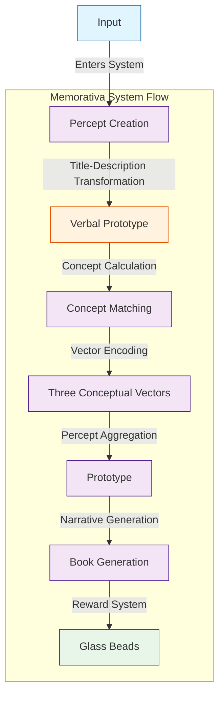
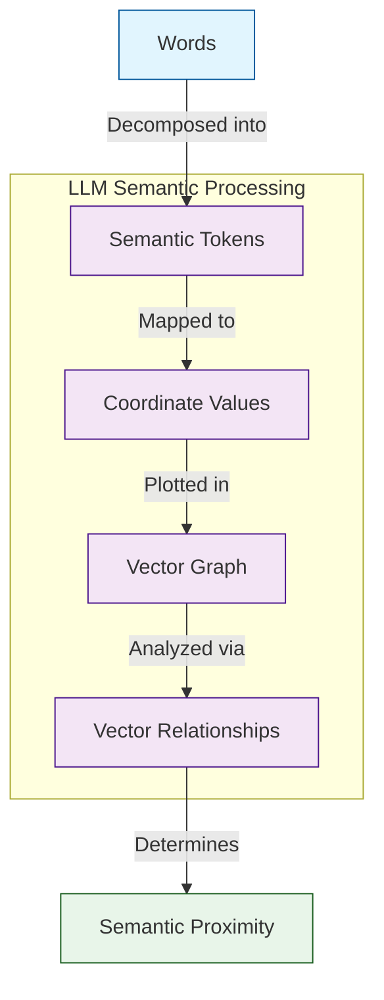

# 1.3. Perceptual Encoding

The core function that enables the entirety of the Memorativa cybernetic system is the innovation of the percept-triplet structure.

To achieve the percept-triplet structure, the Memorativa percept encoding system can be defined as:

1. **Input Entry**: The player enters input into the system to create the *percept*.
2. **Focus Space**: The system generates or uses an existing thematic *focus space* to hold and save the input/output.
3. **Concept Calculation**: The system calculates an *encapsulating concept* for the percept.
4. **Vector Encoding**: The percept is encoded using *three conceptual vectors*.
5. **Prototype Aggregation**: The *prototype* encodes multiple percepts into a data structure that represents the concept of the percept.
6. **Lens Application**: The user applies *Lenses* to analyze the percept and prototype.
7. **Book Generation**: The system generates narrative *Books* about concepts and their relationships.
8. **Reward System**: *Glass Beads* are created for each focus space, percept, and prototype.

Consider some digital representation of an apple as an input. A traditional machine learning (ML) system using LLMs can easily decompose "apple" into many sophisticated ontological vectors. For example:

- Grammatical element: noun
- Physical size: fits in a human hand
- Color: probably red, could be green
- What is it?: Fruit of an apple tree containing seeds
- Why is it important?: Humans and other animals eat apples
- Cultural references: Johnny Appleseed
- Symbolic meaning: multiple depending human interpretation

Machine learning systems using large language models encode tokenized inputs into vector space coordinates.

(Note that this explanation simplifies the actual process. LLM models don't necessarily map words directly to tokens, but instead decompose language into meaning units that may include words, parts of words, spaces, symbols, etc.)

 In high-dimensional vector spaces, a phenomenon related to the "curse of dimensionality" causes vectors to exhibit counterintuitive distance and angular properties[1][8], where distance metrics become less discriminative and angles tend toward orthogonality. By using a limited set of archetypal dimensions with established semantic relationships, Memorativa creates a more interpretable conceptual space.

The symbolic vector is important for representing perceptions because the human mind seeks to unite each input with a concept. Without an enjoining concept, perception fails. Symbols, which indirectly but precisely convey meaning, are used by humans to best represent concepts. In human perception, the input does not form the concept, rather, concepts exist in humans beyond the grasp of human language, seeking to express a form based on the stimulus of an input to which it unites. The union of input with concept results in the percept, the form of which is the symbolic representation of the concept.

A mythologically / symbolically themed AI/RAG (Retrieval-Augmented Generation) model could process and categorize inputs (e.g., images, titles, descriptions) by leveraging multi-modal analysis and symbolic pattern recognition. Conceptual analysis could then be added to the RAG model as a way of human feedback tuning and model refinement. This feedback-driven input-to-RAG process can be driven by the game mechanics of Memorativa.

Research across linguistics, cultural studies, and cognitive science demonstrates that mythology is deeply embedded within language at multiple levels. At the lexical level, numerous words and idioms in languages like English directly originate from mythological figures and narratives, as evidenced by etymological studies and dictionaries[2]. Furthermore, mythological narratives serve as rich sources for metaphors and conceptual idioms that permeate everyday language[3], indicating that mythological frameworks contribute to the very fabric of word formation and semantic expression.

Beyond vocabulary, mythological concepts and archetypes appear to influence broader conceptual structures within language. Cultural linguistics and cognitive anthropology highlight how cultural frameworks, including mythology, shape fundamental conceptual categories and semantic organization[4]. While debated, Jungian perspectives suggest that archetypal patterns from mythology may even resonate within the collective unconscious, manifesting as recurring themes and symbols in linguistic patterns and narrative structures across cultures[5].

Finally, narrative studies and discourse analysis reveal that mythological narratives provide underlying structures for storytelling and communication in general. Recurring narrative patterns identified in mythology, such as the hero's journey[6] or Propp's morphology of folktales[7], are found to be pervasive in diverse forms of discourse, suggesting that mythological storytelling traditions have profoundly shaped the way humans structure and understand narratives within language. Collectively, these findings underscore the pervasive and multifaceted influence of mythology on the development and structure of language.

The goal of the Memorativa system is to use a small set of conceptual vectors that use a culturally encoded symbolic dictionary already embedded in English language LLM training data sets. These sets can be efficiently extended with the use of (RAG) systems to incorporate mythological / symbolic reference libraries. 

By focusing on the efficient encoding of the conceptual categorization of percepts, Memorativa seeks to solve for the problem of perpendicular angular relationships in vector space conceptual analysis.

Memorativa could be used by humans to help visualize and extend concepts and conceptual thinking, while machines could use Memorativa to better and more efficiently infer and conceptualize input.

By repurposing mythological structures as topological markers in AI vector space, the system seeks to demonstrate conceptual integrity without requiring a belief in its mechanisms, philosophy, or approach. 

## Key points

- The percept-triplet structure forms the **core innovation** of Memorativa, enabling systematic encoding of concepts
- The eight-step process creates a **complete workflow** from input to reward generation
- Three conceptual vectors provide a **rich symbolic vocabulary** for encoding percepts[5][6]
- The system draws from **linguistic theory**[3][4] and **narrative structures**[7] to enhance understanding
- Memorativa addresses high-dimensional vector space challenges through focused conceptual encoding[1][8]

## Citations

- [1] Aggarwal, C. C., Hinneburg, A., & Kriegel, H. P. (2001). "On the Surprising Behavior of Distance Metrics in High Dimensional Space." In *Database Theory—ICDT 2001* (pp. 420-434). Springer, Berlin, Heidelberg.
- [2] Watkins, C. (Ed.). (2011). *The American Heritage Dictionary of Indo-European Roots*. Houghton Mifflin Harcourt.
- [3] Lakoff, G., & Johnson, M. (2003). *Metaphors We Live By*. University of Chicago Press.
- [4] Palmer, G. B. (1996). *Toward a Theory of Cultural Linguistics*. University of Texas Press.
- [5] Jung, C. G. (1969). *The Archetypes and the Collective Unconscious*. Princeton University Press.
- [6] Campbell, J. (2008). *The Hero with a Thousand Faces*. New World Library.
- [7] Propp, V. (1968). *Morphology of the Folktale*. University of Texas Press.
- [8] [Section 1.1] Introduction to the curse of dimensionality in AI vector spaces.
- [9] [Section 1.2] Model of thought and concept formation process.

## Vector Encoding

The percept is encoded using three conceptual vectors:

1. **Archetypal Vector** (What): Planetary archetypes that represent fundamental qualities (e.g., Sun/identity, Mars/action)[5]
2. **Expression Vector** (How): Zodiacal signs that indicate modes of expression (e.g., Leo/dramatic, Virgo/analytical)
3. **Mundane Vector** (Where): Houses that ground concepts in contextual domains (e.g., 1st House/identity, 10th House/career)

These vectors create a three-dimensional conceptual space that enables meaningful relationships between percepts. The archetypal dimensions draw from Jungian psychology[5] and Campbell's work on mythological structures[6], providing a rich symbolic vocabulary for encoding concepts.

## Linguistic Foundations

The Memorativa system's approach to perceptual encoding is grounded in linguistic theory, particularly the understanding that language shapes conceptual structures[3][4]. The etymology of "understanding" itself reveals the spatial nature of comprehension – to "stand under" or "stand in the midst of" concepts[2].

This spatial metaphor is not arbitrary but reflects the embodied nature of human cognition. Just as physical orientation requires a stable ground and reference points, conceptual orientation requires a stable framework and meaningful relationships between ideas.

## Narrative Structures

The Book Generation component of the system draws from narrative theory, particularly Propp's analysis of folktale morphology[7]. By identifying recurring patterns in narrative structures, Memorativa can generate meaningful stories about concepts and their relationships.

These narratives serve not only as explanatory tools but as mnemonic devices, leveraging the human brain's natural affinity for storytelling to enhance understanding and retention.
