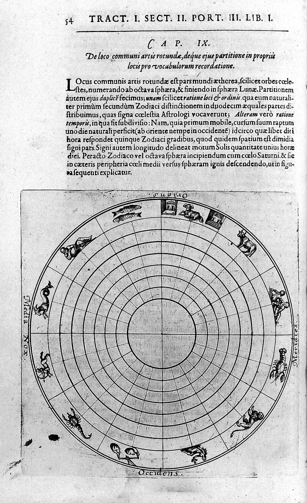

# 1.1. Introduction

*Memorativa* is the name of the system described in this document. This document will progressively describe the system, with each section building upon the predecessors. 

Memorativa is concerned with the realm of active understanding and systematic prototype construction. It is a cybernetic system with a user experience designed to cultivate an "internal cosmos" of perceptions and concepts. 

The Memorativa system draws its name from the classical *ars memorativa*, the art of memory that enabled scholars to construct vast mental architectures for storing and retrieving knowledge[1].

The *ars memoriae* is any of a number of loosely associated mnemonic principles and techniques used to organize memory impressions, improve recall, and assist in the combination and invention of ideas. An alternative term is *Ars Memorativa* which is also translated as "art of memory" although its more literal meaning is "Memorative Art". 

The Memorativa system takes inspiration from this ancient art, especially with regard to "the combination and 'invention' of ideas". From the *ars memorativa* tradition, Memorativa inherits the understanding that human memory and understanding operate through structured symbolic relationships. 

Where the classical art of memory used architectural spaces and vivid imagery to organize knowledge, Memorativa translates this insight into a digital framework where symbolic relationships can be precisely encoded and manipulated.

Memorativa extends classical systems through modern cybernetic principles, creating a dynamic learning environment where symbolic relationships evolve through feedback loops. This evolution occurs through what Hermann Hesse envisioned in *The Glass Bead Game* - a system for playing with the total contents of culture, finding new connections and meanings.

Within Memorativa, glass beads serve as game tokens that represent percepts, ideas, concepts, and relationships.

Memorativa recognizes that human understanding occurs through structured relationships between concepts. These relationships are not arbitrary but follow patterns that can be encoded and transmitted. The system provides a framework for capturing these relationships while maintaining their living, dynamic nature.

Memorativa treats knowledge not as a passive reception of facts but as an active construction of understanding. The system provides tools for this construction while recognizing that the process must remain open to evolution and refinement.

Like the glass bead game of Hesse's imagination, Memorativa seeks to integrate different domains of knowledge through symbolic relationships. It provides a framework where insights from different fields can be connected and understood in relationship to each other.

The system's effectiveness ultimately depends on the human participant who provides the creative and reflective input that drives the system.

The system uses the raw material of content, transforming it from the social media model of reactive consumption into a conceptual model for reflective creating. This shift enables users to engage with content in a more meaningful and transformative way.

Rather than only modeling and representing the physical properties of objects, the Memorativa system seeks to model and represent the conceptual properties of perceptions through prototypes.

To facilitate input and creation of percepts and prototypes within a cybernetic system, the system provides a game that can be played, *the Glass Bead Game*.

The system's architecture reflects the German Idealist understanding that consciousness actively structures reality rather than passively receiving it. It embraces Hegel's insight that knowledge develops through systematic relationships and that truth emerges through the interaction of different perspectives.

Memorativa embraces a Platonic and Neoplatonic cosmology as a coherent system to encode perceptions and concepts, to practically structure vector spaces, and to correlate symbolic data dictionaries.

The Antikythera mechanism is an ancient Greek analog device, often considered the world's first analog computer, dating back to around 150–100 BCE. Discovered in 1901 in a shipwreck off the coast of the Greek island of Antikythera, it is a complex system of bronze gears and dials used to predict astronomical positions and events, such as eclipses, planetary movements, and the cycles of the Olympic Games. 

The astronomical calculator tracks the positions of the Sun, Moon, and possibly the five known planets (Mercury, Venus, Mars, Jupiter, Saturn) and predicts lunar and solar eclipses using the Saros cycle (a period of ~18 years). It is composed of at least 30 interlocking bronze gears using precision engineering far ahead of its time.

The mechanism was used by ancient Greek astronomers and priests for both practical and educational purposes, and serves as a historical precursor to modern computational systems, embodying the integration of cosmological rhythms and mechanical precision.

What if understanding and consciousness arise from the individual's cosmological orientation, as Plato envisioned? In such a model, the ancients' sky was a pre-linguistic substrate, its patterns intuited before named, much like how a baby's spatial grounding precedes language. 

If the sky is a cybernetic system, consciousness may be the individual navigating it by standing at its center to discern relationships. 

Richard Tarnas explores the idea that there is a meaningful correlation between cosmic events and human experience. Tarnas argues that planetary alignments and cycles throughout history coincide with significant shifts in human culture, consciousness, and historical events[2]. He draws on a vast range of historical examples, from ancient Greece to the modern era, to illustrate these correlations. His work *Cosmos and Psyche* argues for a revival of the idea of a meaningful cosmos, where the movements of celestial bodies are not just random physical events but are imbued with archetypal significance that shapes human experience.

Despite the modern distaste for such perceived superstition, astrology is in fact an ancient and elegant methodology. From the location and movement of planets and other celestial bodies in relation to Earth, the observer, and to one another, a model of mathematical relations in time and space is created. With this aspect of the model alone, one can enhance any organizational system in interesting and beneficial ways.

- Anthony Campanella provides a comprehensive overview of the history of astrology in Western culture from antiquity to the present day, covering its philosophical, scientific, and social contexts[3]
- Patrick Curry is a a historian of astrology who provides a concise and accessible introduction to astrology, covering its history, key concepts, and cultural significance[4]
- Jim Tester offers a standard academic history of Western astrology from its origins to the 20th century, covering its intellectual and social development[5]

Astrology also accounts for a system or systems of symbols, relationships, correspondences, and the ideas and concepts encoded and engendered within the system. There are few systems that can dynamically account for the language of emotion, thought, and imagination in a rational (relational) and dynamic way better than astrology. 

There are various historical and cultural variations of astrology that serve to provide additional insights and perspectives while relying upon the same underlying model. There are also variations on the model itself, such as sidereal, tropical, Western, Vedic, and others, including just the use of celestial mechanics devoid of any symbolism.

One finds too that astrology plays a central role in the *ars memorativa*, the art of memory. Astrological language and symbolism is so prevalent in our culture and consciousness that we see it in the names of the days of the week, the ordering of calendars, and the names of the months. Astrology corresponds to other symbolic systems. Because of this, other symbolic systems can be easily integrated into the Memorativa system through this key model.

Regardless of cause, celestial cycles seem to pattern events in human history, daily lives, and nature. It does so based on the measurement of symbolic tokens arranged in space and time. Such spacial token arrangements are also used by human cognition and machine learning for recognizing patterns and meaning.

Astrology's structural framework—its geocentric model, angular relationships, and symbolic organization—offers a unique and powerful way to model meaning. By decoupling this structure from its mythological and cultural interpretations, we can leverage it as a neutral, adaptable system for addressing key challenges in AI, such as interpretability, contextual grounding, and analogical reasoning. This approach does not require belief in astrology's correlations but instead focuses on its utility as a structural tool for organizing and relating concepts.

Within Memorativa, percepts, relationships, and concepts are organized, regarded, and combined into an ordered and systematic whole. The various properties of astrology and their representation in a vector space provide natural semantic domains that reflect different aspects of human experience and thought.

Generative AI systems based on large language models use algorithms and the method of induction based on trained neural network transformation of token embeddings through multiple processing layers of "meaning" and the measurement of distances and relationships between vectors to accurately predict "the next token". This method depends on the construction of high dimensional virtual spaces (reduced to three dimensions for human understanding) in which to arrange and understand the geometric relationships of the data images based on applied statistics, then to infer analogy based on regularly significant relationships between vectors.

In advanced layers of neural networks, where synthesis, concepts, and abstractions are processed, the high-dimensional nature of vector spaces—governed by the *curse of dimensionality*[6]—often results in vectors becoming nearly orthogonal. While this property is mathematically elegant, it renders the model functionally opaque to human interpretation. Without meaningful ways to decode these relationships, the model's insights remain inaccessible, limiting its practical utility despite its computational sophistication[7].

Where generative AI starts with units of "meaning" and seeks to arrange them into the final, best vector arranged in three dimensions, astrology begins with a geocentric cosmological orientation that results in three dimensional vector space locations (expressed in latitude and longitude) through which regular symbolic tokens (planets) move (in linear time), resulting in angular relationships and their related pre-built symbolic vocabularies. Large language model training also depends upon a corpus that is a static snapshot without any context of time or place. Astrology introduces the time / date / location / symbol vectors into every token, and provides temporal context through the natural cyclical celestial movements. In this way, human thought progression can be clearly and accurately mapped and incorporated into a working language model to solve for advanced analogy and for a proof of human thought. From the perspectives of natural language processing and large language models, astrology can assume a unique relationship and potential in the fine-tuning process, transformation layers, attention mechanisms, and overall training. 

## Key points

- Memorativa integrates **ancient mnemonic principles** with **modern cybernetic systems**, creating a dynamic framework for knowledge organization and synthesis.
- The system draws inspiration from **Hesse's Glass Bead Game**, using symbolic tokens to represent and connect concepts across domains.
- **Astrological frameworks** provide a structural model for organizing and relating concepts, decoupled from cultural interpretations.
- The system emphasizes **active understanding** over passive reception, treating knowledge as a living, evolving construct.
- Memorativa bridges **human cognition** and **machine processing** through structured symbolic relationships and feedback loops.

## Citations

- [1] Yates, Frances A. The Art of Memory. Chicago: University of Chicago Press, 1966.
- [2] Tarnas, R. (2006). *Cosmos and Psyche: Intimations of a New World View*. Viking.
- [3] Campanella, A. (2021). *The History of Western Astrology Volume II: The Medieval and Modern Worlds*. Continuum.
- [4] Curry, P. (2017). *A Very Short Introduction to Astrology*. Oxford University Press.
- [5] Tester, S.J. (1987). *A History of Western Astrology*. Boydell Press.
- [6] Bellman, R. (1957). *Dynamic Programming*. Princeton University Press.
- [7] Rudin, C. (2019). Stop Explaining Black Box Machine Learning Models for High Stakes Decisions and Use Interpretable Models Instead. *Nature Machine Intelligence*, 1(5), 206-215.