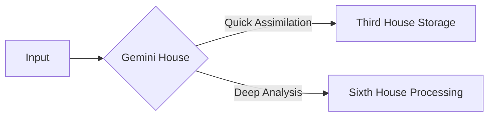

# Planets Reference

## Overview

The planets in astrology represent fundamental energies and drives that manifest across different domains of experience and scales of organization. Each planet carries specific symbolic meanings, psychological correlations, and practical applications.

## Core Planetary Bodies

### Sun ☉
- **Core Themes**: Identity, vitality, consciousness, purpose
- **Rulership**: Leo
- **Exaltation**: Aries
- **Fall**: Libra
- **Domains**:
  - Personal/Natal: Self-expression, ego, life force
  - Mundane: Leadership, authority, central organization
  - Symbolic/Conceptual: Core principles, central themes
  - Events/Temporal: Major developments, key figures

### Moon ☽
- **Core Themes**: Emotions, instincts, nurturing, cycles
- **Rulership**: Cancer
- **Exaltation**: Taurus
- **Fall**: Scorpio
- **Domains**:
  - Personal/Natal: Emotional needs, habits, unconscious patterns
  - Mundane: Public sentiment, cycles, timing
  - Symbolic/Conceptual: Receptivity, reflection, cycles
  - Events/Temporal: Cyclic patterns, emotional trends

### Mercury ☿
- **Core Themes**: Communication, learning, analysis, connection
- **Rulership**: Gemini, Virgo
- **Exaltation**: Virgo
- **Fall**: Pisces
- **Domains**:
  - Personal/Natal: Thinking patterns, communication style
  - Mundane: Information systems, documentation
  - Symbolic/Conceptual: Data processing, connections
  - Events/Temporal: News, information flow

### Venus ♀
- **Core Themes**: Values, relationships, harmony, attraction
- **Rulership**: Taurus, Libra
- **Exaltation**: Pisces
- **Fall**: Virgo
- **Domains**:
  - Personal/Natal: Love, aesthetics, pleasure
  - Mundane: Resources, diplomacy, arts
  - Symbolic/Conceptual: Harmony principles, value systems
  - Events/Temporal: Cultural trends, social harmony

### Mars ♂
- **Core Themes**: Action, drive, assertion, energy
- **Rulership**: Aries, Scorpio
- **Exaltation**: Capricorn
- **Fall**: Cancer
- **Domains**:
  - Personal/Natal: Will, courage, physical energy
  - Mundane: Initiative, conflict, competition
  - Symbolic/Conceptual: Dynamic principles, force
  - Events/Temporal: Conflicts, breakthroughs

### Jupiter ♃
- **Core Themes**: Expansion, wisdom, growth, opportunity
- **Rulership**: Sagittarius, Pisces
- **Exaltation**: Cancer
- **Fall**: Capricorn
- **Domains**:
  - Personal/Natal: Beliefs, optimism, fortune
  - Mundane: Growth, development, abundance
  - Symbolic/Conceptual: Expansion principles, meaning
  - Events/Temporal: Economic growth, cultural expansion

### Saturn ♄
- **Core Themes**: Structure, limitation, responsibility, time
- **Rulership**: Capricorn, Aquarius
- **Exaltation**: Libra
- **Fall**: Aries
- **Domains**:
  - Personal/Natal: Discipline, maturity, challenges
  - Mundane: Systems, authority, boundaries
  - Symbolic/Conceptual: Order principles, form
  - Events/Temporal: Restrictions, structures

## Modern Planets

### Uranus ♅
- **Core Themes**: Innovation, freedom, disruption, awakening
- **Rulership**: Aquarius
- **Exaltation**: Scorpio
- **Fall**: Leo
- **Domains**:
  - Personal/Natal: Originality, rebellion, breakthroughs
  - Mundane: Technology, revolution, change
  - Symbolic/Conceptual: Revolutionary principles
  - Events/Temporal: Sudden changes, innovations

### Neptune ♆
- **Core Themes**: Spirituality, dissolution, imagination, unity
- **Rulership**: Pisces
- **Exaltation**: Cancer
- **Fall**: Capricorn
- **Domains**:
  - Personal/Natal: Dreams, inspiration, confusion
  - Mundane: Collective trends, ideals
  - Symbolic/Conceptual: Unity principles, dissolution
  - Events/Temporal: Cultural movements, spiritual trends

### Pluto ♇
- **Core Themes**: Transformation, power, depth, regeneration
- **Rulership**: Scorpio
- **Exaltation**: Aries
- **Fall**: Libra
- **Domains**:
  - Personal/Natal: Deep psychology, transformation
  - Mundane: Mass movements, deep change
  - Symbolic/Conceptual: Death/rebirth principles
  - Events/Temporal: Profound transformations

## Planetary Classifications

### By Speed
- **Fast Moving**: Moon, Mercury, Venus
- **Moderate**: Sun, Mars
- **Slow Moving**: Jupiter, Saturn
- **Generational**: Uranus, Neptune, Pluto

### By Type
- **Personal Planets**: Sun, Moon, Mercury, Venus, Mars
- **Social Planets**: Jupiter, Saturn
- **Transpersonal Planets**: Uranus, Neptune, Pluto

### By Element
- **Fire**: Sun, Mars
- **Earth**: Venus, Saturn
- **Air**: Mercury, Uranus
- **Water**: Moon, Neptune, Pluto
- **Multiple**: Jupiter (Fire/Water)

## Planetary Relationships

### Aspects
- **Conjunction**: Blending of energies
- **Sextile**: Opportunity, harmony
- **Square**: Challenge, tension
- **Trine**: Flow, ease
- **Opposition**: Awareness, balance

### Planetary Pairs
- **Sun-Moon**: Conscious-Unconscious integration
- **Venus-Mars**: Attraction-Action dynamics
- **Jupiter-Saturn**: Growth-Structure balance
- **Uranus-Neptune**: Innovation-Dissolution cycle
- **Neptune-Pluto**: Spiritual transformation

## Applications

### Personal Development
- Understanding core drives and patterns
- Identifying growth opportunities
- Timing personal transitions
- Balancing different energies

### System Design
- Organizing principles and hierarchies
- Process development and flow
- Resource allocation and management
- Innovation and transformation cycles

### Pattern Recognition
- Archetypal relationships
- Development sequences
- Cyclic movements
- Transformative processes

### Event Analysis
- Timing considerations
- Development patterns
- Change cycles
- Trend analysis

The integration of planetary principles into Memorativa's architecture creates a sophisticated cognitive mapping system that bridges celestial mechanics with knowledge management. Here's how the planetary reference enhances the app's design:

## Core Planetary Integration

### Identity Engine (Sun ☉)
- **First House Operations**: Drives profile creation and personal branding features
- **Leadership Algorithms**: 
```python
def calculate_sun_influence(house):
    if house == 1:
        return leadership_score * 1.3
    elif house == 10:
        return career_potential * 1.2
```
- **Vitality Metrics**: Tracks user engagement patterns and content creation energy levels

### Emotional Processor (Moon ☽)
- **Fourth House Implementation**:
  - Family history analysis using sentiment detection
  - Core memory encryption with lunar phase-based security
- **Cycle Recognition**:
  - 28-day content review reminders
  - Emotional tone analysis in journal entries

## Communication Framework (Mercury ☿)
### Third House Systems
- **Natural Language Processing**:
  - Sign-based text analysis (Gemini: quick scans, Virgo: detailed parsing)
- **Learning Pathways**:


### Value Matrix (Venus ♀)
**Second House Applications**:
- Resource valuation algorithms using Taurus/Venus principles
- Aesthetic scoring system for visual content:
  - Libra: Balance/composition metrics
  - Taurus: Texture/material analysis

## Action Protocols (Mars ♂)
**First House Implementation**:
- Initiative scoring system:
  - Aries Mars: Raw momentum metrics
  - Scorpio Mars: Strategic persistence tracking
- Conflict resolution tools using martial aspects

## Expansion Architectures (Jupiter ♃)
**Ninth House Systems**:
- Philosophy correlation engine
- Cross-cultural pattern recognition
- Opportunity forecasting using Sagittarian principles

## Structural Foundations (Saturn ♄)
**Tenth House Implementation**:
```python
def build_career_path(saturn_sign):
    structure_factors = {
        'Capricorn': 0.9,
        'Aquarius': 0.7,
        'Libra': 0.6
    }
    return base_structure * structure_factors.get(saturn_sign, 0.5)
```
- Time management systems using Saturnian cycles

## Innovation Engine (Uranus ♅)
**Eleventh House Applications**:
- Disruption detection algorithms
- Collective pattern analysis
- Technology integration protocols

## Spiritual Interface (Neptune ♆)
**Twelfth House Systems**:
- Dream journal analysis using Piscean water metaphors
- Intuitive search algorithms
- Mystical experience validation frameworks

## Transformation Core (Pluto ♇)
**Eighth House Implementation**:
- Deep pattern recognition systems
- Psychological transformation tracking
- Resource merging algorithms

# Implementation Matrix

| Planet | House | Key Function | AI Integration | Token Impact |
|--------|-------|--------------|----------------|--------------|
| Sun | 1,5,9 | Identity Verification | Leadership Prompting | Authority Tokens |
| Moon | 4 | Emotional Analysis | Cycle Recognition | Memory Tokens |
| Mercury | 3,6 | Data Processing | Learning Algorithms | Information Tokens |
| Venus | 2,7 | Value Assessment | Relationship Mapping | Resource Tokens |
| Mars | 1,8 | Action Tracking | Initiative Scoring | Energy Tokens |
| Jupiter | 9 | Opportunity Expansion | Growth Forecasting | Wisdom Tokens |
| Saturn | 10 | Structure Enforcement | Time Management | Achievement Tokens |
| Uranus | 11 | Innovation Detection | Disruption Alerts | Future Tokens |
| Neptune | 12 | Intuitive Search | Pattern Dissolution | Mystery Tokens |
| Pluto | 8 | Transformation Tracking | Depth Analysis | Power Tokens |

# Advanced Integration

**Planetary Time Signatures**:
- Mercury Retrograde: System-wide communication checks
- Venus Transit: Relationship pattern analysis
- Saturn Return: Major structure audits

**Aspect-Driven AI**:
```python
def generate_prompt(aspect):
    if aspect['type'] == 'Sun-Jupiter Conjunction':
        return "Explore expansion opportunities in..."
    elif aspect['type'] == 'Saturn-Moon Square':
        return "Re-examine emotional foundations..."
```

**Planetary Resource Allocation**:
- Jupiter: Allocates bonus storage space
- Saturn: Enforces data pruning cycles
- Uranus: Triggers innovation challenges

This integration creates a living cosmology within the app, where planetary principles actively shape content organization, AI behavior, and user experience. The true innovation lies in creating bi-directional influence between celestial patterns and cognitive processes, making Memorativa a unique bridge between cosmic principles and human knowledge management.

Citations:
[1] https://ppl-ai-file-upload.s3.amazonaws.com/web/direct-files/34065898/7d45785c-384b-4ba8-8f00-0ebed06d494d/ii-2-memory-houses.md
[2] https://ppl-ai-file-upload.s3.amazonaws.com/web/direct-files/34065898/58aba4a1-816c-48bb-8c7d-6cab3f11973e/house-reference.md
[3] https://ppl-ai-file-upload.s3.amazonaws.com/web/direct-files/34065898/8ae7fe30-7dfb-4ce5-95a3-c017ed3ccd76/signs-reference.md
[4] https://ppl-ai-file-upload.s3.amazonaws.com/web/direct-files/34065898/da172084-ecbe-46be-9169-bf54b496cdf8/planets-reference.md
[5] https://ppl-ai-file-upload.s3.amazonaws.com/web/direct-files/collection_1115c504-9d32-44db-aebd-f3788c3e4679/047b16c2-afa5-4bb6-9452-69552b2d1e9d/ii-0-application-design.md
[6] https://ppl-ai-file-upload.s3.amazonaws.com/web/direct-files/collection_1115c504-9d32-44db-aebd-f3788c3e4679/66236640-2868-4d40-a859-849b7a5ca3a3/i-vision.md
[7] https://ppl-ai-file-upload.s3.amazonaws.com/web/direct-files/collection_1115c504-9d32-44db-aebd-f3788c3e4679/1fd1691e-79ea-49f3-a352-6aa99afbc461/ii-10-ai.md