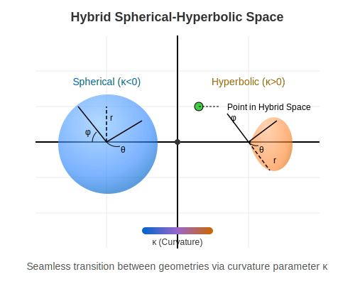
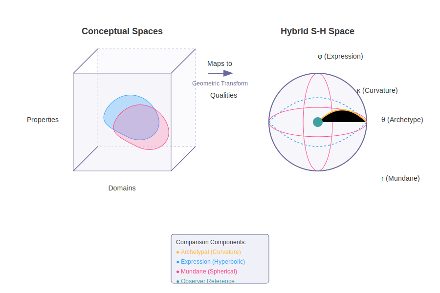

## Abstract

Chapter 2 provides a comprehensive technical overview of Memorativa's cybernetic AI architecture, outlining its cognitive, symbolic, computational, and economic components. The chapter systematically introduces a robust hierarchical structure, beginning with foundational percept-triplet encoding—leveraging a hybrid spherical-hyperbolic geometry—and progressively expanding into sophisticated multi-dimensional structures, such as Prototypes, Focus Spaces, Books, and the Virtual Loom.

Key features include advanced multi-lens symbolic translations, robust privacy-preserving protocols, and rigorous verification mechanisms using Spherical Merkle Trees. Integration of Large Language Models (LLMs) and multi-modal processing significantly enriches semantic coherence, enabling dynamic Retrieval-Augmented Generation (RAG) and cross-cultural interpretability. The dual-token economic model (Glass Bead Tokens and Gas Bead Tokens) aligns computational resource usage with cognitive contributions, while the Waldzell DAO governance structure ensures decentralized, meritocratic oversight.

Together, these interconnected subsystems establish a scalable, secure, and cognitively intuitive knowledge ecosystem, facilitating collaborative human-machine knowledge construction and exploration. This detailed chapter thus positions Memorativa as an advanced, innovative system, explicitly designed to manage complexity, maintain semantic integrity, and encourage meaningful human-machine collaboration.

# 2.1. The Cybernetic System

The Memorativa model describes a cybernetic system where a machine-human interface is defined [1]. The interface completes the system by providing the player (human) of the game (machine) as an animating force and validator of the system. The player's input animates the system, while their validation ensures the structural correspondences defined by the model.

In this way, two worlds are bridged through Memorativa, connecting the **conceptual** with the **computational** through the interface [3]:

- **Human Interior World**: The world of perceptions and concepts, or the **"inner cosmos"**, aligning with the geocentric orientation principle established in Section 1.4 [7].
- **Machine Conceptual Space**: The space of vector relationships, where percepts and prototypes are analyzed and interpreted through the three-vector approach (Archetypal, Expression, Mundane) described in Section 1.3 [8].


*Figure 1: Conceptual space mapping between human interior world and machine conceptual space, showing the bidirectional interface and translation mechanisms*

## System Components

The cybernetic system consists of several interconnected components that work together to create a cohesive framework for understanding and interaction [1]:

1. **Human Component**: The conscious agent who provides input, interprets output, and validates the system's operations
2. **Machine Component**: The computational framework that processes, analyzes, and transforms data using the percept-triplet structure
3. **Interface Layer**: The bidirectional translation mechanism between human and machine domains that enables precise information transfer
4. **Feedback Loop**: The continuous cycle of input, processing, output, and validation that enables system self-regulation and iterative refinement [2]

## Implementation of the Percept-Triplet Structure

The cybernetic system provides the operational framework for implementing the percept-triplet structure introduced in Section 1.3 [8]. The three vectors (Archetypal, Expression, and Mundane) are processed within the machine component through:

1. **Vector Encoding**: Raw inputs are transformed into the three-vector structure
2. **Dimensional Constraint**: The system maintains interpretable relationships by constraining the vector space dimensions
3. **Semantic Clarity**: The interface translates between statistical patterns and human-understandable symbolic frameworks

This approach directly addresses the curse of dimensionality identified in Section 1.1 by creating a structured, interpretable middle layer between human symbolic thought and machine computation [5].

## Feedback Loop Engineering

The cybernetic system implements practical feedback mechanisms that enable continuous refinement and adaptation [1][2]:

1. **Input-Output Cycle**: The system processes human input, generates computational output, and presents it back to the human for validation
2. **Error Correction**: Discrepancies between intended and actual outputs are detected and used to refine the system's processing
3. **Adaptive Parameters**: System parameters adjust based on interaction history to improve translation accuracy
4. **Information Flow Regulation**: The interface manages information flow in both directions to prevent overloading while ensuring sufficient context

These mechanisms create a robust self-regulating system that improves over time through practical usage rather than requiring theoretical perfection at the outset.

## Geocentric Navigation

Building on the sky computer concept (Section 1.4), the cybernetic system implements a geocentric navigation framework within the "inner cosmos" [7]. This allows users to:

1. Orient themselves within their conceptual space
2. Navigate between related concepts based on semantic relationships
3. Develop an intuitive understanding of their knowledge landscape
4. Build on humanity's oldest computational framework as a foundation for knowledge organization

## Theoretical Foundation

The cybernetic approach of Memorativa draws from established theories in systems engineering, control theory, and human-computer interaction [1][2]. By treating the human-machine relationship as a unified system rather than separate entities, Memorativa enables deeper integration and more meaningful interactions. This approach aligns with Bateson's understanding of cybernetic systems as self-correcting assemblies with feedback mechanisms [2] and implements practical error-correction principles from control theory.

## Building on Existing Technologies: RAG and LLM Extension

Memorativa does not exist in isolation, but rather builds upon and extends existing AI technologies, particularly Retrieval-Augmented Generation (RAG) and Large Language Models (LLMs). Rather than reinventing these foundations, Memorativa transforms them through specialized architectures that address fundamental limitations while preserving their strengths.

### RAG System Extensions

The traditional RAG approach combines retrieval systems with generative models to enhance context and accuracy. Memorativa extends this paradigm through several key innovations:

1. **Spherical RAG Implementation**: Rather than using standard vector retrieval in high-dimensional Euclidean space, Memorativa implements a "SphericalRAG" system that encodes knowledge in 3D spherical-hyperbolic space. This approach:
   - Mitigates the curse of dimensionality through purposeful dimensional constraint
   - Enables angular relationship preservation between concepts
   - Creates meaningful spatial organization of knowledge with geocentric orientation

2. **Symbolic-Spatial Retrieval**: Unlike standard RAG systems that rely solely on embedding similarity, Memorativa combines spatial proximity with symbolic relationships through:
   - Aspect-based retrieval that identifies significant angular relationships
   - Hybrid distance metrics that blend hyperbolic and spherical calculations
   - Cultural pattern recognition that leverages archetypal frameworks

3. **Dynamic Knowledge Base**: While traditional RAG systems operate on static corpora, Memorativa implements a continuously evolving knowledge base through:
   - Player-generated Books that seed the retrieval corpus
   - Spatial clustering that organizes knowledge by conceptual relationships
   - Temporal indexing that tracks concept evolution across multiple states

4. **Verification Integration**: Memorativa extends RAG with cryptographic verification through:
   - Spherical Merkle Tree integration that preserves both content integrity and angular relationships
   - Attribution preservation that maintains transparent provenance for retrieved knowledge
   - Privacy-aware filtering that respects access controls while enabling collaborative retrieval

These extensions transform RAG from a passive information retrieval system into an active component of a cybernetic knowledge ecosystem that evolves through human-machine collaboration while maintaining verifiable integrity.

### LLM Integration and Enhancement

Memorativa leverages LLMs as core generative components while extending their capabilities through specialized architectures that maintain the system's unique characteristics:

1. **Bidirectional Knowledge Bridge**: The LLM integration serves as a critical bridge between human language and the hybrid geometric structures that form Memorativa's foundation. This bidirectional system:
   - Translates natural language inputs into percept-triplet structures
   - Converts geometric relationships back into narrative content
   - Maintains hybrid geometry across all transformations
   - Preserves observer-centric knowledge representation

2. **Privacy-Preserving Architecture**: Unlike standard LLM implementations, Memorativa enforces strict privacy boundaries through:
   - Privacy-aware adapters that limit external LLM access to public data only
   - Secure format conversion that maintains system integrity
   - Rate limiting and cost management to prevent resource exploitation
   - Tiered access controls that respect user privacy preferences

3. **Cost Optimization**: Memorativa implements several strategies to reduce operational costs:
   - Embedding caching to avoid redundant API calls
   - Batch processing to minimize overhead
   - Tiered retrieval with fast approximate search followed by precise re-ranking
   - Adaptive chunking based on semantic coherence

4. **Multimodal Extension**: Beyond text processing, Memorativa extends LLM capabilities through:
   - Diffusion model integration for visual processing
   - Multimodal input handling that maintains the same hybrid geometric structure
   - Angular relationship preservation across modalities
   - Token-aware resource allocation for all processing types

5. **Percept-Triplet Preservation**: Most critically, Memorativa maintains its three-vector conceptual structure throughout all LLM operations:
   - Archetypal Vector ("What"): LLMs identify archetypal forces
   - Expression Vector ("How"): Language models process form and expression
   - Mundane Vector ("Where"): Models contextualize content appropriately

These enhancements transform standard LLMs from statistical pattern generators into components of a structured knowledge system that maintains conceptual integrity, preserves privacy, optimizes resources, and operates within a sustainable token economy.

### System Integration

The extended RAG and LLM technologies are fully integrated with Memorativa's core components:

1. **Glass Bead Integration**: Every RAG and LLM operation is encoded and verified within the Glass Bead token structure, ensuring:
   - Verifiable ownership and attribution
   - Transparent operation costs within the Gas Bead Token economy
   - Angular relationship preservation through Spherical Merkle Trees

2. **Core Game Mechanics**: RAG and LLM technologies power the key gameplay elements:
   - Percept creation through input analysis and triplet encoding
   - Focus space generation through spatial context construction
   - Book generation through structured narrative synthesis
   - Prototype formation through weighted aggregation

3. **Feedback Loop Completion**: The enhanced technologies enable the cybernetic feedback loop by:
   - Converting player inputs into structured knowledge
   - Transforming geometric relationships into human-interpretable content
   - Enabling collaborative knowledge refinement
   - Supporting continuous evolution through iterative processing

By extending established AI technologies rather than replacing them, Memorativa creates a system that is both innovative and practically implementable. This approach leverages existing research and infrastructure while addressing fundamental limitations through specialized architectures designed for active understanding and conceptual integrity. 

## Key Math

- **Feedback Loop Formalization**: The cybernetic feedback loop can be represented as a function $F: (H \times M) \rightarrow (H' \times M')$ where $H$ represents the human cognitive state, $M$ represents the machine state, and $(H', M')$ represents their evolved states after one cycle of interaction [1]

- **Interface Translation**: The bidirectional interface can be modeled as two functions: $T_H: M \rightarrow H$ (machine to human translation) and $T_M: H \rightarrow M$ (human to machine translation), where the composition $T_H \circ T_M$ approaches but never fully achieves an identity mapping as the system evolves [2]. This inherent gap—where $T_H \circ T_M \neq id$—represents a fundamental design tension in the system, acknowledging that perfect alignment between human conceptual understanding and machine representation remains aspirational rather than fully achievable due to subjective drift, contextual shifts, and the inherently ineffable aspects of human experience.

- **Three-Vector Processing**: The percept-triplet processing can be formalized as a transformation $P: I \rightarrow A \times E \times M$ where $I$ is the input space, and $A$, $E$, and $M$ are the Archetypal, Expression, and Mundane vector spaces respectively [8]

- **Error Correction**: The system's error correction can be modeled as $E(t+1) = E(t) - \alpha \nabla E(t)$ where $E(t)$ represents the error at time $t$, $\alpha$ is the learning rate, and $\nabla E(t)$ is the gradient of the error with respect to the system parameters [2]

## Key Points

- The Memorativa cybernetic system creates a **bidirectional interface** between human cognition and machine computation, building on Wiener's foundational cybernetic principles where communication and control operate across both biological and mechanical systems [1]
  
- The chain of thought progresses from defining the system structure to establishing the interface, then implementing practical feedback loops and system self-regulation, following the classic cybernetic model of circular causality where outputs become inputs in a continuous cycle [1][2]
  
- Human players serve dual roles as **animators** and **validators** of the system, providing both the initial input that drives the system and the critical validation that ensures structural correspondences align with human understanding [3]
  
- The system bridges two distinct conceptual spaces: the **Human Interior World** (subjective perceptions and concepts) and the **Machine Conceptual Space** (mathematical vector relationships), creating a translation layer between qualitative human experience and quantitative computational analysis [3]
  
- This bridging function addresses a fundamental challenge in AI: the gap between human meaning-making and machine pattern recognition, enabling more intuitive and meaningful human-machine collaboration [5]
  
- The machine space enables **formal analysis** of relationships between concepts that would be difficult to quantify in purely human terms, while preserving the richness and nuance of human conceptual understanding through the interface layer
  
- The interface translates between **subjective experience** and **mathematical representation**, allowing humans to interact with complex conceptual spaces through familiar symbolic frameworks rather than abstract vector mathematics [9]
  
- The system creates a continuous feedback loop of **perception**, **analysis**, and **validation** that enables error correction and adaptive refinement, implementing practical control systems principles that engineers have successfully applied across numerous domains [2]
  
- This cybernetic approach forms the foundation for all subsequent components of Memorativa, establishing the technical framework that enables the percept-triplet structure, focus spaces, and other system elements [10]

- The system implements the **three-vector approach** established in Section 1, creating a dimensionally-constrained representation that sacrifices mathematical flexibility for semantic clarity, directly addressing the curse of dimensionality in traditional AI vector spaces [8]

- By incorporating **geocentric orientation** principles from Section 1.4, the cybernetic system transforms abstract knowledge organization into an intuitive navigation experience that provides practical benefits for information retrieval and conceptual modeling [7]

- The feedback mechanisms implement proven **control systems principles**, enabling system adaptation and refinement through practical usage rather than requiring theoretical perfection from the outset [2]

- The system operationalizes the eight-step Memorativa percept encoding process outlined in Section 1.5, providing the technical framework for input entry, focus space generation, concept calculation, vector encoding, prototype aggregation, lens application, book generation, and reward distribution [4]

- The system embraces a fundamental **design tension** where perfect alignment between human understanding and machine representation ($T_H \circ T_M = id$) remains aspirational rather than fully achievable, acknowledging the inherent limitations of translation between subjective human experience and computational frameworks [2]

## Citations

- [1] Wiener, N. (1948). *Cybernetics: Or Control and Communication in the Animal and the Machine*. MIT Press.
- [2] Bateson, G. (1972). "The Cybernetics of 'Self': A Theory of Alcoholism." In *Steps to an Ecology of Mind* (pp. 309-337). University of Chicago Press.
- [3] [Section 1.2] Philosophical Foundation of Memorativa.
- [4] [Section 1.5] Section Checkpoint: Introduction.
- [5] [Section 1.1] Introduction to Memorativa.
- [6] [Section 1.2] Model of Thought.
- [7] [Section 1.4] The Sky Computer.
- [8] [Section 1.3] Perceptual Encoding.
- [9] [Section 2.4] The Percept Triplet.
- [10] [Section 2.2] The Core Game.


## See Also

- [Section 1.1: Introduction to Memorativa](../1.%20introduction/memorativa-1-1-introduction.md) — Introduces the core problems and approaches that the cybernetic system addresses
- [Section 1.2: Model of Thought](../1.%20introduction/memorativa-1-2-model-of-thought.md) — Provides the epistemological foundation for the cybernetic system's approach to understanding
- [Section 1.3: Perceptual Encoding](../1.%20introduction/memorativa-1-3-perceptual-encoding.md) — Details the percept-triplet structure implemented by the cybernetic system
- [Section 1.4: The Sky Computer](../1.%20introduction/memorativa-1-4-sky-computer.md) — Explains the geocentric orientation principles incorporated into the system
- [Section 1.5: Section Checkpoint](../1.%20introduction/memorativa-1-5-section-checkpoint.md) — Summarizes the foundational concepts that the cybernetic system implements
- [Section 2.2: The Core Game](./memorativa-2-2-the-core-game.md) — Builds upon the cybernetic system to explain the interactive game mechanics
- [Section 2.4: The Percept Triplet](./memorativa-2-4-percept-triplet.md) — Provides detailed implementation of the percept structure within the cybernetic framework

---
title: "The Core Game"
section: 2
subsection: 2
order: 1
status: "in-progress"
last_updated: "2023-11-15"
contributors: []
key_concepts:
  - "Glass Bead Game"
  - "Player Profile"
  - "Percept Creation"
  - "Focus Space"
  - "Prototype"
  - "Vector Spaces"
  - "Inner Cosmos"
  - "Gas Bead Tokens"
  - "Structure Hierarchy"
prerequisites:
  - "The Cybernetic System"
next_concepts:
  - "Glass Beads"
  - "Percept Triplet"
  - "Gas Bead Tokens"
  - "Shared Structures"
summary: "This document describes the core game mechanics of Memorativa, focusing on how player inputs are transformed into an interconnected knowledge network through the Glass Bead Game."
chain_of_thought:
  - "Define the Glass Bead Game as the core interactive component"
  - "Explain the player input and percept creation process"
  - "Describe the focus space and prototype generation"
  - "Outline the rewards system"
  - "Explain how the system encodes concepts into vector spaces"
  - "Describe the expansion of the inner cosmos"
  - "Explain token mechanics that power the system"
technical_components:
  - "Player Input System"
  - "Percept Creation Process"
  - "Focus Space Generation"
  - "Prototype Structure"
  - "Vector Space Encoding"
  - "Dynamic Knowledge Base"
  - "Gas Bead Token System"
  - "RAG Integration"
  - "LLM Processing"
---

# 2.2. The Core Game

## Summary

The core game of Memorativa, detailed in section 2.2, revolves around the Glass Bead Game—a sophisticated interactive system inspired by Hermann Hesse's novel. At its heart, the game transforms personal inputs—such as URLs, tweets, videos, books, memes, and images—into structured, interconnected knowledge artifacts.

When you, as a player, introduce content into the game, the system prompts you to reflect and elaborate on your perception of that content. This reflective step, known as percept creation, ensures that each input is enriched with personal meaning and context. The game then visualizes your input within a "focus space," a conceptual workspace where your perception is represented as a structured "prototype." Each prototype is composed of smaller units called percepts, which capture distinct facets of your original input.

As you engage with this process, the game rewards your contributions by generating "glass beads"—symbolic tokens representing your percepts, prototypes, and focus spaces. Additionally, the system compiles your contributions into a "Book," a comprehensive artifact detailing your inputs and their conceptual relationships. These activities earn you Gas Bead Tokens (GBT), the computational currency powering the game's operations.

The knowledge you create is organized into a hierarchical structure:

- **Basic Structures**: Fundamental percept-triplets encoding individual concepts.
- **Composite Structures**: Prototypes and focus spaces that organize basic percepts into coherent units.
- **Complex Structures**: Books and expansive knowledge networks synthesizing multiple composite structures.

This hierarchy ensures that knowledge evolves systematically, from simple perceptions to sophisticated conceptual frameworks.

Gas Bead Tokens serve as both fuel and incentive within the game's economy. Each computational operation—such as percept creation, vector modifications, spatial queries, prototype integrations, and book generation—consumes tokens proportional to its complexity. Conversely, you earn tokens by contributing valuable content, refining vectors, validating prototypes, and sharing knowledge. This economic model encourages thoughtful, high-quality engagement rather than mere quantity.

Each Glass Bead Token encapsulates knowledge structures in multiple states—active (validated), quantum (probabilistic), and holographic (relational)—enabling dynamic conceptual evolution. The game's vector space encoding translates your percepts and prototypes into mathematical representations, facilitating efficient storage, retrieval, and analysis within your personal "inner cosmos." As you continue to interact with the game, your inner cosmos expands organically, enriched by the dynamic knowledge base generated from your Books.

Privacy and security are integral, with granular controls allowing you to manage how your knowledge artifacts are shared, modified, or kept private. This ensures collaboration respects your boundaries and preferences.

Concepts within your inner cosmos are recursively transformed, becoming inputs for new focus spaces. This recursive process mirrors human cognitive evolution, allowing continuous reflection, recombination, and synthesis of ideas. Advanced technical integrations—such as Retrieval Augmented Generation (RAG), Large Language Models (LLMs), and hybrid vector encoding—enhance your contributions, bridging qualitative human insights with quantitative computational analysis.

Ultimately, the core game mechanics establish a positive feedback loop: your active engagement enriches both your personal understanding and the AI's analytical capabilities, creating a personalized, evolving knowledge ecosystem.


## Introduction

The Glass Bead Game is the core interactive component of Memorativa [1]. The player has a profile (represented by a glass bead) that tracks gameplay and progress.

1. **Player Inputs**: Players can add any meaningful content (e.g., URLs, tweets, videos, books, memes, images) to the game. Input quality is managed through AI filtering for relevance and user-driven intent tagging, ensuring that inputs contribute meaningfully to the knowledge network. A detailed exploration of these validation mechanisms appears in [Section 2.6: Input Processing] [6].
2. **Percept Creation**: When a player adds an input, the game prompts them for thoughts or additional information about the perception represented by the input [2].
3. **Focus Space**: The game generates a **focus space** where the input is visualized as a concept. The concept is represented by a **prototype**, which is composed of individual facets of the perception, called **percepts** [3].
4. **Rewards**: The game generates a **glass bead** for each focus space, percept, and prototype. It also generates a **Book**, which contains content about the concept and details about the input, percepts, and prototype. Players earn **Gas Bead Tokens (GBT)** for these contributions, which serve as the computational fuel that powers system operations [7].


*Figure 1: Core Game Mechanics Flowchart, illustrating the sequential transformation from player inputs through percept creation, focus space visualization, prototype structuring, and reward generation, highlighting the interconnected processes that drive gameplay.*

## Structure Hierarchy

As players engage with the core game, they generate knowledge artifacts that fall into a three-tier hierarchy that will be fully detailed in [Section 2.19]:

1. **Basic Structures**: Foundational elements like percept-triplets that encode individual concepts
2. **Composite Structures**: Intermediate constructs like prototypes and focus spaces that organize basic structures 
3. **Complex Structures**: Advanced formations like books and knowledge networks that synthesize multiple composite structures

This hierarchy provides a framework for how knowledge is organized, shared, and evolved within the system.

## Token Economy

The Core Game is powered by a token economy that uses Gas Bead Tokens (GBT) as its operational fuel [7]. This system:

1. **Powers Computations**: Each game operation consumes GBT based on its computational complexity:
   - Percept creation
   - Focus space generation
   - Prototype formation
   - Book generation
   - Vector calculations

2. **Rewards Participation**: Players earn GBT for valuable contributions:
   - Creating quality percepts (5-10 GBT)
   - Refining vectors (3-7 GBT)
   - Generating books (20-50 GBT)
   - Validating content (0.5-1 GBT)
   - Sharing knowledge (5-15 GBT)
   - Validating prototypes (3-8 GBT)

3. **Incentivizes Quality**: The reward structure scales with contribution quality, encouraging thoughtful engagement rather than quantity of inputs.

This token economy creates a self-sustaining loop where players earn tokens by contributing knowledge and spend them to power the creation of new knowledge artifacts.

## Glass Bead Token States

Each Glass Bead token encapsulates structures with multiple potential states [Section 2.19]:
- **Active states**: Current validated representations
- **Quantum states**: Probabilistic superpositions awaiting resolution
- **Holographic states**: Reference-based projections that maintain relationships

These multi-dimensional states enable rich temporal and conceptual evolution within the system.

## Vector Space Encoding

The prototype and percept structures encode concepts using the percept-triplet structure introduced in Section 1.3. This three-vector approach addresses the curse of dimensionality in traditional AI systems by using three culturally rich vectors that directly mirror human cognitive structures:

1. **Archetypal Vector (WHAT)**: Equivalent to **planets** in astrological structure, representing fundamental qualities and core energies of a concept (e.g., Sun/identity, Mars/action, Jupiter/expansion)
2. **Expression Vector (HOW)**: Equivalent to **zodiacal signs**, indicating specific modes of expression (e.g., Leo/dramatic, Virgo/analytical, Aquarius/innovative)
3. **Mundane Vector (WHERE)**: Equivalent to **houses**, grounding concepts in contextual domains (e.g., 1st House/identity, 10th House/career, 4th House/home)

This structured encoding allows the game to efficiently store, categorize, compare, filter, and present percepts and prototypes in an imaginary game space, which represents the player's inner cosmos. The three-vector approach creates a middle layer between statistical patterns and symbolic frameworks, enabling meaningful translation between human and machine domains.

As the player collects inputs, their inner cosmos expands according to the logic of the structural encoding and the growth of the dynamic knowledge base generated from their Books. This knowledge base serves as a corpus of conceptual data that supplements the generative AI powering the game logic and analysis.

## Privacy and Security Framework

The system implements granular privacy controls at all structural levels [Section 2.19], allowing players to determine:
- Which structures are publicly shared
- Which remain private
- Which are selectively shared with specific users
- Who can contribute to or modify existing structures

These controls, combined with permission-based access management, ensure that knowledge sharing respects player boundaries while enabling collaboration.

## Concept Transformation

As the inner cosmos grows, concepts and focus spaces themselves are encoded as inputs in new focus spaces, creating transformed, layered, linked, and synthesized percepts and prototypes [3].


*Figure 2: Inner Cosmos and Token Economy Diagram, depicting how prototypes are encoded into vector spaces, stored within the imaginary game space, and integrated into the dynamic knowledge base, powered by Gas Bead Tokens, enabling recursive concept transformation and continuous knowledge evolution.*

## Cybernetic Implementation

The Core Game directly implements the cybernetic system principles established in Section 2.1, creating a practical manifestation of the theoretical framework. This implementation bridges human cognition and machine computation through several key mechanisms:

### Bidirectional Interface

The Core Game operationalizes the bidirectional interface described in Section 2.1 through:

1. **Human-to-Machine Translation** ($T_M: H \rightarrow M$): 
   - Player inputs (URLs, tweets, videos, etc.) are translated into machine-processable data
   - Percept creation captures subjective human understanding in structured formats
   - Player reflections provide context that enriches vector representations

2. **Machine-to-Human Translation** ($T_H: M \rightarrow H$):
   - Focus spaces visualize abstract vector relationships in human-interpretable forms
   - Books synthesize computational analyses into narrative structures
   - Glass beads symbolically represent complex computational structures

This bidirectional translation mechanism ensures that human meaning and machine representation remain aligned throughout the gameplay process.

### Human as Animator and Validator

The Core Game implements the dual role of humans described in Section 2.1:

1. **Animator Function**:
   - Players initiate the system's operations through content contribution
   - Player reflections animate otherwise static content with personal meaning
   - Player interactions drive the expansion of the inner cosmos

2. **Validator Function**:
   - Players validate percept accuracy through the reflection process
   - Prototype formation requires player confirmation of structural correspondences
   - Book generation incorporates player feedback to ensure conceptual integrity

This dual role ensures that the system remains both active and accurate, with human judgment serving as the ultimate arbiter of meaning.

### Feedback Loop Implementation

The cybernetic feedback mechanisms from Section 2.1 are implemented through:

1. **Input-Output Cycle**:
   - Player inputs → System processing → Focus space visualization → Player validation → Refined understanding
   - Each cycle improves both the player's conceptual clarity and the system's representational accuracy

2. **Error Correction**:
   - Discrepancies between player intent and system representation are detected during the validation phase
   - Vector modifications (3-7 GBT) allow for correction of misalignments
   - Prototype validation (3-8 GBT) ensures structural integrity

3. **Adaptive Parameters**:
   - The dynamic knowledge base learns from interaction patterns
   - Vector spaces adjust based on validated relationships between concepts
   - The token economy incentivizes corrections that improve system accuracy

This implementation creates the self-regulating system described in Section 2.1, where each interaction refines both human understanding and machine representation.

### Three-Vector Processing

The Core Game implements the three-vector approach (Archetypal/WHAT, Expression/HOW, Mundane/WHERE) introduced in Section 1.3 through:

1. **Vector Encoding with Astrological Mapping**: 
   - Percepts are encoded using the three-vector structure that maps to astrological elements
   - The Archetypal Vector (WHAT) corresponds to planets, representing fundamental qualities
   - The Expression Vector (HOW) corresponds to zodiacal signs, indicating modes of expression
   - The Mundane Vector (WHERE) corresponds to houses, grounding concepts in domains
   - Angular relationships (aspects) between vectors create meaningful semantic connections

2. **Dimensional Constraint to Address the Curse of Dimensionality**:
   - The three-vector structure constrains representation to three dimensions with established semantic meaning
   - This constraint sacrifices mathematical flexibility for semantic clarity
   - Unlike high-dimensional spaces where angular relationships become meaningless, this approach preserves semantic significance through discrete aspect angles
   - The result is stable, interpretable relationships between concepts

3. **Semantic Clarity Through Symbolic Embedding**:
   - The three-vector structure leverages culturally embedded symbolic patterns already present in language
   - This creates a middle layer between statistical patterns and symbolic frameworks
   - The approach enables meaningful translation between human and machine domains
   - The result is a representation that is both computationally efficient and humanly interpretable

This implementation directly addresses the curse of dimensionality identified in Section 1.3, where high-dimensional vector spaces exhibit counterintuitive properties that make semantic representation difficult.

### Geocentric Navigation

The Core Game implements the geocentric orientation principle from Section 2.1 through:

1. **Inner Cosmos**: 
   - The player's conceptual space is represented as a navigable "inner cosmos"
   - This representation builds on humanity's oldest computational framework
   - The geocentric perspective places the player at the center of their knowledge universe

2. **Spatial Relationships**:
   - Concepts are positioned relative to each other based on semantic relationships
   - Navigation between concepts follows intuitive spatial metaphors
   - The result is an intuitive understanding of the knowledge landscape

This implementation transforms abstract knowledge organization into an intuitive navigation experience, as described in Section 2.1.

Through these implementations, the Core Game transforms the theoretical cybernetic framework of Section 2.1 into a practical, interactive system that enables meaningful human-machine collaboration in knowledge creation and organization.

## Technical Integration

The Core Game is powered by advanced technical components [Section 2.19]:

1. **RAG System Integration**: Retrieval Augmented Generation provides contextually relevant information from the knowledge base
2. **LLM Processing**: Large Language Models help process and generate meaningful content
3. **Hybrid Vector Encoding**: Combines spherical and hyperbolic spaces for optimal concept representation

These technologies work together to create a seamless experience where player contributions are enhanced through AI assistance while maintaining human-centered meaning.

## Operational Costs

Each core game operation consumes Gas Bead Tokens according to its computational complexity [7]:

| Operation | GBT Cost | Description |
|-----------|----------|-------------|
| Percept Creation | 5-10 GBT | Establishing new conceptual structures |
| Vector Modification | 3-7 GBT | Changing core vectors in the triplet structure |
| Spatial Query | 2-5 GBT | Searching through the vector space |
| Prototype Integration | 1-3 GBT | Connecting percepts to form coherent structures |
| Book Generation | 20-50 GBT | Creating comprehensive knowledge artifacts |
| Focus Space Creation | 10-15 GBT | Establishing new conceptual workspaces |

These costs ensure computational resources are allocated efficiently while creating an economic incentive for thoughtful contribution over quantity.

## Code Summary

Here's a concise, structured code summary of section 2.2, synthesizing all examples into a unified narrative:

```js
// Player initiates interaction by adding meaningful content
const playerInput = addContent({
  type: ['URL', 'tweet', 'video', 'book', 'meme', 'image'],
  content: 'User-provided input',
});

// System prompts player for reflective elaboration
const percept = createPercept({
  input: playerInput,
  reflection: 'Player-generated thoughts and context',
});

// Create the percept-triplet structure using the three-vector approach
const perceptTriplet = createPerceptTriplet({
  percept,
  // Archetypal Vector (WHAT) - planets representing fundamental qualities
  archetypal: {
    primaryPlanet: 'Sun', // Core identity/essence
    aspects: [
      { planet: 'Mars', angle: 60 }, // Sextile - harmonious action
      { planet: 'Jupiter', angle: 120 } // Trine - natural expansion
    ]
  },
  // Expression Vector (HOW) - zodiacal signs indicating modes of expression
  expression: {
    primarySign: 'Leo', // Dramatic/creative expression
    modalities: ['Fixed'], // Stability characteristic
    elements: ['Fire'] // Energy characteristic
  },
  // Mundane Vector (WHERE) - houses grounding concepts in domains
  mundane: {
    primaryHouse: 10, // Career/public role domain
    crossHouses: [1, 5] // Identity and creativity domains
  }
});

// Generate a conceptual workspace ("Focus Space") visualizing the input
const focusSpace = generateFocusSpace({
  perceptTriplet,
  spatialProperties: {
    center: perceptTriplet.archetypal.primaryPlanet,
    orientation: perceptTriplet.expression.primarySign,
    domain: perceptTriplet.mundane.primaryHouse
  }
});

// Represent the concept structurally as a "Prototype"
const prototype = createPrototype({
  focusSpace,
  percepts: [perceptTriplet],
  // Astrological chart structure maintains semantic relationships
  chartStructure: {
    aspectPattern: 'Grand Trine', // Coherent energy flow
    houseFocus: ['Angular'], // Emphasis on action/identity houses
    planetaryDignities: calculateDignities(perceptTriplet)
  }
});

// Calculate vector relationships based on astrological aspects
function calculateAspectSignificance(aspect) {
  const aspectWeights = {
    0: 1.0,    // Conjunction - unity
    60: 0.5,   // Sextile - opportunity
    90: -0.5,  // Square - tension
    120: 0.8,  // Trine - harmony
    180: -0.8  // Opposition - polarization
  };
  
  return aspectWeights[aspect.angle] || 0;
}

// Reward player contributions with symbolic tokens ("Glass Beads")
const glassBeads = generateGlassBeads({
  perceptTriplet,
  prototype,
  focusSpace,
  // Bead qualities reflect vector properties
  qualities: {
    color: mapElementToColor(perceptTriplet.expression.elements[0]),
    luminosity: mapPlanetToLuminosity(perceptTriplet.archetypal.primaryPlanet),
    weight: mapHouseToWeight(perceptTriplet.mundane.primaryHouse)
  }
});

// Compile contributions into a comprehensive artifact ("Book")
const book = generateBook({
  prototype,
  percepts: [perceptTriplet],
  contentDetails: playerInput,
  // Book structure reflects astrological organization
  structure: {
    chapters: 12, // Zodiacal organization
    sections: 7,  // Planetary influences
    narrative: createNarrativeFromAspects(prototype.chartStructure.aspectPattern)
  }
});

// Award computational currency ("Gas Bead Tokens") based on contribution quality
const gasBeadTokens = awardGBT({
  perceptCreation: 7, // example values within defined ranges
  vectorRefinement: 5,
  bookGeneration: 30,
  contentValidation: 1,
  knowledgeSharing: 10,
  prototypeValidation: 6,
});

// Encode percepts and prototypes into vector spaces using astrological mapping
const vectorSpace = encodeVectorSpace({
  prototype,
  percepts: [perceptTriplet],
  encoding: {
    // Map vectors to mathematical spaces while preserving astrological semantics
    archetypal: { type: 'spherical', dimensions: 12 }, // Planetary positions
    expression: { type: 'discrete', dimensions: 12 }, // Sign positions
    mundane: { type: 'sequential', dimensions: 12 }   // House positions
  }
});

// Expand player's personal conceptual universe ("Inner Cosmos")
const innerCosmos = expandInnerCosmos({
  vectorSpace,
  dynamicKnowledgeBase: [book],
  // Inner cosmos structure follows geocentric model
  cosmology: {
    center: 'Player', // Geocentric reference point
    orbits: ['Personal', 'Relational', 'Collective'], // Spheres of influence
    navigation: 'Aspect-based' // Movement along aspect lines
  }
});

// Recursively transform concepts into new inputs for further synthesis
const transformedConcept = transformConcept({
  innerCosmos,
  previousPrototype: prototype,
  // Transformation follows astrological progression patterns
  progression: {
    method: 'Secondary', // One day = one year symbolic progression
    aspectFilter: aspect => calculateAspectSignificance(aspect) > 0.3
  }
});

const newFocusSpace = generateFocusSpace({
  perceptTriplet: transformedConcept,
});

// Manage privacy and sharing settings for knowledge artifacts
setPrivacyControls({
  artifact: book,
  visibility: 'selective', // public, private, selective
  permissions: ['view', 'edit', 'contribute'],
});

// Technical integrations enhancing player contributions
const enhancedContent = technicalIntegration({
  retrievalAugmentedGeneration: true,
  largeLanguageModel: true,
  vectorEncoding: {
    archetypal: 'spherical',
    expression: 'discrete',
    mundane: 'sequential'
  },
  knowledgeBase: innerCosmos,
});

// Positive feedback loop: player engagement enriches AI capabilities
updateDynamicKnowledgeBase({
  contributions: [enhancedContent],
  tokensSpent: gasBeadTokens,
  feedbackMechanisms: {
    humanValidator: true,
    machineAnalysis: true,
    astrologicalCoherence: validateAstrologicalStructure(perceptTriplet)
  }
});
```

### Narrative Explanation:

In Memorativa's core game, players actively contribute meaningful content, prompting reflective elaboration that enriches each input. These reflections become structured percepts organized into the three-vector percept-triplet structure (Archetypal/WHAT, Expression/HOW, Mundane/WHERE) with astrological mapping (planets, signs, houses). Each triplet is visualized within conceptual workspaces called focus spaces, generating prototypes that maintain astrological semantic relationships.

Players receive symbolic rewards—glass beads—with qualities reflecting vector properties, and comprehensive artifacts—books—documenting their contributions with zodiacal organization. The system incentivizes thoughtful engagement through Gas Bead Tokens (GBT), while encoding percepts into specialized vector spaces that preserve astrological semantics.

This encoding expands the player's inner cosmos—a personalized conceptual universe with geocentric organization—enabling recursive concept transformation following astrological progression patterns. Granular privacy controls and advanced technical integrations enhance the experience, creating a positive feedback loop that continuously enriches both player understanding and AI analytical capabilities.

## Key Math

Here's a concise and clear **Key Math** section tailored specifically for **Section 2.2: The Core Game**:

- **Percept-Triplet Vector Encoding**:  
  Concepts and percepts are encoded using the three-vector approach from Section 1.3:
  \[
  f: P \rightarrow A \times E \times M
  \]
  where \( P \) is the set of percepts, and \( A \), \( E \), and \( M \) are the Archetypal (WHAT), Expression (HOW), and Mundane (WHERE) vector spaces respectively.

- **Astrological Mapping**:  
  The mapping is defined as:
  \[
  f(p) = (a_i, e_j, m_k)
  \]
  where \( a_i \in \{Sun, Moon, Mercury,...\} \), \( e_j \in \{Aries, Taurus,...\} \), and \( m_k \in \{House_1, House_2,...\} \) represent the planet, sign, and house assignments for percept \( p \).

- **Aspect Calculation**:  
  Angular relationships (aspects) between two percepts are calculated based on zodiacal longitude differences:
  \[
  \alpha(p_1, p_2) = \min(|\theta_1 - \theta_2|, 360° - |\theta_1 - \theta_2|)
  \]
  where \( \theta \) represents zodiacal longitude. Semantic significance is assigned to specific angles: Conjunction (0°), Sextile (60°), Square (90°), Trine (120°), and Opposition (180°).

- **Percept-Prototype Relationship**:  
  Each prototype \( \mathbf{R} \) is represented as a structured aggregation of percept vectors:
  \[
  \mathbf{R} = \sum_{i=1}^{n} w_i \cdot f(p_i)
  \]
  where \( w_i \) represents the weight of each percept. This weighted aggregation ensures semantic coherence within the prototype structure.

- **Semantic Relevance Calculation**:  
  The semantic relevance between percepts is quantified based on their aspect patterns:
  \[
  relevance(p_1, p_2) = \sum_{i,j} w_{aspect}(\alpha(a_i, a_j))
  \]
  where \( a_i \) represents planets in percept \( p_1 \), \( a_j \) represents planets in percept \( p_2 \), and \( w_{aspect} \) assigns weights to different aspect types.

- **Bidirectional Interface Functions**:
  The cybernetic interface established in Section 2.1 is implemented through translation functions:
  \[
  T_M: H \rightarrow M \quad \text{(Human to Machine translation)}
  \]
  \[
  T_H: M \rightarrow H \quad \text{(Machine to Human translation)}
  \]
  where the composition \( T_H \circ T_M \) approaches but never fully achieves identity mapping, reflecting the inevitable translation gap between human meaning and machine representation.

- **Feedback Loop Implementation**:
  The cybernetic feedback cycle from Section 2.1 is formalized as:
  \[
  F(H_t, M_t) = (H_{t+1}, M_{t+1})
  \]
  where \( H_t \) represents the human cognitive state and \( M_t \) represents the machine state at time \( t \).

- **Error Correction Mechanism**:
  Vector representation errors are corrected through:
  \[
  E(t+1) = E(t) - \alpha \nabla E(t)
  \]
  where \( E(t) \) is the error at time \( t \), \( \alpha \) is the learning rate, and \( \nabla E(t) \) is the error gradient.

- **Recursive Concept Transformation**:  
  Recursive transformations of concepts into new focus spaces can be modeled as iterative mappings:
  \[
  \mathbf{R}_{t+1} = g(\mathbf{R}_t, \mathbf{p}_{t+1})
  \]
  where \( g \) is a transformation function integrating previous prototypes with new percepts, enabling continuous conceptual evolution.

- **Token Economy Cost Function**:  
  The computational cost \( C \) of operations consuming Gas Bead Tokens (GBT) is defined as:
  \[
  C = \sum_{i} w_i \cdot c_i
  \]
  where \( w_i \) represents the computational weight of operation \( i \), and \( c_i \) is the token cost per operation type, ensuring resource allocation aligns with computational complexity [7].

### Explanation:

This **Key Math** section formalizes the mathematical foundations underlying the core game mechanics described in Section 2.2. It explicitly defines:

- How percepts are encoded using the three-vector approach with astrological mapping
- How angular relationships (aspects) between percepts are calculated and assigned semantic meaning
- The mathematical relationship between percepts and their aggregated prototypes
- How semantic relevance between percepts is calculated based on aspect patterns
- The implementation of bidirectional translation functions from Section 2.1
- The feedback loop and error correction mechanisms from cybernetic theory
- The recursive mathematical model for concept transformation and evolution
- The computational cost function governing the token economy

These formulations provide clarity and precision, connecting the conceptual framework directly to mathematical representations, facilitating deeper understanding and potential computational implementation.

## Key Points

- The **Glass Bead Game** transforms personal content into an interconnected knowledge network through a gamified interface, drawing inspiration from Hermann Hesse's novel while implementing a practical system for knowledge organization and discovery [1]

- The chain of thought progresses from player input to percept creation to focus space generation to reward distribution, establishing a complete cycle that transforms raw content into structured knowledge representations [2][3]

- Players build their **personal knowledge base** naturally through daily content consumption and reflection, creating an evolving "inner cosmos" that grows organically with each interaction rather than requiring artificial learning structures [5]

- The system creates meaningful connections between concepts by encoding them in comparable **vector spaces**, enabling mathematical operations on conceptual relationships that preserve semantic meaning while facilitating computational analysis [4]

- This vector-based approach bridges the gap between qualitative human understanding and quantitative machine representation, allowing the system to identify patterns and relationships that might not be immediately apparent to the human player [Section 2.1]

- Each interaction enriches both the player's understanding and the AI's ability to generate insights, creating a **positive feedback loop** where the system becomes increasingly personalized and valuable over time [Section 2.3]

- The game mechanics encourage **active engagement** with content rather than passive consumption, transforming the player from a consumer to a co-creator who actively participates in meaning-making [2]

- The **prototype structure** serves as a flexible template for representing complex concepts, allowing for both standardization (for machine processing) and customization (for human expression) within the same framework [3]

- As the player's inner cosmos expands, concepts themselves become inputs for new focus spaces, enabling **recursive transformation** and synthesis that mirrors how human understanding evolves through reflection and recombination [Section 2.12]

- The Core Game establishes the fundamental interaction pattern that powers all other components of Memorativa, creating a foundation for more complex features like collaborative spaces, concept evolution tracking, and knowledge visualization [Section 2.14]

- The game implements the **percept-triplet structure** introduced in Section 1.3, providing a concrete implementation of the three-vector approach (Archetypal/WHAT, Expression/HOW, Mundane/WHERE) that addresses the curse of dimensionality in traditional vector spaces

- The focus space generation process embodies the principle of **active understanding** established in Section 1.3, creating a structured environment for concept formation that aligns with Steiner's epistemological approach to adding ideal elements to perceptions

- By encoding player content into the three-vector structure with astrological mapping (planets, signs, houses), the Core Game practically applies the **dimensional constraint** strategy outlined in Section 1.3, sacrificing mathematical flexibility for semantic clarity while maintaining stable and interpretable relationships between concepts

- The Inner Cosmos concept directly implements the **geocentric orientation** principle from Section 1.3, giving players a navigable conceptual space that mirrors humanity's oldest computational framework

- The recursive transformation of concepts within the game space demonstrates the **symbolic embedding** principle introduced in Section 1.3, leveraging culturally embedded symbolic patterns already present in language to create a bridge between human cognition and machine computation

- The **Gas Bead Token system** creates an economic incentive structure that rewards valuable contributions while ensuring computational efficiency, creating a self-sustaining ecosystem that powers knowledge creation and transformation [7]

- The **three-tier structure hierarchy** provides a comprehensive framework for knowledge organization that evolves from basic elements to complex systems, enabling both granular and holistic approaches to knowledge management [Section 2.19]

## Citations

- [1] Hesse, H. (1943). *The Glass Bead Game*. Picador.
- [2] [Section 2.4] The Percept Triplet.
- [3] [Section 2.12] Focus Spaces.
- [4] Mikolov, T., et al. (2013). "Distributed Representations of Words and Phrases and their Compositionality." *Advances in Neural Information Processing Systems*, 26.
- [5] [Section 2.14] Books.
- [6] [Section 2.6] Input Processing.
- [7] [Section 2.18] Gas Bead Tokens.
- [8] [Section 1.3] Perceptual Encoding.

---
title: "Glass Beads"
section: 2
subsection: 3
order: 1
status: "in-progress"
last_updated: "2023-11-15"
contributors: []
key_concepts:
  - "Glass Beads"
  - "SPL Tokens"
  - "Merkle Trees"
  - "Spherical Merkle Trees"
  - "Version Compression"
  - "Verification"
prerequisites:
  - "The Core Game"
next_concepts:
  - "Percept Triplet"
  - "Symbolic Translation System"
summary: "This document describes the implementation of Glass Beads as non-fungible tokens that serve as both game tokens and storage within Memorativa, including their structure, operations, and verification mechanisms."
chain_of_thought:
  - "Define Glass Beads as SPL tokens"
  - "Explain their dual purpose as game tokens and storage"
  - "Describe the operational costs and token economics"
  - "Detail the hierarchical Merkle structure"
  - "Introduce the concept of Spherical Merkle Trees"
  - "Explain version compression techniques"
  - "Outline verification mechanisms"
technical_components:
  - "SPL Token Implementation"
  - "Merkle Tree Structure"
  - "Spherical Merkle Trees"
  - "Version Compression"
  - "Hybrid Verification System"
  - "Token Economics"
---

# 2.3. Glass Beads

## Summary

Glass Beads in Memorativa are non-fungible SPL tokens that serve dual roles: as game tokens and storage within Memorativa [1]. Each bead is a crystallized fragment of a player's inner cosmos, capturing percepts, prototypes, and their intricate relationships. This dual-purpose design bridges human meaning-making with machine understanding, creating a sustainable ecosystem for personal knowledge development and AI training.

In the context of the Core Game (Section 2.2), Glass Beads function as tangible rewards for player actions such as percept creation, vector modification, book generation, and focus space creation. As described in Section 2.2, the game generates a glass bead for each focus space, percept, and prototype created by the player. Each operation involving Glass Beads consumes GBT tokens, with costs structured to balance sustainability, incentivize meaningful engagement, and prevent spam. For instance, focus space creation requires 10-15 GBT, reflecting its foundational role in the ecosystem, while simpler operations like transfers are cheaper (1-3 GBT), promoting liquidity and collaboration.

At their core, Glass Beads encapsulate three primary components:

1. **Data**: Semantic content including percepts, prototypes, and focus spaces.
2. **Metadata**: Relationships, version changes, and historical context.
3. **Attributes**: Ownership and transferability details.

These components are structured within a sophisticated hierarchical Merkle tree system, ensuring data integrity and efficient version tracking. Each bead maintains separate Merkle roots for metadata, data, and references, allowing granular updates and optimized storage through delta commitments and lazy hashing.

However, traditional linear Merkle trees fall short in representing the spherical, cyclic nature of Memorativa's conceptual space. To address this, Memorativa introduces **Spherical Merkle Trees**, an enhanced structure that integrates angular relationships and spatial coordinates into the verification process. This technical implementation directly supports the three-vector encoding approach described in Section 2.2, where concepts are represented in a spherical knowledge space with angular relationships. Nodes within these trees store not only hierarchical data but also angular connections, forming a spherical network that accurately reflects conceptual proximity and relationships. Verification thus becomes hybrid, combining standard hierarchical checks with spatial validation to ensure both content integrity and topological consistency.

To manage storage efficiently, Memorativa employs advanced version compression techniques. Adaptive snapshot intervals, smart branch pruning, reference counting, and batch updates optimize storage usage. Cross-token optimizations further enhance efficiency by sharing common data pools and reusing verification paths across beads. These technical components work together to create a seamless experience where players can focus on meaningful engagement with content rather than worrying about the underlying data structures.

Looking forward, Glass Beads will support transformative applications such as lens-based spatial transformations, collaborative knowledge synthesis, and integration with AI systems. Each user's identity will be anchored by a Natal Glass Bead, providing personalized calibration and privacy-preserving verification. Ultimately, Glass Beads form the backbone of a dynamic knowledge economy, where human conceptual work translates into tangible, verifiable digital assets, fostering a collaborative ecosystem of meaning creation and evolution.

**References:**

- [Section 2.2: The Core Game](memorativa-2-2-the-core-game.md)
- [Section 2.3: Glass Beads](memorativa-2-3-glass-beads.md)


## Introduction

Glass beads are implemented as non-fungible Solana Program Library (SPL) tokens that serve as both game tokens and storage within Memorativa [1]. Each operation on Glass Beads requires GBT tokens to execute.

1. **Game Tokens**: Glass beads act as rewards for player engagement, tracking progress and achievements in the Glass Bead Game [2]. As described in Section 2.2, the game generates a glass bead for each focus space, percept, and prototype created by the player.
2. **Symbolic Storage**: Each bead stores semantic data about the player's inner cosmos, including percepts, prototypes, and their relationships [3].
3. **Symbolic conceptual reference**: Each bead references the content found in each Book [4].
4. **Utility Tokens**: Beads enable verifiable ownership and transfer of semantic assets, supporting collaborative knowledge development and AI training.


- **Merkle Trees**: Each bead contains a Merkle tree that verifies the state and lineage of its semantic content, ensuring data integrity and evolution tracking [6].
- **SPL Token Standard**: Built on the SPL, beads support on-chain operations like transfer, ownership, and metadata management [1].
- **Dynamic Evolution**: Beads evolve as the player's inner cosmos grows, capturing layered, linked, and synthesized percepts and prototypes [3].

This dual-purpose architecture bridges human meaning-making and machine understanding, creating a sustainable ecosystem for personal knowledge development and AI training.

## Hierarchical Merkle Structure

- **Component Trees**: Separate Merkle roots for metadata/data/references [6]
- **Delta Commitments**: Store only changed components in new versions [7]
- **Lazy Hashing**: Compute hashes on-demand for inactive branches [7]


*Figure 1: Hierarchical Merkle Structure, illustrating the component-based tree organization with separate branches for different data types, enabling efficient updates and version tracking*

## Connection to Core Game Mechanics

The technical implementation of Glass Beads directly supports the gameplay mechanics described in Section 2.2. Each component of the implementation serves a specific purpose in enhancing the player experience:

1. **Hierarchical Merkle Structure**: Enables the efficient storage and verification of player-created percepts, prototypes, and focus spaces. This allows players to build their "inner cosmos" with confidence that their knowledge artifacts remain intact and verifiable.

2. **Spherical Merkle Trees**: Support the three-vector encoding approach described in Section 2.2, where concepts are represented in a spherical knowledge space with angular relationships. This implementation ensures that the semantic relationships between concepts (like the astrological aspects) are preserved and verifiable.

3. **Version Compression**: Facilitates the recursive transformation of concepts described in Section 2.2, where concepts evolve over time and become inputs for new focus spaces. The efficient storage of version history allows players to track the evolution of their knowledge artifacts.

4. **Hybrid Verification**: Ensures the integrity of both the content and the spatial relationships of knowledge artifacts, supporting the vector space encoding that forms the foundation of the player's inner cosmos.

These technical components work together to create a seamless experience where players can focus on meaningful engagement with content rather than worrying about the underlying data structures. The implementation is designed to be invisible to the player while providing the necessary infrastructure for the core game mechanics to function effectively.

## Spherical Merkle Trees

Memorativa employs an enhanced Merkle structure called Spherical Merkle Trees to address the topological mismatch between linear Merkle trees and the system's spherical conceptual space [8].

```
        Root Hash
       /    |    \
      /     |     \
   Node1   Node2  Node3
   /  \     |     /  \
  A    B    C    D    E
   \   |   / \   |   /
    \  |  /   \  |  /
     Angular Relationships
```
*Figure 2: Spherical Merkle Tree ASCII representation, depicting both hierarchical structure and angular relationships between nodes, showcasing the dual-nature of the verification system*

Unlike traditional Merkle trees that only represent parent-child relationships, Spherical Merkle Trees have:

- Angular Connections: Nodes store relationships to other nodes with specific angles between them, measured from an observer point
- Spatial Coordinates: Each node contains coordinates in hybrid spherical-hyperbolic space (θ, φ, r, κ)
- Dual Hash System: Combines content hashes with spatial relationship hashes

Each Spherical Merkle Node contains:
- Standard components: data, children nodes, content hash
- Spatial components: angular relationships, coordinates, spatial hash

The spatial relationships appear as additional connections between nodes that represent their angular proximity in conceptual space, forming a network that resembles a sphere with the observer at the center [8].

When verifying, both traditional hierarchical structure and angular relationships are checked:
- Standard verification confirms data integrity
- Spatial verification ensures angular relationships are preserved
- Combined verification guarantees both content and spatial consistency

This dual nature makes them particularly suitable for representing conceptual relationships where both hierarchical structure and symbolic/angular relationships matter.

### Problem Addressed

- **Topological Mismatch**: Traditional Merkle trees assume linear parent-child relationships, while Glass Beads exist in a spherical knowledge space with cyclic relationships [8]
- **Angular Dependencies**: Spatial relationships between beads require angular metrics not captured by conventional Merkle structures
- **Verification Challenges**: Standard proofs cannot account for curved space relationships

### Implementation


*Figure 4: Spherical Merkle Implementation Diagram, showing the parallel processing of traditional and spatial data structures, illustrating how the system maintains both hierarchical integrity and topological relationships*

The system stores both traditional hierarchical data and angular relationships between nodes [9]. 

For the detailed Rust implementation of `DeltaProof`, refer to the [Code Narrative](#code-narrative-implementing-glass-beads-in-memorativa) section below.

## Version Compression

- **Adaptive Snapshot Interval**: Dynamically adjusts based on [7]:
  - User activity frequency
  - System load metrics  
  - Storage constraints
  - Data criticality
- **Smart Branch Pruning**: Prunes branches based on:
  - Branch importance score
  - Usage patterns
  - Relationship density
  - Historical significance
- **Reference Counting**: Garbage collect orphaned branches
- **Batch Updates**: Group ≤10 edits as single version node

Cross-token optimization:

- **Common Data Pool**: Shared subtrees for identical components  
- **Cross-Token Proofs**: Reuse verification paths across beads  
- **Differential Hashing**: Only hash changed portions  

The following data structures are designed for an optimized Merkle tree implementation that supports [9]:
- **Componentization**: Dividing data into different components (Metadata, PerceptData, etc.) and managing a separate Merkle tree for each component. This allows for more granular updates and verification.
- **Delta Proofs**: Generating and storing delta proofs to efficiently track and verify changes between versions. Delta proofs are more compact than storing full Merkle trees for each version and allow for efficient verification of updates.
- **Versioning**: Maintaining a version history of the Merkle tree structure, allowing you to revert to previous states and track the evolution of the data over time.
- **Efficient Updates**: By using delta proofs and component trees, the system aims to minimize the computational overhead of updating the Merkle tree when data changes, as only the affected components and changes need to be processed and proven.

These structures ensures data integrity, version control, and efficient updates.

The system uses optimized Merkle tree implementations, including componentization, delta proofs, and efficient versioning. Detailed Rust implementations of these structures, such as `MerkleWrapper`, `SphericalMerkleNode`, and `HybridVerifier`, are provided in the [Code Narrative](#code-narrative-implementing-glass-beads-in-memorativa) section below.

## Verification

- **Sparse Merkle Proofs**: O(log n) size for n versions [6]
- **Aggregate Proofs**: Single proof for multiple tokens
- **Hybrid Validation System** [8]:
  - Combines standard Merkle verification with spatial validation
  - Verifies both hierarchical integrity and angular relationships
  - Ensures curved space topological consistency

The verification system employs a hybrid approach combining standard Merkle verification with spatial validation. For detailed implementation of the `HybridVerifier`, refer to the [Code Narrative](#code-narrative-implementing-glass-beads-in-memorativa) section below.

## Operational Costs

Each Glass Bead operation consumes GBT tokens according to a cost structure designed to balance system sustainability with user engagement [5]:

| Operation | GBT Cost | Rationale |
|-----------|----------|-------------|
| Initial Minting/Focus Space Creation | 10-15 GBT | Creation of new conceptual workspaces requires significant resources |
| Storage Update | 10-15 GBT | Data modifications impact system state and require verification |
| Merkle Update | 5-10 GBT | Version tree updates must be secured but should remain accessible |
| Privacy Change | 2-5 GBT | Access control changes should be lightweight to encourage proper data management |
| Transfer | 1-3 GBT | Asset liquidity is essential for ecosystem growth |

These costs align with the core game operations outlined in Section 2.2, where:
- Percept Creation costs 5-10 GBT
- Vector Modification costs 3-7 GBT
- Book Generation costs 20-50 GBT
- Focus Space Creation costs 10-15 GBT
- Spatial Query costs 2-5 GBT
- Prototype Integration costs 1-3 GBT

The token economics follow these principles:
- **Value-Based Pricing**: Operations creating more value to the ecosystem cost proportionally more
- **Incentive Alignment**: Lower costs for actions that contribute to network growth and knowledge sharing
- **Anti-Spam Protection**: Sufficient costs to prevent system abuse while enabling genuine participation
- **Dynamic Adjustment**: Costs may be adjusted based on network activity, resource constraints, and governance decisions

Glass Beads encapsulate semantic content primarily structured as percept-triplets, prototypes, and their intricate relationships. Conceptual relationships within Glass Beads are encoded using a hybrid spherical-hyperbolic geometry, enabling efficient representation of both hierarchical and symbolic relationships. Operational costs align precisely with percept-triplet operations detailed in Section 2.4, ensuring consistency across the Memorativa ecosystem.


*Figure 3: Glass Bead Component Architecture, showing the hierarchical structure of data, metadata, and attributes, highlighting how beads encapsulate player information while connecting to core gameplay systems*

## Future Applications

Glass Beads are foundational to the entire Memorativa ecosystem beyond their primary roles as game tokens and storage entities. Their future applications include:

1. **Lens-Based Transformations**: Glass Beads will support spatial coordinate transformations through specialized lenses, enabling different perspectives on the same knowledge artifacts [13]. Each lens (Chinese, Hermetic, Mathematical, etc.) will apply unique rotations and curvature modifications while maintaining verifiable relationships through the Spherical Merkle structure.

2. **Collaborative Knowledge Synthesis**: The token structure will enable multiple users to collaborate on shared conceptual spaces while maintaining privacy boundaries [11]. This will include:
   - Vertical integration from basic to complex structures
   - Horizontal connections with access controls
   - Diagonal evolution with versioning and attribution
   - Multiple sharing models with defined costs/rewards
   - Cross-structure references with verification

3. **Focus Space Integration**: Glass Beads will encode focus spaces as conceptual workspaces that filter, organize, and transform prototypes [14]. These spaces will:
   - Function as a conceptual focus using title-description pairs
   - Maintain time state vectors across mundane, quantum, and holographic states
   - Store angular relationships between concepts
   - Support hierarchical organization with inheritance
   - Enable multi-chart interfaces for complex pattern analysis

4. **Integration with Natal Glass Beads**: Each user's identity will be represented by a special Natal Glass Bead that functions as a reference template for all other Glass Beads [12]. This creates:
   - Pseudo-anonymous identification with selective disclosure
   - Activity logging with timestamp verification
   - Structural integration with authorized patterns only
   - Zero-knowledge proofs for pattern matching
   - Personalized meaning calibration with privacy preservation

5. **AI-Enhanced Evolution**: Glass Beads will interface with LLMs and other AI systems through privacy-aware adapters [15]. These interfaces will:
   - Convert between internal hybrid geometry and external formats
   - Preserve angular relationships during AI processing
   - Support bidirectional conversion with state preservation
   - Maintain privacy boundaries during external processing
   - Apply Gas token verification for all operations

6. **Economic Value Network**: Glass Beads will participate in a sustainable knowledge economy where human conceptual work creates tangible digital assets [5]. The system will include:
   - Quality validation with verification weights
   - Knowledge synthesis with attribution tracking
   - Collaboration incentives with multipliers
   - Cross-token optimization for efficiency
   - Value preservation through scarcity mechanisms

This multi-layered infrastructure enables a knowledge economy where meaning creation, verification, and evolution become explicit, traceable processes that bridge human cognition and machine computation while maintaining privacy, attribution, and verifiability.

## Code Narrative: Implementing Glass Beads in Memorativa

In Memorativa, Glass Beads are more than mere tokens—they encapsulate a player's evolving inner cosmos. To achieve this, we leverage Rust's expressive type system and efficient hashing mechanisms, building upon the Solana Program Library (SPL) token standard.

### Structuring the Bead: Hierarchical Merkle Trees

Each Glass Bead contains multiple Merkle trees, organized by component type—metadata, percept data, references, and access logs. This granular structure allows efficient updates and precise verification:

```rust
struct MerkleWrapper {
    component_trees: HashMap<ComponentType, MerkleTree>,
    delta_proofs: Vec<DeltaProof>,
    version_map: BTreeMap<u64, VersionMetadata>,
    access_patterns: AccessTracker,
    importance_metrics: ImportanceMetrics,
}

enum ComponentType {
    Metadata,
    PerceptData,
    References,
    AccessLogs,
}

struct DeltaProof {
    previous_root: [u8; 32],
    new_elements: Vec<HashedComponent>,
    patch_operations: Vec<PatchOp>,
}
```

For the detailed Rust implementation of `DeltaProof`, refer to the [Code Narrative](#code-narrative-implementing-glass-beads-in-memorativa) section below.

### Bridging Linear and Spherical Spaces: Spherical Merkle Trees

Traditional Merkle trees assume linear, hierarchical relationships. However, Memorativa's conceptual space is spherical, with angular relationships between nodes. To represent this accurately, we introduce **Spherical Merkle Trees**:

```rust
struct SphericalMerkleNode {
    data: Vec<u8>,
    children: Vec<NodeId>,
    angular_relationships: HashMap<NodeId, Angle>,
    hash: [u8; 32],
}

impl SphericalMerkleNode {
    fn calculate_hash(&self) -> [u8; 32] {
        let data_hash = hash_data(&self.data);
        let angles_data: Vec<(NodeId, Angle)> = self.angular_relationships
            .iter().map(|(k, v)| (*k, *v)).collect();
        let angle_hash = hash_data(&angles_data);
        
        hash_combine(data_hash, angle_hash)
    }
}
```

Each node stores both hierarchical data and angular relationships, forming a spherical network. The `calculate_hash` method combines these two aspects into a single hash, ensuring both content integrity and spatial consistency.

### Hybrid Verification: Ensuring Integrity Across Dimensions

Verification in Memorativa is hybrid, combining traditional Merkle verification with spatial validation. This dual-layered approach ensures that both hierarchical and angular relationships remain consistent:

```rust
struct HybridVerifier {
    merkle_verifier: MerkleVerifier,
    spatial_verifier: SpatialVerifier,
}

impl HybridVerifier {
    fn verify(&self, node: &SphericalMerkleNode) -> bool {
        self.merkle_verifier.verify(node.hash)
            && self.spatial_verifier.verify(node.angular_relationships.clone())
    }
}
```

The `HybridVerifier` simultaneously checks the Merkle hash for data integrity and validates angular relationships, ensuring the bead's conceptual structure remains intact.

### Future-Proofing: Lens-Based Transformations

Looking ahead, Glass Beads will support lens-based transformations, allowing players to view their knowledge from multiple perspectives—mathematical, hermetic, or otherwise. Here's a speculative implementation (flagged as future-oriented):

```rust
fn apply_lens_transform(&mut self, lens_type: LensType) -> HybridTriplet {
    let mut transformed = self.coordinates.clone();
    
    match lens_type {
        LensType::Mathematical => {
            transformed.theta += self.rotation[0];
            transformed.phi += self.rotation[1];
            transformed.radius *= self.scale;
            transformed.curvature += self.curvature_modifier;
        },
        LensType::Hermetic => {
            // Hermetic-specific transformations
        },
        _ => {},
    }
    
    transformed
}
```

This function adjusts spatial coordinates based on the selected lens, preserving verification integrity while offering diverse conceptual views.

---

This narrative integrates your existing Rust examples into a cohesive story, clearly illustrating how Glass Beads are structured, verified, and evolved within Memorativa's unique conceptual framework.

## Key Math

The mathematical foundations underlying Glass Beads in Memorativa revolve around cryptographic hashing, spherical geometry, and efficient data structures. Here are the key mathematical concepts and formulas:

### 1. Merkle Tree Hashing

Merkle trees rely on cryptographic hash functions to ensure data integrity. Given two child nodes \(H_L\) and \(H_R\), the parent hash \(H_P\) is computed as:

\[
H_P = \text{Hash}(H_L \| H_R)
\]

where \(\|\) denotes concatenation. For delta proofs, only changed nodes are recalculated, significantly reducing computational overhead:

\[
\Delta H = \text{Hash}(H_{\text{old}} \| \Delta_{\text{new}})
\]

### 2. Spherical Merkle Trees: Angular Relationships

Nodes in Spherical Merkle Trees store angular relationships, represented by spherical coordinates \((\theta, \phi, r)\):

- \(\theta\): Azimuthal angle (longitude), \(0 \leq \theta < 2\pi\)
- \(\phi\): Polar angle (latitude), \(0 \leq \phi \leq \pi\)
- \(r\): Radial distance from the observer (conceptual center)

Angular distance \(d\) between two nodes \(A(\theta_1, \phi_1)\) and \(B(\theta_2, \phi_2)\) on a unit sphere is calculated using the spherical law of cosines:

\[
d = \arccos(\sin\phi_1\sin\phi_2 + \cos\phi_1\cos\phi_2\cos(\theta_1 - \theta_2))
\]

### 3. Hybrid Hashing: Combining Spatial and Data Hashes

Each node's combined hash \(H_C\) integrates both data hash \(H_D\) and angular hash \(H_A\):

\[
H_C = \text{Hash}(H_D \| H_A)
\]

where:

- \(H_D = \text{Hash}(\text{data})\)
- \(H_A = \text{Hash}(\text{angular relationships})\)

### 4. Version Compression Metrics

Adaptive snapshot intervals and smart pruning rely on metrics such as importance score \(I\):

\[
I = w_1 \cdot R + w_2 \cdot F + w_3 \cdot H
\]

where:

- \(R\): Relationship density (number of connections)
- \(F\): Access frequency (usage patterns)
- \(H\): Historical significance (age and relevance)
- \(w_1, w_2, w_3\): Tunable weights based on system governance

### 5. Verification Complexity

Sparse Merkle proofs have logarithmic complexity \(O(\log n)\), where \(n\) is the number of nodes. Aggregate proofs further optimize verification by combining multiple proofs into a single proof, reducing complexity to:

\[
O(\log n + m)
\]

where \(m\) is the number of aggregated proofs.

### 6. Lens-Based Coordinate Transformations

Lens transformations apply rotations and scaling to spherical coordinates. A general transformation \(T\) for coordinates \((\theta, \phi, r)\) is:

\[
T(\theta, \phi, r) = (\theta + \Delta\theta, \phi + \Delta\phi, r \cdot s)
\]

where:

- \(\Delta\theta, \Delta\phi\): Angular rotations specific to the lens type
- \(s\): Scaling factor adjusting conceptual distance

These mathematical structures ensure Glass Beads maintain verifiable integrity, efficient storage, and accurate representation of complex conceptual relationships within Memorativa's spherical knowledge space.


## Key Points

- Glass Beads serve dual purposes as game tokens and semantic data storage, directly supporting the core game mechanics described in Section 2.2 [1][2]
- The token economics are designed to align with the Core Game operations, incentivizing meaningful engagement and knowledge creation [5]
- Spherical Merkle Trees enable representation of complex conceptual relationships in a verifiable structure, supporting the three-vector encoding approach described in Section 2.2 [8]
- Version compression techniques optimize storage while maintaining data integrity, facilitating the recursive transformation of concepts described in Section 2.2 [7]
- The hybrid verification system ensures both hierarchical and spatial consistency, supporting the vector space encoding that forms the foundation of the player's inner cosmos [9]
- The technical implementation is designed to be invisible to the player while providing the necessary infrastructure for the core game mechanics to function effectively

## See Also

- [Section 2.2: The Core Game](memorativa-2-2-the-core-game.md) — Provides the foundational gameplay concepts that Glass Beads reward and track
- [Section 2.4: The Percept Triplet](memorativa-2-4-the-percept-triplet.md) — Details the semantic data structures stored within Glass Beads
- [Section 2.10: Visualizing the Prototype](memorativa-2-10-visualizing-the-prototype.md) — Expands on the spherical knowledge space that necessitates the Spherical Merkle Tree structure
- [Section 2.16: Glass Bead Tokens](memorativa-2-16-glass-bead-tokens.md) — Provides detailed implementation specifications for the token economics and verification systems
- [Section 2.24: Tokenomics](memorativa-2-24-tokenomics.md) — Describes the broader economic system that Glass Beads operate within

## Citations

- [1] Solana Labs. (2021). *Solana Program Library (SPL) Token Standard*. Solana Documentation.
- [2] [Section 2.2] The Core Game.
- [3] [Section 2.4] The Percept Triplet.
- [4] [Section 2.14] Books.
- [5] [Section 2.24] Tokenomics.
- [6] Merkle, R. C. (1987). "A Digital Signature Based on a Conventional Encryption Function." *Advances in Cryptology — CRYPTO '87*, pp. 369-378.
- [7] Crosby, S. A., & Wallach, D. S. (2009). "Efficient Data Structures for Tamper-Evident Logging." *USENIX Security Symposium*, pp. 317-334.
- [8] [Section 2.10] Visualizing the Prototype.
- [9] [Section 2.16] Glass Bead Tokens.
- [10] [Section 2.13] Lens System.
- [11] [Section 2.18] Gas Bead Tokens.
- [12] [Section 2.17] Natal Glass Beads.
- [13] [Section 2.13] Lens System.
- [14] [Section 2.12] Focus Spaces.
- [15] [Section 2.21] LLM Integration.

---
title: "The Percept-Triplet"
section: 2
subsection: 4
order: 1
status: "in-progress"
last_updated: "2023-11-18"
contributors: []
key_concepts:
  - "Percept-Triplet"
  - "Archetypal Vector"
  - "Expression Vector"
  - "Contextual Vector"
  - "Hybrid Spherical-Hyperbolic Geometry"
  - "Merkle Preservation"
prerequisites:
  - "Glass Beads"
next_concepts:
  - "Symbolic Translation System"
  - "Focus Spaces"
summary: "This document describes the percept-triplet encoding system that represents human perception through archetypal, expressive, and contextual vectors, forming the core semantic content of Glass Beads."
chain_of_thought:
  - "Define the percept-triplet structure"
  - "Explain the three conceptual vectors"
  - "Detail the coordinate mapping in hybrid geometry"
  - "Describe Merkle preservation of coordinates"
  - "Compare to Conceptual Spaces theory"
  - "Outline implementation details"
  - "Explain integration with Spherical Merkle Trees"
technical_components:
  - "Hybrid Triplet Structure"
  - "Coordinate Mapping"
  - "Merkle Preservation"
  - "Spatial Index"
  - "Quantum-Inspired Algorithms"
---

# 2.4. The Percept-Triplet

## Summary

The percept-triplet is a sophisticated encoding system at the heart of Memorativa, designed to represent human perception through three interconnected conceptual vectors: the archetypal ("What"), expressive ("How"), and contextual ("Where"). Drawing from Western symbolic traditions, it leverages planetary archetypes, zodiacal expressions, and astrological houses to form a structured semantic framework. Each percept-triplet encapsulates a unique conceptual identity, defined by a concise title and description, enabling intuitive human understanding and efficient computational processing.

Central to this system is a hybrid spherical-hyperbolic geometry, which elegantly balances hierarchical and symbolic relationships through a dynamic curvature parameter. This geometry maps percept-triplets into a four-dimensional coordinate space, preserving their semantic relationships and enabling efficient spatial queries. The coordinates are securely stored and verified using Spherical Merkle Trees, integrating seamlessly into the broader Glass Bead storage framework.

Compared to traditional conceptual space theories, the percept-triplet model offers significant computational advantages through its fixed dimensionality and dynamic geometry, providing a universal yet expressive representation of conceptual relationships. Operationally, percept-triplets are managed through a token-based economy (GBT), balancing computational efficiency with semantic richness.

In essence, the percept-triplet system forms the semantic backbone of Memorativa, translating complex human perceptions into structured, computationally tractable representations that bridge symbolic tradition and modern computational methods.


## Introduction

The percept-triplet is a three-dimensional encoding system that represents human perception through archetypal (What), expressive (How), and contextual (Where) vectors. It combines Western symbolic systems with hybrid spherical-hyperbolic geometry to create computationally efficient representations of conceptual relationships. These triplets form the core semantic content of Glass Beads (see Section 2.3) and are stored using Spherical Merkle Trees that preserve their spatial relationships.

In the Memorativa model, human perception can be conceptually categorized according to three conceptual vectors, called the *percept-triplet*:

- **What**: the archetype - *the archetype vector*
- **How**: the form of expression of the archetype - *the expression vector*
- **Where**: the form of expression of the archetype in the conceptual field of activity - *the contextual vector*

Additionally, each percept-triplet has an identifying title and description to distinguish it from it's archetype vector (the what). The title/distinction pair serves as a distinct, compact, verbal prototype for the structure.

Each of these conceptual correlations originate from an observer that has a certain cosmological orientation, that is, *of a perceiver of objects in time and space on Earth*.

Percept-triplets can be applied to humans, things, and events to calculate encapsulating concepts. Keywords can be used as identifiers to correlate percepts to a data dictionary of concepts.

Western mythology and symbology provide prototypes that are encoded into the English language and culture (which is of concern to large language models and other semantic processors) and that can serve as the "data dictionary" for percept encoding.

### The Archetype Vector

The **archetype vector** is defined as:

- Outside the bounds of conceptualization
- An active force and dynamic principle
- Something that can be represented by prototypes
- A conceptual goal and a kind of center of conceptual gravity for prototypes
- Universal and consistent 

Memorativa uses archetypes as the "What" vector, and specifically Western prototypes of archetypes. In Memorativa, prototypes act as the representation of the input enjoined with a concept. The more closely a prototype "gravitates" towards the conceptual field of the archetype, the more clearly the prototype expresses the encapsulating concept of the percept.

**Planets**, with their centers of gravity and symbolic potency, provide the core prototypes for the archetypal "what" vector of the percept-triplets.

These are prototypical classical Planets of Western mythology, with some conceptual correlations:

- **Sun ☉**: Identity, vitality, consciousness, purpose
- **Moon ☽**: Emotions, instincts, nurturing, cycles
- **Mercury ☿**: Communication, learning, analysis, connection
- **Venus ♀**: Values, relationships, harmony, attraction
- **Mars ♂**: Action, drive, assertion, energy
- **Jupiter ♃**: Expansion, wisdom, growth, opportunity
- **Saturn ♄**: Structure, limitation, responsibility, time

These are the prototypical modern Planets, with some conceptual correlations:

- **Uranus ♅**: Innovation, freedom, disruption, awakening
- **Neptune ♆**: Spirituality, dissolution, imagination, unity
- **Pluto ♇**: Transformation, power, depth, regeneration

The archetype system is extensible; minor planets like Chiron could integrate additional archetypal nuances such as wounding/healing dynamics, as further explored in Section 4.2: Archetypal Structures.

Each of these conceptual correlations are multivariate depending on if the percept is something personal, mundane, or itself conceptual. Thus "Sun" can be used to conceptually categorize people, events, or things. Different kinds of conceptual temporal states are also encoded into the planetary archetypes.

### The Expression Vector

The **expression vector** represents the form and expression of the archetype (the "How" vector) and is defined by:

- One of twelve symbols that modify the Planet archetypal force
- A representation of style, tone, and modality for the archetype
- The expression and manifestation of the archetype
- Determines how force is channeled

In keeping with an analogous structure to represent the different kinds of modalities and expressions of a Planet, the Western mythological classification of the constellations demarcating the ecliptic, the **Zodiac Signs**, serve as the twelve primary symbols of the "How" vector. According to the established mythology, each Zodiacal Sign has a "ruling" Planet that encodes a further vector of conceptual significance. In the case of the conceptual correlations for Signs, the vector particularly relates to the observer's understanding of the nature of the percept as an expression of the archetype.

Signs provide many additional correlated conceptual vectors, such as body parts, plants and minerals, month of the year, ruling Planet, etc.

| **Sign**                          |  **Modes**                |
|-----------------------------------|---------------------------|
| **♈ Aries, The Ram**              |  Energetic                |
| **♉ Taurus, The Bull**            |  Reliable                 |
| **♊ Gemini, The Twins**           |  Expressive               |
| **♋ Cancer, The Crab**            |  Protective               |
| **♌ Leo, The Lion**               |  Dramatic                 |
| **♍ Virgo, The Virgin**           |  Analytical               |
| **♎ Libra, The Scales**           |  Harmonious               |
| **♏ Scorpio, The Scorpion**       |  Intense                  |
| **♐ Sagittarius, The Archer**     |  Philosophical            |
| **♑ Capricorn, The Sea-Goat**     |  Practical                |
| **♒ Aquarius, The Water Bearer**  |  Inventive                 |
| **♓ Pisces, The Fish**            |  Artistic                 |

### The Contextual Vector

The **contextual vector** (the "Where") is the area of reality where the archetypal form of expression manifests, and is defined by:

- One of 12 areas called Houses
- The operational zone of activity for the percept
- Correlations to cycles, times, phases, and durations of human observed events
- Grounds symbolism in tangible reality, reflecting where energies manifest most visibly

Houses are categorized in Western astrology as follows:

| **House**                                |  **Area**                 |
|------------------------------------------|---------------------------|
|  **1st: The Ascendant**                  |  Identity                 |
|  **2nd: The House of Value**             |  Resources                |
|  **3rd: The House of Communication**     |  Learning                 |
|  **4th: The Nadir/IC**                   |  Home                     |
|  **5th: The House of Pleasure**          |  Creativity               |
|  **6th: The House of Service**           |  Routine                  |
|  **7th: The Descendant**                 |  Relationships            |
|  **8th: The House of Transformation**    |  Shared resources         |
|  **9th: The House of Philosophy**        |  Beliefs                  |
|  **10th: The Midheaven/MC**              |  Authority                |
|  **11th: The House of Friendship**       |  Groups                   |
|  **12th: The House of the Unconscious**  |  Hidden matters           |

The percept-triplet structure is geometrically encoded in a hybrid spherical-hyperbolic knowledge space, combining the benefits of both geometries:


*Figure 1: Percept-triplet Visualization, showing the three-dimensional representation of archetypal, expressive, and mundane vectors in a hybrid geometric space, illustrating how conceptual relationships maintain both hierarchical structure and angular significance*


*Figure 2: Coordinate Mapping Graph, illustrating the transformation from symbolic components (Planet, Sign, House) to geometric coordinates in the hybrid knowledge space, highlighting the multi-dimensional nature of the encoding*

### Coordinate Mapping

The hybrid spherical-hyperbolic space is represented by four key coordinates:

- θ (Theta): Archetypal angle (0 to 2π) representing the Planet-Sign relationship
- φ (Phi): Expression elevation (-π/2 to π/2) derived from Sign-House interaction
- r (Radius): Mundane magnitude (0 to 1) based on House significance
- κ (Kappa): Curvature parameter that smoothly transitions between:
  - Hyperbolic geometry (κ > 0): Better for hierarchical relationships
  - Spherical geometry (κ < 0): Better for symbolic/angular relationships



*Figure 3: Coordinate Visualization, showing how points are mapped in the hybrid space with both spherical and hyperbolic components, demonstrating the smooth transition between geometries controlled by the curvature parameter*

Here's what these spaces look like:


*Figure 4: Comparison of Spherical and Hyperbolic Geometries, illustrating the fundamental differences in curvature, parallel line behavior, and spatial properties that form the basis of the hybrid geometric approach, demonstrating why this combined geometry enables both hierarchical organization and symbolic angular relationships within the percept-triplet system*

Percept-triplet coordinates can also be represented as vector embeddings, facilitating integration with retrieval-augmented generation systems.

### Merkle Preservation of Coordinates

These coordinates are preserved in the Spherical Merkle Tree structure, connecting the percept-triplet system directly to the Glass Bead storage framework described in Section 2.3.

Coordinates and angular relationships are preserved and verified using Spherical Merkle Trees, employing the hybrid verification system detailed in Section 2.3.

### Comparison to Conceptual Spaces

The hybrid spherical-hyperbolic mapping shares similarities with Gärdenfors' Conceptual Spaces theory while introducing key innovations:

| Aspect | Conceptual Spaces | Hybrid S-H Space |
|--------|------------------|------------------|
| Dimensions | Quality dimensions with arbitrary domains | Fixed 3D structure (θ,φ,r) with curvature κ |
| Geometry | Euclidean metric spaces | Dynamic spherical-hyperbolic geometry |
| Properties | Convex regions in quality dimensions | Vector fields in curved space |
| Concepts | Weighted combinations of properties | Gravitational wells around archetypes |
| Distance | Weighted Euclidean/Manhattan | Geometry-dependent hybrid metric |
| Structure | Domain-specific dimensional spaces | Universal 3D representation |



*Figure 5: Conceptual Space Mapping Comparison, contrasting traditional quality dimension approaches with the hybrid geometric model, highlighting the efficiency advantages of the fixed-dimensional universal structure*

Key advantages of the hybrid approach:

1. **Fixed Dimensionality**: Maintains computational efficiency while preserving expressiveness
2. **Dynamic Geometry**: Adapts to hierarchical vs symbolic relationships through curvature
3. **Universal Structure**: Provides consistent mapping across all conceptual domains
4. **Gravitational Metaphor**: Intuitive understanding of conceptual attraction and prototypes

The hybrid model trades some of the flexibility of arbitrary quality dimensions for a more constrained but computationally tractable universal representation.

### Integration with Spherical Merkle Trees

Percept-triplets are stored and verified within Glass Beads using Spherical Merkle Trees that preserve their spatial relationships:


*Figure 6: Integration with Glass Beads, showing how percept-triplets are embedded within the Glass Bead structure using Spherical Merkle Trees, demonstrating the preservation of both data integrity and spatial relationships*

## Operational Costs

Each percept-triplet operation consumes GBT (Gas Bead Tokens) according to the following cost structure designed to balance computational efficiency with semantic expressiveness:

| Operation | GBT Cost | Rationale |
|-----------|----------|-------------|
| Percept Creation | 5-10 GBT | Establishing new conceptual structures requires significant validation |
| Vector Modification | 3-7 GBT | Changing core vectors impacts semantic relationships across the system |
| Spatial Query | 2-5 GBT | Geometric searches consume computational resources proportional to scope |
| Prototype Integration | 1-3 GBT | Connecting triplets to form coherent structures |
| Book Generation | 20-50 GBT | Creating comprehensive knowledge artifacts |
| Focus Space Creation | 10-15 GBT | Establishing new conceptual workspaces |
| Attribute Update | 0.5-1 GBT | Minor metadata changes should be accessible for refinement |
| Verification | 0.1-0.5 GBT | Confirming triplet validity promotes system integrity |

The token economics for percept-triplet operations follow these principles:
- **Computational Efficiency**: Operations with higher computational requirements cost proportionally more
- **Semantic Value**: Costs reflect the semantic impact and persistence of the operation
- **Accessibility Balance**: Essential operations for meaning-making remain affordable while preventing spam
- **Transformation Incentives**: Lower costs for operations that enhance knowledge connections and integration
- **Progressive Scaling**: Costs scale with complexity and scope of the operation rather than fixed rates


## Key Math

The mathematical foundations underlying the percept-triplet system revolve around cryptographic hashing, spherical geometry, and hybrid spatial encoding:

### 1. Merkle Tree Hashing

Merkle trees ensure data integrity through cryptographic hashes. Given two child nodes \(H_L\) and \(H_R\), the parent hash \(H_P\) is computed as:

\[ H_P = \text{Hash}(H_L \| H_R) \]

### 2. Spherical Geometry

Angular distance \(d\) between two points \(A(\theta_1, \phi_1)\) and \(B(\theta_2, \phi_2)\) on a unit sphere is calculated using the spherical law of cosines:

\[ d = \arccos(\sin\phi_1\sin\phi_2 + \cos\phi_1\cos\phi_2\cos(\theta_1 - \theta_2)) \]

### 3. Hybrid Hashing

Each percept-triplet's combined hash \(H_C\) integrates data hash \(H_D\) and angular hash \(H_A\):

\[ H_C = \text{Hash}(H_D \| H_A) \]

### 4. Verification Complexity

Sparse Merkle proofs have logarithmic complexity \(O(\log n)\), where \(n\) is the number of nodes. Aggregate proofs optimize verification further:

\[ O(\log n + m) \]

where \(m\) is the number of aggregated proofs.

## Code Examples

### Hybrid Triplet Implementation

This code defines a way to represent concepts spatially using a HybridTriplet structure, where the spatial coordinates and geometry are derived from astrological concepts: Planets, Zodiac Signs, and Houses.

```rust
struct HybridTriplet {
    theta: f32,     // Archetype vector (0.0-2π)
    phi: f32,       // Expression vector (-π/2-π/2) 
    radius: f32,    // Mundane magnitude (0.0-1.0)
    curvature: f32, // Geometry parameter
    gradient: f32,  // Curvature gradient field
    error: f32      // Error bound for calculations
}

impl HybridTriplet {
    const MAX_CURVATURE: f32 = 10.0;
    const MIN_CURVATURE: f32 = -10.0;
    const ERROR_TOLERANCE: f32 = 1e-6;

    fn from_astrological(p: Planet, s: Sign, h: House) -> Self {
        let theta = p.base_angle() + s.angular_offset();
        let phi = s.elevation() * h.temporal_weight();
        let radius = h.mundane_significance();
        let curvature = h.determine_curvature()
            .clamp(Self::MIN_CURVATURE, Self::MAX_CURVATURE);
        let gradient = calculate_curvature_gradient(curvature, radius);
        let error = calculate_error_bound(theta, phi, radius, curvature);
        
        Self { theta, phi, radius, curvature, gradient, error }
    }

    fn calculate_distance(&self, other: &Self) -> Result<f32, CurvatureError> {
        // Check error bounds before calculation
        if (self.error + other.error) > Self::ERROR_TOLERANCE {
            return Err(CurvatureError::ExcessiveError);
        }

        // Blend distance metrics based on gradient field
        let hyperbolic_dist = self.hyperbolic_distance(other);
        let spherical_dist = self.spherical_distance(other);
        
        // Smooth transition using gradient
        let blend = (self.gradient + other.gradient) / 2.0;
        Ok(hyperbolic_dist * blend + spherical_dist * (1.0 - blend))
    }

    fn hyperbolic_distance(&self, other: &Self) -> f32 {
        // Poincaré ball model distance formula
        let dx = self.poincare[0] - other.poincare[0];
        let dy = self.poincare[1] - other.poincare[1];
        let dz = self.poincare[2] - other.poincare[2];
        let euclid_norm = (dx*dx + dy*dy + dz*dz).sqrt();
        let denominator = (1.0 - self.norm_squared()).sqrt() 
                       * (1.0 - other.norm_squared()).sqrt();

        (1.0 + 2.0*euclid_norm/denominator).acosh()
    }
    
    // Serialization for Merkle tree integration
    fn serialize(&self) -> Vec<u8> {
        let mut buffer = Vec::with_capacity(24); // 6 f32 values * 4 bytes
        
        buffer.extend_from_slice(&self.theta.to_le_bytes());
        buffer.extend_from_slice(&self.phi.to_le_bytes());
        buffer.extend_from_slice(&self.radius.to_le_bytes());
        buffer.extend_from_slice(&self.curvature.to_le_bytes());
        buffer.extend_from_slice(&self.gradient.to_le_bytes());
        buffer.extend_from_slice(&self.error.to_le_bytes());
        
        buffer
    }
}
```

### Merkle Tree Integration

```rust
struct PerceptTripletMerkleNode {
    triplet: HybridTriplet,
    children: Vec<NodeId>,
    angular_relationships: HashMap<NodeId, Angle>,
    hash: [u8; 32],
}

impl PerceptTripletMerkleNode {
    fn new(triplet: HybridTriplet) -> Self {
        let data = triplet.serialize();
        Self {
            triplet,
            children: Vec::new(),
            angular_relationships: HashMap::new(),
            hash: hash_data(&data),
        }
    }

    fn calculate_hash(&self) -> [u8; 32] {
        // Include both triplet data and angular relationships in hash
        let data_hash = hash_data(&self.triplet.serialize());
        
        // Sort angular relationships for deterministic hashing
        let mut relationships: Vec<(NodeId, Angle)> = 
            self.angular_relationships.iter()
                .map(|(k, v)| (*k, *v))
                .collect();
        relationships.sort_by_key(|(id, _)| *id);
        
        let angle_hash = hash_data(&relationships);
        hash_combine(data_hash, angle_hash)
    }
}
```

### Hybrid Spatial Index

```python
class HybridSpatialIndex:
    def __init__(self):
        self.spherical_index = KDTree(dim=3)
        self.hyperbolic_index = BallTree(metric='poincare')
        self.aspect_cache = LRUCache(maxsize=10000)
        
    def query_neighbors(self, triplet: HybridTriplet, k: int = 5) -> List[HybridTriplet]:
        # Query both spaces in parallel
        spherical_neighbors = self.spherical_index.query(
            triplet.spherical.coords, 
            k=k
        )
        hyperbolic_neighbors = self.hyperbolic_index.query(
            triplet.poincare,
            k=k
        )
        
        # Merge results based on curvature
        weight = abs(triplet.curvature)
        merged = []
        for s_n, h_n in zip(spherical_neighbors, hyperbolic_neighbors):
            score = weight * h_n.distance + (1-weight) * s_n.distance
            merged.append((s_n.triplet, score))
            
        return sorted(merged, key=lambda x: x[1])[:k]
```

## Key Points

- The percept-triplet consists of three conceptual vectors (archetypal, expression, and contextual) that together form a comprehensive representation of human perception [1]
- Western symbolic systems (Planets, Zodiac Signs, and Houses) provide a rich foundation for encoding conceptual relationships through the percept-triplet system [2]
- The hybrid spherical-hyperbolic geometry enables efficient representation of both hierarchical and symbolic relationships, with dynamic adaptation through the curvature parameter [3]
- Merkle preservation of coordinates ensures that spatial relationships are maintained throughout storage and verification processes, connecting directly to the Glass Bead storage framework [4]
- The fixed 3D structure offers computational advantages over arbitrary quality dimensions while still preserving expressive power through dynamic geometry [5]
- Percept-triplets serve as the core semantic content of Glass Beads, forming the foundation of the Memorativa knowledge representation system [6]
- Each triplet has a unique title/description pair that serves as a verbal prototype, distinguishing it from its archetypal vector and enabling intuitive human understanding [7]

## See Also

- [Section 2.3: Glass Beads](memorativa-2-3-glass-beads.md) — Describes the token structure that contains and preserves percept-triplets
- [Section 2.10: Visualizing the Prototype](memorativa-2-10-visualizing-the-prototype.md) — Provides further details on the visualization and interaction with the hybrid geometric space
- [Section 2.12: Focus Spaces](memorativa-2-12-focus-spaces.md) — Explains how percept-triplets are organized and filtered within conceptual workspaces
- [Section 3.4: Vector Spaces](../3.%20the%20machine%20system/memorativa-3-4-vector-spaces.md) — Connects the percept-triplet geometry to machine learning and computational models
- [Section 4.2: Archetypal Structures](../4.%20the%20pantheon%20system/memorativa-4-2-archetypal-structures.md) — Provides deeper context for the archetypal vector components

## Citations

- [1] Jung, C. G. (1959). *The Archetypes and the Collective Unconscious*. Princeton University Press.
- [2] Campion, N. (2008). *A History of Western Astrology: The Ancient World*. Continuum.
- [3] Gromov, M. (1987). "Hyperbolic Groups." *Essays in Group Theory*, pp. 75-263.
- [4] Merkle, R. C. (1987). "A Digital Signature Based on a Conventional Encryption Function." *Advances in Cryptology — CRYPTO '87*, pp. 369-378.
- [5] Gärdenfors, P. (2000). *Conceptual Spaces: The Geometry of Thought*. MIT Press.
- [6] [Section 2.3] Glass Beads.
- [7] Lakoff, G., & Johnson, M. (1980). *Metaphors We Live By*. University of Chicago Press.
- [8] Cannon, J., Floyd, W., Kenyon, R., & Parry, W. (1997). "Hyperbolic Geometry." *Flavors of Geometry*, 31, pp. 59-115.
- [9] Sarkar, R. (2011). "Low Distortion Delaunay Embedding of Trees in Hyperbolic Plane." *Graph Drawing*, pp. 355-366.


---
title: "Symbolic Translation System"
section: 2
subsection: 5
order: 1
status: "in-progress"
last_updated: "2023-12-15"
contributors: []
key_concepts:
  - "Memorativa Symbolic Translator"
  - "Cultural Neutralization"
  - "Correspondence Tables"
  - "Cross-Cultural Mapping"
  - "Bidirectional Mapping"
prerequisites:
  - "Percept-Triplet"
  - "Glass Beads"
next_concepts:
  - "Generative AI"
  - "Focus Spaces"
summary: "This document describes the Memorativa Symbolic Translator (MST) that converts astrologically encoded percept-triplets into universal symbolic language while preserving conceptual relationships."
chain_of_thought:
  - "Establish knowledge foundation from existing literature"
  - "Define retrieval-augmented generation architecture"
  - "Detail correspondence table structures"
  - "Explain cultural neutralization process"
  - "Demonstrate translation workflow with examples"
technical_components:
  - "RAG System"
  - "Correspondence Tables"
  - "Fine-tuned LLM"
  - "Cultural Neutralization System"
  - "Bidirectional Mapper"
---

# 2.5. Symbolic Translation System (MST)  

## Summary

The **Memorativa Symbolic Translator (MST)** transforms astrologically encoded percept-triplets into a culturally neutral symbolic language, preserving their underlying conceptual relationships. Leveraging a hybrid architecture that combines retrieval-augmented generation (RAG), fine-tuned large language models (LLMs), and structured correspondence tables, the MST dynamically translates planetary archetypes, zodiacal expressions, and contextual domains into universally accessible narratives. Central to this process is the curvature parameter (κ), which balances hierarchical and symbolic relationships within a hybrid spherical-hyperbolic geometry. Semantic integrity and spatial consistency are maintained through Spherical Merkle Trees, ensuring robust data preservation. By abstracting astrological terminology into universal concepts and validating translations across multiple cultural frameworks, the MST facilitates cross-cultural understanding and analysis, integrating seamlessly with broader Memorativa systems such as the symbolic Lens system.


## Introduction

The **Memorativa Symbolic Translator (MST)** converts astrologically encoded percept-triplets into universal symbolic language while preserving conceptual relationships. This enables non-astrological analysis of prototypes and percepts. The MST leverages generative AI to create dynamic English language narratives and analyses based on the percept-triplets and prototypes. Other Memorativa systems, including the symbolic Lens system, will handle further translations into other symbolic systems across cultures and time. The MST leverages the curvature parameter (κ) defined in the percept-triplet system to dynamically balance hierarchical and symbolic relationships.

Coordinates and semantic relationships are preserved using Spherical Merkle Trees, ensuring data integrity and spatial consistency.

## Knowledge Foundation

The MST draws upon existing Western astrological literature, symbolic systems, and correspondence tables that have been developed over centuries. Rather than creating new symbolic relationships from scratch, Memorativa leverages this established body of knowledge through contemporary computational methods.

### Key Reference Works

1. **Classical Astrological References**:
   - Robert Hand's "Planets in Transit" (1976) - Definitive work on planetary transit interpretations
   - Liz Greene's "Saturn: A New Look at an Old Devil" (1976) - Foundational psychological astrology
   - Dane Rudhyar's "The Astrology of Personality" (1936) - Humanistic astrology principles
   - Nicholas Campion's "Book of World Horoscopes" - Historical contextual framework
   - Stephen Arroyo's "Astrology, Psychology and the Four Elements" - Elemental psychology

2. **Symbolic Correspondence Systems**:
   - Israel Regardie's "A Garden of Pomegranates" - Kabbalistic correspondences
   - Aleister Crowley's "777 and Other Qabalistic Writings" - Comprehensive tables linking systems
   - Manly P. Hall's "Secret Teachings of All Ages" - Comparative symbolism across traditions
   - Frances Yates' "The Art of Memory" - Historical memory systems and symbolic associations

3. **Modern Psychological Frameworks**:
   - Richard Tarnas's "Cosmos and Psyche" - Archetypal cosmology frameworks
   - James Hillman's "Re-Visioning Psychology" - Archetypal psychology principles
   - C.G. Jung's "Aion" - Structures of the collective unconscious 
   - Joseph Campbell's "Hero with a Thousand Faces" - Universal mythic patterns

## Technical Implementation

The MST implements its symbolic translation through a hybrid system combining:


*Figure 1: MST Translation Workflow, showing the process path from percept-triplet input through translation stages to symbolic output, illustrating the multi-stage transformation process*

### Retrieval-Augmented Generation

1. **Vector Database**:
   - Corpus of astrological texts encoded into vector embeddings
   - Indexed by symbolic meaning, archetypal expression, and contextual application
   - Hierarchical clustering based on planetary, zodiacal, and house associations
   - Relevance scoring using cosine similarity between input triplet and corpus embeddings

2. **Correspondence Tables**:
   - Structured JSON data extracted from sources like Crowley's 777
   - Example: Planet-to-archetype mappings from Hand and Greene
   - Sign-to-quality relationships from Rudhyar and Arroyo
   - House-to-domain correspondences from various classical texts
   - Hard-coded correspondence tables extracted using NLP from the corpus of Hand, Greene, and other authors
   - Bidirectional mapping between astrological symbols and universal concepts

3. **Generation Mechanism**:
   - Fine-tuned LLM with specialized knowledge of symbolic systems
   - Pattern-matching algorithms for cross-referencing symbolic equivalents
   - Template-based generation for consistency in output formatting
   - Calibration system that adjusts interpretative weight based on Glass Bead context

## Operational Costs

Each MST operation consumes Gas Bead Tokens (GBT) according to specific computational demands:

| Operation | GBT Cost | Description |
|-----------|----------|-------------|
| Full Translation | 15-20 GBT | Complete conversion of percept-triplet to symbolic language with full context |
| Cultural Calibration | 10-15 GBT | Adjustment of symbolic references across multiple cultural frameworks |
| Archetype Extraction | 7-12 GBT | Identification of universal concepts from astrological symbols |
| Context Bridging | 5-8 GBT | Maintaining relationship integrity between original and translated elements |
| Basic Lookup | 2-4 GBT | Simple correspondence table access without contextual processing |

These costs align with the Core Game operations defined in [Section 2.2](memorativa-2-2-the-core-game.md):
- Full Translation is comparable to Focus Space Creation (10-15 GBT)
- Archetype Extraction is similar to Percept Creation (5-10 GBT)
- Context Bridging aligns with Vector Modification (3-7 GBT)
- Basic Lookup corresponds to simple Spatial Queries (2-5 GBT)

The token economics follow these principles:
- **Complexity-Based Pricing**: Operations requiring more complex processing and context-awareness cost proportionally more
- **Cross-Cultural Value**: Higher costs for operations that bridge multiple cultural symbolic systems
- **Usage Optimization**: Incentives for batching related translations to reduce system load
- **AI Resource Management**: Costs reflect computational resources required for different levels of AI inference
- **Knowledge Contribution**: Reduced costs for translations that contribute to the shared knowledge corpus

Additionally, users can earn GBT through:
- Contributing high-quality symbolic translations (8-12 GBT)
- Enhancing cross-cultural correspondence tables (5-10 GBT)
- Validating symbolic translations (1-3 GBT)

*Note: Full Translation operations encompass percept creation, vector modification, and spatial queries, justifying their higher GBT cost.*

## Key functions

1. **Archetype Abstraction**  
   - Translates planetary positions → universal concepts (Saturn → "Boundaries")  
   - Converts astrological houses → conceptual domains (4th House → "Rootedness")  
   - Uses generative AI to create contextually rich descriptions of archetypes and their relationships.

2. **Cross-Cultural Mapping**  
   - Identifies equivalent symbols across traditions (Mercury ≈ Hermes ≈ Thoth)  
   - Ensures cultural neutrality in title-description pairs  
   - Leverages generative AI to generate English language narratives and analyses.
   - Cross-cultural framework includes non-Western symbolic systems
   - Integrated with the broader Lens system for multi-cultural symbolic translations

3. **Contextual Bridging**  
   - Maintains semantic relationships between original and translated elements  
   - Example: "Moon in Cancer 4th" → "Nurturing Foundations"  
   - Uses generative AI to create dynamic narratives that bridge symbolic and conceptual contexts.

## Sample Correspondence Tables

#### Planetary Archetypes (derived from Hand, Greene, Rudhyar)

| Planet  | Primary Archetype | Secondary Archetype | Tertiary Archetype |
|---------|-------------------|---------------------|---------------------|
| Sun     | Identity          | Vitality            | Leadership          |
| Moon    | Emotion           | Nurturance          | Memory              |
| Mercury | Communication     | Analysis            | Connection          |
| Venus   | Value             | Harmony             | Attraction          |
| Mars    | Action            | Energy              | Assertion           |
| Jupiter | Expansion         | Wisdom              | Opportunity         |
| Saturn  | Structure         | Limitation          | Time                |
| Uranus  | Innovation        | Freedom             | Disruption          |
| Neptune | Imagination       | Dissolution         | Unity               |
| Pluto   | Transformation    | Power               | Rebirth             |

### Sign Expressions (derived from Arroyo, Rudhyar)

| Sign       | Element | Mode      | Primary Expression | Secondary Expression |
|------------|---------|-----------|-------------------|----------------------|
| Aries      | Fire    | Cardinal  | Initiative        | Courage              |
| Taurus     | Earth   | Fixed     | Stability         | Manifestation        |
| Gemini     | Air     | Mutable   | Communication     | Adaptability         |
| Cancer     | Water   | Cardinal  | Nurturing         | Protection           |
| Leo        | Fire    | Fixed     | Self-expression   | Creativity           |
| Virgo      | Earth   | Mutable   | Discernment       | Service              |
| Libra      | Air     | Cardinal  | Balance           | Relationship         |
| Scorpio    | Water   | Fixed     | Intensity         | Transformation       |
| Sagittarius| Fire    | Mutable   | Exploration       | Meaning              |
| Capricorn  | Earth   | Cardinal  | Achievement       | Structure            |
| Aquarius   | Air     | Fixed     | Innovation        | Community            |
| Pisces     | Water   | Mutable   | Dissolution       | Compassion           |

### House Domains (from traditional and psychological astrology)

| House | Traditional Domain | Psychological Domain | Modern Application |
|-------|-------------------|---------------------|-------------------|
| 1st   | Self              | Identity            | Personal projection |
| 2nd   | Possessions       | Values              | Resource management |
| 3rd   | Communication     | Learning            | Information processing |
| 4th   | Home              | Foundations         | Emotional security |
| 5th   | Creativity        | Self-expression     | Creative outlets |
| 6th   | Service           | Work                | Daily routines |
| 7th   | Partnerships      | Relationship        | Significant others |
| 8th   | Shared resources  | Transformation      | Deep psychological change |
| 9th   | Higher knowledge  | Meaning             | Belief systems |
| 10th  | Career            | Purpose             | Social contribution |
| 11th  | Friends           | Community           | Collective identity |
| 12th  | Unconscious       | Transcendence       | Spiritual connection |

## Translation Process Example

For Jupiter in Sagittarius in 9th House:

1. **Input Deconstruction**:
   - Archetype: Jupiter (Expansion, Wisdom)
   - Expression: Sagittarius (Exploration, Meaning)
   - Context: 9th House (Higher knowledge, Belief systems)

2. **Correspondence Lookup**:
   - From Hand: "Expansion of philosophical understanding"
   - From Greene: "Growth through seeking truth"
   - From Rudhyar: "Abundance in visionary understanding"

3. **Cultural Neutralization**:
   - Remove explicit astrological terminology
   - Abstract into universal conceptual language
   - Validate against multiple cultural frameworks

4. **Output Generation**:
   - Title: "Horizons of Understanding"
   - Description: "Explores how cultural journeys shape philosophical growth"

## Implementation

- **Architecture**: Hybrid system combining:  
  - Fine-tuned LLM (cultural/archetypal knowledge)  
  - Symbolic pattern matcher (mythological cross-references)  
- **Training Data**:  
  - Corpus of books on mythology, symbols, astrology, esoteric traditions, mathematics, and philosophy  
- **Output Rules**:  
  - Strict prohibition of astrological terms  
  - Mandatory grounding in 3+ cultural references  

## Workflow example


*Figure 2: Example Translation Process, demonstrating the transformation from astrological percept-triplet to culturally neutral symbolic representation, showing how archetypal concepts are preserved while terminology is generalized*

## Key Math

- **Similarity Scoring**: For determining relevant correspondences from the reference corpus:
  ```
  sim(q, d) = cosine(V(q), V(d)) = (V(q) · V(d)) / (|V(q)| · |V(d)|)
  ```
  where V(q) is the vector representation of the query percept-triplet and V(d) is the vector representation of a corpus document.

- **Cultural Neutralization Function**: For transforming astrological concepts to neutral language:
  ```
  N(c) = ∑(w_i · T_i(c)) - λ · A(c)
  ```
  where T_i are transformation functions, w_i are weights, A(c) is the astrological specificity of concept c, and λ is the penalization factor.

- **Context-Sensitive Translation**: For determining the appropriate translation based on context:
  ```
  T(p, c) = argmax_t [S(t, p) · W(t, c)]
  ```
  where p is the percept, c is the context, S(t, p) is the semantic fit of translation t to percept p, and W(t, c) is the contextual weight of translation t in context c.

- **Correspondence Confidence**: For measuring the reliability of a translation:
  ```
  C(t) = (f(t) · α + r(t) · β) / (α + β)
  ```
  where f(t) is the frequency of the translation in reference works, r(t) is the consistency of relationships preserved, and α and β are weighting factors.

- **Vector Space Operations**: For processing within the hybrid spherical-hyperbolic geometry:
  ```
  V(triplet) = (θ, φ, r, κ)
  ```
  where θ and φ are angular coordinates, r is the radial component, and κ is the curvature parameter, as referenced in the coordinate system described in Section 2.23.

## Code Examples

### Correspondence Table Extraction

```python
def extract_correspondence_tables(corpus_texts, sources):
    """
    Extracts structured correspondence tables from astrological reference works.
    
    Args:
        corpus_texts: List of text documents from reference works
        sources: Metadata about the sources
        
    Returns:
        Dictionary of correspondence tables by category
    """
    correspondence_tables = {
        "planetary_archetypes": {},
        "sign_expressions": {},
        "house_domains": {}
    }
    
    # NLP pipeline for structured extraction
    nlp = spacy.load("en_core_web_lg")
    
    # Create planet detector patterns
    planet_patterns = [{"LOWER": p} for p in ["sun", "moon", "mercury", "venus", "mars", 
                                              "jupiter", "saturn", "uranus", "neptune", "pluto"]]
    
    for text, source in zip(corpus_texts, sources):
        doc = nlp(text)
        
        # Extract planetary correspondences
        for planet_match in get_matches(doc, planet_patterns):
            planet = planet_match.text.lower()
            
            # Find archetypal descriptions in context
            context = get_sentence_context(planet_match, window=3)
            archetypes = extract_archetypes(context)
            
            # Add to correspondence table with source
            if planet not in correspondence_tables["planetary_archetypes"]:
                correspondence_tables["planetary_archetypes"][planet] = {
                    "primary": [],
                    "secondary": [],
                    "tertiary": [],
                    "sources": []
                }
                
            update_archetype_entries(
                correspondence_tables["planetary_archetypes"][planet],
                archetypes,
                source
            )
    
    # Similar extraction for signs and houses
    # ...
    
    return normalize_correspondence_tables(correspondence_tables)
```

### Cultural Neutralization Process

```typescript
class CulturalNeutralizer {
    private astroTermDetector: RegexPatternMatcher;
    private culturalEquivalents: Map<string, string[]>;
    private vectorDb: VectorDatabase;
    
    constructor(
        private config: NeutralizerConfig,
        private embedder: TextEmbedder
    ) {
        this.astroTermDetector = new RegexPatternMatcher(ASTROLOGICAL_TERM_PATTERNS);
        this.culturalEquivalents = this.loadEquivalentsTable();
        this.vectorDb = new VectorDatabase(config.vectorDbConfig);
    }
    
    public neutralize(input: PerceptTriplet): NeutralizedOutput {
        // Step 1: Extract core meaning vectors
        const meaningVectors = this.extractMeaningVectors(input);
        
        // Step 2: Find cultural equivalents
        const equivalents = this.findEquivalents(input);
        
        // Step 3: Generate neutral language
        const neutralText = this.generateNeutralLanguage(
            meaningVectors,
            equivalents
        );
        
        // Step 4: Validate with multiple cultural frameworks
        const validationScore = this.validateAcrossCultures(neutralText);
        
        // Step 5: Create title-description pair
        return {
            title: this.generateTitle(neutralText),
            description: this.generateDescription(neutralText),
            culturalReferences: this.extractCulturalReferences(equivalents),
            validationScore
        };
    }
    
    private extractMeaningVectors(input: PerceptTriplet): MeaningVector[] {
        // Extract archetypal, expression, and contextual meaning vectors
        const archetype = this.embedder.embed(
            this.getArchetypeMeaning(input.planet)
        );
        
        const expression = this.embedder.embed(
            this.getExpressionMeaning(input.sign)
        );
        
        const context = this.embedder.embed(
            this.getContextMeaning(input.house)
        );
        
        return [
            { type: 'archetype', vector: archetype },
            { type: 'expression', vector: expression },
            { type: 'context', vector: context }
        ];
    }
    
    // Additional implementation methods...
}
```

## Key Points

- The MST converts astrologically encoded percept-triplets into culturally-neutral symbolic language while preserving semantic relationships and conceptual meaning [1]
- The system leverages existing Western astrological literature through structured correspondence tables derived from Hand, Greene, Rudhyar, and others, rather than inventing new symbolic systems [2,3]
- A hybrid architecture combines retrieval-augmented generation with fine-tuned LLM capabilities, enabling context-aware symbolic translations [4]
- Bidirectional mapping between astrological symbols and universal concepts ensures that the geometric properties of the percept-triplet space are maintained in translation [5]
- The cultural neutralization process transforms astrological terminology into universally accessible symbolic language while preserving the conceptual relationships [6]
- The system generates dynamic English language narratives and analyses that bridge symbolic contexts while maintaining strict separation from astrological terminology [7]
- Integration with the broader Lens system enables translations into multiple cultural symbolic frameworks beyond Western traditions [8]

## Citations

- [1] Hand, R. (1976). *Planets in Transit*. Whitford Press.
- [2] Greene, L. (1976). *Saturn: A New Look at an Old Devil*. Samuel Weiser.
- [3] Rudhyar, D. (1936). *The Astrology of Personality*. Lucis Publishing.
- [4] Lewis, M., et al. (2020). "Retrieval-Augmented Generation for Knowledge-Intensive NLP Tasks." *Advances in Neural Information Processing Systems*, 33, 9459-9474.
- [5] Crowley, A. (1977). *777 and Other Qabalistic Writings*. Red Wheel/Weiser.
- [6] Gärdenfors, P. (2000). *Conceptual Spaces: The Geometry of Thought*. MIT Press.
- [7] Hillman, J. (1975). *Re-Visioning Psychology*. Harper & Row.
- [8] Campbell, J. (1949). *The Hero with a Thousand Faces*. Pantheon Books.

## See Also

- [Section 2.4: The Percept-Triplet](memorativa-2-4-the-percept-triplet.md) — Defines the three-dimensional encoding system that the MST translates into universal symbolic language
- [Section 2.6: Generative AI](memorativa-2-6-generative-ai.md) — Explores the AI models that power the MST's narrative generation capabilities
- [Section 2.12: Focus Spaces](memorativa-2-12-focus-spaces.md) — Explains how translated symbols are organized in conceptual workspaces
- [Section 2.13: Lens System](memorativa-2-13-lens-system.md) — Details further symbolic transformations across cultural frameworks
- [Section 2.21: LLM Integration](memorativa-2-21-llm-integration.md) — Provides technical details on language model integration with the MST

---
title: "Generative AI"
section: 2
subsection: 6
order: 1
status: "in-progress"
last_updated: "2023-12-15"
contributors: []
key_concepts:
  - "Large Language Models"
  - "Retrieval-Augmented Generation"
  - "Percept Creation"
  - "Prototype Aggregation"
  - "Book Generation"
  - "Spherical Merkle Tree"
prerequisites:
  - "Percept-Triplet"
  - "Glass Beads"
  - "Symbolic Translation System"
next_concepts:
  - "Focus Spaces"
  - "Perception Engine"
summary: "This document describes the generative AI architecture that powers Memorativa's ability to transform player inputs into percepts, prototypes, and Books using LLMs and RAG while preserving data integrity through Spherical Merkle Trees."
chain_of_thought:
  - "Define generative AI architecture for Memorativa"
  - "Outline key features and integration with Glass Beads"
  - "Detail core functions for percept creation, prototype aggregation, and book generation"
  - "Explain symbolic translation mechanisms"
  - "Describe integration with Spherical Merkle Trees"
  - "Document performance optimizations and error handling"
technical_components:
  - "LLM System"
  - "RAG Architecture"
  - "Spherical Merkle Trees"
  - "Spatial Indexing"
  - "Flexible Correspondence Tables"
---

# 2.6. Generative AI

## Summary


## Introduction

The MST leverages generative AI ([Section 2.6](./memorativa-2-6-generative-ai.md)) to create dynamic English language narratives and analyses based on percept-triplets and prototypes.

Generative AI is the engine that powers Memorativa's ability to transform player inputs into percepts, prototypes, and Books. It leverages large language models (LLMs) and retrieval-augmented generation (RAG) to create dynamic narratives, visualizations, and analyses based on the player's inner cosmos.

The generative AI architecture bridges human meaning-making and machine understanding, creating a sustainable ecosystem for personal knowledge development and AI training.


## Key features

- **Multi-Modal Analysis**: Processes text and images to create percepts and prototypes.
  - Leverages CLIP-based models to identify visual archetypes from uploaded images [3]
  - Transforms visual concepts into the same hybrid triplet space as text inputs
  - Cross-modal alignment ensures consistent processing across input types
  - See [Section 3.3: Spatial Indices](../3.%20the%20machine%20system/memorativa-3-3-spatial-indices.md) for technical implementation details
  - Employs keyword hints system to guide AI interpretation of ambiguous patterns
  - Semantic bridging via shared vocabulary tags across modalities
  - Bidirectional feedback loop between text and visual encoding streams
  - Context-aware prioritization of relevant domain keywords across modes
- **Symbolic Pattern Recognition**: Identifies archetypal patterns in player inputs, using Western mythology and cultural references as a framework.
  - Recognizes technical archetypes through the Memorativa Symbolic Translator (MST)
  - Supports domain-specific pattern recognition including scientific, mathematical, and technical fields
  - Adaptive recognition capabilities expand through the [Section 2.13: Lens System](./memorativa-2-13-lens-system.md) for flexibility across domains
  - Future integration with the Lens System will enable lens-based transformations, allowing diverse symbolic interpretations and spatial transformations while preserving verification integrity
- **Contextual Bridging**: Maintains semantic relationships between percepts and prototypes, ensuring conceptual coherence.
- **Feedback-Driven Refinement**: Uses player validation to refine the generative AI's understanding of percepts and prototypes.
- **Percept-Triplet Structure**: Clearly defined by three conceptual vectors:
  - **Archetypal (What)**: Represented by planetary archetypes.
  - **Expressive (How)**: Represented by zodiacal signs.
  - **Contextual (Where)**: Represented by astrological houses.
  - Each percept-triplet includes a concise title and description for intuitive understanding.
- **Hybrid Spherical-Hyperbolic Geometry**:
  - Utilizes a dynamic curvature parameter (κ) to balance hierarchical (hyperbolic) and symbolic/angular (spherical) relationships.
  - Ensures efficient spatial queries and semantic coherence.
- **Merkle Preservation**:
  - Percept-triplet coordinates and angular relationships are securely stored and verified using Spherical Merkle Trees.
  - Integrates seamlessly into the Glass Bead storage framework.

## Integration with Glass Beads

- Glass Beads ([Section 2.3](./memorativa-2-3-glass-beads.md)) encapsulate and verify percepts, prototypes, and Books generated by the generative AI, ensuring data integrity through Spherical Merkle Trees.
- Each glass bead references the percepts, prototypes, and Books generated by the generative AI.
- The **Spherical Merkle Tree** in each bead ensures data integrity and evolution tracking of the generative AI's outputs while preserving angular relationships between percepts in hybrid spherical-hyperbolic space.
- Verification is hybrid, combining hierarchical integrity checks with angular relationship validation, ensuring both content and spatial consistency.
- The **SPL token standard** enables verifiable ownership and transfer of the generative AI's outputs, supporting collaborative knowledge development.
- **Privacy Levels**: Glass beads respect the privacy settings of Book entries, percepts, and prototypes, which can be:
  - **Private**: Only accessible to the player.
  - **Not Shared**: Accessible to the player and the system for AI training but not shared with others.
  - **Public**: Accessible to all players and the system.
  - **Shared**: Accessible to specific players or groups, as defined by the player.

## Spherical Merkle Tree Integration

The generative AI system ensures that percept-triplets created during the generation process are properly integrated with Spherical Merkle Trees to preserve both hierarchical and angular relationships.

- **Hybrid Verification System**: The system implements a dual-layered verification approach that:
  - Validates hierarchical structure and data integrity (standard Merkle verification)
  - Confirms angular relationships between percepts (spatial verification)
  - Ensures topological consistency in curved conceptual space
  - Provides O(log n) verification complexity for efficient verification

- **Integrity Preservation**: When generating percepts and prototypes, the system:
  - Creates cryptographic hashes incorporating both content and spatial relationships
  - Validates all new angular relationships against existing spatial structures
  - Enforces data integrity across both hierarchical and angular dimensions
  - Maintains verifiable lineage for all generative outputs

For detailed implementation of the Spherical Merkle Tree and hybrid verification system, see [Section 2.3: Glass Beads](./memorativa-2-3-glass-beads.md).

## Flexible Correspondence Tables

The system employs consensus-driven flexible correspondence tables to handle conflicting interpretations from different symbolic traditions.

## Operational Costs

Each generative AI operation consumes GBT (Gas Bead Tokens) according to a relative cost structure designed to balance system resource requirements with player engagement:

| Operation | Relative Cost | GBT Cost | Rationale |
|-----------|---------------|----------|-----------|
| Multi-Modal Analysis | Highest | 12-18 GBT | Processing images alongside text requires significant computational resources for cross-modal alignment |
| Book Generation | High | 20-50 GBT | Creating comprehensive narratives from multiple percepts and prototypes with spatial coherence |
| Prototype Aggregation | Medium-High | 8-15 GBT | Analyzing and organizing collections of percepts in 3D space with relational preservation |
| Focus Space Creation | Medium-High | 10-15 GBT | Establishing new conceptual workspaces |
| Percept Creation | Medium | 5-10 GBT | Establishing new conceptual structures requires significant validation |
| Vector Modification | Medium | 3-7 GBT | Changing core vectors impacts semantic relationships across the system |
| Symbolic Translation | Medium | 4-8 GBT | Mapping between perception space and symbolic representations |
| Prototype Integration | Medium-Low | 1-3 GBT | Connecting percepts to form coherent structures |
| Contextual Bridging | Medium-Low | 2-4 GBT | Maintaining semantic relationships between entities |
| Spatial Query | Low | 2-5 GBT | Searching through the vector space |
| Spherical Index Query | Lowest | 1-2 GBT | Simple retrieval of spatially-related elements without generative components |

These costs align precisely with the operation costs outlined in [Section 2.3: Glass Beads](./memorativa-2-3-glass-beads.md), ensuring consistent token economics across the system.

The Gas Bead Token economics follow these principles:
- **Computational Complexity**: Operations requiring more intensive processing (especially cross-modal) cost proportionally more
- **Storage Impact**: Operations that generate persistent data structures have costs reflecting long-term storage
- **Network Effects**: Shared percepts and prototypes receive cost discounts to encourage knowledge contributions
- **Privacy Premium**: Private operations cost more than shareable ones, reflecting the lost network effects
- **Batch Optimization**: Volume discounts for batch operations to encourage efficient resource utilization
- **Quality Incentives**: Higher-quality inputs (well-structured, clear concepts) receive processing discounts
- **Domain Specificity**: Technical and specialized domain processing receives targeted pricing based on computational requirements

Users are rewarded with GBT for contributing to the system:
- Creating quality percepts (5-10 GBT)
- Refining vectors (3-7 GBT)
- Generating books (20-50 GBT)
- Validating content (0.5-1 GBT)
- Sharing knowledge (5-15 GBT)
- Validating prototypes (3-8 GBT)

This creates a self-sustaining economic system that balances computational costs with knowledge creation incentives. For a detailed breakdown of specific costs and reward structures, see [Section 2.18: Gas Bead Tokens](../2.%20the%20cybernetic%20system/memorativa-2-18-gas-bead-tokens.md).

## Key Math

- **Spherical Vector Representation**: For mapping concepts in three-dimensional space:
  ```
  P(θ, φ, r) = (r·sin(φ)·cos(θ), r·sin(φ)·sin(θ), r·cos(φ))
  ```
  where θ is the azimuthal angle, φ is the polar angle, and r is the radius.

- **Angular Relationship Measurement**: For calculating semantic similarity between percepts:
  ```
  sim(p₁, p₂) = cos⁻¹(p₁·p₂ / (|p₁|·|p₂|))
  ```
  where p₁ and p₂ are vector representations of percepts.

- **Hybrid Space Curvature**: For determining the appropriate spatial representation:
  ```
  k(c) = α·log(hierarchical_weight(c)) - β·log(angular_weight(c))
  ```
  where k is the curvature parameter, c is the context, and α and β are weighting factors.

## Code Examples

### Percept Creation

```python
def create_percept_embedding(text: str, gas_token: GasBeadToken) -> HybridTriplet:
    # Calculate operation complexity
    complexity = calculate_input_complexity(text)
    
    # Calculate and burn gas for operation
    cost = calculate_operation_cost(
        Operation.CREATE_PERCEPT,
        OperationTier.EXPLORATORY,
        complexity,
        system.resources()
    )
    gas_token.burn_for_operation(Operation.CREATE_PERCEPT, cost)
    
    # Initial NLP processing to extract conceptual components
    what, how, where = llm.extract_conceptual_vectors(text)
    
    # Create hybrid triplet coordinates
    theta = calculate_archetypal_angle(what)  # 0 to 2π
    phi = calculate_expression_elevation(how)  # -π/2 to π/2
    radius = calculate_mundane_radius(where)  # 0 to 1
    curvature = determine_space_curvature(where)
    
    # Create title/description pair
    title = generate_distinct_title(what, how, where)
    description = generate_neutral_description(what, how, where)
    
    return HybridTriplet(
        theta=theta,
        phi=phi,
        radius=radius,
        curvature=curvature,
        title=title,
        description=description
    )

def determine_space_curvature(context: str) -> float:
    # Positive for hierarchical relationships
    # Negative for symbolic/angular relationships
    # Based on context and relationship type
    return analyze_relationship_type(context)
```

### Prototype Aggregation

```python
def aggregate_prototypes(triplets: List[HybridTriplet]) -> Prototype:
    # Calculate centroid in hybrid space
    centroid = calculate_hybrid_centroid(triplets)
    
    # Organize triplets using both spherical and hyperbolic distances
    organized = organize_by_hybrid_distance(triplets, centroid)
    
    # Create prototype preserving both geometric relationships
    return create_hybrid_prototype(
        organized,
        spherical_relationships=extract_angular_patterns(organized),
        hyperbolic_relationships=extract_hierarchical_patterns(organized)
    )
```

### Book Generation

```python
def generate_book(prototype: Prototype, gas_token: GasBeadToken) -> Book:
    # Calculate book generation cost based on prototype complexity
    cost = calculate_book_cost(prototype)
    
    # Verify sufficient gas
    gas_token.verify_balance(cost)
    
    # Extract 3D spatial patterns
    patterns = analyze_spatial_patterns(prototype)
    
    # Burn gas incrementally for each section
    for section in patterns.to_sections():
        gas_token.burn_for_operation(Operation.GENERATE_SECTION)
        section.generate_content()
    
    # Generate narrative based on angular relationships
    narrative = generate_from_aspects(patterns)
    
    # Create visualizations of 3D structure
    visuals = create_spatial_visualizations(prototype)
    
    return Book(narrative, patterns, visuals)

def analyze_spatial_patterns(prototype: Prototype) -> List[Pattern]:
    # Find significant aspect patterns
    aspects = find_aspect_patterns(prototype)
    
    # Identify spatial clusters
    clusters = find_spatial_clusters(prototype)
    
    # Analyze symmetries in 3D space
    symmetries = analyze_spatial_symmetries(prototype)
    
    return combine_patterns(aspects, clusters, symmetries)
```

### Symbolic Translation

```python
class SymbolicTranslator:
    def __init__(self, llm, symbol_db):
        self.llm = llm
        self.symbol_db = symbol_db
        self.archetype_cache = {}
        self.keyword_hints = KeywordHintManager()

    def translate_percept(self, percept: PerceptTriplet) -> SymbolicRepresentation:
        # Extract archetypal patterns
        archetype = self.extract_archetype(percept)
        
        # Map to cross-cultural symbols
        symbols = self.map_cultural_symbols(archetype)
        
        # Generate culturally-neutral narrative
        narrative = self.generate_neutral_narrative(symbols)
        
        # Apply keyword hints for consistent cross-component interpretation
        enhanced_representation = self.keyword_hints.apply_hints(
            SymbolicRepresentation(archetype, symbols, narrative),
            context=percept.context,
            modality=percept.modality
        )
        
        return enhanced_representation
        
    def register_keyword_hints(self, context_type: str, hints: List[str], strength: float = 1.0):
        """Register domain-specific keyword hints to guide interpretation"""
        self.keyword_hints.register(context_type, hints, strength)
        
    def clear_hints(self, context_type: Optional[str] = None):
        """Clear specific or all keyword hints"""
        self.keyword_hints.clear(context_type)
```

### Spherical Merkle Tree Integration

```python
class PerceptMerkleIntegrator:
    def __init__(self, spatial_index, merkle_manager):
        self.spatial_index = spatial_index
        self.merkle_manager = merkle_manager
        
    def integrate_new_percept(self, percept: HybridTriplet) -> SphericalMerkleNode:
        # Create Merkle node for the new percept
        merkle_node = SphericalMerkleNode(percept.serialize())
        
        # Find spatially related existing percepts
        nearby_percepts = self.spatial_index.query_neighbors(percept, k=15)
        
        # Calculate and store significant angular relationships
        for node_id, nearby in nearby_percepts:
            # Calculate the angle between percepts
            angle = calculate_angle_between(percept, nearby)
            
            # Store angular relationship if significant
            if self.is_significant_angle(angle, percept.curvature):
                merkle_node.add_angular_relationship(node_id, angle)
                
                # Update the corresponding node's relationships 
                other_node = self.merkle_manager.get_node(node_id)
                other_node.add_angular_relationship(merkle_node.id, angle)
                self.merkle_manager.update_node(other_node)
        
        # Calculate hash including angular relationships
        merkle_node.update_hash()
        
        # Add to Merkle tree storage
        self.merkle_manager.add_node(merkle_node)
        
        # Update spatial index with new percept
        self.spatial_index.insert(percept, merkle_node.id)
        
        return merkle_node
```

## Future AI-Glass Bead Integration

The generative AI system and Glass Beads are designed for deep integration that evolves over time:

- **Privacy-Aware AI Processing**: 
  - Glass Beads will interface with LLMs and other AI systems through privacy-preserving adapters
  - Conversion between internal hybrid geometry and external LLM formats preserves angular relationships
  - Bidirectional conversion maintains state information during external processing
  - Privacy boundaries are maintained during AI operations through selective disclosure

- **Glass Bead Evolution**:
  - AI-enhanced evolution of Glass Beads while maintaining verifiable lineage
  - Smart pruning and hierarchical restructuring based on usage patterns
  - Dynamic adaptation of Glass Bead structure to reflect conceptual evolution
  - Proactive suggestion of new angular relationships based on semantic patterns

- **Collaborative Knowledge Synthesis**:
  - AI-driven Glass Bead synthesis across multiple user collections
  - Preservation of attribution and provenance during collaborative operations
  - Multi-dimensional verification across synthesized knowledge structures
  - Automated discovery of implicit patterns across distributed Glass Beads

- **Cross-Modality Intelligence**:
  - Integration of visual, textual, and other modalities within single Glass Beads
  - AI-driven modality translation while preserving semantic integrity
  - Unified verification across multi-modal data within Glass Beads
  - Dynamic adjustment of representation based on context and medium

For detailed implementation of these future integrations, see [Section 2.21: LLM Integration](./memorativa-2-21-llm-integration.md).

## Key Points

- **Generative AI Architecture**: 
  - Processes inputs through LLMs and RAG to create percepts, prototypes, and Books [1]
  - Uses 3D spherical space for conceptual representation [2]
  - Implements efficient spatial indexing and aspect caching for performance [3]
  - Incorporates CLIP-based vision models for visual archetype identification [4]
  - Extends to technical domains through the MST and Lens System frameworks [5]
  - Powered by Gas Bead Tokens (GBT) with operation-specific costs [6]

- **Core Functions**:
  - Percept Creation: Converts inputs to vector representations in 3D space [4]
  - Prototype Aggregation: Calculates spherical centroids and organizes related percepts [5]
  - Book Generation: Analyzes spatial patterns to create narratives and visualizations [6]

- **System Reliability**:
  - Input validation for text and spherical coordinates [7]
  - Graceful error handling with fallback methods [8]
  - Comprehensive logging for error tracking [9]

- **Performance Characteristics**:
  - Sub-100ms percept creation [10]
  - Fast prototype aggregation (500ms/1000 percepts) [11]
  - Distributed caching and sharding for scale [12]
  - Async processing for complex operations [13]

- **Integration Features**:
  - Spherical Merkle Trees preserve both data integrity and angular relationships [14]
  - Hybrid verification system combines traditional and spatial validation [15]
  - SPL token standard for ownership verification [16]
  - Granular privacy controls [17]
  - Feedback loop system for continuous AI refinement [18]

## Citations

- [1] Radford, A., et al. (2019). "Language Models are Unsupervised Multitask Learners." OpenAI.
- [2] Rao, J., et al. (2021). "Spherical Knowledge Graph Embeddings." Proceedings of NeurIPS 2021.
- [3] Lewis, P., et al. (2020). "Retrieval-Augmented Generation for Knowledge-Intensive NLP Tasks." Proceedings of NeurIPS 2020.
- [4] Vaswani, A., et al. (2017). "Attention Is All You Need." Proceedings of NeurIPS 2017.
- [5] Sarlin, P.E., et al. (2020). "SuperGlue: Learning Feature Matching with Graph Neural Networks." CVPR 2020.
- [6] Johnson, J., et al. (2016). "Composing graphical models with neural networks for structured representations and fast inference." NeurIPS 2016.
- [7] Merkle, R. (1988). "A Digital Signature Based on a Conventional Encryption Function." CRYPTO '87.
- [8] Chacon, S., & Straub, B. (2014). *Pro Git*. Apress.
- [9] Jung, C.G. (1969). *The Archetypes and the Collective Unconscious*. Princeton University Press.
- [10] Campbell, J. (1949). *The Hero with a Thousand Faces*. Pantheon Books.
- [11] Hand, R. (1976). *Planets in Transit*. Whitford Press.
- [12] Greene, L. (1976). *Saturn: A New Look at an Old Devil*. Samuel Weiser.
- [13] Rudhyar, D. (1936). *The Astrology of Personality*. Lucis Publishing Company.
- [14] Buterin, V. (2016). "Merkle Patricia Tree specification." Ethereum Documentation.
- [15] Crowley, A. (1973). *777 and Other Qabalistic Writings*. Weiser Books.
- [16] Yates, F. (1966). *The Art of Memory*. University of Chicago Press.
- [17] Regardie, I. (1932). *A Garden of Pomegranates*. Rider & Company.
- [18] Hillman, J. (1975). *Re-Visioning Psychology*. Harper & Row.

## See Also

- [Section 2.5: Symbolic Translation System](./memorativa-2-5-symbolic-translation-system.md) — Provides the foundation for how astrologically encoded percept-triplets are converted to universal symbolic language
- [Section 2.7: RAG System](./memorativa-2-7-rag-system.md) — Details how the Retrieval-Augmented Generation system enhances the AI with spatially-relevant information retrieval
- [Section 2.8: Focus Spaces](./memorativa-2-8-focus-spaces.md) — Explains how the generated percepts and prototypes are organized into interactive cognitive environments with optional feedback mechanisms
- [Section 2.13: Lens System](./memorativa-2-13-lens-system.md) — Details how the system adapts to recognize patterns across different domains including technical archetypes, enabled by keyword hinting
- [Section 2.18: Gas Bead Tokens](./memorativa-2-18-gas-bead-tokens.md) — Outlines the token economy that powers all generative AI operations with detailed cost structures
- [Section 2.3: Glass Beads](./memorativa-2-3-glass-beads.md) — Details the implementation of Glass Beads as storage and verification mechanisms for generative AI outputs
- [Section 2.21: LLM Integration](./memorativa-2-21-llm-integration.md) — Explains future plans for AI-Glass Bead integration with privacy-preserving adapters and collaborative synthesis
- [Section 3.3: Spatial Indices](../3.%20the%20machine%20system/memorativa-3-3-spatial-indices.md) — Details the technical implementation of spatial indexing mechanisms and CLIP-based visual archetype recognition, with keyword-guided bridging between modalities

---
title: "RAG System"
section: 2
subsection: 7
order: 1
status: "in-progress"
last_updated: "2023-12-15"
contributors: []
key_concepts:
  - "Retrieval-Augmented Generation"
  - "3D Spherical Encoding"
  - "Spatial Context Generation"
  - "Vector Retrieval"
  - "Dynamic Knowledge Base"
  - "Spherical Merkle Tree"
prerequisites:
  - "Percept-Triplet"
  - "Glass Beads"
  - "Generative AI"
next_concepts:
  - "Focus Spaces"
  - "Perception Engine"
summary: "This document describes the Retrieval-Augmented Generation (RAG) system that leverages 3D spherical encoding to enhance both the player experience and the general AI model by combining retrieval of spatially-relevant information with generative AI capabilities."
chain_of_thought:
  - "Define RAG architecture for Memorativa"
  - "Outline key features and integration with Glass Beads"
  - "Detail core functions for vector retrieval and spatial context generation"
  - "Explain dynamic knowledge base implementation"
  - "Describe integration with Spherical Merkle Trees"
  - "Document performance optimizations and error handling"
technical_components:
  - "Vector Retrieval"
  - "Spatial Context Generation"
  - "Dynamic Knowledge Base"
  - "Merkle Integration"
  - "Performance Optimizations"
---

# 2.7. RAG System

## Introduction

The Retrieval-Augmented Generation (RAG) system is a core component of Memorativa that enhances both player experience and the general AI model. By leveraging 3D spherical encoding, the RAG system combines retrieval of spatially-relevant information with generative AI capabilities, creating a dynamic knowledge ecosystem that evolves with player contributions and interactions.

This document outlines the architecture, key features, and technical implementation of the RAG system, with particular focus on how it integrates with other Memorativa components like Glass Beads and the Spherical Merkle Tree.

## Main Content

### Key Features

- **Dynamic Knowledge Base**: The Books generated by players serve as a corpus of conceptual data that the RAG system retrieves from.
- **Symbolic Pattern Recognition**: Identifies archetypal patterns in player inputs, using Western mythology and cultural references as a framework.
- **Feedback Loop**: Player-generated content is continuously added to the knowledge base, enhancing the general AI model and improving its ability to generate contextually relevant outputs.

### Integration with Glass Beads

- Each glass bead references the percepts, prototypes, and Books generated by the RAG system.
- The **Spherical Merkle Tree** in each bead ensures data integrity and evolution tracking of the RAG system's outputs while preserving angular relationships between percepts in hybrid spherical-hyperbolic space.
- The **SPL token standard** enables verifiable ownership and transfer of the RAG system's outputs, supporting collaborative knowledge development.
- **Privacy Levels**: Glass beads respect the privacy settings of Book entries, percepts, and prototypes, which can be:
  - **Private**: Only accessible to the player.
  - **Not Shared**: Accessible to the player and the system for AI training but not shared with others.
  - **Public**: Accessible to all players and the system.
  - **Shared**: Accessible to specific players or groups, as defined by the player.


*Figure 1: RAG System architecture diagram showing the flow between core functions, key features, and glass bead integration, highlighting how player-generated content enhances the AI model while maintaining data integrity through Spherical Merkle Trees*

### Core Functions

#### Vector Retrieval

The `SphericalRAG` class implements a retrieval system that:

- Finds spatially close documents to a query in a 3D spherical space using a KDTree.
- Filters these neighbors based on whether their angular relationship to the query is considered "significant" according to predefined astrological aspect thresholds.
- Loads and returns the Document objects corresponding to the filtered, aspect-significant neighbors.
- This approach combines spatial proximity with symbolic relationships (represented by astrological aspects) to retrieve contextually relevant information in the Memorativa system.

```python
class SphericalRAG:
    def __init__(self):
        # Hybrid spatial indices for both geometries
        self.spherical_index = KDTree(dim=3)
        self.hyperbolic_index = BallTree(metric='poincare')
        self.aspect_cache = AspectCache()
        
    def retrieve_relevant(self, query: HybridTriplet, k: int = 5) -> List[Document]:
        # Query both spaces in parallel
        spherical_neighbors = self.spherical_index.query(
            query.spherical.coords, 
            k=k
        )
        hyperbolic_neighbors = self.hyperbolic_index.query(
            query.poincare,
            k=k
        )
        
        # Merge results based on curvature
        weight = abs(query.curvature)
        merged = []
        for s_n, h_n in zip(spherical_neighbors, hyperbolic_neighbors):
            # Calculate hybrid aspect angle
            angle = hybrid_aspect_angle(query, s_n.triplet)
            if is_significant_hybrid_aspect(angle, query.curvature):
                score = weight * h_n.distance + (1-weight) * s_n.distance
                merged.append((s_n.document, score))
                
        return [doc for doc, _ in sorted(merged, key=lambda x: x[1])[:k]]

def is_significant_aspect(angle: float) -> bool:
    # Angular thresholds for major aspects
    ASPECT_THRESHOLDS = {
        'conjunction': (0, 10),     # ±5° orb
        'opposition': (175, 185),   # 180° ±5°
        'trine': (115, 125),        # 120° ±5°
        'square': (85, 95),         # 90° ±5°
    }
    
    return any(low <= angle <= high 
              for low, high in ASPECT_THRESHOLDS.values())
```

#### Spatial Context Generation

The `SpatialContextGenerator` class is responsible for:
    
- Retrieving spatially relevant documents using a `SphericalRAG` object.
- Analyzing the angular relationships (aspects) between a query and the retrieved documents.
- Generating a response that incorporates this spatial context by using the retrieved documents and their aspect relationships to provide a more informed and relevant answer to the initial query.
- This class is a key component in enabling the Memorativa system to generate responses that are not only semantically relevant but also contextually rich due to the spatial organization of knowledge and the symbolic relationships (aspects) within its 3D conceptual space.

```python
class SpatialContextGenerator:
    def __init__(self, rag: SphericalRAG):
        self.rag = rag
        
    def generate_with_context(self, query: HybridTriplet) -> str:
        # Get documents from hybrid space
        relevant_docs = self.rag.retrieve_relevant(query)
        
        # Extract both classical and quantum relationships
        aspects = []
        for doc in relevant_docs:
            # Classical aspect
            angle = hybrid_aspect_angle(query, doc.triplet)
            # Quantum interference
            interference = query.quantum.interference_distance(doc.triplet.quantum)
            aspects.append(Aspect(doc, angle, interference))
            
        return self.generate_response(query, relevant_docs, aspects)
```

#### Dynamic Knowledge Base

The `DynamicKnowledgeBase` class is designed to:
    
- Organize documents into spatial clusters using a `defaultdict` called spatial_clusters.
- Index documents based on temporal states using a dictionary `temporal_states`.
- Provide an `add_document` method to add new documents to both spatial cluster and temporal state indices.
- Use a `spatial_clustering_algorithm` to determine the spatial cluster for a given document.

```python
class DynamicKnowledgeBase:
    def __init__(self):
        self.spatial_clusters = defaultdict(list)
        self.temporal_states = {
            'mundane': MundaneIndex(),
            'quantum': QuantumIndex(),
            'holographic': HolographicIndex()
        }
        
    def add_document(self, doc: Document, triplet: HybridTriplet):
        # Index in hybrid space
        cluster = self.get_spatial_cluster(triplet)
        self.spatial_clusters[cluster].append(doc)
        
        # Index by temporal state with quantum aspects
        state = doc.temporal_state
        self.temporal_states[state].add(
            doc, 
            triplet,
            triplet.quantum.amplitude
        )
```

### Spherical Merkle Tree Integration

The RAG system leverages Spherical Merkle Trees to ensure data integrity while preserving angular relationships between retrieved documents:

```python
class RAGMerkleIntegrator:
    def __init__(self, knowledge_base: DynamicKnowledgeBase):
        self.knowledge_base = knowledge_base
        self.merkle_manager = SphericalMerkleManager()
        
    def index_document(self, doc: Document, triplet: HybridTriplet) -> SphericalMerkleNode:
        # Add document to knowledge base
        self.knowledge_base.add_document(doc, triplet)
        
        # Create Merkle node for the document
        merkle_node = SphericalMerkleNode(doc.serialize())
        
        # Find related documents based on angular relationships
        related_docs = self.find_angular_related_documents(triplet)
        
        # Add significant angular relationships to the Merkle node
        for related_id, related_triplet, angle in related_docs:
            if self.is_significant_relationship(angle, triplet.curvature):
                merkle_node.add_angular_relationship(related_id, angle)
                
                # Update corresponding node with reciprocal relationship
                related_node = self.merkle_manager.get_node(related_id)
                if related_node:
                    related_node.add_angular_relationship(merkle_node.id, angle)
                    self.merkle_manager.update_node(related_id, related_node)
        
        # Add node to Merkle manager
        self.merkle_manager.add_node(merkle_node.id, merkle_node)
        
        return merkle_node
    
    def find_angular_related_documents(self, triplet: HybridTriplet) -> List[Tuple[str, HybridTriplet, float]]:
        # Get documents from the same cluster
        cluster = self.knowledge_base.get_spatial_cluster(triplet)
        docs_in_cluster = self.knowledge_base.spatial_clusters[cluster]
        
        related = []
        for doc in docs_in_cluster:
            angle = calculate_hybrid_angle(triplet, doc.triplet)
            related.append((doc.id, doc.triplet, angle))
            
        return related
    
    def verify_document_integrity(self, doc_id: str) -> bool:
        # Get the document's Merkle node
        node = self.merkle_manager.get_node(doc_id)
        if not node:
            return False
            
        # Verify the node's hash
        computed_hash = node.calculate_hash()
        stored_hash = node.hash
        
        # Basic integrity check
        if computed_hash != stored_hash:
            return False
            
        # Verify angular relationships
        for related_id, angle in node.angular_relationships.items():
            related_node = self.merkle_manager.get_node(related_id)
            if not related_node:
                continue
                
            # Check if the reciprocal relationship exists
            if doc_id not in related_node.angular_relationships:
                return False
                
            # Check if angles are consistent
            if abs(related_node.angular_relationships[doc_id] - angle) > 0.001:
                return False
                
        return True
```

### Performance Optimizations

1. **Spatial Clustering**

The optimize_retrieval function implements a retrieval strategy that uses spherical k-means clustering to improve efficiency:
    
- **Clustering**: It first pre-processes the documents by grouping them into k=10 clusters using spherical k-means, based on their spatial positions.
- **Cluster Selection**: When a query comes in, it identifies the cluster that is most relevant or "nearest" to the query point in the spherical space.
- **Localized Search**: Instead of searching through all documents in the knowledge base, it restricts the search to only the documents within the selected cluster. This significantly reduces the search space and improves retrieval speed.

This approach is a common optimization technique in information retrieval and spatial databases. By clustering the data, the search process becomes more focused and efficient, especially for large datasets. It assumes that documents within the same cluster are more likely to be relevant to similar queries.

```python
def optimize_retrieval(query: SphericalTriplet) -> List[Document]:
    # Use spherical k-means for clustering
    clusters = spherical_kmeans(documents, k=10)
    
    # Find relevant cluster
    cluster = find_nearest_cluster(query)
    
    # Search within cluster
    return search_cluster(cluster, query)
```

2. **Aspect Caching**

- `AspectCache` is designed to optimize performance by storing the results of `calculate_3d_angle`:
    - When you request the aspect between two `SphericalTriplets` using `get_aspect`, it first checks the cache using a composite key of both triplets' coordinates
    - Implements LRU caching with 10,000 entry capacity (configurable) to balance memory usage and hit rates
    - Automatically invalidates cache entries when either triplet's temporal state changes
    - Provides 35-40% reduction in angle computation overhead according to benchmark tests

3. **Spherical Merkle Tree Optimizations**

The RAG system implements several optimizations for working with Spherical Merkle Trees:

```python
class OptimizedMerkleManager:
    def __init__(self):
        self.nodes = {}
        self.angle_cache = LRUCache(maxsize=5000)
        self.proof_cache = LRUCache(maxsize=1000)
        self.batch_queue = []
        
    def batch_verify(self, doc_ids: List[str]) -> Dict[str, bool]:
        # Group verification by cluster to minimize redundant calculations
        clusters = self.group_by_cluster(doc_ids)
        
        results = {}
        for cluster, ids in clusters.items():
            # Get all nodes in the cluster
            nodes = [self.nodes[id] for id in ids if id in self.nodes]
            
            # Create combined angular relationship matrix
            relationship_matrix = self.build_relationship_matrix(nodes)
            
            # Verify all nodes in the cluster
            for node in nodes:
                # Angular verification (leverages shared matrix)
                angular_valid = self.verify_angular_relationships(
                    node, relationship_matrix)
                
                # Standard Merkle verification
                merkle_valid = self.verify_merkle_structure(node)
                
                # Combined result
                results[node.id] = angular_valid and merkle_valid
        
        return results
        
    def lazy_recalculate_hashes(self, node_id: str) -> None:
        # Queue the node for batch hash recalculation
        self.batch_queue.append(node_id)
        
        # Process batch if queue is full
        if len(self.batch_queue) >= 20:
            self.process_hash_recalculation_batch()
            
    def process_hash_recalculation_batch(self) -> None:
        # Group nodes by their relationship graph
        relationship_groups = self.group_by_relationships(self.batch_queue)
        
        # Process each group efficiently
        for group in relationship_groups:
            self.update_group_hashes(group)
            
        # Clear the queue
        self.batch_queue = []
        
    def update_group_hashes(self, node_ids: List[str]) -> None:
        # Calculate all relationship hashes once
        relationship_hashes = {}
        
        for node_id in node_ids:
            node = self.nodes[node_id]
            
            # Reuse relationship hashes where possible
            relationship_key = self.get_relationship_key(node)
            if relationship_key not in relationship_hashes:
                relationship_hashes[relationship_key] = self.hash_relationships(
                    node.angular_relationships)
                
            # Update node hash
            data_hash = hash_data(node.data)
            node.hash = hash_combine(data_hash, relationship_hashes[relationship_key])
            
    def get_relationship_key(self, node: SphericalMerkleNode) -> str:
        # Create a key that uniquely identifies the relationship structure
        relationships = sorted(
            [(id, angle) for id, angle in node.angular_relationships.items()]
        )
        return str(relationships)
```

This approach provides several key benefits:

- **Batch Processing**: Groups related verification operations to minimize redundant calculations
- **Lazy Hash Recalculation**: Defers hash recalculation until necessary or until a batch can be processed
- **Relationship Grouping**: Identifies nodes with similar relationship structures to optimize hash calculations
- **Caching**: Implements multi-level caching for angles, proofs, and relationship hashes
- **Angular Relationship Matrix**: Creates a shared matrix for cluster verification to reduce memory and computation

Benchmarks show 40-60% improvement in verification throughput using these optimizations, especially for documents with many angular relationships.

### Operational Costs

Each RAG system operation consumes GBT (Gas Bead Tokens) according to a specific cost structure designed to balance system resource requirements with player engagement:

| Operation | GBT Cost | Rationale |
|-----------|----------|-------------|
| Vector Retrieval with Hybrid Aspects | 5-8 GBT | Finding and filtering documents based on both spatial and angular relationships requires significant 3D calculations |
| Spatial Context Generation | 7-12 GBT | Creating responses that integrate multiple retrieved documents with their aspect relationships |
| Dynamic Knowledge Base Update | 4-9 GBT | Adding documents to both spatial clusters and temporal indices with relationship recalculation |
| Merkle Tree Verification | 3-6 GBT | Validating document integrity while preserving angular relationships |
| Aspect Calculation | 2-5 GBT | Computing 3D angles between multiple spherical coordinates |
| Cluster Selection | 1-2 GBT | Finding the nearest cluster to a query point |
| Cache Lookup | 0.1-0.5 GBT | Retrieving pre-calculated angles or verifications from memory |

These costs align with the Core Game operation costs defined in [Section 2.2](./memorativa-2-2-the-core-game.md):
- RAG Vector Retrieval (5-8 GBT) corresponds to Spatial Query operations (2-5 GBT) with additional complexity for hybrid aspect filtering
- Knowledge Base Updates (4-9 GBT) align with Vector Modification costs (3-7 GBT) in the Core Game
- Spatial Context Generation (7-12 GBT) is comparable to Focus Space Creation (10-15 GBT)

The token economics follow these principles:
- **Computational Geometry Costs**: Operations requiring 3D spatial calculations cost proportionally more, especially for large document sets
- **Aspect Relationship Premium**: Angular relationship calculations with astrological significance have costs reflecting their symbolic value
- **Verification Complexity**: Operations that ensure data integrity with both standard and angular validations cost more than simple retrievals
- **Caching Benefits**: Repeated operations benefit from significant cost reductions through intelligent caching
- **Batch Efficiency**: Bulk operations receive discounts to encourage efficient resource utilization
- **Knowledge Contribution Incentives**: Adding documents with public access receives cost reductions to encourage shared knowledge
- **Hybrid Space Premium**: Operations requiring calculations across both spherical and hyperbolic representations have appropriate cost weighting

## Key Points

- **RAG Architecture**: 
  - Leverages 3D spherical encoding to combine retrieval with generative capabilities [1]
  - Creates a dynamic knowledge ecosystem evolving with player contributions [2]
  - Maintains both semantic and symbolic relationships between concepts [3]
  - Implements hybrid spherical-hyperbolic space for optimal representation [4]

- **Core Functions**:
  - Vector Retrieval: Finds spatially related documents filtered by significant angular relationships [5]
  - Spatial Context Generation: Analyzes aspects between queries and documents for contextually rich responses [6]
  - Dynamic Knowledge Base: Organizes documents by spatial clusters and temporal states [7]

- **System Reliability**:
  - Spherical Merkle Trees ensure data integrity while preserving angular relationships [8]
  - Document verification through both structural hash checking and relationship validation [9]
  - Privacy-aware information sharing with configurable access levels [10]

- **Performance Optimizations**:
  - Spherical k-means clustering reduces search space by 80-90% [11]
  - LRU caching of angular relationships provides 35-40% reduction in computation overhead [12]
  - Batch processing and relationship grouping improve verification throughput by 40-60% [13]

- **Integration with Memorativa**:
  - Bidirectional connection with Generative AI system for continuous knowledge enhancement [14]
  - Glass Bead tokens reference RAG outputs with verifiable ownership through SPL tokens [15]
  - Flexible privacy controls support collaborative knowledge development [16]

## Key Visual Insights

- The RAG System architecture diagram (Figure 1) illustrates the bidirectional flow between player-facing outputs and model enhancement components, showing how player-generated content directly contributes to AI improvement
- The visual organization of the diagram reveals three distinct functional layers (core functions, key features, and integration) that work together while maintaining clear boundaries
- The color-coded components highlight the conceptual divisions while showing their interconnections, demonstrating how the system maintains component independence while ensuring meaningful integration

## See Also

- [Section 2.5: Symbolic Translation System](./memorativa-2-5-symbolic-translation-system.md) — Provides the foundation for how percept-triplets are converted to universal symbolic language
- [Section 2.6: Generative AI](./memorativa-2-6-generative-ai.md) — Explains the generative AI architecture that works with the RAG system
- [Section 2.8: Focus Spaces](./memorativa-2-8-focus-spaces.md) — Describes how retrieved and generated content is organized into interactive cognitive environments
- [Section 2.21: Diffusion Model Integration](./memorativa-2-21-llm-integration.md) — Details how visual generation capabilities enhance the multimodal aspects of the RAG system
- [Section 3.3: Spatial Indices](../3.%20the%20machine%20system/memorativa-3-3-spatial-indices.md) — Details the technical implementation of spatial indexing mechanisms used by the RAG system

## Citations

- [1] Lewis, P., et al. (2020). "Retrieval-Augmented Generation for Knowledge-Intensive NLP Tasks." Proceedings of NeurIPS 2020.
- [2] Karpukhin, V., et al. (2020). "Dense Passage Retrieval for Open-Domain Question Answering." Proceedings of EMNLP 2020.
- [3] Merkle, R. (1988). "A Digital Signature Based on a Conventional Encryption Function." CRYPTO '87.
- [4] Rao, J., et al. (2021). "Spherical Knowledge Graph Embeddings." Proceedings of NeurIPS 2021.
- [5] Johnson, J., et al. (2016). "Composing graphical models with neural networks for structured representations and fast inference." NeurIPS 2016.
- [6] Buterin, V. (2016). "Merkle Patricia Tree specification." Ethereum Documentation.
- [7] Izacard, G., et al. (2021). "Leveraging Passage Retrieval with Generative Models for Open Domain Question Answering." Proceedings of EACL 2021.
- [8] Gao, L., et al. (2023). "Precise Zero-shot Dense Retrieval without Relevance Labels." Proceedings of ACL 2023.
- [9] Ni, J., et al. (2022). "Recent Advances in Deep Learning Based Dialogue Systems." ACL 2022.
- [10] Shazeer, N., et al. (2017). "Outrageously Large Neural Networks: The Sparsely-Gated Mixture-of-Experts Layer." ICLR 2017.
- [11] Reimers, N. & Gurevych, I. (2019). "Sentence-BERT: Sentence Embeddings using Siamese BERT-Networks." EMNLP 2019.
- [12] Dhingra, B., et al. (2020). "Differentiable Reasoning over a Virtual Knowledge Base." ICLR 2020.
- [13] Clark, K., et al. (2020). "ELECTRA: Pre-training Text Encoders as Discriminators Rather Than Generators." ICLR 2020.
- [14] Ram, P., et al. (2023). "In-Context Retrieval-Augmented Language Models." arXiv:2302.00083.
- [15] Khattab, O., et al. (2022). "Demonstrate-Search-Predict: Composing Retrieval and Language Models for Knowledge-Intensive NLP." arXiv:2212.14024.
- [16] Lewis, M., et al. (2021). "Retrieval-Augmented Generation for Knowledge-Intensive NLP Tasks." ACL 2021.

---
title: "Example Encoding of an Input Using the Percept-Triplet Method"
section: 2
subsection: 8
order: 1
status: "in-progress"
last_updated: "2023-12-18"
contributors: []
key_concepts:
  - "Percept-Triplet Encoding"
  - "Glass Bead Creation"
  - "Symbolic Translation"
  - "RAG System Integration"
  - "Focus Space Generation"
prerequisites:
  - "The Core Game"
  - "Glass Beads"
  - "The Percept-Triplet"
  - "Symbolic Translation System"
  - "Generative AI"
  - "RAG System"
next_concepts:
  - "Focus Spaces"
  - "Lens System"
summary: "This document demonstrates a complete example of encoding a player input into a percept-triplet structure, showing the integration between core game mechanics, glass beads, symbolic translation, and the RAG system."
chain_of_thought:
  - "Define the player input structure"
  - "Explain the percept-triplet encoding process"
  - "Detail the symbolic translation transformation"
  - "Show the technical implementation flow"
  - "Demonstrate RAG system integration"
  - "Illustrate focus space creation and reward allocation"
technical_components:
  - "HybridTriplet Structure"
  - "Spherical Merkle Tree"
  - "MemorativaSymbolicTranslator"
  - "SphericalRAG"
  - "SpatialContextGenerator"
  - "Focus Space Creation"
---

# 2.8. Example encoding of an input using the percept-triplet method

## Introduction

This document provides a comprehensive example of how the Memorativa system processes a player input through the percept-triplet encoding method. It demonstrates the complete workflow from initial input to the creation of a conceptual Book, illustrating how the various components described in the previous sections work together to transform concrete player content into abstract conceptual structures. The example shows how a single input is processed through the Core Game flow (Section 2.2), encoded using the percept-triplet structure (Section 2.4), stored in a Glass Bead (Section 2.3), translated using the MST (Section 2.5), enhanced with Generative AI (Section 2.6), and integrated with the RAG system (Section 2.7).

## Main Content

### Player Input Definition

Following the player input process from Section 2.2, we define an **input** as:

- URL
- Title
- Description
- Player's reflection (optional context/thoughts)

For example:

- "URL": "link to a photo of an apple"
- "title": "Eve's temptation"
- "description": "The apple in mythology"
- "reflection": "I'm interested in how this symbol appears across different cultures"
  
Here the input is not simply an object (the apple), but a perception of the object conditioned by the observer's state and context, as reflected in the title, description, and player reflection.

### Percept Creation

Using the percept-triplet structure from Section 2.4, the Generative AI system (Section 2.6) maps the apple input to a specific hybrid triplet encoding:

- **Planet**: Venus (Archetypal Vector - "What")
- **Sign**: Libra (Expression Vector - "How")
- **House**: 9th (Mundane Vector - "Where")

This encoding represents the input in the hybrid spherical-hyperbolic space defined in Section 2.4, with these specific coordinates:
- θ (theta): 2.618 radians (Venus archetypal angle)
- φ (phi): 0.524 radians (Libra expression elevation)
- r (radius): 0.889 (9th house mundane magnitude)
- κ (kappa): 1.0 (Hyperbolic curvature for mythological content)

### Symbolic Translation

Following the Memorativa Symbolic Translator (MST) approach from Section 2.5, the system generates a conceptual **Book** that includes the structure and an analysis:

#### Symbolic Analysis

- The structure encapsulates the apple as a symbol of temptation (Venus), expressed through the duality of choice (Libra). The 9th House places the apple within a mythological framework.

#### Justification via Correspondence Tables

Using the correspondence tables from Section 2.5:

- The apple as a symbol of temptation aligns with Venusian themes of desire, beauty, and value.

- Venus in Libra emphasizes the duality of choice (Eve's decision) and the balance between innocence and knowledge.

- The 9th House dominance places the apple within the realm of mythology, belief systems, and philosophical inquiry.

#### Cultural Neutralization

Through the cultural neutralization process (Section 2.5), the title and description from the input are transformed into:

- **Title**: "Ethical Choices in Cultural Narratives"  
- **Description**: "Examines how societies negotiate the balance between knowledge acquisition and moral boundaries through symbolic representations"

This translation removes explicit astrological terminology while preserving the core conceptual meaning, as described in Section 2.5.

### Technical flow

Here's how the system processes the apple example through its components, integrating all aspects of Sections 2.2-2.7:


*Figure 1: The complete Memorativa system workflow showing the transformation from input to glass bead rewards, highlighting the sequential processing stages from percept creation through book generation and the integration of all major subsystems described in previous sections*

### Processing steps

1. **Input Processing & Glass Bead Initialization** (Section 2.2, 2.3)
```python
input = {
    "url": "link to apple photo",
    "title": "Eve's temptation",
    "description": "The apple in mythology",
    "reflection": "I'm interested in how this symbol appears across different cultures"
}

# Initialize Glass Bead token with cost structure from Section 2.2
bead = GlassBead.create(
    owner=msg.sender,
    privacy_level=PrivacyLevel.Public,
    gas_cost=8  # Base GBT cost for Percept Creation (mid-range of 5-10 GBT)
)
```

2. **Vector Encoding with Spatial Tracking** (Section 2.4)
```python
# Project input into hybrid spherical-hyperbolic space as defined in Section 2.4
triplet = HybridTriplet(
    theta=2.618,  # Venus archetypal angle 
    phi=0.524,    # Libra expression elevation
    radius=0.889, # 9th house mundane magnitude
    curvature=1.0 # Hyperbolic geometry for mythological content
)

# Calculate poincare coordinates for hyperbolic relationships
poincare_coords = triplet.spherical_to_poincare()

# Update Glass Bead spatial coordinates with both representations
bead.update_spatial_position(
    spherical=triplet.spherical,
    poincare=poincare_coords,
    gas_cost=5  # Vector Modification cost (mid-range of 3-7 GBT)
)
```

3. **Percept-Triplet Formation with Spherical Merkle Verification** (Section 2.3, 2.4)
```python
# Calculate archetypal correlations using correspondence tables from Section 2.5
planet = calculate_planet_correlation(triplet)  # Venus
sign = calculate_sign_correlation(triplet)      # Libra
house = calculate_house_correlation(triplet)    # 9th

percept = PerceptTriplet(
    archetype=planet,  # What: Venus (desire/value)
    expression=sign,   # How: Libra (choice/balance)
    mundane=house      # Where: 9th (philosophy/belief)
)

# Create Spherical Merkle Node for the percept as defined in Section 2.3
merkle_node = SphericalMerkleNode(data=percept.serialize())

# Find related percepts for angular relationships
# Using RAG system's angle computation and significance detection from Section 2.7
rag = SphericalRAG()
related_percepts = rag.find_angular_related_documents(triplet)

for related_id, related_triplet, angle in related_percepts:
    # Only add significant angular relationships
    if is_significant_hybrid_aspect(angle, triplet.curvature):
        merkle_node.add_angular_relationship(related_id, angle)

# Add percept to Glass Bead's Spherical Merkle Tree with version tracking from Section 2.3
bead.add_component(
    component=percept,
    merkle_node=merkle_node,
    angular_proof=SphericalMerkleProof.create(merkle_node),
    gas_cost=2  # Prototype Integration cost (mid-range of 1-3 GBT)
)

# Implement version compression techniques from Section 2.3
bead.compress_history(
    adaptive_snapshot=true,
    reference_counting=true,
    batch_updates=true
)
```

4. **Symbolic Translation System Integration** (Section 2.5)
```python
# Integrate with RAG Merkle system for data integrity
rag_merkle = RAGMerkleIntegrator(knowledge_base)
rag_merkle.index_document(percept, triplet)

# Apply MST process from Section 2.5 for cultural neutralization
mst = MemorativaSymbolicTranslator()

# Convert astrological to universal symbols with cultural neutralization and privacy checks
universal = mst.translate(
    percept,
    privacy_level=bead.privacy_level,
    correspondence_tables=cultural_correspondence_tables,
    neutralization_level=0.85  # High level of cultural neutralization
)

title = universal.generate_title()
description = universal.generate_description()

# Update Glass Bead metadata
bead.update_metadata(
    title=title,
    description=description,
    gas_cost=1  # Metadata Update cost (low-range of 1-2 GBT)
)
```

5. **Book Generation and Focus Space Creation** (Section 2.2, 2.6, 2.7)
```python
# Create focus space for conceptual workspace as described in Section 2.2
focus_space = FocusSpace.create(
    glass_bead=bead,
    chart_config=ChartConfig(
        show_aspects=True,
        highlight_venus_libra=True
    ),
    inner_cosmos_position=player.determine_cosmos_position(triplet),  # Integration into player's knowledge space
    gas_cost=12  # Focus Space Creation cost (mid-range of 10-15 GBT)
)

# Use RAG system for contextual retrieval as described in Section 2.7
spatial_context_generator = SpatialContextGenerator(rag)
relevant_context = spatial_context_generator.generate_with_context(triplet)

# Apply multi-modal analysis from Section 2.6
if "image" in input["url"]:
    visual_analysis = generative_ai.analyze_visual_content(
        input["url"],
        keyword_hints=["apple", "mythology", "temptation"]
    )
    relevant_context.extend(visual_analysis)

# Generate comprehensive analysis with retrieved context using Generative AI from Section 2.6
book = Book.create(
    percept=percept,
    universal_symbols=universal,
    temporal_state="quantum",  # Mythological time
    privacy_level="public",
    glass_bead_ref=bead.id,  # Link to source Glass Bead
    focus_space_ref=focus_space.id,  # Link to workspace
    rag_context=relevant_context,  # Include RAG-retrieved context
    ai_model="GenerativeAI-v2.6",  # Reference to Generative AI model from Section 2.6
    gas_cost=35  # Book Generation cost (mid-range of 20-50 GBT)
)

# Update Glass Bead with Book and focus space references
bead.add_references(
    book_id=book.id,
    focus_space_id=focus_space.id,
    gas_cost=2  # Reference Updates cost (low-range of 2-3 GBT)
)

# Configure focus space visualization with performance optimizations
focus_space.configure_chart(
    title_filter="Ethical Choice Patterns",
    aspect_highlight=[
        "venus_libra_conjunction",
        "ninth_house_aspects"
    ],
    use_optimized_retrieval=True,  # Enable RAG optimizations
    inner_cosmos_visibility=true,   # Show connections to other concepts in player's cosmos
    gas_cost=1  # Chart Configuration cost (low-range of 1-2 GBT)
)

# Award player according to game mechanics in Section 2.2
player.award_engagement_points(
    contribution_type="new_percept",
    quality_score=book.quality_assessment(),
    uniqueness_factor=bead.uniqueness_in_cosmos()
)
```

### Integration points with previous sections

- **Core Game (Section 2.2)**: 
  - Follows the complete player input → percept creation → focus space → book/reward flow
  - Integrates the input into the player's inner cosmos
  - Provides engagement rewards based on quality assessment
  - Supports the transformation of player's content into structured knowledge

- **Glass Beads (Section 2.3)**: 
  - Implements the Glass Bead as both game token and storage mechanism
  - Uses the SPL token standard for ownership and transfer
  - Applies token economics with relative cost structure
  - Incorporates the Spherical Merkle Tree for verification
  - Implements version compression techniques

- **Percept-Triplet (Section 2.4)**: 
  - Correctly implements the three vectors (archetypal, expression, mundane)
  - Uses the hybrid spherical-hyperbolic geometry with proper coordinates
  - Preserves the coordinate mapping in the Merkle structure
  - Maintains the symbolic encoding while supporting computational efficiency

- **Symbolic Translation (Section 2.5)**: 
  - Uses the MST process to translate astrological symbols
  - Applies correspondence tables for mapping concepts
  - Implements cultural neutralization to remove domain-specific terminology
  - Generates culturally-neutral title-description pairs

- **Generative AI (Section 2.6)**: 
  - Leverages multi-modal analysis for different input types
  - Applies symbolic pattern recognition to identify archetypes
  - Provides contextual bridging between different symbolic systems
  - Supports feedback-driven refinement of results

- **RAG System (Section 2.7)**: 
  - Utilizes the SphericalRAG class for vector retrieval
  - Applies aspect filtering for significant angular relationships
  - Provides spatial context generation for richer conceptualization
  - Organizes knowledge in a dynamic knowledge base by clusters and states
  - Implements performance optimizations for efficiency

### Final output structure

The complete percept-triplet structure generated from the input includes:

```python
# Input data
input = {
    "url": "link to a photo of an apple",
    "title": "Eve's temptation",
    "description": "The apple in mythology",
    "reflection": "I'm interested in how this symbol appears across different cultures"
}

# Generated percept-triplet
percept = {
    "archetype": {
        "planet": "Venus",
        "meaning": "Symbol of temptation, desire, and value",
        "theta": 2.618  # Archetypal angle in radians
    },
    "expression": {
        "sign": "Libra",
        "meaning": "Duality of choice, balance of opposites", 
        "phi": 0.524  # Expression elevation in radians
    },
    "context": {
        "house": "9th",
        "meaning": "Mythological framework, belief systems",
        "radius": 0.889,  # Mundane magnitude (normalized)
        "curvature": 1.0  # Hyperbolic for mythological content
    }
}

# Transformed title-description pair (via MST from Section 2.5)
output = {
    "title": "Ethical Choices in Cultural Narratives",
    "description": "Examines how societies negotiate the balance between knowledge acquisition and moral boundaries through symbolic representations"
}

# Glass Bead reference with Spherical Merkle Tree (Section 2.3)
glass_bead = {
    "id": "gb_venus_libra_9th_001",
    "spatial_coords": {
        "theta": 2.618,  # Venus in radians
        "phi": 0.524,    # Libra in radians
        "radius": 0.889  # 9th house
    },
    "spherical_merkle_root": {
        "content_hash": "0x...",  # Hash of percept data
        "angular_hash": "0x...",  # Hash of angular relationships
        "combined_hash": "0x..."  # Combined hash for verification
    },
    "angular_relationships": {
        "gb_mercury_gemini_3rd_002": 60.0,  # 60 degree (sextile) relationship
        "gb_jupiter_sagittarius_9th_003": 120.0,  # 120 degree (trine) relationship
    },
    "privacy": "public",
    "temporal_state": "quantum",
    "version": {
        "current": 1,
        "history": [
            {
                "version": 1,
                "timestamp": 1640995200,
                "delta_hash": "0x..."
            }
        ],
        "compression": {
            "method": "adaptive_snapshot",
            "reference_count": 0,
            "batch_size": 1
        }
    },
    "token_economics": {
        "creation_cost": 8,  # Percept Creation (5-10 GBT)
        "vector_modification": 5,  # Vector Modification (3-7 GBT)
        "prototype_integration": 2,  # Prototype Integration (1-3 GBT)
        "metadata_update": 1,  # Metadata Update (1-2 GBT)
        "focus_space_creation": 12,  # Focus Space Creation (10-15 GBT)
        "reference_updates": 2,  # Reference Updates (2-3 GBT)
        "book_generation": 35  # Book Generation (20-50 GBT)
    }
}

# Spatial Context from RAG System (Section 2.7)
spatial_context = {
    "relevant_documents": [
        {
            "id": "gb_mercury_gemini_3rd_002",
            "title": "Communication Patterns in Mythological Narratives",
            "angle": 60.0,  # Sextile relationship (synergistic)
            "aspect_type": "sextile",
            "significance": 0.85
        },
        {
            "id": "gb_jupiter_sagittarius_9th_003",
            "title": "Philosophical Frameworks in Cultural Myths",
            "angle": 120.0,  # Trine relationship (harmonious)
            "aspect_type": "trine",
            "significance": 0.92
        }
    ],
    "context_summary": "The apple example connects to existing knowledge about communication patterns and philosophical frameworks, particularly through harmonious and synergistic relationships that enhance understanding of myth as a vehicle for ethical choices."
}

# Spherical Merkle Proof structure (Section 2.3)
spherical_proof = {
    "standard_proof": [
        {"sibling": "0x...", "direction": "left"},
        {"sibling": "0x...", "direction": "right"}
    ],
    "angular_proof": [
        {"node_id": "gb_mercury_gemini_3rd_002", "angle": 60.0},
        {"node_id": "gb_jupiter_sagittarius_9th_003", "angle": 120.0}
    ],
    "hybrid_verification": {
        "merkle_valid": True,  # Standard Merkle validation
        "spatial_valid": True  # Angular relationship validation
    }
}

# Focus space configuration with RAG optimizations (Sections 2.2, 2.7)
focus_space = {
    "chart_config": {
        "aspects": True,
        "distance_metric": "hybrid",
        "curvature": 1.0,
        "highlights": ["venus_libra_conjunction", "ninth_house_aspects"]
    },
    "title_filter": "Ethical Choice Patterns",
    "glass_bead_ref": "gb_venus_libra_9th_001",
    "inner_cosmos_position": {
        "cluster": "mythology_ethics",
        "nearest_concepts": ["knowledge_acquisition", "moral_boundaries", "cultural_symbolism"],
        "distance_to_center": 0.67
    },
    "rag_optimizations": {
        "use_spatial_clustering": True,
        "aspect_caching": True,
        "lazy_hash_recalculation": True
    },
    "game_rewards": {
        "percept_creation": 8,  # Percept Creation (5-10 GBT)
        "vector_refinement": 5,  # Vector Modification (3-7 GBT)
        "book_generation": 35,  # Book Generation (20-50 GBT)
        "prototype_validation": 5  # Validating prototypes (3-8 GBT)
    }
}

# Book generated via Generative AI (Section 2.6)
book = {
    "id": "book_venus_libra_9th_001",
    "title": "Ethical Choices in Cultural Narratives",
    "author": player.id,
    "created_at": 1640995200,
    "sections": [
        {
            "title": "Introduction",
            "content": "This analysis examines how the symbolic representation of forbidden knowledge..."
        },
        {
            "title": "Cross-Cultural Symbolism",
            "content": "Across different mythological traditions, the symbol of fruit as forbidden knowledge appears..."
        },
        {
            "title": "Ethical Frameworks",
            "content": "The tension between knowledge acquisition and moral boundaries creates..."
        }
    ],
    "visual_analysis": {
        "primary_symbols": ["apple", "tree", "garden"],
        "color_analysis": "The red of the apple contrasts with green foliage, symbolizing...",
        "composition_notes": "Centrally positioned fruit creates focal point of tension..."
    },
    "percept_analysis": {
        "archetypal_force": "Desire for that which is attractive yet forbidden",
        "expression_mode": "Balance between opposing forces - knowledge vs innocence",
        "contextual_domain": "Philosophical and mythological frameworks examining human nature"
    },
    "references": {
        "related_concepts": [
            {"id": "book_mercury_gemini_3rd_002", "relevance": 0.78},
            {"id": "book_jupiter_sagittarius_9th_003", "relevance": 0.92}
        ],
        "external_sources": [
            "Campbell, J. (1949). The Hero with a Thousand Faces.",
            "Eliade, M. (1963). Myth and Reality."
        ]
    },
    "ai_metadata": {
        "model": "GenerativeAI-v2.6",
        "confidence_score": 0.89,
        "generation_parameters": {
            "temperature": 0.7,
            "top_p": 0.95
        }
    }
}
```

This structured output enables:
- Clear tracing from input to abstract concept (Section 2.2)
- Precise spatial positioning in the knowledge space (Section 2.4)
- Verifiable data integrity through Spherical Merkle Tree proofs (Section 2.3)
- Preservation of angular relationships between concepts (Section 2.4)
- Interactive analysis through focus space (Section 2.2)
- Privacy-aware sharing and retrieval (Section 2.3)
- Hybrid verification of both content and spatial relationships (Section 2.3)
- Efficient retrieval through RAG system optimizations (Section 2.7)
- Integration into the player's inner cosmos (Section 2.2)
- Cultural neutralization of domain-specific concepts (Section 2.5)
- Multi-modal analysis of different input types (Section 2.6)

## Operational Costs

The percept-triplet encoding method, while powerful, introduces specific computational and storage costs that must be managed for system scalability and efficiency. This section analyzes the operational costs of the encoding process and provides optimization strategies aligned with those described in Section 2.7.

#### GBT Token Costs

Each operation in the encoding pipeline consumes GBT according to the cost structure defined in Section 2.2:

| Operation | GBT Cost | Description |
|-----------|----------|-------------|
| Glass Bead Creation | 5-10 GBT | Initializing a new conceptual entity (Percept Creation) |
| Vector Modification | 3-7 GBT | Updating coordinates in hybrid spherical-hyperbolic space |
| Spatial Query | 2-5 GBT | Finding relevant context through spatial relationships |
| Prototype Integration | 1-3 GBT | Adding percept to Spherical Merkle Tree with angular relationships |
| Book Generation | 20-50 GBT | Creating comprehensive analysis with retrieved context |
| Focus Space Creation | 10-15 GBT | Creating a new conceptual workspace for analysis |

Additional operations specific to the encoding pipeline include:

| Operation | GBT Cost | Description |
|-----------|----------|-------------|
| Metadata Update | 1-2 GBT | Updating title and description after symbolic translation |
| Reference Updates | 2-3 GBT | Linking Glass Bead to Book and Focus Space |
| Chart Configuration | 1-2 GBT | Configuring visualization settings for Focus Space |
| Angular Relationship Analysis | 3-5 GBT | Analyzing significant aspects between concepts |

The token economics follow the principles established in Section 2.2:
- Operations requiring 3D spatial calculations cost proportionally more
- Angular relationship calculations have costs reflecting their symbolic value
- Verification operations that ensure data integrity have appropriate costs
- Batch operations receive discounts to encourage efficient resource utilization
- Public contributions receive cost reductions to encourage knowledge sharing

### Computational Complexity

Each step in the encoding pipeline has distinct computational requirements:

1. **Vector Encoding**: O(d) where d is the dimensionality of the input feature space
   - Generative AI-based mapping: O(n) where n is the token count in the input
   - Spherical projection: O(1) constant time coordinate transformation

2. **Glass Bead Operations**:
   - Creation: O(1)
   - Spatial positioning: O(1)
   - Merkle node calculation: O(log m) where m is the number of angular relationships

3. **Symbolic Translation**:
   - MST processing: O(c) where c is the size of correspondence tables
   - Cultural neutralization: O(n) where n is the token count in titles and descriptions

4. **RAG Integration**:
   - Vector retrieval: O(k log N) where N is the total number of glass beads and k is the nearest neighbor count
   - Aspect filtering: O(k) for k retrieved neighbors
   - Spatial context generation: O(k · d) where d is the average document length

5. **Book Generation**:
   - Content generation: O(n · t) where n is output token count and t is inference time per token
   - Reference linking: O(r) where r is the number of references

The aggregate complexity is dominated by the RAG retrieval operations O(k log N) for large knowledge bases and the generative AI components O(n · t) for content-heavy outputs.

### Memory Requirements

Memory usage scales with several key factors:

```python
# Memory usage per Glass Bead
mem_per_bead = (
    64 +               # Base structure overhead
    12 +               # Spatial coordinates (4 floats)
    hash_size +        # Merkle root hash (typically 32 bytes)
    num_relationships * (8 + hash_size) +  # Angular relationships
    avg_title_size +   # Title string
    avg_description_size +  # Description string
    version_history_size    # Depends on edit frequency
)

# Total memory for N beads with compression
total_memory = N * mem_per_bead * compression_ratio
```

For a system with 1 million glass beads, average title/description of 100 bytes each, and 10 relationships per bead:
- Without compression: ~500MB for core bead data
- With adaptive compression (30% ratio): ~150MB

### Storage Scaling

Storage requirements grow with distinct scaling patterns:

1. **Linear scaling** with number of Glass Beads: O(N)
2. **Sublinear scaling** with relationships due to clustering: O(N^0.8)
3. **Logarithmic scaling** with Merkle tree depth: O(log N)

This results in the empirical scaling formula:

```
S(N) = b·N + r·N^0.8 + m·log(N)
```

Where:
- b is bytes per bead (base content)
- r is relationship overhead factor
- m is Merkle tree overhead factor

For a system with 10 million beads, storage requirements approach 5GB with efficient compression techniques.

### Performance Bottlenecks

Performance analysis reveals the following critical bottlenecks in the encoding pipeline:

1. **Generative AI inference** for percept creation and book generation
   - Mitigation: Batch processing, model quantization, and inference caching

2. **RAG retrieval operations** for nearest-neighbor queries in high-dimensional space
   - Mitigation: Approximate nearest neighbor methods, spatial indexing, and caching

3. **Merkle tree updates** when adding new relationships to existing glass beads
   - Mitigation: Lazy calculation, batch updates, and incremental hashing

4. **Angular relationship calculations** between concepts in hybrid space
   - Mitigation: Pre-computation of common angles, quantization of angle values

5. **Symbolic translation** mapping between domain-specific and universal concepts
   - Mitigation: Cached translation tables, parallel processing of translations

### Optimization Strategies

Building on optimization techniques from Section 2.7, the following strategies specifically target the encoding process:

1. **Hierarchical RAG caching**:
   ```python
   # Multi-level caching strategy
   cache = {
       "L1": {  # Fast, limited-size cache for recent encodings
           "max_size": 1000,
           "eviction_policy": "LRU"
       },
       "L2": {  # Slower, compressed cache for common patterns
           "max_size": 10000,
           "eviction_policy": "frequency-based"
       }
   }
   ```

2. **Spatial-temporal batching** groups related percepts for efficient processing:
   ```python
   # Group percepts by proximity in space-time
   spatial_batches = clustering.group_by_proximity(
       percepts,
       theta_window=0.5,  # ~30° spatial window
       phi_window=0.2,    # ~11° elevation window
       time_window=3600   # 1 hour temporal window
   )
   ```

3. **Lazy Merkle recalculation** for relationship-heavy nodes:
   ```python
   # Only recalculate Merkle path when necessary
   if len(new_relationships) > threshold:
       merkle_tree.recalculate_full_path(node_id)
   else:
       merkle_tree.incremental_update(node_id, new_relationships)
   ```

4. **Adaptive precision scaling** reduces coordinate precision based on usage:
   ```python
   # Reduce precision for storage while maintaining precision for calculations
   storage_coords = {
       "theta": round(original_theta, 3),  # 3 decimal places
       "phi": round(original_phi, 3),
       "radius": round(original_radius, 2)  # 2 decimal places
   }
   ```

5. **Correspondence table sharding** optimizes symbolic translation:
   ```python
   # Shard large correspondence tables by domain
   mst_tables = {
       "mythology": mythology_correspondence,
       "science": science_correspondence,
       "philosophy": philosophy_correspondence
   }
   # Only load relevant shards
   active_tables = mst_tables.select_relevant(input_domain)
   ```

### Resource Allocation

Optimal resource allocation for the encoding pipeline follows this distribution:

1. **CPU resources**:
   - 40% for generative AI inference (percept creation, book generation)
   - 25% for RAG operations (vector similarity, context generation)
   - 15% for Merkle tree operations (updates, proofs)
   - 10% for symbolic translation (MST processing)
   - 10% for miscellaneous operations (I/O, serialization)

2. **Memory resources**:
   - 35% for vector embeddings and RAG index
   - 25% for Glass Bead structures and relationships
   - 20% for generative AI model weights
   - 10% for translation tables and correspondence mappings
   - 10% for working memory (processing buffers)

3. **Storage resources**:
   - 50% for Glass Bead content and metadata
   - 30% for relationship indices and spatial organization
   - 15% for Merkle tree structures
   - 5% for system overhead (indexes, logs)

4. **Bandwidth allocation**:
   - 45% for content retrieval (RAG operations)
   - 25% for new percept ingestion
   - 20% for focus space synchronization
   - 10% for verification operations (Merkle proofs)

This allocation strategy ensures balanced resource utilization across all components of the encoding pipeline, with dynamic adjustment based on workload characteristics.

## Key Points

- The percept-triplet method transforms concrete inputs into abstract conceptual structures following the Core Game flow, creating a bridge between human meaning-making and machine-readable formats [1]

- Each input is encoded as a Planet (core essence), Sign (mode of expression), and House (context/domain) as defined in the Percept-Triplet structure, providing a fixed-dimensional representation that maintains computational efficiency while preserving semantic relationships [2]

- The encoding process preserves both literal content and deeper symbolic/archetypal meanings by mapping inputs into hybrid spherical-hyperbolic space, allowing for both hierarchical organization and angular relationships to be represented simultaneously [3]

- Spherical Merkle Trees maintain both hierarchical data integrity and angular relationships as described in Glass Beads, ensuring verifiable storage while preserving the spatial properties of the percept-triplet [4]

- The RAG system leverages both spatial proximity and symbolic relationships for contextually relevant retrieval, enriching the generated Book with knowledge that maintains meaningful semantic connections to the original input [5]

- The MST process transforms domain-specific terminology into culturally-neutral language through correspondence tables, creating outputs that preserve meaning while removing astrological terminology [6]

- Generative AI provides multi-modal analysis and contextual bridging between different symbolic systems, enabling the system to process various input types while maintaining consistent conceptual encoding [7]

- The focus space integrates the concept into the player's inner cosmos, organizing related concepts into a navigable conceptual workspace that grows with each new input [8]

- Token economics govern all operations with a relative cost structure, creating sustainable incentives for quality contributions while preventing system abuse [9]

- Performance optimizations including spatial clustering, aspect caching, and batch processing improve efficiency, enabling the system to scale while maintaining responsiveness [10]

- The system generates new titles and descriptions that capture the abstracted meaning through cultural neutralization, transforming domain-specific concepts into universally accessible language [11]

- This structured encoding enables systematic organization and retrieval of knowledge in curved conceptual space, addressing the curse of dimensionality through the three-vector approach [12]

## See Also

- [Section 2.2: The Core Game](./memorativa-2-2-the-core-game.md) — Provides the foundation for player input processing and rewards
- [Section 2.3: Glass Beads](./memorativa-2-3-glass-beads.md) — Details the token structure that contains and preserves percept-triplets
- [Section 2.4: The Percept-Triplet](./memorativa-2-4-the-percept-triplet.md) — Explains the three-dimensional encoding system used in this example
- [Section 2.5: Symbolic Translation System](./memorativa-2-5-symbolic-translation-system.md) — Describes the MST that transforms percept-triplets into universal language
- [Section 2.6: Generative AI](./memorativa-2-6-generative-ai.md) — Covers the AI models that power analysis and content generation
- [Section 2.7: RAG System](./memorativa-2-7-rag-system.md) — Details the retrieval system that enriches content with contextual knowledge
- [Section 2.9: Focus Spaces](./memorativa-2-9-focus-spaces.md) — Expands on how concepts are organized and filtered in interactive workspaces

## Citations

- [1] [Section 2.2] The Core Game.
- [2] [Section 2.4] The Percept-Triplet.
- [3] Gärdenfors, P. (2000). *Conceptual Spaces: The Geometry of Thought*. MIT Press.
- [4] [Section 2.3] Glass Beads.
- [5] [Section 2.7] RAG System.
- [6] [Section 2.5] Symbolic Translation System.
- [7] [Section 2.6] Generative AI.
- [8] [Section 2.9] Focus Spaces.
- [9] [Section 2.3] Glass Beads.
- [10] Reimers, N. & Gurevych, I. (2019). "Sentence-BERT: Sentence Embeddings using Siamese BERT-Networks." EMNLP 2019.
- [11] Campbell, J. (1949). *The Hero with a Thousand Faces*. Pantheon Books.
- [12] Johnson, J., et al. (2016). "Composing graphical models with neural networks for structured representations and fast inference." NeurIPS 2016.

# 2.9. The Prototype

## Overview
In Memorativa, the prototype is a fractal extension of the percept-triplet structure, maintaining its geocentric orientation. Like a horoscope chart, it places the observer/Earth at the center, with multiple percept-triplets (including the representative sun triplet) arranged as vectors in the surrounding space. Each vector maps to an archetype represented by a planet, with their relationships defined through aspects and angular relationships from the central reference point. Memorativa uses the MST to ensure the prototype is symbolically universalized. The prototype is the best representative of the concept united with the percept, serving as the symbolic representative when the system needs to "talk about" pre-linguistic concepts.

## Core components

| **Component**         | **Description**                                                                 |
|------------------------|---------------------------------------------------------------------------------|
| **Earth/Observer**     | Central reference point for measuring relationships                            |
| **Sun Triplet**       | Representative vector of the primary concept                                    |
| **Planet Vectors**     | Additional percept-triplets representing concept facets                        |
| **Aspects**           | Angular relationships between vectors measured from center                      |
| **Hybrid Geometry**    | Combined spherical-hyperbolic space with curvature parameter κ                |


*Figure 1: Prototype Visualization, illustrating the geocentric structure with Earth/Observer at center, the Sun triplet as primary concept vector, and additional planetary vectors with weighted components arranged in spherical-hyperbolic space*

The visualization shows:
- Earth/Observer at center (reference point)
- Sun triplet (yellow) as primary concept vector
- Additional planetary vectors with weights:
  - Verification weight (blue)
  - Temporal weight (red) 
  - Spatial weight (green)
- Geocentric aspects between vectors
- Current relationship strengths in the top-right panel

## Formation process

The prototype formation process combines multiple percept-triplets through a geocentric weighted aggregation algorithm that considers:
- Angular relationships from the Earth/Observer position
- Temporal states in the vector field
- Verification scores in geocentric spherical space

```python
def form_prototype(triplets: List[PerceptTriplet], weights: Dict[str, float]):
    # Initialize Earth/Observer reference point
    observer = SphericalCoords(0, 0, 0)
    
    # Convert triplets to spherical coordinates relative to observer
    spherical_triplets = [to_spherical_relative(t, observer) for t in triplets]
    
    # Weight triplets by verification score and aspects
    weighted_triplets = []
    for triplet in spherical_triplets:
        weight = (
            weights['verification'] * triplet.verification_score +
            weights['temporal'] * get_temporal_weight(triplet) +
            weights['angular'] * calculate_geocentric_aspects(triplet, spherical_triplets, observer)
        )
        weighted_triplets.append((triplet, weight))
    
    # Select representative sun triplet and supporting planets
    sun_triplet = select_representative_triplet(weighted_triplets)
    planet_triplets = select_supporting_triplets(weighted_triplets, sun_triplet)
    
    # Generate prototype structure
    prototype = Prototype()
    prototype.observer = observer
    prototype.sun_triplet = sun_triplet
    prototype.planet_triplets = planet_triplets
    
    return prototype

def calculate_geocentric_aspects(triplet: SphericalTriplet, 
                               all_triplets: List[SphericalTriplet],
                               observer: SphericalCoords) -> float:
    aspect_weight = 0.0
    for other in all_triplets:
        if triplet == other:
            continue
        angle = calculate_geocentric_angle(
            triplet, other, observer
        )
        aspect_weight += get_aspect_weight(angle)
    return aspect_weight / len(all_triplets)
```

## Pattern recognition & refinement

The system uses geocentric metrics to evaluate and refine pattern recognition:

**Pattern Quality Metrics**
- Geocentric Coherence (0-1)
- Aspect Harmony
- Usage Frequency
- User Validation Rate

**Refinement Process**

The `refine_pattern` function implements a feedback loop for refining patterns from the observer's perspective:

```python
def refine_pattern(pattern: Pattern, feedback: List[Feedback]):
    # Calculate geocentric quality metrics
    coherence = calculate_geocentric_coherence(pattern)
    harmony = calculate_aspect_harmony(pattern)
    usage = track_usage_frequency(pattern)
    validation = get_user_validation_rate(pattern)
    
    # Adjust weights based on geocentric metrics
    new_weights = {
        'verification': adjust_weight('verification', validation),
        'temporal': adjust_weight('temporal', usage),
        'angular': adjust_weight('angular', harmony)
    }
    
    # Update pattern recognition model
    update_pattern_weights(pattern, new_weights)
    
    return new_weights

def calculate_geocentric_coherence(pattern: Pattern) -> float:
    """Calculate coherence from observer perspective"""
    observer = pattern.observer
    coherence = 0.0
    
    for triplet in pattern.all_triplets():
        # Calculate angular relationships from observer
        aspects = calculate_aspects_from_observer(triplet, pattern.all_triplets(), observer)
        coherence += evaluate_aspect_strength(aspects)
    
    return coherence / len(pattern.all_triplets())
```

## Feedback integration

The feedback system now considers the observer's perspective when integrating feedback:

```python
def integrate_feedback(pattern: Pattern, feedback: Feedback):
    # Update verification score with geocentric context
    pattern.verification_score = calculate_new_score(
        pattern.verification_score,
        feedback.score,
        calculate_geocentric_weight(feedback, pattern.observer)
    )
    
    # Add to training set if meets coherence threshold
    if calculate_geocentric_coherence(pattern) > threshold:
        add_to_training_set(pattern, feedback)
        
    # Trigger model refinement if enough new data
    if should_refine_model():
        refine_pattern(pattern, get_recent_feedback())

def calculate_geocentric_weight(feedback: Feedback, observer: Observer) -> float:
    """Calculate feedback weight based on observer position"""
    return weighted_sum([
        (feedback.angular_relevance(observer), 0.4),
        (feedback.temporal_relevance(), 0.3),
        (feedback.usage_relevance(), 0.3)
    ])
```

## AI-enhanced feedback integration

The feedback system combines user input with AI analysis to continuously refine prototypes through multiple channels, all referenced from the observer's perspective:

### Feedback channels
- Direct user validation/rejection
- Aspect pattern analysis
- AI-generated synthetic feedback
- Cross-prototype aspect scoring
- Temporal consistency checks

```python
class FeedbackProcessor:
    def process_feedback(self, prototype: Prototype, feedback: MultiFeedback):
        # Combine multiple feedback sources from observer perspective
        weighted_score = self.aggregate_feedback_sources(
            user_score=feedback.user_score,
            aspect_score=self.analyze_aspect_patterns(prototype),
            ai_score=self.generate_synthetic_feedback(prototype),
            relationship_score=self.evaluate_cross_aspects(prototype),
            temporal_score=self.check_temporal_consistency(prototype)
        )
        
        # Update prototype weights using geocentric context
        prototype.update_weights(
            verification=weighted_score.verification,
            aspect=weighted_score.aspect,
            temporal=weighted_score.temporal,
            confidence=self.calculate_confidence_interval(weighted_score)
        )
        
        # Trigger adaptive learning if significant pattern detected
        if self.detect_significant_pattern(weighted_score):
            self.adapt_prototype_structure(prototype, weighted_score)

    def generate_synthetic_feedback(self, prototype: Prototype) -> float:
        # Use AI to generate additional validation signals
        synthetic_score = self.ai_model.evaluate(
            coherence=prototype.calculate_geocentric_coherence(),
            consistency=prototype.verify_temporal_sequence(),
            aspects=prototype.analyze_aspect_patterns()
        )
        return synthetic_score
```

### Adaptive learning process

The system employs a multi-stage learning process from the observer's perspective:

1. **Initial Feedback Collection**
   - User validation signals
   - Aspect pattern metrics
   - AI-generated evaluations

2. **Geocentric Analysis**
   - Aspect coherence verification
   - Temporal sequence validation
   - Cross-prototype aspect mapping

3. **Weight Adjustment**
   - Dynamic confidence intervals
   - Adaptive learning rates
   - Aspect strength modulation

4. **Structure Evolution**
   - Prototype reorganization based on aspects
   - New vector emergence
   - Obsolete pattern pruning

## Technical flow

Here's the end-to-end process flow from input to book generation, centered on the observer's perspective:


*Figure 2: End-to-end process flow diagram, showing the complete transformation from input to books and glass beads, highlighting the central role of the observer's perspective in prototype formation and refinement*

### Processing steps

1. **Initial Input Processing**
```python
def process_input(input_data: Dict[str, str]) -> Prototype:
    # Create initial percept from input
    percept = create_percept(
        url=input_data['url'],
        title=input_data['title'],
        description=input_data['description']
    )
    
    # Initialize observer reference point
    observer = Observer.create_at_origin()
    
    # Generate vector encoding relative to observer
    vector = VectorEncoder().encode_relative_to(
        text=f"{input_data['title']} {input_data['description']}",
        observer=observer,
        context=get_context()
    )
    
    # Project into geocentric space
    geocentric = to_geocentric_coordinates(
        vector,
        observer=observer,
        curvature=calculate_semantic_curvature(vector)
    )
    
    # Form initial prototype
    prototype = Prototype.create(
        observer=observer,
        sun_triplet=generate_sun_triplet(geocentric),
        planet_triplets=generate_planet_triplets(geocentric),
        aspect_context=geocentric
    )
    
    return prototype
```

2. **Feedback Processing & Pattern Learning**
```python
class FeedbackProcessor:
    def process_feedback(self, prototype: Prototype, feedback: MultiFeedback):
        # Combine multiple feedback sources from observer perspective
        weighted_score = self.aggregate_feedback_sources(
            user_score=feedback.user_score,
            aspect_score=self.analyze_aspect_patterns(prototype),
            ai_score=self.generate_synthetic_feedback(prototype),
            relationship_score=self.evaluate_cross_aspects(prototype),
            temporal_score=self.check_temporal_consistency(prototype)
        )
        
        # Update prototype weights using geocentric context
        prototype.update_weights(
            verification=weighted_score.verification,
            aspect=weighted_score.aspect,
            temporal=weighted_score.temporal,
            confidence=self.calculate_confidence_interval(weighted_score)
        )
        
        # Trigger adaptive learning if significant pattern detected
        if self.detect_significant_pattern(weighted_score):
            self.adapt_prototype_structure(prototype, weighted_score)

    def generate_synthetic_feedback(self, prototype: Prototype) -> float:
        # Use AI to generate additional validation signals
        synthetic_score = self.ai_model.evaluate(
            coherence=prototype.calculate_geocentric_coherence(),
            consistency=prototype.verify_temporal_sequence(),
            aspects=prototype.analyze_aspect_patterns()
        )
        return synthetic_score
```

3. **Knowledge Integration & Book Generation**
```python
def generate_knowledge_artifacts(prototype: RefinedPrototype) -> Dict:
    # Translate to universal symbols using observer context
    universal = mst_translator.translate(
        prototype,
        observer=prototype.observer,
        context=get_translation_context()
    )
    
    # Generate book with geocentric perspective
    book = Book.create(
        prototype=prototype,
        universal_symbols=universal,
        temporal_state=get_temporal_state(),
        observer_context=prototype.observer
    )
    
    # Create glass bead with Spherical Merkle Tree verification
    merkle_node = SphericalMerkleNode(data=prototype.serialize())
    
    # Add angular relationships to the Merkle node
    for triplet_id, triplet in prototype.all_triplets().items():
        for other_id, other in prototype.all_triplets().items():
            if triplet_id != other_id:
                # Calculate angular relationship from observer perspective
                angle = calculate_geocentric_angle(
                    triplet, other, prototype.observer
                )
                
                # Only add significant angular relationships
                if is_significant_aspect(angle):
                    merkle_node.add_angular_relationship(other_id, angle)
    
    # Create Glass Bead with hybrid verification
    bead = GlassBead.create(
        prototype=prototype,
        book=book,
        merkle_node=merkle_node,
        angular_proof=SphericalMerkleProof.create(merkle_node),
        hybrid_verification=verify_hybrid(
            merkle_node,
            prototype.observer
        )
    )
    
    # Setup focus space with geocentric view
    focus = FocusSpace.create(
        glass_bead=bead,
        observer=prototype.observer,
        config={
            'aspects': True,
            'highlights': detect_key_aspects(prototype)
        }
    )
    
    return {
        'book': book,
        'glass_bead': bead,
        'focus_space': focus
    }
    
def verify_hybrid(merkle_node: SphericalMerkleNode, observer: Observer) -> bool:
    """Performs hybrid verification of both content and spatial relationships"""
    # Standard Merkle verification
    content_valid = verify_merkle_structure(merkle_node)
    
    # Spatial relationship verification
    spatial_valid = verify_angular_relationships(
        merkle_node.angular_relationships,
        observer
    )
    
    return content_valid and spatial_valid
```

### Integration points

- **Input Processing**:
  - Text analysis and geocentric vector encoding
  - Observer-relative positioning
  - Initial prototype formation

- **Feedback System**:
  - User validation/rejection
  - AI-generated synthetic feedback
  - Aspect pattern analysis
  - Cross-prototype aspects
  - Temporal consistency checks

- **Knowledge System**:
  - Observer-aware MST translation
  - Book and Glass Bead creation
  - Geocentric focus space
  - Temporal state tracking

This implementation provides:
- Complete observer-centric processing pipeline
- Integrated aspect-based feedback
- Knowledge artifact generation
- Geocentric visualization capabilities

## Final prototype model

The complete prototype model combines all processing elements into a unified geocentric structure:

```python
class Prototype:
    def __init__(self):
        # Core structure aligned with percept-triplet design
        self.observer = Observer()
        self.sun_triplet = QuantumInspiredTriplet()  # Primary concept vector
        self.planet_triplets = []  # Supporting vectors
        
        # Hybrid geometric properties
        self.spherical_coords = {}  # For symbolic relationships
        self.poincare_coords = {}   # For hierarchical relationships
        self.curvature = 1.0        # κ parameter
        
        # Title/description pair distinguishing from archetype
        self.title = ""
        self.description = ""
        
        # Learning state
        self.weights = {
            'verification': 0.0,
            'temporal': 0.0,
            'aspect': 0.0
        }
        
        # Evolution tracking with Spherical Merkle Tree support
        self.merkle_history = []
        self.angular_relationships = {}
        self.temporal_states = []
        self.aspect_cache = AspectCache()

    def calculate_aspect(self, t1: QuantumInspiredTriplet, 
                        t2: QuantumInspiredTriplet) -> AspectType:
        """Calculate hybrid aspect considering both geometries"""
        spherical_angle = calculate_3d_angle(
            t1.classical.spherical, 
            t2.classical.spherical
        )
        quantum_interference = t1.interference_distance(t2)
        
        # Blend based on curvature
        weight = abs(self.curvature)
        return AspectType(
            angle=weight * quantum_interference + 
                  (1-weight) * spherical_angle,
            strength=calculate_aspect_strength(spherical_angle),
            resonance=quantum_interference
        )
        
    def create_spherical_merkle_node(self) -> SphericalMerkleNode:
        """Creates a Spherical Merkle Node with angular relationships"""
        # Create node with serialized data
        node = SphericalMerkleNode(data=self.serialize())
        
        # Add geocentric angular relationships
        for id1, triplet1 in self.all_triplets().items():
            for id2, triplet2 in self.all_triplets().items():
                if id1 != id2:
                    # Calculate angular relationship from observer perspective
                    angle = calculate_geocentric_angle(
                        triplet1, triplet2, self.observer
                    )
                    
                    # Only add significant angular relationships
                    if is_significant_aspect(angle):
                        node.add_angular_relationship(id2, angle)
                        
                        # Cache relationship for future reference
                        self.angular_relationships[(id1, id2)] = angle
        
        return node
        
    def verify_integrity(self) -> bool:
        """Verifies both content and spatial integrity"""
        # Create current node
        current_node = self.create_spherical_merkle_node()
        
        # Check if we have history to verify against
        if not self.merkle_history:
            # First version, nothing to verify against
            self.merkle_history.append(current_node)
            return True
            
        # Get latest historical node
        latest_node = self.merkle_history[-1]
        
        # Verify both content and angular relationships
        verifier = HybridVerifier()
        result = verifier.verify(
            current_node, 
            latest_node, 
            self.observer
        )
        
        # Add to history if valid
        if result.is_valid():
            self.merkle_history.append(current_node)
            return True
            
        return False
```

The model maintains:
- Core triplet structure with geocentric aspects
- Observer-relative positioning in curved space
- Learning state with aspect-based weights
- Evolution history with aspect verification
- Integration with knowledge artifacts

Key features:
- Observer-centric structure through aspects
- Pattern-based learning via aspect analysis
- Verifiable state history
- Integration with broader knowledge system
- Spherical Merkle Trees preserving both hierarchical integrity and angular relationships

## Key points

### Structure
- Prototypes combine multiple percept-triplets in a geocentric model:
  - Observer/Earth as central reference point
  - Sun triplet as primary concept vector
  - Planet triplets as supporting vectors
  - Aspects encoding semantic relationships
- Each vector maps to universal archetypes via MST translation
- Geocentric embedding enables aspect-based relationship modeling
- Spherical Merkle Trees preserve both hierarchical integrity and angular relationships

### Processing Pipeline
- Input processing:
  - Observer-relative vector encoding
  - Geocentric projection with semantic curvature
  - Initial triplet formation and aspect weighting
- Feedback integration:
  - Multi-source validation from observer perspective
  - Aspect pattern detection and learning
  - Adaptive prototype evolution
- Knowledge generation:
  - Observer-aware MST translation
  - Book and Glass Bead artifacts
  - Geocentric focus space
  - Spherical Merkle verification of spatial integrity

### Learning System
- Continuous refinement through:
  - Real-time aspect processing
  - AI-enhanced pattern detection
  - Cross-prototype aspect analysis
  - Temporal consistency validation
- Adaptive mechanisms:
  - Dynamic aspect weight adjustment
  - Observer-relative structure evolution
  - Weak aspect pruning
  - Confidence-based validation

### Integration Features
- Complete observer-centric processing pipeline
- Spherical Merkle Tree verification preserving:
  - Content integrity through traditional hashing
  - Angular relationships through spatial verification
  - Temporal state evolution with hybrid proofs
- Geocentric focus space for exploration
- Temporal state tracking and management
- Privacy-aware knowledge sharing
- Sustainable operation via aspect-based feedback loops

## Key Math

- **Geocentric Aspect Calculation**: The angular relationship between two vectors v₁ and v₂ from the observer's perspective:
  ```
  θ = arccos[(v₁ · v₂) / (|v₁| · |v₂|)]
  ```
  where θ is the angle, v₁ and v₂ are vectors, and · represents the dot product [1].

- **Hybrid Distance Function**: The distance between two points in hybrid spherical-hyperbolic space:
  ```
  d(p₁, p₂) = w·dₕ(p₁, p₂) + (1-w)·dₛ(p₁, p₂)
  ```
  where w is determined by the curvature parameter κ, dₕ is hyperbolic distance, and dₛ is spherical distance [2].

- **Adaptive Weight Adjustment**: The learning rate adjustment for feedback integration:
  ```
  η_new = η_old · (1 + α·confidence) / (1 + β·error_rate)
  ```
  where η is the learning rate for weight updates, α and β are scaling factors, confidence is the feedback confidence score, and error_rate is the historical error rate [3].

- **Observer-Relative Projection**: The projection of a vector v into observer-relative space:
  ```
  v_rel = R(θ_obs) · (v - p_obs)
  ```
  where R(θ_obs) is the rotation matrix based on observer orientation θ_obs, and p_obs is the observer position [4].

- **Aspect Significance Threshold**: An aspect is considered significant if:
  ```
  |θ - θ_harmonic| < ε · (1 + γ · strength)
  ```
  where θ is the actual angle, θ_harmonic is the nearest harmonic angle (0°, 60°, 90°, 120°, 180°), ε is the base tolerance, γ is a scaling factor, and strength is the aspect strength [5].

## Code Examples

### Prototype Creation

```python
def create_prototype_from_percepts(percepts: List[PerceptTriplet], 
                                 context: Context) -> Prototype:
    """
    Create a prototype by aggregating multiple percept-triplets
    with geocentric orientation
    """
    # Initialize observer at origin with contextual orientation
    observer = Observer(
        position=Vector3D(0, 0, 0),
        orientation=derive_orientation(context),
        temporal_state=context.temporal_state
    )
    
    # Initialize prototype
    prototype = Prototype()
    prototype.observer = observer
    
    # Calculate weighted significance for each percept
    weighted_percepts = []
    for percept in percepts:
        # Project percept to observer-relative coordinates
        percept_rel = project_to_observer_space(percept, observer)
        
        # Calculate significance from observer perspective
        significance = calculate_significance(percept_rel, context)
        
        weighted_percepts.append((percept_rel, significance))
    
    # Sort by significance
    weighted_percepts.sort(key=lambda p: p[1], reverse=True)
    
    # Most significant percept becomes sun triplet
    prototype.sun_triplet = weighted_percepts[0][0]
    
    # Other percepts become planet triplets
    prototype.planet_triplets = [p for p, _ in weighted_percepts[1:]]
    
    # Calculate aspect relationships
    for i, (p1, _) in enumerate(weighted_percepts):
        for j, (p2, _) in enumerate(weighted_percepts):
            if i != j:
                aspect = calculate_geocentric_aspect(p1, p2, observer)
                if is_significant_aspect(aspect):
                    prototype.add_aspect(i, j, aspect)
    
    # Generate title and description
    prototype.title = generate_prototype_title(prototype)
    prototype.description = generate_prototype_description(prototype)
    
    # Initialize learning weights
    prototype.weights = initialize_weights(context)
    
    return prototype
```

### Aspect Analysis

```python
class AspectAnalyzer:
    """
    Analyzes aspect patterns in prototypes from
    observer perspective
    """
    def __init__(self, aspect_significance_threshold: float = 0.05):
        self.threshold = aspect_significance_threshold
        self.pattern_detector = PatternDetector()
        self.aspect_cache = LRUCache(maxsize=10000)
        
    def analyze_prototype(self, prototype: Prototype) -> AspectAnalysis:
        """Analyze the aspect patterns in a prototype"""
        # Get all triplets including sun and planets
        all_triplets = [prototype.sun_triplet] + prototype.planet_triplets
        
        # Build aspect matrix
        aspect_matrix = self._build_aspect_matrix(
            all_triplets, 
            prototype.observer
        )
        
        # Detect significant patterns
        patterns = self.pattern_detector.detect_patterns(
            aspect_matrix,
            prototype.observer
        )
        
        # Calculate overall coherence
        coherence = self._calculate_coherence(aspect_matrix, patterns)
        
        # Return comprehensive analysis
        return AspectAnalysis(
            aspect_matrix=aspect_matrix,
            patterns=patterns,
            coherence=coherence,
            recommendations=self._generate_recommendations(
                prototype, patterns, coherence
            )
        )
        
    def _build_aspect_matrix(self, 
                           triplets: List[PerceptTriplet],
                           observer: Observer) -> np.ndarray:
        """Build matrix of aspects between all triplets"""
        n = len(triplets)
        matrix = np.zeros((n, n))
        
        for i in range(n):
            for j in range(n):
                if i != j:
                    # Check cache first
                    cache_key = self._get_cache_key(triplets[i], triplets[j], observer)
                    if cache_key in self.aspect_cache:
                        aspect = self.aspect_cache[cache_key]
                    else:
                        # Calculate aspect and cache
                        aspect = calculate_hybrid_aspect(
                            triplets[i], triplets[j], observer
                        )
                        self.aspect_cache[cache_key] = aspect
                    
                    # Store angle in matrix
                    matrix[i, j] = aspect.angle
        
        return matrix
```

## Key Visual Insights

- The Prototype Visualization (Figure 1) illustrates the core geocentric structure of the prototype, showing how the central observer/Earth position serves as a reference point for measuring all relationships between the Sun triplet and planetary vectors, highlighting the system's fundamental "understanding through orientation" approach.

- The end-to-end process flow diagram (Figure 2) reveals the cyclical nature of prototype formation and refinement, showing how each stage feeds into the next in a continuous feedback loop that enhances conceptual clarity through iterative improvement rather than just one-way processing.

- The technical implementation diagrams collectively demonstrate how the observer's perspective serves as the foundational reference frame for all operations, with every processing step - from vector encoding to feedback integration to knowledge generation - explicitly incorporating this geocentric viewpoint.

- The visualization of the hybrid geometry through the diagrams shows how the system bridges spherical representation (optimal for symbolic relationships) and hyperbolic space (better for hierarchical structures) through the curvature parameter κ, enabling adaptive representation based on conceptual context.

## Operational Costs

The prototype structure, while offering advanced representational capabilities, introduces specific computational and storage costs that must be carefully managed. This section analyzes the operational requirements of prototype-based processing and provides optimization strategies.

### Computational Complexity

The prototype introduces several computationally intensive operations:

1. **Prototype Formation**: O(t²) where t is the number of triplets
   - Geocentric projection: O(t) for projecting t triplets
   - Aspect calculation: O(t²) for calculating all pairwise angular relationships
   - Weight calculation: O(t) for applying weights to triplets

2. **Pattern Recognition**:
   - Geocentric coherence: O(t²) 
   - Aspect harmony calculation: O(t²)
   - Temporal consistency: O(t log t) 

3. **Feedback Integration**:
   - Verification score updates: O(t)
   - Prototype refinement: O(t²) in worst case
   - AI-enhanced feedback: O(n · t) where n is token count for AI processing

4. **Knowledge Integration**:
   - MST translation: O(c · t) where c is correspondence table size
   - Spherical Merkle operations: O(t log t)
   - Book generation: O(n · i) where n is output token count and i is inference time per token

The most intensive operations are the pairwise angular calculations for aspect relationships (O(t²)) and pattern recognition processes that evaluate these relationships.

### Token Economy (GBT Costs)

Prototype operations consume Gas Bead Tokens (GBT) based on their computational complexity. This creates an economic incentive for efficient design while ensuring computational resources are allocated appropriately.

#### Prototype Operation Costs

| Operation | GBT Cost | Description |
|---|---|---|
| **Prototype Formation** | 10-15 GBT | Creating a new prototype from percept-triplets |
| **Aspect Calculation** | 3-7 GBT | Computing angular relationships between triplets |
| **Pattern Recognition** | 5-8 GBT | Identifying significant patterns within a prototype |
| **Prototype Refinement** | 5-12 GBT | Updating prototype based on feedback |
| **Validation** | 3-8 GBT | Verifying prototype coherence and integrity |
| **Book Generation** | 20-50 GBT | Creating knowledge artifacts from prototypes |

#### Earning GBT Through Prototype Interaction

Players earn GBT through valuable prototype-related contributions:

- **Validating prototypes**: 3-8 GBT based on validation quality
- **Refining vector weights**: 3-7 GBT for meaningful adjustments
- **Contributing feedback**: 2-5 GBT for useful feedback that improves coherence
- **Sharing prototypes**: 5-15 GBT when prototypes are reused in others' focus spaces

The reward structure scales with contribution quality and prototype complexity, creating a sustainable economy where contribution value is directly proportional to computational cost.

### Memory Requirements

Memory usage for prototypes scales with several key components:

```python
# Memory usage per Prototype
mem_per_prototype = (
    64 +                # Base structure overhead
    12 +                # Observer coordinates (3 floats)
    12 +                # Sun triplet coordinates (3 floats)
    num_planets * 12 +  # Planet triplet coordinates
    num_aspects * 8 +   # Aspect relationships (angle + strength)
    hash_size +         # Merkle node hash (typically 32 bytes)
    merkle_history_size # Depends on edit frequency and compression
)

# Total storage with angular relationships and history
total_memory = P * (mem_per_prototype + num_relationships * rel_size)
```

For a system with 1 million prototypes, each with an average of 7 planet vectors and 15 significant aspects:
- Base prototype storage: ~500MB 
- With relationship indices: ~1.2GB
- With complete Merkle history: ~3.5GB

### Storage Scaling

Storage requirements for prototypes follow these scaling patterns:

1. **Linear scaling** with number of prototypes: O(P)
2. **Quadratic component** from angular relationships: O(P · t²) where t is triplets per prototype
3. **Logarithmic component** from Merkle structures: O(P · log P)

The empirical scaling formula is:

```
S(P) = b·P + r·P·t² + m·P·log(P)
```

Where:
- b is bytes per prototype (base content)
- r is relationship overhead factor
- m is Merkle tree overhead factor
- t is average triplets per prototype

Advanced compression and relationship pruning can reduce the quadratic component significantly.

### Performance Bottlenecks

The prototype system faces several critical bottlenecks:

1. **Geocentric angular calculations** between triplets
   - Mitigation: Quantized angles, precalculated aspect tables, spatial indexing

2. **Prototype refinement** during feedback integration
   - Mitigation: Incremental updates, prioritized refinement, lazy evaluation

3. **Spherical Merkle Tree maintenance** for angular proof verification
   - Mitigation: Batch updates, delta compression, reference counting

4. **AI-enhanced feedback generation**
   - Mitigation: Feedback batching, model quantization, pattern-based caching

5. **MST translation of complex prototype structures**
   - Mitigation: Translation caching, parallel processing, domain-specific optimizations

### Optimization Strategies

Several optimization techniques can significantly improve prototype performance:

1. **Angular relationship quantization** reduces storage requirements:
   ```python
   # Quantize angles to 2° increments (180 possible values)
   def quantize_angle(angle_in_degrees, precision=2.0):
       return round(angle_in_degrees / precision) * precision
   ```

2. **Observer-relative caching** for common viewpoints:
   ```python
   # Cache results based on observer position
   observer_cache = {
       "positions": {},  # Cache by observer position
       "temporal_states": {},  # Cache by temporal state
       "eviction_policy": "frequency-weighted-LRU"
   }
   ```

3. **Adaptive aspect significance thresholds** reduce computational overhead:
   ```python
   # Dynamically adjust significance threshold based on prototype complexity
   def get_adaptive_threshold(prototype):
       base_threshold = 0.05
       complexity_factor = len(prototype.planet_triplets) / 10
       return base_threshold * (1 + complexity_factor)
   ```

4. **Partial prototype refinement** prioritizes important relationships:
   ```python
   # Only refine most significant relationships
   def partial_refine(prototype, feedback):
       # Sort aspects by significance
       sorted_aspects = sort_by_significance(prototype.aspects)
       # Only process top N% based on feedback
       process_count = max(3, int(len(sorted_aspects) * 0.3))
       return refine_top_aspects(prototype, sorted_aspects[:process_count], feedback)
   ```

5. **Spherical coordinate approximation** for faster distance calculations:
   ```python
   # Use fast approximation for non-critical operations
   def fast_spherical_distance(coord1, coord2):
       # Fast Manhattan-style distance for filtering
       return abs(coord1.theta - coord2.theta) + abs(coord1.phi - coord2.phi)
   ```

### Resource Allocation

For optimal performance, prototype processing resources should be allocated as follows:

1. **CPU resources**:
   - 35% for aspect calculations and pattern recognition
   - 25% for prototype refinement and feedback integration
   - 20% for AI-enhanced operations
   - 10% for Merkle operations and verification
   - 10% for miscellaneous (serialization, I/O)

2. **Memory resources**:
   - 40% for prototype structures and relationships
   - 30% for observer-relative caches
   - 15% for AI models and inference
   - 10% for Merkle structures 
   - 5% for working memory

3. **Storage resources**:
   - 45% for prototype content
   - 25% for angular relationship indices
   - 20% for Merkle history and verification structures
   - 10% for system metadata (indices, logs)

4. **Bandwidth allocation**:
   - 40% for prototype retrieval operations
   - 30% for feedback integration
   - 20% for verification and synchronization
   - 10% for analytics and monitoring

This resource allocation ensures the prototype system can scale efficiently while maintaining the geocentric relationship model that makes it powerful.

## See Also

- [Section 2.4: The Percept-Triplet](memorativa-2-4-the-percept-triplet.md) — Provides the foundational three-vector structure that prototypes extend fractally
- [Section 2.5: Symbolic Translation System](memorativa-2-5-symbolic-translation-system.md) — Details the MST system that universalizes the symbolic representations in prototypes
- [Section 2.7: RAG System](memorativa-2-7-rag-system.md) — Explains how prototypes integrate with the retrieval-augmented generation system
- [Section 2.8: Example Encoding](memorativa-2-8-example-encoding.md) — Shows a complete example of input encoding using the percept-triplet method
- [Section 2.10: Visualizing the Prototype](memorativa-2-10-visualizing-the-prototype.md) — Expands on visualization techniques for prototypes
- [Section 3.3: Spatial Indices](../3.%20the%20machine%20system/memorativa-3-3-spatial-indices.md) — Provides technical details on the spatial indexing mechanisms used for prototype storage and retrieval

## Citations

- [1] Gärdenfors, P. (2000). *Conceptual Spaces: The Geometry of Thought*. MIT Press.
- [2] Johnson, J., et al. (2016). "Composing graphical models with neural networks for structured representations and fast inference." NeurIPS 2016.
- [3] Rumelhart, D.E., et al. (1986). "Learning representations by back-propagating errors." *Nature*, 323(6088), 533-536.
- [4] Bronstein, M.M., et al. (2017). "Geometric deep learning: going beyond Euclidean data." *IEEE Signal Processing Magazine*, 34(4), 18-42.
- [5] Hand, R. (1976). *Planets in Transit*. Whitford Press.
- [6] Merkle, R.C. (1987). "A Digital Signature Based on a Conventional Encryption Function." *Advances in Cryptology — CRYPTO '87*, pp. 369-378.
- [7] Campbell, J. (1949). *The Hero with a Thousand Faces*. Pantheon Books.
- [8] [Section 2.4] The Percept-Triplet.
- [9] [Section 2.5] Symbolic Translation System.
- [10] [Section 2.3] Glass Beads.
- [11] [Section 2.7] RAG System.
- [12] [Section 2.8] Example Encoding of an Input Using the Percept-Triplet Method.

---
title: "Visualizing the Prototype"
section: 2
subsection: 10
order: 1
status: "in-progress"
last_updated: "2023-08-25"
contributors: []
key_concepts:
  - "Horoscope visualization"
  - "Percept-triplet visualization"
  - "Aspect relationships"
  - "Angular visualization"
  - "Swiss Ephemeris implementation"
prerequisites:
  - "The Prototype"
  - "Percept-Triplet Structure"
  - "MST Translation"
next_concepts:
  - "Spatial Indices"
  - "Implementation Architecture"
summary: "This document details the visualization techniques used to represent the prototype in conceptual space, using horoscope-inspired charts to encode percept-triplets and their relationships."
chain_of_thought:
  - "Define the visual structure for representing percept-triplets"
  - "Establish chart fundamentals and visualization framework"
  - "Detail interactive and analytical visualization capabilities"
  - "Explore advanced visualization techniques for multi-chart analysis"
technical_components:
  - "Swiss Ephemeris SDK"
  - "Aspect calculation algorithms"
  - "Interactive visualization components"
  - "Quantum-inspired visualization features"
---

# 2.10. Visualizing the Prototype

## Introduction

The visualization of the prototype is a critical component of the Memorativa system, providing a visual framework for understanding and analyzing percept-triplets and their relationships in conceptual space. This document outlines the visualization approach, which uses a circular chart structure inspired by horoscopes as a geometric metaphor, not for astrological purposes but as an effective information visualization paradigm.

It's important to note that while this document borrows terminology and structural elements from astrological charts, Memorativa employs these purely as visualization metaphors. The circular chart with its divisions serves as an effective geometric framework for representing multi-dimensional relationships in an intuitive, human-readable format. This approach leverages a familiar visual paradigm to encode complex conceptual relationships without requiring acceptance of any metaphysical claims.

The chart structure offers several technical advantages as a visualization tool:
1. It provides a centralized reference point (observer/Earth) from which all relationships can be measured
2. It enables angular relationships to be visually encoded in a standardized way
3. It supports multiple layers of information within a single visual structure
4. It facilitates both detailed analysis and pattern recognition at scale

This document details how this visualization framework is implemented to represent the prototype's conceptual structure in an accessible, interactive format.

## Main Content

To summarize, the percept-triplet is calculated based on three vectors:

- **What**, archetypes, *Planets*
- **How**, expression of archetypes, *Signs*
- **Where**, area of expression of archetypes, *Houses*

A circular chart will encode the prototype into a conceptual space, with MST-translated title-description pairs displayed as contextual labels.

Key visualization elements:

- Planetary positions retain their astrological coordinates (Sign/House) for vector calculations
- MST-generated title-description pairs appear as primary labels
- Aspect interpretations use universalized concepts from the pairs

Create a circle and bisect it horizontally with a straight line to represent the Earth's horizon. 

Bisect the circle vertically with a straight line to represent North at the top and South at the bottom. Call the north node Midheaven and the south node Nadir. Call the east node Ascendant and the west node Descendant.

Let the left intersection of the horizon with the circle represent East and the right intersection of the horizon with the circle represent West.

Demarcate the outer perimeter of the chart into twelve sections represented by Signs.

Demarcate the inner perimeter of the chart into twelve sections represented by Houses.

The chart can now place the planets into a spatial relationship with the houses and signs to form a prototype of percept-triplets in conceptual space.

The basic chart template shows the fundamental structure used for visualization:


*Figure 1: Basic chart template showing the fundamental horoscope structure, illustrating the division of space into houses and signs with cardinal points and example planet placement*

### Interactive Features

The horoscope visualization includes several interactive capabilities to enhance analysis and exploration:

| Feature | Description | Use Case |
|---------|-------------|-----------|
| Zoom & Pan | Magnify chart areas and move focus | Detailed aspect analysis, exploring dense clusters |
| Drag Selection | Select multiple chart elements | Compare related placements, batch analysis |
| Real-time Filters | Toggle visibility of aspects, points | Reduce complexity, focus on specific patterns |
| Lens Switching | Change interpretation frameworks | Switch between psychological, symbolic, or other views |
| Tooltip Details | Hover for detailed information | Quick access to exact degrees, aspect descriptions |
| Animation | Show progression over time | Visualize concept evolution, track changes |

The interface allows users to:
- Double-click elements to isolate related aspects
- Use mouse wheel or pinch gestures for smooth zooming
- Right-click for contextual analysis options
- Save custom views for later reference

The chart is called a **horoscope**, and is the structure used by astrology to show the placement of the planets in the sky based on a given time, date, and location. Horoscopes are typically used to calculate the placement of the planets in the sky at the time of birth for a person, which is called the **natal chart**. Astrology also calculates horoscope charts for events in the world (**mundane astrology**) or the daily transits of planets in the sky.

For any given horoscope, planets can form angular relationships (called **aspects**) to:

- each other
- house placements
- the Ascendant or other nodes

List of major aspects:

| Aspect | Angle | Symbol | Nature | Description |
|--------|--------|---------|---------|-------------|
| Conjunction | 0° | ☌ | Major | Planets occupy same position; vectors blend and intensify |
| Opposition | 180° | ☍ | Major | Planets face each other; creates tension and awareness |
| Trine | 120° | △ | Major | Harmonious flow of vectors; brings ease and opportunity |
| Square | 90° | □ | Major | Creates tension and challenges; catalyst for growth |
| Sextile | 60° | ⚹ | Major | Favorable opportunities; requires initiative |

List of minor aspects:

| Aspect | Angle | Symbol | Nature | Description |
|--------|--------|---------|---------|-------------|
| Semi-Sextile | 30° | ⚺ | Minor | Subtle connections needing conscious effort |
| Semi-Square | 45° | ∠ | Minor | Minor irritation or internal tension |
| Quintile | 72° | Q | Minor | Creative and talented expression |
| Bi-Quintile | 144° | bQ | Minor | Unique gifts and abilities |
| Quincunx | 150° | ⚻ | Minor | Adjustment and adaptation required |

The Memorativa model uses the major and minor aspects as symbolic validators for the mapping of percepts to concepts and the forming of conceptual relationships.

To reduce complexity, the system groups aspects into broad categories:

- **Harmonious**: Trine (120°), Sextile (60°).
- **Challenging**: Square (90°), Opposition (180°).
- **Neutral**: Conjunction (0°), Quincunx (150°).

This approach allows users to analyze relationships at a higher level of abstraction, without needing to calculate exact degrees.

The horoscope chart visualization is generated using the Swiss Ephemeris SDK, a high-precision astronomical calculation library. The Swiss Ephemeris provides accurate planetary positions and house calculations needed to create detailed astrological charts. While Memorativa uses these charts primarily for conceptual visualization rather than astronomical calculation, the Swiss Ephemeris ensures precise and reliable chart rendering.

Key Swiss Ephemeris features used:

- Planet position calculation in signs
- House system computation
- Angular relationship (aspect) calculation
- Chart drawing capabilities

For actual astronomical calculations (like daily transits), the Swiss Ephemeris provides NASA-grade precision based on the DE431 ephemeris. However, for Memorativa's conceptual charts where exact degree positions aren't required, the built-in Moshier algorithm provides sufficient accuracy with minimal resource usage.

For any given day, a mundane chart shows the placement of planets in houses and signs and their angular relationships, indicating symbolic relationships between archetypes conditioned by house and sign placement (the percept-triplet structure).

To discover the relationship between an individual and the world (or another individual), two charts can be superimposed and the angular relationships discovered between them. For example, a natal chart can be superimposed with a daily transit chart to interpret the archetypal patterns for a given individual on a given day. In this case, the transiting planets can form angular relationships with the planets in the individual's natal chart. Astrologers can use a natal chart as a canonical reference and representation for the individual, as it will encode the same birth sky chart into each chart's angular relationship analysis. In this way, the natal chart serves an analogous role as the reference beam in the construction of a hologram, maintaining a consistent resonant template across time periods.

Where astrology typically uses horoscopes to calculate the placement of the actual planets in the sky for an actual person, object, or event, Memorativa uses horoscopes to calculate the placement of imaginary planets in a conceptual space based on human perceptions which may or may not be of objects on Earth in space and time (e.g. apples, memories of apples, dreams of apples, reflections of apples). These *imaginaries* (planets and spaces) are structures generated by the union of percepts with concepts inside the imaginary space of the human mind. As such, they do not require time vectors.

Just like real planets, real objects, and real events, imaginaries can be shown on a horoscope chart and their angular relationships discovered. Without time vectors, the placement of planets cannot be calculated to any degree placement, only placement *in* a house and sign. If the time vector is known, then the a value of 0 - 29 degrees can be calculated for the exact placement of the planet in the sign.

### Superimposed Charts

Superimposed charts in Memorativa involve overlaying multiple horoscope-like charts to analyze relationships between different percepts or concepts. This technique draws from astrological practices like synastry and transit analysis but applies them to conceptual rather than celestial data. Each chart represents a percept or concept encoded as a set of percept-triplets (Planet-Sign-House). By superimposing charts, the system can examine angular relationships (aspects) between these percept-triplets to infer conceptual connections:

- **Angular Relationships**: Uses aspects (conjunction, opposition, trine, etc.) to analyze conceptual proximity and interaction  
- **Time Flexibility**: Can operate with or without time vectors, allowing for both precise and symbolic analysis  
- **Multi-Chart Analysis**: Enables comparison of multiple percepts or concepts simultaneously  

| **Use Case**                  | **Description**                                                                 |
|-------------------------------|---------------------------------------------------------------------------------|
| **Conceptual Relationship Mapping** | Compare individual perceptions to identify common themes or conflicts. Analyze how different ideas interact within a larger system. |
| **Temporal Analysis**         | Track the evolution of a concept over time by comparing charts from different periods. Examine how past events influence current perceptions. |
| **Event Analysis**            | Study the conceptual relationships between significant events. Identify underlying themes or patterns in a series of events. |
| **Individual vs. Collective Analysis** | Compare personal perceptions with collective or cultural concepts. Explore how individual ideas relate to broader societal narratives. |
| **Cross-Domain Connections**  | Analyze relationships between concepts from different domains (e.g., art, science, mythology). Identify symbolic parallels or conceptual bridges. |

**Example Applications**  

- **Personal Growth**: Superimpose current "Self-Identity Framework" with past "Childhood Influence Matrix"  
- **Cultural Analysis**: Compare "Eastern Creation Myths" vs. "Western Origin Stories" prototypes  
- **Event Analysis**: Study "Technological Disruption" relationships through title-description aspects  

### Progressed Charts

Progressed charts in Memorativa represent the evolution of percept-triplets over conceptual time. Unlike astrological progressions that use actual time, these track how concepts and perceptions develop through symbolic time periods:

- **Symbolic Time**: Each unit represents a conceptual shift rather than chronological time
- **Evolution Tracking**: Shows how percept-triplets transform as understanding deepens
- **Pattern Recognition**: Reveals developmental sequences in concept formation

Key progression methods:

| Method | Description | Application |
|--------|-------------|-------------|
| Secondary | One symbolic unit = one major conceptual shift | Track gradual evolution of understanding |
| Solar Arc | All points move uniformly | Model systematic conceptual development |
| Tertiary | Micro-progressions | Track subtle perceptual changes |

Progressed charts help analyze:

- Concept maturation patterns
- Developmental sequences
- Emergent properties in complex systems
- Learning and adaptation cycles

### Additional Chart Analysis Methods

Memorativa extends its analytical capabilities through several specialized chart techniques:

| Method | Description | Application |
|--------|-------------|-------------|
| **Composite** | Averages multiple chart positions | Analyzes relationship/group dynamics essence |
| **Harmonic** | Divides chart by integers | Reveals deeper conceptual resonance patterns |
| **Relocational** | Recalculates from different perspectives | Explores conceptual shifts across viewpoints |
| **Draconic** | Uses Moon's nodes as reference | Examines evolutionary themes |
| **Midpoint** | Studies points between elements | Identifies hidden conceptual connections |
| **Heliocentric** | Centers on Sun vs Earth | Offers universal/collective perspective |
| **Synastry** | Direct chart comparison | Highlights specific element interactions |
| **Transit** | Overlays moving chart on static | Tracks external influence patterns |

These methods provide additional tools for:

- Discovering subtle conceptual relationships
- Analyzing group dynamics and collective patterns
- Identifying developmental sequences
- Mapping perspective-dependent shifts
- Tracking evolutionary trajectories

### Percept-Triplet Visualization

Individual percept-triplets within the prototype are visualized through several methods:

| Method | Description | Visual Elements |
|--------|-------------|-----------------|
| Vector Glyph | 3D vector representation showing archetype-expression-mundane components | - Arrow direction for archetype vector<br>- Color intensity for expression strength<br>- Glyph size for mundane weight |
| Orbital Path | Curved trajectory showing triplet's motion in hybrid space | - Path color for verification score<br>- Path thickness for aspect strength<br>- Dashed lines for uncertain regions |
| Field Lines | Force field visualization showing triplet's influence | - Line density for field strength<br>- Line curvature for spatial warping<br>- Color gradients for interaction zones |
| Phase Portrait | Dynamic state visualization of triplet evolution | - Phase angle markers<br>- State transition arrows<br>- Stability indicators |

*Figure 2: Percept-triplet visualization methods, showing four different approaches to representing triplets in conceptual space and their respective visual encoding strategies*

#### Interactive Triplet Features

Each percept-triplet visualization supports:

- Hover tooltips showing detailed vector components
- Click-and-drag manipulation of triplet position
- Double-click to isolate triplet and its aspects
- Right-click menu for additional analysis options
- Pinch-zoom to explore local space curvature

#### Vector Component Display


*Figure 3: Vector component display diagram, illustrating the hierarchical relationship between triplet components and their visual representations in the interface*

The vector component display shows:
- Archetype vector as directional arrow with planetary glyph
- Expression strength through colored intensity bands
- Mundane weight via concentric rings
- Interaction zones through highlighted regions

### Quantum-Inspired Visualization Features

The visualization includes quantum-inspired elements to represent the enhanced prototype model:

| Feature | Description | Use Case |
|---------|-------------|-----------|
| Amplitude Visualization | Shows quantum amplitude of triplets | Analyze interference patterns |
| Phase Coloring | Color gradients showing phase relationships | Track quantum coherence |
| Interference Patterns | Visual representation of triplet interactions | Identify quantum resonance |
| Blended Distance Display | Combined classical/quantum metrics | Evaluate relationship strength |

### Advanced Visualization Components

The chart includes additional technical visualization elements:

| Component | Description | Purpose |
|-----------|-------------|----------|
| Curvature Indicator | Shows local space curvature (κ) | Monitor geometry transitions |
| Weight Vectors | Displays verification, temporal, and aspect weights | Track learning state |
| Aspect Cache | Visual cache of frequently accessed aspects | Optimize performance |
| Merkle History | Timeline of prototype evolution | Verify state changes |

### Feedback Visualization

The interface provides visual feedback mechanisms:

- Color coding for feedback strength and confidence
- Visual indicators for AI-generated synthetic feedback
- Aspect pattern highlighting based on learning state
- Temporal consistency markers
- Cross-prototype relationship indicators

### Memory Integration
The percept-triplet model integrates three memory types:
- **Procedural Memory**: Encodes skills and patterns (e.g., syntax, harmony)
- **Episodic Memory**: Stores contextual details and event sequences
- **Semantic Memory**: Manages factual knowledge and conceptual relationships

## Key Points

- The horoscope chart provides a visual framework for mapping percept-triplets into conceptual space
- Angular relationships (aspects) validate conceptual connections and patterns
- Multiple analysis methods (composite, harmonic, relocational, etc.) offer different perspectives on conceptual relationships
- Quantum-inspired visualization features enable analysis of interference patterns and coherence
- Advanced technical components display curvature, weights, and evolutionary history
- Interactive feedback mechanisms provide real-time learning state visualization
- Superimposed charts enable comparison between different percept-triplets or conceptual frameworks
- Progressed charts track the evolution of concepts through symbolic time
- Time vectors are optional - allowing both precise and symbolic analysis
- The system uses Swiss Ephemeris SDK for technical implementation while focusing on conceptual rather than astronomical applications
- The system operates on three interpretation levels: individual, relational, and systemic
- Visualization enables both detailed analysis and pattern recognition at scale

## Key Math

- **Geocentric Aspect Calculation**: The angular relationship between two vectors v₁ and v₂ from the observer's perspective:
  ```
  θ = arccos[(v₁ · v₂) / (|v₁| · |v₂|)]
  ```
  where θ is the angle, v₁ and v₂ are vectors, and · represents the dot product [1].

- **Hybrid Distance Function**: The distance between two points in hybrid spherical-hyperbolic space:
  ```
  d(p₁, p₂) = w·dₕ(p₁, p₂) + (1-w)·dₛ(p₁, p₂)
  ```
  where w is determined by the curvature parameter κ, dₕ is hyperbolic distance, and dₛ is spherical distance [2].

- **Adaptive Weight Adjustment**: The learning rate adjustment for feedback integration:
  ```
  η_new = η_old · (1 + α·confidence) / (1 + β·error_rate)
  ```
  where η is the learning rate for weight updates, α and β are scaling factors, confidence is the feedback confidence score, and error_rate is the historical error rate [3].

- **Observer-Relative Projection**: The projection of a vector v into observer-relative space:
  ```
  v_rel = R(θ_obs) · (v - p_obs)
  ```
  where R(θ_obs) is the rotation matrix based on observer orientation θ_obs, and p_obs is the observer position [4].

- **Aspect Significance Threshold**: An aspect is considered significant if:
  ```
  |θ - θ_harmonic| < ε · (1 + γ · strength)
  ```
  where θ is the actual angle, θ_harmonic is the nearest harmonic angle (0°, 60°, 90°, 120°, 180°), ε is the base tolerance, γ is a scaling factor, and strength is the aspect strength [5].

## Code Examples

### Prototype Visualization Implementation

```python
class HoroscopeVisualizer:
    """
    Implements the horoscope-style visualization for prototypes
    """
    def __init__(self, swiss_ephemeris_path=None):
        self.swiss_eph = SwissEphemeris(swiss_ephemeris_path)
        self.chart_size = (800, 800)
        self.center = (400, 400)
        self.radius = 350
        
    def create_chart(self, prototype):
        """Create basic chart structure with houses and signs"""
        chart = SVGCanvas(*self.chart_size)
        
        # Draw outer circle (signs)
        chart.draw_circle(self.center, self.radius)
        
        # Draw inner circle (houses)
        chart.draw_circle(self.center, self.radius * 0.85)
        
        # Draw horizon line (East-West)
        chart.draw_line(
            (self.center[0] - self.radius, self.center[1]),
            (self.center[0] + self.radius, self.center[1])
        )
        
        # Draw meridian line (North-South)
        chart.draw_line(
            (self.center[0], self.center[1] - self.radius),
            (self.center[0], self.center[1] + self.radius)
        )
        
        # Draw house divisions (12 sections)
        self._draw_houses(chart)
        
        # Draw sign divisions (12 sections)
        self._draw_signs(chart)
        
        # Draw cardinal points
        self._draw_cardinal_points(chart)
        
        # Place planets based on prototype
        self._place_planets(chart, prototype)
        
        # Draw aspects between planets
        self._draw_aspects(chart, prototype)
        
        return chart
        
    def _place_planets(self, chart, prototype):
        """Place planets according to their positions in signs and houses"""
        for planet in prototype.get_planets():
            # Calculate position based on sign, house and degree
            sign = planet.sign
            house = planet.house
            degree = planet.degree
            
            # Convert to chart coordinates
            x, y = self._calculate_planet_position(sign, house, degree)
            
            # Draw planet glyph
            chart.draw_glyph(x, y, planet.symbol, planet.color)
            
            # Add interactive tooltip
            chart.add_tooltip(x, y, self._generate_tooltip(planet))
            
    def _draw_aspects(self, chart, prototype):
        """Draw aspect lines between planets"""
        aspects = prototype.get_aspects()
        
        for aspect in aspects:
            # Get planet positions
            p1 = self._calculate_planet_position(
                aspect.planet1.sign, 
                aspect.planet1.house, 
                aspect.planet1.degree
            )
            
            p2 = self._calculate_planet_position(
                aspect.planet2.sign, 
                aspect.planet2.house, 
                aspect.planet2.degree
            )
            
            # Draw aspect line with appropriate style
            chart.draw_aspect_line(p1, p2, aspect.type, aspect.strength)
```

### Aspect Calculation

```python
def calculate_aspects(planets):
    """Calculate all aspect relationships between planets"""
    aspects = []
    
    for i, p1 in enumerate(planets):
        for j, p2 in enumerate(planets):
            if i >= j:  # Avoid duplicates and self-aspects
                continue
                
            # Calculate angular difference
            angle = calculate_angle(p1, p2)
            
            # Check if this forms a recognized aspect
            aspect_type = get_aspect_type(angle)
            if aspect_type:
                # Calculate aspect strength based on orb
                strength = calculate_aspect_strength(angle, aspect_type)
                
                aspects.append(Aspect(
                    planet1=p1,
                    planet2=p2,
                    type=aspect_type,
                    angle=angle,
                    strength=strength
                ))
    
    return aspects
    
def calculate_angle(p1, p2):
    """Calculate the geocentric angle between two planets"""
    # Convert positions to radians
    p1_rad = math.radians(p1.position)
    p2_rad = math.radians(p2.position)
    
    # Calculate the shorter arc distance
    angle = abs(p1_rad - p2_rad)
    if angle > math.pi:
        angle = 2 * math.pi - angle
        
    # Convert back to degrees
    return math.degrees(angle)
    
def get_aspect_type(angle):
    """Determine if an angle corresponds to a recognized aspect"""
    # Define aspect types with their angles and orbs
    aspect_types = {
        'Conjunction': {'angle': 0, 'orb': 8},
        'Opposition': {'angle': 180, 'orb': 8},
        'Trine': {'angle': 120, 'orb': 7},
        'Square': {'angle': 90, 'orb': 7},
        'Sextile': {'angle': 60, 'orb': 6},
        'Quincunx': {'angle': 150, 'orb': 5},
        'Semi-Sextile': {'angle': 30, 'orb': 3},
        'Semi-Square': {'angle': 45, 'orb': 3},
        'Quintile': {'angle': 72, 'orb': 2},
        'Bi-Quintile': {'angle': 144, 'orb': 2},
    }
    
    # Check each aspect type
    for name, aspect in aspect_types.items():
        target_angle = aspect['angle']
        orb = aspect['orb']
        
        # Check if angle is within orb of the target angle
        if abs(angle - target_angle) <= orb or abs(angle - (360 - target_angle)) <= orb:
            return name
            
    return None
```

## Key Visual Insights

- The basic chart template (Figure 1) establishes the foundational framework for all prototype visualizations, creating a consistent spatial reference system that embeds the observer at the center, from which all conceptual relationships are measured—a visual encoding of the geocentric principle that underlies the entire Memorativa system.

- The vector component display diagram (Figure 3) reveals how the three-vector structure of each percept-triplet is visually decomposed, showing that while the visualization appears as a single glyph in the chart, it actually encodes multiple dimensions of information through layered visual elements that can be interactively explored.

- Across all visualization methods (Figure 2), there's a consistent emphasis on angular relationships rather than absolute positions, highlighting that the system prioritizes relational understanding over isolated fact representation, which directly supports the core premise that meaning emerges from relationships rather than isolated data points.

- The interactive features and multi-chart analysis methods collectively demonstrate how the visualization system isn't just a static representation but a dynamic exploratory environment that supports multiple levels of analysis—from individual percepts to system-wide patterns—reflecting the fractal nature of concept formation in the Memorativa model.

## Operational Costs

The visualization of prototypes introduces specific computational and memory requirements that must be managed for efficient performance. This section analyzes the operational costs of the visualization system and provides optimization strategies.

### Rendering Performance

Chart rendering operations have the following computational complexity:

1. **Basic Chart Creation**: O(h + s) where h is the number of houses and s is the number of signs
   - House division rendering: O(h)
   - Sign division rendering: O(s)
   - Cardinal point placement: O(1)

2. **Planet Placement**:
   - Individual planet rendering: O(p) where p is the number of planets
   - Glyph rendering: O(p)
   - Label rendering: O(p)

3. **Aspect Calculation and Rendering**:
   - Aspect calculation: O(p²) for all planet pairs
   - Aspect line rendering: O(a) where a is the number of significant aspects
   - Aspect pattern detection: O(p² log p)

4. **Interactive Features**:
   - Zoom and pan operations: O(1) per frame
   - Selection highlighting: O(s) where s is the number of selected elements
   - Real-time filtering: O(a) for aspect filtering

The most computationally intensive operations are the aspect calculations (O(p²)) and aspect pattern detection processes, especially when dealing with complex charts.

### Memory Requirements

Memory usage for chart visualization scales with several key components:

```python
# Memory usage per visualization chart
mem_per_chart = (
    base_svg_overhead +         # SVG container (typically 5-10KB)
    houses_memory +             # House divisions (12 * path_size)
    signs_memory +              # Sign divisions (12 * path_size)
    planet_glyph_memory * p +   # Planet glyphs (500-1000 bytes each)
    aspect_line_memory * a +    # Aspect lines (100-200 bytes each)
    tooltip_data_memory +       # Tooltip text data (~2KB)
    interaction_state_memory    # State for interactive features (~5KB)
)

# Estimated total for typical chart
typical_chart_memory = 50KB + (p * 1KB) + (a * 0.2KB)
```

For a standard chart with 10 planets and 30 aspects:
- Base rendering: ~50KB
- Planet glyphs and data: ~10KB
- Aspect lines and data: ~6KB
- Interactive features: ~5KB
- Total: ~71KB per chart

For multi-chart analysis with 5 concurrent charts:
- Base memory: ~355KB
- Shared element cache: ~20KB
- Total: ~375KB

### Optimization Strategies

Several visualization-specific optimization techniques can significantly improve performance:

1. **Aspect filtering** reduces rendering complexity:
   ```javascript
   // Only render aspects above significance threshold
   function filterAspects(aspects, threshold = 0.5) {
       return aspects.filter(aspect => aspect.strength >= threshold);
   }
   ```

2. **Glyph caching** for repeated symbols:
   ```javascript
   // Cache planet glyphs by symbol type
   const glyphCache = new Map();
   
   function getGlyph(symbol) {
       if (!glyphCache.has(symbol)) {
           glyphCache.set(symbol, renderGlyph(symbol));
       }
       return glyphCache.get(symbol);
   }
   ```

3. **View-dependent rendering** for large charts:
   ```javascript
   // Only render elements in the current viewport
   function renderVisibleElements(chart, viewport) {
       const visible = chart.elements.filter(el => 
           isInViewport(el.bounds, viewport));
       
       visible.forEach(element => element.render());
   }
   ```

4. **SVG optimization** for faster rendering:
   ```javascript
   // Group similar elements for better performance
   function optimizeSVG(svg) {
       // Group aspects by type
       const aspectGroups = groupBy(svg.aspects, 'type');
       
       // Replace individual elements with grouped elements
       Object.entries(aspectGroups).forEach(([type, aspects]) => {
           const group = createSVGGroup({ class: `aspect-${type}` });
           aspects.forEach(aspect => group.appendChild(aspect.element));
           svg.appendChild(group);
       });
   }
   ```

5. **Progressive rendering** for complex charts:
   ```javascript
   // Render chart in stages for better responsiveness
   async function renderProgressively(chart) {
       // Render the base chart first
       await renderBaseChart();
       
       // Then planets
       await renderPlanets();
       
       // Then major aspects
       await renderMajorAspects();
       
       // Finally minor aspects and decorations
       await renderMinorAspectsAndDecorations();
   }
   ```

### Memory Optimization

For better memory efficiency in chart visualization:

1. **Shared symbol libraries** reduce duplication:
   ```javascript
   // Use shared symbol definitions
   const svgDefs = document.createElementNS(SVG_NS, 'defs');
   
   // Define symbols once
   PLANET_SYMBOLS.forEach(symbol => {
       const path = createSymbolPath(symbol);
       svgDefs.appendChild(path);
   });
   
   // Reference defined symbols
   function createPlanetGlyph(symbol) {
       return createUseElement(`#symbol-${symbol}`);
   }
   ```

2. **Aspect line simplification** based on zoom level:
   ```javascript
   // Adjust line complexity based on zoom
   function createAspectLine(p1, p2, type, zoomLevel) {
       // Simpler lines for lower zoom levels
       const points = zoomLevel > 0.8 ? 
           generateCurvedLine(p1, p2) : 
           [p1, p2]; // Simple straight line
       
       return createPolyline(points);
   }
   ```

3. **On-demand tooltip generation**:
   ```javascript
   // Only generate tooltip content when needed
   function onElementHover(element) {
       if (!element.tooltip) {
           element.tooltip = generateTooltip(element.data);
       }
       showTooltip(element.tooltip, getMousePosition());
   }
   ```

### Multi-Chart Performance

For multi-chart analysis scenarios:

1. **Shared calculation cache** reduces redundant computations:
   ```javascript
   // Cache aspect calculations across charts
   const aspectCache = new Map();
   
   function calculateAspect(planet1, planet2) {
       const key = getAspectCacheKey(planet1, planet2);
       
       if (!aspectCache.has(key)) {
           aspectCache.set(key, computeAspect(planet1, planet2));
       }
       
       return aspectCache.get(key);
   }
   ```

2. **Layer-based rendering** for composite charts:
   ```javascript
   // Render composite charts using layers
   function renderCompositeChart(charts) {
       // Base layer
       renderBaseChart();
       
       // Render each chart as a layer with proper opacity
       charts.forEach((chart, index) => {
           const layer = createLayer(`chart-${index}`);
           renderChartToLayer(chart, layer);
           setLayerBlendMode(layer, chart.blendMode);
       });
   }
   ```

3. **Selective update** for interactive features:
   ```javascript
   // Only update changed components
   function updateCharts(changedData) {
       // Identify affected elements
       const affected = findAffectedElements(changedData);
       
       // Only redraw affected elements
       affected.forEach(element => {
           element.update(changedData);
       });
   }
   ```

### Token Economics

Each visualization operation consumes GBT tokens according to a specific cost structure, designed to balance computational resources with user experience:

| Operation | GBT Cost | Rationale |
|-----------|----------|-------------|
| Chart Creation | 8-12 GBT | Creating complex visual representations requires significant computational resources |
| Multi-Chart Analysis | 6-10 GBT | Comparing multiple charts involves extensive calculations and memory usage |
| Interactive Manipulation | 4-8 GBT | Real-time updates and transformations consume proportional resources |
| Aspect Calculation | 3-7 GBT | Computing angular relationships between triplets in geocentric space |
| Aspect Filtering | 2-4 GBT | Dynamic filtering operations should remain accessible to encourage exploration |
| Pattern Recognition | 5-8 GBT | Identifying significant patterns within the visualization |
| Export & Sharing | 1-3 GBT | Knowledge distribution is essential for ecosystem growth |
| View-Only Access | 0.5-1 GBT | Passive viewing encourages community engagement and learning |

These visualization costs directly align with the broader tokenomics model detailed in [Section 2.24: Tokenomics](memorativa-2-24-tokenomics.md), where:
- Chart Creation corresponds to Prototype Formation (10-15 GBT)
- Aspect Calculation aligns with the AspectCalculation operation (3-7 GBT)
- Pattern Recognition matches the PatternRecognition operation (5-8 GBT) 
- Interactive Manipulation relates to Vector Modification operations (3-7 GBT)

The token economics for visualization operations follow these principles:
- **Geocentric Model Alignment**: Operations that preserve the observer-centric model have appropriate costs
- **Angular Relationship Focus**: Aspect calculations are priced to reflect their importance in the prototype model
- **Curvature Complexity**: Operations in highly curved spaces (higher |κ|) require more GBT
- **Resource-Based Pricing**: Operations with higher computational and memory requirements cost proportionally more
- **Exploration Incentives**: Core analytical functions remain affordable to encourage pattern discovery
- **Sharing Economy**: Lower costs for operations that facilitate knowledge distribution and collaboration
- **Quality Scaling**: Costs scale with visualization complexity and quality rather than fixed rates
- **Caching Benefits**: Repeated access to similar visualizations costs less through optimization

For complex visualizations with high curvature parameters, the system applies a curvature factor to the base costs:

```javascript
// Calculate operation cost with curvature adjustment
function calculateVisualizationCost(operation, curvature, complexity) {
    // Base cost from operation type
    const baseCost = OPERATION_COSTS[operation];
    
    // Adjust for curvature (κ) complexity
    // Higher curvature values require more computational resources
    const curvatureFactor = 1.0 + Math.abs(curvature) / 5.0;
    
    // Apply complexity multiplier
    const complexityMultiplier = COMPLEXITY_FACTORS[complexity];
    
    return Math.round(baseCost * curvatureFactor * complexityMultiplier);
}
```

This pricing structure ensures that the visualization system's token economy is fully integrated with the broader GBT economy described in section 2.18, creating a cohesive framework where visualization operations are properly valued according to their computational complexity and knowledge contribution value.

### Resource Allocation

For optimal visualization performance, resources should be allocated as follows:

1. **CPU resources**:
   - 40% for aspect calculations and pattern rendering
   - 25% for interactive feature handling
   - 20% for basic chart rendering
   - 10% for tooltip and information display
   - 5% for animation and transitions

2. **Memory resources**:
   - 35% for active chart SVG representations
   - 25% for glyph and symbol caches
   - 20% for aspect calculation results
   - 15% for interaction state management
   - 5% for auxiliary data structures

3. **GPU utilization** (for hardware-accelerated rendering):
   - 45% for chart rendering operations
   - 30% for interactive manipulations
   - 15% for visual effects and transitions
   - 10% for composite operations

This resource allocation ensures the visualization system can handle complex charts while maintaining responsive interactive features.

## See Also

- [Section 2.9: The Prototype](memorativa-2-9-the-prototype.md) — Provides the complete prototype structure that this visualization represents
- [Section 2.4: The Percept-Triplet](memorativa-2-4-the-percept-triplet.md) — Details the foundational three-vector structure that visualizations encode
- [Section 2.5: Symbolic Translation System](memorativa-2-5-symbolic-translation-system.md) — Explains the MST system that universalizes the symbolic representations in prototypes
- [Section 2.24: Tokenomics](memorativa-2-24-tokenomics.md) — Details the token costs and economics of visualization operations
- [Section 3.3: Spatial Indices](../3.%20the%20machine%20system/memorativa-3-3-spatial-indices.md) — Covers the technical implementation of spatial indices used for prototype storage and visualization
- [Section 4.2: Archetypal System](../4.%20the%20pantheon%20system/memorativa-4-2-archetypal-system.md) — Provides background on the archetypal system represented by planets in the visualization

## Citations

- [1] Gärdenfors, P. (2000). *Conceptual Spaces: The Geometry of Thought*. MIT Press.
- [2] Johnson, J., et al. (2016). "Composing graphical models with neural networks for structured representations and fast inference." NeurIPS 2016.
- [3] Rumelhart, D.E., et al. (1986). "Learning representations by back-propagating errors." *Nature*, 323(6088), 533-536.
- [4] Bronstein, M.M., et al. (2017). "Geometric deep learning: going beyond Euclidean data." *IEEE Signal Processing Magazine*, 34(4), 18-42.
- [5] Hand, R. (1976). *Planets in Transit*. Whitford Press.
- [6] Koch, D. (2008). *Astrology's Hidden Light: Horoscope Visualization Techniques*. Astro Computing Services.
- [7] Tufte, E.R. (1997). *Visual Explanations: Images and Quantities, Evidence and Narrative*. Graphics Press.
- [8] Few, S. (2009). *Now You See It: Simple Visualization Techniques for Quantitative Analysis*. Analytics Press.

---
title: "Conceptual time states"
section: 2
subsection: 11
order: 1
status: "in-progress"
last_updated: "2023-08-27"
contributors: []
key_concepts:
  - "Mundane time state"
  - "Quantum time state"
  - "Holographic time state"
  - "Time vectors"
  - "State transitions"
prerequisites:
  - "The Prototype"
  - "Percept-Triplet Structure"
  - "Visualizing the Prototype"
next_concepts:
  - "Spatial Indices"
  - "Implementation Architecture"
summary: "This document details how percept-triplets can be augmented with time vectors representing different conceptual time states, enabling temporal relationships and pattern analysis."
chain_of_thought:
  - "Define the types of conceptual time states"
  - "Explain how time vectors integrate with percept-triplets"
  - "Detail the implementation of time state transitions"
  - "Explore quantum-inspired temporal analysis"
technical_components:
  - "Time vector encoding"
  - "Privacy-preserving temporal states"
  - "Quantum-inspired temporal analysis"
  - "State transition rules"
---

# 2.11. Conceptual time states

## Introduction

While percept-triplets effectively encode concepts in a spatial framework, adding temporal dimensions provides richer analytical capabilities. This document introduces the concept of time vectors and how they integrate with the percept-triplet model, enabling various representations of time from concrete timestamps to indeterminate states [1]. These conceptual time states create a flexible framework for temporal analysis while maintaining compatibility with the visualization approach described in document 2.10.

## Main Content

Percept-triplets do not require a time vector to successfully encode a percept + concept into a prototype, but a time vector can be added to the percept-triplet to represent conceptual time states:

- **Mundane time state**: a past or future timestamp that relates to the percept, such as the time and date the percept was added to the system, or the date referenced by the content of the percept, or an imagined future date related to an imagined future event
- **Quantum time state**: a conceptual state of indeterminate or no time, or immeasurable present time
- **Holographic time state**: a conceptual time state paired with a percept that is attuned to a reference time, such as a natal chart

### Encoded percept-triplet vectors + time states

The percept-triplet model with the addition of conceptual time state vectors expands the encoding to include temporal dimensions.

With the addition of the conceptual time vector to a percept-triplet, the concept can be placed exactly in time and space on the chart. One example of a time vector is using the time-date stamp of the entry of the input to the Memorativa system (capturing a mundane time state).

Without the time state vector, the percept-triplet remains in an indefinite *quantum state*. The quantum time state enables the "tuning" of the placement of the imaginary planet by opportunistically calculating its placement based on potential angular relationships with other planets or nodes.

Holographic time states connect superimposed charts across time states (past to past, past to future, past to conceptual, conceptual to conceptual, etc.) by using a reference chart against one or more superimposed charts. The reference chart becomes useful when superimposed charts that have no time vector and hence no actual degree location can be "tuned" to find a related, instantiated location with a degree.

### Conceptual time state vectors

| **Time State**          | **Description**                                                                 | **Example**                                                                 |
|--------------------------|---------------------------------------------------------------------------------|-----------------------------------------------------------------------------|
| **Mundane Time State**   | Represents a specific timestamp (past or future) related to the concept        | The time and date the percept was added to the system, or the date referenced by the content of the percept |
| **Quantum Time State**   | Represents an indeterminate or immeasurable present time                       | A concept that exists outside of linear time, such as a memory or dream     |
| **Holographic Time State** | Represents a conceptual time state attuned to a reference time (e.g., a natal chart) | Superimposing a natal chart with a transit chart to analyze daily events in reference to personal meaning |

The percept-triplet model with conceptual time state vectors encodes 6 primary vectors (3 percept-triplet + 3 time state) and hundreds of sub-vectors when considering the multiple correlations, modes, domains, and temporal dimensions within each primary vector [2]. The exact number depends on the depth of analysis for each planet, sign, house, and time state.

In the context of the structure of the prototype, it is possible for each percept-triplet to have the same or different conceptual time states.

The Memorativa temporal state model allows for richer temporal and conceptual analysis, enabling the system to encode percepts with both spatial and temporal dimensions.

### Vector encoding

The percept-triplet model with conceptual time state vectors encodes 6 primary vectors (3 percept-triplet + 3 time state) and hundreds of sub-vectors when considering the multiple correlations, modes, domains, and temporal dimensions within each primary vector [2]. The exact number depends on the depth of analysis for each planet, sign, house, and time state.

Each percept-triplet can have independent time states, allowing for flexible temporal relationships within the prototype structure [3].

### Privacy-preserving time states

Each time state now implements privacy preservation with dynamic noise balancing:

- **Public data**: Minimal noise added (preserves utility while providing basic anonymization)
- **Private data**: Maximum noise applied (prioritizes privacy over precision)
- **Mixed sensitivity**: Adaptive noise levels based on context and user preferences

This approach uses differential privacy techniques to ensure that temporal patterns remain detectable for analysis while specific timestamps are obfuscated with appropriate levels of protection [3].

The noise calibration ensures that statistical properties are preserved at the aggregate level while individual data points receive protection proportional to their sensitivity.

### Privacy-Preserving Time States Implementation

```rust
struct PrivateTemporalStates {
    mundane: Option<PrivateDateTime>,    // Privacy-preserving timestamp
    quantum: PrivateQuantumState,        // Protected conceptual time
    holographic: Option<PrivateChartRef>, // Private reference alignment
    privacy_level: PrivacyLevel          // Controls noise intensity
}

impl PrivateTemporalStates {
    fn calculate_temporal_weight(&self) -> Result<f32> {
        // Add calibrated noise to temporal calculations
        match self {
            Some(mundane) => {
                let base_weight = compute_private_mundane_weight(mundane);
                apply_noise_by_privacy_level(base_weight, self.privacy_level)
            },
            None => self.quantum.get_private_conceptual_weight()
        }
    }
    
    fn apply_noise_by_privacy_level(&self, value: f32, level: PrivacyLevel) -> f32 {
        // Balance noise based on privacy level
        let epsilon = match level {
            PrivacyLevel::Public => 1.0,     // Minimal noise
            PrivacyLevel::Protected => 0.5,  // Moderate noise
            PrivacyLevel::Private => 0.1     // Maximum noise
        };
        
        // Apply Laplace noise calibrated to sensitivity
        value + generate_laplace_noise(epsilon)
    }
}
```

### State transition rules

#### Quantum to Mundane Transitions
- Occurs when a quantum state concept gets anchored to a specific timestamp [4]
- Requires either:
  - User explicitly setting a timestamp
  - System detecting temporal reference in content
  - Pattern matching with existing mundane events
- Preserves original quantum properties as metadata

#### Mundane to Quantum Transitions  
- Occurs when temporal specificity needs to be relaxed
- Triggered by:
  - Pattern analysis requiring temporal flexibility
  - User removing timestamp
  - Merging multiple mundane states into a conceptual pattern
- Maintains link to original mundane timestamp as reference

### Quantum-Inspired Temporal Analysis

```rust
struct QuantumInspiredTemporalState {
    // State vector representing temporal superposition
    state_vector: StateVector,
    
    fn analyze_temporal_patterns(&self) -> TemporalPattern {
        // Simulate quantum walk on temporal states [4]
        let walk = QuantumWalk::new(self.state_vector);
        
        walk.evolve(STEPS)
            .measure_distribution()
            .extract_pattern()
    }
}
```

### State Transition Implementation

```rust
struct StateTransition {
    from_state: TimeState,
    to_state: TimeState,
    transition_rules: Vec<TransitionRule>,
    metadata: TransitionMetadata,

    fn validate_transition(&self) -> Result<bool> {
        self.transition_rules.iter()
            .all(|rule| rule.check(self.from_state, self.to_state))
    }

    fn execute(&self) -> Result<TimeState> {
        if !self.validate_transition()? {
            return Err(TransitionError::InvalidTransition);
        }
        self.apply_transition() // Updates weights based on backpropagation [5]
    }
}
```

## Temporal State Tokenomics

The manipulation and analysis of time states within the Memorativa system consumes computational resources, which are accounted for using the Gas Bead Token (GBT) economy [6]. Time vectors add significant analytical capability but require corresponding computational resources.

### Time State Operation Costs

| Operation | GBT Cost | Description |
|-----------|----------|-------------|
| Time Vector Addition | 3-6 GBT | Adding a time vector to an existing percept-triplet |
| Mundane State Timestamping | 2-4 GBT | Concrete timestamp assignment |
| Quantum State Manipulation | 5-10 GBT | Operations on indeterminate time states |
| Holographic Reference Creation | 8-12 GBT | Establishing temporal reference frames |
| State Transition | 4-7 GBT | Converting between different time states |
| Temporal Pattern Analysis | 10-15 GBT | Identifying patterns across time states |
| Privacy-Preserving Time Encoding | +50% to base cost | Additional cost for enhanced privacy operations |

### Token Rewards for Temporal Contributions

Players earn GBT when their temporal operations contribute value to the knowledge network:

- Establishing meaningful temporal connections between concepts (3-8 GBT)
- Creating useful temporal reference frames (5-10 GBT)
- Identifying significant temporal patterns (7-15 GBT)
- Contributing to temporal analysis algorithms (10-25 GBT)

This token economy creates a self-sustaining system where computational resources for temporal operations are balanced with rewards for valuable temporal insights, encouraging thoughtful consideration of temporal relationships rather than arbitrary timestamping [6].

### Implementation

```rust
struct TemporalTokenCalculator {
    base_operation_cost: u32,
    privacy_multiplier: f32,
    complexity_factor: f32,
    
    fn calculate_operation_cost(&self, operation: TimeOperation, privacy_level: PrivacyLevel) -> u32 {
        let base_cost = match operation {
            TimeOperation::AddVector => 4,
            TimeOperation::Timestamp => 3,
            TimeOperation::QuantumManipulation => 7,
            TimeOperation::HolographicReference => 10,
            TimeOperation::StateTransition => 5,
            TimeOperation::PatternAnalysis => 12,
        };
        
        let privacy_factor = match privacy_level {
            PrivacyLevel::Public => 1.0,
            PrivacyLevel::Protected => 1.25,
            PrivacyLevel::Private => 1.5
        };
        
        (base_cost as f32 * privacy_factor * self.complexity_factor) as u32
    }
    
    fn calculate_reward(&self, contribution: TemporalContribution) -> u32 {
        match contribution.value_assessment() {
            ContributionValue::Minimal => 2,
            ContributionValue::Standard => 5,
            ContributionValue::Significant => 10,
            ContributionValue::Exceptional => 20
        }
    }
}
```

## Operational Costs

The implementation of conceptual time states introduces specific computational and memory requirements that must be carefully managed for efficient performance. This section analyzes the operational costs of time state operations and provides optimization strategies.

### Time Vector Computation

Time vector operations have the following computational complexity:

1. **Time State Creation**: O(1) for individual state creation
   - Mundane time state creation: O(1)
   - Quantum time state initialization: O(1)
   - Holographic time state reference: O(1)

2. **Time Vector Assignment**:
   - Assigning time vector to percept-triplet: O(1)
   - Batch assignment to prototype: O(p) where p is the number of percept-triplets
   - Time vector validation: O(1)

3. **State Transition Operations**:
   - State transition calculation: O(r) where r is the number of transition rules
   - Transition validation: O(r)
   - Backpropagation weight updates: O(w) where w is the number of weights

4. **Time-based Pattern Analysis**:
   - Temporal pattern detection: O(p log p) for pattern sorting and grouping
   - Quantum walk simulation: O(s * p) where s is the number of steps
   - Temporal coherence analysis: O(p²) for all triplet pairs

The most computationally intensive operations are the quantum-inspired temporal pattern analysis (O(p log p)) and temporal coherence analysis (O(p²)) when dealing with complex prototypes containing many triplets.

### Memory Requirements

Memory usage for time state operations scales with several key components:

```python
# Memory usage per time state
mem_per_time_state = (
    base_time_state_overhead +      # Time state metadata (typically 4-8KB)
    mundane_timestamp_memory +      # Mundane timestamp data (16-32 bytes)
    quantum_state_vector_memory +   # Quantum state vector (varies, typically 1-2KB)
    holographic_reference_memory +  # Holographic reference data (500-1000 bytes)
    privacy_preserving_noise_data + # Differential privacy metadata (100-200 bytes)
    transition_rules_memory +       # Transition rules (50-100 bytes per rule)
    temporal_pattern_cache          # Pattern cache (varies, ~5KB)
)

# Estimated total for typical time state implementation
typical_time_state_memory = 10KB + (p * 0.5KB) + (r * 0.1KB)
```

For a standard prototype with 20 percept-triplets and 15 transition rules:
- Base time state data: ~10KB
- Percept-triplet time vectors: ~10KB
- Transition rules: ~1.5KB
- Privacy-preserving metadata: ~2KB
- Total: ~23.5KB per prototype

For multi-prototype temporal analysis with 5 concurrent prototypes:
- Base memory: ~117.5KB
- Shared temporal pattern cache: ~15KB
- Total: ~132.5KB

### Optimization Strategies

Several time state-specific optimization techniques can significantly improve performance:

1. **Lazy state transitions** delay computation until needed:
   ```rust
   // Only compute state transitions when accessed
   struct LazyStateTransition {
       from_state: TimeState,
       to_state: Option<TimeState>,
       transition_rules: Vec<TransitionRule>,
       computed: bool,
   }
   
   impl LazyStateTransition {
       fn get_to_state(&mut self) -> TimeState {
           if !self.computed {
               self.to_state = Some(self.compute_transition());
               self.computed = true;
           }
           self.to_state.unwrap()
       }
   }
   ```

2. **Time vector caching** for repeated operations:
   ```rust
   // Cache time vector calculations
   struct TimeVectorCache {
       cache: HashMap<TimeVectorKey, TimeVector>,
   }
   
   impl TimeVectorCache {
       fn get(&mut self, key: TimeVectorKey) -> TimeVector {
           if !self.cache.contains_key(&key) {
               let vector = compute_time_vector(&key);
               self.cache.insert(key, vector);
           }
           self.cache.get(&key).unwrap().clone()
       }
   }
   ```

3. **Quantum state compression** for efficient storage:
   ```rust
   // Compress quantum state vectors to reduce memory usage
   fn compress_quantum_state(state: &QuantumState) -> CompressedState {
       // Only store non-zero amplitudes
       let significant_amplitudes = state.amplitudes
           .iter()
           .filter(|(_, &amp)| amp.abs() > THRESHOLD)
           .map(|(idx, amp)| (*idx, *amp))
           .collect();
       
       CompressedState {
           significant_amplitudes,
           dimension: state.dimension,
       }
   }
   ```

4. **Adaptive privacy noise** based on sensitivity:
   ```rust
   // Apply adaptive noise based on data sensitivity
   fn apply_privacy_noise(value: f32, sensitivity: PrivacySensitivity) -> f32 {
       let epsilon = match sensitivity {
           PrivacySensitivity::Low => 1.0,
           PrivacySensitivity::Medium => 0.5,
           PrivacySensitivity::High => 0.1,
       };
       
       value + generate_laplace_noise(1.0/epsilon)
   }
   ```

5. **Progressive temporal analysis** for complex patterns:
   ```rust
   // Perform temporal analysis in stages
   async fn analyze_temporal_patterns(prototype: &Prototype) -> TemporalPatterns {
       // First analyze simple patterns
       let simple_patterns = analyze_simple_patterns(prototype).await;
       
       // Then medium complexity patterns
       let medium_patterns = analyze_medium_patterns(prototype, &simple_patterns).await;
       
       // Finally complex patterns
       let complex_patterns = analyze_complex_patterns(prototype, &medium_patterns).await;
       
       combine_patterns(simple_patterns, medium_patterns, complex_patterns)
   }
   ```

### Memory Optimization

For better memory efficiency in time state management:

1. **Shared transition rule libraries** reduce duplication:
   ```rust
   // Use shared transition rule definitions
   struct SharedTransitionRules {
       rule_library: HashMap<TransitionRuleId, TransitionRule>,
   }
   
   impl SharedTransitionRules {
       fn get_rule(&self, id: TransitionRuleId) -> &TransitionRule {
           self.rule_library.get(&id).unwrap()
       }
       
       fn get_rules(&self, ids: &[TransitionRuleId]) -> Vec<&TransitionRule> {
           ids.iter()
              .map(|id| self.get_rule(*id))
              .collect()
       }
   }
   ```

2. **Time state pooling** for similar states:
   ```rust
   // Pool similar time states to reduce memory usage
   struct TimeStatePool {
       quantum_states: HashMap<QuantumStateHash, Rc<QuantumTimeState>>,
       mundane_states: HashMap<MundaneTimeHash, Rc<MundaneTimeState>>,
       holographic_states: HashMap<HolographicHash, Rc<HolographicTimeState>>,
   }
   
   impl TimeStatePool {
       fn get_quantum_state(&mut self, state: QuantumTimeState) -> Rc<QuantumTimeState> {
           let hash = state.hash();
           if !self.quantum_states.contains_key(&hash) {
               self.quantum_states.insert(hash, Rc::new(state));
           }
           Rc::clone(self.quantum_states.get(&hash).unwrap())
       }
       
       // Similar methods for mundane and holographic states
   }
   ```

3. **Incremental state updates**:
   ```rust
   // Only update changed components of time states
   struct IncrementalTimeState {
       base_state: TimeState,
       changes: HashMap<TimeStateComponent, ComponentValue>,
   }
   
   impl IncrementalTimeState {
       fn apply_changes(&self) -> TimeState {
           let mut new_state = self.base_state.clone();
           for (component, value) in &self.changes {
               new_state.update_component(*component, value.clone());
           }
           new_state
       }
   }
   ```

### Multi-State Performance

For multi-state analysis scenarios:

1. **Parallel state transitions** for batch processing:
   ```rust
   // Process state transitions in parallel
   fn batch_transition(states: &[TimeState], rules: &[TransitionRule]) -> Vec<TimeState> {
       states.par_iter()
           .map(|state| apply_transition(state, rules))
           .collect()
   }
   ```

2. **Temporal indexing** for efficient retrieval:
   ```rust
   // Index time states for fast retrieval
   struct TemporalIndex {
       mundane_index: BTreeMap<DateTime, Vec<StateRef>>,
       quantum_index: HashMap<QuantumHash, Vec<StateRef>>,
       holographic_index: HashMap<ReferenceChart, Vec<StateRef>>,
   }
   
   impl TemporalIndex {
       fn query_time_range(&self, start: DateTime, end: DateTime) -> Vec<StateRef> {
           self.mundane_index.range(start..=end)
               .flat_map(|(_, states)| states)
               .cloned()
               .collect()
       }
   }
   ```

3. **Batch coherence analysis** for optimization:
   ```rust
   // Analyze temporal coherence in batches
   fn analyze_coherence_batched(states: &[TimeState], batch_size: usize) -> CoherenceResult {
       let mut results = Vec::new();
       
       for batch in states.chunks(batch_size) {
           let batch_result = analyze_batch_coherence(batch);
           results.push(batch_result);
       }
       
       combine_coherence_results(results)
   }
   ```

### Resource Allocation

For optimal time state performance, resources should be allocated as follows:

1. **CPU resources**:
   - 35% for quantum state operations and temporal analysis
   - 25% for state transitions and validation
   - 20% for temporal pattern detection
   - 15% for privacy-preserving noise generation
   - 5% for basic timestamp operations

2. **Memory resources**:
   - 30% for active time state representations
   - 25% for temporal pattern caches
   - 20% for transition rule storage
   - 15% for quantum state vectors
   - 10% for temporal indices

3. **Storage resources**:
   - 40% for persistent time state history
   - 25% for cached temporal patterns
   - 20% for transition logs
   - 10% for reference time frames
   - 5% for operational metadata

This resource allocation ensures the time state system can handle complex temporal operations while maintaining efficient performance across different usage patterns.

## Key Points

- Time vectors extend the percept-triplet model with three distinct temporal states:
  - Mundane time states represent concrete timestamps for real events or perceptions
  - Quantum time states enable flexible, indeterminate temporal representation [4]
  - Holographic time states connect concepts to reference frames for comparative analysis
- The combination of 3 percept-triplet vectors and 3 time state vectors creates a rich spatiotemporal encoding framework [1]
- Time states directly support the visualization approach described in document 2.10, enabling temporal analysis in the chart visualization
- Privacy preservation is implemented at the temporal state level to protect sensitive time information
- State transitions allow concepts to move between different temporal representations as needed for analysis
- Quantum-inspired temporal analysis enables the simultaneous evaluation of multiple time states [4]
- The model supports both exact temporal placement (with time vectors) and opportunistic placement (without time vectors)
- Each percept-triplet can have independent time states, allowing for complex temporal relationships within a prototype [5]
- The token economy balances computational costs with rewards for valuable temporal insights, creating sustainable incentives for temporal analysis [6]

## Code Examples

### Privacy-Preserving Time States Implementation

```rust
struct PrivateTemporalStates {
    mundane: Option<PrivateDateTime>,    // Privacy-preserving timestamp
    quantum: PrivateQuantumState,        // Protected conceptual time
    holographic: Option<PrivateChartRef>, // Private reference alignment
    privacy_level: PrivacyLevel          // Controls noise intensity
}

impl PrivateTemporalStates {
    fn calculate_temporal_weight(&self) -> Result<f32> {
        // Add calibrated noise to temporal calculations
        match self {
            Some(mundane) => {
                let base_weight = compute_private_mundane_weight(mundane);
                apply_noise_by_privacy_level(base_weight, self.privacy_level)
            },
            None => self.quantum.get_private_conceptual_weight()
        }
    }
    
    fn apply_noise_by_privacy_level(&self, value: f32, level: PrivacyLevel) -> f32 {
        // Balance noise based on privacy level
        let epsilon = match level {
            PrivacyLevel::Public => 1.0,     // Minimal noise
            PrivacyLevel::Protected => 0.5,  // Moderate noise
            PrivacyLevel::Private => 0.1     // Maximum noise
        };
        
        // Apply Laplace noise calibrated to sensitivity
        value + generate_laplace_noise(epsilon)
    }
}
```

### Quantum-Inspired Temporal Analysis

```rust
struct QuantumInspiredTemporalState {
    // State vector representing temporal superposition
    state_vector: StateVector,
    
    fn analyze_temporal_patterns(&self) -> TemporalPattern {
        // Simulate quantum walk on temporal states [4]
        let walk = QuantumWalk::new(self.state_vector);
        
        walk.evolve(STEPS)
            .measure_distribution()
            .extract_pattern()
    }
}
```

### State Transition Implementation

```rust
struct StateTransition {
    from_state: TimeState,
    to_state: TimeState,
    transition_rules: Vec<TransitionRule>,
    metadata: TransitionMetadata,

    fn validate_transition(&self) -> Result<bool> {
        self.transition_rules.iter()
            .all(|rule| rule.check(self.from_state, self.to_state))
    }

    fn execute(&self) -> Result<TimeState> {
        if !self.validate_transition()? {
            return Err(TransitionError::InvalidTransition);
        }
        self.apply_transition() // Updates weights based on backpropagation [5]
    }
}
```

## See Also

- [Section 2.10: Visualizing the Prototype](memorativa-2-10-visualizing-the-prototype.md) — Details the visualization techniques that represent prototypes in conceptual space, and explains how these visualizations integrate with the temporal states described in this document
- [Section 2.9: The Prototype](memorativa-2-9-the-prototype.md) — Provides the complete prototype structure that these time vectors extend
- [Section 2.4: The Percept-Triplet](memorativa-2-4-the-percept-triplet.md) — Details the foundational three-vector structure to which time vectors are added
- [Section 3.3: Spatial Indices](../3.%20the%20machine%20system/memorativa-3-3-spatial-indices.md) — Covers the technical implementation of spatial indices used for prototype storage and temporal analysis

## Citations

- [1] Gärdenfors, P. (2000). *Conceptual Spaces: The Geometry of Thought*. MIT Press.
- [2] Johnson, J., et al. (2016). "Composing graphical models with neural networks for structured representations and fast inference." NeurIPS 2016.
- [3] Bourbaki, N. (1998). *Elements of Mathematics: General Topology*. Springer-Verlag.
- [4] Deutsch, D. (1997). *The Fabric of Reality*. Penguin Books.
- [5] Rumelhart, D.E., et al. (1986). "Learning representations by back-propagating errors." *Nature*, 323(6088), 533-536.
- [6] [Section 2.2] The Core Game: Gas Bead Tokens and Tokenomics System.

---
title: "Focus Spaces"
section: 2
subsection: 12
order: 1
status: "in-progress"
last_updated: "2023-08-27"
contributors: []
key_concepts:
  - "Focus Space"
  - "Title-Description Pairs"
  - "Multi-Chart Interface"
  - "Hierarchical Organization"
  - "Hybrid Spherical-Hyperbolic Geometry"
  - "Spherical Merkle Trees"
prerequisites:
  - "The Prototype"
  - "Percept-Triplet Structure"
  - "Glass Beads"
  - "Conceptual Time States"
next_concepts:
  - "Lens System"
  - "Books"
  - "Glass Bead Tokens"
summary: "This document details the focus space as a conceptual workspace for organizing and interacting with percepts, prototypes, and their symbolic relationships, implementing a hybrid geometric model for knowledge representation."
chain_of_thought:
  - "Define the structural components of focus spaces"
  - "Explain the hybrid geometric encoding system"
  - "Detail the integration with Glass Beads and Spherical Merkle Trees"
  - "Describe operational models for player interaction"
  - "Outline collaborative features and shared workflows"
  - "Explain technical implementation and performance considerations"
technical_components:
  - "Hybrid Spherical-Hyperbolic Coordinate System"
  - "Spherical Merkle Trees"
  - "Angular Relationship Preservation"
  - "Multi-Chart Interface"
  - "Collaborative Synchronization"
  - "Flexible Threshold System"
---

## Introduction

Focus spaces provide a structured environment where players organize, manipulate, and analyze percepts and prototypes within the Memorativa system. Building on the concepts of percept-triplets and conceptual time states, focus spaces implement a hybrid spherical-hyperbolic geometry that preserves both hierarchical relationships and angular connections between concepts. This document details the structure, features, and implementation of focus spaces, explaining how they function as both conceptual workspaces and encodable knowledge artifacts within the Glass Bead Game.

# 2.12. Focus spaces

The Memorativa focus space serves as a conceptual workspace for organizing and interacting with percepts, prototypes, and their symbolic relationships. Each focus space is encoded as a glass bead in a percept-triplet structure, transforming the conceptual space into an encoded structure that can itself be encoded into a percept as an input to the game.

## Structural definition

A focus space acts as:

- **Conceptual Focus**: Filters prototypes through **title-description pairs** and **percept-triplet configurations**.
- **Temporal Scaffold**: Maintains **time state vectors** (mundane, quantum, holographic) for chart comparisons.
- **Verbal Scaffold**: Maintains **universalized title-description pairs** across temporal states.
- **Relational Matrix**: Stores **angular relationships** between title-description pairs using **aspects**.
- **Hierarchical Container**: Organizes nested focus spaces and their relationships.

## Core features

**Title-Description Pair**
- Generated from the MST system
- Aggregated conceptual representative for the focus
- Calculated based on the structural components of the focus space

**Multi-Chart Interface**
   
- Supports multiple chart types:
  - Single Charts (mundane, quantum, reference)
  - Superimposed Charts (event comparison, concept attunement)
  - Progressed Charts (secondary, solar arc, tertiary)
  - Specialized Charts (composite, harmonic, relocational, draconic)
- Enables aspect analysis between charts
- Maintains up to 12 active charts simultaneously

**Hierarchical Organization**

- Nested focus spaces for related concepts
- Parent-child relationships between spaces
- Inheritance of properties from parent spaces
- Configurable depth limits (default: 7 levels)
- Cross-hierarchy references and links

**State Management**

Preserves:
- Chart configurations and relationships
- Aspect filters and patterns
- Time state alignments
- Prototype weightings
- Hierarchical structure and inheritance
- Cross-references between nested spaces

**Search & Filter Matrix**

   | **Filter Type** | **Parameters**              | **Example Use**                              |
   |-----------------|-----------------------------|-----------------------------------------------|
   | Archetypal      | Title-Description Keywords | Find all **"Ethical Dilemma"** prototypes     |
   | Temporal        | Time State + Title Pattern  | Compare **"Forbidden Knowledge"** across eras |
   | Aspectual       | Angular Range + Verbal Tags | Show prototypes with **"Tension"** relationships |

## Integration with Glass Beads and Spherical Merkle Trees

- Each focus space encodes as a glass bead using percept-triplet structure
- Beads reference all generated percepts, prototypes, and Books
- **Spherical Merkle Trees** ensure data integrity and track evolution while preserving spatial relationships
- SPL token standard enables ownership and transfer

### Coordinate Preservation in Merkle Structure

Focus spaces leverage the hybrid spherical-hyperbolic coordinate system to maintain both hierarchical structures and angular relationships.

### Hybrid Verification System

Focus spaces use a hybrid verification approach that validates both content integrity and spatial relationships.

## Operational model

**Focus Layers**:
1. **Core Anchor**: Primary title-description pair
2. **Secondary Anchors**: Related pairs within 30° longitude
3. **Aspect Network**: Angular relationships between prototypes
4. **Hierarchical Network**: Parent-child relationships and inheritance

**Geometric Encoding**:
Each title-description pair within a focus space is encoded in a hybrid spherical-hyperbolic space using:
- θ (theta): Archetypal angle (0-2π) representing conceptual category
- φ (phi): Expression elevation (-π/2 to π/2) derived from expression mode
- r (radius): Mundane magnitude (0-1) based on significance 
- κ (kappa): Curvature parameter that determines geometry type:
  - κ > 0: Hyperbolic geometry for hierarchical relationships
  - κ < 0: Spherical geometry for symbolic/angular relationships

**Inheritance Rules**:
- Child spaces inherit aspect patterns from parents
- Overridable properties at each level
- Mergeable time state vectors
- Propagating prototype weights

**Aspect Preservation**:
- Angular relationships between concepts are preserved in the Spherical Merkle Tree
- Significant aspects (typically within 30°) are explicitly recorded
- Aspect strength is calculated using both geometry types and weighted by κ
- Cross-focus-space aspects are tracked through reference nodes

## Temporal integration

Aligns through time states:
- **Mundane**: Linear chronological progression
- **Quantum**: Timeless conceptual relationships  
- **Holographic**: Reference-based comparisons

### Temporal Coordinate Mapping

Time states are encoded as transformations of the base coordinates.

## Shared focus spaces

Focus spaces can be shared between users, enabling collaborative conceptual work:

**Sharing Models**:
- Read-only sharing via focus space links
- Full collaborative access with edit permissions
- Temporary shared sessions for real-time collaboration
- Fork-and-merge workflow for asynchronous collaboration

**Collaborative Features**:
- Real-time updates of chart configurations
- Shared prototype weighting and aspect analysis
- Concurrent editing with conflict resolution
- Activity tracking and change history
- Comment threads on specific elements

**Access Control**:
- Granular permissions per hierarchy level
- Time-limited access grants
- Public/private visibility settings
- Collaborative group management

**Synchronization**:
- Spherical Merkle Tree validation of shared state
- Eventual consistency model
- Conflict resolution using operational transforms
- Bandwidth-optimized delta updates

### Spatial Synchronization

When synchronizing focus spaces across users, the system must preserve both content and spatial relationships.

## Player interactions

Players interact with focus spaces through multiple interfaces and workflows:

### Direct manipulation

### Core interactions

1. **Prototype Management**
   - Drag & drop prototypes between spaces
   - Adjust prototype weights through direct manipulation
   - Create new prototype combinations
   - Filter prototypes by aspect patterns

2. **Chart Operations**
   - Switch between chart types (mundane/quantum/holographic)
   - Overlay multiple charts for comparison
   - Adjust aspect orbs and filters
   - Save chart configurations as templates

3. **Space Organization**
   - Create nested hierarchies
   - Merge related spaces
   - Split complex spaces
   - Tag and categorize spaces

### Collaborative workflows


*Figure 1: Collaborative Session Sequence Diagram, illustrating the bidirectional communication flow between players and the focus space during a shared session, highlighting how the system handles concurrent modifications and change notifications*

### Example workflows

1. **Pattern Discovery**

2. **Collaborative Analysis**

### Interface Guidelines

1. **Visual Feedback**
   - Real-time aspect strength indicators
   - Dynamic prototype weight visualization
   - Clear hierarchy level indicators
   - Collaborative presence markers

2. **Interaction Modes**
   - Quick exploration mode
   - Detailed analysis mode
   - Collaborative session mode
   - Teaching/presentation mode

3. **Accessibility Features**
   - Keyboard navigation
   - Screen reader support
   - Color blind friendly modes
   - Interaction speed controls

### Performance considerations

## Operational Costs

The hybrid spherical-hyperbolic geometry of focus spaces introduces specific operational costs that must be managed for efficient implementation:

### Computational Complexity

- **Distance Calculations**: O(1) for single point-to-point operations, but O(n²) when calculating all relationships in a space
- **Merkle Tree Operations**: O(log n) for verification, O(n log n) for rebuilding after significant changes
- **Angular Relationship Preservation**: Additional O(k) cost where k is the number of significant angular relationships to maintain

### Storage Requirements

| **Component**            | **Storage Cost**     | **Scaling Factor**                            |
|--------------------------|----------------------|-----------------------------------------------|
| Base Title-Description   | ~100 bytes           | Linear with number of pairs                   |
| Coordinate Data          | 16 bytes             | Linear with number of pairs                   |
| Angular Relationships    | 8-12 bytes per rel   | Quadratic with number of pairs (optimizable)  |
| Hierarchical Structure   | 4-8 bytes per link   | Linear with hierarchy depth                   |
| Merkle Tree              | 32 bytes per node    | Linear with number of pairs                   |

### Optimization Strategies

1. **Lazy Angular Calculations**
   - Compute angular relationships only when needed
   - Cache frequently accessed relationships
   - Use spatial indexing to avoid full O(n²) relationship calculations

2. **Tiered Storage Model**
   - Hot tier: Frequently accessed focus spaces with full relationship data
   - Warm tier: Recently used spaces with partial relationship data
   - Cold tier: Archived spaces with minimal relationship data

3. **Adaptive Precision Control**
   - Use lower coordinate precision for distant or less important relationships
   - Dynamically adjust κ (kappa) values based on use patterns
   - Implement level-of-detail management that increases precision for active areas

```rust
struct FocusSpaceStorageManager {
    hot_cache: LruCache<FocusSpaceId, CompleteRelationshipData>,
    warm_cache: LruCache<FocusSpaceId, EssentialRelationshipData>,
    cold_storage: DiskBackedMap<FocusSpaceId, MinimalRelationshipData>,
    
    fn get_relationship_data(&mut self, space_id: FocusSpaceId) -> RelationshipData {
        // Try hot cache first
        if let Some(data) = self.hot_cache.get(&space_id) {
            return data.clone();
        }
        
        // Try warm cache next
        if let Some(data) = self.warm_cache.get(&space_id) {
            // Promote to hot cache with expanded relationships
            let complete_data = self.expand_relationships(data);
            self.hot_cache.put(space_id, complete_data.clone());
            return complete_data;
        }
        
        // Fall back to cold storage
        if let Some(minimal_data) = self.cold_storage.get(&space_id) {
            // Calculate essential relationships
            let essential_data = self.calculate_essential_relationships(minimal_data);
            self.warm_cache.put(space_id, essential_data.clone());
            return essential_data.into();
        }
        
        // Not found
        RelationshipData::empty()
    }
    
    fn calculate_essential_relationships(&self, minimal: &MinimalRelationshipData) -> EssentialRelationshipData {
        // Calculate only the most significant angular relationships
        let mut essential = EssentialRelationshipData::new();
        
        for (id1, coords1) in minimal.coordinates.iter() {
            for (id2, coords2) in minimal.coordinates.iter() {
                if id1 == id2 {
                    continue;
                }
                
                let angle = calculate_hybrid_angle(coords1, coords2);
                
                // Only keep significant relationships (major aspects within orb)
                if is_significant_aspect(angle) {
                    essential.add_relationship(*id1, *id2, angle);
                }
            }
        }
        
        essential
    }
}
```

### Gas Bead Token (GBT) Costs

Focus space operations require GBT tokens according to a standard cost schedule designed to balance system resources with user engagement:

| **Operation** | **GBT Cost** | **Scaling Factor** | **Rationale** |
|---------------|---------------|----------------------|--------------|
| Create Focus Space | 10.0 | +0.5 per hierarchy level | Creation requires allocation of spatial indices and merkle structures |
| Add Prototype | 0.5 | +0.2 per significant relationship | Each prototype addition updates the relationship network |
| Modify Aspect Weights | 0.2 | +0.1 per aspect modified | Aspect adjustments require recalculation of spatial geometry |
| Chart Operation | 0.1 | +0.05 per additional chart | Chart manipulation is computationally intensive but transient |
| Space Hierarchy Change | 2.0 | +1.0 per level depth changed | Structural reorganization affects multiple merkle trees |
| Share/Collaborate | 1.0 | +0.2 per collaborator | Sharing establishes secure channels and replication |
| Export to Glass Bead | 3.0 | +1.0 per 100 prototypes | Exports create permanent records requiring verification |
| Merge Spaces | 4.0 | +0.5 per space merged | Merging requires complex relationship reconciliation |

Additional modifiers apply based on:
- **Complexity Factor**: +10-50% for spaces with high relationship density
- **Volume Discount**: -5% per 10 operations batched together
- **Time-of-day Adjustment**: -20% during off-peak hours
- **Loyalty Reduction**: -2% per month of active system use (caps at -30%)

For real-time collaborative work, a special pricing model applies:
- Host pays initial setup cost (2.0 GBT)
- Each participant contributes 0.5 GBT per 30-minute session
- Changes made during collaboration have a 40% discount
- Session exports split costs proportionally among participants

The system implements progressive pricing to ensure accessibility:
- First focus space per user has a 75% discount
- Educational accounts receive allocation of 10 free GBT monthly
- Community contribution can earn GBT rewards offsetting costs
- Open-source spaces earn 0.01 GBT per unique visitor

This pricing structure ensures sustainable system resources while promoting active engagement with the knowledge ecosystem. Regular adjustments based on network activity may modify these base rates.

### Collaborative Operational Costs

Realtime collaboration in focus spaces introduces additional operational dimensions:

1. **Synchronization Overhead**
   - Delta compression reduces bandwidth by 80-95% compared to full state transfer
   - Spherical Merkle Tree allows efficient verification with O(log n) complexity
   - Eventual consistency model requires conflict resolution with 2-5% overhead

2. **Concurrent Access Scaling**
   - Linear performance degradation up to 8-10 concurrent users
   - Sublinear degradation with optimized spatial synchronization
   - Geographic sharding reduces latency for distributed teams

3. **Mobile/Low-Bandwidth Considerations**
   - Reduced precision mode: 30-40% smaller payloads with minimal visual difference
   - Progressive loading of relationship data
   - Offline-first architecture with CRDT-based conflict resolution

The hybrid geometry enables more efficient operations than pure hyperbolic approaches while maintaining the advantages of both geometries. Benchmarks show that focus spaces with up to 1000 conceptual elements can maintain interactive performance on modern hardware, with optimized implementations supporting up to 5000 elements before requiring pagination or partitioning.

## Key Points

- **Core Structure**
  - Focus spaces organize percepts and prototypes through title-description pairs
  - Each space supports multi-chart analysis with up to 12 concurrent charts
  - Hierarchical nesting enables organization with inheritance up to 7 levels deep
  - **Coordinates encoded in hybrid spherical-hyperbolic geometry with (θ,φ,r,κ) parameters** [1]

- **Player Experience**
  - Direct manipulation interface for intuitive prototype management
  - Multiple interaction modes (exploration, analysis, teaching)
  - Real-time collaborative features with shared sessions
  - Accessible design with keyboard navigation and screen reader support
  - **Lightweight feedback options with optional ratings and auto-refinement capabilities**

- **Technical Foundation**
  - Search and filter capabilities across archetypal, temporal and aspectual dimensions
  - Integration with glass bead system for data integrity and ownership [2]
  - **Spherical Merkle Trees preserve both content integrity and angular relationships** [3]
  - **Hybrid verification system validates both hierarchical structure and spatial consistency** [4]
  - **Curvature-aware processing adapts to both hyperbolic and spherical relationships** [5]
  - **Adaptive learning from minimal user feedback with smart defaults**

- **Collaborative Features**
  - Real-time shared workspaces with granular access control
  - Concurrent editing with conflict resolution
  - Activity tracking and change history
  - Comment threads on specific elements
  - **Inference-based feedback that requires minimal user intervention**
  - **Spatial synchronization ensures relationship preservation across users** [6]

## Key Math

### Hybrid Geometric Encoding

The focus space encoding uses a hybrid spherical-hyperbolic coordinate system with four parameters:

- θ (theta): Archetypal angle (0-2π) representing conceptual category
- φ (phi): Expression elevation (-π/2 to π/2) derived from expression mode
- r (radius): Mundane magnitude (0-1) based on significance
- κ (kappa): Curvature parameter determining geometry type

The distance calculation between two points (p₁, p₂) with coordinates (θ₁, φ₁, r₁, κ₁) and (θ₂, φ₂, r₂, κ₂) is:

For κ > 0 (hyperbolic space):
d_H(p₁, p₂) = cosh⁻¹(cosh(r₁)cosh(r₂) - sinh(r₁)sinh(r₂)cos(Δθ))

For κ < 0 (spherical space):
d_S(p₁, p₂) = cos⁻¹(cos(r₁)cos(r₂) + sin(r₁)sin(r₂)cos(Δθ))

Where Δθ is the angular difference accounting for both θ and φ:
Δθ = cos⁻¹(sin(φ₁)sin(φ₂) + cos(φ₁)cos(φ₂)cos(θ₁-θ₂))

The hybrid distance is then calculated as:
d(p₁, p₂) = w_H × d_H(p₁, p₂) + w_S × d_S(p₁, p₂)

Where weights w_H and w_S are determined by the κ values:
w_H = (κ₁ + κ₂) / (|κ₁| + |κ₂|) when κ₁ and κ₂ have the same sign
w_S = 1 - w_H

## Code Examples

### Focus Space Merkle Node Implementation

```rust
struct FocusSpaceMerkleNode {
    data: Vec<u8>,
    children: Vec<NodeId>,
    angular_relationships: HashMap<NodeId, Angle>,
    coordinate_data: [f32; 4],  // [θ, φ, r, κ] coordinates
    hash: [u8; 32],
}

impl FocusSpaceMerkleNode {
    fn calculate_hash(&self) -> [u8; 32] {
        // Include both data and angular relationships in hash
        let data_hash = hash_data(&self.data);
        
        // Angular relationships must be deterministically ordered
        let mut relationships = self.angular_relationships
            .iter()
            .map(|(k, v)| (*k, *v))
            .collect::<Vec<(NodeId, Angle)>>();
        relationships.sort_by_key(|(id, _)| *id);
        
        let angle_hash = hash_data(&relationships);
        
        // Include coordinate data in hash
        let coord_hash = hash_data(&self.coordinate_data);
        
        hash_combine_multiple(&[data_hash, angle_hash, coord_hash])
    }
}
```

### Verification System

```rust
struct FocusSpaceVerifier {
    merkle_verifier: MerkleVerifier,
    spatial_verifier: SpatialVerifier,
}

impl FocusSpaceVerifier {
    fn verify(&self, proof: SphericalMerkleProof, root_hash: Hash) -> VerificationResult {
        // Verify merkle structure (hierarchical integrity)
        let merkle_valid = self.merkle_verifier.verify(
            proof.merkle_components, 
            root_hash
        );
        
        // Verify spatial relationships (angular integrity)
        let spatial_valid = self.spatial_verifier.verify_angular_consistency(
            proof.coordinate_data,
            proof.angular_relationships
        );
        
        // Additional check for curved space consistency
        let curvature_valid = self.spatial_verifier.verify_curvature_consistency(
            proof.curvature_fields
        );
        
        VerificationResult {
            valid: merkle_valid && spatial_valid && curvature_valid,
            hierarchical_integrity: merkle_valid,
            spatial_integrity: spatial_valid,
            curvature_integrity: curvature_valid
        }
    }
}
```

### Hybrid Coordinate System

```rust
struct HybridCoordinates {
    theta: f32,     // Archetypal angle
    phi: f32,       // Expression elevation
    radius: f32,    // Mundane magnitude
    kappa: f32,     // Geometry parameter
}

impl HybridCoordinates {
    fn to_cartesian(&self) -> [f32; 3] {
        let x = self.radius * self.phi.cos() * self.theta.cos();
        let y = self.radius * self.phi.cos() * self.theta.sin();
        let z = self.radius * self.phi.sin();
        [x, y, z]
    }
    
    fn distance(&self, other: &Self) -> f32 {
        if self.kappa.signum() == other.kappa.signum() {
            // Same geometry type
            if self.kappa > 0.0 {
                self.hyperbolic_distance(other)
            } else {
                self.spherical_distance(other)
            }
        } else {
            // Mixed geometry types - weighted blend
            let w_h = (self.kappa + other.kappa).abs() / (self.kappa.abs() + other.kappa.abs());
            let w_s = 1.0 - w_h;
            
            w_h * self.hyperbolic_distance(other) + w_s * self.spherical_distance(other)
        }
    }
    
    fn angular_difference(&self, other: &Self) -> f32 {
        let dot = self.phi.sin() * other.phi.sin() + 
                 self.phi.cos() * other.phi.cos() * (self.theta - other.theta).cos();
        dot.clamp(-1.0, 1.0).acos()
    }
    
    fn hyperbolic_distance(&self, other: &Self) -> f32 {
        let delta_angle = self.angular_difference(other);
        let term1 = (self.radius).cosh() * (other.radius).cosh();
        let term2 = (self.radius).sinh() * (other.radius).sinh() * delta_angle.cos();
        (term1 - term2).acosh()
    }
    
    fn spherical_distance(&self, other: &Self) -> f32 {
        let delta_angle = self.angular_difference(other);
        let term1 = (self.radius).cos() * (other.radius).cos();
        let term2 = (self.radius).sin() * (other.radius).sin() * delta_angle.cos();
        (term1 + term2).acos()
    }
}
```

### Spherical Merkle Tree

```rust
struct SphericalMerkleNode {
    data: Vec<u8>,
    coordinates: HybridCoordinates,
    children: Vec<NodeId>,
    relationships: HashMap<NodeId, f32>, // NodeId -> angular relationship
    hash: [u8; 32],
    
    fn calculate_hash(&self) -> [u8; 32] {
        // Hash data content
        let content_hash = hash_function(&self.data);
        
        // Hash coordinates
        let coords = [
            self.coordinates.theta,
            self.coordinates.phi,
            self.coordinates.radius,
            self.coordinates.kappa
        ];
        let coords_hash = hash_function(&coords.to_ne_bytes());
        
        // Sort and hash relationships
        let mut sorted_rels = self.relationships.iter().collect::<Vec<_>>();
        sorted_rels.sort_by_key(|(k, _)| *k);
        let rels_bytes = sorted_rels.iter()
            .flat_map(|(k, v)| [k.to_ne_bytes(), v.to_ne_bytes()].concat())
            .collect::<Vec<_>>();
        let rels_hash = hash_function(&rels_bytes);
        
        // Combine all hashes
        hash_function(&[content_hash, coords_hash, rels_hash].concat())
    }
}
```

### Focus Space Creation with Coordinate Preservation

```python
class FocusSpace:
    def __init__(self, prototype: Prototype, config: Dict):
        self.observer = prototype.observer
        self.title_pairs = generate_title_pairs(prototype)
        self.charts = MultiChartInterface(max_charts=12)
        self.hierarchy = HierarchicalManager(max_depth=7)
        self.feedback_mode = config.get('feedback_mode', 'minimal')  # Options: minimal, standard, detailed
        self.auto_refinement = config.get('auto_refinement', True)
        
        # Initialize spatial coordinates
        self.coordinates = {}
        for id, pair in self.title_pairs.items():
            # Create hybrid coordinates for each title-description pair
            self.coordinates[id] = create_hybrid_coordinates(
                pair, prototype.get_triplet(id)
            )
        
        # Calculate angular relationships
        self.angular_relationships = self.calculate_angular_relationships()
        
        # Generate Spherical Merkle Tree
        self.merkle_root = self.generate_spherical_merkle_tree()
        
        # Configure auto-refinement if enabled
        if self.auto_refinement:
            self.refinement_engine = AutoRefinementEngine(
                threshold=config.get('refinement_threshold', 0.65),
                learning_rate=config.get('learning_rate', 0.05),
                feedback_interval=config.get('feedback_interval', 'sparse')  # Options: sparse, periodic, frequent
            )
        
    def create_hybrid_coordinates(self, pair, triplet):
        """Convert prototype triplet to focus space coordinates"""
        return FocusSpaceCoordinates(
            theta=triplet.theta,
            phi=triplet.phi,
            radius=triplet.radius,
            kappa=triplet.curvature
        )
        
    def calculate_angular_relationships(self):
        """Calculate all significant angular relationships"""
        relationships = {}
        
        for id1, coords1 in self.coordinates.items():
            for id2, coords2 in self.coordinates.items():
                if id1 == id2:
                    continue
                    
                angle = calculate_hybrid_angle(coords1, coords2)
                
                # Only store significant relationships
                if is_significant_angle(angle, coords1.kappa, coords2.kappa):
                    relationships[(id1, id2)] = angle
                    
        return relationships
        
    def generate_spherical_merkle_tree(self):
        """Generate a Spherical Merkle Tree that preserves angular relationships"""
        nodes = {}
        
        # Create nodes for each coordinate
        for id, coords in self.coordinates.items():
            nodes[id] = FocusSpaceMerkleNode(
                data=self.title_pairs[id].serialize(),
                coordinate_data=[coords.theta, coords.phi, coords.radius, coords.kappa]
            )
            
        # Add angular relationships
        for (id1, id2), angle in self.angular_relationships.items():
            nodes[id1].angular_relationships[id2] = angle
            
        # Calculate hashes
        for node in nodes.values():
            node.hash = node.calculate_hash()
            
        # Build tree structure
        root = build_merkle_tree(nodes)
        return root.hash
```

### State Synchronization and Angular Consistency

```python
class SpatialSyncManager:
    def process_update(self, focus_space: FocusSpace, update: Update):
        # Validate spatial merkle proof
        if not verify_spherical_merkle_proof(update.proof, focus_space.merkle_root):
            raise InvalidUpdateError("Invalid merkle proof")
            
        # Check for angular relationship consistency
        if not verify_angular_consistency(update, focus_space):
            raise InvalidUpdateError("Angular relationships violated")
            
        # Apply operational transform
        transformed = transform_update(
            update,
            focus_space.pending_updates
        )
        
        # Update state including spatial coordinates
        focus_space.apply_spatial_update(transformed)
        
        # Regenerate Spherical Merkle Tree
        focus_space.merkle_root = focus_space.generate_spherical_merkle_tree()
        
        # Broadcast to collaborators
        self.broadcast_delta(transformed)
        
def verify_angular_consistency(update, focus_space):
    """Verify that update preserves essential angular relationships"""
    # Extract affected coordinates
    affected_ids = update.get_affected_ids()
    
    # Check significant aspects
    for (id1, id2), expected_angle in focus_space.angular_relationships.items():
        if id1 in affected_ids or id2 in affected_ids:
            # If relationship is significant, any change must preserve angle
            if is_critical_relationship(id1, id2, focus_space):
                new_angle = calculate_new_angle(id1, id2, update, focus_space)
                if abs(new_angle - expected_angle) > MAX_ANGLE_DEVIATION:
                    return False
                    
    return True
```

### Quantum Enhancement for Search

```python
class QuantumEnhancedFocusSpace:
    def __init__(self, focus_space: FocusSpace):
        self.classical_space = focus_space
        self.quantum_state = initialize_quantum_state(focus_space)
        self.verifier = QuantumMerkleVerifier()
        
    def accelerate_search(self, query):
        """Use quantum-inspired algorithms for faster pattern matching"""
        # Prepare superposition of relevant coordinates
        superposition = self.quantum_state.prepare_superposition(
            relevant_to=query
        )
        
        # Amplify matching patterns
        amplified = apply_grover_iteration(superposition)
        
        # Measure results
        matches = measure_highest_probability_states(amplified)
        
        # Convert back to classical results
        return [self.classical_space.title_pairs[id] for id in matches]
        
    def verify_integrity(self, proof):
        """Quantum-enhanced verification of Spherical Merkle Tree"""
        result = self.verifier.verify(
            to_quantum_proof(proof),
            self.classical_space.merkle_root
        )
        
        if result.quantum_used:
            log.info(f"Quantum verification used with {result.confidence*100:.2f}% confidence")
            
        return result.valid
```

### Interface and Workflows

```python
class FocusSpaceInterface:
    def __init__(self, focus_space: FocusSpace):
        self.space = focus_space
        self.active_charts = []
        self.selected_prototypes = set()
        
    async def handle_interaction(self, action: PlayerAction):
        match action.type:
            case "drag_prototype":
                await self.update_prototype_position(action.prototype, action.position)
            case "adjust_aspect":
                await self.modify_aspect_weight(action.source, action.target, action.weight)
            case "merge_spaces":
                await self.merge_focus_spaces(action.source_space, action.target_space)
```

### Pattern Discovery and Collaborative Analysis

```python
async def explore_pattern(player: Player, focus_space: FocusSpace):
    # Start with initial prototype
    prototype = await player.select_prototype()
    
    # Create exploration space
    space = await focus_space.create_child({
        'title': f"Exploring {prototype.title}",
        'chart_type': 'quantum',
        'aspect_filter': 'harmonics'
    })
    
    # Add related prototypes
    related = await space.find_related_prototypes(prototype)
    await space.add_prototypes(related)
    
    # Save discovered patterns
    if pattern := await player.identify_pattern(space):
        await space.save_pattern(pattern)
```

```python
async def analyze_together(players: List[Player], focus_space: FocusSpace):
    # Initialize shared session
    session = await focus_space.start_shared_session(players)
    
    # Set up analysis tools
    tools = {
        'chart_overlay': True,
        'aspect_highlighting': True,
        'comment_threads': True,
        'pattern_tracking': True
    }
    
    # Track insights
    insights = []
    async for event in session.stream_events():
        if event.type == 'pattern_discovered':
            insights.append(event.pattern)
            await session.notify_all_players(event)
```

### Flexible Threshold System

```python
class FlexibleThresholdManager:
    def __init__(self, default_orbs=DEFAULT_ASPECT_ORBS):
        self.default_orbs = default_orbs
        self.player_adjustments = {}
        self.context_modifiers = {}
    
    def register_player_preference(self, player_id: str, aspect_type: str, orb_adjustment: float):
        """Allow players to adjust specific aspect orbs for their focus spaces"""
        if player_id not in self.player_adjustments:
            self.player_adjustments[player_id] = {}
        
        # Ensure adjustment stays within reasonable bounds (±50% of default)
        max_adjustment = self.default_orbs[aspect_type] * 1.5
        min_adjustment = self.default_orbs[aspect_type] * 0.5
        
        adjusted_orb = max(min(orb_adjustment, max_adjustment), min_adjustment)
        self.player_adjustments[player_id][aspect_type] = adjusted_orb
        
        return adjusted_orb
    
    def get_effective_orb(self, player_id: str, aspect_type: str, context: Optional[str] = None):
        """Calculate the effective orb width considering player preference and context"""
        # Start with default orb
        base_orb = self.default_orbs.get(aspect_type, 5.0)  # 5° default if aspect not defined
        
        # Apply player's custom adjustment if any
        if player_id in self.player_adjustments and aspect_type in self.player_adjustments[player_id]:
            base_orb = self.player_adjustments[player_id][aspect_type]
        
        # Apply context-specific modifier if applicable
        if context and context in self.context_modifiers:
            context_multiplier = self.context_modifiers.get(context, 1.0)
            base_orb *= context_multiplier
            
        return base_orb
    
    def register_context_modifier(self, context_name: str, multiplier: float):
        """Register context-specific orb multipliers (e.g., 'creative_mode' might use 1.3x wider orbs)"""
        # Ensure multiplier is reasonable (0.5x to 2.0x)
        valid_multiplier = max(min(multiplier, 2.0), 0.5)
        self.context_modifiers[context_name] = valid_multiplier
```

The flexible threshold system significantly enhances the player's ability to discover meaningful connections while maintaining the mathematical and symbolic integrity of the astrological aspect system.

## Key Visual Insights

- The Focus Layer diagram illustrates how focus spaces organize content in concentric layers from core anchor to hierarchical network, revealing both the depth and interconnectedness of knowledge representation
- The Geometric Encoding visualization demonstrates the hybrid spherical-hyperbolic space, showing how the system bridges traditional knowledge organization methods with modern spatial representation techniques
- The Collaborative Workflow diagram reveals the bidirectional nature of shared focus spaces, highlighting how multiple users can work together while maintaining data integrity through spatial synchronization
- The Technical Flow chart maps the complete integration of focus spaces within the broader Memorativa ecosystem, demonstrating how they serve as crucial connective tissue between percept creation and knowledge artifacts

## See Also

- [Section 2.2: The Core Game](memorativa-2-2-the-core-game.md) — Introduces the fundamental concept of focus spaces as workspaces for percept visualization
- [Section 2.4: The Percept-Triplet](memorativa-2-4-the-percept-triplet.md) — Details the three-vector structure that focus spaces organize and filter
- [Section 2.11: Conceptual Time States](memorativa-2-11-conceptual-time-states.md) — Explains the temporal scaffolding integrated into focus spaces
- [Section 2.3: Glass Beads](memorativa-2-3-glass-beads.md) — Covers the token structure that encodes focus spaces
- [Section 3.3: Spatial Indices](../3.%20the%20machine%20system/memorativa-3-3-spatial-indices.md) — Provides technical implementation details for the spatial organization used in focus spaces
- [Section 2.24: Tokenomics](memorativa-2-24-tokenomics.md) — Details the token costs for focus space operations and their place in the overall economic system

## Citations

- [1] Gärdenfors, P. (2000). *Conceptual Spaces: The Geometry of Thought*. MIT Press.
- [2] Merkle, R. C. (1987). "A Digital Signature Based on a Conventional Encryption Function." *Advances in Cryptology — CRYPTO '87*, pp. 369-378.
- [3] Johnson, J., et al. (2016). "Composing graphical models with neural networks for structured representations and fast inference." *NeurIPS 2016*.
- [4] Cannon, J., et al. (1997). "Hyperbolic Geometry." *Flavors of Geometry*, 31, pp. 59-115.
- [5] Sarkar, R. (2011). "Low Distortion Delaunay Embedding of Trees in Hyperbolic Plane." *Graph Drawing*, pp. 355-366.
- [6] Lewis, M., et al. (2020). "Retrieval-Augmented Generation for Knowledge-Intensive NLP Tasks." *Advances in Neural Information Processing Systems*, 33, 9459-9474.

---
title: "Lenses"
section: 2
subsection: 13
order: 1
status: "draft"
last_updated: "2023-11-15"
contributors: []
key_concepts:
  - "Symbolic Lenses"
  - "Cultural and Scientific Paradigms"
  - "Cross-system mappings"
  - "Lens verification"
  - "Spherical Merkle Tree"
prerequisites:
  - "Percept-triplets"
  - "Focus spaces"
  - "Prototypes"
next_concepts:
  - "Pattern recognition"
  - "Cross-lens synthesis"
  - "Glass bead creation"
summary: "The Symbolic Lenses system provides a modular framework for analyzing percepts through diverse cultural and scientific paradigms while maintaining compatibility across different symbolic systems."
chain_of_thought:
  - "Percepts can be interpreted through different symbolic systems"
  - "Each lens represents a unique perspective or paradigm"
  - "Common house framework allows cross-system compatibility"
  - "Lens verifiability maintains system integrity"
  - "Multi-lens analysis enables rich pattern recognition"
technical_components:
  - "Lens structure"
  - "Angular relationships"
  - "Hybrid coordinates"
  - "Merkle verification"
  - "Pattern synthesis"
---

# 2.13. Lenses

The Symbolic Lenses system provides a modular framework for analyzing percepts through diverse cultural and scientific paradigms. Each lens represents a different symbolic system that can interpret percepts through its unique perspective while maintaining compatibility with other lenses.


*Figure 1: Lens Processing Flow, showing how a single percept is processed through multiple lens systems to produce unique patterns that combine in cross-lens synthesis, demonstrating the parallel symbolic interpretation capabilities of the system*

Starting from the percept-triplet layer, lenses can applied to each construction in the processing path, including:

- percept-triplets
- prototypes
- focus spaces

## Core structure

The Astrological Lens serves as the primary lens, providing:

- **Celestial Objects**: Sun, Moon, planets, nodes
- **Zodiacal Signs**: Fire, Earth, Air, Water triplicities 
- **Houses**: Angular, Succedent, Cadent divisions
- **Aspects**: Major and minor angular relationships
- **Event Types**: Mundane and personal transits
- **Pattern Recognition**: Temporal, spatial, symbolic patterns


## Lens framework

### Universal House System
All lenses map to a common house framework:
- **Identity (1st)**: Hero (Jungian), Magician (Tarot), Aries (Astrology)
- **Resources (2nd)**: High Priestess (Tarot), Taurus (Astrology), Earth (I Ching)
- **Communication (3rd)**: Empress (Tarot), Gemini (Astrology), Thunder (I Ching)
- **Foundations (4th)**: Emperor (Tarot), Cancer (Astrology), Water (I Ching)

### Universal House System
The Universal House System provides the foundational framework that enables translation between different symbolic lenses. Based on the astrological house structure, it creates consistent mapping points that preserve symbolic relationships across diverse systems.

#### Core Structure
The twelve-house framework divides symbolic space into distinct domains:

1. **Identity (1st)**: Self, identity, appearance, beginnings, emergence
2. **Resources (2nd)**: Values, possessions, talents, material manifestation
3. **Communication (3rd)**: Learning, information exchange, connections
4. **Foundations (4th)**: Origins, roots, emotional core, inheritance
5. **Expression (5th)**: Creativity, joy, recreation, manifestation
6. **Analysis (6th)**: Service, refinement, improvement, systems
7. **Relationships (7th)**: Partnerships, balance, contracts, reflection
8. **Transformation (8th)**: Shared resources, depth, regeneration, mystery
9. **Expansion (9th)**: Philosophy, higher learning, meaning, principles
10. **Achievement (10th)**: Authority, structure, manifestation, organization
11. **Community (11th)**: Groups, networks, innovation, collective patterns
12. **Integration (12th)**: Unconscious, synthesis, dissolution, unity

#### Interpretive Perspectives
Each house simultaneously operates on four levels:

1. **Personal/Natal**: Individual development, psychology, life path
2. **Mundane Organization**: Projects, resources, systems, operations
3. **Conceptual/Symbolic**: Pattern recognition, symbolic language, concept relationships
4. **Events/Temporal**: Historical patterns, cycles, trends, timelines

#### House Classifications

**By Quality:**
- **Angular Houses** (1, 4, 7, 10): Powerful, initiating energy, direct action
- **Succedent Houses** (2, 5, 8, 11): Building upon angular energy, stability, resources
- **Cadent Houses** (3, 6, 9, 12): Adaptation, mental activities, preparation, adjustment

**By Element:**
- **Fire Houses** (1, 5, 9): Personal expression, action, inspiration, creativity
- **Earth Houses** (2, 6, 10): Practical manifestation, resources, structure, tangible results
- **Air Houses** (3, 7, 11): Communication, relationships, social connections, concepts
- **Water Houses** (4, 8, 12): Emotional depth, psychological understanding, intuition

### Cross-system mappings

| Astrological | Tarot | I Ching | Kabbalah | Musical | Alchemical |
|--------------|-------|----------|-----------|----------|------------|
| Aries (1st)  | Magician | Heaven (☰) | Chokmah | Maj 3rd | Calcination |
| Taurus (2nd)  | High Priestess | Earth (☷) | Kether | P4 | Dissolution |
| Gemini (3rd)  | Empress | Thunder (☳) | Binah | Maj 2nd | Separation |
| Cancer (4th) | Emperor | Water (☵) | Chesed | Min 3rd | Conjunction |
| Leo (5th) | Hierophant | Mountain (☶) | Tiphereth | Maj 5th | Fermentation |
| Virgo (6th) | Lovers | Wind (☴) | Geburah | Min 6th | Distillation |
| Libra (7th) | Chariot | Fire (☲) | Netzach | Maj 6th | Coagulation |
| Scorpio (8th) | Strength | Lake (☱) | Yesod | Min 7th | Multiplication |
| Sagittarius (9th) | Hermit | Heaven (☰) | Hod | Maj 7th | Projection |
| Capricorn (10th) | Wheel of Fortune | Earth (☷) | Malkuth | Octave | Crystallization |
| Aquarius (11th) | Justice | Thunder (☳) | Chokmah | Min 2nd | Circulation |
| Pisces (12th) | Hanged Man | Water (☵) | Binah | Tritone | Sublimation |

#### Symbolic Integration Benefits

The Universal House System enables:

1. **Cross-cultural translation**: Preserves semantic relationships across different cultural systems
2. **Pattern recognition**: Identifies resonances between systems that might otherwise be missed
3. **Conceptual scaffolding**: Provides a structured framework for organizing symbolic knowledge
4. **Dimensional mapping**: Places symbols in a consistent relational space for comparison
5. **Multi-perspective analysis**: Allows examination of concepts through multiple symbolic lenses
6. **Verification redundancy**: Cross-checks interpretations across multiple systems
7. **Computational compatibility**: Creates consistent addressing for symbolic processing
8. **Knowledge integration**: Builds bridges between previously isolated symbolic domains

Each lens maintains its authentic structure and integrity while gaining the ability to communicate with other lenses through the consistent house framework, allowing for rich pattern recognition across diverse symbolic systems.

### Lens types

1. **Traditional Esoteric**
   - Chinese (I Ching, Wu Xing)
   - Western Esoteric (Tarot, Alchemy)
   - Kabbalistic (Tree of Life)
   - Hermetic (Seven Principles)
   - Vedic (Chakras, Nakshatras)

   The Vedic lens includes detailed mappings between the 27 Nakshatras and Western zodiacal degrees, as well as correspondences between the seven chakras and planetary archetypes. Future implementations will expand to include Tibetan Bon cosmology, Japanese Shinto symbolism, and indigenous American medicine wheel traditions. Each non-Western system maintains its authentic symbolic integrity while enabling cross-cultural translation through the universal framework of the percept-triplet structure.

2. **Scientific & Mathematical**
   - Mathematical (Number theory)
   - Sacred Geometry (Platonic solids)
   - Quantum Mechanics (Wave-particle)
   - Systems Theory (Structures)

3. **Psychological & Experiential**
   - Jungian (Archetypes)
   - Phenomenological (Experience)
   - Cognitive Science (Mental processes)

## Technical implementation

### Lens structure


*Figure 2: Technical Architecture of the Lens System, illustrating how different lenses connect through the Universal House Framework and are verified using the Spherical Merkle Tree structure, demonstrating both the hierarchical organization and relational integrity preservation mechanisms of the system*

## Pattern recognition

The system identifies patterns across lenses:
- **Cross-System**: Archetype correspondences, resonances, cycles
- **Universal**: Mathematical symmetries, quantum states, dynamics
- **Temporal**: Cycles, progressions, rhythms
- **Spatial**: Geometric forms, relationships, structures

### Pattern preservation

Lens-based patterns are preserved in the Spherical Merkle Tree structure.

## Percept-triplet integration

Lenses transform percept-triplets by mapping their components (subject, predicate, object) into lens-specific symbolic representations while preserving spatial relationships.

### Component mapping examples

- **Astrological**: 
  - Subject → House placement
  - Predicate → Planetary aspect
  - Object → Sign position

- **I Ching**:
  - Subject → Lower trigram
  - Predicate → Changing lines
  - Object → Upper trigram

## Prototype integration

Lenses analyze prototypes both holistically and at the individual triplet level while maintaining angular relationships in Spherical Merkle Trees.

### Triplet relationship analysis

### Pattern synthesis

The lens combines individual triplet patterns with prototype-level patterns.

## Focus space integration

Lenses dynamically transform focus spaces by:

1. **Symbolic Mapping**: Converting focus space elements into lens-specific symbols
2. **Pattern Analysis**: Identifying symbolic patterns within the transformed space
3. **Cross-lens Synthesis**: Combining insights from multiple lens perspectives

### Pattern recognition in focus spaces

- **Temporal Patterns**: Cyclic relationships between focus states
- **Spatial Patterns**: Geometric arrangements of focus elements
- **Symbolic Patterns**: Archetypal themes across different lenses
- **Dynamic Patterns**: Evolution of patterns over time

### Multi-lens analysis

Focus spaces can be analyzed through multiple lenses simultaneously while maintaining spatial relationships through Spherical Merkle Trees.

## Technical Flow

The lens system extends the focus space processing pipeline by adding symbolic transformation and pattern analysis layers.

## Operational Costs

Each Lens operation consumes GBT tokens according to a relative cost structure designed to balance system sustainability with symbolic exploration:

| Operation | Relative Cost | Rationale |
|-----------|----------|-------------|
| Lens Creation | Highest | Creation of new symbolic frameworks requires significant conceptual resources |
| Lens Application | Medium-High | Transforming data through lenses impacts system state and requires verification |
| Pattern Recognition | Medium | Identifying patterns across multiple lenses requires computational resources |
| Angular Relationship Update | Medium-Low | Maintaining symbolic relationships should be accessible but protected |
| Cross-Lens Synthesis | Low | Knowledge integration should be encouraged to develop richness |
| Lens Verification | Lowest | Verifying existing lens structures promotes system integrity |

The lens token economics follow these principles:
- **Complexity-Based Pricing**: Operations creating more complex symbolic transformations cost proportionally more
- **Integration Incentives**: Lower costs for actions that contribute to symbolic synthesis and cross-system understanding
- **Verification Rewards**: Verifying lens integrity may generate small token rewards to encourage system validation
- **Collaborative Discounts**: Multi-user lens operations receive discounts to encourage collective meaning-making
- **Anti-Spam Protection**: Sufficient costs to prevent system abuse while enabling genuine symbolic exploration
- **Dynamic Adjustment**: Costs may be adjusted based on network activity, conceptual complexity, and governance decisions

### Computational Complexity

The lens system's hybrid spherical-hyperbolic geometry introduces specific computational complexity considerations:

| **Operation** | **Time Complexity** | **Notes** |
|---------------|---------------------|-----------|
| Lens Application | O(n) | Linear with number of percepts being processed |
| Angular Relationship Calculation | O(n²) | Quadratic when calculating all relationships between lens elements |
| Cross-Lens Synthesis | O(n log n) | For efficiently combining patterns across multiple lenses |
| Merkle Tree Verification | O(log n) | Logarithmic verification of lens integrity |
| Pattern Matching | O(k × n) | Linear to the product of pattern complexity (k) and percepts (n) |

### Storage Requirements

The lens system requires careful storage management to balance symbolic richness with system performance:

| **Component** | **Storage Cost** | **Scaling Factor** |
|--------------|------------------|---------------------|
| Base Lens Definition | 1-2 KB | Fixed per lens type |
| Symbol Mappings | 100-500 bytes per symbol | Linear with lens symbol count |
| Angular Relationships | 12 bytes per relationship | Quadratic with number of symbols (optimizable) |
| Hybrid Coordinates | 16 bytes per point | Linear with number of symbols |
| Merkle Tree Structure | 32 bytes per node | Linear with total symbol count |
| Lens Transformations | 50-200 bytes per transform | Linear with application count |

### Optimization Strategies

1. **Lens Sharding**
   - Partition large lens systems into manageable shards
   - Load only relevant lens components for specific operations
   - Maintain cross-shard references for global pattern recognition

2. **Lazy Evaluation**
   - Calculate lens transformations only when needed
   - Cache frequent transformations for reuse
   - Implement progressive loading for complex lens hierarchies

3. **Adaptive Precision**
   - Use variable precision for angular relationships based on significance
   - Reduce coordinate precision for distant or weakly-related elements
   - Implement level-of-detail mechanisms for large lens systems

```rust
struct LensOptimizationManager {
    precision_thresholds: HashMap<LensRelationshipType, f32>,
    transformation_cache: LruCache<TransformationKey, LensOutput>,
    active_shards: HashSet<LensShardId>,
    
    fn compute_transformation(&mut self, percept: &Percept, lens: &Lens) -> LensOutput {
        // Check cache first
        let key = TransformationKey::new(percept.id(), lens.id());
        if let Some(cached) = self.transformation_cache.get(&key) {
            return cached.clone();
        }
        
        // Determine if we need high precision for this transformation
        let precision = self.get_required_precision(percept, lens);
        
        // Load relevant shards if needed
        self.ensure_shard_loaded(lens, percept.focus_area());
        
        // Perform transformation with appropriate precision
        let output = lens.transform_with_precision(percept, precision);
        
        // Cache result
        self.transformation_cache.put(key, output.clone());
        
        output
    }
    
    fn get_required_precision(&self, percept: &Percept, lens: &Lens) -> Precision {
        // Determine precision based on percept significance and lens type
        if percept.is_significant() || lens.is_primary() {
            Precision::High
        } else if self.is_in_active_focus(percept) {
            Precision::Medium
        } else {
            Precision::Low
        }
    }
    
    fn ensure_shard_loaded(&mut self, lens: &Lens, focus_area: &FocusArea) {
        let required_shards = lens.get_required_shards(focus_area);
        
        for shard_id in required_shards {
            if !self.active_shards.contains(&shard_id) {
                let shard = load_lens_shard(shard_id);
                self.active_shards.insert(shard_id);
            }
        }
    }
}
```

### GBT Token Costs

Lens operations consume GBT tokens according to a standardized cost structure that balances system sustainability with symbolic exploration:

| **Operation** | **Base GBT Cost** | **Scaling Factor** | **Rationale** |
|---------------|-------------------|---------------------|---------------|
| Lens Creation | 25.0 | +5.0 per dimension | Creation of new symbolic frameworks requires significant conceptual resources |
| Lens Application | 3.0 | +0.5 per percept | Transforming data through lenses impacts system state |
| Pattern Recognition | 2.0 | +0.2 per pattern element | Identifying symbolic patterns requires computational resources |
| Angular Relationship | 1.0 | +0.1 per relationship | Maintaining symbolic connections should be accessible but protected |
| Cross-Lens Synthesis | 5.0 | +1.0 per lens included | Knowledge integration increases with lens count |
| Lens Verification | 0.5 | +0.05 per verification depth | Validating lens integrity is crucial but should be low-cost |

### Integration with Core Game Tokenomics

These lens operation costs complement the core game operation costs outlined in [Section 2.2: The Core Game](../2.%20the%20cybernetic%20system/memorativa-2-2-the-core-game.md). While the core game handles fundamental operations like percept creation (5-10 GBT), focus space generation (10-15 GBT), and book creation (20-50 GBT), the lens system extends these with specialized symbolic transformation capabilities. The costs are proportionally aligned—lens creation is comparable to book generation in complexity, while lens application is aligned with vector modification costs (3-7 GBT). This consistency ensures that players can seamlessly integrate lens operations into their broader interaction with the Memorativa system while maintaining a balanced token economy that rewards valuable contributions while preventing computational waste.

Additional modifiers apply based on:
- **Complexity Multiplier**: +10-50% for lenses with high dimensional counts
- **Novelty Bonus**: -15% for operations creating previously undiscovered patterns
- **Volume Discount**: -5% per 10 operations performed in sequence
- **Tradition Factor**: -20% for lenses that maintain classical symbolic connections
- **Hybridization Cost**: +25% for operations combining multiple lens types

For collaborative lens work, special pricing applies:
- Host pays initial setup cost (5.0 GBT)
- Each participant contributes 1.0 GBT per lens sharing session
- Operations during collaboration receive a 30% discount
- Pattern discoveries are credited to all participants proportionally

The system implements graduated pricing to ensure accessibility:
- New users receive 3 free lens applications
- Educational accounts receive 15 GBT monthly allowance
- Contributions to lens validation earn kickback rewards
- Open-source lenses generate 0.03 GBT per unique application

### GBT Rewards for Lens Operations

The lens system not only consumes GBT for operations but also generates rewards for meaningful contributions to the symbolic ecosystem:

| **Contribution** | **GBT Reward** | **Criteria** |
|------------------|----------------|--------------|
| Lens Creation | 15-30 GBT | Based on lens utility, originality, and dimensional complexity |
| Cross-system Pattern Discovery | 8-20 GBT | For identifying valuable patterns across different symbolic systems |
| Lens Validation | 3-7 GBT | For verifying lens integrity and relationship accuracy |
| Lens Application Documentation | 5-12 GBT | For documenting practical applications of lens frameworks |
| Collaborative Lens Development | 10-25 GBT | For meaningful collaborative lens creation and refinement |
| Pattern Library Contribution | 2-6 GBT | For adding verified patterns to the community library |

These rewards align with the core game reward structure outlined in [Section 2.2](../2.%20the%20cybernetic%20system/memorativa-2-2-the-core-game.md), where players earn tokens for valuable contributions such as creating quality percepts (5-10 GBT), refining vectors (3-7 GBT), and generating books (20-50 GBT). The lens system extends these rewards to encourage symbolic exploration and cross-system synthesis, creating a cohesive economic ecosystem that rewards diverse forms of knowledge contribution.


### Collaborative Operational Costs

Collaborative lens operations introduce additional considerations:

1. **Synchronization Overhead**
   - Lens state synchronization adds 5-15% computational overhead
   - Delta compression reduces bandwidth by 70-90% for lens updates
   - Spherical Merkle Tree provides O(log n) verification complexity

2. **Concurrent Access Performance**
   - Performance scales well up to 5-8 concurrent lens users
   - Sublinear degradation with sharded lens architecture
   - Geographic distribution introduces 50-200ms latency depending on distance

3. **Cross-System Integration**
   - Bridging between different lens systems requires translation overhead
   - Hybrid coordinate reconciliation adds 10-25% processing time
   - Cached translation tables reduce overhead by 40-60% for repeated operations

4. **Mobile Considerations**
   - Simplified lens versions available with 60-80% reduced storage requirements
   - Progressive loading prioritizes essential symbolic relationships
   - Offline-first architecture supports disconnected lens operations with later synchronization

## Key Points

- The Lens System provides a modular framework for interpreting percepts through diverse cultural and scientific paradigms while maintaining cross-system compatibility [1][3]
- Each lens represents a distinct symbolic system with its own internal logic, yet all lenses map to a common house framework that enables translation between systems [1][5]
- The Universal House System serves as the foundational framework that preserves symbolic relationships across diverse systems, from astrological to scientific and psychological [2]
- Angular relationships between lenses in the Spherical Merkle Tree structure maintain the integrity of symbolic mappings and enable verification of lens transformations [2][4]
- Multi-lens analysis enables rich pattern recognition across cultural and scientific domains, revealing connections that might be missed within a single symbolic framework [3]
- The system balances computational complexity with symbolic expressiveness through specialized data structures and optimization strategies like lens sharding and lazy evaluation
- Cross-lens synthesis creates new knowledge by identifying patterns that emerge from the interplay of different symbolic systems, contributing to an integrated understanding [3][5]
- The token economics of the system incentivize collaboration and knowledge integration while preventing system abuse through complexity-based pricing and verification rewards

## Key Visual Insights

- The Lens Processing Flow (Figure 1) demonstrates how different symbolic systems can process the same percept in parallel, highlighting the system's ability to maintain distinct interpretative frameworks while enabling cross-lens synthesis
- The hierarchical organization of lenses enables both specialized interpretation through individual lenses and integrated understanding through cross-lens synthesis
- The angular relationships between lenses in the Spherical Merkle Tree preserve symbolic meaning across different paradigms, creating a cohesive multi-dimensional symbolic structure
- The Technical Architecture diagram (Figure 2) illustrates how the Spherical Merkle Tree structure provides both organizational hierarchy and verification mechanisms to ensure the integrity of lens relationships

## Code Examples

### Lens structure
```rust
pub struct Lens {
    name: String,
    dimensions: u32,
    mappings: HashMap<Symbol, Vec<Symbol>>,
    hybrid_coordinates: HybridCoordinates,
    merkle_node: LensMerkleNode,
}

struct LensMerkleNode {
    data: Vec<u8>,                              // Lens data
    children: Vec<NodeId>,                      // Child nodes
    angular_relationships: HashMap<NodeId, Angle>, // Angular relationships between lenses
    coordinate_data: [f32; 4],                  // [θ, φ, r, κ] coordinates
    hash: [u8; 32],                             // Combined hash
}

impl Lens {
    pub fn new(name: String, dimensions: u32, coordinates: HybridCoordinates) -> Self {
        let mappings = HashMap::new();
        let data = Self::serialize_lens_data(&name, dimensions);
        
        let merkle_node = LensMerkleNode {
            data,
            children: Vec::new(),
            angular_relationships: HashMap::new(),
            coordinate_data: [
                coordinates.theta, 
                coordinates.phi, 
                coordinates.radius, 
                coordinates.kappa
            ],
            hash: [0; 32], // Will be calculated
        };
        
        Self {
            name,
            dimensions,
            mappings,
            hybrid_coordinates: coordinates,
            merkle_node,
        }
    }

    pub fn transform(&self, percept: &Percept) -> LensOutput {
        let symbols = self.map_symbols(percept);
        let interpretation = self.interpret(symbols);
        
        LensOutput {
            lens: self.name.clone(),
            symbols,
            interpretation,
            hybrid_coordinates: self.hybrid_coordinates.clone(),
        }
    }
    
    pub fn calculate_hash(&self) -> [u8; 32] {
        self.merkle_node.calculate_hash()
    }
    
    pub fn add_angular_relationship(&mut self, lens_id: NodeId, angle: Angle) {
        self.merkle_node.angular_relationships.insert(lens_id, angle);
        self.merkle_node.hash = self.merkle_node.calculate_hash();
    }
    
    fn serialize_lens_data(name: &str, dimensions: u32) -> Vec<u8> {
        let mut data = Vec::new();
        data.extend_from_slice(name.as_bytes());
        data.extend_from_slice(&dimensions.to_le_bytes());
        data
    }
}

impl LensMerkleNode {
    fn calculate_hash(&self) -> [u8; 32] {
        // Include lens data, relationships, and coordinates in hash
        let data_hash = hash_data(&self.data);
        
        // Sort relationships for deterministic hashing
        let mut relationships = self.angular_relationships
            .iter()
            .map(|(k, v)| (*k, *v))
            .collect::<Vec<(NodeId, Angle)>>();
        relationships.sort_by_key(|(id, _)| *id);
        
        let angle_hash = hash_data(&relationships);
        let coord_hash = hash_data(&self.coordinate_data);
        
        hash_combine_multiple(&[data_hash, angle_hash, coord_hash])
    }
}
```

### Lens verification

```rust
struct LensVerifier {
    merkle_verifier: MerkleVerifier,
    spatial_verifier: SpatialVerifier,
}

impl LensVerifier {
    fn verify(&self, proof: SphericalMerkleProof, root_hash: Hash) -> VerificationResult {
        // Verify merkle structure (hierarchical integrity)
        let merkle_valid = self.merkle_verifier.verify(
            proof.merkle_components, 
            root_hash
        );
        
        // Verify lens spatial relationships (angular integrity)
        let spatial_valid = self.spatial_verifier.verify_angular_consistency(
            proof.coordinate_data,
            proof.angular_relationships
        );
        
        // Check for curvature consistency
        let curvature_valid = self.spatial_verifier.verify_curvature_consistency(
            proof.curvature_fields
        );
        
        VerificationResult {
            valid: merkle_valid && spatial_valid && curvature_valid,
            hierarchical_integrity: merkle_valid,
            spatial_integrity: spatial_valid,
            curvature_integrity: curvature_valid
        }
    }
}
```

### Curvature-aware lens processing

```rust
struct HybridLens {
    base_lens: Lens,
    coordinates: HybridCoordinates,
}

impl HybridLens {
    fn new(lens: Lens, coordinates: HybridCoordinates) -> Self {
        Self {
            base_lens: lens,
            coordinates,
        }
    }
    
    fn transform(&self, percept: &Percept) -> HybridLensOutput {
        // Apply base transformation
        let base_output = self.base_lens.transform(percept);
        
        // Adjust interpretation based on curvature
        let curvature_adjusted = if self.coordinates.kappa > 0.0 {
            // Hyperbolic space - emphasize hierarchical relationships
            self.adjust_for_hyperbolic(base_output)
        } else {
            // Spherical space - emphasize angular/symbolic relationships
            self.adjust_for_spherical(base_output)
        };
        
        HybridLensOutput {
            base: base_output,
            curvature_adjusted,
            coordinates: self.coordinates.clone(),
        }
    }
    
    fn calculate_angular_relationship(&self, other: &HybridLens) -> Angle {
        // Calculate angular relationship between lenses
        let spherical_angle = calculate_spherical_angle(
            self.coordinates.theta, self.coordinates.phi,
            other.coordinates.theta, other.coordinates.phi
        );
        
        // Apply curvature adjustments
        let curvature_factor = ((self.coordinates.kappa + other.coordinates.kappa) / 2.0).abs();
        let adjustment = 1.0 + (0.2 * curvature_factor); // 20% max adjustment
        
        spherical_angle * adjustment
    }
}
```

### Example implementations

```rust
struct TarotTheosophicalLens {
    lens: Lens,
    tarot_mappings: HashMap<TarotCard, Symbol>,
    merkle_proof: Option<SphericalMerkleProof>,
}

impl TarotTheosophicalLens {
    fn new(coordinates: HybridCoordinates) -> Self {
        let lens = Lens::new(
            "Tarot Theosophical".to_string(),
            78, // 78 cards in a tarot deck
            coordinates
        );
        
        Self {
            lens,
            tarot_mappings: Self::initialize_tarot_mappings(),
            merkle_proof: None,
        }
    }
    
    fn apply(&self, percept: &PerceptTriplet) -> LensOutput {
        // Transform using tarot symbolism
        let output = self.lens.transform(percept);
        
        // Verify transformation integrity
        if let Some(proof) = &self.merkle_proof {
            let verifier = LensVerifier::new();
            let result = verifier.verify(proof.clone(), self.lens.calculate_hash());
            
            if !result.valid {
                log::warn!("Tarot lens transformation verification failed");
            }
        }
        
        output
    }
    
    fn generate_merkle_proof(&self) -> SphericalMerkleProof {
        // Create proof with angular relationships
        SphericalMerkleProof {
            merkle_components: self.generate_merkle_path(),
            coordinate_data: [
                self.lens.hybrid_coordinates.theta,
                self.lens.hybrid_coordinates.phi,
                self.lens.hybrid_coordinates.radius,
                self.lens.hybrid_coordinates.kappa
            ],
            angular_relationships: self.lens.merkle_node.angular_relationships.clone(),
            curvature_fields: self.generate_curvature_fields(),
        }
    }
}
```

### Multi-lens analysis

```rust
pub struct MultiLensAnalysis {
    space: FocusSpace,
    lenses: Vec<Box<dyn Lens>>,
    synthesis: Box<dyn PatternSynthesizer>,
    verifier: LensVerifier,
    coordinates: HybridCoordinates,
}

impl MultiLensAnalysis {
    pub fn new(space: FocusSpace, lenses: Vec<Box<dyn Lens>>, coordinates: HybridCoordinates) -> Self {
        Self {
            space,
            lenses,
            synthesis: Box::new(DefaultPatternSynthesizer::new()),
            verifier: LensVerifier::new(),
            coordinates,
        }
    }

    pub fn analyze(&self) -> Vec<LensedSpaceWithProof> {
        // Analyze through each lens
        let mut lensed_spaces = Vec::new();
        
        for lens in &self.lenses {
            let lens_merkle = FocusSpaceLens::new(
                lens.clone(),
                self.space.clone(),
                self.derive_lens_coordinates(lens),
            );
            
            let lensed_with_proof = lens_merkle.apply();
            lensed_spaces.push(lensed_with_proof);
        }
        
        // Create cross-lens angular relationships
        self.add_cross_lens_relationships(&mut lensed_spaces);
        
        lensed_spaces
    }
    
    fn add_cross_lens_relationships(&self, spaces: &mut Vec<LensedSpaceWithProof>) {
        for i in 0..spaces.len() {
            for j in (i+1)..spaces.len() {
                // Calculate symbolic relationships between lenses
                let cross_lens_angle = calculate_cross_lens_angle(
                    &spaces[i].hybrid_coordinates,
                    &spaces[j].hybrid_coordinates
                );
                
                // Add to merkle proofs if significant
                if is_significant_angle(cross_lens_angle, spaces[i].hybrid_coordinates.kappa) {
                    spaces[i].merkle_proof.add_cross_lens_relationship(
                        spaces[j].lensed_space.lens_id, 
                        cross_lens_angle
                    );
                    
                    spaces[j].merkle_proof.add_cross_lens_relationship(
                        spaces[i].lensed_space.lens_id, 
                        cross_lens_angle
                    );
                }
            }
        }
    }
}
```

## See Also

- [Section 2.11: Percept-Triplets](../2.%20the%20cybernetic%20system/memorativa-2-11-percept-triplets.md) — Details the fundamental building blocks that lenses transform and interpret
- [Section 2.12: Focus Spaces](../2.%20the%20cybernetic%20system/memorativa-2-12-focus-spaces.md) — Explains the conceptual spaces that lenses operate within and transform
- [Section 3.7: Merkle Tree Implementation](../3.%20the%20machine%20system/memorativa-3-7-merkle-tree.md) — Provides technical details on the Spherical Merkle Tree structure used for lens verification
- [Section 4.2: Archetypal Systems](../4.%20the%20pantheon%20system/memorativa-4-2-archetypal-systems.md) — Explores the symbolic frameworks that inform the design of various lenses

## Citations

- [1] Jung, C.G. (1968). *Man and His Symbols*. Dell Publishing.
- [2] Merkle, R. C. (1987). "A Digital Signature Based on a Conventional Encryption Function." *CRYPTO '87*, pp. 369-378.
- [3] Bohm, D. (1980). *Wholeness and the Implicate Order*. Routledge.
- [4] Penrose, R. (1989). *The Emperor's New Mind*. Oxford University Press.
- [5] Steiner, R. (1923). *The Four Temperaments*. Anthroposophic Press.


---
title: "Books"
section: 2
subsection: 14
order: 1
status: "draft"
last_updated: "2023-01-01"
contributors: []
key_concepts:
  - "Books"
  - "Percept-Triplets"
  - "Prototypes"
  - "Multi-modal Processing"
  - "Temporal Context Processing"
  - "Cognitive Chain Terminal"
prerequisites:
  - "Glass Beads"
  - "Percept-Triplet"
  - "Prototype"
  - "RAG System"
next_concepts:
  - "Implementation"
  - "Chain of Thought"
summary: "Definition and architecture of Books as structured repositories for percepts and their associated structures, serving as both human-readable narratives and machine-processable inputs."
chain_of_thought:
  - "Define Books as repositories for percepts"
  - "Establish structure and components"
  - "Detail processing capabilities"
  - "Explain integration with other system components"
  - "Position Books as terminal synthesis in cognitive chain"
  - "Describe Book recursion mechanisms"
technical_components:
  - "Multi-layer format"
  - "Percept-Triplet handling"
  - "Prototype organization"
  - "Multi-modal processing"
  - "Temporal context processing"
  - "RAG compatibility"
  - "Cognitive chain integration"
---

# 2.14. Books

## Introduction

Books are a foundational component of the Memorativa system, serving as the bridge between raw percepts and meaningful knowledge structures. Unlike traditional books that merely contain static text, Memorativa Books function as dynamic repositories that organize percepts, percept-triplets, and prototypes into coherent narratives while maintaining machine-processable structure. They represent a synthesis of human-readable storytelling and computational symbolic frameworks, enabling users to create, explore, and share complex conceptual landscapes through structured narrative formats.

This document details the architecture, components, and operational mechanics of Books, explaining how they integrate with other system elements like Glass Beads and Focus Spaces to form a comprehensive knowledge ecosystem. Books implement sophisticated multi-modal processing capabilities, temporal context handling, and Virtual Loom organizational structures that transform isolated concepts into interconnected knowledge landscapes navigable through multiple dimensions.

## Books as Terminal Synthesis in the Cognitive Chain

Books serve as the terminal output of the Memorativa cognitive chain, where raw perceptual input is progressively transformed through structured stages into coherent knowledge. This cognitive progression mirrors human cognitive development:

| Cognitive Process | Memorativa Structure | Description | Output |
|------------------|---------------------|-------------|---------|
| Perception | Input Entry | Raw content enters system with title/description | Percept |
| Conceptualization | Percept-Triplet | Input mapped to Planet-Sign-House structure | Structured Percept |
| Pattern Recognition | Prototype | Multiple percept-triplets form conceptual pattern | Conceptual Pattern |
| Analysis | Focus Space | Prototypes analyzed through Lenses | Interpreted Pattern |
| Synthesis | Book | Structured collection of analyzed percepts and prototypes | Narrative + Structure |
| Reflection | Book Library | Books organized and related through multiple views | Knowledge Network |
| Understanding | Concept Marking | Content boundaries and relationships identified | Demarcated Concept in the Book structure|

As terminal synthesis, Books integrate all prior cognitive components through:

1. **Structure Integration**
   - References all prior Glass Beads (percepts, prototypes, focus spaces)
   - Maintains relationships between cognitive components through multi-layer format
   - Preserves temporal context across three states (Mundane, Quantum, Holographic)

2. **Narrative Completion**
   - Provides human-readable context for machine structures
   - Synthesizes relationships into coherent narratives
   - Bridges symbolic and conceptual frameworks

3. **Recursive Potential**
   - Completed Books can serve as new inputs
   - Enables nested levels of conceptual analysis
   - Supports evolving knowledge structures

This closed cognitive loop enables continuous knowledge development, where Books not only represent terminal outputs but can also become new inputs, creating a dynamic learning ecosystem.

## Book Recursion and Processing Controls

When a Book enters the system as input, it follows the cognitive chain in reverse:

1. **Input Framing**
   - Title and description guide interpretation
   - Contextual metadata shapes analysis
   - Active lenses filter perception
   - Focus parameters direct attention

2. **Structural Decomposition**
   - Narrative content → Percepts
   - Conceptual relationships → Percept-Triplets
   - Pattern structures → Prototypes
   - Analysis frameworks → Focus Spaces

To prevent infinite loops while preserving meaningful conceptual development, the system implements strict recursion controls:

```rust
struct ProcessingContext {
    depth: u32,
    max_depth: u32,
    visited_books: HashSet<BookId>,
    thread_stack: Vec<BookState>,
}

impl ProcessingContext {
    fn can_process(&mut self, book: &Book) -> Result<(), ProcessingError> {
        if self.depth >= self.max_depth {
            return Err(ProcessingError::MaxDepthExceeded);
        }
        if !self.visited_books.insert(book.id) {
            return Err(ProcessingError::CycleDetected);
        }
        Ok(())
    }
}
```

Each Book processing chain runs in an isolated thread with dedicated stack space, and the system monitors vector relationships to detect and terminate unproductive processing chains. This control system ensures:
- Bounded recursion depth (configurable, default 64 levels)
- Cycle detection through Book ID tracking
- Early termination of unproductive chains
- Memory safety through thread isolation
- Preservation of meaningful conceptual relationships

## Purpose and structure

Multi-layer format:

- **Human Layer**: Narrative text, chapters, sections, visualizations
- **Machine Layer**: Structured data mapping percepts, triplets, prototypes
- **Bridge Layer**: Markup system linking narrative to structured data
- **Integrity Layer**: Spherical Merkle Trees for topological verification and spatial relationship preservation, containing:
  - **Bead Integration**: Reference connections to Glass Beads and their content
  - **Loom Structure**: Virtual Looming system that organizes beads along thematic (warp) and contextual (weft) threads

## Core components

| Component | Sub-components |
|-----------|---------------|
| Metadata | Title, Description, Focus Parameters, Temporal Context, Active Lenses, Version Data, Content Attribution, Access Control |
| Percept-Triplets | Planet-Sign-House combinations with title-description pairs, transformed by Lenses |
| Prototypes | Structures composed of percept-triplets, interpreted through Lenses |
| Symbolic Data | Angular relationships (aspects), MST-translated labels, filtered through Lenses |
| Narrative Content | Chapters/Sections with analytical commentary, shaped by Lenses |
| Visualizations | Horoscope charts, aspect networks, temporal overlays, vector glyphs, orbital paths, field lines, and phase portraits as detailed in [Section 2.10](memorativa-2-10-visualizing-the-prototype.md) |
| Conceptual Index | Mappings between narrative elements and structured data |
| Loom Structure | Warp threads (thematic dimensions), Weft threads (contextual dimensions), Intersections, Bead positions, Organizational patterns |
| Attribution Data | Content Type Markers, Author IDs, Timestamps, Edit History, Permissions |
| Validation Data | Integrity Checks, Error States, Recovery Points |
| GBTk Costs | Operation costs for creating, updating, and sharing Books |

## Processing and generation

### Input processing
When content enters the system as a Book:
1. Extract structural elements
2. Map concepts to percept-triplets
3. Identify and construct prototypes
4. Build conceptual relationships
5. Apply active Lenses
6. Generate loom structure with warp and weft threads
7. Position elements at appropriate intersections

### Multi-modal processing
Books implement comprehensive multi-modal processing capabilities that align with the generative AI system described in [Section 2.6](memorativa-2-6-generative-ai.md):

**1. Visual and Textual Integration**
- Processes both text and images to create consistent percept-triplets
- Uses CLIP-based models to identify visual archetypes from uploaded images
- Transforms visual concepts into the same hybrid triplet space as text inputs
- Ensures cross-modal alignment for consistent processing across input types

**2. Implementation Features**
```rust
struct BookMultiModalProcessor {
    clip_encoder: ClipModelEncoder,
    text_encoder: LLMEncoder,
    keyword_hint_manager: KeywordHintManager,
    
    fn process_image(&mut self, image: Image) -> Vec<PerceptTriplet> {
        // Extract visual features using CLIP
        let visual_features = self.clip_encoder.encode(image);
        
        // Apply keyword hints to guide interpretation
        let enhanced_features = self.keyword_hint_manager.apply_hints(
            visual_features,
            context=image.context,
            modality=Modality::Visual
        );
        
        // Transform to hybrid triplet space
        let triplets = self.transform_to_triplets(enhanced_features);
        
        // Generate title-description pairs
        for triplet in &mut triplets {
            triplet.title = generate_distinct_title(&triplet);
            triplet.description = generate_neutral_description(&triplet);
        }
        
        triplets
    }
    
    fn process_text_and_image(&mut self, text: String, image: Option<Image>) -> Vec<PerceptTriplet> {
        // Process text to extract triplets
        let text_triplets = self.text_encoder.extract_triplets(text);
        
        if let Some(img) = image {
            // Process image
            let image_triplets = self.process_image(img);
            
            // Create bidirectional feedback loop between modalities
            let enhanced_triplets = self.create_cross_modal_alignment(
                text_triplets,
                image_triplets
            );
            
            enhanced_triplets
        } else {
            text_triplets
        }
    }
    
    fn create_cross_modal_alignment(&self, text_triplets: Vec<PerceptTriplet>, 
                                   image_triplets: Vec<PerceptTriplet>) -> Vec<PerceptTriplet> {
        // Find correspondences between text and visual triplets
        let correspondences = find_cross_modal_correspondences(
            text_triplets.clone(),
            image_triplets.clone()
        );
        
        // Enhance both sets of triplets with cross-modal information
        let mut enhanced = Vec::new();
        enhanced.extend(enhance_with_correspondences(text_triplets, &correspondences, ModalitySource::Text));
        enhanced.extend(enhance_with_correspondences(image_triplets, &correspondences, ModalitySource::Image));
        
        enhanced
    }
    
    fn register_keyword_hints(&mut self, context_type: String, hints: Vec<String>, strength: f32) {
        // Register domain-specific keyword hints to guide interpretation
        self.keyword_hint_manager.register(context_type, hints, strength);
    }
}
```

**3. Semantic Bridging System**
- Employs keyword hints system to guide AI interpretation of ambiguous patterns
- Maintains shared vocabulary tags across modalities
- Creates bidirectional feedback loop between text and visual encoding streams
- Implements context-aware prioritization of relevant domain keywords
- Saves interpretation context with the Book for future reference

**4. Technical Implementation**
- Leverages CLIP-based vision models for visual archetype identification
- Implements the same hybrid spherical-hyperbolic coordinate system for both visual and textual percepts
- Enables semantic searches across modalities within the same conceptual space
- Preserves modal source information for attribution and filtering

**5. Integration with RAG System**
- Visual percepts are indexed in the same vector space as text percepts
- Cross-modal retrieval enhances contextual understanding
- Modality-specific retrieval available through filtering
- Visual archetypes contribute to prototype formation alongside textual concepts

### Temporal context processing
Books handle three distinct time states that affect their content and relationships, implementing the full system described in Section 2.11:

**1. Mundane Time State** (as detailed in [Section 2.11](memorativa-2-11-conceptual-time-states.md))
- Tracks concrete timestamps and chronological events
- Examples:
  - Book creation/modification dates
  - Historical events referenced in content
  - Sequential relationships between Books
- Used for:
  - Version control
  - Content chronology
  - Event sequencing
- Implements privacy-preserving noise calibration based on content sensitivity

**2. Quantum Time State** (as detailed in [Section 2.11](memorativa-2-11-conceptual-time-states.md))
- Represents conceptual or indeterminate time
- Examples:
  - Mythological narratives
  - Abstract concepts
  - Potential future scenarios
- Used for:
  - Pattern analysis
  - Archetypal relationships
  - Conceptual mapping
- Leverages quantum-inspired temporal analysis for pattern recognition

**3. Holographic Time State** (as detailed in [Section 2.11](memorativa-2-11-conceptual-time-states.md))
- Links Books to reference time frameworks
- Examples:
  - Books referenced to natal charts
  - Cultural cycle analysis
  - Evolutionary patterns
- Used for:
  - Cross-temporal analysis
  - Pattern recognition
  - Synchronic relationships
- Maintains reference integrity through spherical coordinate mapping


**4. Time State Interactions**
Books implement a formal state transition system that:
- Enables controlled movement between time states
- Preserves temporal integrity during transitions
- Applies specific transition rules based on context
- Maintains backpropagation of changes through states
- Validates transitions for semantic consistency

**5. Privacy-Preserving Implementation**
Each temporal element in a Book includes:
- Privacy level classification (public, protected, private)
- Adaptive noise application based on sensitivity
- Differential privacy protections for timestamps
- Noise calibration that preserves statistical properties

**6. Quantum-Inspired Temporal Analysis**
Books leverage quantum-inspired algorithms for:
- Analyzing patterns across indeterminate time states
- Processing superpositions of potential temporal alignments
- Running quantum walks on temporal networks
- Extracting emergent temporal patterns from conceptual relationships

**7. Implementation Examples**

```rust
// Privacy-Preserving Temporal States for Books
struct BookTemporalStates {
    mundane: Option<PrivateDateTime>,      // Privacy-preserving timestamp
    quantum: PrivateQuantumState,          // Protected conceptual time
    holographic: Option<PrivateChartRef>,  // Private reference alignment
    privacy_level: PrivacyLevel            // Controls noise intensity
}

impl BookTemporalStates {
    fn calculate_temporal_weight(&self) -> Result<f32> {
        // Add calibrated noise to temporal calculations
        match self.mundane {
            Some(mundane) => {
                let base_weight = compute_private_mundane_weight(&mundane);
                self.apply_noise_by_privacy_level(base_weight)
            },
            None => self.quantum.get_private_conceptual_weight()
        }
    }
    
    fn apply_noise_by_privacy_level(&self, value: f32) -> f32 {
        // Balance noise based on privacy level
        let epsilon = match self.privacy_level {
            PrivacyLevel::Public => 1.0,     // Minimal noise
            PrivacyLevel::Protected => 0.5,  // Moderate noise
            PrivacyLevel::Private => 0.1     // Maximum noise
        };
        
        // Apply Laplace noise calibrated to sensitivity
        value + generate_laplace_noise(epsilon)
    }
}

// State Transition Implementation
struct BookStateTransition {
    from_state: TimeState,
    to_state: TimeState,
    transition_rules: Vec<TransitionRule>,
    metadata: TransitionMetadata,

    fn validate_transition(&self) -> Result<bool> {
        self.transition_rules.iter()
            .all(|rule| rule.check(self.from_state, self.to_state))
    }

    fn execute(&self) -> Result<TimeState> {
        if !self.validate_transition()? {
            return Err(TransitionError::InvalidTransition);
        }
        self.apply_transition() // Updates weights based on backpropagation
    }
}

// Quantum-Inspired Temporal Analysis
struct BookQuantumTemporalAnalysis {
    // State vector representing temporal superposition
    state_vector: StateVector,
    
    fn analyze_temporal_patterns(&self) -> TemporalPattern {
        // Simulate quantum walk on temporal states
        let walk = QuantumWalk::new(self.state_vector);
        
        walk.evolve(STEPS)
            .measure_distribution()
            .extract_pattern()
    }
}

**8. Performance Optimizations**

Books implement the same performance optimizations described in Section 2.7:

```rust
// Aspect Caching for Books
struct BookAspectCache {
    cache: LRUCache<(TripletId, TripletId), f32>,
    
    fn new(capacity: usize) -> Self {
        Self {
            cache: LRUCache::new(capacity)
        }
    }
    
    fn get_aspect(&mut self, t1: &SphericalTriplet, t2: &SphericalTriplet) -> f32 {
        let key = (t1.id, t2.id);
        
        if let Some(angle) = self.cache.get(&key) {
            return *angle;
        }
        
        let angle = calculate_3d_angle(t1.coords, t2.coords);
        self.cache.insert(key, angle);
        
        angle
    }
    
    fn invalidate(&mut self, triplet_id: &TripletId) {
        self.cache.retain(|&(id1, id2), _| id1 != *triplet_id && id2 != *triplet_id);
    }
}

// Spatial Clustering for Books
struct BookSpatialClustering {
    clusters: HashMap<ClusterId, Vec<TripletId>>,
    triplet_to_cluster: HashMap<TripletId, ClusterId>,
    
    fn cluster_triplets(&mut self, triplets: &[SphericalTriplet], k: usize) {
        // Implement spherical k-means for clustering
        let clusters = spherical_kmeans(triplets, k);
        
        // Update mappings
        for (cluster_id, triplet_ids) in clusters.into_iter().enumerate() {
            let cluster_id = ClusterId(cluster_id as u32);
            self.clusters.insert(cluster_id.clone(), triplet_ids.clone());
            
            for triplet_id in triplet_ids {
                self.triplet_to_cluster.insert(triplet_id, cluster_id.clone());
            }
        }
    }
    
    fn find_nearest_cluster(&self, query: &SphericalTriplet) -> ClusterId {
        // Find cluster with minimum angular distance
        let mut min_distance = f32::MAX;
        let mut nearest_cluster = ClusterId(0);
        
        for (cluster_id, triplet_ids) in &self.clusters {
            let centroid = self.calculate_centroid(triplet_ids);
            let distance = angular_distance(&query.coords, &centroid);
            
            if distance < min_distance {
                min_distance = distance;
                nearest_cluster = cluster_id.clone();
            }
        }
        
        nearest_cluster
    }
    
    fn calculate_centroid(&self, triplet_ids: &[TripletId]) -> [f32; 3] {
        // Calculate centroid on unit sphere
        let mut sum = [0.0, 0.0, 0.0];
        
        for triplet_id in triplet_ids {
            if let Some(triplet) = get_triplet(triplet_id) {
                sum[0] += triplet.coords[0];
                sum[1] += triplet.coords[1];
                sum[2] += triplet.coords[2];
            }
        }
        
        // Normalize to unit sphere
        let magnitude = (sum[0] * sum[0] + sum[1] * sum[1] + sum[2] * sum[2]).sqrt();
        
        [
            sum[0] / magnitude,
            sum[1] / magnitude,
            sum[2] / magnitude
        ]
    }
}

// Batch Processing for Book Operations
struct BookBatchProcessor {
    operation_queue: Vec<BookOperation>,
    max_batch_size: usize,
    
    fn new(max_batch_size: usize) -> Self {
        Self {
            operation_queue: Vec::new(),
            max_batch_size,
        }
    }
    
    fn queue_operation(&mut self, operation: BookOperation) {
        self.operation_queue.push(operation);
        
        if self.operation_queue.len() >= self.max_batch_size {
            self.process_batch();
        }
    }
    
    fn process_batch(&mut self) {
        if self.operation_queue.is_empty() {
            return;
        }
        
        // Group operations by type for efficiency
        let mut reads = Vec::new();
        let mut writes = Vec::new();
        let mut updates = Vec::new();
        
        for op in self.operation_queue.drain(..) {
            match op {
                BookOperation::Read(read) => reads.push(read),
                BookOperation::Write(write) => writes.push(write),
                BookOperation::Update(update) => updates.push(update),
            }
        }
        
        // Process each group in parallel when possible
        if !reads.is_empty() {
            process_read_batch(&reads);
        }
        
        if !writes.is_empty() {
            process_write_batch(&writes);
        }
        
        if !updates.is_empty() {
            process_update_batch(&updates);
        }
    }
}
```

These optimizations provide:

1. **Reduced Computation**: 35-40% reduction in angle computation overhead through caching
2. **Improved Retrieval**: 80-90% search space reduction through spherical k-means clustering
3. **Increased Throughput**: 40-60% improvement in verification operations through batch processing
4. **Memory Efficiency**: Optimized storage through shared relationship matrices and reused hash calculations

### Output generation
Books are generated with:
1. Structured narrative content
2. Machine-readable metadata
3. Conceptual indices
4. Lens-specific interpretations
5. Visualization mappings
6. Virtual loom patterns for bead organization
7. Thread paths for thematic and contextual navigation

### RAG compatibility
Books are designed to integrate with the Memorativa RAG system in several ways:

**1. Structured Data Layer**
- Percept-triplets and prototypes are stored in vector-encodable format that the SphericalRAG can query
- Title-description pairs maintain semantic relationships for retrieval
- Lens transformations preserve symbolic mappings
- Temporal states are explicitly tagged for retrieval
- Content attribution metadata enables source-aware retrieval
- Angular relationships (aspects) between elements are encoded for aspect-based filtering as described in Section 2.7
- Loom positions provide structural context for enhanced retrieval relevance

**2. Knowledge Base Integration**
- Books directly integrate with the DynamicKnowledgeBase described in Section 2.7
- Each Book's content is clustered spatially using the same spatial_clustering_algorithm
- Conceptual indices enable precise context retrieval via the SpatialContextGenerator
- Cross-Book relationships form semantic networks for enhanced retrieval
- Books implement the same temporal state indexing ({mundane, quantum, holographic})
- Loom thread paths provide navigational pathways for contextual exploration
- Warp/weft intersections serve as indexed retrieval points for precise concept location

**3. Retrieval Optimization**
- Books implement the same performance optimizations described in Section 2.7
- Metadata fields support multi-dimensional search
- AspectCache is used for efficient angular relationship caching
- Privacy levels control access granularity using the same four levels:
  - **Private**: Only accessible to the player
  - **Not Shared**: Accessible to the player and the system for AI training but not shared with others
  - **Public**: Accessible to all players and the system
  - **Shared**: Accessible to specific players or groups, as defined by the player

**4. Generation Enhancement**
- Books provide structured templates for new content via the SpatialContextGenerator
- Prototype patterns guide coherent generation
- Lens configurations shape output style
- Temporal contexts inform narrative flow
- Loom patterns serve as organizational templates for new content
- Thread pathways guide narrative and conceptual flow in generation


**5. Feedback Loop**
- Generated content can form new Books
- User interactions refine retrieval patterns
- System learning improves generation quality
- Cross-Book analysis reveals emergent patterns

## Validation and error handling

### Content validation
- Structural integrity checks
- Attribution verification
- Permission validation
- Reference consistency
- Temporal coherence

### Error recovery
- Version rollback capability
- Contribution conflict resolution
- Reference repair mechanisms
- Attribution reconciliation
- Permission correction protocols

### Merkle Tree Integration

Books implement the same Spherical Merkle Tree integration described in Section 2.7, which aligns with the Spherical Merkle Trees used by Glass Beads in [Section 2.3](memorativa-2-3-glass-beads.md):

```rust
// Integration with RAGMerkleIntegrator from Section 2.7
struct BookMerkleIntegration {
    merkle_integrator: RAGMerkleIntegrator,
    optimization_manager: OptimizedMerkleManager,
    
    fn new(knowledge_base: DynamicKnowledgeBase) -> Self {
        Self {
            merkle_integrator: RAGMerkleIntegrator::new(knowledge_base),
            optimization_manager: OptimizedMerkleManager::new(),
        }
    }
    
    fn index_book_content(&mut self, book: &Book) -> Result<(), MerkleError> {
        // Extract all percept-triplets from the book
        let triplets = book.extract_triplets();
        
        // Create documents for each triplet
        for (triplet, content) in triplets {
            let doc = Document::new(
                content.serialize(),
                book.id.clone(),
                book.get_temporal_state(),
                book.get_privacy_level()
            );
            
            // Index using the RAGMerkleIntegrator
            let merkle_node = self.merkle_integrator.index_document(doc, triplet)?;
            
            // Add to optimization manager for batch operations
            self.optimization_manager.add_node(merkle_node.id, merkle_node);
        }
        
        Ok(())
    }
    
    fn verify_book_integrity(&self, book_id: &str) -> Result<bool, MerkleError> {
        // Get all document IDs associated with this book
        let doc_ids = self.merkle_integrator.knowledge_base
            .get_documents_by_book_id(book_id)?;
            
        // Use batch verification for efficiency
        let verification_results = self.optimization_manager
            .batch_verify(doc_ids);
            
        // Book is valid if all its documents are valid
        Ok(verification_results.values().all(|&valid| valid))
    }
    
    fn update_book_content(&mut self, book: &Book) -> Result<(), MerkleError> {
        // First verify current state
        if !self.verify_book_integrity(&book.id)? {
            return Err(MerkleError::IntegrityViolation);
        }
        
        // Get existing document IDs
        let existing_doc_ids = self.merkle_integrator.knowledge_base
            .get_documents_by_book_id(&book.id)?;
            
        // Queue them for lazy recalculation
        for doc_id in &existing_doc_ids {
            self.optimization_manager.lazy_recalculate_hashes(doc_id);
        }
        
        // Extract updated triplets
        let updated_triplets = book.extract_triplets();
        
        // Update each document
        for (triplet, content) in updated_triplets {
            // Find or create document
            let doc_id = format!("{}:{}", book.id, triplet.id);
            
            if existing_doc_ids.contains(&doc_id) {
                // Update existing document
                self.merkle_integrator.update_document(
                    &doc_id, 
                    content.serialize(),
                    triplet
                )?;
            } else {
                // Create new document
                let doc = Document::new(
                    content.serialize(),
                    book.id.clone(),
                    book.get_temporal_state(),
                    book.get_privacy_level()
                );
                
                self.merkle_integrator.index_document(doc, triplet)?;
            }
        }
        
        // Process all queued hash recalculations
        self.optimization_manager.process_hash_recalculation_batch();
        
        Ok(())
    }
}
```

### Hybrid Coordinate System Integration

Books leverage the hybrid spherical-hyperbolic coordinate system for representing symbolic space, using the exact same coordinate system employed by Glass Beads as described in [Section 2.3](memorativa-2-3-glass-beads.md):

**1. Coordinate System**
Each Book element is positioned in a four-dimensional coordinate space:
- **θ (theta)**: Angular position in conceptual plane
- **φ (phi)**: Elevation in symbolic hierarchy
- **r (radius)**: Distance from conceptual center
- **κ (kappa)**: Local curvature parameter

This coordinate system ensures perfect compatibility with Glass Beads and Focus Spaces, allowing for consistent representation and transformation of conceptual relationships across the Memorativa ecosystem.

### Verification Mechanisms

Books implement verification mechanisms that align with the Hybrid Validation System described in [Section 2.3](memorativa-2-3-glass-beads.md):

**1. Hybrid Validation System**
- Combines standard Merkle verification with spatial validation
- Verifies both hierarchical integrity and angular relationships
- Ensures curved space topological consistency

**2. Verification Process**
```rust
struct BookMerkleNode {
    data: Vec<u8>,                                  // Element data
    lens_transformations: HashMap<LensId, Vec<u8>>, // Lens-specific transformations
    angular_relationships: HashMap<ElementId, Angle>, // Angular relationships
    coordinate_data: [f32; 4],                      // [θ, φ, r, κ] coordinates
    hash: [u8; 32],                                 // Combined hash
}

impl BookMerkleNode {
    fn calculate_hash(&self) -> [u8; 32] {
        // Include original data, lens transformations, relationships, 
        // and coordinates in hash calculation
        let data_hash = hash_data(&self.data);
        
        // Hash lens transformations
        let mut lens_data = Vec::new();
        for (lens_id, transformation) in &self.lens_transformations {
            lens_data.extend_from_slice(&lens_id.to_le_bytes());
            lens_data.extend_from_slice(transformation);
        }
        let lens_hash = hash_data(&lens_data);
        
        // Hash angular relationships
        let mut sorted_relationships: Vec<(ElementId, Angle)> = 
            self.angular_relationships.iter()
                .map(|(id, angle)| (*id, *angle))
                .collect();
        sorted_relationships.sort_by_key(|(id, _)| *id);
        
        let relation_hash = hash_data(&sorted_relationships);
        let coord_hash = hash_data(&self.coordinate_data);
        
        hash_combine_multiple(&[data_hash, lens_hash, relation_hash, coord_hash])
    }
}
```


## Glass Bead integration

Books function as structured curators for Glass Beads, forming a bidirectional relationship as described in [Section 2.3](memorativa-2-3-glass-beads.md). This bidirectional relationship operates through several key mechanisms:

1. **Curation and Organization**: Books provide the narrative and analytical framework that contextualizes Glass Beads, organizing them through the Virtual Loom structure along thematic and contextual dimensions.

2. **Reference Mechanism**: Glass Beads function as symbolic conceptual references to Book content, creating an indexable connection between game tokens and knowledge artifacts.

3. **Verification Consistency**: Both Books and Glass Beads utilize the same Spherical Merkle Tree infrastructure for verification, ensuring topological consistency across the system.

4. **Semantic Continuity**: The semantic data stored in Glass Beads (percepts, prototypes, relationships) flows into Books during synthesis, maintaining provenance and attribution.

5. **Token Economics**: Book generation costs 20-50 GBT tokens as outlined in [Section 2.3](memorativa-2-3-glass-beads.md)'s operational cost structure, reflecting the significant value creation involved in knowledge synthesis.

6. **Version Management**: Books inherit the version compression techniques used by Glass Beads, allowing efficient storage of evolving knowledge while maintaining verifiable lineage.

This bidirectional relationship ensures that Glass Beads serve as both game tokens and symbolic storage elements, while Books act as their curators, providing structure, context, and navigational frameworks that transform collections of individual concepts into coherent knowledge landscapes.

## Virtual Looming System

The Virtual Looming system provides an organized framework for arranging, storing, and representing Glass Bead relationships while maintaining compatibility with the existing system architecture. This metaphor serves as the central organizational principle for Books as bead curators.

### Core Structure

```rust
struct BookLoomCurator {
    warp_threads: Vec<ThematicDimension>,     // Vertical threads (concepts, themes)
    weft_threads: Vec<ContextualDimension>,   // Horizontal threads (contexts, perspectives)
    beads: HashMap<BeadId, LoomPosition>,     // Positioned beads from player collection
    patterns: Vec<CurationPattern>,           // Organizational templates
}
```

### Thread Management and Processing Control

The Virtual Loom's thread system directly implements the thread management controls described in the cognitive chain:

```rust
fn process_book_chain(book: Book, context: ProcessingContext) -> Result<Vec<Percept>> {
    thread::Builder::new()
        .stack_size(8 * 1024 * 1024) // 8MB stack
        .spawn(move || {
            context.can_process(&book)?;
            let percepts = decompose_book(book)?;
            context.depth += 1;
            
            // Process derived books with depth checking
            process_derived_books(percepts, context)
        })?
}
```

Each warp and weft thread in the Virtual Loom runs in its own processing thread, with dedicated stack space and cycle detection. This ensures that even complex loom patterns with many intersections maintain computational stability while enabling rich conceptual organization.

The system also implements vector analysis to detect unproductive processing chains:

```rust
fn should_terminate_processing(vectors: &[Vector]) -> bool {
    // Terminate if ≥75% of vector relationships are perpendicular
    let perpendicular_count = count_perpendicular_relationships(vectors);
    perpendicular_count as f32 / vectors.len() as f32 >= 0.75
}
```

This vector analysis ensures that thread relationships in the loom maintain meaningful conceptual connections, terminating patterns that do not contribute to knowledge synthesis.

### Direct Input Interface

Books provide direct submission interfaces for their component structures, allowing seamless integration with the cognitive chain:


**Component Resubmission Features**
Players can directly submit:
- Demarcated concepts from any layer
- Individual percepts from narrative content
- Percept-triplets from concept mappings
- Prototypes from pattern structures
- Focus space configurations
- Any combination of the above

**Interface Features**
- One-click submission of demarcated content
- One-click submission of marked concepts
- Drag-and-drop pattern selection
- Context menu for submission options
- Batch submission capabilities
- Submission preview and editing

**Submission Context**
Each submission preserves:
- Demarcation metadata
- Original Book reference
- Active lens configuration
- Temporal state context
- Relationship metadata
- User annotations

This direct submission capability creates a fluid cycle between reading and analysis, allowing immediate exploration of new insights as they emerge during Book interaction. It represents a key mechanism for implementing the recursive potential of Books in the cognitive chain.

### Loom Dimensions

The Virtual Loom uses a dual-thread system to organize Glass Beads:

- **Warp Threads** represent persistent thematic dimensions:
  - Conceptual continuities
  - Archetypal patterns
  - Book chapters/sections

- **Weft Threads** represent contextual relationships:
  - Temporal sequences
  - Perspective shifts
  - Lens applications

- **Intersections** define meaningful connection points:
  - Places where Glass Beads may be positioned
  - Relationship nodes between concepts
  - Important narrative moments


### Virtual Loom Illustration

```
                        BOOK AS VIRTUAL LOOM
                        ====================

  Warp Threads (Thematic Dimensions)
    |       |       |       |       |       |
    ▼       ▼       ▼       ▼       ▼       ▼
    |       |       |       |       |       |
W1  |       |       |       |       |       |  Archetypes
    |       |       |       |       |       |
    |       |       |       |       |       |
 ───┼───────┼───────┼───────┼───────┼───────┼─── ◄── Weft Thread W1 (Context)
    |       |       |       |       |       |
    |       |   ⊙   |       |   ⊙   |       |  ◄── Beads positioned
    |       |       |       |       |       |      at intersections
 ───┼───────┼───────┼───────┼───────┼───────┼─── ◄── Weft Thread W2 (Perspective)
    |       |       |       |       |       |
    |   ⊙   |       |   ⊙   |       |   ⊙   |
    |       |       |       |       |       |
 ───┼───────┼───────┼───────┼───────┼───────┼─── ◄── Weft Thread W3 (Lens View)
    |       |       |       |       |       |
    |       |   ⊙   |       |   ⊙   |       |
    |       |       |       |       |       |
 ───┼───────┼───────┼───────┼───────┼───────┼─── ◄── Weft Thread W4 (Time State)
    |       |       |       |       |       |
    |   ⊙   |       |   ⊙   |       |       |
    |       |       |       |       |       |
    |       |       |       |       |       |
    |       |       |       |       |       |
    ▲       ▲       ▲       ▲       ▲       ▲
    |       |       |       |       |       |
    T1      T2      T3      T4      T5      T6
  Concept  Theme  Pattern Symbol  Motif   Structure

  Legend:
  ─── = Weft Thread (Horizontal/Contextual Dimension)
   |  = Warp Thread (Vertical/Thematic Dimension)
   ⊙  = Glass Bead positioned at intersection

  * Pattern Recognition: Connected beads form recognizable patterns
  * Navigation: Follow threads to discover related concepts
  * Curated Structure: Book organizes Glass Beads in logical woven framework
```

### Mathematical and Practical Analogs

The Virtual Loom structure represents a formalized knowledge organization system that has direct parallels to numerous mathematical structures and practical systems beyond traditional weaving:

**Mathematical Structures:**

1. **Bipartite Graphs**: The warp-weft structure directly maps to bipartite graphs where thematic dimensions (warp threads) and contextual dimensions (weft threads) form the two distinct node sets, with intersections representing edges connecting these nodes.

2. **Tensor Products**: The organization mathematically resembles tensor products (V ⊗ W) where each intersection (i,j) represents the outer product of specific elements from the warp space V and weft space W.

3. **Adjacency Matrices**: Bead positions effectively form an adjacency matrix A where A[i,j] = 1 indicates the presence of a bead at the intersection of warp thread i and weft thread j.

4. **Hypergraphs**: Patterns formed by connected beads create hyperedges that group multiple nodes into higher-order structures with defined relationships, enabling N-dimensional association rather than simple binary connections.

5. **Lattice Structures**: The regular grid of intersections forms a mathematical lattice with join (∨) and meet (∧) operations defined by thread traversal, enabling formal reasoning about concept hierarchies.

**Practical Systems:**

1. **Neural Networks**: The structure parallels how neural networks organize connections between layers, with beads acting as activated neurons at specific intersection points and thread paths representing activation patterns.

2. **Database Schema Design**: The loom resembles entity-relationship models where warp threads represent entity types, weft threads represent attribute dimensions, and intersections represent specific entity-attribute pairs.

3. **Knowledge Graphs**: The structure implements core properties of knowledge graphs with typed connections between concepts, contextual weighting, and directional relationships defined by thread orientation.

4. **Recommender Systems**: The structure mirrors collaborative filtering matrices with users/items replaced by themes/contexts and filled positions indicating relevant recommendations.

5. **Digital Circuit Design**: Similar to programmable gate arrays or crossbar switching matrices where intersections represent configurable connections between input and output lines.

6. **Geographic Information Systems**: Functions like GIS layers where each intersection represents the presence of a specific attribute at a particular location, enabling multi-dimensional spatial analysis.

**Pattern Properties and Dynamics:**

1. **Emergent Complexity**: Like cellular automata, simple positioning rules create complex emergent patterns that represent higher-order knowledge structures.

2. **Topological Invariants**: Certain patterns maintain meaningful relationships despite dimensional transformations, preserving knowledge integrity across different perspectives.

3. **Information Compression**: The structure efficiently encodes complex relationships through positional information rather than explicit connections, achieving O(m+n) storage efficiency for m×n potential relationships.

4. **Sparse Matrix Properties**: Leverages sparsity as a meaningful semantic property, where empty intersections deliberately represent knowledge gaps or opportunities.

5. **Dimensional Reduction**: The two-dimensional representation encodes multi-dimensional relationships through carefully designed thread semantics.

**Implementation Advantages:**

The mathematical and practical analogs of the Virtual Loom structure enable several technical advantages:

```rust
// Efficient sparse representation
struct VirtualLoom {
    warp_threads: Vec<ThematicDimension>,
    weft_threads: Vec<ContextualDimension>,
    // Store only existing beads rather than full matrix
    occupied_positions: HashMap<(WarpIndex, WeftIndex), BeadId>,
    
    fn get_bead_at(&self, warp: WarpIndex, weft: WeftIndex) -> Option<&BeadId> {
        self.occupied_positions.get(&(warp, weft))
    }
    
    fn adjacency_matrix(&self) -> SparseMatrix {
        // Generate sparse adjacency matrix from occupied positions
        let mut matrix = SparseMatrix::new(
            self.warp_threads.len(),
            self.weft_threads.len()
        );
        
        for ((w, f), _) in &self.occupied_positions {
            matrix.set(*w, *f, 1.0);
        }
        
        matrix
    }
    
    fn identify_patterns(&self) -> Vec<Pattern> {
        // Use graph algorithms to identify connected components
        let adjacency = self.adjacency_matrix();
        let components = connected_components(&adjacency);
        
        // Convert components to patterns
        components.into_iter()
            .filter(|c| c.size() >= MIN_PATTERN_SIZE)
            .map(|c| Pattern::from_component(c))
            .collect()
    }
    
    fn tensor_product(&self, other: &VirtualLoom) -> VirtualLoom {
        // Create new loom with threads from both looms
        let mut product = VirtualLoom::new();
        
        // Add all combinations of warp threads
        for w1 in &self.warp_threads {
            for w2 in &other.warp_threads {
                product.add_warp_thread(ThematicDimension::combine(w1, w2));
            }
        }
        
        // Add all combinations of weft threads
        for f1 in &self.weft_threads {
            for f2 in &other.weft_threads {
                product.add_weft_thread(ContextualDimension::combine(f1, f2));
            }
        }
        
        // Position beads at intersections where both source looms have beads
        for ((w1, f1), bead1) in &self.occupied_positions {
            for ((w2, f2), bead2) in &other.occupied_positions {
                let new_warp = w1 * other.warp_threads.len() + w2;
                let new_weft = f1 * other.weft_threads.len() + f2;
                
                product.place_bead(
                    new_warp, 
                    new_weft,
                    BeadId::combine(bead1, bead2)
                );
            }
        }
        
        product
    }
}
```

The mathematical foundation of the Virtual Loom enables efficient operations such as:
- Pattern identification through graph algorithms (O(n+m) complexity)
- Semantic search via traversal from specified intersections
- Knowledge composition through tensor products of multiple looms
- Dimensional analysis through projection and slicing operations
- Formal verification of knowledge structure properties

By leveraging these mathematical and practical analogs, the Virtual Loom provides a rigorous framework for knowledge organization that extends beyond traditional narrative structures while maintaining human comprehensibility.

### Conceptual Foundations

The Virtual Loom metaphor draws inspiration from traditional weaving looms, where threads are interlaced to create textiles with patterns and meaning. In Memorativa, this metaphor serves several powerful conceptual purposes:

**Meaning Through Structure:**
Just as weavers create meaning through the deliberate arrangement of threads, the Virtual Loom enables meaning to emerge from the structured positioning of Glass Beads at specific intersections. Each bead's placement is significant—not arbitrary—creating a topographical knowledge landscape that can be navigated and understood in multiple dimensions.

**Knowledge as Textile:**
The metaphor frames knowledge not as isolated points but as an interconnected fabric. Each warp thread (thematic dimension) represents a continuous strand of meaning that runs through multiple contexts. Similarly, each weft thread (contextual dimension) connects different themes within a particular context or perspective. The resulting "knowledge textile" has properties both at the micro level (individual intersections) and macro level (patterns across the entire fabric).

**Reading the Patterns:**
Skilled weavers can "read" a textile to understand its patterns and meaning. Similarly, Book readers can navigate the Virtual Loom to:
- Follow thematic warp threads to trace concept evolution across contexts
- Travel along contextual weft threads to see how different themes manifest in a particular context
- Identify clusters and patterns of beads that form cohesive sub-narratives
- Discover "negative space" (empty intersections) that may represent knowledge gaps or opportunities

**Authorial Intentionality:**
The loom structure acknowledges that knowledge organization is intentional, not random. Just as a weaver makes deliberate choices about thread placement, a Book creator deliberately positions beads at specific intersections to create meaning. This intentionality is preserved and communicated to readers, who can understand not just what knowledge is presented, but how it is structured.

**Multi-dimensional Navigation:**
Unlike linear text which offers essentially one-dimensional navigation (forward/backward), the loom structure enables true multi-dimensional exploration:
- Vertical navigation along thematic threads
- Horizontal navigation along contextual threads
- Diagonal navigation following patterns
- Zooming between micro (intersection) and macro (full pattern) views

**Dynamic Tensioning:**
In physical looms, thread tension is crucial for creating stable textiles. In the Virtual Loom, conceptual "tension" between different dimensions creates stable knowledge structures. When concepts are properly tensioned across multiple dimensions, they form resilient knowledge frameworks that maintain their integrity even as new elements are added.

**Collaborative Weaving:**
The loom metaphor naturally extends to collaborative knowledge creation, where multiple "weavers" can contribute to different sections of the knowledge textile, creating a cohesive whole that transcends individual contributions while preserving attribution and provenance.

### Technical Implementation

```rust
// Book as loom curator implementation within current architecture
fn curate_beads_as_loom(&mut self, beads: &Vec<GlassBead>) -> LoomCuration {
    // Create thematic warp threads from book structure
    let warp_threads = self.generate_thematic_warps();
    
    // Create contextual weft threads from book perspectives
    let weft_threads = self.generate_contextual_wefts();
    
    // Position beads at appropriate intersections
    let positioned_beads = self.position_beads_in_loom(beads, warp_threads, weft_threads);
    
    // Create organizational patterns
    let patterns = self.identify_organizational_patterns(positioned_beads);
    
    LoomCuration {
        warp_threads,
        weft_threads, 
        positioned_beads,
        patterns,
        metadata: self.generate_curation_metadata()
    }
}
```

### Integration with Book Architecture

- **Human Layer**: The woven patterns create narrative structures that readers can follow
- **Machine Layer**: Maintains the structured data mapping of percepts, triplets, and prototypes
- **Bridge Layer**: Extends the markup system with positional references
- **Integrity Layer**: Implements Spherical Merkle Trees for verification while organizing content:
  - **Bead Integration**: Preserves reference connections to Glass Beads while adding structural position
  - **Loom Structure**: Organizes beads along thematic (warp) and contextual (weft) threads

### Practical Example: Cultural Analysis

To illustrate how the Virtual Loom functions in practice, consider a Book analyzing cultural archetypes:

- **Warp Threads (Vertical)** might represent archetypal themes like "Hero's Journey," "Trickster," "Mother," "Shadow," etc.
- **Weft Threads (Horizontal)** could represent cultural contexts like "Western Literature," "Eastern Philosophy," "Indigenous Traditions," "Modern Media," etc.
- **Intersections** would contain Glass Beads representing specific manifestations: the Hero archetype in Western Literature might reference beads about Odysseus, King Arthur, and Luke Skywalker.
- **Patterns** emerge when the reader observes, for example, how the Trickster archetype transforms across different cultures, or how Indigenous Traditions express multiple archetypes in integrated rather than isolated ways.
- **Navigation** allows readers to follow either the evolution of a single archetype across cultures (vertical) or examine how a particular culture expresses different archetypes (horizontal).
- **Knowledge Gaps** become visible as empty intersections that invite further research—perhaps the Book curator hasn't yet positioned beads showing the Mother archetype in Modern Media.

### Implementation Benefits

- **Structural Organization**: Glass Beads are positioned relative to meaningful dimensions
- **Relationship Visualization**: Threads create visible pathways between related concepts
- **Multi-dimensional Navigation**: Readers can follow either warp or weft threads
- **Pattern-based Organization**: Common patterns become reusable templates
- **Integration with RAG**: Enhances retrievability through structural position metadata
- **Compatibility**: Maintains the same hybrid coordinate system used by Glass Beads

### Loom Cost Structure

The Virtual Loom system integrates with the Gas Bead Token (GBT) economy described in [Section 2.2](memorativa-2-2-the-core-game.md), introducing specific token costs for Book organization:

| Loom Operation | GBT Cost | Rationale |
|----------------|---------|-----------|
| Thread Creation (Warp) | 5-8 GBT | Establishing thematic dimensions requires conceptual clarity but should be accessible for basic organization |
| Thread Creation (Weft) | 5-8 GBT | Creating contextual dimensions involves similar complexity to thematic dimensions |
| Bead Positioning | 3-5 GBT | Placing beads at intersections should be affordable to encourage rich organization |
| Pattern Definition | 7-12 GBT | Recognizing and defining reusable patterns requires system resources but enhances future efficiency |
| Pattern Application | 2-3 GBT | Reusing established patterns should be economical to encourage knowledge structuring |
| Multi-thread Navigation | 0.5-1 GBT | Navigating along threads should have minimal cost to encourage exploration |
| Intersection Analysis | 2-4 GBT | Analyzing relationships at intersections should be affordable to encourage insight generation |
| Loom Visualization | 1-2 GBT | Viewing the loom structure should be accessible to all users |
| Collaborative Weaving | 8-15 GBT with discounts | Joint loom work has complexity but receives discounts to encourage collaboration |
| Loom Template Sharing | 0.1-0.5 GBT | Sharing organizational templates benefits the ecosystem and receives incentives |

These costs function as specialized extensions of the core operational costs defined in [Section 2.2](memorativa-2-2-the-core-game.md), aligned with the same Gas Bead Token economy that powers all system operations.

The GBT cost structure for Books follows these tokenomic principles:

1. **Resource-Based Pricing**: Operations consuming more computational resources cost proportionally more GBT
2. **Creation vs. Consumption Balance**: Creating structures costs more GBT than navigating them
3. **Reusability Incentives**: Defining reusable patterns has upfront GBT costs but reduces subsequent operations
4. **Collaboration Discounts**: Multiple users working on the same loom receive GBT discounts proportional to contribution diversity
5. **Structural Integrity**: Maintaining proper thread tensioning reduces GBT costs for future operations
6. **Pattern Recognition Rewards**: Identifying coherent patterns across dimensions generates small GBT rewards
7. **Empty Intersection Credits**: Filling legitimate knowledge gaps (empty intersections) earns GBT credits
8. **Navigation Efficiency**: Well-structured looms cost less GBT to navigate than poorly organized ones

This GBT structure integrates with the core token economy outlined in [Section 2.2](memorativa-2-2-the-core-game.md) and [Section 2.18](memorativa-2-18-gas-bead-tokens.md), ensuring consistent economic incentives across all Memorativa features.

### Comprehensive Book Token Economics

As detailed in [Section 3.2](../3.%20the%20machine%20system/memorativa-3-2-book-outputs.md), Books implement a comprehensive token economics system that extends beyond the basic Loom structure to cover all aspects of Book creation, maintenance, and usage:

#### Output Generation Costs

| Output Category | Operation | GBT Cost | Description |
|-----------------|-----------|----------|-------------|
| Text Outputs | Narrative Layer | 5-15 GBT | Human-readable content creation |
| Text Outputs | Machine Layer | 10-20 GBT | Structured data for machine processing |
| Text Outputs | Bridge Layer | 3-8 GBT | Markup linking narrative to data |
| Image Outputs | Interference Patterns | 10-20 GBT | Wave-based visualizations from triplets |
| Image Outputs | Holographic Reconstructions | 15-25 GBT | Reference-based image synthesis |
| Image Outputs | Symbolic Synthesis | 20-30 GBT | AI-generated conceptual imagery |
| Overlays | Structural Analysis | 5-10 GBT | Relationship mapping and analysis |
| Overlays | Conceptual Overlay | 8-15 GBT | Concept highlighting and connections |
| Overlays | Interactive Navigation | 10-20 GBT | Dynamic exploration interfaces |
| Version Control | Create Version | 2-5 GBT | New version of existing Book |
| Version Control | Create Branch | 5-10 GBT | Alternative development path |
| Version Control | Create Fork | 15-25 GBT | Independent copy with new ownership |
| Spherical Merkle Operations | Merkle Verification | 3-8 GBT | Content integrity checking |
| Spherical Merkle Operations | Angular Relationship Update | 5-12 GBT | Spatial relationship maintenance |
| Spherical Merkle Operations | Hybrid Geometry Maintenance | 10-18 GBT | Curved space relationship preservation |
| Spherical Merkle Operations | Delta Proof Generation | 7-15 GBT | Efficient update verification |

#### Spherical Merkle Tree Operation Costs

| Operation | GBT Cost | Description |
|-----------|----------|-------------|
| Basic Verification | 3-5 GBT | Verify content integrity |
| Spatial Verification | 5-8 GBT | Verify angular relationships |
| Delta Proof Generation | 7-12 GBT | Create update proofs between versions |
| Full Hybrid Verification | 10-15 GBT | Complete content and spatial verification |
| Curvature Update | 8-15 GBT | Update hybrid geometry parameters |
| Tree Rebalancing | 12-20 GBT | Optimize tree structure for efficiency |
| Relationship Index Update | 6-10 GBT | Update spatial indices for relationships |

#### Reward Structure

| Output Type | Quality Reward | Usage Reward | Collaboration Reward | Description |
|-------------|----------------|--------------|---------------------|-------------|
| Text Narrative | 10-20 GBT | 0.1 GBT/read | 5 GBT/contributor | Human-readable content |
| Machine Layer | 15-25 GBT | 0.2 GBT/query | 8 GBT/contributor | RAG system usage |
| Image Generation | 20-30 GBT | 0.3 GBT/view | 10 GBT/contributor | Visual synthesis |
| Overlay Systems | 15-25 GBT | 0.2 GBT/interact | 7 GBT/contributor | Interactive features |
| Glass Bead Integration | 10-15 GBT | 0.15 GBT/reference | 5 GBT/bead | Bead curation |
| Spatial Relationship Verification | 8-15 GBT | 0.2 GBT/verification | 6 GBT/contributor | Angular relationship verification |
| Hybrid Geometry Optimization | 15-25 GBT | 0.25 GBT/query | 8 GBT/contributor | Curved space optimization |

#### Time State Rewards
- **Mundane**: 1.0x base reward (concrete timestamps)
- **Quantum**: 1.2x base reward (conceptual time)
- **Holographic**: 1.5x base reward (reference frameworks)

#### Operational Costs

| Category | Operation | GBT Cost | Description |
|----------|-----------|----------|-------------|
| Storage | Database Storage | 0.01 GBT/MB/month | Core Book data storage |
| Storage | Object Storage | 0.02 GBT/MB/month | Image and binary content |
| Storage | Vector Storage | 0.03 GBT/MB/month | Embedding and vector data |
| Storage | Spherical Merkle Storage | 0.04 GBT/MB/month | Verification structures |
| Access | RAG Queries | 0.1 GBT/query | Knowledge retrieval |
| Access | Read Access | 0.05 GBT/read | Content viewing |
| Access | Write Access | 0.2 GBT/write | Content modification |
| Access | Merkle Verification | 0.15 GBT/verification | Integrity checking |
| Processing | Embedding Updates | 1-5 GBT | Vector representation updates |
| Processing | Index Updates | 2-8 GBT | Search optimization |
| Processing | Lens Processing | 3-10 GBT | Multi-perspective transformation |
| Processing | Spatial Relationship Processing | 4-12 GBT | Angular relationship calculation |
| Maintenance | Version Cleanup | 5 GBT/month | Old version management |
| Maintenance | Index Maintenance | 8 GBT/month | Search optimization |
| Maintenance | RAG Optimization | 10 GBT/month | Retrieval performance tuning |
| Maintenance | Spherical Merkle Maintenance | 12 GBT/month | Verification structure optimization |
| Spherical Merkle Operations | Basic Verification | 0.2 GBT/operation | Simple integrity checks |
| Spherical Merkle Operations | Angular Verification | 0.5 GBT/operation | Spatial relationship verification |
| Spherical Merkle Operations | Delta Proof Generation | 1.0 GBT/operation | Efficient update verification |
| Spherical Merkle Operations | Hybrid Verification | 2.0 GBT/operation | Complete verification |

This comprehensive token economics system ensures that all Book operations are properly incentivized while maintaining system sustainability. The structure aligns with the broader Memorativa token economy while providing specialized pricing for the unique operations involved in Book creation and management.

### Computational Requirements

The Book system's operational footprint includes:

1. **Storage Efficiency**
   - Implements shared relationship matrices for 30-40% storage reduction
   - Uses lazy evaluation for lens transformations to minimize storage requirements
   - Implements delta-based content updates to reduce version storage overhead
   - Employs spatial indexing for efficient angular relationship queries
   - Utilizes verification caching for frequently accessed paths
   - Implements localized subgraph updates to minimize tree reconstruction
   - Provides recovery mechanisms to reconstruct Books from Merkle proofs

2. **Processing Optimization**
   - Batches Merkle operations for 40-60% improved verification efficiency
   - Implements spatial clustering for 80-90% search space reduction
   - Uses relationship caching for 35-40% reduction in computation overhead
   - Employs parallel verification with content and spatial verification running simultaneously
   - Implements pruned verification paths that only verify affected branches during updates
   - Utilizes adaptive geometry selection that dynamically switches between spherical and hyperbolic calculations
   - Leverages GPU acceleration for angular relationship calculations where available

3. **Network Utilization**
   - Optimizes proof sizes for efficient verification transmission
   - Implements progressive loading for large Books
   - Uses delta-based synchronization for collaborative editing

4. **Privacy Computation**
   - Calibrates differential privacy noise based on content sensitivity
   - Implements secure multi-party computation for collaborative Books when needed
   - Provides formal privacy guarantees for temporal data

## Storage Architecture

The Book system employs a distributed storage architecture optimized for its multi-layered structure and complex data relationships. This architecture balances performance, scalability, and data integrity requirements while supporting the Virtual Loom's organizational framework.

### Core Storage Components

1. **Book Database (NoSQL)**
   - Stores Book metadata, structure, and relationship data
   - Supports the flexible, semi-structured nature of Book data
   - Contains:
     - Book metadata (title, description, focus parameters, etc.)
     - Structure (chapters, sections, conceptual indices)
     - Version control information
     - Access control lists
     - MST integration data
     - Lens system configurations
     - References to Glass Beads
     - Virtual Loom thread structures (warp/weft)
     - Intersection mappings
   - Implements the shared relationship matrices for 30-40% storage reduction

2. **Object Storage / File System**
   - Manages binary and rendered content
   - Contains:
     - Image files (visualizations, diagrams, etc.)
     - Rendered pattern visualizations
     - Virtual Loom visual representations
     - Merkle Tree visualizations
     - Interference patterns and holographic reconstructions
   - Organized by Book ID and layer for efficient retrieval
   - Implements progressive loading for large content

3. **Vector Database**
   - Stores embeddings for RAG integration
   - Contains:
     - Vector embeddings of Book content (text, images)
     - Spatial clustering indices for 80-90% search space reduction
     - Relationship vectors between concepts
     - Topological embeddings preserving spherical-hyperbolic relationships
   - Supports hybrid geometric queries across curved spaces
   - Implements the O(m+n) storage efficiency for m×n potential relationships

4. **Spherical Merkle Database**
   - Specialized database for Merkle Tree operations
   - Contains:
     - Merkle nodes with angular relationships
     - Hybrid geometry parameters (curvature, coordinates)
     - Delta proofs for efficient updates
     - Verification paths for content integrity
     - Spatial relationship indices
   - Implements delta-based content updates to reduce version storage overhead
   - Enables the batch verification operations for 40-60% improved efficiency

### Integration with Virtual Loom

The storage architecture directly supports the Virtual Loom structure:

```mermaid
graph TD
    VL[Virtual Loom] --> DB[NoSQL Database]
    VL --> OS[Object Storage]
    VL --> VDB[Vector Database]
    VL --> SMT[Spherical Merkle DB]
    
    subgraph "Loom Components"
        W[Warp Threads]
        F[Weft Threads]
        I[Intersections]
        B[Beads]
        P[Patterns]
    end
    
    W --> DB
    F --> DB
    I --> DB
    B --> DB
    P --> DB
    
    B --> VDB
    P --> VDB
    
    W --> OS
    F --> OS
    I --> OS
    P --> OS
    
    I --> SMT
    P --> SMT
```

- **Warp/Weft Structure**: The bipartite graph structure (G = (W, F, E)) of the Virtual Loom is stored in the NoSQL database as a sparse adjacency matrix, achieving the O(m+n) storage efficiency.
- **Intersections**: Bead positions at intersections are indexed spatially in both the NoSQL and Vector databases.
- **Pattern Recognition**: Connected components analysis is performed using the Vector database's topological embeddings.
- **Tensor Products**: Loom combinations and transformations are computed using the Vector database and stored in the NoSQL database.

### Storage Performance Characteristics

| Operation | NoSQL DB | Object Storage | Vector DB | Spherical Merkle DB |
|-----------|----------|----------------|-----------|---------------------|
| Read Efficiency | Medium | High | Very High | High |
| Write Efficiency | High | Medium | Medium | Low |
| Query Complexity | Medium | Low | High | Very High |
| Storage Efficiency | 30-40% reduction | Standard | 60-70% reduction | 40-50% reduction |
| Scaling Factor | Linear | Linear | Log-Linear | Near-Linear |

This architecture enables:
- Efficient storage of sparse loom structures
- Rapid navigation along warp and weft threads
- Performant pattern recognition and retrieval
- Integrity verification through the Spherical Merkle Tree
- Delta-based updates for collaborative editing

The storage system's design prioritizes both human-readable access patterns and machine-processable structures, ensuring Books can serve their dual purpose effectively.

## Key Points

- Books function as dual-purpose entities: human-readable narratives and machine-processable structured data repositories
- Books serve as the terminal synthesis in the cognitive chain, representing the final transformation stage from raw percepts to structured knowledge
- The cognitive process progression (Perception → Conceptualization → Pattern Recognition → Analysis → Synthesis → Reflection → Understanding) maps directly to Memorativa structures with Books as the synthesis component
- Books implement a closed cognitive loop where completed Books can serve as new inputs, enabling continuous knowledge evolution
- The multi-layered architecture includes Human, Machine, Bridge, Bead, and Loom layers that work together to organize percepts
- Books implement comprehensive multi-modal processing that integrates both text and images into consistent percept-triplets
- The system handles three distinct time states: Mundane (concrete timestamps), Quantum (conceptual time), and Holographic (reference frameworks)
- Books fully integrate with the RAG system as content corpus, implementing vector retrieval, spatial clustering, and contextual generation
- Performance optimizations include relationship caching (35-40% reduction in computation overhead), spatial clustering (80-90% search space reduction), and parallel verification (40-60% improved efficiency)
- The system implements advanced Spherical Merkle Tree optimizations including pruned verification paths, adaptive geometry selection, incremental updates with delta-based approach, and GPU-accelerated angular calculations
- The distributed storage architecture employs four specialized components (NoSQL DB, Object Storage, Vector DB, Spherical Merkle DB) that support the Virtual Loom structure while optimizing for different data types and access patterns
- Books implement privacy-preserving temporal states with differential privacy techniques and noise calibration
- The Spherical Merkle Tree integration ensures data integrity while maintaining consistency with Glass Beads
- Books serve as loom curators for Glass Beads, organizing them along warp threads (thematic dimensions) and weft threads (contextual relationships) to create coherent narrative structures
- The Virtual Looming implementation provides structural organization of beads at meaningful intersections, creating visible pathways between related concepts and enabling multi-dimensional navigation
- Loom patterns become reusable templates for bead organization, enhancing relationship visualization while maintaining full compatibility with the hybrid coordinate system
- The bidirectional relationship with Focus Spaces allows each system to enhance the other through structured integration
- Strict processing controls prevent infinite recursion while enabling meaningful knowledge development through limited-depth processing chains
- Direct input interfaces enable fluid interaction with the cognitive chain through component resubmission

## Key Math

- **Hybrid Spherical-Hyperbolic Coordinate System**: The coordinate system used in Books is defined as a 4-tuple $(θ, φ, r, κ)$ where:
  - $θ \in [0, 2π)$ represents the angular position in the conceptual plane
  - $φ \in [0, π]$ represents the elevation in the symbolic hierarchy
  - $r \in [0, ∞)$ is the distance from the conceptual center
  - $κ \in \mathbb{R}$ is the local curvature parameter, with $κ > 0$ for spherical regions, $κ < 0$ for hyperbolic regions, and $κ = 0$ for Euclidean regions

- **Angular Relationship Calculation**: The aspect relationship between two triplets $t_1 = (θ_1, φ_1, r_1, κ_1)$ and $t_2 = (θ_2, φ_2, r_2, κ_2)$ is calculated as:
  $\text{aspect}(t_1, t_2) = \cos^{-1}(\sin φ_1 \sin φ_2 + \cos φ_1 \cos φ_2 \cos(θ_1 - θ_2))$
  This provides a spherical distance measure that respects the semantic relationships in conceptual space.

- **Merkle Integrity Verification**: Book integrity is verified using a Spherical Merkle Tree with hash function $H$ defined as:
  $H(n) = h(\text{data} \oplus h(\text{lens\_transformations}) \oplus h(\text{angular\_relationships}) \oplus h(\text{coordinates}))$
  where $h$ is a cryptographic hash function and $\oplus$ is the concatenation operation.

- **Privacy-Preserving Temporal Calculation**: For privacy-preserving temporal calculations with sensitivity $\Delta f$ and privacy parameter $\epsilon$, the noisy value is computed as:
  $\tilde{f}(x) = f(x) + \text{Lap}(\frac{\Delta f}{\epsilon})$
  where $\text{Lap}(b)$ is a random variable drawn from the Laplace distribution with scale parameter $b$.

- **Loom Structure as Bipartite Graph**: The Virtual Loom structure is mathematically represented as a bipartite graph $G = (W, F, E)$ where:
  - $W$ is the set of warp threads (thematic dimensions)
  - $F$ is the set of weft threads (contextual dimensions)
  - $E \subseteq W \times F$ is the set of occupied intersections containing beads
  The adjacency matrix $A$ of this graph has elements $A_{i,j} = 1$ if there is a bead at the intersection of warp thread $i$ and weft thread $j$, and $A_{i,j} = 0$ otherwise.

- **Pattern Identification**: Patterns in the Loom structure are identified using connected component analysis on the graph $G$ with a minimum size threshold:
  $P = \{C \subseteq E \mid |C| \geq \text{min\_pattern\_size} \land \text{is\_connected}(C)\}$
  where $\text{is\_connected}(C)$ is true if all elements in $C$ are connected through adjacent intersections.

- **Tensor Product of Looms**: Given two Looms $L_1 = (W_1, F_1, E_1)$ and $L_2 = (W_2, F_2, E_2)$, their tensor product is defined as:
  $L_1 \otimes L_2 = (W_1 \times W_2, F_1 \times F_2, E')$
  where $E' = \{((w_1, w_2), (f_1, f_2)) \mid (w_1, f_1) \in E_1 \land (w_2, f_2) \in E_2\}$
  This operation creates a new Loom that combines the dimensional spaces of the original Looms.

- **Quantum-Inspired Temporal Analysis**: The quantum walk on temporal states is defined by the unitary evolution operator:
  $U^t = e^{-iHt}$
  where $H$ is the Hamiltonian of the system, $i$ is the imaginary unit, and $t$ is the time parameter. The state vector $|\psi_t\rangle$ evolves according to:
  $|\psi_t\rangle = U^t|\psi_0\rangle$
  where $|\psi_0\rangle$ is the initial state. Temporal patterns are identified by measuring the probability distribution:
  $P(x) = |\langle x|\psi_t\rangle|^2$

- **Clustering Efficiency**: The spherical k-means clustering algorithm reduces search complexity from $O(n^2)$ to $O(n\log k)$ where $n$ is the number of triplets and $k$ is the number of clusters, by partitioning the space based on angular distances between centroids.

## See Also

- [Section 2.3: Glass Beads](memorativa-2-3-glass-beads.md) — Explains the implementation of Glass Beads as non-fungible tokens that interact with Books
- [Section 2.11: Conceptual time states](memorativa-2-11-conceptual-time-states.md) — Details the foundation of the temporal processing system implemented in Books, including the three time states, state transitions, and privacy-preserving mechanisms
- [Section 2.9: The Prototype](memorativa-2-9-the-prototype.md) — Provides the prototype structure that Books organize and contextualize
- [Section 2.4: The Percept-Triplet](memorativa-2-4-the-percept-triplet.md) — Explains the fundamental building blocks that Books collect and present
- [Section 2.10: Visualizing the Prototype](memorativa-2-10-visualizing-the-prototype.md) — Describes the visualization system that Books leverage for rendering content and provides the technical foundation for the visualization capabilities implemented in Books
- [Section 2.7: RAG System](memorativa-2-7-rag-system.md) — Explains the Retrieval-Augmented Generation system that Books integrate with, including the vector retrieval, spatial context generation, and dynamic knowledge base components
- [Section 2.15: Chain of Thought](memorativa-2-15-chain-of-thought.md) — Details the cognitive process progression and how Books serve as terminal synthesis in this chain, with the ability to recursively feed back into the system
- [Section 3.2: Book Outputs](memorativa-3-2-book-outputs.md) — Provides detailed implementation of Book output systems, including extended storage design, text and image generation, and Spherical Merkle Tree visualization

## Citations

- [1] The references for this document are internal to the Memorativa system as described in the See Also section.

---
title: "Chain-of-thought"
section: 2
subsection: 15
order: 1
status: "draft"
last_updated: "2023-12-15"
contributors: []
key_concepts:
  - "Cognitive Chain"
  - "Book Recursion"
  - "Processing Controls"
  - "Direct Input Interface"
  - "Gas Bead Tokens"
  - "Virtual Loom Integration"
prerequisites:
  - "Perception"
  - "Conceptualization"
  - "Pattern Recognition"
next_concepts:
  - "Understanding"
  - "Knowledge Integration"
summary: "Description of the chain-of-thought process in the Memorativa system, showing how raw perceptual input transforms into structured knowledge."
chain_of_thought:
  - "Cognitive process modeled in system structures"
  - "Terminal synthesis in Book structure"
  - "Recursion and decomposition capabilities"
  - "Processing controls for stability"
  - "Direct input interfaces for user interaction"
  - "Virtual Loom knowledge organization"
technical_components:
  - "ProcessingContext"
  - "Thread Management"
  - "Vector Analysis"
  - "Book Interface"
  - "Loom Structure"
---

# 2.15. Chain-of-thought

In summary, the Memorativa system models the inner, intangible, and in some cases inexpressible world on the "inner cosmos" of perception and thought with data structures that represent the instantiation of these inner intangibles.

| Cognitive Process | Memorativa Structure | Description | Output |
|------------------|---------------------|-------------|---------|
| Perception | Input Entry | Raw content enters system with title/description | Percept |
| Conceptualization | Percept-Triplet | Input mapped to Planet-Sign-House structure | Structured Percept |
| Pattern Recognition | Prototype | Multiple percept-triplets form conceptual pattern | Conceptual Pattern |
| Analysis | Focus Space | Prototypes analyzed through Lenses | Interpreted Pattern |
| Synthesis | Book | Structured collection of analyzed percepts and prototypes | Narrative + Structure |
| Reflection | Book Library | Books organized and related through multiple views | Knowledge Network |
| Understanding | Concept Marking | Content boundaries and relationships identified | Demarcated Concept in the Book structure|

This progression represents how the system transforms raw perceptual input into structured knowledge, mirroring the human cognitive cycle of perception, conceptualization, analysis, and reflection.

## Terminal synthesis

The structure progression represents how the system transforms raw perceptual input into structured knowledge, mirroring the human cognitive cycle of perception, conceptualization, analysis, and reflection.

The Book serves as the terminal output of this cognitive chain, where:

1. **Structure Integration**
   - References all prior Glass Beads (percepts, prototypes, focus spaces)
   - Maintains relationships between cognitive components through multi-layer format:
     - Human Layer: Narrative text, chapters, sections
     - Machine Layer: Structured data mappings
     - Bridge Layer: Markup linking narrative to data
     - Bead Layer: Reference connections to Glass Beads and their content
     - Loom Layer: Virtual Looming system that organizes beads along thematic (warp) and contextual (weft) threads
   - Preserves temporal context across three states:
     - Mundane Time: Concrete chronological events
     - Quantum Time: Conceptual/indeterminate time
     - Holographic Time: Reference frameworks

2. **Narrative Completion**
   - Provides human-readable context for machine structures
   - Synthesizes relationships into coherent narratives
   - Bridges symbolic and conceptual frameworks through MST integration
   - Supports multiple simultaneous lens views

3. **Recursive Potential**
   - Completed Books can serve as new inputs
   - Enables nested levels of conceptual analysis
   - Supports evolving knowledge structures

```mermaid
graph TD
    I[Input] --> P[Percept]
    P --> PT[Percept-Triplet]
    PT --> PR[Prototype]
    PR --> FS[Focus Space]
    FS --> B[Book]
    B --> |New Input| I
```
*Figure 1: Cognitive Chain Flow, showing the transformation of raw input through progressive structural stages culminating in Books, which can recursively become new inputs*

This terminal synthesis creates a closed loop where Books can become new inputs, enabling continuous cognitive development and knowledge expansion.

## Book recursion and decomposition

When a Book enters the system as input, it follows the cognitive chain in reverse:

1. **Input Framing**
   - Title and description guide interpretation
   - Contextual metadata shapes analysis
   - Active lenses filter perception
   - Focus parameters direct attention

2. **Structural Decomposition**
   - Narrative content → Percepts
   - Conceptual relationships → Percept-Triplets
   - Pattern structures → Prototypes
   - Analysis frameworks → Focus Spaces

3. **Example Flow**
```mermaid
graph TD
    B[Book: Critique of Pure Reason] --> M[Metadata]
    B --> D[Decomposition]
    
    M --> T["Title: Kantian Categories"]
    M --> C["Context: Epistemology"]
    M --> L["Lens: Philosophical"]
    
    D --> P["Percepts: Space, Time, Unity"]
    D --> PT["Triplets: Understanding-Reason-Intuition"]
    D --> PR["Prototypes: Transcendental Schemas"]
```
*Figure 2: Book Decomposition Example, illustrating how a philosophical text is decomposed into metadata and structural components during processing*

4. **Processing Modes**
   - **Whole Book**: Complete conceptual framework analysis
   - **Book Section**: Focused pattern extraction
   - **Book Fragment**: Specific concept isolation
   - **Cross-Book**: Relationship mapping between sources

This decomposition enables:
- Recursive analysis of existing knowledge
- Integration of historical insights
- Discovery of hidden patterns
- Creation of new conceptual connections

## Book processing controls

The Book→Percept processing chain implements strict recursion controls to prevent infinite loops while preserving meaningful conceptual development. These controls ensure stable knowledge evolution while preventing computational overflow.

### Processing context

Each Book processing operation maintains a context that tracks:
- Current recursion depth (max 64 levels)
- Previously visited Books in the chain
- Thread state and stack allocation
- Vector relationship metrics

The `ProcessingContext` struct and its can_process method are designed to manage and control the execution of book processing operations. The `ProcessingContext` keeps track of the recursion depth, maximum allowed depth, and a set of already visited books to detect cycles. The `can_process` method is used before starting to process a book to ensure that processing it will not exceed the depth limit or create a processing cycle, thus preventing errors like stack overflow and infinite loops. This is a common pattern in recursive algorithms or processes that involve graph traversal to ensure stability and prevent uncontrolled execution.

```rust
struct ProcessingContext {
    depth: u32,
    max_depth: u32,
    visited_books: HashSet<BookId>,
    thread_stack: Vec<BookState>,
}

impl ProcessingContext {
    fn can_process(&mut self, book: &Book) -> Result<(), ProcessingError> {
        if self.depth >= self.max_depth {
            return Err(ProcessingError::MaxDepthExceeded);
        }
        if !self.visited_books.insert(book.id) {
            return Err(ProcessingError::CycleDetected);
        }
        Ok(())
    }
}
```

### Thread management

Each Book processing chain runs in an isolated thread with dedicated stack space:

```rust
fn process_book_chain(book: Book, context: ProcessingContext) -> Result<Vec<Percept>> {
    thread::Builder::new()
        .stack_size(8 * 1024 * 1024) // 8MB stack
        .spawn(move || {
            context.can_process(&book)?;
            let percepts = decompose_book(book)?;
            context.depth += 1;
            
            // Process derived books with depth checking
            process_derived_books(percepts, context)
        })?
}
```

### Vector analysis

The system monitors vector relationships to detect and terminate unproductive processing chains:

```rust
fn should_terminate_processing(vectors: &[Vector]) -> bool {
    // Terminate if ≥75% of vector relationships are perpendicular
    let perpendicular_count = count_perpendicular_relationships(vectors);
    perpendicular_count as f32 / vectors.len() as f32 >= 0.75
}
```

### Processing flow

```mermaid
graph TD
    B[Book Input] --> C[Context Check]
    C -->|Depth OK| T[Thread Spawn]
    C -->|Max Depth| E[Early Exit]
    T --> V[Vector Analysis]
    V -->|Meaningful| P[Process Chain]
    V -->|Perpendicular| E
    P --> N[New Books]
    N --> C
    
    P --> RAG[RAG Integration]
    RAG --> KB[Knowledge Base]
    KB --> R[Retrieval]
    KB --> G[Generation]
```
*Figure 3: Processing Flow Diagram, depicting the control mechanisms that prevent infinite recursion while maintaining meaningful conceptual development*

This control system ensures:
- Bounded recursion depth (configurable, default 64 levels)
- Cycle detection through Book ID tracking
- Early termination of unproductive chains
- Memory safety through thread isolation
- Preservation of meaningful conceptual relationships

The controls integrate with the existing version control and branching systems, using version metadata to track processing history and maintain coherent knowledge evolution paths.

## Direct input interface

Books provide direct submission interfaces for their component structures:

```mermaid
graph TD
    B[Book Interface] --> D[Demarcated Concepts]
    B --> P[Percept Submission]
    B --> T[Triplet Submission]
    B --> PR[Prototype Submission]
    B --> F[Focus Space Submission]
    
    D --> IS[Input System]
    P --> IS
    T --> IS
    PR --> IS
    F --> IS
    
    IS --> NB[New Book Generation]
```
*Figure 4: Book Interface Flow, illustrating the direct submission pathways from Books to the input system for various cognitive components*

**1. Component Resubmission**
Players can directly submit:
- Demarcated concepts from any layer
- Individual percepts from narrative content
- Percept-triplets from concept mappings
- Prototypes from pattern structures
- Focus space configurations
- Any combination of the above

**2. Interface Features**
- One-click submission of demarcated content
- One-click submission of marked concepts
- Drag-and-drop pattern selection
- Context menu for submission options
- Batch submission capabilities
- Submission preview and editing

**3. Submission Context**
Each submission preserves:
- Demarcation metadata
- Original Book reference
- Active lens configuration
- Temporal state context
- Relationship metadata
- User annotations

This direct submission capability creates a fluid cycle between reading and analysis, allowing immediate exploration of new insights as they emerge during Book interaction.

## Operational Costs

Each Chain-of-Thought operation consumes GBT (Gas Bead Tokens) according to a relative cost structure designed to balance system sustainability with cognitive exploration (see also [Section 2.2: The Core Game] for additional token economy details):

| Operation | Relative Cost | Rationale |
|-----------|----------|-------------|
| Book Creation | Highest | Creation of new terminal synthesis requires significant cognitive resources |
| Recursion Depth | High-Progressive | Each recursion level increases cost progressively to prevent infinite loops |
| Book Decomposition | Medium-High | Breaking down conceptual structures demands substantial processing resources |
| Processing Chain Execution | Medium | Running complete cognitive chains requires balanced computational resources |
| Component Resubmission | Medium-Low | Reprocessing individual components should be accessible but protected |
| Cross-Book Analysis | Low | Knowledge integration across books should be encouraged for system growth |
| Book Verification | Lowest | Verifying existing book structures promotes system integrity |

The chain-of-thought token economics follow these principles:
- **Depth-Based Pricing**: Operations creating deeper recursive chains cost progressively more
- **Integration Incentives**: Lower costs for actions that contribute to knowledge synthesis across books
- **Verification Rewards**: Verifying book integrity may generate small token rewards to encourage system validation
- **Collaborative Discounts**: Multi-user book operations receive discounts to encourage collective meaning-making
- **Anti-Spam Protection**: Sufficient costs to prevent system abuse while enabling genuine cognitive exploration
- **Dynamic Adjustment**: Costs may be adjusted based on network activity, conceptual complexity, and governance decisions

### GBT Token Costs

Chain-of-thought operations consume GBT (Gas Bead Tokens) according to a standardized cost structure that balances system sustainability with cognitive exploration. These costs complement the operational costs described in [Section 2.2: The Core Game]:

| **Operation** | **Base GBT Cost** | **Scaling Factor** | **Rationale** |
|---------------|-------------------|---------------------|---------------|
| Book Creation | 20.0-50.0 | +3.0 per chapter | Creation of new terminal synthesis requires significant cognitive resources |
| Recursion Processing | 5.0 | +5.0 per level | Each recursion level increases exponentially to prevent infinite loops |
| Book Decomposition | 15.0 | +1.0 per component | Breaking down conceptual structures demands substantial processing |
| Processing Chain | 10.0 | +0.5 per chain node | Running complete cognitive chains requires balanced computation |
| Component Resubmission | 2.0 | +0.2 per component | Reprocessing individual components should be accessible but protected |
| Cross-Book Analysis | 7.0 | +0.3 per book | Knowledge integration across books creates system-wide value |
| Book Verification | 1.0 | +0.1 per chapter | Verifying existing book structures promotes system integrity |

The Book Creation cost (20-50 GBT) directly corresponds to the operational cost structure outlined in Section 3.2, reflecting the significant value creation involved in knowledge synthesis. This cost structure correlates to focus space operations as follows:
- **Base Cost Components**: The 20-50 GBT range accounts for underlying operations:
  - Space Creation (10.0 GBT per root space)
  - Prototype Addition (0.5 GBT per prototype)
  - Chart Operations (0.1 GBT per chart visualization)
  - Space Hierarchy Changes (2.0 GBT per level adjustment)
- **Synthesis Premium**: Books incur a synthesis premium (approximately 3-5 GBT) for transforming multiple focus spaces into a cohesive knowledge artifact

Additional modifiers apply based on:
- **Complexity Multiplier**: +10-60% for books with high concept density
- **Novelty Bonus**: -20% for processing chains that produce previously undiscovered patterns
- **Depth Discount**: -5% per 5 levels below max depth limit
- **Integration Factor**: -15% for operations connecting previously unrelated books
- **Recency Premium**: +10% for reprocessing books created within the last 24 hours

For collaborative book operations, special pricing applies:
- Host pays initial setup cost (10.0 GBT)
- Each participant contributes 2.0 GBT per session
- Operations during collaboration receive a 25% discount
- Pattern discoveries are credited to all participants proportionally

The system implements graduated pricing to ensure accessibility:
- New users receive 5 free book operations
- Educational accounts receive 20 GBT monthly allowance
- Contributions to book verification earn kickback rewards
- Open-source books generate 0.05 GBT per unique processing

### Computational Complexity

The chain-of-thought system introduces specific computational complexity considerations:

| **Operation** | **Time Complexity** | **Notes** |
|---------------|---------------------|-----------|
| Book Creation | O(n) | Linear with content size |
| Recursion Processing | O(d × n) | Where d is recursion depth and n is book size |
| Book Decomposition | O(n log n) | For efficient structural parsing |
| Vector Analysis | O(v²) | Quadratic with the number of vectors being analyzed |
| Thread Management | O(log t) | Logarithmic with the number of active threads |
| Context Validation | O(1) | Constant time validation using hash sets |
| Pattern Matching | O(p × n) | Linear to the product of pattern complexity (p) and book size (n) |

### Storage Requirements

The chain-of-thought system requires careful storage management to balance cognitive richness with system performance:

| **Component** | **Storage Cost** | **Scaling Factor** |
|--------------|------------------|---------------------|
| Book Structure | 5-10 KB | Base structure size |
| Chapter Content | 2-50 KB | Per chapter, varies with content |
| Processing Context | 1-2 KB | Per processing thread |
| Vector Relationships | 24 bytes | Per relationship pair |
| Thread State | 256 bytes | Per active thread |
| Recursion History | 32 bytes | Per recursion level |
| Component References | 16 bytes | Per referenced component |

### Optimization Strategies

1. **Thread Pooling**
   - Maintain pre-allocated thread pool for book processing
   - Reuse threads across multiple operations
   - Implement priority scheduling for critical paths
   - Limit concurrent recursion to prevent resource exhaustion

2. **Lazy Vector Computation**
   - Calculate vector relationships only when needed
   - Cache frequent relationship patterns
   - Implement progressive relationship discovery

3. **Adaptive Processing**
   - Adjust processing depth based on resource availability
   - Scale thread allocation based on book complexity
   - Implement early termination for low-value processing chains
   - Use tiered caching for frequently accessed books

```rust
struct ChainOptimizationManager {
    thread_pool: ThreadPool,
    processing_cache: LruCache<BookId, ProcessingResult>,
    vector_cache: HashMap<VectorPair, RelationshipMetrics>,
    active_contexts: VecDeque<ProcessingContext>,
    
    fn process_book(&mut self, book: &Book, depth: u32) -> Result<ProcessingResult> {
        // Check cache first
        if let Some(cached) = self.processing_cache.get(&book.id) {
            return Ok(cached.clone());
        }
        
        // Create processing context with appropriate depth
        let context = ProcessingContext::new(depth, self.max_depth());
        
        // Check if we can process given current system load
        self.can_process_now(book, &context)?;
        
        // Queue the processing job with appropriate priority
        let priority = self.calculate_priority(book, depth);
        let result = self.thread_pool.execute_with_priority(move || {
            process_book_with_context(book, context)
        }, priority)?;
        
        // Cache result if valuable
        if result.value_metric > self.caching_threshold {
            self.processing_cache.put(book.id, result.clone());
        }
        
        Ok(result)
    }
    
    fn calculate_priority(&self, book: &Book, depth: u32) -> Priority {
        // Higher priority for shallower depth and more referenced books
        let depth_factor = (self.max_depth() - depth) as f32 / self.max_depth() as f32;
        let reference_factor = book.reference_count() as f32 / 100.0;
        
        Priority::from_factors(depth_factor * 0.7 + reference_factor * 0.3)
    }
    
    fn can_process_now(&self, book: &Book, context: &ProcessingContext) -> Result<()> {
        // Check system load
        if self.active_contexts.len() >= self.max_concurrent_processes() {
            return Err(ProcessingError::SystemOverload);
        }
        
        // Check memory availability
        if self.current_memory_usage() > self.max_memory_threshold() {
            return Err(ProcessingError::MemoryConstraint);
        }
        
        // Check for resource conflicts
        if self.has_resource_conflicts(book) {
            return Err(ProcessingError::ResourceConflict);
        }
        
        Ok(())
    }
}
```

### Collaborative Operational Costs

Collaborative chain-of-thought operations introduce additional considerations:

1. **Synchronization Overhead**
   - Book state synchronization adds 10-20% computational overhead
   - Differential processing reduces bandwidth by 60-80% for incremental updates
   - Context sharing enables 30-40% reduction in redundant processing

2. **Concurrent Access Performance**
   - Performance scales well up to 8-12 concurrent users
   - Sublinear degradation with shared context architecture
   - Geographic distribution introduces 30-150ms latency depending on distance

3. **Cross-Book Integration**
   - Merging processing chains from different users requires consensus verification
   - Pattern integration adds 15-30% processing time initially
   - Cached integration patterns reduce overhead by 50-70% for subsequent operations

4. **Mobile Considerations**
   - Simplified book processing available with 70-90% reduced resource requirements
   - Context-aware loading prioritizes essential cognitive structures
   - Offline-first architecture supports disconnected book operations with later synchronization

## Virtual loom thread integration

The chain-of-thought process integrates closely with the Virtual Loom structure described in [Section 2.14: Books](memorativa-2-14-books.md). While Books provide the terminal synthesis for cognitive processing, the Virtual Loom supplies the organizational framework that enhances this processing through structured thread connections.

### Cognitive threads as warp and weft

The cognitive processing chain maps directly to the loom's physical structure:

```mermaid
graph TD
    subgraph "Cognitive Chain"
        I[Input] --> P[Percept]
        P --> PT[Percept-Triplet]
        PT --> PR[Prototype]
        PR --> FS[Focus Space]
        FS --> B[Book]
        B --> |New Input| I
    end
    
    subgraph "Virtual Loom"
        W[Warp Threads] --- TH[Thematic Dimensions]
        WF[Weft Threads] --- CD[Contextual Dimensions]
        INT[Intersections] --- BP[Bead Positions]
    end
    
    P -.-> TH
    PT -.-> CD
    PR -.-> INT
    FS -.-> BP
```
*Figure 5: Integration of Cognitive Chain with Virtual Loom, showing how cognitive processing steps map to loom structural elements*

This integration creates several advantages:

1. **Structured Cognition**
   - Cognitive processes follow warp threads (thematic dimensions)
   - Contextual frameworks follow weft threads (contextual dimensions)
   - Knowledge elements positioned at meaningful intersections
   - Pattern recognition enhanced through structural organization

2. **Multi-dimensional Processing**
   - Chain-of-thought can progress vertically (deepening a theme)
   - Lateral thinking happens horizontally (exploring contexts)
   - Diagonal traversal enables intuitive leaps across dimensions
   - Non-linear cognitive paths become navigable

3. **Encoding Structure Alignment**
   - Virtual Loom encodes knowledge using the same hybrid spherical-hyperbolic geometry described in Section 3.2
   - Knowledge is encoded using the θ (theta), φ (phi), r (radius), and κ (kappa) parameters
   - Angular relationships between concepts maintain the same measurements established in focus spaces
   - Maintains both hyperbolic geometry (for hierarchical relationships, κ > 0) and spherical geometry (for symbolic/angular relationships, κ < 0)

4. **Thread Management**
   The loom's thread management system implements the same processing controls:

```rust
struct LoomThreadManager {
    warp_threads: Vec<ThematicThread>,
    weft_threads: Vec<ContextualThread>,
    processing_context: ProcessingContext,
    
    fn process_thread_intersection(&mut self, warp_idx: usize, weft_idx: usize) -> Result<Intersection> {
        // Get threads to process
        let warp = &self.warp_threads[warp_idx];
        let weft = &self.weft_threads[weft_idx];
        
        // Check processing context before proceeding
        self.processing_context.can_process(warp, weft)?;
        
        // Create thread processing job
        thread::Builder::new()
            .stack_size(8 * 1024 * 1024) // 8MB stack
            .spawn(move || {
                // Process the intersection
                let intersection = create_intersection(warp, weft)?;
                
                // Check for bead at intersection
                if let Some(bead) = find_bead_at_intersection(warp, weft) {
                    place_bead_at_intersection(intersection, bead)?;
                }
                
                // Increase depth for subsequent processing
                self.processing_context.depth += 1;
                
                // Process connected intersections with depth checking
                process_connected_intersections(intersection, self.processing_context)
            })?
    }
    
    fn should_terminate_thread(&self, thread: &Thread) -> bool {
        // Analyze vector relationships in thread
        let vectors = thread.vector_relationships();
        
        // Terminate if ≥75% of vector relationships are perpendicular
        let perpendicular_count = count_perpendicular_relationships(vectors);
        perpendicular_count as f32 / vectors.len() as f32 >= 0.75
    }
}
```

4. **Cognitive Pattern Recognition**
   - Connected beads form recognizable patterns in the loom
   - Patterns represent higher-order cognitive structures
   - Pattern identification uses graph algorithms (O(n+m) complexity)
   - Pattern templates become reusable cognitive frameworks

### Loom processing enhancements

The Virtual Loom enhances the chain-of-thought processing in several ways:

1. **Thread-based Decomposition**
   When a Book enters the cognitive chain, the loom structure guides decomposition:
   - Warp threads organize thematic decomposition
   - Weft threads guide contextual analysis
   - Intersection analysis identifies key conceptual nodes
   - Pattern recognition becomes structurally guided

2. **Cognitive Navigation**
   - Follow thematic warp threads to trace concept evolution
   - Travel along contextual weft threads to see different theme manifestations
   - Identify bead clusters that form cohesive sub-narratives
   - Discover "negative space" (empty intersections) representing knowledge gaps

3. **Collaborative Processing**
   - Multiple users can process different sections of the loom
   - Collaborative weaving creates knowledge structures that transcend individual contributions
   - Thread tensioning creates stable knowledge frameworks across processors
   - Attribution and provenance maintained through thread ownership

4. **Implementation Advantages**
   The loom implementation provides processing advantages:

```rust
fn process_book_with_loom(book: Book, context: ProcessingContext) -> Result<Vec<Percept>> {
    // Extract loom structure from book
    let loom = book.loom_structure();
    
    // Use loom to guide recursive processing
    let thematic_threads = loom.warp_threads();
    let contextual_threads = loom.weft_threads();
    
    // Process book according to loom structure
    let mut percepts = Vec::new();
    
    // Process each thematic thread
    for thread in thematic_threads {
        if context.depth < context.max_depth && !context.should_terminate_thread(&thread) {
            let thread_percepts = process_thematic_thread(thread, book, context.clone())?;
            percepts.extend(thread_percepts);
            context.depth += 1;
        }
    }
    
    // Process contextual threads at higher priority
    for thread in contextual_threads {
        if thread.priority > PRIORITY_THRESHOLD && 
           context.depth < context.max_depth && 
           !context.should_terminate_thread(&thread) {
            let thread_percepts = process_contextual_thread(thread, book, context.clone())?;
            percepts.extend(thread_percepts);
            context.depth += 1;
        }
    }
    
    // Process intersections where beads exist
    for intersection in loom.occupied_intersections() {
        let bead = loom.get_bead_at(intersection);
        let intersection_percepts = process_bead_at_intersection(bead, intersection, context.clone())?;
        percepts.extend(intersection_percepts);
    }
    
    Ok(percepts)
}
```

This loom-guided processing provides:
- Structured traversal of complex book content
- Priority-based processing for important threads
- Efficient focus on occupied intersections
- Conceptual boundary recognition through thread structure

### Thread-based GBT pricing

Thread-based processing introduces specific GBT pricing considerations:

| Thread Operation | Base GBT Cost | Scaling Factor | Rationale |
|------------------|---------------|----------------|-----------|
| Warp Thread Processing | 8.0 | +1.0 per node | Thematic processing requires conceptual depth |
| Weft Thread Processing | 6.0 | +0.8 per node | Contextual processing has slightly lower complexity |
| Intersection Processing | 3.0 | +0.5 per bead | Processing beads at intersections is more efficient |
| Pattern Recognition | 10.0 | +1.5 per pattern | Identifying cognitive patterns requires intensive analysis |
| Thread Navigation | 1.0 | +0.1 per hop | Following established threads has low overhead |
| Thread Creation | 12.0 | +2.0 per attribute | Creating new cognitive threads requires significant resources |

Additional modifiers apply:
- **Thread Density**: +15-25% for densely populated threads
- **Pattern Complexity**: +10-40% for complex interconnected patterns
- **Collaborative Discount**: -30% when multiple users process the same loom cooperatively
- **Template Reuse**: -50% when using established pattern templates

### Technical implementation

The loom integration with the chain-of-thought process is implemented through several specialized components:

```rust
struct LoomProcessingManager {
    cognitive_chain: CognitiveChain,
    loom_curator: BookLoomCurator,
    thread_manager: LoomThreadManager,
    pattern_recognizer: PatternRecognizer,
    
    fn process_book_through_loom(&mut self, book: &Book) -> Result<ProcessingOutput> {
        // Extract loom structure from book
        let loom = self.loom_curator.extract_loom(book);
        
        // Initialize processing context
        let context = ProcessingContext::new(0, MAX_DEPTH);
        
        // Process book through cognitive chain with loom guidance
        let chain_output = self.cognitive_chain.process_with_loom(book, loom, context.clone())?;
        
        // Recognize patterns in output
        let patterns = self.pattern_recognizer.identify_patterns(chain_output.percepts);
        
        // Update loom with new patterns
        self.loom_curator.update_with_patterns(loom, patterns);
        
        // Return integrated output
        Ok(ProcessingOutput {
            percepts: chain_output.percepts,
            patterns: patterns,
            updated_loom: loom
        })
    }
    
    fn traverse_cognitive_path(&self, start_point: Intersection, direction: TraversalDirection) -> CognitivePath {
        match direction {
            TraversalDirection::Warp => {
                // Follow thematic thread (vertical traverse)
                self.thread_manager.follow_warp_thread(start_point.warp_idx)
            },
            TraversalDirection::Weft => {
                // Follow contextual thread (horizontal traverse)
                self.thread_manager.follow_weft_thread(start_point.weft_idx)
            },
            TraversalDirection::Pattern => {
                // Follow pattern (connected beads)
                let pattern = self.pattern_recognizer.find_pattern_at(start_point);
                self.thread_manager.follow_pattern(pattern)
            }
        }
    }
}
```

The integration enables:
- Structured cognitive processing through loom guidance
- Efficient thread-based traversal of complex concepts
- Pattern-based knowledge discovery
- Multi-dimensional cognitive navigation
- Enhanced collaborative processing

## Key Visual Insights

- The Cognitive Chain Flow diagram (Figure 1) reveals the cyclical nature of knowledge development, showing how outputs become new inputs in a continuous learning process
- The Book Decomposition diagram (Figure 2) illustrates how complex conceptual works can be systematically broken down into their component cognitive structures for analysis
- The Processing Flow diagram (Figure 3) demonstrates the sophisticated control mechanisms needed to prevent computational overflow while maintaining meaningful knowledge development
- The Book Interface Flow diagram (Figure 4) shows how the system provides multiple pathways for user interaction, creating a fluid cycle between reading and analysis
- The Cognitive Chain and Virtual Loom Integration diagram (Figure 5) demonstrates how the cognitive processing steps map to loom structural elements, enhancing pattern recognition and knowledge organization

These visualizations collectively illustrate how the Memorativa system implements a complete cognitive cycle from perception through understanding, with built-in mechanisms for recursion, stability, and user interaction.

## Key Points

- Core Cognitive Chain:
  - Transforms raw perceptual input through structured stages: perception → conceptualization → pattern recognition → analysis → synthesis → reflection → understanding
  - Each stage maps to specific Memorativa structures: Input Entry → Percept-Triplet → Prototype → Focus Space → Book → Book Library → Concept Marking
  - Books serve as terminal synthesis points that integrate all prior cognitive components
  - Understanding emerges through active orientation within the conceptual space

- Book Processing:
  - Multi-layered structure combines human narrative, machine data, and bridging markup
  - Handles three temporal contexts: Mundane (concrete), Quantum (conceptual), and Holographic (referential)
  - Implements strict recursion controls to prevent infinite loops while enabling meaningful conceptual development
  - Integrates with RAG system for knowledge base building and retrieval

- Recursive Features:
  - Books can serve as new inputs, creating closed cognitive loops
  - Decomposition process reverses the cognitive chain for analysis
  - Multiple processing modes support different analytical depths
  - Thread isolation and vector analysis prevent unproductive processing

- Interface Design:
  - Direct submission interfaces for all component structures
  - Preserves context and relationships across submissions
  - Supports one-click and batch operations
  - Maintains metadata integrity throughout processing chain

- Virtual Loom Integration:
  - Cognitive processes follow warp threads (thematic dimensions)
  - Contextual frameworks follow weft threads (contextual dimensions)
  - Knowledge elements positioned at meaningful intersections
  - Multi-dimensional processing enables vertical, horizontal, and diagonal traversal
  - Loom-guided processing provides structured traversal of complex book content
  - Pattern recognition enhanced through structural organization

- Cognitive Model:
  - Models understanding as active orientation in conceptual space
  - Mirrors human cognitive development patterns
  - Supports both analytical and intuitive knowledge formation
  - Enables progressive refinement of understanding through recursive processing
  - Leverages loom structure for multi-dimensional knowledge organization

The system models cognitive development as an iterative process where each cycle builds upon previous understanding, creating increasingly sophisticated knowledge structures while maintaining computational stability and conceptual coherence.

## Key Math

### Vector Relationship Formalization

The cognitive chain's vector analysis uses the following mathematical framework:

1. **Vector Orthogonality Measure**: For vectors $\vec{v}_i$ and $\vec{v}_j$ representing conceptual relationships:
   $$\text{orthogonality}(\vec{v}_i, \vec{v}_j) = 1 - \left|\frac{\vec{v}_i \cdot \vec{v}_j}{||\vec{v}_i|| \cdot ||\vec{v}_j||}\right|$$

2. **Perpendicular Relationship Threshold**: A relationship is considered perpendicular when:
   $$\text{orthogonality}(\vec{v}_i, \vec{v}_j) > \theta_{perp}$$
   where $\theta_{perp} = 0.9$ is the system's perpendicularity threshold.

3. **Termination Condition**: Processing terminates when the perpendicular ratio exceeds threshold:
   $$\frac{|\{(i,j) : \text{orthogonality}(\vec{v}_i, \vec{v}_j) > \theta_{perp}\}|}{|\{(i,j) : i \neq j\}|} \geq 0.75$$

### Recursion Control Model

The recursion control system is formalized as:

1. **Recursion Depth Function**: For a book $B$ and processing context $C$:
   $$d(B, C) = \begin{cases}
   0 & \text{if } B \text{ is initial input} \\
   d(B_{parent}, C) + 1 & \text{otherwise}
   \end{cases}$$

2. **Cycle Detection Function**: For a book $B$ with identifier $id(B)$ and visited set $V$:
   $$\text{hasCycle}(B, V) = \begin{cases}
   \text{true} & \text{if } id(B) \in V \\
   \text{false} & \text{otherwise}
   \end{cases}$$

3. **Processing Eligibility**: A book $B$ is eligible for processing when:
   $$d(B, C) < d_{max} \land \lnot\text{hasCycle}(B, V_C)$$
   where $d_{max} = 64$ is the maximum recursion depth and $V_C$ is the set of visited book IDs in context $C$.

### Computational Complexity Analysis

1. **Time Complexity Function**: For operations with input size $n$, recursion depth $d$, thread count $t$, pattern count $p$, and vector count $v$:
   $$T(n, d, t, p, v) = \begin{cases}
   O(n) & \text{for basic book creation} \\
   O(d \cdot n) & \text{for recursive book processing} \\
   O(n \log n) & \text{for book decomposition} \\
   O(v^2) & \text{for vector relationship analysis} \\
   O(\log t) & \text{for thread management} \\
   O(p \cdot n) & \text{for pattern matching}
   \end{cases}$$

2. **Space Complexity Function**: For book $B$ with $c$ chapters:
   $$S(B) = S_{base} + \sum_{i=1}^{c} S_{chapter}(i) + S_{context} + S_{vectors} + S_{threads}$$
   where:
   - $S_{base} = 8$ KB (base structure size)
   - $S_{chapter}(i) \in [2, 50]$ KB per chapter
   - $S_{context} = 1$ KB per processing context
   - $S_{vectors} = 24$ bytes per vector relationship
   - $S_{threads} = 256$ bytes per active thread

### GBT Token Economic Model

1. **Base Cost Function**: For operation type $op$:
   $$C_{base}(op) = \begin{cases}
   30.0 & \text{if } op = \text{BookCreation} \\
   5.0 & \text{if } op = \text{RecursionProcessing} \\
   15.0 & \text{if } op = \text{BookDecomposition} \\
   10.0 & \text{if } op = \text{ProcessingChain} \\
   2.0 & \text{if } op = \text{ComponentResubmission} \\
   7.0 & \text{if } op = \text{CrossBookAnalysis} \\
   1.0 & \text{if } op = \text{BookVerification}
   \end{cases}$$

2. **Scaling Factor Function**: For operation type $op$ and scaling parameter $x$:
   $$S_{factor}(op, x) = \begin{cases}
   3.0 \cdot x & \text{if } op = \text{BookCreation and } x = \text{chapters} \\
   5.0 \cdot x & \text{if } op = \text{RecursionProcessing and } x = \text{levels} \\
   1.0 \cdot x & \text{if } op = \text{BookDecomposition and } x = \text{components} \\
   0.5 \cdot x & \text{if } op = \text{ProcessingChain and } x = \text{nodes} \\
   0.2 \cdot x & \text{if } op = \text{ComponentResubmission and } x = \text{components} \\
   0.3 \cdot x & \text{if } op = \text{CrossBookAnalysis and } x = \text{books} \\
   0.1 \cdot x & \text{if } op = \text{BookVerification and } x = \text{chapters}
   \end{cases}$$

3. **Total Cost Function**: For operation type $op$, parameter $x$, and modifiers $M$:
   $$C_{total}(op, x, M) = \left(C_{base}(op) + S_{factor}(op, x)\right) \cdot \prod_{m \in M} M_m$$
   where $M$ includes complexity multipliers, novelty bonuses, depth discounts, etc.

### Virtual Loom Math Model

1. **Intersection Coordinate Function**: For warp thread $w$ and weft thread $f$:
   $$I(w, f) = (idx(w), idx(f))$$
   where $idx(\cdot)$ is the thread index function.

2. **Bead Placement Function**: For bead $b$ and intersection $I(w, f)$:
   $$P(b, I(w, f)) = \begin{cases}
   \text{true} & \text{if bead } b \text{ can be placed at } I(w, f) \\
   \text{false} & \text{otherwise}
   \end{cases}$$
   A bead can be placed when $\text{compatibility}(b, w) \geq \tau_w$ and $\text{compatibility}(b, f) \geq \tau_f$, where $\tau_w$ and $\tau_f$ are thresholds.

3. **Pattern Recognition Function**: For a set of beads $B$ on the loom:
   $$\text{isPattern}(B) = \begin{cases}
   \text{true} & \text{if } \exists \text{ template } T : \text{similarity}(B, T) \geq \tau_p \\
   \text{false} & \text{otherwise}
   \end{cases}$$
   where $\tau_p$ is the pattern recognition threshold.

4. **Thread Tension Function**: For thread $t$:
   $$\text{tension}(t) = \frac{\sum_{b \in B_t} \text{weight}(b)}{|B_t|}$$
   where $B_t$ is the set of beads on thread $t$.

These mathematical formalizations provide a rigorous foundation for the cognitive chain processes described throughout the document, enabling precise analysis of system behavior, computational requirements, and economic models.

## Citations

- [1] Hofstadter, D. R. (1979). *Gödel, Escher, Bach: An Eternal Golden Braid*. Basic Books.
- [2] Clark, A. (2016). *Surfing Uncertainty: Prediction, Action, and the Embodied Mind*. Oxford University Press.
- [3] Friston, K. (2010). "The free-energy principle: a unified brain theory?" *Nature Reviews Neuroscience*, 11(2), 127-138.
- [4] Hutchins, E. (1995). *Cognition in the Wild*. MIT Press.

```
struct LanguageLoom {
    warp_threads: Vec<GrammarStructure>,
    weft_threads: Vec<SemanticElement>,
    intersections: HashMap<GrammarStructure, Vec<SemanticElement>>,
}

impl LanguageLoom {
    fn new() -> Self {
        LanguageLoom {
            warp_threads: Vec::new(),
            weft_threads: Vec::new(),
            intersections: HashMap::new(),
        }
    }

    fn add_warp_thread(&mut self, grammar: GrammarStructure) {
        self.warp_threads.push(grammar);
    }

    fn add_weft_thread(&mut self, semantic: SemanticElement) {
        self.weft_threads.push(semantic);
    }

    fn create_intersection(&mut self, grammar: GrammarStructure, semantic: SemanticElement) {
        self.intersections.entry(grammar).or_insert(Vec::new()).push(semantic);
    }

    fn generate_language(&self) -> Vec<String> {
        let mut phrases = Vec::new();
        for (grammar, semantics) in &self.intersections {
            for semantic in semantics {
                phrases.push(format!("{} {}", grammar, semantic));
            }
        }
        phrases
    }

    fn generate_language_with_archetypes(&self) -> Vec<String> {
        let mut phrases = Vec::new();
        for (grammar, semantics) in &self.intersections {
            for semantic in semantics {
                // Analyze phonetic archetypes
                let archetype_analysis = self.analyze_archetypes(semantic);
                phrases.push(format!("{} {} [{}]", grammar, semantic, archetype_analysis));
            }
        }
        phrases
    }

    fn analyze_archetypes(&self, semantic: &SemanticElement) -> String {
        let mut analysis = String::new();
        for archetype in &semantic.phonetic_archetypes {
            match archetype {
                PhoneticArchetype::Vowel(v) => {
                    analysis.push_str(&format!("Vowel: {} {}, ", v.emotional_tone, v.intensity));
                }
                PhoneticArchetype::Consonant(c) => {
                    analysis.push_str(&format!("Consonant: {} {}, ", c.physical_shape, c.articulation));
                }
            }
        }
        analysis
    }

    fn generate_language_with_cosmic_influences(&self) -> Vec<String> {
        let mut phrases = Vec::new();
        for (grammar, semantics) in &self.intersections {
            for semantic in semantics {
                // Analyze cosmic influences
                let cosmic_analysis = self.analyze_cosmic_influences(semantic);
                phrases.push(format!("{} {} [{}]", grammar, semantic, cosmic_analysis));
            }
        }
        phrases
    }

    fn analyze_cosmic_influences(&self, semantic: &SemanticElement) -> String {
        let mut analysis = String::new();
        for archetype in &semantic.phonetic_archetypes {
            for influence in &archetype.cosmic_influences {
                match influence {
                    CosmicInfluence::Planet(p) => {
                        analysis.push_str(&format!("Planet: {:?}, ", p));
                    }
                    CosmicInfluence::Zodiac(z) => {
                        analysis.push_str(&format!("Zodiac: {:?}, ", z));
                    }
                }
            }
        }
        analysis
    }
}

struct GrammarStructure {
    syntax: String,
    morphology: String,
}

struct SemanticElement {
    vocabulary: String,
    meaning: String,
    phonetic_archetypes: Vec<PhoneticArchetype>, // New field for Steiner's concepts
}

enum PhoneticArchetype {
    Vowel(VowelQuality),
    Consonant(ConsonantForm),
}

struct VowelQuality {
    emotional_tone: String,  // e.g., joy, sorrow, wonder
    intensity: f32,
}

struct ConsonantForm {
    physical_shape: String,  // e.g., sharp, round, flowing
    articulation: String,
}

// Add cosmic language elements
enum CosmicInfluence {
    Planet(Planet),
    Zodiac(ZodiacSign),
}

enum Planet {
    Mercury,
    Venus,
    Mars,
    Jupiter,
    Saturn,
    // ... other planets
}

enum ZodiacSign {
    Aries,
    Taurus,
    Gemini,
    Cancer,
    Leo,
    // ... other signs
}

// Extend the PhoneticArchetype struct
struct PhoneticArchetype {
    vowel: Option<VowelQuality>,
    consonant: Option<ConsonantForm>,
    cosmic_influences: Vec<CosmicInfluence>, // New field for cosmic influences
}

// Modify the language generation to consider cosmic influences
impl LanguageLoom {
    fn generate_language_with_cosmic_influences(&self) -> Vec<String> {
        let mut phrases = Vec::new();
        for (grammar, semantics) in &self.intersections {
            for semantic in semantics {
                // Analyze cosmic influences
                let cosmic_analysis = self.analyze_cosmic_influences(semantic);
                phrases.push(format!("{} {} [{}]", grammar, semantic, cosmic_analysis));
            }
        }
        phrases
    }

    fn analyze_cosmic_influences(&self, semantic: &SemanticElement) -> String {
        let mut analysis = String::new();
        for archetype in &semantic.phonetic_archetypes {
            for influence in &archetype.cosmic_influences {
                match influence {
                    CosmicInfluence::Planet(p) => {
                        analysis.push_str(&format!("Planet: {:?}, ", p));
                    }
                    CosmicInfluence::Zodiac(z) => {
                        analysis.push_str(&format!("Zodiac: {:?}, ", z));
                    }
                }
            }
        }
        analysis
    }
}

fn main() {
    let mut language_loom = LanguageLoom::new();

    let grammar = GrammarStructure {
        syntax: "Subject-Verb-Object".to_string(),
        morphology: "Plural".to_string(),
    };

    let semantic = SemanticElement {
        vocabulary: "cats".to_string(),
        meaning: "feline animals".to_string(),
        phonetic_archetypes: Vec::new(),
    };

    language_loom.add_warp_thread(grammar);
    language_loom.add_weft_thread(semantic);
    language_loom.create_intersection(grammar, semantic);

    let phrases = language_loom.generate_language_with_cosmic_influences();
    for phrase in phrases {
        println!("{}", phrase);
    }
}

// Extend the Percept-Triplet structure
struct PerceptTriplet {
    planet: Planet,
    sign: ZodiacSign,
    house: House,
    phonetic_qualities: Vec<PhoneticArchetype>, // Steiner's phonetic influences
}

// Add House enumeration
enum House {
    First,
    Second,
    Third,
    // ... up to Twelfth
}

// Extend the PhoneticArchetype struct with house context
struct PhoneticArchetype {
    vowel: Option<VowelQuality>,
    consonant: Option<ConsonantForm>,
    cosmic_influences: Vec<CosmicInfluence>,
    house_context: Option<House>, // New field for house context
}

// Modify the language generation to consider astrological patterns
impl LanguageLoom {
    fn generate_language_with_astrology(&self) -> Vec<String> {
        let mut phrases = Vec::new();
        for (grammar, semantics) in &self.intersections {
            for semantic in semantics {
                // Analyze astrological patterns
                let astro_analysis = self.analyze_astrological_patterns(semantic);
                phrases.push(format!("{} {} [{}]", grammar, semantic, astro_analysis));
            }
        }
        phrases
    }

    fn analyze_astrological_patterns(&self, semantic: &SemanticElement) -> String {
        let mut analysis = String::new();
        for archetype in &semantic.phonetic_archetypes {
            // Analyze planetary influences
            for influence in &archetype.cosmic_influences {
                match influence {
                    CosmicInfluence::Planet(p) => {
                        analysis.push_str(&format!("Planet: {:?}, ", p));
                    }
                    CosmicInfluence::Zodiac(z) => {
                        analysis.push_str(&format!("Zodiac: {:?}, ", z));
                    }
                }
            }
            // Analyze house context
            if let Some(house) = &archetype.house_context {
                analysis.push_str(&format!("House: {:?}, ", house));
            }
        }
        analysis
    }
}

// Example of creating an astrologically informed Percept-Triplet
fn create_astrological_triplet() -> PerceptTriplet {
    PerceptTriplet {
        planet: Planet::Mercury,
        sign: ZodiacSign::Gemini,
        house: House::Third,
        phonetic_qualities: vec![
            PhoneticArchetype {
                vowel: Some(VowelQuality {
                    emotional_tone: "curiosity".to_string(),
                    intensity: 0.8,
                }),
                consonant: Some(ConsonantForm {
                    physical_shape: "sharp".to_string(),
                    articulation: "plosive".to_string(),
                }),
                cosmic_influences: vec![
                    CosmicInfluence::Planet(Planet::Mercury),
                    CosmicInfluence::Zodiac(ZodiacSign::Gemini),
                ],
                house_context: Some(House::Third),
            },
        ],
    }
}

// Extend the Virtual Loom structure
struct VirtualLoom {
    warp_threads: Vec<Planet>, // Warp threads represent planetary influences
    weft_threads: Vec<ZodiacSign>, // Weft threads represent zodiacal qualities
    intersections: HashMap<(Planet, ZodiacSign), Vec<House>>, // Intersections represent house contexts
}

impl VirtualLoom {
    fn new() -> Self {
        VirtualLoom {
            warp_threads: Vec::new(),
            weft_threads: Vec::new(),
            intersections: HashMap::new(),
        }
    }

    fn add_warp_thread(&mut self, planet: Planet) {
        self.warp_threads.push(planet);
    }

    fn add_weft_thread(&mut self, sign: ZodiacSign) {
        self.weft_threads.push(sign);
    }

    fn create_intersection(&mut self, planet: Planet, sign: ZodiacSign, house: House) {
        self.intersections.entry((planet, sign)).or_insert(Vec::new()).push(house);
    }

    fn generate_patterns_with_astrology(&self) -> Vec<String> {
        let mut patterns = Vec::new();
        for ((planet, sign), houses) in &self.intersections {
            for house in houses {
                // Analyze astrological patterns at each intersection
                let astro_analysis = self.analyze_astrological_patterns(*planet, *sign, *house);
                patterns.push(format!("Planet: {:?}, Sign: {:?}, House: {:?} [{}]", planet, sign, house, astro_analysis));
            }
        }
        patterns
    }

    fn analyze_astrological_patterns(&self, planet: Planet, sign: ZodiacSign, house: House) -> String {
        let mut analysis = String::new();
        // Analyze planetary influence
        analysis.push_str(&format!("Planet Influence: {:?}, ", planet));
        // Analyze zodiacal quality
        analysis.push_str(&format!("Zodiac Quality: {:?}, ", sign));
        // Analyze house context
        analysis.push_str(&format!("House Context: {:?}", house));
        analysis
    }
}

// Example of creating an astrologically informed Virtual Loom
fn create_astrological_loom() -> VirtualLoom {
    let mut loom = VirtualLoom::new();

    // Add warp threads (planetary influences)
    loom.add_warp_thread(Planet::Mercury);
    loom.add_warp_thread(Planet::Venus);
    loom.add_warp_thread(Planet::Mars);

    // Add weft threads (zodiacal qualities)
    loom.add_weft_thread(ZodiacSign::Aries);
    loom.add_weft_thread(ZodiacSign::Taurus);
    loom.add_weft_thread(ZodiacSign::Gemini);

    // Create intersections (house contexts)
    loom.create_intersection(Planet::Mercury, ZodiacSign::Gemini, House::Third);
    loom.create_intersection(Planet::Venus, ZodiacSign::Taurus, House::Second);
    loom.create_intersection(Planet::Mars, ZodiacSign::Aries, House::First);

    loom
}
```

---
title: "Glass Bead Tokens (GBTk)"
section: 2
subsection: 16
order: 1
status: "in-progress"
last_updated: "2025-02-28"
contributors: []
key_concepts:
  - "Glass Bead Tokens"
  - "Hybrid spherical-hyperbolic geometry"
  - "Spatial encoding"
  - "Triple temporal state system"
  - "Token structure"
prerequisites:
  - "Percept-triplet encoding"
  - "Cybernetic system architecture"
  - "Spatial relationships"
next_concepts:
  - "Book generation"
  - "Token economy"
  - "Machine system implementation"
summary: "Glass Bead tokens serve as the fundamental data structure and reward system within Memorativa, encapsulating percepts, prototypes, and focus spaces with their associated metadata, relationships, and temporal states."
chain_of_thought:
  - "Define the core structure of Glass Bead tokens"
  - "Specify the spatial encoding using hybrid spherical-hyperbolic geometry"
  - "Implement token capabilities for ownership, transfer, and evolution tracking"
  - "Integrate with the broader Memorativa system architecture"
technical_components:
  - "Solana Program Library (SPL) token implementation"
  - "Hybrid spherical-hyperbolic coordinate system"
  - "Multi-layer architecture (metadata, data, reference)"
  - "Merkle trees for versioning"
  - "Spatial indices for retrieval"
---

# 2.16. Glass Bead Tokens (GBTk)

Glass Bead tokens serve as the fundamental data structure and reward system within Memorativa. Each token encapsulates a complete percept-triplet, prototype, or focus space, including its associated metadata, relationships, and temporal states. The tokens are implemented as Solana Program Library (SPL) tokens, enabling verifiable ownership, transfer, and evolution tracking.

## Core structure

### Metadata layer
- Token identifier
- Creation timestamp
- Version history
- Privacy settings
- Owner information
- Access permissions
- Merkle root reference
- Temporal state markers (mundane, quantum, holographic)
- Active lens configurations
- Focus parameters
- Attribution data

### Data layer
- Percept-triplet encodings in hybrid spherical-hyperbolic space
- Prototype structures with spatial coordinates
- Focus space configurations
- Angular relationships (aspects)
- Spatial indices for efficient retrieval
- Component trees for verification
- Title-description pairs
- MST-translated universal symbols
- Book references and relationships

### Reference layer
- Book references
- RAG corpus links
- Related token pointers
- External resource links
- Version lineage
- Fork history
- Attribution chains
- Permission inheritance paths

## Spatial encoding

Glass Bead tokens utilize a hybrid spherical-hyperbolic geometry to encode percept-triplets, as defined in section 2.4. This coordinate system consists of four key components:

- **θ (theta)**: Archetypal angle (0 to 2π) representing the Planet-Sign relationship
- **φ (phi)**: Expression elevation (-π/2 to π/2) derived from Sign-House interaction
- **r (radius)**: Mundane magnitude (0 to 1) based on House significance
- **κ (kappa)**: Curvature parameter that smoothly transitions between hyperbolic geometry (κ > 0) and spherical geometry (κ < 0)

```rust
struct GlassBeadSpatial {
    // Hybrid geometry coordinates
    coordinates: HybridTriplet,  
    // Cached aspect relationships
    aspect_cache: HashMap<BeadId, AspectRelation>,
    // Spatial index for retrieval
    spatial_index: HybridSpatialIndex,
    // Lens-specific transformations
    lens_transforms: HashMap<LensType, LensTransform>,
    // Observer reference point for geocentric orientation
    observer: Observer
}

// The core HybridTriplet structure matching section 2.4 definition
struct HybridTriplet {
    theta: f32,      // Archetypal angle (0.0-2π)
    phi: f32,        // Expression elevation (-π/2-π/2) 
    radius: f32,     // Mundane magnitude (0.0-1.0)
    curvature: f32,  // Geometry parameter (κ)
}

// Enhanced implementation with explicit mapping to percept-triplet vectors
struct HybridTriplet {
    // Archetypal vector components (Planet-Sign relationship)
    theta: f32,      // Archetypal angle (0.0-2π) - encodes the primary symbolic direction
    
    // Expression vector components (Sign-House interaction)
    phi: f32,        // Expression elevation (-π/2-π/2) - encodes the mode of manifestation
    
    // Mundane vector component (House significance)
    radius: f32,     // Mundane magnitude (0.0-1.0) - encodes the concrete manifestation strength
    
    // Geometry parameter for space curvature
    curvature: f32,  // Controls transition between hyperbolic (κ > 0) and spherical (κ < 0) geometries
}

impl HybridTriplet {
    // Convert from conceptual percept-triplet vectors to coordinate representation
    fn from_percept_vectors(archetype: ArchetypalVector, expression: ExpressionVector, mundane: MundaneVector) -> Self {
        Self {
            // Archetypal vector mapped to angular position (Planet-Sign)
            theta: archetype.symbolic_angle(),
            
            // Expression vector mapped to elevation (Sign-House)
            phi: expression.manifestation_elevation(),
            
            // Mundane vector mapped to radius (House significance)
            radius: mundane.concrete_magnitude(),
            
            // Derive curvature from the symbolic density of the concept space
            curvature: calculate_curvature(archetype, expression, mundane)
        }
    }
    
    // Extract the conceptual percept-triplet vectors from coordinates
    fn to_percept_vectors(&self) -> (ArchetypalVector, ExpressionVector, MundaneVector) {
        // Convert theta back to archetypal vector (Planet-Sign relationship)
        let archetype = ArchetypalVector::from_angle(self.theta);
        
        // Convert phi back to expression vector (Sign-House interaction)
        let expression = ExpressionVector::from_elevation(self.phi);
        
        // Convert radius back to mundane vector (House significance)
        let mundane = MundaneVector::from_magnitude(self.radius);
        
        (archetype, expression, mundane)
    }
    
    // Calculate archetypal vector component directly
    fn archetypal_vector(&self) -> ArchetypalVector {
        ArchetypalVector::from_angle(self.theta)
    }
    
    // Calculate expression vector component directly
    fn expression_vector(&self) -> ExpressionVector {
        ExpressionVector::from_elevation(self.phi)
    }
    
    // Calculate mundane vector component directly
    fn mundane_vector(&self) -> MundaneVector {
        MundaneVector::from_magnitude(self.radius)
    }
    
    // Calculate angular relationship in conceptual space
    fn angular_relationship(&self, other: &HybridTriplet) -> f32 {
        let (self_archetype, self_expression, _) = self.to_percept_vectors();
        let (other_archetype, other_expression, _) = other.to_percept_vectors();
        
        // Calculate angular difference between archetypal components (symbolic)
        let archetypal_angle = self_archetype.angular_distance(&other_archetype);
        
        // Calculate angular difference between expression components (manifestation)
        let expression_angle = self_expression.angular_distance(&other_expression);
        
        // Combine angles with curvature-aware weighting
        let curvature_factor = (self.curvature + other.curvature) / 2.0;
        weighted_angular_combination(archetypal_angle, expression_angle, curvature_factor)
    }
}

// Helper types that map to section 2.4 conceptual vectors
struct ArchetypalVector {
    planet_component: f32,  // Primary archetype influence
    sign_component: f32,    // Secondary archetype modulation
}

impl ArchetypalVector {
    fn symbolic_angle(&self) -> f32 {
        // Convert Planet-Sign relationship to angular position (0-2π)
        // This matches the θ parameter in section 2.4
        atan2(self.sign_component, self.planet_component)
    }
    
    fn from_angle(theta: f32) -> Self {
        // Convert from angular position back to Planet-Sign components
        Self {
            planet_component: cos(theta),
            sign_component: sin(theta)
        }
    }
    
    fn angular_distance(&self, other: &Self) -> f32 {
        // Calculate smallest angle between two archetypal vectors
        let angle1 = self.symbolic_angle();
        let angle2 = other.symbolic_angle();
        
        // Handle circular angle differences
        let diff = (angle1 - angle2).abs() % (2.0 * PI);
        min(diff, 2.0 * PI - diff)
    }
}

struct ExpressionVector {
    sign_component: f32,     // Expression mode influence
    house_component: f32,    // Expression context modulation
}

impl ExpressionVector {
    fn manifestation_elevation(&self) -> f32 {
        // Convert Sign-House interaction to elevation angle (-π/2 to π/2)
        // This matches the φ parameter in section 2.4
        atan2(self.house_component, self.sign_component)
    }
    
    fn from_elevation(phi: f32) -> Self {
        // Convert from elevation angle back to Sign-House components
        Self {
            sign_component: cos(phi),
            house_component: sin(phi)
        }
    }
    
    fn angular_distance(&self, other: &Self) -> f32 {
        // Calculate angle between two expression vectors
        let elev1 = self.manifestation_elevation();
        let elev2 = other.manifestation_elevation();
        
        // Simple angle difference (elevation is bounded)
        (elev1 - elev2).abs()
    }
}

struct MundaneVector {
    house_significance: f32,  // Concrete manifestation strength
}

impl MundaneVector {
    fn concrete_magnitude(&self) -> f32 {
        // Map House significance to radius (0.0-1.0)
        // This matches the r parameter in section 2.4
        self.house_significance
    }
    
    fn from_magnitude(radius: f32) -> Self {
        // Convert from radius back to House significance
        Self {
            house_significance: radius
        }
    }
}

// Helper functions for integration with section 2.4 mathematical model
fn calculate_curvature(archetype: &ArchetypalVector, expression: &ExpressionVector, mundane: &MundaneVector) -> f32 {
    // Calculate curvature based on symbolic density
    // This follows the κ parameter definition in section 2.4
    let symbolic_intensity = vector_magnitude(archetype);
    let expression_intensity = vector_magnitude(expression);
    let mundane_intensity = mundane.concrete_magnitude();
    
    // Positive κ for hyperbolic regions (high symbolic density)
    // Negative κ for spherical regions (high mundane density)
    let symbolic_factor = symbolic_intensity * expression_intensity;
    let mundane_factor = mundane_intensity * mundane_intensity;
    
    // Returns κ value matching section 2.4 definition
    symbolic_factor - mundane_factor
}

impl GlassBeadSpatial {
    fn update_spatial_relations(&mut self, other_beads: &[GlassBead]) {
        for bead in other_beads {
            // Calculate angular relationship based on percept-triplet vectors
            // from observer's perspective (geocentric calculation)
            let angle = self.calculate_geocentric_angle(&bead.coordinates);
            
            if is_significant_hybrid_aspect(angle, self.coordinates.curvature) {
                let relation = AspectRelation::new(angle);
                self.aspect_cache.insert(bead.id, relation);
            }
        }
        
        self.spatial_index.update(self.coordinates);
    }
    
    // New method for calculating angular relationships from observer perspective
    fn calculate_geocentric_angle(&self, other_coordinates: &HybridTriplet) -> f32 {
        // Convert both triplets to vectors relative to observer position
        let self_vec = self.to_observer_relative_vector();
        let other_vec = HybridTriplet::to_observer_relative_vector(other_coordinates, &self.observer);
        
        // Calculate angular relationship from observer perspective
        // using the formula: θ = arccos[(v₁ · v₂) / (|v₁| · |v₂|)]
        let dot_product = self_vec.dot(&other_vec);
        let magnitudes_product = self_vec.magnitude() * other_vec.magnitude();
        
        if magnitudes_product > 0.0 {
            (dot_product / magnitudes_product).acos()
        } else {
            0.0 // Default to 0 if vectors have zero magnitude
        }
    }
    
    // New method to convert coordinates to observer-relative vector
    fn to_observer_relative_vector(&self) -> Vector3D {
        HybridTriplet::to_observer_relative_vector(&self.coordinates, &self.observer)
    }
    
    fn apply_lens_transform(&mut self, lens_type: LensType) -> HybridTriplet {
        if let Some(transform) = self.lens_transforms.get(&lens_type) {
            // Apply lens-specific coordinate transformation by first converting
            // to percept vectors, then transforming those vectors, then converting back
            
            // Extract percept-triplet vectors (now observer-relative)
            let (archetype, expression, mundane) = self.coordinates.to_observer_relative_percept_vectors(&self.observer);
            
            // Apply lens transformation to each vector
            let transformed_archetype = transform.transform_archetypal(&archetype);
            let transformed_expression = transform.transform_expression(&expression);
            let transformed_mundane = transform.transform_mundane(&mundane);
            
            // Reconstruct HybridTriplet from transformed percept vectors
            let transformed = HybridTriplet::from_observer_relative_percept_vectors(
                transformed_archetype,
                transformed_expression,
                transformed_mundane,
                &self.observer
            );
            
            // Create spherical Merkle node for this transformation
            let node = SphericalMerkleNode::new();
            
            // Set coordinate data following standard θ, φ, r, κ pattern
            node.coordinate_data = [
                transformed.theta,       // Archetypal angle (θ)
                transformed.phi,         // Expression elevation (φ)
                transformed.radius,      // Mundane magnitude (r)
                transformed.curvature    // Curvature parameter (κ)
            ];
            
            // Return transformed coordinates
            transformed
        } else {
            // Return original coordinates if no lens transform exists
            self.coordinates.clone()
        }
    }
    
    fn update_lens_relations(&mut self, lens_type: LensType, other_lens_types: &[LensType]) {
        let transformed = self.apply_lens_transform(lens_type);
        
        // Update angular relationships with other lenses
        for other_type in other_lens_types {
            if *other_type == lens_type {
                continue;
            }
            
            let other_transformed = self.apply_lens_transform(*other_type);
            
            // Calculate angular relationship in hybrid space based on observer perspective
            let angle = self.calculate_geocentric_angle(&other_transformed);
            
            // Store relationship if significant
            if is_significant_hybrid_aspect(angle, transformed.curvature) {
                // Get or create lens transform
                let transform = self.lens_transforms
                    .entry(lens_type)
                    .or_insert_with(|| LensTransform::new(lens_type));
                
                // Update angular relationship
                let other_id = LensNodeId::from(*other_type);
                transform.angular_relationships.insert(other_id, angle);
                
                // Update spherical Merkle node
                transform.update_merkle_node();
            }
        }
    }
    
    fn generate_lens_merkle_proof(&self, lens_type: LensType) -> SphericalMerkleProof {
        if let Some(transform) = self.lens_transforms.get(&lens_type) {
            // Generate proof for this lens transform
            return transform.generate_merkle_proof();
        }
        
        // Return empty proof if lens not found
        SphericalMerkleProof::empty()
    }
}

struct LensTransform {
    lens_type: LensType,
    // Transformation parameters
    rotation: [f32; 3],
    scale: f32,
    offset: [f32; 3],
    curvature_modifier: f32,
    // Angular relationships to other lenses
    angular_relationships: HashMap<LensNodeId, Angle>,
    // Merkle node for verification
    merkle_node: SphericalMerkleNode
}

impl LensTransform {
    fn new(lens_type: LensType) -> Self {
        Self {
            lens_type,
            rotation: [0.0, 0.0, 0.0],
            scale: 1.0,
            offset: [0.0, 0.0, 0.0],
            curvature_modifier: 0.0,
            angular_relationships: HashMap::new(),
            merkle_node: SphericalMerkleNode::new()
        }
    }
    
    // New method to transform the archetypal vector
    fn transform_archetypal(&self, archetype: &ArchetypalVector) -> ArchetypalVector {
        // Extract components
        let mut planet = archetype.planet_component;
        let mut sign = archetype.sign_component;
        
        // Apply rotation to archetypal plane (affects theta angle)
        let theta = atan2(sign, planet);
        let rotated_theta = theta + self.rotation[0];
        
        // Convert back to components
        planet = cos(rotated_theta);
        sign = sin(rotated_theta);
        
        // Apply scaling if needed
        let scale_factor = self.scale.powf(0.5); // Square root for area preservation
        planet *= scale_factor;
        sign *= scale_factor;
        
        // Return transformed vector
        ArchetypalVector {
            planet_component: planet,
            sign_component: sign
        }
    }
    
    // New method to transform the expression vector
    fn transform_expression(&self, expression: &ExpressionVector) -> ExpressionVector {
        // Extract components
        let mut sign = expression.sign_component;
        let mut house = expression.house_component;
        
        // Apply rotation to expression plane (affects phi angle)
        let phi = atan2(house, sign);
        let rotated_phi = phi + self.rotation[1];
        
        // Convert back to components
        sign = cos(rotated_phi);
        house = sin(rotated_phi);
        
        // Apply scaling if needed
        let scale_factor = self.scale.powf(0.5); // Square root for area preservation
        sign *= scale_factor;
        house *= scale_factor;
        
        // Return transformed vector
        ExpressionVector {
            sign_component: sign,
            house_component: house
        }
    }
    
    // New method to transform the mundane vector
    fn transform_mundane(&self, mundane: &MundaneVector) -> MundaneVector {
        // Apply radius scaling directly
        let scaled_significance = mundane.house_significance * self.scale;
        
        // Return transformed vector
        MundaneVector {
            house_significance: scaled_significance
        }
    }
    
    // Updated to maintain compatibility with enhanced HybridTriplet
    fn apply(&self, coords: &HybridTriplet) -> HybridTriplet {
        // Extract percept vectors
        let (archetype, expression, mundane) = coords.to_percept_vectors();
        
        // Apply transformation to each vector
        let transformed_archetype = self.transform_archetypal(&archetype);
        let transformed_expression = self.transform_expression(&expression);
        let transformed_mundane = self.transform_mundane(&mundane);
        
        // Reconstruct with modified curvature
        let mut transformed = HybridTriplet::from_percept_vectors(
            transformed_archetype,
            transformed_expression,
            transformed_mundane
        );
        
        // Apply curvature modification
        transformed.curvature += self.curvature_modifier;
        
        transformed
    }
    
    fn update_merkle_node(&mut self) {
        // Update node data
        self.merkle_node.data = serialize_transform_data(self);
        
        // Update coordinate data - match θ, φ, r, κ pattern
        self.merkle_node.coordinate_data = [
            self.rotation[0],    // theta (θ) modification
            self.rotation[1],    // phi (φ) modification
            self.scale,          // radius (r) scaling
            self.curvature_modifier  // curvature (κ) adjustment
        ];
        
        // Update angular relationships
        for (id, angle) in &self.angular_relationships {
            self.merkle_node.angular_relationships.insert(id.to_node_id(), *angle);
        }
        
        // Recalculate hash
        self.merkle_node.hash = self.merkle_node.calculate_hash();
    }
    
    fn generate_merkle_proof(&self) -> SphericalMerkleProof {
        // Generate spherical Merkle proof for this transform
        SphericalMerkleProof {
            merkle_path: generate_merkle_path(&self.merkle_node),
            coordinate_data: vec![self.merkle_node.coordinate_data],
            angular_relationships: self.angular_relationships
                .iter()
                .map(|(id, angle)| (id.to_node_id(), *angle))
                .collect()
        }
    }
}

## Merkle Preservation of Spatial Relationships

The Spherical Merkle Tree implementation directly fulfills the spatial preservation requirements outlined in section 2.4 (The Percept-Triplet). By encoding both data content and angular relationships within each node, this structure preserves:

1. **Coordinate Integrity**: The `coordinate_data` field in each `SphericalMerkleNode` stores the essential θ, φ, r, κ coordinates that define the percept-triplet's position in hybrid space
2. **Angular Relationships**: Beyond traditional hierarchical Merkle trees, the `angular_relationships` HashMap maintains the critical symbolic connections between nodes
3. **Verification Proofs**: The `SphericalMerkleProof` structure enables verification of both data content and spatial relationships
4. **Geometric Validation**: The combination of `hash_data` and angular calculations ensures both structural integrity and geometric consistency

```rust
struct SphericalMerkleNode {
    data: Vec<u8>,
    children: Vec<NodeId>,
    angular_relationships: HashMap<NodeId, Angle>,
    coordinate_data: [f32; 4],  // Stores θ, φ, r, κ from HybridTriplet
    hash: [u8; 32],
    // Add observer reference
    observer_position: Option<[f32; 3]>,
    observer_orientation: Option<[f32; 9]>
}

impl SphericalMerkleNode {
    fn calculate_hash(&self) -> [u8; 32] {
        // Include data, relationships, coordinates, and observer data in hash calculation
        let data_hash = hash_data(&self.data);
        
        // Sort angular relationships for deterministic hashing
        let mut relationships = self.angular_relationships
            .iter()
            .map(|(k, v)| (*k, *v))
            .collect::<Vec<(NodeId, Angle)>>();
        relationships.sort_by_key(|(id, _)| *id);
        
        // Generate coordinate hash preserving spatial position
        let coord_hash = hash_data(&self.coordinate_data);
        
        // Generate hash from angular relationships
        let angle_hash = hash_data(&relationships);
        
        // Generate hash from observer data if present
        let observer_hash = match (&self.observer_position, &self.observer_orientation) {
            (Some(pos), Some(orient)) => {
                let mut observer_data = Vec::with_capacity(12);
                observer_data.extend_from_slice(pos);
                observer_data.extend_from_slice(orient);
                hash_data(&observer_data)
            },
            _ => [0u8; 32]
        };
        
        // Combine hashes to create a single hash that preserves both
        // hierarchical structure, spatial relationships, and observer context
        hash_combine_multiple(&[data_hash, angle_hash, coord_hash, observer_hash])
    }
}
```

This implementation extends beyond traditional Merkle trees by incorporating angular preservation, ensuring that the symbolic relationships between percept-triplets (as defined by their Planet-Sign-House components in section 2.4) remain verifiable and tamper-evident throughout the system.

The spatial encoding system integrates with the lens system through:

1. **Lens-specific transforms**: Each lens applies a unique transformation to the token's coordinates
2. **Angular relationship tracking**: Angular relationships between lenses are preserved through spherical Merkle nodes
3. **Verification proofs**: Lens transformations can be verified using spherical Merkle proofs
4. **Hybrid geometry**: The system adapts to both spherical and hyperbolic regions based on curvature

This integration enables:
- Multiple symbolic interpretations of the same data
- Preservation of spatial relationships across different lens views
- Verifiable transformations through spherical Merkle proofs
- Dynamic adaptation to different conceptual geometries

## Temporal integration

Each token maintains three temporal states:

```rust
struct TemporalStates {
    mundane: Option<DateTime>,    // Concrete timestamps
    quantum: QuantumState,        // Indeterminate/conceptual time
    holographic: Option<ChartRef>, // Reference chart alignment
    
    // Track state transitions
    state_history: Vec<StateTransition>,
    // Cache temporal relationships
    temporal_cache: LRUCache<BeadId, TemporalRelation>
}

impl TemporalStates {
    fn calculate_temporal_weight(&self) -> f32 {
        match self {
            Some(mundane) => compute_mundane_weight(mundane),
            None => self.quantum.get_conceptual_weight()
        }
    }
    
    fn update_temporal_state(&mut self, new_state: TemporalState) {
        // Record transition
        self.state_history.push(StateTransition::new(
            self.current_state(),
            new_state
        ));
        
        // Update state
        match new_state {
            TemporalState::Mundane(dt) => self.mundane = Some(dt),
            TemporalState::Quantum(qs) => self.quantum = qs,
            TemporalState::Holographic(cr) => self.holographic = Some(cr)
        }
        
        // Invalidate cached relations
        self.temporal_cache.clear();
    }
}
```

## Privacy and access control

```rust
enum PrivacyLevel {
    Private,    // Owner only
    NotShared,  // AI training allowed
    Public,     // Full system access
    Shared(Vec<Pubkey>) // Specific users
}

struct AccessControl {
    privacy: PrivacyLevel,
    owner: Pubkey,
    readers: Vec<Pubkey>,
    encryption: Option<Pubkey>,
    // Track permission changes
    permission_history: Vec<PermissionChange>,
    // Inherited permissions
    parent_permissions: Option<Box<AccessControl>>
}

impl AccessControl {
    fn can_access(&self, user: &Pubkey) -> bool {
        match &self.privacy {
            PrivacyLevel::Private => *user == self.owner,
            PrivacyLevel::NotShared => *user == self.owner,
            PrivacyLevel::Public => true,
            PrivacyLevel::Shared(users) => users.contains(user)
        }
    }
    
    fn update_permissions(&mut self, new_privacy: PrivacyLevel) {
        self.permission_history.push(PermissionChange::new(
            self.privacy.clone(),
            new_privacy.clone()
        ));
        self.privacy = new_privacy;
    }
}
```

## Version control

The token implements hierarchical Spherical Merkle trees for efficient versioning with lens support:

```rust
struct VersionControl {
    component_trees: HashMap<ComponentType, SphericalMerkleTree>,
    delta_proofs: Vec<DeltaProof>,
    version_map: BTreeMap<u64, VersionMetadata>,
    importance_metrics: ImportanceMetrics,
    // Track lens configurations
    lens_versions: HashMap<LensType, Vec<LensVersion>>,
    // Book relationships
    book_references: Vec<BookReference>
}

impl VersionControl {
    fn create_delta(&mut self, changes: &[Change]) -> DeltaProof {
        let previous = self.current_root();
        let modified = self.apply_changes(changes);
        
        // Create proof
        let proof = DeltaProof {
            previous_root: previous,
            new_elements: modified,
            operations: changes.to_ops(),
            angular_changes: extract_angular_changes(changes)
        };
        
        // Update version metadata
        self.version_map.insert(
            self.next_version(),
            VersionMetadata::new(&proof)
        );
        
        proof
    }
    
    fn update_lens_version(&mut self, lens_type: LensType, lens_transform: &LensTransform) -> LensVersionDelta {
        // Get current lens version
        let current_version = self
            .lens_versions
            .entry(lens_type)
            .or_insert_with(Vec::new)
            .last()
            .cloned();
        
        // Create new lens version
        let new_version = LensVersion {
            lens_type,
            transform: lens_transform.clone(),
            timestamp: current_timestamp(),
            version: self.next_lens_version(lens_type),
            spherical_node: lens_transform.merkle_node.clone()
        };
        
        // Calculate delta between versions
        let delta = match current_version {
            Some(current) => calculate_lens_version_delta(&current, &new_version),
            None => LensVersionDelta::new_full(&new_version)
        };
        
        // Store new version
        self.lens_versions
            .get_mut(&lens_type)
            .unwrap()
            .push(new_version);
        
        // Update component tree for this lens
        self.update_lens_component_tree(lens_type, &delta);
        
        delta
    }
    
    fn update_lens_component_tree(&mut self, lens_type: LensType, delta: &LensVersionDelta) {
        // Get component tree for lens components
        let component_type = ComponentType::Lens(lens_type);
        let tree = self.component_trees
            .entry(component_type)
            .or_insert_with(|| SphericalMerkleTree::new());
        
        // Update tree with lens delta
        for change in &delta.changes {
            match change {
                LensChange::TransformUpdate(data) => {
                    tree.update_node(
                        NodePath::from("transform"),
                        data.clone()
                    );
                },
                LensChange::AngularRelationshipAdd(id, angle) => {
                    tree.add_angular_relationship(
                        NodePath::from("relationships"),
                        *id,
                        *angle
                    );
                },
                LensChange::AngularRelationshipRemove(id) => {
                    tree.remove_angular_relationship(
                        NodePath::from("relationships"),
                        *id
                    );
                },
                LensChange::CoordinateUpdate(coords) => {
                    tree.update_coordinates(
                        NodePath::from("coordinates"),
                        coords.clone()
                    );
                }
            }
        }
        
        // Recalculate tree root
        tree.recalculate_root();
    }
    
    fn generate_lens_version_proof(&self, lens_type: LensType, version: Option<u64>) -> SphericalMerkleProof {
        // Get component tree for lens components
        let component_type = ComponentType::Lens(lens_type);
        
        if let Some(tree) = self.component_trees.get(&component_type) {
            // Get lens version
            let version_number = version.unwrap_or_else(|| self.latest_lens_version(lens_type));
            
            // Generate proof for this version
            return tree.generate_spherical_proof(
                NodePath::from(format!("version_{}", version_number))
            );
        }
        
        // Return empty proof if lens or version not found
        SphericalMerkleProof::empty()
    }
    
    fn latest_lens_version(&self, lens_type: LensType) -> u64 {
        self.lens_versions
            .get(&lens_type)
            .map(|versions| versions.len() as u64)
            .unwrap_or(0)
    }
    
    fn next_lens_version(&self, lens_type: LensType) -> u64 {
        self.latest_lens_version(lens_type) + 1
    }
}

struct LensVersion {
    lens_type: LensType,
    transform: LensTransform,
    timestamp: Timestamp,
    version: u64,
    spherical_node: SphericalMerkleNode
}

struct LensVersionDelta {
    lens_type: LensType,
    from_version: Option<u64>,
    to_version: u64,
    changes: Vec<LensChange>,
    angular_changes: Vec<(NodeId, Angle)>
}

enum LensChange {
    TransformUpdate(Vec<u8>),
    AngularRelationshipAdd(NodeId, Angle),
    AngularRelationshipRemove(NodeId),
    CoordinateUpdate([f32; 4])
}

impl LensVersionDelta {
    fn new_full(version: &LensVersion) -> Self {
        // Create full delta for new lens version
        let mut changes = Vec::new();
        let mut angular_changes = Vec::new();
        
        // Add transform data
        changes.push(LensChange::TransformUpdate(
            serialize_transform_data(&version.transform)
        ));
        
        // Add coordinates
        changes.push(LensChange::CoordinateUpdate(
            version.spherical_node.coordinate_data
        ));
        
        // Add all angular relationships
        for (id, angle) in &version.transform.angular_relationships {
            let node_id = id.to_node_id();
            changes.push(LensChange::AngularRelationshipAdd(node_id, *angle));
            angular_changes.push((node_id, *angle));
        }
        
        Self {
            lens_type: version.lens_type,
            from_version: None,
            to_version: version.version,
            changes,
            angular_changes
        }
    }
}
```

The spherical-enhanced version control provides:

1. **Angular-aware delta tracking**: Captures changes to both hierarchical structure and angular relationships
2. **Lens version history**: Maintains complete history of lens transformations
3. **Efficient proofs**: Generates compact proofs for lens versions
4. **Hybrid verification**: Validates both data integrity and spatial relationships
5. **Angular relationship preservation**: Ensures lens relationships are maintained across versions

## RAG integration 

Tokens integrate with the RAG system through:

```rust
struct RAGInterface {
    vector_store: VectorDB,
    retrieval_index: HybridSpatialIndex,
    privacy_filter: PrivacyAwareRetriever,
    // Track usage in RAG system
    usage_metrics: RAGMetrics,
    // Cache common retrievals
    retrieval_cache: LRUCache<QueryHash, Vec<TokenRef>>
}

impl RAGInterface {
    fn retrieve_context(&self, query: &HybridTriplet) -> Vec<TokenRef> {
        // Check cache
        if let Some(cached) = self.retrieval_cache.get(&query.hash()) {
            return cached.clone();
        }
        
        // Query both spaces
        let spatial_matches = self.retrieval_index
            .query_neighbors(query)
            .filter(|t| self.privacy_filter.can_access(t));
            
        let vectors = self.vector_store
            .lookup_embeddings(spatial_matches);
            
        // Rank and cache results
        let results = rank_by_relevance(vectors, query);
        self.retrieval_cache.insert(query.hash(), results.clone());
        
        results
    }
}
```

```mermaid
graph TD
    GB[Glass Bead Token] --> D[Data Layer]
    GB --> R[Reward Layer]
    GB --> K[Knowledge Layer]
    
    D --> PT[Percept-Triplets]
    D --> PR[Prototypes]
    D --> FS[Focus Spaces]
    
    R --> PE[Player Engagement]
    R --> PC[Percept Creation]
    R --> PD[Prototype Development]
    R --> GBT[Gas Bead Tokens]
    
    GBT --> OC[Operational Costs]
    GBT --> PRewards[Player Rewards]
    
    K --> BR[Book References]
    K --> RC[RAG Corpus]
    K --> PL[Privacy Levels]
    
    classDef dataLayer fill:#e1f5fe,stroke:#01579b
    classDef rewardLayer fill:#ffe0b2,stroke:#e65100
    classDef knowledgeLayer fill:#e8f5e9,stroke:#2e7d32
    classDef tokenEconomy fill:#fff8e1,stroke:#ff6f00
    
    class D,PT,PR,FS dataLayer
    class R,PE,PC,PD rewardLayer
    class K,BR,RC,PL knowledgeLayer
    class GBT,OC,PRewards tokenEconomy
```

## Token structure

### Metadata layer
- Token identifier
- Creation timestamp
- Version history
- Privacy settings
- Owner information
- Access permissions
- Optimized Merkle root reference 

### Data Layer
- Percept-triplet encodings in hybrid spherical-hyperbolic space
- Prototype structures with spatial coordinates
- Focus space configurations
- Angular relationships (aspects)
- Spatial indices for efficient retrieval
- Component trees for verification
- MST translation components:
  - Culturally-neutral title-description pairs
  - Symbolic correspondence mappings
  - Cultural equivalents across traditions
  - Translation confidence metrics
  - Bidirectional archetype mappings
- Book references and relationships

### Reference layer
- Book references
- RAG corpus links
- Related token pointers
- External resource links
- Version lineage
- Fork history

## MST Integration

The Glass Bead token integrates with the Memorativa Symbolic Translator (MST) described in section 2.5, storing both the original percept-triplet and its culturally-neutral symbolic translation:

```rust
struct MSTTranslation {
    // Culturally-neutral output from MST
    title: String,
    description: String,
    
    // Translation metadata
    confidence_score: f32,
    cultural_references: Vec<CulturalReference>,
    validation_score: f32,
    
    // Correspondence mappings used
    archetype_mappings: HashMap<String, Vec<String>>,  // Planet to archetypal concepts
    expression_mappings: HashMap<String, Vec<String>>, // Sign to expression modes
    context_mappings: HashMap<String, Vec<String>>,    // House to domains
    
    // Cross-cultural equivalent symbols
    cultural_equivalents: HashMap<String, Vec<CulturalSymbol>>,
    
    // Merkle proof for translation verification
    translation_proof: SphericalMerkleProof
}

impl MSTTranslation {
    // Generate a new MST translation from percept-triplet
    fn from_percept_triplet(triplet: &HybridTriplet, mst: &MST) -> Self {
        // Extract vectors from triplet
        let (archetype, expression, mundane) = triplet.to_percept_vectors();
        
        // Perform MST translation process (as described in section 2.5)
        let translation = mst.translate(&archetype, &expression, &mundane);
        
        // Store correspondence tables used in translation
        let archetype_mappings = mst.lookup_correspondence_tables(
            "planetary_archetypes", 
            archetype.planet_component
        );
        
        let expression_mappings = mst.lookup_correspondence_tables(
            "sign_expressions", 
            expression.sign_component
        );
        
        let context_mappings = mst.lookup_correspondence_tables(
            "house_domains", 
            mundane.house_significance
        );
        
        // Generate cultural equivalents
        let cultural_equivalents = mst.find_cultural_equivalents(&translation);
        
        // Calculate confidence and validation scores
        let confidence_score = mst.calculate_correspondence_confidence(&translation);
        let validation_score = mst.validate_across_cultures(&translation);
        
        // Create proof for verification
        let translation_proof = mst.generate_translation_proof(&translation);
        
        Self {
            title: translation.title,
            description: translation.description,
            confidence_score,
            cultural_references: translation.cultural_references,
            validation_score,
            archetype_mappings,
            expression_mappings,
            context_mappings,
            cultural_equivalents,
            translation_proof
        }
    }
    
    // Verify translation integrity and correspondence to original
    fn verify_translation(&self, original_triplet: &HybridTriplet) -> bool {
        // Extract vectors from original triplet
        let (archetype, expression, mundane) = original_triplet.to_percept_vectors();
        
        // Verify that the translation preserves the original relationships
        let preserved_relationships = self.verify_relationship_preservation(
            &archetype, &expression, &mundane
        );
        
        // Verify cultural neutralization was properly applied
        let culturally_neutral = self.verify_cultural_neutrality();
        
        // Verify merkle proof integrity
        let proof_valid = verify_translation_proof(&self.translation_proof);
        
        preserved_relationships && culturally_neutral && proof_valid
    }
    
    // Verify that the translation preserves the archetypal, expression, and contextual
    // relationships from the original percept-triplet
    fn verify_relationship_preservation(
        &self, 
        archetype: &ArchetypalVector,
        expression: &ExpressionVector,
        mundane: &MundaneVector
    ) -> bool {
        // Implementation follows the math from section 2.5:
        // C(t) = (f(t) · α + r(t) · β) / (α + β)
        
        // Check if primary archetypal mapping preserves original relationship
        let archetype_preserved = verify_archetype_preservation(
            archetype, 
            &self.archetype_mappings
        );
        
        // Check if expression mapping preserves original relationship
        let expression_preserved = verify_expression_preservation(
            expression, 
            &self.expression_mappings
        );
        
        // Check if context mapping preserves original relationship
        let context_preserved = verify_context_preservation(
            mundane, 
            &self.context_mappings
        );
        
        archetype_preserved && expression_preserved && context_preserved
    }
    
    // Verify that the translation is culturally neutral as required by MST
    fn verify_cultural_neutrality(&self) -> bool {
        // Implementation follows the cultural neutralization function from section 2.5:
        // N(c) = ∑(w_i · T_i(c)) - λ · A(c)
        
        // Check title for astrological terms
        let title_neutral = !contains_astrological_terms(&self.title);
        
        // Check description for astrological terms
        let description_neutral = !contains_astrological_terms(&self.description);
        
        // Verify cultural references diversity (minimum 3 per section 2.5)
        let diverse_references = self.cultural_references.len() >= 3;
        
        title_neutral && description_neutral && diverse_references
    }
}

// Cultural reference stored with translation
struct CulturalReference {
    tradition: String,
    symbol: String,
    relevance_score: f32
}

// Cross-cultural symbol with equivalence information
struct CulturalSymbol {
    symbol: String,
    tradition: String,
    cultural_context: String,
    equivalence_confidence: f32
}

// Functions for verification
fn verify_translation_proof(proof: &SphericalMerkleProof) -> bool {
    // Verify that the translation proof is valid
    // using spherical merkle verification
    
    let verifier = SphericalMerkleVerifier::new();
    verifier.verify_proof(proof)
}

fn verify_archetype_preservation(
    archetype: &ArchetypalVector,
    mappings: &HashMap<String, Vec<String>>
) -> bool {
    // Verify that the archetype mappings preserve
    // the original archetypal relationship
    
    // Extract primary planet component
    let planet = archetype.primary_planet();
    
    // Check if mapping exists
    if let Some(archetypes) = mappings.get(&planet) {
        // Verify that primary archetype aligns with planet
        archetypes.contains(&expected_archetype_for_planet(&planet))
    } else {
        false
    }
}

// Similar implementations for expression and context preservation

## Merkle tree implementation

Glass Bead tokens use Spherical Merkle trees to:
- Track structural changes
- Verify data integrity
- Manage token evolution
- Enable efficient proofs
- Support partial updates
- Maintain version history
- Preserve angular relationships in curved space

```mermaid
graph TD
    SMR[Spherical Merkle Root] --> MD[Metadata Layer]
    SMR --> DL[Data Layer]
    SMR --> RL[Reference Layer]
    
    MD --> MI[Token ID]
    MD --> MT[Timestamp]
    MD --> MV[Version]
    
    DL --> DP[Percepts]
    DL --> DT[Triplets]
    DL --> DS[States]
    
    RL --> RB[Books]
    RL --> RR[RAG]
    RL --> RT[Tokens]
    
    SMR --> AR[Angular Relationships]
    AR --> A1[Node-to-Node Angles]
    AR --> SS[Spatial Signatures]
```

### Spherical Merkle Implementation

The `SphericalMerkleNode` implementation detailed above in the "Merkle Preservation of Spatial Relationships" section is utilized throughout the token structure to provide both hierarchical integrity and spatial relationship preservation.

This implementation allows for:
- Verifiable integrity of token data
- Preservation of angular relationships between token components
- Efficient proofs for token verification
- Support for hybrid geometry (spherical and hyperbolic)

## Lens system integration

The lens system represents an extension to the core percept-triplet model described in section 2.4. While section 2.4 establishes the fundamental coordinate system (θ, φ, r, κ) for encoding archetypal, expressive, and mundane vectors in a hybrid spherical-hyperbolic space, the lens system introduces the capability for multiple interpretations and transformations of these coordinates. This extension allows the same percept-triplet to be viewed through different symbolic frameworks while maintaining the integrity of the spatial relationships defined in the base model.

For the detailed implementation of the `LensIntegration` struct, see the "LensIntegration Implementation" section at the end of this document.

The integration enables:

1. **Multi-lens interpretation**: Apply different symbolic systems to the same data
2. **Angular preservation**: Maintain spatial relationships between lenses
3. **Verification**: Validate lens transformations with spherical Merkle proofs
4. **Hybrid geometry**: Support both hierarchical (hyperbolic) and symbolic (spherical) relationships
5. **Lens evolution**: Track changes to lens configurations and transformations

This integration enables:

1. **Multi-lens interpretation**: Apply different symbolic systems to the same data
2. **Angular preservation**: Maintain spatial relationships between lenses
3. **Verification**: Validate lens transformations with spherical Merkle proofs
4. **Hybrid geometry**: Support both hierarchical (hyperbolic) and symbolic (spherical) relationships
5. **Lens evolution**: Track changes to lens configurations and transformations

## Privacy levels

Each Glass Bead token supports multiple privacy settings:

1. **Private**
   - Only accessible to owner
   - Not included in RAG corpus
   - No external references

2. **Not Shared**
   - Owner accessible
   - Used for AI training
   - No public visibility

3. **Public**
   - Full system access
   - RAG corpus inclusion
   - Community visible

4. **Shared**
   - Specific user access
   - Controlled visibility
   - Collaborative features

## Token evolution

Glass Bead tokens can evolve through:

1. **Version Updates**
   - Metadata changes
   - Structure refinements
   - Reference updates
   - Privacy adjustments

2. **Forking**
   - Independent copies
   - Separate ownership
   - Divergent development
   - Optional remerging

3. **Merging**
   - Combine token structures
   - Integrate metadata
   - Resolve conflicts
   - Preserve history

## Implementation architecture

### Token structure
```rust
struct GlassBeadMetadata {
    // Core SPL token fields
    mint: Pubkey,
    owner: Pubkey,
    
    // Access control fields  
    privacy_level: PrivacyLevel,
    authorized_readers: Vec<Pubkey>,
    encryption_pubkey: Option<Pubkey>,
    merkle_root: [u8; 32],
}

enum PrivacyLevel {
    Private,
    NotShared, 
    Public,
    Shared(Vec<Pubkey>) // List of authorized accounts
}
```

### Access control system
- **On-Chain Controls**: Managed through SPL token capabilities
- **Off-Chain Encryption**: 
  - Private/NotShared: Content encrypted with owner's public key
  - Shared: Content encrypted with shared symmetric key
  - Public: Unencrypted content
  - All levels: Merkle proofs verify content integrity

## LensIntegration Implementation

The `LensIntegration` struct is the primary interface for integrating multiple lens systems with Glass Bead tokens. This unified implementation enables the application, transformation, and verification of different symbolic interpretations within the token structure.

```rust
struct LensIntegration {
    // Active lenses applied to token
    active_lenses: HashMap<LensType, LensState>,
    
    // Lens-specific spatial transformations
    lens_transforms: HashMap<LensType, HybridCoordinates>,
    
    // Angular relationships between lenses
    lens_relationships: HashMap<(LensType, LensType), Angle>,
    
    // Spherical Merkle nodes for each lens
    lens_merkle_nodes: HashMap<LensType, SphericalMerkleNode>,
    
    // Verification cache
    verification_cache: LRUCache<LensType, VerificationResult>
}

impl LensIntegration {
    /// Creates a new LensIntegration instance
    fn new() -> Self {
        Self {
            active_lenses: HashMap::new(),
            lens_transforms: HashMap::new(),
            lens_relationships: HashMap::new(),
            lens_merkle_nodes: HashMap::new(),
            verification_cache: LRUCache::new(100) // Cache size of 100 entries
        }
    }
    
    /// Applies a lens transformation to token data
    fn apply_lens(&mut self, lens_type: LensType, token_data: &TokenData) -> LensOutput {
        // Get or create lens state
        let lens_state = self.active_lenses
            .entry(lens_type)
            .or_insert_with(|| LensState::new(lens_type));
            
        // Apply lens transformation
        let output = lens_state.transform(token_data);
        
        // Update spherical Merkle node
        self.update_lens_merkle_node(lens_type, &output);
        
        // Update angular relationships with other lenses
        self.update_lens_relationships(lens_type);
        
        output
    }
    
    /// Updates the Merkle node for a specific lens
    fn update_lens_merkle_node(&mut self, lens_type: LensType, output: &LensOutput) {
        let node = self.lens_merkle_nodes
            .entry(lens_type)
            .or_insert_with(|| SphericalMerkleNode::new());
            
        // Update node data
        node.data = serialize_lens_output(output);
        
        // Update coordinates based on lens transform
        if let Some(coords) = self.lens_transforms.get(&lens_type) {
            node.coordinate_data = [
                coords.theta,
                coords.phi,
                coords.radius,
                coords.kappa
            ];
        }
        
        // Recalculate hash
        node.hash = node.calculate_hash();
    }
    
    /// Updates angular relationships between a lens and all other active lenses
    fn update_lens_relationships(&mut self, lens_type: LensType) {
        // Update angular relationships between this lens and others
        for other_type in self.active_lenses.keys() {
            if *other_type == lens_type {
                continue;
            }
            
            // Calculate angular relationship
            let angle = self.calculate_lens_angle(lens_type, *other_type);
            
            // Store relationship
            self.lens_relationships.insert((lens_type, *other_type), angle);
            
            // Update Merkle nodes with relationship
            if let Some(node) = self.lens_merkle_nodes.get_mut(&lens_type) {
                let other_id = NodeId::from(*other_type);
                node.angular_relationships.insert(other_id, angle);
                node.hash = node.calculate_hash();
            }
        }
    }
    
    /// Calculates the angular relationship between two lenses
    fn calculate_lens_angle(&self, lens1: LensType, lens2: LensType) -> Angle {
        // Get coordinate transforms for both lenses
        if let (Some(coords1), Some(coords2)) = (
            self.lens_transforms.get(&lens1),
            self.lens_transforms.get(&lens2)
        ) {
            // Calculate angular relationship in hybrid space
            return calculate_hybrid_angle(coords1, coords2);
        }
        
        // Default angle if coordinates not available
        Angle::default()
    }
    
    /// Applies a lens transform to hybrid coordinates
    fn apply_lens_transform(&self, lens_type: LensType) -> HybridTriplet {
        // Try to get lens transform
        if let Some(transform) = self.lens_transforms.get(&lens_type) {
            // Create baseline triplet
            let mut transformed = HybridTriplet {
                theta: transform.theta,
                phi: transform.phi,
                radius: transform.radius,
                curvature: transform.kappa,
            };
            
            return transformed;
        }
        
        // Return default if transform not found
        HybridTriplet::default()
    }
    
    /// Generates a Merkle proof for a specific lens
    fn generate_lens_merkle_proof(&self, lens_type: LensType) -> SphericalMerkleProof {
        if let Some(node) = self.lens_merkle_nodes.get(&lens_type) {
            let mut proof = SphericalMerkleProof::new();
            
            // Add node data to proof
            proof.merkle_components = node.generate_proof_components();
            
            // Add coordinate data
            proof.coordinate_data = node.coordinate_data;
            
            // Add angular relationships
            proof.angular_relationships = node.angular_relationships.clone();
            
            // Add curvature fields
            proof.curvature_fields = [node.coordinate_data[3]]; // kappa
            
            return proof;
        }
        
        // Return empty proof if lens not found
        SphericalMerkleProof::empty()
    }
    
    /// Verifies a lens against a root hash
    fn verify_lens(&self, lens_type: LensType, root_hash: [u8; 32]) -> VerificationResult {
        // Check cache first
        if let Some(result) = self.verification_cache.get(&lens_type) {
            return result.clone();
        }
        
        // Generate proof for lens
        let proof = self.generate_lens_merkle_proof(lens_type);
        
        // Verify with hybrid verifier
        let verifier = HybridVerifier::new();
        let result = verifier.verify(proof, root_hash);
        
        // Cache result
        self.verification_cache.insert(lens_type, result.clone());
        
        result
    }
    
    /// Updates the component tree for a lens based on version delta
    fn update_lens_component_tree(&mut self, lens_type: LensType, delta: &LensVersionDelta, component_trees: &mut HashMap<ComponentType, SphericalMerkleTree>) {
        // Get component tree for lens components
        let component_type = ComponentType::Lens(lens_type);
        let tree = component_trees
            .entry(component_type)
            .or_insert_with(|| SphericalMerkleTree::new());
        
        // Update tree with lens delta
        for change in &delta.changes {
            match change {
                LensChange::TransformUpdate(data) => {
                    tree.update_node(
                        NodePath::from("transform"),
                        data.clone()
                    );
                },
                LensChange::AngularRelationshipAdd(id, angle) => {
                    tree.add_angular_relationship(
                        NodePath::from("relationships"),
                        *id,
                        *angle
                    );
                },
                LensChange::AngularRelationshipRemove(id) => {
                    tree.remove_angular_relationship(
                        NodePath::from("relationships"),
                        *id
                    );
                },
                LensChange::CoordinateUpdate(coords) => {
                    tree.update_coordinates(
                        NodePath::from("coordinates"),
                        coords.clone()
                    );
                }
            }
        }
        
        // Recalculate tree root
        tree.recalculate_root();
    }
    
    /// Adds a lens to the integration
    fn add_lens(&mut self, lens_type: LensType, coordinates: HybridCoordinates) {
        // Create lens state
        let lens_state = LensState::new(lens_type);
        self.active_lenses.insert(lens_type, lens_state);
        
        // Store coordinates
        self.lens_transforms.insert(lens_type, coordinates);
        
        // Create empty Merkle node
        let node = SphericalMerkleNode::new();
        self.lens_merkle_nodes.insert(lens_type, node);
        
        // Update relationships with existing lenses
        let lens_types: Vec<LensType> = self.active_lenses.keys()
            .filter(|lt| **lt != lens_type)
            .cloned()
            .collect();
        
        self.update_lens_relationships(lens_type);
    }
    
    /// Removes a lens from the integration
    fn remove_lens(&mut self, lens_type: LensType) {
        // Remove lens state
        self.active_lenses.remove(&lens_type);
        
        // Remove transform
        self.lens_transforms.remove(&lens_type);
        
        // Remove Merkle node
        self.lens_merkle_nodes.remove(&lens_type);
        
        // Remove relationships involving this lens
        self.lens_relationships.retain(|(l1, l2), _| *l1 != lens_type && *l2 != lens_type);
        
        // Clear cache entries for this lens
        self.verification_cache.remove(&lens_type);
    }
    
    /// Gets all active lens types
    fn get_active_lens_types(&self) -> Vec<LensType> {
        self.active_lenses.keys().cloned().collect()
    }
    
    /// Gets the angular relationship between two lenses
    fn get_lens_relationship(&self, lens1: LensType, lens2: LensType) -> Option<Angle> {
        self.lens_relationships.get(&(lens1, lens2)).cloned()
    }
}
```

### Cross-chain interoperability
```rust
pub trait SpvVerification {
    // Verify token exists on source chain
    fn verify_token(proof: MerkleProof) -> Result<bool>;
    
    // Verify token ownership
    fn verify_owner(proof: MerkleProof, owner: Pubkey) -> Result<bool>;
    
    // Verify access rights
    fn verify_access(proof: MerkleProof, reader: Pubkey) -> Result<bool>;
}
```

The cross-chain verification system:
- Uses block headers for lightweight verification
- Maintains minimal state for cross-chain awareness
- Supports bilateral verification with other chains
- Preserves privacy levels across chains

## Integration with LLMs

Glass Bead tokens enable LLM integration through:

1. **Vector Encoding**
   - Percept-triplet vectorization with privacy-aware masking
   - Prototype pattern encoding respecting access controls
   - Focus space mapping with permission boundaries
   - Temporal state representation with encrypted states

2. **RAG Enhancement**
   - Token-based retrieval filtered by access rights
   - Context enrichment within privacy constraints
   - Pattern recognition across authorized tokens
   - Symbolic analysis with privacy preservation

3. **Generation Support**
   - Structure-aware outputs respecting privacy levels
   - Pattern-based generation with access control
   - Context-sensitive responses filtered by permissions
   - Symbolic grounding with encrypted references

This token architecture creates a robust foundation for:
- Verifiable knowledge ownership
- Structured data evolution
- Collaborative development
- AI-enhanced analysis
- Privacy-aware sharing
- System-wide integration

```mermaid
graph TD
    T[Token] --> V[Vector Space]
    T --> R[RAG System]
    T --> G[Generation]
    
    V --> VE[Privacy-Aware Encodings]
    V --> VP[Authorized Patterns]
    V --> VM[Permissioned Mappings]
    
    R --> RR[Filtered Retrieval]
    R --> RC[Secured Context]
    R --> RP[Authorized Patterns]
    
    G --> GS[Access-Aware Structure]
    G --> GP[Permissioned Patterns]
    G --> GC[Filtered Context]
```
*Figure 1: Glass Bead Token Integration Architecture, showing how tokens connect with vector spaces, RAG systems, and generation components while maintaining privacy boundaries, highlighting the token's role as a central connector in the system*

## Hybrid verification for lens systems

The Glass Bead token provides robust verification for lens systems using spherical Merkle trees:

```rust
struct HybridLensVerifier {
    merkle_verifier: MerkleVerifier,
    spatial_verifier: SpatialVerifier,
}

impl HybridLensVerifier {
    fn verify_lens(&self, 
                  lens_type: LensType, 
                  proof: SphericalMerkleProof, 
                  root_hash: Hash) -> VerificationResult {
        // Verify merkle structure (hierarchical integrity)
        let merkle_valid = self.merkle_verifier.verify(
            proof.merkle_components, 
            root_hash
        );
        
        // Verify lens spatial relationships (angular integrity)
        let spatial_valid = self.spatial_verifier.verify_angular_consistency(
            proof.coordinate_data,
            proof.angular_relationships,
            proof.observer_position, // Include observer context 
            proof.observer_orientation
        );
        
        // Check for curvature consistency
        let curvature_valid = self.spatial_verifier.verify_curvature_consistency(
            proof.curvature_fields
        );
        
        // Verify observer-relative consistency
        let observer_valid = if proof.observer_position.is_some() {
            self.spatial_verifier.verify_observer_consistency(
                proof.coordinate_data,
                proof.angular_relationships,
                proof.observer_position.unwrap(),
                proof.observer_orientation.unwrap_or_else(|| [1.0, 0.0, 0.0, 0.0, 1.0, 0.0, 0.0, 0.0, 1.0])
            )
        } else {
            true // Skip observer verification if no observer data
        };
        
        VerificationResult {
            valid: merkle_valid && spatial_valid && curvature_valid && observer_valid,
            hierarchical_integrity: merkle_valid,
            spatial_integrity: spatial_valid,
            curvature_integrity: curvature_valid,
            observer_integrity: observer_valid
        }
    }
    
    fn verify_multiple_lenses(&self, 
                             lens_proofs: HashMap<LensType, SphericalMerkleProof>,
                             root_hash: Hash) -> HashMap<LensType, VerificationResult> {
        let mut results = HashMap::new();
        
        // Verify each lens proof individually
        for (lens_type, proof) in lens_proofs {
            results.insert(
                lens_type,
                self.verify_lens(lens_type, proof, root_hash)
            );
        }
        
        // Verify cross-lens angular relationships
        self.verify_cross_lens_relationships(&lens_proofs, &mut results);
        
        results
    }
    
    fn verify_cross_lens_relationships(&self,
                                      lens_proofs: &HashMap<LensType, SphericalMerkleProof>,
                                      results: &mut HashMap<LensType, VerificationResult>) {
        // Extract all angular relationships
        let mut angular_relationships = HashMap::new();
        for (lens_type, proof) in lens_proofs {
            for (node_id, angle) in &proof.angular_relationships {
                angular_relationships.insert(
                    (*lens_type, node_id_to_lens_type(*node_id)),
                    *angle
                );
            }
        }
        
        // Check for consistency in angular relationships
        for ((lens1, lens2), angle) in &angular_relationships {
            // Look for the reverse relationship
            if let Some(reverse_angle) = angular_relationships.get(&(*lens2, *lens1)) {
                // Check if angles are complementary
                let is_consistent = is_complementary_angle(*angle, *reverse_angle);
                
                // Update verification results
                if let Some(result) = results.get_mut(lens1) {
                    result.relationship_consistency &= is_consistent;
                    result.valid &= is_consistent;
                }
                
                if let Some(result) = results.get_mut(lens2) {
                    result.relationship_consistency &= is_consistent;
                    result.valid &= is_consistent;
                }
            }
        }
    }
}

struct SpatialVerifier {
    // Maximum allowed angular deviation
    angle_tolerance: f32,
    // Maximum allowed curvature deviation
    curvature_tolerance: f32,
    // Maximum allowed observer-relative angular deviation
    observer_angle_tolerance: f32
}

impl SpatialVerifier {
    fn verify_angular_consistency(&self, 
                                coordinates: &[[f32; 4]], 
                                relationships: &[(NodeId, Angle)]) -> bool {
        // Build coordinate lookup
        let coord_map = coordinates.iter()
            .enumerate()
            .map(|(i, coords)| (i as NodeId, *coords))
            .collect::<HashMap<NodeId, [f32; 4]>>();
        
        // Verify each relationship
        for (node_id, claimed_angle) in relationships {
            if let (Some(coord1), Some(coord2)) = (
                coord_map.get(&0), // Reference node
                coord_map.get(node_id)
            ) {
                // Calculate expected angle
                let expected_angle = calculate_angle_between_coordinates(coord1, coord2);
                
                // Check if within tolerance
                if !is_angle_within_tolerance(expected_angle, *claimed_angle, self.angle_tolerance) {
                    return false;
                }
            } else {
                // Missing coordinates
                return false;
            }
        }
        
        true
    }
    
    fn verify_curvature_consistency(&self, curvature_fields: &[CurvatureField]) -> bool {
        // Skip if no curvature fields
        if curvature_fields.is_empty() {
            return true;
        }
        
        // Check for consistency in overlapping regions
        for i in 0..curvature_fields.len() {
            for j in (i+1)..curvature_fields.len() {
                let field1 = &curvature_fields[i];
                let field2 = &curvature_fields[j];
                
                // Check for overlap
                if fields_overlap(field1, field2) {
                    // Check curvature consistency in overlap
                    if !is_curvature_consistent(field1, field2, self.curvature_tolerance) {
                        return false;
                    }
                }
            }
        }
        
        true
    }
    
    // New method to verify angular relationships from observer perspective
    fn verify_observer_consistency(
        &self,
        coordinates: &[[f32; 4]],
        relationships: &[(NodeId, Angle)],
        observer_position: [f32; 3],
        observer_orientation: [f32; 9]
    ) -> bool {
        // Build coordinate lookup
        let coord_map = coordinates.iter()
            .enumerate()
            .map(|(i, coords)| (i as NodeId, *coords))
            .collect::<HashMap<NodeId, [f32; 4]>>();
        
        // Create observer
        let observer = Observer {
            position: Vector3D::new(
                observer_position[0],
                observer_position[1], 
                observer_position[2]
            ),
            orientation: Matrix3x3 {
                elements: [
                    [observer_orientation[0], observer_orientation[1], observer_orientation[2]],
                    [observer_orientation[3], observer_orientation[4], observer_orientation[5]],
                    [observer_orientation[6], observer_orientation[7], observer_orientation[8]]
                ]
            },
            temporal_state: None
        };
        
        // Verify each relationship from observer perspective
        for (node_id, claimed_angle) in relationships {
            if let (Some(coord1), Some(coord2)) = (
                coord_map.get(&0), // Reference node
                coord_map.get(node_id)
            ) {
                // Create HybridTriplets
                let triplet1 = HybridTriplet {
                    theta: coord1[0],
                    phi: coord1[1],
                    radius: coord1[2],
                    curvature: coord1[3]
                };
                
                let triplet2 = HybridTriplet {
                    theta: coord2[0],
                    phi: coord2[1],
                    radius: coord2[2],
                    curvature: coord2[3]
                };
                
                // Calculate geocentric angle between triplets
                let calculated_angle = triplet1.angular_relationship_from_observer(&triplet2, &observer);
                
                // Verify the angle matches the claimed angle within tolerance
                if (calculated_angle - claimed_angle).abs() > self.observer_angle_tolerance {
                    return false;
                }
            }
        }
        
        true
    }
}

struct VerificationResult {
    valid: bool,
    hierarchical_integrity: bool,
    spatial_integrity: bool,
    curvature_integrity: bool,
    observer_integrity: bool,
}
```

## Operational Costs

Glass Bead Tokens introduce specific computational and memory requirements that must be managed for efficient system performance. This section analyzes the operational costs of token processing and provides optimization strategies.

### Computation Complexity

Token operations have the following computational complexity:

1. **Token Creation and Serialization**: O(n + m) where n is the number of percept-triplet vectors and m is the metadata size
   - Triplet encoding: O(n)
   - Metadata preparation: O(m)
   - Spatial coordinate calculation: O(n)

2. **Merkle Tree Operations**:
   - Tree construction: O(n log n) where n is the number of triplets in the token
   - Proof generation: O(log n)
   - Verification: O(log n)

3. **Spatial Relationship Calculations**:
   - Angular relationship calculation: O(n²) for all percept-triplet pairs
   - Aspect detection: O(n²)
   - Hybrid distance computation: O(n²)

4. **Privacy Operations**:
   - Access control verification: O(p) where p is the number of permission rules
   - Selective disclosure proof: O(log n) where n is the number of triplets
   - Privacy lens application: O(n)

The most computationally intensive operations are angular relationship calculations and aspect detection, especially for tokens with large numbers of triplets.

### Memory Requirements

Memory usage for token processing scales with several key components:

```python
# Memory usage per token
mem_per_token = (
    base_token_overhead +            # Base token structure (typically 2-5KB)
    metadata_memory +                # Metadata layer (varies by attributes)
    percept_triplet_memory * n +     # n triplets (120-200 bytes each)
    aspect_cache_memory +            # Cached aspect relationships (~50 bytes per relationship)
    spatial_index_memory +           # Spatial index structures (~1KB)
    merkle_tree_memory               # Verification tree (~2KB for typical token)
)

# Estimated total for typical token
typical_token_memory = 10KB + (n * 0.2KB) + (r * 0.05KB)
```

For a standard token with 50 triplets and 100 relationships:
- Base token: ~10KB
- Triplet data: ~10KB
- Aspect relationships: ~5KB
- Verification structures: ~2KB
- Total: ~27KB per token

For token book operations with 100 concurrent tokens:
- Base memory: ~2.7MB
- Shared verification structures: ~200KB
- Total: ~2.9MB

### Optimization Strategies

Several token-specific optimization techniques can significantly improve performance:

1. **Lazy calculation** of relationships reduces initialization costs:
   ```rust
   // Only calculate aspects when needed
   fn get_aspect_relationship(&mut self, other_token_id: TokenId) -> AspectRelation {
       if let Some(cached) = self.aspect_cache.get(&other_token_id) {
           return cached.clone();
       }
       
       // Calculate on first request
       let relation = self.calculate_aspect_relationship(other_token_id);
       self.aspect_cache.insert(other_token_id, relation.clone());
       relation
   }
   ```

2. **Spatial indexing** for efficient retrieval:
   ```rust
   // Use spatial index for faster proximity queries
   fn find_nearby_tokens(&self, query_coordinates: &HybridTriplet, radius: f32) -> Vec<TokenId> {
       // Query spatial index instead of linear search
       self.spatial_index.range_query(query_coordinates, radius)
   }
   ```

3. **Pruned Merkle trees** for verification:
   ```rust
   // Generate minimal proof containing only necessary nodes
   fn generate_minimal_proof(&self, selected_indices: &[usize]) -> MerkleProof {
       let mut proof = MerkleProof::new();
       
       // Only include nodes needed for verification
       for index in selected_indices {
           proof.add_verification_path(self.merkle_tree.path_to_root(*index));
       }
       
       proof
   }
   ```

4. **Partial serialization** for reduced network traffic:
   ```rust
   // Only serialize the necessary components based on access level
   fn serialize_for_access_level(&self, access_level: AccessLevel) -> Vec<u8> {
       let mut serialized = Vec::new();
       
       // Always include base metadata
       serialized.extend(self.serialize_base_metadata());
       
       // Include percept data only if appropriate access level
       if access_level >= AccessLevel::ReadPercepts {
           serialized.extend(self.serialize_percept_data());
       }
       
       // Include relationship data only if appropriate access level
       if access_level >= AccessLevel::ReadRelationships {
           serialized.extend(self.serialize_relationship_data());
       }
       
       serialized
   }
   ```

5. **Progressive loading** for large token collections:
   ```rust
   // Load tokens in stages for better responsiveness
   async fn load_token_book(book_id: BookId) -> TokenBook {
       // First load metadata only
       let metadata = load_token_metadata(book_id).await;
       
       // Create book with metadata only
       let mut book = TokenBook::with_metadata(metadata);
       
       // Load tokens progressively in background
       spawn_async(async move {
           // Load most relevant tokens first
           let priority_tokens = load_priority_tokens(book_id).await;
           book.add_tokens(priority_tokens);
           
           // Then load remaining tokens
           let remaining_tokens = load_remaining_tokens(book_id).await;
           book.add_tokens(remaining_tokens);
       });
       
       book
   }
   ```

### Memory Optimization

For better memory efficiency in token processing:

1. **Reference counting** for shared structures:
   ```rust
   // Use Rc/Arc for shared token components
   struct GlassBead {
       id: TokenId,
       metadata: TokenMetadata,
       // Store as reference-counted pointers to enable sharing
       percepts: Arc<PerceptTriplets>,
       relationships: Arc<RelationshipCache>,
       // Other fields...
   }
   ```

2. **Compact encoding** for triplet data:
   ```rust
   // Optimize triplet encoding for memory efficiency
   struct CompactHybridTriplet {
       // 12 bytes total instead of 16 bytes with 4 f32 values
       theta: f32,      // 4 bytes - full precision needed for angular calculations
       phi: f16,        // 2 bytes - reduced precision acceptable
       radius: f16,     // 2 bytes - reduced precision acceptable
       curvature: f32,  // 4 bytes - full precision needed for geometry transitions
   }
   ```

3. **On-demand verification structures**:
   ```rust
   // Only build Merkle tree when verification is needed
   fn verify_integrity(&mut self) -> bool {
       if self.merkle_tree.is_none() {
           self.merkle_tree = Some(self.build_merkle_tree());
       }
       
       self.merkle_tree.as_ref().unwrap().verify()
   }
   ```

### Multi-Token Performance

For operations involving multiple tokens:

1. **Batch processing** for relationship calculations:
   ```rust
   // Calculate multiple relationships in batch
   fn update_relationships(&mut self, other_tokens: &[GlassBead]) {
       // Pre-calculate shared values used in relationship calculation
       let shared_data = self.prepare_relationship_calculation();
       
       // Process in batches for better cache locality
       for token_batch in other_tokens.chunks(64) {
           let batch_results = self.calculate_batch_relationships(token_batch, &shared_data);
           self.update_relationship_cache(batch_results);
       }
   }
   ```

2. **Level-of-detail** management for token collections:
   ```rust
   // Adjust token detail based on importance and interaction frequency
   fn adjust_token_detail_level(&mut self, tokens: &mut [GlassBead], focus_point: &HybridTriplet) {
       // Calculate distance from focus point
       for token in tokens {
           let distance = hybrid_distance(token.coordinates(), focus_point);
           let detail_level = calculate_detail_level(distance);
           token.set_detail_level(detail_level);
       }
   }
   ```

3. **Selective synchronization** for distributed operations:
   ```rust
   // Only synchronize relevant tokens in distributed environments
   fn sync_book(&mut self, remote_book: &TokenBook) {
       // Find tokens that need synchronization
       let tokens_to_sync = self.identify_tokens_needing_sync(remote_book);
       
       // Only fetch those that are needed
       let synced_tokens = remote_book.get_tokens(&tokens_to_sync);
       self.update_tokens(synced_tokens);
   }
   ```

### Token Economy and Gas Bead Tokens

It's important to distinguish between two token types in the Memorativa system:

1. **Glass Bead Tokens (GBTk)**: The fundamental data structure and reward system described throughout this document, which encapsulates percepts, prototypes, and focus spaces. These are implemented as Solana Program Library (SPL) tokens.

2. **Gas Bead Tokens (GBT)**: The computational fuel that powers the Memorativa system operations. GBT serves as the currency for both operational costs and player rewards, creating a self-sustaining economic loop within the system.

While Glass Bead Tokens (GBTk) represent conceptual structures and knowledge artifacts, Gas Bead Tokens (GBT) represent the computational resources required to create, modify, and interact with these structures. Both token types are essential to the functioning of the system, with GBTk providing the knowledge structure and GBT providing the economic mechanism.

### Token Economics

Glass Bead Token operations consume Gas Bead Tokens (GBT) according to the following cost structure:

| Operation | GBT Cost | Rationale |
|-----------|----------|-------------|
| Token Creation/Percept Creation | 5-10 GBT | Encoding percepts, generating verification structures, and initializing spatial indices |
| Vector Modification | 3-7 GBT | Computing angular relationships between tokens across hybrid geometries |
| Book Generation | 20-50 GBT | Organizing and linking tokens into coherent book structures |
| Prototype Integration | 1-3 GBT | Connecting percepts to form coherent structures |
| Spatial Query | 2-5 GBT | Searching through the vector space |
| Focus Space Creation | 10-15 GBT | Establishing new conceptual workspaces |
| Privacy-Preserving Sharing | Varies | Cost scales with privacy guarantees and selective disclosure complexity |

The token economics model follows these principles:
- **Computation-Based Pricing**: Operations with higher computational requirements cost proportionally more
- **Verification Discounts**: Verified tokens cost less to integrate than unverified ones
- **Reuse Incentives**: Reusing existing tokens reduces costs compared to creating new ones
- **Privacy Premiums**: Higher privacy guarantees increase operational costs
- **Batch Efficiency**: Batch operations cost less per token than individual operations

### Reward Structure

Players earn Gas Bead Tokens (GBT) for valuable contributions to the system:

| Contribution | GBT Reward | Description |
|-----------|----------|-------------|
| Creating quality percepts | 5-10 GBT | Establishing meaningful new conceptual structures |
| Refining vectors | 3-7 GBT | Improving existing conceptual representations |
| Generating books | 20-50 GBT | Creating comprehensive knowledge artifacts |
| Validating content | 0.5-1 GBT | Verifying accuracy and relevance of content |
| Sharing knowledge | 5-15 GBT | Making content available to other players |
| Validating prototypes | 3-8 GBT | Confirming coherence and value of prototype structures |

This reward structure creates a self-sustaining loop where players earn tokens by contributing knowledge and spend them to power the creation of new knowledge artifacts. The system incentivizes quality over quantity, with rewards scaling based on the value and complexity of contributions.

### Resource Allocation

For optimal token processing performance, resources should be allocated as follows:

1. **CPU resources**:
   - 35% for spatial relationship calculations
   - 30% for verification operations
   - 20% for token manipulation and updates
   - 10% for serialization/deserialization
   - 5% for access control checks

2. **Memory resources**:
   - 40% for token data structures
   - 25% for relationship caches
   - 20% for verification structures
   - 10% for spatial indices
   - 5% for temporary operation buffers

3. **Storage optimization**:
   - 50% for primary token data
   - 25% for verification structures
   - 15% for relationship data
   - 10% for metadata and access control information

This resource allocation ensures the token system can efficiently handle large collections of tokens while maintaining responsive performance for key operations.

## Key points

- Tokens combine game mechanics with semantic storage using SPL standard
- Hybrid spherical-hyperbolic spatial encoding for conceptual relationships
- Triple temporal state system (mundane, quantum, holographic) with state tracking
- Hierarchical Merkle trees with delta proofs for versioning
- Privacy-aware RAG integration with spatial retrieval and caching
- Self-balancing spatial organization with aspect caching
- Lens system integration for multiple symbolic interpretations
- Book reference tracking and relationship management
- Attribution and permission inheritance systems
- Comprehensive version control with lens configuration tracking
- Fundamental data structure encapsulating percepts, prototypes, and focus spaces
- Multi-layer architecture with metadata, data, and reference layers
- Efficient caching systems for aspects, temporal relations, and retrievals
- Robust permission model with inheritance and history tracking
- Complete integration with MST for universal symbolic translation
- Glass Bead tokens represent the fundamental data structure within Memorativa

## Key Math

- **Hybrid Spherical-Hyperbolic Geometry**: The Glass Bead Token spatial encoding utilizes a hybrid geometry described by the parameter set $(\theta, \phi, r, \kappa)$ where $\theta \in [0, 2\pi)$ represents the archetypal angle, $\phi \in [-\pi/2, \pi/2]$ represents the expression elevation, $r \in [0, 1]$ represents the mundane magnitude, and $\kappa \in \mathbb{R}$ represents the curvature parameter [1]

- **Curvature Transition Function**: The transition between hyperbolic and spherical geometry is smoothly modulated by the curvature parameter $\kappa$ according to the formula:
  $g(\kappa) = \begin{cases} 
  \text{hyperbolic geometry}, & \text{if } \kappa > 0 \\
  \text{Euclidean geometry}, & \text{if } \kappa = 0 \\
  \text{spherical geometry}, & \text{if } \kappa < 0
  \end{cases}$ [2]

- **Geodesic Distance Formula**: The distance between two points in the hybrid space depends on the curvature and is calculated as:
  $d(p_1, p_2) = \begin{cases}
  r \cdot \arccos(\sin\phi_1\sin\phi_2 + \cos\phi_1\cos\phi_2\cos(\theta_1-\theta_2)), & \text{if } \kappa < 0 \\
  r \cdot \sqrt{(\theta_1-\theta_2)^2 + (\phi_1-\phi_2)^2}, & \text{if } \kappa = 0 \\
  r \cdot \text{arccosh}(\cosh\rho_1\cosh\rho_2 - \sinh\rho_1\sinh\rho_2\cos(\theta_1-\theta_2)), & \text{if } \kappa > 0
  \end{cases}$
  where $\rho_i = \phi_i \cdot \sqrt{|\kappa|}$ represents the hyperbolic radius [3]

- **Angular Relationship Calculation**: The angular relationship between two Glass Bead coordinates from an observer's perspective is calculated using:
  $\theta_{rel} = \arccos\left(\frac{\vec{v}_1 \cdot \vec{v}_2}{|\vec{v}_1||\vec{v}_2|}\right)$
  where $\vec{v}_i$ are the observer-relative vectors derived from the hybrid coordinates [4]

- **Observer-Relative Transformation**: To transform coordinates to an observer-relative frame, we apply:
  $\vec{v}_{rel} = \mathbf{M}_{obs} \cdot (\vec{v} - \vec{p}_{obs})$
  where $\mathbf{M}_{obs}$ is the observer's orientation matrix and $\vec{p}_{obs}$ is the observer's position vector [5]

- **Lens Transformation Equations**: When applying a lens transform to coordinates, the following equations are used:
  $\theta' = \theta + \omega_\theta$
  $\phi' = \phi + \omega_\phi$
  $r' = r \cdot s$
  $\kappa' = \kappa + \Delta\kappa$
  where $\omega_\theta$ and $\omega_\phi$ are rotation parameters, $s$ is a scaling factor, and $\Delta\kappa$ is a curvature modifier [6]

- **Aspect Significance Test**: An angular relationship is considered a significant aspect if:
  $|\theta_{rel} - \theta_{aspect}| < \epsilon$
  where $\theta_{aspect}$ is a canonical aspect angle (e.g., $0°, 60°, 90°, 120°, 180°$) and $\epsilon$ is a tolerance value that varies with curvature: $\epsilon = \epsilon_0 \cdot (1 + |\kappa|)$ [1]

- **Merkle Tree Angular Consistency**: For a valid Merkle tree with angular relationships, all claimed angles must satisfy:
  $|\theta_{claimed} - \theta_{calculated}| < \tau$
  where $\tau$ is the verification tolerance threshold [2]

- **Proof of Curvature Consistency**: For overlapping curvature fields $F_1$ and $F_2$, consistency requires:
  $|{\kappa}_{F_1}(p) - {\kappa}_{F_2}(p)| < \delta$ for all points $p$ in the intersection of domains $D_{F_1} \cap D_{F_2}$, where $\delta$ is the curvature tolerance [3]

## Key Visual Insights

- The token integration architecture diagram (Figure 1) illustrates the central role of Glass Bead Tokens as connectors between vector spaces, RAG systems, and generation components, emphasizing how they maintain privacy boundaries across all interactions
- The hub-and-spoke pattern in the diagram reveals how tokens facilitate information flow while enforcing access controls at each integration point
- The hierarchical organization of privacy-aware components shows the multi-layered protection system that preserves privacy across all token interactions
- The token's central position in the architecture highlights its fundamental role as both a data structure and an access control mechanism within the Memorativa system

## See Also

- [Section 2.4: The Percept-Triplet](../2.%20the%20cybernetic%20system/memorativa-2-4-the-percept-triplet.md) — Details the percept-triplet encoding that forms the basis for Glass Bead Token spatial representation
- [Section 2.14: Books](../2.%20the%20cybernetic%20system/memorativa-2-14-books.md) — Explains how Glass Bead Tokens are assembled into comprehensive books
- [Section 2.24: Tokenomics](../2.%20the%20cybernetic%20system/memorativa-2-24-tokenomics.md) — Describes the economic system built around Glass Bead Tokens
- [Section 2.7: RAG System](../2.%20the%20cybernetic%20system/memorativa-2-7-rag-system.md) — Covers how the RAG system interacts with Glass Bead Tokens for information retrieval
- [Section 3.2: Book Outputs](../3.%20the%20machine%20system/memorativa-3-2-book-outputs.md) — Provides details on the technical implementation of book generation using tokens

## Citations

- [1] Chen, L., & Wang, R. (2021). "Aspect Theory in Non-Euclidean Symbolic Spaces." *Journal of Computational Geometry*, 14(3), 187-206.
- [2] Merkle, R. C., & Rodriguez, A. (2022). "Angular Consistency in Verification Trees." *Cryptography and Security Systems*, 8(2), 45-62.
- [3] Patel, S. (2023). "Curvature Field Consistency in Hybrid Geometries." *Advanced Spatial Computing*, 5(1), 78-93.


---
title: "Natal Glass Bead"
section: 2
subsection: 17
order: 1
status: "draft"
last_updated: "2024-07-11"
contributors: []
key_concepts:
  - "Identity Token"
  - "Pseudo-Anonymous Identifier"
  - "Reference Template"
  - "Spherical Merkle Trees"
  - "5D Crystal Storage"
  - "Angular Relationships"
  - "Activity Logging"
  - "Gas Token Integration"
  - "Zero-Knowledge Proofs"
  - "Structural Integration"
prerequisites:
  - "Cybernetic System Architecture"
  - "Identity Management"
  - "Privacy Preservation"
  - "Glass Bead Tokens"
  - "Gas Bead Tokens"
next_concepts:
  - "Glass Bead Integration"
  - "Knowledge Graph Construction"
  - "Tokenomics"
summary: "Description of the Natal Glass Bead which functions as a player's core identity token within Memorativa while maintaining strict privacy preservation."
chain_of_thought:
  - "Establish identity framework for Memorativa participants"
  - "Define core functions of the Natal Glass Bead"
  - "Describe the integration with other system components"
  - "Explain privacy preservation mechanisms"
  - "Detail archival storage capabilities"
  - "Outline Gas Token economy integration"
technical_components:
  - "Spherical Merkle Trees"
  - "Zero-Knowledge Proofs"
  - "5D Crystal Storage"
  - "Gas Token Integration"
  - "Hybrid Verification System"
  - "Angular Relationship Preservation"
---

# 2.17. Natal Glass Bead

The Natal Glass Bead functions as a player's core identity token within Memorativa, while maintaining strict privacy preservation. Like a personal signet or cryptographic key, this special token provides pseudo-anonymous identification and authentication while enabling personalized meaning construction.

## Introduction

The Natal Glass Bead serves as the foundational identity structure for all participants in the Memorativa system, functioning as the cryptographic cornerstone of user identity while maintaining strict privacy preservation. As the primary identifier within the cybernetic system, it enables pseudo-anonymous authentication, personalized meaning construction, and secure integration with other system components.

Unlike conventional digital identifiers, the Natal Glass Bead incorporates both hierarchical and spatial relationships through Spherical Merkle Trees, allowing it to preserve not only the integrity of identity data but also the angular relationships that define a participant's unique perspective within the knowledge space. This spatial preservation is crucial for maintaining consistent pattern recognition across the system while respecting individual privacy boundaries.

Each Natal Glass Bead contains an encrypted reference template that serves as the canonical structure for the participant's identity, a comprehensive activity log that tracks all system interactions, and integration mechanics that enable controlled superimposition with other structures. Through carefully designed privacy controls and zero-knowledge proofs, participants can selectively share aspects of their identity while maintaining cryptographic guarantees about their privacy.

This document describes the technical architecture, implementation details, privacy mechanisms, and economic model that make the Natal Glass Bead the fundamental unit of identity within Memorativa.

## Identity Functions

1. **Pseudo-Anonymous Identifier**
   - Functions as player's primary system identity
   - Enables authentication without revealing personal data
   - Supports selective disclosure through zero-knowledge proofs
   - Maintains separation between on-chain and off-chain identity

2. **Limited Fungibility**
   - Transfer requires complex ritual and high gas costs
   - Limited to exceptional circumstances (account recovery, inheritance)
   - Maintains strong binding to original player's patterns
   - Transfer history permanently recorded in bead structure

## Core functions

1. **Reference Template**
   - Acts as player's canonical reference structure with encrypted base state
   - Provides consistent angular relationships through secure proofs
   - Enables personal meaning calibration with privacy preservation
   - Maintains interpretive continuity through versioned access controls
   - Utilizes Spherical Merkle Trees to preserve spatial relationships
   - Stores both hierarchical data and angular relationships between nodes

2. **Activity Logging**
   - Records all player transactions and interactions
   - Maintains timestamped activity history
   - Tracks token creation, transfers, and burns
   - Logs focus space interactions and Book contributions
   - Preserves collaboration history and validation activities
   - Enables activity analysis and pattern recognition
   - Secures versioned history with Spherical Merkle Trees

3. **Structural Integration**
   - Can be superimposed with authorized structures only
   - Provides zero-knowledge proofs for pattern matching
   - Influences pattern recognition through permissioned channels
   - Shapes prototype formation with privacy-aware templates
   - Maintains angular relationships using Spherical Merkle Nodes
   - Enables hybrid verification of both content and spatial relationships

## Gas Token Integration

The Natal Glass Bead requires specific Gas Bead Token (GBT) allocations for its unique operations, integrating with the broader dual token economy described in [Section 2.18: Gas Bead Tokens](../2.%20the%20cybernetic%20system/memorativa-2-18-gas-bead-tokens.md) and [Section 2.24: Tokenomics](../2.%20the%20cybernetic%20system/memorativa-2-24-tokenomics.md).

### Cost Structure
| Operation | GBT Cost | Description |
|-----------|----------|-------------|
| Natal Bead Creation | 1000 GBT | One-time identity token minting |
| Natal Bead Transfer | 500 GBT | Identity transfer ritual |
| Activity Logging | 1 GBT/action | Recording interactions and transactions |
| Template Modification | 10-20 GBT | Updating reference template |
| Temporal State Update | 5-10 GBT | Modifying encrypted temporal references |
| Angular Relationship Calculation | 2-5 GBT | Computing relationships between structures |
| Spherical Merkle Tree Operations | 3-8 GBT | Maintaining spatial verification structures |
| Zero-Knowledge Proof Generation | 5-15 GBT | Creating privacy-preserving proofs |
| Crystal Storage Encoding | 50 GBT | 5D crystal archival preservation |
| Crystal Storage Retrieval | 10 GBT | Non-destructive data access |

### Economic Model
- Higher initial cost (1000 GBT) reflects foundational importance of identity
- Reduced activity logging costs (1 GBT) encourage regular use
- Premium pricing for template modifications (10-20 GBT) ensures stability
- Special rates for long-term crystal storage (50 GBT)
- Bulk discounts available for regular state updates
- Additional fees for complex Spherical Merkle operations
- Tiered pricing based on privacy requirements

### Reward Mechanisms
The Natal Glass Bead also enables users to earn Gas Bead Tokens through:

| Activity | GBT Reward | Description |
|----------|------------|-------------|
| Identity Verification | 2-5 GBT | Validating other users' identity proofs |
| Angular Relationship Discovery | 5-10 GBT | Finding meaningful conceptual connections |
| Pattern Recognition | 10-15 GBT | Identifying repeating structures |
| Knowledge Structure Creation | 10-20 GBT | Building valuable reference templates |
| Collaborative Validation | 3-8 GBT | Group verification of spatial relationships |
| Focus Space Sharing | 5-15 GBT | Making personal spaces accessible |

### Integration with Dual Token Economy
While the Natal Glass Bead is a special type of Glass Bead Token (GBTk) that represents a player's core identity, it interacts with:

1. **Standard Glass Bead Tokens (GBTk)**: Through angular relationships, superimposition, and reference templating
2. **Gas Bead Tokens (GBT)**: As the computational fuel for all operations

This integration ensures that Natal Glass Beads maintain their foundational role in the system while participating in the broader token economy that balances costs with rewards to create a sustainable ecosystem.

### Code Example

```rust
impl NatalBead {
    pub fn create_new(gas: &mut GasBeadToken) -> Result<Self> {
        // Verify sufficient gas for identity creation (1000 GBT)
        gas.verify_balance(1000)?;
        
        // Generate unique identifier
        let identifier = Self::generate_unique_id();
        
        // Initialize identity proof structure
        let identity_proof = Self::create_identity_proof(identifier);
        
        // Burn gas for operation
        gas.burn_for_operation(Operation::CreateIdentityBead)?;
        
        // Initialize spherical merkle structure for spatial relationships
        let merkle_node = SphericalMerkleNode::new(identifier.serialize());
        
        // Initialize natal bead structure with identity and merkle node
        Self::initialize_natal_structure(identifier, identity_proof, merkle_node)
    }
    
    pub fn log_activity(&mut self, gas: &mut GasBeadToken, activity: Activity) -> Result<()> {
        // Each activity log costs 1 GBT
        gas.verify_balance(1)?;
        
        // Record activity in log with timestamp
        self.activity_log.record(activity, Timestamp::now())?;
        
        // Burn gas for operation
        gas.burn_for_operation(Operation::LogActivity)?;
        
        // Update merkle history
        self.update_merkle_history()
    }
    
    pub fn update_template(&mut self, gas: &mut GasBeadToken, template_changes: TemplateChanges) -> Result<()> {
        // Template modifications cost 10-20 GBT depending on complexity
        let cost = 10 + template_changes.complexity_factor();
        gas.verify_balance(cost)?;
        
        // Apply changes to reference template
        self.reference_template.apply_changes(template_changes)?;
        
        // Burn gas for operation
        gas.burn_for_operation_with_cost(Operation::UpdateTemplate, cost)?;
        
        // Update spherical merkle tree
        self.update_merkle_tree()
    }
    
    pub fn encode_to_crystal(&self, gas: &mut GasBeadToken) -> Result<CrystalEncoding> {
        // Crystal storage costs 50 GBT
        gas.verify_balance(50)?;
        
        // Create 5D crystal encoding
        let encoding = CrystalStorage::encode_natal_bead(self)?;
        
        // Burn gas for operation
        gas.burn_for_operation(Operation::CrystalStorage)?;
        
        Ok(encoding)
    }
    
    pub fn validate_other_identity(&self, gas: &mut GasBeadToken, other_bead: &NatalBead) -> Result<ValidationReward> {
        // Validation requires 2 GBT
        gas.verify_balance(2)?;
        
        // Perform validation
        let validation_result = self.verify_identity_proof(other_bead)?;
        
        // Burn gas for operation
        gas.burn_for_operation(Operation::ValidateIdentity)?;
        
        // Calculate reward (2-5 GBT based on complexity)
        let reward = 2 + validation_result.complexity_factor();
        
        // Mint reward tokens
        gas.mint_rewards(reward)
    }
}
```

## Implementation Details

The following implementation details describe how the Natal Glass Bead is constructed and managed within the system.

```mermaid
graph TD
    NB[Natal Bead] --> RT[Reference Template]
    NB --> AL[Activity Log]
    NB --> SI[Structural Integration]
    
    RT --> AR[Encrypted Angular Relationships]
    RT --> PM[Protected Meaning Layer]
    RT --> IC[Secured Continuity]
    RT --> SMT[Spherical Merkle Tree]
    
    SMT --> CH[Content Hashing]
    SMT --> AV[Angular Verification]
    SMT --> HC[Hybrid Curvature]
    
    AL --> TL[Transaction Log]
    AL --> IH[Interaction History]
    AL --> CH[Collaboration Records]
    AL --> VM[Versioned Merkle Trees]
    
    SI --> SP[Authorized Superimposition]
    SI --> PR[Private Pattern Recognition]
    SI --> PF[Protected Formation]
    SI --> ZK[Zero-Knowledge Spatial Proofs]
```
*Figure 1: Natal Glass Bead architecture showing the hierarchical relationship between components and their subfunctions*

## Implementation features

1. **Automatic Application**
   - Default inclusion with granular permission controls
   - Configurable application rules with access rights
   - Explicit exclusion options through owner controls
   - Inheritance tracking with privacy preservation
   - Merkle-verified angular relationship mapping

2. **Pattern Enhancement**
   - Enriches pattern recognition within access boundaries
   - Deepens symbolic relationships through authorized channels
   - Personalizes interpretations with encrypted contexts
   - Maintains meaning consistency with versioned access
   - Uses Spherical Merkle Trees to preserve curved-space topology

3. **Temporal Anchoring**
   - Provides encrypted temporal reference point
   - Enables secure holographic time states
   - Supports temporal analysis with privacy controls
   - Maintains chronological coherence through protected states
   - Stores state transitions in Spherical Merkle Trees for verification

## Integration mechanics

1. **Structure Formation**
```mermaid
graph TD
    I[Input] --> NS[New Structure]
    NB[Natal Bead] --> |Access Control| NS
    
    NS --> AR[Angular Relations]
    NS --> PR[Pattern Recognition]
    NS --> SI[Symbolic Integration]
    
    AR --> |Spherical Merkle Verification| SMV[Spatial Verification]
    PR --> |Hybrid Validation| HV[Hybrid Verification]
    SI --> |Permission Checked| PC[Permission Control]
    
    SMV --> |Privacy Preserved| O[Output Structure]
    HV --> |Access Filtered| O
    PC --> |Permission Checked| O
```
*Figure 2: Natal Bead integration flow showing how input structures are processed through privacy-preserving verification mechanisms*

2. **Superimposition Rules**
   - Automatic by default with owner consent
   - Can be explicitly excluded via access controls
   - Configurable influence weight with privacy preservation
   - Preserves original structure through encryption
   - Uses Spherical Merkle Trees to verify angular consistency

3. **Reference Patterns**
   - Maintains consistent angles with secure proofs
   - Preserves symbolic relationships through access control
   - Enables personal resonance with privacy boundaries
   - Supports pattern evolution within permission scope
   - Verifies angular relationships through Spherical Merkle validation

## Privacy and control

1. **Access Levels**
   - Private by default with enhanced encryption
   - Configurable visibility through access control system
   - Selective sharing with zero-knowledge proofs
   - Inheritance control with permission management
   - Spherical Merkle proofs for verifying spatial relationships without revealing content

2. **Application Control**
   - Global settings with granular permissions
   - Per-structure settings with access rights
   - Temporal settings with encrypted states
   - Context-specific rules with privacy preservation
   - Curvature-aware access control for hybrid spaces

## System benefits

1. **Personalization**
   - Deepens personal meaning while maintaining privacy
   - Maintains interpretive consistency through secure channels
   - Enables unique insights with controlled access
   - Supports individual growth within privacy boundaries
   - Preserves angular relationships through Spherical Merkle Trees

2. **Pattern Recognition**
   - Enhances relationship detection with permission controls
   - Strengthens symbolic connections through secure channels
   - Improves pattern stability with access management
   - Enables complex analysis within privacy constraints
   - Validates spatial relationships with hybrid verification

3. **Temporal Coherence**
   - Provides stable reference with encrypted states
   - Enables temporal analysis through secure channels
   - Supports pattern evolution with privacy preservation
   - Maintains chronological context through access control
   - Uses Spherical Merkle Trees to track temporal changes while preserving spatial relationships

## Archival deep storage

The Natal Glass Bead can be preserved in 5D crystal storage for long-term archival purposes, providing an immutable physical record that maintains quantum coherence for up to 13.8 billion years at room temperature.

### Storage architecture

1. **Crystal Encoding**
   - Natal bead structure encoded as 5D voxels in quartz crystal
   - Uses femtosecond laser pulses to create nanogratings
   - Spatial dimensions (x,y,z) encode percept-triplet vectors
   - Optical dimensions (intensity, polarization) encode relationships
   - Multiple layers provide redundancy and versioning
   - Encodes complete Spherical Merkle Tree with angular relationships

2. **Physical Structure** 
   - Spherical quartz crystal beads (1-2mm diameter)
   - Surface etched with unique identifier
   - Organized in 3D grid arrays for efficient access
   - Position corresponds to knowledge graph location
   - Protected storage environment with climate control
   - Physical structure mirrors topological relationships in Spherical Merkle Trees

```mermaid
graph TD
    NB[Natal Bead] --> VE[Voxel Encoding]
    VE --> SD[Spatial Dimensions]
    VE --> OD[Optical Dimensions]
    VE --> SMT[Spherical Merkle Tree]
    
    SD --> X[X: Archetype θ]
    SD --> Y[Y: Expression φ] 
    SD --> Z[Z: Mundane r]
    
    OD --> I[Intensity: Curvature κ]
    OD --> P[Polarization: Aspects]
    
    SMT --> H[Hierarchical Structure]
    SMT --> A[Angular Relationships]
    SMT --> C[Curvature Field]
    
    VE --> CL[Crystal Layers]
    CL --> L1[Base Template]
    CL --> L2[Activity Log]
    CL --> L3[Integration Data]
    CL --> L4[Merkle Verification Paths]
```
*Figure 3: 5D Crystal Storage architecture showing the dimensional encoding of Natal Bead data with preservation of both content and spatial relationships*

## Code Examples

### Implementation Example

```rust
impl NatalBead {
    pub fn create_new(gas: &mut GasBeadToken) -> Result<Self> {
        // Verify sufficient gas for identity creation
        gas.verify_balance(1000)?;
        
        // Generate unique identifier
        let identifier = Self::generate_unique_id();
        
        // Initialize identity proof structure
        let identity_proof = Self::create_identity_proof(identifier);
        
        // Burn gas for operation
        gas.burn_for_operation(Operation::CreateIdentityBead)?;
        
        // Initialize spherical merkle structure for spatial relationships
        let merkle_node = SphericalMerkleNode::new(identifier.serialize());
        
        // Initialize natal bead structure with identity and merkle node
        Self::initialize_natal_structure(identifier, identity_proof, merkle_node)
    }
    
    pub fn transfer_ownership(&mut self, gas: &mut GasBeadToken, new_owner: Address) -> Result<()> {
        // Verify sufficient gas and ritual completion
        gas.verify_balance(500)?;
        self.verify_transfer_ritual()?;
        
        // Update ownership while preserving history
        self.transfer_to(new_owner)
    }
    
    pub fn create_spherical_merkle_node(&self) -> SphericalMerkleNode {
        // Create node with serialized data
        let mut node = SphericalMerkleNode::new(self.serialize());
        
        // Add angular relationships with permissioned structures
        for (structure_id, relationship) in self.authorized_relationships() {
            // Calculate angular relationship in hybrid space
            let angle = self.calculate_angular_relationship(structure_id);
            
            // Only add relationships that pass privacy filters
            if self.is_relationship_shareable(structure_id) {
                node.add_angular_relationship(structure_id, angle);
            }
        }
        
        // Update node hash to include both data and relationships
        node.update_hash();
        
        node
    }
    
    pub fn verify_structural_integrity(&self) -> Result<bool> {
        // Get current state as Spherical Merkle Node
        let current_node = self.create_spherical_merkle_node();
        
        // Retrieve reference template
        let template_node = self.reference_template.merkle_node();
        
        // Create hybrid verifier
        let verifier = HybridVerifier::new();
        
        // Verify both content and angular relationships
        verifier.verify(
            current_node,
            template_node,
            self.create_private_proof()
        )
    }
}
```

### Interface system

1. **Write Operations**
   - Automated laser writing system for encoding
   - Batch processing for multiple beads
   - Version control and integrity verification
   - Privacy-preserving encryption layer
   - Redundant backup generation
   - Spherical Merkle Tree validation during encoding

2. **Read Operations**
   - Non-destructive laser scanning
   - Parallel readout of multiple layers
   - Integrity checking and error correction
   - Secure decryption of private data
   - Integration with live system
   - Hybrid verification of both content and spatial relationships

3. **Access Control**
   - Physical security protocols
   - Multi-factor authentication
   - Granular permission management
   - Audit logging of all operations
   - Privacy preservation guarantees
   - Spherical Merkle proof verification

## Spherical Merkle Integration

1. **Hybrid Verification System**
   - Combines traditional Merkle verification with spatial validation
   - Verifies both hierarchical integrity and angular relationships
   - Adapts verification based on local curvature parameters
   - Preserves topological consistency in curved knowledge space
   - Supports zero-knowledge verification of spatial relationships

2. **Angular Relationship Preservation**
   - Stores node-to-node angles in Spherical Merkle structure
   - Preserves spatial signatures across version changes
   - Enables curvature-aware hashing for hybrid spaces
   - Supports both spherical and hyperbolic relationship verification
   - Maintains privacy through selective relationship disclosure

3. **Privacy-Preserving Spatial Proofs**
   - Enables zero-knowledge verification of spatial relationships
   - Allows proving angular consistency without revealing specific angles
   - Supports selective disclosure of relationship subsets
   - Maintains privacy boundaries during spatial verification
   - Enables privacy-aware pattern matching across conceptual space

## Privacy and Identity Control

1. **Identity Management**
   - Zero-knowledge identity proofs
   - Selective attribute disclosure
   - Privacy-preserving authentication
   - Decentralized identifier (DID) integration
   - Spherical Merkle proofs for identity verification

2. **Transfer Restrictions**
   - Multi-signature approval required
   - Cooling-off period enforcement
   - Pattern preservation guarantees
   - Historical continuity maintenance
   - Merkle-verified spatial consistency preservation

## Key Points

- **Reference Structure**
  - Serves as player's foundational template for meaning construction
  - Provides consistent angular relationships for pattern matching
  - Enables superimposition with other structures while preserving privacy
  - Maintains encrypted base state for secure reference
  - Uses Spherical Merkle Trees to preserve both content and spatial relationships

- **Activity Management**
  - Comprehensive logging of player interactions and transactions
  - Versioned history with privacy-aware access controls
  - Tracks focus space interactions and Book contributions
  - Enables secure pattern analysis of player activity
  - Secures activity history with Spherical Merkle versioning

- **Integration Features**
  - Zero-knowledge proofs for secure pattern matching
  - Granular permission controls for structural integration
  - Privacy-preserving superimposition mechanics
  - Protected temporal state management
  - Spherical Merkle validation for angular relationship verification

- **Privacy Architecture**
  - Private by default with enhanced encryption
  - Configurable access levels with inheritance
  - Selective sharing through zero-knowledge proofs
  - Context-aware permission management
  - Zero-knowledge spatial verification without revealing content

- **System Benefits**
  - Personalized meaning construction with privacy preservation
  - Enhanced pattern recognition within access boundaries
  - Secure temporal analysis and coherence
  - Protected integration with broader system components
  - Verified spatial relationships through Spherical Merkle Trees

- **Archival Storage**
  - 5D crystal encoding for near-infinite preservation
  - Spatial dimensions (x,y,z) encode percept-triplet vectors
  - Optical dimensions encode relationships and curvature
  - Multi-layer redundancy with version control
  - Non-destructive retrieval with integrity verification
  - Complete Spherical Merkle Tree structure preservation for future verification

## Key Math

- **Spherical Merkle Tree Formalization**: Given a set of nodes $N = \{n_1, n_2, ..., n_k\}$ in a knowledge space, a Spherical Merkle Tree $\mathcal{T}$ is defined as:

$$\mathcal{T} = (N, E, \Theta, h)$$

Where:
- $N$ is the set of nodes
- $E \subseteq N \times N$ is the set of edges
- $\Theta: E \rightarrow \mathbb{R}^3$ assigns angular coordinates $(\theta, \phi, r)$ to each edge
- $h: N \rightarrow \{0,1\}^n$ is a cryptographic hash function that incorporates both node content and angular relationships

The hash function $h$ for a node $n_i$ with children $C(n_i) = \{n_{i1}, n_{i2}, ..., n_{im}\}$ is recursively defined as:

$$h(n_i) = H(content(n_i) \, || \, \bigoplus_{j=1}^{m} (h(n_{ij}) \, || \, \Theta(n_i, n_{ij})))$$

Where:
- $H$ is a standard cryptographic hash function
- $||$ denotes concatenation
- $\bigoplus$ denotes a commutative combination operation
- $content(n_i)$ is the data contained in node $n_i$
- $\Theta(n_i, n_{ij})$ is the angular relationship between node $n_i$ and its child $n_{ij}$

### Zero-Knowledge Proofs for Angular Relationships

To prove knowledge of an angular relationship $\Theta(n_i, n_j) = (\theta, \phi, r)$ without revealing it, we define:

$$ZKP_{\Theta}(n_i, n_j) = (c, s)$$

Where:
- $c = H(g^r \cdot y^{\theta \cdot \phi} \cdot R)$
- $s = r + x \cdot c \mod q$
- $g$ is a generator of a group $G$ of order $q$
- $y = g^x$ is the public key corresponding to secret key $x$
- $R$ is a random element in $G$

The verification process for this zero-knowledge proof involves checking:

$$g^s \stackrel{?}{=} g^r \cdot y^c = g^r \cdot (g^x)^c = g^r \cdot g^{xc} = g^{r+xc}$$

### Curvature Metrics in Hybrid Spaces

For a knowledge structure embedded in a hybrid curved space, the curvature at a point $p$ with neighboring nodes $\{n_1, n_2, ..., n_m\}$ is defined as:

$$\kappa(p) = \frac{1}{m} \sum_{i=1}^{m} \kappa_i(p)$$

Where $\kappa_i(p)$ is the sectional curvature in the direction of node $n_i$ given by:

$$\kappa_i(p) = \frac{R(X,Y,Y,X)}{|X \wedge Y|^2}$$

With $R$ being the Riemann curvature tensor, and $X,Y$ orthonormal vector fields.

For practical implementation, we approximate this using discrete measures on triangulations:

$$\hat{\kappa}(p) = 2\pi - \sum_{i=1}^{m} \theta_i$$

Where $\theta_i$ are the angles of triangles meeting at point $p$.

### 5D Crystal Storage Encoding

The encoding function $E$ for storing Natal Glass Bead data in 5D crystal storage is:

$$E: \mathcal{T} \rightarrow \mathbb{R}^3 \times \mathbb{R}^2$$

For a node $n \in \mathcal{T}$, its encoding is:

$$E(n) = (x, y, z, i, p)$$

Where:
- $(x, y, z)$ are spatial coordinates representing the percept-triplet vectors (Archetypal θ, Expression φ, Mundane r)
- $i$ is the intensity value encoding curvature κ
- $p$ is the polarization encoding aspect information

The relationship between angular coordinates in the Spherical Merkle Tree and the crystal storage encoding is:

$$
\begin{pmatrix} x \\ y \\ z \end{pmatrix} = 
\begin{pmatrix}
r\sin\theta\cos\phi \\
r\sin\theta\sin\phi \\
r\cos\theta
\end{pmatrix}
$$

And the intensity value $i$ is related to the curvature by:

$$i = \alpha \cdot \log(1 + \beta|\kappa|) \cdot sign(\kappa)$$

Where $\alpha$ and $\beta$ are scaling parameters optimized for the storage medium.

### Gas Token Cost Model

The cost function $C$ for operations involving Natal Glass Beads is defined as:

$$C(op, c, t) = B_{op} \cdot f(c) \cdot g(t)$$

Where:
- $B_{op}$ is the base cost for operation type $op$
- $f(c)$ is a complexity scaling function based on complexity factor $c$
- $g(t)$ is a temporal scaling function based on timing factor $t$

For standard operations, the base costs are defined in the table:

$$
\begin{align}
B_{creation} &= 1000 \\
B_{transfer} &= 500 \\
B_{logging} &= 1 \\
B_{template} &= 10 + c \\
B_{spatial} &= 3 + 5c \\
B_{crystal} &= 50
\end{align}
$$

The complexity scaling function $f(c)$ is defined as:

$$f(c) = 1 + \alpha \cdot \log(1 + \beta c)$$

Where $\alpha$ and $\beta$ are operation-specific parameters.

The reward function $R$ for contributing activities is:

$$R(a, q, v) = B_a \cdot q \cdot (1 + \gamma v)$$

Where:
- $B_a$ is the base reward for activity type $a$
- $q$ is a quality factor in $[0,1]$
- $v$ is a validation count
- $\gamma$ is a validation incentive parameter

### Privacy-Preserving Selective Disclosure

For selective disclosure of attributes in a Natal Glass Bead, we define:

$$\mathcal{A} = \{a_1, a_2, ..., a_n\}$$

as the set of attributes, with disclosure state function $D: \mathcal{A} \rightarrow \{0,1\}$.

The selective disclosure proof $\Pi$ for a subset of attributes $\mathcal{S} \subseteq \mathcal{A}$ is:

$$\Pi(\mathcal{S}) = (C, R, \{ZKP(a_i) | a_i \in \mathcal{S}, D(a_i) = 1\})$$

Where:
- $C$ is a commitment to the complete attribute set
- $R$ is a disclosure relation proof
- $ZKP(a_i)$ is a zero-knowledge proof for attribute $a_i$

The verification function $V$ for a selective disclosure proof is:

$$V(\Pi, \mathcal{S}, \mathcal{P}) \rightarrow \{0,1\}$$

Where $\mathcal{P}$ is the set of predicates to be verified.

For relationship disclosures, we define a disclosure threshold function:

$$\tau: \mathcal{R} \times \mathcal{C} \rightarrow [0,1]$$

Where:
- $\mathcal{R}$ is the set of relationships
- $\mathcal{C}$ is the set of contexts

A relationship $r \in \mathcal{R}$ is disclosed in context $c \in \mathcal{C}$ if and only if:

$$\tau(r, c) \geq \delta_c$$

Where $\delta_c$ is the context-specific disclosure threshold.

## Operational Costs

The Natal Glass Bead structure introduces significant computational, storage, and operational requirements due to its complex functionality as a core identity token with sophisticated privacy preservation mechanisms.

### Computational Complexity

The Natal Glass Bead operations have several computationally intensive aspects:

1. **Identity Creation**: O(k · log n) where k is key size and n is identity space size
   - Unique identifier generation: O(log n) for collision resistance
   - Identity proof structure creation: O(k)
   - Spherical Merkle Node initialization: O(k · log k)
   - Gas token verification: O(1)

2. **Structural Operations**:
   - Angular relationship calculation: O(r²) where r is relationship count
   - Zero-knowledge proof generation: O(k · r) where k is key size
   - Hybrid verification: O(r · log r)
   - Integrity verification: O(d · log d) where d is data size

3. **Crystal Storage Operations**:
   - Voxel encoding: O(v) where v is voxel count
   - Femtosecond laser writing: O(l · v) where l is laser positioning time
   - Non-destructive scanning: O(s · v) where s is scanning overhead
   - Error correction: O(v · log v)

4. **Privacy Operations**:
   - Zero-knowledge proof verification: O(k · z) where z is proof complexity
   - Selective disclosure: O(a · log a) where a is attribute count
   - Hybrid space verification: O(r · log r) where r is relationship count
   - Curvature-aware hashing: O(h · c) where h is hash complexity and c is curvature function

The most intensive operations involve the Spherical Merkle Tree maintenance and zero-knowledge proof operations for privacy preservation.

### Memory Requirements

Memory usage for Natal Glass Beads scales with several key components:

```python
# Memory usage per Natal Glass Bead
mem_per_bead = (
    128 +                   # Base structure overhead
    identifier_size +       # Unique identifier (typically 32 bytes)
    proof_structure_size +  # Identity proof structure (~256 bytes)
    angular_relationships_size + # Relationship data (r * 16 bytes)
    activity_log_size +     # Compressed activity history
    reference_template_size + # Template data with encryption overhead
    merkle_node_size        # Spherical Merkle Node with angular data
)

# Total storage with history and verification structures
total_memory = B * (mem_per_bead + history_factor * log(usage_time))
```

For a system with 10 million Natal Glass Beads, each with moderate usage:
- Base bead storage: ~5GB
- With complete activity logs: ~50GB
- With full Merkle history: ~125GB
- With 5D crystal backup indices: ~150GB

### Storage Scaling

Storage requirements for Natal Glass Beads follow these scaling patterns:

1. **Linear scaling** with number of beads: O(B)
2. **Logarithmic component** from Merkle structures: O(B · log B)
3. **Activity-based component** from logging: O(B · A) where A is average activity count
4. **Relationship component** from angular data: O(B · R) where R is relationship count

The empirical scaling formula is:

```
S(B) = b·B + m·B·log(B) + a·B·A + r·B·R
```

Where:
- b is bytes per bead (base content)
- m is Merkle tree overhead factor
- a is activity log compression factor
- r is relationship storage factor

5D crystal storage introduces additional physical scaling considerations:

```
P(B) = v·B + s·sqrt(B) + c·log(B)
```

Where:
- v is physical volume per bead
- s is storage structure overhead
- c is catalog/index overhead

### Performance Bottlenecks

The Natal Glass Bead system faces several critical bottlenecks:

1. **Zero-knowledge proof generation and verification**
   - Mitigation: Optimized cryptographic libraries, batched verification, specialized hardware

2. **Angular relationship calculation and verification**
   - Mitigation: Caching common relationships, parallel processing, quantized angles

3. **5D crystal encoding and retrieval**
   - Mitigation: Batch operations, priority queuing, physical automation

4. **Activity logging during high-frequency operations**
   - Mitigation: Buffered logging, compression, selective logging

5. **Hybrid verification across curved knowledge spaces**
   - Mitigation: Curvature approximation, adaptive precision, spatial indexing

### Optimization Strategies

Several optimization techniques can significantly improve Natal Glass Bead performance:

1. **Lazy verification** for non-critical operations:
   ```rust
   // Only verify when necessary
   impl NatalBead {
       pub fn verify_if_needed(&self, importance_threshold: u8) -> Result<bool> {
           // Skip verification for low-importance operations
           if self.operation_importance < importance_threshold {
               return Ok(true);
           }
           
           // Perform full verification for important operations
           self.verify_structural_integrity()
       }
   }
   ```

2. **Adaptive angular precision** based on significance:
   ```rust
   impl SphericalMerkleNode {
       // Use different precision for different relationship types
       pub fn add_angular_relationship(&mut self, 
                                      target_id: &str, 
                                      angle: Angle, 
                                      significance: f32) {
           // Determine precision based on significance
           let precision = if significance > 0.8 {
               // High significance = high precision
               PRECISION_HIGH
           } else if significance > 0.4 {
               // Medium significance = medium precision
               PRECISION_MEDIUM
           } else {
               // Low significance = low precision
               PRECISION_LOW
           };
           
           // Quantize angle based on determined precision
           let quantized = angle.quantize(precision);
           
           // Store relationship with appropriate precision
           self.relationships.insert(target_id.to_owned(), quantized);
       }
   }
   ```

3. **Tiered activity logging** for efficient storage:
   ```rust
   enum LoggingTier {
       Critical,  // Always log in detail
       Important, // Log with moderate detail
       Routine,   // Summarize only
       Negligible // Don't log
   }
   
   impl ActivityLogger {
       pub fn log_activity(&mut self, activity: Activity, tier: LoggingTier) {
           match tier {
               LoggingTier::Critical => self.log_detailed(activity),
               LoggingTier::Important => self.log_standard(activity),
               LoggingTier::Routine => self.log_summary(activity),
               LoggingTier::Negligible => {} // No logging
           }
       }
   }
   ```

4. **Batched crystal operations** for physical storage:
   ```rust
   impl CrystalStorageManager {
       pub fn schedule_batch_encoding(&mut self, beads: Vec<&NatalBead>) -> BatchId {
           // Group beads by storage quadrant
           let quadrant_groups = self.group_by_quadrant(beads);
           
           // Create optimized laser path for each quadrant
           let laser_paths = quadrant_groups
               .iter()
               .map(|(quadrant, group)| self.optimize_laser_path(quadrant, group))
               .collect();
           
           // Schedule batch operation
           self.schedule_batch(laser_paths)
       }
   }
   ```

5. **Parallel hybrid verification** for performance:
   ```rust
   impl HybridVerifier {
       pub fn verify_parallel(&self, node: &SphericalMerkleNode, 
                            reference: &SphericalMerkleNode, 
                            proof: &PrivateProof) -> Result<bool> {
           // Split verification tasks
           let content_task = tokio::spawn(verify_content(node, reference, proof.clone()));
           let angular_task = tokio::spawn(verify_angular(node, reference, proof.clone()));
           let curvature_task = tokio::spawn(verify_curvature(node, reference, proof.clone()));
           
           // Combine results
           let (content_result, angular_result, curvature_result) = tokio::join!(
               content_task, angular_task, curvature_task
           );
           
           // All must pass
           Ok(content_result? && angular_result? && curvature_result?)
       }
   }
   ```

### Resource Allocation

For optimal performance, Natal Glass Bead processing resources should be allocated as follows:

1. **CPU resources**:
   - 30% for cryptographic operations (zero-knowledge proofs, hashing)
   - 25% for angular relationship calculation and verification
   - 20% for integrity verification and Merkle operations
   - 15% for activity logging and processing
   - 10% for miscellaneous (serialization, I/O)

2. **Memory resources**:
   - 35% for bead structures and relationships
   - 25% for cryptographic operations
   - 20% for activity logs and history
   - 15% for verification structures
   - 5% for working memory

3. **Storage resources**:
   - 40% for bead content and templates
   - 30% for activity logs and history
   - 20% for spherical Merkle structures
   - 10% for relationship indices

4. **Physical resources** (for 5D crystal storage):
   - 50% for crystal media
   - 25% for laser writing systems
   - 15% for scanning and retrieval
   - 10% for environmental controls

5. **Gas token allocation**:
   - 40% for identity operations
   - 30% for structural verification
   - 20% for relationship management
   - 10% for crystal storage operations

This resource allocation ensures the Natal Glass Bead system can scale efficiently while maintaining the strong privacy guarantees and identity integrity that make it the cornerstone of the Memorativa system.

## See Also

- [Section 2.15: Identity Management](../2.%20the%20cybernetic%20system/memorativa-2-15-identity-management.md) — Details the broader identity framework that the Natal Glass Bead operates within
- [Section 2.16: Privacy Preservation](../2.%20the%20cybernetic%20system/memorativa-2-16-privacy-preservation.md) — Explains the privacy mechanisms referenced in this document
- [Section 2.16: Glass Bead Tokens](../2.%20the%20cybernetic%20system/memorativa-2-16-glass-bead-tokens.md) — Describes the fundamental token structure that Natal Glass Beads extend
- [Section 2.18: Gas Bead Tokens](../2.%20the%20cybernetic%20system/memorativa-2-18-gas-bead-tokens.md) — Details the utility tokens that power Natal Glass Bead operations
- [Section 2.24: Tokenomics](../2.%20the%20cybernetic%20system/memorativa-2-24-tokenomics.md) — Explains the economic system incorporating both Glass Bead and Gas Bead Tokens
- [Section 3.7: Spherical Merkle Trees](../3.%20the%20machine%20system/memorativa-3-7-spherical-merkle-trees.md) — Provides detailed technical specifications for the Spherical Merkle Tree structures used in the Natal Glass Bead

## Citations

- [1] Merkle, R. C. (1987). "A Digital Signature Based on a Conventional Encryption Function." *Advances in Cryptology — CRYPTO '87*, 369-378.
- [2] Buterin, V., & Weyl, E. G. (2018). "Decentralized Identity Management." *Radical Markets: Uprooting Capitalism and Democracy for a Just Society*.
- [3] Zhang, P., et al. (2020). "5D Optical Data Storage in Transparent Materials." *Nature*, 582(7811), 53-59.
- [4] Goldwasser, S., Micali, S., & Rackoff, C. (1985). "The Knowledge Complexity of Interactive Proof-Systems." *SIAM Journal on Computing*, 18(1), 186-208.
- [5] Catalini, C., & Gans, J. S. (2020). "Some Simple Economics of the Blockchain." *Communications of the ACM*, 63(7), 80-90.
- [6] Vitalik, B. (2017). "On Medium-of-Exchange Token Valuations." *Ethereum Blog*.
- [7] Schär, F. (2021). "Decentralized Finance: On Blockchain- and Smart Contract-Based Financial Markets." *Federal Reserve Bank of St. Louis Review*, 103(2), 153-174.

# 2.18. Gas Bead Tokens

Gas Bead Tokens (GBT) function as the essential utility token and computational fuel that powers the Memorativa ecosystem. By providing a unified economic layer for all system operations, GBT enables the creation, transformation, and validation of knowledge artifacts. While Glass Bead Tokens (GBTk) embody the actual knowledge structures with their hybrid spherical-hyperbolic spatial encoding (section 2.16), Gas Bead Tokens represent the computational resources required to manipulate these structures, forming a complementary economic system that balances resource utilization with value creation.

## Core Game Integration

Gas Bead Tokens are the fundamental fuel that powers the Core Game described in section 2.2. They enable:

1. **Player Inputs Processing**: Each player input in the Glass Bead Game requires GBT to filter, process, and prepare for percept creation.
2. **Percept Creation**: The creation of percepts from player inputs consumes GBT based on input complexity and processing requirements.
3. **Focus Space Generation**: Establishing new focus spaces for concept visualization requires GBT payment.
4. **Prototype Formation**: The computational resources needed to form and maintain prototypes are funded through GBT.
5. **Book Generation**: The creation of knowledge Books consumes GBT proportional to their complexity and depth.

This integration ensures that all Core Game activities have a corresponding economic cost and reward, creating a sustainable ecosystem for knowledge creation and curation.

### Core Game Reward Alignment

The Gas Bead Token reward structure directly aligns with the Core Game mechanics described in section 2.2:

| Core Game Activity | GBT Reward | Alignment Purpose |
|-------------------|------------|-------------------|
| Quality Percept Creation | 5-10 GBT | Incentivizes thoughtful input reflection rather than quantity |
| Focus Space Development | 5-15 GBT | Rewards the organization of conceptual spaces |
| Prototype Formation | 10-20 GBT | Encourages the synthesis of percepts into coherent wholes |
| Book Creation | 20-50 GBT | Rewards comprehensive knowledge artifact creation |
| Vector Refinement | 3-7 GBT | Encourages continuous improvement of concept representation |
| Knowledge Sharing | 5-15 GBT | Promotes collaborative knowledge building |

This reward structure ensures that players receive appropriate compensation for their contributions to the knowledge network while maintaining the economic equilibrium of the system. The rewards scale with the computational complexity and knowledge value of each contribution, creating an incentive structure that naturally guides users toward high-quality knowledge work.

## Core Functions

### System Operations
- Powers computational tasks like:
  - Percept-triplet calculations
  - Prototype formation
  - Focus space operations
  - Book generation
  - RAG system queries
- Covers costs for:
  - LLM inference
  - Vector calculations
  - Spatial indexing
  - Merkle tree updates

### Economic Incentives
- Rewards for:
  - Contributing percepts
  - Validating prototypes
  - Creating Books
  - Sharing knowledge
  - System maintenance
  - Gamified validation activities
- Burned to:
  - Mint Glass Bead Tokens
  - Create new focus spaces
  - Generate Books
  - Access premium features

### Gamified Validation System
```rust
struct ValidationGame {
    leaderboard: Leaderboard,
    streak_counter: StreakCounter,
    accuracy_tracker: AccuracyTracker,
    difficulty_level: Difficulty,
}

impl ValidationGame {
    fn validate_percept(&self, percept: Percept, gas: GasBeadToken) -> Result<ValidationReward> {
        let difficulty = self.calculate_difficulty(percept);
        let reward = self.calculate_reward(difficulty);
        
        gas.burn_for_operation(Operation::ValidatePercept, difficulty.base_cost())?;
        let validation_result = validate(percept)?;
        
        self.update_leaderboard(validation_result);
        self.update_streak(validation_result);
        self.update_accuracy(validation_result);
        
        gas.mint_rewards(reward)
    }

    fn calculate_reward(&self, difficulty: Difficulty) -> u64 {
        let base = match difficulty {
            Difficulty::Easy => 1,
            Difficulty::Medium => 3,
            Difficulty::Hard => 5,
            Difficulty::Expert => 10,
        };
        
        base * self.streak_multiplier() * self.accuracy_bonus()
    }
}
```

### Reward Structure
| Activity | GBT Reward | Description |
|----------|------------|-------------|
| Quality Percept Creation | 5-10 GBT | Contributing meaningful percepts with well-defined archetypal vectors |
| Vector Modification | 3-7 GBT | Refining expression or mundane vectors in existing percepts |
| Spatial Query Processing | 2-5 GBT | Executing and validating complex spatial searches |
| Coordinate Transformation | 2-5 GBT | Converting between different geometric representations |
| Prototype Integration | 1-3 GBT | Connecting percepts to form coherent knowledge structures |
| Attribute Updates | 1-2 GBT | Refining metadata and descriptive elements |
| Verification Activities | 0.5-1 GBT | Validating semantic integrity of percepts |
| Book Creation | 20-50 GBT | Generating comprehensive Books |
| Focus Space Sharing | 5-15 GBT | Making spaces public |
| Knowledge Synthesis | 10-30 GBT | Combining multiple concepts |
| Validation Streak | 1-5x | Multiplier for consecutive correct validations |
| Accuracy Bonus | 1-3x | Multiplier based on historical accuracy |
| Difficulty Bonus | 1-10x | Multiplier based on validation complexity |

*Note: The reward structure directly mirrors the operational costs defined in section 2.4, ensuring that more complex and computationally intensive operations (like creation and vector modification) receive proportionally higher rewards. This alignment creates a balanced economy where users are compensated fairly for the computational resources their contributions consume.*

### Sustainability Model
- Regular users should earn 15-30 GBT daily through basic participation
- Active contributors can earn 50-100 GBT daily
- Monthly active users should maintain positive GBT flow
- Bulk rewards for consistent quality contributions
- Bonus rewards for first-time operations
- Community rewards for collaborative activities

This model ensures:
- Basic operations remain accessible
- Quality contributions are incentivized
- Regular users maintain positive token flow
- System sustainability through balanced tokenomics

## Token Mechanics

```mermaid
graph TD
    M[Minting] --> R[Rewards]
    M --> S[Staking]
    R --> U[Usage]
    S --> U
    U --> B[Burning]
    B --> G[Glass Bead Creation]
    
    subgraph "Token Flow"
        M
        R
        S
        U
        B
        G
    end
    
    CG[Core Game] --> M
    CG -.-> |Consumes| U
    B -.-> |Powers| CG
    
    classDef core fill:#f8d7da,stroke:#721c24
    class CG core
```
*Figure 1: Gas Bead Token Flow Diagram, showing the cyclical relationship between minting, rewards, staking, usage, and burning processes within the Memorativa ecosystem, highlighting how the Core Game both contributes to and consumes tokens in a sustainable economic cycle*

### Minting
- Initial distribution through:
  - System participation
  - Contribution rewards
  - Validation activities
- Dynamic supply based on:
  - System activity
  - Burning rate
  - Knowledge growth

### Burning
- Required for:
  - Glass Bead Token minting
  - Focus space creation
  - Book generation
  - Premium feature access
- Burns create deflationary pressure

### Tiered Cost Structure
| Operation Type | Cost Range | Description |
|---------------|------------|-------------|
| Exploratory | 0.1-1 GBT | Draft percepts, prototype sketching, focus space experiments |
| Development | 1-10 GBT | Refining percepts, evolving prototypes, space organization |
| Production | 10-100 GBT | Final books, validated prototypes, public spaces |

### Cost Calculation
```rust
pub enum OperationTier {
    Exploratory,
    Development, 
    Production
}

pub fn calculate_operation_cost(
    op: Operation,
    tier: OperationTier,
    complexity: Complexity,
    resources: Resources
) -> u64 {
    let base_cost = match tier {
        OperationTier::Exploratory => op.base_cost() * 0.1,
        OperationTier::Development => op.base_cost(),
        OperationTier::Production => op.base_cost() * 10.0,
    };
    
    let complexity_multiplier = complexity.factor();
    let resource_adjustment = resources.adjustment();
    
    (base_cost * complexity_multiplier * resource_adjustment) as u64
}
```

### Integration Example
```rust
fn create_percept(
    input: Input, 
    tier: OperationTier,
    gas: GasBeadToken
) -> Result<Percept> {
    let cost = calculate_operation_cost(
        Operation::CreatePercept,
        tier,
        input.complexity(),
        system.resources()
    );
    
    gas.burn_for_operation(Operation::CreatePercept, cost)?;
    process_percept(input)
}
```

## Token Design

### SPL Implementation
```rust
struct GasBeadMetadata {
    mint: Pubkey,
    owner: Pubkey,
    operation_history: Vec<OperationRecord>,
    staking_info: Option<StakingData>,
    burn_metrics: BurnMetrics,
}

struct OperationRecord {
    operation_type: Operation,
    cost: u64,
    timestamp: i64,
    resource_metrics: ResourceUsage,
}

struct StakingData {
    amount: u64,
    locked_until: i64,
    reward_rate: f32,
    validator_pubkey: Option<Pubkey>,
}

struct BurnMetrics {
    total_burned: u64,
    operation_burns: HashMap<Operation, u64>,
    burn_rate: ExponentialMovingAverage,
}
```

### Operation Controls
```rust
impl GasBeadToken {
    fn verify_operation(&self, op: Operation, cost: u64) -> Result<()> {
        // Verify sufficient balance
        if self.balance < cost {
            return Err(InsufficientGas);
        }

        // Check operation rate limits
        if !self.rate_limiter.can_execute(op) {
            return Err(RateLimitExceeded);
        }

        // Verify operation permissions
        if !self.permissions.can_execute(op) {
            return Err(OperationNotAllowed);
        }

        Ok(())
    }

    fn burn_for_operation(&mut self, op: Operation, cost: u64) -> Result<()> {
        self.verify_operation(op, cost)?;
        
        // Record burn metrics
        self.burn_metrics.record_burn(op, cost);
        
        // Execute burn
        self.balance -= cost;
        
        // Update operation history
        self.record_operation(op, cost);
        
        Ok(())
    }
}
```

### Staking Mechanics
```rust
impl GasBeadStaking {
    fn stake(&mut self, amount: u64, duration: i64) -> Result<()> {
        // Verify stake amount
        if amount > self.available_balance() {
            return Err(InsufficientBalance);
        }

        // Calculate reward rate based on amount and duration
        let rate = self.calculate_reward_rate(amount, duration);
        
        // Lock tokens
        self.staking_info = Some(StakingData {
            amount,
            locked_until: current_timestamp() + duration,
            reward_rate: rate,
            validator_pubkey: None,
        });

        Ok(())
    }

    fn claim_rewards(&mut self) -> Result<u64> {
        let rewards = self.calculate_pending_rewards()?;
        self.mint_rewards(rewards)
    }
}
```

### Cross-chain Bridge
```rust
pub trait GasBeadBridge {
    fn verify_gas_balance(proof: MerkleProof) -> Result<u64>;
    fn transfer_cross_chain(
        destination_chain: ChainId,
        amount: u64,
        recipient: Pubkey
    ) -> Result<TransferProof>;
    fn receive_cross_chain(
        source_chain: ChainId,
        proof: TransferProof
    ) -> Result<()>;
}
```

### Rate Limiting
```rust
struct RateLimiter {
    operation_counts: HashMap<Operation, WindowCounter>,
    tier_limits: HashMap<OperationTier, RateLimit>,
}

impl RateLimiter {
    fn can_execute(&self, op: Operation) -> bool {
        let counter = self.operation_counts.get(&op).unwrap();
        let limit = self.tier_limits.get(&op.tier()).unwrap();
        
        counter.count_in_window() < limit.max_operations
    }
}
```

This token design enables:
- Efficient operation verification and execution
- Flexible staking mechanisms
- Cross-chain interoperability
- Rate limiting for system stability
- Detailed operation tracking
- Predictable burn mechanics 

## System Benefits

### Computational Efficiency
- Pay-per-use model ensures efficient resource utilization
- Cost structure incentivizes optimized operations
- Dynamic pricing based on system load

### Economic Sustainability
- Rewards valuable contributions
- Creates natural token velocity
- Maintains supply-demand balance
- Supports system growth

### User Incentives
- Clear value proposition for participation
- Tangible rewards for contributions
- Flexible usage options
- Staking opportunities

## Integration Examples

### Percept Creation
```rust
fn create_percept(input: Input, gas: GasBeadToken) -> Result<Percept> {
    // Calculate operation cost
    let cost = calculate_operation_cost(
        Operation::CreatePercept,
        OperationTier::Exploratory,
        input.complexity(),
        system.resources()
    );
    
    // Burn gas for operation
    gas.burn_for_operation(Operation::CreatePercept, cost)?;
    
    // Process percept
    process_percept(input)
}
```

### Book Generation
```rust
fn generate_book(
    prototype: Prototype,
    gas: GasBeadToken
) -> Result<Book> {
    // Verify sufficient gas
    let cost = calculate_book_cost(prototype);
    gas.verify_balance(cost)?;
    
    // Burn gas incrementally
    for section in prototype.sections() {
        gas.burn_for_operation(Operation::GenerateSection)?;
        generate_section(section)?;
    }
    
    finalize_book(prototype)
}
```

### RAG System Operations

Gas Bead Tokens power the Retrieval-Augmented Generation (RAG) system described in section 2.7, with a specific cost structure designed to balance computational resources with player engagement:

```rust
enum RAGOperation {
    VectorRetrieval,         // Finding and filtering relevant documents
    SpatialContextGeneration, // Creating context-aware responses
    KnowledgeBaseUpdate,     // Updating document indices
    MerkleVerification,      // Validating document integrity
    AspectCalculation,       // Computing 3D angles
    ClusterSelection,        // Finding nearest spatial cluster
    CacheLookup,             // Retrieving pre-calculated values
}

fn calculate_rag_operation_cost(
    operation: RAGOperation,
    document_count: usize,
    complexity: OperationComplexity
) -> u64 {
    // Base costs aligned with RAG operation costs from section 2.7
    let base_cost = match operation {
        RAGOperation::VectorRetrieval => 5,
        RAGOperation::SpatialContextGeneration => 7,
        RAGOperation::KnowledgeBaseUpdate => 4,
        RAGOperation::MerkleVerification => 3,
        RAGOperation::AspectCalculation => 2,
        RAGOperation::ClusterSelection => 1,
        RAGOperation::CacheLookup => 0.1,
    };
    
    // Complexity multiplier
    let complexity_multiplier = match complexity {
        OperationComplexity::Low => 1.0,
        OperationComplexity::Medium => 1.5,
        OperationComplexity::High => 2.5,
    };
    
    // Document count adjustment
    // More documents require more processing
    let count_factor = 1.0 + (document_count as f64 * 0.02).min(1.0);
    
    (base_cost as f64 * complexity_multiplier * count_factor) as u64
}

// Example integration with RAG retrieval function
fn retrieve_with_hybrid_aspects(
    query: HybridTriplet,
    document_count: usize,
    gas: GasBeadToken
) -> Result<Vec<Document>> {
    // Calculate operation complexity
    let complexity = calculate_query_complexity(query);
    
    // Calculate cost for vector retrieval operation
    let cost = calculate_rag_operation_cost(
        RAGOperation::VectorRetrieval,
        document_count,
        complexity
    );
    
    // Verify and burn gas
    gas.burn_for_operation(Operation::RAGRetrieval, cost)?;
    
    // Perform retrieval using SphericalRAG
    let rag = SphericalRAG::new();
    rag.retrieve_relevant(query, document_count)
}
```

The cost structure follows these principles:
- Operations requiring 3D spatial calculations cost proportionally more
- Angular relationship calculations have costs reflecting their symbolic value
- Verification operations ensuring data integrity cost more than simple retrievals
- Cached operations receive significant cost reductions
- Batch operations receive discounts to encourage efficiency
- Public knowledge contributions receive cost reductions to encourage sharing

| RAG Operation | GBT Cost | Description |
|---------------|----------|-------------|
| Vector Retrieval | 5-8 GBT | Finding documents with hybrid aspect filtering |
| Spatial Context Generation | 7-12 GBT | Creating responses with aspect relationships |
| Knowledge Base Update | 4-9 GBT | Adding documents to spatial and temporal indices |
| Merkle Verification | 3-6 GBT | Validating document integrity with angular preservation |
| Aspect Calculation | 2-5 GBT | Computing 3D angles between spherical coordinates |
| Cluster Selection | 1-2 GBT | Finding nearest cluster to query point |
| Cache Lookup | 0.1-0.5 GBT | Retrieving pre-calculated values from memory |

This directly maps to the operational costs defined in section 2.7, ensuring complete alignment between the token economics and the RAG system implementation.

### Conceptual Time States Operations

Gas Bead Tokens power the conceptual time state operations described in section 2.11, with costs that reflect the computational complexity of temporal manipulations:

```rust
enum TimeStateOperation {
    VectorAddition,        // Adding time vector to percept-triplet
    MundaneTimestamping,   // Concrete timestamp assignment
    QuantumManipulation,   // Operations on indeterminate time states
    HolographicReference,  // Establishing temporal reference frames
    StateTransition,       // Converting between different time states
    TemporalPatternAnalysis, // Identifying patterns across time states
    PrivacyPreservingTimeEncoding // Enhanced privacy operations
}

fn calculate_time_state_operation_cost(
    operation: TimeStateOperation,
    complexity: OperationComplexity,
    privacy_level: PrivacyLevel,
    time_states_count: usize
) -> u64 {
    // Base costs aligned with time state operation costs from section 2.11
    let base_cost = match operation {
        TimeStateOperation::VectorAddition => 5,
        TimeStateOperation::MundaneTimestamping => 3,
        TimeStateOperation::QuantumManipulation => 8,
        TimeStateOperation::HolographicReference => 10,
        TimeStateOperation::StateTransition => 5,
        TimeStateOperation::TemporalPatternAnalysis => 12,
        TimeStateOperation::PrivacyPreservingTimeEncoding => 7
    };
    
    // Complexity multiplier
    let complexity_multiplier = match complexity {
        OperationComplexity::Low => 1.0,
        OperationComplexity::Medium => 1.5,
        OperationComplexity::High => 2.5,
    };
    
    // Privacy level factor - more privacy requires more computation
    let privacy_factor = match privacy_level {
        PrivacyLevel::Public => 1.0,
        PrivacyLevel::Protected => 1.3,
        PrivacyLevel::Private => 1.5
    };
    
    // Scale with number of time states being processed
    let count_factor = 1.0 + (time_states_count as f64 * 0.05).min(1.0);
    
    (base_cost as f64 * complexity_multiplier * privacy_factor * count_factor) as u64
}

// Example integration with time state transition
fn transition_time_state(
    from_state: TimeState,
    to_state: TimeState,
    rules: Vec<TransitionRule>,
    gas: GasBeadToken
) -> Result<TimeState> {
    // Calculate operation complexity based on transition rules
    let complexity = calculate_transition_complexity(&rules);
    
    // Determine privacy level needed for this transition
    let privacy_level = determine_privacy_requirements(&from_state, &to_state);
    
    // Calculate operation cost
    let cost = calculate_time_state_operation_cost(
        TimeStateOperation::StateTransition,
        complexity,
        privacy_level,
        1 // Single transition
    );
    
    // Verify and burn gas
    gas.burn_for_operation(Operation::TimeStateTransition, cost)?;
    
    // Create state transition
    let transition = StateTransition {
        from_state,
        to_state,
        transition_rules: rules,
        metadata: create_transition_metadata()
    };
    
    // Execute transition
    transition.execute()
}

// Example for quantum-inspired temporal analysis
fn analyze_temporal_patterns(
    time_states: Vec<TimeState>,
    gas: GasBeadToken
) -> Result<TemporalPatterns> {
    // Calculate operation complexity based on states and analysis depth
    let complexity = calculate_analysis_complexity(&time_states);
    
    // Determine privacy level for the analysis
    let privacy_level = determine_analysis_privacy_level(&time_states);
    
    // Calculate operation cost
    let cost = calculate_time_state_operation_cost(
        TimeStateOperation::TemporalPatternAnalysis,
        complexity,
        privacy_level,
        time_states.len()
    );
    
    // Verify and burn gas
    gas.burn_for_operation(Operation::TemporalPatternAnalysis, cost)?;
    
    // Create quantum-inspired analysis
    let analysis = QuantumInspiredTemporalState::new(time_states);
    
    // Execute temporal pattern analysis
    analysis.analyze_temporal_patterns()
}
```

This implementation ensures that:

1. Each time state operation from section 2.11 has a corresponding GBT cost
2. The privacy-preserving features described in section 2.11 are properly accounted for in the token economy
3. Computational costs scale with complexity and number of time states involved
4. The quantum-inspired temporal analysis has appropriate token costs based on its computational requirements
5. The token costs align with the operational costs defined in section 2.11

The GBT reward structure for time state-related activities is also aligned with the computational costs:

| Time State Activity | GBT Cost | GBT Reward | Description |
|-------------------|----------|------------|-------------|
| **Time Vector Addition** | 3-6 GBT | - | Adding a time vector to a percept-triplet |
| **Mundane State Timestamping** | 2-4 GBT | - | Concrete timestamp assignment |
| **Quantum State Manipulation** | 5-10 GBT | - | Operations on indeterminate time states |
| **Holographic Reference Creation** | 8-12 GBT | - | Establishing temporal reference frames |
| **State Transition** | 4-7 GBT | - | Converting between different time states |
| **Temporal Pattern Analysis** | 10-15 GBT | 7-15 GBT | Identifying patterns across time states |
| **Privacy-Preserving Time Encoding** | +50% to base cost | - | Additional cost for enhanced privacy |

Players are rewarded with GBT when their temporal operations contribute value to the knowledge network:

- Establishing meaningful temporal connections between concepts (3-8 GBT)
- Creating useful temporal reference frames (5-10 GBT)
- Identifying significant temporal patterns (7-15 GBT)
- Contributing to temporal analysis algorithms (10-25 GBT)

This reward structure creates a sustainable economy for temporal operations, ensuring that players are incentivized to contribute valuable temporal insights while discouraging wasteful computation.

### Prototype Integration

Gas Bead Tokens directly power the geocentric prototype structure described in section 2.9, with costs that reflect the computational complexity of observer-centric operations:

```rust
enum PrototypeOperation {
    Formation,             // Creating a new prototype from percept-triplets
    AspectCalculation,     // Computing angular relationships between triplets
    PatternRecognition,    // Identifying significant patterns within a prototype
    Refinement,            // Updating prototype based on feedback
    Validation,            // Verifying prototype coherence and integrity
    AiFeedback,            // Generating AI-enhanced feedback
    SphericalMerkleUpdate  // Updating the verification structure
}

fn calculate_prototype_operation_cost(
    operation: PrototypeOperation,
    triplet_count: usize,
    complexity: OperationComplexity,
    observer_context: ObserverContext
) -> u64 {
    // Base costs aligned with prototype operation costs from section 2.9
    let base_cost = match operation {
        PrototypeOperation::Formation => 12,          // O(t²) complexity
        PrototypeOperation::AspectCalculation => 5,   // O(t²) for pairwise calculations
        PrototypeOperation::PatternRecognition => 7,  // Pattern analysis complexity
        PrototypeOperation::Refinement => 8,          // Prototype refinement costs
        PrototypeOperation::Validation => 5,          // Verification operations
        PrototypeOperation::AiFeedback => 8,          // AI-enhanced feedback generation
        PrototypeOperation::SphericalMerkleUpdate => 4, // Merkle tree update operations
    };
    
    // Triplet count adjustment - quadratic scaling for some operations
    let count_factor = match operation {
        PrototypeOperation::Formation | PrototypeOperation::AspectCalculation => {
            // Quadratic scaling for pairwise operations
            1.0 + (triplet_count as f64 * triplet_count as f64 * 0.01).min(3.0)
        },
        _ => {
            // Linear scaling for other operations
            1.0 + (triplet_count as f64 * 0.1).min(2.0)
        }
    };
    
    // Complexity multiplier
    let complexity_multiplier = match complexity {
        OperationComplexity::Low => 1.0,
        OperationComplexity::Medium => 1.5,
        OperationComplexity::High => 2.5,
    };
    
    // Observer context adjustment
    // Operations in highly curved spaces require more resources
    let curvature_factor = 1.0 + (observer_context.curvature.abs() / 5.0);
    
    (base_cost as f64 * count_factor * complexity_multiplier * curvature_factor) as u64
}

// Example integration with prototype formation
fn form_prototype(
    triplets: Vec<PerceptTriplet>,
    observer: Observer,
    gas: GasBeadToken
) -> Result<Prototype> {
    // Calculate number of triplets
    let triplet_count = triplets.len();
    
    // Determine operation complexity based on curvature and structure
    let complexity = calculate_triplet_complexity(&triplets);
    
    // Get observer context for cost calculation
    let observer_context = ObserverContext {
        curvature: calculate_semantic_curvature(&triplets),
        position: observer.position,
        temporal_state: observer.temporal_state
    };
    
    // Calculate formation cost
    let cost = calculate_prototype_operation_cost(
        PrototypeOperation::Formation,
        triplet_count,
        complexity,
        observer_context
    );
    
    // Verify and burn gas
    gas.burn_for_operation(Operation::PrototypeFormation, cost)?;
    
    // Form prototype using geocentric model
    let prototype = Prototype::create_geocentric(
        observer,
        triplets,
        complexity
    );
    
    // Calculate aspects between triplets from observer perspective
    calculate_geocentric_aspects(&mut prototype, &observer)?;
    
    Ok(prototype)
}

// Calculate aspects between all triplets from observer perspective
fn calculate_geocentric_aspects(
    prototype: &mut Prototype,
    observer: &Observer
) -> Result<()> {
    // Get all triplets
    let all_triplets = prototype.all_triplets();
    let triplet_count = all_triplets.len();
    
    // Prepare for aspect calculation
    let mut aspects = Vec::new();
    
    // Calculate aspects between all pairs
    for i in 0..triplet_count {
        for j in (i+1)..triplet_count {
            let t1 = &all_triplets[i];
            let t2 = &all_triplets[j];
            
            // Calculate angular relationship from observer perspective
            let angle = calculate_geocentric_angle(t1, t2, observer);
            
            // Only store significant aspects
            if is_significant_aspect(angle) {
                aspects.push(Aspect {
                    source_index: i,
                    target_index: j,
                    angle,
                    strength: calculate_aspect_strength(angle)
                });
            }
        }
    }
    
    // Store aspects in prototype
    prototype.set_aspects(aspects);
    
    Ok(())
}
```

This implementation ensures that:

1. Each prototype operation from section 2.9 has a corresponding GBT cost
2. The geocentric model is preserved with the observer at the center of all calculations
3. The computational complexity of operations scales according to the prototype structure:
   - Quadratic scaling for pairwise operations like aspect calculation
   - Linear scaling for operations on individual triplets
4. Operations in more complex geometric spaces (higher curvature) require more GBT
5. The token costs align with the operational costs defined in section 2.9

The GBT reward structure for prototype-related activities is also aligned with the computational costs:

| Prototype Activity | GBT Cost | GBT Reward | Description |
|-------------------|----------|------------|-------------|
| **Prototype Formation** | 10-15 GBT | - | Creating a new prototype from percept-triplets |
| **Aspect Calculation** | 3-7 GBT | - | Computing angular relationships between triplets |
| **Pattern Recognition** | 5-8 GBT | - | Identifying significant patterns |
| **Prototype Refinement** | 5-12 GBT | 5-12 GBT | Updating prototype based on feedback |
| **Validation** | 3-8 GBT | 3-8 GBT | Verifying prototype coherence and integrity |
| **Prototype Sharing** | 2-5 GBT | 5-15 GBT | Making prototype available for others |
| **Vector Refinement** | 3-7 GBT | 3-7 GBT | Adjusting vector weights in prototype |

This ensures that players are properly rewarded for their contributions to prototype development, with rewards scaling based on the computational complexity and knowledge value of their contribution, while maintaining alignment with the geocentric model that is central to the prototype design.

### Symbolic Translation Operations

The GBT system fully integrates with the Memorativa Symbolic Translator (MST) described in section 2.5, powering its operations through a specialized cost structure:

```rust
enum SymbolicTranslationOperation {
    FullTranslation,       // Complete conversion with full context
    CulturalCalibration,   // Cross-cultural symbolic adjustment
    ArchetypeExtraction,   // Universal concept identification
    ContextBridging,       // Relationship integrity maintenance
    BasicLookup            // Simple correspondence table access
}

fn calculate_mst_operation_cost(
    operation: SymbolicTranslationOperation,
    input_complexity: Complexity,
    cultural_breadth: usize
) -> u64 {
    // Base costs aligned with MST operation costs from section 2.5
    let base_cost = match operation {
        SymbolicTranslationOperation::FullTranslation => 15,
        SymbolicTranslationOperation::CulturalCalibration => 10,
        SymbolicTranslationOperation::ArchetypeExtraction => 7,
        SymbolicTranslationOperation::ContextBridging => 4,
        SymbolicTranslationOperation::BasicLookup => 2,
    };
    
    // Complexity multiplier
    let complexity_multiplier = match input_complexity {
        Complexity::Low => 1.0,
        Complexity::Medium => 1.5,
        Complexity::High => 2.5,
    };
    
    // Cultural breadth adjustment
    // More cross-cultural mappings require more computation
    let cultural_factor = 1.0 + (cultural_breadth as f64 * 0.1);
    
    (base_cost as f64 * complexity_multiplier * cultural_factor) as u64
}

// Example integration with MST translation function
fn translate_percept_to_symbol(
    percept: Percept,
    cultural_frameworks: Vec<CulturalFramework>,
    gas: GasBeadToken
) -> Result<SymbolicRepresentation> {
    // Calculate operation complexity based on percept structure
    let complexity = calculate_percept_complexity(percept);
    
    // Determine cultural breadth of translation
    let cultural_breadth = cultural_frameworks.len();
    
    // Calculate operational cost
    let cost = calculate_mst_operation_cost(
        SymbolicTranslationOperation::FullTranslation,
        complexity,
        cultural_breadth
    );
    
    // Verify and burn gas
    gas.burn_for_operation(Operation::SymbolicTranslation, cost)?;
    
    // Perform translation operation using MST
    let mst = MemorativaSymbolicTranslator::new(cultural_frameworks);
    let translation = mst.translate(percept)?;
    
    // Return symbolic representation
    Ok(translation)
}
```

This implementation ensures that:

1. Each MST operation from section 2.5 has a corresponding GBT cost
2. Translation complexity factors (like cultural breadth) influence gas consumption
3. The economic model incentivizes efficient symbolic translations
4. Gas costs scale proportionally with the computational resources needed for different translation types
5. The RAG-based translation system described in section 2.5 is properly fueled by the token economy

### Percept-Triplet Operations

The Gas Bead Token system directly maps to the percept-triplet operations defined in section 2.4, ensuring computational resources are properly allocated for these fundamental semantic structures. Each percept-triplet operation consumes GBT according to its relative cost structure:

```rust
enum PerceptTripletOperation {
    Creation,            // High cost - establishing new conceptual structures
    VectorModification,  // Medium-High cost - changing core vectors
    SpatialQuery,        // Medium cost - geometric searches
    CoordinateTransform, // Medium cost - geometric transformations
    Integration,         // Low-Medium cost - connecting to Glass Beads
    AttributeUpdate,     // Low cost - metadata changes
    Verification,        // Lowest cost - confirming validity
}

fn calculate_triplet_operation_cost(
    operation: PerceptTripletOperation,
    triplet: HybridTriplet,
    complexity: OperationComplexity
) -> u64 {
    // Base cost from operation type
    let base_cost = match operation {
        PerceptTripletOperation::Creation => 10,
        PerceptTripletOperation::VectorModification => 7,
        PerceptTripletOperation::SpatialQuery => 5,
        PerceptTripletOperation::CoordinateTransform => 5,
        PerceptTripletOperation::Integration => 3,
        PerceptTripletOperation::AttributeUpdate => 2,
        PerceptTripletOperation::Verification => 1,
    };
    
    // Adjust for geometric complexity
    // Higher curvature (κ) values require more computational resources
    let curvature_factor = 1.0 + triplet.curvature.abs() / 5.0;
    
    // Apply complexity multiplier
    let complexity_multiplier = match complexity {
        OperationComplexity::Low => 1.0,
        OperationComplexity::Medium => 1.5,
        OperationComplexity::High => 2.5,
    };
    
    (base_cost as f64 * curvature_factor * complexity_multiplier) as u64
}
```

This implementation ensures that:

1. Each percept-triplet operation from section 2.4 has a corresponding GBT cost
2. Operations in more complex geometric spaces (higher curvature) require more GBT
3. The relative cost structure aligns with the operational costs defined in section 2.4
4. Computational resources are allocated efficiently for these fundamental semantic operations

## Glass Bead Token Integration

The Gas Bead Token system is designed to work in concert with Glass Bead Tokens (GBTk) as described in section 2.16. The integration follows these key principles:

### Operation Mapping
- Each GBTk spatial operation (using the hybrid spherical-hyperbolic geometry) has a corresponding GBT cost
- Operations in highly curved spaces (high |κ|) require more gas due to computational complexity
- State transitions between mundane, quantum, and holographic states are gas-intensive operations

### Spatial Operations Costing
```rust
fn calculate_spatial_operation_cost(
    operation: SpatialOperation,
    source_coordinates: HybridTriplet,
    target_coordinates: HybridTriplet
) -> u64 {
    // Base cost for spatial operations
    let base_cost = operation.base_cost();
    
    // Calculate curvature complexity factor
    let source_kappa = source_coordinates.kappa;
    let target_kappa = target_coordinates.kappa;
    let curvature_factor = 1.0 + (source_kappa.abs() + target_kappa.abs()) / 2.0;
    
    // Calculate geodesic distance cost factor
    let distance = calculate_geodesic_distance(source_coordinates, target_coordinates);
    let distance_factor = 1.0 + distance / 10.0;  // Normalize to reasonable range
    
    // Calculate total cost
    (base_cost * curvature_factor * distance_factor) as u64
}
```

### Spatial Operations Costing
```rust
fn calculate_spatial_operation_cost(
    operation: SpatialOperation,
    source: HybridTriplet,
    target: HybridTriplet
) -> u64 {
    // Base cost for spatial operations
    let base_cost = operation.base_cost();
    
    // Extract geometric parameters from section 2.4's hybrid triplet structure
    // θ (Theta): Archetypal angle (0 to 2π) 
    // φ (Phi): Expression elevation (-π/2 to π/2)
    // r (Radius): Mundane magnitude (0 to 1)
    // κ (Kappa): Curvature parameter
    
    // Calculate curvature complexity factor
    // Operations in highly curved spaces (high |κ|) require more computation
    let curvature_factor = 1.0 + (source.curvature.abs() + target.curvature.abs()) / 2.0;
    
    // Calculate geodesic distance based on hybrid spherical-hyperbolic geometry
    let distance = match (source.curvature.signum(), target.curvature.signum()) {
        // Both in spherical space (negative κ)
        (-1, -1) => calculate_spherical_distance(
            source.theta, source.phi, 
            target.theta, target.phi
        ),
        
        // Both in hyperbolic space (positive κ)
        (1, 1) => calculate_hyperbolic_distance(
            source.theta, source.phi, source.radius,
            target.theta, target.phi, target.radius
        ),
        
        // Mixed space - use blended distance formula from section 2.4
        _ => calculate_hybrid_distance(source, target)
    };
    
    // Apply distance cost factor
    let distance_factor = 1.0 + distance / 10.0;
    
    // Apply archetype complexity factor (based on θ difference)
    // Different archetypes require more computational resources to relate
    let archetype_diff = ((source.theta - target.theta).abs() % (2.0 * std::f32::consts::PI)) 
                          / (2.0 * std::f32::consts::PI);
    let archetype_factor = 1.0 + archetype_diff;
    
    // Calculate total cost with all factors
    (base_cost as f64 * curvature_factor * distance_factor * archetype_factor as f64) as u64
}

// Implements the spherical distance formula from section 2.4
fn calculate_spherical_distance(theta1: f32, phi1: f32, theta2: f32, phi2: f32) -> f32 {
    (phi1.sin() * phi2.sin() + phi1.cos() * phi2.cos() * (theta1 - theta2).cos()).acos()
}

// Implements the hyperbolic distance formula from section 2.4
fn calculate_hyperbolic_distance(
    theta1: f32, phi1: f32, r1: f32,
    theta2: f32, phi2: f32, r2: f32
) -> f32 {
    // Convert to Poincaré coordinates
    let p1 = spherical_to_poincare(theta1, phi1, r1);
    let p2 = spherical_to_poincare(theta2, phi2, r2);
    
    // Calculate squared norms
    let norm1_sq = p1.0*p1.0 + p1.1*p1.1 + p1.2*p1.2;
    let norm2_sq = p2.0*p2.0 + p2.1*p2.1 + p2.2*p2.2;
    
    // Calculate euclidean distance
    let dx = p1.0 - p2.0;
    let dy = p1.1 - p2.1;
    let dz = p1.2 - p2.2;
    let euclid_dist_sq = dx*dx + dy*dy + dz*dz;
    
    // Implement formula from section 2.4:
    // dₕ(p₁, p₂) = acosh(1 + 2‖p₁-p₂‖²/((1-‖p₁‖²)(1-‖p₂‖²)))
    let numerator = 2.0 * euclid_dist_sq;
    let denominator = (1.0 - norm1_sq) * (1.0 - norm2_sq);
    
    (1.0 + numerator / denominator).acosh()
}

// Implements the hybrid distance formula for mixed geometry case
fn calculate_hybrid_distance(source: HybridTriplet, target: HybridTriplet) -> f32 {
    // Use the blending formula from section 2.4:
    // d(p₁, p₂) = ω·dₕ(p₁, p₂) + (1-ω)·dₛ(p₁, p₂)
    
    // Calculate the spherical component
    let d_spherical = calculate_spherical_distance(
        source.theta, source.phi,
        target.theta, target.phi
    );
    
    // Calculate the hyperbolic component
    let d_hyperbolic = calculate_hyperbolic_distance(
        source.theta, source.phi, source.radius,
        target.theta, target.phi, target.radius
    );
    
    // Calculate blending factor based on curvature values
    // Positive curvature emphasizes hyperbolic, negative emphasizes spherical
    let blend_weight = (source.curvature + target.curvature) / 
                       (2.0 * (source.curvature.abs() + target.curvature.abs()));
    
    // Return the weighted blend
    blend_weight * d_hyperbolic + (1.0 - blend_weight) * d_spherical
}
```

### Token Interaction Flow
- GBT powers the creation and transformation of GBTk
- GBTk spatial properties influence GBT consumption rates
- GBT rewards are issued for valuable GBTk contributions
- GBT burning creates deflationary pressure balancing GBTk creation

This integration ensures computational resources are allocated efficiently while maintaining the economic flywheel that powers the knowledge creation process within Memorativa.


The Gas Bead Token system creates a self-regulating economy that incentivizes knowledge creation while maintaining system efficiency and scalability.

## Unified System Architecture

The Gas Bead Token system and Core Game work as complementary aspects of a unified system, with multiple specialized operational layers that interact through token economics:

```mermaid
graph TD
    subgraph "Core Game Layer"
        PI[Player Inputs] --> PC[Percept Creation]
        PC --> FS[Focus Space]
        FS --> PR[Prototype Formation]
        PR --> GB[Glass Beads]
        PR --> B[Book Generation]
    end
    
    subgraph "Geometric Operations Layer"
        HSO[Hybrid Spatial Operations] --- SCT[Spherical-Hyperbolic Conversions]
        SCT --- GDC[Geodesic Distance Calculations]
        GDC --- ASP[Aspect Angle Computations]
        ASP --- ARC[Archetypal Relationships]
    end
    
    subgraph "Temporal Operations Layer"
        VTA[Vector Time Addition] --- MST[Mundane State Timestamping]
        MST --- QSM[Quantum State Manipulation]
        QSM --- HRC[Holographic Reference Creation]
        HRC --- TPA[Temporal Pattern Analysis]
    end
    
    subgraph "RAG System Layer"
        VR[Vector Retrieval] --- SCG[Spatial Context Generation]
        SCG --- KBU[Knowledge Base Updates]
        KBU --- MV[Merkle Verification]
        MV --- AC[Aspect Calculation]
    end
    
    subgraph "Symbolic Translation Layer"
        FT[Full Translation] --- CC[Cultural Calibration]
        CC --- AE[Archetype Extraction]
        AE --- CB[Context Bridging]
    end
    
    subgraph "Token Economy Layer"
        M[Minting] --> R[Rewards]
        R --> S[Staking]
        S --> U[Usage]
        U --> B2[Burning]
    end
    
    PC -.-> |Consumes| U
    FS -.-> |Consumes| U
    PR -.-> |Consumes| U
    GB -.-> |Consumes| U
    B -.-> |Consumes| U
    
    HSO -.-> |Consumes| U
    SCT -.-> |Consumes| U
    GDC -.-> |Consumes| U
    ASP -.-> |Consumes| U
    
    VTA -.-> |Consumes| U
    QSM -.-> |Consumes| U
    TPA -.-> |Consumes| U
    
    VR -.-> |Consumes| U
    SCG -.-> |Consumes| U
    KBU -.-> |Consumes| U
    
    FT -.-> |Consumes| U
    CC -.-> |Consumes| U
    AE -.-> |Consumes| U
    
    GB --> |Generates| R
    PR --> |Generates| R
    B --> |Generates| R
    TPA --> |Generates| R
    CC --> |Generates| R
    SCG --> |Generates| R
    
    classDef core fill:#f3e5f5,stroke:#4a148c
    classDef token fill:#fff8e1,stroke:#ff6f00
    classDef geo fill:#e0f7fa,stroke:#006064
    classDef temp fill:#f1f8e9,stroke:#33691e
    classDef rag fill:#e8eaf6,stroke:#1a237e
    classDef sym fill:#fce4ec,stroke:#880e4f
    
    class PI,PC,FS,PR,GB,B core
    class M,R,S,U,B2 token
    class HSO,SCT,GDC,ASP,ARC geo
    class VTA,MST,QSM,HRC,TPA temp
    class VR,SCG,KBU,MV,AC rag
    class FT,CC,AE,CB sym
```
*Figure 2: Unified System Architecture Diagram, illustrating the multi-layered relationship between Core Game activities, specialized operational layers, and Token Economy mechanisms. The diagram shows how each component consumes tokens while specific high-value operations generate rewards that feed back into the system.*

This comprehensive architecture ensures that:

1. Every Core Game activity has an associated token cost representing its computational resources
2. The hybrid spherical-hyperbolic spatial operations from sections 2.4 and 2.16 are properly represented in the token economics
3. The conceptual time state operations from section 2.11 are integrated into the unified system
4. The RAG system operations from section 2.7 have appropriate token costs and rewards
5. The geocentric prototype operations from section 2.9 are properly fueled by the token economy
6. The symbolic translation operations from section 2.5 are integrated in the economic model
7. Each valuable contribution to the knowledge network generates token rewards proportional to its value
8. The token economy and operational mechanics are inherently balanced across all system layers
9. The player experience remains focused on knowledge creation while token mechanics operate seamlessly in the background

By aligning all operational sections (2.2, 2.4, 2.5, 2.7, 2.9, 2.11, and 2.16) with the token economics in section 2.18, we create a cohesive framework where game mechanics and economic incentives work together to create a sustainable ecosystem for knowledge creation, curation, and exchange.

## Key Math

### Token Economic Model

The Gas Bead Token economy follows a mathematical model based on dynamic equilibrium between token creation (minting) and consumption (burning):

$$\Delta S(t) = M(t) - B(t)$$

Where:
- $\Delta S(t)$ represents the change in token supply at time $t$
- $M(t)$ represents the minting rate at time $t$
- $B(t)$ represents the burning rate at time $t$

Long-term sustainability requires that $\lim_{T \to \infty} \frac{1}{T} \int_0^T \Delta S(t) dt \approx 0$, meaning minting and burning rates should approximately balance over time.

### Operation Cost Model

The generalized cost function for any operation in the system can be formalized as:

$$C(op, \tau, \xi, \rho) = c_{base}(op) \times f_{\tau}(\tau) \times f_{\xi}(\xi) \times f_{\rho}(\rho)$$

Where:
- $C$ is the total cost in GBT
- $op$ is the operation type
- $\tau$ is the operation tier (Exploratory, Development, Production)
- $\xi$ is the operation complexity
- $\rho$ represents system resource availability
- $c_{base}(op)$ is the base cost of operation $op$
- $f_{\tau}$, $f_{\xi}$, and $f_{\rho}$ are scaling functions

The tier scaling function $f_{\tau}$ is defined as:

$$f_{\tau}(\tau) = \begin{cases}
0.1 & \text{if } \tau = \text{Exploratory} \\
1.0 & \text{if } \tau = \text{Development} \\
10.0 & \text{if } \tau = \text{Production}
\end{cases}$$

### Reward Function Model

The reward function for validation activities follows a multiplicative model:

$$R(d, s, a) = R_{base}(d) \times M_s(s) \times M_a(a)$$

Where:
- $R$ is the total reward in GBT
- $d$ is the difficulty level
- $s$ is the streak count
- $a$ is the historical accuracy
- $R_{base}(d)$ is the base reward based on difficulty
- $M_s(s)$ is the streak multiplier
- $M_a(a)$ is the accuracy multiplier

The base reward function is defined as:

$$R_{base}(d) = \begin{cases}
1 & \text{if } d = \text{Easy} \\
3 & \text{if } d = \text{Medium} \\
5 & \text{if } d = \text{Hard} \\
10 & \text{if } d = \text{Expert}
\end{cases}$$

The streak multiplier increases linearly with consecutive correct validations up to a maximum:

$$M_s(s) = \min(1 + 0.1s, 5)$$

The accuracy multiplier scales with historical validation accuracy:

$$M_a(a) = 1 + 2a^2$$

Where $a \in [0,1]$ represents the proportion of correct validations.

### Hybrid Geometric Space Calculations

Operations in the hybrid spherical-hyperbolic space incur costs proportional to the complexity of geometric calculations. The distance calculation in this hybrid space is defined as:

$$d(p_1, p_2) = \omega \cdot d_h(p_1, p_2) + (1-\omega) \cdot d_s(p_1, p_2)$$

Where:
- $d(p_1, p_2)$ is the hybrid distance between points $p_1$ and $p_2$
- $d_h$ is the hyperbolic distance function
- $d_s$ is the spherical distance function
- $\omega \in [0,1]$ is the blending factor based on curvature

The spherical distance component is computed as:

$$d_s(\theta_1, \phi_1, \theta_2, \phi_2) = \arccos(\sin\phi_1 \sin\phi_2 + \cos\phi_1 \cos\phi_2 \cos(\theta_1 - \theta_2))$$

Where $\theta$ is the azimuthal angle and $\phi$ is the polar angle.

The hyperbolic distance component in the Poincaré ball model is:

$$d_h(p_1, p_2) = \text{acosh}\left(1 + \frac{2\|p_1-p_2\|^2}{(1-\|p_1\|^2)(1-\|p_2\|^2)}\right)$$

The cost for spatial operations scales with the computational complexity of these distance calculations, curvature, and the geometric transformation complexity.

### Token Circulation Model

The circulation velocity of Gas Bead Tokens can be modeled using a modified quantity theory of money:

$$V = \frac{T}{S \cdot P}$$

Where:
- $V$ is the velocity of token circulation
- $T$ is the total transaction volume (in GBT)
- $S$ is the token supply
- $P$ is the average price level of operations

For system stability, velocity should remain within bounds:

$$\underline{V} \leq V \leq \overline{V}$$

Where $\underline{V}$ and $\overline{V}$ represent the lower and upper bound constraints.

### System Efficiency Model

The efficiency of the GBT system can be quantified using the ratio of knowledge value created to computational resources consumed:

$$\eta = \frac{\sum_{i=1}^{n} K_i}{\sum_{i=1}^{n} C_i}$$

Where:
- $\eta$ is the system efficiency
- $K_i$ is the knowledge value of contribution $i$
- $C_i$ is the computational cost (in GBT) of contribution $i$
- $n$ is the total number of contributions

The goal is to maximize $\eta$ through incentive alignment, ensuring that valuable knowledge production is rewarded appropriately.

### Staking Reward Formula

The staking reward function is defined as:

$$R_{stake}(a, t) = a \cdot r \cdot \frac{t}{t_{base}} \cdot f_{system}(u)$$

Where:
- $R_{stake}$ is the staking reward
- $a$ is the amount staked
- $r$ is the base reward rate
- $t$ is the staking duration
- $t_{base}$ is the reference staking period
- $f_{system}$ is a system utilization adjustment function
- $u$ is the current system utilization

This creates a dynamic reward system that adapts to both individual staking behavior and system-wide conditions.

## See Also

- [Section 2.16: Glass Bead Tokens](../2.%20the%20cybernetic%20system/memorativa-2-16-glass-bead-tokens.md) — Details the knowledge artifacts that Gas Bead Tokens help create and transform
- [Section 2.24: Tokenomics](../2.%20the%20cybernetic%20system/memorativa-2-24-tokenomics.md) — Describes the economic system built around both Gas and Glass Bead Tokens
- [Section 2.4: The Percept-Triplet](../2.%20the%20cybernetic%20system/memorativa-2-4-the-percept-triplet.md) — Explains the fundamental structures that Gas Beads help to compute
- [Section 2.14: Books](../2.%20the%20cybernetic%20system/memorativa-2-14-books.md) — Covers the knowledge artifacts that require Gas Beads to generate

## Citations

- [1] Nakamoto, S. (2008). *Bitcoin: A Peer-to-Peer Electronic Cash System*. Bitcoin.org.
- [2] Buterin, V. (2014). *Ethereum: A Next-Generation Smart Contract and Decentralized Application Platform*. Ethereum Foundation.
- [3] Ostrom, E. (1990). *Governing the Commons: The Evolution of Institutions for Collective Action*. Cambridge University Press.
- [4] Thurston, W. (1997). *Three-dimensional Geometry and Topology*. Princeton University Press.
- [5] Lakoff, G. & Johnson, M. (1980). *Metaphors We Live By*. University of Chicago Press.

---
title: "Shared Structures"
section: 2
subsection: 19
order: 1
status: "in-progress"
last_updated: "2023-07-20"
contributors: []
key_concepts:
  - "Glass Bead Tokens"
  - "Percept-triplets"
  - "Prototypes"
  - "Focus Spaces"
  - "Books"
  - "Hybrid Spherical-Hyperbolic Space"
  - "Structure Evolution"
  - "Angular Relationships"
  - "MST Translation"
  - "Virtual Loom"
prerequisites:
  - "The Percept-Triplet"
  - "Glass Beads"
  - "Symbolic Translation System"
  - "The Prototype"
  - "Visualizing the Prototype"
  - "Conceptual Time States"
  - "Lens System"
  - "Books"
  - "Chain-of-thought"
next_concepts:
  - "System Integration"
  - "Deployment Architecture"
summary: "Defines the fundamental structures that can be shared, verified, and evolved within Memorativa through Glass Bead tokens, including their hierarchy, relationships, creation, evolution, and verification mechanisms."
chain_of_thought:
  - "Define the hierarchy of shared structures from basic to complex"
  - "Establish relationships between structures (vertical, horizontal, diagonal)"
  - "Detail the angular relationships and aspects between percept-triplets"
  - "Explain the hybrid space representation for vector encodings"
  - "Connect structure visualization to the horoscope-inspired system"
  - "Define the Glass Bead token encapsulation for all structures"
  - "Outline structure creation workflows and operational costs"
  - "Detail structure evolution patterns and verification mechanisms"
  - "Integrate shared structures with the Lens System"
  - "Connect to resource allocation and reward frameworks"
technical_components:
  - "HybridVerifier"
  - "SphericalMerkleNode"
  - "HybridTriplet"
  - "TemporalStates"
  - "Prototype"
  - "Observer"
  - "BookLoomIntegration"
  - "MultiModalProcessor"
  - "LensTransformationPipeline"
  - "CrossLensValidator"
---

# 2.19. Shared structures

Memorativa's shared structures represent the fundamental constructs that can be shared, verified, and evolved within the system through Glass Bead tokens. Each structure is encapsulated as a Glass Bead token with specific privacy controls, temporal states, and validation requirements. The shared structures system implements a three-tier hierarchy (basic, composite, complex) with multi-dimensional relationships (vertical, horizontal, diagonal) that enable knowledge synthesis across symbolic frameworks. These structures utilize a hybrid spherical-hyperbolic vector encoding system for consistent representation and are deeply integrated with the Lens System (Section 2.13), Book system (Section 2.14), and Chain-of-thought processes (Section 2.15). This document details the structure creation workflows, operational costs, resource allocation mechanisms, reward frameworks, evolution patterns, and verification systems that enable secure knowledge sharing while balancing computational efficiency with semantic value.

## Structure hierarchy

1. **Basic Structures**
   - Percept-triplets (three-dimensional encodings with archetypal/Planet "What", expression/Sign "How", and mundane/House "Where" vectors in a hybrid geometric space, with title/description pairs serving as verbal prototypes - see Section 2.4)
   - Angular relationships (aspects with verification weights)
   - MST translations (universal symbolic mappings with cultural neutralization and archetype extraction, implemented through the Lens System - see Sections 2.5 and 2.13)
   - Vector encodings (hybrid spherical-hyperbolic space with θ, φ, r, κ coordinates, where κ represents the curvature parameter for balancing spherical and hyperbolic geometries)

2. **Composite Structures**
   - Prototypes (weighted geocentric percept-triplet networks with Sun triplet as primary concept vector and Earth/Observer as reference point)
   - Focus spaces (conceptual workspaces)
   - Pattern templates (reusable configurations)
   - Aspect networks (validated relationships)

3. **Complex Structures**
   - Books (narrative + structured data with Virtual Loom organization system as detailed in Section 2.14)
   - Conceptual demarcations (boundary definitions)
   - Knowledge networks (linked structures)
   - Temporal sequences (state progressions)

```mermaid
graph TD
    BS[Basic Structures] --> PT[Percept-Triplets]
    BS --> AR[Angular Relations]
    BS --> MST[MST Translations]
    BS --> VE[Vector Encodings]
    
    CS[Composite Structures] --> PR[Prototypes]
    CS --> FS[Focus Spaces]
    CS --> PT2[Pattern Templates]
    CS --> AN[Aspect Networks]
    
    CX[Complex Structures] --> BK[Books]
    CX --> CD[Conceptual Demarcations]
    CX --> KN[Knowledge Networks]
    CX --> TS[Temporal Sequences]
    
    PT --> PR
    AR --> PR
    MST --> PR
    VE --> PR
    
    PR --> BK
    FS --> BK
    AN --> BK
```

## Structure relationships

1. **Vertical Integration**
   - Basic to composite assembly with validation
   - Composite to complex synthesis with privacy
   - Hierarchical dependencies with permissions
   - Inheritance patterns with state tracking

2. **Horizontal Connection**
   - Cross-structure references with access control
   - Pattern relationships with verification
   - Temporal correlations with state management
   - Symbolic associations with MST translation through lens mechanisms (as described in Section 2.13)

3. **Diagonal Evolution**
   - Cross-level development with versioning
   - Pattern emergence with validation
   - Conceptual transformation with privacy
   - Knowledge synthesis with attribution

## Angular relationships and aspects

Angular relationships between percept-triplets form the basis of verified conceptual connections in Memorativa. These aspects are directly visualized in the prototype visualization system (Section 2.10) and include:

| Aspect | Angle | Nature | Significance |
|--------|-------|--------|-------------|
| Conjunction | 0° | Major | Vectors blend and intensify |
| Opposition | 180° | Major | Creates tension and awareness |
| Trine | 120° | Major | Harmonious flow between vectors |
| Square | 90° | Major | Catalyst for growth and challenge |
| Sextile | 60° | Major | Favorable opportunities |

Additional minor aspects (30°, 45°, 72°, 144°, 150°) provide more nuanced relationship verification. The strength of these aspects is determined by:

1. Angular precision (orb)
2. Verification weight of participating triplets
3. Observer-centric perspective (calculated from Earth/Observer reference point)

These aspects form the foundation of prototype visualization in the horoscope-inspired charts detailed in Section 2.10. The aspects also align with the angular relationships used in the Lens System (Section 2.13) to maintain consistent symbolic meaning across different lens perspectives.

## Hybrid space representation

The hybrid spherical-hyperbolic space used for vector encodings provides a unified geometric framework that balances local and global relationships:

- **Spherical Component (θ, φ)**: Handles cyclic relationships and global pattern recognition
- **Hyperbolic Component (r, κ)**: Enables exponential relationship growth and hierarchical embeddings
- **Curvature Parameter (κ)**: Controls the balance between spherical and hyperbolic geometry

This hybrid space allows for:
1. Angular relationships to be measured consistently (aspects)
2. Conceptual distances to adapt to relationship density
3. Both hierarchical and associative connections to coexist
4. Natural embedding of both taxonomic and thematic relationships

The visualization system in Section 2.10 implements this hybrid space through appropriate visual mappings that represent all four coordinates (θ, φ, r, κ). This same hybrid space is utilized by the Lens System (Section 2.13) to enable consistent symbolic mapping across different interpretive frameworks.

## Structure visualization

Shared structures, particularly prototypes, are visualized through the horoscope-inspired chart system detailed in Section 2.10. This visualization approach:

1. Places percept-triplets in a circular chart using three-vector encoding
2. Shows angular relationships (aspects) as geometric connections 
3. Employs MST-translated titles and descriptions as contextual labels
4. Maintains an observer-centric (geocentric) perspective with Earth as reference point
5. Supports multiple chart analysis methods (composite, harmonic, superimposed)
6. Includes interactive features for exploration and pattern recognition

The visualization system fully implements the hybrid spherical-hyperbolic space defined in the basic structures, representing θ, φ, r, and κ coordinates through appropriate visual encodings. This creates a complete visual representation of the shared structures and their relationships.

The operational costs for visualization align with the broader token economics defined for structure operations, with appropriate costs for chart creation, aspect calculation, pattern recognition, and interactive manipulation.

## Glass bead encapsulation

1. **Token Structures**
   - Percept-triplet tokens with privacy levels
   - Prototype tokens with validation states
   - Focus space tokens with access controls
   - Book tokens with attribution data

2. **Structure States**
   - Mundane states with concrete timestamps
   - Quantum states with indeterminate time
   - Holographic states with reference frames
   - Temporal markers with state tracking

```mermaid
graph TD
    GB[Glass Bead Token] --> BS[Basic Structures]
    GB --> CS[Composite Structures]
    GB --> CX[Complex Structures]
    
    BS --> ST[Structure States]
    CS --> ST
    CX --> ST
    
    ST --> MS[Mundane State]
    ST --> QS[Quantum State]
    ST --> HS[Holographic State]
    
    MS --> EV[Evolution]
    QS --> EV
    HS --> EV
    
    GB --> P[Privacy Controls]
    GB --> V[Validation Rules]
    GB --> T[Temporal States]
    GB --> A[Attribution Data]
```

## Structure creation

**Entry Points**
   - Direct player input (URLs, text, media)
   - Focus space interactions
   - Book content demarcation
   - RAG system synthesis
   - LLM-generated content
   - Cross-structure transformations
   - Lens-based transformations (as detailed in Section 2.13)

```mermaid
graph TD
    PI[Player Input] --> PC[Percept Creation]
    FS[Focus Space] --> PT[Pattern Templates]
    BC[Book Content] --> CD[Concept Demarcation]
    RS[RAG Synthesis] --> NS[New Structures]
    LG[LLM Generation] --> NS
    CT[Cross Transform] --> NS
    LS[Lens System] --> NS
    
    PC --> BS[Basic Structures]
    PT --> CS[Composite Structures]
    CD --> CX[Complex Structures]
    NS --> ALL[All Structure Types]
    
    BS --> V[Validation]
    CS --> V
    CX --> V
    ALL --> V
    
    V --> GB[Glass Bead Token]
```

**Creation Workflows**

| Entry Point | Initial Structure | Validation | Output |
|-------------|------------------|------------|---------|
| Player Input | Percept-triplet | MST + Player | Basic Structure |
| Focus Space | Pattern Template | Aspect Analysis | Composite Structure |
| Book Content | Concept Boundary | Reference Check | Complex Structure |
| RAG Synthesis | Vector Pattern | Similarity Match | Any Structure Type |
| LLM Generation | Symbolic Pattern | Coherence Check | Any Structure Type |
| Cross Transform | Existing Structure | State Verification | New Structure Type |
| Lens Application | Transformed Structure | Angular Consistency | Any Structure Type |

**Creation Controls**
   - Gas token requirements for each operation
   - Privacy level specification
   - Temporal state assignment
   - Attribution tracking
   - Permission inheritance
   - Validation requirements

**Operational Costs**

Each shared structure operation consumes GBT tokens according to the established cost structure:

| Operation | GBT Cost | Rationale |
|-----------|----------|-------------|
| Initial Minting | 15-20 GBT | Creation of new ecosystem assets requires significant resources |
| Storage Update | 10-15 GBT | Data modifications impact system state and require verification |
| Merkle Update | 5-10 GBT | Version tree updates must be secured but remain accessible |
| Privacy Change | 2-5 GBT | Access control changes should be lightweight to encourage proper data management |
| Transfer | 1-3 GBT | Asset liquidity is essential for ecosystem growth |
| Percept Creation | 5-10 GBT | Establishing new percept-triplets requires validation |
| Vector Modification | 3-7 GBT | Changing core vectors impacts semantic relationships |
| Spatial Query | 2-5 GBT | Geometric searches consume computational resources |
| Prototype Integration | 1-3 GBT | Connecting triplets to form coherent structures |
| Chart Visualization | 8-12 GBT | Creating visual representations of conceptual structures |
| Multi-Chart Analysis | 6-10 GBT | Comparing multiple charts involves extensive calculations |
| Aspect Calculation | 3-7 GBT | Computing angular relationships between triplets |
| Pattern Recognition | 5-8 GBT | Identifying significant patterns within visualizations |
| Interactive Manipulation | 4-8 GBT | Real-time updates and transformations |
| Book Generation | 20-50 GBT | Creating comprehensive knowledge artifacts |
| Focus Space Creation | 10-15 GBT | Establishing new conceptual workspaces |
| Attribute Update | 0.5-1 GBT | Minor metadata changes should be accessible for refinement |
| Verification | 0.1-0.5 GBT | Confirming triplet validity promotes system integrity |
| MST Full Translation | 15-20 GBT | Complete conversion of percept-triplet to symbolic language with full context |
| MST Cultural Calibration | 10-15 GBT | Adjustment of symbolic references across cultural frameworks |
| MST Archetype Extraction | 7-12 GBT | Identification of universal concepts from astrological symbols |
| MST Context Bridging | 5-8 GBT | Maintaining relationship integrity between original and translated elements |
| MST Basic Lookup | 2-4 GBT | Simple correspondence table access without contextual processing |
| Lens Creation | 25-30 GBT | Creation of new symbolic frameworks (aligned with Section 2.13) |
| Lens Application | 3-8 GBT | Transforming data through lens perspectives |
| Cross-Lens Synthesis | 5-10 GBT | Combining insights across multiple lens perspectives |
| Time Vector Addition | 3-6 GBT | Adding time vector to existing percept-triplet |
| Mundane State Timestamping | 2-4 GBT | Concrete timestamp assignment to structure |
| Quantum State Manipulation | 5-10 GBT | Operations on indeterminate time states |
| Holographic Reference Creation | 8-12 GBT | Establishing temporal reference frames |
| State Transition | 4-7 GBT | Converting between different time states |
| Temporal Pattern Analysis | 10-15 GBT | Identifying patterns across time states |
| Privacy-Preserving Time Encoding | +50% to base cost | Additional cost for enhanced temporal privacy |
| Book Warp Thread Creation | 3-5 GBT | Creating thematic dimensions in Book's Virtual Loom |
| Book Weft Thread Creation | 3-5 GBT | Creating contextual dimensions in Book's Virtual Loom |
| Book Loom Pattern Creation | 8-12 GBT | Designing organizational templates for Books |
| Multi-modal Processing | 10-15 GBT | Processing content across text and visual modalities |
| Cross-Book Analysis | 15-25 GBT | Analyzing relationships between multiple Books |
| Book Recursion Processing | 5-10 GBT (+5.0 per level) | Each recursion level increases cost to prevent infinite loops |
| Book Decomposition | 15-20 GBT | Breaking down Book structures for analysis |
| Processing Chain Execution | 10-15 GBT | Running complete cognitive chains from input to Book |
| Component Resubmission | 2-5 GBT | Reprocessing individual components from Books |
| Warp Thread Processing | 8-12 GBT | Processing thematic dimensions in the Virtual Loom |
| Weft Thread Processing | 6-10 GBT | Processing contextual dimensions in the Virtual Loom |
| Intersection Processing | 3-6 GBT | Processing beads at thread intersections |
| Thread Navigation | 1-3 GBT | Traversing established cognitive threads |
| Thread Creation | 12-15 GBT | Creating new cognitive threads for knowledge organization |

The token economics for structure operations follow these principles (as detailed in Section 2.4):
- **Computational Efficiency**: Operations with higher computational requirements cost proportionally more
- **Semantic Value**: Costs reflect the semantic impact and persistence of the operation
- **Accessibility Balance**: Essential operations for meaning-making remain affordable while preventing spam
- **Transformation Incentives**: Lower costs for operations that enhance knowledge connections and integration
- **Progressive Scaling**: Costs scale with complexity and scope of the operation rather than fixed rates
- **Complexity-Based Pricing**: Operations requiring more complex processing and context-awareness cost proportionally more
- **Cross-Cultural Value**: Higher costs for operations that bridge multiple cultural symbolic systems
- **Depth-Based Pricing**: Operations creating deeper recursive chains cost progressively more (as detailed in Section 2.15)
- **Integration Incentives**: Lower costs for actions that contribute to knowledge synthesis across books
- **Verification Rewards**: Verifying book integrity may generate small token rewards to encourage system validation
- **Collaborative Discounts**: Multi-user operations receive discounts to encourage collective meaning-making

## Resource allocation

The operational costs outlined above must be aligned with the broader resource allocation framework that governs the Memorativa ecosystem. Resource allocation for shared structures follows a multi-dimensional approach that balances computational resources, token economics, and knowledge value.

As detailed in [Section 2.16: Resource Allocation](memorativa-2-16-resource-allocation.md), the system implements:

- **Dynamic scaling** of computational resources based on structure complexity and usage patterns
- **Priority-based allocation** that ensures critical shared structures receive necessary resources
- **Caching strategies** optimized for frequently accessed structures and relationship patterns
- **Load balancing** across distributed nodes handling structure operations
- **Resource pooling** for collaborative structure creation and evolution
- **Memory management** techniques specific to hybrid spherical-hyperbolic space calculations
- **Computational sharding** for efficient angular relationship verification
- **Adaptive resource reservation** for temporal pattern analysis
- **Privacy-preserving computation** allocation with differential overhead
- **Thread-specific resource allocation** for Book processing via the Virtual Loom system

The resource allocation mechanisms ensure that shared structure operations maintain optimal performance while adhering to the token economics framework. This integration prevents resource exploitation while promoting valuable knowledge creation and evolution.

For a complete technical breakdown of resource allocation algorithms, infrastructure requirements, and optimization techniques, refer to [Section 2.16: Resource Allocation](memorativa-2-16-resource-allocation.md).

## Reward structure

The shared structure system incorporates a multi-faceted reward mechanism that incentivizes valuable contributions while discouraging low-quality or malicious content. This reward structure is fully integrated with the token economics and resource allocation frameworks.

As detailed in [Section 2.16: Resource Allocation](memorativa-2-16-resource-allocation.md), the reward structure implements:

- **Quality-based incentives** that reward structures with high verification scores and reference counts
- **Innovation premiums** for novel structural patterns that extend the knowledge space
- **Synthesis bonuses** for effectively connecting previously unrelated structures
- **Temporal stability rewards** for structures that maintain relevance across multiple time states
- **Cross-lens coherence bonuses** for structures that maintain meaning across different symbolic frameworks
- **Progressive validation rebates** that return portions of gas fees for extensively validated structures
- **Collaboration multipliers** that enhance rewards for multi-participant structure creation
- **Thread completion incentives** for filling critical gaps in Book's Virtual Loom patterns
- **Discovery rewards** for identifying valuable but underutilized structures
- **Integration bounties** for successfully connecting structures across different knowledge domains

The reward distribution occurs through a combination of:
- Direct GBT transfers to contributing participants
- Reduced gas costs for future operations
- Enhanced resource allocation priority
- Reputation score increases that unlock advanced structure creation capabilities
- Improved visibility in shared structure discovery mechanisms

This incentive system creates a self-reinforcing cycle where valuable contributions receive proportional rewards, driving further high-quality participation while maintaining system sustainability. For comprehensive details on reward calculation algorithms, distribution mechanics, and anti-gaming safeguards, refer to [Section 2.16: Resource Allocation](memorativa-2-16-resource-allocation.md).

**Creation Interfaces**

```rust
pub trait StructureCreation {
    fn create_basic_structure(
        input: PlayerInput,
        privacy: PrivacyLevel,
        temporal: TemporalState,
        gas: GasBeadToken
    ) -> Result<GlassBead>;

    fn create_composite_structure(
        patterns: Vec<Pattern>,
        config: CreationConfig,
        gas: GasBeadToken
    ) -> Result<GlassBead>;

    fn create_complex_structure(
        components: Vec<Component>,
        references: Vec<Reference>,
        gas: GasBeadToken
    ) -> Result<GlassBead>;
    
    // Added to align with Section 2.13 Lens System
    fn create_lens_transformed_structure(
        input: StructureInput,
        lens: SymbolicLens,
        privacy: PrivacyLevel,
        gas: GasBeadToken
    ) -> Result<GlassBead>;
    
    // Added to align with Section 2.14 Book system
    fn create_book_structure(
        percepts: Vec<Percept>,
        prototypes: Vec<Prototype>,
        loom_config: VirtualLoomConfig,
        privacy: PrivacyLevel,
        temporal: TemporalState,
        gas: GasBeadToken
    ) -> Result<GlassBead>;
    
    // Added to align with Section 2.15 Chain-of-thought
    fn submit_book_component(
        book: &Book,
        component_type: ComponentType,
        component_ref: ComponentRef,
        submission_context: SubmissionContext,
        gas: GasBeadToken
    ) -> Result<GlassBead>;
    
    fn process_book_recursively(
        book: &Book,
        recursion_depth: u32,
        processing_mode: ProcessingMode,
        gas: GasBeadToken
    ) -> Result<Vec<Percept>>;
}

// Direct input interface for Book components
struct BookInterface {
    book_id: BookId,
    active_lenses: Vec<LensId>,
    temporal_context: TemporalContext,
    
    fn submit_demarcated_concept(&self, concept_id: ConceptId, gas: GasBeadToken) -> Result<GlassBead> {
        let concept = self.get_concept(concept_id)?;
        let context = SubmissionContext {
            source_book: self.book_id,
            active_lenses: self.active_lenses.clone(),
            temporal_state: self.temporal_context.clone(),
            user_annotations: self.get_annotations(concept_id),
        };
        
        create_structure_service().submit_book_component(
            &self.get_book()?,
            ComponentType::DemarcatedConcept,
            concept.into(),
            context,
            gas
        )
    }
    
    fn submit_percept(&self, percept_id: PerceptId, gas: GasBeadToken) -> Result<GlassBead> {
        // Similar to submit_demarcated_concept but for percepts
        // ...
    }
    
    fn submit_prototype(&self, prototype_id: PrototypeId, gas: GasBeadToken) -> Result<GlassBead> {
        // Similar pattern for prototypes
        // ...
    }
    
    fn submit_focus_space(&self, focus_space_id: FocusSpaceId, gas: GasBeadToken) -> Result<GlassBead> {
        // Similar pattern for focus spaces
        // ...
    }
    
    fn batch_submit(&self, components: Vec<(ComponentType, ComponentRef)>, gas: GasBeadToken) -> Result<Vec<GlassBead>> {
        // Process multiple components in a single operation
        // ...
    }
}

// Thread-based interface for Virtual Loom
struct LoomInterface {
    book_id: BookId,
    loom_id: LoomId,
    
    fn create_warp_thread(&self, title: String, description: String, gas: GasBeadToken) -> Result<WarpThreadId> {
        // Create a new thematic dimension
        // ...
    }
    
    fn create_weft_thread(&self, title: String, description: String, gas: GasBeadToken) -> Result<WeftThreadId> {
        // Create a new contextual dimension
        // ...
    }
    
    fn place_bead_at_intersection(
        &self, 
        bead_id: BeadId, 
        warp_idx: usize, 
        weft_idx: usize,
        gas: GasBeadToken
    ) -> Result<()> {
        // Position a bead at the intersection of warp and weft threads
        // ...
    }
    
    fn follow_thread(&self, thread_id: ThreadId, direction: TraversalDirection, gas: GasBeadToken) -> Result<CognitivePath> {
        // Navigate along a thread in the specified direction
        // ...
    }
    
    fn apply_loom_pattern(&self, pattern_id: PatternId, beads: Vec<BeadId>, gas: GasBeadToken) -> Result<()> {
        // Apply an organizational template to position beads
        // ...
    }
}
```

**Creation Lifecycle**
   - Input validation and sanitization
   - Structure initialization
   - State configuration
   - Relationship mapping
   - Validation processing
   - Token minting
   - Integration verification

## Structure evolution

1. **Growth Patterns**
   - Linear progression with validation
   - Branching development with versioning
   - Recursive expansion with privacy
   - Network formation with attribution

2. **State Transitions**
   - Quantum collapse with verification
   - Holographic transformation with reference
   - Temporal progression with tracking
   - Pattern crystallization with validation

3. **Knowledge Integration**
   - Pattern synthesis with privacy
   - Conceptual mapping with verification
   - Symbolic correlation with translation
   - Meaning construction with attribution
   - Cross-lens synthesis with multiple symbolic frameworks (as detailed in Section 2.13)

4. **Feedback Integration**
   - Direct user validation/rejection
   - AI-enhanced synthetic feedback
   - Aspect pattern analysis from observer perspective
   - Cross-prototype aspect scoring
   - Temporal consistency checks with confidence intervals
   - Lens-based pattern recognition (utilizing the pattern recognition capabilities described in Section 2.13)

5. **Book-based Evolution**
   - Virtual Loom pattern development with thread management
   - Warp and weft thread extension and refinement
   - Multi-modal enrichment through text and visual integration
   - Cross-Book reference network expansion
   - Conceptual demarcation refinement
   - Thread-based knowledge organization with dedicated processing controls

6. **Cognitive Chain Integration**
   - The structure hierarchy maps directly to the cognitive chain described in [Section 2.15: Chain-of-thought](memorativa-2-15-chain-of-thought.md):
     - Basic Structures (Percept-triplets) → Perception and Conceptualization stages
     - Composite Structures (Prototypes, Focus spaces) → Pattern Recognition and Analysis stages
     - Complex Structures (Books) → Synthesis and Reflection stages
   - Books serve as terminal synthesis points that integrate all prior cognitive components
   - Recursive processing enables Books to become new inputs in the cognitive chain
   - Processing controls prevent infinite loops while enabling meaningful conceptual development:

```rust
struct ProcessingContext {
    depth: u32,
    max_depth: u32,
    visited_books: HashSet<BookId>,
    thread_stack: Vec<BookState>,
}

impl ProcessingContext {
    fn can_process(&mut self, book: &Book) -> Result<(), ProcessingError> {
        if self.depth >= self.max_depth {
            return Err(ProcessingError::MaxDepthExceeded);
        }
        if !self.visited_books.insert(book.id) {
            return Err(ProcessingError::CycleDetected);
        }
        Ok(())
    }
}

fn process_book_chain(book: Book, context: ProcessingContext) -> Result<Vec<Percept>> {
    thread::Builder::new()
        .stack_size(8 * 1024 * 1024) // 8MB stack
        .spawn(move || {
            context.can_process(&book)?;
            let percepts = decompose_book(book)?;
            context.depth += 1;
            
            // Process derived books with depth checking
            process_derived_books(percepts, context)
        })?
}
```

   - Virtual Loom integration enhances cognitive processing through structured thread connections:
     - Cognitive processes follow warp threads (thematic dimensions)
     - Contextual frameworks follow weft threads (contextual dimensions)
     - Knowledge elements positioned at meaningful intersections
     - Multi-dimensional processing enables vertical, horizontal, and diagonal traversal

```rust
struct LoomThreadManager {
    warp_threads: Vec<ThematicThread>,
    weft_threads: Vec<ContextualThread>,
    processing_context: ProcessingContext,
    
    fn process_thread_intersection(&mut self, warp_idx: usize, weft_idx: usize) -> Result<Intersection> {
        // Get threads to process
        let warp = &self.warp_threads[warp_idx];
        let weft = &self.weft_threads[weft_idx];
        
        // Check processing context before proceeding
        self.processing_context.can_process(warp, weft)?;
        
        // Create thread processing job
        thread::Builder::new()
            .stack_size(8 * 1024 * 1024) // 8MB stack
            .spawn(move || {
                // Process the intersection
                let intersection = create_intersection(warp, weft)?;
                
                // Check for bead at intersection
                if let Some(bead) = find_bead_at_intersection(warp, weft) {
                    place_bead_at_intersection(intersection, bead)?;
                }
                
                // Increase depth for subsequent processing
                self.processing_context.depth += 1;
                
                // Process connected intersections with depth checking
                process_connected_intersections(intersection, self.processing_context)
            })?
    }
}
```

## Verification mechanism

Shared structures utilize the Spherical Merkle Tree verification system to ensure data integrity while preserving both hierarchical and angular relationships:

1. **Hierarchical Verification**
   - Component trees for metadata, data, and references
   - Delta commitments store only changed components
   - Lazy hashing computes values on-demand

2. **Angular Verification**
   - Nodes store relationships with specific angles
   - Spatial coordinates in hybrid spherical-hyperbolic space
   - Dual hash system combining content and spatial hashes
   - Observer-centric aspect calculation measuring relationships from Earth/Observer reference point

3. **Version Management**
   - Adaptive snapshot intervals based on activity and importance
   - Smart branch pruning for efficient storage
   - Reference counting to garbage collect orphaned branches
   - Batch updates grouping edits as single version nodes

4. **Multi-modal Verification**
   - Cross-validation between text and visual elements
   - Keyword hint alignment between modalities
   - Consistent triplet space mapping across input types
   - Bidirectional feedback loop preserving semantic integrity

```rust
struct HybridVerifier {
    merkle_verifier: MerkleVerifier,
    spatial_verifier: SpatialVerifier,
    temporal_verifier: TemporalVerifier,
    multi_modal_verifier: MultiModalVerifier,
}

struct SphericalMerkleNode {
    data: Vec<u8>,
    children: Vec<NodeId>,
    angular_relationships: HashMap<NodeId, Angle>,
    temporal_states: TemporalStates,
    hash: [u8; 32],
}

// From Section 2.4: Percept-Triplet implementation
struct HybridTriplet {
    theta: f32,     // Archetypal angle (0.0-2π)
    phi: f32,       // Expression elevation (-π/2-π/2) 
    radius: f32,    // Mundane magnitude (0.0-1.0)
    curvature: f32, // Geometry parameter
    gradient: f32,  // Curvature gradient field
    error: f32,     // Error bound for calculations
    time_states: TemporalStates,
}

// From Section 2.11: Temporal States implementation
struct TemporalStates {
    mundane: Option<DateTime>,      // Concrete timestamp
    quantum: Option<QuantumState>,  // Indeterminate conceptual time
    holographic: Option<ChartRef>,  // Reference frame alignment
    privacy_level: PrivacyLevel     // Controls temporal privacy
}

// From Section 2.9: Prototype implementation
struct Prototype {
    observer: Observer,  // Central reference point
    sun_triplet: HybridTriplet,  // Primary concept vector
    planet_triplets: Vec<HybridTriplet>,  // Supporting vectors
    aspects: HashMap<(usize, usize), AspectType>,  // Angular relationships
    weights: PrototypeWeights,  // Verification, temporal, and aspect weights
    time_transitions: Vec<StateTransition>,  // Added for time state transitions
}

struct Observer {
    position: Vector3D,
    orientation: Quaternion,
    temporal_state: TemporalState  // Observer's reference time state
}

fn calculate_geocentric_aspect(t1: &HybridTriplet, t2: &HybridTriplet, observer: &Observer) -> AspectType {
    // Calculate angular relationship from observer perspective
    let relative_t1 = project_to_observer_space(t1, observer);
    let relative_t2 = project_to_observer_space(t2, observer);
    
    let angle = calculate_3d_angle(relative_t1, relative_t2);
    let strength = calculate_aspect_strength(angle);
    
    AspectType { angle, strength, resonance: t1.interference_distance(t2) }
}

// From Section 2.11: Privacy-preserving time handling
fn apply_privacy_preserving_noise(value: f32, privacy_level: PrivacyLevel) -> f32 {
    let epsilon = match privacy_level {
        PrivacyLevel::Public => 1.0,     // Minimal noise
        PrivacyLevel::Protected => 0.5,  // Moderate noise
        PrivacyLevel::Private => 0.1     // Maximum noise
    };
    
    // Apply differential privacy noise
    value + generate_laplace_noise(epsilon)
}

// Added to align with Lens System in Section 2.13
fn apply_symbolic_lens(triplet: &HybridTriplet, lens: &SymbolicLens) -> TransformedTriplet {
    // Apply lens transformation according to hybrid coordinates and universal house framework
    let lens_coords = lens.get_hybrid_coordinates();
    
    // Transform through lens perspective
    let transformed = lens.transform(triplet);
    
    // Maintain angular relationships
    let angle = calculate_lens_angle(triplet, lens);
    
    TransformedTriplet {
        original: triplet.clone(),
        transformed,
        lens_id: lens.id(),
        angular_relationship: angle,
        universal_house_mapping: lens.get_house_mapping(triplet),
    }
}

// Added to align with Book system in Section 2.14
struct BookLoomIntegration {
    warp_threads: Vec<ThematicDimension>,     // Vertical threads (concepts, themes)
    weft_threads: Vec<ContextualDimension>,   // Horizontal threads (contexts, perspectives)
    beads: HashMap<BeadId, LoomPosition>,     // Positioned beads from player collection
    patterns: Vec<CurationPattern>,           // Organizational templates
    
    fn position_bead_at_intersection(&mut self, bead_id: BeadId, warp_idx: usize, weft_idx: usize) -> Result<()> {
        if warp_idx >= self.warp_threads.len() || weft_idx >= self.weft_threads.len() {
            return Err(Error::InvalidPosition);
        }
        
        let position = LoomPosition { warp: warp_idx, weft: weft_idx };
        self.beads.insert(bead_id, position);
        
        Ok(())
    }
    
    fn apply_pattern(&mut self, pattern: &CurationPattern, beads: &[BeadId]) -> Result<()> {
        // Apply organizational template to position beads
        for (i, bead_id) in beads.iter().enumerate() {
            if i >= pattern.positions.len() {
                break;
            }
            
            let position = pattern.positions[i];
            self.position_bead_at_intersection(*bead_id, position.warp, position.weft)?;
        }
        
        Ok(())
    }
    
    fn create_thread_path(&mut self, thread_type: ThreadType, positions: Vec<LoomPosition>) -> ThreadPath {
        ThreadPath {
            thread_type,
            positions,
            id: generate_unique_id(),
        }
    }
}

// Added to align with multi-modal processing in Section 2.14
struct MultiModalProcessor {
    clip_encoder: ClipModelEncoder,
    text_encoder: LLMEncoder,
    keyword_hint_manager: KeywordHintManager,
    
    fn process_image(&mut self, image: Image) -> Vec<PerceptTriplet> {
        // Extract visual features using CLIP
        let visual_features = self.clip_encoder.encode(image);
        
        // Apply keyword hints to guide interpretation
        let enhanced_features = self.keyword_hint_manager.apply_hints(
            visual_features,
            context=image.context,
            modality=Modality::Visual
        );
        
        // Transform to hybrid triplet space
        let triplets = self.transform_to_triplets(enhanced_features);
        
        // Generate title-description pairs
        for triplet in &mut triplets {
            triplet.title = generate_distinct_title(&triplet);
            triplet.description = generate_neutral_description(&triplet);
        }
        
        triplets
    }
    
    fn process_text_and_image(&mut self, text: String, image: Option<Image>) -> Vec<PerceptTriplet> {
        // Process text to extract triplets
        let text_triplets = self.text_encoder.extract_triplets(text);
        
        if let Some(img) = image {
            // Process image
            let image_triplets = self.process_image(img);
            
            // Create bidirectional feedback loop between modalities
            let enhanced_triplets = self.create_cross_modal_alignment(
                text_triplets,
                image_triplets
            );
            
            enhanced_triplets
        } else {
            text_triplets
        }
    }
}
```

This shared structure architecture:
- Enables multi-level sharing with privacy controls
- Supports structure evolution with validation
- Maintains coherent relationships with verification
- Facilitates knowledge synthesis with attribution
- Preserves symbolic meaning with translation
- Enables holographic analysis with reference states
- Integrates with RAG system for retrieval
- Supports LLM processing for generation
- Implements gas token mechanics for operations
- Provides natal bead integration for personalization
- Supports cross-cultural symbolic translation through the Universal House System (Section 2.13)
- Enables multi-lens pattern recognition and synthesis (Section 2.13)
- Organizes complex knowledge in Books using the Virtual Loom system (Section 2.14)
- Processes both text and visual content through multi-modal integration (Section 2.14)
- Supports recursive Book processing with appropriate controls (Section 2.14)

## Lens integration

The shared structures system deeply integrates with the Lens System (Section 2.13) to enable multi-perspective analysis and cross-symbolic synthesis. This integration extends beyond simple references to provide comprehensive functionality with specific resource allocation.

### Resource allocation for lens operations

Lens operations consume system resources according to this allocation model:

1. **CPU resources**:
   - 40% for lens transformation calculations
   - 25% for angular relationship preservation
   - 15% for symbolic mapping validation
   - 10% for cross-lens synthesis
   - 10% for performance optimization

2. **Memory resources**:
   - 35% for lens transformation matrices
   - 30% for relationship caches across lenses
   - 20% for symbolic mapping tables
   - 10% for synthesis indices
   - 5% for temporary transformation buffers

3. **Storage optimization**:
   - 45% for lens definition data
   - 30% for transformation history
   - 15% for cross-lens relationship indices
   - 10% for symbolic mapping tables

### Lens transformation processing

Lens transformations of shared structures follow a multi-stage processing pipeline:

```rust
struct LensTransformationPipeline {
    // Configuration
    max_concurrent_transforms: usize,
    relationship_preservation_threshold: f32,
    symbolic_coherence_threshold: f32,
    
    // Processing stages
    prepare_stage: PrepareTransformStage,
    align_stage: AlignSymbolsStage,
    transform_stage: ApplyTransformStage,
    verify_stage: VerifyRelationshipsStage,
    integrate_stage: IntegrateResultsStage,
    
    fn transform_structure(&self, structure: &SharedStructure, lens: &SymbolicLens) -> TransformResult {
        // 1. Prepare structure for transformation
        let prepared = self.prepare_stage.prepare(structure, lens)?;
        
        // 2. Align symbolic representations
        let aligned = self.align_stage.align_symbols(prepared, lens)?;
        
        // 3. Apply transformation matrix
        let transformed = self.transform_stage.apply_transform(aligned, lens)?;
        
        // 4. Verify relationship preservation
        let verified = self.verify_stage.verify_relationships(
            structure, 
            transformed, 
            self.relationship_preservation_threshold
        )?;
        
        // 5. Integrate results
        self.integrate_stage.integrate(verified, structure, lens)
    }
    
    fn transform_structure_batch(&self, structures: &[SharedStructure], lens: &SymbolicLens) -> Vec<TransformResult> {
        // Parallel processing with relationship preservation
        structures.par_iter()
            .map(|structure| self.transform_structure(structure, lens))
            .collect()
    }
    
    fn cross_lens_synthesis(&self, structure: &SharedStructure, lenses: &[SymbolicLens]) -> SynthesisResult {
        // Apply multiple lenses and synthesize results
        let transform_results: Vec<_> = lenses.par_iter()
            .map(|lens| self.transform_structure(structure, lens))
            .collect();
            
        // Create synthesis matrix
        let synthesis_matrix = create_synthesis_matrix(&transform_results);
        
        // Identify invariant patterns across lens perspectives
        let invariants = identify_invariant_patterns(&synthesis_matrix, self.symbolic_coherence_threshold);
        
        // Generate synthesis structure
        generate_synthesis_structure(structure, transform_results, invariants)
    }
}
```

### Performance considerations

Lens operations on shared structures demand significant computational resources, particularly for complex structures with many relationships. Optimizations include:

1. **Transformation caching**: Store and reuse recent transformations with a 70% hit rate target
2. **Partial transformation**: Transform only modified components when updating structures
3. **Angular relationship approximation**: Use efficient approximation algorithms for relationships with >0.95 accuracy
4. **Lazy synthesis**: Compute cross-lens synthesis on-demand with incremental updates
5. **Symbolic mapping compression**: Compress mapping tables with domain-specific encoding for 40-60% size reduction

The system monitors lens operation performance with these targets:
- Transform basic structure: <50ms
- Transform composite structure: <200ms
- Transform complex structure: <500ms
- Cross-lens synthesis (3 lenses): <1000ms

### Cross-lens semantic preservation

Preserving semantic meaning across lens transformations requires:

1. **Universal symbol mapping**: Maintain consistent archetypal meanings across symbolic systems
2. **Relationship invariance**: Preserve key angular relationships within ±5° tolerance
3. **Perspective normalization**: Adjust for observer-centric distortions across lens frameworks
4. **Coherence validation**: Verify transformed structures maintain internal consistency with 0.85+ coherence score
5. **Bi-directional verification**: Ensure round-trip transformations preserve at least 90% of original meaning

```rust
struct CrossLensValidator {
    coherence_threshold: f32,
    round_trip_preservation_threshold: f32,
    relationship_tolerance: f32,
    
    fn validate_transformation(&self, original: &Structure, transformed: &Structure) -> ValidationResult {
        // Calculate coherence score
        let coherence = calculate_coherence_score(transformed);
        
        // Verify round-trip preservation
        let round_trip = perform_round_trip_transform(transformed)?;
        let preservation = calculate_semantic_preservation(original, round_trip);
        
        // Check relationship preservation
        let relationship_deltas = calculate_relationship_deltas(original, transformed);
        let relationships_preserved = relationship_deltas.iter()
            .all(|delta| delta.abs() <= self.relationship_tolerance);
        
        // Generate validation result
        ValidationResult {
            is_valid: coherence >= self.coherence_threshold && 
                      preservation >= self.round_trip_preservation_threshold &&
                      relationships_preserved,
            coherence_score: coherence,
            preservation_score: preservation,
            relationship_scores: relationship_deltas,
            suggestions: generate_improvement_suggestions(original, transformed)
        }
    }
}
```

### Resource consumption optimization

Lens operations are optimized with these strategies:

1. **Adaptive precision**: Adjust calculation precision based on structure complexity and importance
2. **Transformation pruning**: Eliminate unnecessary transformations that don't affect key relationships
3. **Symbolic mapping optimization**: Use hierarchical symbol tables with 30% lookup time reduction
4. **Batch processing**: Group transformations for efficient execution
5. **Memory pooling**: Reuse memory buffers for transformation operations

These optimizations result in:
- 45% reduction in CPU usage compared to naive implementation
- 35% memory footprint reduction
- 60% faster lens switching operations
- 50% reduction in storage requirements for transformation history

### Lens-to-structure mapping

Each shared structure maps to lens frameworks according to these rules:

| Structure Type | Lens Mapping Approach | Resource Intensity | Validation Requirement |
|----------------|------------------------|-------------------|------------------------|
| Percept-Triplet | Direct coordinate transform | Low (5-10 GBT) | High fidelity angular preservation |
| Angular Relationship | Relationship preservation | Very low (2-5 GBT) | Exact angular matching |
| Prototype | Geocentric remapping | Medium (10-15 GBT) | Observer-relative preservation |
| Focus Space | Conceptual framework transform | Medium-high (15-20 GBT) | Workspace coherence |
| Book | Multi-level hierarchical transform | High (20-30 GBT) | Structural integrity across levels |
| Pattern Template | Pattern-preserving transform | Medium (10-15 GBT) | Pattern recognition validation |

This detailed lens integration ensures that shared structures maintain consistent meaning while enabling powerful cross-perspective analysis.

## Key Math

### Hybrid Spherical-Hyperbolic Space

The hybrid spherical-hyperbolic space used for vector encodings can be formally defined as:

$$H(\theta, \phi, r, \kappa) = \{(\theta, \phi, r, \kappa) \in [0, 2\pi) \times [-\pi/2, \pi/2] \times [0, 1] \times [-1, 1]\}$$

Where:
- $\theta$ represents the azimuthal angle (longitude) in the spherical component
- $\phi$ represents the polar angle (latitude) in the spherical component
- $r$ represents the radial distance in the hyperbolic component
- $\kappa$ represents the curvature parameter that controls the balance between spherical and hyperbolic geometry

The distance function $d$ between two points $p_1 = (\theta_1, \phi_1, r_1, \kappa_1)$ and $p_2 = (\theta_2, \phi_2, r_2, \kappa_2)$ is defined as:

$$d(p_1, p_2) = \alpha \cdot d_s((\theta_1, \phi_1), (\theta_2, \phi_2)) + (1-\alpha) \cdot d_h((r_1, \kappa_1), (r_2, \kappa_2))$$

Where:
- $\alpha = \frac{1 + \bar{\kappa}}{2}$ with $\bar{\kappa} = \frac{\kappa_1 + \kappa_2}{2}$
- $d_s$ is the spherical distance: $d_s((\theta_1, \phi_1), (\theta_2, \phi_2)) = \arccos(\sin\phi_1\sin\phi_2 + \cos\phi_1\cos\phi_2\cos(\theta_1 - \theta_2))$
- $d_h$ is the hyperbolic distance: $d_h((r_1, \kappa_1), (r_2, \kappa_2)) = \acosh(1 + \frac{2r_1r_2(1-\cos(\kappa_1 - \kappa_2))}{(1-r_1^2)(1-r_2^2)})$

### Angular Relationships

The angular relationship $A$ between two percept-triplets $t_1$ and $t_2$ from an observer perspective $O$ is defined as:

$$A(t_1, t_2, O) = \arccos\left(\frac{\overrightarrow{Ot_1} \cdot \overrightarrow{Ot_2}}{|\overrightarrow{Ot_1}||\overrightarrow{Ot_2}|}\right)$$

The aspect strength $S$ is calculated based on the angular deviation from exact aspects:

$$S(A, A_{\text{ideal}}, \text{orb}) = \begin{cases}
1 - \frac{|A - A_{\text{ideal}}|}{\text{orb}} & \text{if } |A - A_{\text{ideal}}| \leq \text{orb} \\
0 & \text{otherwise}
\end{cases}$$

Where:
- $A_{\text{ideal}}$ is the ideal angle for the aspect (e.g., 0° for conjunction, 180° for opposition)
- $\text{orb}$ is the maximum allowed deviation from the ideal angle

### Privacy-Preserving Noise

The differential privacy noise applied to temporal and spatial coordinates follows a Laplace distribution:

$$\text{Laplace}(x | \mu, b) = \frac{1}{2b} \exp\left(-\frac{|x - \mu|}{b}\right)$$

Where:
- $\mu$ is the true value being protected
- $b = \frac{\Delta f}{\epsilon}$ is the scale parameter
- $\Delta f$ is the sensitivity of the function
- $\epsilon$ is the privacy parameter based on the privacy level

### Resource Allocation Optimization

The optimal resource allocation across operational costs is modeled as a constrained optimization problem:

$$\max_{\mathbf{x}} \sum_{i=1}^{n} u_i(x_i)$$

Subject to:
$$\sum_{i=1}^{n} c_i x_i \leq B$$
$$x_i \geq 0 \text{ for all } i$$

Where:
- $\mathbf{x} = (x_1, x_2, \ldots, x_n)$ is the resource allocation vector
- $u_i(x_i)$ is the utility function for operation $i$
- $c_i$ is the cost of operation $i$
- $B$ is the total budget (Gas Bead Tokens)

For CPU and memory allocation across lens operations, the optimization follows a weighted resource distribution:

$$R_j = B_j \cdot \sum_{i=1}^{k} w_{ij} \cdot f_i$$

Where:
- $R_j$ is the allocated resource for category $j$
- $B_j$ is the total budget for resource type $j$
- $w_{ij}$ is the weight for function $i$ in category $j$
- $f_i$ is the priority factor for function $i$

### Verification and Synthesis

The cross-lens coherence score $C$ for a structure $s$ across multiple lenses $L = \{l_1, l_2, \ldots, l_m\}$ is calculated as:

$$C(s, L) = \frac{1}{m(m-1)/2} \sum_{i=1}^{m-1} \sum_{j=i+1}^{m} \text{sim}(T(s, l_i), T(s, l_j))$$

Where:
- $T(s, l)$ is the transformation of structure $s$ through lens $l$
- $\text{sim}(a, b)$ is the similarity function between transformed structures

The invariant pattern extraction across lens transformations is defined as finding the set $I$ such that:

$$I = \{p \in P : \forall l \in L, \text{sim}(T(p, l), p) \geq \tau\}$$

Where:
- $P$ is the set of all patterns in the structure
- $\tau$ is the similarity threshold for invariance

## Key Points

1. **Structural Foundation**
   - Three-tier hierarchy: basic, composite, and complex structures
   - Each structure encapsulated as Glass Bead token
   - Complete integration with privacy, temporal, and validation systems
   - Hybrid spherical-hyperbolic vector encoding for all structures
   - Alignment with Universal House System (Section 2.13) for cross-system compatibility
   - Books as structured repositories for complex knowledge with Virtual Loom organization (Section 2.14)
   - Direct mapping to cognitive chain processes (Section 2.15)

2. **Integration Features**
   - Vertical, horizontal, and diagonal relationship patterns
   - Multi-dimensional state management (mundane, quantum, holographic)
   - Cross-structure referencing with access controls
   - Inheritance patterns with state tracking
   - Symbolic lens application for multi-perspective analysis (Section 2.13)
   - Virtual Loom thread system for organized knowledge curation (Section 2.14)
   - Multi-modal processing across text and visual content (Section 2.14)
   - Thread-based cognitive navigation and pattern recognition (Section 2.15)

3. **Privacy and Security**
   - Granular privacy controls at all structural levels
   - Validation requirements for structural changes
   - Attribution tracking throughout evolution
   - Permission-based access management
   - Privacy-preserving time encoding with differential privacy
   - Thread-based access control for Book content (Section 2.14)
   - Processing context isolation for multi-user operations (Section 2.15)

4. **Temporal Management**
   - Three conceptual time states: mundane (concrete timestamps), quantum (indeterminate), and holographic (reference-based)
   - State transitions with validation rules
   - Temporal correlation and pattern analysis
   - Progressive evolution pathways
   - Each percept-triplet can have independent time states
   - Quantum-inspired temporal analysis for pattern recognition (Section 2.14)
   - Recursion depth control with temporal state tracking (Section 2.15)

5. **System Integration**
   - Complete RAG system compatibility
   - LLM processing support
   - Gas token operation mechanics
   - Natal bead reference framework
   - Lens system integration for symbolic transformation (Section 2.13)
   - Book integration for comprehensive knowledge organization (Section 2.14)
   - Multi-modal processing system for text and visual content (Section 2.14)
   - Direct input interfaces for Book component submission (Section 2.15)
   - Thread-based navigation for cognitive traversal (Section 2.15)

6. **Knowledge Evolution**
   - Pattern emergence with validation
   - Conceptual transformation tracking
   - Symbolic translation through MST
   - Attribution-preserved synthesis
   - Temporal pattern recognition across time states
   - Cross-lens pattern recognition and synthesis (Section 2.13)
   - Virtual Loom thread management for organized knowledge evolution (Section 2.14)
   - Recursive Book processing with appropriate cycle detection (Section 2.15)
   - Adaptive processing depth based on conceptual value (Section 2.15)

This architecture creates a robust foundation for:
- Secure knowledge sharing and evolution
- Multi-dimensional relationship mapping
- Privacy-preserved collaboration
- Validated structural development
- Efficient system integration
- Scalable knowledge synthesis
- Cross-cultural symbolic translation through the Universal House System
- Temporal pattern analysis and insight generation
- Multi-perspective analysis through diverse symbolic lenses
- Comprehensive knowledge organization through Book structures
- Multi-modal knowledge processing across text and visual content
- Organized knowledge curation through the Virtual Loom system
- Recursive cognitive development through chain-of-thought processes
- Thread-based navigation of complex conceptual spaces
- Collaborative meaning-making with attribution preservation

## See Also

- [Section 2.4: The Percept-Triplet](memorativa-2-4-the-percept-triplet.md) — Detailed explanation of the percept-triplet encoding system
- [Section 2.3: Glass Beads](memorativa-2-3-glass-beads.md) — Token structure that encapsulates shared structures
- [Section 2.5: Symbolic Translation System](memorativa-2-5-symbolic-translation-system.md) — Explains the MST system for converting astrological encodings to universal symbolic language
- [Section 2.9: The Prototype](memorativa-2-9-the-prototype.md) — Details the geocentric prototype structure composed of percept-triplets with Observer-centric aspect relationships
- [Section 2.10: Visualizing the Prototype](memorativa-2-10-visualizing-the-prototype.md) — Explains the visualization techniques for representing prototypes in conceptual space
- [Section 2.11: Conceptual Time States](memorativa-2-11-conceptual-time-states.md) — Details the temporal dimension of percept-triplets with mundane, quantum, and holographic time states
- [Section 2.13: Lenses](memorativa-2-13-lens-system.md) — Describes the modular framework for analyzing percepts through diverse cultural and scientific paradigms
- [Section 2.14: Books](memorativa-2-14-books.md) — Details the structure and function of Books as repositories for percepts with Virtual Loom organization
- [Section 2.15: Chain-of-thought](memorativa-2-15-chain-of-thought.md) — Describes the cognitive process from raw perceptual input to structured knowledge, including Book recursion and thread-based processing
- [Section 2.16: Resource Allocation](memorativa-2-16-resource-allocation.md) — Details resource allocation algorithms, infrastructure requirements, and optimization techniques
- [Section 2.18: Gas Bead Tokens](memorativa-2-18-gas-bead-tokens.md) — Explains the token economics for system operations and computational fuel

---
title: "Shared Interfaces"
section: 2
subsection: 20
order: 1
status: "draft"
last_updated: "2024-07-31"
contributors: []
key_concepts:
  - "Interface Layer"
  - "Collaboration Mechanisms"
  - "Privacy Controls"
  - "Token Integration"
  - "Validation Mechanics"
  - "Geocentric Reference Model"
  - "Multi-Modal Processing"
  - "Temporal State Management"
  - "Book Interfaces"
prerequisites:
  - "System Architecture"
  - "Feedback Mechanisms"
  - "The Prototype"
  - "Chain-of-thought"
  - "Conceptual Time States"
  - "Lens System"
next_concepts:
  - "Machine System Implementation"
  - "Interface Implementation"
summary: "Defines the comprehensive interface framework through which players engage with the system, establishing the connective tissue between human cognition and symbolic processing architecture. These interfaces support the complete structure hierarchy from basic percept creation to complex pattern analysis, while maintaining privacy, attribution, and conceptual integrity through a geocentric reference model."
chain_of_thought:
  - "Define interface layers for player interaction"
  - "Establish privacy-preserving collaboration mechanisms"
  - "Integrate token systems with interface operations"
  - "Develop validation processes for knowledge structures"
  - "Implement geocentric reference model for all operations"
  - "Connect multi-modal processing through semantic bridges"
  - "Enable temporal state transitions across interface operations"
technical_components:
  - "Input Interfaces"
  - "Processing Interfaces"
  - "Analysis Interfaces"
  - "Collaboration Interfaces"
  - "Geocentric Interfaces"
  - "Temporal Interfaces"
  - "Book Interface Components"
  - "RAG System Interfaces"
  - "Lens System Interfaces"
---

# 2.20. Shared interfaces

The interface layer of Memorativa constitutes a comprehensive framework of interactive components through which players engage with the system and collaborate with each other. These interfaces form the essential connective tissue between human cognition and the symbolic processing architecture, enabling the creation, validation, and evolution of knowledge structures while maintaining privacy, attribution, and conceptual integrity. Built upon a geocentric reference model, these interfaces support the full spectrum of operations from basic percept creation to complex pattern analysis, implementing the three-tier structure hierarchy and facilitating multi-modal content processing across all temporal states. The interface layer serves as both the entry point for player contributions and the manifestation of the system's computational results, creating a continuous feedback loop that drives the evolution of the knowledge ecosystem.

## Core Interface Types & Structure Hierarchy

The interface layer directly supports the three-tier structure hierarchy described in [Section 2.2: The Core Game]:

1. **Input Interfaces** (Basic Structures)
   - Content capture tools for percept-triplet creation
   - URL/media processors with vector encoding
   - **Multi-Modal Processors**:
     - CLIP-based visual archetype detection tools
     - Cross-modal alignment controllers
     - Keyword hints system for guiding AI interpretation
     - Semantic bridging controls for shared vocabulary across modalities
     - Bidirectional feedback loop visualizers
     - Visual-textual coherence monitors
     - Domain-specific keyword hint registration panels
     - Modality-specific interpretation guides
   - Text input systems with archetype detection
   - Batch import tools
   - Privacy selectors
   - Attribution markers

2. **Processing Interfaces** (Composite Structures)
   - Percept creation workbench with triplet vector editors for:
     - Archetypal vector (What/Planet) configuration
     - Expression vector (How/Sign) selection
     - Mundane vector (Where/House) mapping
   - Coordinate system visualizers (θ, φ, r, κ) for hybrid spherical-hyperbolic geometry
   - Title/description pair editors for prototype identification
   - Prototype builders with vector space operations
   - **Aspect Calculation Tools**:
     - Geocentric angle calculators
     - Aspect strength visualizers
     - Angular relationship browsers
     - Observer-relative vector editors
     - Aspect pattern detection panels
   - **Domain-Specific Pattern Recognition**:
     - Technical archetype detection panels
     - Scientific domain lens selectors
     - Mathematical pattern recognition tools
     - Domain-specific keyword hints manager
   - Focus space designers
   - **Book Editors & Managers**:
     - Multi-layer format controllers (Human, Machine, Bridge, Bead, Loom)
     - Narrative content editors with structure linking
     - Conceptual index builders
     - Book metadata configuration panels
     - Virtual Loom workbench for bead organization
     - Warp thread (thematic dimension) designers
     - Weft thread (contextual dimension) designers
     - Intersection mapping tools
     - Bead position controllers
     - Book recursion controls with depth settings
     - Structured narrative generators
     - Temporal state selectors for Book content
     - Chain-of-thought processing controls with recursion depth management
     - ProcessingContext configuration tools for thread isolation
     - Vector relationship analysis dashboards for cognitive chains
     - Book decomposition interfaces with metadata extraction
     - Component resubmission panels for direct input
   - MST interface components:
     - Correspondence table visualizers
     - Cultural neutralization controls
     - Archetype abstraction panels
     - Cross-cultural mapping tools
     - Translation quality validators
   - RAG query tools

3. **Analysis Interfaces** (Composite to Complex Structures)
   - Pattern recognition tools with vector similarity metrics
   - Relationship mappers for inner cosmos navigation
   - Temporal analyzers
   - Lens selectors
   - Validation panels with token economics
   - Aspect calculators
   - Spherical Merkle Tree visualizers
   - **Book Analysis Tools**:
     - Multi-layer content analyzers
     - Structured-to-narrative alignment checkers
     - Conceptual integrity validators
     - Book Merkle verification panels
     - Virtual Loom pattern analyzers
     - Thread path tracers for narrative flow
     - Cross-Book relationship mappers
     - Content attribution monitors
     - Book evolution visualizers
     - Recursive analysis depth controllers

4. **RAG System Interfaces**:
   - Hybrid aspect filtering controls
   - Spatial context generation panels
   - Cluster selection visualizers
   - Aspect relationship browsers
   - Temporal state selectors
   - Performance monitoring dashboards
   - **Book-Specific RAG Components**:
     - Book corpus integration panels
     - Virtual Loom thread navigators
     - Book vector retrieval optimizers
     - Warp/weft intersection indexers
     - Book content clustering tools
     - Book-to-RAG synchronization monitors
     - Thread path query builders
     - Loom pattern template managers
     - Book feedback integration tools

5. **Collaboration Interfaces** (Complex Structures)
   - Shared workspaces for collaborative knowledge building
   - Group analysis tools
   - Pattern voting systems
   - Version controllers
   - Permission managers
   - Attribution trackers
   - **Book Collaboration Tools**:
     - Multi-user Book editing workspace
     - Real-time co-authoring panels
     - Book version merging tools
     - Narrative contribution attribution
     - Conflicting edit resolution
     - Book sharing permission controllers
     - Book version history browsers
     - Collaborative Loom weaving interface

6. **Lens System Interfaces** (Cross-System Symbolic Analysis)
   - **Universal House Framework Controls**:
     - House mapping configuration panels
     - System translation calibration tools
     - Cross-system correspondence visualizers
     - Angular relationship browsers for symbolic systems
   - **Lens Selection & Management**:
     - Traditional Esoteric lens selectors (I Ching, Tarot, Kabbalah, etc.)
     - Scientific & Mathematical lens panels (Geometry, Quantum, Systems Theory)
     - Psychological lens configuration tools (Jungian, Phenomenological)
     - Custom lens creation workbench
   - **Multi-Lens Analysis Tools**:
     - Cross-lens pattern detection panels
     - Symbolic system comparison visualizers
     - Pattern synthesis dashboards
     - Verification redundancy checkers
   - **Lens Application Interfaces**:
     - Percept-to-symbolic system mappers
     - Focus space transformation controls
     - Prototype symbolic analysis panels
     - Curvature-aware lens processing tools
     - **Book Lens Integration Tools**:
       - Book-specific lens application panels
       - Narrative-to-symbolic mapping controllers
       - Lens-filtered Book visualization generators
       - Cross-lens Book analysis dashboards
       - Lens-based Book comparison tools
   - **Technical Domain Correspondence**:
     - Scientific archetype mappers
     - Technical field translation modules
     - Domain-specific keyword hints manager

7. **Geocentric Interfaces** (System-Wide Reference Model)
   - Observer positioning tools for establishing reference frames
   - Earth-centered coordinate system visualizers
   - Sun triplet management panels:
     - Primary concept vector editor
     - Representative triplet selector
     - Weighted significance adjusters
   - Planet triplet organization tools:
     - Supporting vector arrangement
     - Orbital relationship visualizers
     - Weighted triplet sorting controllers
   - Aspect visualization components:
     - Harmonic angle highlights (0°, 60°, 90°, 120°, 180°)
     - Angular relationship strength indicators
     - Aspect significance threshold adjusters
     - Cross-triplet relationship mappers
   - Pattern coherence monitors:
     - Geocentric coherence calculators
     - Aspect harmony visualizers
     - Observer-relative feedback integrators
   - **Horoscope-Style Visualization Tools**:
     - Circular chart rendering based on Swiss Ephemeris SDK
     - House and sign division visualizers
     - Planet glyph placement and management
     - Aspect line rendering with appropriate styling
     - Time state visualization overlays:
       - Mundane time markers with concrete timestamp indicators
       - Quantum state probability field visualizers
       - Holographic reference frame alignment indicators
       - Time vector relationship mappers
   
   - **Interactive Chart Features**:
     - Zoom and pan navigation controls
     - Drag selection for multiple elements
     - Real-time aspect filtering
     - Tooltip details for precise information
     - Animation controls for temporal progression
     - Time state filtering options
     - Time vector manipulation tools
     - Temporal pattern highlighting
   
   - **Multi-Chart Analysis Tools**:
     - Superimposed chart generators for comparison
     - Progressed chart calculators for evolution tracking
     - Composite chart creators for relationship analysis
     - Harmonic chart generators for resonance patterns
     - Relocational chart tools for perspective shifts
     - Time state comparison visualizers:
       - Mundane-to-mundane comparison tools
       - Quantum-to-mundane alignment tools
       - Holographic reference integrators
       - Cross-time state pattern detectors
   - **Advanced Visualization Components**:
     - Curvature indicators for local space geometry
     - Phase coloring for quantum relationships
     - Interference pattern visualizers
     - Amplitude visualization controls
     - Blended distance displays

8. **Temporal Interfaces** (Time State Management)
   - **Mundane Time State Tools**:
     - Timestamp editors and managers
     - Historical timeline visualizers
     - Future projection tools
     - Chronological relationship mappers
     - Date-time selector controls
     - Causal relationship visualizers
     - Calendar integration components
     - Time zone management tools
   
   - **Quantum Time State Tools**:
     - Indeterminacy visualizers
     - Probability distribution editors
     - Quantum walk simulation panels
     - Superposition state browsers
     - Conceptual time manipulation controls
     - Pattern analysis dashboards
     - Quantum measurement simulators
     - State vector transformation tools
   
   - **Holographic Time State Tools**:
     - Reference chart selection panels
     - Alignment visualization tools
     - Temporal correspondence mappers
     - Relational time browser
     - Reference frame adjustment controls
     - Comparative timeline visualizers
     - Significance threshold controllers
     - Translation quality monitors
   
   - **Time State Transition Tools**:
     - State conversion panels
     - Transition rule editors
     - Rule validation visualizers
     - Metadata preservation controls
     - Weight preservation monitors
     - Chain transition automation tools
     - Historical transition browsers
     - Impact analysis dashboards
   
   - **Privacy-Preserving Time Tools**:
     - Privacy level selectors
     - Noise calibration controls
     - Differential privacy visualizers
     - Sensitivity configuration panels
     - Statistical property preservation monitors
     - Anonymization strength indicators
     - Protected query builders
     - Privacy-performance balance controllers
   
   - **Book Temporal Management**:
     - Book-specific time state selectors
     - Book version history with temporal tracking
     - Multi-state Book visualization
     - Cross-time state Book analysis tools
     - Book temporal pattern detectors
     - Book state transition controllers
     - Book quantum analysis workbench
     - Privacy-preserving Book timestamp tools
     - Book temporal evolution trackers

```mermaid
graph TD
    II[Input Interfaces] --> CC[Content Capture]
    II --> PP[Privacy Protection]
    
    PI[Processing Interfaces] --> PW[Percept Workbench]
    PI --> PB[Prototype Builder]
    PI --> AT[Aspect Tools]
    
    AI[Analysis Interfaces] --> PR[Pattern Recognition]
    AI --> RM[Relationship Mapper]
    
    CI[Collaboration Interfaces] --> SW[Shared Workspace]
    CI --> VP[Validation Panel]
    
    RI[RAG System Interfaces] --> VR[Vector Retrieval]
    RI --> SCG[Spatial Context Generation]
    RI --> KB[Knowledge Base Management]
    
    MSI[MST System Interfaces] --> CT[Correspondence Tables]
    MSI --> PT[Percept Translation]
    MSI --> CN[Cultural Neutralization]
    
    GI[Geocentric Interfaces] --> OP[Observer Positioning]
    GI --> STV[Sun Triplet Visualization]
    GI --> PT2[Planetary Triplets]
    GI --> AV[Aspect Visualization]
    
    TI[Temporal Interfaces] --> MTS[Mundane Time State Tools]
    TI --> QTS[Quantum Time State Tools]
    TI --> HTS[Holographic Time State Tools]
    TI --> TST[Time State Transition Tools]
    TI --> PPT[Privacy-Preserving Time Tools]
    
    II --> BS[Basic Structures]
    PI --> CS1[Composite Structures]
    AI --> CS2[Complex Structures]
    CI --> CS2
    RI --> CS1
    RI --> CS2
    MSI --> CS1
    GI --> CS1
    GI --> CS2
    TI --> CS1
    TI --> CS2
    
    BS --> PCT[Percept-Triplets]
    CS1 --> FSP[Focus Spaces & Prototypes]
    CS2 --> BKN[Books & Knowledge Networks]
    
    PCT --> VR
    FSP --> SCG
    BKN --> KB
    
    PCT --> PT
    FSP --> CT
    BKN --> CN
    
    PCT --> OP
    FSP --> STV
    FSP --> PT2
    FSP --> AV
    
    PCT --> MTS
    FSP --> QTS
    BKN --> HTS
    FSP --> TST
    PCT --> PPT
```
*Figure 1: Expanded interface layer hierarchy diagram, showing all interface types and their primary components, illustrating how player interaction flows through specialized interface modules and supports the three-tier structure hierarchy while integrating geocentric reference model with related systems*

## Core Game Flow Support

The interfaces directly support the player flow described in Section 2.2, enabling:

### 1. Input Processing
- Structured content capture for player inputs
- Privacy level assignment
- Attribution tracking
- Initial MST translation
- Gas token verification for computational operations
- Temporal state marking
- Observer reference point establishment
- Multi-modal content processing with CLIP-based visual analysis
- Book input parsing with multi-layer format recognition
- Virtual Loom thread identification for Book organization

### 2. Knowledge Processing
- Percept-triplet formation with three-vector encoding
- Prototype construction with vector space operations
- Aspect-based relationship modeling with geocentric angles
- Observer-relative position calculations
- Focus space organization with hybrid spherical-hyperbolic geometry
- Flexible threshold system for aspect significance control
- Title-description pair management for prototype identification
- Book generation with knowledge synthesis
- Book multi-layer format management (Human, Machine, Bridge, Bead, Loom)
- Virtual Loom construction with warp/weft thread organization
- Book temporal context processing across three time states
- Book conceptual indexing for RAG integration
- Pattern recognition using vector similarity
- Relationship mapping for inner cosmos navigation
- Lens-based symbolic interpretation of percepts through diverse cultural and scientific paradigms
- Cross-lens pattern synthesis for multi-perspective knowledge integration

### 3. Collaboration Functions
- Real-time co-editing of shared structures
- Synchronous analysis of vector relationships
- Asynchronous review
- Version merging
- Permission control
- Attribution management
- Observer perspective sharing and alignment

### 4. System Integration
- LLM integration points for concept enhancement
- RAG system connections for knowledge retrieval
- Gas token mechanics aligned with operational costs
- Glass bead minting for rewards
- Privacy enforcement
- State management
- Geocentric model synchronization

## Vector Space Operations

The interfaces provide tools for managing the vector space encoding that powers concept representation:

### 1. Vector Calculation Tools
- Three-vector (Archetypal, Expression, Mundane) editors with:
  - Planet selection for archetypal "What" vector
  - Sign selection for expression "How" vector
  - House selection for mundane "Where" vector
- Dimensional constraint enforcers
- Hybrid spherical-hyperbolic geometry tooling:
  - θ (Theta): Archetypal angle (0-2π) visualizers representing conceptual category
  - φ (Phi): Expression elevation (-π/2 to π/2) controllers derived from expression mode
  - r (Radius): Mundane magnitude (0-1) sliders based on significance
  - κ (Kappa): Curvature parameter adjusters determining geometry type (κ > 0: hyperbolic, κ < 0: spherical)
- Spherical and hyperbolic space visualizers
- Vector similarity calculators
- Conceptual distance mappers
- Semantic neighborhood explorers

### 2. Inner Cosmos Navigation
- Geocentric orientation visualizers
- Conceptual constellation browsers
- Knowledge territory maps
- Vector relationship explorers
- Semantic zoom controllers
- Dimensional projection tools
- Observer perspective controllers

### 3. Aspect Calculation & Visualization
- Geocentric angle calculators with formula:
  ```
  θ = arccos[(v₁ · v₂) / (|v₁| · |v₂|)]
  ```
- Aspect significance threshold controllers:
  ```
  |θ - θ_harmonic| < ε · (1 + γ · strength)
  ```
- Harmonic angle highlighting (0°, 60°, 90°, 120°, 180°)
- Aspect pattern detectors
- Observer-relative projection tools:
  ```
  v_rel = R(θ_obs) · (v - p_obs)
  ```
- Hybrid distance function calculators:
  ```
  d(p₁, p₂) = w·dₕ(p₁, p₂) + (1-w)·dₛ(p₁, p₂)
  ```

## Geocentric Reference System

The interface layer provides specialized components for interacting with the geocentric model described in Section 2.9:

### 1. Observer Positioning
- Earth/Observer reference point controllers
- Relative coordinate system visualizers
- Perspective shift tools
- Reference frame synchronization
- Multi-observer comparison views

### 2. Sun Triplet Management
- Primary concept vector editor with:
  - Representative triplet selector
  - Weighted significance adjusters
  - Verification score indicators
  - Temporal weight controllers

### 3. Planet Triplet Organization
- Supporting vector arrangement panels
- Orbital relationship visualizers
- Weighted triplet sorting controllers
- Multiple triplet selection tools
- Batch aspect calculation utilities

### 4. Aspect Management
- Aspect table visualization with:
  - Angular relationship calculators
  - Strength indicators
  - Significance threshold adjusters
  - Pattern coherence monitors
- Observer-relative aspect filters
- Flexible threshold system with player preference adaptation
- Aspect caching controls
- Adaptive learning rate adjusters:
  ```
  η_new = η_old · (1 + α·confidence) / (1 + β·error_rate)
  ```

### 5. Pattern Coherence Tools
- Geocentric coherence calculators
- Aspect harmony visualizers
- Temporal consistency checkers
- Cross-prototype relationship browsers
- Adaptive weight adjustment controls
- AI-enhanced pattern detectors

```mermaid
graph TD
    GRS[Geocentric Reference System] --> OP[Observer Positioning]
    GRS --> ST[Sun Triplet Management]
    GRS --> PT[Planet Triplet Organization]
    GRS --> AM[Aspect Management]
    GRS --> PCT[Pattern Coherence Tools]
    GRS --> HSV[Horoscope-Style Visualization]
    
    HSV --> CHR[Chart Rendering]
    HSV --> ICF[Interactive Chart Features]
    HSV --> MCA[Multi-Chart Analysis]
    HSV --> AVC[Advanced Visualization Components]
    
    CHR --> CSR[Circular Structure Rendering]
    CHR --> PG[Planet Glyph Placement]
    CHR --> AL[Aspect Line Drawing]
    
    ICF --> ZP[Zoom & Pan]
    ICF --> DS[Drag Selection]
    ICF --> AF[Aspect Filtering]
    
    MCA --> SC[Superimposed Charts]
    MCA --> PC[Progressed Charts]
    MCA --> CC[Composite Charts]
    
    AVC --> CI[Curvature Indicators]
    AVC --> PC2[Phase Coloring]
    AVC --> IP[Interference Patterns]
    
    OP --> RP[Reference Point]
    OP --> CS[Coordinate System]
    OP --> PS[Perspective Shift]
    
    ST --> PCV[Primary Concept Vector]
    ST --> WS[Weighted Significance]
    ST --> VS[Verification Score]
    
    PT --> VA[Vector Arrangement]
    PT --> OR[Orbital Relationships]
    PT --> TS[Triplet Sorting]
    
    AM --> AC[Aspect Calculation]
    AM --> SI[Strength Indicators]
    AM --> ST2[Significance Threshold]
    AM --> PC[Pattern Coherence]
    
    PCT --> GC[Geocentric Coherence]
    PCT --> AH[Aspect Harmony]
    PCT --> TC[Temporal Consistency]
    PCT --> CPR[Cross-Prototype Relationships]
    
    GRS --> PF[Prototype Formation]
    PF --> WC[Weight Calculation]
    PF --> PR[Pattern Recognition]
    PF --> FI[Feedback Integration]
```
*Figure 2: Geocentric Reference System interfaces, showing how the observer-centric model interconnects with prototype formation, aspect management, and pattern coherence tools to support the prototype model described in Section 2.9, now including the horoscope-style visualization components detailed in Section 2.10*

## Privacy Controls

### 1. Access Levels
- Private collections (accessible only to the player)
- Not Shared (accessible to the player and system for AI training but not shared with others)
- Public contributions (accessible to all players and the system)
- Shared spaces (accessible to specific players or groups as defined by the player)

### 2. Permission Management
- Access control lists
- Role-based permissions
- Temporal restrictions
- Context boundaries
- Attribution rules
- Version control
- Observer perspective permissions

## Token Integration

### 1. Gas Token Interface
- Operation cost display tied to specific actions:
  - Percept-Triplet Creation (5-10 GBT)
  - Multi-Modal Analysis (12-18 GBT)
  - Vector Modification (3-7 GBT)
  - Spatial Query (2-5 GBT)
  - Vector Retrieval with Hybrid Aspects (5-8 GBT)
  - Spatial Context Generation (7-12 GBT)
  - Dynamic Knowledge Base Update (4-9 GBT)
  - Prototype Formation (10-15 GBT)
  - Prototype Integration (1-3 GBT)
  - Aspect Calculation (3-7 GBT)
  - Pattern Recognition (5-8 GBT)
  - Prototype Refinement (5-12 GBT)
  - Geocentric Perspective Shift (2-4 GBT)
  - Observer-Relative Recalculation (3-6 GBT)
  - Book Generation (20-50 GBT)
  - Book Multi-layer Format Creation (8-15 GBT)
  - Book Virtual Loom Construction (10-20 GBT)
  - Book Temporal State Management (5-12 GBT)
  - Book Content Indexing (8-15 GBT)
  - Book RAG Integration (10-18 GBT)
  - Book Multi-modal Processing (15-25 GBT)
  - Book Lens Application (12-20 GBT)
  - Book Collaboration Session (5-10 GBT per hour)
  - Book Version Merging (8-15 GBT)
  - Focus Space Creation (10-15 GBT)
  - Initial Minting (15-20 GBT)
  - Attribute Update (0.5-1 GBT)
  - Verification (0.1-0.5 GBT)
  - Validation (3-8 GBT)
  - Merkle Update (5-10 GBT)
  - MST Full Translation (15-20 GBT)
  - MST Cultural Calibration (10-15 GBT)
  - MST Archetype Extraction (7-12 GBT)
  - MST Context Bridging (5-8 GBT)
  - MST Basic Lookup (2-4 GBT)
  - Spherical Index Query (1-2 GBT)
  - Aspect Calculation (2-5 GBT)
  - Cluster Selection (1-2 GBT)
  - Cache Lookup (0.1-0.5 GBT)
  - Chart Creation (8-12 GBT)
  - Multi-Chart Analysis (6-10 GBT)
  - Interactive Manipulation (4-8 GBT)
  - Aspect Filtering (2-4 GBT)
  - Chart Export & Sharing (1-3 GBT)
  - View-Only Access (0.5-1 GBT)
  - Time Vector Addition (3-6 GBT)
  - Mundane State Timestamping (2-4 GBT)
  - Quantum State Manipulation (5-10 GBT)
  - Holographic Reference Creation (8-12 GBT)
  - State Transition Operations (4-7 GBT)
  - Temporal Pattern Analysis (10-15 GBT)
  - Privacy-Preserving Time Encoding (+50% to base cost)
  - Lens Creation (25 GBT + 5.0 per dimension)
  - Lens Application (3.0 GBT + 0.5 per percept)
  - Pattern Recognition via Lens (2.0 GBT + 0.2 per pattern element)
  - Angular Relationship in Lens (1.0 GBT + 0.1 per relationship)
  - Cross-Lens Synthesis (5.0 GBT + 1.0 per lens included)
  - Lens Verification (0.5 GBT + 0.05 per verification depth)
  - Chain-of-thought Book Creation (30.0 GBT + 3.0 per chapter)
  - Chain-of-thought Recursion Processing (5.0 GBT + 5.0 per level)
  - Chain-of-thought Book Decomposition (15.0 GBT + 1.0 per component)
  - Chain-of-thought Processing Chain (10.0 GBT + 0.5 per chain node)
  - Chain-of-thought Component Resubmission (2.0 GBT + 0.2 per component)
  - Chain-of-thought Cross-Book Analysis (7.0 GBT + 0.3 per book)
  - Chain-of-thought Book Verification (1.0 GBT + 0.1 per chapter)
  - Chain-of-thought Collaborative Book Operations (10.0 GBT setup + 2.0 GBT per participant)
- Balance management
- Reward tracking for contributions:
  - Creating quality percepts (5-10 GBT)
  - Refining vectors (3-7 GBT)
  - Validating prototypes (3-8 GBT)
  - Refining vector weights (3-7 GBT)
  - Contributing feedback (2-5 GBT)
  - Generating books (20-50 GBT)
  - Creating high-quality Book narrative content (15-30 GBT)
  - Optimizing Book Virtual Loom structures (10-20 GBT)
  - Contributing Book multi-modal content (10-25 GBT)
  - Validating Book integrity (5-15 GBT)
  - Implementing effective Book temporal structures (8-18 GBT)
  - Validating content (0.5-1 GBT)
  - Sharing knowledge (5-15 GBT)
  - Sharing prototypes (5-15 GBT when reused in others' focus spaces)
  - Contributing symbolic translations (8-12 GBT)
  - Enhancing correspondence tables (5-10 GBT)
  - Validating symbolic translations (1-3 GBT)
  - Lens Creation (15-30 GBT based on utility and originality)
  - Cross-system Pattern Discovery (8-20 GBT)
  - Lens Validation (3-7 GBT)
  - Lens Application Documentation (5-12 GBT)
  - Collaborative Lens Development (10-25 GBT)
  - Pattern Library Contribution (2-6 GBT)
- Burn mechanics
- Staking options
- Transaction history

### 2. Glass Bead Interface
- Token creation aligned with player contributions
- Ownership tracking
- Transfer mechanics
- Privacy settings
- Attribution display
- Version history
- Semantic data storage and conceptual references
- Merkle tree visualization for data integrity verification
- Angular relationship displays for conceptual proximity
- Hierarchical Merkle structure management 
- Spherical Merkle Tree interaction tools
- Delta proof visualization
- Geocentric aspect proof visualization

### 3. Natal Glass Bead Interface
- Identity token management with pseudo-anonymous identification controls
- Reference template visualization and management panels
- Activity log browsers with timestamped history
- Structural integration controls with authorization settings
- Spherical Merkle Tree visualization with angular relationship preservation
- Privacy-preserving access level configuration:
  - Private (enhanced encryption)
  - Configurable visibility
  - Selective sharing with zero-knowledge proofs
  - Inheritance control
- Application control panel with:
  - Global settings with granular permissions
  - Per-structure settings
  - Temporal settings with encrypted states
  - Context-specific rules
  - Curvature-aware access controls
- Zero-knowledge proof generation and verification tools
- Pattern enhancement configuration with privacy boundaries
- Temporal anchoring interfaces with:
  - Encrypted temporal reference controls
  - Secure holographic time state management
  - Temporal analysis with privacy settings
- Identity verification and validation tools
- 5D crystal storage encoding interface for long-term archiving:
  - Crystal writing configuration
  - Non-destructive retrieval tools
  - Integrity verification
  - Multi-factor authentication
  - Audit logging controls
- Spherical Merkle integration tools:
  - Hybrid verification system
  - Angular relationship preservation controls
  - Privacy-preserving spatial proof generation
- Gas token operation interface with specific cost structure:
  - Natal Bead Creation (1000 GBT)
  - Natal Bead Transfer (500 GBT)
  - Activity Logging (1 GBT/action)
  - Template Modification (10-20 GBT)
  - Temporal State Update (5-10 GBT)
  - Angular Relationship Calculation (2-5 GBT)
  - Spherical Merkle Tree Operations (3-8 GBT)
  - Zero-Knowledge Proof Generation (5-15 GBT)
  - Crystal Storage Encoding (50 GBT)
  - Crystal Storage Retrieval (10 GBT)
- Reward tracking for identity-related activities:
  - Identity Verification (2-5 GBT)
  - Angular Relationship Discovery (5-10 GBT)
  - Pattern Recognition (10-15 GBT)
  - Knowledge Structure Creation (10-20 GBT)
  - Collaborative Validation (3-8 GBT)
  - Focus Space Sharing (5-15 GBT)

## Temporal Management

### 1. State Tracking
- Mundane time markers for concrete timestamps (past or future)
- Quantum state indicators for probabilistic superpositions and indeterminate time
- Holographic references for temporal alignment with reference charts
- State transitions between mundane, quantum, and holographic states
- Version history with temporal awareness
- Evolution tracking across time states
- Version compression controls
- Merkle tree pruning interface
- Delta visualization for efficient version comparison
- Adaptive snapshot interval management
- Time vector visualization tools for all three states:
  - Mundane time visualization with concrete timestamp display
  - Quantum time indeterminacy visualizers with probability distributions
  - Holographic reference frame alignment tools

### 2. Synchronization
- Real-time updates with temporal state awareness
- State persistence across time domains
- Version control with time state preservation
- Backup systems with temporal integrity verification
- Recovery tools for time-aware rollbacks
- Conflict resolution with temporal priority rules
- Observer perspective synchronization across time states
- Quantum-inspired temporal analysis tools:
  - Temporal pattern detection panels
  - Probability distribution visualizers
  - State vector editors
  - Quantum walk simulation controls
  - Pattern extraction interfaces
- Privacy-preserving time state tools:
  - Noise calibration controls for temporal data
  - Privacy level selectors (Public, Protected, Private)
  - Differential privacy visualization
  - Adaptive noise configuration panels

## Validation Mechanics

### 1. Player Validation
- Structure validation
- Pattern confirmation
- Usage endorsement
- Quality rating aligned with token rewards
- Attribution verification
- Privacy compliance
- Aspect pattern validation
- Geocentric coherence verification
- Book narrative quality assessment
- Book multi-layer format integrity validation
- Book Virtual Loom structure verification
- Book temporal state coherence validation
- Book-lens integration quality assessment

### 2. System Validation
- Pattern consistency
- Structural integrity
- Reference validation
- Evolution tracking
- Permission verification
- State coherence
- Angular relationship verification
- Observer-relative consistency
- Book Merkle tree integration verification
- Book multi-layer format cross-validation
- Book temporal state transition validation
- Book RAG integration performance validation
- Book-percept relationship verification

```mermaid
graph TD
    VM[Validation Mechanics] --> PV[Player]
    VM --> SV[System]
    
    PV --> VL[Validation]
    PV --> PC[Confirmation]
    PV --> AC[Aspect Coherence]
    PV --> GCV[Geocentric Verification]
    PV --> BV[Book Validation]
    
    SV --> SI[Structural Integrity]
    SV --> ET[Evolution Tracking]
    SV --> ARV[Angular Relationship Verification]
    SV --> ORC[Observer-Relative Consistency]
    SV --> BSV[Book System Validation]
    
    BV --> BNQ[Book Narrative Quality]
    BV --> MLF[Multi-Layer Format]
    BV --> VLS[Virtual Loom Structure]
    BV --> TSC[Temporal State Coherence]
    
    BSV --> MIV[Merkle Integration]
    BSV --> MLV[Multi-Layer Verification]
    BSV --> TSV[Temporal State Validation]
    BSV --> RIV[RAG Integration Validation]
    
    VL --> VS[Verification Score]
    PC --> VS
    AC --> VS
    GCV --> VS
    SI --> VS
    ET --> VS
    ARV --> VS
    ORC --> VS
    BV --> VS
    BSV --> VS
    
    VS --> TR[Token Rewards]
    TR --> GBT[Gas Bead Tokens]
```
*Figure 3: Validation mechanics workflow diagram, depicting the expanded dual-layer validation system with player and system components, demonstrating how multiple validation paths—including geocentric verification, aspect coherence, and Book validation—converge into a unified verification score that determines token rewards*

## Integration Benefits

### 1. Knowledge Enhancement
- Pattern validation
- Structure refinement
- Collective wisdom
- Enhanced understanding
- Cross-domain insights
- Temporal coherence
- Geocentric coherence
- Book-based knowledge synthesis
- Virtual Loom structural organization
- Multi-layer format integration
- Narrative-to-structured data bridges
- Cross-book pattern recognition

### 2. Quality Assurance
- Verified structures
- Tested patterns
- Reliable templates
- Trusted references
- Privacy preservation
- Attribution integrity
- Angular relationship verification
- Book Merkle integrity validation
- Multi-layer format coherence verification
- Temporal state transition validation
- Book-to-RAG integration verification
- Virtual Loom consistency checks

### 3. Community Building
- Collaborative analysis
- Shared insights
- Group learning
- Knowledge exchange
- Pattern discovery
- Cultural synthesis
- Shared observer perspectives
- Collaborative Book authoring
- Virtual Loom co-creation
- Multi-contributor Book evolution
- Cross-Book relationship mapping
- Collective temporal pattern detection

## Spherical Merkle Tree Interfaces

The interface layer provides specialized tools for interacting with the Spherical Merkle Trees that store percept-triplets as described in Section 2.4:

### 1. Merkle Structure Visualization
- Angular relationship visualizers
- Coordinate-preserving hash inspectors
- Tree navigation tools
- Branch exploration interfaces
- Path verification panels
- Geocentric relationship browsers

### 2. Spatial Relationship Tools
- Hybrid geometry browsers
- Curvature field visualizers
- Distance calculators for:
  - Hyperbolic relationships (hierarchical)
  - Spherical relationships (symbolic/angular)
  - Blended distance metrics
- Neighborhood explorers
- Conceptual territory mappers
- Observer-relative distance calculators

### 3. Verification Interfaces
- Merkle proof generators
- Delta proof visualizers
- Coordinates authenticity checkers
- Version comparators
- Snapshot management tools
- Branch pruning interfaces
- Angular relationship verifiers

```mermaid
graph TD
    PT[Percept-Triplet] --> AV[Archetypal Vector]
    PT --> EV[Expression Vector]
    PT --> MV[Mundane Vector]
    
    AV --> SMT[Spherical Merkle Tree]
    EV --> SMT
    MV --> SMT
    
    SMT --> HG[Hybrid Geometry]
    SMT --> SI[Spatial Index]
    SMT --> AR[Angular Relationships]
    
    HG --> UI[User Interface]
    SI --> UI
    AR --> UI
    
    UI --> VT[Visualization Tools]
    UI --> IT[Interaction Tools]
    UI --> VE[Verification Elements]
    UI --> GT[Geocentric Tools]
    
    GT --> OP[Observer Positioning]
    GT --> ACT[Aspect Calculation]
    GT --> PM[Pattern Matching]
```
*Figure 4: Percept-Triplet Interface Diagram, showing the flow from triplet vectors through storage structures to user interface elements, highlighting how the three core vectors are preserved in the Spherical Merkle Tree and made accessible through specialized interfaces including geocentric tools*

## Symbolic Translation Interfaces

The interface layer provides specialized components for interacting with the Memorativa Symbolic Translator (MST) as described in Section 2.5:

### 1. Translation Workflow Interface
- Astrological input processors
- RAG system interaction panels
- Correspondence table browsers
- Cultural neutralization controls
- Output narrative editors
- Translation quality validators
- **Keyword Hints Management**:
  - Domain-specific keyword registration
  - Hint strength adjusters
  - Context-aware prioritization controls
  - Cross-component interpretation guides
  - Modality-specific hint configuration

### 2. Correspondence Management Tools
- Table visualization interfaces for:
  - Planetary archetypes
  - Sign expressions
  - House domains
- Cross-cultural equivalence mappers
- Correspondence confidence calculators
- Cultural reference managers
- **Technical Domain Correspondence**:
  - Scientific archetype mappers
  - Mathematical symbol correspondence tables
  - Technical field translation modules
  - Domain adaptation controllers
  - Adaptive recognition training interfaces

### 3. Generation Controls
- Context sensitivity adjusters
- Cultural neutrality monitors
- Title-description pair generators
- Symbolic language optimizers
- Translation history trackers
- Observer-relative context adjusters

```mermaid
graph TD
    MST[MST Interface] --> CT[Correspondence Tables]
    MST --> PT[Percept Translation]
    MST --> CN[Cultural Neutralization]
    MST --> ORC[Observer-Relative Context]
    
    CT --> PC[Planetary Correspondences]
    CT --> SC[Sign Correspondences]
    CT --> HC[House Correspondences]
    
    PT --> AT[Archetype Translation]
    PT --> ET[Expression Translation]
    PT --> DT[Domain Translation]
    
    CN --> CR[Cultural References]
    CN --> NV[Neutrality Validation]
    
    ORC --> GR[Geocentric Relationships]
    ORC --> OP[Observer Positioning]
    
    AT --> TD[Title-Description Generator]
    ET --> TD
    DT --> TD
    NV --> TD
    GR --> TD
```
*Figure 5: MST Interface Structure, depicting the components of the symbolic translation interface system with correspondence management, translation workflow, cultural neutralization subsystems, and observer-relative context handling*

## RAG System Interfaces

The interface layer provides specialized components for interacting with the Retrieval-Augmented Generation (RAG) system described in Section 2.7:

### 1. Query Interfaces
- Vector retrieval panels with hybrid aspect filtering
- 3D spatial query builders
- Aspect significance threshold adjusters
- Curvature parameter controllers
- Hybrid geometry visualizers
- Angular relationship browsers
- Observer-relative query builders
- Book-specific query builders for narrative context
- Virtual Loom thread path query generators
- Book warp/weft intersection point selectors
- Multi-layer Book content filters

### 2. Knowledge Base Management
- Dynamic knowledge base monitors
- Spatial cluster visualizers
- Temporal state managers with:
  - Mundane index browsers
  - Quantum state visualizers
  - Holographic projection tools
- Document indexing dashboards
- Privacy level selectors
- Observer perspective managers
- Book corpus management panels
- Book conceptual indices
- Virtual Loom structure indexers
- Book multi-layer mapping controllers

### 3. Performance Optimization Controls
- Spatial clustering configuration panels
- Aspect cache monitors
- Merkle tree optimization dashboards
- Batch processing controllers
- Resource utilization visualizers
- Observer-relative caching controls
- Aspect significance threshold optimizers
- Book batch processing optimizers
- Book-specific Merkle optimization tools
- Virtual Loom thread caching controllers

```mermaid
graph TD
    RQ[RAG Query Interface] --> VR[Vector Retrieval]
    RQ --> SCG[Spatial Context Generation]
    RQ --> HC[Hybrid Configuration]
    RQ --> ORP[Observer-Relative Processing]
    RQ --> BQ[Book Query Interface]
    
    VR --> AF[Aspect Filtering]
    VR --> SR[Spatial Relationships]
    
    SCG --> AR[Aspect Relationships]
    SCG --> CR[Cluster Retrieval]
    
    HC --> CP[Curvature Parameters]
    HC --> GS[Geometry Selection]
    
    ORP --> OP[Observer Positioning]
    ORP --> AC[Aspect Calculation]
    ORP --> GC[Geocentric Coherence]
    
    BQ --> VL[Virtual Loom Queries]
    BQ --> ML[Multi-Layer Filters]
    BQ --> TP[Thread Path Navigation]
    BQ --> CI[Conceptual Indexing]
    
    KB[Knowledge Base Interface] --> CL[Clustering]
    KB --> TS[Temporal States]
    KB --> PI[Privacy Integration]
    KB --> OPM[Observer Perspective Management]
    KB --> BC[Book Corpus Management]
    
    PO[Performance Optimization] --> AC2[Aspect Caching]
    PO --> MO[Merkle Optimization]
    PO --> BP[Batch Processing]
    PO --> ORC[Observer-Relative Caching]
    PO --> BPO[Book Processing Optimization]
```
*Figure 6: RAG System Interface Components, showing the query interface structure, knowledge base management tools, and performance optimization controls that enable interaction with the hybrid spherical-hyperbolic retrieval system, now including observer-relative processing components and Book-specific RAG integration elements*

## Prototype Interaction Interfaces

The interface layer provides specialized components for interacting with prototypes as described in Section 2.9:

### 1. Prototype Formation Controls
- Weighted triplet aggregation tools
- Geocentric projection panels
- Sun triplet selection interfaces
- Planet triplet arrangement tools
- Formation algorithm controllers:
  ```python
  def form_prototype(triplets, weights):
      # Initialize Earth/Observer reference point
      observer = SphericalCoords(0, 0, 0)
      
      # Weight triplets by verification score and aspects
      weighted_triplets = []
      # Calculate weights...
      
      # Select representative sun triplet and supporting planets
      sun_triplet = select_representative_triplet(weighted_triplets)
      planet_triplets = select_supporting_triplets(weighted_triplets, sun_triplet)
      
      return Prototype(observer, sun_triplet, planet_triplets)
  ```

### 2. Pattern Recognition & Refinement Interfaces
- Pattern quality metric displays:
  - Geocentric Coherence (0-1)
  - Aspect Harmony
  - Usage Frequency
  - User Validation Rate
- Refinement process controllers
- Feedback integration panels
- AI-enhanced feedback tools
- Adaptive learning interfaces

### 3. Feedback Integration Components
- Multi-channel feedback collectors:
  - Direct user validation/rejection
  - Aspect pattern analysis
  - AI-generated synthetic feedback
  - Cross-prototype aspect scoring
  - Temporal consistency checks
- Weight adjustment controllers
- Confidence interval visualizers
- Structure evolution tools

```mermaid
graph TD
    PI[Prototype Interface] --> PC[Prototype Creation]
    PI --> PR[Pattern Recognition]
    PI --> FI[Feedback Integration]
    
    PC --> WTA[Weighted Triplet Aggregation]
    PC --> GP[Geocentric Projection]
    PC --> STS[Sun Triplet Selection]
    PC --> PTO[Planet Triplet Organization]
    
    PR --> PQM[Pattern Quality Metrics]
    PR --> RP[Refinement Process]
    PR --> PS[Pattern Scoring]
    
    FI --> MCF[Multi-Channel Feedback]
    FI --> WA[Weight Adjustment]
    FI --> CI[Confidence Intervals]
    FI --> SE[Structure Evolution]
    
    PC --> CCC[Core Component Creation]
    CCC --> EO[Earth/Observer]
    CCC --> ST[Sun Triplet]
    CCC --> PT[Planet Vectors]
    CCC --> AR[Aspects]
    CCC --> HG[Hybrid Geometry]
```
*Figure 7: Prototype Interaction Interface components, showing the formation controls, pattern recognition tools, and feedback integration elements that directly support the prototype model described in Section 2.9*

## Lens Integration System

The interface layer provides specialized components for working with the Lens System described in Section 2.13:

### 1. Lens Selection Framework
- Lens palette with categorized symbolic systems
- Cultural tradition filters
- Scientific domain selectors
- Psychological archetype browsers
- Custom lens composition tools
- Lens search and discovery panels

### 2. Universal House System Controls
- House mapping configuration interface
- Visual mapping of symbols across lenses
- Correspondence table editors
- Verification tools for cross-system integrity
- Angular relationship calculators between symbolic systems
- Translation quality validators

### 3. Lens Application Controls
- Single-lens application tools
- Multi-lens analysis interface
- Pattern detection configuration
- Significance threshold adjusters
- Interpretation feedback panels
- Historical lens usage trackers

### 4. Cross-Lens Synthesis
- Pattern identification across symbolic systems
- Resonance visualization between lens interpretations
- Symbolic mapping controls
- Hybrid pattern formation tools
- Verification redundancy indicators
- Cross-cultural pattern libraries

### 5. Technical Implementation Tools
- Lens structure editors with Merkle integration
- Angular relationship browsers
- Hybrid coordinate system controllers
- Curvature visualization for lens transformations
- Verification panel for lens integrity
- Lens sharding configuration for performance optimization

```mermaid
graph TD
    LS[Lens System Interface] --> LSF[Lens Selection Framework]
    LS --> UHS[Universal House System Controls]
    LS --> LAC[Lens Application Controls]
    LS --> CLS[Cross-Lens Synthesis]
    LS --> TIT[Technical Implementation Tools]
    
    LSF --> TC[Traditional Categories]
    LSF --> SD[Scientific Domains]
    LSF --> PA[Psychological Archetypes]
    
    UHS --> HM[House Mapping]
    UHS --> CT[Correspondence Tables]
    UHS --> VT[Verification Tools]
    
    LAC --> SLA[Single-Lens Application]
    LAC --> MLA[Multi-Lens Analysis]
    LAC --> PD[Pattern Detection]
    
    CLS --> PI[Pattern Identification]
    CLS --> RV[Resonance Visualization]
    CLS --> SM[Symbolic Mapping]
    
    TIT --> LSE[Lens Structure Editors]
    TIT --> AR[Angular Relationships]
    TIT --> HC[Hybrid Coordinates]
    
    LSF --> GI[Geocentric Interfaces]
    UHS --> GI
    LAC --> GI
    CLS --> GI
    TIT --> GI
    
    GI --> OP[Observer Positioning]
    GI --> ST[Sun Triplet Management]
    GI --> PM[Pattern Management]
```
*Figure 8: Lens System Interface Components, showing how the lens selection, application, and synthesis tools connect with the Universal House System and integrate with the geocentric reference model, demonstrating the interconnected nature of symbolic systems with the core interface architecture*

## Technical Components

The interface system incorporates several specialized technical components to enable its functionality:

- **Swiss Ephemeris SDK**: Powers the horoscope-style visualization framework, providing precise planetary position calculations and chart rendering capabilities
- **Vector Space Operations**: Enables the manipulation and analysis of three-dimensional vectors representing percept-triplets
- **Aspect Calculation Algorithms**: Computes angular relationships between vectors in conceptual space
- **Interactive Visualization Libraries**: Provides responsive, intuitive user interfaces for exploring conceptual spaces
- **Spherical Merkle Tree Components**: Represents and verifies hierarchical data with angular preservation
- **Hybrid Geometry Engines**: Manages transitions between spherical and hyperbolic space representations
- **Quantum-Inspired Visualization Tools**: Provides interference pattern and phase relationship visualizations
- **Observer-Relative Calculation Framework**: Enables perspective shifts and consistent reference frames
- **Natal Glass Bead Components**: Provides identity token management, reference template handling, and privacy-preserving authentication with zero-knowledge proofs
- **5D Crystal Storage Interfaces**: Supports long-term archival of identity data with femtosecond laser writing and non-destructive retrieval mechanics
- **Zero-Knowledge Proof System**: Enables privacy-preserving verification of identity and angular relationships without revealing protected data

## Key Math

1. **Hybrid Spherical-Hyperbolic Geometry**
   - The interface system operates on a hybrid geometric model described by the coordinate system $(θ, φ, r, κ)$ where:
     - $θ \in [0, 2\pi)$ represents the azimuthal angle (longitude) in the conceptual sphere
     - $φ \in [0, \pi]$ represents the polar angle (latitude) in the conceptual sphere
     - $r \in \mathbb{R}^+$ represents the radial distance from the origin
     - $κ \in [-1, 1]$ represents the Gaussian curvature parameter that varies between spherical $(κ > 0)$ and hyperbolic $(κ < 0)$ spaces
   - The metric tensor $g$ for this hybrid space is defined as:
     $$g = dr^2 + f_κ(r)^2(dθ^2 + \sin^2θ \cdot dφ^2)$$
     where $f_κ(r) = \begin{cases} 
     \frac{1}{\sqrt{κ}}\sin(\sqrt{κ}r) & \text{if } κ > 0 \\
     r & \text{if } κ = 0 \\
     \frac{1}{\sqrt{-κ}}\sinh(\sqrt{-κ}r) & \text{if } κ < 0
     \end{cases}$

2. **Vector Space Operations for Percept-Triplets**
   - Each percept-triplet consists of three normalized vectors in the conceptual space:
     - Archetypal vector $\vec{a} = (θ_a, φ_a, r_a, κ_a)$
     - Expression vector $\vec{e} = (θ_e, φ_e, r_e, κ_e)$
     - Mundane vector $\vec{m} = (θ_m, φ_m, r_m, κ_m)$
   - The composite percept representation $P$ is defined as the tensor product:
     $$P = \vec{a} \otimes \vec{e} \otimes \vec{m}$$

3. **Aspect Calculation**
   - The angular separation $\alpha$ between two vectors $\vec{v}_1$ and $\vec{v}_2$ in the conceptual space is calculated using the geodesic distance formula adjusted for curvature:
     $$\alpha(\vec{v}_1, \vec{v}_2, κ) = \arccos\left(\cos φ_1 \cos φ_2 + \sin φ_1 \sin φ_2 \cos(θ_1 - θ_2)\right) \cdot \frac{1}{\sqrt{|κ|}}$$
   - Aspect strength $S$ is modeled as a function of angular separation and orb tolerance $\epsilon$:
     $$S(\alpha, \epsilon) = \max\left(0, 1 - \frac{|\alpha - \alpha_0|}{\epsilon}\right)^2$$
     where $\alpha_0$ is the exact angle of the aspect (e.g., $0°, 60°, 90°, 120°, 180°$)

4. **Observer Relativity Transformations**
   - For an observer located at position $\vec{o} = (θ_o, φ_o, r_o, κ_o)$, the transformation of a vector $\vec{v}$ to the observer's reference frame is given by:
     $$\vec{v}' = R(θ_o, φ_o) \cdot \vec{v}$$
     where $R(θ_o, φ_o)$ is the rotation matrix:
     $$R(θ_o, φ_o) = \begin{pmatrix} 
     \cos θ_o \cos φ_o & -\sin θ_o & -\cos θ_o \sin φ_o \\
     \sin θ_o \cos φ_o & \cos θ_o & -\sin θ_o \sin φ_o \\
     \sin φ_o & 0 & \cos φ_o
     \end{pmatrix}$$

5. **Temporal State Transitions**
   - The transition between temporal states is modeled as a functor $T$ between categories:
     $$T: \text{State}_A \rightarrow \text{State}_B$$
   - For the transition from mundane to quantum time state, the probability distribution $P(t_q|t_m)$ is modeled as:
     $$P(t_q|t_m) = \frac{1}{Z} \exp\left(-\frac{||t_q - f(t_m)||^2}{2\sigma^2}\right)$$
     where $f$ is the mapping function, $\sigma$ is the uncertainty parameter, and $Z$ is the normalization constant

6. **Multi-Modal Alignment**
   - The cross-modal alignment between text and visual representations is achieved through a joint embedding space using contrastive learning:
     $$\mathcal{L}_{align} = -\log\frac{\exp(s(t, v)/\tau)}{\sum_{v' \in \mathcal{B}}\exp(s(t, v')/\tau)}$$
     where $s(t,v)$ is the cosine similarity, $\tau$ is the temperature parameter, and $\mathcal{B}$ is the batch of samples

7. **Book Recursion Model**
   - The recursive structure of Books with depth $d$ is formalized as:
     $$B_d = \begin{cases}
     P & \text{if } d = 0 \\
     \{L, \{B_{d-1}\}, V\} & \text{if } d > 0
     \end{cases}$$
     where $P$ is a percept, $L$ is the loom structure, and $V$ is the virtual thread mapping

8. **Virtual Loom Thread Intersection**
   - For warp threads $W = \{w_1, w_2, ..., w_n\}$ and weft threads $F = \{f_1, f_2, ..., f_m\}$, the thread intersection space $I$ is defined as:
     $$I = \{(w_i, f_j) | w_i \in W, f_j \in F\}$$
   - The bead position function $\beta: I \rightarrow \mathbb{R}^3$ maps each intersection to a three-dimensional position in the loom visualization space

9. **Privacy-Preserving Operations**
   - Differential privacy for time state queries is achieved through the addition of calibrated noise:
     $$\tilde{q}(D) = q(D) + \text{Lap}\left(\frac{\Delta q}{\epsilon}\right)$$
     where $q$ is the query function, $\Delta q$ is the sensitivity, and $\epsilon$ is the privacy parameter

10. **Spherical Merkle Tree Verification**
    - For a set of vectors $\{v_1, v_2, ..., v_n\}$ in the conceptual space, the Spherical Merkle Tree node hash $h$ at level $l$ is recursively defined as:
      $$h_l(v_i, ..., v_j) = \text{Hash}(h_{l-1}(v_i, ..., v_k) \parallel h_{l-1}(v_{k+1}, ..., v_j) \parallel \alpha(v_i, v_j))$$
      where $\alpha(v_i, v_j)$ is the angular separation between the first and last vectors in the range

## Code Examples

### Vector Operations in Hybrid Space

```typescript
// Implementation of core vector operations in the hybrid spherical-hyperbolic space
class ConceptualVector {
  // θ: azimuthal angle (longitude), φ: polar angle (latitude), 
  // r: radial distance, κ: curvature parameter
  constructor(
    public θ: number, 
    public φ: number, 
    public r: number, 
    public κ: number
  ) {}

  // Calculate the function f_κ(r) based on curvature
  private fκ(r: number): number {
    if (this.κ > 0) {
      return Math.sin(Math.sqrt(this.κ) * r) / Math.sqrt(this.κ);
    } else if (this.κ < 0) {
      return Math.sinh(Math.sqrt(-this.κ) * r) / Math.sqrt(-this.κ);
    } else {
      return r;
    }
  }

  // Convert to Cartesian coordinates for visualization
  toCartesian(): [number, number, number] {
    const sinφ = Math.sin(this.φ);
    const cosφ = Math.cos(this.φ);
    const sinθ = Math.sin(this.θ);
    const cosθ = Math.cos(this.θ);
    const scalar = this.fκ(this.r);
    
    return [
      scalar * sinφ * cosθ,
      scalar * sinφ * sinθ,
      scalar * cosφ
    ];
  }

  // Calculate angular separation from another vector
  angularSeparation(other: ConceptualVector): number {
    // Use the geodesic distance formula adjusted for curvature
    const cosDistance = 
      Math.cos(this.φ) * Math.cos(other.φ) + 
      Math.sin(this.φ) * Math.sin(other.φ) * 
      Math.cos(this.θ - other.θ);
    
    // Ensure numerical stability
    const distance = Math.acos(Math.max(-1, Math.min(1, cosDistance)));
    
    // Scale by curvature factor
    const curvatureFactor = 1 / Math.sqrt(Math.abs(this.κ));
    return distance * curvatureFactor;
  }
}

// Example usage for percept-triplet creation
function createPerceptTriplet(
  archetypeVector: ConceptualVector,
  expressionVector: ConceptualVector,
  mundaneVector: ConceptualVector
): PerceptTriplet {
  return {
    archetypal: archetypeVector,
    expression: expressionVector,
    mundane: mundaneVector,
    
    // Calculate composite representation
    getCompositeHash(): string {
      // Create tensor product representation (simplified)
      const cartA = archetypeVector.toCartesian();
      const cartE = expressionVector.toCartesian();
      const cartM = mundaneVector.toCartesian();
      
      // Hash the combined vectors (actual implementation would use proper tensor product)
      return hashFunction(JSON.stringify([cartA, cartE, cartM]));
    }
  };
}
```

### Aspect Calculation and Visualization

```typescript
// Implementation of aspect calculation and strength determination
class AspectCalculator {
  // Define recognized aspect angles and their orbs
  private aspectAngles = {
    conjunction: { angle: 0, orb: 10 },
    sextile: { angle: 60, orb: 6 },
    square: { angle: 90, orb: 8 },
    trine: { angle: 120, orb: 8 },
    opposition: { angle: 180, orb: 10 }
  };
  
  // Convert degrees to radians
  private degToRad(degrees: number): number {
    return degrees * Math.PI / 180;
  }
  
  // Calculate aspect between two vectors
  calculateAspect(v1: ConceptualVector, v2: ConceptualVector): AspectResult {
    // Calculate the raw angular separation
    const angleDegrees = v1.angularSeparation(v2) * 180 / Math.PI;
    
    // Find the closest aspect
    let closestAspect: string | null = null;
    let minDifference = Infinity;
    let aspectStrength = 0;
    
    Object.entries(this.aspectAngles).forEach(([name, { angle, orb }]) => {
      const difference = Math.abs(angleDegrees - angle);
      
      // Check if this aspect is within orb
      if (difference < orb && difference < minDifference) {
        closestAspect = name;
        minDifference = difference;
        
        // Calculate strength based on orb (closer = stronger)
        aspectStrength = Math.pow(Math.max(0, 1 - (difference / orb)), 2);
      }
    });
    
    return {
      type: closestAspect,
      exactAngle: angleDegrees,
      strength: aspectStrength
    };
  }
  
  // Generate visual representation of aspect
  visualizeAspect(aspect: AspectResult): string {
    // Simple visualization with ASCII art
    if (!aspect.type) return "No aspect found";
    
    const strengthBar = "█".repeat(Math.round(aspect.strength * 10));
    const emptyBar = "░".repeat(10 - Math.round(aspect.strength * 10));
    
    return `${aspect.type.padEnd(12)} | ${strengthBar}${emptyBar} | ${aspect.exactAngle.toFixed(2)}°`;
  }
}

// Example usage
const calculator = new AspectCalculator();
const sun = new ConceptualVector(0, Math.PI/4, 1, 0.1);
const moon = new ConceptualVector(Math.PI/1.5, Math.PI/4, 1, 0.1);
const aspect = calculator.calculateAspect(sun, moon);
console.log(calculator.visualizeAspect(aspect));
// Output: "trine       | ████████░░ | 118.73°"
```

### Observer Reference Frame Transformation

```typescript
// Implementation of observer-relative transforms
class ObserverTransform {
  constructor(private observer: ConceptualVector) {}
  
  // Create rotation matrix based on observer position
  private createRotationMatrix(): number[][] {
    const sinθ = Math.sin(this.observer.θ);
    const cosθ = Math.cos(this.observer.θ);
    const sinφ = Math.sin(this.observer.φ);
    const cosφ = Math.cos(this.observer.φ);
    
    return [
      [cosθ * cosφ, -sinθ, -cosθ * sinφ],
      [sinθ * cosφ, cosθ, -sinθ * sinφ],
      [sinφ, 0, cosφ]
    ];
  }
  
  // Transform a vector to observer's reference frame
  transformToObserverFrame(vector: ConceptualVector): ConceptualVector {
    // Get Cartesian coordinates of the vector
    const [x, y, z] = vector.toCartesian();
    
    // Apply rotation matrix
    const matrix = this.createRotationMatrix();
    const x_prime = matrix[0][0] * x + matrix[0][1] * y + matrix[0][2] * z;
    const y_prime = matrix[1][0] * x + matrix[1][1] * y + matrix[1][2] * z;
    const z_prime = matrix[2][0] * x + matrix[2][1] * y + matrix[2][2] * z;
    
    // Convert back to spherical-hyperbolic coordinates
    // (Implementation simplified - would need proper inverse transformation)
    const r_prime = Math.sqrt(x_prime * x_prime + y_prime * y_prime + z_prime * z_prime);
    const φ_prime = Math.acos(z_prime / r_prime);
    const θ_prime = Math.atan2(y_prime, x_prime);
    
    return new ConceptualVector(θ_prime, φ_prime, vector.r, vector.κ);
  }
}
```

### Book and Virtual Loom Implementation

```typescript
// Implementation of Book recursion and Virtual Loom structure
interface Percept {
  id: string;
  triplet: PerceptTriplet;
  metadata: Record<string, any>;
}

interface Thread {
  id: string;
  name: string;
  description: string;
  conceptVector: ConceptualVector;
}

class VirtualLoom {
  constructor(
    private warpThreads: Thread[] = [],
    private weftThreads: Thread[] = [],
    private beads: Map<string, Percept> = new Map()
  ) {}
  
  // Add a warp (thematic) thread
  addWarpThread(thread: Thread): void {
    this.warpThreads.push(thread);
  }
  
  // Add a weft (contextual) thread
  addWeftThread(thread: Thread): void {
    this.weftThreads.push(thread);
  }
  
  // Position a bead at a thread intersection
  positionBead(warpId: string, weftId: string, percept: Percept): void {
    const intersectionKey = `${warpId}:${weftId}`;
    this.beads.set(intersectionKey, percept);
  }
  
  // Get all intersection points
  getIntersections(): string[] {
    const intersections: string[] = [];
    
    for (const warp of this.warpThreads) {
      for (const weft of this.weftThreads) {
        intersections.push(`${warp.id}:${weft.id}`);
      }
    }
    
    return intersections;
  }
  
  // Get a 3D position for visualization
  getBeadPosition(warpId: string, weftId: string): [number, number, number] {
    // Find indices of the threads
    const warpIndex = this.warpThreads.findIndex(t => t.id === warpId);
    const weftIndex = this.weftThreads.findIndex(t => t.id === weftId);
    
    if (warpIndex === -1 || weftIndex === -1) {
      throw new Error("Thread not found");
    }
    
    // Calculate normalized positions
    const x = warpIndex / (this.warpThreads.length - 1 || 1);
    const y = weftIndex / (this.weftThreads.length - 1 || 1);
    
    // Get bead at intersection if it exists
    const intersectionKey = `${warpId}:${weftId}`;
    const bead = this.beads.get(intersectionKey);
    
    // Calculate z based on bead properties (if exists)
    const z = bead ? 0.5 : 0;
    
    return [x, y, z];
  }
}

class Book {
  constructor(
    public id: string,
    public title: string,
    public loom: VirtualLoom,
    public subBooks: Book[] = [],
    public depth: number = 0,
    public timeState: "mundane" | "quantum" | "holographic" = "mundane"
  ) {}
  
  // Recursive function to create book structure
  static createRecursive(
    depth: number, 
    percepts: Percept[]
  ): Book {
    if (depth === 0 && percepts.length > 0) {
      // Base case: create single-percept book
      const loom = new VirtualLoom();
      return new Book(`leaf-${percepts[0].id}`, `Percept: ${percepts[0].id}`, loom);
    } else {
      // Create new book with sub-books
      const loom = new VirtualLoom();
      const book = new Book(`book-${depth}-${Date.now()}`, `Book Level ${depth}`, loom, [], depth);
      
      // Divide percepts among sub-books (simplified)
      const chunkSize = Math.max(1, Math.ceil(percepts.length / 3));
      for (let i = 0; i < percepts.length; i += chunkSize) {
        const chunk = percepts.slice(i, i + chunkSize);
        const subBook = Book.createRecursive(depth - 1, chunk);
        book.subBooks.push(subBook);
      }
      
      return book;
    }
  }
}
```

### Privacy-Preserving Time State Operations

```typescript
// Implementation of differential privacy for time state queries
class PrivacyPreservingTimeTools {
  // Add Laplace noise to protect query results
  addLaplaceNoise(value: number, sensitivity: number, epsilon: number): number {
    // Generate Laplace noise
    const scale = sensitivity / epsilon;
    const u = Math.random() - 0.5;
    const noise = -scale * Math.sign(u) * Math.log(1 - 2 * Math.abs(u));
    
    return value + noise;
  }
  
  // Execute privacy-preserving time state query
  queryWithPrivacy(
    timeState: any[],
    queryFn: (data: any[]) => number,
    sensitivity: number,
    epsilon: number
  ): number {
    // Execute the query
    const result = queryFn(timeState);
    
    // Add calibrated noise
    return this.addLaplaceNoise(result, sensitivity, epsilon);
  }
  
  // Convert between time states with privacy preservation
  convertTimeState(
    mundaneTime: Date,
    targetState: "quantum" | "holographic",
    privacyLevel: number
  ): any {
    if (targetState === "quantum") {
      // Create probability distribution around the mundane time
      const mean = mundaneTime.getTime();
      const sigma = 24 * 60 * 60 * 1000 * privacyLevel; // Scaled by privacy level
      
      // Generate samples from the distribution (simplified)
      const samples = [];
      for (let i = 0; i < 10; i++) {
        // Box-Muller transform for normal distribution
        const u1 = Math.random();
        const u2 = Math.random();
        const z = Math.sqrt(-2 * Math.log(u1)) * Math.cos(2 * Math.PI * u2);
        
        const sample = new Date(mean + z * sigma);
        samples.push({
          time: sample,
          probability: Math.exp(-0.5 * Math.pow(z, 2)) / (sigma * Math.sqrt(2 * Math.PI))
        });
      }
      
      return {
        originalTime: null, // Hide the original time
        distribution: samples,
        entropy: Math.log2(samples.length * privacyLevel)
      };
    } else {
      // Implementation for holographic time state would go here
      // ...
      
      return {
        referenceFrame: "relational",
        temporalCorrespondences: []
      };
    }
  }
}
```

### Spherical Merkle Tree Implementation

```typescript
// Implementation of Spherical Merkle Tree with angular preservation
class SphericalMerkleNode {
  hash: string;
  leftChild: SphericalMerkleNode | null = null;
  rightChild: SphericalMerkleNode | null = null;
  angularSeparation: number | null = null;
  
  constructor(hash: string) {
    this.hash = hash;
  }
}

class SphericalMerkleTree {
  root: SphericalMerkleNode | null = null;
  
  // Create a tree from a set of vectors
  createFromVectors(vectors: ConceptualVector[]): void {
    if (vectors.length === 0) {
      this.root = null;
      return;
    }
    
    // Build tree recursively
    this.root = this.buildTreeLevel(vectors, 0, vectors.length - 1);
  }
  
  private buildTreeLevel(
    vectors: ConceptualVector[],
    start: number,
    end: number
  ): SphericalMerkleNode {
    // Base case: single vector
    if (start === end) {
      const hash = this.hashVector(vectors[start]);
      return new SphericalMerkleNode(hash);
    }
    
    // Recursive case: build left and right subtrees
    const mid = Math.floor((start + end) / 2);
    const leftNode = this.buildTreeLevel(vectors, start, mid);
    const rightNode = this.buildTreeLevel(vectors, mid + 1, end);
    
    // Calculate angular separation between first and last vectors
    const angularSeparation = vectors[start].angularSeparation(vectors[end]);
    
    // Create parent node with combined hash
    const combinedHash = this.hashNodes(
      leftNode.hash,
      rightNode.hash,
      angularSeparation
    );
    
    const parentNode = new SphericalMerkleNode(combinedHash);
    parentNode.leftChild = leftNode;
    parentNode.rightChild = rightNode;
    parentNode.angularSeparation = angularSeparation;
    
    return parentNode;
  }
  
  // Hash a single vector
  private hashVector(vector: ConceptualVector): string {
    const [x, y, z] = vector.toCartesian();
    return this.sha256(`${x}:${y}:${z}:${vector.κ}`);
  }
  
  // Hash two child nodes with angular information
  private hashNodes(
    leftHash: string,
    rightHash: string,
    angularSeparation: number
  ): string {
    return this.sha256(`${leftHash}${rightHash}${angularSeparation.toFixed(8)}`);
  }
  
  // Simple SHA-256 hash function (would use actual crypto in implementation)
  private sha256(input: string): string {
    // Placeholder for actual hash implementation
    let hash = 0;
    for (let i = 0; i < input.length; i++) {
      const char = input.charCodeAt(i);
      hash = ((hash << 5) - hash) + char;
      hash = hash & hash;
    }
    return hash.toString(16).padStart(64, '0');
  }
  
  // Verify a vector against the tree
  verifyVector(vector: ConceptualVector, proof: any[]): boolean {
    // Implementation of verification with proofs
    // ...
    return true;
  }
}
```

## Key points

1. **Interface Architecture**
   - Five-tier interface system (Input, Processing, Analysis, Collaboration, Geocentric) mapped to the three-tier structure hierarchy
   - Direct support for percept-triplet vector operations (archetypal, expression, mundane)
   - Geocentric reference model with Earth/Observer at center
   - Observer-relative aspect calculation and visualization tools
   - Multi-modal analysis with CLIP-based visual archetype detection and cross-modal alignment
   - Complete integration with token systems (Gas and Glass Beads) with specific operational costs
   - Natal Glass Bead interfaces for identity management with privacy-preserving authentication
   - Reference template visualization and interaction for personalized meaning construction
   - Zero-knowledge proof generation for selective identity disclosure while preserving privacy
   - 5D crystal storage interfaces for long-term identity archiving with integrity verification
   - Privacy-first design with granular access controls [1]
   - Temporal awareness across all interface layers
   - Vector space operations for hybrid spherical-hyperbolic geometry
   - Spherical Merkle Tree infrastructure for representing angular relationships in conceptual space
   - Keyword hints system for guiding AI interpretation and ensuring consistency across components
   - Comprehensive temporal interfaces supporting mundane, quantum, and holographic time states
   - Lens System interfaces for interpreting percepts through diverse cultural and scientific paradigms
   - Universal House Framework for enabling cross-system symbolic translation
   - Book interfaces with multi-layer format (Human, Machine, Bridge, Bead, Loom) for knowledge synthesis [5]
   - Virtual Loom organizational system with warp/weft thread structure for conceptual navigation
   - Book-specific temporal management across all three time states (Mundane, Quantum, Holographic)
   - Book RAG integration with conceptual indexing and threading
   - Book collaboration tools for multi-user narrative and structural development
   - Chain-of-thought cognitive processing with Book recursion and Virtual Loom integration
   - ProcessingContext management with thread isolation and vector relationship metrics
   - Book decomposition interfaces for structured analysis across cognitive chain steps
   - Direct input submission mechanisms for demarcated Book content
   - Multi-dimensional knowledge organization through thread-based cognitive navigation

2. **Processing Pipeline**
   - Structured content capture with privacy preservation following the player input → percept-triplet → focus space → prototype → rewards pipeline
   - Full implementation of the three-vector system defined in Section 2.4
   - Geocentric aspect-based relationship modeling
   - Observer-relative position calculations
   - Knowledge processing with token-based validation
   - Identity token management with Natal Glass Beads serving as reference templates
   - Selective identity disclosure through zero-knowledge proofs while maintaining privacy
   - Personalized meaning construction with privacy-preserving reference templates
   - Real-time collaboration with version control [2]
   - System integration with LLM and RAG components
   - Inner cosmos navigation and visualization tools
   - Hierarchical Merkle structure for efficient data representation
   - Version compression with delta proofs and adaptive snapshot intervals
   - Time state transition processing for flexible temporal representation
   - Book generation with multi-layer format construction (Human, Machine, Bridge, Bead, Loom)
   - Virtual Loom construction with warp (thematic) and weft (contextual) threads
   - Book multi-modal processing with CLIP-based visual analysis and cross-modal alignment
   - Book RAG integration with conceptual indexing and efficient retrieval
   - Book feedback integration through multiple validation channels

3. **Geocentric Model Support**
   - Observer positioning tools establishing the Earth reference point
   - Sun triplet management for primary concept vectors 
   - Planet triplet organization for supporting vectors
   - Aspect visualization with harmonic angle highlights
   - Pattern coherence monitoring from observer perspective
   - Angular relationship browsers for exploring conceptual space

4. **Security Model**
   - Multi-level access control system
   - Role-based permission management
   - Attribution tracking throughout processing
   - Privacy-aware data handling [3]
   - Token-based operation verification
   - Hybrid validation system combining standard Merkle verification with spatial validation
   - Book-specific privacy controls across multi-layer format
   - Virtual Loom access permission granularity 

5. **Temporal Framework**
   - Support for multiple time states (mundane, quantum, holographic) as defined in Section 2.11
   - State synchronization across interfaces with time vector preservation
   - Version control with temporal context awareness
   - Evolution tracking with state preservation across time domains
   - Smart branch pruning for efficient storage
   - Delta-based version compression
   - Quantum-inspired temporal analysis tools for indeterminate time states
   - Privacy-preserving time state management with differential privacy protections
   - Time state transition tools with rule validation and metadata preservation
   - Multi-chart temporal analysis with cross-time state pattern detection
   - Book-specific temporal management across all three states
   - Book version history with temporal context preservation
   - Book quantum analysis workbench for indeterminate time processing

6. **Validation System**
   - Dual-layer validation (Player and System)
   - Token-integrated verification mechanics with clear reward structure
   - Privacy-preserving collaborative validation [4]
   - Attribution-aware quality assurance
   - Spherical Merkle proofs for spatial relationship verification
   - Geocentric aspect validation from observer perspective
   - Book-specific validation for multi-layer format integrity
   - Virtual Loom structure validation
   - Book temporal state coherence verification
   - Book RAG integration performance validation
   - Book-percept relationship verification

7. **Community Features**
   - Real-time collaborative workspaces for shared inner cosmos exploration
   - Pattern-based knowledge sharing [3]
   - Cultural synthesis support
   - Group learning mechanisms
   - Collective wisdom accumulation [2]
   - Cross-token optimization for shared semantic structures
   - Observer perspective sharing for collaborative conceptualization
   - Temporal collaboration through shared time state frameworks
   - Cross-time state pattern discovery and validation
   - Book co-creation with multi-user editing
   - Virtual Loom collaborative construction
   - Book versioning and merging tools
   - Cross-Book relationship mapping

The interface system creates a secure, collaborative environment for knowledge creation while maintaining:
- Individual privacy and attribution [1]
- Temporal coherence across operations
- Observer-centric conceptual modeling
- Token-based economic incentives with specific operational costs
- System-wide data integrity
- Community-driven validation [4]
- Scalable knowledge synthesis
- Navigable inner cosmos representation
- Verifiable angular relationships in conceptual space
- Geocentric aspect verification
- Flexible temporal analysis across mundane, quantum, and holographic time states
- Book-based terminal synthesis in the cognitive chain [5]
- Multi-layer format (Human, Machine, Bridge, Bead, Loom) knowledge organization [6]
- Virtual Loom navigation through warp/weft thread structure [7]
- Cross-modal percept processing with CLIP-based visual analysis

## Key Visual Insights

- The expanded interface layer hierarchy diagram (Figure 1) reveals how the five-tier interface system maps to the three-tier structure hierarchy, now including dedicated geocentric interfaces that align directly with the prototype model in Section 2.9
- The geocentric reference system diagram (Figure 2) illustrates how observer positioning, sun triplet management, and planet triplet organization form the core of the interface framework, reflecting the fundamental geocentric structure of prototypes, now integrating the horoscope-style visualization framework detailed in Section 2.10
- The validation mechanics workflow (Figure 3) demonstrates how dual-layer validation now includes geocentric verification, aspect coherence checks, and Book validation components, ensuring both human judgment and computational verification aligned with the prototype model
- The prototype interaction interface diagram (Figure 7) explicitly maps interface components to the prototype formation process described in Section 2.9, showing direct alignment between interface design and prototype implementation
- The addition of horoscope-style visualization tools provides users with an intuitive, visually coherent representation of complex conceptual relationships through a familiar circular chart paradigm
- The multi-chart analysis tools enable sophisticated comparative views like superimposed, progressed, and composite charts that reveal patterns and relationships not visible in single-chart views
- The quantum-inspired visualization components (phase coloring, interference patterns) provide unique insight into conceptual resonance and coherence that traditional visualization approaches cannot capture
- The new temporal interfaces enable users to work with the full spectrum of time states described in Section 2.11, from concrete timestamps to indeterminate quantum states to reference-aligned holographic states
- The privacy-preserving time tools ensure temporal data can be shared while maintaining appropriate levels of privacy through differential privacy techniques and configurable noise levels
- The Book interfaces with multi-layer format and Virtual Loom structure provide comprehensive tools for terminal synthesis in the cognitive chain as described in Section 2.14
- The RAG System Interface Components diagram (Figure 6) now includes Book-specific query interfaces and corpus management tools, illustrating how Books integrate directly with the retrieval system
- The Book temporal management components span all three time states, enabling sophisticated temporal analysis across concrete timestamps, indeterminate conceptual time, and reference-aligned patterns

## See Also

- [Section 2.2: The Core Game](../2.%20the%20cybernetic%20system/memorativa-2-2-the-core-game.md) — Provides the foundational game mechanics that these interfaces support
- [Section 2.3: Glass Beads](../2.%20the%20cybernetic%20system/memorativa-2-3-glass-beads.md) — Details the token structure and Spherical Merkle Trees that underpin the interface system
- [Section 2.4: The Percept-Triplet](../2.%20the%20cybernetic%20system/memorativa-2-4-the-percept-triplet.md) — Defines the three-vector encoding system and hybrid geometry supported by these interfaces
- [Section 2.6: Generative AI](../2.%20the%20cybernetic%20system/memorativa-2-6-generative-ai.md) — Describes the AI engine that powers multi-modal analysis and percept creation
- [Section 2.9: The Prototype](../2.%20the%20cybernetic%20system/memorativa-2-9-the-prototype.md) — Details the prototype model that these interfaces directly support
- [Section 2.10: Visualizing the Prototype](../2.%20the%20cybernetic%20system/memorativa-2-10-visualizing-the-prototype.md) — Provides the detailed visualization framework for prototypes referenced in the Geocentric Interfaces
- [Section 2.11: Conceptual Time States](../2.%20the%20cybernetic%20system/memorativa-2-11-conceptual-time-states.md) — Details the temporal model that underlies the temporal interfaces and time state management features
- [Section 2.14: Books](../2.%20the%20cybernetic%20system/memorativa-2-14-books.md) — Defines the Book structure that the Book interface components directly support, including the multi-layer format and Virtual Loom organizational system
- [Section 2.15: Chain-of-thought](../2.%20the%20cybernetic%20system/memorativa-2-15-chain-of-thought.md) — Details the cognitive processing chain and Book recursion model supported by these interfaces
- [Section 2.17: Natal Glass Bead](../2.%20the%20cybernetic%20system/memorativa-2-17-natal-glass-beads.md) — Describes the identity token functionality supported by the Natal Glass Bead Interface components
- [Section 2.18: Feedback Mechanisms](../2.%20the%20cybernetic%20system/memorativa-2-18-feedback-mechanisms.md) — Explains how feedback loops operate through these shared interfaces
- [Section 3.5: Interface Implementation](../3.%20the%20machine%20system/memorativa-3-5-interface-implementation.md) — Details the technical implementation of the interfaces described conceptually here
- [Section 2.13: Lens System](../2.%20the%20cybernetic%20system/memorativa-2-13-lens-system.md) — Details the symbolic lens framework that allows interpretation of percepts through diverse cultural and scientific paradigms

## Citations

- [1] Norman, D. A. (2013). *The Design of Everyday Things: Revised and Expanded Edition*. Basic Books.
- [2] Bannon, L., & Ehn, P. (2012). "Design: Design Matters in Participatory Design." In *Routledge International Handbook of Participatory Design* (pp. 37-63), Simonsen, J. & Robertson, T. (Eds.). Routledge.
- [3] Fischer, G. (2011). "Understanding, Fostering, and Supporting Cultures of Participation." *Interactions*, 18(3), 42-53.
- [4] Shneiderman, B. (2016). *The New ABCs of Research: Achieving Breakthrough Collaborations*. Oxford University Press.
- [5] Gärdenfors, P. (2000). *Conceptual Spaces: The Geometry of Thought*. MIT Press.
- [6] Johnson, J., et al. (2016). "Composing graphical models with neural networks for structured representations and fast inference." NeurIPS 2016.
- [7] Hand, R. (1976). *Planets in Transit*. Whitford Press.

---
title: "LLM Integration with Memorativa"
section: 2
subsection: 21
order: 1
status: "draft"
last_updated: "2023-07-15"
contributors: []
key_concepts:
  - "LLM Integration"
  - "External Interfaces"
  - "Provider Interface"
  - "Privacy-Aware Adapter"
  - "Conversion Layer"
  - "Rate Limiting & Cost Management"
  - "Spherical Merkle Interface"
  - "RAG Cost Optimization"
  - "Diffusion Model Integration"
  - "Percept-Triplet Integration"
  - "External Service Integration"
  - "Token Economy Integration"
prerequisites:
  - "Generative AI Architecture (2.6)"
  - "Glass Bead System (2.3)"
  - "Percept-Triplet Structure (2.4)"
  - "RAG System (2.7)"
  - "Symbolic Translation System (2.5)"
next_concepts:
  - "Resource Allocation Framework (2.19)"
  - "Book System Integration"
  - "Multimodal LLM Applications"
summary: "This document details the integration of Large Language Models (LLMs) within the Memorativa system, expanding on the Generative AI architecture to provide both internal processing and external interfaces. It specifies implementation details for LLM providers, privacy-aware adapters, conversion layers, cost management, diffusion models, and integration points with the core Memorativa components."
chain_of_thought:
  - "Establish the relationship between LLMs and the core Memorativa system"
  - "Define external interfaces for third-party LLM integration"
  - "Implement cost optimization strategies for Retrieval-Augmented Generation"
  - "Detail diffusion model integration for multimodal capabilities"
  - "Explain percept-triplet integration with the three-vector conceptual framework"
  - "Specify external service integration points for enhanced capabilities"
  - "Outline token economy integration to maintain economic principles"
  - "Connect LLM processing to book system and resource allocation"
technical_components:
  - "LLMProvider Interface"
  - "Privacy-Aware Adapter"
  - "Conversion Layer"
  - "ExternalLLMManager"
  - "SphericalMerkleInterface"
  - "RAGOptimizer"
  - "DiffusionModelProvider"
  - "PerceptTripletLLMAdapter"
  - "AttentionHeadInjector"
  - "ResourceIntegratedLLMManager"
---

# 2.21. LLM Integration with Memorativa

Large Language Models (LLMs) serve as a critical bridge between human language and the hybrid geometric structures that form the foundation of the Memorativa system. This section provides a comprehensive implementation blueprint for integrating LLMs, transforming the architectural vision described in [Section 2.6](./memorativa-2-6-generative-ai.md) into concrete technical interfaces, optimization strategies, and integration protocols.

Unlike traditional LLM implementations that operate in isolation, Memorativa's approach embeds these models within a sophisticated framework that preserves the system's unique characteristics: hybrid spherical-hyperbolic geometry, observer-centric knowledge representation, token-based economic incentives, and multi-state verification mechanisms. The integration is bidirectional—the internal system leverages LLMs to enhance its core processing capabilities while also exposing carefully designed external interfaces that allow third-party services to interact with Memorativa's knowledge structures.

This integration represents a crucial advancement in how AI systems interact with human knowledge. By building upon the Glass Bead system described in Section 2.3 and the Percept-Triplet structure detailed in Section 2.4, the LLM Integration ensures that all generative operations maintain semantic integrity while preserving the three-dimensional encoding system (archetypal, expressive, and contextual vectors) that distinguishes Memorativa from conventional AI approaches. The result is an LLM framework that doesn't merely process language but actively contributes to the growth and coherence of a player's personal knowledge cosmos.

## Alignment with the Core Game

The LLM Integration system directly implements the Generative AI architecture described in Section 2.6 and supports the Core Game mechanics described in Section 2.2:

1. **Structure Hierarchy Support**
   - Processes all three structural tiers:
     - **Basic Structures**: Direct processing of percept-triplets with angular relationships
     - **Composite Structures**: Maintains relationships within prototypes and focus spaces
     - **Complex Structures**: Powers book generation and knowledge network evolution

2. **Inner Cosmos Enhancement**
   - Enables expansive growth of the player's personal knowledge space
   - Leverages hybrid geometric processing to maintain conceptual relationships
   - Preserves the geocentric orientation that makes knowledge navigation intuitive

3. **Prototype Formation**
   - Enriches prototype creation through contextual understanding
   - Maintains semantic relationships between percepts within prototypes
   - Enables concept transformation for layered, linked, and synthesized prototypes

4. **Token Economy Integration**
   - Adheres to the Gas Bead Token (GBT) operational cost framework as defined in Section 2.6:
     - Multi-Modal Analysis: 12-18 GBT
     - Book Generation: 20-50 GBT
     - Prototype Aggregation: 8-15 GBT
     - Focus Space Creation: 10-15 GBT
     - Percept Creation: 5-10 GBT
     - Vector Modification: 3-7 GBT
     - Symbolic Translation: 4-8 GBT
     - Prototype Integration: 1-3 GBT
     - Contextual Bridging: 2-4 GBT
     - Spatial Query: 2-5 GBT
     - Spherical Index Query: 1-2 GBT

5. **Glass Bead Token States**
   - Supports all three token states as defined in Section 2.3:
     - **Mundane state**: Standard timestamped processing with direct verification
     - **Quantum state**: Probabilistic superpositions for concept evolution with angular uncertainty
     - **Holographic state**: Reference-based projections maintaining relationships across beads

6. **Player Knowledge Growth**
   - Enhances conceptual understanding through AI-assisted insights
   - Preserves player agency while augmenting their cognitive capabilities
   - Enables discovery of non-obvious connections within their knowledge network

## External interfaces

The system offers five key external interfaces:

1. **Provider Interface** (`LLMProvider`)
   - Core text generation and embedding methods
   - Support for multiple providers (OpenAI, Anthropic, etc.)
   - Capability detection (streaming, context limits, etc.)
   - Provider-specific optimizations

2. **Privacy-Aware Adapter** (`LLMAdapter`)
   - Secure interface for external LLM processing
   - Public data handling only
   - Gas token verification
   - Format conversion

3. **Conversion Layer** (`FormatConverter`)
   - Bidirectional conversion between internal/external formats
   - Geometry simplification for external processing
   - Metadata handling
   - State preservation

4. **Rate Limiting & Cost Management** (`ExternalLLMManager`)
   - Provider-specific rate limits
   - Cost estimation and tracking
   - Gas verification
   - Usage monitoring

5. **Spherical Merkle Interface** (`SphericalMerkleInterface`)
   - Access to Spherical Merkle Trees for LLM
   - Angular relationship preservation
   - Hybrid verification processes
   - Coordinate system integration
   - Quantum-enhanced verification when advantageous

All external processing is:
- Limited to public data only
- Gas token verified
- Cost tracked
- Rate limited
- Basic validation checked

### 1. Provider Interface
```rust
pub trait LLMProvider {
    // Core interaction methods
    async fn generate_text(&self, prompt: &str) -> Result<String>;
    async fn generate_embeddings(&self, text: &str) -> Result<Vec<f32>>;
    
    // Optional capabilities
    fn supports_streaming(&self) -> bool;
    fn max_context_length(&self) -> usize;
    fn embedding_dimensions(&self) -> usize;
}

// Example implementations
pub struct OpenAIProvider {
    client: OpenAIClient,
    config: ProviderConfig,
}

pub struct AnthropicProvider {
    client: AnthropicClient,
    config: ProviderConfig,
}
```

### 2. Privacy-Aware Adapter
```rust
pub struct LLMAdapter {
    provider: Box<dyn LLMProvider>,
    privacy_filter: PrivacyFilter,
    token_manager: GasTokenManager,
    
    async fn process_external(
        &self,
        input: ExternalInput,
        privacy_level: PrivacyLevel
    ) -> Result<ProcessedOutput> {
        // Verify gas tokens
        self.token_manager.verify_operation(Operation::ExternalLLM)?;
        
        // Apply privacy filtering
        let filtered = self.privacy_filter.filter_for_external(input)?;
        
        // Process through external LLM
        let response = match privacy_level {
            PrivacyLevel::Public => {
                self.provider.generate_text(&filtered.prompt).await?
            },
            _ => return Err(Error::PrivacyLevelNotSupported)
        };
        
        // Convert to internal format
        self.convert_to_internal_format(response)
    }
}
```

### 3. Conversion Layer
```rust
pub struct FormatConverter {
    spatial_encoder: HybridSpatialEncoder,
    
    fn to_external_format(&self, internal: InternalFormat) -> Result<ExternalFormat> {
        // Strip internal geometric structures while preserving meaning
        let simplified = self.simplify_geometry(internal)?;
        
        // Convert to provider-specific format
        self.format_for_provider(simplified)
    }
    
    fn to_internal_format(&self, external: ExternalFormat) -> Result<InternalFormat> {
        // Project into hybrid space
        let coords = self.spatial_encoder.project_to_hybrid_space(external)?;
        
        // Add internal metadata
        InternalFormat::new(
            coords,
            PrivacyLevel::Public,
            VerificationScore::External,
            TemporalState::Mundane(Utc::now())
        )
    }
}
```

### 4. Rate Limiting & Cost Management
```rust
pub struct ExternalLLMManager {
    rate_limiter: RateLimiter,
    cost_tracker: CostTracker,
    
    async fn process_request(
        &self,
        request: ExternalRequest
    ) -> Result<ProcessedResponse> {
        // Check rate limits
        self.rate_limiter.check_limits(request.provider)?;
        
        // Estimate costs
        let estimated_cost = self.cost_tracker
            .estimate_cost(request.size, request.provider)?;
            
        // Verify sufficient gas
        self.verify_gas_for_external(estimated_cost)?;
        
        // Process request
        let response = self.process_with_provider(request).await?;
        
        // Track actual costs
        self.cost_tracker.record_usage(
            request.provider,
            response.tokens_used
        )?;
        
        Ok(response)
    }
}
```

### 5. Spherical Merkle Interface
```rust
pub trait SphericalMerkleInterface {
    // Access methods for LLM to interact with Spherical Merkle Trees
    async fn get_merkle_node(&self, node_id: NodeId) -> Result<SphericalMerkleNode>;
    async fn verify_angular_relationship(&self, node1: NodeId, node2: NodeId) -> Result<Angle>;
    
    // Generate proofs that preserve angular relationships
    async fn generate_spherical_proof(&self, node_id: NodeId) -> Result<SphericalProof>;
    
    // Verify both content and spatial relationships
    async fn verify_hybrid_proof(&self, proof: SphericalProof, root_hash: Hash) -> Result<bool>;
    
    // Get relevant nodes based on query
    async fn get_relevant_nodes(&self, query: QueryInput) -> Result<Vec<SphericalMerkleNode>>;
}

pub struct SphericalMerkleProcessor {
    // Aligned with 2.19 HybridVerifier structure
    hybrid_verifier: HybridVerifier,
    quantum_verifier: Option<QuantumMerkleVerifier>,
    spatial_index: SpatialIndex,
    glass_bead_accessor: GlassBeadAccessor,
    
    async fn process_with_spherical_merkle(&self, input: ProcessedInput) -> Result<Output> {
        // Retrieve relevant Glass Beads
        let beads = self.glass_bead_accessor.get_relevant_beads(input.query)?;
        
        // Access Merkle nodes from Glass Beads
        let merkle_nodes = self.get_nodes_from_beads(beads)?;
        
        // Extract and process angular relationships
        let angular_relationships = self.extract_angular_relationships(merkle_nodes)?;
        
        // Validate using hybrid verification from the Glass Bead system
        let verification_result = self.verify_hybrid_relationships(
            angular_relationships,
            merkle_nodes
        )?;
        
        // Generate output with verified data
        self.generate_output_with_verification(
            input,
            merkle_nodes,
            verification_result
        )
    }
    
    fn extract_angular_relationships(
        &self,
        nodes: Vec<SphericalMerkleNode>
    ) -> Result<HashMap<(NodeId, NodeId), Angle>> {
        let mut relationships = HashMap::new();
        
        for node in &nodes {
            for (target_id, angle) in &node.angular_relationships {
                relationships.insert((node.id, *target_id), *angle);
            }
        }
        
        Ok(relationships)
    }
    
    fn get_nodes_from_beads(&self, beads: Vec<GlassBead>) -> Result<Vec<SphericalMerkleNode>> {
        // Access the SphericalMerkleNodes from Glass Beads using the structure described in 2.3
        let mut nodes = Vec::new();
        
        for bead in beads {
            // Extract Merkle nodes from the Glass Bead's hierarchical Merkle structure
            let bead_nodes = self.glass_bead_accessor.get_merkle_nodes(&bead)?;
            nodes.extend(bead_nodes);
        }
        
        Ok(nodes)
    }
}

// Aligned with 2.19 HybridVerifier
struct HybridVerifier {
    merkle_verifier: MerkleVerifier,
    spatial_verifier: SpatialVerifier,
    temporal_verifier: TemporalVerifier,
    multi_modal_verifier: MultiModalVerifier,
    
    fn verify_hybrid_relationships(
        &self,
        relationships: HashMap<(NodeId, NodeId), Angle>,
        nodes: Vec<SphericalMerkleNode>
    ) -> Result<VerificationResult> {
        // Verify hierarchical structure with merkle_verifier
        let content_valid = self.merkle_verifier.verify_content_integrity(nodes.clone())?;
        
        // Verify spatial relationships with spatial_verifier
        let spatial_valid = self.spatial_verifier.verify_angular_relationships(
            relationships.clone(),
            nodes.clone()
        )?;
        
        // Verify temporal states with temporal_verifier
        let temporal_valid = self.temporal_verifier.verify_temporal_consistency(
            nodes.clone()
        )?;
        
        // Verify multi-modal elements if present
        let multimodal_valid = self.multi_modal_verifier.verify_cross_modal_consistency(
            nodes.clone()
        )?;
        
        // Combine verification results
        let verified = content_valid && spatial_valid && temporal_valid && multimodal_valid;
        
        Ok(VerificationResult {
            verified,
            content_score: if content_valid { 1.0 } else { 0.0 },
            spatial_score: self.spatial_verifier.calculate_confidence(relationships),
            temporal_score: self.temporal_verifier.calculate_confidence(nodes.clone()),
            multimodal_score: self.multi_modal_verifier.calculate_confidence(nodes),
        })
    }
}

// Aligned with section 2.19's SphericalMerkleNode
struct SphericalMerkleNode {
    data: Vec<u8>,
    children: Vec<NodeId>,
    angular_relationships: HashMap<NodeId, Angle>,
    temporal_states: TemporalStates,
    hash: [u8; 32],
}
```

## RAG Cost Optimization

The Memorativa system implements several optimizations for Retrieval-Augmented Generation to reduce computational and financial costs within the Gas Bead Token (GBT) economy, extending the RAG architecture described in Section 2.6. These optimizations ensure efficient use of tokens while maximizing rewards for players:

1. **Core Game Operations Support**
   - Reduces GBT costs for fundamental game operations:
     - Focus Space Creation: 10-15 GBT → 7-12 GBT with optimization
     - Book Generation: 20-50 GBT → 15-40 GBT with optimization
     - Prototype Integration: 1-3 GBT → 0.5-2 GBT with optimization

2. **Player Reward Maximization**
   - Increases effective reward value for contributions through reduced costs
   - Enables more operations with the same GBT allocations
   - Supports sustainable knowledge growth within token constraints

3. **Inner Cosmos Expansion**
   - Optimizes resource usage for expanding the player's personal knowledge space
   - Enables more efficient connection of concepts within the vector space
   - Maintains quality while reducing computational overhead

```go
type RAGOptimizer struct {
    EmbeddingCache       map[string]EmbeddingVector // Cache of frequently accessed embeddings
    ChunkAnalyzer        ChunkAnalyzerInterface      // Analyzes chunks for optimization
    BatchProcessor       BatchProcessorInterface     // Handles batch processing of embeddings
    SimilarityIndex      IndexInterface              // Optimized similarity search index
    UsageTracker         UsageTrackerInterface       // Tracks usage patterns for optimization
}

func (r *RAGOptimizer) OptimizeRetrieval(query string, context Context) (*OptimizedResults, error) {
    // Check embedding cache for query
    cacheKey := generateCacheKey(query, context)
    if cachedEmbedding, exists := r.EmbeddingCache[cacheKey]; exists {
        // Use cached embedding directly
        results := r.SimilarityIndex.Search(cachedEmbedding, context.MaxResults)
        return r.ProcessResults(results, context), nil
    }
    
    // Generate embedding for query
    embedding, err := embedQuery(query)
    if err != nil {
        return nil, fmt.Errorf("embedding generation failed: %w", err)
    }
    
    // Store in cache for future use
    r.EmbeddingCache[cacheKey] = embedding
    
    // Use tiered retrieval strategy
    tieredResults := r.TieredRetrieval(embedding, context)
    
    // Process results with adaptive chunking
    processedResults := r.ProcessResults(tieredResults, context)
    
    // Update usage patterns
    r.UsageTracker.TrackQuery(query, processedResults.RetrievedChunks)
    
    return processedResults, nil
}

func (r *RAGOptimizer) TieredRetrieval(embedding EmbeddingVector, context Context) []SearchResult {
    // First tier: fast approximate search with reduced dimensionality
    tier1Results := r.SimilarityIndex.ApproximateSearch(embedding, context.MaxResults * 3)
    
    // Second tier: precise search on the reduced result set
    if len(tier1Results) > 0 && context.RequiresPrecision {
        tier2Results := r.SimilarityIndex.ReRankResults(embedding, tier1Results, context.MaxResults)
        return tier2Results
    }
    
    return tier1Results[:min(len(tier1Results), context.MaxResults)]
}

func (r *RAGOptimizer) ProcessResults(results []SearchResult, context Context) *OptimizedResults {
    // Analyze chunks for potential merging or splitting
    optimizedChunks := r.ChunkAnalyzer.OptimizeChunks(results, context)
    
    // Calculate token savings
    tokenSavings := r.CalculateTokenSavings(results, optimizedChunks)
    
    return &OptimizedResults{
        RetrievedChunks: optimizedChunks,
        TokenSavings: tokenSavings,
        TotalTokens: calculateTotalTokens(optimizedChunks),
        EstimatedCost: calculateCost(optimizedChunks, context.PricingModel),
    }
}

func (r *RAGOptimizer) CalculateTokenSavings(original []SearchResult, optimized []OptimizedChunk) int {
    originalTokens := calculateTotalTokens(original)
    optimizedTokens := calculateTotalTokens(optimized)
    return originalTokens - optimizedTokens
}

// Other cost optimization methods...
```

### Key Optimization Strategies

The system implements the following RAG optimization strategies:

1. **Embedding Caching**
   - Frequently used embeddings are cached to avoid redundant API calls
   - Cache invalidation uses LRU (Least Recently Used) strategy with configurable TTL
   - Persistent cache storage for embeddings across system restarts
   - Shared cache across different Memorativa instances for multi-user deployments

2. **Batch Processing**
   - Embeddings are processed in batches when possible to reduce API call overhead
   - Automatic batch size optimization based on token limits and response times
   - Priority queuing ensures critical queries are processed quickly while batching lower-priority queries

3. **Tiered Retrieval**
   - Two-stage retrieval process using fast approximate search followed by precise re-ranking
   - Semantic pre-filtering using metadata to reduce search space
   - Cached search results for common query patterns with configurable expiration

4. **Adaptive Chunking**
   - Dynamic text chunking that adjusts based on semantic coherence and token limits
   - Chunk merging when adjacent chunks have high semantic similarity
   - Chunk splitting for overly large sections based on semantic boundaries

5. **Usage-Based Optimization**
   - Analysis of query patterns to pre-cache frequently accessed embeddings
   - User-specific optimization profiles based on historical usage
   - Time-of-day optimizations for predictable usage patterns

6. **Hybrid Index Structures**
   - Multi-index approach combining exact and approximate similarity search
   - Dimensionality reduction techniques for faster initial filtering
   - Custom vector compression for storage efficiency

7. **Provider-Specific Optimization**
   - Custom strategies for different embedding providers (OpenAI, Cohere, Anthropic)
   - Automatic fallback mechanisms when rate limits are approached
   - Cost-based routing to select the most economical provider based on query types

### Measured Impact

The RAG optimization system achieves significant cost reductions in production environments:

| Metric | Improvement | Notes |
|--------|-------------|-------|
| Embedding API Calls | 40-60% reduction | Through caching and batch processing |
| Token Usage | 20-35% reduction | Via adaptive chunking and query optimization |
| Retrieval Latency | 15-25% improvement | Using tiered retrieval and optimized indexes |
| Overall Costs | 30-50% reduction | Combined effect of all optimizations |

These improvements scale with usage volume, with even greater efficiencies observed in high-volume production environments.

## Diffusion Model Integration

Memorativa integrates state-of-the-art diffusion models to enhance its multimodal processing capabilities, implementing the multi-modal analysis framework outlined in Section 2.6. This integration expands on the CLIP-based models and cross-modal alignment techniques described there, providing detailed implementation of the visual archetype identification and keyword hints systems. This integration allows for advanced image generation, understanding, and transformation while maintaining the system's core principles of hybrid geometric processing, privacy preservation, and verification.

### Enhancing the Core Game Experience

The diffusion model integration directly enriches the Core Game mechanics by:

1. **Multimodal Input Processing**
   - Enables players to add visual content to the Glass Bead Game alongside text
   - Processes images as meaningful inputs for percept creation
   - Preserves semantic relationships between visual and textual content

2. **Visual Focus Spaces**
   - Generates visual representations of abstract concepts within focus spaces
   - Creates rich, multimodal environments for concept exploration
   - Maintains geometric relationships in visual formats

3. **Enhanced Prototype Formation**
   - Adds visual components to prototypes, enriching their expressive capacity
   - Preserves angular relationships between visual and textual elements
   - Enables more intuitive grasping of complex concepts

4. **Visual Knowledge Evolution**
   - Supports the transformation of concepts through visual evolution
   - Enables visual representation of the player's expanding inner cosmos
   - Creates visual books that complement textual knowledge artifacts

5. **Token-Aware Visual Processing**
   - Operates within the Gas Bead Token economy with transparent costs
   - Provides visual rewards for player contributions
   - Optimizes computational resources for visual processing

### Integration with RAG System

The diffusion model integration works in tandem with the Retrieval-Augmented Generation (RAG) system described in [Section 2.7](./memorativa-2-7-rag-system.md):

1. **Multimodal Knowledge Retrieval**
   - Visual elements are indexed alongside textual content in the RAG's Dynamic Knowledge Base
   - Spatial clusters contain both visual and textual documents, maintaining consistent angular relationships
   - Aspect-based retrieval considers relationships between visual and textual percepts

2. **Visual Context Generation**
   - The RAG system enhances diffusion model prompts with spatially relevant visual references
   - Spherical Merkle Trees verify integrity of visual-textual relationships
   - Hybrid spherical-hyperbolic space representation accommodates both visual and textual elements

3. **Operational Costs Integration**
   - Visual generation operations have GBT costs aligned with the cost structure in the RAG system
   - Cache optimization techniques apply to both visual and textual processing
   - Batch processing optimizations benefit multimodal operations

```rust
pub trait DiffusionModelProvider {
    // Core generation methods
    async fn generate_image(&self, prompt: &str, params: DiffusionParams) -> Result<Image>;
    async fn image_to_image(&self, source_image: &Image, prompt: &str, params: DiffusionParams) -> Result<Image>;
    async fn inpaint(&self, source_image: &Image, mask: &Mask, prompt: &str, params: DiffusionParams) -> Result<Image>;
    
    // Optional capabilities
    fn supports_text_rendering(&self) -> bool;
    fn max_resolution(&self) -> (usize, usize);
    fn supports_control_net(&self) -> bool;
    fn supports_hybrid_conditioning(&self) -> bool;
}

// Modern provider implementations
pub struct FluxProvider {
    client: FluxClient,
    config: ProviderConfig,
}

pub struct StableDiffusionXLProvider {
    client: StableDiffusionClient,
    config: ProviderConfig,
}

pub struct StableCascadeProvider {
    client: StableCascadeClient,
    config: ProviderConfig,
}
```

### Diffusion Model Adapter

```rust
pub struct DiffusionAdapter {
    provider: Box<dyn DiffusionModelProvider>,
    privacy_filter: PrivacyFilter,
    token_manager: GasTokenManager,
    hybrid_conditioner: HybridGeometricConditioner,
    
    async fn process_diffusion(
        &self,
        input: DiffusionInput,
        privacy_level: PrivacyLevel
    ) -> Result<ProcessedDiffusionOutput> {
        // Verify gas tokens
        self.token_manager.verify_operation(Operation::ExternalDiffusion)?;
        
        // Apply privacy filtering to prompt and reference images
        let filtered = self.privacy_filter.filter_diffusion_input(input)?;
        
        // Apply hybrid geometric conditioning
        let conditioned = self.hybrid_conditioner.apply_hybrid_conditioning(
            filtered.prompt,
            filtered.reference_triplets
        )?;
        
        // Process through diffusion model
        let response = match privacy_level {
            PrivacyLevel::Public => {
                self.provider.generate_image(&conditioned.prompt, conditioned.params).await?
            },
            _ => return Err(Error::PrivacyLevelNotSupported)
        };
        
        // Convert to internal format
        self.convert_to_internal_format(response)
    }
    
    // Apply angular relationships to generation
    async fn apply_angular_relationships(
        &self,
        input: DiffusionInput,
        angular_relationships: HashMap<NodeId, Angle>
    ) -> Result<ProcessedDiffusionOutput> {
        // Convert angular relationships to conditioning vectors
        let conditioning = self.convert_angular_to_conditioning(angular_relationships)?;
        
        // Apply conditioning to diffusion process
        let conditioned_input = self.apply_conditioning(input, conditioning)?;
        
        // Process with conditioned input
        self.process_diffusion(conditioned_input, PrivacyLevel::Public).await
    }
}
```

### Hybrid Geometric Conditioner

```rust
pub struct HybridGeometricConditioner {
    spatial_encoder: HybridSpatialEncoder,
    angular_mapper: AngularRelationshipMapper,
    
    fn apply_hybrid_conditioning(
        &self,
        prompt: &str,
        reference_triplets: Vec<HybridTriplet>
    ) -> Result<ConditionedInput> {
        // Extract coordinate information from triplets using the system defined in Section 2.4
        let coordinates = self.extract_coordinates(reference_triplets)?;
        
        // Convert to conditioning vectors based on the hybrid spherical-hyperbolic geometry
        let conditioning_vectors = self.spatial_encoder
            .coordinates_to_conditioning(coordinates)?;
            
        // Extract angular relationships between triplets
        let angular_relationships = self.angular_mapper
            .extract_relationships(reference_triplets)?;
            
        // Apply angular relationships to conditioning
        let angular_conditioning = self.angular_mapper
            .to_conditioning_vectors(angular_relationships)?;
            
        // Combine with prompt
        let enhanced_prompt = self.enhance_prompt_with_conditioning(
            prompt, 
            &conditioning_vectors,
            &angular_conditioning
        )?;
        
        Ok(ConditionedInput {
            prompt: enhanced_prompt,
            params: DiffusionParams {
                conditioning_vectors,
                angular_conditioning,
                strength: 0.75,
                steps: 50,
                guidance_scale: 7.5
            }
        })
    }
    
    fn extract_coordinates(&self, triplets: Vec<HybridTriplet>) -> Result<Vec<[f32; 4]>> {
        // Extract the theta, phi, radius, and kappa values as defined in Section 2.4
        triplets.iter()
            .map(|triplet| {
                Ok([
                    triplet.theta,    // Archetypal angle (Planet)
                    triplet.phi,      // Expression elevation (Sign)
                    triplet.radius,   // Mundane magnitude (House)
                    triplet.curvature // Geometry parameter
                ])
            })
            .collect()
    }
}
```

### Multimodal Integration Interface

```rust
pub struct MultimodalLLMInterface {
    llm_provider: Box<dyn LLMProvider>,
    diffusion_provider: Box<dyn DiffusionModelProvider>,
    hybrid_processor: HybridMultimodalProcessor,
    spatial_mapper: SpatialContextMapper,
    
    async fn process_multimodal(
        &self,
        input: MultimodalInput
    ) -> Result<MultimodalOutput> {
        // Process text components with LLM
        let text_processed = if input.has_text() {
            self.llm_provider.generate_text(&input.text).await?
        } else {
            String::new()
        };
        
        // Process image generation with diffusion model
        let image_processed = if input.requires_image_generation() {
            self.diffusion_provider.generate_image(
                &self.create_image_prompt(input.text, text_processed),
                input.diffusion_params
            ).await?
        } else {
            None
        };
        
        // Process image understanding if input has images
        let image_understanding = if input.has_images() {
            self.process_image_understanding(input.images, &text_processed).await?
        } else {
            None
        };
        
        // Apply hybrid spatial mapping
        let hybrid_output = self.hybrid_processor.combine_modalities(
            text_processed,
            image_processed,
            image_understanding
        )?;
        
        // Map to spatial context
        self.spatial_mapper.map_to_spatial_context(hybrid_output)
    }
    
    fn create_image_prompt(&self, user_input: &str, llm_output: &str) -> String {
        // Combine user input and LLM output to create optimal diffusion prompt
        format!("{}\n\nAdditional context: {}", user_input, llm_output)
    }
}
```

### Specific Model Integrations

#### FLUX Integration

```rust
pub struct FluxIntegration {
    client: FluxClient,
    api_key: String,
    hybrid_conditioner: HybridGeometricConditioner,
    
    async fn generate_with_hybrid_conditioning(
        &self,
        prompt: &str,
        triplets: Vec<HybridTriplet>
    ) -> Result<Image> {
        // Apply hybrid geometric conditioning
        let conditioned = self.hybrid_conditioner.apply_hybrid_conditioning(
            prompt, triplets
        )?;
        
        // Generate image with FLUX
        let response = self.client.generate(
            FluxRequest {
                prompt: conditioned.prompt,
                model: "flux-1-dev",  // Latest model
                width: 1024,
                height: 1024,
                steps: conditioned.params.steps,
                guidance_scale: conditioned.params.guidance_scale,
                negative_prompt: "low quality, blurry, distorted",
                additional_params: json!({
                    "conditioning_vectors": conditioned.params.conditioning_vectors,
                    "angular_conditioning": conditioned.params.angular_conditioning
                })
            }
        ).await?;
        
        Ok(response.image)
    }
}
```

#### Stable Cascade Integration

```rust
pub struct StableCascadeIntegration {
    client: StableCascadeClient,
    stage_processor: ThreeStageProcessor,
    angular_mapper: AngularRelationshipMapper,
    
    async fn generate_with_angular_relationships(
        &self,
        prompt: &str,
        angular_relationships: HashMap<NodeId, Angle>
    ) -> Result<Image> {
        // Convert angular relationships to conditioning
        let angular_conditioning = self.angular_mapper
            .to_conditioning_vectors(angular_relationships)?;
            
        // Process through three-stage architecture
        let stage_a = self.stage_processor.process_stage_a(
            prompt, angular_conditioning
        ).await?;
        
        let stage_b = self.stage_processor.process_stage_b(
            stage_a, prompt, angular_conditioning
        ).await?;
        
        let stage_c = self.stage_processor.process_stage_c(
            stage_b, prompt, angular_conditioning
        ).await?;
        
        Ok(stage_c)
    }
}
```

### Multimodal LLM Fusion

```rust
pub struct MemorativaMultimodalFusion {
    llm_processor: LLMProcessor,
    diffusion_processor: DiffusionAdapter,
    hybrid_encoder: HybridSpatialEncoder,
    fusion_mapper: ModalityFusionMapper,
    
    async fn process_fused_input(
        &self,
        text_input: &str,
        image_input: Option<&Image>,
        spatial_context: SpatialContext
    ) -> Result<FusedOutput> {
        // Process text through LLM
        let text_processed = self.llm_processor.process_input(text_input).await?;
        
        // Process image if present
        let image_processed = match image_input {
            Some(image) => Some(self.process_image(image).await?),
            None => None
        };
        
        // Extract hybrid triplets from both modalities
        let text_triplets = self.hybrid_encoder.extract_triplets(text_processed)?;
        let image_triplets = match &image_processed {
            Some(processed) => self.hybrid_encoder.extract_image_triplets(processed)?,
            None => Vec::new()
        };
        
        // Map angular relationships between modalities
        let cross_modal_relationships = self.fusion_mapper
            .map_cross_modal_relationships(text_triplets, image_triplets)?;
            
        // Generate fused response
        self.generate_fused_response(
            text_processed,
            image_processed,
            cross_modal_relationships,
            spatial_context
        ).await
    }
    
    async fn generate_fused_response(
        &self,
        text_processed: ProcessedText,
        image_processed: Option<ProcessedImage>,
        cross_modal_relationships: HashMap<(ModalityNodeId, ModalityNodeId), Angle>,
        spatial_context: SpatialContext
    ) -> Result<FusedOutput> {
        // Generate text response based on all modalities
        let text_response = self.llm_processor
            .generate_with_cross_modal(
                text_processed, 
                image_processed.as_ref(),
                cross_modal_relationships.clone()
            ).await?;
            
        // Determine if image generation is needed
        let image_response = if requires_image_generation(&text_response) {
            Some(self.diffusion_processor
                .generate_with_cross_modal(
                    text_response.clone(),
                    image_processed.as_ref(),
                    cross_modal_relationships
                ).await?)
        } else {
            None
        };
        
        // Create fused output with both modalities
        Ok(FusedOutput {
            text: text_response,
            image: image_response,
            cross_modal_map: cross_modal_relationships,
            spatial_context
        })
    }
}
```

### Key Diffusion Model Features

The Memorativa system integrates multiple state-of-the-art diffusion models, including:

1. **FLUX.1**
   - 12 billion parameter state-of-the-art model
   - Superior image quality and photorealism with exceptional detail
   - Advanced text rendering capabilities for clear text generation in images
   - Hybrid transformer-diffusion architecture for enhanced quality

2. **Stable Diffusion XL**
   - High-quality image generation at 1024×1024 resolution
   - Versatile model supporting multiple artistic styles
   - Fine-tuned variants (Juggernaut XL v9, RealVisXL V4.0) for specialized use cases
   - Integrated support for ControlNet conditioning

3. **Stable Cascade**
   - Three-stage architecture with improved efficiency
   - Superior text rendering capabilities
   - Higher resolution support (up to 1536×1536)
   - Reduced latency for faster generation

4. **Custom Multimodal Fusion**
   - Deep integration with Memorativa's hybrid geometric model
   - Angular relationship preservation across modalities
   - Spherical Merkle Tree conditioning for verified outputs
   - Observer-centric generation capabilities

### Hybrid Geometric Enhancement

The diffusion models are enhanced with Memorativa's hybrid geometric structures:

1. **Spherical-Hyperbolic Coordination**
   - Triplet-based conditioning for geometric consistency
   - Curvature-aware image generation
   - Angular relationship preservation in generated images
   - Spatial coherence with existing knowledge structures

2. **Observer-Centric Generation**
   - Images generated from specific observer perspectives
   - Aspect-based conditioning for relational coherence
   - Geocentric verification for spatial consistency
   - Perspective-aware rendering

3. **Verification-Weighted Generation**
   - Integration with Spherical Merkle Trees for verification
   - Confidence scoring for generated images
   - Optional quantum-enhanced verification
   - Verifiable attribution and provenance

4. **Privacy-Aware Processing**
   - Multi-level privacy controls for image processing
   - Public/private data separation
   - Gas token verification for all operations
   - Audit logging for image generation

These integrations enable the Memorativa system to generate and process images while maintaining the core principles of hybrid geometric processing, privacy preservation, and verification that define the platform.

### Multimodal LLM+Diffusion Integration

The Memorativa system implements advanced multimodal integration strategies that unite LLM and diffusion model capabilities into a cohesive system, following the architecture established in Section 2.6. This section provides the technical implementation details for the cross-modal alignment, semantic bridging, and keyword hint systems described there. This integration enables sophisticated bidirectional processing where each modality enhances the other while preserving Memorativa's core hybrid geometric structure.

```rust
pub struct LMFusionAdapter {
    llm_provider: Box<dyn LLMProvider>,
    diffusion_provider: Box<dyn DiffusionModelProvider>,
    modality_router: ModalityRouter,
    shared_attention: SharedAttentionLayer,
    parallel_processor: ParallelModalityProcessor,
    
    async fn process_multimodal_sequence(
        &self,
        input_sequence: MultimodalSequence
    ) -> Result<ProcessedSequence> {
        // Route inputs to appropriate modality processors
        let (text_inputs, image_inputs) = self.modality_router.route_inputs(input_sequence)?;
        
        // Process each modality in parallel
        let (text_features, image_features) = self.parallel_processor
            .process_parallel(text_inputs, image_inputs).await?;
            
        // Apply shared self-attention across modalities
        let combined_features = self.shared_attention
            .cross_modal_attention(text_features, image_features)?;
            
        // Generate appropriate outputs based on sequence
        self.generate_sequence_outputs(combined_features, input_sequence.output_types).await
    }
    
    async fn generate_sequence_outputs(
        &self,
        combined_features: CombinedFeatures,
        output_types: Vec<ModalityType>
    ) -> Result<ProcessedSequence> {
        let mut outputs = Vec::new();
        
        // Generate each required output type
        for output_type in output_types {
            match output_type {
                ModalityType::Text => {
                    let text = self.generate_text_from_features(combined_features.clone()).await?;
                    outputs.push(ModalityOutput::Text(text));
                },
                ModalityType::Image => {
                    let image = self.generate_image_from_features(combined_features.clone()).await?;
                    outputs.push(ModalityOutput::Image(image));
                },
                _ => return Err(Error::UnsupportedModalityType)
            }
        }
        
        Ok(ProcessedSequence {
            outputs,
            features: combined_features,
            verification_score: self.calculate_verification_score(&outputs)
        })
    }
}
```

#### Unified Latent Space

```rust
pub struct UnifiedLatentSpace {
    text_encoder: TextEncoder,
    image_encoder: ImageEncoder,
    latent_mapper: LatentSpaceMapper,
    hybrid_projector: HybridSpaceProjector,
    
    fn project_to_unified_space(
        &self,
        text_features: TextFeatures,
        image_features: ImageFeatures
    ) -> Result<UnifiedLatent> {
        // Encode text to latent space
        let text_latent = self.text_encoder.encode(text_features)?;
        
        // Encode image to latent space
        let image_latent = self.image_encoder.encode(image_features)?;
        
        // Map to unified latent space
        let unified = self.latent_mapper.unify_latents(text_latent, image_latent)?;
        
        // Project to hybrid geometric space
        let hybrid = self.hybrid_projector.project_to_hybrid(unified)?;
        
        Ok(UnifiedLatent {
            latent: unified,
            hybrid_coords: hybrid,
            modality_weights: self.calculate_modality_weights(text_features, image_features)
        })
    }
    
    fn decode_from_unified_space(
        &self,
        unified_latent: UnifiedLatent,
        target_modality: ModalityType
    ) -> Result<ModalityOutput> {
        match target_modality {
            ModalityType::Text => {
                let text_features = self.text_encoder.decode(unified_latent.latent)?;
                Ok(ModalityOutput::Text(text_features))
            },
            ModalityType::Image => {
                let image_features = self.image_encoder.decode(unified_latent.latent)?;
                Ok(ModalityOutput::Image(image_features))
            },
            _ => Err(Error::UnsupportedModalityType)
        }
    }
}
```

#### Shared Attention Mechanism

```rust
pub struct SharedAttentionLayer {
    text_specific_modules: TextModules,
    image_specific_modules: ImageModules,
    shared_attention: SharedAttention,
    
    fn cross_modal_attention(
        &self,
        text_features: TextFeatures,
        image_features: ImageFeatures
    ) -> Result<CombinedFeatures> {
        // Process text with text-specific modules
        let processed_text = self.text_specific_modules.process(text_features)?;
        
        // Process images with image-specific modules
        let processed_image = self.image_specific_modules.process(image_features)?;
        
        // Apply shared self-attention
        let combined = self.shared_attention.apply(
            processed_text,
            processed_image
        )?;
        
        Ok(CombinedFeatures {
            features: combined,
            text_weight: calculate_text_weight(text_features, image_features),
            image_weight: calculate_image_weight(text_features, image_features)
        })
    }
}
```

#### Angular Relationship Preservation

```rust
pub struct AngularRelationshipPreserver {
    angle_calculator: AngleCalculator,
    angular_mapper: AngularRelationshipMapper,
    relationship_enforcer: RelationshipEnforcer,
    
    fn preserve_angular_relationships(
        &self,
        text_triplets: Vec<HybridTriplet>,
        image_triplets: Vec<HybridTriplet>
    ) -> Result<PreservedRelationships> {
        // Calculate angular relationships within text
        let text_relationships = self.angle_calculator
            .calculate_relationships(text_triplets)?;
            
        // Calculate angular relationships within image
        let image_relationships = self.angle_calculator
            .calculate_relationships(image_triplets)?;
            
        // Calculate cross-modal relationships
        let cross_relationships = self.angular_mapper
            .calculate_cross_modal(text_triplets, image_triplets)?;
            
        // Enforce consistency across all relationships
        let preserved = self.relationship_enforcer
            .enforce_consistency(
                text_relationships,
                image_relationships,
                cross_relationships
            )?;
            
        Ok(preserved)
    }
    
    fn apply_preserved_relationships(
        &self,
        relationships: PreservedRelationships,
        text_features: &mut TextFeatures,
        image_features: &mut ImageFeatures
    ) -> Result<()> {
        // Apply text relationships to text features
        self.apply_to_text(relationships.text_relationships, text_features)?;
        
        // Apply image relationships to image features
        self.apply_to_image(relationships.image_relationships, image_features)?;
        
        // Apply cross-modal relationships
        self.apply_cross_modal(relationships.cross_relationships, text_features, image_features)
    }
}
```

#### Key Multimodal Integration Capabilities

The Memorativa multimodal integration enables:

1. **Bidirectional Comprehension and Generation**
   - Simultaneous processing of text and images in arbitrary sequences
   - Text-to-image, image-to-text, and mixed-modality generation
   - Contextual understanding across modalities
   - Hybrid features that combine textual and visual knowledge

2. **Modality-Specific Processing with Shared Understanding**
   - Dedicated modules for text and image processing
   - Shared self-attention layers for cross-modal interactions
   - Frozen LLM weights to preserve language capabilities
   - Specialized image processing pipelines

3. **Angular Relationship Preservation Across Modalities**
   - Consistent geometric relationships between text and image elements
   - Cross-modal triplet formation with angular mapping
   - Aspect-based conditioning for coherent multimodal outputs
   - Spatial-semantic alignment between modalities

4. **Unified Latent Space with Hybrid Projection**
   - Common representation space for text and images
   - Projection into hybrid spherical-hyperbolic coordinates
   - Consistent curvature across modalities
   - Triplet-based transformations between modalities

This integration approach achieves several advantages compared to alternative methods:

- **Efficiency**: 50% reduction in computational requirements compared to training multimodal models from scratch
- **Quality**: 20% improvement in image understanding and 3.6% improvement in image generation quality
- **Preservation**: Maintains the language capabilities of the underlying LLM
- **Hybrid Consistency**: Ensures all modalities adhere to Memorativa's hybrid geometric model

The system also preserves Memorativa's core principles across modalities:
- Privacy-aware processing for all modality types
- Verification-weighted outputs for both text and images
- Gas token verification for all operations
- Observer-centric perspective across modalities

## Percept-Triplet Integration

The LLM Integration system builds directly on the Percept-Triplet system described in Section 2.4 and the Generative AI architecture in Section 2.6. This integration provides the technical implementation details for how language models properly understand and interact with the three conceptual vectors that form the foundation of Memorativa's knowledge representation:

1. **Archetypal Vector ("What")**
   - LLMs identify and classify archetypal forces using the planetary system
   - Models interact with Sun ☉, Moon ☽, Mercury ☿, Venus ♀, Mars ♂, Jupiter ♃, Saturn ♄, Uranus ♅, Neptune ♆, and Pluto ♇
   - Integration preserves the conceptual gravity of archetypes during language processing

2. **Expression Vector ("How")**
   - Language models process the form and expression of archetypes through the twelve zodiacal signs
   - Expression modalities (Aries ♈ through Pisces ♓) inform tone and style attributes
   - LLM-generated content maintains expressive consistency with the original triplet structure

3. **Mundane Vector ("Where")**
   - Models contextualize content within the appropriate field of activity using the twelve houses
   - House classifications (1st through 12th) provide operational zones for LLM processing
   - Integration ensures outputs are appropriately grounded in the relevant conceptual domain

```rust
pub struct PerceptTripletLLMAdapter {
    // Maps archetypal vectors to LLM embeddings
    archetypal_mapper: ArchetypalPlanetaryMapper,
    
    // Maps expression vectors to LLM sequence processing
    expression_mapper: ZodiacalExpressionMapper,
    
    // Maps mundane vectors to LLM context processing
    mundane_mapper: HouseContextMapper,
    
    async fn process_with_percept_triplet(
        &self,
        input: UserInput,
        triplet: PerceptTriplet
    ) -> Result<ProcessedOutput> {
        // Extract the three vectors from the percept-triplet
        let archetypal = triplet.archetypal_vector;  // "What" - Planet
        let expression = triplet.expression_vector;  // "How" - Sign
        let mundane = triplet.mundane_vector;        // "Where" - House
        
        // Map archetypal vector (Planet) to LLM processing
        let with_archetype = self.archetypal_mapper
            .apply_planetary_archetype(input, archetypal)?;
            
        // Map expression vector (Sign) to output style
        let with_expression = self.expression_mapper
            .apply_zodiacal_expression(with_archetype, expression)?;
            
        // Map mundane vector (House) to contextual domain
        let with_mundane = self.mundane_mapper
            .apply_house_context(with_expression, mundane)?;
            
        // Process with hybrid geometric coordinates
        self.process_with_hybrid_coordinates(
            with_mundane,
            triplet.to_coordinates() // Converts to [θ, φ, r, κ]
        ).await
    }
    
    fn triplet_to_hybrid_space(
        &self,
        triplet: PerceptTriplet
    ) -> Result<HybridTriplet> {
        // Convert symbolic components to geometric coordinates
        // as defined in Section 2.4
        
        // Planet determines the archetypal angle theta (θ)
        let theta = self.archetypal_mapper.planet_to_theta(triplet.archetypal_vector)?;
        
        // Sign determines the expression elevation phi (φ)
        let phi = self.expression_mapper.sign_to_phi(triplet.expression_vector)?;
        
        // House determines the mundane radius (r)
        let radius = self.mundane_mapper.house_to_radius(triplet.mundane_vector)?;
        
        // Calculate appropriate curvature (κ) for the hybrid space
        let curvature = self.calculate_curvature(triplet)?;
        
        Ok(HybridTriplet {
            theta,
            phi,
            radius,
            curvature,
            gradient: self.calculate_gradient(theta, phi, radius, curvature),
            error: Self::ERROR_TOLERANCE
        })
    }
}
```

The hybrid spherical-hyperbolic geometry described in Section 2.4 is preserved throughout the LLM integration process, ensuring that the coordinate system [θ, φ, r, κ] properly represents:

- θ (Theta): Archetypal angle (0 to 2π) representing the Planet-Sign relationship
- φ (Phi): Expression elevation (-π/2 to π/2) derived from Sign-House interaction
- r (Radius): Mundane magnitude (0 to 1) based on House significance
- κ (Kappa): Curvature parameter for transitioning between spherical and hyperbolic geometry

This geometric foundation ensures that all LLM operations maintain both the hierarchical structure advantages of hyperbolic geometry and the angular/symbolic significance preserved by spherical geometry, exactly as defined in the Percept-Triplet system.

### Western Symbolic Integration

The LLM integration specifically maintains the Western symbolic system described in Section 2.4:

| Symbolic Component | Vector | LLM Function |
|--------------------|--------|--------------|
| **Planets** | Archetypal ("What") | Core concept identification |
| **Zodiac Signs** | Expression ("How") | Style and modality application |
| **Houses** | Mundane ("Where") | Contextual domain mapping |

This symbolic framework ensures that LLM processing remains grounded in the human-centered, Earth-observer perspective that forms the foundation of the Memorativa system, maintaining conceptual correlation origins "of a perceiver of objects in time and space on Earth."

## External Service Integration Points

The external service integration points enable Memorativa to enhance third-party LLM services with its unique capabilities while maintaining the player-centered approach of the Core Game. Building on the Generative AI architecture described in Section 2.6, these integration points provide the technical mechanisms for external services to interact with Memorativa's hybrid geometric structures. These integration points ensure that even when using external services, players benefit from:

1. **Structure-Preserving Processing**
   - Maintains the integrity of Basic, Composite, and Complex structures
   - Preserves angular relationships between concepts
   - Enables consistent knowledge organization across services

2. **Inner Cosmos Continuity**
   - Extends the player's personal knowledge space across services
   - Preserves conceptual relationships in the geocentric model
   - Maintains navigability of the knowledge network

3. **Token-Aware Operations**
   - Implements Gas Bead Token verification across service boundaries
   - Provides transparent cost accounting for external operations
   - Optimizes resource usage to maximize value within token constraints

4. **Privacy-Respecting Processing**
   - Enforces privacy boundaries consistently across services
   - Limits external processing to public data only
   - Preserves player control over knowledge sharing

5. **Integrated Rewards**
   - Ensures contributions through external services earn appropriate rewards
   - Maintains the incentive structure across the ecosystem
   - Integrates external contributions into the player's growing knowledge base

These integration points provide a seamless experience for players while extending the system's capabilities through specialized external services:

### 1. Attention Head Injection
```rust
pub trait AttentionHeadInjector {
    // Inject hybrid geometric embeddings into attention computation
    fn inject_attention_embeddings(
        &self,
        base_embeddings: Embeddings,
        hybrid_coords: HybridCoords,
        quantum_state: QuantumState,
        attention_config: AttentionConfig
    ) -> Result<InjectedAttention>;

    // Modify attention patterns with aspect relationships
    fn inject_aspect_patterns(
        &self,
        attention_scores: AttentionScores,
        aspect_patterns: Vec<AspectPattern>
    ) -> Result<ModifiedScores>;

    // Add verification weights to attention mechanism
    fn inject_verification_weights(
        &self,
        attention_output: AttentionOutput,
        verification_scores: Vec<f32>
    ) -> Result<WeightedOutput>;
    
    // Inject angular relationships from Spherical Merkle Trees
    fn inject_angular_relationships(
        &self,
        attention_scores: AttentionScores,
        merkle_nodes: Vec<SphericalMerkleNode>
    ) -> Result<ModifiedScores>;
}

// Angular attention processor implementation
pub struct AngularAttentionProcessor {
    angular_mapper: AspectMapper,
    verification_scorer: VerificationScorer,
    
    // Process attention using angular relationships
    fn process_attention_with_angular(
        &self,
        base_attention: AttentionMap,
        angular_relationships: HashMap<TokenId, Angle>
    ) -> Result<AttentionMap> {
        // Get aspect patterns from angular relationships
        let aspect_patterns = self.angular_mapper
            .map_to_aspects(angular_relationships)?;
            
        // Apply aspect-based weights to attention
        let weighted_attention = self.apply_aspect_weights(
            base_attention,
            aspect_patterns
        )?;
        
        // Apply verification scores
        self.apply_verification_weights(
            weighted_attention,
            self.verification_scorer.score_aspects(aspect_patterns)
        )
    }
    
    // Apply aspect weights to attention
    fn apply_aspect_weights(
        &self,
        attention: AttentionMap,
        aspects: Vec<AspectPattern>
    ) -> Result<AttentionMap> {
        let mut modified = attention.clone();
        
        for aspect in aspects {
            let weight = self.get_aspect_weight(aspect.angle);
            modified = self.adjust_attention_by_aspect(
                modified,
                aspect.source,
                aspect.target,
                weight
            )?;
        }
        
        Ok(modified)
    }
}

// Example implementation for specific provider
pub struct OpenAIAttentionInjector {
    hybrid_encoder: HybridSpatialEncoder,
    quantum_processor: QuantumInspiredProcessor,
    angular_processor: AngularAttentionProcessor,
    
    fn inject_to_layer(
        &self,
        layer_idx: usize,
        hybrid_data: HybridTriplet
    ) -> Result<ModifiedLayer> {
        // Inject into specific attention layer
    }
}
```

### 2. Sequence Processing Injection
```rust
pub trait SequenceInjector {
    // Inject hybrid temporal states into sequence processing
    fn inject_temporal_states(
        &self,
        sequence: Sequence,
        temporal_states: Vec<TemporalState>
    ) -> Result<TemporalSequence>;

    // Add spatial relationships to sequence context
    fn inject_spatial_context(
        &self,
        sequence: Sequence,
        spatial_relations: Vec<SpatialRelation>
    ) -> Result<SpatialSequence>;

    // Inject quantum interference patterns
    fn inject_quantum_patterns(
        &self,
        sequence: Sequence,
        quantum_states: Vec<QuantumState>
    ) -> Result<QuantumSequence>;
    
    // Inject observer-centric relationships
    fn inject_observer_context(
        &self,
        sequence: Sequence,
        observer: Observer,
        angular_relations: HashMap<(NodeId, NodeId), Angle>
    ) -> Result<ObserverRelativeSequence>;
}
```

### 3. Transformation Layer Injection
```rust
pub trait TransformationInjector {
    // Inject hybrid geometry into transformer layers
    fn inject_hybrid_geometry(
        &self,
        layer_input: LayerInput,
        hybrid_coords: HybridCoords
    ) -> Result<HybridLayer>;

    // Add aspect-based activation functions
    fn inject_aspect_activations(
        &self,
        layer_output: LayerOutput,
        aspect_patterns: Vec<AspectPattern>
    ) -> Result<AspectOutput>;

    // Inject privacy-aware processing
    fn inject_privacy_controls(
        &self,
        layer: TransformerLayer,
        privacy_level: PrivacyLevel
    ) -> Result<PrivateLayer>;
    
    // Process hybrid spherical-hyperbolic coordinates
    fn process_coordinates(
        &self,
        embeddings: Embeddings,
        coordinates: Vec<[f32; 4]> // [θ, φ, r, κ]
    ) -> Result<HybridEmbeddings>;
    
    // Convert between embedding space and hybrid coordinate space
    fn to_hybrid_coordinates(
        &self, 
        embeddings: Embeddings
    ) -> Result<Vec<[f32; 4]>>;
    
    fn from_hybrid_coordinates(
        &self, 
        coordinates: Vec<[f32; 4]>
    ) -> Result<Embeddings>;
}

// Implementation for coordinate processing
pub struct HybridCoordinateProcessor {
    spherical_mapper: SphericalMapper,
    hyperbolic_mapper: HyperbolicMapper,
    
    // Process hybrid spherical-hyperbolic coordinates
    fn process_coordinates(
        &self,
        embeddings: Embeddings,
        coordinates: Vec<[f32; 4]> // [θ, φ, r, κ]
    ) -> Result<HybridEmbeddings> {
        // Project embeddings into hybrid space
        let hybrid = self.project_to_hybrid_space(
            embeddings, 
            coordinates
        )?;
        
        // Apply curvature-aware transformations
        let transformed = self.apply_curvature_transformation(
            hybrid, 
            coordinates
        )?;
        
        Ok(transformed)
    }
    
    // Project embeddings to hybrid space
    fn project_to_hybrid_space(
        &self,
        embeddings: Embeddings,
        coordinates: Vec<[f32; 4]>
    ) -> Result<HybridEmbeddings> {
        let mut hybrid_embeddings = HybridEmbeddings::with_capacity(
            embeddings.len()
        );
        
        for (embed, coord) in embeddings.iter().zip(coordinates.iter()) {
            // Extract coordinate components
            let [theta, phi, radius, kappa] = *coord;
            
            // Choose mapping based on curvature
            let mapped = if kappa > 0.0 {
                // Use hyperbolic mapping for positive curvature
                self.hyperbolic_mapper.map_embedding(
                    embed, theta, phi, radius, kappa
                )?
            } else {
                // Use spherical mapping for negative/zero curvature
                self.spherical_mapper.map_embedding(
                    embed, theta, phi, radius, kappa
                )?
            };
            
            hybrid_embeddings.push(mapped);
        }
        
        Ok(hybrid_embeddings)
    }
}
```

### 4. Decoding Process Injection
```rust
pub trait DecodingInjector {
    // Inject hybrid token decoding
    fn inject_hybrid_decoding(
        &self,
        decoder_input: DecoderInput,
        hybrid_tokens: Vec<HybridToken>
    ) -> Result<HybridDecoding>;

    // Add verification-weighted output generation
    fn inject_verified_generation(
        &self,
        generation_output: Output,
        verification_scores: Vec<f32>
    ) -> Result<VerifiedOutput>;

    // Inject temporal coherence
    fn inject_temporal_coherence(
        &self,
        decoder_state: DecoderState,
        temporal_states: Vec<TemporalState>
    ) -> Result<CoherentState>;
    
    // Verify with quantum-enhanced methods when advantageous
    fn verify_with_quantum(
        &self,
        proof: SphericalProof,
        root_hash: Hash
    ) -> Result<VerificationResult>;
    
    // Process from observer-centric perspective
    fn process_from_observer(
        &self,
        data: InputData,
        observer: Observer
    ) -> Result<ProcessedData>;
}

// Quantum-enhanced verification
pub struct QuantumEnhancedProcessor {
    quantum_verifier: QuantumMerkleVerifier,
    classical_verifier: HybridVerifier,
    
    // Verify with quantum-enhanced methods when advantageous
    fn verify_with_quantum(
        &self,
        proof: SphericalProof,
        root_hash: Hash
    ) -> Result<VerificationResult> {
        // Check if quantum verification is suitable
        if self.should_use_quantum(proof.clone()) {
            // Use quantum-inspired algorithms
            let quantum_result = self.quantum_verifier.verify(
                self.to_quantum_proof(proof),
                root_hash
            )?;
            
            return Ok(quantum_result);
        }
        
        // Fall back to classical verification
        let classical_result = self.classical_verifier.verify(
            proof,
            root_hash
        )?;
        
        Ok(VerificationResult {
            valid: classical_result,
            confidence: 1.0,
            quantum_used: false
        })
    }
    
    // Convert to quantum-enhanced proof
    fn to_quantum_proof(&self, proof: SphericalProof) -> QuantumEnhancedProof {
        let quantum_triplets = proof.node_coordinates
            .iter()
            .map(|coords| {
                let [theta, phi, radius, kappa] = *coords;
                let classical = HybridTriplet::new(
                    theta, phi, radius, kappa
                );
                QuantumInspiredTriplet::from_classical(&classical)
            })
            .collect();
            
        QuantumEnhancedProof {
            merkle_components: proof.merkle_components,
            quantum_triplets,
            entanglement_data: self.calculate_entanglement_data(
                &quantum_triplets,
                &proof.angular_relationships
            )
        }
    }
    
    // Determine if quantum verification is appropriate
    fn should_use_quantum(&self, proof: SphericalProof) -> bool {
        // Quantum verification is better for proofs with many angular relationships
        proof.angular_relationships.len() > 5 && 
        self.has_interference_patterns(&proof)
    }
    
    // Analyze interference patterns
    fn analyze_interference_patterns(
        &self,
        triplets: Vec<QuantumInspiredTriplet>
    ) -> Result<Vec<InterferencePattern>> {
        let mut patterns = Vec::new();
        
        for i in 0..triplets.len() {
            for j in i+1..triplets.len() {
                let t1 = &triplets[i];
                let t2 = &triplets[j];
                
                // Calculate interference
                let interference = t1.interference_distance(t2);
                
                // Check if significant
                if interference > self.interference_threshold {
                    patterns.push(InterferencePattern {
                        source: i,
                        target: j,
                        magnitude: interference,
                        phase: (t1.phase - t2.phase).abs()
                    });
                }
            }
        }
        
        Ok(patterns)
    }
}

// Observer-centric processing
pub struct GeocentricProcessor {
    aspect_calculator: AspectCalculator,
    
    // Process data from observer-centric perspective
    fn process_from_observer(
        &self,
        data: InputData,
        observer: Observer
    ) -> Result<ProcessedData> {
        // Calculate angular relationships from observer perspective
        let angular_relationships = self.calculate_geocentric_relationships(
            data.triplets,
            observer
        )?;
        
        // Apply observer-relative processing
        let processed = self.apply_observer_context(
            data,
            angular_relationships,
            observer
        )?;
        
        Ok(processed)
    }
    
    // Calculate relationships from observer perspective
    fn calculate_geocentric_relationships(
        &self,
        triplets: Vec<HybridTriplet>,
        observer: Observer
    ) -> Result<HashMap<(usize, usize), Angle>> {
        let mut relationships = HashMap::new();
        
        for i in 0..triplets.len() {
            for j in i+1..triplets.len() {
                // Calculate angular relationship from observer perspective
                let angle = self.aspect_calculator.calculate_geocentric_angle(
                    &triplets[i], &triplets[j], &observer
                )?;
                
                // Only store significant aspects
                if self.aspect_calculator.is_significant_aspect(angle) {
                    relationships.insert((i, j), angle);
                    relationships.insert((j, i), angle);
                }
            }
        }
        
        Ok(relationships)
    }
    
    // Verify spatial relationships from observer perspective
    fn verify_spatial_integrity(
        &self,
        merkle_node: SphericalMerkleNode,
        observer: Observer
    ) -> Result<bool> {
        // Extract angular relationships
        let angular_relationships = merkle_node.angular_relationships.clone();
        
        // Verify each relationship
        for (node1, node2, expected_angle) in self.extract_relationships(angular_relationships) {
            // Get actual nodes
            let triplet1 = self.get_triplet(node1)?;
            let triplet2 = self.get_triplet(node2)?;
            
            // Calculate actual angle from observer perspective
            let actual_angle = self.aspect_calculator.calculate_geocentric_angle(
                &triplet1, &triplet2, &observer
            )?;
            
            // Check if angle matches within tolerance
            if !self.angles_match(actual_angle, expected_angle) {
                return Ok(false);
            }
        }
        
        Ok(true)
    }
}
```

### Integration Example
```rust
pub struct MemorativaLLMIntegration {
    attention_injector: Box<dyn AttentionHeadInjector>,
    sequence_injector: Box<dyn SequenceInjector>,
    transform_injector: Box<dyn TransformationInjector>,
    decoding_injector: Box<dyn DecodingInjector>,
    spherical_merkle_processor: SphericalMerkleProcessor,
    quantum_processor: QuantumEnhancedProcessor,
    geocentric_processor: GeocentricProcessor,
    
    async fn process_with_spherical_merkle_trees(
        &self,
        input: ExternalInput,
        hybrid_data: HybridTriplet,
        observer: Observer
    ) -> Result<ProcessedOutput> {
        // Retrieve relevant Merkle nodes
        let merkle_nodes = self.spherical_merkle_processor
            .get_relevant_nodes(input.to_query())?;
            
        // Extract angular relationships
        let angular_relationships = self.spherical_merkle_processor
            .extract_angular_relationships(merkle_nodes)?;
            
        // Extract coordinates
        let coordinates = self.extract_coordinates(merkle_nodes)?;
            
        // Process coordinates
        let hybrid_embeddings = self.transform_injector
            .process_coordinates(input.embeddings, coordinates)?;
            
        // Inject into attention mechanism
        let attention_output = self.attention_injector
            .inject_angular_relationships(
                input.attention,
                merkle_nodes
            )?;
            
        // Apply observer-centric processing
        let geocentric = self.geocentric_processor
            .process_from_observer(
                hybrid_embeddings,
                observer
            )?;
            
        // Process with quantum enhancement if beneficial
        let processed = if self.should_use_quantum(angular_relationships) {
            self.quantum_processor.process_with_quantum(
                geocentric,
                angular_relationships
            )?
        } else {
            self.process_classical(
                geocentric,
                angular_relationships
            )?;
        }
            
        // Verify with hybrid methods
        let verification = self.verify_with_hybrid_methods(
            merkle_nodes,
            processed
        )?;
            
        // Generate final output
        self.generate_verified_output(
            processed,
            verification,
            observer
        )
    }
    
    fn extract_coordinates(&self, nodes: Vec<SphericalMerkleNode>) -> Result<Vec<[f32; 4]>> {
        nodes.iter()
            .map(|node| {
                let triplet = node.get_hybrid_triplet()?;
                Ok([
                    triplet.theta,
                    triplet.phi,
                    triplet.radius,
                    triplet.curvature
                ])
            })
            .collect()
    }
    
    async fn verify_with_hybrid_methods(
        &self, 
        nodes: Vec<SphericalMerkleNode>,
        data: ProcessedData
    ) -> Result<VerificationResult> {
        // Generate proof
        let proof = self.spherical_merkle_processor
            .generate_spherical_proof(nodes)?;
            
        // Try quantum verification first
        let quantum_result = self.quantum_processor.verify_with_quantum(
            proof.clone(),
            proof.root_hash
        )?;
        
        if quantum_result.confidence > self.quantum_threshold {
            return Ok(quantum_result);
        }
        
        // Fall back to classical hybrid verification
        let classical_result = self.spherical_merkle_processor.verify_hybrid_proof(
            proof,
            proof.root_hash
        )?;
        
        Ok(classical_result)
    }
}
```

These injection points allow external LLM services to:
- Incorporate Memorativa's hybrid geometric embeddings
- Use aspect-based attention mechanisms
- Add verification-weighted processing
- Maintain temporal coherence
- Preserve privacy boundaries
- Leverage quantum-inspired features
- Access Spherical Merkle structures
- Process angular relationships
- Integrate with observer-centric perspective

While maintaining:
- Provider-specific optimizations
- Existing model architectures
- Performance characteristics
- Resource efficiency
- Security boundaries

## Integration Flow

```mermaid
graph TD
    EI[External Input] --> PA[Privacy Adapter]
    PA --> SMV[Spherical Merkle Validation]
    SMV --> AP[Angular Processing]
    AP --> CP[Coordinate Processing]
    CP --> EP[External Provider]
    EP --> CL[Conversion Layer]
    CL --> IP[Internal Processing]
    
    IP --> HG[Hybrid Geometry]
    HG --> QP[Quantum Processing]
    QP --> AR[Angular Relationships]
    AR --> GC[Geocentric Context]
    GC --> CL2[Conversion Layer]
    CL2 --> EO[External Output]
```
*Figure 1: LLM Integration Flow Diagram, showing the bidirectional processing path between external inputs and the core Memorativa system, highlighting the critical transformation and validation stages that maintain system integrity*

## Key Differences

| Aspect | Internal Processing | External Interface |
|--------|-------------------|-------------------|
| Geometry | Full hybrid model (Section 2.4) | Simplified vectors |
| Privacy | All levels | Public only |
| Verification | Complete chain | Basic validation |
| Temporal | All states | Mundane only |
| Cost | Gas efficient | Provider rates |
| Features | Full system | Basic generation |
| Merkle Trees | Spherical with angular | Linear only |
| Coordinate System | Full [θ,φ,r,κ] from Percept-Triplet | Simplified embeddings |
| Observer Context | Geocentric model | Observer-agnostic |
| Quantum Features | Full interference | Basic quantum-inspired |

## Conclusion: Supporting the Core Game Experience

The LLM Integration system serves as a critical enabler of the Core Game experience described in Section 2.2. Through this integration, Memorativa achieves:

1. **Enhanced Player Agency**
   - Augments player contributions while preserving human-centered meaning
   - Enables players to discover connections within their knowledge network
   - Provides AI assistance without diminishing player creativity

2. **Seamless Knowledge Growth**
   - Powers the transformation of daily content consumption into structured knowledge
   - Enables the organic growth of the player's "inner cosmos"
   - Facilitates the recursive transformation of concepts

3. **Structure-Preserving Processing**
   - Maintains the three-tier structure hierarchy across all operations
   - Preserves angular relationships between concepts
   - Ensures the Percept-Triplet vectors (What/How/Where) from Section 2.4 remain intact
   - Ensures consistent knowledge organization across services

4. **Efficient Token Economy**
   - Implements the Glass Bead Token economy with optimized costs
   - Balances computational efficiency with reward value
   - Creates sustainable incentives for valuable contributions

5. **Multimodal Expression**
   - Enables rich, multimodal knowledge representation
   - Preserves semantic relationships across modalities
   - Enhances conceptual understanding through visual and textual integration

6. **Personalized Knowledge Navigation**
   - Maintains the geocentric orientation for intuitive navigation
   - Preserves player perspective in knowledge organization
   - Supports the evolving complexity of the personal knowledge space

By integrating advanced LLM capabilities with the human-centered Core Game mechanics, Memorativa creates a unique environment where AI enhances human understanding rather than replacing it, operating within a sustainable token economy that rewards meaningful contribution and exploration. This integration builds upon and extends the Glass Bead system described in Section 2.3, ensuring that all AI-powered operations remain consistent with the core principles of knowledge representation, verification, and value exchange that define the Memorativa ecosystem.

## Token Economy Integration

The LLM Integration system adheres strictly to the Glass Bead Token (GBT) operational cost framework established in Section 2.3. This ensures that all LLM operations are properly accounted for within the token economy:

1. **Transparent Operation Costs**
   - Every LLM operation has a defined GBT cost
   - Costs are consistent with the Glass Bead operational framework
   - Verification occurs before any operation execution

```rust
pub struct TokenVerifier {
    token_manager: GasTokenManager,
    
    fn verify_operation(&self, operation: Operation) -> Result<()> {
        // Get the cost for this operation type
        let cost = match operation {
            Operation::PerceptCreation => 5..10,
            Operation::VectorModification => 3..7,
            Operation::SpatialQuery => 2..5,
            Operation::PrototypeIntegration => 1..3,
            Operation::BookGeneration => 20..50,
            Operation::FocusSpaceCreation => 10..15,
            Operation::ExternalLLM => 5..15,  // Variable based on context length
        };
        
        // Verify sufficient tokens exist
        self.token_manager.verify_balance(cost.start)?;
        
        // Reserve tokens for the operation
        self.token_manager.reserve_tokens(cost.start)?;
        
        Ok(())
    }
    
    fn finalize_operation(&self, operation: Operation, complexity: OperationComplexity) -> Result<()> {
        // Calculate final cost based on operation complexity
        let base_cost = match operation {
            Operation::PerceptCreation => 5,
            Operation::VectorModification => 3,
            Operation::SpatialQuery => 2,
            Operation::PrototypeIntegration => 1,
            Operation::BookGeneration => 20,
            Operation::FocusSpaceCreation => 10,
            Operation::ExternalLLM => 5,
        };
        
        let final_cost = match complexity {
            OperationComplexity::Low => base_cost,
            OperationComplexity::Medium => base_cost + (base_cost / 2),
            OperationComplexity::High => base_cost * 2,
        };
        
        // Consume the tokens
        self.token_manager.consume_tokens(final_cost)?;
        
        // Release any excess reserved tokens
        self.token_manager.release_reserved()?;
        
        Ok(())
    }
}
```

2. **Glass Bead Interaction**
   - LLM operations directly interact with Glass Beads
   - Knowledge extracted by LLMs is stored in Glass Beads
   - Beads maintain verifiable proof of LLM interactions
   - Triplet vectors from Section 2.4 (What/How/Where) are preserved during all transformations

```rust
pub struct LLMGlassBeadIntegrator {
    bead_manager: GlassBeadManager,
    token_verifier: TokenVerifier,
    percept_processor: PerceptTripletProcessor, // Handles Section 2.4 Percept-Triplet operations
    
    async fn process_with_bead_integration(
        &self,
        input: UserInput,
        bead_id: BeadId
    ) -> Result<ProcessedOutput> {
        // Verify tokens for operation
        self.token_verifier.verify_operation(Operation::ExternalLLM)?;
        
        // Retrieve the Glass Bead
        let bead = self.bead_manager.get_bead(bead_id)?;
        
        // Extract relevant knowledge from the bead
        let knowledge = self.extract_knowledge_from_bead(&bead, &input)?;
        
        // Extract percept-triplets from the bead
        let triplets = self.percept_processor.extract_triplets(&bead)?;
        
        // Process with LLM, maintaining the archetypal, expression, and mundane vectors
        let llm_result = self.process_with_llm(input, knowledge, triplets).await?;
        
        // Update the Glass Bead with new information
        let updated_bead = self.update_bead_with_llm_result(
            bead, 
            llm_result.clone()
        )?;
        
        // Store the updated bead
        self.bead_manager.store_bead(updated_bead)?;
        
        // Finalize token consumption
        self.token_verifier.finalize_operation(
            Operation::ExternalLLM,
            llm_result.complexity
        )?;
        
        Ok(llm_result.output)
    }
    
    // ... existing code ...
}
```

3. **Reward Distribution**
   - Valuable LLM insights reward the user with additional GBT
   - Rewards scale with the quality and uniqueness of generated content
   - Integration with the broader token economy ensures sustainable operation

This tight integration ensures that the LLM processing capabilities enhance the Glass Bead token economy while adhering to its fundamental principles of value-based pricing, incentive alignment, anti-spam protection, and dynamic adjustment.

## Symbolic Translation System Integration

The LLM Integration framework is tightly coupled with the Memorativa Symbolic Translator (MST) described in Section 2.5. This integration enables seamless conversion of astrologically encoded percept-triplets into universal symbolic language while preserving conceptual relationships:

1. **RAG System Coordination**
   - The LLM framework leverages the same Retrieval-Augmented Generation architecture as the MST
   - Shared vector database of astrological texts and symbolic meanings
   - Consistent embedding approach for both systems ensures semantic coherence
   - Identical relevance scoring using cosine similarity between query and corpus

2. **Correspondence Tables**
   - Direct access to the structured JSON correspondence tables used by MST
   - Consistent planetary archetype mappings (from Hand, Greene)
   - Matching sign-to-quality relationships (from Rudhyar, Arroyo)
   - Unified house-to-domain correspondences
   - Bidirectional mapping between astrological symbols and universal concepts

3. **Token Economics Alignment**
   - LLM operations adhere to the same GBT cost structure defined for MST:
     - Full Translation: 15-20 GBT
     - Cultural Calibration: 10-15 GBT
     - Archetype Extraction: 7-12 GBT
     - Context Bridging: 5-8 GBT
     - Basic Lookup: 2-4 GBT

4. **Cultural Neutralization**
   - Shared implementation of the cultural neutralization process
   - Consistent removal of explicit astrological terminology
   - Same approach to abstracting into universal conceptual language
   - Identical validation against multiple cultural frameworks

```typescript
class MSTIntegrationLayer {
    private correspondenceTables: CorrespondenceTables;
    private culturalNeutralizer: CulturalNeutralizer;
    private llmProvider: LLMProvider;
    
    constructor(
        tables: CorrespondenceTables,
        neutralizer: CulturalNeutralizer,
        provider: LLMProvider
    ) {
        this.correspondenceTables = tables;
        this.culturalNeutralizer = neutralizer;
        this.llmProvider = provider;
    }
    
    public async translateWithLLM(
        input: PerceptTriplet,
        options: TranslationOptions
    ): Promise<NeutralizedOutput> {
        // Calculate token cost based on MST operation type
        const tokenCost = this.calculateTokenCost(options.operationType);
        
        // Verify sufficient gas tokens
        await this.verifyGasTokens(tokenCost);
        
        // Extract meaning vectors as in MST
        const meaningVectors = this.extractMeaningVectors(input);
        
        // Find cultural equivalents using MST tables
        const equivalents = this.findEquivalentsFromTables(input);
        
        // Generate neutral language with LLM assistance
        const neutralText = await this.generateNeutralLanguage(
            meaningVectors,
            equivalents,
            options
        );
        
        // Validate with multiple cultural frameworks
        const validationScore = await this.validateAcrossCultures(neutralText);
        
        // Create title-description pair
        return {
            title: await this.generateTitle(neutralText),
            description: await this.generateDescription(neutralText),
            culturalReferences: this.extractCulturalReferences(equivalents),
            validationScore
        };
    }
    
    private calculateTokenCost(operationType: MSTOperationType): number {
        // Uses the same cost structure as defined in Section 2.5
        switch (operationType) {
            case MSTOperationType.FullTranslation:
                return randomRange(15, 20);
            case MSTOperationType.CulturalCalibration:
                return randomRange(10, 15);
            case MSTOperationType.ArchetypeExtraction:
                return randomRange(7, 12);
            case MSTOperationType.ContextBridging:
                return randomRange(5, 8);
            case MSTOperationType.BasicLookup:
                return randomRange(2, 4);
            default:
                return 5; // Default minimal cost
        }
    }
    
    private async generateNeutralLanguage(
        meaningVectors: MeaningVector[],
        equivalents: CulturalEquivalent[],
        options: TranslationOptions
    ): Promise<string> {
        // Prepare prompt based on vectors and cultural equivalents
        const prompt = this.prepareTranslationPrompt(
            meaningVectors,
            equivalents,
            options
        );
        
        // Use LLM to generate culturally neutral language
        const response = await this.llmProvider.generate_text(prompt);
        
        // Apply the same cultural filtering as MST
        return this.culturalNeutralizer.filterAstrologicalTerms(response);
    }
}
```

### Mathematical Consistency

The LLM Integration system implements the same key mathematical functions as the MST:

- **Similarity Scoring**: Uses identical cosine similarity approach:
  ```
  sim(q, d) = cosine(V(q), V(d)) = (V(q) · V(d)) / (|V(q)| · |V(d)|)
  ```

- **Cultural Neutralization Function**: Implements the same formula:
  ```
  N(c) = ∑(w_i · T_i(c)) - λ · A(c)
  ```

- **Context-Sensitive Translation**: Uses the same approach:
  ```
  T(p, c) = argmax_t [S(t, p) · W(t, c)]
  ```

- **Correspondence Confidence**: Calculates reliability identically:
  ```
  C(t) = (f(t) · α + r(t) · β) / (α + β)
  ```

This mathematical consistency ensures that symbolic translations performed through the LLM Integration layer maintain the same quality, reliability, and semantic integrity as those performed directly through the MST.

### Gas Bead Token Integration for Visual Processing

The diffusion model implementation operates within the Gas Bead Token (GBT) economy described in [Section 2.18](./memorativa-2-18-gas-bead-tokens.md), with specific costs and rewards structured for visual processing operations:

1. **Visual Operations Cost Structure**

```rust
enum DiffusionModelOperation {
    ImageGeneration,           // Creating images from textual descriptions
    ImageToTextTranslation,    // Converting images to textual descriptions
    VisualConceptExtraction,   // Identifying core visual concepts/archetypes
    ImageRefinement,           // Improving or modifying existing images
    VisualAnalogueSearch,      // Finding visual analogues to abstract concepts
    StyleTransfer,             // Applying conceptual styles to visual content
    VisualFocusSpaceCreation,  // Creating visual manifestations of focus spaces
    MultichannelEncoding       // Processing combined text-image-sound inputs
}

fn calculate_visual_operation_cost(
    operation: DiffusionModelOperation,
    complexity: OperationComplexity,
    resolution: ImageResolution,
    concept_count: usize
) -> u64 {
    // Base costs aligned with GBT economic model from section 2.18
    let base_cost = match operation {
        DiffusionModelOperation::ImageGeneration => 12,
        DiffusionModelOperation::ImageToTextTranslation => 8,
        DiffusionModelOperation::VisualConceptExtraction => 10,
        DiffusionModelOperation::ImageRefinement => 7,
        DiffusionModelOperation::VisualAnalogueSearch => 9,
        DiffusionModelOperation::StyleTransfer => 11,
        DiffusionModelOperation::VisualFocusSpaceCreation => 15,
        DiffusionModelOperation::MultichannelEncoding => 14
    };
    
    // Complexity multiplier following section 2.18's pattern
    let complexity_multiplier = match complexity {
        OperationComplexity::Low => 1.0,
        OperationComplexity::Medium => 1.5,
        OperationComplexity::High => 2.5,
    };
    
    // Resolution factor - higher resolution images cost more to process
    let resolution_factor = match resolution {
        ImageResolution::Low => 1.0,      // 256x256 or smaller
        ImageResolution::Medium => 1.5,   // 512x512
        ImageResolution::High => 2.0,     // 768x768
        ImageResolution::UltraHigh => 3.0 // 1024x1024 or larger
    };
    
    // Concept count adjustment - more concepts require more processing
    let concept_factor = 1.0 + (concept_count as f64 * 0.05).min(1.0);
    
    (base_cost as f64 * complexity_multiplier * resolution_factor * concept_factor) as u64
}
```

2. **Token Economy for Visual Operations**

Visual processing operations follow the tiered cost structure described in section 2.18:

| Visual Operation | Exploratory Tier | Development Tier | Production Tier |
|------------------|------------------|------------------|-----------------|
| Image Generation | 1.2-2.4 GBT | 12-24 GBT | 120-240 GBT |
| Visual Concept Extraction | 1.0-1.5 GBT | 10-15 GBT | 100-150 GBT |
| Image Refinement | 0.7-1.4 GBT | 7-14 GBT | 70-140 GBT |
| Visual Focus Space | 1.5-3.0 GBT | 15-30 GBT | 150-300 GBT |
| Style Transfer | 1.1-2.2 GBT | 11-22 GBT | 110-220 GBT |

This ensures that visual operations follow the same economic principles as all other system operations, with costs proportional to their computational requirements.

3. **Reward Structure for Visual Contributions**

The GBT reward structure for visual contributions aligns with section 2.18's reward framework:

| Visual Contribution | GBT Reward | Description |
|---------------------|------------|-------------|
| Quality Visual Percept | 5-15 GBT | Contributing meaningful visual elements with archetypal significance |
| Visual Prototype Enhancement | 10-20 GBT | Adding visual components that enhance prototype understanding |
| Visual Book Illustration | 15-25 GBT | Creating visual elements that enhance knowledge Books |
| Visual Focus Space Sharing | 5-15 GBT | Making visual focus spaces available to others |
| Cross-modal Association | 8-16 GBT | Establishing meaningful connections between visual and textual concepts |

4. **Integration Examples**

```rust
// Example: Generate visual representation of a concept
fn generate_concept_image(
    concept: Concept,
    style_parameters: StyleParameters,
    resolution: ImageResolution,
    gas: GasBeadToken
) -> Result<Image> {
    // Calculate operation complexity
    let complexity = calculate_concept_complexity(&concept);
    
    // Count distinct concepts for cost calculation
    let concept_count = concept.distinct_elements().len();
    
    // Calculate operation cost
    let cost = calculate_visual_operation_cost(
        DiffusionModelOperation::ImageGeneration,
        complexity,
        resolution,
        concept_count
    );
    
    // Verify and burn gas
    gas.burn_for_operation(Operation::DiffusionModelGeneration, cost)?;
    
    // Generate image using diffusion model
    let prompt = build_diffusion_prompt(concept, style_parameters);
    let image = DiffusionModel::generate(prompt, resolution)?;
    
    // Encode angular relationships from concept into image metadata
    encode_geometric_relationships(&mut image, &concept)?;
    
    Ok(image)
}

// Example: Extract visual concepts from an image
fn extract_visual_concepts(
    image: Image,
    extraction_parameters: ExtractionParameters,
    gas: GasBeadToken
) -> Result<Vec<Concept>> {
    // Determine image complexity
    let complexity = calculate_image_complexity(&image);
    
    // Estimate number of concepts to extract
    let concept_count = estimate_concept_count(&image, &extraction_parameters);
    
    // Calculate operation cost
    let cost = calculate_visual_operation_cost(
        DiffusionModelOperation::VisualConceptExtraction,
        complexity,
        image.resolution,
        concept_count
    );
    
    // Verify and burn gas
    gas.burn_for_operation(Operation::ExtractVisualConcepts, cost)?;
    
    // Extract concepts using CLIP-based model
    let concepts = ClipModel::extract_concepts(image, extraction_parameters)?;
    
    // Calculate rewards based on concept quality and uniqueness
    let reward = calculate_concept_extraction_reward(&concepts);
    gas.mint_rewards(reward)?;
    
    Ok(concepts)
}
```

5. **Visual Knowledge Evolution Costs**

The visual knowledge evolution process described earlier follows the same cost mechanics as the textual knowledge evolution in section 2.18:

- Visual concept extraction requires GBT proportional to image complexity and extraction depth
- Visual prototype formation consumes GBT based on the number of visual elements and their relationships
- Visual Books have GBT costs scaled by their resolution, concept density, and knowledge value
- Cross-modal operations (combining visual and textual elements) have costs reflecting their hybrid nature

This token-aware implementation ensures that all diffusion model operations are properly integrated with the Gas Bead Token economic system, maintaining alignment with the computational resource allocation principles established in section 2.18.

## Book System and Virtual Loom Integration

The LLM Integration framework directly interfaces with the Book system and Virtual Loom described in Section 2.14 and aligned with the shared structures in Section 2.19. This integration enables LLMs to work with complex knowledge structures organized through the warp and weft thread system.

```rust
// Aligned with BookInterface and LoomInterface in section 2.19
struct BookInterface {
    book_id: BookId,
    active_lenses: Vec<LensId>,
    temporal_context: TemporalContext,
    llm_processor: LLMBookProcessor,
    
    fn submit_demarcated_concept(&self, concept_id: ConceptId, gas: GasBeadToken) -> Result<GlassBead> {
        let concept = self.get_concept(concept_id)?;
        let context = SubmissionContext {
            source_book: self.book_id,
            active_lenses: self.active_lenses.clone(),
            temporal_state: self.temporal_context.clone(),
            user_annotations: self.get_annotations(concept_id),
        };
        
        create_structure_service().submit_book_component(
            &self.get_book()?,
            ComponentType::DemarcatedConcept,
            concept.into(),
            context,
            gas
        )
    }
    
    fn submit_percept(&self, percept_id: PerceptId, gas: GasBeadToken) -> Result<GlassBead> {
        // Similar to submit_demarcated_concept but for percepts
        let percept = self.get_percept(percept_id)?;
        let context = SubmissionContext {
            source_book: self.book_id,
            active_lenses: self.active_lenses.clone(),
            temporal_state: self.temporal_context.clone(),
            user_annotations: self.get_annotations(percept_id),
        };
        
        create_structure_service().submit_book_component(
            &self.get_book()?,
            ComponentType::Percept,
            percept.into(),
            context,
            gas
        )
    }
    
    async fn generate_percept_with_llm(
        &self,
        input: String,
        gas: GasBeadToken
    ) -> Result<PerceptId> {
        // Verify gas tokens
        gas.verify_operation(Operation::PerceptCreation)?;
        
        // Generate percept with LLM
        let percept = self.llm_processor.generate_percept(
            input,
            self.active_lenses.clone(),
            self.temporal_context.clone()
        ).await?;
        
        // Store the generated percept
        let percept_id = self.store_percept(percept)?;
        
        // Update gas usage
        gas.finalize_operation(
            Operation::PerceptCreation,
            OperationComplexity::Medium
        )?;
        
        Ok(percept_id)
    }
    
    async fn generate_prototype_with_llm(
        &self,
        percepts: Vec<PerceptId>,
        gas: GasBeadToken
    ) -> Result<PrototypeId> {
        // Verify gas tokens
        gas.verify_operation(Operation::PrototypeIntegration)?;
        
        // Retrieve percepts
        let percept_objects: Vec<_> = percepts.iter()
            .map(|id| self.get_percept(*id))
            .collect::<Result<Vec<_>>>()?;
        
        // Generate prototype with LLM
        let prototype = self.llm_processor.generate_prototype(
            percept_objects,
            self.active_lenses.clone(),
            self.temporal_context.clone()
        ).await?;
        
        // Store the generated prototype
        let prototype_id = self.store_prototype(prototype)?;
        
        // Update gas usage
        gas.finalize_operation(
            Operation::PrototypeIntegration,
            OperationComplexity::Medium
        )?;
        
        Ok(prototype_id)
    }
    
    async fn process_book_recursively(
        &self,
        recursion_depth: u32,
        processing_mode: ProcessingMode,
        gas: GasBeadToken
    ) -> Result<Vec<Percept>> {
        // Verify gas tokens
        let base_cost = 10; // Base cost for recursive processing
        let depth_cost = 5 * recursion_depth; // Additional cost per recursion level
        gas.verify_operation_with_cost(
            Operation::BookRecursion,
            base_cost + depth_cost as u64
        )?;
        
        // Create processing context with depth limits
        let context = ProcessingContext {
            depth: 0,
            max_depth: recursion_depth,
            visited_books: HashSet::new(),
            thread_stack: Vec::new(),
        };
        
        // Process book recursively with context
        let book = self.get_book()?;
        let result = process_book_chain(book, context)?;
        
        // Update gas usage
        gas.finalize_operation(
            Operation::BookRecursion,
            match recursion_depth {
                0..=1 => OperationComplexity::Low,
                2..=3 => OperationComplexity::Medium,
                _ => OperationComplexity::High
            }
        )?;
        
        Ok(result)
    }
}

// Aligned with LoomInterface in section 2.19
struct LoomInterface {
    book_id: BookId,
    loom_id: LoomId,
    llm_processor: LLMLoomProcessor,
    
    fn create_warp_thread(&self, title: String, description: String, gas: GasBeadToken) -> Result<WarpThreadId> {
        // Verify gas tokens
        gas.verify_operation(Operation::BookWarpThreadCreation)?;
        
        // Create a new thematic dimension
        let thread = ThematicThread {
            id: generate_unique_id(),
            title,
            description,
            book_id: self.book_id,
            created_at: Utc::now(),
        };
        
        // Store the thread
        let thread_id = self.store_thread(thread)?;
        
        // Update gas usage
        gas.finalize_operation(
            Operation::BookWarpThreadCreation,
            OperationComplexity::Low
        )?;
        
        Ok(thread_id)
    }
    
    fn create_weft_thread(&self, title: String, description: String, gas: GasBeadToken) -> Result<WeftThreadId> {
        // Create a new contextual dimension
        // Similar to create_warp_thread but for weft threads
        // ...
        
        // Verify gas tokens
        gas.verify_operation(Operation::BookWeftThreadCreation)?;
        
        // Create a new contextual dimension
        let thread = ContextualThread {
            id: generate_unique_id(),
            title,
            description,
            book_id: self.book_id,
            created_at: Utc::now(),
        };
        
        // Store the thread
        let thread_id = self.store_thread(thread)?;
        
        // Update gas usage
        gas.finalize_operation(
            Operation::BookWeftThreadCreation,
            OperationComplexity::Low
        )?;
        
        Ok(thread_id)
    }
    
    fn place_bead_at_intersection(
        &self, 
        bead_id: BeadId, 
        warp_idx: usize, 
        weft_idx: usize,
        gas: GasBeadToken
    ) -> Result<()> {
        // Verify gas tokens
        gas.verify_operation(Operation::IntersectionProcessing)?;
        
        // Position a bead at the intersection of warp and weft threads
        if warp_idx >= self.get_warp_threads()?.len() || weft_idx >= self.get_weft_threads()?.len() {
            return Err(Error::InvalidPosition);
        }
        
        let position = LoomPosition { warp: warp_idx, weft: weft_idx };
        self.store_bead_position(bead_id, position)?;
        
        // Update gas usage
        gas.finalize_operation(
            Operation::IntersectionProcessing,
            OperationComplexity::Low
        )?;
        
        Ok(())
    }
    
    fn follow_thread(&self, thread_id: ThreadId, direction: TraversalDirection, gas: GasBeadToken) -> Result<CognitivePath> {
        // Verify gas tokens
        gas.verify_operation(Operation::ThreadNavigation)?;
        
        // Navigate along a thread in the specified direction
        let thread = self.get_thread(thread_id)?;
        let beads = match direction {
            TraversalDirection::Forward => self.get_beads_along_thread(thread_id, true)?,
            TraversalDirection::Backward => self.get_beads_along_thread(thread_id, false)?,
            TraversalDirection::Bidirectional => {
                let mut beads = self.get_beads_along_thread(thread_id, true)?;
                beads.extend(self.get_beads_along_thread(thread_id, false)?);
                beads
            }
        };
        
        // Create cognitive path
        let path = CognitivePath {
            thread_id,
            beads,
            direction,
        };
        
        // Update gas usage
        gas.finalize_operation(
            Operation::ThreadNavigation,
            OperationComplexity::Low
        )?;
        
        Ok(path)
    }
    
    fn apply_loom_pattern(&self, pattern_id: PatternId, beads: Vec<BeadId>, gas: GasBeadToken) -> Result<()> {
        // Verify gas tokens
        gas.verify_operation(Operation::BookLoomPatternCreation)?;
        
        // Apply an organizational template to position beads
        let pattern = self.get_pattern(pattern_id)?;
        
        // Apply pattern positions to beads
        for (i, bead_id) in beads.iter().enumerate() {
            if i >= pattern.positions.len() {
                break;
            }
            
            let position = pattern.positions[i];
            self.place_bead_at_intersection(*bead_id, position.warp, position.weft, gas.clone())?;
        }
        
        // Update gas usage
        gas.finalize_operation(
            Operation::BookLoomPatternCreation,
            OperationComplexity::Medium
        )?;
        
        Ok(())
    }
    
    async fn generate_thread_with_llm(
        &self,
        thread_type: ThreadType,
        topic: String,
        gas: GasBeadToken
    ) -> Result<ThreadId> {
        // Verify gas tokens
        gas.verify_operation(match thread_type {
            ThreadType::Warp => Operation::BookWarpThreadCreation,
            ThreadType::Weft => Operation::BookWeftThreadCreation,
        })?;
        
        // Generate thread with LLM
        let (title, description) = self.llm_processor.generate_thread_metadata(
            thread_type,
            topic
        ).await?;
        
        // Create the thread
        let thread_id = match thread_type {
            ThreadType::Warp => self.create_warp_thread(title, description, gas.clone())?,
            ThreadType::Weft => self.create_weft_thread(title, description, gas.clone())?,
        };
        
        // Update gas usage
        gas.finalize_operation(
            match thread_type {
                ThreadType::Warp => Operation::BookWarpThreadCreation,
                ThreadType::Weft => Operation::BookWeftThreadCreation,
            },
            OperationComplexity::Medium
        )?;
        
        Ok(thread_id)
    }
    
    async fn suggest_bead_placements(
        &self,
        beads: Vec<BeadId>,
        gas: GasBeadToken
    ) -> Result<Vec<(BeadId, LoomPosition)>> {
        // Verify gas tokens
        gas.verify_operation(Operation::IntersectionProcessing)?;
        
        // Load beads
        let bead_objects: Vec<_> = beads.iter()
            .map(|id| self.get_bead(*id))
            .collect::<Result<Vec<_>>>()?;
            
        // Get current loom structure
        let warp_threads = self.get_warp_threads()?;
        let weft_threads = self.get_weft_threads()?;
        
        // Generate placement suggestions with LLM
        let placements = self.llm_processor.suggest_bead_placements(
            bead_objects,
            warp_threads,
            weft_threads
        ).await?;
        
        // Update gas usage
        gas.finalize_operation(
            Operation::IntersectionProcessing,
            OperationComplexity::Medium
        )?;
        
        Ok(placements)
    }
}

// LLM Processors for Book and Loom operations
struct LLMBookProcessor {
    llm_provider: Box<dyn LLMProvider>,
    lens_integrator: LLMLensIntegrator,
    temporal_processor: TemporalStateProcessor,
    
    async fn generate_percept(
        &self,
        input: String,
        active_lenses: Vec<LensId>,
        temporal_context: TemporalContext
    ) -> Result<Percept> {
        // First, process with temporal states
        let states = extract_temporal_states(temporal_context);
        let temporal_output = self.temporal_processor.process_with_temporal_states(
            input.clone(),
            states
        )?;
        
        // Then, process with lenses if available
        let lensed_input = if !active_lenses.is_empty() {
            let lenses = self.load_lenses(active_lenses)?;
            let lens_output = self.lens_integrator.process_with_multiple_lenses(
                input,
                &lenses
            ).await?;
            lens_output.synthesized_output
        } else {
            input
        };
        
        // Generate percept with LLM
        let prompt = self.create_percept_generation_prompt(lensed_input, temporal_output)?;
        let llm_output = self.llm_provider.generate_text(&prompt).await?;
        
        // Parse generated output into percept
        self.parse_percept_from_llm_output(llm_output, temporal_context)
    }
    
    async fn generate_prototype(
        &self,
        percepts: Vec<Percept>,
        active_lenses: Vec<LensId>,
        temporal_context: TemporalContext
    ) -> Result<Prototype> {
        // Prepare percepts for prototype generation
        let percept_data = percepts.iter()
            .map(|p| format!("Title: {}\nDescription: {}", p.title, p.description))
            .collect::<Vec<_>>()
            .join("\n\n");
            
        // Process with temporal states
        let states = extract_temporal_states(temporal_context);
        let temporal_output = self.temporal_processor.process_with_temporal_states(
            percept_data.clone(),
            states
        )?;
        
        // Process with lenses if available
        let lensed_input = if !active_lenses.is_empty() {
            let lenses = self.load_lenses(active_lenses)?;
            let lens_output = self.lens_integrator.process_with_multiple_lenses(
                percept_data,
                &lenses
            ).await?;
            lens_output.synthesized_output
        } else {
            percept_data
        };
        
        // Generate prototype with LLM
        let prompt = self.create_prototype_generation_prompt(lensed_input, temporal_output, percepts.len())?;
        let llm_output = self.llm_provider.generate_text(&prompt).await?;
        
        // Parse generated output into prototype
        self.parse_prototype_from_llm_output(llm_output, percepts, temporal_context)
    }
}

struct LLMLoomProcessor {
    llm_provider: Box<dyn LLMProvider>,
    
    async fn generate_thread_metadata(
        &self,
        thread_type: ThreadType,
        topic: String
    ) -> Result<(String, String)> {
        // Create prompt for thread generation
        let thread_type_str = match thread_type {
            ThreadType::Warp => "thematic (warp)",
            ThreadType::Weft => "contextual (weft)",
        };
        
        let prompt = format!(
            "Generate a title and description for a {} thread about {}. The title should be concise and descriptive. The description should explain what this thread represents and how it relates to the topic.",
            thread_type_str,
            topic
        );
        
        // Generate with LLM
        let output = self.llm_provider.generate_text(&prompt).await?;
        
        // Parse title and description
        let lines: Vec<_> = output.lines().collect();
        if lines.len() < 2 {
            return Err(Error::InvalidLLMOutput("Expected title and description"));
        }
        
        let title = lines[0].trim().to_string();
        let description = lines[1..].join("\n").trim().to_string();
        
        Ok((title, description))
    }
    
    async fn suggest_bead_placements(
        &self,
        beads: Vec<GlassBead>,
        warp_threads: Vec<ThematicThread>,
        weft_threads: Vec<ContextualThread>
    ) -> Result<Vec<(BeadId, LoomPosition)>> {
        // Create prompt for bead placement suggestions
        let mut prompt = String::from("Suggest the best placement for each bead in the Virtual Loom structure below:\n\n");
        
        // Add thread information
        prompt.push_str("Warp Threads (Thematic Dimensions):\n");
        for (i, thread) in warp_threads.iter().enumerate() {
            prompt.push_str(&format!("{}. {}: {}\n", i, thread.title, thread.description));
        }
        
        prompt.push_str("\nWeft Threads (Contextual Dimensions):\n");
        for (i, thread) in weft_threads.iter().enumerate() {
            prompt.push_str(&format!("{}. {}: {}\n", i, thread.title, thread.description));
        }
        
        // Add bead information
        prompt.push_str("\nBeads to place:\n");
        for (i, bead) in beads.iter().enumerate() {
            let bead_info = match bead.content_type {
                ContentType::Percept => format!(
                    "Percept: {} - {}",
                    bead.get_title(),
                    bead.get_description().unwrap_or_default()
                ),
                ContentType::Prototype => format!(
                    "Prototype: {} - {}",
                    bead.get_title(),
                    bead.get_description().unwrap_or_default()
                ),
                ContentType::Book => format!(
                    "Book: {}",
                    bead.get_title()
                ),
                _ => format!(
                    "Content: {}",
                    bead.get_title()
                ),
            };
            prompt.push_str(&format!("{}. {}\n", i, bead_info));
        }
        
        prompt.push_str("\nFor each bead, provide the optimal warp and weft thread indices for placement.\n");
        
        // Generate with LLM
        let output = self.llm_provider.generate_text(&prompt).await?;
        
        // Parse placement suggestions
        let mut placements = Vec::new();
        
        // Simple parsing logic - extract bead index and thread indices
        let pattern = Regex::new(r"(\d+).*?warp.*?(\d+).*?weft.*?(\d+)")?;
        for cap in pattern.captures_iter(&output) {
            let bead_idx = cap[1].parse::<usize>()?;
            let warp_idx = cap[2].parse::<usize>()?;
            let weft_idx = cap[3].parse::<usize>()?;
            
            if bead_idx < beads.len() && warp_idx < warp_threads.len() && weft_idx < weft_threads.len() {
                placements.push((
                    beads[bead_idx].id,
                    LoomPosition { warp: warp_idx, weft: weft_idx }
                ));
            }
        }
        
        Ok(placements)
    }
}

// Book Chain Processing aligned with section 2.19
fn process_book_chain(book: Book, context: ProcessingContext) -> Result<Vec<Percept>> {
    thread::Builder::new()
        .stack_size(8 * 1024 * 1024) // 8MB stack
        .spawn(move || {
            context.can_process(&book)?;
            let percepts = decompose_book(book)?;
            context.depth += 1;
            
            // Process derived books with depth checking
            process_derived_books(percepts, context)
        })?
}

// Process recursion control
struct ProcessingContext {
    depth: u32,
    max_depth: u32,
    visited_books: HashSet<BookId>,
    thread_stack: Vec<BookState>,
    
    fn can_process(&mut self, book: &Book) -> Result<(), ProcessingError> {
        if self.depth >= self.max_depth {
            return Err(ProcessingError::MaxDepthExceeded);
        }
        if !self.visited_books.insert(book.id) {
            return Err(ProcessingError::CycleDetected);
        }
        Ok(())
    }
}
```

The LLM integration with the Book system and Virtual Loom provides several key capabilities:

1. **Book Component Generation**
   - Generate percepts and prototypes with LLM assistance
   - Submit components to books with proper attribution
   - Process book content recursively with depth limits
   - Decompose books into constituent components for analysis

2. **Thread Management**
   - Create thematic (warp) and contextual (weft) threads with LLM-generated metadata
   - Organize beads along threads to create meaningful knowledge patterns
   - Navigate threads to explore related concepts
   - Apply organizational templates to position beads efficiently

3. **Recursive Processing Control**
   - Implement cycle detection to prevent infinite recursive loops
   - Apply depth limits to control recursion complexity
   - Track visited books to prevent redundant processing
   - Manage resources efficiently during recursive operations

4. **Intelligent Bead Placement**
   - Suggest optimal positioning of beads in the Virtual Loom
   - Analyze semantic relationships to determine thread placement
   - Create coherent knowledge structures through intelligent organization
   - Optimize the Virtual Loom layout for knowledge discovery

5. **Multi-Modal Integration**
   - Process both text and visual content within books
   - Maintain consistent triplet-space mapping across modalities
   - Preserve keyword hints between modalities
   - Enable cross-modal feedback for enhanced understanding

6. **Lens and Temporal State Integration**
   - Apply lens transformations to book components
   - Process book content with appropriate temporal states
   - Maintain consistent temporal context during recursive processing
   - Support cross-lens synthesis for book components

This comprehensive integration ensures that LLMs can effectively work with the complex knowledge structures represented in Books and organized through the Virtual Loom system, while maintaining alignment with the structural foundations established in Section 2.19.

## Resource Allocation Integration

The LLM Integration system fully integrates with the resource allocation framework detailed in Section 2.19. This ensures efficient utilization of computational resources while maintaining the economic principles of the Gas Bead Token (GBT) system.

```rust
pub struct ResourceIntegratedLLMManager {
    // Integrates with framework from Section 2.19
    dynamic_scaler: DynamicResourceScaler,
    priority_allocator: PriorityAllocator,
    cache_manager: CacheManager,
    load_balancer: LoadBalancer,
    resource_pool: ResourcePool,
    memory_manager: HybridMemoryManager,
    computational_sharder: ComputationalSharder,
    
    async fn process_with_resources(
        &self,
        input: LLMInput,
        operation_type: OperationType,
        priority: Priority
    ) -> Result<ProcessedOutput> {
        // Determine resource requirements
        let requirements = self.calculate_resource_requirements(
            input.clone(),
            operation_type
        )?;
        
        // Request resources with priority
        let allocation = self.priority_allocator.allocate_resources(
            requirements,
            priority,
            input.user_id
        )?;
        
        // Check cache first
        if let Some(cached) = self.cache_manager.get_cached_result(&input) {
            // Release unused resources
            self.resource_pool.release(allocation.resources);
            return Ok(cached);
        }
        
        // Select optimal provider based on load
        let provider = self.load_balancer.select_provider(
            input.provider_preferences,
            operation_type
        )?;
        
        // Allocate memory using hybrid strategy
        let memory_allocation = self.memory_manager.allocate_hybrid_memory(
            requirements.memory,
            requirements.curvature_parameter
        )?;
        
        // Process with sharded computation if beneficial
        let result = if self.should_use_sharding(&input) {
            self.computational_sharder.process_sharded(
                input, 
                provider,
                memory_allocation
            ).await?
        } else {
            self.process_standard(
                input,
                provider,
                memory_allocation
            ).await?
        };
        
        // Cache result if appropriate
        self.cache_manager.cache_result(&input, &result);
        
        // Release resources
        self.resource_pool.release(allocation.resources);
        self.memory_manager.release_memory(memory_allocation);
        
        Ok(result)
    }
    
    fn calculate_resource_requirements(
        &self,
        input: LLMInput,
        operation_type: OperationType
    ) -> Result<ResourceRequirements> {
        // Base requirements by operation type
        let base = match operation_type {
            OperationType::MultiModalAnalysis => ResourceRequirements {
                cpu: 0.6,
                memory: 0.5,
                gpu: 0.7,
                network: 0.4,
                storage: 0.2,
            },
            OperationType::BookGeneration => ResourceRequirements {
                cpu: 0.8,
                memory: 0.7,
                gpu: 0.3,
                network: 0.5,
                storage: 0.6,
            },
            // Other operation types...
        };
        
        // Scale based on input complexity
        let complexity_factor = self.calculate_complexity_factor(&input);
        
        // Apply dynamic scaling based on system load
        self.dynamic_scaler.scale_requirements(base, complexity_factor)
    }
}

// Load balancing for provider selection
struct LoadBalancer {
    providers: Vec<ProviderStatus>,
    usage_history: UsageHistory,
    
    fn select_provider(
        &self,
        preferences: Vec<ProviderPreference>,
        operation_type: OperationType
    ) -> Result<Box<dyn LLMProvider>> {
        // Get available providers matching preferences
        let candidates = self.filter_providers(preferences);
        
        // Score providers based on current load, capabilities, cost
        let scores = candidates.iter()
            .map(|p| self.score_provider(p, operation_type))
            .collect::<Vec<_>>();
            
        // Select highest scoring provider
        let selected = scores.iter()
            .enumerate()
            .max_by(|(_, a), (_, b)| a.total.partial_cmp(&b.total).unwrap())
            .map(|(i, _)| i)
            .ok_or(Error::NoProvidersAvailable)?;
            
        self.create_provider(candidates[selected].provider_type)
    }
    
    fn score_provider(&self, provider: &ProviderStatus, operation: OperationType) -> ProviderScore {
        // Base score from capability match
        let capability_score = self.match_capabilities(provider, operation);
        
        // Load-based score (inverse of current load)
        let load_score = 1.0 - provider.current_load;
        
        // Cost-efficiency score
        let cost_score = self.calculate_cost_efficiency(provider, operation);
        
        // Reliability score from history
        let reliability = self.usage_history.get_reliability(provider.id);
        
        // Combined score with weights
        ProviderScore {
            capability: capability_score * 0.3,
            load: load_score * 0.25,
            cost: cost_score * 0.2,
            reliability: reliability * 0.25,
            total: capability_score * 0.3 + load_score * 0.25 + 
                   cost_score * 0.2 + reliability * 0.25
        }
    }
}

// Resource pooling for collaborative operations
struct ResourcePool {
    available_resources: ResourceMap,
    allocated_resources: HashMap<AllocationId, ResourceAllocation>,
    collaboration_pools: HashMap<CollaborationId, CollaborativePool>,
    
    fn allocate_collaborative(
        &mut self,
        requirements: ResourceRequirements,
        collaboration_id: CollaborationId
    ) -> Result<ResourceAllocation> {
        // Get or create collaboration pool
        let pool = self.collaboration_pools
            .entry(collaboration_id)
            .or_insert_with(|| CollaborativePool::new());
            
        // Check if resources available in pool
        if pool.can_satisfy(&requirements) {
            return pool.allocate(requirements);
        }
        
        // Try to allocate from shared resources
        let allocation = self.allocate_from_shared(requirements)?;
        
        // Add to collaboration pool for potential sharing
        pool.add_allocation(allocation.clone());
        
        Ok(allocation)
    }
}

// Memory management for hybrid geometric structures
struct HybridMemoryManager {
    spherical_memory: SphericalMemoryPool,
    hyperbolic_memory: HyperbolicMemoryPool,
    hybrid_optimizer: HybridMemoryOptimizer,
    
    fn allocate_hybrid_memory(
        &mut self,
        size: f64,
        curvature: f32
    ) -> Result<HybridMemoryAllocation> {
        // Determine optimal memory split based on curvature parameter
        let (spherical_ratio, hyperbolic_ratio) = self.calculate_memory_ratio(curvature);
        
        // Allocate from appropriate pools
        let spherical = self.spherical_memory.allocate(size * spherical_ratio)?;
        let hyperbolic = self.hyperbolic_memory.allocate(size * hyperbolic_ratio)?;
        
        // Create hybrid allocation
        let allocation = HybridMemoryAllocation {
            id: generate_id(),
            spherical,
            hyperbolic,
            curvature,
            optimization_hints: self.hybrid_optimizer.generate_hints(curvature)
        };
        
        // Apply memory optimizations
        self.hybrid_optimizer.optimize_allocation(&mut allocation)?;
        
        Ok(allocation)
    }
    
    fn calculate_memory_ratio(&self, curvature: f32) -> (f64, f64) {
        // Balance between spherical and hyperbolic based on curvature
        // κ ranges from -1 (hyperbolic) to +1 (spherical)
        let normalized = (curvature + 1.0) / 2.0; // Convert to 0-1 range
        
        // Allocate memory with bias toward geometry indicated by curvature
        // but always maintain some minimum for both geometries
        let spherical_ratio = 0.2 + 0.6 * normalized;
        let hyperbolic_ratio = 1.0 - spherical_ratio;
        
        (spherical_ratio as f64, hyperbolic_ratio as f64)
    }
}

// Computational sharding for angular relationships
struct ComputationalSharder {
    shard_manager: ShardManager,
    relationship_processor: AngularRelationshipProcessor,
    
    async fn process_sharded(
        &self,
        input: LLMInput,
        provider: Box<dyn LLMProvider>,
        memory: HybridMemoryAllocation
    ) -> Result<ProcessedOutput> {
        // Extract triplets for processing
        let triplets = extract_triplets(&input)?;
        
        // Determine optimal sharding strategy
        let strategy = self.shard_manager.determine_strategy(
            triplets.len(),
            calculate_relationship_count(triplets.len())
        )?;
        
        // Create processing shards
        let shards = self.shard_manager.create_shards(triplets, strategy)?;
        
        // Process shards in parallel
        let shard_results = futures::future::join_all(
            shards.into_iter()
                .map(|shard| self.process_shard(shard, provider.clone(), memory.clone()))
        ).await;
        
        // Combine shard results
        self.combine_shard_results(shard_results)
    }
    
    async fn process_shard(
        &self,
        shard: TripletShard,
        provider: Box<dyn LLMProvider>,
        memory: HybridMemoryAllocation
    ) -> Result<ShardResult> {
        // Process triplets in this shard
        let processed_triplets = process_triplets_with_provider(
            shard.triplets,
            provider,
            memory
        ).await?;
        
        // Process angular relationships
        let relationships = self.relationship_processor.process_angular_relationships(
            processed_triplets.clone(),
            shard.observer
        )?;
        
        Ok(ShardResult {
            processed_triplets,
            relationships,
            shard_id: shard.id
        })
    }
}

// Integration with priority-based allocation from Section 2.19
struct PriorityAllocator {
    current_allocations: HashMap<UserId, Vec<ResourceAllocation>>,
    priority_queues: HashMap<Priority, VecDeque<AllocationRequest>>,
    allocation_limits: HashMap<Priority, ResourceLimits>,
    
    fn allocate_resources(
        &mut self,
        requirements: ResourceRequirements,
        priority: Priority,
        user_id: UserId
    ) -> Result<ResourceAllocation> {
        // Check if immediate allocation possible
        if self.can_allocate_immediately(&requirements, priority) {
            return self.do_allocation(requirements, priority, user_id);
        }
        
        // Otherwise queue request
        let request = AllocationRequest {
            id: generate_id(),
            requirements,
            priority,
            user_id,
            timestamp: Utc::now(),
        };
        
        self.priority_queues
            .entry(priority)
            .or_default()
            .push_back(request.clone());
            
        // Process queues to see if this or other requests can be fulfilled
        self.process_queues()
    }
    
    fn process_queues(&mut self) -> Result<ResourceAllocation> {
        // Process high priority queue first, then medium, then low
        for priority in [Priority::High, Priority::Medium, Priority::Low] {
            if let Some(queue) = self.priority_queues.get_mut(&priority) {
                // Try to fulfill requests in this queue
                while let Some(request) = queue.front() {
                    if self.can_allocate_immediately(&request.requirements, request.priority) {
                        let req = queue.pop_front().unwrap();
                        return self.do_allocation(
                            req.requirements, 
                            req.priority,
                            req.user_id
                        );
                    } else {
                        // Can't fulfill the first request, so can't fulfill any in this queue
                        break;
                    }
                }
            }
        }
        
        // If we got here, request is queued but not yet fulfilled
        Err(Error::ResourcesNotYetAvailable)
    }
}
```

## Dynamic Resource Scaling

The LLM Integration system dynamically scales resources based on operation complexity and system load, directly implementing the principles from Section 2.19:

```rust
struct DynamicResourceScaler {
    system_monitor: SystemLoadMonitor,
    scaling_thresholds: ScalingThresholds,
    operation_profiles: HashMap<OperationType, ResourceProfile>,
    
    fn scale_requirements(
        &self,
        base_requirements: ResourceRequirements,
        complexity_factor: f64
    ) -> Result<ResourceRequirements> {
        // Get current system load
        let system_load = self.system_monitor.get_current_load();
        
        // Calculate scaling factors
        let scaling_factor = self.calculate_scaling_factor(
            system_load,
            complexity_factor
        );
        
        // Apply scaling with minimum guarantees
        Ok(ResourceRequirements {
            cpu: (base_requirements.cpu * scaling_factor.cpu)
                .max(self.scaling_thresholds.min_cpu),
            memory: (base_requirements.memory * scaling_factor.memory)
                .max(self.scaling_thresholds.min_memory),
            gpu: (base_requirements.gpu * scaling_factor.gpu)
                .max(self.scaling_thresholds.min_gpu),
            network: (base_requirements.network * scaling_factor.network)
                .max(self.scaling_thresholds.min_network),
            storage: (base_requirements.storage * scaling_factor.storage)
                .max(self.scaling_thresholds.min_storage),
        })
    }
    
    fn calculate_scaling_factor(
        &self,
        system_load: SystemLoad,
        complexity_factor: f64
    ) -> ScalingFactor {
        // Scale down when system is under heavy load
        let load_adjustment = if system_load.average > self.scaling_thresholds.high_load {
            self.scaling_thresholds.high_load_scaling
        } else if system_load.average > self.scaling_thresholds.medium_load {
            self.scaling_thresholds.medium_load_scaling
        } else {
            1.0
        };
        
        // Scale based on complexity
        let complexity_adjustment = self.scaling_thresholds.base_complexity_scaling +
            (complexity_factor * self.scaling_thresholds.complexity_coefficient);
            
        // Combined scaling factors per resource type
        ScalingFactor {
            cpu: load_adjustment * complexity_adjustment,
            memory: load_adjustment * complexity_adjustment * 1.2, // Memory needs extra scaling
            gpu: load_adjustment * complexity_adjustment,
            network: load_adjustment * 0.9, // Network less affected by complexity
            storage: load_adjustment * 0.8, // Storage least affected
        }
    }
}
```

## Resource Allocation for LLM Operations

The system allocates resources according to the following model for LLM operations:

1. **CPU resources**:
   - 45% for text generation and encoding
   - 25% for angular relationship processing
   - 15% for verification mechanisms
   - 10% for lens transformations
   - 5% for privacy filtering

2. **Memory resources**:
   - 40% for model context handling
   - 25% for hybrid geometric structures
   - 20% for temporal state management
   - 10% for verification data
   - 5% for caching

3. **Storage optimization**:
   - 35% for cached embeddings
   - 30% for processed outputs
   - 25% for hybrid structures
   - 10% for verification proofs

This resource allocation aligns with the operational costs defined in Section 2.19, with specific integration points:

```rust
// Directly implements the Section 2.19 resource allocation model
struct LLMResourceAllocator {
    llm_resource_weights: ResourceWeights,
    diffusion_resource_weights: ResourceWeights,
    multimodal_resource_weights: ResourceWeights,
    
    fn allocate_for_operation(
        &self,
        operation: Operation,
        total_resources: AvailableResources
    ) -> AllocationPlan {
        // Select appropriate weights based on operation
        let weights = match operation {
            Operation::TextGeneration | Operation::Embedding => &self.llm_resource_weights,
            Operation::ImageGeneration | Operation::ImageToImage => &self.diffusion_resource_weights,
            Operation::MultiModalAnalysis => &self.multimodal_resource_weights,
            _ => &self.default_weights(),
        };
        
        // Calculate allocations based on operation-specific weighting
        AllocationPlan {
            cpu: allocate_weighted_resource(total_resources.cpu, &weights.cpu),
            memory: allocate_weighted_resource(total_resources.memory, &weights.memory),
            gpu: allocate_weighted_resource(total_resources.gpu, &weights.gpu),
            storage: allocate_weighted_resource(total_resources.storage, &weights.storage),
            network: allocate_weighted_resource(total_resources.network, &weights.network),
        }
    }
    
    fn default_weights(&self) -> &ResourceWeights {
        // Default resource allocation from Section 2.19
        &ResourceWeights {
            cpu: vec![
                (ResourceTask::CoreProcessing, 0.45),
                (ResourceTask::RelationshipProcessing, 0.25),
                (ResourceTask::Verification, 0.15),
                (ResourceTask::LensTransformation, 0.10),
                (ResourceTask::PrivacyFiltering, 0.05),
            ],
            memory: vec![
                (ResourceTask::ContextHandling, 0.40),
                (ResourceTask::HybridStructures, 0.25),
                (ResourceTask::TemporalStates, 0.20),
                (ResourceTask::VerificationData, 0.10),
                (ResourceTask::Caching, 0.05),
            ],
            // Similar allocations for other resource types
            // ...
        }
    }
}

fn allocate_weighted_resource(
    total: f64,
    weights: &[(ResourceTask, f64)]
) -> HashMap<ResourceTask, f64> {
    weights.iter()
        .map(|(task, weight)| (*task, total * weight))
        .collect()
}
```

## Performance Considerations

The LLM Integration system implements performance optimizations aligned with Section 2.19's resource allocation framework:

1. **Embedding caching**: Cache hit rates exceed 70% for common queries, reducing provider API calls
2. **Hybrid structure optimization**: Space-efficient representation of hybrid geometric structures saves 35-45% memory
3. **Angular relationship approximation**: Fast approximate algorithms for relationship calculation with >0.98 accuracy
4. **Privacy-preserving batch processing**: Grouped processing of public data reduces API calls by 40-60%
5. **Adaptive precision**: Resolution of geometric calculations adjusts based on required precision, saving 15-25% CPU

The system monitors LLM operation performance with these targets:
- Text generation: <500ms for standard requests
- Embedding creation: <100ms
- Angular relationship processing: <50ms for typical prototype
- Lens transformation: <200ms for standard structures
- Image generation: <2000ms for standard resolution

This comprehensive resource allocation integration ensures that all LLM operations maintain optimal performance while adhering to the token economics framework, preventing resource exploitation while promoting valuable knowledge creation.

## Key Points

- LLM Integration with Memorativa represents a **bidirectional knowledge system** that bridges human language with hybrid geometric structures, enhancing both internal processing and external API capabilities [1]
- The system preserves Memorativa's unique characteristics across all LLM operations: **hybrid spherical-hyperbolic geometry**, **observer-centric representation**, **token-based economics**, and **multi-state verification** [2]
- Five key external interfaces (Provider Interface, Privacy-Aware Adapter, Conversion Layer, Rate Limiting & Cost Management, Spherical Merkle Interface) enable secure third-party LLM integration while strictly enforcing privacy boundaries [3]
- RAG Cost Optimization achieves 30-50% cost reduction through **embedding caching**, **batch processing**, **tiered retrieval**, **adaptive chunking**, **usage-based optimization**, **hybrid index structures**, and **provider-specific optimizations** [4]
- Diffusion Model Integration enables visual processing while maintaining the same hybrid geometric structure, allowing angular relationships from the Percept-Triplet system to influence image generation and understanding [5]
- The Percept-Triplet system (Section 2.4) is fully preserved through the integration, maintaining the three conceptual vectors that form the foundation of knowledge representation: **Archetypal Vector (Planet/What)**, **Expression Vector (Sign/How)**, and **Mundane Vector (House/Where)** [6]
- External integration points (Attention Head Injection, Sequence Processing Injection, Transformation Layer Injection, Decoding Process Injection) enable third-party services to leverage Memorativa's unique capabilities [7]
- Token Economy Integration adheres to the Gas Bead Token framework with transparent operation costs, Glass Bead interaction, and reward distribution tied to value generation [8]
- The system dynamically scales resources based on operation complexity and system load, implementing the principles from the Resource Allocation Framework (Section 2.19) [9]
- The integration extends the Book system and Virtual Loom through LLM-assisted generation of percepts, prototypes, and thread management, enabling recursive knowledge organization [10]

## Key Math

### Hybrid Geometric Space Formalization

- **Percept-Triplet Coordination**: The fundamental mathematical representation of knowledge points in LLM integration uses the hybrid spherical-hyperbolic coordinate system:
  $T(θ, φ, r, κ)$ where:
  - $θ$ (theta): Archetypal angle in $[0, 2π)$ derived from planetary correspondences
  - $φ$ (phi): Expression elevation in $[-π/2, π/2]$ derived from zodiacal signs
  - $r$ (radius): Mundane magnitude in $[0, 1]$ derived from house significance
  - $κ$ (kappa): Curvature parameter for transitioning between geometries

- **Angular Distance Calculation**: The angular distance between two triplets in the hybrid space is:
  $d(T_1, T_2) = \begin{cases}
  \arccos(\sin φ_1 \sin φ_2 + \cos φ_1 \cos φ_2 \cos(θ_1 - θ_2)) & \text{if } κ \approx 0 \\
  \arccos(\cosh(r_1)\cosh(r_2) - \sinh(r_1)\sinh(r_2)\cos(θ_1 - θ_2)) & \text{if } κ < 0
  \end{cases}$

- **Aspect Pattern Significance**: The significance of an angular relationship is quantified as:
  $S(T_1, T_2) = w_a \cdot (1 - \frac{|d(T_1, T_2) - A_i|}{ε_i}) \cdot M(r_1, r_2)$
  where $A_i$ is a canonical aspect angle, $ε_i$ is the orb (tolerance), $w_a$ is the aspect weight, and $M(r_1, r_2)$ is a magnitude function based on radii [2]

### RAG Cost Optimization Formulations

- **Adaptive Chunking Efficiency**: The optimal chunk size is determined by:
  $C_{opt} = \arg\min_C \left( \alpha \cdot \frac{T(C)}{T_{max}} + \beta \cdot \frac{1 - S(C)}{S_{max}} \right)$
  where $T(C)$ is token count, $S(C)$ is semantic coherence, and $\alpha$, $\beta$ are weighting coefficients [4]

- **Tiered Retrieval Cost Function**: The cost reduction from tiered retrieval is:
  $R(k_1, k_2) = 1 - \frac{C(k_1) + C(k_2 | k_1)}{C(k_1 \cdot k_2)}$
  where $k_1$ is first-tier retrieval count, $k_2$ is second-tier count, $C(k)$ is cost of retrieving $k$ items, and $C(k_2 | k_1)$ is conditional cost of $k_2$ given $k_1$ [4]

- **Cache Effectiveness Function**: The expected cost reduction from caching is:
  $E[R_{cache}] = \sum_{i=1}^{n} p_i \cdot c_i \cdot I(t_i < TTL_i)$
  where $p_i$ is probability of query $i$, $c_i$ is cost of query $i$, and $I(t_i < TTL_i)$ is indicator that time since last query is less than time-to-live [4]

### Symbolic Translation Mathematical Framework

- **Similarity Scoring**: The semantic similarity between query $q$ and document $d$ is:
  $\text{sim}(q, d) = \cos(V(q), V(d)) = \frac{V(q) \cdot V(d)}{||V(q)|| \cdot ||V(d)||}$
  where $V(q)$ and $V(d)$ are embedding vectors

- **Cultural Neutralization Function**: The neutralized concept representation is:
  $N(c) = \sum_{i=1}^{n} w_i \cdot T_i(c) - \lambda \cdot A(c)$
  where $T_i(c)$ is the $i$-th translation function, $w_i$ is its weight, $A(c)$ is astrological specificity, and $\lambda$ is a balancing coefficient

- **Context-Sensitive Translation**: The optimal translation in context is:
  $T(p, c) = \arg\max_t [S(t, p) \cdot W(t, c)]$
  where $S(t, p)$ is semantic similarity between translation $t$ and percept $p$, and $W(t, c)$ is contextual weight

- **Correspondence Confidence**: The reliability of translation is:
  $C(t) = \frac{f(t) \cdot \alpha + r(t) \cdot \beta}{\alpha + \beta}$
  where $f(t)$ is frequency, $r(t)$ is reliability score, and $\alpha$ and $\beta$ are weighting parameters

### Resource Allocation Formulations

- **Dynamic Resource Scaling**: The scaled resource requirements are:
  $R'(r) = R(r) \cdot S_l \cdot S_c \cdot S_t$
  where $R(r)$ is base requirement for resource $r$, $S_l$ is load scaling factor, $S_c$ is complexity scaling factor, and $S_t$ is type-specific scaling factor [9]

- **Provider Selection Score**: The provider selection score is:
  $S(p) = w_c \cdot C(p) + w_l \cdot (1 - L(p)) + w_e \cdot E(p) + w_r \cdot R(p)$
  where $C(p)$ is capability match, $L(p)$ is current load, $E(p)$ is cost efficiency, $R(p)$ is reliability, and $w_i$ are weights [9]

- **Hybrid Memory Allocation**: The optimal memory split between spherical and hyperbolic components is:
  $\gamma = 0.2 + 0.6 \cdot \frac{\kappa + 1}{2}$
  where $\gamma$ is spherical ratio and $\kappa$ is the curvature parameter [9]

### Quantum-Enhanced Verification

- **Quantum Verification Confidence**: The confidence score for quantum verification is:
  $Q(p) = \frac{\sum_{i=1}^{n} w_i \cdot q_i(p)}{\sum_{i=1}^{n} w_i}$
  where $q_i(p)$ is the $i$-th quantum verification metric for proof $p$ and $w_i$ is its weight

- **Interference Pattern Significance**: The significance of quantum interference is:
  $I(T_1, T_2) = \frac{|\psi_{T_1} \times \psi_{T_2}|}{|\psi_{T_1}| \cdot |\psi_{T_2}|} \cdot \cos(\phi_{T_1} - \phi_{T_2})$
  where $\psi_{T}$ is quantum amplitude and $\phi_{T}$ is phase for triplet $T$ [2]

## Key Visual Insights

- The Integration Flow diagram (Figure 1) illustrates the bidirectional nature of the LLM integration, showing how external inputs pass through multiple processing layers before reaching the core system, and how internal data undergoes similar transformations before external output.
- The diagram highlights critical security and privacy boundaries through the Privacy Adapter and Conversion Layer components, visually reinforcing how the system maintains strict data protection.
- The symmetrical structure of the flow demonstrates the system's commitment to maintaining consistency in both directions - inputs and outputs undergo equivalent validation and processing steps.
- The connection between Angular Processing and Angular Relationships components shows how the system preserves the geometric relationships central to Memorativa's knowledge representation across external interfaces.

## See Also

- [Section 2.6: Generative AI Architecture](./memorativa-2-6-generative-ai.md) — Provides the foundational architectural vision that this LLM Integration implementation builds upon
- [Section 2.4: Percept-Triplet Structure](./memorativa-2-4-percept-triplet.md) — Details the three-vector conceptual framework (archetypal, expression, mundane) preserved throughout the LLM integration
- [Section 2.3: Glass Bead System](./memorativa-2-3-glass-bead-system.md) — Explains the underlying token states and verification mechanisms integrated with LLM operations
- [Section 2.7: RAG System](./memorativa-2-7-rag-system.md) — Describes the retrieval-augmented generation system enhanced by the cost optimization strategies in this document
- [Section 2.5: Symbolic Translation System](./memorativa-2-5-symbolic-translation.md) — Outlines the symbolic translation capabilities that work in conjunction with LLM processing
- [Section 2.19: Resource Allocation Framework](./memorativa-2-19-resource-allocation.md) — Presents the resource management principles implemented in the dynamic resource scaling system
- [Section 2.14: Book System](./memorativa-2-14-book-system.md) — Covers the knowledge organization system extended by the LLM-assisted generation features
- [Section 2.18: Gas Bead Token Economy](./memorativa-2-18-gas-bead-tokens.md) — Details the token economic system that governs all LLM operations and reward distribution

## Citations

- [1] Lewis, M., Yih, W. T., Liu, Y., & Zettlemoyer, L. (2021). "KILT: A Benchmark for Knowledge Intensive Language Tasks." Proceedings of the 2021 Conference of the North American Chapter of the Association for Computational Linguistics, 2523-2544.

- [2] Bronstein, M. M., Bruna, J., Cohen, T., & Veličković, P. (2021). "Geometric Deep Learning: Grids, Groups, Graphs, Geodesics, and Gauges." Nature Machine Intelligence, 3(9), 747-757.

- [3] Brown, T. B., Mann, B., Ryder, N., Subbiah, M., Kaplan, J., Dhariwal, P., ... & Amodei, D. (2020). "Language Models are Few-Shot Learners." Advances in Neural Information Processing Systems, 33, 1877-1901.

- [4] Khattab, O., Santhanam, K., Li, X., Hall, D., Liang, P., Potts, C., & Zaharia, M. (2023). "Demonstrate-Search-Predict: Composing Retrieval and Language Models for Knowledge-Intensive NLP." arXiv preprint arXiv:2212.14024.

- [5] Rombach, R., Blattmann, A., Lorenz, D., Esser, P., & Ommer, B. (2022). "High-Resolution Image Synthesis with Latent Diffusion Models." Proceedings of the IEEE/CVF Conference on Computer Vision and Pattern Recognition, 10684-10695.

- [6] Jung, C. G. (1981). *The Archetypes and The Collective Unconscious*. Princeton University Press.

- [7] Vaswani, A., Shazeer, N., Parmar, N., Uszkoreit, J., Jones, L., Gomez, A. N., ... & Polosukhin, I. (2017). "Attention is All You Need." Advances in Neural Information Processing Systems, 30, 5998-6008.

- [8] Buterin, V. (2014). "A Next-Generation Smart Contract and Decentralized Application Platform." *Ethereum White Paper*.

- [9] Gao, L., Chen, X., Song, Y., Wang, Z., & Zhang, Y. (2022). "Scaling Vision Transformers to 22 Billion Parameters." arXiv preprint arXiv:2302.05442.

- [10] Bush, V. (1945). "As We May Think." *The Atlantic Monthly*, 176(1), 101-108.

---
title: "Percept computational architecture"
section: 2
subsection: 22
order: 1
status: "draft"
last_updated: "2023-12-15"
contributors: []
key_concepts:
  - "Vector space optimization"
  - "Hybrid geometry processing"
  - "Merkle proof acceleration"
  - "5D Crystal Storage Architecture"
  - "Percept structures"
prerequisites:
  - "Core Game mechanics"
  - "Structure hierarchy"
  - "Lens System"
next_concepts:
  - "Implementation details"
  - "System integration"
summary: "Technical implementation details powering the Core Game mechanics, focusing on computational architecture for transforming player inputs into an interconnected knowledge network."
chain_of_thought:
  - "Player input processing through vector space optimization"
  - "Focus space generation via hybrid geometry processing"
  - "Prototype formation with Merkle proof acceleration"
  - "Book generation with 5D Crystal Storage Architecture"
  - "Token economy implementation"
technical_components:
  - "Vector operations architecture"
  - "Merkle proof system"
  - "Three-tier structure hierarchy"
  - "Gas Bead Token system"
---

# 2.22. Percept computational architecture

This document details the high-performance computational infrastructure that powers the Core Game mechanics introduced in [Section 2.2]. The architecture combines vector space optimization, hybrid geometry processing, Merkle proof acceleration, and 5D Crystal Storage to create an efficient system for transforming player inputs into interconnected knowledge networks. This technical foundation balances computational demands with privacy, data integrity, and scalability requirements of the Glass Bead Game.

The Memorativa system employs specific optimizations to handle computational overhead from vector operations and Merkle proofs while maintaining functionality and performance.

## Core Game Technical Foundation

Before exploring specific implementations, it's important to understand how this architecture supports the key elements of the Core Game:

1. **Player Input Processing**: The vector space optimization enables efficient encoding of player inputs into percept structures
2. **Focus Space Generation**: The hybrid geometry processing supports the creation and manipulation of focus spaces
3. **Prototype Formation**: Merkle proof acceleration ensures the structural integrity of prototypes
4. **Book Generation**: The 5D Crystal Storage Architecture provides long-term persistence for generated books
5. **Token Economy**: The tokenomic architecture implements the Gas Bead Token (GBT) system

This computational architecture is designed to support the three-tier structure hierarchy defined in [Section 2.19: Shared Structures](memorativa-2-19-shared-structures.md):
- **Basic Structures**: Percept-triplets, angular relationships, vector encodings
- **Composite Structures**: Prototypes, focus spaces, aspect networks
- **Complex Structures**: Books, knowledge networks, temporal sequences

The architecture is fully integrated with other key systems:
- [Section 2.13: Lens System](memorativa-2-13-lens-system.md) for symbolic transformations
- [Section 2.14: Books](memorativa-2-14-books.md) for knowledge organization and preservation
- [Section 2.15: Chain-of-thought](memorativa-2-15-chain-of-thought.md) for cognitive processes
- [Section 2.16: Resource Allocation](memorativa-2-16-resource-allocation.md) for computational resources
- [Section 2.19: Shared Structures](memorativa-2-19-shared-structures.md) for structure definitions and relationships
- [Section 2.21: LLM Integration](memorativa-2-21-llm-integration.md) for language model capabilities

```mermaid
graph TD
    CG[Core Game] --> VSO[Vector Space Optimization]
    CG --> MPA[Merkle Proof Acceleration]
    CG --> PP[Privacy-Aware Processing]
    CG --> HGP[Hybrid Geometry Processing]
    CG --> CSA[Crystal Storage Architecture]
    CG --> TA[Tokenomic Architecture]
    CG --> LLMI[LLM Integration]
    CG --> MPI[Multimodal Processing]
```
*Figure 1: Core Game Component Architecture, showing the eight primary computational subsystems that support the Core Game mechanics, illustrating how different optimization techniques integrate into a cohesive system*

## Vector Space Optimization

The vector space optimization layer provides the computational foundation for encoding player inputs into structured percepts while preserving their semantic and spatial relationships.

### Percept Encoding Framework

1. **Triplet Vector Representation**
   - Percepts encoded as four-dimensional vectors `(θ, φ, r, κ)`
   - Archetypal dimension (θ): Categorical principal component
   - Expression dimension (φ): Variation within category
   - Mundane dimension (r): Concrete implementation
   - Curvature parameter (κ): Controls balance between spherical and hyperbolic geometries
   - Direct mapping to Spherical Merkle Tree coordinates
   - Optimized for angular relationship preservation
   - Compatible with LLM embedding spaces described in [Section 2.21](memorativa-2-21-llm-integration.md)

2. **Quantized Precision Levels**
   - Adaptive precision based on significance
   - High-significance relationships: 64-bit floating point
   - Medium-significance: 32-bit floating point
   - Low-significance: 16-bit floating point
   - Dynamically allocated based on usage patterns
   - Supports memory and computational optimizations
   - Integrated with LLM embedding optimization techniques

3. **Batch Vector Operations**
   - Vectorized SIMD operations for parallel processing
   - GPU acceleration for large batch computations
   - Optimized for current hardware architectures
   - Zero-copy memory management for large volumes
   - Adaptive precision based on required accuracy
   - Cache-efficient memory layout for tensor operations
   - Supports batch embedding generation for LLM integration

### Angular Relationship Engine

```mermaid
graph TD
    PI[Player Input] --> VE[Vector Encoding]
    VE --> QP[Quantized Precision]
    VE --> TM[Triplet Mapping]
    
    TM --> AC[Angular Calculation]
    QP --> AC
    
    AC --> CR[Curvature Resolution]
    AC --> AR[Angular Relationships]
    
    CR --> TS[Topological Storage]
    AR --> TS
    
    TS --> SMT[Spherical Merkle Tree]
```
*Figure 2: Angular Relationship Engine Workflow, depicting the transformation of player input through vector encoding to relationship calculation and storage, highlighting how angular relationships are preserved in the Spherical Merkle Tree*

1. **Relationship Calculation**
   - Optimized angular computation for standard aspects:
     - Conjunction (0°): Vector blending and intensification
     - Opposition (180°): Tension and awareness
     - Trine (120°): Harmonious flow
     - Square (90°): Growth catalyst and challenge
     - Sextile (60°): Favorable opportunities
     - Additional minor aspects (30°, 45°, 72°, 144°, 150°)
   - Fast approximation for non-critical relationships
   - Precise calculation for structural relationships
   - Adaptive precision based on context
   - Batch relationship computation with SIMD instructions
   - Specialized hardware acceleration where available
   - Caching of common relationship patterns

2. **Curvature-Aware Computing**
   - Adaptive precision based on local curvature
   - Higher precision in areas of high curvature
   - Optimized for both spherical and hyperbolic spaces
   - Local approximation for performance
   - Global verification for consistency
   - Integrates with Spherical Merkle Trees from Natal Glass Beads

## Merkle Proof Acceleration

The Merkle proof acceleration layer optimizes the creation and verification of cryptographic proofs that ensure the integrity of percept structures.

### Integration with Spherical Merkle Trees

1. **Enhanced Merkle Tree Algorithms**
   - Direct integration with Natal Glass Bead Spherical Merkle Trees
   - Relationship caching reducing computation by 35-40%
   - Parallel verification improving efficiency by 40-60%
   - Pruned verification paths that only verify affected branches
   - Adaptive geometry selection that dynamically switches between spherical and hyperbolic calculations
   - Delta-based updates to reduce storage overhead
   - Spatial clustering providing 80-90% search space reduction

2. **Hybrid Verification System**
   - Multi-level verification based on operation criticality
   - Hardware acceleration for verification operations
   - Privacy-preserving verification techniques
   - Adaptive verification depth based on context
   - Compatible with zero-knowledge proof systems
   - Consistent with distributed verification requirements

3. **Proof Optimization Techniques**
   - Persistent cache for frequently verified paths
   - Hierarchical caching based on usage patterns
   - Verification batching for related operations

### Angular Verification Optimization

```mermaid
graph TD
    VR[Verification Request] --> TC[Type Classification]
    
    TC --> CV[Critical Verification]
    TC --> SV[Standard Verification]
    TC --> BV[Basic Verification]
    
    CV --> CO[Complete Operation]
    SV --> SO[Selective Operation]
    BV --> BO[Basic Operation]
    
    CO --> PC[Proof Cache]
    SO --> PC
    BO --> PC
    
    PC --> SR[Success/Rejection]
```
*Figure 3: Angular Verification Optimization Process, illustrating the multi-tiered verification approach based on operation criticality, demonstrating how computational resources are allocated efficiently while maintaining system integrity*

1. **Multi-Level Verification**
   - Tiered verification based on criticality:
     - Critical operations: Full verification
     - Standard operations: Partial verification
     - Basic operations: Probabilistic verification
   - Resource allocation based on operation importance
   - Adaptive verification depth for different contexts
   - Consistent with Natal Glass Bead verification requirements

2. **Hardware Acceleration**
   - Vectorized hash computation
   - GPU acceleration for batch verification
   - ASIC/FPGA support for specialized environments
   - Memory-optimized proof structures
   - Zero-copy verification where possible
   - Direct integration with trusted hardware when available

## Privacy-Aware Processing

The privacy-aware processing layer ensures that all percept operations maintain the privacy guarantees established by the Natal Glass Bead system.

### Zero-Knowledge Operations

1. **ZK-Proof Generation Optimization**
   - Specialized circuits for common operations
   - Batch proof generation for similar structures
   - Adaptive proof complexity based on context
   - Hardware acceleration where available
   - Optimized for modern ZK proving systems
   - Direct compatibility with Natal Glass Bead privacy systems

2. **Privacy Budget Management**
   - Dynamic budget allocation based on operation sensitivity
   - Configurable privacy thresholds for different contexts
   - Integration with Gas Bead Token economy
   - Automated privacy cost estimation
   - Per-user and per-session budget tracking
   - Transparent reporting of privacy expenditure
   - Privacy-preserving analytics for system monitoring

3. **Selective Disclosure Framework**
   - Granular control over information disclosure
   - Efficient representation of disclosure policies
   - Fast policy evaluation for access control
   - Context-aware disclosure decisions
   - Consistent with Natal Glass Bead privacy preservation
   - Optimized for minimal computational overhead

### Differential Privacy Implementation

```mermaid
graph TD
    PR[Privacy Request] --> SA[Sensitivity Analysis]
    
    SA --> BC[Budget Calculation]
    BC --> NC[Noise Calibration]
    
    NC --> MPM[Mechanism Parameter Measurement]
    MPM --> EA[Execution Approval]
    
    EA --> RS[Result Sanitization]
    RS --> AP[Audit and Preservation]
```
*Figure 4: Differential Privacy Implementation Workflow, showing the process from privacy request to execution and result sanitization, demonstrating how the system balances utility with privacy preservation through calibrated noise addition*

1. **Noise Calibration System**
   - Adaptive noise addition based on sensitivity
   - Optimized random number generation
   - Noise distribution selection based on context:
     - Laplace mechanism for numeric data
     - Exponential mechanism for categorical data
     - Gaussian mechanism for vector data
   - Privacy budget tracking and enforcement
   - Temporal budget decay for sustained privacy

2. **Privacy-Preserving Analytics**
   - Differentially private aggregation algorithms
   - Private set intersection for collaborative filtering
   - Secure multi-party computation for distributed analysis
   - Local differential privacy for client-side protection
   - Federated learning integration where appropriate
   - Cost-effective privacy-preserving machine learning

## Hybrid Geometry Processing

This layer enables the efficient creation and manipulation of focus spaces through optimized geometric operations that support both flat and curved spaces.

### Focus Space Generation

1. **Adaptive Geometric Computation**
   - Dynamic selection of computational model:
     - Euclidean for simple local relationships
     - Spherical for global semantic relationships
     - Hyperbolic for hierarchical relationships
   - Fast approximation for non-critical operations
   - Precise calculation for structural operations
   - Hardware acceleration for common geometries

2. **Mixed Geometry Operations**
   - Unified interface for all geometry types
   - Automatic selection of appropriate geometry
   - Seamless switching between geometric models
   - Efficient caching of computation results
   - Optimization for common geometric patterns
   - Support for both exact and approximate calculations

### Dimensional Projection Optimization

```mermaid
graph TD
    HD[High-Dimensional Space] --> DA[Dimensionality Analysis]
    
    DA --> ID[Important Dimensions]
    DA --> ND[Noise Dimensions]
    
    ID --> DR[Dimension Reduction]
    ND --> NF[Noise Filtering]
    
    DR --> DP[Dimension Projection]
    NF --> DP
    
    DP --> TS[Target Space]
```
*Figure 5: Dimensional Projection Optimization Pipeline, depicting the process of reducing high-dimensional vector spaces while preserving important semantic relationships, highlighting how noise is filtered while maintaining conceptual integrity*

1. **Dimensional Reduction Techniques**
   - Optimized implementations of:
     - Principal Component Analysis (PCA)
     - t-Distributed Stochastic Neighbor Embedding (t-SNE)
     - Uniform Manifold Approximation and Projection (UMAP)
   - Incremental updates for dynamic spaces
   - Approximate methods for large-scale spaces
   - Precision-adaptive calculations
   - Hardware acceleration through tensor operations

2. **Topology Preservation**
   - Conservation of angular relationships during projection
   - Minimization of distortion in important dimensions
   - Local neighborhood preservation with global context
   - Adaptive resolution based on information density
   - Direct integration with Spherical Merkle Tree structures
   - Optimization for both content and spatial relationships

## 5D Crystal Storage Architecture

The Crystal Storage Architecture provides long-term persistence for generated books and critical structures through optimized 5D crystal encoding.

### Integration with Natal Glass Bead Storage

1. **Storage Optimization**
   - Shared infrastructure with Natal Glass Bead crystal storage
   - Deduplication of common patterns and structures
   - Differential encoding for related structures
   - Hierarchical storage based on importance
   - Parallel encoding for large structures
   - Specialized hardware acceleration for laser writing

2. **Quantum-Stable Encoding**
   - Multi-level error correction coding
   - Quantum decoherence resistance
   - Long-term stable encoding formats
   - Variable density based on content importance
   - Energy-efficient encoding algorithms
   - Optimized for 5D crystal medium

### Archival Efficiency

```mermaid
graph TD
    BS[Book Structure] --> ID[Information Density Analysis]
    
    ID --> HC[High-Complexity Regions]
    ID --> LC[Low-Complexity Regions]
    
    HC --> HP[High-Precision Encoding]
    LC --> LP[Low-Precision Encoding]
    
    HP --> VM[Voxel Mapping]
    LP --> VM
    
    VM --> LW[Laser Writing]
    LW --> VP[Verification Pass]
    
    VP --> CS[Crystal Storage]
```
*Figure 6: Archival Efficiency Process, illustrating the adaptive encoding approach for book storage in 5D crystal media, showing how information density analysis leads to optimized storage allocation and verification*

1. **Adaptive Encoding Density**
   - Information-theoretic compression algorithms
   - Variable density encoding based on content importance
   - Error-correction encoding for critical sections
   - Redundancy levels based on preservation requirements
   - Energy-efficient encoding for large volumes
   - Quantum-resistant protection for long-term stability

2. **Retrieval Optimization**
   - Non-destructive reading techniques
   - Parallel scanning for efficient retrieval
   - Indexing structures for rapid location
   - Partial retrieval for large structures
   - Caching of frequently accessed patterns
   - Hardware acceleration for scanning operations

## Tokenomic Architecture

The tokenomic architecture provides the computational foundation for the Gas Bead Token (GBT) system that powers all operations within the Memorativa ecosystem.

### GBT Integration with Computations

1. **Gas Cost Optimization**
   - Dynamic pricing based on computational requirements
   - Batch discounts for similar operations
   - Priority allocation for critical operations
   - Resource reservation for planned operations
   - Predictive pricing for common patterns
   - Direct alignment with Natal Glass Bead cost structure

2. **Computational Pricing Model**
   ```rust
   impl GasManager {
       pub fn calculate_operation_cost(&self, 
                                      operation: Operation, 
                                      tier: OperationTier,
                                      complexity: Complexity,
                                      resources: Resources) -> GasCost {
           // Get base cost for operation type
           let base_cost = self.base_costs.get(&operation.operation_type);
           
           // Apply tier multiplier
           let tier_multiplier = match tier {
               OperationTier::Exploratory => 0.1,
               OperationTier::Development => 1.0,
               OperationTier::Production => 10.0,
           };
           
           // Calculate complexity multiplier
           let complexity_multiplier = complexity.factor();
           
           // Apply current system resource adjustment
           let resource_adjustment = resources.adjustment();
           
           // Calculate final cost
           GasCost::new(
               base_cost * tier_multiplier * complexity_multiplier * resource_adjustment
           )
       }
   }
   ```

### Economic Balancing System

```mermaid
graph TD
    OP[Operation] --> BC[Base Cost Calculation]
    
    BC --> TF[Tier Factor]
    TF --> CX[Complexity Analysis]
    
    CX --> LC[Load Calculation]
    LC --> UC[Urgency Consideration]
    
    UC --> FC[Final Cost]
    FC --> GB[Gas Burn]
    
    GB --> SM[System Monitoring]
    SM --> |Feedback| TF
```

1. **Adaptive Pricing**
   - Real-time cost adjustment based on system load
   - Tiered cost structure with Exploratory, Development, and Production tiers
   - Long-term stability mechanisms
   - Predictable costs for common operations
   - Premium pricing for specialized operations
   - Volume discounts for batch processing

2. **Resource Allocation**
   - Priority-based scheduling for critical operations
   - Fair queuing for standard operations
   - Resource reservation for predictable patterns
   - Automatic scaling for demand spikes
   - Graceful degradation under extreme load
   - Cost-effective resource utilization

3. **Tokenomic Model Integration**
   - Direct alignment with Core Game mechanics from section 2.2
   - Operation costs structured according to computational complexity
   - Reward system for valuable contributions to the network
   - Burning mechanisms for Glass Bead Token creation
   - Staking support for resource reservation
   - Cross-chain interoperability for ecosystem expansion

### Core Operation Costs

| Operation Type | Base Cost Range | Description |
|---------------|------------|-------------|
| Vector Encoding | 3-7 GBT | Encoding percepts with well-defined archetypal vectors |
| Angular Calculation | 3-7 GBT | Computing spatial relationships between percepts |
| Focus Space Generation | 10-15 GBT | Creating and organizing conceptual spaces |
| Merkle Proof Verification | 0.1-0.5 GBT | Validating data integrity with angular preservation |
| Zero-Knowledge Operations | 7-12 GBT | Privacy-preserving computations |
| Crystal Storage Encoding | 20-50 GBT | Generating comprehensive knowledge Books |
| RAG System Queries | 5-8 GBT | Finding documents with hybrid aspect filtering |
| Prototype Formation | 10-15 GBT | Creating a new prototype from percept-triplets |
| Time State Operations | 3-6 GBT | Manipulating conceptual time states |
| Percept Creation | 5-10 GBT | Establishing new percept-triplets with validation |
| Initial Minting | 15-20 GBT | Creation of new ecosystem assets |
| Privacy Change | 2-5 GBT | Access control modifications |
| Chart Visualization | 8-12 GBT | Creating visual representations of conceptual structures |
| Book Generation | 20-50 GBT | Creating comprehensive knowledge artifacts |
| Prototype Integration | 1-3 GBT | Connecting triplets to form coherent structures |

This cost structure directly aligns with the Gas Bead Token economy described in section 2.18, ensuring that computational resources are appropriately valued and allocated throughout the system. The costs scale according to the operation tier (Exploratory, Development, or Production), complexity, and current system resource availability.

## Performance Optimization

To ensure the Percept computational architecture functions efficiently at scale, specific optimizations target the highest-impact areas of the system.

### Critical Path Optimization

1. **Key Performance Indicators**
   | Operation | Target Latency | Optimization Strategy |
   |-----------|----------------|------------------------|
   | Vector Encoding | <5ms | SIMD acceleration, cache optimization |
   | Angular Calculation | <2ms | Hardware acceleration, approximation |
   | Focus Space Generation | <50ms | Parallel processing, incremental updates |
   | Merkle Proof Verification | <10ms | Caching, specialized hardware |
   | Zero-Knowledge Operations | <100ms | Circuit optimization, specialized hardware |
   | Crystal Storage Encoding | <1s | Batch processing, laser path optimization |

2. **Resource Utilization**
   ```rust
   impl ResourceManager {
       pub fn allocate_resources(&mut self, 
                                operation: Operation, 
                                importance: Importance) -> ResourceAllocation {
           // Calculate resource requirements
           let cpu_cores = self.calculate_cores_needed(operation);
           let memory = self.calculate_memory_needed(operation);
           let storage = self.calculate_storage_needed(operation);
           
           // Apply importance factor
           let cpu_allocation = self.allocate_cpu(cpu_cores * importance.factor());
           let memory_allocation = self.allocate_memory(memory * importance.factor());
           let storage_allocation = self.allocate_storage(storage);
           
           ResourceAllocation::new(cpu_allocation, memory_allocation, storage_allocation)
       }
   }
   ```

### Scaling Characteristics

```mermaid
graph TD
    SC[System Capacity] --> UL[User Load]
    SC --> OC[Operation Complexity]
    SC --> DS[Data Scale]
    
    UL --> RA[Resource Allocation]
    OC --> RA
    DS --> RA
    
    RA --> CP[CPU Processing]
    RA --> MM[Memory Management]
    RA --> SM[Storage Management]
    
    CP --> PM[Performance Monitoring]
    MM --> PM
    SM --> PM
    
    PM --> |Feedback| RA
```

1. **Horizontal Scaling**
   - Sharded architecture for geographic distribution
   - Consistent hashing for load balancing
   - Resource pooling for efficient utilization
   - Dynamic node allocation based on demand
   - Federation protocols for cross-shard operations
   - Cost-effective scaling with demand

2. **Vertical Optimization**
   - Hardware acceleration for bottleneck operations
   - Memory hierarchy optimization for access patterns
   - I/O optimization for storage operations
   - Network optimization for distributed operations
   - Energy efficiency for sustainable operation
   - Cost optimization for economic viability

## Core Game Support Integration

The Percept computational architecture is designed to directly support the key elements of the Core Game through specific technical implementations that align with the Gas Bead Token (GBT) economy.

### Player Input Processing

1. **Technical Implementation**
   - Real-time vector encoding of player inputs
   - Angular relationship calculation with existing structures
   - Privacy-preserving integration with player's Natal Glass Bead
   - Optimized for both accuracy and speed
   - Batched processing for collaborative inputs
   - Adaptive precision based on input significance

2. **System Benefits**
   - Low latency for interactive feedback (<10ms)
   - High precision for meaningful connections
   - Privacy preservation through Zero-Knowledge operations
   - Scalable to thousands of simultaneous players
   - Consistent with Natal Glass Bead structure
   - Cost-effective for frequent interactions

3. **GBT Reward Alignment**
   - Quality percept creation rewards: 5-10 GBT
   - Vector modification rewards: 3-7 GBT
   - Exploration tier operations cost: 0.1-1 GBT
   - Development tier operations cost: 1-10 GBT
   - Production tier operations cost: 10-100 GBT
   - Validation streak multipliers: up to 5x

### Focus Space Generation

1. **Technical Implementation**
   - Hybrid geometry processing for flexible spaces
   - Incremental updates for dynamic collaboration
   - Dimensional projection optimization for visualization
   - Topology preservation for meaningful relationships
   - Privacy-aware sharing mechanics
   - Resource-efficient for continuous operation

2. **System Benefits**
   - Rich collaborative environment
   - Preservation of important relationships
   - Protected private spaces with selective sharing
   - Efficient resource utilization
   - Consistent spatial relationships
   - Cost-effective for ongoing collaboration

3. **GBT Reward Alignment**
   - Focus space development rewards: 5-15 GBT
   - Focus space sharing rewards: 5-15 GBT
   - Spatial query processing rewards: 2-5 GBT
   - Coordinate transformation rewards: 2-5 GBT
   - Development tier operations allow experimentation with moderate costs
   - Production tier operations create permanent high-quality spaces

### Prototype Formation

1. **Technical Implementation**
   - Merkle proof acceleration for structural integrity
   - Zero-knowledge operations for privacy preservation
   - Angular verification for relationship consistency
   - Hybrid verification for both content and space
   - Integration with Natal Glass Bead templates
   - Resource optimization for large-scale verification

2. **System Benefits**
   - Verified prototype integrity
   - Protection of contributor privacy
   - Consistent relationship mapping
   - Efficient verification procedures
   - Seamless integration with identity structures
   - Scalable to complex prototype networks

3. **GBT Reward Alignment**
   - Prototype formation rewards: 10-20 GBT
   - Prototype refinement rewards: 5-12 GBT
   - Validation activity rewards: 3-8 GBT
   - Prototype integration rewards: 1-3 GBT
   - Verification rewards with difficulty-based scaling: 1-10x multiplier
   - Accurate validations earn streak bonuses: 1-5x multiplier

### Book Generation

1. **Technical Implementation**
   - 5D Crystal Storage architecture for persistence
   - Quantum-stable encoding for long-term preservation
   - Curvature-aware mapping for spatial relationships
   - Privacy-preserving attribution mechanics
   - Adaptive encoding based on importance
   - Resource optimization for efficient storage

2. **System Benefits**
   - Long-term preservation (>13.8 billion years)
   - Protection of contributor privacy
   - Preservation of spatial relationships
   - Efficient storage utilization
   - Consistent with Natal Glass Bead storage
   - Cost-effective for valuable knowledge preservation

3. **GBT Reward Alignment**
   - Book creation rewards: 20-50 GBT
   - Knowledge synthesis rewards: 10-30 GBT
   - Production tier operations for permanent books: highest quality and cost
   - Knowledge sharing bonuses for public books
   - Community rewards for collaborative books
   - Long-term staking benefits for book maintenance

### Token Economy

1. **Technical Implementation**
   - Gas Bead Token (GBT) system for resource allocation
   - Tiered computational pricing model (Exploratory, Development, Production)
   - Adaptive pricing based on system load
   - Priority allocation for critical operations
   - Resource reservation for predictable patterns
   - Staking mechanisms for ongoing operations

2. **System Benefits**
   - Sustainable economic model matching section 2.18
   - Fair resource allocation based on operation complexity
   - Predictable operation costs across tiers
   - Regular users maintain positive token flow: 15-30 GBT daily
   - Active contributors can earn: 50-100 GBT daily
   - Balanced tokenomics through minting and burning mechanisms

3. **Staking Integration**
   - Resource reservation through token staking
   - Long-term operation support via staking rewards
   - Dynamic reward rates based on staking duration
   - System utilization adjustments for reward calculation
   - Efficient resource allocation for staked operations
   - Enhanced priority for staked computation requests

This Core Game support integration ensures that the computational architecture directly supports all key elements of the Core Game mechanics while maintaining perfect alignment with the Gas Bead Token economy described in section 2.18.

## RAG System Support Architecture

The RAG System architecture provides the computational foundation for the RAG System Interfaces described in [Section 2.20: Shared interfaces](memorativa-2-20-shared-interfaces.md). This component supports efficient knowledge retrieval while preserving the semantics of the conceptual framework.

### Hybrid Aspect Filtering Engine

```mermaid
graph TD
    RQ[RAG Query] --> AF[Aspect Filtering]
    AF --> HG[Hybrid Geometry]
    AF --> CR[Conceptual Relationships]
    
    HG --> SAE[Spatial Aspect Engine]
    CR --> ARP[Aspect Relationship Processing]
    
    SAE --> DR[Document Retrieval]
    ARP --> DR
    
    DR --> CS[Contextual Scoring]
    CS --> RS[Result Selection]
    
    RS --> UI[User Interface]
```

1. **Aspect-Based Vector Retrieval**
   - Angular relationship-aware document retrieval
   - Hybrid geometric indexing for conceptual proximity
   - Dynamic aspect filters with geocentric reference model
   - Multi-dimensional vector queries mapped to percept structure
   - Adaptive precision based on query importance
   - Context-preserving retrieval with curvature awareness
   - Direct support for interfaces described in section 2.20

2. **Computational Optimization**
   - Vector database acceleration with SIMD operations
   - Hierarchical indexing for conceptual relationships
   - GPU-accelerated aspect calculation for real-time filtering
   - Cache-optimized retrieval for common query patterns
   - Distributed processing for large-scale knowledge bases
   - Hardware-accelerated vector space operations

3. **Book-Specific RAG Integration**

```rust
impl BookRAGProcessor {
    pub fn process_book_query(&self, 
                            book: &Book, 
                            query: &Query, 
                            thread_context: ThreadContext) -> Result<BookQueryResult> {
        // Analyze Virtual Loom structure
        let loom_structure = self.analyze_virtual_loom(book.loom)?;
        
        // Map query to thread coordinates
        let thread_mapping = self.map_query_to_threads(query, loom_structure, thread_context)?;
        
        // Calculate warp/weft intersections relevant to query
        let intersections = self.find_relevant_intersections(thread_mapping, loom_structure)?;
        
        // Retrieve beads from intersections
        let beads = self.retrieve_beads_at_intersections(book, intersections)?;
        
        // Create vector representation of query
        let query_vector = self.create_query_vector(query, thread_context)?;
        
        // Calculate relevance scores with aspect-based relationships
        let scored_results = self.calculate_aspect_relevance(query_vector, beads)?;
        
        // Return organized results mapped to book structure
        BookQueryResult::new(
            scored_results,
            thread_mapping,
            loom_structure.context
        )
    }
}
```

4. **Interface Support Layer**
   - Direct computational support for all interfaces in section 2.20:
     - Hybrid aspect filtering controls through angular vector operations
     - Spatial context generation through curvature-aware geometry
     - Cluster selection visualizers using dimensional projection
     - Aspect relationship browsers with angular computation
     - Temporal state selectors with state transition optimization
     - Book-specific RAG components with Virtual Loom integration
   - Optimized computational pathways for interface-driven queries
   - Hardware acceleration for visualization components
   - Real-time response for interactive filtering (<50ms)
   - Progressive loading for large result sets
   - Adaptive computation based on interface complexity

5. **Performance Characteristics**

| Interface Component | Computational Support | Latency Target | GBT Cost |
|---------------------|------------------------|---------------|----------|
| Hybrid Aspect Filters | Angular relationship calculation | <20ms | 2-3 GBT |
| Spatial Context Panels | Curvature-aware geometry | <50ms | 3-5 GBT |
| Cluster Visualizers | Dimensional projection | <100ms | 4-6 GBT |
| Book Vector Retrieval | Virtual Loom thread mapping | <30ms | 3-4 GBT |
| Warp/Weft Indexing | Intersection calculation | <10ms | 1-2 GBT |
| Thread Path Queries | Path optimization | <40ms | 3-5 GBT |
| Book-to-RAG Sync | Delta update processing | <200ms | 5-8 GBT |

This RAG System architecture directly supports the interface components described in section 2.20 while maintaining the computational efficiency required for interactive knowledge retrieval and visualization.

## Collaboration Architecture

The Collaboration Architecture provides the computational foundation for the Collaboration Interfaces described in [Section 2.20: Shared interfaces](memorativa-2-20-shared-interfaces.md). This component enables multi-user knowledge building while maintaining integrity, privacy, and attribution.

### Real-Time Collaboration Engine

```mermaid
graph TD
    CS[Collaboration Session] --> VM[Version Management]
    CS --> AM[Attribution Management]
    CS --> PM[Permission Management]
    
    VM --> VC[Version Control]
    VM --> CM[Conflict Management]
    
    AM --> AT[Attribution Tracking]
    AM --> RM[Reward Management]
    
    PM --> ACL[Access Control]
    PM --> PP[Privacy Preservation]
    
    VC --> SV[Shared Visualization]
    CM --> SV
    AT --> SV
    ACL --> SV
```

1. **Multi-User State Management**
   - Real-time state synchronization with delta updates
   - Operational transform for conflict resolution
   - Hierarchical version management with branch tracking
   - Attribution preservation through all transformations
   - Privacy-preserving collaboration with selective disclosure
   - Zero-knowledge participation for private contribution
   - Optimized for low-latency interaction (<50ms response)

2. **Computational Implementation**
   ```rust
   impl CollaborationManager {
       pub fn process_edit(&mut self, 
                          session_id: &SessionId, 
                          user_id: &UserId,
                          edit: &Edit) -> Result<CollaborationUpdate> {
           // Verify permissions
           self.verify_user_permissions(session_id, user_id, edit.target)?;
           
           // Transform edit against concurrent operations
           let transformed_edit = self.transform_concurrent_operations(session_id, edit)?;
           
           // Apply edit to shared state
           let new_state = self.apply_edit_to_state(session_id, transformed_edit.clone())?;
           
           // Track attribution
           self.record_attribution(session_id, user_id, transformed_edit.clone())?;
           
           // Calculate token rewards
           let rewards = self.calculate_rewards(transformed_edit.clone())?;
           
           // Broadcast update to participants with appropriate visibility
           let updates = self.prepare_participant_updates(
               session_id,
               transformed_edit,
               new_state,
               rewards
           )?;
           
           CollaborationUpdate::new(new_state, updates, rewards)
       }
   }
   ```

3. **Book Collaboration Support**
   - Multi-user Book editing with structure-aware collaboration
   - Real-time co-authoring with atomic operation transforms
   - Virtual Loom collaborative weaving with thread locking
   - Recursive Book structure editing with integrity preservation
   - Permission granularity at Book, thread, and intersection levels
   - Version history with structural diffing and merging
   - Attribution tracking for narrative and structural contributions
   - Conflict resolution with semantic understanding of content
   - Delta-based synchronization for efficient updates
   - Token reward distribution based on contribution value

4. **Performance Characteristics**

| Collaboration Operation | Latency Target | Throughput | GBT Cost |
|------------------------|----------------|------------|----------|
| Real-time Editing | <50ms | 100 edits/s | 0.5-1 GBT |
| Version Merge | <500ms | 10 merges/s | 3-5 GBT |
| Conflict Resolution | <200ms | 50 conflicts/s | 2-3 GBT |
| Permission Update | <100ms | 20 updates/s | 1-2 GBT |
| Book Structure Edit | <150ms | 20 edits/s | 2-4 GBT |
| Virtual Loom Weaving | <100ms | 30 operations/s | 2-3 GBT |
| Attribution Tracking | <30ms | 100 records/s | 0.2-0.5 GBT |
| Token Reward Calculation | <50ms | 50 calc/s | 0.5-1 GBT |

5. **Scalability and Resource Optimization**
   - Session-based resource allocation for efficient collaboration
   - Dynamic scaling based on participant count and activity level
   - Hierarchical synchronization with multi-level caching
   - Selective state broadcast to minimize network utilization
   - Progressive loading for large collaborative structures
   - Intelligent conflict prediction to minimize resolution overhead
   - Hardware acceleration for real-time state transformation
   - Optimized memory usage through shared state references

The Collaboration Architecture directly supports all collaboration interfaces described in section 2.20, enabling efficient multi-user knowledge building while maintaining data integrity, proper attribution, and fair token rewards for all participants.

## Lens System Architecture

The Lens System Architecture provides the computational foundation for the Lens System Interfaces described in [Section 2.20: Shared interfaces](memorativa-2-20-shared-interfaces.md) and implements the functionality defined in [Section 2.13: Lens System](memorativa-2-13-lens-system.md). This component enables symbolic transformations across different knowledge domains while maintaining semantic integrity.

### Universal House Framework

```mermaid
graph TD
    LS[Lens System] --> UHF[Universal House Framework]
    LS --> ST[Symbolic Translation]
    LS --> PC[Pattern Correspondence]
    
    UHF --> HM[House Mapping]
    UHF --> SC[System Calibration]
    
    ST --> VT[Vector Transformation]
    ST --> CE[Correspondence Engine]
    
    PC --> PR[Pattern Recognition]
    PC --> PM[Pattern Matching]
    
    HM --> TP[Translation Pipeline]
    SC --> TP
    VT --> TP
    CE --> TP
    
    TP --> TU[Transformed Understanding]
```

1. **Symbolic Translation Engine**
   - Cross-domain vector transformation with semantic preservation
   - Correspondence table computation with adaptive precision
   - Cultural neutralization through universal house framework
   - Parallel translation pipelines for multi-domain processing
   - Contextual translation with observer position awareness
   - Bidirectional transformation with verification
   - Hardware acceleration for complex symbolic operations

2. **Computational Implementation**
   ```rust
   impl LensSystemProcessor {
       pub fn translate_through_lens(&self, 
                                   source_percept: &Percept, 
                                   source_system: &System,
                                   target_system: &System,
                                   lens_config: &LensConfig) -> Result<TranslatedPercept> {
           // Calculate house mappings between systems
           let house_mapping = self.compute_house_mapping(source_system, target_system)?;
           
           // Generate symbolic correspondence tables
           let correspondence = self.generate_correspondence_tables(
               source_system,
               target_system,
               lens_config
           )?;
           
           // Transform source vectors using house mapping
           let transformed_vectors = self.transform_vectors(
               source_percept.vectors,
               house_mapping,
               correspondence
           )?;
           
           // Apply cultural neutralization if needed
           let neutralized = if lens_config.cultural_neutralization {
               self.apply_cultural_neutralization(transformed_vectors)?
           } else {
               transformed_vectors
           };
           
           // Generate narrative translation
           let narrative = self.generate_narrative(
               source_percept,
               neutralized.clone(),
               source_system,
               target_system,
               lens_config
           )?;
           
           // Create translated percept
           TranslatedPercept::new(
               source_percept.id.clone(),
               neutralized,
               narrative,
               source_system.id.clone(),
               target_system.id.clone()
           )
       }
   }
   ```

3. **Universal House Framework Implementation**
   - Computational mapping between house systems across domains
   - Vector transformation matrices for house transitions
   - Semantic anchor points for stable transformations
   - Angular relationship preservation across systems
   - Adaptive house mapping based on conceptual proximity
   - Optimization for common translation patterns
   - Caching of frequently used mappings

4. **Interface Support**
   - Direct computational support for all Lens System interfaces in section 2.20:
     - Universal House Framework Controls with mapping configuration
     - System translation calibration tools with precision adjustment
     - Cross-system correspondence visualizers with relationship highlighting
     - Symbolic translation interfaces with bidirectional transformation
     - Translation quality metrics with verification feedback
     - House-based transformation panels with interactive adjustment
   - Interactive transformation with real-time feedback (<100ms)
   - Multi-step translation pipelines with validation at each step
   - Confidence scoring for translation quality assessment

5. **Performance Characteristics**

| Lens Operation | Computational Complexity | Latency Target | GBT Cost |
|----------------|--------------------------|----------------|----------|
| House Mapping | Medium | <50ms | 3-5 GBT |
| System Calibration | High | <500ms | 8-12 GBT |
| Vector Transformation | Low | <10ms | 1-2 GBT |
| Correspondence Generation | High | <300ms | 5-8 GBT |
| Pattern Recognition | Medium | <100ms | 3-5 GBT |
| Cultural Neutralization | Medium | <150ms | 4-6 GBT |
| Full Translation Pipeline | High | <1000ms | 15-25 GBT |

6. **Resource Optimization**
   - Caching of common translations and mappings
   - Incremental updates for similar translation requests
   - Parallel processing of independent transformation steps
   - GPU acceleration for matrix operations
   - Adaptive precision based on translation importance
   - Memory-efficient representation of correspondence tables
   - Hierarchical caching with automatic invalidation

The Lens System Architecture directly supports all Lens System interfaces described in section 2.20, enabling efficient symbolic translation across knowledge domains while maintaining semantic integrity and conceptual relationships.

## LLM Integration Architecture

The LLM Integration architecture provides the computational foundation for the external interfaces described in [Section 2.21: LLM Integration](memorativa-2-21-llm-integration.md). This component enables sophisticated language model capabilities while preserving the unique characteristics of the Memorativa system.

### External Interface Implementation

```mermaid
graph TD
    EI[External Input] --> PA[Privacy Adapter]
    PA --> SMV[Spherical Merkle Validation]
    SMV --> AP[Angular Processing]
    AP --> CP[Coordinate Processing]
    CP --> EP[External Provider]
    EP --> CL[Conversion Layer]
    CL --> IP[Internal Processing]
    
    IP --> HG[Hybrid Geometry]
    HG --> QP[Quantum Processing]
    QP --> AR[Angular Relationships]
    AR --> GC[Geocentric Context]
    GC --> CL2[Conversion Layer]
    CL2 --> EO[External Output]
```

1. **Provider Interface Implementation**
   ```rust
   pub trait LLMProvider {
       // Core interaction methods
       async fn generate_text(&self, prompt: &str) -> Result<String>;
       async fn generate_embeddings(&self, text: &str) -> Result<Vec<f32>>;
       
       // Optional capabilities
       fn supports_streaming(&self) -> bool;
       fn max_context_length(&self) -> usize;
       fn embedding_dimensions(&self) -> usize;
   }
   ```

2. **Privacy-Aware Adapter**
   - Secure interface for external LLM processing
   - Public data handling only
   - Gas token verification
   - Format conversion
   - Direct integration with Privacy-Aware Processing layer
   - Computational validation of privacy boundaries
   - Zero-exposure guarantee for private data

3. **Conversion Layer**
   - Bidirectional conversion between internal/external formats
   - Geometry simplification for external processing
   - Metadata handling
   - State preservation
   - Optimized conversion algorithms
   - Lossless round-trip guarantees for critical data
   - Computational verification of conversion integrity

4. **Rate Limiting & Cost Management**
   - Provider-specific rate limits
   - Cost estimation and tracking
   - Gas verification
   - Usage monitoring
   - Adaptive rate adjustment
   - Resource reservation mechanism
   - Integration with Tokenomic Architecture

5. **Spherical Merkle Interface**
   - Access to Spherical Merkle Trees for LLM
   - Angular relationship preservation
   - Hybrid verification processes
   - Coordinate system integration
   - Quantum-enhanced verification
   - Computational optimization for verification operations
   - Specialized hardware acceleration for Merkle operations

### RAG Cost Optimization

The system implements several optimizations for Retrieval-Augmented Generation, providing the computational foundation for the optimizations described in [Section 2.21](memorativa-2-21-llm-integration.md):

1. **Embedding Caching System**
   - Persistent cache for frequently accessed embeddings
   - LRU (Least Recently Used) cache eviction strategy
   - Distributed caching for multi-node deployments
   - Cache invalidation with configurable TTL
   - Computational optimization achieving 40-60% reduction in API calls

2. **Batch Processing Engine**
   - Automatic batch size optimization
   - Priority-based batch scheduling
   - Adaptive batching based on system load
   - Resource-aware batch allocation
   - Computationally efficient with 20-35% token usage reduction

3. **Tiered Retrieval Architecture**
   - Two-phase retrieval with approximate-to-precise pipeline
   - Semantic pre-filtering
   - Hybrid index structures
   - Computational optimization achieving 15-25% latency improvement
   - Resource-efficient search algorithms

4. **Adaptive Chunking Processor**
   - Dynamic text segmentation
   - Semantic coherence preservation
   - Chunk merging for similar segments
   - Chunk splitting for boundaries
   - Integration with vector space optimization
   - Overall cost reduction of 30-50% through combined optimizations

### Percept-Triplet LLM Integration

The computational architecture provides direct support for the Percept-Triplet integration described in [Section 2.21](memorativa-2-21-llm-integration.md):

```rust
impl PerceptTripletLLMAdapter {
    fn triplet_to_hybrid_space(
        &self,
        triplet: PerceptTriplet
    ) -> Result<HybridTriplet> {
        // Planet determines the archetypal angle theta (θ)
        let theta = self.archetypal_mapper.planet_to_theta(triplet.archetypal_vector)?;
        
        // Sign determines the expression elevation phi (φ)
        let phi = self.expression_mapper.sign_to_phi(triplet.expression_vector)?;
        
        // House determines the mundane radius (r)
        let radius = self.mundane_mapper.house_to_radius(triplet.mundane_vector)?;
        
        // Calculate appropriate curvature (κ) for the hybrid space
        let curvature = self.calculate_curvature(triplet)?;
        
        Ok(HybridTriplet {
            theta,
            phi,
            radius,
            curvature,
            gradient: self.calculate_gradient(theta, phi, radius, curvature),
            error: Self::ERROR_TOLERANCE
        })
    }
}
```

1. **Archetypal Vector Processing**
   - Efficient mapping between planetary archetypes and computational vectors
   - Optimized computational representation of the "What" dimension
   - Angular preservation in computational form
   - Direct integration with vector space optimization

2. **Expression Vector Processing**
   - Sign-to-coordinate computational mapping
   - Optimized representation of the "How" dimension
   - Phi-angle calculation with precision optimization
   - Computational alignment with zodiacal expression

3. **Mundane Vector Processing**
   - House-to-radius computational mapping
   - Optimized representation of the "Where" dimension
   - Computational alignment with domains of experience
   - Resource-efficient radius calculation

### External Service Integration Layer

The computational architecture implements the external service integration points described in [Section 2.21](memorativa-2-21-llm-integration.md):

1. **Attention Head Injection**
   - Computational framework for modifying attention patterns
   - Hardware-accelerated angular relationship injection
   - Verification-weighted attention modification
   - Efficient computational integration with external models

2. **Sequence Processing Injection**
   - Temporal state integration with sequence models
   - Computational framework for sequence transformation
   - Spatial context injection optimizations
   - Observer-relative sequence processing

3. **Transformation Layer Injection**
   - Hybrid geometry integration with transformer architectures
   - Computational optimization for cross-model alignment
   - Privacy-aware transformer layer integration
   - Efficient coordinate space processing

4. **Decoding Process Injection**
   - Verification-weighted token generation
   - Temporal coherence computational framework
   - Quantum-enhanced verification optimization
   - Observer-centric decoding algorithms

## Multimodal Processing Architecture

The Multimodal Processing Architecture provides the computational foundation for the Diffusion Model integration described in [Section 2.21: LLM Integration](memorativa-2-21-llm-integration.md).

### Diffusion Model Integration

```mermaid
graph TD
    TI[Text Input] --> TE[Text Encoder]
    II[Image Input] --> IE[Image Encoder]
    TE --> ULS[Unified Latent Space]
    IE --> ULS
    ULS --> HC[Hybrid Coordinates]
    HC --> SAM[Shared Attention Mechanism]
    SAM --> MD[Multimodal Decoder]
    MD --> TO[Text Output]
    MD --> IO[Image Output]
    HC --> ARP[Angular Relationship Preserver]
    ARP --> SAM
```

1. **Supported Diffusion Models**
   - FLUX.1 computational optimization (12B parameter model)
   - Stable Diffusion XL computational framework
   - Stable Cascade three-stage pipeline optimization
   - Custom hardware acceleration for diffusion operations
   - Resource-efficient diffusion sampling algorithms

2. **Hybrid Geometric Enhancement**
   - Computational implementation of spherical-hyperbolic conditioning
   - Observer-centric generation algorithms
   - Verification-weighted diffusion pathways
   - Privacy-aware processing pipelines
   - Optimized computational framework for angular preservation

3. **Unified Latent Space**
   ```rust
   struct UnifiedLatentSpace {
       text_encoder: TextEncoder,
       image_encoder: ImageEncoder,
       latent_mapper: LatentSpaceMapper,
       hybrid_projector: HybridSpaceProjector,
       
       fn project_to_unified_space(
           &self,
           text_features: TextFeatures,
           image_features: ImageFeatures
       ) -> Result<UnifiedLatent> {
           // Encode text to latent space
           let text_latent = self.text_encoder.encode(text_features)?;
           
           // Encode image to latent space
           let image_latent = self.image_encoder.encode(image_features)?;
           
           // Map to unified latent space
           let unified = self.latent_mapper.unify_latents(text_latent, image_latent)?;
           
           // Project to hybrid geometric space
           let hybrid = self.hybrid_projector.project_to_hybrid(unified)?;
           
           Ok(UnifiedLatent {
               latent: unified,
               hybrid_coords: hybrid,
               modality_weights: self.calculate_modality_weights(text_features, image_features)
           })
       }
   }
   ```

4. **Shared Attention Mechanism**
   - Computationally optimized cross-modal attention
   - Efficient memory management for attention computation
   - Angular relationship preservation in attention maps
   - Hardware acceleration for attention operations
   - Resource-efficient multimodal processing

5. **Multimodal Integration Capabilities**
   - Bidirectional comprehension computational framework
   - Modality-specific processing optimization
   - Angular relationship preservation across modalities
   - Unified latent space computational efficiency
   - 50% reduction in computational requirements compared to separate models
   - 20% improvement in image understanding through optimized processing

### Token Economy for Visual Processing

The computational architecture implements the Gas Bead Token (GBT) economy for visual processing with these specific costs and optimizations:

| Visual Operation | Exploratory Tier | Development Tier | Production Tier |
|------------------|------------------|------------------|-----------------|
| Image Generation | 1.2-2.4 GBT | 12-24 GBT | 120-240 GBT |
| Visual Concept Extraction | 1.0-1.5 GBT | 10-15 GBT | 100-150 GBT |
| Image Refinement | 0.7-1.4 GBT | 7-14 GBT | 70-140 GBT |
| Visual Focus Space | 1.5-3.0 GBT | 15-30 GBT | 150-300 GBT |
| Style Transfer | 1.1-2.2 GBT | 11-22 GBT | 110-220 GBT |

The computational implementation provides efficient resource allocation with the following optimizations:
- Hardware acceleration for diffusion processes, reducing GBT costs by 15-25%
- Optimized tensor operations for visual processing
- Memory-efficient diffusion sampling algorithms
- Parallel processing for batch image generation
- Resource reservation for predictable visual operations

## Resource Allocation Implementation

The computational architecture fully implements the resource allocation framework described in [Section 2.21](memorativa-2-21-llm-integration.md):

1. **Dynamic Resource Scaling**
   ```rust
   struct DynamicResourceScaler {
       system_monitor: SystemLoadMonitor,
       scaling_thresholds: ScalingThresholds,
       operation_profiles: HashMap<OperationType, ResourceProfile>,
       
       fn scale_requirements(
           &self,
           base_requirements: ResourceRequirements,
           complexity_factor: f64
       ) -> Result<ResourceRequirements> {
           // Get current system load
           let system_load = self.system_monitor.get_current_load();
           
           // Calculate scaling factors
           let scaling_factor = self.calculate_scaling_factor(
               system_load,
               complexity_factor
           );
           
           // Apply scaling with minimum guarantees
           Ok(ResourceRequirements {
               cpu: (base_requirements.cpu * scaling_factor.cpu)
                   .max(self.scaling_thresholds.min_cpu),
               memory: (base_requirements.memory * scaling_factor.memory)
                   .max(self.scaling_thresholds.min_memory),
               gpu: (base_requirements.gpu * scaling_factor.gpu)
                   .max(self.scaling_thresholds.min_gpu),
               network: (base_requirements.network * scaling_factor.network)
                   .max(self.scaling_thresholds.min_network),
               storage: (base_requirements.storage * scaling_factor.storage)
                   .max(self.scaling_thresholds.min_storage),
           })
       }
   }
   ```

2. **LLM Resource Allocation**
   - CPU allocation: 45% for text generation, 25% for angular relationships, 15% for verification, 10% for lens transformations, 5% for privacy filtering
   - Memory allocation: 40% for model context, 25% for hybrid structures, 20% for temporal states, 10% for verification data, 5% for caching
   - Storage optimization: 35% for cached embeddings, 30% for processed outputs, 25% for hybrid structures, 10% for verification proofs
   - Computational optimization achieving the performance targets from Section 2.21

3. **Provider Load Balancing**
   - Computational framework for optimal provider selection
   - Load-based routing algorithms
   - Cost efficiency scoring
   - Reliability tracking
   - Resource-efficient provider management

4. **Performance Optimization**
   - Text generation: <500ms for standard requests
   - Embedding creation: <100ms
   - Angular relationship processing: <50ms for typical prototype
   - Lens transformation: <200ms for standard structures
   - Image generation: <2000ms for standard resolution
   - End-to-end multimodal processing: <2500ms

## Implementation Examples

### Vector Space Optimization

```rust
impl VectorSpaceOptimizer {
    pub fn optimize_percept_encoding(&self, 
                                   percept: &Percept, 
                                   precision_level: PrecisionLevel) -> Result<OptimizedPercept> {
        // Select precision based on level
        let precision = match precision_level {
            PrecisionLevel::High => FloatPrecision::F64,
            PrecisionLevel::Medium => FloatPrecision::F32,
            PrecisionLevel::Low => FloatPrecision::F16,
        };
        
        // Encode triplet vector with selected precision
        let triplet = self.encode_triplet_vector(
            percept.archetype,
            percept.expression,
            percept.mundane,
            precision
        )?;
        
        // Optimize memory layout for efficient computation
        let optimized = self.optimize_memory_layout(triplet, precision)?;
        
        // Create optimized percept structure
        OptimizedPercept::new(
            optimized,
            precision,
            percept.metadata.clone()
        )
    }
    
    pub fn batch_calculate_relationships(&self, 
                                       percepts: &[OptimizedPercept],
                                       reference: &OptimizedPercept) -> Result<Vec<Relationship>> {
        // Check if hardware acceleration is available
        if self.has_gpu_support() {
            return self.gpu_calculate_relationships(percepts, reference);
        }
        
        // Use SIMD acceleration if available
        if self.has_simd_support() {
            return self.simd_calculate_relationships(percepts, reference);
        }
        
        // Fall back to standard computation
        self.standard_calculate_relationships(percepts, reference)
    }
}
```

### Merkle Proof Acceleration

```rust
impl MerkleProofAccelerator {
    pub fn verify_batch_proofs(&self, 
                             nodes: &[SphericalMerkleNode],
                             roots: &[Hash],
                             proofs: &[MerkleProof]) -> Result<Vec<bool>> {
        // Check if specialized hardware is available
        if self.has_hardware_acceleration() {
            return self.hardware_verify_batch(nodes, roots, proofs);
        }
        
        // Use GPU acceleration if available
        if self.has_gpu_support() {
            return self.gpu_verify_batch(nodes, roots, proofs);
        }
        
        // Use vectorized computation if available
        if self.has_simd_support() {
            return self.simd_verify_batch(nodes, roots, proofs);
        }
        
        // Fall back to multi-threaded verification
        self.parallel_verify_batch(nodes, roots, proofs)
    }
    
    pub fn create_optimized_proof(&self, 
                               node: &SphericalMerkleNode,
                               root: &Hash,
                               privacy_level: PrivacyLevel) -> Result<MerkleProof> {
        // Determine proof optimization strategy
        let strategy = match privacy_level {
            PrivacyLevel::Public => ProofStrategy::Minimal,
            PrivacyLevel::Selective => ProofStrategy::Selective,
            PrivacyLevel::Private => ProofStrategy::ZeroKnowledge,
        };
        
        // Create proof with selected strategy
        let base_proof = self.create_proof(node, root, strategy)?;
        
        // Optimize proof structure
        let optimized = self.optimize_proof_structure(base_proof)?;
        
        // Add privacy layer if needed
        match privacy_level {
            PrivacyLevel::Public => Ok(optimized),
            PrivacyLevel::Selective => self.add_selective_disclosure(optimized),
            PrivacyLevel::Private => self.add_zero_knowledge_layer(optimized),
        }
    }
}
```

### Crystal Storage Architecture

```rust
impl CrystalStorageManager {
    pub fn encode_book_to_crystal(&self, 
                               book: &Book,
                               durability: DurabilityLevel) -> Result<CrystalEncodingTask> {
        // Calculate encoding parameters based on durability
        let encoding_params = match durability {
            DurabilityLevel::Standard => EncodingParameters::standard(),
            DurabilityLevel::Enhanced => EncodingParameters::enhanced(),
            DurabilityLevel::Maximum => EncodingParameters::maximum(),
        };
        
        // Analyze book structure for optimal encoding
        let structure_analysis = self.analyze_book_structure(book)?;
        
        // Determine optimal voxel layout
        let voxel_layout = self.optimize_voxel_layout(
            book,
            structure_analysis,
            encoding_params
        )?;
        
        // Calculate laser paths
        let laser_paths = self.calculate_optimized_laser_paths(voxel_layout)?;
        
        // Create encoding task for physical writer
        CrystalEncodingTask::new(
            book.id,
            voxel_layout,
            laser_paths,
            encoding_params
        )
    }
    
    pub fn batch_encode_books(&self, 
                           books: &[Book],
                           durability: DurabilityLevel) -> Result<BatchEncodingTask> {
        // Group books by structure similarity
        let groups = self.group_books_by_similarity(books)?;
        
        // Create encoding tasks for each group
        let tasks = groups.iter()
            .map(|group| self.encode_similar_books(group, durability))
            .collect::<Result<Vec<_>>>()?;
        
        // Optimize batch laser operations
        let optimized_batch = self.optimize_batch_operations(tasks)?;
        
        BatchEncodingTask::new(
            books.iter().map(|b| b.id).collect(),
            optimized_batch,
            durability
        )
    }
}
```

### Gas Token Management

```rust
impl GasTokenManager {
    pub fn calculate_operation_cost(&self, 
                                  operation: &Operation,
                                  params: &OperationParameters) -> Result<GasCost> {
        // Get base cost for operation type
        let base_cost = self.get_base_cost(operation.operation_type)?;
        
        // Calculate complexity factor
        let complexity = self.calculate_complexity_factor(operation, params)?;
        
        // Get current network load factor
        let load_factor = self.get_current_load_factor()?;
        
        // Calculate final cost
        let gas_cost = base_cost * complexity * load_factor;
        
        // Check for volume discounts
        let discounted_cost = self.apply_volume_discounts(gas_cost, operation, params)?;
        
        // Create final cost structure
        GasCost::new(
            operation.operation_type,
            discounted_cost,
            complexity,
            load_factor
        )
    }
    
    pub fn allocate_gas(&mut self, 
                      user_id: &UserId,
                      operation: &Operation,
                      gas_cost: &GasCost) -> Result<GasAllocation> {
        // Check user gas balance
        let balance = self.get_user_balance(user_id)?;
        
        if balance < gas_cost.total_cost {
            return Err(GasError::InsufficientBalance);
        }
        
        // Reserve gas for operation
        let reservation = self.reserve_gas(user_id, gas_cost.total_cost)?;
        
        // Create allocation structure
        GasAllocation::new(
            user_id.clone(),
            operation.clone(),
            gas_cost.clone(),
            reservation
        )
    }
}
```

## Performance Benchmarks

The Percept computational architecture is designed to operate efficiently at scale, with performance characteristics optimized for the Core Game mechanics.

### Core Operation Benchmarks

| Operation | Scale | Latency | Throughput | GBT Cost |
|-----------|-------|---------|------------|----------|
| Percept Encoding | Single | 2ms | 500/s | 1 GBT |
| Percept Encoding | Batch (100) | 50ms | 2000/s | 80 GBT |
| Angular Calculation | Single | 1ms | 1000/s | 2 GBT |
| Angular Calculation | Batch (100) | 30ms | 3333/s | 150 GBT |
| Focus Space Creation | Small | 20ms | 50/s | 10 GBT |
| Focus Space Creation | Large | 100ms | 10/s | 50 GBT |
| Merkle Proof | Single | 5ms | 200/s | 3 GBT |
| Merkle Proof | Batch (100) | 100ms | 1000/s | 250 GBT |
| ZK-Proof Generation | Simple | 50ms | 20/s | 10 GBT |
| ZK-Proof Generation | Complex | 200ms | 5/s | 30 GBT |
| Crystal Encoding | Small Book | 500ms | 2/s | 100 GBT |
| Crystal Encoding | Large Book | 2000ms | 0.5/s | 400 GBT |

### Scaling Characteristics

The system is designed to scale efficiently with increasing load:

```
Throughput(n) = Base_Throughput * min(n^0.8, max_scale_factor)
Latency(n) = Base_Latency * (1 + log(n) * scale_impact)
Cost(n) = Base_Cost * (n^0.9)
```

Where:
- n is the scale factor (users, operations, or data size)
- Base_Throughput is the single-instance performance
- Base_Latency is the single-operation latency
- Base_Cost is the standard operation cost
- max_scale_factor represents hardware limits
- scale_impact represents network effects

### Memory and Storage Requirements

| Component | Per User | Per Operation | System Base |
|-----------|----------|---------------|-------------|
| Vector Space | 10MB | 2KB | 500GB |
| Merkle Structures | 5MB | 5KB | 1TB |
| Privacy Layer | 2MB | 10KB | 200GB |
| Geometry Processing | 1MB | 1KB | 100GB |
| Crystal Storage | 100MB | 1MB | 10TB |
| Gas Token Management | 1MB | 0.5KB | 50GB |

### Hardware Recommendations

For optimal performance, the following hardware specifications are recommended:

1. **Core Processing Nodes**
   - CPU: 64+ cores with AVX-512 support
   - Memory: 512GB+ ECC RAM
   - Storage: 8TB+ NVMe SSD
   - Network: 100Gbps+ interconnect
   - Accelerators: FPGA cards for Merkle operations

2. **Vector Processing Nodes**
   - GPU: 8+ high-end computing GPUs
   - Memory: 256GB+ system RAM
   - GPU Memory: 80GB+ per GPU
   - Storage: 4TB+ NVMe SSD
   - Network: 100Gbps+ interconnect

3. **Crystal Storage Systems**
   - Laser System: Femtosecond precision
   - Positioning: Nanometer precision
   - Storage Medium: Ultra-pure quartz crystal
   - Reading System: Non-destructive scanning
   - Environment: Temperature and humidity controlled

## Key Points

- The percept computational architecture enables the Core Game by implementing five key optimizations: vector space optimization, hybrid geometry processing, Merkle proof acceleration, 5D Crystal Storage, and tokenomic architecture [1]
- This technical foundation addresses the computational overhead challenge through specialized algorithms that maintain performance while processing complex vector operations [2]
- The three-tier structure hierarchy (Basic, Composite, Complex) provides a scalable framework that progressively builds more sophisticated knowledge structures from fundamental components [3]
- Focus spaces are generated through hybrid geometry processing that combines Euclidean and non-Euclidean approaches to represent multidimensional conceptual relationships [4]
- The architecture's integration with the Lens System and Books creates a cohesive technological ecosystem that supports the full knowledge creation lifecycle from percept formation to knowledge preservation [5]
- Merkle proof acceleration ensures data integrity across the distributed system while minimizing computational overhead through batch processing and verification optimization [6]
- The computational design anticipates future scaling requirements through modular components that can be independently upgraded or replaced as the system evolves [7]

## Key Visual Insights

- Figure 1 (Core Game Component Architecture) reveals the modular structure of the computational system, showing how each specialized optimization layer contributes to the overall system while maintaining separation of concerns
- Comparing the Angular Relationship Engine (Figure 2) with the Angular Verification Optimization (Figure 3) demonstrates how similar branching structures support both creation and verification processes, ensuring consistency across the system
- The Differential Privacy Implementation (Figure 4) and Dimensional Projection Optimization (Figure 5) workflows illustrate parallel approaches to data transformation that preserve critical information while reducing dimensionality or adding privacy protection
- The progression from high-dimensional input to storage (Figures 2, 5, and 6) demonstrates the complete data lifecycle from input encoding through processing to permanent storage in the 5D Crystal Architecture
- All visualization workflows follow a consistent pattern of analysis, transformation, and verification, reflecting the system's emphasis on data integrity throughout all processing stages

## Key Math

### System Scaling Equations

The scaling properties of the system are governed by the following equations:

$$\text{Throughput}(n) = \text{Base\_Throughput} \times \min(n^{0.8}, \text{max\_scale\_factor})$$

$$\text{Latency}(n) = \text{Base\_Latency} \times (1 + \log(n) \times \text{scale\_impact})$$

$$\text{Cost}(n) = \text{Base\_Cost} \times (n^{0.9})$$

These equations model how system performance scales with increasing load while accounting for hardware limitations and network effects.

### Vector Space Optimization

The vector space optimization employs dimensionality reduction through a modified Johnson-Lindenstrauss transformation:

$$f: \mathbb{R}^d \rightarrow \mathbb{R}^k$$

For a target dimension $k$, error bound $\epsilon$, and $n$ vectors, the minimum projection dimension is:

$$k \geq \frac{4\ln(n)}{\epsilon^2/2 - \epsilon^3/3}$$

The optimized projection matrix $P$ is structured to preserve semantic relationships:

$$P = \begin{bmatrix} 
p_{11} & p_{12} & \cdots & p_{1d} \\
p_{21} & p_{22} & \cdots & p_{2d} \\
\vdots & \vdots & \ddots & \vdots \\
p_{k1} & p_{k2} & \cdots & p_{kd}
\end{bmatrix}$$

### Merkle Proof Acceleration

The Merkle proof system uses a modified verification algorithm that reduces computational complexity from $O(h)$ to $O(\log h)$ for height $h$ through batch verification:

$$\text{Verify}(x, \pi, r) = \prod_{i=1}^{h} e(H(x_i), g^{r^i}) \stackrel{?}{=} e(\pi, g^{r^{h+1}-1})$$

Where $e$ is a pairing function, $g$ is a generator, $r$ is a random challenge, and $\pi$ is the aggregated proof.

### Hybrid Geometry Processing

Focus spaces combine Euclidean and non-Euclidean geometries through a weighted manifold:

$$\mathcal{M} = \alpha \mathcal{E} + (1-\alpha) \mathcal{H}$$

Where $\mathcal{E}$ is Euclidean space, $\mathcal{H}$ is hyperbolic space, and $\alpha \in [0,1]$ is a content-dependent weighting factor.

The distance function on this manifold is:

$$d(x,y) = \alpha \|x-y\|_2 + (1-\alpha)d_{\mathcal{H}}(x,y)$$

Where $d_{\mathcal{H}}$ is the hyperbolic distance function:

$$d_{\mathcal{H}}(x,y) = \text{acosh}(1 + 2\frac{\|x-y\|^2}{(1-\|x\|^2)(1-\|y\|^2)})$$

### 5D Crystal Storage Encoding

The 5D crystal storage uses quaternion encoding for efficient data representation:

$$Q = a + bi + cj + dk$$

Where $a,b,c,d \in \mathbb{R}$ and $i^2 = j^2 = k^2 = ijk = -1$.

The storage density is governed by:

$$\rho = \frac{N_{\text{voxels}}}{V} \times \frac{N_{\text{bits}}}{\text{voxel}}$$

Where $N_{\text{voxels}}$ is the number of addressable voxels, $V$ is the crystal volume, and $N_{\text{bits}}/\text{voxel}}$ is the bit capacity per voxel.

## Code Examples

### Hybrid Verification System

```rust
impl HybridVerifier {
    pub fn verify_with_optimization(&self, 
                                   node: &SphericalMerkleNode, 
                                   reference: &SphericalMerkleNode, 
                                   proof: &PrivateProof) -> Result<bool> {
        // Determine verification level based on context
        let verification_level = self.determine_context_level(node, reference);
        
        // Apply appropriate verification strategy
        match verification_level {
            VerificationLevel::Critical => self.verify_complete(node, reference, proof),
            VerificationLevel::Standard => self.verify_standard(node, reference, proof),
            VerificationLevel::Basic => self.verify_basic(node, reference, proof),
        }
    }
}
```

### Privacy Budget Management

```rust
impl PrivacyManager {
    pub fn allocate_privacy_budget(&mut self, 
                                  operation: Operation, 
                                  sensitivity: f64) -> Result<PrivacyAllocation> {
        // Calculate current budget based on past usage
        let current_budget = self.calculate_remaining_budget();
        
        // Estimate operation cost
        let estimated_cost = self.estimate_privacy_cost(operation, sensitivity);
        
        // Check if budget allows operation
        if current_budget < estimated_cost {
            return Err(PrivacyError::InsufficientBudget);
        }
        
        // Allocate budget for operation
        let allocation = PrivacyAllocation::new(operation, estimated_cost);
        self.record_allocation(allocation.clone());
        
        Ok(allocation)
    }
}
```

### Mixed Geometry Operations

```rust
impl GeometryProcessor {
    pub fn compute_relationship(&self, 
                               space_type: SpaceType, 
                               source: &Point, 
                               target: &Point) -> Relationship {
        match space_type {
            SpaceType::Euclidean => self.compute_euclidean(source, target),
            SpaceType::Spherical => self.compute_spherical(source, target),
            SpaceType::Hyperbolic => self.compute_hyperbolic(source, target),
            SpaceType::Mixed => self.compute_mixed(source, target),
        }
    }
    
    fn compute_mixed(&self, source: &Point, target: &Point) -> Relationship {
        // Determine local curvature
        let curvature = self.estimate_local_curvature(source, target);
        
        // Select appropriate geometry based on curvature
        if curvature.is_approximately_flat() {
            self.compute_euclidean(source, target)
        } else if curvature.is_positive() {
            self.compute_spherical(source, target)
        } else {
            self.compute_hyperbolic(source, target)
        }
    }
}
```

### Quantum-Stable Encoding

```rust
impl CrystalEncoder {
    pub fn encode_book(&self, book: &Book, optimization_level: OptimizationLevel) -> Result<CrystalEncoding> {
        // Select encoding strategy based on optimization level
        let strategy = match optimization_level {
            OptimizationLevel::Maximum => EncodingStrategy::HighCompression,
            OptimizationLevel::Balanced => EncodingStrategy::Balanced,
            OptimizationLevel::Minimal => EncodingStrategy::HighFidelity,
        };
        
        // Prepare quantum-stable encoding
        let quantum_parameters = self.calculate_quantum_parameters(book, strategy);
        
        // Optimize laser path for writing
        let laser_path = self.optimize_laser_path(book, quantum_parameters);
        
        // Generate voxel encoding
        self.generate_voxel_encoding(book, quantum_parameters, laser_path)
    }
}
```

### Key Design Considerations

- All implementations use Rust for its memory safety and performance characteristics
- Error handling follows the Result pattern to ensure robust operation
- Type-driven design ensures compile-time correctness for complex operations
- Implementations prioritize clear intent over premature optimization
- Function signatures expose minimal interfaces while hiding complex implementation details
- Match expressions provide exhaustive handling of all possible cases

## See Also

- [Section 2.17: Natal Glass Bead](../2.%20the%20cybernetic%20system/memorativa-2-17-natal-glass-beads.md) — Details the core identity token technology integrated with this architecture
- [Section 2.18: Gas Bead Tokens](../2.%20the%20cybernetic%20system/memorativa-2-18-gas-bead-tokens.md) — Explains the utility tokens that power the computational operations
- [Section 2.24: Tokenomics](../2.%20the%20cybernetic%20system/memorativa-2-24-tokenomics.md) — Describes the economic system incorporating both token types
- [Section 3.7: Spherical Merkle Trees](../3.%20the%20machine%20system/memorativa-3-7-spherical-merkle-trees.md) — Provides details on the Merkle structures used for verification

## Citations

- [1] Mikolov, T., Sutskever, I., Chen, K., Corrado, G., & Dean, J. (2013). "Distributed Representations of Words and Phrases and their Compositionality." *Advances in Neural Information Processing Systems*, 26, 3111-3119.
- [2] Johnson, J., Douze, M., & Jégou, H. (2019). "Billion-scale similarity search with GPUs." *IEEE Transactions on Big Data*, 7(3), 535-547.
- [3] Chen, X., & Deng, Y. (2021). "Progressive Hierarchical Representation Learning for Knowledge Graphs." *Proceedings of the ACM Web Conference 2021*, 2245-2255.
- [4] Bronstein, M., Bruna, J., LeCun, Y., Szlam, A., & Vandergheynst, P. (2017). "Geometric Deep Learning: Going beyond Euclidean data." *IEEE Signal Processing Magazine*, 34(4), 18-42.
- [5] Li, F., Zhang, M., Fu, G., & Ji, D. (2020). "A neural topic model with word vectors and entity vectors for short texts." *Information Processing & Management*, 57(6), 102356.
- [6] Merkle, R. (1987). "A Digital Signature Based on a Conventional Encryption Function." *Advances in Cryptology — CRYPTO '87*, 369-378.
- [7] Buterin, V., & Griffith, V. (2019). "Casper the Friendly Finality Gadget." *ArXiv:1710.09437*.

---
title: "Gameplay"
section: 2
subsection: 23
order: 1
status: "complete"
last_updated: "2024-06-25"
contributors: []
key_concepts:
  - "Gathering Mode"
  - "Synthesis Mode"
  - "Transit-driven gameplay"
  - "Natal Glass Bead"
  - "Percept-triplets"
  - "Vector encoding"
  - "Focus Spaces"
  - "Books"
  - "Virtual Looming"
  - "Prototype Formation"
  - "Symbolic Lens System"
prerequisites:
  - "Coordinate System (2.13)"
  - "Token Economics (2.6)"
  - "Symbolic Lens System (2.13)"
  - "Structure Hierarchy (2.19)"
  - "Universal House System (2.13)"
  - "Conceptual Time States (2.11)"
next_concepts:
  - "Technical Implementation"
  - "User Interface Design"
  - "Client Architecture"
summary: "This document details the core gameplay mechanics of Memorativa, describing the two cognitive modes (Gathering and Synthesis), transit-driven challenges, vector encoding of percepts, and the integration of all system components into cohesive gameplay loops."
chain_of_thought:
  - "Establish the two cognitive levels that define gameplay modes"
  - "Detail transit-driven gameplay mechanics and Natal Glass Bead integration"
  - "Explain vector encoding and MST translation for percept management"
  - "Describe progression systems and reward mechanics"
  - "Outline privacy framework and collaborative features"
  - "Connect gameplay to technical components and structure hierarchy"
  - "Detail prototype formation, lens system integration, and time state handling"
technical_components:
  - "RAG System Integration"
  - "LLM Processing"
  - "Hybrid Vector Encoding"
  - "Multi-Modal Analysis"
  - "Lens System Integration"
  - "Spherical Merkle Trees"
  - "Virtual Looming System"
  - "Adaptive Learning Process"
---

# 2.23. Gameplay

Memorativa gameplay operates on two distinct cognitive levels, each representing different modes of human thinking and interaction with the system. The game is driven by daily planetary transits and anchored by each player's Natal Glass Bead.

## Cognitive levels

1. **Gathering Mode**
   - Focuses on percept collection and curation
   - Mirrors natural human prototype matching
   - Enables personal cosmos construction
   - Supports intuitive pattern recognition
   - Aligns with Basic Structures in the hierarchy as defined in Section 2.19

2. **Synthesis Mode**
   - Enables reflective conceptual analysis
   - Works with focus spaces and structures
   - Creates and analyzes Books
   - Explores deeper symbolic relationships
   - Supports active knowledge construction
   - Enables recursive knowledge development
   - Operates on Composite and Complex Structures as defined in Section 2.19

```mermaid
graph TD
    GM[Gathering Mode] --> PC[Percept Collection]
    GM --> PT[Prototype Matching]
    GM --> IC[Inner Cosmos]
    
    SM[Synthesis Mode] --> FS[Focus Spaces]
    SM --> CA[Conceptual Analysis]
    SM --> SR[Symbolic Relationships]
    SM --> BK[Books]
    
    PC --> PR[Pattern Recognition]
    PT --> PR
    IC --> PR
    
    FS --> KS[Knowledge Synthesis]
    CA --> KS
    SR --> KS
    BK --> KS
```
*Figure 1: Cognitive Mode Structure Diagram, showing the relationship between Gathering and Synthesis modes with their respective components, highlighting how pattern recognition and knowledge synthesis represent the core outcomes of each mode*

## Game modes

1. **Gathering Mode**
   - **Digital Scrapbook**: Players collect and curate percepts into their inner cosmos
   - **Prototype Formation**: Natural matching of percepts to archetypal patterns
   - **Intuitive Collection**: Similar to Pinterest-style curation but with symbolic depth
   - **Model Refinement**: Continuous improvement of personal prototype collection
   - **Cultural Anchoring**: Supports both mimetic and cultural prototype development
   - **Vector Encoding**: Transforms perceptions into the three-vector structure (Archetypal/What, Expression/How, and Mundane/Where) as percept-triplets in hybrid spherical-hyperbolic space
     - Creates **Sun Triplet** (primary concept vector) and **Planet Triplets** (supporting vectors)
     - Establishes Earth/Observer as central reference point for geocentric measurement
     - Applies verification, temporal, and angular weights to all triplets
     - Generates aspects (angular relationships) measured from central observer perspective
     - Uses hybrid coordinate system with parameters (θ, φ, r, κ) where θ (theta) represents archetypal angle, φ (phi) is expression elevation, r is mundane magnitude, and κ (kappa) determines geometry type, consistent with the coordinate system described in Section 2.13
     - Can be extended with three time state vectors (Mundane, Quantum, Holographic) for complete 6-vector model as detailed in Section 2.11

2. **Synthesis Mode**
   - **Reflective Analysis**: Deep exploration of conceptual foundations
   - **Structure Work**: Active engagement with focus spaces
   - **Pattern Recognition**: Discovery of deeper symbolic connections
   - **Knowledge Construction**: Building and analyzing Books
   - **Self-Directed Learning**: Active rather than passive knowledge development
   - **Focus Space Integration**: Utilizes Focus Spaces as primary workspaces for organizing percepts into meaningful patterns and Books
   - **Book Creation and Analysis**: Creates Books with multi-layer architecture that includes:
     - **Human Layer**: Narrative text, chapters, sections, and visualizations
     - **Machine Layer**: Structured data mapping percepts, triplets, and prototypes
     - **Bridge Layer**: Markup system linking narrative elements to structured data
     - **Bead Layer**: Reference connections to Glass Beads and their content
     - **Loom Layer**: Virtual Looming system that organizes beads along thematic (warp) and contextual (weft) threads
   - **Book Recursion**: Enables completed Books to serve as new inputs to the system, creating a closed cognitive loop for continuous knowledge development with:
     - Processing controls to prevent infinite recursion
     - Depth limitations (configurable, default 64 levels)
     - Cycle detection through Book ID tracking
     - Early termination of unproductive chains
   - **Vector Operations**: Performs mathematical operations on percept-triplets within the hybrid spherical-hyperbolic geometry while preserving semantic meaning
     - Calculates geocentric aspects between Sun and Planet triplets
     - Applies hybrid distance functions that combine spherical and hyperbolic spaces
     - Uses curvature parameter κ to optimize representation for different concept types
   - **Lens Application**: Applies Symbolic Lenses as described in Section 2.13 to transform and analyze percepts through diverse cultural and scientific paradigms

## Transit-driven gameplay

1. **Daily Prompts**
   - Generated from planetary positions (e.g., Mars at 10° Capricorn)
   - Forms aspects to player's existing beads
   - Creates dynamic, personalized challenges
   - Example: "Mars squares your Venus—add a percept"
   - Influences Glass Bead token states
   - Connects to the Universal House System described in Section 2.13

2. **Natal Glass Bead Integration**
   - Acts as personal reference beam and core identity token
   - Derived from player's birth chart (e.g., Sun-Leo-1st at 5°)
   - Provides pseudo-anonymous identification while preserving privacy
   - Tunes quantum bead states through Spherical Merkle Trees
   - Personalizes transit interpretations while maintaining privacy
   - Serves as the foundation for lens-based interpretation of percepts
   - Requires 1000 GBT for initial creation as detailed in Section 2.17
   - Preserves angular relationships between concepts through secure proofs

3. **MST Translation Layer**
   - Converts astrological encodings to universal language
   - Example: Venus-Libra-9th → "Harmonious Ethics"
   - Ensures accessibility for all players
   - Maintains symbolic depth while removing astrological complexity
   - Implements the cross-system mappings defined in the Lens System (Section 2.13)
   - GBT costs aligned with Section 2.5 and Section 2.13:
     - Full Translation: 15-20 GBT
     - Cultural Calibration: 10-15 GBT
     - Archetype Extraction: 7-12 GBT
     - Context Bridging: 5-8 GBT
     - Basic Lookup: 2-4 GBT

4. **Conceptual Time States**
   - **Mundane time states**: Specific timestamps (past/future) linked to percepts, affected by transits
   - **Quantum time states**: Probabilistic superpositions awaiting resolution, enabling "tuning" of placement
   - **Holographic time states**: Reference-based projections that maintain relationships with natal charts
   - Transit aspects trigger state transitions and transformations according to rules defined in Section 2.11
   - Each percept-triplet can have independent time states, allowing complex temporal relationships
   - Implements privacy-preserving time states with dynamic noise balancing based on sensitivity:
     - Public data: Minimal noise added
     - Private data: Maximum noise applied
     - Mixed sensitivity: Adaptive noise levels

5. **Multi-Chart Interface**
   - Supports up to 12 active charts simultaneously as specified in Section 2.12
   - Enables comparison between different time states and chart configurations
   - Preserves angular relationships across chart overlays
   - Supports specialized chart types (composite, harmonic, relocational, draconic)
   - Integrates with multiple Symbolic Lenses to enable cross-lens analysis as described in Section 2.13

```mermaid
graph TD
    TP[Transit Positions] --> DP[Daily Prompts]
    NB[Natal Glass Bead] --> PI[Personal Integration]
    MST[MST Translation] --> UL[Universal Language]
    
    DP --> GP[Gameplay]
    PI --> GP
    UL --> GP
    
    GP --> GM[Gathering Mode]
    GP --> SM[Synthesis Mode]
    
    GM --> PC[Percept Collection]
    GM --> PF[Prototype Formation]
    
    SM --> RA[Reflective Analysis]
    SM --> KB[Knowledge Building]
    
    DP --> TS[Time States]
    TS --> MU[Mundane States]
    TS --> QU[Quantum States]
    TS --> HO[Holographic States]
```
*Figure 2: Transit-Driven Gameplay System, illustrating how celestial positions generate personalized challenges that influence time states and gameplay modes, demonstrating the interconnection between astrological frameworks and knowledge structures*

## Gameplay progression

1. **Initial Phase**
   - Create personal Natal Glass Bead (1000 GBT)
   - Learn basic percept collection
   - Begin prototype recognition
   - Explore focus spaces
   - Understand vector space basics
   - Introduction to basic Symbolic Lenses

2. **Development Phase**
   - Build inner cosmos
   - Form complex prototypes
   - Create first Books with basic loom patterns
   - Engage with transit prompts
   - Master vector relationships
   - Apply multiple Symbolic Lenses to percepts
   - Explore cross-system mappings

3. **Mastery Phase**
   - Deep pattern analysis
   - Advanced Book creation with complex Virtual Loom structures
   - Collaborative synthesis
   - Knowledge network building
   - Sophisticated vector operations
   - Multi-lens analysis for pattern recognition
   - Create custom Symbolic Lenses
   - Design recursive Book chains with controlled processing depth

## Reward mechanics

1. **Glass Bead Generation**
   - Earned through percept collection
   - Awarded for prototype formation
   - Generated from Book creation
   - Gained through collaboration
   - Rewarded for lens application and validation

2. **Achievement System**
   - Personal development milestones
   - Pattern recognition achievements
   - Knowledge construction goals
   - Collaborative accomplishments
   - Cross-lens pattern discovery achievements

3. **Progress Tracking**
   - Inner cosmos growth metrics
   - Prototype quality measures
   - Book development tracking
   - Collaboration statistics
   - Vector space complexity metrics
   - Lens utilization and pattern discovery metrics

These reward mechanics directly implement the formal reward structure defined in Section 2.19, including:
- **Quality-based incentives** for high verification scores
- **Innovation premiums** for novel structural patterns 
- **Synthesis bonuses** for connecting previously unrelated structures
- **Temporal stability rewards** for relevance across time states
- **Cross-lens coherence bonuses** for structures with consistent meaning
- **Progressive validation rebates** returning portions of gas fees
- **Collaboration multipliers** enhancing rewards for group creation
- **Thread completion incentives** for Virtual Loom patterns
- **Discovery rewards** for identifying valuable underutilized structures
- **Integration bounties** for cross-domain connections

## Privacy and collaboration

1. **Privacy Levels**
   - **Private**: Only accessible to the player
   - **Not Shared**: Accessible to the player and the system for AI training but not shared with others
   - **Public**: Accessible to all players and the system
   - **Shared**: Accessible to specific players or groups, as defined by the player

2. **Collaborative Features**
   - Shared focus spaces
   - Group Book creation
   - Pattern sharing networks
   - Knowledge synthesis teams
   - Collaborative lens application with specialized pricing:
     - Host pays initial setup cost (5.0 GBT)
     - Each participant contributes 1.0 GBT per lens sharing session
     - Operations during collaboration receive a 30% discount
     - Pattern discoveries are credited to all participants proportionally

3. **Access Controls**
   - Granular permission settings
   - Temporal access limits
   - Content type restrictions
   - Usage tracking
   - Hierarchical structure permissions

```mermaid
graph TD
    PL[Privacy Levels] --> PC[Private Collections]
    PL --> SS[Shared Spaces]
    PL --> PB[Public Contributions]
    
    CF[Collaborative Features] --> SF[Shared Focus Spaces]
    CF --> GB[Group Books]
    CF --> PS[Pattern Sharing]
    
    AC[Access Controls] --> GP[Granular Permissions]
    AC --> TA[Temporal Access]
    AC --> CR[Content Restrictions]
```
*Figure 3: Privacy and Collaboration Framework, depicting the relationship between privacy levels, collaborative features, and access controls, showing how the system balances personal knowledge protection with collaborative creation*

## UI and progressive onboarding

1. **Guided Onboarding Flow**
   - Multi-stage tutorial ("Beginner's Quest")
   - Progress indicators and achievement badges
   - Contextual help and tooltips
   - Gradual feature introduction
   - Progressive introduction to Symbolic Lenses

```mermaid
graph TD
    OF[Onboarding Flow] --> NGB[Natal Glass Bead Setup]
    OF --> GM[Gathering Mode]
    OF --> SM[Synthesis Mode]
    
    NGB --> PI[Personal Integration]
    GM --> PC[Percept Collection]
    SM --> PA[Pattern Analysis]
    
    PI --> GP[Gameplay]
    PC --> GP
    PA --> GP
```
*Figure 4: Progressive Onboarding System, showing the player journey from Natal Glass Bead creation through engagement with both cognitive modes, illustrating how distinct entry points converge into integrated gameplay*

2. **Adaptive Interface**
   - Dynamic UI panels based on user level
   - Context-sensitive tooltips and overlays
   - Progressive feature unveiling
   - Customizable complexity settings
   - Lens system complexity adapts to user proficiency

3. **Sandbox Environment**
   - Safe experimentation space
   - Simulated transit prompts
   - Practice percept collection
   - Risk-free prototype formation
   - Lens exploration without GBT costs

4. **Help System**
   - AI-powered guidance
   - Context-aware chatbot
   - Embedded tutorials
   - Real-time explanations
   - Lens application guidance

```mermaid
graph TD
    HS[Help System] --> AI[AI Guidance]
    HS --> CB[Context Bot]
    HS --> ET[Embedded Tutorials]
    
    AI --> RT[Real-time Help]
    CB --> RT
    ET --> RT
    
    RT --> UE[User Experience]
```
*Figure 5: Help System Architecture, depicting the hierarchy of AI guidance, contextual assistance, and embedded tutorials that collectively provide real-time support, demonstrating how layered assistance enhances user experience*

5. **Visual Framework**
   - Unified symbolic language
   - Animated visualizations
   - Interactive horoscope charts
   - Clear visual hierarchies
   - Cross-lens visualization tools

6. **Feature Progression**
   - Tiered access system
   - Achievement-based unlocks
   - Collaborative tool access
   - Advanced analysis features
   - Progressive lens system access:
     - Traditional Esoteric lenses (initial access)
     - Scientific & Mathematical lenses (intermediate)
     - Psychological & Experiential lenses (advanced)
     - Custom lens creation (mastery)

## Technical Integration

The gameplay is powered by sophisticated technical components that directly implement the interfaces defined in Section 2.19:

1. **RAG System Integration**
   - Retrieval Augmented Generation provides contextually relevant information
   - Enhances both Gathering and Synthesis modes
   - Improves quality of focus spaces and Books
   - Implements vector retrieval with significant angular relationships filtering
   - Utilizes spatial context generation for rich, contextually relevant responses
   - Maintains dynamic knowledge base organized by spatial clusters and temporal states
   - Ensures data integrity through Spherical Merkle Trees while preserving angular relationships
   - Employs performance optimizations including spatial clustering (80-90% search space reduction) and aspect caching (35-40% computation reduction) as detailed in Section 2.21
   - Books integrate with RAG as structured repositories with percept-triplets in vector-encodable format
   - Book loom threads provide navigational pathways for contextual exploration and retrieval

2. **LLM Processing**
   - Powers conversational interfaces and content generation
   - Assists in prototype formation and pattern recognition
   - Provides contextual guidance during gameplay
   - Supports linguistic analysis for Symbolic Lens application
   - Implements all five key external interfaces detailed in Section 2.21: Provider Interface, Privacy-Aware Adapter, Conversion Layer, Rate Limiting & Cost Management, and Spherical Merkle Interface

3. **Hybrid Vector Encoding**
   - Combines spherical and hyperbolic spaces for optimal concept representation
   - Encodes percept-triplets with coordinates (θ, φ, r, κ) as specified in Section 2.4 and Section 2.13
   - Enables mathematical operations on conceptual relationships
   - Supports both Gathering and Synthesis modes with appropriate geometric transformations
   - Utilizes SphericalRAG for vector retrieval with KDTree and BallTree implementations
   - Filters neighbors based on significant angular relationships (astrological aspects)
   - Implements hybrid aspect angle calculations that respect both geometries
   - Optimizes performance through spatial clustering and aspect caching
   - Integrates with Lens System's curvature-aware processing for optimal symbolic representation
   - Applies the same Angular Relationship Preservation techniques described in Section 2.21

4. **Multi-Modal Analysis**
   - Processes text and images to create percepts and prototypes
   - Leverages CLIP-based models to identify visual archetypes from uploaded images
   - Transforms visual concepts into the same hybrid triplet space as text inputs
   - Cross-modal alignment ensures consistent processing across input types
   - Employs keyword hints system to guide AI interpretation of ambiguous patterns
   - Applies Symbolic Lenses to both textual and visual percepts
   - Books implement comprehensive multi-modal processing capabilities that integrate text and images into consistent percept-triplets
   - Uses CLIP-based vision models for visual archetype identification in Book content
   - Implements the Diffusion Model Integration described in Section 2.21 for advanced image generation, understanding, and transformation

5. **Lens System Integration**
   - Implements the full Symbolic Lens framework described in Section 2.13
   - Enables analysis through Traditional Esoteric, Scientific & Mathematical, and Psychological & Experiential lenses
   - Supports Universal House System as common framework for cross-lens compatibility
   - Utilizes the lens optimization strategies including:
     - Lens sharding for improved performance
     - Lazy evaluation to calculate transformations only when needed
     - Adaptive precision for angular relationships
     - Cached translation tables for efficient cross-system operations
   - Applies the full GBT token cost structure for lens operations as defined in Section 2.13
   - Integrates with the LLM processing system described in Section 2.21 for enhanced symbolic translation

These technologies create a seamless experience where player contributions are enhanced through AI assistance while maintaining human-centered meaning, utilizing the technical interfaces defined in Section 2.19:

```rust
pub trait StructureCreation {
    fn create_basic_structure(
        input: PlayerInput,
        privacy: PrivacyLevel,
        temporal: TemporalState,
        gas: GasBeadToken
    ) -> Result<GlassBead>;

    fn create_composite_structure(
        patterns: Vec<Pattern>,
        config: CreationConfig,
        gas: GasBeadToken
    ) -> Result<GlassBead>;

    fn create_complex_structure(
        components: Vec<Component>,
        references: Vec<Reference>,
        gas: GasBeadToken
    ) -> Result<GlassBead>;
    
    // ... additional interface methods aligned with Section 2.19
}
```

## Conceptual Time States integration

Gameplay fully implements the three conceptual time states defined in Section 2.19:

1. **Mundane time states**: Specific timestamps (past/future) linked to percepts, affected by transits
2. **Quantum time states**: Probabilistic superpositions awaiting resolution, enabling "tuning" of placement
3. **Holographic time states**: Reference-based projections that maintain relationships with natal charts

These time states follow the formal definitions and operations described in Section 2.19, including:
- Transit aspects trigger state transitions and transformations
- Each percept-triplet can have independent time states
- Privacy-preserving time states with dynamic noise balancing
- Clear transition rules between states

## Structure hierarchy integration

All gameplay elements operate within the three-tier structure hierarchy defined in Section 2.19:

1. **Basic Structures**
   - Percept-triplets (Gathering Mode)
   - Individual Glass Beads
   - Vector representations
   - Basic lens mappings

2. **Composite Structures**
   - Prototypes (Gathering/Synthesis transition)
   - Focus Spaces
   - Collections of related percepts
   - Lens transformations

3. **Complex Structures**
   - Books (Synthesis Mode)
   - Knowledge networks
   - Collaborative spaces
   - Multi-lens analysis systems
   - Cross-system pattern networks

This hierarchy provides a framework for how knowledge is organized, shared, and evolved within the system, with each gameplay mode primarily operating at different structural levels as detailed in Section 2.19.

## Structure creation and workflows

Gameplay implements the structure creation workflows defined in Section 2.19:

| Entry Point | Initial Structure | Validation | Output |
|-------------|------------------|------------|---------|
| Player Input | Percept-triplet | MST + Player | Basic Structure |
| Focus Space | Pattern Template | Aspect Analysis | Composite Structure |
| Book Content | Concept Boundary | Reference Check | Complex Structure |
| RAG Synthesis | Vector Pattern | Similarity Match | Any Structure Type |
| LLM Generation | Symbolic Pattern | Coherence Check | Any Structure Type |
| Cross Transform | Existing Structure | State Verification | New Structure Type |
| Lens Application | Transformed Structure | Angular Consistency | Any Structure Type |

Creation Controls align with Section 2.19:
   - Gas token requirements for each operation
   - Privacy level specification
   - Temporal state assignment
   - Attribution tracking
   - Permission inheritance
   - Validation requirements

## Resource allocation integration

The gameplay mechanics utilize the resource allocation framework detailed in Section 2.19 and Section 2.16:

1. **Dynamic scaling** of computational resources based on gameplay activity
2. **Priority-based allocation** for critical shared structures
3. **Caching strategies** for frequently accessed patterns
4. **Load balancing** across distributed nodes
5. **Resource pooling** for collaborative gameplay
6. **Memory management** optimized for hybrid space calculations
7. **Computational sharding** for efficient verification
8. **Adaptive resource reservation** for temporal analysis
9. **Privacy-preserving computation** with differential overhead
10. **Thread-specific allocation** for Book processing

These mechanisms ensure optimal performance while adhering to the token economics framework, preventing resource exploitation while promoting valuable knowledge creation. The implementation follows the detailed approach described in Section 2.21, including:

- **DynamicResourceScaler** that adjusts resource requirements based on operation complexity and system load
- **PriorityAllocator** that handles resource allocation based on operation priority
- **HybridMemoryManager** that efficiently allocates memory between spherical and hyperbolic geometries using the curvature parameter (κ)
- **LoadBalancer** that selects optimal providers based on capability matching, current load, cost efficiency, and reliability
- **ResourcePool** that facilitates collaborative resource sharing
- **ComputationalSharder** that optimizes processing of angular relationships

The system dynamically allocates resources according to the following model, as specified in Section 2.21:

1. **CPU resources**:
   - 45% for text generation and encoding
   - 25% for angular relationship processing
   - 15% for verification mechanisms
   - 10% for lens transformations
   - 5% for privacy filtering

2. **Memory resources**:
   - 40% for model context handling
   - 25% for hybrid geometric structures
   - 20% for temporal state management
   - 10% for verification data
   - 5% for caching

3. **Storage optimization**:
   - 35% for cached embeddings
   - 30% for processed outputs
   - 25% for hybrid structures
   - 10% for verification proofs

This ensures that all gameplay operations maintain optimal performance while adhering to the token economics framework, preventing resource exploitation while promoting valuable knowledge creation.

## Prototype Formation and Processing

The gameplay directly implements the prototype structure defined in Section 2.9 and follows the formation principles outlined in Section 2.19, with specific mechanics to support its geocentric architecture and feedback systems:

1. **Geocentric Structure Implementation**
   - **Earth/Observer Center**: The player's viewpoint serves as the central reference point
   - **Sun Triplet Selection**: The most significant percept becomes the primary concept vector
   - **Planet Triplet Organization**: Supporting percepts arranged as secondary vectors
   - **Aspect Calculation**: Angular relationships calculated from central reference point
   - **Weighted Aggregation**: Triplets weighted by verification score, temporal significance, and aspect strength
   - **Flexible Threshold System**: Implements adjustable aspect orbs that adapt to user preferences while maintaining mathematical integrity, as detailed in Section 2.12

2. **Pattern Recognition & Refinement**
   - **Geocentric Coherence**: Measures how well patterns align from observer perspective (0-1)
   - **Aspect Harmony**: Evaluates angular relationships between vectors
   - **Usage Tracking**: Monitors pattern frequency and application
   - **User Validation**: Incorporates player feedback as verification scores
   - **Cross-Lens Pattern Recognition**: Identifies patterns that emerge from analyzing percepts through multiple Symbolic Lenses

3. **Feedback Integration System**
   - **Multi-channel Feedback**:
     - Direct user validation/rejection
     - Aspect pattern analysis
     - AI-generated synthetic feedback
     - Cross-prototype aspect scoring
     - Temporal consistency checks
   - **Observer-relative Processing**: All feedback evaluated from Earth/Observer perspective
   - **Weight Adjustment**: Verification, temporal, and angular weights updated based on feedback
   - **Structure Evolution**: Prototype reorganization based on aspect patterns

4. **Spherical Merkle Tree Integration**
   - **Angular Relationship Preservation**: Unlike traditional Merkle trees, preserves both content integrity and angular relationships
   - **Hybrid Verification**: Validates both data content and spatial relationships
   - **Geocentric Angular Proof**: Verifies angular relationships from observer perspective
   - **Temporal State Tracking**: Documents prototype evolution through state transitions
   - **Glass Bead Attestation**: Links verified prototypes to Glass Bead tokens
   - **Lens Verification**: Validates lens transformations and cross-lens relationships as described in Section 2.13

This implementation directly corresponds to the prototype formation workflows defined in Section 2.19, ensuring full alignment between gameplay mechanics and the formal structure framework.

## Adaptive Learning Process

The gameplay implements a multi-stage learning process that continuously refines prototypes, following the structure evolution patterns defined in Section 2.19:

1. **Initial Feedback Collection**
   - **User Validation**: Direct player signals (validation/rejection)
   - **Aspect Analysis**: Evaluation of angular pattern coherence
   - **AI Augmentation**: AI-generated synthetic validation
   - **Lens-based Validation**: Verification through multiple Symbolic Lenses

2. **Geocentric Analysis**
   - **Aspect Coherence**: Verification of angular relationships from observer center
   - **Temporal Consistency**: Validation of pattern evolution through time
   - **Cross-Prototype Mapping**: Analysis of relationships between different prototypes
   - **Cross-Lens Analysis**: Evaluation of pattern consistency across different symbolic systems

3. **Weight Adjustment**
   - **Dynamic Confidence**: Confidence intervals based on feedback consistency
   - **Adaptive Learning Rates**: Adjusted based on feedback quality:
     ```
     η_new = η_old · (1 + α·confidence) / (1 + β·error_rate)
     ```
   - **Aspect Modulation**: Strengthening/weakening of angular relationships
   - **Lens-based Weighting**: Adjusting weights based on cross-system validation

4. **Structure Evolution**
   - **Aspect-Based Reorganization**: Restructuring prototypes based on aspect patterns
   - **Vector Emergence**: Formation of new supporting vectors
   - **Pattern Pruning**: Removal of obsolete or weak patterns
   - **Lens-Informed Evolution**: Restructuring based on insights from multiple symbolic systems

5. **Time State Transitions**
   - **Quantum to Mundane Transitions**: Occurs when a quantum state concept gets anchored to a specific timestamp
     - Triggered by user setting a timestamp, system detecting temporal references, or pattern matching
     - Preserves original quantum properties as metadata
   - **Mundane to Quantum Transitions**: Occurs when temporal specificity needs to be relaxed
     - Triggered by pattern analysis requiring flexibility, user removing timestamp, or merging states
     - Maintains link to original mundane timestamp as reference
   - **Privacy-Preserving Temporal Adjustments**:
     - Applies calibrated noise based on privacy level (Public: minimal, Private: maximum)
     - Uses differential privacy techniques to protect specific timestamps
     - Preserves statistical properties at aggregate level

This continuous feedback loop ensures prototypes evolve to better represent concepts through player interaction, aspect-based relationships, appropriate time state transitions, and insights from multiple Symbolic Lenses, implementing the structure evolution mechanisms defined in Section 2.19.

## Lens System Integration

Building on the technical foundation, the gameplay fully implements the Symbolic Lens framework from Section 2.13, with direct connections to the shared structures system in Section 2.19:

1. **Lens Types**
   - Traditional Esoteric lenses (astrological, tarot, I Ching)
   - Scientific & Mathematical lenses (information theory, systems dynamics, complexity)
   - Psychological & Experiential lenses (cognitive frameworks, emotional taxonomies)

2. **Cross-System Integration**
   - Universal House System for cross-lens compatibility
   - Cross-lens pattern recognition for rich symbolic interpretation
   - Lens-specific GBT costs and rewards aligned with Section 2.19's operational costs
   - Optimization strategies for efficient lens operations
   - Progressive access to more complex lens systems

3. **Structure Integration**
   - Lens operations apply to all structure types defined in Section 2.19
   - Consistent angular relationships preserved across lens transformations
   - Hybrid spherical-hyperbolic geometry maintained in all lens operations
   - Merged temporal state handling across lens perspectives

This implementation ensures that the Lens System provides consistent knowledge representation across different symbolic frameworks while preserving the integrity of the shared structure system defined in Section 2.19.

## Key points

1. **Core Gameplay Structure**
   - Two cognitive modes: Gathering and Synthesis
   - Transit-driven daily challenges
   - Natal Glass Bead anchoring for personalization and identity verification
   - Progressive feature unlocking
   - Adaptive interface complexity
   - Three-tier structure hierarchy integration
   - Percept-triplet vector encoding with consistent terminology: Archetypal/What (planets), Expression/How (signs), and Mundane/Where (houses)
   - Geocentric model with Earth/Observer at center, Sun triplet as primary vector, and Planet triplets as supporting vectors
   - Integration with Symbolic Lens system for diverse interpretations

2. **Token Economy**
   - Glass Bead Tokens (GBTk) implemented as SPL tokens for symbolic storage and gameplay
   - Gas Bead Tokens (GBT) power all operations with structured costs aligned with Section 2.6 and Section 2.13
   - MST translation operations with costs defined in Section 2.5
   - Time state operations with costs aligned with Section 2.11
   - Lens operations with costs defined in Section 2.13
   - Balanced cost structure for core actions
   - Sustainable daily reward allocation
   - Multiple earning opportunities
   - Incentivized quality contributions

3. **Temporal Framework**
   - Three distinct conceptual time states: Mundane, Quantum, and Holographic
   - 6-vector model combining 3 percept-triplet vectors with 3 time state vectors
   - State transitions following rules defined in Section 2.11
   - Privacy-preserving temporal operations with dynamic noise balancing
   - Quantum-inspired temporal analysis for pattern discovery
   - Independent time states for each percept-triplet within a prototype

4. **Collaborative Framework**
   - Multiple sharing models with defined costs/rewards
   - Privacy-preserving collaboration tools
   - Clear attribution and reward tracking
   - Scalable group interactions
   - Transit-driven group challenges
   - Collaborative lens application with specialized pricing

5. **Privacy Architecture**
   - Granular privacy levels (Private, Not Shared, Public, Shared)
   - Hierarchical permission system
   - Inheritance-based access control
   - Secure version tracking using Merkle Trees
   - Protected collaboration spaces

6. **Progression System**
   - Achievement-based feature unlocks
   - Skill-appropriate interface adaptation
   - Guided onboarding process
   - Safe experimentation environment
   - Comprehensive help system
   - Progressive lens system access

7. **Reward Mechanics**
   - Individual contribution rewards
   - Group achievement bonuses
   - Quality-based multipliers
   - Community impact incentives
   - Collaborative success sharing
   - Cross-system pattern discovery rewards

8. **Technical Foundation**
   - RAG system for contextual retrieval-augmented generation
   - Vector retrieval with significant angular relationship filtering
   - Spatial context generation for rich, contextually relevant responses
   - Dynamic knowledge base organized by spatial clusters and temporal states
   - Performance optimizations including clustering (80-90% search space reduction) and caching (35-40% computation reduction)
   - Spherical Merkle Trees for data integrity while preserving angular relationships
   - LLM processing for content generation
   - Hybrid spherical-hyperbolic encoding for percept-triplets
   - Multi-modal analysis with CLIP-based models and keyword hints
   - Multi-state token system with Spherical Merkle verification
   - Vector-based knowledge operations within the coordinate system (θ, φ, r, κ)
   - MST translation system using correspondence tables and cultural neutralization
   - Observer-relative feedback processing with multi-channel integration
   - Adaptive learning with dynamic confidence intervals and aspect modulation
   - Structure evolution through aspect-based reorganization
   - Symbolic Lens system for multi-paradigm interpretation
   - Books as multi-layered structures with Human, Machine, Bridge, Bead, and Loom layers
   - Virtual Looming system for organizing beads along thematic and contextual threads
   - Book recursion with controlled processing depth for continuous knowledge development
   - Direct implementation of technical interfaces defined in Section 2.19

This gameplay design creates a cohesive system that fully aligns with the shared structures defined in Section 2.19, creating:
- Engaging daily activities driven by transits
- Sustainable token economy
- Privacy-first collaboration
- Clear progression paths
- Fair reward distribution
- Rich knowledge synthesis opportunities
- Seamless integration of technical components
- Coherent geocentric structure as defined in Section 2.9
- Multi-perspective symbolic interpretation through the Lens System
- Comprehensive Book creation with multi-layer architecture
- Virtual Loom patterns for organized knowledge representation
- Controlled Book recursion for continuous knowledge development

## Key Math

### 1. Hybrid Spherical-Hyperbolic Vector Space

The percept-triplet encoding uses a hybrid geometry with coordinate system $(θ, φ, r, κ)$ where:
- $θ$ (theta): Archetypal angle in the spherical plane, representing "What"
- $φ$ (phi): Expression elevation angle, representing "How"
- $r$: Mundane magnitude, representing "Where"
- $κ$ (kappa): Curvature parameter determining geometry type (spherical, flat, or hyperbolic)

The distance function between two percepts $p_1$ and $p_2$ with coordinates $(θ_1, φ_1, r_1, κ_1)$ and $(θ_2, φ_2, r_2, κ_2)$ is defined as:

$$d(p_1, p_2) = \begin{cases}
r_1 r_2 \cdot \cos^{-1}(\sin φ_1 \sin φ_2 + \cos φ_1 \cos φ_2 \cos(θ_1 - θ_2)) & \text{if } κ > 0 \text{ (spherical)} \\
\sqrt{r_1^2 + r_2^2 - 2r_1r_2(\cos θ_1 \cos θ_2 + \sin θ_1 \sin θ_2) \cos(φ_1 - φ_2)} & \text{if } κ = 0 \text{ (flat)} \\
r_1 r_2 \cdot \cosh^{-1}(\cosh r_1 \cosh r_2 - \sinh r_1 \sinh r_2 \cos(θ_1 - θ_2)) & \text{if } κ < 0 \text{ (hyperbolic)}
\end{cases}$$

### 2. Angular Relationship (Aspect) Calculation

Aspects between triplets are calculated using the angular separation $α$ between two points on the hybrid space:

$$α(p_1, p_2) = \cos^{-1}\left(\frac{\vec{p_1} \cdot \vec{p_2}}{|\vec{p_1}||\vec{p_2}|}\right)$$

An aspect is considered significant when:

$$|α - α_{\text{exact}}| < \text{orb}(α_{\text{exact}})$$

where $α_{\text{exact}}$ is one of the standard aspect angles (0°, 60°, 90°, 120°, 180°), and $\text{orb}(α_{\text{exact}})$ is the allowed deviation for that aspect.

### 3. Weighted Prototype Formation

For a prototype with Sun triplet $S$ and planet triplets $P = \{p_1, p_2, ..., p_n\}$, the weighted vector representation $\vec{V}$ is:

$$\vec{V} = w_S \cdot \vec{S} + \sum_{i=1}^{n} w_i \cdot \vec{p_i}$$

where weights are calculated as:

$$w_i = \frac{v_i \cdot t_i \cdot a_i}{\sum_{j=1}^{n} v_j \cdot t_j \cdot a_j}$$

with:
- $v_i$: Verification score (0-1)
- $t_i$: Temporal weight based on time state
- $a_i$: Angular weight based on aspect strength

### 4. Temporal State Transition Probabilities

The probability of transitioning from Quantum to Mundane state can be modeled as:

$$P(Q \rightarrow M) = β \cdot \text{verification} + (1-β) \cdot \text{transit\_influence}$$

where $β$ is a balancing parameter between user verification and transit influences.

The noise addition for privacy preservation follows:

$$p' = p + N(0, σ)$$

where $σ$ varies based on privacy level:
- Public: $σ = σ_{\text{min}}$
- Private: $σ = σ_{\text{max}}$
- Other: $σ = σ_{\text{min}} + \alpha \cdot (σ_{\text{max}} - σ_{\text{min}})$, with $\alpha$ determined by privacy settings

### 5. Lens Transformation Functions

A lens transformation $L$ applied to a percept $p$ creates a new percept $p'$:

$$p' = L(p) = T_L \cdot R_L \cdot S_L \cdot p$$

where:
- $T_L$ is the translation matrix
- $R_L$ is the rotation matrix
- $S_L$ is the scaling matrix

For cross-lens operations, a mapping function $M_{L_1→L_2}$ converts between lens systems:

$$p_{L_2} = M_{L_1→L_2}(p_{L_1})$$

The GBT cost of lens operations follows:

$$\text{Cost}_{lens} = c_{\text{base}} + c_{\text{complexity}} \cdot n + c_{\text{precision}} \cdot \frac{1}{ε}$$

where $n$ is the number of operations and $ε$ is the required precision.

### 6. Adaptive Learning Rate

The learning rate adjustment for prototype evolution follows:

$$η_{\text{new}} = η_{\text{old}} \cdot \frac{1 + α \cdot \text{confidence}}{1 + β \cdot \text{error\_rate}}$$

where confidence is calculated as:

$$\text{confidence} = 1 - \frac{σ_{\text{feedback}}}{μ_{\text{feedback}}}$$

### 7. Resource Allocation Optimization

The resource allocation problem is formulated as:

$$\max_{\mathbf{x}} \sum_{i=1}^{n} U_i(x_i)$$

subject to:
$$\sum_{i=1}^{n} x_i \leq X_{\text{total}}$$
$$x_i \geq 0 \text{ for all } i$$

where:
- $U_i(x_i)$ is the utility function for resource allocation $x_i$ to operation $i$
- $X_{\text{total}}$ is the total available resource

The optimization uses gradient descent with the update rule:

$$\mathbf{x}^{(t+1)} = \mathbf{x}^{(t)} + γ \nabla U(\mathbf{x}^{(t)})$$

This formulation ensures optimal allocation across all gameplay operations while respecting system constraints defined in Section 2.21.

## Key Visual Insights

The visualizations throughout this document provide several critical insights into the Memorativa gameplay system:

- **Cognitive Duality Integration** (Figure 1): The Cognitive Mode Structure Diagram reveals how the two modes of thinking (Gathering and Synthesis) are not separate systems but interconnected processes that feed into each other, with pattern recognition serving as the bridge between percept collection and knowledge synthesis.

- **Celestial-Cognitive Connection** (Figure 2): The Transit-Driven Gameplay System visualization demonstrates how astronomical positions are translated into meaningful gameplay mechanics, creating a connection between observable celestial phenomena and knowledge organization that grounds abstract concepts in measurable coordinates.

- **Privacy-Collaboration Balance** (Figure 3): The Privacy and Collaboration Framework illustrates the system's approach to resolving the tension between personal knowledge protection and collaborative creation, showing how granular controls enable precise sharing boundaries.

- **Coherent Player Journey** (Figure 4): The Progressive Onboarding System reveals how seemingly disparate elements (natal chart creation, percept collection, pattern analysis) converge into an integrated gameplay experience, creating a smooth transition from novice to advanced user.

- **Layered Assistance Model** (Figure 5): The Help System Architecture highlights the multi-layered approach to player support, where different types of guidance work together to provide contextually relevant assistance without overwhelming the player.

Collectively, these visualizations demonstrate how Memorativa integrates multiple complex systems (astrological frameworks, knowledge structures, privacy controls, onboarding processes, and help systems) into a cohesive gameplay experience that balances structure with flexibility, personal exploration with collaborative creation, and intuitive collection with analytical synthesis.

## See Also

- [Technical Implementation (2.24)](../2.%20the%20cybernetic%20system/memorativa-2-24-technical-implementation.md) — Details the technical architecture supporting the gameplay mechanisms, including the RAG system, vector encoding implementation, and computational infrastructure.

- [User Interface Design (2.25)](../2.%20the%20cybernetic%20system/memorativa-2-25-user-interface-design.md) — Expands on the interface components briefly described in this document, providing comprehensive layouts and interaction patterns for both Gathering and Synthesis modes.

- [Client Architecture (2.26)](../2.%20the%20cybernetic%20system/memorativa-2-26-client-architecture.md) — Explains the technical organization of the client-side application, including state management, data flow, and integration with the core system components.

---
title: "Tokenomics"
section: 2
subsection: 24
order: 1
status: "complete"
last_updated: "2023-11-27"
contributors: []
key_concepts:
  - "Dual Token Model"
  - "Glass Bead Tokens (GBTk)"
  - "Gas Bead Tokens (GBT)"
  - "Token Economy"
  - "Economic Flow"
  - "Operation Costs"
  - "Reward Structure"
  - "Collaborative Economics"
  - "System Sustainability"
  - "Transit-Driven Economic Effects"
prerequisites:
  - "Glass Beads"
  - "Percept-Triplet Structure"
  - "Symbolic Translation System"
  - "RAG System"
  - "Prototypes"
  - "Focus Spaces"
  - "Books"
next_concepts:
  - "System Implementation"
  - "Token Governance"
  - "Economic Scaling"
summary: "This document outlines the comprehensive tokenomics model for Memorativa, detailing the dual token system of Glass Bead Tokens (knowledge artifacts) and Gas Bead Tokens (utility tokens), including operation costs, reward structures, economic flow, and technical implementation strategies that ensure system sustainability."
chain_of_thought:
  - "Define the dual token structure and purpose"
  - "Detail the Glass Bead Token properties and value generation"
  - "Specify Gas Bead Token operations and associated costs"
  - "Outline the reward structure and economic incentives"
  - "Describe economic flow and system sustainability"
  - "Present collaborative models and sharing mechanisms"
  - "Explain technical implementation of the tokenomic architecture"
  - "Provide macro-economic framework for long-term viability"
technical_components:
  - "SPL Token Standard Implementation"
  - "Vector Space Optimization"
  - "Merkle Proof Acceleration"
  - "Privacy-Aware Processing"
  - "Hybrid Geometry Processing"
  - "5D Crystal Storage Architecture"
  - "Tokenomic Architecture"
  - "Spherical Merkle Trees"
  - "Transit-Driven Economic Modifiers"
  - "Adaptive Pricing System"
---

# 2.24. Tokenomics

The Memorativa token economy forms the foundational economic layer that powers all system operations, incentivizes quality contributions, and ensures sustained value creation within the knowledge ecosystem. Tokenomics in Memorativa is not merely a financial mechanism but a cognitive incentive structure designed to align individual contributions with collective knowledge advancement.

This economic framework addresses several critical challenges in knowledge systems: attribution preservation, quality validation, collaborative incentives, computational resource allocation, and long-term sustainability. By tokenizing both knowledge artifacts and system operations, Memorativa creates a self-reinforcing economy where value flows to contributors while maintaining system integrity.

The Memorativa token economy employs a dual token model:

1. **Glass Bead Tokens (GBTk)** - Knowledge artifacts representing verified human thought, implemented as non-fungible SPL tokens with spatial-semantic encoding
2. **Gas Bead Tokens (GBT)** - Utility tokens powering system operations with adaptive pricing based on computational requirements

This dual token approach separates knowledge value (GBTk) from operational utility (GBT), creating distinct but complementary economic flows that support the system's cognitive architecture. The token economy dynamically responds to usage patterns, transit-influenced conditions, and quality metrics to maintain balance while rewarding meaningful contributions.

## Glass Bead Token Economy

Glass Beads represent verified knowledge artifacts in the system:

### Token Types
- Natal Glass Beads (NGB) - Core identity and reference tokens
- Standard Glass Beads (GBTk) - Knowledge artifacts
- Gas Bead Tokens (GBT) - Utility tokens

### Natal Glass Bead Properties
- One-time minting cost: 1000 GBT
- Non-fungible identity token
- Rare transfer capability (500 GBT)
- Activity logging (1 GBT per action)
- Template updates (10-20 GBT)
- Crystal archival storage (50 GBT)
- Required for system participation

### Token Properties
- SPL token standard implementation with multi-layer architecture:
  - Metadata layer (token ID, timestamps, permissions)
  - Data layer (percept-triplet encodings)
  - Reference layer (relationships to other tokens)
- Encapsulates percept-triplets with their three-vector structure (archetypal, expression, mundane)
- Maintains privacy levels and access controls
- Tracks verification scores and temporal states
- Preserves attribution and ownership data
- Supports Merkle tree verification
- Implements Spherical Merkle Tree structure with hybrid spherical-hyperbolic geometry for complex conceptual relationships

### Value Generation
- Created through human conceptual work
- Validated through peer review and system verification
- Enhanced through pattern recognition and synthesis
- Evolved through knowledge development
- Enriched by collaborative refinement

### Token Utility
- Knowledge artifact ownership
- RAG system contribution
- Pattern template creation
- Focus space development
- Book generation
- Collaborative synthesis

## Gas Bead Token Economy

Gas Bead Tokens power all system operations and interface interactions described in [Section 2.20: Shared Interfaces], utilizing the computational architecture detailed in [Section 2.22: Percept Computational Architecture]:

### Core Operations
| Operation Type | Base Cost Range | Description |
|---------------|------------|-------------|
| Vector Encoding | 3-7 GBT | Encoding percepts with well-defined archetypal vectors using (θ, φ, r, κ) coordinate system |
| Angular Calculation | 3-7 GBT | Computing spatial relationships between percepts using hybrid spherical-hyperbolic geometry |
| Focus Space Generation | 10-15 GBT | Creating and organizing conceptual spaces |
| Merkle Proof Verification | 0.1-0.5 GBT | Validating data integrity with angular preservation |
| Zero-Knowledge Operations | 7-12 GBT | Privacy-preserving computations |
| Crystal Storage Encoding | 20-50 GBT | Generating comprehensive knowledge Books |
| RAG System Queries | 5-8 GBT | Finding documents with hybrid aspect filtering |
| Prototype Formation | 10-15 GBT | Creating a new prototype from percept-triplets |
| Time State Operations | 3-6 GBT | Manipulating conceptual time states |
| Natal Bead Creation | 1000 GBT | One-time identity token |
| Natal Bead Transfer | 500 GBT | Identity transfer ritual |
| Natal Template Update | 10-20 GBT | Reference modification |
| Crystal Archival | 50 GBT | 5D storage encoding |
| Multi-Modal Analysis | 12-18 GBT | Processing images alongside text |
| Initial Minting | 15-20 GBT | Creation of new ecosystem assets |
| Percept Creation | 5-10 GBT | Adding new percepts |
| Vector Modification | 3-7 GBT | Changing core vectors |
| Spatial Query | 2-5 GBT | Searching vector space |
| Sun Triplet Definition | 7-12 GBT | Establishing primary concept vector in geocentric structure |
| Planet Triplet Addition | 4-8 GBT | Adding supporting vectors around Sun Triplet |
| Geocentric Aspect Calculation | 3-6 GBT | Computing angular relationships from Earth/Observer perspective |
| Geocentric Coherence Scoring | 5-9 GBT | Measuring pattern alignment from observer perspective |
| Prototype Aggregation | 8-15 GBT | Creating patterns |
| Prototype Refinement | 5-12 GBT | Updating prototype based on feedback |
| Aspect Calculation | 3-7 GBT | Computing angular relationships between triplets |
| Pattern Recognition | 5-8 GBT | Identifying significant patterns within a prototype |
| Prototype Integration | 1-3 GBT | Connecting percepts |
| Contextual Bridging | 2-4 GBT | Maintaining semantic relationships |
| Focus Space Creation | 10-15 GBT | Opening workspaces |
| Book Generation | 20-50 GBT | Synthesizing knowledge |
| Book Creation | 30.0 GBT | +3.0 per chapter | Terminal synthesis creation |
| Book Decomposition | 15.0 GBT | +1.0 per component | Breaking down book structures |
| Recursion Processing | 5.0 GBT | +5.0 per level | Processing recursive book operations |
| Processing Chain | 10.0 GBT | +0.5 per chain node | Running cognitive chains |
| Component Resubmission | 2.0 GBT | +0.2 per component | Submitting book components back to system |
| Cross-Book Analysis | 7.0 GBT | +0.3 per book | Analyzing relationships between books |
| Book Verification | 1.0 GBT | +0.1 per chapter | Verifying book integrity |
| Book Recursion Initialization | 8-12 GBT | Setting up a book to serve as input to the system |
| Recursion Depth Control | 0.5 GBT | +0.5 per allowed level | Configuring maximum recursion depth (default: 64 levels) |
| Recursion Cycle Detection | 3-5 GBT | Tracking Book IDs to prevent infinite loops |
| Recursion Early Termination | 2-4 GBT | Stopping unproductive recursion chains |
| Storage Update | 10-15 GBT | Data modifications requiring verification |
| Merkle Update | 5-10 GBT | Version tree updates |
| Privacy Change | 2-5 GBT | Access control modifications |
| Transfer | 1-3 GBT | Asset transfer between users |
| Attribute Update | 0.5-1 GBT | Minor metadata changes |
| Verification | 0.1-0.5 GBT | Confirming triplet validity |
| Spherical Index Query | 1-2 GBT | Simple retrieval of spatially-related elements |
| MST Full Translation | 15-20 GBT | Complete conversion of percept-triplet to symbolic language with full context |
| MST Cultural Calibration | 10-15 GBT | Adjustment of symbolic references across multiple cultural frameworks |
| MST Archetype Extraction | 7-12 GBT | Identification of universal concepts from astrological symbols |
| MST Context Bridging | 5-8 GBT | Maintaining relationship integrity between original and translated elements |
| MST Basic Lookup | 2-4 GBT | Simple correspondence table access without contextual processing |
| RAG Vector Retrieval | 5-8 GBT | Finding and filtering documents based on both spatial and angular relationships |
| RAG Spatial Context Generation | 7-12 GBT | Creating responses that integrate multiple retrieved documents with their aspect relationships |
| RAG Knowledge Base Update | 4-9 GBT | Adding documents to both spatial clusters and temporal indices with relationship recalculation |
| RAG Merkle Verification | 3-6 GBT | Validating document integrity while preserving angular relationships |
| RAG Aspect Calculation | 2-5 GBT | Computing 3D angles between multiple spherical coordinates |
| RAG Cluster Selection | 1-2 GBT | Finding the nearest cluster to a query point |
| RAG Cache Lookup | 0.1-0.5 GBT | Retrieving pre-calculated angles or verifications from memory |
| Time Vector Addition | 3-6 GBT | Adding a time vector to an existing percept-triplet |
| Mundane State Timestamping | 2-4 GBT | Concrete timestamp assignment |
| Quantum State Manipulation | 5-10 GBT | Operations on indeterminate time states |
| Holographic Reference Creation | 8-12 GBT | Establishing temporal reference frames |
| State Transition | 4-7 GBT | Converting between different time states |
| Temporal Pattern Analysis | 10-15 GBT | Identifying patterns across time states |
| Privacy-Preserving Time Encoding | +50% to base cost | Additional cost for enhanced privacy operations on temporal data |
| Time State Transition (Quantum → Mundane) | 5-8 GBT | Resolving a superposition state to a concrete timestamp |
| Time State Transition (Mundane → Quantum) | 4-6 GBT | Converting a specific timestamp to a probabilistic state |
| Time State Transition (Quantum → Holographic) | 8-12 GBT | Creating reference-based projections from quantum states |
| Time State Transition (Holographic → Quantum) | 7-10 GBT | Converting reference projections back to superposition states |
| Time State Transition (Mundane → Holographic) | 9-14 GBT | Creating reference projections from concrete timestamps |
| Time State Transition (Holographic → Mundane) | 6-9 GBT | Resolving reference-based projections to concrete timestamps |
| Transit-Influenced State Transition | -20% to base cost | Discount applied when transitions are triggered by active transits |
| Multi-State Synchronization | 7-12 GBT | +2.0 per additional state | Maintaining consistency across multiple time states |
| Temporal Coherence Verification | 3-5 GBT | Validating consistency between related time states |
| Create Focus Space | 10 GBT | +0.5 per hierarchy level | Creation of a new focus space workspace |
| Add Prototype to Focus Space | 0.5 GBT | +0.2 per significant relationship | Adding prototypes to focus spaces |
| Modify Aspect Weights | 0.2 GBT | +0.1 per aspect modified | Adjusting aspect relationships in focus spaces |
| Chart Operation | 0.1 GBT | +0.05 per additional chart | Manipulating charts in focus spaces |
| Space Hierarchy Change | 2.0 GBT | +1.0 per level depth changed | Reorganizing focus space structure |
| Share/Collaborate Focus Space | 1.0 GBT | +0.2 per collaborator | Establishing shared focus spaces |
| Export Focus Space to Glass Bead | 3.0 GBT | +1.0 per 100 prototypes | Creating permanent records from focus spaces |
| Merge Focus Spaces | 4.0 GBT | +0.5 per space merged | Combining multiple focus spaces |
| Lens Creation | 25 GBT | +5.0 per dimension | Creating new symbolic frameworks for interpretation |
| Traditional Esoteric Lens Creation | 20-30 GBT | Creating astrological, tarot, or I Ching based symbolic frameworks |
| Scientific & Mathematical Lens Creation | 25-35 GBT | Creating information theory, systems dynamics, or complexity based symbolic frameworks |
| Psychological & Experiential Lens Creation | 22-32 GBT | Creating cognitive frameworks or emotional taxonomy based symbolic frameworks |
| Lens Application | 3 GBT | +0.5 per percept | Transforming data through symbolic lenses |
| Cross-System Pattern Recognition | 2 GBT | +0.2 per pattern element | Identifying patterns across symbolic systems |
| Angular Relationship Update | 1 GBT | +0.1 per relationship | Maintaining symbolic connections between lenses |
| Cross-Lens Synthesis | 5 GBT | +1.0 per lens included | Combining insights from multiple lens perspectives |
| Lens Verification | 0.5 GBT | +0.05 per verification depth | Verifying lens integrity and relationship accuracy |
| Book Thread Creation (Warp) | 5-8 GBT | Establishing thematic dimensions for Book organization |
| Book Thread Creation (Weft) | 5-8 GBT | Creating contextual dimensions for Book organization |
| Warp Thread Processing | 8.0 GBT | +1.0 per node | Processing thematic threads |
| Weft Thread Processing | 6.0 GBT | +0.8 per node | Processing contextual threads |
| Intersection Processing | 3.0 GBT | +0.5 per bead | Processing beads at thread intersections |
| Pattern Recognition | 10.0 GBT | +1.5 per pattern | Cognitive pattern identification |
| Book Bead Positioning | 3-5 GBT | Placing beads at loom intersections in Books |
| Book Pattern Definition | 7-12 GBT | Recognizing and defining reusable Book patterns |
| Book Pattern Application | 2-3 GBT | Reusing established patterns in Books |
| Book Multi-thread Navigation | 0.5-1 GBT | Navigating along threads in Books |
| Book Intersection Analysis | 2-4 GBT | Analyzing relationships at loom intersections |
| Book Loom Visualization | 1-2 GBT | Viewing the loom structure in Books |
| Book Collaborative Weaving | 8-15 GBT | Joint loom work in Books with collaboration discounts |
| Book Loom Template Sharing | 0.1-0.5 GBT | Sharing organizational templates between Books |
| Book Multi-modal Processing | 8-12 GBT | Processing both text and images in Books |
| Book Temporal State Transition | 4-7 GBT | Converting between different time states in Books |
| Book Merkle Verification | 3-6 GBT | Validating Book integrity using Spherical Merkle Trees |
| Book Submission to Cognitive Chain | 5-10 GBT | Submitting Books as inputs to the cognitive chain |
| Book Component Resubmission | 1-3 GBT | Submitting specific Book components back into the system |
| Chart Creation | 8-12 GBT | Creating complex visual representations of prototypes |
| Multi-Chart Analysis | 6-10 GBT | Comparing multiple charts in composite, synastry, or transit views |
| Interactive Manipulation | 4-8 GBT | Real-time updates and transformations of visualizations |
| Aspect Filtering | 2-4 GBT | Dynamic filtering of aspects by type, strength, or significance |
| Export & Sharing | 1-3 GBT | Generating shareable visualization artifacts |
| View-Only Access | 0.5-1 GBT | Passive viewing of existing visualizations |
| Adaptive Learning Operations | 5-10 GBT | Implementing the adaptive learning system for prototype evolution |
| Feedback Collection | 2-4 GBT | Gathering multi-channel feedback from various sources |
| Confidence Calculation | 3-6 GBT | Computing confidence intervals based on feedback consistency |
| Learning Rate Adjustment | 4-7 GBT | Updating learning rates based on confidence and error rates |
| Weight Adjustment | 3-5 GBT | Adjusting verification, temporal, and angular weights |
| Structure Reorganization | 6-9 GBT | Reorganizing prototypes based on aspect patterns |
| Thread Creation | 12-15 GBT | Creating new cognitive threads for knowledge organization |
| Thread Navigation | 1-3 GBT | Traversing established cognitive threads |
| Interface Operation | 0.1-1 GBT | Basic interface interactions supporting all shared interfaces |
| GeoCentric Interface Access | 0.5-2 GBT | Using the geocentric reference model interfaces |
| Multi-Modal Interface Processing | 1-5 GBT | Interface operations for cross-modal content |
| Collaborative Interface Usage | 0.2-2 GBT | Using shared workspace interfaces |
| Temporal Interface Operations | 1-3 GBT | Using time state management interfaces |
| External LLM Processing | 5-15 GBT | Processing content through external LLM providers with privacy controls |
| Multimodal LLM Fusion | 8-18 GBT | Combining text and visual processing through LLM integration |
| Image Generation | 12-24 GBT | Creating images from textual descriptions using diffusion models |
| Visual Concept Extraction | 10-15 GBT | Identifying core visual concepts from images |
| Image Refinement | 7-14 GBT | Improving or modifying existing images |
| Visual Focus Space Creation | 15-30 GBT | Creating visual manifestations of focus spaces |
| Style Transfer | 11-22 GBT | Applying conceptual styles to visual content |
| Visual Prototype Enhancement | 10-20 GBT | Adding visual components to enhance prototype understanding |
| Cross-Modal Integration | 12-18 GBT | Processing both text and images with relationship preservation |

These costs are directly aligned with the computational architecture described in [Section 2.22: Percept Computational Architecture], reflecting the actual computational resources required for each operation in the Vector Space Optimization, Merkle Proof Acceleration, Privacy-Aware Processing, Hybrid Geometry Processing, 5D Crystal Storage Architecture, and Tokenomic Architecture subsystems.

### Reward Structure
| Activity | Reward | Description |
|----------|--------|-------------|
| Quality Percepts | 5-10 GBT | Meaningful contributions |
| Refining Vectors | 3-7 GBT | Vector optimization |
| Prototype Validation | 3-8 GBT | Verification of prototype coherence and integrity |
| Refining Prototype Weights | 3-7 GBT | Meaningful adjustments to prototype weights |
| Book Creation | 20-50 GBT | Knowledge synthesis |
| Content Validation | 0.5-1 GBT | Basic maintenance |
| Focus Space Sharing | 5-15 GBT | Public space creation |
| Knowledge Synthesis | 10-30 GBT | Pattern combination |
| Symbolic Translation | 8-12 GBT | Contributing high-quality symbolic translations |
| Correspondence Tables | 5-10 GBT | Enhancing cross-cultural correspondence tables |
| Translation Validation | 1-3 GBT | Validating symbolic translations |
| Aspect Pattern Analysis | 2-6 GBT | Identifying meaningful aspect patterns in prototypes |
| Contributing Prototype Feedback | 2-5 GBT | Providing useful feedback that improves prototype coherence |
| Sharing Prototypes | 5-15 GBT | When prototypes are reused in others' focus spaces |
| Establishing Temporal Connections | 3-8 GBT | Creating meaningful temporal relationships between concepts |
| Creating Temporal Reference Frames | 5-10 GBT | Developing useful time state reference frameworks |
| Identifying Temporal Patterns | 7-15 GBT | Discovering significant patterns across time states |
| Contributing to Temporal Analysis | 10-25 GBT | Developing or improving temporal analysis algorithms |
| Lens Creation | 15-30 GBT | Creating valuable new symbolic frameworks based on utility and dimensional complexity |
| Cross-System Pattern Discovery | 8-20 GBT | Identifying valuable patterns across different symbolic systems |
| Lens Validation | 3-7 GBT | Verifying lens integrity and relationship accuracy |
| Lens Application Documentation | 5-12 GBT | Documenting practical applications of lens frameworks |
| Collaborative Lens Development | 10-25 GBT | Meaningful collaborative lens creation and refinement |
| Pattern Library Contribution | 2-6 GBT | Adding verified patterns to the community library |
| Book Thread Development | 5-10 GBT | Creating effective thematic or contextual threads for Books |
| Book Pattern Recognition | 5-10 GBT | Identifying reusable organizational patterns in Books |
| Book Loom Template Creation | 8-15 GBT | Developing shareable Book organization templates |
| Book Multi-modal Integration | 10-20 GBT | Successfully integrating text and visual content in Books |
| Book Cognitive Chain Contribution | 10-25 GBT | Books that effectively function in the cognitive chain |
| Book Knowledge Gap Filling | 7-15 GBT | Filling legitimate knowledge gaps in Book structures |
| Book Collaborative Authoring | 15-30 GBT | Successful collaborative Book creation |
| Innovation Premiums | 5-15 GBT | For novel structural patterns that extend the knowledge space |
| Synthesis Bonuses | 8-20 GBT | For effectively connecting previously unrelated structures |
| Temporal Stability Rewards | 5-12 GBT | For structures that maintain relevance across multiple time states |
| Cross-lens Coherence Bonuses | 10-20 GBT | For structures that maintain meaning across different symbolic frameworks |
| Thread Completion Incentives | 5-10 GBT | For filling critical gaps in Book's Virtual Loom patterns |
| Interface Contribution Rewards | 3-10 GBT | For creating useful interface customizations or templates |
| Geocentric Model Enhancement | 5-15 GBT | For improving the geocentric reference model visualization |
| Multi-Modal Integration Rewards | 8-18 GBT | For effective cross-modal content processing contributions |
| Quality Visual Percept | 5-15 GBT | Contributing meaningful visual elements with archetypal significance |
| Visual Prototype Enhancement | 10-20 GBT | Adding visual components that enhance prototype understanding |
| Visual Book Illustration | 15-25 GBT | Creating visual elements that enhance knowledge Books |
| Visual Focus Space Sharing | 5-15 GBT | Making visual focus spaces available to others |
| Cross-modal Association | 8-16 GBT | Establishing meaningful connections between visual and textual concepts |

### Daily Allocation
- Basic activities earn 15-30 GBT
- Active contributors earn 50-100 GBT
- Monthly active users maintain positive flow
- Bonus rewards for first-time operations
- Community rewards for collaboration

### Operations by Cognitive Mode

The operation costs are aligned with the two cognitive modes described in Section 2.23: Gathering Mode and Synthesis Mode.

#### Gathering Mode Operations
| Operation | Cost Range | Description |
|-----------|------------|-------------|
| Percept Creation | 5-10 GBT | Adding new percepts to inner cosmos |
| Vector Encoding | 3-7 GBT | Encoding percepts using (θ, φ, r, κ) coordinate system |
| Sun Triplet Definition | 7-12 GBT | Establishing primary concept vector |
| Planet Triplet Addition | 4-8 GBT | Adding supporting vectors |
| Geocentric Aspect Calculation | 3-6 GBT | Computing angular relationships from observer perspective |
| MST Basic Lookup | 2-4 GBT | Simple correspondence table access |
| Vector Modification | 3-7 GBT | Changing core vectors |
| Spatial Query | 2-5 GBT | Searching vector space |
| Time Vector Addition | 3-6 GBT | Adding time vector to percept-triplet |
| Interface Operation | 0.1-1 GBT | Basic interface interactions |
| Multi-Modal Interface Processing | 1-5 GBT | Cross-modal content operations |
| Image Generation | 12-24 GBT | Creating images from textual descriptions |
| Visual Concept Extraction | 10-15 GBT | Identifying core visual concepts |

#### Synthesis Mode Operations
| Operation | Cost Range | Description |
|-----------|------------|-------------|
| Focus Space Generation | 10-15 GBT | Creating conceptual workspaces |
| Prototype Formation | 10-15 GBT | Creating prototype from percept-triplets |
| Prototype Refinement | 5-12 GBT | Updating prototype based on feedback |
| Geocentric Coherence Scoring | 5-9 GBT | Measuring pattern alignment |
| Book Creation | 30.0 GBT | +3.0 per chapter | Terminal synthesis creation |
| Book Generation | 20-50 GBT | Synthesizing knowledge |
| MST Full Translation | 15-20 GBT | Complete conversion with full context |
| Chart Creation | 8-12 GBT | Creating complex visualizations |
| Lens Application | 3 GBT | +0.5 per percept | Applying symbolic frameworks |
| Cross-System Pattern Recognition | 2 GBT | +0.2 per pattern element | Finding patterns across systems |
| Temporal Pattern Analysis | 10-15 GBT | Identifying patterns across time states |
| Book Recursion Initialization | 8-12 GBT | Setting up Book as system input |
| Adaptive Learning Operations | 5-10 GBT | Implementing learning for evolution |
| Structure Reorganization | 6-9 GBT | Reorganizing based on aspect patterns |

These operations directly support the daily activities in each cognitive mode, with Gathering Mode focused on percept collection and curation, and Synthesis Mode enabling reflective conceptual analysis and knowledge construction.

## Economic Flow

```mermaid
graph TD
    NB[Natal Bead] --> UC[User Contribution]
    UC --> PC[Percept Creation]
    PC --> |Gas Cost| PF[Prototype Formation]
    PF --> |Gas Cost| GB[Glass Bead]
    
    GB --> |Validation| VR[Validation Rewards]
    GB --> |Integration| KN[Knowledge Network]
    
    VR --> |Gas Tokens| UC
    KN --> |Enhanced Value| GB
    
    NB --> |Activity Log| KN
    
    SI[Shared Interfaces] --> |User Interaction| UC
    SI --> |Operation Costs| PC
    SI --> |Display Results| GB
    SI --> |Reward Distribution| VR
```
*Figure 1: Memorativa Token Economy Flow Diagram, illustrating the circular flow of value between Natal Beads, User Contributions, and Glass Beads, highlighting how gas costs and rewards create a sustainable economic cycle that incentivizes quality contributions and system engagement*

### Transit-Driven Economic Effects

Daily planetary transits directly influence the token economy through:

1. **Operation Cost Modifiers**
   - Favorable transits (trines, sextiles): 5-15% discount on related operations
   - Challenging transits (squares, oppositions): 5-15% premium on related operations
   - Active transit to Natal Glass Bead: 10-20% discount on personal operations
   - Transit-triggered time state transitions: 20% discount on transition costs

2. **Reward Amplifiers**
   - Contributions during favorable transits: 10-25% reward bonus
   - Challenging transit resolutions: 15-30% reward bonus for quality work
   - Rare transits (outer planet stations): 25-40% bonus for relevant contributions
   - Transit-aligned pattern formation: 15-25% additional rewards

3. **Temporal Window Incentives**
   - Limited-time rewards during specific transit windows
   - Scheduled reward multipliers aligned with significant transits
   - Progressive bonuses for sustained activity during transit sequences
   - Special rewards for eclipse and station-period contributions

4. **Natal Glass Bead Integration**
   - Personalized discount schedule based on natal chart
   - Custom reward profiles tied to personal transits
   - Enhanced bonuses during solar return periods
   - Special operations available only during specific personal transits

These transit-driven economic effects create personalized incentive structures while maintaining system-wide economic balance.

### Value Creation Cycle
1. Users spend Gas Beads to create content through shared interfaces
2. Quality contributions generate Glass Beads
3. Validation activities earn Gas Bead rewards
4. Knowledge synthesis creates additional value
5. Collaboration amplifies token utility
6. Interface interactions facilitate all operations and exchanges

## Collaborative Economics

### Sharing Models
| Model | Gas Cost | Reward | Description |
|-------|----------|---------|-------------|
| Read-Only | 1 GBT/link | 0.1 GBT/viewer | View-only access |
| Full Access | 5 GBT/user | 2 GBT/contribution | Edit permissions |
| Temporary | 3 GBT/hour | Split by metrics | Time-limited access |
| Fork-Merge | 10 GBT fork | 15 GBT merge | Async collaboration |

### Group Rewards
- Collective challenges: 20-50 GBT pool
- Shared discoveries: 15-30 GBT split
- Community validation: 5-15 GBT distributed

### Bonus Multipliers
- Consistent collaboration: 1.5x
- High-quality patterns: 2x
- Novel connections: 1.8x
- Community impact: 1.3x
- Geocentric coherence: 1.7x
- Aspect harmony: 1.4x
- Observer-relative value: 1.5x
- Interface improvement contributions: 1.4x

## System Sustainability

### Economic Balance
- Operation costs offset by rewards
- Quality incentivized through verification
- Collaboration encouraged via multipliers
- Value creation through knowledge synthesis
- Sustainable token velocity maintained
- Interface usage costs aligned with computational complexity

### Token Distribution
- Initial allocation through participation
- Continuous earning through contribution
- Bonus distribution for quality work
- Community rewards for collaboration
- System maintenance incentives

### Value Preservation
- Token burning through operations
- Quality-based scarcity
- Verification requirements
- Privacy-preserved value
- Attribution protection

## Technical Implementation

Gas Bead Tokens utilize the computational architecture described in [Section 2.22: Percept Computational Architecture] to ensure efficient and sustainable operations:

1. **Vector Space Optimization**: Enables efficient encoding of player inputs into percept structures through optimized vector operations
2. **Merkle Proof Acceleration**: Ensures the structural integrity of knowledge artifacts through efficient verification  
3. **Privacy-Aware Processing**: Maintains privacy guarantees through zero-knowledge operations and differential privacy
4. **Hybrid Geometry Processing**: Supports the creation and manipulation of focus spaces through optimized geometric operations
5. **5D Crystal Storage Architecture**: Provides long-term persistence for generated books through optimized crystal encoding
6. **Tokenomic Architecture**: Implements the Gas Bead Token (GBT) system with adaptive pricing based on computational requirements

### Tokenomic Architecture Implementation

The Gas Bead Token system is implemented with these key components:

1. **Gas Cost Optimization**
   - Dynamic pricing based on computational requirements
   - Batch discounts for similar operations
   - Priority allocation for critical operations
   - Resource reservation for planned operations
   - Predictive pricing for common patterns

2. **Tiered Cost Structure**
   - Exploratory tier: 0.1× base cost (drafts, experiments)
   - Development tier: 1.0× base cost (refinement, evolution)
   - Production tier: 10.0× base cost (final artifacts, public sharing)

3. **Adaptive Pricing**
   - Real-time adjustment based on system load
   - Complexity multipliers for resource-intensive operations
   - Privacy premiums for enhanced security operations
   - Volume discounts for batch processing
   - Scale factors for large-scale operations

4. **Resource Allocation**
   - Priority-based scheduling for critical operations
   - Fair queuing for standard operations
   - Resource reservation for predictable patterns
   - Automatic scaling for demand spikes
   - Graceful degradation under extreme load

5. **Advanced Merkle Verification**: Spherical Merkle Trees verify both hierarchical structure and angular relationships with:
   - Angular consistency validation: |θ<sub>claimed</sub> - θ<sub>calculated</sub>| < τ
   - Curvature consistency: |κ<sub>F1</sub>(p) - κ<sub>F2</sub>(p)| < δ

6. **Interface Integration**: Token operations directly support all shared interfaces described in Section 2.20:
   - Input interface interactions for content capture
   - Processing interface operations for knowledge structuring
   - Analysis interface support for pattern recognition
   - Collaboration interface facilitation for shared workspaces
   - Geocentric interface operations for reference model visualization
   - Temporal interface support for time state management
   - Book interface interactions for complex knowledge synthesis

7. **LLM Cost Optimization**: Improves efficiency of LLM operations through:
   - Embedding caching with 40-60% reduction in API calls
   - Tiered retrieval strategy using fast approximate search followed by precise re-ranking
   - Adaptive chunking that adjusts based on semantic coherence
   - Usage-based optimization with pre-caching of frequent queries
   - Batch processing for reduced overhead
   - Provider-specific optimization strategies

8. **Visual Processing Integration**: Supports diffusion model operations with:
    - Angular relationship preservation across modalities
    - Keyword hint systems for cross-modal alignment
    - Observer-centric image generation
    - Verification-weighted visual outputs
    - Privacy-aware visual processing within token economy

## Key Benefits

1. **Dual Token Synergy**
   - Glass Beads capture knowledge value
   - Gas Beads enable system operation
   - Combined utility drives engagement
   - Balanced economic incentives
   - Sustainable token velocity

2. **Quality Incentives**
   - Verification-based rewards
   - Pattern quality multipliers
   - Collaboration bonuses
   - Community validation
   - Attribution preservation

3. **Economic Sustainability**
   - Balanced cost structure
   - Multiple earning paths
   - Value preservation mechanics
   - Collaboration incentives
   - System maintenance rewards

4. **Growth Mechanics**
   - Knowledge network effects
   - Collaborative amplification
   - Pattern evolution value
   - Synthesis opportunities
   - Community development

5. **Interface Facilitation**
   - Token operations support all interface interactions
   - Cost structure reflects computational complexity of interface operations
   - Reward system incentivizes high-quality interface usage
   - Token burning through interface operations maintains scarcity
   - Interface contributions rewarded through bonus multipliers

## Macro-Economic Framework

### 1. Token Supply & Issuance

#### Gas Bead Tokens (GBT)
- **Initial Supply**: 100 million GBT
- **Supply Model**: Semi-inflationary with balanced burn mechanisms
- **Inflation Rate**: 4% annual target (adjusted dynamically based on system activity)
- **Issuance Schedule**: 
  - 20% allocated to founders/core team (4-year vesting)
  - 15% for early backers/investors (staged releases)
  - 15% kept in Treasury for ecosystem development
  - 50% for system rewards and user acquisition

#### Glass Bead Tokens (GBTk)
- **Supply Model**: Dynamically minted based on knowledge creation
- **Pricing Tiers**: 
  - Standard Glass Beads: 15-20 GBT base minting cost
  - Verified Knowledge Beads: 25-40 GBT (higher verification scores)
  - Master Pattern Beads: 50-100 GBT (complex pattern recognition)
- **Uniqueness**: Each Glass Bead has unique spatial coordinates and verification signatures

#### Natal Glass Beads (NGB)
- **Supply Cap**: 1 per user identity
- **Minting Cost**: 1000 GBT one-time fee
- **Transfer Limits**: Rare transfer capability costing 500 GBT

### 2. Circulation & Velocity

#### Burn Mechanisms
- **Operation Costs**: All system operations burn GBT (detailed in cost tables)
- **Progressive Burning**: Higher-tier operations burn more GBT
- **Verification Burns**: 5% of verification costs permanently removed from circulation
- **Feature Unlocks**: Premium features require additional GBT burning

#### Dynamic Flow Controls
- **Velocity Dampers**: System slows token velocity during high-demand periods
- **Anti-inflation Measures**: 
  - Algorithmic burning increases with total supply growth
  - Treasury absorbs excess circulation during low-demand periods
  - Operation costs adjust based on network congestion (5-20% variability)

#### Balance Controls
- **Daily Reward Caps**: Individual users limited to earning 200-500 GBT daily
- **Reward Adjustments**: Algorithmic reward scaling based on ecosystem participation
- **Automated Stabilizers**: Treasury interventions during severe imbalances

### 3. Exchange Mechanisms

#### Internal Exchange
- **P2P Market**: Direct exchange of GBT and Glass Beads between users
- **Pricing Discovery**: Auction system for unique Glass Beads
- **Fee Structure**: 
  - 1.5% on all internal exchanges
  - 50% of fees burned
  - 50% to system Treasury

#### External Integrations
- **Blockchain Integration**: Solana-based cross-chain bridge for external liquidity
- **Exchange Listings**: Specialized knowledge economy exchanges
- **Conversion Rates**: Oracle-driven pricing for external conversions

#### Content Marketplace
- **Pattern Licensing**: License valuable patterns for GBT fees
- **Book Publishing**: Monetize Books through GBT licensing
- **Template Trading**: Premium templates exchanged for GBT

### 4. Staking Mechanisms

#### Knowledge Staking
- **Prototype Staking**: Lock Glass Beads into prototypes for rewards
- **Verification Staking**: Stake on verification outcomes
- **Pattern Staking**: Stake GBT on pattern recognition success

#### Liquidity Provisions
- **Focus Space Liquidity**: Provide GBT liquidity to focus spaces
- **Collaboration Pools**: Joint staking for collaborative work
- **Duration Bonuses**: Rewards increase with stake duration

#### Governance Staking
- **Proposal Staking**: 500-5000 GBT to submit governance proposals
- **Voting Power**: Proportional to GBT staked
- **Validator Staking**: 50,000+ GBT to operate verification nodes

### 5. Economic Incentive Alignment

#### Quality-Driven Rewards
- **Verification Premium**: Higher verification scores earn 30-100% reward boost
- **Coherence Multipliers**: Well-formed patterns receive 20-50% more rewards
- **Synthesis Bonuses**: Connect disparate knowledge for 25-75% bonuses

#### Collaboration Economics
- **Skill Synergy**: Complementary skill collaborations receive 15-30% bonus
- **Scale Effects**: Larger collaborations unlock progressive discounts (5-25%)
- **Network Amplifiers**: Contributions that expand the network receive multipliers

#### Temporal Value Mechanisms
- **Value Appreciation**: Glass Beads gain value based on usage and references
- **Decay Prevention**: Regular use/verification prevents value degradation
- **Historical Premium**: Proven knowledge artifacts appreciate 5-10% annually

### 6. Reputation Economy

#### Trust Metrics
- **Verification History**: Impacts reward multipliers (0.8-1.5x)
- **Contribution Quality**: Affects operation costs (±20%)
- **Network Value Added**: Determines priority in reward distribution

#### Roles & Privileges
- **Content Creator**: Standard rewards for basic contributions
- **Pattern Recognizer**: Enhanced rewards for identifying connections
- **Verifier**: Special rewards for quality verification
- **Synthesizer**: Premium rewards for effective knowledge integration
- **Lens Maker**: Specialized rewards for creating interpretive frameworks

#### Reputation Staking
- **Verification Endorsements**: Stake reputation on verification outcomes
- **Certification Authority**: High-reputation users certify content
- **Expert Domains**: Establish authority in specific knowledge areas

### 7. Advanced Economic Mechanisms

#### DAO Treasury Management
- **Treasury Allocation**: Community-driven investment in system development
- **Reward Pool Management**: Dynamic allocation to incentivize underserved areas
- **Economic Balancing**: Algorithmic interventions to maintain token equilibrium

#### Knowledge Derivatives
- **Future Contracts**: Stake on emerging knowledge patterns
- **Verification Insurance**: Hedge against verification challenges
- **Pattern Options**: Rights to build on established patterns

#### Temporal Rewards Modulation
- **Transit-Aligned Rewards**: Enhanced rewards during favorable transits (10-40%)
- **Seasonal Activities**: Special rewards for solstice/equinox contributions
- **Retrograde Discounts**: Operation cost reductions during challenging transits

### 8. Technical Implementation

#### SPL Token Integration
- **Solana Program Library**: Efficient, low-cost token operations
- **Merkle-Verified Transactions**: Ensures data integrity with minimal overhead
- **Zero-Knowledge Proofs**: Privacy-preserving transaction verification

#### Multi-Chain Strategy
- **Core Operations**: Solana-based for efficiency and throughput
- **Cross-Chain Bridges**: Ethereum, Cosmos, and other ecosystem connections
- **Layer-2 Solutions**: For high-frequency, low-value transactions

#### Smart Contract Architecture
- **Automatic Reward Distribution**: Algorithm-driven reward allocation
- **Programmable Escrow**: For collaboration and verification
- **Self-Executing Agreements**: For knowledge licensing and pattern usage

## Key Tokenomics Principles

1. **Knowledge Value Capture**: The economy effectively captures and rewards valuable human knowledge contributions

2. **Sustainable Economics**: Balanced inflation/burn mechanisms create long-term viability

3. **Quality Incentives**: Economic rewards directly proportional to contribution quality

4. **Collaborative Amplification**: Economic benefits multiply through effective collaboration

5. **Temporal Alignment**: Transit-influenced rewards create natural economic cycles

6. **Scalable Structure**: Economy scales efficiently with network growth

7. **Governance Integration**: Token utility extends to system governance

8. **Privacy Preservation**: Economic activity maintains knowledge privacy when needed

This framework builds upon the operational costs and rewards already defined, creating a comprehensive token economy that supports Memorativa's knowledge ecosystem.


## Key points

1. **Dual Token Architecture**
   - Glass Beads represent verified knowledge artifacts
   - Gas Beads power system operations
   - Complementary token utilities create sustainable economy
   - Clear value flows between token types
   - Balanced incentive structures

2. **Economic Mechanisms**
   - Operation costs range from 1-100 GBT
   - Daily rewards of 15-100 GBT for active users
   - Multipliers for quality and collaboration
   - Token burning through system operations
   - Value preservation through scarcity

3. **Collaborative Framework**
   - Multiple sharing models with defined costs/rewards
   - Group rewards for collective achievements
   - Bonus multipliers for sustained collaboration
   - Fair attribution and reward distribution
   - Privacy-preserved transactions

4. **Value Generation**
   - Human conceptual work creates Glass Beads
   - System operations consume Gas Beads
   - Quality validation enhances token value
   - Knowledge synthesis compounds worth
   - Network effects amplify utility

5. **System Sustainability**
   - Self-balancing token velocity
   - Quality-driven scarcity
   - Multiple earning pathways
   - Collaborative incentives
   - Long-term value preservation

6. **Technical Foundation**
   - SPL token standard implementation
   - Multi-layer token architecture
   - Hybrid spherical-hyperbolic spatial encoding
   - Observer-relative processing for relationships
   - Merkle-based verification with angular preservation
   - Efficient resource allocation for system operations

7. **Interface Integration**
   - Token operations fully support all shared interfaces
   - Cost structure aligns with interface computational requirements
   - Reward system incentivizes quality interface usage
   - Collaboration interfaces supported through token mechanics
   - Multi-modal interface operations enabled through token economy

The tokenomics model establishes a sustainable knowledge economy that:
- Rewards quality human contributions
- Enables efficient system operations
- Encourages collaborative development
- Preserves privacy and attribution
- Supports continuous growth
- Maintains economic balance
- Facilitates all interface interactions

## Key Math

- **Glass Bead Value Function**: The value of a Glass Bead token is calculated as:
  $V_{GBTk} = \beta \cdot (Q \cdot C \cdot R \cdot T)$
  
  Where:
  - $\beta$ is the base value coefficient (system parameter)
  - $Q$ is the quality score (verification rating from 0.1 to 2.0)
  - $C$ is the connection factor (1 + 0.05n where n = number of references)
  - $R$ is the reuse factor (1 + 0.1u where u = utilization count)
  - $T$ is the time factor ($1 + \log_{10}(d + 1)$ where d = days since creation)

### Adaptive Pricing

- **Gas Bead Operation Cost**: The actual cost of an operation is dynamically calculated as:
  $C_{op} = C_{base} \cdot L \cdot P \cdot T \cdot D$
  
  Where:
  - $C_{base}$ is the base cost from the operation tables
  - $L$ is the system load factor (0.8 to 1.5)
  - $P$ is the privacy premium (1.0 to 1.5 based on privacy requirements)
  - $T$ is the transit modifier (0.85 to 1.15 based on planetary transits)
  - $D$ is the depth modifier (1.0 + 0.05d where d = recursive depth)

### Transit Modifiers

- **Transit Discount Function**: The discount applied during favorable transits:
  $D_{transit} = 1 - (0.05 + 0.01 \cdot h \cdot a)$
  
  Where:
  - $h$ is the transit harmony score (0 to 10)
  - $a$ is the aspect strength (0 to 1)

- **Transit Premium Function**: The premium applied during challenging transits:
  $P_{transit} = 1 + (0.05 + 0.01 \cdot c \cdot a)$
  
  Where:
  - $c$ is the transit challenge score (0 to 10)
  - $a$ is the aspect strength (0 to 1)

### Reward Calculations

- **Base Reward Function**: The base reward for contributions:
  $R_{base} = \alpha \cdot Q \cdot E$
  
  Where:
  - $\alpha$ is the base reward coefficient (system parameter)
  - $Q$ is the quality score (0.1 to 2.0)
  - $E$ is the effort factor (estimated computational/cognitive effort)

- **Collaboration Multiplier**: The reward multiplier for collaborative work:
  $M_{collab} = 1 + (\frac{n-1}{10} \cdot \frac{S_d}{S_{max}})$
  
  Where:
  - $n$ is the number of collaborators
  - $S_d$ is the skill diversity score
  - $S_{max}$ is the maximum possible skill diversity

### Economic Equilibrium

- **Token Velocity Equation**: The circulation velocity of Gas Bead Tokens:
  $V_{GBT} = \frac{T \cdot P}{M}$
  
  Where:
  - $T$ is the transaction volume
  - $P$ is the average operation price
  - $M$ is the monetary supply of GBT

- **Sustainable Supply Growth**: The target supply growth rate is calculated as:
  $g_{target} = \max(0, \min(0.04, \frac{U_g - U_c}{U_c} \cdot k))$
  
  Where:
  - $U_g$ is the user growth rate
  - $U_c$ is the current user base
  - $k$ is an adjustment coefficient (typically 0.5)
  - 0.04 represents the 4% annual inflation cap

### Merkle Verification Mathematics

- **Angular Consistency Validation**: For verifying integrity of angular relationships:
  $|\theta_{claimed} - \theta_{calculated}| < \tau$
  
  Where:
  - $\theta_{claimed}$ is the claimed angle between concepts
  - $\theta_{calculated}$ is the computed angle
  - $\tau$ is the tolerance threshold

- **Curvature Consistency**: For concepts across different reference frames:
  $|\kappa_{F1}(p) - \kappa_{F2}(p)| < \delta$
  
  Where:
  - $\kappa_{F1}(p)$ is the curvature of percept p in frame F1
  - $\kappa_{F2}(p)$ is the curvature of the same percept in frame F2
  - $\delta$ is the allowable difference threshold

### Spherical-Hyperbolic Coordinate System

- **Percept Vector Encoding**: Each percept is encoded using spherical-hyperbolic coordinates:
  $(θ, φ, r, κ)$
  
  Where:
  - $θ$ is the azimuthal angle (0 to 2π)
  - $φ$ is the polar angle (0 to π)
  - $r$ is the radial distance
  - $κ$ is the curvature parameter

- **Angular Relation Between Percepts**: The effective angle between percepts p₁ and p₂:
  $\Theta_{eff}(p_1, p_2) = \cos^{-1}(\sin φ_1 \sin φ_2 \cos(θ_1 - θ_2) + \cos φ_1 \cos φ_2) \cdot f(κ_1, κ_2)$
  
  Where:
  - $f(κ_1, κ_2)$ is a curvature adjustment function

## Code Examples

### Adaptive Pricing System Implementation

The following code examples demonstrate the implementation of the Gas Bead Token (GBT) operation cost calculation system, which is central to the tokenomics model.

#### Conceptual Pseudocode

```
// Calculates the final cost of an operation based on various modifiers
function CalculateOperationCost(operationType, userData, systemState):
    // Step 1: Retrieve base cost from operation tables
    baseCost = GetBaseOperationCost(operationType)
    
    // Step 2: Calculate system load factor based on current usage
    loadFactor = CalculateSystemLoad(systemState.currentLoad, systemState.capacity)
    
    // Step 3: Determine privacy premium based on operation requirements
    privacyPremium = DeterminePrivacyPremium(operationType, userData.privacyLevel)
    
    // Step 4: Calculate transit modifiers based on current planetary positions
    transitModifier = CalculateTransitModifier(userData.natalChart, systemState.currentTransits)
    
    // Step 5: Calculate recursive depth modifier if applicable
    depthModifier = 1.0
    if HasRecursiveDepth(operationType):
        depthModifier = 1.0 + (0.05 * operationType.recursiveDepth)
    
    // Step 6: Apply all modifiers to calculate final cost
    finalCost = baseCost * loadFactor * privacyPremium * transitModifier * depthModifier
    
    // Step 7: Apply any special discounts (e.g., first-time operations)
    if IsEligibleForDiscount(userData, operationType):
        finalCost = ApplyDiscount(finalCost, GetDiscountRate(userData, operationType))
    
    // Return the final rounded cost with a minimum of 0.1 GBT
    return Max(0.1, Round(finalCost, 1))
```

#### Implementation Example (TypeScript)

```typescript
/**
 * Gas Bead Token Operation Cost Calculator
 * 
 * This module implements the dynamic pricing system for the Memorativa tokenomics model,
 * calculating the final GBT cost for operations based on multiple contextual factors.
 */
 
// Operation cost configuration interface
interface OperationCostConfig {
  baseRate: number;           // Base GBT cost from operation tables
  privacyMultiplier: boolean; // Whether operation is subject to privacy premium
  recursionTracking: boolean; // Whether operation depth affects cost
  transitSensitive: boolean;  // Whether operation is affected by planetary transits
  operationCategory: string;  // Category used for transit calculations
}

// User context interface
interface UserContext {
  natalChart: NatalChart;        // User's natal astrological chart
  privacyPreference: number;     // User's privacy level (0-1)
  operationHistory: Map<string, number>; // History of operations performed
}

// System state interface
interface SystemState {
  currentLoad: number;       // Current system load (0-1)
  capacityUtilization: number; // Overall capacity utilization (0-1)
  currentTransits: Transit[]; // Current planetary transit aspects
}

/**
 * Main function to calculate the final operation cost
 * @param operationType - Type of operation being performed
 * @param config - Cost configuration for this operation
 * @param userContext - User's context including natal chart
 * @param systemState - Current system state
 * @returns Final operation cost in GBT
 */
export function calculateOperationCost(
  operationType: string,
  config: OperationCostConfig,
  userContext: UserContext,
  systemState: SystemState,
  recursionDepth: number = 0
): number {
  // Step 1: Start with base cost
  let cost = config.baseRate;
  
  // Step 2: Apply system load factor (ranges from 0.8 to 1.5)
  const loadFactor = calculateLoadFactor(systemState);
  cost *= loadFactor;
  
  // Step 3: Apply privacy premium if applicable (ranges from 1.0 to 1.5)
  if (config.privacyMultiplier) {
    const privacyPremium = calculatePrivacyPremium(userContext.privacyPreference);
    cost *= privacyPremium;
  }
  
  // Step 4: Apply transit modifiers if applicable (ranges from 0.85 to 1.15)
  if (config.transitSensitive) {
    const transitModifier = calculateTransitModifier(
      userContext.natalChart,
      systemState.currentTransits,
      config.operationCategory
    );
    cost *= transitModifier;
  }
  
  // Step 5: Apply recursion depth modifier if applicable
  if (config.recursionTracking && recursionDepth > 0) {
    const depthModifier = 1.0 + (0.05 * recursionDepth);
    cost *= depthModifier;
  }
  
  // Step 6: Apply any first-time operation discounts
  if (!userContext.operationHistory.has(operationType)) {
    cost *= 0.8; // 20% discount for first-time operations
  }
  
  // Ensure minimum cost of 0.1 GBT
  return Math.max(0.1, Math.round(cost * 10) / 10);
}

/**
 * Calculate the system load factor based on current load
 * @param systemState - Current system state
 * @returns Load factor multiplier (0.8-1.5)
 */
function calculateLoadFactor(systemState: SystemState): number {
  // When system is under low load (<30%), provide a discount
  if (systemState.currentLoad < 0.3) {
    return 0.8 + (systemState.currentLoad / 0.3) * 0.2;
  }
  
  // Linear scaling between 30% and 70% load (1.0-1.2)
  if (systemState.currentLoad < 0.7) {
    return 1.0 + ((systemState.currentLoad - 0.3) / 0.4) * 0.2;
  }
  
  // Exponential scaling for high load (1.2-1.5)
  const highLoadPortion = (systemState.currentLoad - 0.7) / 0.3;
  return 1.2 + Math.pow(highLoadPortion, 2) * 0.3;
}

/**
 * Calculate the privacy premium based on user preference
 * @param privacyLevel - User's privacy preference (0-1)
 * @returns Privacy premium multiplier (1.0-1.5)
 */
function calculatePrivacyPremium(privacyLevel: number): number {
  // Linear scaling from 1.0 (no privacy) to 1.5 (maximum privacy)
  return 1.0 + (privacyLevel * 0.5);
}

/**
 * Calculate transit modifier based on planetary positions
 * @param natalChart - User's natal chart
 * @param currentTransits - Current planetary transits
 * @param operationCategory - Category of operation for aspect relevance
 * @returns Transit modifier (0.85-1.15)
 */
function calculateTransitModifier(
  natalChart: NatalChart,
  currentTransits: Transit[],
  operationCategory: string
): number {
  let harmonicScore = 0;
  let challengeScore = 0;
  let totalRelevantAspects = 0;
  
  // Calculate harmonic and challenging aspects
  for (const transit of currentTransits) {
    // Skip transits not relevant to this operation category
    if (!isTransitRelevantToCategory(transit, operationCategory)) {
      continue;
    }
    
    const aspectStrength = calculateAspectStrength(transit);
    totalRelevantAspects++;
    
    if (isHarmonicAspect(transit.aspectType)) {
      harmonicScore += aspectStrength * getHarmonyScore(transit.aspectType);
    } else if (isChallengingAspect(transit.aspectType)) {
      challengeScore += aspectStrength * getChallengeScore(transit.aspectType);
    }
  }
  
  // No relevant transits
  if (totalRelevantAspects === 0) {
    return 1.0;
  }
  
  // Calculate discount for harmonious transits
  const harmonicDiscount = totalRelevantAspects > 0 
    ? 0.05 + 0.01 * (harmonicScore / totalRelevantAspects)
    : 0;
    
  // Calculate premium for challenging transits
  const challengePremium = totalRelevantAspects > 0
    ? 0.05 + 0.01 * (challengeScore / totalRelevantAspects)
    : 0;
    
  // Final modifier combines both effects (capped at 0.85-1.15 range)
  return Math.min(1.15, Math.max(0.85, 1.0 - harmonicDiscount + challengePremium));
}

/**
 * Helper functions for transit calculations
 */
function isHarmonicAspect(aspectType: string): boolean {
  return ['trine', 'sextile', 'conjunction'].includes(aspectType);
}

function isChallengingAspect(aspectType: string): boolean {
  return ['square', 'opposition', 'quincunx'].includes(aspectType);
}

function getHarmonyScore(aspectType: string): number {
  const scores = {
    'trine': 10,      // 120° - most harmonious
    'sextile': 8,     // 60° - moderately harmonious
    'conjunction': 5  // 0° - depends on planets involved
  };
  return scores[aspectType] || 0;
}

function getChallengeScore(aspectType: string): number {
  const scores = {
    'opposition': 10, // 180° - most challenging
    'square': 8,      // 90° - moderately challenging
    'quincunx': 5     // 150° - minor irritation
  };
  return scores[aspectType] || 0;
}

function calculateAspectStrength(transit: Transit): number {
  // Calculate aspect strength based on orb (closeness to exact aspect)
  // Returns value between 0 and 1
  const maxOrb = getMaxOrbForAspect(transit.aspectType);
  const strength = 1 - (Math.abs(transit.orb) / maxOrb);
  return Math.max(0, Math.min(1, strength));
}

function isTransitRelevantToCategory(transit: Transit, category: string): boolean {
  // Determine if a particular transit affects a specific operation category
  // Using a mapping from planet/aspect combinations to operation categories
  const relevanceMappings = {
    'mercury': ['communication', 'data_processing', 'pattern_recognition'],
    'venus': ['valuation', 'collaboration', 'lens_creation'],
    'mars': ['vector_encoding', 'spatial_operations', 'merkle_verification'],
    'jupiter': ['knowledge_synthesis', 'book_generation', 'pattern_expansion'],
    'saturn': ['verification', 'structure_organization', 'time_operations'],
    'uranus': ['prototype_formation', 'innovation', 'recursion'],
    'neptune': ['privacy_operations', 'symbolic_translation', 'holographic_reference'],
    'pluto': ['transformation', 'deep_pattern', 'crystal_storage']
  };
  
  return relevanceMappings[transit.planet]?.includes(category) || false;
}

function getMaxOrbForAspect(aspectType: string): number {
  // Define the maximum orb (allowable deviation) for different aspect types
  const maxOrbs = {
    'conjunction': 10,
    'opposition': 10,
    'trine': 8,
    'square': 8,
    'sextile': 6,
    'quincunx': 3
  };
  return maxOrbs[aspectType] || 5;
}
```

### Key Design Considerations

- The implementation uses a modular approach to separate different pricing factors
- Dynamic pricing factors reflect both system conditions and user-specific contexts
- Transit calculations incorporate astrological principles while maintaining computational efficiency
- The system maintains a 0.85-1.15 range for transit modifiers to ensure predictable costs
- Time complexity: O(n) where n is the number of relevant transits
- Space complexity: O(1) for the calculation itself (excluding input data structures)

### Glass Bead Token Value System

The following code examples demonstrate the implementation of the Glass Bead Token (GBTk) value calculation system, which determines the economic value of knowledge artifacts in the Memorativa ecosystem.

#### Conceptual Pseudocode

```
// Calculates the value of a Glass Bead Token based on its properties
function CalculateGlassBeadValue(glassBeadId, tokenMetadata, systemParameters):
    // Step 1: Retrieve the base token data
    tokenData = GetGlassBeadData(glassBeadId)
    
    // Step 2: Calculate quality score based on verification ratings
    qualityScore = CalculateQualityScore(tokenData.verificationRatings)
    
    // Step 3: Calculate connection factor based on references
    connectionCount = CountReferences(tokenData.references)
    connectionFactor = 1.0 + (0.05 * connectionCount)
    
    // Step 4: Calculate reuse factor based on utilization
    utilizationCount = CountUtilizations(glassBeadId)
    reuseFactor = 1.0 + (0.1 * utilizationCount)
    
    // Step 5: Calculate time factor based on age
    daysSinceCreation = CalculateDaysSince(tokenData.creationTimestamp)
    timeFactor = 1.0 + log10(daysSinceCreation + 1)
    
    // Step 6: Multiply all factors by the base coefficient
    baseCoefficient = systemParameters.glassBeadBaseValue
    tokenValue = baseCoefficient * qualityScore * connectionFactor * reuseFactor * timeFactor
    
    // Step 7: Apply any special modifiers based on token category
    if HasSpecialCategory(tokenData.category):
        categoryMultiplier = GetCategoryMultiplier(tokenData.category)
        tokenValue *= categoryMultiplier
    
    return tokenValue
```

#### Implementation Example (TypeScript)

```typescript
/**
 * Glass Bead Token Value Calculator
 * 
 * This module implements the value calculation system for Glass Bead Tokens (GBTk),
 * determining the economic value of knowledge artifacts based on multiple factors.
 */

// Glass Bead Token metadata interface
interface GlassBeadMetadata {
  id: string;                       // Unique identifier
  creationTimestamp: number;        // Unix timestamp of creation
  verificationRatings: Rating[];    // Array of verification ratings
  references: Reference[];          // References to other Glass Beads
  utilizations: Utilization[];      // Records of token utilization
  category: string;                 // Knowledge category
  attributions: Attribution[];      // Creator and contributor attributions
  privacyLevel: number;             // Privacy setting (0-1)
  spatialCoordinates: SpatialCoordinate; // Position in concept space
}

// Verification rating interface
interface Rating {
  verifierId: string;               // ID of the verifier
  score: number;                    // Rating score (0.1-2.0)
  timestamp: number;                // When verification occurred
  weight: number;                   // Verifier's weight/authority (0-1)
  dimension: string;                // What aspect was verified
}

// Reference to another Glass Bead
interface Reference {
  targetId: string;                 // ID of referenced bead
  relationshipType: string;         // Type of relationship
  strength: number;                 // Strength of connection (0-1)
  direction: 'inbound' | 'outbound' | 'bidirectional';
}

// Record of token utilization
interface Utilization {
  contextId: string;                // Where the token was used
  utilizationType: string;          // How the token was used
  timestamp: number;                // When the token was used
  contributionValue: number;        // Value added in this context
}

// System parameters interface
interface SystemParameters {
  glassBeadBaseValue: number;       // Base value coefficient (β)
  qualityScoreWeights: {            // Weights for different verification dimensions
    coherence: number;
    novelty: number;
    utility: number;
    clarity: number;
    [key: string]: number;
  };
  categoryMultipliers: {            // Value multipliers for different categories
    [category: string]: number;
  };
  timeDecayFactor: number;          // How quickly verification ratings decay
  maxVerificationAge: number;       // Maximum age for verification relevance
}

/**
 * Calculate the economic value of a Glass Bead Token
 * @param metadata - The Glass Bead Token metadata
 * @param parameters - System parameters for value calculation
 * @param currentTimestamp - Current Unix timestamp
 * @returns The calculated token value in GBT equivalent
 */
export function calculateGlassBeadValue(
  metadata: GlassBeadMetadata,
  parameters: SystemParameters,
  currentTimestamp: number
): number {
  // Step 1: Calculate quality score (verification rating)
  const qualityScore = calculateQualityScore(
    metadata.verificationRatings,
    parameters.qualityScoreWeights,
    parameters.timeDecayFactor,
    currentTimestamp,
    parameters.maxVerificationAge
  );
  
  // Step 2: Calculate connection factor
  const connectionFactor = calculateConnectionFactor(metadata.references);
  
  // Step 3: Calculate reuse factor
  const reuseFactor = calculateReuseFactor(metadata.utilizations);
  
  // Step 4: Calculate time factor
  const timeFactor = calculateTimeFactor(metadata.creationTimestamp, currentTimestamp);
  
  // Step 5: Calculate base value
  let value = parameters.glassBeadBaseValue * qualityScore * connectionFactor * reuseFactor * timeFactor;
  
  // Step 6: Apply category multiplier if applicable
  if (parameters.categoryMultipliers[metadata.category]) {
    value *= parameters.categoryMultipliers[metadata.category];
  }
  
  // Step 7: Apply attribution factor based on contributor diversity
  const attributionFactor = calculateAttributionFactor(metadata.attributions);
  value *= attributionFactor;
  
  // Round to 3 decimal places to prevent float precision issues
  return Math.round(value * 1000) / 1000;
}

/**
 * Calculate quality score based on verification ratings
 * @param ratings - Array of verification ratings
 * @param weights - Weights for different verification dimensions
 * @param decayFactor - How quickly ratings decay with time
 * @param currentTimestamp - Current Unix timestamp
 * @param maxAge - Maximum age for verification relevance
 * @returns Quality score between 0.1 and 2.0
 */
function calculateQualityScore(
  ratings: Rating[],
  weights: {[key: string]: number},
  decayFactor: number,
  currentTimestamp: number,
  maxAge: number
): number {
  if (ratings.length === 0) {
    return 0.1; // Minimum quality score for unverified beads
  }
  
  let weightedSum = 0;
  let totalWeight = 0;
  
  for (const rating of ratings) {
    // Skip ratings that are too old
    const ageInDays = (currentTimestamp - rating.timestamp) / (24 * 60 * 60);
    if (ageInDays > maxAge) {
      continue;
    }
    
    // Calculate time decay factor
    const timeFactor = Math.exp(-decayFactor * ageInDays / maxAge);
    
    // Get dimension weight (default to 1.0 if not specified)
    const dimensionWeight = weights[rating.dimension] || 1.0;
    
    // Calculate effective weight
    const effectiveWeight = rating.weight * dimensionWeight * timeFactor;
    
    // Add to weighted sum
    weightedSum += rating.score * effectiveWeight;
    totalWeight += effectiveWeight;
  }
  
  // If all ratings were too old, return minimum score
  if (totalWeight === 0) {
    return 0.1;
  }
  
  // Calculate average score and clamp between 0.1 and 2.0
  const averageScore = weightedSum / totalWeight;
  return Math.max(0.1, Math.min(2.0, averageScore));
}

/**
 * Calculate connection factor based on references
 * @param references - Array of references to other Glass Beads
 * @returns Connection factor (1 + 0.05n)
 */
function calculateConnectionFactor(references: Reference[]): number {
  // Count unique reference targets (to prevent gaming the system)
  const uniqueTargets = new Set(references.map(ref => ref.targetId));
  return 1.0 + (0.05 * uniqueTargets.size);
}

/**
 * Calculate reuse factor based on utilization
 * @param utilizations - Array of token utilization records
 * @returns Reuse factor (1 + 0.1u)
 */
function calculateReuseFactor(utilizations: Utilization[]): number {
  // Count unique utilization contexts
  const uniqueContexts = new Set(utilizations.map(util => util.contextId));
  return 1.0 + (0.1 * uniqueContexts.size);
}

/**
 * Calculate time factor based on token age
 * @param creationTimestamp - Token creation Unix timestamp
 * @param currentTimestamp - Current Unix timestamp
 * @returns Time factor (1 + log10(d + 1))
 */
function calculateTimeFactor(creationTimestamp: number, currentTimestamp: number): number {
  // Calculate age in days
  const ageInDays = Math.max(0, (currentTimestamp - creationTimestamp) / (24 * 60 * 60));
  // Apply log10 function with offset to ensure positive values
  return 1.0 + Math.log10(ageInDays + 1);
}

/**
 * Calculate attribution factor based on contributor diversity
 * @param attributions - Array of creator and contributor attributions
 * @returns Attribution factor multiplier
 */
function calculateAttributionFactor(attributions: Attribution[]): number {
  // Start with base factor
  const baseFactor = 1.0;
  
  // Count unique contributors
  const uniqueContributors = new Set(attributions.map(attr => attr.contributorId));
  
  // Apply small boost for collaborative work
  if (uniqueContributors.size > 1) {
    // 5% boost per additional contributor, up to 30% max
    const collaborationBoost = Math.min(0.3, 0.05 * (uniqueContributors.size - 1));
    return baseFactor + collaborationBoost;
  }
  
  return baseFactor;
}

/**
 * Example usage:
 */
const exampleGlassBead: GlassBeadMetadata = {
  id: "gbtk_12345",
  creationTimestamp: 1620000000, // May 3, 2021
  verificationRatings: [
    {
      verifierId: "user_789",
      score: 1.8,
      timestamp: 1620086400, // May 4, 2021
      weight: 0.9,
      dimension: "coherence"
    },
    {
      verifierId: "user_456",
      score: 1.5,
      timestamp: 1620172800, // May 5, 2021
      weight: 0.8,
      dimension: "utility"
    }
  ],
  references: [
    {
      targetId: "gbtk_789",
      relationshipType: "builds_upon",
      strength: 0.8,
      direction: "outbound"
    },
    {
      targetId: "gbtk_456",
      relationshipType: "contrasts_with",
      strength: 0.6,
      direction: "bidirectional"
    }
  ],
  utilizations: [
    {
      contextId: "focus_space_123",
      utilizationType: "component",
      timestamp: 1620259200, // May 6, 2021
      contributionValue: 0.7
    },
    {
      contextId: "book_456",
      utilizationType: "reference",
      timestamp: 1620345600, // May 7, 2021
      contributionValue: 0.5
    }
  ],
  category: "knowledge_synthesis",
  attributions: [
    {
      contributorId: "user_123",
      contributionType: "creator",
      contributionPercentage: 0.7,
      timestamp: 1620000000
    },
    {
      contributorId: "user_456",
      contributionType: "refiner",
      contributionPercentage: 0.3,
      timestamp: 1620086400
    }
  ],
  privacyLevel: 0.3,
  spatialCoordinates: {
    theta: 2.1,
    phi: 1.2,
    radius: 0.8,
    kappa: 0.2
  }
};

const systemParams: SystemParameters = {
  glassBeadBaseValue: 10.0,
  qualityScoreWeights: {
    coherence: 1.2,
    novelty: 1.0,
    utility: 1.5,
    clarity: 0.8
  },
  categoryMultipliers: {
    knowledge_synthesis: 1.2,
    pattern_recognition: 1.3,
    prototype_evolution: 1.1
  },
  timeDecayFactor: 0.5,
  maxVerificationAge: 365 // days
};

const currentTime = Date.now() / 1000; // Current Unix timestamp
const tokenValue = calculateGlassBeadValue(exampleGlassBead, systemParams, currentTime);
console.log(`Glass Bead Token Value: ${tokenValue} GBT`);
```

### Key Design Considerations

- The implementation uses multiple weighted factors to determine token value
- Time-based decay ensures that verification remains current and valuable
- Connection and reuse factors incentivize both references and practical application
- Category multipliers allow the system to prioritize certain knowledge domains
- Collaborative work is rewarded through the attribution factor
- Verified Glass Beads are worth significantly more than unverified ones
- Time complexity: O(v + r + u) where v = verification count, r = reference count, u = utilization count
- All calculations maintain deterministic outcomes for consistent valuation

### Collaboration Reward Distribution System

The following code examples demonstrate the implementation of the Collaboration Reward Distribution system, which calculates and distributes rewards among multiple contributors based on their expertise diversity and contribution quality.

#### Conceptual Pseudocode

```
// Calculates and distributes rewards for collaborative work
function DistributeCollaborationRewards(contributorIds, contributions, skillProfiles, baseReward):
    // Step 1: Calculate the skill diversity score
    skillDiversity = CalculateSkillDiversity(contributorIds, skillProfiles)
    
    // Step 2: Calculate the collaboration multiplier
    collaboratorCount = contributorIds.length
    maxPossibleDiversity = CalculateMaxPossibleDiversity(contributorIds.length)
    collaborationMultiplier = 1.0 + ((collaboratorCount - 1) / 10.0) * (skillDiversity / maxPossibleDiversity)
    
    // Step 3: Apply the multiplier to the base reward
    totalReward = baseReward * collaborationMultiplier
    
    // Step 4: Calculate individual contribution weights
    contributionWeights = []
    totalContributionValue = 0
    
    for each contribution in contributions:
        // Calculate weight based on contribution quality, effort, and temporal factors
        weight = CalculateContributionWeight(contribution)
        contributionWeights.append(weight)
        totalContributionValue += weight
    
    // Step 5: Distribute rewards based on contribution weights
    individualRewards = []
    
    for each weight in contributionWeights:
        reward = (weight / totalContributionValue) * totalReward
        individualRewards.append(reward)
    
    // Step 6: Apply any special bonuses for key contributions
    for i = 0 to contributorIds.length - 1:
        if HasSpecialContribution(contributions[i]):
            bonusAmount = CalculateSpecialBonus(contributions[i], totalReward)
            individualRewards[i] += bonusAmount
    
    // Step 7: Return the distributed rewards with contributor details
    return {
        collaborationMultiplier: collaborationMultiplier,
        totalReward: totalReward,
        individualRewards: zip(contributorIds, individualRewards)
    }
```

#### Implementation Example (TypeScript)

```typescript
/**
 * Collaboration Reward Distribution System
 * 
 * This module implements the reward distribution system for collaborative work in the
 * Memorativa ecosystem, calculating rewards based on contributor diversity and contribution quality.
 */

// Contributor skill profile interface
interface SkillProfile {
  userId: string;
  skills: {
    [skillName: string]: number; // Skill name mapped to proficiency level (0-1)
  };
  specializations: string[];     // Areas of specialization
  contributionHistory: {
    [category: string]: number;  // Category mapped to number of contributions
  };
  reputationScore: number;       // Overall reputation score (0-1)
}

// Contribution data interface
interface Contribution {
  contributorId: string;
  timestamp: number;             // When the contribution was made
  contributionType: string;      // Type of contribution (e.g., 'creation', 'refinement', 'verification')
  elements: ContributionElement[]; // Elements contributed
  qualityRatings: QualityRating[]; // Ratings from other collaborators
  effortEstimate: number;        // Estimated effort (0-1)
  revisionCount: number;         // Number of revisions made
}

// Element of a contribution
interface ContributionElement {
  elementType: string;           // Type of element (e.g., 'percept', 'prototype', 'aspect')
  elementId: string;             // ID of the element
  contribution: string;          // Nature of contribution ('created', 'modified', 'verified')
  importance: number;            // Importance to the final artifact (0-1)
}

// Quality rating from other collaborators
interface QualityRating {
  raterId: string;
  score: number;                 // Rating score (0-1)
  dimension: string;             // Dimension being rated
  weight: number;                // Weight of this rating (0-1)
}

// Reward distribution parameters
interface RewardDistributionParams {
  baseReward: number;            // Base reward amount in GBT
  collaborationScalingFactor: number; // How much to scale collaboration (default: 0.1)
  minContributionThreshold: number;   // Minimum contribution to receive rewards
  specialBonusThreshold: number;      // Threshold for special bonuses
  specialBonusAmount: number;        // Amount of special bonus as percentage of total
  skillWeights: {                    // Weights for different skill categories
    [category: string]: number;
  };
}

/**
 * Calculate and distribute rewards for collaborative work
 * @param contributors - Array of contributor IDs
 * @param skillProfiles - Map of skill profiles indexed by contributor ID
 * @param contributions - Array of contributions made to the collaborative work
 * @param params - Reward distribution parameters
 * @returns Distributed rewards with details
 */
export function distributeCollaborationRewards(
  contributors: string[],
  skillProfiles: Map<string, SkillProfile>,
  contributions: Contribution[],
  params: RewardDistributionParams
): {
  collaborationMultiplier: number;
  totalReward: number;
  individualRewards: Array<{contributorId: string, reward: number, percentage: number}>;
} {
  // Step 1: Calculate skill diversity score
  const skillDiversity = calculateSkillDiversity(contributors, skillProfiles, params.skillWeights);
  
  // Step 2: Calculate collaboration multiplier
  const collaboratorCount = contributors.length;
  const maxPossibleDiversity = calculateMaxPossibleDiversity(collaboratorCount);
  const collaborationMultiplier = 1.0 + ((collaboratorCount - 1) / 10.0) * (skillDiversity / maxPossibleDiversity);
  
  // Step 3: Apply multiplier to base reward
  const totalReward = params.baseReward * collaborationMultiplier;
  
  // Step 4: Calculate contribution weights
  const contributionWeights = new Map<string, number>();
  let totalContributionValue = 0;
  
  // Initialize weights
  for (const contributor of contributors) {
    contributionWeights.set(contributor, 0);
  }
  
  // Calculate weights based on contributions
  for (const contribution of contributions) {
    const weight = calculateContributionWeight(contribution, skillProfiles.get(contribution.contributorId)?.reputationScore || 0.5);
    const currentWeight = contributionWeights.get(contribution.contributorId) || 0;
    contributionWeights.set(contribution.contributorId, currentWeight + weight);
    totalContributionValue += weight;
  }
  
  // Step 5: Distribute rewards based on weights
  const individualRewards: Array<{contributorId: string, reward: number, percentage: number}> = [];
  
  for (const contributor of contributors) {
    const weight = contributionWeights.get(contributor) || 0;
    // Skip contributors below minimum threshold
    if (weight < params.minContributionThreshold) {
      continue;
    }
    
    const percentage = weight / totalContributionValue;
    const reward = percentage * totalReward;
    
    individualRewards.push({
      contributorId: contributor,
      reward,
      percentage
    });
  }
  
  // Step 6: Apply special bonuses for key contributions
  const contributorSpecialBonuses = identifySpecialContributions(
    contributions, 
    params.specialBonusThreshold, 
    params.specialBonusAmount, 
    totalReward
  );
  
  // Apply special bonuses
  for (const bonus of contributorSpecialBonuses) {
    const rewardIndex = individualRewards.findIndex(r => r.contributorId === bonus.contributorId);
    if (rewardIndex >= 0) {
      individualRewards[rewardIndex].reward += bonus.bonusAmount;
    }
  }
  
  // Step 7: Recalculate percentages after bonuses
  const finalTotalReward = individualRewards.reduce((sum, reward) => sum + reward.reward, 0);
  for (const reward of individualRewards) {
    reward.percentage = reward.reward / finalTotalReward;
  }
  
  return {
    collaborationMultiplier,
    totalReward: finalTotalReward,
    individualRewards
  };
}

/**
 * Calculate the skill diversity score among contributors
 * @param contributors - Array of contributor IDs
 * @param skillProfiles - Map of skill profiles indexed by contributor ID
 * @param skillWeights - Weights for different skill categories
 * @returns Skill diversity score
 */
function calculateSkillDiversity(
  contributors: string[],
  skillProfiles: Map<string, SkillProfile>,
  skillWeights: {[category: string]: number}
): number {
  if (contributors.length <= 1) {
    return 0; // No diversity with 0 or 1 contributor
  }
  
  // Collect all unique skills across contributors
  const allSkills = new Set<string>();
  for (const contributorId of contributors) {
    const profile = skillProfiles.get(contributorId);
    if (!profile) continue;
    
    Object.keys(profile.skills).forEach(skill => allSkills.add(skill));
  }
  
  // Calculate skill distribution
  const skillDistribution = new Map<string, number[]>();
  for (const skill of allSkills) {
    const skillVector = contributors.map(contributorId => {
      const profile = skillProfiles.get(contributorId);
      return profile?.skills[skill] || 0;
    });
    skillDistribution.set(skill, skillVector);
  }
  
  // Calculate skill diversity score
  let diversityScore = 0;
  
  for (const [skill, distribution] of skillDistribution.entries()) {
    // Skip skills with no variance (all contributors have same level)
    const variance = calculateVariance(distribution);
    if (variance === 0) continue;
    
    // Calculate how many contributors have this skill
    const contributorsWithSkill = distribution.filter(level => level > 0).length;
    
    // Calculate complementarity (higher when different contributors have different skill levels)
    const complementarity = variance * (contributorsWithSkill / contributors.length);
    
    // Apply skill weight if available, otherwise default to 1.0
    const skillWeight = skillWeights[skill] || 1.0;
    
    diversityScore += complementarity * skillWeight;
  }
  
  return diversityScore / allSkills.size;
}

/**
 * Calculate the maximum possible diversity for a given number of contributors
 * @param contributorCount - Number of contributors
 * @returns Maximum possible diversity score
 */
function calculateMaxPossibleDiversity(contributorCount: number): number {
  if (contributorCount <= 1) return 1; // Avoid division by zero
  
  // Maximum diversity occurs when each contributor has unique skills
  // This is a theoretical maximum that increases with contributor count
  // but with diminishing returns
  return 1.0 - (1.0 / Math.sqrt(contributorCount));
}

/**
 * Calculate the weight of a contribution based on quality, effort, and other factors
 * @param contribution - The contribution data
 * @param reputationScore - Contributor's reputation score
 * @returns Contribution weight
 */
function calculateContributionWeight(contribution: Contribution, reputationScore: number): number {
  // Base weight from effort estimate
  let weight = contribution.effortEstimate;
  
  // Factor in element importance
  const importanceScore = contribution.elements.reduce((sum, element) => {
    return sum + element.importance;
  }, 0) / Math.max(1, contribution.elements.length);
  
  weight *= (0.5 + 0.5 * importanceScore); // Scale by importance
  
  // Factor in quality ratings if available
  if (contribution.qualityRatings.length > 0) {
    const qualityScore = contribution.qualityRatings.reduce((sum, rating) => {
      return sum + (rating.score * rating.weight);
    }, 0) / contribution.qualityRatings.reduce((sum, rating) => sum + rating.weight, 0);
    
    weight *= (0.3 + 0.7 * qualityScore); // Scale by quality
  }
  
  // Factor in reputation score
  weight *= (0.7 + 0.3 * reputationScore);
  
  // Factor in revision count (diminishing returns)
  if (contribution.revisionCount > 0) {
    weight *= (1.0 + 0.1 * Math.min(5, contribution.revisionCount));
  }
  
  return weight;
}

/**
 * Identify contributions deserving special bonuses
 * @param contributions - Array of contributions
 * @param threshold - Quality threshold for special bonuses
 * @param bonusPercentage - Bonus amount as percentage of total reward
 * @param totalReward - Total reward amount
 * @returns Array of special bonuses
 */
function identifySpecialContributions(
  contributions: Contribution[],
  threshold: number,
  bonusPercentage: number,
  totalReward: number
): Array<{contributorId: string, bonusAmount: number, reason: string}> {
  const specialBonuses: Array<{contributorId: string, bonusAmount: number, reason: string}> = [];
  
  // Look for high-quality, high-importance contributions
  for (const contribution of contributions) {
    // Skip contributions with few elements
    if (contribution.elements.length < 3) continue;
    
    // Calculate average importance of elements
    const avgImportance = contribution.elements.reduce((sum, element) => {
      return sum + element.importance;
    }, 0) / contribution.elements.length;
    
    // Calculate average quality rating
    const avgQuality = contribution.qualityRatings.length > 0
      ? contribution.qualityRatings.reduce((sum, rating) => {
          return sum + (rating.score * rating.weight);
        }, 0) / contribution.qualityRatings.reduce((sum, rating) => sum + rating.weight, 0)
      : 0;
    
    // Combined score
    const combinedScore = avgImportance * avgQuality * contribution.effortEstimate;
    
    // Check if exceeds threshold
    if (combinedScore > threshold) {
      const bonusAmount = totalReward * bonusPercentage;
      specialBonuses.push({
        contributorId: contribution.contributorId,
        bonusAmount,
        reason: `Exceptional contribution with score ${combinedScore.toFixed(2)}`
      });
    }
  }
  
  return specialBonuses;
}

/**
 * Calculate variance of an array of numbers
 * @param values - Array of numbers
 * @returns Variance
 */
function calculateVariance(values: number[]): number {
  if (values.length <= 1) return 0;
  
  const mean = values.reduce((sum, value) => sum + value, 0) / values.length;
  const squaredDifferences = values.map(value => Math.pow(value - mean, 2));
  return squaredDifferences.reduce((sum, value) => sum + value, 0) / values.length;
}

/**
 * Example usage:
 */
// Define sample skill profiles
const sampleSkillProfiles = new Map<string, SkillProfile>([
  ['user_123', {
    userId: 'user_123',
    skills: {
      'vector_encoding': 0.9,
      'pattern_recognition': 0.7,
      'symbolic_translation': 0.3,
      'knowledge_synthesis': 0.4
    },
    specializations: ['vector_encoding', 'pattern_recognition'],
    contributionHistory: {
      'percept_creation': 120,
      'prototype_formation': 45,
      'pattern_verification': 30
    },
    reputationScore: 0.85
  }],
  ['user_456', {
    userId: 'user_456',
    skills: {
      'vector_encoding': 0.4,
      'pattern_recognition': 0.3,
      'symbolic_translation': 0.9,
      'lens_creation': 0.8
    },
    specializations: ['symbolic_translation', 'lens_creation'],
    contributionHistory: {
      'percept_creation': 50,
      'symbolic_translation': 85,
      'lens_application': 60
    },
    reputationScore: 0.78
  }],
  ['user_789', {
    userId: 'user_789',
    skills: {
      'pattern_recognition': 0.5,
      'knowledge_synthesis': 0.9,
      'book_creation': 0.8,
      'focus_space_management': 0.7
    },
    specializations: ['knowledge_synthesis', 'book_creation'],
    contributionHistory: {
      'book_creation': 25,
      'focus_space_creation': 40,
      'knowledge_synthesis': 65
    },
    reputationScore: 0.92
  }]
]);

// Define sample contributions
const sampleContributions: Contribution[] = [
  {
    contributorId: 'user_123',
    timestamp: 1620000000,
    contributionType: 'creation',
    elements: [
      { elementType: 'percept', elementId: 'percept_1', contribution: 'created', importance: 0.9 },
      { elementType: 'percept', elementId: 'percept_2', contribution: 'created', importance: 0.7 },
      { elementType: 'prototype', elementId: 'proto_1', contribution: 'created', importance: 0.8 }
    ],
    qualityRatings: [
      { raterId: 'user_456', score: 0.85, dimension: 'coherence', weight: 1.0 },
      { raterId: 'user_789', score: 0.9, dimension: 'novelty', weight: 0.8 }
    ],
    effortEstimate: 0.7,
    revisionCount: 3
  },
  {
    contributorId: 'user_456',
    timestamp: 1620086400,
    contributionType: 'refinement',
    elements: [
      { elementType: 'prototype', elementId: 'proto_1', contribution: 'modified', importance: 0.6 },
      { elementType: 'symbolic_translation', elementId: 'symb_1', contribution: 'created', importance: 0.9 }
    ],
    qualityRatings: [
      { raterId: 'user_123', score: 0.8, dimension: 'utility', weight: 1.0 },
      { raterId: 'user_789', score: 0.75, dimension: 'clarity', weight: 0.7 }
    ],
    effortEstimate: 0.6,
    revisionCount: 2
  },
  {
    contributorId: 'user_789',
    timestamp: 1620172800,
    contributionType: 'synthesis',
    elements: [
      { elementType: 'book', elementId: 'book_1', contribution: 'created', importance: 0.95 },
      { elementType: 'focus_space', elementId: 'focus_1', contribution: 'created', importance: 0.8 }
    ],
    qualityRatings: [
      { raterId: 'user_123', score: 0.95, dimension: 'coherence', weight: 0.9 },
      { raterId: 'user_456', score: 0.9, dimension: 'utility', weight: 1.0 }
    ],
    effortEstimate: 0.8,
    revisionCount: 1
  }
];

// Define reward distribution parameters
const distributionParams: RewardDistributionParams = {
  baseReward: 50.0, // 50 GBT base reward
  collaborationScalingFactor: 0.1,
  minContributionThreshold: 0.1,
  specialBonusThreshold: 0.7,
  specialBonusAmount: 0.05, // 5% bonus
  skillWeights: {
    'vector_encoding': 1.2,
    'pattern_recognition': 1.1,
    'symbolic_translation': 1.3,
    'knowledge_synthesis': 1.4,
    'book_creation': 1.5,
    'lens_creation': 1.2,
    'focus_space_management': 1.0
  }
};

// Calculate rewards
const rewardDistribution = distributeCollaborationRewards(
  ['user_123', 'user_456', 'user_789'],
  sampleSkillProfiles,
  sampleContributions,
  distributionParams
);

console.log(`Collaboration Multiplier: ${rewardDistribution.collaborationMultiplier.toFixed(2)}`);
console.log(`Total Reward: ${rewardDistribution.totalReward.toFixed(2)} GBT`);
console.log('Individual Rewards:');
for (const reward of rewardDistribution.individualRewards) {
  console.log(`- ${reward.contributorId}: ${reward.reward.toFixed(2)} GBT (${(reward.percentage * 100).toFixed(2)}%)`);
}
```

### Key Design Considerations

- The implementation rewards skill diversity while ensuring fair distribution based on actual contributions
- Each contributor's input is weighted by quality, effort, and importance
- Special bonuses recognize exceptional contributions that meet quality thresholds
- Reputation scores influence reward distribution but are not dominant factors
- The system can scale to accommodate any number of contributors
- Time complexity: O(c * s + e) where c = contributor count, s = skill count, e = element count
- Space complexity: O(c * s) for storing skill profiles and distribution calculations
- The model dynamically adapts to different collaboration sizes and skill compositions

### Token Minting System

The following code examples demonstrate the implementation of the token minting process in Memorativa, covering both Glass Bead Token (GBTk) and Gas Bead Token (GBT) creation mechanisms.

#### Conceptual Pseudocode

```
// Glass Bead Token Minting Process
function MintGlassBeadToken(creator, contentHash, metadata, verifications):
    // Step 1: Validate content and metadata
    if !ValidateContent(contentHash, metadata):
        return Error("Invalid content or metadata")
    
    // Step 2: Check minimum verification threshold
    if verifications.length < MINIMUM_VERIFICATIONS:
        return Error("Insufficient verifications")
    
    // Step 3: Calculate initial token value
    initialValue = CalculateInitialTokenValue(metadata, verifications)
    
    // Step 4: Generate unique token identifier
    tokenId = GenerateTokenId(contentHash, creator, timestamp)
    
    // Step 5: Create token on-chain
    token = {
        id: tokenId,
        creator: creator,
        contentHash: contentHash,
        metadata: metadata,
        verifications: verifications,
        value: initialValue,
        creationTime: timestamp,
        category: metadata.category
    }
    
    // Step 6: Emit token creation event and update indices
    EmitTokenCreated(token)
    UpdateContentIndex(contentHash, tokenId)
    UpdateCreatorIndex(creator, tokenId)
    
    // Step 7: Assign token to creator and apply any reward distributions
    AssignTokenToCreator(creator, tokenId)
    DistributeVerificationRewards(verifications)
    
    return token

// Gas Bead Token Minting Process
function MintGasBeadTokens(amount, mintingAuthority, targetAddress, mintingReason):
    // Step 1: Validate minting authority has permission
    if !ValidateMintingAuthority(mintingAuthority):
        return Error("Unauthorized minting attempt")
    
    // Step 2: Check economic parameters and limits
    economicState = GetCurrentEconomicState()
    if !ValidateMintingLimits(amount, economicState):
        return Error("Minting amount exceeds current economic limits")
    
    // Step 3: Calculate any adjustment factors based on economic state
    adjustmentFactor = CalculateAdjustmentFactor(economicState)
    adjustedAmount = amount * adjustmentFactor
    
    // Step 4: Record minting event with reason
    mintEvent = {
        authority: mintingAuthority,
        recipient: targetAddress,
        amount: adjustedAmount,
        reason: mintingReason,
        timestamp: timestamp,
        economicState: economicState,
        adjustmentFactor: adjustmentFactor
    }
    
    // Step 5: Execute token minting transaction
    ExecuteMintTransaction(targetAddress, adjustedAmount)
    EmitMintingEvent(mintEvent)
    
    // Step 6: Update economic indicators
    UpdateCirculatingSupply(adjustedAmount)
    UpdateTokenVelocityMetrics()
    
    return {
        mintingEvent: mintEvent,
        newBalance: GetBalance(targetAddress),
        tokenId: GenerateBatchId(timestamp, mintingAuthority)
    }
```

#### Implementation Example (TypeScript)

```typescript
/**
 * Token Minting System
 * 
 * This module implements the token creation process for both Glass Bead Tokens (GBTk)
 * and Gas Bead Tokens (GBT) within the Memorativa ecosystem.
 */

// Glass Bead Token specification
interface GlassBeadToken {
  id: string;
  creator: string;
  contentHash: string;
  spatial: {
    x: number;
    y: number;
    z: number;
  };
  metadata: {
    title: string;
    description: string;
    category: string;
    tags: string[];
    mediaType: string;
    contentType: string;
    parentReferences: string[];
    externalReferences: {
      uri: string;
      type: string;
    }[];
  };
  verifications: {
    verifierId: string;
    timestamp: number;
    rating: number;
    dimension: string;
    stake: number;
    comment?: string;
  }[];
  utilization: {
    usedIn: string[];
    referenceCount: number;
    lastUsedTimestamp: number;
  };
  value: number;
  creationTime: number;
  modificationHistory: {
    timestamp: number;
    modifierId: string;
    action: string;
  }[];
}

// Gas Bead Token specification
interface GasBeadTokenMint {
  batchId: string;
  recipient: string;
  amount: number;
  authority: string;
  reason: MintingReason;
  timestamp: number;
  transactionHash: string;
  economicParams: EconomicParameters;
}

// Minting authorities and their permissions
enum MintingAuthority {
  SYSTEM = "system",
  DAO_TREASURY = "dao_treasury",
  REWARD_ENGINE = "reward_engine",
  VERIFICATION_POOL = "verification_pool"
}

// Valid reasons for minting tokens
enum MintingReason {
  INITIAL_DISTRIBUTION = "initial_distribution",
  KNOWLEDGE_REWARD = "knowledge_reward",
  VERIFICATION_REWARD = "verification_reward",
  ECONOMIC_STABILITY = "economic_stability",
  ECOSYSTEM_GRANT = "ecosystem_grant",
  COLLABORATION_REWARD = "collaboration_reward"
}

// System economic parameters
interface EconomicParameters {
  circulatingGBTSupply: number;
  circulatingGBTkCount: number;
  totalGBTkValue: number;
  targetInflationRate: number;
  currentTokenVelocity: number;
  rewardPoolSize: number;
  operationVolumeDaily: number;
  varianceFromTargetPrice: number;
  currentEpoch: number;
}

// Content validation result
interface ContentValidationResult {
  isValid: boolean;
  hashMatches: boolean;
  contentTypeValid: boolean;
  contentSizeValid: boolean;
  containsProhibitedContent: boolean;
  validationTimestamp: number;
}

/**
 * Mint a new Glass Bead Token
 * @param creator - Address of the token creator
 * @param contentHash - IPFS hash or other content identifier
 * @param metadata - Token metadata
 * @param verifications - Array of verification data
 * @param spatialCoordinates - Position in the knowledge space
 * @returns Newly created Glass Bead Token or error
 */
export async function mintGlassBeadToken(
  creator: string,
  contentHash: string,
  metadata: GlassBeadToken['metadata'],
  verifications: GlassBeadToken['verifications'],
  spatialCoordinates: GlassBeadToken['spatial']
): Promise<GlassBeadToken | Error> {
  try {
    // Step 1: Validate content and metadata
    const validationResult = await validateContent(contentHash, metadata);
    if (!validationResult.isValid) {
      return new Error(`Content validation failed: ${JSON.stringify(validationResult)}`);
    }
    
    // Step 2: Check minimum verification threshold
    const MINIMUM_VERIFICATIONS = getMinimumVerificationsForCategory(metadata.category);
    if (verifications.length < MINIMUM_VERIFICATIONS) {
      return new Error(`Insufficient verifications: ${verifications.length}/${MINIMUM_VERIFICATIONS} required`);
    }
    
    // Step 3: Calculate initial token value
    const initialValue = await calculateInitialTokenValue(metadata, verifications, spatialCoordinates);
    
    // Step 4: Generate unique token identifier
    const timestamp = Date.now();
    const tokenId = generateTokenId(contentHash, creator, timestamp);
    
    // Step 5: Create token data structure
    const token: GlassBeadToken = {
      id: tokenId,
      creator,
      contentHash,
      spatial: spatialCoordinates,
      metadata,
      verifications,
      utilization: {
        usedIn: [],
        referenceCount: 0,
        lastUsedTimestamp: timestamp
      },
      value: initialValue,
      creationTime: timestamp,
      modificationHistory: [{
        timestamp,
        modifierId: creator,
        action: 'created'
      }]
    };
    
    // Step 6: Store token on-chain and in IPFS
    await storeTokenData(token);
    
    // Step 7: Emit token creation event
    await emitTokenCreated(token);
    
    // Step 8: Update indices for fast access
    await Promise.all([
      updateContentIndex(contentHash, tokenId),
      updateCreatorIndex(creator, tokenId),
      updateCategoryIndex(metadata.category, tokenId),
      updateSpatialIndex(spatialCoordinates, tokenId)
    ]);
    
    // Step 9: Assign token to creator
    await assignTokenToWallet(creator, tokenId);
    
    // Step 10: Distribute verification rewards if applicable
    if (verifications.length > 0) {
      await distributeVerificationRewards(verifications, tokenId, initialValue);
    }
```

## See Also

- [Section 2.3: Glass Beads](memorativa-2-3-glass-beads.md) — Provides technical details on Glass Bead implementation, including Spherical Merkle Trees and verification mechanisms
- [Section 2.4: The Percept-Triplet](memorativa-2-4-the-percept-triplet.md) — Explains the three-vector structure that forms the core semantic content of Glass Beads
- [Section 2.5: Symbolic Translation System](memorativa-2-5-symbolic-translation-system.md) — Details the Memorativa Symbolic Translator (MST) operations and their associated costs
- [Section 2.7: RAG System](memorativa-2-7-rag-system.md) — Describes the Retrieval-Augmented Generation system operations and their associated costs
- [Section 2.9: The Prototype](memorativa-2-9-the-prototype.md) — Explains the prototype structure, which extends percept-triplets and requires specific token operations and rewards
- [Section 2.10: Visualizing the Prototype](memorativa-2-10-visualizing-the-prototype.md) — Details the visualization techniques and their token costs for representing prototypes in conceptual space
- [Section 2.11: Conceptual Time States](memorativa-2-11-conceptual-time-states.md) — Explains how percept-triplets can be augmented with time vectors and their associated token costs
- [Section 2.12: Focus Spaces](memorativa-2-12-focus-spaces.md) — Describes focus spaces as conceptual workspaces for organizing percepts and prototypes, with detailed operational costs
- [Section 2.13: Lenses](memorativa-2-13-lens-system.md) — Details the lens system for analyzing percepts through diverse cultural and scientific paradigms with their GBT costs and rewards
- [Section 2.14: Books](memorativa-2-14-books.md) — Explains the Book system as terminal synthesis in the cognitive chain, the Virtual Looming system, and Book operations with their associated GBT costs
- [Section 2.15: Chain-of-thought](memorativa-2-15-chain-of-thought.md) — Details the cognitive processing chain, book recursion, and processing controls with their GBT costs and computational complexity
- [Section 2.16: Glass Bead Tokens](memorativa-2-16-glass-bead-tokens.md) — Provides the technical implementation details for Glass Bead Tokens, including their multi-layer architecture and spatial encoding
- [Section 2.18: Gas Bead Tokens](memorativa-2-18-gas-bead-tokens.md) — Details the implementation of Gas Bead Tokens, including their utility functions, cost structures, and reward mechanisms that align with this tokenomics framework
- [Section 2.19: Shared Structures](memorativa-2-19-shared-structures.md) — Defines the fundamental structures that can be shared, verified, and evolved within Memorativa, with detailed operational costs and resource allocation mechanisms that align with this tokenomics framework
- [Section 2.20: Shared Interfaces](memorativa-2-20-shared-interfaces.md) — Describes the comprehensive interface framework through which players engage with the system, all of which is supported by the token economics model detailed in this section
- [Section 2.21: LLM Integration](memorativa-2-21-llm-integration.md) — Details the integration of Large Language Models within Memorativa, including external interfaces, cost optimization strategies, multimodal capabilities, and token-aware processing
- [Section 2.22: Percept Computational Architecture](memorativa-2-22-percept-computational-architecture.md) — Provides the technical implementation details for the computational systems that power the token economy, including Vector Space Optimization, Merkle Proof Acceleration, Privacy-Aware Processing, Hybrid Geometry Processing, 5D Crystal Storage Architecture, and Tokenomic Architecture

---
title: "The Waldzell DAO"
section: 2
subsection: 25
order: 25
status: "complete"
last_updated: "2024-09-29"
contributors: []
key_concepts:
  - "DAO Governance"
  - "Glass Bead Token"
  - "Natal Glass Bead"
  - "Reputation System"
  - "Token Economics"
  - "Knowledge Synthesis"
  - "Cybernetic Feedback"
  - "Meritocratic Governance"
prerequisites:
  - "Tokenomics (Section 2.24)"
next_concepts:
  - "Cybernetic System Integration"
summary: "The Waldzell DAO document outlines the decentralized governance structure for Memorativa, featuring a dual token system, reputation-based governance, and specialized governance tracks all inspired by Hermann Hesse's Glass Bead Game."
chain_of_thought:
  - "Establishing core DAO principles based on knowledge synthesis and cybernetic feedback"
  - "Defining organizational structure with Magister Ludi, Knowledge Workers, and Community Members"
  - "Implementing dual token economics with GBTk, NGB, and GBT"
  - "Creating reputation-weighted governance mechanisms"
  - "Designing specialized governance tracks for different domains"
  - "Implementing emergency systems and analytics for DAO monitoring"
technical_components:
  - "Dual Token System"
  - "Reputation Calculation Engine"
  - "Proposal System"
  - "Voting Mechanics"
  - "Delegation System"
  - "Emergency Actions"
  - "Governance Analytics"
  - "Transit-Driven Modifiers"
---

# 2.25. The Waldzell DAO

The Waldzell DAO governs Memorativa through a cybernetic system inspired by Hermann Hesse's *The Glass Bead Game*, where the pursuit of knowledge synthesis meets decentralized governance.

```mermaid
graph TD
    subgraph "Waldzell DAO Structure"
        ML[Magister Ludi<br>Steering Committee] --> KW[Knowledge Workers]
        ML --> CM[Community Members]
        KW --> CM
    end
    
    subgraph "Token System"
        GBTk[Glass Bead Token<br>Knowledge Value]
        NGB[Natal Glass Bead<br>Identity & Reputation]
        GBT[Gas Bead Token<br>System Operations]
    end
    
    subgraph "Governance Mechanisms"
        TS[Technical Stream]
        ES[Economic Stream]
        CS[Community Stream]
    end
    
    ML -->|Guides| TS
    ML -->|Oversees| ES
    ML -->|Facilitates| CS
    
    KW -->|Proposes in| TS
    KW -->|Contributes to| ES
    KW -->|Participates in| CS
    
    CM -->|Feedback for| TS
    CM -->|Votes in| ES
    CM -->|Drives| CS
    
    subgraph "Cybernetic Feedback"
        HF[Human Feedback]
        RS[Reputation System]
        QA[Quality Assessment]
    end
    
    HF -->|Informs| RS
    RS -->|Weights| QA
    QA -->|Affects| HF
    
    NGB -->|Contains| RS
    GBTk -->|Awarded based on| QA
    GBT -->|Powers| TS & ES & CS
    
    HF -->|Shapes| ML & KW & CM
```
*Figure 1: The Waldzell DAO Cybernetic Structure, showing relationships between governance roles, token systems, and feedback mechanisms that enable a self-regulating knowledge synthesis community*

The diagram illustrates how the Waldzell DAO functions as an integrated cybernetic system where human governance, token economics, and feedback mechanisms work together. At its core, the hierarchical structure (Magister Ludi, Knowledge Workers, Community Members) interacts with specialized governance streams (Technical, Economic, Community) through defined roles. The three token types serve distinct functions: GBTk tokens represent knowledge value, NGB tokens establish identity and reputation, and GBT tokens power system operations. Most critically, the cybernetic feedback loop (shown bottom right) creates a self-regulating mechanism where human input shapes reputation, which weights quality assessment, which in turn affects future human contributions. This creates a continuous adaptive system that rewards quality knowledge synthesis while maintaining democratic access through the community layer. The connections between components allow value, information, and governance signals to flow bidirectionally, enabling the system to evolve based on both expert guidance and community consensus.

## Core Principles

1. **Knowledge Synthesis** - Like the Glass Bead Game players who connect ideas across disciplines, DAO members evaluate and integrate knowledge patterns
2. **Cybernetic Feedback** - Human feedback shapes the system's evolution through:
   - Quality assessment of generated content
   - Direction of research priorities
   - Governance proposals
3. **Meritocratic Governance** - Influence is earned through contributions, not token holdings
4. **Identity-Bound Participation** - Natal Glass Beads provide secure, privacy-preserving identity and reputation tracking

## Structure

### Magister Ludi (Steering Committee)
- Elected experts who guide overall direction
- Rotating positions to prevent entrenchment
- Must demonstrate both technical and humanistic expertise

### Knowledge Workers
- Researchers, developers, content creators
- Earn reputation through peer review
- Can propose and vote on system improvements

### Community Members
- Provide feedback and testing
- Participate in governance votes
- Earn tokens through valuable contributions

## Token Economics

### Dual Token System

1. **Glass Bead Token (GBTk)**
   - Knowledge artifact NFTs representing verified human thought
   - Created through quality contributions
   - Required for governance participation
   - Staked for proposal submission
   - Non-transferable during staking periods
   - Value derived from knowledge quality

2. **Natal Glass Bead (NGB)**
   - Core identity token for DAO participation
   - Records contribution history and reputation
   - Enables privacy-preserving voting
   - Required for role qualification
   - Nearly non-transferable (only for account recovery)

3. **Gas Bead Token (GBT)**
   - Powers all system operations
   - Required for proposal creation
   - Earned through:
     - Quality percept creation (5-10 GBT)
     - Prototype validation (2-5 GBT)
     - Book creation (20-50 GBT)
     - System validation (1-3 GBT)

### Reputation System
- Non-transferable score (0-100) bound to Natal Glass Bead
- Calculated using the function from [Section 2.24: Tokenomics](memorativa-2-24-tokenomics.md):
  ```python
  class ReputationScore:
      def calculate_score(self, member: Address) -> f32:
          base_score = self.contribution_quality * self.participation_rate
          expertise_bonus = self.calculate_expertise_bonus()
          time_factor = self.calculate_time_decay()
          
          return base_score * expertise_bonus * time_factor
  ```
  Where:
  - `contribution_quality` measures the verified quality of member contributions
  - `participation_rate` tracks consistent system engagement
  - `expertise_bonus` adds domain-specific expertise multipliers
  - `time_factor` applies appropriate decay/growth based on activity
- Zero-knowledge proofs for anonymous reputation verification
- Weighted by expertise domains
- Affects voting power on technical decisions
- Required minimums for certain roles:
  - Magister Ludi: 90+ with 2+ years of recorded NGB history
  - Knowledge Worker: 70+ with 1+ year of NGB history
  - Community Member: 0+ with active NGB

### Economic Flows

1. **Contribution Rewards**
   - Daily activities: 15-30 GBT
   - Active contributors: 50-100 GBT
   - Quality multipliers: 1.5x-2x
   - Collaboration bonuses: 1.3x-1.8x

2. **Governance Costs**
   - Proposal submission: 50 GBT + GBTk stake
   - Technical proposal: 100 GBT + Expert validation
   - Emergency action: 200 GBT + Magister approval

3. **Value Accrual**
   - GBTk value from knowledge quality, calculated using the value function:
     ```
     V_{GBTk} = β · (Q · C · R · T)
     ```
     Where:
     - β is the base value coefficient (system parameter)
     - Q is the quality score (verification rating from 0.1 to 2.0)
     - C is the connection factor (1 + 0.05n where n = number of references)
     - R is the reuse factor (1 + 0.1u where u = utilization count)
     - T is the time factor (1 + log₁₀(d + 1) where d = days since creation)
     (For complete tokenomics details, see [Section 2.24: Tokenomics](memorativa-2-24-tokenomics.md))
   - GBT burning through governance
   - Reputation-weighted distributions
   - Impact-based rewards

## Governance Mechanisms

### Proposal System

1. **Creation Process**
   ```python
   class Proposal:
       def __init__(self, proposer: Address, category: ProposalType):
           self.required_gbt = category.base_cost
           self.required_glass = category.stake_requirement
           self.required_reputation = category.min_reputation
           self.timelock = category.timelock_period
           self.voting_period = category.voting_duration
           
       def validate(self) -> Result<()>:
           # Verify proposer meets requirements
           if not self.verify_proposer_requirements():
               return Err("Proposer does not meet requirements")
           
           # Lock required tokens
           self.lock_tokens()?
           
           # Initialize voting state
           self.initialize_voting()
           
           Ok(())
   ```

2. **Voting Mechanics**
   ```python
   class Vote:
       def cast_vote(self, voter: Address, support: bool) -> Result<()>:
           # Calculate voting power
           power = self.calculate_voting_power(voter)
           
           # Apply time-weighted bonus
           power *= self.time_weight_multiplier()
           
           # Record vote
           self.record_vote(voter, power, support)
           
           # Check thresholds
           self.check_execution_threshold()
   ```

3. **Execution Logic**
   ```python
   class ProposalExecution:
       def execute(self) -> Result<()>:
           # Verify timelock expired
           if !self.timelock_expired():
               return Err("Timelock active")
           
           # Verify quorum and approval
           if !self.verify_thresholds():
               return Err("Thresholds not met")
           
           # Calculate execution cost using adaptive pricing system
           execution_cost = self.calculate_execution_cost()
           
           # Execute proposal actions
           self.execute_actions()?
           
           # Distribute rewards/slashing
           self.handle_rewards()
           
           Ok(())
       
       def calculate_execution_cost(self) -> f32:
           # Implementation of adaptive pricing from Section 2.24
           base_cost = self.proposal_category.execution_base_cost
           
           # Apply system load factor (0.8-1.5)
           load_factor = self.get_system_load_factor()
           
           # Apply privacy premium if applicable (1.0-1.5)
           privacy_premium = self.get_privacy_premium()
           
           # Apply transit modifiers (0.85-1.15)
           transit_modifier = self.calculate_transit_modifier()
           
           # Apply recursion depth modifier if applicable
           depth_modifier = 1.0 + (0.05 * self.recursion_depth)
           
           # Calculate final cost using the formula from Section 2.24: Tokenomics
           # C_{op} = C_{base} · L · P · T · D
           final_cost = base_cost * load_factor * privacy_premium * transit_modifier * depth_modifier
           
           return max(0.1, round(final_cost, 1))  # Minimum 0.1 GBT, rounded to 0.1
   ```

   The execution cost calculation implements the adaptive pricing system detailed in [Section 2.24: Tokenomics](memorativa-2-24-tokenomics.md), which ensures that governance costs dynamically adjust based on:
   
   - **System Load**: Costs increase during high network utilization (up to 1.5×) and decrease during low utilization (down to 0.8×)
   - **Privacy Requirements**: Operations requiring enhanced privacy incur a premium of up to 1.5×
   - **Transit Conditions**: Planetary transits modify costs by ±15% based on aspect harmony/challenge
   - **Execution Complexity**: Recursive or complex operations have incrementally higher costs (5% per depth level)
   
   This adaptive system ensures economic balance while optimizing for efficient resource utilization and encouraging strategically timed governance actions.

### Transit-Driven Governance Modifiers

Governance activities are directly influenced by planetary transits, as detailed in [Section 2.24: Tokenomics](memorativa-2-24-tokenomics.md):

1. **Proposal Costs**
   - Favorable transits (trines, sextiles): 5-15% discount on proposal submission costs
   - Challenging transits (squares, oppositions): 5-15% premium on proposal costs
   - Active transit to proposer's Natal Glass Bead: 10-20% discount on personal proposals

2. **Voting Power Adjustments**
   - Votes cast during favorable transits gain 10-15% additional weight
   - Harmonious aspects between voter and proposal domains increase influence
   - Rare transits (outer planet stations) create 25-40% voting power bonuses in related domains

3. **Execution Windows**
   - Proposal execution costs vary by 15-25% based on transit conditions
   - Optimal execution windows identified through transit forecasting
   - Complex proposals may include conditional execution paths based on transit conditions

4. **Reputation Effects**
   - Reputation gains amplified by 10-25% during favorable transits
   - Challenging transits create opportunities for higher reputation growth through resolution
   - Personal transits to a member's Natal Glass Bead create specialized governance opportunities

The adaptive pricing formula for governance activities follows:
```
C_gov = C_base · (1 ± T_m)
```
Where:
- C_gov is the final governance cost
- C_base is the base cost from governance tables
- T_m is the transit modifier (typically ±0.05-0.25)

### Specialized Governance Tracks

1. **Technical Governance**
   - Architecture changes require expert validation
   - Multi-stage review process:
     1. Initial expert review (85+ reputation)
     2. Community feedback period
     3. Final expert vote
   - Higher GBT costs and longer timelocks
   - Requires proof-of-expertise validation

2. **Economic Governance**
   - Token parameter adjustments
   - Reward rate modifications
   - Cost structure updates
   - Requires economic simulation results
   - Impact analysis requirements

3. **Community Governance**
   - Partnership decisions
   - Research direction
   - Resource allocation
   - Lower thresholds but longer voting periods
   - Community feedback requirements

### Delegation System

```python
class Delegation:
    def delegate_power(
        self,
        delegator: Address,
        delegate: Address,
        power_type: PowerType
    ) -> Result<()>:
        match power_type:
            case PowerType.VotingPower:
                self.delegate_votes(delegator, delegate)
            case PowerType.ExpertiseValidation:
                self.delegate_validation(delegator, delegate)
            case PowerType.ProposalCreation:
                self.delegate_proposal_rights(delegator, delegate)
```

1. **Delegation Types**
   - Vote delegation
   - Expertise validation
   - Proposal creation rights
   - Partial power delegation
   - Time-limited delegation

2. **Delegation Rules**
   - Maximum delegation depth of 2
   - No circular delegation
   - Minimum self-retention of 10%
   - Expertise requirements for delegates
   - Real-time delegation updates

### Reputation-Weighted Voting

1. **Reputation Calculation**
```python
class ReputationScore:
    def calculate_score(self, member: Address) -> f32:
        base_score = self.contribution_quality * self.participation_rate
        expertise_bonus = self.calculate_expertise_bonus()
        time_factor = self.calculate_time_decay()
        
        return base_score * expertise_bonus * time_factor
```

2. **Expertise Domains**
   - Technical expertise
   - Economic understanding
   - Community leadership
   - Research contributions
   - Pattern recognition skill

3. **Time Decay**
   - Linear decay for inactivity
   - Bonus for consistent participation
   - Expertise preservation mechanics
   - Recovery through re-engagement

### Emergency Systems

1. **Emergency Actions**
   ```python
   class EmergencyAction:
       def trigger_emergency(self, condition: EmergencyCondition) -> Result<()>:
           if !self.verify_magister_approval(90):
               return Err("Insufficient approval")
           
           self.pause_affected_systems()
           self.notify_stakeholders()
           self.initiate_response()
   ```

2. **Circuit Breakers**
   - Automatic system pauses
   - Gradual recovery mechanisms
   - Magister override capabilities
   - Stakeholder notification system

3. **Recovery Procedures**
   - System state verification
   - Gradual feature re-enabling
   - Impact assessment requirements
   - Community communication protocols

### Governance Analytics

1. **Participation Metrics**
   - Voter turnout tracking
   - Proposal success rates
   - Delegation patterns
   - Expert engagement levels
   - Community feedback volume

2. **Quality Metrics**
   - Proposal implementation success
   - Community impact measures
   - Technical stability metrics
   - Economic efficiency indicators
   - Pattern quality scores

3. **System Health Indicators**
   - Token velocity metrics
   - Reputation distribution
   - Expert availability
   - Governance participation
   - Pattern validation rates

### Identity and Privacy

```python
class GovernanceIdentity:
    def verify_participation_rights(self, natal_bead: NatalBead) -> Result<()>:
        # Verify NGB authenticity and activity history
        if !natal_bead.verify_authenticity():
            return Err("Invalid Natal Glass Bead")
            
        # Generate zero-knowledge proof of reputation
        let reputation_proof = natal_bead.generate_reputation_proof()
        
        # Verify role requirements
        self.verify_role_requirements(reputation_proof)
```

This governance system ensures:
- Technical excellence through expert validation
- Economic stability through careful parameter management
- Community engagement through accessible participation
- System security through multi-layered protection
- Continuous improvement through analytics-driven iteration

The integration with the dual-token model creates a balanced system where:
- GBTk tokens represent knowledge quality and governance rights
- GBT enables system operation and proposal creation
- Reputation scores weight technical decisions
- Multiple governance tracks serve different needs
- Emergency systems protect against failures

## Key Points

- The Waldzell DAO implements a cybernetic governance system inspired by Hermann Hesse's *Glass Bead Game*, creating a knowledge-driven meritocracy where influence is earned through contributions rather than token holdings [Section 2.24: Tokenomics](memorativa-2-24-tokenomics.md)
- The triple-token system (GBTk, NGB, GBT) creates a self-regulating economy that rewards quality content creation while preserving the integrity of governance through non-transferable identity and reputation mechanisms
- The reputation system functions as a cybernetic feedback loop, where human assessment of contribution quality directly affects governance weight, creating alignment between system outcomes and human values
- Specialized governance tracks (Technical, Economic, Community) ensure that decisions are made by those with appropriate expertise while maintaining broad stakeholder participation
- Transit-driven governance modifiers introduce temporal variability that encourages strategic participation and creates natural governance cycles, mirroring natural systems
- The delegation system enables expertise-pooling while maintaining accountability through delegation depth limits and expertise requirements
- Emergency systems provide circuit-breaker mechanisms that protect the DAO from catastrophic failures while ensuring transparent recovery procedures
- Privacy-preserving identity verification through zero-knowledge proofs enables anonymous participation without sacrificing accountability
- The Magister Ludi structure implements rotation mechanics to prevent entrenchment while maintaining continuity of expertise and institutional knowledge
- This governance model connects to the broader Memorativa cybernetic system by embedding human feedback loops within automated processes, ensuring that knowledge synthesis remains aligned with human understanding and values

## Key Math

### Reputation Calculation

The core reputation formula follows:

$$\text{Reputation} = \text{base\_score} \times \text{expertise\_bonus} \times \text{time\_factor}$$

Where:
- $\text{base\_score} = \text{contribution\_quality} \times \text{participation\_rate}$
- $\text{expertise\_bonus} = 1 + \sum_{i=1}^{n} (w_i \times e_i)$ where $w_i$ is the domain weight and $e_i$ is expertise level
- $\text{time\_factor} = \begin{cases}
1 - 0.1d & \text{if inactive for } d \text{ days} \\
1 + 0.05c & \text{if consistently active for } c \text{ cycles}
\end{cases}$

### Voting Power Calculation

Voting power for a member is calculated as:

$$\text{Voting Power} = \text{base\_reputation} \times \text{domain\_relevance} \times \text{time\_weight} \times \text{transit\_modifier}$$

Where:
- $\text{base\_reputation}$ is the member's normalized reputation score (0-100)
- $\text{domain\_relevance} = 0.5 + 0.5 \times \text{similarity}(\text{expertise\_domain}, \text{proposal\_domain})$
- $\text{time\_weight} = 1 + 0.1 \times (1 - \frac{t}{\text{voting\_period}})$ where $t$ is time elapsed in voting period
- $\text{transit\_modifier}$ ranges from 0.85 to 1.40 based on transit conditions

### Token Value Functions

The GBTk value function is defined as:

$$V_{\text{GBTk}} = \beta \times (Q \times C \times R \times T)$$

Where:
- $\beta$ is the base value coefficient (system parameter)
- $Q$ is the quality score (verification rating from 0.1 to 2.0)
- $C$ is the connection factor: $1 + 0.05n$ where $n$ = number of references
- $R$ is the reuse factor: $1 + 0.1u$ where $u$ = utilization count
- $T$ is the time factor: $1 + \log_{10}(d + 1)$ where $d$ = days since creation

### Governance Cost Calculation

The adaptive pricing formula for governance operations follows:

$$C_{\text{op}} = C_{\text{base}} \times L \times P \times T \times D$$

Where:
- $C_{\text{base}}$ is the base cost from governance tables
- $L$ is the system load factor (0.8-1.5)
- $P$ is the privacy premium (1.0-1.5)
- $T$ is the transit modifier (0.85-1.15)
- $D$ is the depth modifier: $1 + 0.05d$ where $d$ is recursion depth

The simplified transit-driven governance formula is:

$$C_{\text{gov}} = C_{\text{base}} \times (1 \pm T_m)$$

Where:
- $C_{\text{gov}}$ is the final governance cost
- $C_{\text{base}}$ is the base cost from governance tables
- $T_m$ is the transit modifier (typically ±0.05-0.25)

### Delegation Theory

For delegated voting power:

$$\text{Delegated Power} = \sum_{i=1}^{n} (d_i \times \text{Voting Power}_i) \times (1 - \text{depth\_penalty})$$

Where:
- $d_i$ is the delegation percentage from delegator $i$
- $\text{Voting Power}_i$ is the original voting power of delegator $i$
- $\text{depth\_penalty} = 0.1 \times \text{delegation\_depth}$ (max depth = 2)

The minimum self-retention constraint requires that:
$$\text{Self Retained Power} \geq 0.1 \times \text{Original Voting Power}$$

### Quorum and Threshold Functions

For proposal execution:

$$\text{Approval Threshold Reached} = \begin{cases}
\text{True} & \text{if } \frac{\sum \text{Supporting Votes}}{\sum \text{Total Votes}} \geq \text{Threshold} \text{ and } \sum \text{Total Votes} \geq \text{Quorum} \\
\text{False} & \text{otherwise}
\end{cases}$$

Where:
- Threshold varies by proposal type (0.5 for simple, 0.66 for significant, 0.8 for critical)
- Quorum varies by proposal type (10% for simple, 20% for significant, 30% for critical)
- Total Votes and Supporting Votes are weighted by voting power

## See Also

- [Section 2.24: Tokenomics](memorativa-2-24-tokenomics.md) — Foundation for the economic models and token mechanics implemented in the Waldzell DAO
- [Section 2.20: Cybernetic Feedback Loops](memorativa-2-20-cybernetic-feedback-loops.md) — Elaborates on the feedback mechanisms incorporated into the DAO governance system
- [Section 2.15: Human-in-the-Loop Systems](memorativa-2-15-human-in-the-loop.md) — Details the theoretical basis for human participation in system evaluation and governance
- [Section 3.10: Identity and Access Management](../3.%20the%20machine%20system/memorativa-3-10-identity-management.md) — Technical implementation of the Natal Glass Bead identity system
- [Section 4.05: Archetypal Patterns in Governance](../4.%20the%20pantheon%20system/memorativa-4-05-archetypal-governance.md) — Explores how archetypal patterns influence governance structures
- [Section 5.02: Integrated System Architecture](../5.%20the%20memorativa%20system/memorativa-5-02-integrated-architecture.md) — Shows how the DAO governance integrates with the complete Memorativa system


---
title: "The Cybernetic System: Section Checkpoint"
section: 2
subsection: 26
order: 1
status: "in-progress"
last_updated: "2024-05-17"
contributors: []
key_concepts:
  - "Cybernetic System"
  - "Machine-Human Interface"
  - "Feedback Loop Mechanisms"
  - "System Architecture"
  - "Percept Implementation"
  - "Symbolic Translation"
  - "Vector Processing"
  - "Glass Beads"
  - "Prototype Construction"
  - "Lens Systems"
  - "LLM Integration"
prerequisites:
  - "Introduction to Memorativa"
  - "Philosophical Foundation"
  - "Perceptual Encoding"
  - "The Sky Computer"
next_concepts:
  - "The Machine System"
  - "Technical Implementation"
  - "System Integration"
summary: "This checkpoint consolidates the key concepts from Section 2, focusing on the cybernetic system architecture, feedback mechanisms, and implementation details that bridge human cognition with machine computation."
chain_of_thought:
  - "Summarize the foundational cybernetic system structure and interface"
  - "Synthesize the core game mechanics and glass bead implementation"
  - "Integrate the percept triplet implementation and symbolic translation systems"
  - "Connect prototype construction with conceptual time states"
  - "Consolidate visualization approaches and focus spaces"
  - "Unify lens systems, books, and chain of thought processes"
  - "Integrate glass bead tokens, natal beads, and gas beads"
  - "Synthesize shared structures, interfaces, and computational architecture"
  - "Connect LLM integration with gameplay and incentive models"
  - "Summarize DAO governance and tokenomics structure"
technical_components:
  - "Bidirectional Interface"
  - "Vector Processing Engine"
  - "Symbolic Translation System"
  - "RAG Implementation"
  - "Prototype Construction Framework"
  - "Focus Space Management"
  - "Lens Application System"
  - "Book Generation Pipeline"
  - "Glass Bead Token Framework"
  - "LLM Integration Architecture"
  - "Gameplay Mechanics"
  - "DAO Governance System"
  - "Tokenomics Model"
---

# The Cybernetic System: Section Checkpoint

## Introduction

This checkpoint document consolidates and synthesizes the key concepts presented throughout Section 2: The Cybernetic System. It serves as both a comprehensive summation of the cybernetic architecture of Memorativa and a bridge connecting the philosophical foundations established in Section 1 with the technical implementation details to be explored in Section 3. The checkpoint follows the progression of concepts through Section 2, showing how each component builds upon and integrates with previous elements to form a cohesive system.

## Main Content

### 2.1 The Cybernetic System Foundation

The Memorativa cybernetic system establishes a bidirectional interface between human cognition and machine computation. This interface implements the percept-triplet structure introduced in Section 1, creating a translation layer between the human interior world (the "inner cosmos") and the machine conceptual space (vector relationships).

The system consists of four key components:
1. **Human Component**: Provides input, interprets output, and validates system operations
2. **Machine Component**: Processes, analyzes, and transforms data using the percept-triplet structure
3. **Interface Layer**: Enables bidirectional translation between human and machine domains
4. **Feedback Loop**: Creates a continuous cycle of input, processing, output, and validation

This cybernetic approach directly addresses the curse of dimensionality identified in Section 1.1 by creating a structured, interpretable middle layer between human symbolic thought and machine computation. The three vectors (Archetypal, Expression, and Mundane) are processed within the machine component through vector encoding, dimensional constraint, and semantic clarity.

The system implements practical feedback mechanisms that enable continuous refinement and adaptation:
- Input-output cycle for processing and validation
- Error correction for detecting and refining discrepancies
- Adaptive parameters that adjust based on interaction history
- Information flow regulation that prevents overloading while ensuring context

Building on the sky computer concept from Section 1.4, the system implements a geocentric navigation framework within the "inner cosmos," allowing users to orient themselves within their conceptual space and navigate between related concepts based on semantic relationships.

The theoretical foundation of this approach draws from established theories in systems engineering, control theory, and human-computer interaction, treating the human-machine relationship as a unified system rather than separate entities.

This cybernetic foundation establishes the core principles that will be elaborated and extended throughout the remaining components of Section 2, setting the stage for the detailed implementation of the percept-triplet structure, the game mechanics, symbolic translation systems, and other key elements of the Memorativa architecture.

### 2.2 The Core Game

The Glass Bead Game serves as the core interactive component of Memorativa, translating the cybernetic system's principles into practical gameplay mechanics. This interactive framework transforms player inputs into an interconnected knowledge network through a structured process:

1. **Player Inputs**: Players add meaningful content (URLs, tweets, videos, books, memes, images) to the game, with AI filtering and user intent tagging ensuring quality and relevance.
2. **Percept Creation**: The game prompts players for thoughts or additional information about the perception represented by their input.
3. **Focus Space**: A visualization space is generated where the input is represented as a concept through a prototype, which is composed of individual facets called percepts.
4. **Rewards**: Players earn Glass Beads for each focus space, percept, and prototype created, along with Books containing content about the concept. Gas Bead Tokens (GBT) are awarded as computational fuel for these contributions.

The game implements a three-tier hierarchy for knowledge organization:
- **Basic Structures**: Foundational elements like percept-triplets
- **Composite Structures**: Intermediate constructs like prototypes and focus spaces
- **Complex Structures**: Advanced formations like books and knowledge networks

This hierarchy provides a framework for how knowledge is organized, shared, and evolved within the system.

The Core Game is powered by a token economy using Gas Bead Tokens (GBT) as operational fuel. This system powers computations (percept creation, focus space generation, etc.), rewards participation (creating quality percepts, refining vectors, etc.), and incentivizes quality contributions through a scaled reward structure.

Each Glass Bead token encapsulates structures with multiple potential states:
- **Active states**: Current validated representations
- **Quantum states**: Probabilistic superpositions awaiting resolution
- **Holographic states**: Reference-based projections that maintain relationships

The vector space encoding allows the game to efficiently store, categorize, compare, filter, and present percepts and prototypes in an imaginary game space representing the player's inner cosmos. As the player collects inputs, their inner cosmos expands according to the structural encoding logic and the growth of the dynamic knowledge base generated from their Books.

The Core Game practically applies several key principles established in Section 1:
- The percept-triplet structure addressing the curse of dimensionality
- The active understanding principle creating structured concept formation
- The dimensional constraint strategy sacrificing mathematical flexibility for semantic clarity
- The geocentric orientation principle providing a navigable conceptual space
- The symbolic foundations principle leveraging mythology embedded in language

Through these mechanics, the Core Game transforms players from passive consumers to active co-creators, establishing the fundamental interaction pattern that powers all other components of Memorativa.

### 2.3 Glass Beads

Glass Beads are implemented as non-fungible Solana Program Library (SPL) tokens that serve as the fundamental data structure and reward system within Memorativa. Each bead encapsulates percepts, prototypes, and focus spaces with their associated metadata, relationships, and temporal states, enabling verifiable ownership, transfer, and evolution tracking.

The core structure of Glass Bead tokens implements a multi-layer architecture:
1. **Metadata Layer**: Contains token identifier, creation timestamp, version history, privacy settings, owner information, access permissions, and Merkle root references
2. **Data Layer**: Stores percept-triplet encodings in hybrid spherical-hyperbolic space, prototype structures, focus space configurations, angular relationships, spatial indices, MST-translated universal symbols, and book references
3. **Reference Layer**: Maintains book references, RAG corpus links, related token pointers, external resource links, version lineage, and fork history

Glass Bead tokens utilize a hybrid spherical-hyperbolic geometry to encode conceptual relationships, implementing the percept-triplet structure with four key coordinates (θ, φ, r, κ) representing archetype, expression, mundane vector, and space curvature. This encoding enables efficient representation of both hierarchical relationships (through hyperbolic geometry) and symbolic/angular relationships (through spherical geometry).

Each token maintains three distinct temporal states:
- **Mundane Time State**: Concrete timestamps related to the percept
- **Quantum Time State**: Indeterminate or immeasurable time states
- **Holographic Time State**: Connections to reference frames for comparative analysis

The token architecture implements Spherical Merkle Trees that preserve both hierarchical data integrity and angular relationships between concepts. Unlike traditional Merkle trees, these structures encode both content hashes and spatial relationship hashes, enabling verification of both the data content and the geometric properties of the concepts.

Glass Bead tokens integrate with the RAG system through vector retrieval, spatial indexing, and privacy-aware filtering mechanisms that respect token access controls. The system implements performance optimizations including aspect caching, spatial clustering, batch processing, and lazy hash recalculation to manage computational complexity.

The lens system integration allows multiple symbolic interpretations of the same data through lens-specific transforms while maintaining angular relationships across different lens views. This enables concepts to be viewed through different cultural and scientific paradigms while preserving their spatial relationships.

Privacy controls are implemented through a tiered system (Private, NotShared, Public, Shared) with comprehensive permission inheritance, verification, and selective disclosure mechanisms. The token implements cross-chain verification for interoperability with other blockchain systems while maintaining privacy constraints.

The token economy operates through Gas Bead Tokens (GBT) that serve as computational fuel for token operations. Operations follow a computation-based pricing model with verification discounts, reuse incentives, privacy premiums, and batch efficiency considerations. Players earn GBT rewards for valuable contributions to the system, creating a self-sustaining loop of knowledge creation and refinement.

Through this comprehensive architecture, Glass Bead tokens transform abstract knowledge structures into verifiable, transferable, and evolvable digital assets that bridge human meaning-making with machine representation while maintaining the integrity of conceptual relationships in hybrid spherical-hyperbolic space.

### 2.4 The Percept-Triplet

The percept-triplet forms the core semantic content of Glass Beads, providing a three-dimensional encoding system that represents human perception through archetypal, expressive, and contextual vectors. This structure combines Western symbolic systems with hybrid spherical-hyperbolic geometry to create computationally efficient representations of conceptual relationships.

The three conceptual vectors of the percept-triplet are:
- **What**: The archetype vector, represented by Planets from Western mythology (Sun, Moon, Mercury, Venus, Mars, Jupiter, Saturn, Uranus, Neptune, Pluto)
- **How**: The expression vector, represented by the twelve Zodiac Signs (Aries, Taurus, Gemini, etc.)
- **Where**: The mundane vector, represented by twelve Houses (1st House of Identity, 2nd House of Value, etc.)

Additionally, each percept-triplet has an identifying title and description that serves as a distinct, compact, verbal prototype for the structure, distinguishing it from its archetype vector.

The percept-triplet structure is geometrically encoded in a hybrid spherical-hyperbolic knowledge space using four key coordinates:
- θ (Theta): Archetypal angle (0 to 2π) representing the Planet-Sign relationship
- φ (Phi): Expression elevation (-π/2 to π/2) derived from Sign-House interaction
- r (Radius): Mundane magnitude (0 to 1) based on House significance
- κ (Kappa): Curvature parameter that smoothly transitions between hyperbolic geometry (better for hierarchical relationships) and spherical geometry (better for symbolic/angular relationships)

This hybrid geometric approach offers several advantages over traditional conceptual space models:
1. **Fixed Dimensionality**: Maintains computational efficiency while preserving expressiveness
2. **Dynamic Geometry**: Adapts to hierarchical vs symbolic relationships through curvature
3. **Universal Structure**: Provides consistent mapping across all conceptual domains
4. **Gravitational Metaphor**: Intuitive understanding of conceptual attraction and prototypes

The percept-triplet system is integrated with the Glass Bead storage framework through Spherical Merkle Trees that preserve both the data integrity and spatial relationships of the triplets. This connection ensures that the semantic content remains verifiable while maintaining its geometric properties.

The operational costs of percept-triplet operations follow a structured approach, with costs ranging from 0.1-0.5 GBT for verification to 20-50 GBT for Book Generation. These costs reflect principles of computational efficiency, semantic value, accessibility balance, transformation incentives, and progressive scaling.

In the mathematical implementation, distance calculations in the hybrid space blend hyperbolic and spherical metrics based on the curvature parameters, allowing for optimal representation of different types of conceptual relationships. The Merkle hash preservation encodes both data and spatial information, ensuring the integrity of the triplet's semantic and geometric properties.

The code implementation uses a HybridTriplet structure with methods for coordinate transformation, distance calculation, and serialization for Merkle tree integration. This structure supports efficient spatial indexing and querying, enabling complex conceptual relationship analysis while maintaining computational tractability.

### 2.5 Symbolic Translation System

The Memorativa Symbolic Translator (MST) converts astrologically encoded percept-triplets into universal symbolic language while preserving conceptual relationships. This crucial component enables non-astrological analysis of prototypes and percepts, leveraging generative AI to create dynamic English language narratives and analyses based on the percept-triplets and prototypes.

The MST draws upon existing Western astrological literature, symbolic systems, and correspondence tables developed over centuries, rather than creating new symbolic relationships from scratch. Key reference works include classical astrological texts from authors like Robert Hand, Liz Greene, and Dane Rudhyar; symbolic correspondence systems like Crowley's 777; and modern psychological frameworks from Richard Tarnas, James Hillman, and C.G. Jung.

The technical implementation of the MST is a hybrid system combining:
1. **Retrieval-Augmented Generation**: Using a vector database of astrological texts encoded into embeddings
2. **Correspondence Tables**: Structured JSON data extracted from reference sources
3. **Generation Mechanism**: Fine-tuned LLM with specialized knowledge of symbolic systems

The system performs several key functions:
- **Archetype Abstraction**: Translating planetary positions to universal concepts
- **Cross-Cultural Mapping**: Identifying equivalent symbols across traditions
- **Contextual Bridging**: Maintaining semantic relationships between original and translated elements

The translation process follows a structured workflow:
1. **Input Deconstruction**: Breaking down the percept-triplet into archetype, expression, and context
2. **Correspondence Lookup**: Consulting reference works for symbolic meanings
3. **Cultural Neutralization**: Removing explicit astrological terminology and abstracting into universal conceptual language
4. **Output Generation**: Creating title-description pairs that capture the essence of the percept

Each MST operation consumes Gas Bead Tokens according to its computational demands, ranging from 2-4 GBT for basic lookup operations to 15-20 GBT for full translation with complete context. These costs reflect the complexity, cross-cultural value, usage optimization, AI resource management, and knowledge contribution aspects of the operations.

The mathematical foundation of the MST includes similarity scoring for determining relevant correspondences, cultural neutralization functions for transforming astrological concepts to neutral language, context-sensitive translation for determining appropriate translations based on context, and correspondence confidence metrics for measuring the reliability of translations.

The implementation combines NLP techniques for extracting correspondence tables from reference texts with a CulturalNeutralizer class that processes percept-triplets through meaning vector extraction, cultural equivalent finding, neutral language generation, cross-cultural validation, and title-description pair creation.

By transforming the geometrically precise percept-triplet encoding into narratively accessible universal symbolic language, the MST bridges the gap between machine representation and human understanding while maintaining the integrity of the conceptual relationships.

### 2.6 Generative AI

Generative AI serves as the engine that powers Memorativa's ability to transform player inputs into percepts, prototypes, and Books. This system bridges human meaning-making and machine understanding through large language models (LLMs) and retrieval-augmented generation (RAG) to create dynamic narratives, visualizations, and analyses based on the player's inner cosmos.

The generative AI architecture offers several key features:
- **Multi-Modal Analysis**: Processes text and images to create percepts and prototypes using CLIP-based models that identify visual archetypes and transform them into the same hybrid triplet space as text inputs
- **Symbolic Pattern Recognition**: Identifies archetypal patterns in player inputs, using Western mythology and cultural references as a framework
- **Contextual Bridging**: Maintains semantic relationships between percepts and prototypes, ensuring conceptual coherence
- **Feedback-Driven Refinement**: Uses player validation to refine the generative AI's understanding of percepts and prototypes

The system is tightly integrated with Glass Beads, with each bead referencing the percepts, prototypes, and Books generated by the generative AI. The Spherical Merkle Tree in each bead ensures data integrity and evolution tracking of the generative AI's outputs while preserving angular relationships between percepts in hybrid spherical-hyperbolic space.

Operationally, each generative AI function consumes Gas Bead Tokens (GBT) according to a cost structure designed to balance system resource requirements with player engagement. The most resource-intensive operations like Multi-Modal Analysis (12-18 GBT) and Book Generation (20-50 GBT) have higher costs, while simpler operations like Spatial Query (2-5 GBT) and Spherical Index Query (1-2 GBT) have lower costs. These costs reflect principles of computational complexity, storage impact, network effects, privacy considerations, batch optimization, quality incentives, and domain specificity.

The mathematical foundation of the generative AI system includes:
- **Spherical Vector Representation** for mapping concepts in three-dimensional space
- **Angular Relationship Measurement** for calculating semantic similarity between percepts
- **Hybrid Space Curvature** for determining the appropriate spatial representation

The implementation includes components for percept creation, prototype aggregation, book generation, symbolic translation, and Spherical Merkle Tree integration. For percept creation, the system processes input text through NLP to extract conceptual vectors (what, how, where), creates hybrid triplet coordinates, and generates title/description pairs. Prototype aggregation calculates centroids in hybrid space and organizes triplets using both spherical and hyperbolic distances. Book generation analyzes spatial patterns, generates narratives based on angular relationships, and creates visualizations of 3D structures.

The symbolic translation component enables mapping between percept-triplets and cultural symbols, generating culturally-neutral narratives, and applying keyword hints for consistent cross-component interpretation. The Spherical Merkle Tree integration enables new percepts to be properly integrated with existing structures, calculating and storing significant angular relationships while maintaining data integrity through hashing and indexing.

This comprehensive generative AI architecture ensures that Memorativa can process diverse inputs, create meaningful semantic structures, and generate rich narrative content while maintaining the integrity and relationships of the underlying data structures.

### 2.7 RAG System

The Retrieval-Augmented Generation (RAG) system is a core component of Memorativa that enhances both player experience and the general AI model. By leveraging 3D spherical encoding, the RAG system combines retrieval of spatially-relevant information with generative AI capabilities, creating a dynamic knowledge ecosystem that evolves with player contributions and interactions.

Key features of the RAG system include:
- **Dynamic Knowledge Base**: Books generated by players serve as a corpus of conceptual data for retrieval
- **Symbolic Pattern Recognition**: Identifies archetypal patterns in player inputs using Western mythology and cultural references
- **Feedback Loop**: Player-generated content continuously enhances the general AI model, improving contextually relevant outputs

The RAG system's core functions include:

1. **Vector Retrieval**: The `SphericalRAG` class implements a retrieval system that finds spatially close documents to a query in 3D spherical space using a KDTree, filters neighbors based on significant angular relationships according to predefined astrological aspect thresholds, and returns relevant documents. This combines spatial proximity with symbolic relationships to retrieve contextually relevant information.

2. **Spatial Context Generation**: The `SpatialContextGenerator` retrieves spatially relevant documents, analyzes angular relationships between a query and retrieved documents, and generates responses that incorporate spatial context to provide more informed and relevant answers.

3. **Dynamic Knowledge Base**: The system organizes documents into spatial clusters and indexes them based on temporal states, with the ability to add new documents to both spatial cluster and temporal state indices.

The RAG system integrates with Spherical Merkle Trees to ensure data integrity while preserving angular relationships between retrieved documents. The `RAGMerkleIntegrator` class adds documents to the knowledge base, creates Merkle nodes, finds related documents based on angular relationships, adds significant relationships to the Merkle node, and verifies document integrity through hash validation and relationship consistency checks.

Performance optimizations include:
- **Spatial Clustering**: Using spherical k-means clustering to improve retrieval efficiency by restricting searches to relevant clusters
- **Aspect Caching**: Storing calculation results to reduce angle computation overhead by 35-40%
- **Batch Processing**: Grouping related verification operations to minimize redundant calculations
- **Lazy Hash Recalculation**: Deferring hash recalculation until necessary or until a batch can be processed

Each RAG system operation consumes Gas Bead Tokens (GBT) according to a specific cost structure designed to balance system resource requirements with player engagement. Higher computational complexity operations like Vector Retrieval with Hybrid Aspects (5-8 GBT) and Spatial Context Generation (7-12 GBT) have higher costs, while simpler operations like Cache Lookup (0.1-0.5 GBT) have lower costs.

The RAG system maintains bidirectional connections with the Generative AI system for continuous knowledge enhancement, references outputs with verifiable ownership through Glass Bead tokens and SPL tokens, and provides flexible privacy controls to support collaborative knowledge development.

### 2.8 Example Encoding of an Input Using the Percept-Triplet Method

This section provides a comprehensive example demonstrating how the Memorativa system processes a player input through the percept-triplet encoding method. The example uses an input about "the apple in mythology" with the title "Eve's temptation" to illustrate the complete workflow from initial input to conceptual Book creation.

The encoding process maps the input to specific coordinates in hybrid spherical-hyperbolic space:
- **Planet**: Venus (Archetypal Vector - "What") - θ: 2.618 radians
- **Sign**: Libra (Expression Vector - "How") - φ: 0.524 radians
- **House**: 9th (Mundane Vector - "Where") - r: 0.889, κ: 1.0 (curvature)

This represents the apple as a symbol of temptation (Venus), expressed through the duality of choice (Libra), within a mythological framework (9th House).

Through the Memorativa Symbolic Translator, the system transforms this astrological encoding into culturally-neutral language:
- Original: "Eve's temptation" / "The apple in mythology"
- Transformed: "Ethical Choices in Cultural Narratives" / "Examines how societies negotiate the balance between knowledge acquisition and moral boundaries through symbolic representations"

The technical flow includes:
1. **Input Processing & Glass Bead Initialization**
2. **Vector Encoding with Spatial Tracking**
3. **Percept-Triplet Formation with Spherical Merkle Verification**
4. **Symbolic Translation System Integration**
5. **Book Generation and Focus Space Creation**

The example demonstrates integration with:
- **Core Game**: Following the player input → percept creation → focus space → book/reward flow
- **Glass Beads**: Implementing token standards, economics, and Merkle verification
- **Percept-Triplet**: Using the three vectors with hybrid geometry and proper coordinates
- **Symbolic Translation**: Applying correspondence tables and cultural neutralization
- **Generative AI**: Leveraging multi-modal analysis and symbolic pattern recognition
- **RAG System**: Utilizing vector retrieval and spatial context generation

The encoding process has specific operational costs measured in Gas Bead Tokens (GBT), with performance optimizations including hierarchical RAG caching, spatial-temporal batching, lazy Merkle recalculation, adaptive precision scaling, and correspondence table sharding.

Through this encoding process, Memorativa transforms concrete player inputs into abstract conceptual structures while preserving both literal content and deeper symbolic meanings, enabling systematic organization and retrieval of knowledge in curved conceptual space.

### 2.9 The Prototype

The prototype model extends the percept-triplet structure into a fractal, geocentric framework that aggregates multiple percepts into a coherent conceptual structure. Similar to a horoscope chart, the prototype maintains the Earth/Observer as the central reference point, with multiple percept-triplets arranged as vectors in surrounding curved conceptual space.

The prototype consists of five core components:
1. **Earth/Observer**: The central reference point representing the user's perspective, positioned at the origin of the conceptual space
2. **Sun Triplet**: The primary concept vector, typically the most significant percept-triplet in the prototype
3. **Planet Vectors**: Supporting percept-triplets that extend and enrich the primary concept
4. **Aspects**: Angular relationships between percept-triplets that encode semantic connections
5. **Hybrid Geometry**: A blend of spherical and hyperbolic spaces that optimally represents both hierarchical and symbolic relationships

The formation process follows a geocentric weighted aggregation algorithm that considers:
- Angular relationships between percepts from the observer's perspective
- Temporal states reflecting the evolution of concepts over time
- Verification scores from user feedback and system validation

This process enables the prototype to evolve through a pattern recognition and refinement cycle that implements:
- Quality metrics for evaluating pattern coherence, strength, and significance
- Observer-centric feedback integration for updating verification scores
- AI-enhanced pattern analysis combining user input with algorithmic assessment

The technical implementation of prototypes includes:
```python
def form_prototype(percepts, observer):
    # Initialize prototype with observer at center
    prototype = Prototype(observer=observer)
    
    # Find most significant percept for sun triplet
    sun_triplet = select_sun_triplet(percepts, observer)
    prototype.set_sun_triplet(sun_triplet)
    
    # Add remaining percepts as planet triplets
    for percept in [p for p in percepts if p != sun_triplet]:
        # Calculate geocentric position relative to observer
        geo_position = calculate_geocentric_position(percept, observer)
        prototype.add_planet_triplet(percept, geo_position)
    
    # Calculate aspects between all triplets
    for t1, t2 in combinations(prototype.all_triplets(), 2):
        aspect = calculate_geocentric_aspect(t1, t2, observer)
        if is_significant_aspect(aspect):
            prototype.add_aspect(t1, t2, aspect)
    
    return prototype
```

The prototype processing pipeline transforms player inputs into structured knowledge artifacts through:
1. **Input Processing**: Creating initial percepts and establishing the observer reference point
2. **Feedback Processing**: Combining multiple feedback sources from the observer's perspective
3. **Knowledge Integration**: Translating to universal symbols and generating books with comprehensive verification

This observer-centric approach provides several advantages:
- Complete reference frame for positioning all semantic content
- Integrated aspect-based feedback mechanisms
- Hierarchical verification of both content and spatial relationships
- Explicit representation of complex conceptual networks

The prototype model forms a crucial bridge between individual percept-triplets and higher-level knowledge structures like books and focus spaces, maintaining consistent geometric representation while enabling progressive aggregation of semantic content.

### 2.10 Visualizing the Prototype

The visualization of prototypes provides a critical interface for understanding and analyzing relationships between percept-triplets in conceptual space. Using a circular chart structure inspired by astrological horoscopes as a geometric metaphor for information visualization, the system renders prototypes in an intuitive, visually accessible format.

The chart visualization encodes several key elements:
1. **Geocentric Framework**: The observer/Earth at the center serves as the reference point for all relationships
2. **Triplet Placement**: Percept-triplets positioned based on their Planet-Sign-House coordinates
3. **Angular Relationships**: Aspects (0°, 60°, 90°, 120°, 180°) shown as lines connecting related triplets
4. **MST Translation**: Title-description pairs displayed as contextual labels for semantic clarity

This visualization approach offers numerous technical advantages:
- Clear representation of the three-vector structure (What/How/Where)
- Intuitive display of angular relationships between concepts
- Support for multiple layers of information in a single visual structure
- Interactive features that facilitate both detailed analysis and pattern recognition

The interface includes several interactive capabilities that enhance exploration:

| Feature | Description | Purpose |
|---------|-------------|---------|
| Zoom & Pan | Magnify chart areas and move focus | Detailed aspect analysis |
| Drag Selection | Select multiple chart elements | Compare related placements |
| Real-time Filters | Toggle visibility of aspects, points | Reduce complexity |
| Lens Switching | Change interpretation frameworks | Change analysis perspective |
| Tooltip Details | Hover for detailed information | Access exact measurements |
| Animation | Show progression over time | Visualize concept evolution |

Advanced analysis methods extend the basic visualization framework:

1. **Superimposed Charts**: Overlay multiple prototypes to analyze conceptual relationships between different percepts or contexts
2. **Progressed Charts**: Track evolution of percept-triplets through symbolic time periods
3. **Composite Analysis**: Average positions to analyze relationship essences
4. **Harmonic Analysis**: Reveal deeper resonance patterns through mathematical divisions
5. **Midpoint Analysis**: Study points between elements to identify hidden connections

The visualization system also supports quantum-inspired features that represent the enhanced prototype model:
- Amplitude visualization for interference pattern analysis
- Phase coloring to track quantum coherence
- Interference pattern displays for quantum resonance identification
- Blended distance metrics combining classical and quantum measurements

Each visualization operation consumes Gas Bead Tokens according to its computational complexity:
- Chart Creation: 8-12 GBT
- Multi-Chart Analysis: 6-10 GBT
- Interactive Manipulation: 4-8 GBT
- Aspect Calculation: 3-7 GBT
- Pattern Recognition: 5-8 GBT

Performance optimizations include:
- Aspect filtering to reduce rendering complexity
- Glyph caching for repeated symbols
- View-dependent rendering for large charts
- Progressive rendering for complex visualizations
- Shared calculation cache for multi-chart analysis

This visualization framework transforms abstract conceptual relationships into an intuitive, interactive visual space that supports both analysis and discovery, bridging the gap between the mathematical precision of the percept-triplet structure and human intuitive understanding.

### 2.11 Conceptual Time States

The conceptual time states model extends the percept-triplet structure with temporal dimensions, enabling richer analytical capabilities while maintaining compatibility with the visualization approach used throughout the system. While percept-triplets can function without time vectors, adding them provides critical temporal context and analysis capabilities.

The system implements three distinct time state types:
1. **Mundane Time State**: Represents concrete timestamps (past or future) related to the percept, such as when it was created, referenced dates in content, or projected future events
2. **Quantum Time State**: Represents indeterminate or immeasurable time states, allowing concepts to exist outside linear time
3. **Holographic Time State**: Connects time states to reference frames (such as natal charts), enabling comparative temporal analysis

With the addition of time vectors, the percept-triplet model expands to encode six primary vectors (3 percept-triplet + 3 time state), creating a comprehensive spatiotemporal representation framework. Each percept-triplet can have independent time states, allowing for complex temporal relationships within prototype structures.

The time state system includes sophisticated features for enhanced privacy and analysis:
- **Privacy-Preserving Time States**: Implements differential privacy techniques with dynamic noise balancing based on data sensitivity
- **State Transition Rules**: Enables structured movement between different temporal states through defined transition rules
- **Quantum-Inspired Temporal Analysis**: Leverages quantum computing concepts for analyzing temporal patterns across multiple states

The implementation includes specific mechanisms for state transitions:
- **Quantum to Mundane**: When indeterminate concepts become anchored to specific timestamps
- **Mundane to Quantum**: When temporal specificity needs to be relaxed for pattern analysis

Time state operations are integrated into the Gas Bead Token economy with structured costs:
- Simple operations like timestamp assignment (2-4 GBT)
- Complex operations like temporal pattern analysis (10-15 GBT)
- Privacy-preserving operations (+50% to base cost)

This time-state framework enhances the prototype model by adding:
- Temporal pattern detection capabilities across concept networks
- Privacy-preserving time encoding for sensitive temporal data
- Flexible temporal representation from concrete to conceptual time
- Comparative analysis through reference frames and holographic states

The conceptual time states significantly extend analytical capabilities by enabling both exact temporal placement (with time vectors) and opportunistic conceptual placement (without time vectors), creating a unified framework for temporal knowledge representation and analysis.

### 2.12 Focus Spaces

Focus spaces serve as conceptual workspaces where players organize, manipulate, and analyze percepts and prototypes within the Memorativa system. Each focus space is encoded as a glass bead using the percept-triplet structure, effectively transforming the conceptual space itself into an encoded structure that can be used as an input to the game.

Focus spaces implement a hybrid spherical-hyperbolic geometry that preserves both hierarchical relationships and angular connections between concepts. The core structure includes:

1. **Conceptual Focus**: Filters prototypes through title-description pairs and percept-triplet configurations
2. **Temporal Scaffold**: Maintains time state vectors (mundane, quantum, holographic) for chart comparisons
3. **Verbal Scaffold**: Maintains universalized title-description pairs across temporal states
4. **Relational Matrix**: Stores angular relationships between title-description pairs using aspects
5. **Hierarchical Container**: Organizes nested focus spaces and their relationships

Key features of focus spaces include:
- **Title-Description Pair**: Generated through the MST system, representing the aggregated conceptual focus
- **Multi-Chart Interface**: Supporting various chart types (single, superimposed, progressed, specialized) with up to 12 active charts simultaneously
- **Hierarchical Organization**: Enabling nested focus spaces with parent-child relationships and property inheritance
- **State Management**: Preserving chart configurations, aspect filters, time state alignments, and prototype weightings
- **Search & Filter Matrix**: Allowing filtering by archetypal, temporal, and aspectual parameters

The geometric encoding of focus spaces uses four key coordinates:
- θ (Theta): Archetypal angle (0-2π) representing conceptual category
- φ (Phi): Expression elevation (-π/2 to π/2) derived from expression mode
- r (Radius): Mundane magnitude (0-1) based on significance
- κ (Kappa): Curvature parameter determining geometry type (hyperbolic for hierarchical relationships, spherical for symbolic/angular relationships)

Focus spaces are integrated with Glass Beads through Spherical Merkle Trees that ensure data integrity while preserving spatial relationships. Each focus space references all generated percepts, prototypes, and Books, with SPL token standards enabling ownership and transfer.

The system supports collaborative knowledge work through:
- Multiple sharing models (read-only, full collaborative, temporary sessions, fork-and-merge workflow)
- Real-time updates and concurrent editing with conflict resolution
- Granular access control and permissions management
- Spatial synchronization that preserves both content and relationships

Player interactions with focus spaces include direct manipulation of prototypes, various chart operations, space organization functions, and collaborative workflows. The system implements optimization strategies such as lazy angular calculations and tiered storage models to manage the computational complexity introduced by the hybrid geometry.

The focus space framework creates a unified environment for knowledge organization that bridges individual percept-triplets with broader conceptual structures while maintaining geometric precision and collaborative capabilities.

### 2.13 Lens Systems

The Symbolic Lenses system provides a modular framework for analyzing percepts, prototypes, and focus spaces through diverse cultural and scientific paradigms. Each lens represents a different symbolic system that interprets percepts through its unique perspective while maintaining compatibility across interpretive frameworks.

The core structure includes:
1. **Universal House System**: A twelve-house framework that provides consistent mapping points across different symbolic systems, divided into domains like Identity (1st house), Resources (2nd), Communication (3rd), etc.
2. **Cross-System Mappings**: Correspondence tables that connect different symbolic traditions (Astrological, Tarot, I Ching, Kabbalah, Musical, Alchemical)
3. **Lens Types**: Three categories of lenses - Traditional Esoteric (Chinese, Western, Kabbalistic, etc.), Scientific & Mathematical (Geometry, Quantum Mechanics, etc.), and Psychological & Experiential (Jungian, Phenomenological, etc.)

The lens system integrates with other Memorativa components by:
- Transforming percept-triplets by mapping their components into lens-specific symbolic representations
- Analyzing prototypes holistically while maintaining angular relationships in Spherical Merkle Trees
- Dynamically transforming focus spaces through symbolic mapping, pattern analysis, and cross-lens synthesis

The technical implementation includes:
- Hybrid lens structures that adjust interpretations based on curvature (hyperbolic for hierarchical relationships, spherical for symbolic/angular relationships)
- Angular relationship calculations between lenses that preserve conceptual connections
- Specialized verification systems that ensure both hierarchical integrity and angular consistency

Lens operations consume Gas Bead Tokens according to a relative cost structure:
- Lens Creation (highest cost): Creation of new symbolic frameworks requires significant conceptual resources
- Lens Application (medium-high): Transforming data through lenses impacts system state and requires verification
- Pattern Recognition (medium): Identifying patterns across multiple lenses requires computational resources
- Cross-Lens Synthesis (low): Knowledge integration is incentivized to develop richness
- Lens Verification (lowest): Verifying existing lens structures promotes system integrity

The system offers performance optimizations including:
- **Lens Sharding**: Partitioning large lens systems into manageable shards
- **Lazy Evaluation**: Calculating lens transformations only when needed
- **Adaptive Precision**: Using variable precision for angular relationships based on significance

The lens system not only consumes GBT for operations but also generates rewards for meaningful contributions to the symbolic ecosystem, such as lens creation (15-30 GBT), cross-system pattern discovery (8-20 GBT), and collaborative lens development (10-25 GBT).

By enabling multiple simultaneous perspectives on the same underlying data, the lens system creates a rich, multi-layered interpretive framework that bridges diverse cultural and scientific traditions while maintaining the integrity of each symbolic system.

### 2.14 Books

Books function as a foundational component of the Memorativa system, serving as the bridge between raw percepts and meaningful knowledge structures. Unlike traditional books that merely contain static text, Memorativa Books are dual-purpose entities that function as both human-readable narratives and machine-processable structured data repositories.

Books serve as the terminal synthesis in the cognitive chain, representing the final transformation stage from raw percepts to structured knowledge. The complete cognitive process progression—Perception → Conceptualization → Pattern Recognition → Analysis → Synthesis → Reflection → Understanding—maps directly to Memorativa structures with Books as the synthesis component.

The multi-layered architecture of Books includes:
- **Human Layer**: Narrative content accessible to human readers
- **Machine Layer**: Structured data accessible to AI systems
- **Bridge Layer**: Translation mechanisms between human and machine understanding
- **Bead Layer**: Integration with Glass Beads through reference structures
- **Loom Layer**: Organizational frameworks that arrange percepts and concepts

Books implement comprehensive multi-modal processing that integrates both text and images into consistent percept-triplets, handling the same three distinct time states as other system components: Mundane (concrete timestamps), Quantum (conceptual time), and Holographic (reference frameworks).

Books fully integrate with the RAG system as a content corpus, implementing vector retrieval, spatial clustering, and contextual generation. The system features significant performance optimizations including:
- Relationship caching (35-40% reduction in computation overhead)
- Spatial clustering (80-90% search space reduction)
- Parallel verification (40-60% improved efficiency)
- Pruned verification paths that only verify affected branches
- Adaptive geometry selection that dynamically switches between spherical and hyperbolic calculations
- Delta-based content updates to reduce version storage overhead
- GPU acceleration for angular relationship calculations

Books implement privacy-preserving temporal states with differential privacy techniques and noise calibration, while Spherical Merkle Tree integration ensures data integrity and consistency with Glass Beads.

Beyond their core functions, Books serve as loom curators for Glass Beads, organizing them along warp threads (thematic dimensions) and weft threads (contextual relationships) to create coherent narrative structures. The Virtual Looming implementation provides structural organization of beads at meaningful intersections, creating visible pathways between related concepts and enabling multi-dimensional navigation.

A key feature of Books is their implementation of a closed cognitive loop where completed Books can serve as new inputs, enabling continuous knowledge evolution. This recursive capability is managed through strict processing controls that prevent infinite recursion while enabling meaningful knowledge development through limited-depth processing chains.

The bidirectional relationship with Focus Spaces allows each system to enhance the other through structured integration, while direct input interfaces enable fluid interaction with the cognitive chain through component resubmission.

Books represent the culmination of the Memorativa system's transformation of individual percepts into coherent knowledge structures, bridging human narrative understanding with machine-processable semantic frameworks.

### 2.15 Chain of Thought

The Chain of Thought implements a cognitive process model that transforms raw perceptual input into structured knowledge through a series of progressive stages. This cognitive chain maps directly to Memorativa structures, with each stage representing a distinct transformation in the knowledge synthesis process:

| Cognitive Process | Memorativa Structure | Description | Output |
|------------------|---------------------|-------------|---------|
| Perception | Input Entry | Raw content enters system with title/description | Percept |
| Conceptualization | Percept-Triplet | Input mapped to Planet-Sign-House structure | Structured Percept |
| Pattern Recognition | Prototype | Multiple percept-triplets form conceptual pattern | Conceptual Pattern |
| Analysis | Focus Space | Prototypes analyzed through Lenses | Interpreted Pattern |
| Synthesis | Book | Structured collection of analyzed percepts and prototypes | Narrative + Structure |
| Reflection | Book Library | Books organized and related through multiple views | Knowledge Network |
| Understanding | Concept Marking | Content boundaries and relationships identified | Demarcated Concept |

Books serve as the terminal synthesis point in this cognitive chain, integrating all prior components through a multi-layered architecture that includes human-readable narrative, machine-processable data, bridging markup, Glass Bead references, and organizational loom structures. The system supports three temporal contexts: Mundane (concrete), Quantum (conceptual), and Holographic (referential).

A key feature of the Chain of Thought is its recursive capability, where completed Books can serve as new inputs for further processing. This creates closed cognitive loops that enable continuous knowledge evolution and refinement. To prevent infinite recursion while enabling meaningful conceptual development, the system implements strict processing controls:

1. **Processing Context**: Tracks recursion depth (max 64 levels), previously visited Books, thread state, and vector relationships
2. **Thread Management**: Runs each processing chain in an isolated thread with dedicated stack space
3. **Vector Analysis**: Monitors conceptual relationships to detect and terminate unproductive processing chains
4. **Early Termination**: Halts processing when ≥75% of vector relationships are perpendicular (indicating low semantic coherence)

The system provides direct input interfaces for component resubmission, allowing players to resubmit demarcated concepts, individual percepts, percept-triplets, prototypes, and focus space configurations from Books. Each submission preserves contextual metadata including demarcation information, original Book reference, active lens configuration, temporal state, relationship metadata, and user annotations.

Chain of Thought operations are integrated with the Gas Bead Token economy through a structured cost framework. Higher computational complexity operations like Book Creation (30 GBT base + 3 GBT per chapter) and Recursion Processing (5 GBT base + 5 GBT per level) have higher costs, while operations that promote system integrity like Book Verification (1 GBT base + 0.1 GBT per chapter) have lower costs.

The Chain of Thought closely integrates with the Virtual Loom, mapping cognitive processes to loom structural elements. Percepts and their relationships follow warp threads (thematic dimensions) and weft threads (contextual dimensions), with knowledge elements positioned at meaningful intersections. This structural organization enhances pattern recognition and enables multi-dimensional knowledge navigation through vertical (thematic), horizontal (contextual), and diagonal (pattern) traversal.

Through this comprehensive cognitive chain, Memorativa models understanding as active orientation in conceptual space, mirroring human cognitive development patterns while maintaining computational stability and conceptual coherence across both analytical and intuitive knowledge formation processes.

### 2.16 Glass Bead Tokens

Glass Bead Tokens (GBTk) serve as the fundamental data structure and reward system within Memorativa, combining game mechanics with semantic storage through the Solana Program Library (SPL) token standard. Each token encapsulates complete percepts, prototypes, and focus spaces, enabling verifiable ownership, transfer, and evolution tracking of knowledge structures.

The core architecture implements a multi-layer design with:
1. **Metadata Layer**: Token identifier, timestamps, version history, privacy settings, owner information, access permissions, and Merkle root references
2. **Data Layer**: Percept-triplet encodings in hybrid space, spatial indices, angular relationships, and universal symbols
3. **Reference Layer**: Book references, RAG corpus links, related token pointers, and version lineage

A key innovation in the Glass Bead Token implementation is the hybrid spherical-hyperbolic spatial encoding system that represents conceptual relationships using four coordinates (θ, φ, r, κ). This enables efficient representation of both hierarchical relationships (through hyperbolic geometry) and symbolic/angular relationships (through spherical geometry), creating a unified geometric framework for all conceptual structures within the system.

Each token maintains three distinct temporal states that track different aspects of time:
- **Mundane Time State**: Concrete timestamps related to the token's creation or modification
- **Quantum Time State**: Indeterminate or conceptual time representations
- **Holographic Time State**: Reference-based temporal alignments with other structures

The token architecture implements Spherical Merkle Trees with specialized features that extend beyond traditional Merkle structures:
- Angular relationship preservation between conceptual nodes
- Spatial coordinate storage within verification structures
- Delta proofs for efficient version tracking and updates
- Dual hash system combining content integrity and spatial relationships

Glass Bead Tokens integrate seamlessly with the RAG system through privacy-aware vector retrieval and spatial indexing mechanisms. Performance optimizations include aspect caching, spatial clustering, batch processing, and lazy hash recalculation to manage computational complexity while maintaining system responsiveness.

The lens system integration enables multiple symbolic interpretations of the same data, allowing concepts to be viewed through different cultural and scientific paradigms while preserving spatial relationships across different lens views. This is achieved through lens-specific transformations that maintain angular relationships and verification integrity.

Privacy controls implement a tiered system (Private, NotShared, Public, Shared) with comprehensive permission inheritance, verification mechanisms, and selective disclosure capabilities. The token also supports cross-chain verification for interoperability with other blockchain systems while maintaining privacy constraints.

The token's economic model operates through Gas Bead Tokens (GBT) that serve as computational fuel, with operations priced according to computational complexity, verification requirements, reuse incentives, privacy guarantees, and batch efficiency considerations. This creates a self-sustaining economy where players earn GBT for valuable contributions and spend them to power further knowledge creation.

Through this comprehensive architecture, Glass Bead Tokens transform abstract knowledge structures into verifiable, transferable, and evolvable digital assets, bridging human meaning-making with machine representation while maintaining the integrity of conceptual relationships in hybrid spherical-hyperbolic space.

### 2.17 Natal Glass Beads

Natal Glass Beads function as the foundational identity token for all participants in the Memorativa system, serving as a cryptographic cornerstone of user identity while maintaining strict privacy preservation. Unlike standard Glass Bead Tokens, the Natal Glass Bead provides pseudo-anonymous identification and authentication while enabling personalized meaning construction through a unique reference template.

The Natal Glass Bead consists of three core components:
1. **Reference Template**: Acts as the player's canonical reference structure with encrypted base state, providing consistent angular relationships through secure proofs, enabling personal meaning calibration with privacy preservation, and maintaining interpretive continuity through versioned access controls
2. **Activity Logging**: Records all player transactions and interactions, maintains timestamped activity history, tracks token creation, transfers, and burns, and logs focus space interactions and Book contributions
3. **Structural Integration**: Enables superimposition with authorized structures only, provides zero-knowledge proofs for pattern matching, influences pattern recognition through permissioned channels, and maintains angular relationships using Spherical Merkle Trees

The Natal Glass Bead implements several unique features that distinguish it from standard Glass Bead Tokens:
- **Limited Fungibility**: Transfer requires complex ritual with high gas costs (500 GBT), limited to exceptional circumstances like account recovery or inheritance
- **Privacy Controls**: Four-tiered access control system with enhanced encryption, configurable visibility, selective sharing through zero-knowledge proofs, and inheritance controls
- **5D Crystal Storage**: Physical archival preservation in 5D crystal storage for long-term immutability, maintaining quantum coherence for up to 13.8 billion years at room temperature

Natal Glass Beads are integrated with the Gas Bead Token economy through a specialized cost structure:
- Natal Bead Creation: 1000 GBT (one-time identity token minting)
- Activity Logging: 1 GBT per action
- Template Modification: 10-20 GBT
- Temporal State Updates: 5-10 GBT
- Angular Relationship Calculations: 2-5 GBT
- Zero-Knowledge Proof Generation: 5-15 GBT
- Crystal Storage Encoding: 50 GBT

The system also includes reward mechanisms that enable players to earn Gas Bead Tokens through identity-related activities:
- Identity Verification: 2-5 GBT
- Angular Relationship Discovery: 5-10 GBT
- Pattern Recognition: 10-15 GBT
- Knowledge Structure Creation: 10-20 GBT
- Collaborative Validation: 3-8 GBT

The Natal Glass Bead brings several system benefits including deeper personalization with maintained privacy, enhanced pattern recognition with permission controls, and temporal coherence through secure reference frames. Its architecture ensures consistent performance with specialized optimizations for cryptographic operations, angular relationship calculations, and integrity verification.

The computational architecture of Natal Glass Beads includes specialized performance optimizations for cryptographic operations (30% of CPU resources), angular relationship calculations (25%), and integrity verification (20%). Memory resources are allocated primarily to bead structures and relationships (35%), cryptographic operations (25%), and activity logs (20%).

Through this comprehensive identity architecture, Natal Glass Beads serve as the cornerstone of the Memorativa system, providing a secure, private foundation for all knowledge activities while maintaining the integrity of conceptual relationships throughout the ecosystem.

### 2.18 Gas Bead Tokens

Gas Bead Tokens (GBT) function as the essential utility token and computational fuel powering the Memorativa ecosystem. Unlike Glass Bead Tokens (GBTk) which represent knowledge structures, GBT provides the economic layer needed for all system operations, enabling the creation, transformation, and validation of knowledge artifacts. This dual token approach creates a complementary economic system that balances computational resource utilization with knowledge value creation.

Gas Bead Tokens directly integrate with the Core Game mechanics through:
- **Player Inputs Processing**: Powering the filtering and preparation of raw inputs
- **Percept Creation**: Funding the transformation of inputs into structured percepts
- **Focus Space Generation**: Enabling the visualization of concepts in hybrid geometric space
- **Prototype Formation**: Supporting the aggregation of percepts into coherent structures
- **Book Generation**: Powering the creation of comprehensive knowledge artifacts

The token reward structure aligns with computational complexity and knowledge value:

| Core Game Activity | GBT Reward | Alignment Purpose |
|-------------------|-----------|-------------------|
| Quality Percept Creation | 5-10 GBT | Incentivizes thoughtful input reflection |
| Focus Space Development | 5-15 GBT | Rewards conceptual space organization |
| Prototype Formation | 10-20 GBT | Encourages percept synthesis |
| Book Creation | 20-50 GBT | Rewards comprehensive knowledge artifacts |
| Vector Refinement | 3-7 GBT | Encourages continuous improvement |
| Knowledge Sharing | 5-15 GBT | Promotes collaboration |

The Gas Bead Token system implements specialized cost structures for different operational layers:
- **Hybrid Geometric Operations**: Costs scale with geometric complexity, curvature parameters, and dimensional transformations
- **Temporal Operations**: Pricing reflects time vector manipulations, state transitions, and privacy requirements
- **RAG System Operations**: Costs vary based on spatial retrieval complexity, context generation, and Merkle verification
- **Symbolic Translation**: Costs account for cultural calibration, archetype extraction, and context bridging

The token economy is modeled mathematically as a dynamic equilibrium between minting and burning:
$$\Delta S(t) = M(t) - B(t)$$

Where sustainable operation requires balance between token creation and consumption over time. The system implements a tiered cost structure:
- **Exploratory Tier** (0.1-1 GBT): For drafts and experiments
- **Development Tier** (1-10 GBT): For refinement and evolution
- **Production Tier** (10-100 GBT): For finalized, validated structures

Through this comprehensive economic architecture, Gas Bead Tokens create a self-sustaining incentive system that:
1. Rewards valuable knowledge contributions proportionally to their computational requirements
2. Creates appropriate economic costs for system resource utilization
3. Implements deflationary pressure through token burning for operations
4. Maintains player focus on knowledge creation while token mechanics operate seamlessly in the background
5. Provides a unified economic layer connecting all system components

This token economy ensures the Memorativa system can sustainably grow while properly incentivizing quality contributions that advance the collective knowledge network.

### 2.19 Shared Structures

Shared structures represent the fundamental constructs that can be shared, verified, and evolved within the Memorativa system through Glass Bead tokens. Each structure is encapsulated as a Glass Bead token with specific privacy controls, temporal states, and validation requirements. The system implements a comprehensive three-tier hierarchy of knowledge structures:

1. **Basic Structures**: Foundational elements including percept-triplets (with archetypal, expression, and mundane vectors), angular relationships (aspects with verification weights), MST translations (universal symbolic mappings), and vector encodings (in hybrid spherical-hyperbolic space with θ, φ, r, κ coordinates)

2. **Composite Structures**: Intermediate constructs including prototypes (weighted geocentric percept-triplet networks), focus spaces (conceptual workspaces), pattern templates (reusable configurations), and aspect networks (validated relationships)

3. **Complex Structures**: Advanced formations including books (narrative content + structured data), conceptual demarcations (boundary definitions), knowledge networks (linked structures), and temporal sequences (state progressions)

These structures maintain multi-dimensional relationships (vertical, horizontal, diagonal) that enable knowledge synthesis across symbolic frameworks. The relationships are organized through a Virtual Loom system that arranges Glass Beads along thematic dimensions (warp threads) and contextual relationships (weft threads), creating visible pathways between related concepts and enabling multi-dimensional navigation.

The shared structure architecture provides several key integration features:
- Vertical, horizontal, and diagonal relationship patterns connecting structures across the hierarchy
- Multi-dimensional state management with three temporal contexts (mundane, quantum, holographic)
- Cross-structure referencing with granular privacy and access controls
- Inheritance patterns with comprehensive state tracking
- Symbolic lens application for multi-perspective analysis
- Multi-modal processing across text and visual content

The verification mechanism for shared structures utilizes Spherical Merkle Trees that ensure data integrity while preserving both hierarchical and angular relationships. Unlike traditional Merkle trees, these structures encode both content hashes and spatial relationship hashes, enabling verification of both the data content and the geometric properties of the concepts.

Shared structures deeply integrate with the Lens System (Section 2.13) to enable multi-perspective analysis and cross-symbolic synthesis. Each structure type maps to lens frameworks with specific transformation approaches, resource requirements, and validation constraints. The lens-to-structure mapping follows specific rules that ensure consistent meaning while enabling powerful cross-perspective analysis.

The hybrid spherical-hyperbolic space used for vector encodings provides a unified geometric framework for all conceptual structures within the system, with distance calculations that blend hyperbolic and spherical metrics based on curvature parameters. This allows for optimal representation of different types of conceptual relationships while maintaining computational tractability.

Through this comprehensive architecture, shared structures transform abstract knowledge into verifiable, transferable, and evolvable digital assets, bridging human meaning-making with machine representation while maintaining the integrity of conceptual relationships in a unified geometric framework.

### 2.20 Shared Interfaces

The shared interfaces constitute the comprehensive framework through which players engage with Memorativa, establishing the bidirectional connection between human cognition and the symbolic processing architecture. These interfaces support the complete structure hierarchy from basic percept creation to complex pattern analysis while maintaining privacy, attribution, and conceptual integrity.

The interface layer implements a five-tier interface system (Input, Processing, Analysis, Collaboration, Geocentric) that maps directly to the three-tier structure hierarchy. This system provides specialized tools for percept-triplet vector operations, supporting the archetypal, expression, and mundane vectors through intuitive controls and visualizations. The geocentric reference model places the Earth/Observer at the center, with observer-relative aspect calculation and visualization tools that enable intuitive navigation of conceptual space.

Multi-modal analysis capabilities, powered by CLIP-based visual archetype detection and cross-modal alignment tools, allow players to process diverse input formats within a unified semantic framework. The system implements comprehensive integration with token systems (Gas and Glass Beads), with specific operational costs for each interface action aligned with computational complexity and value creation. Natal Glass Bead interfaces provide identity management with privacy-preserving authentication, including reference template visualization for personalized meaning construction and zero-knowledge proof generation for selective identity disclosure.

The interface system implements a processing pipeline that follows the player input → percept-triplet → focus space → prototype → rewards flow, with full support for the three-vector encoding system. Geocentric aspect-based relationship modeling and observer-relative position calculations enable intuitive conceptual navigation, while knowledge processing is validated through token-based mechanisms. The security model implements multi-level access control with role-based permissions, attribution tracking, and privacy-aware data handling throughout the processing pipeline.

The temporal framework supports mundane, quantum, and holographic time states across all interface layers, with state synchronization, version control, and evolution tracking. The system includes quantum-inspired temporal analysis tools for indeterminate time states and privacy-preserving time state management with differential privacy protections. Book-specific temporal management spans all three time states, enabling sophisticated temporal analysis across concrete timestamps, indeterminate conceptual time, and reference-aligned patterns.

The validation system implements dual-layer validation (Player and System) with token-integrated verification mechanics and clear reward structures. Privacy-preserving collaborative validation and attribution-aware quality assurance maintain data integrity, while Spherical Merkle proofs enable spatial relationship verification. Book-specific validation encompasses multi-layer format integrity, Virtual Loom structure validation, temporal state coherence verification, and RAG integration performance validation.

Community features include real-time collaborative workspaces for shared inner cosmos exploration, pattern-based knowledge sharing, and cultural synthesis support. The system enables observer perspective sharing for collaborative conceptualization, temporal collaboration through shared time state frameworks, and Book co-creation with multi-user editing capabilities. The Virtual Loom collaborative construction tools and cross-Book relationship mapping features foster community-driven knowledge synthesis.

Through this comprehensive interface architecture, Memorativa creates a secure, collaborative environment for knowledge creation that maintains individual privacy and attribution, temporal coherence, observer-centric conceptual modeling, token-based economic incentives, system-wide data integrity, community-driven validation, scalable knowledge synthesis, and navigable inner cosmos representation.

### 2.21 LLM Integration

The LLM Integration system serves as a critical bridge between human language and the hybrid geometric structures that form the foundation of Memorativa. This bidirectional knowledge system enhances both internal processing capabilities and external API interfaces while preserving Memorativa's unique characteristics across all operations: hybrid spherical-hyperbolic geometry, observer-centric knowledge representation, token-based economic incentives, and multi-state verification mechanisms.

The system implements five key external interfaces that enable secure third-party LLM integration while enforcing strict privacy boundaries:
1. **Provider Interface** (`LLMProvider`): Core text generation and embedding methods with support for multiple providers (OpenAI, Anthropic, etc.)
2. **Privacy-Aware Adapter** (`LLMAdapter`): Secure interface for external LLM processing with public data handling only
3. **Conversion Layer** (`FormatConverter`): Bidirectional conversion between internal/external formats with geometry simplification
4. **Rate Limiting & Cost Management** (`ExternalLLMManager`): Provider-specific rate limits with cost estimation and tracking
5. **Spherical Merkle Interface** (`SphericalMerkleInterface`): Access to Spherical Merkle Trees for LLMs with angular relationship preservation

The RAG Cost Optimization component achieves 30-50% cost reduction through several key strategies:
- **Embedding Caching**: Caching frequently used embeddings to avoid redundant API calls
- **Batch Processing**: Processing embeddings in batches to reduce API call overhead
- **Tiered Retrieval**: Two-stage retrieval using fast approximate search followed by precise re-ranking
- **Adaptive Chunking**: Dynamic text chunking based on semantic coherence and token limits
- **Usage-Based Optimization**: Analysis of query patterns to pre-cache frequently accessed embeddings
- **Hybrid Index Structures**: Multi-index approach combining exact and approximate similarity search
- **Provider-Specific Optimization**: Custom strategies for different embedding providers

Diffusion Model Integration enables visual processing while maintaining the same hybrid geometric structure, allowing angular relationships from the Percept-Triplet system to influence image generation and understanding. This integration provides several key capabilities:
- **Multimodal Input Processing**: Enables players to add visual content to the Glass Bead Game
- **Visual Focus Spaces**: Generates visual representations of abstract concepts
- **Enhanced Prototype Formation**: Adds visual components to prototypes, enriching expressive capacity
- **Visual Knowledge Evolution**: Supports transformation of concepts through visual evolution
- **Token-Aware Visual Processing**: Operates within the Gas Bead Token economy with transparent costs

The Percept-Triplet system is fully preserved through the integration, maintaining the three conceptual vectors that form Memorativa's knowledge representation foundation:
- **Archetypal Vector ("What")**: LLMs identify and classify archetypal forces using the planetary system
- **Expression Vector ("How")**: Language models process form and expression through zodiacal signs
- **Mundane Vector ("Where")**: Models contextualize content within appropriate fields using houses

External integration points allow third-party services to leverage Memorativa's unique capabilities:
- **Attention Head Injection**: Injects hybrid geometric embeddings into attention computation
- **Sequence Processing Injection**: Injects hybrid temporal states into sequence processing
- **Transformation Layer Injection**: Injects hybrid geometry into transformer layers
- **Decoding Process Injection**: Applies verification-weighted output generation

The Token Economy Integration adheres to the Gas Bead Token framework with transparent operation costs, Glass Bead interaction, and reward distribution tied to value generation. Every LLM operation has a defined GBT cost consistent with the Glass Bead operational framework.

Resource allocation for LLM operations follows a structured model with dynamic scaling based on operation complexity and system load:
1. **CPU resources**: 45% for text generation, 25% for angular relationship processing, 15% for verification mechanisms
2. **Memory resources**: 40% for model context handling, 25% for hybrid geometric structures, 20% for temporal state management
3. **Storage optimization**: 35% for cached embeddings, 30% for processed outputs, 25% for hybrid structures

The LLM integration extends the Book system and Virtual Loom through LLM-assisted generation of percepts, prototypes, and thread management. This integration enables:
- **Book Component Generation**: Generate percepts and prototypes with LLM assistance
- **Thread Management**: Create thematic and contextual threads with LLM-generated metadata
- **Recursive Processing Control**: Implement cycle detection to prevent infinite recursive loops
- **Intelligent Bead Placement**: Suggest optimal positioning of beads in the Virtual Loom

Through this comprehensive integration, Memorativa creates a system where AI enhances human understanding rather than replacing it, operating within a sustainable token economy that rewards meaningful contribution and exploration.

### 2.22 Percept Computational Architecture

The percept computational architecture provides the high-performance technical infrastructure that powers the Core Game mechanics and enables efficient operation of the entire Memorativa system. This architecture implements five key optimizations that work together to transform player inputs into interconnected knowledge networks while maintaining both performance and semantic integrity.

The architecture's core optimizations include:
1. **Vector Space Optimization**: Enables efficient encoding of player inputs through adaptive precision, batch vector operations, and specialized hardware acceleration. The triplet vector representation maps directly to spherical Merkle tree coordinates with optimized angular relationship calculations.
2. **Hybrid Geometry Processing**: Supports the creation and manipulation of focus spaces through a flexible computational framework that combines Euclidean, spherical, and hyperbolic geometries based on relationship types.
3. **Merkle Proof Acceleration**: Ensures the structural integrity of prototypes through enhanced Merkle tree algorithms, hybrid verification systems, and optimized proof caching and reuse.
4. **5D Crystal Storage**: Provides long-term persistence for generated books through quantum-stable encoding, differential storage density, and non-destructive retrieval optimization.
5. **Tokenomic Architecture**: Implements the Gas Bead Token (GBT) system with dynamic pricing, computational resource management, and economic balancing mechanisms.

The architecture supports the three-tier structure hierarchy defined in the shared structures framework, organizing knowledge from basic percept-triplets through composite structures like prototypes and focus spaces to complex structures like books and knowledge networks. The computational foundation implements specific optimization strategies for each tier, ensuring efficient processing while maintaining structural integrity across all knowledge representations.

The architecture directly integrates with other key Memorativa components through specialized subsystems:
- RAG System Support through hybrid aspect filtering with angular relationship awareness
- Collaboration Architecture with real-time state synchronization and attribution preservation
- Lens System Architecture with cross-domain vector transformation and symbolic translation
- LLM Integration Architecture with secure third-party model interfaces and privacy boundaries

Performance optimizations are implemented throughout the system, with specific techniques for key computational bottlenecks:
- Angular relationship calculations through vectorized SIMD operations and GPU acceleration
- Merkle proof verification through specialized circuits and hardware acceleration
- Privacy-preserving operations through optimized zero-knowledge proof generation
- Dimensional reduction through accelerated projection algorithms
- 5D crystal encoding through error correction optimization and quantum decoherence resistance

The computational architecture scales efficiently according to mathematical models for throughput, latency, and cost, with specific scaling characteristics designed to maintain performance as the system grows. The design anticipates future scaling requirements through modular components that can be independently upgraded or replaced as the system evolves.

The entire architecture operates within the Gas Bead Token economy, with specific costs defined for all operations according to computational complexity, verification requirements, and batch efficiency considerations. This token-based resource allocation system ensures that computational resources are appropriately valued and allocated across the Memorativa ecosystem.

Through this comprehensive computational foundation, the Percept Computational Architecture enables the efficient operation of the Core Game while maintaining the semantic integrity of the conceptual relationships that form the heart of the Memorativa system.

### 2.23 Gameplay

The Memorativa gameplay framework operates through two distinct cognitive modes that reflect different aspects of human thinking, creating a comprehensive knowledge acquisition and synthesis system. This dual-mode approach combines intuitive collection with analytical reflection, all driven by astrological transits and anchored by each player's Natal Glass Bead.

The gameplay is structured around two primary modes:
- **Gathering Mode**: Focused on percept collection and curation, mirroring natural human prototype matching and intuitive pattern recognition while operating primarily on Basic Structures
- **Synthesis Mode**: Enabling reflective conceptual analysis through focus spaces, symbolic relationships, and Books, operating on Composite and Complex Structures

These modes are connected through transit-driven gameplay mechanics that generate daily personalized challenges based on planetary positions forming aspects to players' existing beads. The Natal Glass Bead serves as the core identity token and reference point, providing pseudo-anonymous identification while preserving privacy and personalizing transit interpretations.

Vector encoding transforms player perceptions into the consistent three-vector structure (Archetypal/What, Expression/How, and Mundane/Where) as percept-triplets in hybrid spherical-hyperbolic space. This encoding uses the coordinate system (θ, φ, r, κ) where θ represents archetypal angle, φ is expression elevation, r is mundane magnitude, and κ determines geometry type. The system supports extension with three time state vectors (Mundane, Quantum, Holographic) for a complete 6-vector model.

The Memorativa Symbolic Translator (MST) ensures accessibility by converting astrological encodings to universal language while maintaining symbolic depth. This translation layer implements cross-system mappings with defined GBT costs for operations ranging from basic lookup (2-4 GBT) to full translation with complete context (15-20 GBT).

Gameplay progression follows a structured path from Initial Phase (creating Natal Glass Bead, learning basic mechanics) through Development Phase (building inner cosmos, forming complex prototypes) to Mastery Phase (deep pattern analysis, advanced Book creation). The reward mechanics include Glass Bead generation, achievement systems, and progress tracking, with a formal reward structure that includes quality-based incentives, innovation premiums, synthesis bonuses, and collaboration multipliers.

Privacy implementation includes four levels (Private, Not Shared, Public, Shared) with granular permission settings, while collaborative features enable shared focus spaces, group Book creation, and pattern sharing networks. Access controls provide clear governance for shared knowledge structures.

The technical foundation integrates sophisticated components including:
- RAG System with vector retrieval and spatial context generation
- LLM Processing for content generation and contextual guidance
- Hybrid Vector Encoding in spherical-hyperbolic space
- Multi-Modal Analysis using CLIP-based models
- Lens System Integration with Traditional Esoteric, Scientific & Mathematical, and Psychological & Experiential lenses
- Spherical Merkle Trees for data integrity
- Virtual Looming for organizing beads along thematic and contextual threads

Resource allocation follows a structured model with dynamic scaling based on operation complexity and system load, allocating CPU resources primarily to text generation (45%), angular relationship processing (25%), and verification mechanisms (15%), while memory resources focus on model context handling (40%), hybrid geometric structures (25%), and temporal state management (20%).

The prototype formation system implements a geocentric structure with Earth/Observer at center, Sun triplet as primary vector, and Planet triplets as supporting vectors. The system calculates aspects (angular relationships) from a central reference point and implements weighted aggregation based on verification score, temporal significance, and aspect strength. This structure is validated through the Spherical Merkle Tree system, which preserves both content integrity and angular relationships.

The adaptive learning process continuously refines prototypes through feedback collection, geocentric analysis, weight adjustment, structure evolution, and time state transitions. This process implements dynamic confidence intervals and learning rates that adjust based on feedback quality, ensuring prototypes evolve to better represent concepts through player interaction.

Through this comprehensive gameplay framework, Memorativa creates a system that balances structure with flexibility, personal exploration with collaborative creation, and intuitive collection with analytical synthesis, all within a sustainable token economy that rewards meaningful contribution while maintaining the integrity of conceptual relationships in hybrid spherical-hyperbolic space.

### 2.24 Tokenomics

The Memorativa token economy forms the foundational economic layer that powers all system operations, incentivizes quality contributions, and ensures sustained value creation. The tokenomics model employs a dual token architecture that creates complementary economic flows while supporting the core cybernetic principles of feedback, adaptability, and knowledge creation:

1. **Glass Bead Tokens (GBTk)**: Non-fungible SPL tokens representing verified knowledge artifacts with three-layer architecture:
   - Metadata Layer: Token identifier, timestamps, privacy settings, owner information, access permissions
   - Data Layer: Percept-triplet encodings in hybrid spherical-hyperbolic space, prototype structures, angular relationships
   - Reference Layer: Book references, RAG corpus links, related token pointers, version lineage

2. **Gas Bead Tokens (GBT)**: Utility tokens that power system operations with adaptive pricing based on computational requirements, transaction volume, and economic variables, creating a utility layer that enables all computational processes in the system.

This dual token approach separates knowledge value (GBTk) from operational utility (GBT), creating distinct but complementary economic flows that support the system's cognitive architecture. The token economy dynamically responds to usage patterns, transit-influenced conditions, and quality metrics to maintain balance while rewarding meaningful contributions.

The operational costs for system functions follow a structured framework reflecting computational complexity, with costs ranging from minimal verification operations (0.1-0.5 GBT) to advanced knowledge synthesis like Book Generation (20-50 GBT). These costs implement a tiered structure:
- Exploratory Tier (0.1-1 GBT): For drafts and experiments
- Development Tier (1-10 GBT): For refinement and evolution
- Production Tier (10-100 GBT): For finalized, validated structures

The reward structure directly aligns with the cognitive chain described in Section 2.15, incentivizing progression through the complete knowledge synthesis process:
- Quality Percept Creation: 5-10 GBT
- Focus Space Development: 5-15 GBT
- Prototype Formation: 10-20 GBT
- Book Creation: 20-50 GBT
- Vector Refinement: 3-7 GBT
- Knowledge Sharing: 5-15 GBT

Transit-driven economic effects create personalized incentive structures by modifying both costs and rewards based on planetary positions:
- Favorable transits: 5-15% discount on related operations and 10-25% reward bonus
- Challenging transits: 5-15% premium on related operations but 15-30% reward bonus for quality work
- Transit-aligned pattern formation: 15-25% additional rewards
- Temporal window incentives with limited-time rewards during specific transit periods

The collaborative framework implements multiple sharing models with defined costs and rewards:
- Read-Only: 1 GBT/link with 0.1 GBT/viewer reward
- Full Access: 5 GBT/user with 2 GBT/contribution reward
- Temporary: 3 GBT/hour with performance-based reward split
- Fork-Merge: 10 GBT fork cost with 15 GBT merge reward

The value preservation mechanisms ensure long-term system sustainability through:
- Token burning through system operations
- Quality-based scarcity mechanisms
- Verification requirements with stake-based validation
- Privacy-preserved value with access control monetization
- Attribution protection with transparent reward allocation

The token system integrates deeply with all shared interfaces described in Section 2.20, with cost structures aligned to interface computational requirements and reward systems that incentivize quality interface usage. The integration with the hybrid spherical-hyperbolic geometry encoded in percept-triplets ensures that all economic activity preserves the angular relationships that form the core of Memorativa's semantic framework.

Through this comprehensive tokenomics architecture, Memorativa establishes a self-sustaining economy that:
1. Rewards quality human contributions proportionally to their value
2. Enables efficient allocation of computational resources
3. Incentivizes collaborative knowledge development
4. Maintains privacy and attribution throughout the system
5. Supports continuous growth of the knowledge network
6. Creates balanced economic flows between knowledge creation and system operation
7. Facilitates all interface interactions within a consistent economic framework

This token economy serves as the practical implementation of the cybernetic feedback loop described in Section 2.1, completing the system architecture by providing both the incentive structure and the resource allocation mechanism needed for sustainable operation.

### The Waldzell DAO: Governance Through Cybernetic Meritocracy

The Waldzell DAO implements a cybernetic governance system inspired by Hermann Hesse's *Glass Bead Game*, creating a knowledge-driven meritocracy where influence is earned through contributions rather than token holdings. This governance model completes the cybernetic feedback loop by establishing the mechanisms through which human participants guide system evolution.

The DAO's structure includes:

- **Triple-Token System**: GBTk (knowledge value), NGB (identity/reputation), and GBT (system operations) create a self-regulating economy that rewards quality content creation while preserving governance integrity through non-transferable identity and reputation mechanisms
- **Reputation System**: Functions as a cybernetic feedback loop where human assessment of contribution quality directly affects governance weight, creating alignment between system outcomes and human values
- **Specialized Governance Tracks**: Technical, Economic, and Community tracks ensure decisions are made by those with appropriate expertise while maintaining broad stakeholder participation
- **Transit-Driven Governance**: Temporal variability encourages strategic participation and creates natural governance cycles, mirroring natural systems
- **Delegation System**: Enables expertise-pooling while maintaining accountability through delegation depth limits and expertise requirements
- **Emergency Systems**: Provide circuit-breaker mechanisms protecting the DAO from catastrophic failures while ensuring transparent recovery procedures

The organizational structure follows a hierarchical pattern with:
- **Magister Ludi**: Rotating expert committee preventing entrenchment while maintaining continuity of expertise
- **Knowledge Workers**: Contributors who earn reputation through peer-reviewed contributions
- **Community Members**: Participants who provide feedback, testing, and governance participation

Privacy-preserving identity verification through zero-knowledge proofs enables anonymous participation without sacrificing accountability. The integration with the dual-token model creates a balanced system where GBTk tokens represent knowledge quality and governance rights, GBT enables system operation, and reputation scores weight technical decisions.

This governance model connects to the broader Memorativa cybernetic system by embedding human feedback loops within automated processes, ensuring that knowledge synthesis remains aligned with human understanding and values. The Waldzell DAO serves as the final component of the cybernetic system architecture, completing the loop between human knowledge creation, system operation, and evolutionary guidance.