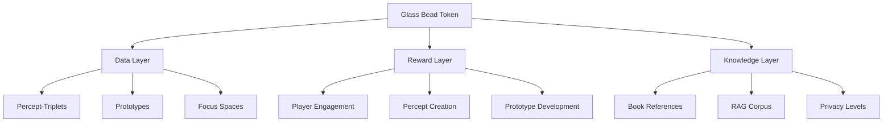
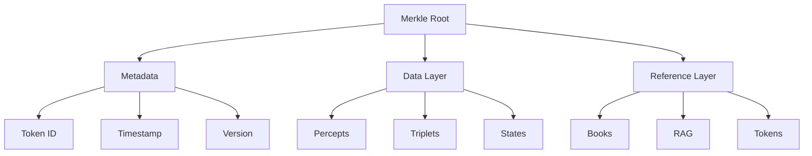
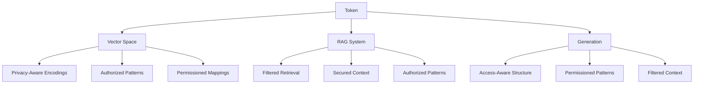

# 16. Glass Bead Tokens (GLASS)

Glass Bead tokens serve as the fundamental data structure and reward system within Memorativa. Each token encapsulates a complete percept-triplet, prototype, or focus space, including its associated metadata, relationships, and temporal states. The tokens are implemented as Solana Program Library (SPL) tokens, enabling verifiable ownership, transfer, and evolution tracking.

## Core structure

### Metadata layer
- Token identifier
- Creation timestamp
- Version history
- Privacy settings
- Owner information
- Access permissions
- Merkle root reference
- Temporal state markers (mundane, quantum, holographic)
- Active lens configurations
- Focus parameters
- Attribution data

### Data layer
- Percept-triplet encodings in hybrid spherical-hyperbolic space
- Prototype structures with spatial coordinates
- Focus space configurations
- Angular relationships (aspects)
- Spatial indices for efficient retrieval
- Component trees for verification
- Title-description pairs
- MST-translated universal symbols
- Book references and relationships

### Reference layer
- Book references
- RAG corpus links
- Related token pointers
- External resource links
- Version lineage
- Fork history
- Attribution chains
- Permission inheritance paths

## Spatial encoding

```rust
struct GlassBeadSpatial {
    // Hybrid geometry coordinates
    coordinates: HybridTriplet,  
    // Cached aspect relationships
    aspect_cache: HashMap<BeadId, AspectRelation>,
    // Spatial index for retrieval
    spatial_index: HybridSpatialIndex,
    // Lens-specific transformations
    lens_transforms: HashMap<LensType, LensTransform>
}

impl GlassBeadSpatial {
    fn update_spatial_relations(&mut self, other_beads: &[GlassBead]) {
        for bead in other_beads {
            let angle = hybrid_aspect_angle(&self.coordinates, &bead.coordinates);
            if is_significant_hybrid_aspect(angle, self.coordinates.curvature) {
                let relation = AspectRelation::new(angle);
                self.aspect_cache.insert(bead.id, relation);
            }
        }
        
        self.spatial_index.update(self.coordinates);
    }
}
```

## Temporal integration

Each token maintains three temporal states:

```rust
struct TemporalStates {
    mundane: Option<DateTime>,    // Concrete timestamps
    quantum: QuantumState,        // Indeterminate/conceptual time
    holographic: Option<ChartRef>, // Reference chart alignment
    
    // Track state transitions
    state_history: Vec<StateTransition>,
    // Cache temporal relationships
    temporal_cache: LRUCache<BeadId, TemporalRelation>
}

impl TemporalStates {
    fn calculate_temporal_weight(&self) -> f32 {
        match self {
            Some(mundane) => compute_mundane_weight(mundane),
            None => self.quantum.get_conceptual_weight()
        }
    }
    
    fn update_temporal_state(&mut self, new_state: TemporalState) {
        // Record transition
        self.state_history.push(StateTransition::new(
            self.current_state(),
            new_state
        ));
        
        // Update state
        match new_state {
            TemporalState::Mundane(dt) => self.mundane = Some(dt),
            TemporalState::Quantum(qs) => self.quantum = qs,
            TemporalState::Holographic(cr) => self.holographic = Some(cr)
        }
        
        // Invalidate cached relations
        self.temporal_cache.clear();
    }
}
```

## Privacy and access control

```rust
enum PrivacyLevel {
    Private,    // Owner only
    NotShared,  // AI training allowed
    Public,     // Full system access
    Shared(Vec<Pubkey>) // Specific users
}

struct AccessControl {
    privacy: PrivacyLevel,
    owner: Pubkey,
    readers: Vec<Pubkey>,
    encryption: Option<Pubkey>,
    // Track permission changes
    permission_history: Vec<PermissionChange>,
    // Inherited permissions
    parent_permissions: Option<Box<AccessControl>>
}

impl AccessControl {
    fn can_access(&self, user: &Pubkey) -> bool {
        match &self.privacy {
            PrivacyLevel::Private => *user == self.owner,
            PrivacyLevel::NotShared => *user == self.owner,
            PrivacyLevel::Public => true,
            PrivacyLevel::Shared(users) => users.contains(user)
        }
    }
    
    fn update_permissions(&mut self, new_privacy: PrivacyLevel) {
        self.permission_history.push(PermissionChange::new(
            self.privacy.clone(),
            new_privacy.clone()
        ));
        self.privacy = new_privacy;
    }
}
```

## Version control

The token implements hierarchical Merkle trees for efficient versioning:

```rust
struct VersionControl {
    component_trees: HashMap<ComponentType, MerkleTree>,
    delta_proofs: Vec<DeltaProof>,
    version_map: BTreeMap<u64, VersionMetadata>,
    importance_metrics: ImportanceMetrics,
    // Track lens configurations
    lens_versions: HashMap<LensType, Vec<LensVersion>>,
    // Book relationships
    book_references: Vec<BookReference>
}

impl VersionControl {
    fn create_delta(&mut self, changes: &[Change]) -> DeltaProof {
        let previous = self.current_root();
        let modified = self.apply_changes(changes);
        
        // Create proof
        let proof = DeltaProof {
            previous_root: previous,
            new_elements: modified,
            operations: changes.to_ops()
        };
        
        // Update version metadata
        self.version_map.insert(
            self.next_version(),
            VersionMetadata::new(&proof)
        );
        
        proof
    }
}
```

## RAG integration 

Tokens integrate with the RAG system through:

```rust
struct RAGInterface {
    vector_store: VectorDB,
    retrieval_index: HybridSpatialIndex,
    privacy_filter: PrivacyAwareRetriever,
    // Track usage in RAG system
    usage_metrics: RAGMetrics,
    // Cache common retrievals
    retrieval_cache: LRUCache<QueryHash, Vec<TokenRef>>
}

impl RAGInterface {
    fn retrieve_context(&self, query: &HybridTriplet) -> Vec<TokenRef> {
        // Check cache
        if let Some(cached) = self.retrieval_cache.get(&query.hash()) {
            return cached.clone();
        }
        
        // Query both spaces
        let spatial_matches = self.retrieval_index
            .query_neighbors(query)
            .filter(|t| self.privacy_filter.can_access(t));
            
        let vectors = self.vector_store
            .lookup_embeddings(spatial_matches);
            
        // Rank and cache results
        let results = rank_by_relevance(vectors, query);
        self.retrieval_cache.insert(query.hash(), results.clone());
        
        results
    }
}
```



## Token structure

### Metadata layer
- Token identifier
- Creation timestamp
- Version history
- Privacy settings
- Owner information
- Access permissions
- Optimized Merkle root reference 

### Data Layer
- Percept-triplet encodings with optimized vector storage 
- Prototype structures with quantized representations 
- Focus space configurations
- Temporal state markers
- Lens configurations 
- MST translations
- Component trees for efficient verification

### Reference layer
- Book references
- RAG corpus links
- Related token pointers
- External resource links
- Version lineage
- Fork history

## Merkle tree implementation

Glass Bead tokens use Merkle trees to:
- Track structural changes
- Verify data integrity
- Manage token evolution
- Enable efficient proofs
- Support partial updates
- Maintain version history



## Privacy levels

Each Glass Bead token supports multiple privacy settings:

1. **Private**
   - Only accessible to owner
   - Not included in RAG corpus
   - No external references

2. **Not Shared**
   - Owner accessible
   - Used for AI training
   - No public visibility

3. **Public**
   - Full system access
   - RAG corpus inclusion
   - Community visible

4. **Shared**
   - Specific user access
   - Controlled visibility
   - Collaborative features

## Token evolution

Glass Bead tokens can evolve through:

1. **Version Updates**
   - Metadata changes
   - Structure refinements
   - Reference updates
   - Privacy adjustments

2. **Forking**
   - Independent copies
   - Separate ownership
   - Divergent development
   - Optional remerging

3. **Merging**
   - Combine token structures
   - Integrate metadata
   - Resolve conflicts
   - Preserve history

## Implementation architecture

### Token structure
```rust
struct GlassBeadMetadata {
    // Core SPL token fields
    mint: Pubkey,
    owner: Pubkey,
    
    // Access control fields  
    privacy_level: PrivacyLevel,
    authorized_readers: Vec<Pubkey>,
    encryption_pubkey: Option<Pubkey>,
    merkle_root: [u8; 32],
}

enum PrivacyLevel {
    Private,
    NotShared, 
    Public,
    Shared(Vec<Pubkey>) // List of authorized accounts
}
```

### Access control system
- **On-Chain Controls**: Managed through SPL token capabilities
- **Off-Chain Encryption**: 
  - Private/NotShared: Content encrypted with owner's public key
  - Shared: Content encrypted with shared symmetric key
  - Public: Unencrypted content
  - All levels: Merkle proofs verify content integrity

### Cross-chain interoperability
```rust
pub trait SpvVerification {
    // Verify token exists on source chain
    fn verify_token(proof: MerkleProof) -> Result<bool>;
    
    // Verify token ownership
    fn verify_owner(proof: MerkleProof, owner: Pubkey) -> Result<bool>;
    
    // Verify access rights
    fn verify_access(proof: MerkleProof, reader: Pubkey) -> Result<bool>;
}
```

The cross-chain verification system:
- Uses block headers for lightweight verification
- Maintains minimal state for cross-chain awareness
- Supports bilateral verification with other chains
- Preserves privacy levels across chains

## Integration with LLMs

Glass Bead tokens enable LLM integration through:

1. **Vector Encoding**
   - Percept-triplet vectorization with privacy-aware masking
   - Prototype pattern encoding respecting access controls
   - Focus space mapping with permission boundaries
   - Temporal state representation with encrypted states

2. **RAG Enhancement**
   - Token-based retrieval filtered by access rights
   - Context enrichment within privacy constraints
   - Pattern recognition across authorized tokens
   - Symbolic analysis with privacy preservation

3. **Generation Support**
   - Structure-aware outputs respecting privacy levels
   - Pattern-based generation with access control
   - Context-sensitive responses filtered by permissions
   - Symbolic grounding with encrypted references

This token architecture creates a robust foundation for:
- Verifiable knowledge ownership
- Structured data evolution
- Collaborative development
- AI-enhanced analysis
- Privacy-aware sharing
- System-wide integration



## Key points

- Tokens combine game mechanics with semantic storage using SPL standard
- Hybrid spherical-hyperbolic spatial encoding for conceptual relationships
- Triple temporal state system (mundane, quantum, holographic) with state tracking
- Hierarchical Merkle trees with delta proofs for versioning
- Privacy-aware RAG integration with spatial retrieval and caching
- Self-balancing spatial organization with aspect caching
- Lens system integration for multiple symbolic interpretations
- Book reference tracking and relationship management
- Attribution and permission inheritance systems
- Comprehensive version control with lens configuration tracking
- Fundamental data structure encapsulating percepts, prototypes, and focus spaces
- Multi-layer architecture with metadata, data, and reference layers
- Efficient caching systems for aspects, temporal relations, and retrievals
- Robust permission model with inheritance and history tracking
- Complete integration with MST for universal symbolic translation
