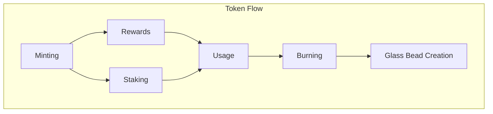

# 18. Gas Bead Tokens

Gas Bead Tokens (GBT) serve as the utility token and operational fuel within Memorativa, enabling computational processes and incentivizing system participation. While Glass Bead Tokens represent knowledge artifacts, Gas Bead Tokens power the mechanics that create and transform these artifacts.

## Core Functions

### System Operations
- Powers computational tasks like:
  - Percept-triplet calculations
  - Prototype formation
  - Focus space operations
  - Book generation
  - RAG system queries
- Covers costs for:
  - LLM inference
  - Vector calculations
  - Spatial indexing
  - Merkle tree updates

### Economic Incentives
- Rewards for:
  - Contributing percepts
  - Validating prototypes
  - Creating Books
  - Sharing knowledge
  - System maintenance
  - Gamified validation activities
- Burned to:
  - Mint Glass Bead Tokens
  - Create new focus spaces
  - Generate Books
  - Access premium features

### Gamified Validation System
```rust
struct ValidationGame {
    leaderboard: Leaderboard,
    streak_counter: StreakCounter,
    accuracy_tracker: AccuracyTracker,
    difficulty_level: Difficulty,
}

impl ValidationGame {
    fn validate_percept(&self, percept: Percept, gas: GasBeadToken) -> Result<ValidationReward> {
        let difficulty = self.calculate_difficulty(percept);
        let reward = self.calculate_reward(difficulty);
        
        gas.burn_for_operation(Operation::ValidatePercept, difficulty.base_cost())?;
        let validation_result = validate(percept)?;
        
        self.update_leaderboard(validation_result);
        self.update_streak(validation_result);
        self.update_accuracy(validation_result);
        
        gas.mint_rewards(reward)
    }

    fn calculate_reward(&self, difficulty: Difficulty) -> u64 {
        let base = match difficulty {
            Difficulty::Easy => 1,
            Difficulty::Medium => 3,
            Difficulty::Hard => 5,
            Difficulty::Expert => 10,
        };
        
        base * self.streak_multiplier() * self.accuracy_bonus()
    }
}

### Reward Structure
| Activity | GBT Reward | Description |
|----------|------------|-------------|
| Quality Percept Creation | 5-10 GBT | Contributing meaningful percepts |
| Prototype Validation | 2-5 GBT | Validating other's prototypes |
| Book Creation | 20-50 GBT | Generating comprehensive Books |
| System Validation | 1-3 GBT | Basic maintenance activities |
| Focus Space Sharing | 5-15 GBT | Making spaces public |
| Knowledge Synthesis | 10-30 GBT | Combining multiple concepts |
| Validation Streak | 1-5x | Multiplier for consecutive correct validations |
| Accuracy Bonus | 1-3x | Multiplier based on historical accuracy |
| Difficulty Bonus | 1-10x | Multiplier based on validation complexity |

### Sustainability Model
- Regular users should earn 15-30 GBT daily through basic participation
- Active contributors can earn 50-100 GBT daily
- Monthly active users should maintain positive GBT flow
- Bulk rewards for consistent quality contributions
- Bonus rewards for first-time operations
- Community rewards for collaborative activities

This model ensures:
- Basic operations remain accessible
- Quality contributions are incentivized
- Regular users maintain positive token flow
- System sustainability through balanced tokenomics

## Token Mechanics



### Minting
- Initial distribution through:
  - System participation
  - Contribution rewards
  - Validation activities
- Dynamic supply based on:
  - System activity
  - Burning rate
  - Knowledge growth

### Burning
- Required for:
  - Glass Bead Token minting
  - Focus space creation
  - Book generation
  - Premium feature access
- Burns create deflationary pressure

### Tiered Cost Structure
| Operation Type | Cost Range | Description |
|---------------|------------|-------------|
| Exploratory | 0.1-1 GBT | Draft percepts, prototype sketching, focus space experiments |
| Development | 1-10 GBT | Refining percepts, evolving prototypes, space organization |
| Production | 10-100 GBT | Final books, validated prototypes, public spaces |

### Cost Calculation
```rust
pub enum OperationTier {
    Exploratory,
    Development, 
    Production
}

pub fn calculate_operation_cost(
    op: Operation,
    tier: OperationTier,
    complexity: Complexity,
    resources: Resources
) -> u64 {
    let base_cost = match tier {
        OperationTier::Exploratory => op.base_cost() * 0.1,
        OperationTier::Development => op.base_cost(),
        OperationTier::Production => op.base_cost() * 10.0,
    };
    
    let complexity_multiplier = complexity.factor();
    let resource_adjustment = resources.adjustment();
    
    (base_cost * complexity_multiplier * resource_adjustment) as u64
}
```

### Integration Example
```rust
fn create_percept(
    input: Input, 
    tier: OperationTier,
    gas: GasBeadToken
) -> Result<Percept> {
    let cost = calculate_operation_cost(
        Operation::CreatePercept,
        tier,
        input.complexity(),
        system.resources()
    );
    
    gas.burn_for_operation(Operation::CreatePercept, cost)?;
    process_percept(input)
}
```

## Token Design

### SPL Implementation
```rust
struct GasBeadMetadata {
    mint: Pubkey,
    owner: Pubkey,
    operation_history: Vec<OperationRecord>,
    staking_info: Option<StakingData>,
    burn_metrics: BurnMetrics,
}

struct OperationRecord {
    operation_type: Operation,
    cost: u64,
    timestamp: i64,
    resource_metrics: ResourceUsage,
}

struct StakingData {
    amount: u64,
    locked_until: i64,
    reward_rate: f32,
    validator_pubkey: Option<Pubkey>,
}

struct BurnMetrics {
    total_burned: u64,
    operation_burns: HashMap<Operation, u64>,
    burn_rate: ExponentialMovingAverage,
}
```

### Operation Controls
```rust
impl GasBeadToken {
    fn verify_operation(&self, op: Operation, cost: u64) -> Result<()> {
        // Verify sufficient balance
        if self.balance < cost {
            return Err(InsufficientGas);
        }

        // Check operation rate limits
        if !self.rate_limiter.can_execute(op) {
            return Err(RateLimitExceeded);
        }

        // Verify operation permissions
        if !self.permissions.can_execute(op) {
            return Err(OperationNotAllowed);
        }

        Ok(())
    }

    fn burn_for_operation(&mut self, op: Operation, cost: u64) -> Result<()> {
        self.verify_operation(op, cost)?;
        
        // Record burn metrics
        self.burn_metrics.record_burn(op, cost);
        
        // Execute burn
        self.balance -= cost;
        
        // Update operation history
        self.record_operation(op, cost);
        
        Ok(())
    }
}
```

### Staking Mechanics
```rust
impl GasBeadStaking {
    fn stake(&mut self, amount: u64, duration: i64) -> Result<()> {
        // Verify stake amount
        if amount > self.available_balance() {
            return Err(InsufficientBalance);
        }

        // Calculate reward rate based on amount and duration
        let rate = self.calculate_reward_rate(amount, duration);
        
        // Lock tokens
        self.staking_info = Some(StakingData {
            amount,
            locked_until: current_timestamp() + duration,
            reward_rate: rate,
            validator_pubkey: None,
        });

        Ok(())
    }

    fn claim_rewards(&mut self) -> Result<u64> {
        let rewards = self.calculate_pending_rewards()?;
        self.mint_rewards(rewards)
    }
}
```

### Cross-chain Bridge
```rust
pub trait GasBeadBridge {
    fn verify_gas_balance(proof: MerkleProof) -> Result<u64>;
    fn transfer_cross_chain(
        destination_chain: ChainId,
        amount: u64,
        recipient: Pubkey
    ) -> Result<TransferProof>;
    fn receive_cross_chain(
        source_chain: ChainId,
        proof: TransferProof
    ) -> Result<()>;
}
```

### Rate Limiting
```rust
struct RateLimiter {
    operation_counts: HashMap<Operation, WindowCounter>,
    tier_limits: HashMap<OperationTier, RateLimit>,
}

impl RateLimiter {
    fn can_execute(&self, op: Operation) -> bool {
        let counter = self.operation_counts.get(&op).unwrap();
        let limit = self.tier_limits.get(&op.tier()).unwrap();
        
        counter.count_in_window() < limit.max_operations
    }
}
```

This token design enables:
- Efficient operation verification and execution
- Flexible staking mechanisms
- Cross-chain interoperability
- Rate limiting for system stability
- Detailed operation tracking
- Predictable burn mechanics 

## System Benefits

### Computational Efficiency
- Pay-per-use model ensures efficient resource utilization
- Cost structure incentivizes optimized operations
- Dynamic pricing based on system load

### Economic Sustainability
- Rewards valuable contributions
- Creates natural token velocity
- Maintains supply-demand balance
- Supports system growth

### User Incentives
- Clear value proposition for participation
- Tangible rewards for contributions
- Flexible usage options
- Staking opportunities

## Integration Examples

### Percept Creation
```rust
fn create_percept(input: Input, gas: GasBeadToken) -> Result<Percept> {
    // Calculate operation cost
    let cost = calculate_operation_cost(
        Operation::CreatePercept,
        OperationTier::Exploratory,
        input.complexity(),
        system.resources()
    );
    
    // Burn gas for operation
    gas.burn_for_operation(Operation::CreatePercept, cost)?;
    
    // Process percept
    process_percept(input)
}
```

### Book Generation
```rust
fn generate_book(
    prototype: Prototype,
    gas: GasBeadToken
) -> Result<Book> {
    // Verify sufficient gas
    let cost = calculate_book_cost(prototype);
    gas.verify_balance(cost)?;
    
    // Burn gas incrementally
    for section in prototype.sections() {
        gas.burn_for_operation(Operation::GenerateSection)?;
        generate_section(section)?;
    }
    
    finalize_book(prototype)
}
```

## Key points

- **Computational Currency**: Powers all system operations from percept creation to book generation
- **Economic Flywheel**: Self-sustaining cycle of rewards and burns maintains token velocity
- **Dynamic Pricing**: Costs auto-adjust based on system load and operation complexity
- **Incentive Alignment**: Rewards high-value knowledge contributions and system maintenance
- **Resource Management**: Cost model optimizes computational resource usage
- **Network Effects**: Token mechanics scale with knowledge base growth and user participation

The Gas Bead Token system creates a self-regulating economy that incentivizes knowledge creation while maintaining system efficiency and scalability.

