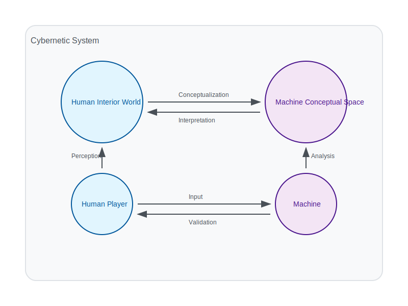

# 2.1. The Cybernetic System

The Memorativa model describes a cybernetic system where a machine-human interface is defined [1]. The interface completes the system by providing the player (human) of the game (machine) as an animating force and validator of the system. The player's input animates the system, while their validation ensures the structural correspondences defined by the model.

In this way, two worlds are bridged through Memorativa, connecting the **ideal** with the **real** through the human [3]:

- **Human Interior World**: The world of perceptions and concepts, or the **"inner cosmos"**.
- **Machine Conceptual Space**: The space of vector relationships, where percepts and prototypes are analyzed and interpreted.

## System Components

The cybernetic system consists of several interconnected components that work together to create a cohesive framework for understanding and interaction [1]:

1. **Human Component**: The conscious agent who provides input, interprets output, and validates the system's operations
2. **Machine Component**: The computational framework that processes, analyzes, and transforms data
3. **Interface Layer**: The bidirectional translation mechanism between human and machine domains
4. **Feedback Loop**: The continuous cycle of input, processing, output, and validation

## Theoretical Foundation

The cybernetic approach of Memorativa draws from established theories in cognitive science, systems theory, and human-computer interaction [1][2]. By treating the human-machine relationship as a unified system rather than separate entities, Memorativa enables deeper integration and more meaningful interactions. This approach aligns with Bateson's understanding of cybernetic systems as self-correcting assemblies with feedback mechanisms [2].

## Key Points

- The Memorativa cybernetic system creates a **bidirectional interface** between human cognition and machine computation, building on Wiener's foundational cybernetic principles where communication and control operate across both biological and mechanical systems [1]
  
- The chain of thought progresses from defining the system structure to establishing the interface, then bridging worlds and finally implementing feedback loops, following the classic cybernetic model of circular causality where outputs become inputs in a continuous cycle [1][2]
  
- Human players serve dual roles as **animators** and **validators** of the system, providing both the initial input that drives the system and the critical validation that ensures structural correspondences align with human understanding [3]
  
- The system bridges two distinct conceptual spaces: the **Human Interior World** (subjective perceptions and concepts) and the **Machine Conceptual Space** (mathematical vector relationships), creating a translation layer between qualitative human experience and quantitative computational analysis [3]
  
- This bridging function addresses a fundamental challenge in AI: the gap between human meaning-making and machine pattern recognition, enabling more intuitive and meaningful human-machine collaboration [Section 1.1]
  
- The machine space enables **formal analysis** of relationships between concepts that would be difficult to quantify in purely human terms, while preserving the richness and nuance of human conceptual understanding through the interface layer
  
- The interface translates between **subjective experience** and **mathematical representation**, allowing humans to interact with complex conceptual spaces through familiar symbolic frameworks rather than abstract vector mathematics [Section 2.4]
  
- The system creates a continuous feedback loop of **perception**, **analysis**, and **validation** that aligns with Bateson's understanding of cybernetic systems as self-correcting assemblies, enabling ongoing refinement and evolution of both the human understanding and the machine representation [2]
  
- This cybernetic approach forms the foundation for all subsequent components of Memorativa, establishing the philosophical and technical framework that enables the percept-triplet structure, focus spaces, and other system elements [Section 2.2]

## Citations

- [1] Wiener, N. (1948). *Cybernetics: Or Control and Communication in the Animal and the Machine*. MIT Press.
- [2] Bateson, G. (1972). "The Cybernetics of 'Self': A Theory of Alcoholism." In *Steps to an Ecology of Mind* (pp. 309-337). University of Chicago Press.
- [3] [Section 1.2] Philosophical Foundation of Memorativa.
- [Section 1.1] Introduction to Memorativa.
- [Section 2.2] The Core Game.
- [Section 2.4] The Percept Triplet.