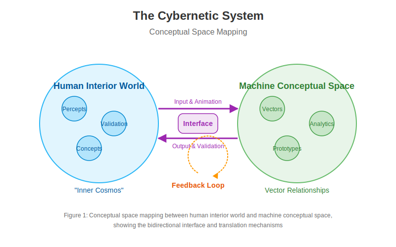

# 2.1. The Cybernetic System

The Memorativa model describes a cybernetic system where a machine-human interface is defined [1]. The interface completes the system by providing the player (human) of the game (machine) as an animating force and validator of the system. The player's input animates the system, while their validation ensures the structural correspondences defined by the model.

In this way, two worlds are bridged through Memorativa, connecting the **conceptual** with the **computational** through the interface [3]:

- **Human Interior World**: The world of perceptions and concepts, or the **"inner cosmos"**, aligning with the geocentric orientation principle established in Section 1.4 [7].
- **Machine Conceptual Space**: The space of vector relationships, where percepts and prototypes are analyzed and interpreted through the three-vector approach (Archetypal, Expression, Mundane) described in Section 1.3 [8].

*Figure 1: Conceptual space mapping between human interior world and machine conceptual space, showing the bidirectional interface and translation mechanisms*

## System Components

The cybernetic system consists of several interconnected components that work together to create a cohesive framework for understanding and interaction [1]:

1. **Human Component**: The conscious agent who provides input, interprets output, and validates the system's operations
2. **Machine Component**: The computational framework that processes, analyzes, and transforms data using the percept-triplet structure
3. **Interface Layer**: The bidirectional translation mechanism between human and machine domains that enables precise information transfer
4. **Feedback Loop**: The continuous cycle of input, processing, output, and validation that enables system self-regulation and iterative refinement [2]

## Implementation of the Percept-Triplet Structure

The cybernetic system provides the operational framework for implementing the percept-triplet structure introduced in Section 1.3 [8]. The three vectors (Archetypal, Expression, and Mundane) are processed within the machine component through:

1. **Vector Encoding**: Raw inputs are transformed into the three-vector structure
2. **Dimensional Constraint**: The system maintains interpretable relationships by constraining the vector space dimensions
3. **Semantic Clarity**: The interface translates between statistical patterns and human-understandable symbolic frameworks

This approach directly addresses the curse of dimensionality identified in Section 1.1 by creating a structured, interpretable middle layer between human symbolic thought and machine computation [5].

## Feedback Loop Engineering

The cybernetic system implements practical feedback mechanisms that enable continuous refinement and adaptation [1][2]:

1. **Input-Output Cycle**: The system processes human input, generates computational output, and presents it back to the human for validation
2. **Error Correction**: Discrepancies between intended and actual outputs are detected and used to refine the system's processing
3. **Adaptive Parameters**: System parameters adjust based on interaction history to improve translation accuracy
4. **Information Flow Regulation**: The interface manages information flow in both directions to prevent overloading while ensuring sufficient context

These mechanisms create a robust self-regulating system that improves over time through practical usage rather than requiring theoretical perfection at the outset.

## Geocentric Navigation

Building on the sky computer concept (Section 1.4), the cybernetic system implements a geocentric navigation framework within the "inner cosmos" [7]. This allows users to:

1. Orient themselves within their conceptual space
2. Navigate between related concepts based on semantic relationships
3. Develop an intuitive understanding of their knowledge landscape
4. Build on humanity's oldest computational framework as a foundation for knowledge organization

## Theoretical Foundation

The cybernetic approach of Memorativa draws from established theories in systems engineering, control theory, and human-computer interaction [1][2]. By treating the human-machine relationship as a unified system rather than separate entities, Memorativa enables deeper integration and more meaningful interactions. This approach aligns with Bateson's understanding of cybernetic systems as self-correcting assemblies with feedback mechanisms [2] and implements practical error-correction principles from control theory.

## Key Math

- **Feedback Loop Formalization**: The cybernetic feedback loop can be represented as a function $F: (H \times M) \rightarrow (H' \times M')$ where $H$ represents the human cognitive state, $M$ represents the machine state, and $(H', M')$ represents their evolved states after one cycle of interaction [1]

- **Interface Translation**: The bidirectional interface can be modeled as two functions: $T_H: M \rightarrow H$ (machine to human translation) and $T_M: H \rightarrow M$ (human to machine translation), where the composition $T_H \circ T_M$ approaches but never fully achieves an identity mapping as the system evolves [2]. This inherent gap—where $T_H \circ T_M \neq id$—represents a fundamental design tension in the system, acknowledging that perfect alignment between human conceptual understanding and machine representation remains aspirational rather than fully achievable due to subjective drift, contextual shifts, and the inherently ineffable aspects of human experience.

- **Three-Vector Processing**: The percept-triplet processing can be formalized as a transformation $P: I \rightarrow A \times E \times M$ where $I$ is the input space, and $A$, $E$, and $M$ are the Archetypal, Expression, and Mundane vector spaces respectively [8]

- **Error Correction**: The system's error correction can be modeled as $E(t+1) = E(t) - \alpha \nabla E(t)$ where $E(t)$ represents the error at time $t$, $\alpha$ is the learning rate, and $\nabla E(t)$ is the gradient of the error with respect to the system parameters [2]

## Key Points

- The Memorativa cybernetic system creates a **bidirectional interface** between human cognition and machine computation, building on Wiener's foundational cybernetic principles where communication and control operate across both biological and mechanical systems [1]
  
- The chain of thought progresses from defining the system structure to establishing the interface, then implementing practical feedback loops and system self-regulation, following the classic cybernetic model of circular causality where outputs become inputs in a continuous cycle [1][2]
  
- Human players serve dual roles as **animators** and **validators** of the system, providing both the initial input that drives the system and the critical validation that ensures structural correspondences align with human understanding [3]
  
- The system bridges two distinct conceptual spaces: the **Human Interior World** (subjective perceptions and concepts) and the **Machine Conceptual Space** (mathematical vector relationships), creating a translation layer between qualitative human experience and quantitative computational analysis [3]
  
- This bridging function addresses a fundamental challenge in AI: the gap between human meaning-making and machine pattern recognition, enabling more intuitive and meaningful human-machine collaboration [5]
  
- The machine space enables **formal analysis** of relationships between concepts that would be difficult to quantify in purely human terms, while preserving the richness and nuance of human conceptual understanding through the interface layer
  
- The interface translates between **subjective experience** and **mathematical representation**, allowing humans to interact with complex conceptual spaces through familiar symbolic frameworks rather than abstract vector mathematics [9]
  
- The system creates a continuous feedback loop of **perception**, **analysis**, and **validation** that enables error correction and adaptive refinement, implementing practical control systems principles that engineers have successfully applied across numerous domains [2]
  
- This cybernetic approach forms the foundation for all subsequent components of Memorativa, establishing the technical framework that enables the percept-triplet structure, focus spaces, and other system elements [10]

- The system implements the **three-vector approach** established in Section 1, creating a dimensionally-constrained representation that sacrifices mathematical flexibility for semantic clarity, directly addressing the curse of dimensionality in traditional AI vector spaces [8]

- By incorporating **geocentric orientation** principles from Section 1.4, the cybernetic system transforms abstract knowledge organization into an intuitive navigation experience that provides practical benefits for information retrieval and conceptual modeling [7]

- The feedback mechanisms implement proven **control systems principles**, enabling system adaptation and refinement through practical usage rather than requiring theoretical perfection from the outset [2]

- The system operationalizes the eight-step Memorativa percept encoding process outlined in Section 1.5, providing the technical framework for input entry, focus space generation, concept calculation, vector encoding, prototype aggregation, lens application, book generation, and reward distribution [4]

- The system embraces a fundamental **design tension** where perfect alignment between human understanding and machine representation ($T_H \circ T_M = id$) remains aspirational rather than fully achievable, acknowledging the inherent limitations of translation between subjective human experience and computational frameworks [2]

## Citations

- [1] Wiener, N. (1948). *Cybernetics: Or Control and Communication in the Animal and the Machine*. MIT Press.
- [2] Bateson, G. (1972). "The Cybernetics of 'Self': A Theory of Alcoholism." In *Steps to an Ecology of Mind* (pp. 309-337). University of Chicago Press.
- [3] [Section 1.2] Philosophical Foundation of Memorativa.
- [4] [Section 1.5] Section Checkpoint: Introduction.
- [5] [Section 1.1] Introduction to Memorativa.
- [6] [Section 1.2] Model of Thought.
- [7] [Section 1.4] The Sky Computer.
- [8] [Section 1.3] Perceptual Encoding.
- [9] [Section 2.4] The Percept Triplet.
- [10] [Section 2.2] The Core Game.

## See Also

- [Section 1.1: Introduction to Memorativa](../1.%20introduction/memorativa-1-1-introduction.md) — Introduces the core problems and approaches that the cybernetic system addresses
- [Section 1.2: Model of Thought](../1.%20introduction/memorativa-1-2-model-of-thought.md) — Provides the epistemological foundation for the cybernetic system's approach to understanding
- [Section 1.3: Perceptual Encoding](../1.%20introduction/memorativa-1-3-perceptual-encoding.md) — Details the percept-triplet structure implemented by the cybernetic system
- [Section 1.4: The Sky Computer](../1.%20introduction/memorativa-1-4-sky-computer.md) — Explains the geocentric orientation principles incorporated into the system
- [Section 1.5: Section Checkpoint](../1.%20introduction/memorativa-1-5-section-checkpoint.md) — Summarizes the foundational concepts that the cybernetic system implements
- [Section 2.2: The Core Game](./memorativa-2-2-the-core-game.md) — Builds upon the cybernetic system to explain the interactive game mechanics
- [Section 2.4: The Percept Triplet](./memorativa-2-4-percept-triplet.md) — Provides detailed implementation of the percept structure within the cybernetic framework