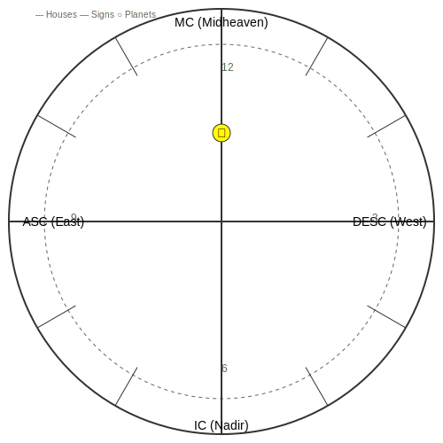
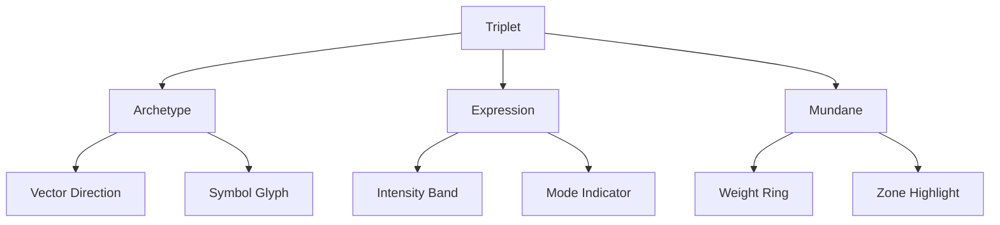

# 2.10. Visualizing the prototype

To summarize, the percept-triplet is calculated based on three vectors:

- **What**, archetypes, *Planets*
- **How**, expression of archetypes, *Signs*
- **Where**, area of expression of archetypes, *Houses*

A circular chart will encode the prototype into a conceptual space, with MST-translated title-description pairs displayed as contextual labels.

Key visualization elements:

- Planetary positions retain their astrological coordinates (Sign/House) for vector calculations
- MST-generated title-description pairs appear as primary labels
- Aspect interpretations use universalized concepts from the pairs

Create a circle and bisect it horizontally with a straight line to represent the Earth's horizon. 

Bisect the circle vertically with a straight line to represent North at the top and South at the bottom. Call the north node Midheaven and the south node Nadir. Call the east node Ascendant and the west node Descendant.

Let the left intersection of the horizon with the circle represent East and the right intersection of the horizon with the circle represent West.

Demarcate the outer perimeter of the chart into twelve sections represented by Signs.

Demarcate the inner perimeter of the chart into twelve sections represented by Houses.

The chart can now place the planets into a spatial relationship with the houses and signs to form a prototype of percept-triplets in conceptual space.

The basic chart template shows the fundamental structure used for visualization:

Key elements of the template:
- Outer circle divided into 12 signs
- Inner circle divided into 12 houses
- Horizon line (East-West axis)
- Meridian line (North-South axis)
- Cardinal points (MC, IC, ASC, DESC)
- Example planet placement (Sun glyph)

This template serves as the foundation for all prototype visualizations, with additional layers added for:
- Quantum-inspired features
- Technical indicators
- Feedback mechanisms
- Interactive elements

### Interactive Features

The horoscope visualization includes several interactive capabilities to enhance analysis and exploration:

| Feature | Description | Use Case |
|---------|-------------|-----------|
| Zoom & Pan | Magnify chart areas and move focus | Detailed aspect analysis, exploring dense clusters |
| Drag Selection | Select multiple chart elements | Compare related placements, batch analysis |
| Real-time Filters | Toggle visibility of aspects, points | Reduce complexity, focus on specific patterns |
| Lens Switching | Change interpretation frameworks | Switch between psychological, symbolic, or other views |
| Tooltip Details | Hover for detailed information | Quick access to exact degrees, aspect descriptions |
| Animation | Show progression over time | Visualize concept evolution, track changes |

The interface allows users to:
- Double-click elements to isolate related aspects
- Use mouse wheel or pinch gestures for smooth zooming
- Right-click for contextual analysis options
- Save custom views for later reference

The chart is called a **horoscope**, and is the structure used by astrology to show the placement of the planets in the sky based on a given time, date, and location. Horoscopes are typically used to calculate the placement of the planets in the sky at the time of birth for a person, which is called the **natal chart**. Astrology also calculates horoscope charts for events in the world (**mundane astrology**) or the daily transits of planets in the sky.

For any given horoscope, planets can form angular relationships (called **aspects**) to:

- each other
- house placements
- the Ascendant or other nodes

List of major aspects:

| Aspect | Angle | Symbol | Nature | Description |
|--------|--------|---------|---------|-------------|
| Conjunction | 0° | ☌ | Major | Planets occupy same position; vectors blend and intensify |
| Opposition | 180° | ☍ | Major | Planets face each other; creates tension and awareness |
| Trine | 120° | △ | Major | Harmonious flow of vectors; brings ease and opportunity |
| Square | 90° | □ | Major | Creates tension and challenges; catalyst for growth |
| Sextile | 60° | ⚹ | Major | Favorable opportunities; requires initiative |

List of minor aspects:

| Aspect | Angle | Symbol | Nature | Description |
|--------|--------|---------|---------|-------------|
| Semi-Sextile | 30° | ⚺ | Minor | Subtle connections needing conscious effort |
| Semi-Square | 45° | ∠ | Minor | Minor irritation or internal tension |
| Quintile | 72° | Q | Minor | Creative and talented expression |
| Bi-Quintile | 144° | bQ | Minor | Unique gifts and abilities |
| Quincunx | 150° | ⚻ | Minor | Adjustment and adaptation required |

The Memorativa model uses the major and minor aspects as symbolic validators for the mapping of percepts to concepts and the forming of conceptual relationships.

To reduce complexity, the system groups aspects into broad categories:

- **Harmonious**: Trine (120°), Sextile (60°).
- **Challenging**: Square (90°), Opposition (180°).
- **Neutral**: Conjunction (0°), Quincunx (150°).

This approach allows users to analyze relationships at a higher level of abstraction, without needing to calculate exact degrees.

The horoscope chart visualization is generated using the Swiss Ephemeris SDK, a high-precision astronomical calculation library. The Swiss Ephemeris provides accurate planetary positions and house calculations needed to create detailed astrological charts. While Memorativa uses these charts primarily for conceptual visualization rather than astronomical calculation, the Swiss Ephemeris ensures precise and reliable chart rendering.

Key Swiss Ephemeris features used:

- Planet position calculation in signs
- House system computation
- Angular relationship (aspect) calculation
- Chart drawing capabilities

For actual astronomical calculations (like daily transits), the Swiss Ephemeris provides NASA-grade precision based on the DE431 ephemeris. However, for Memorativa's conceptual charts where exact degree positions aren't required, the built-in Moshier algorithm provides sufficient accuracy with minimal resource usage.

For any given day, a mundane chart shows the placement of planets in houses and signs and their angular relationships, indicating symbolic relationships between archetypes conditioned by house and sign placement (the percept-triplet structure).

To discover the relationship between an individual and the world (or another individual), two charts can be superimposed and the angular relationships discovered between them. For example, a natal chart can be superimposed with a daily transit chart to interpret the archetypal patterns for a given individual on a given day. In this case, the transiting planets can form angular relationships with the planets in the individual's natal chart. Astrologers can use a natal chart as a canonical reference and representation for the individual, as it will encode the same birth sky chart into each chart's angular relationship analysis. In this way, the natal chart serves an analogous role as the reference beam in the construction of a hologram, maintaining a consistent resonant template across time periods.

Where astrology typically uses horoscopes to calculate the placement of the actual planets in the sky for an actual person, object, or event, Memorativa uses horoscopes to calculate the placement of imaginary planets in a conceptual space based on human perceptions which may or may not be of objects on Earth in space and time (e.g. apples, memories of apples, dreams of apples, reflections of apples). These *imaginaries* (planets and spaces) are structures generated by the union of percepts with concepts inside the imaginary space of the human mind. As such, they do not require time vectors.

Just like real planets, real objects, and real events, imaginaries can be shown on a horoscope chart and their angular relationships discovered. Without time vectors, the placement of planets cannot be calculated to any degree placement, only placement *in* a house and sign. If the time vector is known, then the a value of 0 - 29 degrees can be calculated for the exact placement of the planet in the sign.

## Superimposed charts

Superimposed charts in Memorativa involve overlaying multiple horoscope-like charts to analyze relationships between different percepts or concepts. This technique draws from astrological practices like synastry and transit analysis but applies them to conceptual rather than celestial data. Each chart represents a percept or concept encoded as a set of percept-triplets (Planet-Sign-House). By superimposing charts, the system can examine angular relationships (aspects) between these percept-triplets to infer conceptual connections:

- **Angular Relationships**: Uses aspects (conjunction, opposition, trine, etc.) to analyze conceptual proximity and interaction  
- **Time Flexibility**: Can operate with or without time vectors, allowing for both precise and symbolic analysis  
- **Multi-Chart Analysis**: Enables comparison of multiple percepts or concepts simultaneously  

| **Use Case**                  | **Description**                                                                 |
|-------------------------------|---------------------------------------------------------------------------------|
| **Conceptual Relationship Mapping** | Compare individual perceptions to identify common themes or conflicts. Analyze how different ideas interact within a larger system. |
| **Temporal Analysis**         | Track the evolution of a concept over time by comparing charts from different periods. Examine how past events influence current perceptions. |
| **Event Analysis**            | Study the conceptual relationships between significant events. Identify underlying themes or patterns in a series of events. |
| **Individual vs. Collective Analysis** | Compare personal perceptions with collective or cultural concepts. Explore how individual ideas relate to broader societal narratives. |
| **Cross-Domain Connections**  | Analyze relationships between concepts from different domains (e.g., art, science, mythology). Identify symbolic parallels or conceptual bridges. |

**Example Applications**  

- **Personal Growth**: Superimpose current "Self-Identity Framework" with past "Childhood Influence Matrix"  
- **Cultural Analysis**: Compare "Eastern Creation Myths" vs. "Western Origin Stories" prototypes  
- **Event Analysis**: Study "Technological Disruption" relationships through title-description aspects  

## Progressed charts

Progressed charts in Memorativa represent the evolution of percept-triplets over conceptual time. Unlike astrological progressions that use actual time, these track how concepts and perceptions develop through symbolic time periods:

- **Symbolic Time**: Each unit represents a conceptual shift rather than chronological time
- **Evolution Tracking**: Shows how percept-triplets transform as understanding deepens
- **Pattern Recognition**: Reveals developmental sequences in concept formation

Key progression methods:

| Method | Description | Application |
|--------|-------------|-------------|
| Secondary | One symbolic unit = one major conceptual shift | Track gradual evolution of understanding |
| Solar Arc | All points move uniformly | Model systematic conceptual development |
| Tertiary | Micro-progressions | Track subtle perceptual changes |

Progressed charts help analyze:

- Concept maturation patterns
- Developmental sequences
- Emergent properties in complex systems
- Learning and adaptation cycles

## Additional chart analysis methods

Memorativa extends its analytical capabilities through several specialized chart techniques:

| Method | Description | Application |
|--------|-------------|-------------|
| **Composite** | Averages multiple chart positions | Analyzes relationship/group dynamics essence |
| **Harmonic** | Divides chart by integers | Reveals deeper conceptual resonance patterns |
| **Relocational** | Recalculates from different perspectives | Explores conceptual shifts across viewpoints |
| **Draconic** | Uses Moon's nodes as reference | Examines evolutionary themes |
| **Midpoint** | Studies points between elements | Identifies hidden conceptual connections |
| **Heliocentric** | Centers on Sun vs Earth | Offers universal/collective perspective |
| **Synastry** | Direct chart comparison | Highlights specific element interactions |
| **Transit** | Overlays moving chart on static | Tracks external influence patterns |

These methods provide additional tools for:

- Discovering subtle conceptual relationships
- Analyzing group dynamics and collective patterns
- Identifying developmental sequences
- Mapping perspective-dependent shifts
- Tracking evolutionary trajectories

### Percept-Triplet Visualization

Individual percept-triplets within the prototype are visualized through several methods:

| Method | Description | Visual Elements |
|--------|-------------|-----------------|
| Vector Glyph | 3D vector representation showing archetype-expression-mundane components | - Arrow direction for archetype vector - Color intensity for expression strength - Glyph size for mundane weight |
| Orbital Path | Curved trajectory showing triplet's motion in hybrid space | - Path color for verification score - Path thickness for aspect strength - Dashed lines for uncertain regions |
| Field Lines | Force field visualization showing triplet's influence | - Line density for field strength - Line curvature for spatial warping - Color gradients for interaction zones |
| Phase Portrait | Dynamic state visualization of triplet evolution | - Phase angle markers - State transition arrows - Stability indicators |

#### Interactive Triplet Features

Each percept-triplet visualization supports:

- Hover tooltips showing detailed vector components
- Click-and-drag manipulation of triplet position
- Double-click to isolate triplet and its aspects
- Right-click menu for additional analysis options
- Pinch-zoom to explore local space curvature

#### Vector Component Display

The vector component display shows:
- Archetype vector as directional arrow with planetary glyph
- Expression strength through colored intensity bands
- Mundane weight via concentric rings
- Interaction zones through highlighted regions

### Quantum-Inspired Visualization Features

The visualization includes quantum-inspired elements to represent the enhanced prototype model:

| Feature | Description | Use Case |
|---------|-------------|-----------|
| Amplitude Visualization | Shows quantum amplitude of triplets | Analyze interference patterns |
| Phase Coloring | Color gradients showing phase relationships | Track quantum coherence |
| Interference Patterns | Visual representation of triplet interactions | Identify quantum resonance |
| Blended Distance Display | Combined classical/quantum metrics | Evaluate relationship strength |

### Advanced Visualization Components

The chart includes additional technical visualization elements:

| Component | Description | Purpose |
|-----------|-------------|----------|
| Curvature Indicator | Shows local space curvature (κ) | Monitor geometry transitions |
| Weight Vectors | Displays verification, temporal, and aspect weights | Track learning state |
| Aspect Cache | Visual cache of frequently accessed aspects | Optimize performance |
| Merkle History | Timeline of prototype evolution | Verify state changes |

### Feedback Visualization

The interface provides visual feedback mechanisms:

- Color coding for feedback strength and confidence
- Visual indicators for AI-generated synthetic feedback
- Aspect pattern highlighting based on learning state
- Temporal consistency markers
- Cross-prototype relationship indicators

## Key points

- The horoscope chart provides a visual framework for mapping percept-triplets into conceptual space
- Angular relationships (aspects) validate conceptual connections and patterns
- Multiple analysis methods (composite, harmonic, relocational, etc.) offer different perspectives on conceptual relationships
- Quantum-inspired visualization features enable analysis of interference patterns and coherence
- Advanced technical components display curvature, weights, and evolutionary history
- Interactive feedback mechanisms provide real-time learning state visualization
- Superimposed charts enable comparison between different percept-triplets or conceptual frameworks
- Progressed charts track the evolution of concepts through symbolic time
- Time vectors are optional - allowing both precise and symbolic analysis
- The system uses Swiss Ephemeris SDK for technical implementation while focusing on conceptual rather than astronomical applications
- The system operates on three interpretation levels: individual, relational, and systemic
- Visualization enables both detailed analysis and pattern recognition at scale
