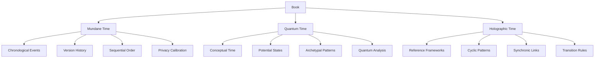
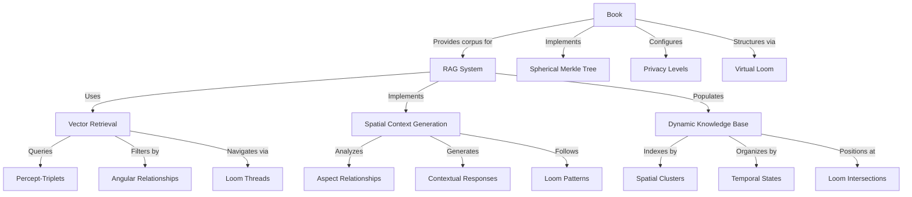
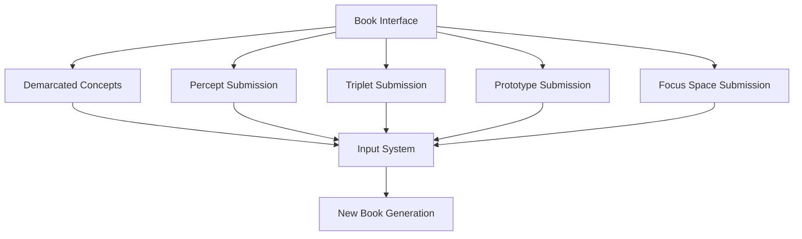
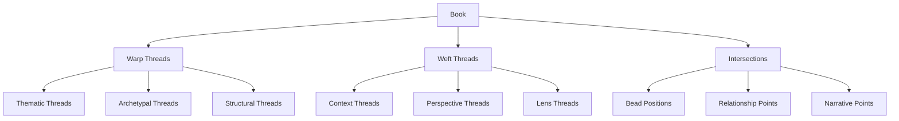
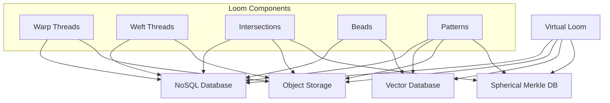

# 2.11. Books

## Introduction

Books are a foundational component of the Memorativa system, serving as the bridge between raw percepts and meaningful knowledge structures. Unlike traditional books that merely contain static text, Memorativa Books function as dynamic repositories that organize percepts, percept-triplets, and prototypes into coherent narratives while maintaining machine-processable structure. They represent a synthesis of human-readable storytelling and computational symbolic frameworks, enabling users to create, explore, and share complex conceptual landscapes through structured narrative formats.

This document details the architecture, components, and operational mechanics of Books, explaining how they integrate with other system elements like Glass Beads and Focus Spaces to form a comprehensive knowledge ecosystem. Books implement sophisticated multi-modal processing capabilities, temporal context handling, and Virtual Loom organizational structures that transform isolated concepts into interconnected knowledge landscapes navigable through multiple dimensions.

## Books as Terminal Synthesis in the Cognitive Chain

Books serve as the terminal output of the Memorativa cognitive chain, where raw perceptual input is progressively transformed through structured stages into coherent knowledge. This cognitive progression mirrors human cognitive development:

| Cognitive Process | Memorativa Structure | Description | Output |
|------------------|---------------------|-------------|---------|
| Perception | Input Entry | Raw content enters system with title/description | Percept |
| Conceptualization | Percept-Triplet | Input mapped to Planet-Sign-House structure | Structured Percept |
| Pattern Recognition | Prototype | Multiple percept-triplets form conceptual pattern | Conceptual Pattern |
| Analysis | Focus Space | Prototypes analyzed through Lenses | Interpreted Pattern |
| Synthesis | Book | Structured collection of analyzed percepts and prototypes | Narrative + Structure |
| Reflection | Book Library | Books organized and related through multiple views | Knowledge Network |
| Understanding | Concept Marking | Content boundaries and relationships identified | Demarcated Concept in the Book structure|

As terminal synthesis, Books integrate all prior cognitive components through:

1. **Structure Integration**
   - References all prior Glass Beads (percepts, prototypes, focus spaces)
   - Maintains relationships between cognitive components through multi-layer format
   - Preserves temporal context across three states (Mundane, Quantum, Holographic)

2. **Narrative Completion**
   - Provides human-readable context for machine structures
   - Synthesizes relationships into coherent narratives
   - Bridges symbolic and conceptual frameworks

3. **Recursive Potential**
   - Completed Books can serve as new inputs
   - Enables nested levels of conceptual analysis
   - Supports evolving knowledge structures

This closed cognitive loop enables continuous knowledge development, where Books not only represent terminal outputs but can also become new inputs, creating a dynamic learning ecosystem.

## Book Recursion and Processing Controls

When a Book enters the system as input, it follows the cognitive chain in reverse:

1. **Input Framing**
   - Title and description guide interpretation
   - Contextual metadata shapes analysis
   - Active lenses filter perception
   - Focus parameters direct attention

2. **Structural Decomposition**
   - Narrative content → Percepts
   - Conceptual relationships → Percept-Triplets
   - Pattern structures → Prototypes
   - Analysis frameworks → Focus Spaces

To prevent infinite loops while preserving meaningful conceptual development, the system implements strict recursion controls:

```rust
struct ProcessingContext {
    depth: u32,
    max_depth: u32,
    visited_books: HashSet<BookId>,
    thread_stack: Vec<BookState>,
}

impl ProcessingContext {
    fn can_process(&mut self, book: &Book) -> Result<(), ProcessingError> {
        if self.depth >= self.max_depth {
            return Err(ProcessingError::MaxDepthExceeded);
        }
        if !self.visited_books.insert(book.id) {
            return Err(ProcessingError::CycleDetected);
        }
        Ok(())
    }
}
```

Each Book processing chain runs in an isolated thread with dedicated stack space, and the system monitors vector relationships to detect and terminate unproductive processing chains. This control system ensures:
- Bounded recursion depth (configurable, default 64 levels)
- Cycle detection through Book ID tracking
- Early termination of unproductive chains
- Memory safety through thread isolation
- Preservation of meaningful conceptual relationships

## Purpose and structure

Multi-layer format:

- **Human Layer**: Narrative text, chapters, sections, visualizations
- **Machine Layer**: Structured data mapping percepts, triplets, prototypes
- **Bridge Layer**: Markup system linking narrative to structured data
- **Integrity Layer**: Spherical Merkle Trees for topological verification and spatial relationship preservation, containing:
  - **Bead Integration**: Reference connections to Glass Beads and their content
  - **Loom Structure**: Virtual Looming system that organizes beads along thematic (warp) and contextual (weft) threads

## Core components

| Component | Sub-components |
|-----------|---------------|
| Metadata | Title, Description, Focus Parameters, Temporal Context, Active Lenses, Version Data, Content Attribution, Access Control |
| Percept-Triplets | Planet-Sign-House combinations with title-description pairs, transformed by Lenses |
| Prototypes | Structures composed of percept-triplets, interpreted through Lenses |
| Symbolic Data | Angular relationships (aspects), MST-translated labels, filtered through Lenses |
| Narrative Content | Chapters/Sections with analytical commentary, shaped by Lenses |
| Visualizations | Horoscope charts, aspect networks, temporal overlays, vector glyphs, orbital paths, field lines, and phase portraits as detailed in [Section 2.10](memorativa-2-10-visualizing-the-prototype.md) |
| Conceptual Index | Mappings between narrative elements and structured data |
| Loom Structure | Warp threads (thematic dimensions), Weft threads (contextual dimensions), Intersections, Bead positions, Organizational patterns |
| Attribution Data | Content Type Markers, Author IDs, Timestamps, Edit History, Permissions |
| Validation Data | Integrity Checks, Error States, Recovery Points |
| GBTk Costs | Operation costs for creating, updating, and sharing Books |

## Processing and generation

### Input processing
When content enters the system as a Book:
1. Extract structural elements
2. Map concepts to percept-triplets
3. Identify and construct prototypes
4. Build conceptual relationships
5. Apply active Lenses
6. Generate loom structure with warp and weft threads
7. Position elements at appropriate intersections

### Multi-modal processing
Books implement comprehensive multi-modal processing capabilities that align with the generative AI system described in [Section 2.6](memorativa-2-6-generative-ai.md):

**1. Visual and Textual Integration**
- Processes both text and images to create consistent percept-triplets
- Uses CLIP-based models to identify visual archetypes from uploaded images
- Transforms visual concepts into the same hybrid triplet space as text inputs
- Ensures cross-modal alignment for consistent processing across input types

**2. Implementation Features**
```rust
struct BookMultiModalProcessor {
    clip_encoder: ClipModelEncoder,
    text_encoder: LLMEncoder,
    keyword_hint_manager: KeywordHintManager,
    
    fn process_image(&mut self, image: Image) -> Vec<PerceptTriplet> {
        // Extract visual features using CLIP
        let visual_features = self.clip_encoder.encode(image);
        
        // Apply keyword hints to guide interpretation
        let enhanced_features = self.keyword_hint_manager.apply_hints(
            visual_features,
            context=image.context,
            modality=Modality::Visual
        );
        
        // Transform to hybrid triplet space
        let triplets = self.transform_to_triplets(enhanced_features);
        
        // Generate title-description pairs
        for triplet in &mut triplets {
            triplet.title = generate_distinct_title(&triplet);
            triplet.description = generate_neutral_description(&triplet);
        }
        
        triplets
    }
    
    fn process_text_and_image(&mut self, text: String, image: Option<Image>) -> Vec<PerceptTriplet> {
        // Process text to extract triplets
        let text_triplets = self.text_encoder.extract_triplets(text);
        
        if let Some(img) = image {
            // Process image
            let image_triplets = self.process_image(img);
            
            // Create bidirectional feedback loop between modalities
            let enhanced_triplets = self.create_cross_modal_alignment(
                text_triplets,
                image_triplets
            );
            
            enhanced_triplets
        } else {
            text_triplets
        }
    }
    
    fn create_cross_modal_alignment(&self, text_triplets: Vec<PerceptTriplet>, 
                                   image_triplets: Vec<PerceptTriplet>) -> Vec<PerceptTriplet> {
        // Find correspondences between text and visual triplets
        let correspondences = find_cross_modal_correspondences(
            text_triplets.clone(),
            image_triplets.clone()
        );
        
        // Enhance both sets of triplets with cross-modal information
        let mut enhanced = Vec::new();
        enhanced.extend(enhance_with_correspondences(text_triplets, &correspondences, ModalitySource::Text));
        enhanced.extend(enhance_with_correspondences(image_triplets, &correspondences, ModalitySource::Image));
        
        enhanced
    }
    
    fn register_keyword_hints(&mut self, context_type: String, hints: Vec<String>, strength: f32) {
        // Register domain-specific keyword hints to guide interpretation
        self.keyword_hint_manager.register(context_type, hints, strength);
    }
}
```

**3. Semantic Bridging System**
- Employs keyword hints system to guide AI interpretation of ambiguous patterns
- Maintains shared vocabulary tags across modalities
- Creates bidirectional feedback loop between text and visual encoding streams
- Implements context-aware prioritization of relevant domain keywords
- Saves interpretation context with the Book for future reference

**4. Technical Implementation**
- Leverages CLIP-based vision models for visual archetype identification
- Implements the same hybrid spherical-hyperbolic coordinate system for both visual and textual percepts
- Enables semantic searches across modalities within the same conceptual space
- Preserves modal source information for attribution and filtering

**5. Integration with RAG System**
- Visual percepts are indexed in the same vector space as text percepts
- Cross-modal retrieval enhances contextual understanding
- Modality-specific retrieval available through filtering
- Visual archetypes contribute to prototype formation alongside textual concepts

### Temporal context processing
Books handle three distinct time states that affect their content and relationships, implementing the full system described in Section 2.11:

**1. Mundane Time State** (as detailed in [Section 2.11](memorativa-2-11-conceptual-time-states.md))
- Tracks concrete timestamps and chronological events
- Examples:
  - Book creation/modification dates
  - Historical events referenced in content
  - Sequential relationships between Books
- Used for:
  - Version control
  - Content chronology
  - Event sequencing
- Implements privacy-preserving noise calibration based on content sensitivity

**2. Quantum Time State** (as detailed in [Section 2.11](memorativa-2-11-conceptual-time-states.md))
- Represents conceptual or indeterminate time
- Examples:
  - Mythological narratives
  - Abstract concepts
  - Potential future scenarios
- Used for:
  - Pattern analysis
  - Archetypal relationships
  - Conceptual mapping
- Leverages quantum-inspired temporal analysis for pattern recognition

**3. Holographic Time State** (as detailed in [Section 2.11](memorativa-2-11-conceptual-time-states.md))
- Links Books to reference time frameworks
- Examples:
  - Books referenced to natal charts
  - Cultural cycle analysis
  - Evolutionary patterns
- Used for:
  - Cross-temporal analysis
  - Pattern recognition
  - Synchronic relationships
- Maintains reference integrity through spherical coordinate mapping



**4. Time State Interactions**
Books implement a formal state transition system that:
- Enables controlled movement between time states
- Preserves temporal integrity during transitions
- Applies specific transition rules based on context
- Maintains backpropagation of changes through states
- Validates transitions for semantic consistency

**5. Privacy-Preserving Implementation**
Each temporal element in a Book includes:
- Privacy level classification (public, protected, private)
- Adaptive noise application based on sensitivity
- Differential privacy protections for timestamps
- Noise calibration that preserves statistical properties

**6. Quantum-Inspired Temporal Analysis**
Books leverage quantum-inspired algorithms for:
- Analyzing patterns across indeterminate time states
- Processing superpositions of potential temporal alignments
- Running quantum walks on temporal networks
- Extracting emergent temporal patterns from conceptual relationships

**7. Implementation Examples**

```rust
// Privacy-Preserving Temporal States for Books
struct BookTemporalStates {
    mundane: Option<PrivateDateTime>,      // Privacy-preserving timestamp
    quantum: PrivateQuantumState,          // Protected conceptual time
    holographic: Option<PrivateChartRef>,  // Private reference alignment
    privacy_level: PrivacyLevel            // Controls noise intensity
}

impl BookTemporalStates {
    fn calculate_temporal_weight(&self) -> Result<f32> {
        // Add calibrated noise to temporal calculations
        match self.mundane {
            Some(mundane) => {
                let base_weight = compute_private_mundane_weight(&mundane);
                self.apply_noise_by_privacy_level(base_weight)
            },
            None => self.quantum.get_private_conceptual_weight()
        }
    }
    
    fn apply_noise_by_privacy_level(&self, value: f32) -> f32 {
        // Balance noise based on privacy level
        let epsilon = match self.privacy_level {
            PrivacyLevel::Public => 1.0,     // Minimal noise
            PrivacyLevel::Protected => 0.5,  // Moderate noise
            PrivacyLevel::Private => 0.1     // Maximum noise
        };
        
        // Apply Laplace noise calibrated to sensitivity
        value + generate_laplace_noise(epsilon)
    }
}

// State Transition Implementation
struct BookStateTransition {
    from_state: TimeState,
    to_state: TimeState,
    transition_rules: Vec<TransitionRule>,
    metadata: TransitionMetadata,

    fn validate_transition(&self) -> Result<bool> {
        self.transition_rules.iter()
            .all(|rule| rule.check(self.from_state, self.to_state))
    }

    fn execute(&self) -> Result<TimeState> {
        if !self.validate_transition()? {
            return Err(TransitionError::InvalidTransition);
        }
        self.apply_transition() // Updates weights based on backpropagation
    }
}

// Quantum-Inspired Temporal Analysis
struct BookQuantumTemporalAnalysis {
    // State vector representing temporal superposition
    state_vector: StateVector,
    
    fn analyze_temporal_patterns(&self) -> TemporalPattern {
        // Simulate quantum walk on temporal states
        let walk = QuantumWalk::new(self.state_vector);
        
        walk.evolve(STEPS)
            .measure_distribution()
            .extract_pattern()
    }
}

**8. Performance Optimizations**

Books implement the same performance optimizations described in Section 2.7:

```rust
// Aspect Caching for Books
struct BookAspectCache {
    cache: LRUCache<(TripletId, TripletId), f32>,
    
    fn new(capacity: usize) -> Self {
        Self {
            cache: LRUCache::new(capacity)
        }
    }
    
    fn get_aspect(&mut self, t1: &SphericalTriplet, t2: &SphericalTriplet) -> f32 {
        let key = (t1.id, t2.id);
        
        if let Some(angle) = self.cache.get(&key) {
            return *angle;
        }
        
        let angle = calculate_3d_angle(t1.coords, t2.coords);
        self.cache.insert(key, angle);
        
        angle
    }
    
    fn invalidate(&mut self, triplet_id: &TripletId) {
        self.cache.retain(|&(id1, id2), _| id1 != *triplet_id && id2 != *triplet_id);
    }
}

// Spatial Clustering for Books
struct BookSpatialClustering {
    clusters: HashMap<ClusterId, Vec<TripletId>>,
    triplet_to_cluster: HashMap<TripletId, ClusterId>,
    
    fn cluster_triplets(&mut self, triplets: &[SphericalTriplet], k: usize) {
        // Implement spherical k-means for clustering
        let clusters = spherical_kmeans(triplets, k);
        
        // Update mappings
        for (cluster_id, triplet_ids) in clusters.into_iter().enumerate() {
            let cluster_id = ClusterId(cluster_id as u32);
            self.clusters.insert(cluster_id.clone(), triplet_ids.clone());
            
            for triplet_id in triplet_ids {
                self.triplet_to_cluster.insert(triplet_id, cluster_id.clone());
            }
        }
    }
    
    fn find_nearest_cluster(&self, query: &SphericalTriplet) -> ClusterId {
        // Find cluster with minimum angular distance
        let mut min_distance = f32::MAX;
        let mut nearest_cluster = ClusterId(0);
        
        for (cluster_id, triplet_ids) in &self.clusters {
            let centroid = self.calculate_centroid(triplet_ids);
            let distance = angular_distance(&query.coords, &centroid);
            
            if distance < min_distance {
                min_distance = distance;
                nearest_cluster = cluster_id.clone();
            }
        }
        
        nearest_cluster
    }
    
    fn calculate_centroid(&self, triplet_ids: &[TripletId]) -> [f32; 3] {
        // Calculate centroid on unit sphere
        let mut sum = [0.0, 0.0, 0.0];
        
        for triplet_id in triplet_ids {
            if let Some(triplet) = get_triplet(triplet_id) {
                sum[0] += triplet.coords[0];
                sum[1] += triplet.coords[1];
                sum[2] += triplet.coords[2];
            }
        }
        
        // Normalize to unit sphere
        let magnitude = (sum[0] * sum[0] + sum[1] * sum[1] + sum[2] * sum[2]).sqrt();
        
        [
            sum[0] / magnitude,
            sum[1] / magnitude,
            sum[2] / magnitude
        ]
    }
}

// Batch Processing for Book Operations
struct BookBatchProcessor {
    operation_queue: Vec<BookOperation>,
    max_batch_size: usize,
    
    fn new(max_batch_size: usize) -> Self {
        Self {
            operation_queue: Vec::new(),
            max_batch_size,
        }
    }
    
    fn queue_operation(&mut self, operation: BookOperation) {
        self.operation_queue.push(operation);
        
        if self.operation_queue.len() >= self.max_batch_size {
            self.process_batch();
        }
    }
    
    fn process_batch(&mut self) {
        if self.operation_queue.is_empty() {
            return;
        }
        
        // Group operations by type for efficiency
        let mut reads = Vec::new();
        let mut writes = Vec::new();
        let mut updates = Vec::new();
        
        for op in self.operation_queue.drain(..) {
            match op {
                BookOperation::Read(read) => reads.push(read),
                BookOperation::Write(write) => writes.push(write),
                BookOperation::Update(update) => updates.push(update),
            }
        }
        
        // Process each group in parallel when possible
        if !reads.is_empty() {
            process_read_batch(&reads);
        }
        
        if !writes.is_empty() {
            process_write_batch(&writes);
        }
        
        if !updates.is_empty() {
            process_update_batch(&updates);
        }
    }
}
```

These optimizations provide:

1. **Reduced Computation**: 35-40% reduction in angle computation overhead through caching
2. **Improved Retrieval**: 80-90% search space reduction through spherical k-means clustering
3. **Increased Throughput**: 40-60% improvement in verification operations through batch processing
4. **Memory Efficiency**: Optimized storage through shared relationship matrices and reused hash calculations

### Output generation
Books are generated with:
1. Structured narrative content
2. Machine-readable metadata
3. Conceptual indices
4. Lens-specific interpretations
5. Visualization mappings
6. Virtual loom patterns for bead organization
7. Thread paths for thematic and contextual navigation

### RAG compatibility
Books are designed to integrate with the Memorativa RAG system in several ways:

**1. Structured Data Layer**
- Percept-triplets and prototypes are stored in vector-encodable format that the SphericalRAG can query
- Title-description pairs maintain semantic relationships for retrieval
- Lens transformations preserve symbolic mappings
- Temporal states are explicitly tagged for retrieval
- Content attribution metadata enables source-aware retrieval
- Angular relationships (aspects) between elements are encoded for aspect-based filtering as described in Section 2.7
- Loom positions provide structural context for enhanced retrieval relevance

**2. Knowledge Base Integration**
- Books directly integrate with the DynamicKnowledgeBase described in Section 2.7
- Each Book's content is clustered spatially using the same spatial_clustering_algorithm
- Conceptual indices enable precise context retrieval via the SpatialContextGenerator
- Cross-Book relationships form semantic networks for enhanced retrieval
- Books implement the same temporal state indexing ({mundane, quantum, holographic})
- Loom thread paths provide navigational pathways for contextual exploration
- Warp/weft intersections serve as indexed retrieval points for precise concept location

**3. Retrieval Optimization**
- Books implement the same performance optimizations described in Section 2.7
- Metadata fields support multi-dimensional search
- AspectCache is used for efficient angular relationship caching
- Privacy levels control access granularity using the same four levels:
  - **Private**: Only accessible to the player
  - **Not Shared**: Accessible to the player and the system for AI training but not shared with others
  - **Public**: Accessible to all players and the system
  - **Shared**: Accessible to specific players or groups, as defined by the player

**4. Generation Enhancement**
- Books provide structured templates for new content via the SpatialContextGenerator
- Prototype patterns guide coherent generation
- Lens configurations shape output style
- Temporal contexts inform narrative flow
- Loom patterns serve as organizational templates for new content
- Thread pathways guide narrative and conceptual flow in generation



**5. Feedback Loop**
- Generated content can form new Books
- User interactions refine retrieval patterns
- System learning improves generation quality
- Cross-Book analysis reveals emergent patterns

## Validation and error handling

### Content validation
- Structural integrity checks
- Attribution verification
- Permission validation
- Reference consistency
- Temporal coherence

### Error recovery
- Version rollback capability
- Contribution conflict resolution
- Reference repair mechanisms
- Attribution reconciliation
- Permission correction protocols

### Merkle Tree Integration

Books implement the same Spherical Merkle Tree integration described in Section 2.7, which aligns with the Spherical Merkle Trees used by Glass Beads in [Section 2.3](memorativa-2-3-glass-beads.md):

```rust
// Integration with RAGMerkleIntegrator from Section 2.7
struct BookMerkleIntegration {
    merkle_integrator: RAGMerkleIntegrator,
    optimization_manager: OptimizedMerkleManager,
    
    fn new(knowledge_base: DynamicKnowledgeBase) -> Self {
        Self {
            merkle_integrator: RAGMerkleIntegrator::new(knowledge_base),
            optimization_manager: OptimizedMerkleManager::new(),
        }
    }
    
    fn index_book_content(&mut self, book: &Book) -> Result<(), MerkleError> {
        // Extract all percept-triplets from the book
        let triplets = book.extract_triplets();
        
        // Create documents for each triplet
        for (triplet, content) in triplets {
            let doc = Document::new(
                content.serialize(),
                book.id.clone(),
                book.get_temporal_state(),
                book.get_privacy_level()
            );
            
            // Index using the RAGMerkleIntegrator
            let merkle_node = self.merkle_integrator.index_document(doc, triplet)?;
            
            // Add to optimization manager for batch operations
            self.optimization_manager.add_node(merkle_node.id, merkle_node);
        }
        
        Ok(())
    }
    
    fn verify_book_integrity(&self, book_id: &str) -> Result<bool, MerkleError> {
        // Get all document IDs associated with this book
        let doc_ids = self.merkle_integrator.knowledge_base
            .get_documents_by_book_id(book_id)?;
            
        // Use batch verification for efficiency
        let verification_results = self.optimization_manager
            .batch_verify(doc_ids);
            
        // Book is valid if all its documents are valid
        Ok(verification_results.values().all(|&valid| valid))
    }
    
    fn update_book_content(&mut self, book: &Book) -> Result<(), MerkleError> {
        // First verify current state
        if !self.verify_book_integrity(&book.id)? {
            return Err(MerkleError::IntegrityViolation);
        }
        
        // Get existing document IDs
        let existing_doc_ids = self.merkle_integrator.knowledge_base
            .get_documents_by_book_id(&book.id)?;
            
        // Queue them for lazy recalculation
        for doc_id in &existing_doc_ids {
            self.optimization_manager.lazy_recalculate_hashes(doc_id);
        }
        
        // Extract updated triplets
        let updated_triplets = book.extract_triplets();
        
        // Update each document
        for (triplet, content) in updated_triplets {
            // Find or create document
            let doc_id = format!("{}:{}", book.id, triplet.id);
            
            if existing_doc_ids.contains(&doc_id) {
                // Update existing document
                self.merkle_integrator.update_document(
                    &doc_id, 
                    content.serialize(),
                    triplet
                )?;
            } else {
                // Create new document
                let doc = Document::new(
                    content.serialize(),
                    book.id.clone(),
                    book.get_temporal_state(),
                    book.get_privacy_level()
                );
                
                self.merkle_integrator.index_document(doc, triplet)?;
            }
        }
        
        // Process all queued hash recalculations
        self.optimization_manager.process_hash_recalculation_batch();
        
        Ok(())
    }
}
```

### Hybrid Coordinate System Integration

Books leverage the hybrid spherical-hyperbolic coordinate system for representing symbolic space, using the exact same coordinate system employed by Glass Beads as described in [Section 2.3](memorativa-2-3-glass-beads.md):

**1. Coordinate System**
Each Book element is positioned in a four-dimensional coordinate space:
- **θ (theta)**: Angular position in conceptual plane
- **φ (phi)**: Elevation in symbolic hierarchy
- **r (radius)**: Distance from conceptual center
- **κ (kappa)**: Local curvature parameter

This coordinate system ensures perfect compatibility with Glass Beads and Focus Spaces, allowing for consistent representation and transformation of conceptual relationships across the Memorativa ecosystem.

### Verification Mechanisms

Books implement verification mechanisms that align with the Hybrid Validation System described in [Section 2.3](memorativa-2-3-glass-beads.md):

**1. Hybrid Validation System**
- Combines standard Merkle verification with spatial validation
- Verifies both hierarchical integrity and angular relationships
- Ensures curved space topological consistency

**2. Verification Process**
```rust
struct BookMerkleNode {
    data: Vec<u8>,                                  // Element data
    lens_transformations: HashMap<LensId, Vec<u8>>, // Lens-specific transformations
    angular_relationships: HashMap<ElementId, Angle>, // Angular relationships
    coordinate_data: [f32; 4],                      // [θ, φ, r, κ] coordinates
    hash: [u8; 32],                                 // Combined hash
}

impl BookMerkleNode {
    fn calculate_hash(&self) -> [u8; 32] {
        // Include original data, lens transformations, relationships, 
        // and coordinates in hash calculation
        let data_hash = hash_data(&self.data);
        
        // Hash lens transformations
        let mut lens_data = Vec::new();
        for (lens_id, transformation) in &self.lens_transformations {
            lens_data.extend_from_slice(&lens_id.to_le_bytes());
            lens_data.extend_from_slice(transformation);
        }
        let lens_hash = hash_data(&lens_data);
        
        // Hash angular relationships
        let mut sorted_relationships: Vec<(ElementId, Angle)> = 
            self.angular_relationships.iter()
                .map(|(id, angle)| (*id, *angle))
                .collect();
        sorted_relationships.sort_by_key(|(id, _)| *id);
        
        let relation_hash = hash_data(&sorted_relationships);
        let coord_hash = hash_data(&self.coordinate_data);
        
        hash_combine_multiple(&[data_hash, lens_hash, relation_hash, coord_hash])
    }
}
```


## Glass Bead integration

Books function as structured curators for Glass Beads, forming a bidirectional relationship as described in [Section 2.3](memorativa-2-3-glass-beads.md). This bidirectional relationship operates through several key mechanisms:

1. **Curation and Organization**: Books provide the narrative and analytical framework that contextualizes Glass Beads, organizing them through the Virtual Loom structure along thematic and contextual dimensions.

2. **Reference Mechanism**: Glass Beads function as symbolic conceptual references to Book content, creating an indexable connection between game tokens and knowledge artifacts.

3. **Verification Consistency**: Both Books and Glass Beads utilize the same Spherical Merkle Tree infrastructure for verification, ensuring topological consistency across the system.

4. **Semantic Continuity**: The semantic data stored in Glass Beads (percepts, prototypes, relationships) flows into Books during synthesis, maintaining provenance and attribution.

5. **Token Economics**: Book generation costs 20-50 GBT tokens as outlined in [Section 2.3](memorativa-2-3-glass-beads.md)'s operational cost structure, reflecting the significant value creation involved in knowledge synthesis.

6. **Version Management**: Books inherit the version compression techniques used by Glass Beads, allowing efficient storage of evolving knowledge while maintaining verifiable lineage.

This bidirectional relationship ensures that Glass Beads serve as both game tokens and symbolic storage elements, while Books act as their curators, providing structure, context, and navigational frameworks that transform collections of individual concepts into coherent knowledge landscapes.

## Virtual Looming System

The Virtual Looming system provides an organized framework for arranging, storing, and representing Glass Bead relationships while maintaining compatibility with the existing system architecture. This metaphor serves as the central organizational principle for Books as bead curators.

### Core Structure

```rust
struct BookLoomCurator {
    warp_threads: Vec<ThematicDimension>,     // Vertical threads (concepts, themes)
    weft_threads: Vec<ContextualDimension>,   // Horizontal threads (contexts, perspectives)
    beads: HashMap<BeadId, LoomPosition>,     // Positioned beads from player collection
    patterns: Vec<CurationPattern>,           // Organizational templates
}
```

### Thread Management and Processing Control

The Virtual Loom's thread system directly implements the thread management controls described in the cognitive chain:

```rust
fn process_book_chain(book: Book, context: ProcessingContext) -> Result<Vec<Percept>> {
    thread::Builder::new()
        .stack_size(8 * 1024 * 1024) // 8MB stack
        .spawn(move || {
            context.can_process(&book)?;
            let percepts = decompose_book(book)?;
            context.depth += 1;
            
            // Process derived books with depth checking
            process_derived_books(percepts, context)
        })?
}
```

Each warp and weft thread in the Virtual Loom runs in its own processing thread, with dedicated stack space and cycle detection. This ensures that even complex loom patterns with many intersections maintain computational stability while enabling rich conceptual organization.

The system also implements vector analysis to detect unproductive processing chains:

```rust
fn should_terminate_processing(vectors: &[Vector]) -> bool {
    // Terminate if ≥75% of vector relationships are perpendicular
    let perpendicular_count = count_perpendicular_relationships(vectors);
    perpendicular_count as f32 / vectors.len() as f32 >= 0.75
}
```

This vector analysis ensures that thread relationships in the loom maintain meaningful conceptual connections, terminating patterns that do not contribute to knowledge synthesis.

### Direct Input Interface

Books provide direct submission interfaces for their component structures, allowing seamless integration with the cognitive chain:



**Component Resubmission Features**
Players can directly submit:
- Demarcated concepts from any layer
- Individual percepts from narrative content
- Percept-triplets from concept mappings
- Prototypes from pattern structures
- Focus space configurations
- Any combination of the above

**Interface Features**
- One-click submission of demarcated content
- One-click submission of marked concepts
- Drag-and-drop pattern selection
- Context menu for submission options
- Batch submission capabilities
- Submission preview and editing

**Submission Context**
Each submission preserves:
- Demarcation metadata
- Original Book reference
- Active lens configuration
- Temporal state context
- Relationship metadata
- User annotations

This direct submission capability creates a fluid cycle between reading and analysis, allowing immediate exploration of new insights as they emerge during Book interaction. It represents a key mechanism for implementing the recursive potential of Books in the cognitive chain.

### Loom Dimensions

The Virtual Loom uses a dual-thread system to organize Glass Beads:

- **Warp Threads** represent persistent thematic dimensions:
  - Conceptual continuities
  - Archetypal patterns
  - Book chapters/sections

- **Weft Threads** represent contextual relationships:
  - Temporal sequences
  - Perspective shifts
  - Lens applications

- **Intersections** define meaningful connection points:
  - Places where Glass Beads may be positioned
  - Relationship nodes between concepts
  - Important narrative moments



### Virtual Loom Illustration

```
                        BOOK AS VIRTUAL LOOM
                        ====================

  Warp Threads (Thematic Dimensions)
    |       |       |       |       |       |
    ▼       ▼       ▼       ▼       ▼       ▼
    |       |       |       |       |       |
W1  |       |       |       |       |       |  Archetypes
    |       |       |       |       |       |
    |       |       |       |       |       |
 ───┼───────┼───────┼───────┼───────┼───────┼─── ◄── Weft Thread W1 (Context)
    |       |       |       |       |       |
    |       |   ⊙   |       |   ⊙   |       |  ◄── Beads positioned
    |       |       |       |       |       |      at intersections
 ───┼───────┼───────┼───────┼───────┼───────┼─── ◄── Weft Thread W2 (Perspective)
    |       |       |       |       |       |
    |   ⊙   |       |   ⊙   |       |   ⊙   |
    |       |       |       |       |       |
 ───┼───────┼───────┼───────┼───────┼───────┼─── ◄── Weft Thread W3 (Lens View)
    |       |       |       |       |       |
    |       |   ⊙   |       |   ⊙   |       |
    |       |       |       |       |       |
 ───┼───────┼───────┼───────┼───────┼───────┼─── ◄── Weft Thread W4 (Time State)
    |       |       |       |       |       |
    |   ⊙   |       |   ⊙   |       |       |
    |       |       |       |       |       |
    |       |       |       |       |       |
    |       |       |       |       |       |
    ▲       ▲       ▲       ▲       ▲       ▲
    |       |       |       |       |       |
    T1      T2      T3      T4      T5      T6
  Concept  Theme  Pattern Symbol  Motif   Structure

  Legend:
  ─── = Weft Thread (Horizontal/Contextual Dimension)
   |  = Warp Thread (Vertical/Thematic Dimension)
   ⊙  = Glass Bead positioned at intersection

  * Pattern Recognition: Connected beads form recognizable patterns
  * Navigation: Follow threads to discover related concepts
  * Curated Structure: Book organizes Glass Beads in logical woven framework
```

### Mathematical and Practical Analogs

The Virtual Loom structure represents a formalized knowledge organization system that has direct parallels to numerous mathematical structures and practical systems beyond traditional weaving:

**Mathematical Structures:**

1. **Bipartite Graphs**: The warp-weft structure directly maps to bipartite graphs where thematic dimensions (warp threads) and contextual dimensions (weft threads) form the two distinct node sets, with intersections representing edges connecting these nodes.

2. **Tensor Products**: The organization mathematically resembles tensor products (V ⊗ W) where each intersection (i,j) represents the outer product of specific elements from the warp space V and weft space W.

3. **Adjacency Matrices**: Bead positions effectively form an adjacency matrix A where A[i,j] = 1 indicates the presence of a bead at the intersection of warp thread i and weft thread j.

4. **Hypergraphs**: Patterns formed by connected beads create hyperedges that group multiple nodes into higher-order structures with defined relationships, enabling N-dimensional association rather than simple binary connections.

5. **Lattice Structures**: The regular grid of intersections forms a mathematical lattice with join (∨) and meet (∧) operations defined by thread traversal, enabling formal reasoning about concept hierarchies.

**Practical Systems:**

1. **Neural Networks**: The structure parallels how neural networks organize connections between layers, with beads acting as activated neurons at specific intersection points and thread paths representing activation patterns.

2. **Database Schema Design**: The loom resembles entity-relationship models where warp threads represent entity types, weft threads represent attribute dimensions, and intersections represent specific entity-attribute pairs.

3. **Knowledge Graphs**: The structure implements core properties of knowledge graphs with typed connections between concepts, contextual weighting, and directional relationships defined by thread orientation.

4. **Recommender Systems**: The structure mirrors collaborative filtering matrices with users/items replaced by themes/contexts and filled positions indicating relevant recommendations.

5. **Digital Circuit Design**: Similar to programmable gate arrays or crossbar switching matrices where intersections represent configurable connections between input and output lines.

6. **Geographic Information Systems**: Functions like GIS layers where each intersection represents the presence of a specific attribute at a particular location, enabling multi-dimensional spatial analysis.

**Pattern Properties and Dynamics:**

1. **Emergent Complexity**: Like cellular automata, simple positioning rules create complex emergent patterns that represent higher-order knowledge structures.

2. **Topological Invariants**: Certain patterns maintain meaningful relationships despite dimensional transformations, preserving knowledge integrity across different perspectives.

3. **Information Compression**: The structure efficiently encodes complex relationships through positional information rather than explicit connections, achieving O(m+n) storage efficiency for m×n potential relationships.

4. **Sparse Matrix Properties**: Leverages sparsity as a meaningful semantic property, where empty intersections deliberately represent knowledge gaps or opportunities.

5. **Dimensional Reduction**: The two-dimensional representation encodes multi-dimensional relationships through carefully designed thread semantics.

**Implementation Advantages:**

The mathematical and practical analogs of the Virtual Loom structure enable several technical advantages:

```rust
// Efficient sparse representation
struct VirtualLoom {
    warp_threads: Vec<ThematicDimension>,
    weft_threads: Vec<ContextualDimension>,
    // Store only existing beads rather than full matrix
    occupied_positions: HashMap<(WarpIndex, WeftIndex), BeadId>,
    
    fn get_bead_at(&self, warp: WarpIndex, weft: WeftIndex) -> Option<&BeadId> {
        self.occupied_positions.get(&(warp, weft))
    }
    
    fn adjacency_matrix(&self) -> SparseMatrix {
        // Generate sparse adjacency matrix from occupied positions
        let mut matrix = SparseMatrix::new(
            self.warp_threads.len(),
            self.weft_threads.len()
        );
        
        for ((w, f), _) in &self.occupied_positions {
            matrix.set(*w, *f, 1.0);
        }
        
        matrix
    }
    
    fn identify_patterns(&self) -> Vec<Pattern> {
        // Use graph algorithms to identify connected components
        let adjacency = self.adjacency_matrix();
        let components = connected_components(&adjacency);
        
        // Convert components to patterns
        components.into_iter()
            .filter(|c| c.size() >= MIN_PATTERN_SIZE)
            .map(|c| Pattern::from_component(c))
            .collect()
    }
    
    fn tensor_product(&self, other: &VirtualLoom) -> VirtualLoom {
        // Create new loom with threads from both looms
        let mut product = VirtualLoom::new();
        
        // Add all combinations of warp threads
        for w1 in &self.warp_threads {
            for w2 in &other.warp_threads {
                product.add_warp_thread(ThematicDimension::combine(w1, w2));
            }
        }
        
        // Add all combinations of weft threads
        for f1 in &self.weft_threads {
            for f2 in &other.weft_threads {
                product.add_weft_thread(ContextualDimension::combine(f1, f2));
            }
        }
        
        // Position beads at intersections where both source looms have beads
        for ((w1, f1), bead1) in &self.occupied_positions {
            for ((w2, f2), bead2) in &other.occupied_positions {
                let new_warp = w1 * other.warp_threads.len() + w2;
                let new_weft = f1 * other.weft_threads.len() + f2;
                
                product.place_bead(
                    new_warp, 
                    new_weft,
                    BeadId::combine(bead1, bead2)
                );
            }
        }
        
        product
    }
}
```

The mathematical foundation of the Virtual Loom enables efficient operations such as:
- Pattern identification through graph algorithms (O(n+m) complexity)
- Semantic search via traversal from specified intersections
- Knowledge composition through tensor products of multiple looms
- Dimensional analysis through projection and slicing operations
- Formal verification of knowledge structure properties

By leveraging these mathematical and practical analogs, the Virtual Loom provides a rigorous framework for knowledge organization that extends beyond traditional narrative structures while maintaining human comprehensibility.

### Conceptual Foundations

The Virtual Loom metaphor draws inspiration from traditional weaving looms, where threads are interlaced to create textiles with patterns and meaning. In Memorativa, this metaphor serves several powerful conceptual purposes:

**Meaning Through Structure:**
Just as weavers create meaning through the deliberate arrangement of threads, the Virtual Loom enables meaning to emerge from the structured positioning of Glass Beads at specific intersections. Each bead's placement is significant—not arbitrary—creating a topographical knowledge landscape that can be navigated and understood in multiple dimensions.

**Knowledge as Textile:**
The metaphor frames knowledge not as isolated points but as an interconnected fabric. Each warp thread (thematic dimension) represents a continuous strand of meaning that runs through multiple contexts. Similarly, each weft thread (contextual dimension) connects different themes within a particular context or perspective. The resulting "knowledge textile" has properties both at the micro level (individual intersections) and macro level (patterns across the entire fabric).

**Reading the Patterns:**
Skilled weavers can "read" a textile to understand its patterns and meaning. Similarly, Book readers can navigate the Virtual Loom to:
- Follow thematic warp threads to trace concept evolution across contexts
- Travel along contextual weft threads to see how different themes manifest in a particular context
- Identify clusters and patterns of beads that form cohesive sub-narratives
- Discover "negative space" (empty intersections) that may represent knowledge gaps or opportunities

**Authorial Intentionality:**
The loom structure acknowledges that knowledge organization is intentional, not random. Just as a weaver makes deliberate choices about thread placement, a Book creator deliberately positions beads at specific intersections to create meaning. This intentionality is preserved and communicated to readers, who can understand not just what knowledge is presented, but how it is structured.

**Multi-dimensional Navigation:**
Unlike linear text which offers essentially one-dimensional navigation (forward/backward), the loom structure enables true multi-dimensional exploration:
- Vertical navigation along thematic threads
- Horizontal navigation along contextual threads
- Diagonal navigation following patterns
- Zooming between micro (intersection) and macro (full pattern) views

**Dynamic Tensioning:**
In physical looms, thread tension is crucial for creating stable textiles. In the Virtual Loom, conceptual "tension" between different dimensions creates stable knowledge structures. When concepts are properly tensioned across multiple dimensions, they form resilient knowledge frameworks that maintain their integrity even as new elements are added.

**Collaborative Weaving:**
The loom metaphor naturally extends to collaborative knowledge creation, where multiple "weavers" can contribute to different sections of the knowledge textile, creating a cohesive whole that transcends individual contributions while preserving attribution and provenance.

### Technical Implementation

```rust
// Book as loom curator implementation within current architecture
fn curate_beads_as_loom(&mut self, beads: &Vec<GlassBead>) -> LoomCuration {
    // Create thematic warp threads from book structure
    let warp_threads = self.generate_thematic_warps();
    
    // Create contextual weft threads from book perspectives
    let weft_threads = self.generate_contextual_wefts();
    
    // Position beads at appropriate intersections
    let positioned_beads = self.position_beads_in_loom(beads, warp_threads, weft_threads);
    
    // Create organizational patterns
    let patterns = self.identify_organizational_patterns(positioned_beads);
    
    LoomCuration {
        warp_threads,
        weft_threads, 
        positioned_beads,
        patterns,
        metadata: self.generate_curation_metadata()
    }
}
```

### Integration with Book Architecture

- **Human Layer**: The woven patterns create narrative structures that readers can follow
- **Machine Layer**: Maintains the structured data mapping of percepts, triplets, and prototypes
- **Bridge Layer**: Extends the markup system with positional references
- **Integrity Layer**: Implements Spherical Merkle Trees for verification while organizing content:
  - **Bead Integration**: Preserves reference connections to Glass Beads while adding structural position
  - **Loom Structure**: Organizes beads along thematic (warp) and contextual (weft) threads

### Practical Example: Cultural Analysis

To illustrate how the Virtual Loom functions in practice, consider a Book analyzing cultural archetypes:

- **Warp Threads (Vertical)** might represent archetypal themes like "Hero's Journey," "Trickster," "Mother," "Shadow," etc.
- **Weft Threads (Horizontal)** could represent cultural contexts like "Western Literature," "Eastern Philosophy," "Indigenous Traditions," "Modern Media," etc.
- **Intersections** would contain Glass Beads representing specific manifestations: the Hero archetype in Western Literature might reference beads about Odysseus, King Arthur, and Luke Skywalker.
- **Patterns** emerge when the reader observes, for example, how the Trickster archetype transforms across different cultures, or how Indigenous Traditions express multiple archetypes in integrated rather than isolated ways.
- **Navigation** allows readers to follow either the evolution of a single archetype across cultures (vertical) or examine how a particular culture expresses different archetypes (horizontal).
- **Knowledge Gaps** become visible as empty intersections that invite further research—perhaps the Book curator hasn't yet positioned beads showing the Mother archetype in Modern Media.

### Implementation Benefits

- **Structural Organization**: Glass Beads are positioned relative to meaningful dimensions
- **Relationship Visualization**: Threads create visible pathways between related concepts
- **Multi-dimensional Navigation**: Readers can follow either warp or weft threads
- **Pattern-based Organization**: Common patterns become reusable templates
- **Integration with RAG**: Enhances retrievability through structural position metadata
- **Compatibility**: Maintains the same hybrid coordinate system used by Glass Beads

### Loom Cost Structure

The Virtual Loom system integrates with the Gas Bead Token (GBT) economy described in [Section 2.2](memorativa-2-2-the-core-game.md), introducing specific token costs for Book organization:

| Loom Operation | GBT Cost | Rationale |
|----------------|---------|-----------|
| Thread Creation (Warp) | 5-8 GBT | Establishing thematic dimensions requires conceptual clarity but should be accessible for basic organization |
| Thread Creation (Weft) | 5-8 GBT | Creating contextual dimensions involves similar complexity to thematic dimensions |
| Bead Positioning | 3-5 GBT | Placing beads at intersections should be affordable to encourage rich organization |
| Pattern Definition | 7-12 GBT | Recognizing and defining reusable patterns requires system resources but enhances future efficiency |
| Pattern Application | 2-3 GBT | Reusing established patterns should be economical to encourage knowledge structuring |
| Multi-thread Navigation | 0.5-1 GBT | Navigating along threads should have minimal cost to encourage exploration |
| Intersection Analysis | 2-4 GBT | Analyzing relationships at intersections should be affordable to encourage insight generation |
| Loom Visualization | 1-2 GBT | Viewing the loom structure should be accessible to all users |
| Collaborative Weaving | 8-15 GBT with discounts | Joint loom work has complexity but receives discounts to encourage collaboration |
| Loom Template Sharing | 0.1-0.5 GBT | Sharing organizational templates benefits the ecosystem and receives incentives |

These costs function as specialized extensions of the core operational costs defined in [Section 2.2](memorativa-2-2-the-core-game.md), aligned with the same Gas Bead Token economy that powers all system operations.

The GBT cost structure for Books follows these tokenomic principles:

1. **Resource-Based Pricing**: Operations consuming more computational resources cost proportionally more GBT
2. **Creation vs. Consumption Balance**: Creating structures costs more GBT than navigating them
3. **Reusability Incentives**: Defining reusable patterns has upfront GBT costs but reduces subsequent operations
4. **Collaboration Discounts**: Multiple users working on the same loom receive GBT discounts proportional to contribution diversity
5. **Structural Integrity**: Maintaining proper thread tensioning reduces GBT costs for future operations
6. **Pattern Recognition Rewards**: Identifying coherent patterns across dimensions generates small GBT rewards
7. **Empty Intersection Credits**: Filling legitimate knowledge gaps (empty intersections) earns GBT credits
8. **Navigation Efficiency**: Well-structured looms cost less GBT to navigate than poorly organized ones

This GBT structure integrates with the core token economy outlined in [Section 2.2](memorativa-2-2-the-core-game.md) and [Section 2.18](memorativa-2-18-gas-bead-tokens.md), ensuring consistent economic incentives across all Memorativa features.

### Comprehensive Book Token Economics

As detailed in [Section 3.2](../3.%20the%20machine%20system/memorativa-3-2-book-outputs.md), Books implement a comprehensive token economics system that extends beyond the basic Loom structure to cover all aspects of Book creation, maintenance, and usage:

#### Output Generation Costs

| Output Category | Operation | GBT Cost | Description |
|-----------------|-----------|----------|-------------|
| Text Outputs | Narrative Layer | 5-15 GBT | Human-readable content creation |
| Text Outputs | Machine Layer | 10-20 GBT | Structured data for machine processing |
| Text Outputs | Bridge Layer | 3-8 GBT | Markup linking narrative to data |
| Image Outputs | Interference Patterns | 10-20 GBT | Wave-based visualizations from triplets |
| Image Outputs | Holographic Reconstructions | 15-25 GBT | Reference-based image synthesis |
| Image Outputs | Symbolic Synthesis | 20-30 GBT | AI-generated conceptual imagery |
| Overlays | Structural Analysis | 5-10 GBT | Relationship mapping and analysis |
| Overlays | Conceptual Overlay | 8-15 GBT | Concept highlighting and connections |
| Overlays | Interactive Navigation | 10-20 GBT | Dynamic exploration interfaces |
| Version Control | Create Version | 2-5 GBT | New version of existing Book |
| Version Control | Create Branch | 5-10 GBT | Alternative development path |
| Version Control | Create Fork | 15-25 GBT | Independent copy with new ownership |
| Spherical Merkle Operations | Merkle Verification | 3-8 GBT | Content integrity checking |
| Spherical Merkle Operations | Angular Relationship Update | 5-12 GBT | Spatial relationship maintenance |
| Spherical Merkle Operations | Hybrid Geometry Maintenance | 10-18 GBT | Curved space relationship preservation |
| Spherical Merkle Operations | Delta Proof Generation | 7-15 GBT | Efficient update verification |

#### Spherical Merkle Tree Operation Costs

| Operation | GBT Cost | Description |
|-----------|----------|-------------|
| Basic Verification | 3-5 GBT | Verify content integrity |
| Spatial Verification | 5-8 GBT | Verify angular relationships |
| Delta Proof Generation | 7-12 GBT | Create update proofs between versions |
| Full Hybrid Verification | 10-15 GBT | Complete content and spatial verification |
| Curvature Update | 8-15 GBT | Update hybrid geometry parameters |
| Tree Rebalancing | 12-20 GBT | Optimize tree structure for efficiency |
| Relationship Index Update | 6-10 GBT | Update spatial indices for relationships |

#### Reward Structure

| Output Type | Quality Reward | Usage Reward | Collaboration Reward | Description |
|-------------|----------------|--------------|---------------------|-------------|
| Text Narrative | 10-20 GBT | 0.1 GBT/read | 5 GBT/contributor | Human-readable content |
| Machine Layer | 15-25 GBT | 0.2 GBT/query | 8 GBT/contributor | RAG system usage |
| Image Generation | 20-30 GBT | 0.3 GBT/view | 10 GBT/contributor | Visual synthesis |
| Overlay Systems | 15-25 GBT | 0.2 GBT/interact | 7 GBT/contributor | Interactive features |
| Glass Bead Integration | 10-15 GBT | 0.15 GBT/reference | 5 GBT/bead | Bead curation |
| Spatial Relationship Verification | 8-15 GBT | 0.2 GBT/verification | 6 GBT/contributor | Angular relationship verification |
| Hybrid Geometry Optimization | 15-25 GBT | 0.25 GBT/query | 8 GBT/contributor | Curved space optimization |

#### Time State Rewards
- **Mundane**: 1.0x base reward (concrete timestamps)
- **Quantum**: 1.2x base reward (conceptual time)
- **Holographic**: 1.5x base reward (reference frameworks)

#### Operational Costs

| Category | Operation | GBT Cost | Description |
|----------|-----------|----------|-------------|
| Storage | Database Storage | 0.01 GBT/MB/month | Core Book data storage |
| Storage | Object Storage | 0.02 GBT/MB/month | Image and binary content |
| Storage | Vector Storage | 0.03 GBT/MB/month | Embedding and vector data |
| Storage | Spherical Merkle Storage | 0.04 GBT/MB/month | Verification structures |
| Access | RAG Queries | 0.1 GBT/query | Knowledge retrieval |
| Access | Read Access | 0.05 GBT/read | Content viewing |
| Access | Write Access | 0.2 GBT/write | Content modification |
| Access | Merkle Verification | 0.15 GBT/verification | Integrity checking |
| Processing | Embedding Updates | 1-5 GBT | Vector representation updates |
| Processing | Index Updates | 2-8 GBT | Search optimization |
| Processing | Lens Processing | 3-10 GBT | Multi-perspective transformation |
| Processing | Spatial Relationship Processing | 4-12 GBT | Angular relationship calculation |
| Maintenance | Version Cleanup | 5 GBT/month | Old version management |
| Maintenance | Index Maintenance | 8 GBT/month | Search optimization |
| Maintenance | RAG Optimization | 10 GBT/month | Retrieval performance tuning |
| Maintenance | Spherical Merkle Maintenance | 12 GBT/month | Verification structure optimization |
| Spherical Merkle Operations | Basic Verification | 0.2 GBT/operation | Simple integrity checks |
| Spherical Merkle Operations | Angular Verification | 0.5 GBT/operation | Spatial relationship verification |
| Spherical Merkle Operations | Delta Proof Generation | 1.0 GBT/operation | Efficient update verification |
| Spherical Merkle Operations | Hybrid Verification | 2.0 GBT/operation | Complete verification |

This comprehensive token economics system ensures that all Book operations are properly incentivized while maintaining system sustainability. The structure aligns with the broader Memorativa token economy while providing specialized pricing for the unique operations involved in Book creation and management.

### Computational Requirements

The Book system's operational footprint includes:

1. **Storage Efficiency**
   - Implements shared relationship matrices for 30-40% storage reduction
   - Uses lazy evaluation for lens transformations to minimize storage requirements
   - Implements delta-based content updates to reduce version storage overhead
   - Employs spatial indexing for efficient angular relationship queries
   - Utilizes verification caching for frequently accessed paths
   - Implements localized subgraph updates to minimize tree reconstruction
   - Provides recovery mechanisms to reconstruct Books from Merkle proofs

2. **Processing Optimization**
   - Batches Merkle operations for 40-60% improved verification efficiency
   - Implements spatial clustering for 80-90% search space reduction
   - Uses relationship caching for 35-40% reduction in computation overhead
   - Employs parallel verification with content and spatial verification running simultaneously
   - Implements pruned verification paths that only verify affected branches during updates
   - Utilizes adaptive geometry selection that dynamically switches between spherical and hyperbolic calculations
   - Leverages GPU acceleration for angular relationship calculations where available

3. **Network Utilization**
   - Optimizes proof sizes for efficient verification transmission
   - Implements progressive loading for large Books
   - Uses delta-based synchronization for collaborative editing

4. **Privacy Computation**
   - Calibrates differential privacy noise based on content sensitivity
   - Implements secure multi-party computation for collaborative Books when needed
   - Provides formal privacy guarantees for temporal data

## Storage Architecture

The Book system employs a distributed storage architecture optimized for its multi-layered structure and complex data relationships. This architecture balances performance, scalability, and data integrity requirements while supporting the Virtual Loom's organizational framework.

### Core Storage Components

1. **Book Database (NoSQL)**
   - Stores Book metadata, structure, and relationship data
   - Supports the flexible, semi-structured nature of Book data
   - Contains:
     - Book metadata (title, description, focus parameters, etc.)
     - Structure (chapters, sections, conceptual indices)
     - Version control information
     - Access control lists
     - MST integration data
     - Lens system configurations
     - References to Glass Beads
     - Virtual Loom thread structures (warp/weft)
     - Intersection mappings
   - Implements the shared relationship matrices for 30-40% storage reduction

2. **Object Storage / File System**
   - Manages binary and rendered content
   - Contains:
     - Image files (visualizations, diagrams, etc.)
     - Rendered pattern visualizations
     - Virtual Loom visual representations
     - Merkle Tree visualizations
     - Interference patterns and holographic reconstructions
   - Organized by Book ID and layer for efficient retrieval
   - Implements progressive loading for large content

3. **Vector Database**
   - Stores embeddings for RAG integration
   - Contains:
     - Vector embeddings of Book content (text, images)
     - Spatial clustering indices for 80-90% search space reduction
     - Relationship vectors between concepts
     - Topological embeddings preserving spherical-hyperbolic relationships
   - Supports hybrid geometric queries across curved spaces
   - Implements the O(m+n) storage efficiency for m×n potential relationships

4. **Spherical Merkle Database**
   - Specialized database for Merkle Tree operations
   - Contains:
     - Merkle nodes with angular relationships
     - Hybrid geometry parameters (curvature, coordinates)
     - Delta proofs for efficient updates
     - Verification paths for content integrity
     - Spatial relationship indices
   - Implements delta-based content updates to reduce version storage overhead
   - Enables the batch verification operations for 40-60% improved efficiency

### Integration with Virtual Loom

The storage architecture directly supports the Virtual Loom structure:



- **Warp/Weft Structure**: The bipartite graph structure (G = (W, F, E)) of the Virtual Loom is stored in the NoSQL database as a sparse adjacency matrix, achieving the O(m+n) storage efficiency.
- **Intersections**: Bead positions at intersections are indexed spatially in both the NoSQL and Vector databases.
- **Pattern Recognition**: Connected components analysis is performed using the Vector database's topological embeddings.
- **Tensor Products**: Loom combinations and transformations are computed using the Vector database and stored in the NoSQL database.

### Storage Performance Characteristics

| Operation | NoSQL DB | Object Storage | Vector DB | Spherical Merkle DB |
|-----------|----------|----------------|-----------|---------------------|
| Read Efficiency | Medium | High | Very High | High |
| Write Efficiency | High | Medium | Medium | Low |
| Query Complexity | Medium | Low | High | Very High |
| Storage Efficiency | 30-40% reduction | Standard | 60-70% reduction | 40-50% reduction |
| Scaling Factor | Linear | Linear | Log-Linear | Near-Linear |

This architecture enables:
- Efficient storage of sparse loom structures
- Rapid navigation along warp and weft threads
- Performant pattern recognition and retrieval
- Integrity verification through the Spherical Merkle Tree
- Delta-based updates for collaborative editing

The storage system's design prioritizes both human-readable access patterns and machine-processable structures, ensuring Books can serve their dual purpose effectively.

## Key Points

- Books function as dual-purpose entities: human-readable narratives and machine-processable structured data repositories
- Books serve as the terminal synthesis in the cognitive chain, representing the final transformation stage from raw percepts to structured knowledge
- The cognitive process progression (Perception → Conceptualization → Pattern Recognition → Analysis → Synthesis → Reflection → Understanding) maps directly to Memorativa structures with Books as the synthesis component
- Books implement a closed cognitive loop where completed Books can serve as new inputs, enabling continuous knowledge evolution
- The multi-layered architecture includes Human, Machine, Bridge, Bead, and Loom layers that work together to organize percepts
- Books implement comprehensive multi-modal processing that integrates both text and images into consistent percept-triplets
- The system handles three distinct time states: Mundane (concrete timestamps), Quantum (conceptual time), and Holographic (reference frameworks)
- Books fully integrate with the RAG system as content corpus, implementing vector retrieval, spatial clustering, and contextual generation
- Performance optimizations include relationship caching (35-40% reduction in computation overhead), spatial clustering (80-90% search space reduction), and parallel verification (40-60% improved efficiency)
- The system implements advanced Spherical Merkle Tree optimizations including pruned verification paths, adaptive geometry selection, incremental updates with delta-based approach, and GPU-accelerated angular calculations
- The distributed storage architecture employs four specialized components (NoSQL DB, Object Storage, Vector DB, Spherical Merkle DB) that support the Virtual Loom structure while optimizing for different data types and access patterns
- Books implement privacy-preserving temporal states with differential privacy techniques and noise calibration
- The Spherical Merkle Tree integration ensures data integrity while maintaining consistency with Glass Beads
- Books serve as loom curators for Glass Beads, organizing them along warp threads (thematic dimensions) and weft threads (contextual relationships) to create coherent narrative structures
- The Virtual Looming implementation provides structural organization of beads at meaningful intersections, creating visible pathways between related concepts and enabling multi-dimensional navigation
- Loom patterns become reusable templates for bead organization, enhancing relationship visualization while maintaining full compatibility with the hybrid coordinate system
- The bidirectional relationship with Focus Spaces allows each system to enhance the other through structured integration
- Strict processing controls prevent infinite recursion while enabling meaningful knowledge development through limited-depth processing chains
- Direct input interfaces enable fluid interaction with the cognitive chain through component resubmission

## Key Math

- **Hybrid Spherical-Hyperbolic Coordinate System**: The coordinate system used in Books is defined as a 4-tuple $(θ, φ, r, κ)$ where:
  - $θ \in [0, 2π)$ represents the angular position in the conceptual plane
  - $φ \in [0, π]$ represents the elevation in the symbolic hierarchy
  - $r \in [0, ∞)$ is the distance from the conceptual center
  - $κ \in \mathbb{R}$ is the local curvature parameter, with $κ > 0$ for spherical regions, $κ < 0$ for hyperbolic regions, and $κ = 0$ for Euclidean regions

- **Angular Relationship Calculation**: The aspect relationship between two triplets $t_1 = (θ_1, φ_1, r_1, κ_1)$ and $t_2 = (θ_2, φ_2, r_2, κ_2)$ is calculated as:
  $\text{aspect}(t_1, t_2) = \cos^{-1}(\sin φ_1 \sin φ_2 + \cos φ_1 \cos φ_2 \cos(θ_1 - θ_2))$
  This provides a spherical distance measure that respects the semantic relationships in conceptual space.

- **Merkle Integrity Verification**: Book integrity is verified using a Spherical Merkle Tree with hash function $H$ defined as:
  $H(n) = h(\text{data} \oplus h(\text{lens\_transformations}) \oplus h(\text{angular\_relationships}) \oplus h(\text{coordinates}))$
  where $h$ is a cryptographic hash function and $\oplus$ is the concatenation operation.

- **Privacy-Preserving Temporal Calculation**: For privacy-preserving temporal calculations with sensitivity $\Delta f$ and privacy parameter $\epsilon$, the noisy value is computed as:
  $\tilde{f}(x) = f(x) + \text{Lap}(\frac{\Delta f}{\epsilon})$
  where $\text{Lap}(b)$ is a random variable drawn from the Laplace distribution with scale parameter $b$.

- **Loom Structure as Bipartite Graph**: The Virtual Loom structure is mathematically represented as a bipartite graph $G = (W, F, E)$ where:
  - $W$ is the set of warp threads (thematic dimensions)
  - $F$ is the set of weft threads (contextual dimensions)
  - $E \subseteq W \times F$ is the set of occupied intersections containing beads
  The adjacency matrix $A$ of this graph has elements $A_{i,j} = 1$ if there is a bead at the intersection of warp thread $i$ and weft thread $j$, and $A_{i,j} = 0$ otherwise.

- **Pattern Identification**: Patterns in the Loom structure are identified using connected component analysis on the graph $G$ with a minimum size threshold:
  $P = \{C \subseteq E \mid |C| \geq \text{min\_pattern\_size} \land \text{is\_connected}(C)\}$
  where $\text{is\_connected}(C)$ is true if all elements in $C$ are connected through adjacent intersections.

- **Tensor Product of Looms**: Given two Looms $L_1 = (W_1, F_1, E_1)$ and $L_2 = (W_2, F_2, E_2)$, their tensor product is defined as:
  $L_1 \otimes L_2 = (W_1 \times W_2, F_1 \times F_2, E')$
  where $E' = \{((w_1, w_2), (f_1, f_2)) \mid (w_1, f_1) \in E_1 \land (w_2, f_2) \in E_2\}$
  This operation creates a new Loom that combines the dimensional spaces of the original Looms.

- **Quantum-Inspired Temporal Analysis**: The quantum walk on temporal states is defined by the unitary evolution operator:
  $U^t = e^{-iHt}$
  where $H$ is the Hamiltonian of the system, $i$ is the imaginary unit, and $t$ is the time parameter. The state vector $|\psi_t\rangle$ evolves according to:
  $|\psi_t\rangle = U^t|\psi_0\rangle$
  where $|\psi_0\rangle$ is the initial state. Temporal patterns are identified by measuring the probability distribution:
  $P(x) = |\langle x|\psi_t\rangle|^2$

- **Clustering Efficiency**: The spherical k-means clustering algorithm reduces search complexity from $O(n^2)$ to $O(n\log k)$ where $n$ is the number of triplets and $k$ is the number of clusters, by partitioning the space based on angular distances between centroids.

## See Also

- [Section 2.3: Glass Beads](memorativa-2-3-glass-beads.md) — Explains the implementation of Glass Beads as non-fungible tokens that interact with Books
- [Section 2.11: Conceptual time states](memorativa-2-11-conceptual-time-states.md) — Details the foundation of the temporal processing system implemented in Books, including the three time states, state transitions, and privacy-preserving mechanisms
- [Section 2.9: The Prototype](memorativa-2-9-the-prototype.md) — Provides the prototype structure that Books organize and contextualize
- [Section 2.4: The Percept-Triplet](memorativa-2-4-the-percept-triplet.md) — Explains the fundamental building blocks that Books collect and present
- [Section 2.10: Visualizing the Prototype](memorativa-2-10-visualizing-the-prototype.md) — Describes the visualization system that Books leverage for rendering content and provides the technical foundation for the visualization capabilities implemented in Books
- [Section 2.7: RAG System](memorativa-2-7-rag-system.md) — Explains the Retrieval-Augmented Generation system that Books integrate with, including the vector retrieval, spatial context generation, and dynamic knowledge base components
- [Section 2.15: Chain of Thought](memorativa-2-15-chain-of-thought.md) — Details the cognitive process progression and how Books serve as terminal synthesis in this chain, with the ability to recursively feed back into the system
- [Section 3.2: Book Outputs](memorativa-3-2-book-outputs.md) — Provides detailed implementation of Book output systems, including extended storage design, text and image generation, and Spherical Merkle Tree visualization

## Citations

- [1] The references for this document are internal to the Memorativa system as described in the See Also section.


