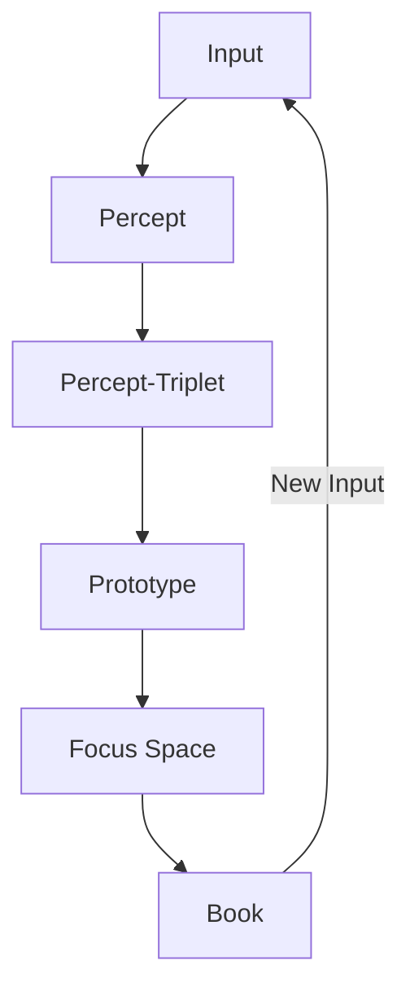
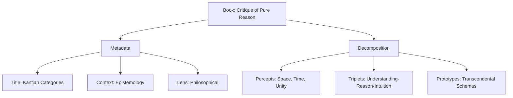
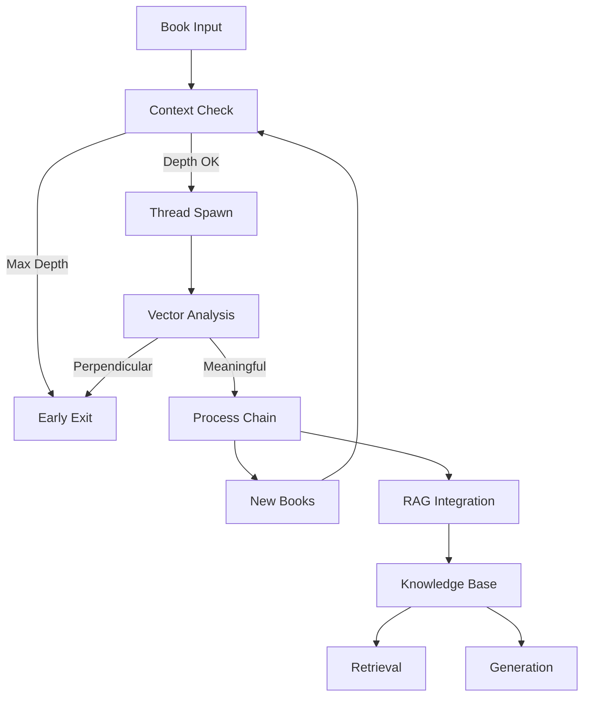
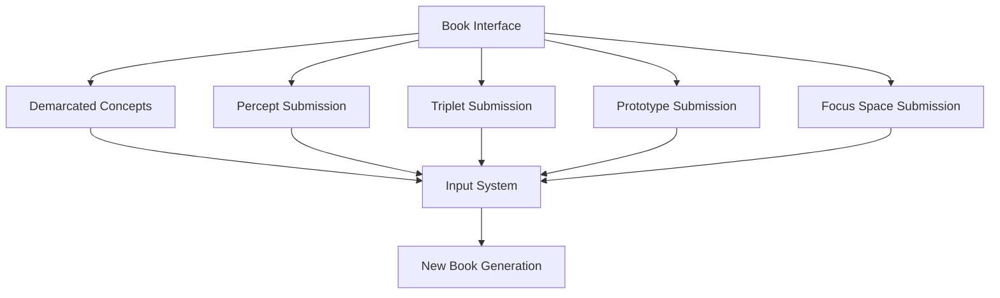
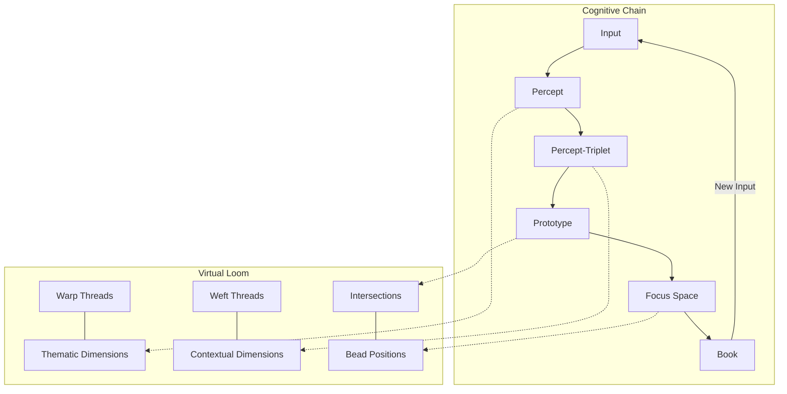

# 2.12. Chain-of-thought

In summary, the Memorativa system models the inner, intangible, and in some cases inexpressible world on the "inner cosmos" of perception and thought with data structures that represent the instantiation of these inner intangibles.

| Cognitive Process | Memorativa Structure | Description | Output |
|------------------|---------------------|-------------|---------|
| Perception | Input Entry | Raw content enters system with title/description | Percept |
| Conceptualization | Percept-Triplet | Input mapped to Planet-Sign-House structure | Structured Percept |
| Pattern Recognition | Prototype | Multiple percept-triplets form conceptual pattern | Conceptual Pattern |
| Analysis | Focus Space | Prototypes analyzed through Lenses | Interpreted Pattern |
| Synthesis | Book | Structured collection of analyzed percepts and prototypes | Narrative + Structure |
| Reflection | Book Library | Books organized and related through multiple views | Knowledge Network |
| Understanding | Concept Marking | Content boundaries and relationships identified | Demarcated Concept in the Book structure|

This progression represents how the system transforms raw perceptual input into structured knowledge, mirroring the human cognitive cycle of perception, conceptualization, analysis, and reflection.

## Terminal synthesis

The structure progression represents how the system transforms raw perceptual input into structured knowledge, mirroring the human cognitive cycle of perception, conceptualization, analysis, and reflection.

The Book serves as the terminal output of this cognitive chain, where:

1. **Structure Integration**
   - References all prior Glass Beads (percepts, prototypes, focus spaces)
   - Maintains relationships between cognitive components through multi-layer format:
     - Human Layer: Narrative text, chapters, sections
     - Machine Layer: Structured data mappings
     - Bridge Layer: Markup linking narrative to data
     - Bead Layer: Reference connections to Glass Beads and their content
     - Loom Layer: Virtual Looming system that organizes beads along thematic (warp) and contextual (weft) threads
   - Preserves temporal context across three states:
     - Mundane Time: Concrete chronological events
     - Quantum Time: Conceptual/indeterminate time
     - Holographic Time: Reference frameworks

2. **Narrative Completion**
   - Provides human-readable context for machine structures
   - Synthesizes relationships into coherent narratives
   - Bridges symbolic and conceptual frameworks through MST integration
   - Supports multiple simultaneous lens views

3. **Recursive Potential**
   - Completed Books can serve as new inputs
   - Enables nested levels of conceptual analysis
   - Supports evolving knowledge structures


*Figure 1: Cognitive Chain Flow, showing the transformation of raw input through progressive structural stages culminating in Books, which can recursively become new inputs*

This terminal synthesis creates a closed loop where Books can become new inputs, enabling continuous cognitive development and knowledge expansion.

## Book recursion and decomposition

When a Book enters the system as input, it follows the cognitive chain in reverse:

1. **Input Framing**
   - Title and description guide interpretation
   - Contextual metadata shapes analysis
   - Active lenses filter perception
   - Focus parameters direct attention

2. **Structural Decomposition**
   - Narrative content → Percepts
   - Conceptual relationships → Percept-Triplets
   - Pattern structures → Prototypes
   - Analysis frameworks → Focus Spaces

3. **Example Flow**

*Figure 2: Book Decomposition Example, illustrating how a philosophical text is decomposed into metadata and structural components during processing*

4. **Processing Modes**
   - **Whole Book**: Complete conceptual framework analysis
   - **Book Section**: Focused pattern extraction
   - **Book Fragment**: Specific concept isolation
   - **Cross-Book**: Relationship mapping between sources

This decomposition enables:
- Recursive analysis of existing knowledge
- Integration of historical insights
- Discovery of hidden patterns
- Creation of new conceptual connections

## Book processing controls

The Book→Percept processing chain implements strict recursion controls to prevent infinite loops while preserving meaningful conceptual development. These controls ensure stable knowledge evolution while preventing computational overflow.

### Processing context

Each Book processing operation maintains a context that tracks:
- Current recursion depth (max 64 levels)
- Previously visited Books in the chain
- Thread state and stack allocation
- Vector relationship metrics

The `ProcessingContext` struct and its can_process method are designed to manage and control the execution of book processing operations. The `ProcessingContext` keeps track of the recursion depth, maximum allowed depth, and a set of already visited books to detect cycles. The `can_process` method is used before starting to process a book to ensure that processing it will not exceed the depth limit or create a processing cycle, thus preventing errors like stack overflow and infinite loops. This is a common pattern in recursive algorithms or processes that involve graph traversal to ensure stability and prevent uncontrolled execution.

```rust
struct ProcessingContext {
    depth: u32,
    max_depth: u32,
    visited_books: HashSet<BookId>,
    thread_stack: Vec<BookState>,
}

impl ProcessingContext {
    fn can_process(&mut self, book: &Book) -> Result<(), ProcessingError> {
        if self.depth >= self.max_depth {
            return Err(ProcessingError::MaxDepthExceeded);
        }
        if !self.visited_books.insert(book.id) {
            return Err(ProcessingError::CycleDetected);
        }
        Ok(())
    }
}
```

### Thread management

Each Book processing chain runs in an isolated thread with dedicated stack space:

```rust
fn process_book_chain(book: Book, context: ProcessingContext) -> Result<Vec<Percept>> {
    thread::Builder::new()
        .stack_size(8 * 1024 * 1024) // 8MB stack
        .spawn(move || {
            context.can_process(&book)?;
            let percepts = decompose_book(book)?;
            context.depth += 1;
            
            // Process derived books with depth checking
            process_derived_books(percepts, context)
        })?
}
```

### Vector analysis

The system monitors vector relationships to detect and terminate unproductive processing chains:

```rust
fn should_terminate_processing(vectors: &[Vector]) -> bool {
    // Terminate if ≥75% of vector relationships are perpendicular
    let perpendicular_count = count_perpendicular_relationships(vectors);
    perpendicular_count as f32 / vectors.len() as f32 >= 0.75
}
```

### Processing flow


*Figure 3: Processing Flow Diagram, depicting the control mechanisms that prevent infinite recursion while maintaining meaningful conceptual development*

This control system ensures:
- Bounded recursion depth (configurable, default 64 levels)
- Cycle detection through Book ID tracking
- Early termination of unproductive chains
- Memory safety through thread isolation
- Preservation of meaningful conceptual relationships

The controls integrate with the existing version control and branching systems, using version metadata to track processing history and maintain coherent knowledge evolution paths.

## Direct input interface

Books provide direct submission interfaces for their component structures:


*Figure 4: Book Interface Flow, illustrating the direct submission pathways from Books to the input system for various cognitive components*

**1. Component Resubmission**
Players can directly submit:
- Demarcated concepts from any layer
- Individual percepts from narrative content
- Percept-triplets from concept mappings
- Prototypes from pattern structures
- Focus space configurations
- Any combination of the above

**2. Interface Features**
- One-click submission of demarcated content
- One-click submission of marked concepts
- Drag-and-drop pattern selection
- Context menu for submission options
- Batch submission capabilities
- Submission preview and editing

**3. Submission Context**
Each submission preserves:
- Demarcation metadata
- Original Book reference
- Active lens configuration
- Temporal state context
- Relationship metadata
- User annotations

This direct submission capability creates a fluid cycle between reading and analysis, allowing immediate exploration of new insights as they emerge during Book interaction.

## Operational Costs

Each Chain-of-Thought operation consumes GBT (Gas Bead Tokens) according to a relative cost structure designed to balance system sustainability with cognitive exploration (see also [Section 2.2: The Core Game] for additional token economy details):

| Operation | Relative Cost | Rationale |
|-----------|----------|-------------|
| Book Creation | Highest | Creation of new terminal synthesis requires significant cognitive resources |
| Recursion Depth | High-Progressive | Each recursion level increases cost progressively to prevent infinite loops |
| Book Decomposition | Medium-High | Breaking down conceptual structures demands substantial processing resources |
| Processing Chain Execution | Medium | Running complete cognitive chains requires balanced computational resources |
| Component Resubmission | Medium-Low | Reprocessing individual components should be accessible but protected |
| Cross-Book Analysis | Low | Knowledge integration across books should be encouraged for system growth |
| Book Verification | Lowest | Verifying existing book structures promotes system integrity |

The chain-of-thought token economics follow these principles:
- **Depth-Based Pricing**: Operations creating deeper recursive chains cost progressively more
- **Integration Incentives**: Lower costs for actions that contribute to knowledge synthesis across books
- **Verification Rewards**: Verifying book integrity may generate small token rewards to encourage system validation
- **Collaborative Discounts**: Multi-user book operations receive discounts to encourage collective meaning-making
- **Anti-Spam Protection**: Sufficient costs to prevent system abuse while enabling genuine cognitive exploration
- **Dynamic Adjustment**: Costs may be adjusted based on network activity, conceptual complexity, and governance decisions

### GBT Token Costs

Chain-of-thought operations consume GBT (Gas Bead Tokens) according to a standardized cost structure that balances system sustainability with cognitive exploration. These costs complement the operational costs described in [Section 2.2: The Core Game]:

| **Operation** | **Base GBT Cost** | **Scaling Factor** | **Rationale** |
|---------------|-------------------|---------------------|---------------|
| Book Creation | 20.0-50.0 | +3.0 per chapter | Creation of new terminal synthesis requires significant cognitive resources |
| Recursion Processing | 5.0 | +5.0 per level | Each recursion level increases exponentially to prevent infinite loops |
| Book Decomposition | 15.0 | +1.0 per component | Breaking down conceptual structures demands substantial processing |
| Processing Chain | 10.0 | +0.5 per chain node | Running complete cognitive chains requires balanced computation |
| Component Resubmission | 2.0 | +0.2 per component | Reprocessing individual components should be accessible but protected |
| Cross-Book Analysis | 7.0 | +0.3 per book | Knowledge integration across books creates system-wide value |
| Book Verification | 1.0 | +0.1 per chapter | Verifying existing book structures promotes system integrity |

The Book Creation cost (20-50 GBT) directly corresponds to the operational cost structure outlined in Section 3.2, reflecting the significant value creation involved in knowledge synthesis. This cost structure correlates to focus space operations as follows:
- **Base Cost Components**: The 20-50 GBT range accounts for underlying operations:
  - Space Creation (10.0 GBT per root space)
  - Prototype Addition (0.5 GBT per prototype)
  - Chart Operations (0.1 GBT per chart visualization)
  - Space Hierarchy Changes (2.0 GBT per level adjustment)
- **Synthesis Premium**: Books incur a synthesis premium (approximately 3-5 GBT) for transforming multiple focus spaces into a cohesive knowledge artifact

Additional modifiers apply based on:
- **Complexity Multiplier**: +10-60% for books with high concept density
- **Novelty Bonus**: -20% for processing chains that produce previously undiscovered patterns
- **Depth Discount**: -5% per 5 levels below max depth limit
- **Integration Factor**: -15% for operations connecting previously unrelated books
- **Recency Premium**: +10% for reprocessing books created within the last 24 hours

For collaborative book operations, special pricing applies:
- Host pays initial setup cost (10.0 GBT)
- Each participant contributes 2.0 GBT per session
- Operations during collaboration receive a 25% discount
- Pattern discoveries are credited to all participants proportionally

The system implements graduated pricing to ensure accessibility:
- New users receive 5 free book operations
- Educational accounts receive 20 GBT monthly allowance
- Contributions to book verification earn kickback rewards
- Open-source books generate 0.05 GBT per unique processing

### Computational Complexity

The chain-of-thought system introduces specific computational complexity considerations:

| **Operation** | **Time Complexity** | **Notes** |
|---------------|---------------------|-----------|
| Book Creation | O(n) | Linear with content size |
| Recursion Processing | O(d × n) | Where d is recursion depth and n is book size |
| Book Decomposition | O(n log n) | For efficient structural parsing |
| Vector Analysis | O(v²) | Quadratic with the number of vectors being analyzed |
| Thread Management | O(log t) | Logarithmic with the number of active threads |
| Context Validation | O(1) | Constant time validation using hash sets |
| Pattern Matching | O(p × n) | Linear to the product of pattern complexity (p) and book size (n) |

### Storage Requirements

The chain-of-thought system requires careful storage management to balance cognitive richness with system performance:

| **Component** | **Storage Cost** | **Scaling Factor** |
|--------------|------------------|---------------------|
| Book Structure | 5-10 KB | Base structure size |
| Chapter Content | 2-50 KB | Per chapter, varies with content |
| Processing Context | 1-2 KB | Per processing thread |
| Vector Relationships | 24 bytes | Per relationship pair |
| Thread State | 256 bytes | Per active thread |
| Recursion History | 32 bytes | Per recursion level |
| Component References | 16 bytes | Per referenced component |

### Optimization Strategies

1. **Thread Pooling**
   - Maintain pre-allocated thread pool for book processing
   - Reuse threads across multiple operations
   - Implement priority scheduling for critical paths
   - Limit concurrent recursion to prevent resource exhaustion

2. **Lazy Vector Computation**
   - Calculate vector relationships only when needed
   - Cache frequent relationship patterns
   - Implement progressive relationship discovery

3. **Adaptive Processing**
   - Adjust processing depth based on resource availability
   - Scale thread allocation based on book complexity
   - Implement early termination for low-value processing chains
   - Use tiered caching for frequently accessed books

```rust
struct ChainOptimizationManager {
    thread_pool: ThreadPool,
    processing_cache: LruCache<BookId, ProcessingResult>,
    vector_cache: HashMap<VectorPair, RelationshipMetrics>,
    active_contexts: VecDeque<ProcessingContext>,
    
    fn process_book(&mut self, book: &Book, depth: u32) -> Result<ProcessingResult> {
        // Check cache first
        if let Some(cached) = self.processing_cache.get(&book.id) {
            return Ok(cached.clone());
        }
        
        // Create processing context with appropriate depth
        let context = ProcessingContext::new(depth, self.max_depth());
        
        // Check if we can process given current system load
        self.can_process_now(book, &context)?;
        
        // Queue the processing job with appropriate priority
        let priority = self.calculate_priority(book, depth);
        let result = self.thread_pool.execute_with_priority(move || {
            process_book_with_context(book, context)
        }, priority)?;
        
        // Cache result if valuable
        if result.value_metric > self.caching_threshold {
            self.processing_cache.put(book.id, result.clone());
        }
        
        Ok(result)
    }
    
    fn calculate_priority(&self, book: &Book, depth: u32) -> Priority {
        // Higher priority for shallower depth and more referenced books
        let depth_factor = (self.max_depth() - depth) as f32 / self.max_depth() as f32;
        let reference_factor = book.reference_count() as f32 / 100.0;
        
        Priority::from_factors(depth_factor * 0.7 + reference_factor * 0.3)
    }
    
    fn can_process_now(&self, book: &Book, context: &ProcessingContext) -> Result<()> {
        // Check system load
        if self.active_contexts.len() >= self.max_concurrent_processes() {
            return Err(ProcessingError::SystemOverload);
        }
        
        // Check memory availability
        if self.current_memory_usage() > self.max_memory_threshold() {
            return Err(ProcessingError::MemoryConstraint);
        }
        
        // Check for resource conflicts
        if self.has_resource_conflicts(book) {
            return Err(ProcessingError::ResourceConflict);
        }
        
        Ok(())
    }
}
```

### Collaborative Operational Costs

Collaborative chain-of-thought operations introduce additional considerations:

1. **Synchronization Overhead**
   - Book state synchronization adds 10-20% computational overhead
   - Differential processing reduces bandwidth by 60-80% for incremental updates
   - Context sharing enables 30-40% reduction in redundant processing

2. **Concurrent Access Performance**
   - Performance scales well up to 8-12 concurrent users
   - Sublinear degradation with shared context architecture
   - Geographic distribution introduces 30-150ms latency depending on distance

3. **Cross-Book Integration**
   - Merging processing chains from different users requires consensus verification
   - Pattern integration adds 15-30% processing time initially
   - Cached integration patterns reduce overhead by 50-70% for subsequent operations

4. **Mobile Considerations**
   - Simplified book processing available with 70-90% reduced resource requirements
   - Context-aware loading prioritizes essential cognitive structures
   - Offline-first architecture supports disconnected book operations with later synchronization

## Virtual loom thread integration

The chain-of-thought process integrates closely with the Virtual Loom structure described in [Section 2.14: Books](memorativa-2-14-books.md). While Books provide the terminal synthesis for cognitive processing, the Virtual Loom supplies the organizational framework that enhances this processing through structured thread connections.

### Cognitive threads as warp and weft

The cognitive processing chain maps directly to the loom's physical structure:


*Figure 5: Integration of Cognitive Chain with Virtual Loom, showing how cognitive processing steps map to loom structural elements*

This integration creates several advantages:

1. **Structured Cognition**
   - Cognitive processes follow warp threads (thematic dimensions)
   - Contextual frameworks follow weft threads (contextual dimensions)
   - Knowledge elements positioned at meaningful intersections
   - Pattern recognition enhanced through structural organization

2. **Multi-dimensional Processing**
   - Chain-of-thought can progress vertically (deepening a theme)
   - Lateral thinking happens horizontally (exploring contexts)
   - Diagonal traversal enables intuitive leaps across dimensions
   - Non-linear cognitive paths become navigable

3. **Encoding Structure Alignment**
   - Virtual Loom encodes knowledge using the same hybrid spherical-hyperbolic geometry described in Section 3.2
   - Knowledge is encoded using the θ (theta), φ (phi), r (radius), and κ (kappa) parameters
   - Angular relationships between concepts maintain the same measurements established in focus spaces
   - Maintains both hyperbolic geometry (for hierarchical relationships, κ > 0) and spherical geometry (for symbolic/angular relationships, κ < 0)

4. **Thread Management**
   The loom's thread management system implements the same processing controls:

```rust
struct LoomThreadManager {
    warp_threads: Vec<ThematicThread>,
    weft_threads: Vec<ContextualThread>,
    processing_context: ProcessingContext,
    
    fn process_thread_intersection(&mut self, warp_idx: usize, weft_idx: usize) -> Result<Intersection> {
        // Get threads to process
        let warp = &self.warp_threads[warp_idx];
        let weft = &self.weft_threads[weft_idx];
        
        // Check processing context before proceeding
        self.processing_context.can_process(warp, weft)?;
        
        // Create thread processing job
        thread::Builder::new()
            .stack_size(8 * 1024 * 1024) // 8MB stack
            .spawn(move || {
                // Process the intersection
                let intersection = create_intersection(warp, weft)?;
                
                // Check for bead at intersection
                if let Some(bead) = find_bead_at_intersection(warp, weft) {
                    place_bead_at_intersection(intersection, bead)?;
                }
                
                // Increase depth for subsequent processing
                self.processing_context.depth += 1;
                
                // Process connected intersections with depth checking
                process_connected_intersections(intersection, self.processing_context)
            })?
    }
    
    fn should_terminate_thread(&self, thread: &Thread) -> bool {
        // Analyze vector relationships in thread
        let vectors = thread.vector_relationships();
        
        // Terminate if ≥75% of vector relationships are perpendicular
        let perpendicular_count = count_perpendicular_relationships(vectors);
        perpendicular_count as f32 / vectors.len() as f32 >= 0.75
    }
}
```

4. **Cognitive Pattern Recognition**
   - Connected beads form recognizable patterns in the loom
   - Patterns represent higher-order cognitive structures
   - Pattern identification uses graph algorithms (O(n+m) complexity)
   - Pattern templates become reusable cognitive frameworks

### Loom processing enhancements

The Virtual Loom enhances the chain-of-thought processing in several ways:

1. **Thread-based Decomposition**
   When a Book enters the cognitive chain, the loom structure guides decomposition:
   - Warp threads organize thematic decomposition
   - Weft threads guide contextual analysis
   - Intersection analysis identifies key conceptual nodes
   - Pattern recognition becomes structurally guided

2. **Cognitive Navigation**
   - Follow thematic warp threads to trace concept evolution
   - Travel along contextual weft threads to see different theme manifestations
   - Identify bead clusters that form cohesive sub-narratives
   - Discover "negative space" (empty intersections) representing knowledge gaps

3. **Collaborative Processing**
   - Multiple users can process different sections of the loom
   - Collaborative weaving creates knowledge structures that transcend individual contributions
   - Thread tensioning creates stable knowledge frameworks across processors
   - Attribution and provenance maintained through thread ownership

4. **Implementation Advantages**
   The loom implementation provides processing advantages:

```rust
fn process_book_with_loom(book: Book, context: ProcessingContext) -> Result<Vec<Percept>> {
    // Extract loom structure from book
    let loom = book.loom_structure();
    
    // Use loom to guide recursive processing
    let thematic_threads = loom.warp_threads();
    let contextual_threads = loom.weft_threads();
    
    // Process book according to loom structure
    let mut percepts = Vec::new();
    
    // Process each thematic thread
    for thread in thematic_threads {
        if context.depth < context.max_depth && !context.should_terminate_thread(&thread) {
            let thread_percepts = process_thematic_thread(thread, book, context.clone())?;
            percepts.extend(thread_percepts);
            context.depth += 1;
        }
    }
    
    // Process contextual threads at higher priority
    for thread in contextual_threads {
        if thread.priority > PRIORITY_THRESHOLD && 
           context.depth < context.max_depth && 
           !context.should_terminate_thread(&thread) {
            let thread_percepts = process_contextual_thread(thread, book, context.clone())?;
            percepts.extend(thread_percepts);
            context.depth += 1;
        }
    }
    
    // Process intersections where beads exist
    for intersection in loom.occupied_intersections() {
        let bead = loom.get_bead_at(intersection);
        let intersection_percepts = process_bead_at_intersection(bead, intersection, context.clone())?;
        percepts.extend(intersection_percepts);
    }
    
    Ok(percepts)
}
```

This loom-guided processing provides:
- Structured traversal of complex book content
- Priority-based processing for important threads
- Efficient focus on occupied intersections
- Conceptual boundary recognition through thread structure

### Thread-based GBT pricing

Thread-based processing introduces specific GBT pricing considerations:

| Thread Operation | Base GBT Cost | Scaling Factor | Rationale |
|------------------|---------------|----------------|-----------|
| Warp Thread Processing | 8.0 | +1.0 per node | Thematic processing requires conceptual depth |
| Weft Thread Processing | 6.0 | +0.8 per node | Contextual processing has slightly lower complexity |
| Intersection Processing | 3.0 | +0.5 per bead | Processing beads at intersections is more efficient |
| Pattern Recognition | 10.0 | +1.5 per pattern | Identifying cognitive patterns requires intensive analysis |
| Thread Navigation | 1.0 | +0.1 per hop | Following established threads has low overhead |
| Thread Creation | 12.0 | +2.0 per attribute | Creating new cognitive threads requires significant resources |

Additional modifiers apply:
- **Thread Density**: +15-25% for densely populated threads
- **Pattern Complexity**: +10-40% for complex interconnected patterns
- **Collaborative Discount**: -30% when multiple users process the same loom cooperatively
- **Template Reuse**: -50% when using established pattern templates

### Technical implementation

The loom integration with the chain-of-thought process is implemented through several specialized components:

```rust
struct LoomProcessingManager {
    cognitive_chain: CognitiveChain,
    loom_curator: BookLoomCurator,
    thread_manager: LoomThreadManager,
    pattern_recognizer: PatternRecognizer,
    
    fn process_book_through_loom(&mut self, book: &Book) -> Result<ProcessingOutput> {
        // Extract loom structure from book
        let loom = self.loom_curator.extract_loom(book);
        
        // Initialize processing context
        let context = ProcessingContext::new(0, MAX_DEPTH);
        
        // Process book through cognitive chain with loom guidance
        let chain_output = self.cognitive_chain.process_with_loom(book, loom, context.clone())?;
        
        // Recognize patterns in output
        let patterns = self.pattern_recognizer.identify_patterns(chain_output.percepts);
        
        // Update loom with new patterns
        self.loom_curator.update_with_patterns(loom, patterns);
        
        // Return integrated output
        Ok(ProcessingOutput {
            percepts: chain_output.percepts,
            patterns: patterns,
            updated_loom: loom
        })
    }
    
    fn traverse_cognitive_path(&self, start_point: Intersection, direction: TraversalDirection) -> CognitivePath {
        match direction {
            TraversalDirection::Warp => {
                // Follow thematic thread (vertical traverse)
                self.thread_manager.follow_warp_thread(start_point.warp_idx)
            },
            TraversalDirection::Weft => {
                // Follow contextual thread (horizontal traverse)
                self.thread_manager.follow_weft_thread(start_point.weft_idx)
            },
            TraversalDirection::Pattern => {
                // Follow pattern (connected beads)
                let pattern = self.pattern_recognizer.find_pattern_at(start_point);
                self.thread_manager.follow_pattern(pattern)
            }
        }
    }
}
```

The integration enables:
- Structured cognitive processing through loom guidance
- Efficient thread-based traversal of complex concepts
- Pattern-based knowledge discovery
- Multi-dimensional cognitive navigation
- Enhanced collaborative processing

## Key Visual Insights

- The Cognitive Chain Flow diagram (Figure 1) reveals the cyclical nature of knowledge development, showing how outputs become new inputs in a continuous learning process
- The Book Decomposition diagram (Figure 2) illustrates how complex conceptual works can be systematically broken down into their component cognitive structures for analysis
- The Processing Flow diagram (Figure 3) demonstrates the sophisticated control mechanisms needed to prevent computational overflow while maintaining meaningful knowledge development
- The Book Interface Flow diagram (Figure 4) shows how the system provides multiple pathways for user interaction, creating a fluid cycle between reading and analysis
- The Cognitive Chain and Virtual Loom Integration diagram (Figure 5) demonstrates how the cognitive processing steps map to loom structural elements, enhancing pattern recognition and knowledge organization

These visualizations collectively illustrate how the Memorativa system implements a complete cognitive cycle from perception through understanding, with built-in mechanisms for recursion, stability, and user interaction.

## Key Points

- Core Cognitive Chain:
  - Transforms raw perceptual input through structured stages: perception → conceptualization → pattern recognition → analysis → synthesis → reflection → understanding
  - Each stage maps to specific Memorativa structures: Input Entry → Percept-Triplet → Prototype → Focus Space → Book → Book Library → Concept Marking
  - Books serve as terminal synthesis points that integrate all prior cognitive components
  - Understanding emerges through active orientation within the conceptual space

- Book Processing:
  - Multi-layered structure combines human narrative, machine data, and bridging markup
  - Handles three temporal contexts: Mundane (concrete), Quantum (conceptual), and Holographic (referential)
  - Implements strict recursion controls to prevent infinite loops while enabling meaningful conceptual development
  - Integrates with RAG system for knowledge base building and retrieval

- Recursive Features:
  - Books can serve as new inputs, creating closed cognitive loops
  - Decomposition process reverses the cognitive chain for analysis
  - Multiple processing modes support different analytical depths
  - Thread isolation and vector analysis prevent unproductive processing

- Interface Design:
  - Direct submission interfaces for all component structures
  - Preserves context and relationships across submissions
  - Supports one-click and batch operations
  - Maintains metadata integrity throughout processing chain

- Virtual Loom Integration:
  - Cognitive processes follow warp threads (thematic dimensions)
  - Contextual frameworks follow weft threads (contextual dimensions)
  - Knowledge elements positioned at meaningful intersections
  - Multi-dimensional processing enables vertical, horizontal, and diagonal traversal
  - Loom-guided processing provides structured traversal of complex book content
  - Pattern recognition enhanced through structural organization

- Cognitive Model:
  - Models understanding as active orientation in conceptual space
  - Mirrors human cognitive development patterns
  - Supports both analytical and intuitive knowledge formation
  - Enables progressive refinement of understanding through recursive processing
  - Leverages loom structure for multi-dimensional knowledge organization

The system models cognitive development as an iterative process where each cycle builds upon previous understanding, creating increasingly sophisticated knowledge structures while maintaining computational stability and conceptual coherence.

## Key Math

### Vector Relationship Formalization

The cognitive chain's vector analysis uses the following mathematical framework:

1. **Vector Orthogonality Measure**: For vectors $\vec{v}_i$ and $\vec{v}_j$ representing conceptual relationships:
   $$\text{orthogonality}(\vec{v}_i, \vec{v}_j) = 1 - \left|\frac{\vec{v}_i \cdot \vec{v}_j}{||\vec{v}_i|| \cdot ||\vec{v}_j||}\right|$$

2. **Perpendicular Relationship Threshold**: A relationship is considered perpendicular when:
   $$\text{orthogonality}(\vec{v}_i, \vec{v}_j) > \theta_{perp}$$
   where $\theta_{perp} = 0.9$ is the system's perpendicularity threshold.

3. **Termination Condition**: Processing terminates when the perpendicular ratio exceeds threshold:
   $$\frac{|\{(i,j) : \text{orthogonality}(\vec{v}_i, \vec{v}_j) > \theta_{perp}\}|}{|\{(i,j) : i \neq j\}|} \geq 0.75$$

### Recursion Control Model

The recursion control system is formalized as:

1. **Recursion Depth Function**: For a book $B$ and processing context $C$:
   $$d(B, C) = \begin{cases}
   0 & \text{if } B \text{ is initial input} \\
   d(B_{parent}, C) + 1 & \text{otherwise}
   \end{cases}$$

2. **Cycle Detection Function**: For a book $B$ with identifier $id(B)$ and visited set $V$:
   $$\text{hasCycle}(B, V) = \begin{cases}
   \text{true} & \text{if } id(B) \in V \\
   \text{false} & \text{otherwise}
   \end{cases}$$

3. **Processing Eligibility**: A book $B$ is eligible for processing when:
   $$d(B, C) < d_{max} \land \lnot\text{hasCycle}(B, V_C)$$
   where $d_{max} = 64$ is the maximum recursion depth and $V_C$ is the set of visited book IDs in context $C$.

### Computational Complexity Analysis

1. **Time Complexity Function**: For operations with input size $n$, recursion depth $d$, thread count $t$, pattern count $p$, and vector count $v$:
   $$T(n, d, t, p, v) = \begin{cases}
   O(n) & \text{for basic book creation} \\
   O(d \cdot n) & \text{for recursive book processing} \\
   O(n \log n) & \text{for book decomposition} \\
   O(v^2) & \text{for vector relationship analysis} \\
   O(\log t) & \text{for thread management} \\
   O(p \cdot n) & \text{for pattern matching}
   \end{cases}$$

2. **Space Complexity Function**: For book $B$ with $c$ chapters:
   $$S(B) = S_{base} + \sum_{i=1}^{c} S_{chapter}(i) + S_{context} + S_{vectors} + S_{threads}$$
   where:
   - $S_{base} = 8$ KB (base structure size)
   - $S_{chapter}(i) \in [2, 50]$ KB per chapter
   - $S_{context} = 1$ KB per processing context
   - $S_{vectors} = 24$ bytes per vector relationship
   - $S_{threads} = 256$ bytes per active thread

### GBT Token Economic Model

1. **Base Cost Function**: For operation type $op$:
   $$C_{base}(op) = \begin{cases}
   30.0 & \text{if } op = \text{BookCreation} \\
   5.0 & \text{if } op = \text{RecursionProcessing} \\
   15.0 & \text{if } op = \text{BookDecomposition} \\
   10.0 & \text{if } op = \text{ProcessingChain} \\
   2.0 & \text{if } op = \text{ComponentResubmission} \\
   7.0 & \text{if } op = \text{CrossBookAnalysis} \\
   1.0 & \text{if } op = \text{BookVerification}
   \end{cases}$$

2. **Scaling Factor Function**: For operation type $op$ and scaling parameter $x$:
   $$S_{factor}(op, x) = \begin{cases}
   3.0 \cdot x & \text{if } op = \text{BookCreation and } x = \text{chapters} \\
   5.0 \cdot x & \text{if } op = \text{RecursionProcessing and } x = \text{levels} \\
   1.0 \cdot x & \text{if } op = \text{BookDecomposition and } x = \text{components} \\
   0.5 \cdot x & \text{if } op = \text{ProcessingChain and } x = \text{nodes} \\
   0.2 \cdot x & \text{if } op = \text{ComponentResubmission and } x = \text{components} \\
   0.3 \cdot x & \text{if } op = \text{CrossBookAnalysis and } x = \text{books} \\
   0.1 \cdot x & \text{if } op = \text{BookVerification and } x = \text{chapters}
   \end{cases}$$

3. **Total Cost Function**: For operation type $op$, parameter $x$, and modifiers $M$:
   $$C_{total}(op, x, M) = \left(C_{base}(op) + S_{factor}(op, x)\right) \cdot \prod_{m \in M} M_m$$
   where $M$ includes complexity multipliers, novelty bonuses, depth discounts, etc.

### Virtual Loom Math Model

1. **Intersection Coordinate Function**: For warp thread $w$ and weft thread $f$:
   $$I(w, f) = (idx(w), idx(f))$$
   where $idx(\cdot)$ is the thread index function.

2. **Bead Placement Function**: For bead $b$ and intersection $I(w, f)$:
   $$P(b, I(w, f)) = \begin{cases}
   \text{true} & \text{if bead } b \text{ can be placed at } I(w, f) \\
   \text{false} & \text{otherwise}
   \end{cases}$$
   A bead can be placed when $\text{compatibility}(b, w) \geq \tau_w$ and $\text{compatibility}(b, f) \geq \tau_f$, where $\tau_w$ and $\tau_f$ are thresholds.

3. **Pattern Recognition Function**: For a set of beads $B$ on the loom:
   $$\text{isPattern}(B) = \begin{cases}
   \text{true} & \text{if } \exists \text{ template } T : \text{similarity}(B, T) \geq \tau_p \\
   \text{false} & \text{otherwise}
   \end{cases}$$
   where $\tau_p$ is the pattern recognition threshold.

4. **Thread Tension Function**: For thread $t$:
   $$\text{tension}(t) = \frac{\sum_{b \in B_t} \text{weight}(b)}{|B_t|}$$
   where $B_t$ is the set of beads on thread $t$.

These mathematical formalizations provide a rigorous foundation for the cognitive chain processes described throughout the document, enabling precise analysis of system behavior, computational requirements, and economic models.

## Citations

- [1] Hofstadter, D. R. (1979). *Gödel, Escher, Bach: An Eternal Golden Braid*. Basic Books.
- [2] Clark, A. (2016). *Surfing Uncertainty: Prediction, Action, and the Embodied Mind*. Oxford University Press.
- [3] Friston, K. (2010). "The free-energy principle: a unified brain theory?" *Nature Reviews Neuroscience*, 11(2), 127-138.
- [4] Hutchins, E. (1995). *Cognition in the Wild*. MIT Press.

```
struct LanguageLoom {
    warp_threads: Vec<GrammarStructure>,
    weft_threads: Vec<SemanticElement>,
    intersections: HashMap<GrammarStructure, Vec<SemanticElement>>,
}

impl LanguageLoom {
    fn new() -> Self {
        LanguageLoom {
            warp_threads: Vec::new(),
            weft_threads: Vec::new(),
            intersections: HashMap::new(),
        }
    }

    fn add_warp_thread(&mut self, grammar: GrammarStructure) {
        self.warp_threads.push(grammar);
    }

    fn add_weft_thread(&mut self, semantic: SemanticElement) {
        self.weft_threads.push(semantic);
    }

    fn create_intersection(&mut self, grammar: GrammarStructure, semantic: SemanticElement) {
        self.intersections.entry(grammar).or_insert(Vec::new()).push(semantic);
    }

    fn generate_language(&self) -> Vec<String> {
        let mut phrases = Vec::new();
        for (grammar, semantics) in &self.intersections {
            for semantic in semantics {
                phrases.push(format!("{} {}", grammar, semantic));
            }
        }
        phrases
    }

    fn generate_language_with_archetypes(&self) -> Vec<String> {
        let mut phrases = Vec::new();
        for (grammar, semantics) in &self.intersections {
            for semantic in semantics {
                // Analyze phonetic archetypes
                let archetype_analysis = self.analyze_archetypes(semantic);
                phrases.push(format!("{} {} [{}]", grammar, semantic, archetype_analysis));
            }
        }
        phrases
    }

    fn analyze_archetypes(&self, semantic: &SemanticElement) -> String {
        let mut analysis = String::new();
        for archetype in &semantic.phonetic_archetypes {
            match archetype {
                PhoneticArchetype::Vowel(v) => {
                    analysis.push_str(&format!("Vowel: {} {}, ", v.emotional_tone, v.intensity));
                }
                PhoneticArchetype::Consonant(c) => {
                    analysis.push_str(&format!("Consonant: {} {}, ", c.physical_shape, c.articulation));
                }
            }
        }
        analysis
    }

    fn generate_language_with_cosmic_influences(&self) -> Vec<String> {
        let mut phrases = Vec::new();
        for (grammar, semantics) in &self.intersections {
            for semantic in semantics {
                // Analyze cosmic influences
                let cosmic_analysis = self.analyze_cosmic_influences(semantic);
                phrases.push(format!("{} {} [{}]", grammar, semantic, cosmic_analysis));
            }
        }
        phrases
    }

    fn analyze_cosmic_influences(&self, semantic: &SemanticElement) -> String {
        let mut analysis = String::new();
        for archetype in &semantic.phonetic_archetypes {
            for influence in &archetype.cosmic_influences {
                match influence {
                    CosmicInfluence::Planet(p) => {
                        analysis.push_str(&format!("Planet: {:?}, ", p));
                    }
                    CosmicInfluence::Zodiac(z) => {
                        analysis.push_str(&format!("Zodiac: {:?}, ", z));
                    }
                }
            }
        }
        analysis
    }
}

struct GrammarStructure {
    syntax: String,
    morphology: String,
}

struct SemanticElement {
    vocabulary: String,
    meaning: String,
    phonetic_archetypes: Vec<PhoneticArchetype>, // New field for Steiner's concepts
}

enum PhoneticArchetype {
    Vowel(VowelQuality),
    Consonant(ConsonantForm),
}

struct VowelQuality {
    emotional_tone: String,  // e.g., joy, sorrow, wonder
    intensity: f32,
}

struct ConsonantForm {
    physical_shape: String,  // e.g., sharp, round, flowing
    articulation: String,
}

// Add cosmic language elements
enum CosmicInfluence {
    Planet(Planet),
    Zodiac(ZodiacSign),
}

enum Planet {
    Mercury,
    Venus,
    Mars,
    Jupiter,
    Saturn,
    // ... other planets
}

enum ZodiacSign {
    Aries,
    Taurus,
    Gemini,
    Cancer,
    Leo,
    // ... other signs
}

// Extend the PhoneticArchetype struct
struct PhoneticArchetype {
    vowel: Option<VowelQuality>,
    consonant: Option<ConsonantForm>,
    cosmic_influences: Vec<CosmicInfluence>, // New field for cosmic influences
}

// Modify the language generation to consider cosmic influences
impl LanguageLoom {
    fn generate_language_with_cosmic_influences(&self) -> Vec<String> {
        let mut phrases = Vec::new();
        for (grammar, semantics) in &self.intersections {
            for semantic in semantics {
                // Analyze cosmic influences
                let cosmic_analysis = self.analyze_cosmic_influences(semantic);
                phrases.push(format!("{} {} [{}]", grammar, semantic, cosmic_analysis));
            }
        }
        phrases
    }

    fn analyze_cosmic_influences(&self, semantic: &SemanticElement) -> String {
        let mut analysis = String::new();
        for archetype in &semantic.phonetic_archetypes {
            for influence in &archetype.cosmic_influences {
                match influence {
                    CosmicInfluence::Planet(p) => {
                        analysis.push_str(&format!("Planet: {:?}, ", p));
                    }
                    CosmicInfluence::Zodiac(z) => {
                        analysis.push_str(&format!("Zodiac: {:?}, ", z));
                    }
                }
            }
        }
        analysis
    }
}

fn main() {
    let mut language_loom = LanguageLoom::new();

    let grammar = GrammarStructure {
        syntax: "Subject-Verb-Object".to_string(),
        morphology: "Plural".to_string(),
    };

    let semantic = SemanticElement {
        vocabulary: "cats".to_string(),
        meaning: "feline animals".to_string(),
        phonetic_archetypes: Vec::new(),
    };

    language_loom.add_warp_thread(grammar);
    language_loom.add_weft_thread(semantic);
    language_loom.create_intersection(grammar, semantic);

    let phrases = language_loom.generate_language_with_cosmic_influences();
    for phrase in phrases {
        println!("{}", phrase);
    }
}

// Extend the Percept-Triplet structure
struct PerceptTriplet {
    planet: Planet,
    sign: ZodiacSign,
    house: House,
    phonetic_qualities: Vec<PhoneticArchetype>, // Steiner's phonetic influences
}

// Add House enumeration
enum House {
    First,
    Second,
    Third,
    // ... up to Twelfth
}

// Extend the PhoneticArchetype struct with house context
struct PhoneticArchetype {
    vowel: Option<VowelQuality>,
    consonant: Option<ConsonantForm>,
    cosmic_influences: Vec<CosmicInfluence>,
    house_context: Option<House>, // New field for house context
}

// Modify the language generation to consider astrological patterns
impl LanguageLoom {
    fn generate_language_with_astrology(&self) -> Vec<String> {
        let mut phrases = Vec::new();
        for (grammar, semantics) in &self.intersections {
            for semantic in semantics {
                // Analyze astrological patterns
                let astro_analysis = self.analyze_astrological_patterns(semantic);
                phrases.push(format!("{} {} [{}]", grammar, semantic, astro_analysis));
            }
        }
        phrases
    }

    fn analyze_astrological_patterns(&self, semantic: &SemanticElement) -> String {
        let mut analysis = String::new();
        for archetype in &semantic.phonetic_archetypes {
            // Analyze planetary influences
            for influence in &archetype.cosmic_influences {
                match influence {
                    CosmicInfluence::Planet(p) => {
                        analysis.push_str(&format!("Planet: {:?}, ", p));
                    }
                    CosmicInfluence::Zodiac(z) => {
                        analysis.push_str(&format!("Zodiac: {:?}, ", z));
                    }
                }
            }
            // Analyze house context
            if let Some(house) = &archetype.house_context {
                analysis.push_str(&format!("House: {:?}, ", house));
            }
        }
        analysis
    }
}

// Example of creating an astrologically informed Percept-Triplet
fn create_astrological_triplet() -> PerceptTriplet {
    PerceptTriplet {
        planet: Planet::Mercury,
        sign: ZodiacSign::Gemini,
        house: House::Third,
        phonetic_qualities: vec![
            PhoneticArchetype {
                vowel: Some(VowelQuality {
                    emotional_tone: "curiosity".to_string(),
                    intensity: 0.8,
                }),
                consonant: Some(ConsonantForm {
                    physical_shape: "sharp".to_string(),
                    articulation: "plosive".to_string(),
                }),
                cosmic_influences: vec![
                    CosmicInfluence::Planet(Planet::Mercury),
                    CosmicInfluence::Zodiac(ZodiacSign::Gemini),
                ],
                house_context: Some(House::Third),
            },
        ],
    }
}

// Extend the Virtual Loom structure
struct VirtualLoom {
    warp_threads: Vec<Planet>, // Warp threads represent planetary influences
    weft_threads: Vec<ZodiacSign>, // Weft threads represent zodiacal qualities
    intersections: HashMap<(Planet, ZodiacSign), Vec<House>>, // Intersections represent house contexts
}

impl VirtualLoom {
    fn new() -> Self {
        VirtualLoom {
            warp_threads: Vec::new(),
            weft_threads: Vec::new(),
            intersections: HashMap::new(),
        }
    }

    fn add_warp_thread(&mut self, planet: Planet) {
        self.warp_threads.push(planet);
    }

    fn add_weft_thread(&mut self, sign: ZodiacSign) {
        self.weft_threads.push(sign);
    }

    fn create_intersection(&mut self, planet: Planet, sign: ZodiacSign, house: House) {
        self.intersections.entry((planet, sign)).or_insert(Vec::new()).push(house);
    }

    fn generate_patterns_with_astrology(&self) -> Vec<String> {
        let mut patterns = Vec::new();
        for ((planet, sign), houses) in &self.intersections {
            for house in houses {
                // Analyze astrological patterns at each intersection
                let astro_analysis = self.analyze_astrological_patterns(*planet, *sign, *house);
                patterns.push(format!("Planet: {:?}, Sign: {:?}, House: {:?} [{}]", planet, sign, house, astro_analysis));
            }
        }
        patterns
    }

    fn analyze_astrological_patterns(&self, planet: Planet, sign: ZodiacSign, house: House) -> String {
        let mut analysis = String::new();
        // Analyze planetary influence
        analysis.push_str(&format!("Planet Influence: {:?}, ", planet));
        // Analyze zodiacal quality
        analysis.push_str(&format!("Zodiac Quality: {:?}, ", sign));
        // Analyze house context
        analysis.push_str(&format!("House Context: {:?}", house));
        analysis
    }
}

// Example of creating an astrologically informed Virtual Loom
fn create_astrological_loom() -> VirtualLoom {
    let mut loom = VirtualLoom::new();

    // Add warp threads (planetary influences)
    loom.add_warp_thread(Planet::Mercury);
    loom.add_warp_thread(Planet::Venus);
    loom.add_warp_thread(Planet::Mars);

    // Add weft threads (zodiacal qualities)
    loom.add_weft_thread(ZodiacSign::Aries);
    loom.add_weft_thread(ZodiacSign::Taurus);
    loom.add_weft_thread(ZodiacSign::Gemini);

    // Create intersections (house contexts)
    loom.create_intersection(Planet::Mercury, ZodiacSign::Gemini, House::Third);
    loom.create_intersection(Planet::Venus, ZodiacSign::Taurus, House::Second);
    loom.create_intersection(Planet::Mars, ZodiacSign::Aries, House::First);

    loom
}
```