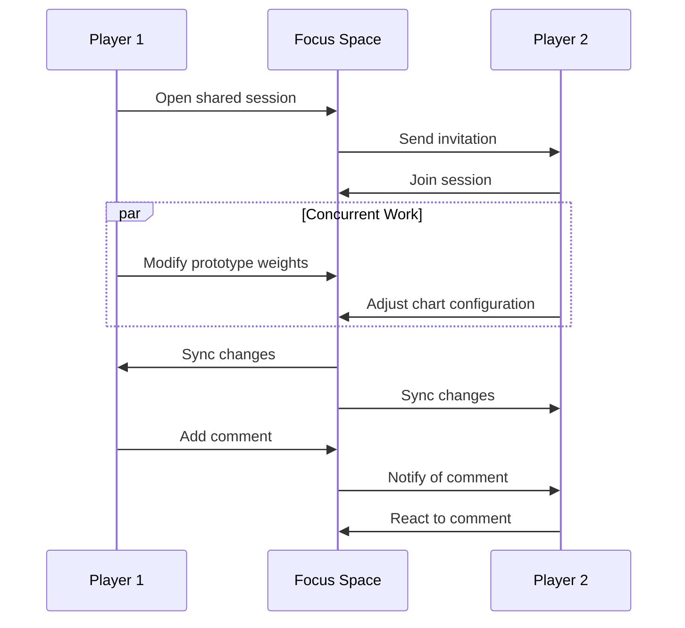
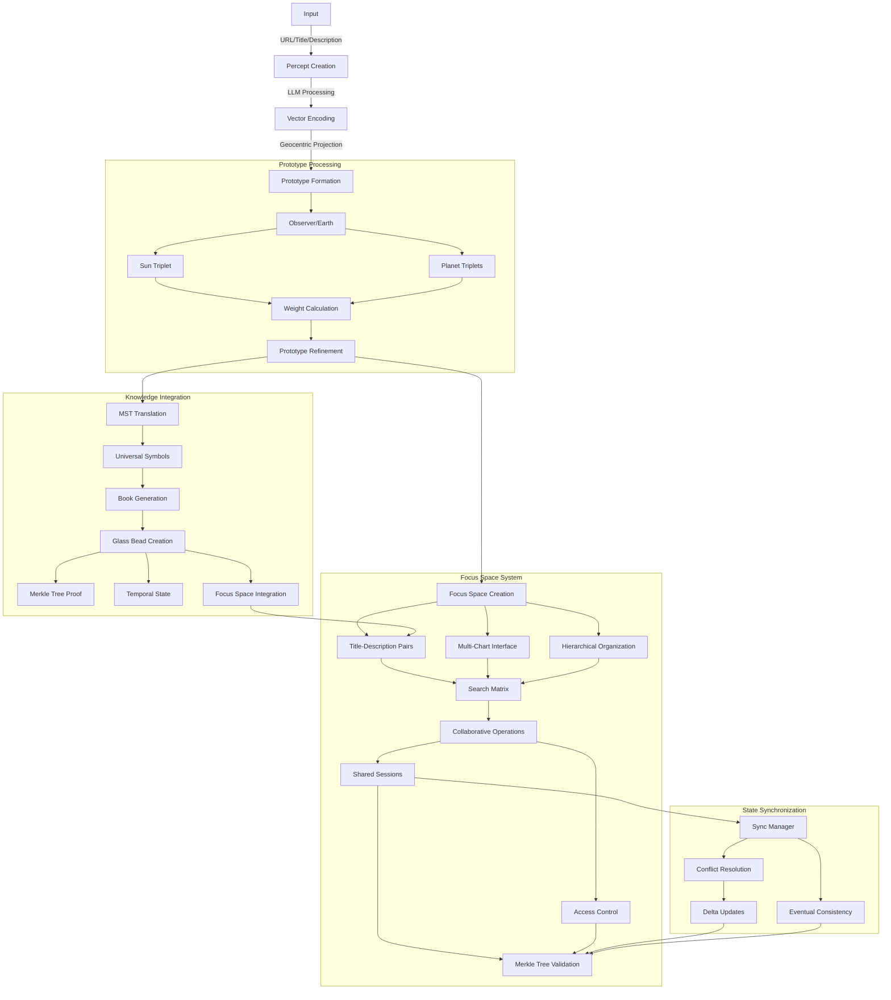

# 2.12. Focus spaces

The Memorativa focus space serves as a conceptual workspace for organizing and interacting with percepts, prototypes, and their symbolic relationships. Each focus space is encoded as a glass bead in a percept-triplet structure, transforming the conceptual space into an encoded structure that can itself be encoded into a percept as an input to the game.

## Structural definition

A focus space acts as:

- **Conceptual Focus**: Filters prototypes through **title-description pairs** and **percept-triplet configurations**.
- **Temporal Scaffold**: Maintains **time state vectors** (mundane, quantum, holographic) for chart comparisons.
- **Verbal Scaffold**: Maintains **universalized title-description pairs** across temporal states.
- **Relational Matrix**: Stores **angular relationships** between title-description pairs using **aspects**.
- **Hierarchical Container**: Organizes nested focus spaces and their relationships.

## Core features

**Title-Description Pair**
- Generated from the MST system
- Aggregated conceptual representative for the focus
- Calculated based on the structural components of the focus space

**Multi-Chart Interface**
   
- Supports multiple chart types:
  - Single Charts (mundane, quantum, reference)
  - Superimposed Charts (event comparison, concept attunement)
  - Progressed Charts (secondary, solar arc, tertiary)
  - Specialized Charts (composite, harmonic, relocational, draconic)
- Enables aspect analysis between charts
- Maintains up to 12 active charts simultaneously

**Hierarchical Organization**

- Nested focus spaces for related concepts
- Parent-child relationships between spaces
- Inheritance of properties from parent spaces
- Configurable depth limits (default: 7 levels)
- Cross-hierarchy references and links

**State Management**

Preserves:
- Chart configurations and relationships
- Aspect filters and patterns
- Time state alignments
- Prototype weightings
- Hierarchical structure and inheritance
- Cross-references between nested spaces

**Search & Filter Matrix**

   | **Filter Type** | **Parameters**              | **Example Use**                              |
   |-----------------|-----------------------------|-----------------------------------------------|
   | Archetypal      | Title-Description Keywords | Find all **"Ethical Dilemma"** prototypes     |
   | Temporal        | Time State + Title Pattern  | Compare **"Forbidden Knowledge"** across eras |
   | Aspectual       | Angular Range + Verbal Tags | Show prototypes with **"Tension"** relationships |

## Integration with Glass Beads

- Each focus space encodes as a glass bead using percept-triplet structure
- Beads reference all generated percepts, prototypes, and Books
- Merkle tree ensures data integrity and tracks evolution
- SPL token standard enables ownership and transfer

## Operational model

**Focus Layers**:
1. **Core Anchor**: Primary title-description pair
2. **Secondary Anchors**: Related pairs within 30° longitude
3. **Aspect Network**: Angular relationships between prototypes
4. **Hierarchical Network**: Parent-child relationships and inheritance

**Inheritance Rules**:
- Child spaces inherit aspect patterns from parents
- Overridable properties at each level
- Mergeable time state vectors
- Propagating prototype weights

## Temporal integration

Aligns through time states:
- **Mundane**: Linear chronological progression
- **Quantum**: Timeless conceptual relationships  
- **Holographic**: Reference-based comparisons

## Shared focus spaces

Focus spaces can be shared between users, enabling collaborative conceptual work:

**Sharing Models**:
- Read-only sharing via focus space links
- Full collaborative access with edit permissions
- Temporary shared sessions for real-time collaboration
- Fork-and-merge workflow for asynchronous collaboration

**Collaborative Features**:
- Real-time updates of chart configurations
- Shared prototype weighting and aspect analysis
- Concurrent editing with conflict resolution
- Activity tracking and change history
- Comment threads on specific elements

**Access Control**:
- Granular permissions per hierarchy level
- Time-limited access grants
- Public/private visibility settings
- Collaborative group management

**Synchronization**:
- Merkle tree validation of shared state
- Eventual consistency model
- Conflict resolution using operational transforms
- Bandwidth-optimized delta updates

## Player interactions

Players interact with focus spaces through multiple interfaces and workflows:

### Direct manipulation

```python
class FocusSpaceInterface:
    def __init__(self, focus_space: FocusSpace):
        self.space = focus_space
        self.active_charts = []
        self.selected_prototypes = set()
        
    async def handle_interaction(self, action: PlayerAction):
        match action.type:
            case "drag_prototype":
                await self.update_prototype_position(action.prototype, action.position)
            case "adjust_aspect":
                await self.modify_aspect_weight(action.source, action.target, action.weight)
            case "merge_spaces":
                await self.merge_focus_spaces(action.source_space, action.target_space)
```

### Core interactions

1. **Prototype Management**
   - Drag & drop prototypes between spaces
   - Adjust prototype weights through direct manipulation
   - Create new prototype combinations
   - Filter prototypes by aspect patterns

2. **Chart Operations**
   - Switch between chart types (mundane/quantum/holographic)
   - Overlay multiple charts for comparison
   - Adjust aspect orbs and filters
   - Save chart configurations as templates

3. **Space Organization**
   - Create nested hierarchies
   - Merge related spaces
   - Split complex spaces
   - Tag and categorize spaces

### Collaborative workflows



### Example workflows

1. **Pattern Discovery**
```python
async def explore_pattern(player: Player, focus_space: FocusSpace):
    # Start with initial prototype
    prototype = await player.select_prototype()
    
    # Create exploration space
    space = await focus_space.create_child({
        'title': f"Exploring {prototype.title}",
        'chart_type': 'quantum',
        'aspect_filter': 'harmonics'
    })
    
    # Add related prototypes
    related = await space.find_related_prototypes(prototype)
    await space.add_prototypes(related)
    
    # Save discovered patterns
    if pattern := await player.identify_pattern(space):
        await space.save_pattern(pattern)
```

2. **Collaborative Analysis**
```python
async def analyze_together(players: List[Player], focus_space: FocusSpace):
    # Initialize shared session
    session = await focus_space.start_shared_session(players)
    
    # Set up analysis tools
    tools = {
        'chart_overlay': True,
        'aspect_highlighting': True,
        'comment_threads': True,
        'pattern_tracking': True
    }
    
    # Track insights
    insights = []
    async for event in session.stream_events():
        if event.type == 'pattern_discovered':
            insights.append(event.pattern)
            await session.notify_all_players(event)
```

### Interface Guidelines

1. **Visual Feedback**
   - Real-time aspect strength indicators
   - Dynamic prototype weight visualization
   - Clear hierarchy level indicators
   - Collaborative presence markers

2. **Interaction Modes**
   - Quick exploration mode
   - Detailed analysis mode
   - Collaborative session mode
   - Teaching/presentation mode

3. **Accessibility Features**
   - Keyboard navigation
   - Screen reader support
   - Color blind friendly modes
   - Interaction speed controls

### Performance considerations

```python
class InteractionOptimizer:
    def __init__(self):
        self.cache = LRUCache(max_size=1000)
        self.batch_size = 50
        
    async def optimize_interactions(self, actions: List[PlayerAction]):
        # Batch similar operations
        batched = self.batch_similar_actions(actions)
        
        # Process in parallel where possible
        async with asyncio.TaskGroup() as group:
            for batch in batched:
                group.create_task(self.process_batch(batch))
                
    def batch_similar_actions(self, actions: List[PlayerAction]) -> List[Batch]:
        return [
            Batch(actions=subset)
            for subset in self.group_by_type(actions)
            if len(subset) <= self.batch_size
        ]
```

This interaction system provides:
- Intuitive direct manipulation
- Real-time collaborative features
- Optimized performance for smooth interaction
- Flexible workflows for different play styles
- Accessibility and usability considerations

## Technical flow

The focus space system integrates with the prototype processing pipeline while adding collaborative and hierarchical dimensions:



### Processing Pipeline

1. **Focus Space Creation**
```python
class FocusSpace:
    def __init__(self, prototype: Prototype, config: Dict):
        self.observer = prototype.observer
        self.title_pairs = generate_title_pairs(prototype)
        self.charts = MultiChartInterface(max_charts=12)
        self.hierarchy = HierarchicalManager(max_depth=7)
        self.merkle_root = calculate_merkle_root(self)
        
    def generate_title_pairs(self, prototype: Prototype) -> List[TitlePair]:
        return [
            TitlePair(
                title=mst.translate(triplet.title),
                description=mst.translate(triplet.description),
                weight=triplet.weight
            )
            for triplet in prototype.all_triplets()
        ]
```

2. **State Synchronization**
```python
class SyncManager:
    def process_update(self, focus_space: FocusSpace, update: Update):
        # Validate merkle proof
        if not verify_merkle_proof(update.proof, focus_space.merkle_root):
            raise InvalidUpdateError()
            
        # Apply operational transform
        transformed = transform_update(
            update,
            focus_space.pending_updates
        )
        
        # Update state
        focus_space.apply_update(transformed)
        
        # Broadcast to collaborators
        self.broadcast_delta(transformed)
```

3. **Collaborative Integration**
```python
class CollaborationManager:
    def start_session(self, focus_space: FocusSpace, users: List[User]):
        session = SharedSession(
            focus_space=focus_space,
            sync_manager=SyncManager(),
            access_control=AccessControl(users)
        )
        
        # Initialize real-time sync
        session.start_sync()
        return session
```

## Key Points

- **Core Structure**
  - Focus spaces organize percepts and prototypes through title-description pairs
  - Each space supports multi-chart analysis with up to 12 concurrent charts
  - Hierarchical nesting enables organization with inheritance up to 7 levels deep

- **Player Experience**
  - Direct manipulation interface for intuitive prototype management
  - Multiple interaction modes (exploration, analysis, teaching)
  - Real-time collaborative features with shared sessions
  - Accessible design with keyboard navigation and screen reader support

- **Technical Foundation**
  - Search and filter capabilities across archetypal, temporal and aspectual dimensions
  - Integration with glass bead system for data integrity and ownership
  - Merkle tree validation ensures consistency across shared spaces
  - Optimized performance through batched operations and caching

- **Collaborative Features**
  - Real-time shared workspaces with granular access control
  - Concurrent editing with conflict resolution
  - Activity tracking and change history
  - Comment threads on specific elements