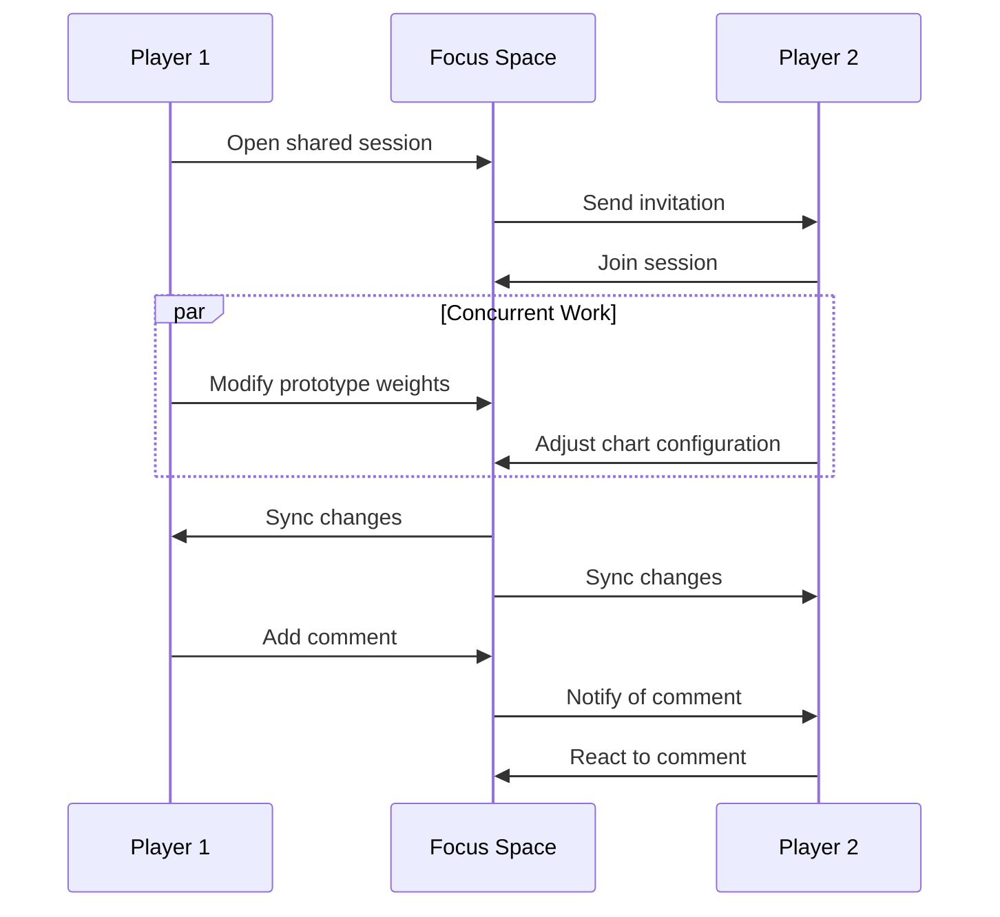
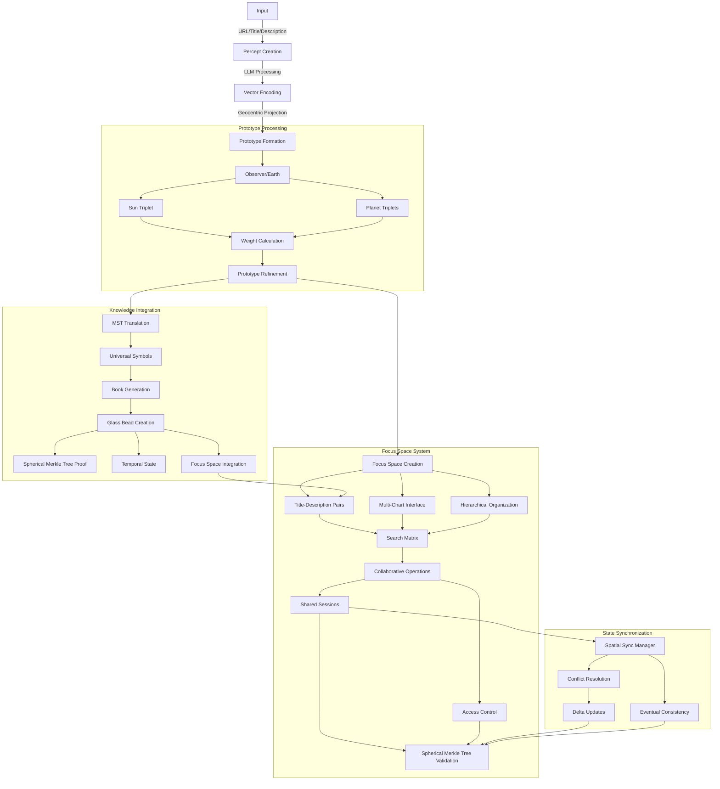

# 2.12. Focus spaces

The Memorativa focus space serves as a conceptual workspace for organizing and interacting with percepts, prototypes, and their symbolic relationships. Each focus space is encoded as a glass bead in a percept-triplet structure, transforming the conceptual space into an encoded structure that can itself be encoded into a percept as an input to the game.

## Structural definition

A focus space acts as:

- **Conceptual Focus**: Filters prototypes through **title-description pairs** and **percept-triplet configurations**.
- **Temporal Scaffold**: Maintains **time state vectors** (mundane, quantum, holographic) for chart comparisons.
- **Verbal Scaffold**: Maintains **universalized title-description pairs** across temporal states.
- **Relational Matrix**: Stores **angular relationships** between title-description pairs using **aspects**.
- **Hierarchical Container**: Organizes nested focus spaces and their relationships.

## Core features

**Title-Description Pair**
- Generated from the MST system
- Aggregated conceptual representative for the focus
- Calculated based on the structural components of the focus space

**Multi-Chart Interface**
   
- Supports multiple chart types:
  - Single Charts (mundane, quantum, reference)
  - Superimposed Charts (event comparison, concept attunement)
  - Progressed Charts (secondary, solar arc, tertiary)
  - Specialized Charts (composite, harmonic, relocational, draconic)
- Enables aspect analysis between charts
- Maintains up to 12 active charts simultaneously

**Hierarchical Organization**

- Nested focus spaces for related concepts
- Parent-child relationships between spaces
- Inheritance of properties from parent spaces
- Configurable depth limits (default: 7 levels)
- Cross-hierarchy references and links

**State Management**

Preserves:
- Chart configurations and relationships
- Aspect filters and patterns
- Time state alignments
- Prototype weightings
- Hierarchical structure and inheritance
- Cross-references between nested spaces

**Search & Filter Matrix**

   | **Filter Type** | **Parameters**              | **Example Use**                              |
   |-----------------|-----------------------------|-----------------------------------------------|
   | Archetypal      | Title-Description Keywords | Find all **"Ethical Dilemma"** prototypes     |
   | Temporal        | Time State + Title Pattern  | Compare **"Forbidden Knowledge"** across eras |
   | Aspectual       | Angular Range + Verbal Tags | Show prototypes with **"Tension"** relationships |

## Integration with Glass Beads and Spherical Merkle Trees

- Each focus space encodes as a glass bead using percept-triplet structure
- Beads reference all generated percepts, prototypes, and Books
- **Spherical Merkle Trees** ensure data integrity and track evolution while preserving spatial relationships
- SPL token standard enables ownership and transfer

### Coordinate Preservation in Merkle Structure

Focus spaces leverage the hybrid spherical-hyperbolic coordinate system to maintain both hierarchical structures and angular relationships:

```rust
struct FocusSpaceMerkleNode {
    data: Vec<u8>,
    children: Vec<NodeId>,
    angular_relationships: HashMap<NodeId, Angle>,
    coordinate_data: [f32; 4],  // [θ, φ, r, κ] coordinates
    hash: [u8; 32],
}

impl FocusSpaceMerkleNode {
    fn calculate_hash(&self) -> [u8; 32] {
        // Include both data and angular relationships in hash
        let data_hash = hash_data(&self.data);
        
        // Angular relationships must be deterministically ordered
        let mut relationships = self.angular_relationships
            .iter()
            .map(|(k, v)| (*k, *v))
            .collect::<Vec<(NodeId, Angle)>>();
        relationships.sort_by_key(|(id, _)| *id);
        
        let angle_hash = hash_data(&relationships);
        
        // Include coordinate data in hash
        let coord_hash = hash_data(&self.coordinate_data);
        
        hash_combine_multiple(&[data_hash, angle_hash, coord_hash])
    }
}
```

### Hybrid Verification System

Focus spaces use a hybrid verification approach that validates both content integrity and spatial relationships:

```rust
struct FocusSpaceVerifier {
    merkle_verifier: MerkleVerifier,
    spatial_verifier: SpatialVerifier,
}

impl FocusSpaceVerifier {
    fn verify(&self, proof: SphericalMerkleProof, root_hash: Hash) -> VerificationResult {
        // Verify merkle structure (hierarchical integrity)
        let merkle_valid = self.merkle_verifier.verify(
            proof.merkle_components, 
            root_hash
        );
        
        // Verify spatial relationships (angular integrity)
        let spatial_valid = self.spatial_verifier.verify_angular_consistency(
            proof.coordinate_data,
            proof.angular_relationships
        );
        
        // Additional check for curved space consistency
        let curvature_valid = self.spatial_verifier.verify_curvature_consistency(
            proof.curvature_fields
        );
        
        VerificationResult {
            valid: merkle_valid && spatial_valid && curvature_valid,
            hierarchical_integrity: merkle_valid,
            spatial_integrity: spatial_valid,
            curvature_integrity: curvature_valid
        }
    }
}
```

## Operational model

**Focus Layers**:
1. **Core Anchor**: Primary title-description pair
2. **Secondary Anchors**: Related pairs within 30° longitude
3. **Aspect Network**: Angular relationships between prototypes
4. **Hierarchical Network**: Parent-child relationships and inheritance

**Geometric Encoding**:
Each title-description pair within a focus space is encoded in a hybrid spherical-hyperbolic space using:
- θ (theta): Archetypal angle (0-2π) representing conceptual category
- φ (phi): Expression elevation (-π/2 to π/2) derived from expression mode
- r (radius): Mundane magnitude (0-1) based on significance 
- κ (kappa): Curvature parameter that determines geometry type:
  - κ > 0: Hyperbolic geometry for hierarchical relationships
  - κ < 0: Spherical geometry for symbolic/angular relationships

```rust
struct FocusSpaceCoordinates {
    theta: f32,     // Archetypal angle
    phi: f32,       // Expression elevation
    radius: f32,    // Mundane magnitude
    kappa: f32,     // Geometry parameter
    
    // Derived representations
    spherical: [f32; 3],
    poincare: [f32; 3],
    
    fn is_hyperbolic(&self) -> bool {
        self.kappa > 0.0
    }
    
    fn calculate_distance(&self, other: &Self) -> f32 {
        if self.is_hyperbolic() {
            // Hyperbolic distance in Poincaré model
            self.calculate_hyperbolic_distance(other)
        } else {
            // Angular distance in spherical model
            self.calculate_spherical_distance(other)
        }
    }
}
```

**Inheritance Rules**:
- Child spaces inherit aspect patterns from parents
- Overridable properties at each level
- Mergeable time state vectors
- Propagating prototype weights

**Aspect Preservation**:
- Angular relationships between concepts are preserved in the Spherical Merkle Tree
- Significant aspects (typically within 30°) are explicitly recorded
- Aspect strength is calculated using both geometry types and weighted by κ
- Cross-focus-space aspects are tracked through reference nodes

## Temporal integration

Aligns through time states:
- **Mundane**: Linear chronological progression
- **Quantum**: Timeless conceptual relationships  
- **Holographic**: Reference-based comparisons

### Temporal Coordinate Mapping

Time states are encoded as transformations of the base coordinates:

```python
def apply_temporal_state(coords: FocusSpaceCoordinates, 
                        state: TemporalState) -> FocusSpaceCoordinates:
    match state:
        case TemporalState.MUNDANE:
            # Preserve original coordinates
            return coords
        
        case TemporalState.QUANTUM:
            # Remove temporal components by setting r=0.5 (midpoint)
            # and adjusting curvature to be more hyperbolic
            return FocusSpaceCoordinates(
                theta=coords.theta,
                phi=coords.phi,
                radius=0.5,
                kappa=abs(coords.kappa) + 1.0  # Ensure hyperbolic
            )
            
        case TemporalState.HOLOGRAPHIC:
            # Project coordinates onto reference sphere
            # and adjust curvature to be more spherical
            return FocusSpaceCoordinates(
                theta=coords.theta,
                phi=coords.phi,
                radius=1.0,  # Full projection
                kappa=-abs(coords.kappa) - 1.0  # Ensure spherical
            )
```

## Shared focus spaces

Focus spaces can be shared between users, enabling collaborative conceptual work:

**Sharing Models**:
- Read-only sharing via focus space links
- Full collaborative access with edit permissions
- Temporary shared sessions for real-time collaboration
- Fork-and-merge workflow for asynchronous collaboration

**Collaborative Features**:
- Real-time updates of chart configurations
- Shared prototype weighting and aspect analysis
- Concurrent editing with conflict resolution
- Activity tracking and change history
- Comment threads on specific elements

**Access Control**:
- Granular permissions per hierarchy level
- Time-limited access grants
- Public/private visibility settings
- Collaborative group management

**Synchronization**:
- Spherical Merkle Tree validation of shared state
- Eventual consistency model
- Conflict resolution using operational transforms
- Bandwidth-optimized delta updates

### Spatial Synchronization

When synchronizing focus spaces across users, the system must preserve both content and spatial relationships:

```rust
struct SpatialSyncManager {
    local_state: FocusSpace,
    remote_states: HashMap<UserId, FocusSpace>,
    merkle_verifier: SphericalMerkleVerifier,
    
    fn sync_with_user(&mut self, user_id: UserId, 
                     remote_state: FocusSpace, 
                     proof: SphericalMerkleProof) -> Result<(), SyncError> {
        // Verify remote state integrity
        if !self.merkle_verifier.verify(proof, remote_state.merkle_root()) {
            return Err(SyncError::InvalidProof);
        }
        
        // Check for angular relationship consistency
        if !self.verify_angular_consistency(&remote_state) {
            return Err(SyncError::RelationshipInconsistency);
        }
        
        // Apply remote changes
        self.remote_states.insert(user_id, remote_state);
        self.merge_states()?;
        
        // Generate new merkle tree with updated angular relationships
        self.update_merkle_tree()?;
        
        Ok(())
    }
    
    fn verify_angular_consistency(&self, remote: &FocusSpace) -> bool {
        // Check that angular relationships are preserved
        for (id1, id2), expected_angle in self.local_state.significant_angles() {
            if let Some(remote_angle) = remote.get_angle(id1, id2) {
                // Allow small deviation (1 degree)
                if (remote_angle - expected_angle).abs() > 1.0 {
                    return false;
                }
            }
        }
        true
    }
}
```

## Player interactions

Players interact with focus spaces through multiple interfaces and workflows:

### Direct manipulation

```python
class FocusSpaceInterface:
    def __init__(self, focus_space: FocusSpace):
        self.space = focus_space
        self.active_charts = []
        self.selected_prototypes = set()
        
    async def handle_interaction(self, action: PlayerAction):
        match action.type:
            case "drag_prototype":
                await self.update_prototype_position(action.prototype, action.position)
            case "adjust_aspect":
                await self.modify_aspect_weight(action.source, action.target, action.weight)
            case "merge_spaces":
                await self.merge_focus_spaces(action.source_space, action.target_space)
```

### Core interactions

1. **Prototype Management**
   - Drag & drop prototypes between spaces
   - Adjust prototype weights through direct manipulation
   - Create new prototype combinations
   - Filter prototypes by aspect patterns

2. **Chart Operations**
   - Switch between chart types (mundane/quantum/holographic)
   - Overlay multiple charts for comparison
   - Adjust aspect orbs and filters
   - Save chart configurations as templates

3. **Space Organization**
   - Create nested hierarchies
   - Merge related spaces
   - Split complex spaces
   - Tag and categorize spaces

### Collaborative workflows



### Example workflows

1. **Pattern Discovery**
```python
async def explore_pattern(player: Player, focus_space: FocusSpace):
    # Start with initial prototype
    prototype = await player.select_prototype()
    
    # Create exploration space
    space = await focus_space.create_child({
        'title': f"Exploring {prototype.title}",
        'chart_type': 'quantum',
        'aspect_filter': 'harmonics'
    })
    
    # Add related prototypes
    related = await space.find_related_prototypes(prototype)
    await space.add_prototypes(related)
    
    # Save discovered patterns
    if pattern := await player.identify_pattern(space):
        await space.save_pattern(pattern)
```

2. **Collaborative Analysis**
```python
async def analyze_together(players: List[Player], focus_space: FocusSpace):
    # Initialize shared session
    session = await focus_space.start_shared_session(players)
    
    # Set up analysis tools
    tools = {
        'chart_overlay': True,
        'aspect_highlighting': True,
        'comment_threads': True,
        'pattern_tracking': True
    }
    
    # Track insights
    insights = []
    async for event in session.stream_events():
        if event.type == 'pattern_discovered':
            insights.append(event.pattern)
            await session.notify_all_players(event)
```

### Interface Guidelines

1. **Visual Feedback**
   - Real-time aspect strength indicators
   - Dynamic prototype weight visualization
   - Clear hierarchy level indicators
   - Collaborative presence markers

2. **Interaction Modes**
   - Quick exploration mode
   - Detailed analysis mode
   - Collaborative session mode
   - Teaching/presentation mode

3. **Accessibility Features**
   - Keyboard navigation
   - Screen reader support
   - Color blind friendly modes
   - Interaction speed controls

### Performance considerations

```python
class InteractionOptimizer:
    def __init__(self):
        self.cache = LRUCache(max_size=1000)
        self.batch_size = 50
        
    async def optimize_interactions(self, actions: List[PlayerAction]):
        # Batch similar operations
        batched = self.batch_similar_actions(actions)
        
        # Process in parallel where possible
        async with asyncio.TaskGroup() as group:
            for batch in batched:
                group.create_task(self.process_batch(batch))
                
    def batch_similar_actions(self, actions: List[PlayerAction]) -> List[Batch]:
        return [
            Batch(actions=subset)
            for subset in self.group_by_type(actions)
            if len(subset) <= self.batch_size
        ]
```

This interaction system provides:
- Intuitive direct manipulation
- Real-time collaborative features
- Optimized performance for smooth interaction
- Flexible workflows for different play styles
- Accessibility and usability considerations

## Technical flow

The focus space system integrates with the prototype processing pipeline while adding collaborative and hierarchical dimensions:



### Processing Pipeline

1. **Focus Space Creation with Coordinate Preservation**
```python
class FocusSpace:
    def __init__(self, prototype: Prototype, config: Dict):
        self.observer = prototype.observer
        self.title_pairs = generate_title_pairs(prototype)
        self.charts = MultiChartInterface(max_charts=12)
        self.hierarchy = HierarchicalManager(max_depth=7)
        
        # Initialize spatial coordinates
        self.coordinates = {}
        for id, pair in self.title_pairs.items():
            # Create hybrid coordinates for each title-description pair
            self.coordinates[id] = create_hybrid_coordinates(
                pair, prototype.get_triplet(id)
            )
        
        # Calculate angular relationships
        self.angular_relationships = self.calculate_angular_relationships()
        
        # Generate Spherical Merkle Tree
        self.merkle_root = self.generate_spherical_merkle_tree()
        
    def create_hybrid_coordinates(self, pair, triplet):
        """Convert prototype triplet to focus space coordinates"""
        return FocusSpaceCoordinates(
            theta=triplet.theta,
            phi=triplet.phi,
            radius=triplet.radius,
            kappa=triplet.curvature
        )
        
    def calculate_angular_relationships(self):
        """Calculate all significant angular relationships"""
        relationships = {}
        
        for id1, coords1 in self.coordinates.items():
            for id2, coords2 in self.coordinates.items():
                if id1 == id2:
                    continue
                    
                angle = calculate_hybrid_angle(coords1, coords2)
                
                # Only store significant relationships
                if is_significant_angle(angle, coords1.kappa, coords2.kappa):
                    relationships[(id1, id2)] = angle
                    
        return relationships
        
    def generate_spherical_merkle_tree(self):
        """Generate a Spherical Merkle Tree that preserves angular relationships"""
        nodes = {}
        
        # Create nodes for each coordinate
        for id, coords in self.coordinates.items():
            nodes[id] = FocusSpaceMerkleNode(
                data=self.title_pairs[id].serialize(),
                coordinate_data=[coords.theta, coords.phi, coords.radius, coords.kappa]
            )
            
        # Add angular relationships
        for (id1, id2), angle in self.angular_relationships.items():
            nodes[id1].angular_relationships[id2] = angle
            
        # Calculate hashes
        for node in nodes.values():
            node.hash = node.calculate_hash()
            
        # Build tree structure
        root = build_merkle_tree(nodes)
        return root.hash
```

2. **State Synchronization with Spatial Verification**
```python
class SpatialSyncManager:
    def process_update(self, focus_space: FocusSpace, update: Update):
        # Validate spatial merkle proof
        if not verify_spherical_merkle_proof(update.proof, focus_space.merkle_root):
            raise InvalidUpdateError("Invalid merkle proof")
            
        # Check for angular relationship consistency
        if not verify_angular_consistency(update, focus_space):
            raise InvalidUpdateError("Angular relationships violated")
            
        # Apply operational transform
        transformed = transform_update(
            update,
            focus_space.pending_updates
        )
        
        # Update state including spatial coordinates
        focus_space.apply_spatial_update(transformed)
        
        # Regenerate Spherical Merkle Tree
        focus_space.merkle_root = focus_space.generate_spherical_merkle_tree()
        
        # Broadcast to collaborators
        self.broadcast_delta(transformed)
        
def verify_angular_consistency(update, focus_space):
    """Verify that update preserves essential angular relationships"""
    # Extract affected coordinates
    affected_ids = update.get_affected_ids()
    
    # Check significant aspects
    for (id1, id2), expected_angle in focus_space.angular_relationships.items():
        if id1 in affected_ids or id2 in affected_ids:
            # If relationship is significant, any change must preserve angle
            if is_critical_relationship(id1, id2, focus_space):
                new_angle = calculate_new_angle(id1, id2, update, focus_space)
                if abs(new_angle - expected_angle) > MAX_ANGLE_DEVIATION:
                    return False
                    
    return True
```

3. **Collaborative Integration with Quantum Enhancement**
```python
class QuantumEnhancedFocusSpace:
    def __init__(self, focus_space: FocusSpace):
        self.classical_space = focus_space
        self.quantum_state = initialize_quantum_state(focus_space)
        self.verifier = QuantumMerkleVerifier()
        
    def accelerate_search(self, query):
        """Use quantum-inspired algorithms for faster pattern matching"""
        # Prepare superposition of relevant coordinates
        superposition = self.quantum_state.prepare_superposition(
            relevant_to=query
        )
        
        # Amplify matching patterns
        amplified = apply_grover_iteration(superposition)
        
        # Measure results
        matches = measure_highest_probability_states(amplified)
        
        # Convert back to classical results
        return [self.classical_space.title_pairs[id] for id in matches]
        
    def verify_integrity(self, proof):
        """Quantum-enhanced verification of Spherical Merkle Tree"""
        result = self.verifier.verify(
            to_quantum_proof(proof),
            self.classical_space.merkle_root
        )
        
        if result.quantum_used:
            log.info(f"Quantum verification used with {result.confidence*100:.2f}% confidence")
            
        return result.valid
```

## Key Points

- **Core Structure**
  - Focus spaces organize percepts and prototypes through title-description pairs
  - Each space supports multi-chart analysis with up to 12 concurrent charts
  - Hierarchical nesting enables organization with inheritance up to 7 levels deep
  - **Coordinates encoded in hybrid spherical-hyperbolic geometry with (θ,φ,r,κ) parameters**

- **Player Experience**
  - Direct manipulation interface for intuitive prototype management
  - Multiple interaction modes (exploration, analysis, teaching)
  - Real-time collaborative features with shared sessions
  - Accessible design with keyboard navigation and screen reader support

- **Technical Foundation**
  - Search and filter capabilities across archetypal, temporal and aspectual dimensions
  - Integration with glass bead system for data integrity and ownership
  - **Spherical Merkle Trees preserve both content integrity and angular relationships**
  - **Hybrid verification system validates both hierarchical structure and spatial consistency**
  - **Curvature-aware processing adapts to both hyperbolic and spherical relationships**

- **Collaborative Features**
  - Real-time shared workspaces with granular access control
  - Concurrent editing with conflict resolution
  - Activity tracking and change history
  - Comment threads on specific elements
  - **Spatial synchronization ensures relationship preservation across users**
