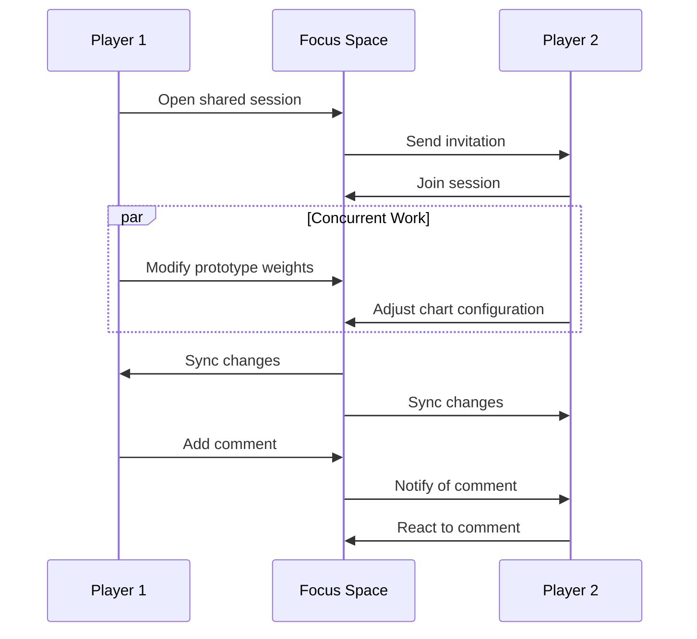

## Introduction

Focus spaces provide a structured environment where players organize, manipulate, and analyze percepts and prototypes within the Memorativa system. Building on the concepts of percept-triplets and conceptual time states, focus spaces implement a hybrid spherical-hyperbolic geometry that preserves both hierarchical relationships and angular connections between concepts. This document details the structure, features, and implementation of focus spaces, explaining how they function as both conceptual workspaces and encodable knowledge artifacts within the Glass Bead Game.

# 2.12. Focus spaces

The Memorativa focus space serves as a conceptual workspace for organizing and interacting with percepts, prototypes, and their symbolic relationships. Each focus space is encoded as a glass bead in a percept-triplet structure, transforming the conceptual space into an encoded structure that can itself be encoded into a percept as an input to the game.

## Structural definition

A focus space acts as:

- **Conceptual Focus**: Filters prototypes through **title-description pairs** and **percept-triplet configurations**.
- **Temporal Scaffold**: Maintains **time state vectors** (mundane, quantum, holographic) for chart comparisons.
- **Verbal Scaffold**: Maintains **universalized title-description pairs** across temporal states.
- **Relational Matrix**: Stores **angular relationships** between title-description pairs using **aspects**.
- **Hierarchical Container**: Organizes nested focus spaces and their relationships.

## Core features

**Title-Description Pair**
- Generated from the MST system
- Aggregated conceptual representative for the focus
- Calculated based on the structural components of the focus space

**Multi-Chart Interface**
   
- Supports multiple chart types:
  - Single Charts (mundane, quantum, reference)
  - Superimposed Charts (event comparison, concept attunement)
  - Progressed Charts (secondary, solar arc, tertiary)
  - Specialized Charts (composite, harmonic, relocational, draconic)
- Enables aspect analysis between charts
- Maintains up to 12 active charts simultaneously

**Hierarchical Organization**

- Nested focus spaces for related concepts
- Parent-child relationships between spaces
- Inheritance of properties from parent spaces
- Configurable depth limits (default: 7 levels)
- Cross-hierarchy references and links

**State Management**

Preserves:
- Chart configurations and relationships
- Aspect filters and patterns
- Time state alignments
- Prototype weightings
- Hierarchical structure and inheritance
- Cross-references between nested spaces

**Search & Filter Matrix**

   | **Filter Type** | **Parameters**              | **Example Use**                              |
   |-----------------|-----------------------------|-----------------------------------------------|
   | Archetypal      | Title-Description Keywords | Find all **"Ethical Dilemma"** prototypes     |
   | Temporal        | Time State + Title Pattern  | Compare **"Forbidden Knowledge"** across eras |
   | Aspectual       | Angular Range + Verbal Tags | Show prototypes with **"Tension"** relationships |

## Integration with Glass Beads and Spherical Merkle Trees

- Each focus space encodes as a glass bead using percept-triplet structure
- Beads reference all generated percepts, prototypes, and Books
- **Spherical Merkle Trees** ensure data integrity and track evolution while preserving spatial relationships
- SPL token standard enables ownership and transfer

### Coordinate Preservation in Merkle Structure

Focus spaces leverage the hybrid spherical-hyperbolic coordinate system to maintain both hierarchical structures and angular relationships.

### Hybrid Verification System

Focus spaces use a hybrid verification approach that validates both content integrity and spatial relationships.

## Operational model

**Focus Layers**:
1. **Core Anchor**: Primary title-description pair
2. **Secondary Anchors**: Related pairs within 30° longitude
3. **Aspect Network**: Angular relationships between prototypes
4. **Hierarchical Network**: Parent-child relationships and inheritance

**Geometric Encoding**:
Each title-description pair within a focus space is encoded in a hybrid spherical-hyperbolic space using:
- θ (theta): Archetypal angle (0-2π) representing conceptual category
- φ (phi): Expression elevation (-π/2 to π/2) derived from expression mode
- r (radius): Mundane magnitude (0-1) based on significance 
- κ (kappa): Curvature parameter that determines geometry type:
  - κ > 0: Hyperbolic geometry for hierarchical relationships
  - κ < 0: Spherical geometry for symbolic/angular relationships

**Inheritance Rules**:
- Child spaces inherit aspect patterns from parents
- Overridable properties at each level
- Mergeable time state vectors
- Propagating prototype weights

**Aspect Preservation**:
- Angular relationships between concepts are preserved in the Spherical Merkle Tree
- Significant aspects (typically within 30°) are explicitly recorded
- Aspect strength is calculated using both geometry types and weighted by κ
- Cross-focus-space aspects are tracked through reference nodes

## Temporal integration

Aligns through time states:
- **Mundane**: Linear chronological progression
- **Quantum**: Timeless conceptual relationships  
- **Holographic**: Reference-based comparisons

### Temporal Coordinate Mapping

Time states are encoded as transformations of the base coordinates.

## Shared focus spaces

Focus spaces can be shared between users, enabling collaborative conceptual work:

**Sharing Models**:
- Read-only sharing via focus space links
- Full collaborative access with edit permissions
- Temporary shared sessions for real-time collaboration
- Fork-and-merge workflow for asynchronous collaboration

**Collaborative Features**:
- Real-time updates of chart configurations
- Shared prototype weighting and aspect analysis
- Concurrent editing with conflict resolution
- Activity tracking and change history
- Comment threads on specific elements

**Access Control**:
- Granular permissions per hierarchy level
- Time-limited access grants
- Public/private visibility settings
- Collaborative group management

**Synchronization**:
- Spherical Merkle Tree validation of shared state
- Eventual consistency model
- Conflict resolution using operational transforms
- Bandwidth-optimized delta updates

### Spatial Synchronization

When synchronizing focus spaces across users, the system must preserve both content and spatial relationships.

## Player interactions

Players interact with focus spaces through multiple interfaces and workflows:

### Direct manipulation

### Core interactions

1. **Prototype Management**
   - Drag & drop prototypes between spaces
   - Adjust prototype weights through direct manipulation
   - Create new prototype combinations
   - Filter prototypes by aspect patterns

2. **Chart Operations**
   - Switch between chart types (mundane/quantum/holographic)
   - Overlay multiple charts for comparison
   - Adjust aspect orbs and filters
   - Save chart configurations as templates

3. **Space Organization**
   - Create nested hierarchies
   - Merge related spaces
   - Split complex spaces
   - Tag and categorize spaces

### Collaborative workflows


*Figure 1: Collaborative Session Sequence Diagram, illustrating the bidirectional communication flow between players and the focus space during a shared session, highlighting how the system handles concurrent modifications and change notifications*

### Example workflows

1. **Pattern Discovery**

2. **Collaborative Analysis**

### Interface Guidelines

1. **Visual Feedback**
   - Real-time aspect strength indicators
   - Dynamic prototype weight visualization
   - Clear hierarchy level indicators
   - Collaborative presence markers

2. **Interaction Modes**
   - Quick exploration mode
   - Detailed analysis mode
   - Collaborative session mode
   - Teaching/presentation mode

3. **Accessibility Features**
   - Keyboard navigation
   - Screen reader support
   - Color blind friendly modes
   - Interaction speed controls

### Performance considerations

## Operational Costs

The hybrid spherical-hyperbolic geometry of focus spaces introduces specific operational costs that must be managed for efficient implementation:

### Computational Complexity

- **Distance Calculations**: O(1) for single point-to-point operations, but O(n²) when calculating all relationships in a space
- **Merkle Tree Operations**: O(log n) for verification, O(n log n) for rebuilding after significant changes
- **Angular Relationship Preservation**: Additional O(k) cost where k is the number of significant angular relationships to maintain

### Storage Requirements

| **Component**            | **Storage Cost**     | **Scaling Factor**                            |
|--------------------------|----------------------|-----------------------------------------------|
| Base Title-Description   | ~100 bytes           | Linear with number of pairs                   |
| Coordinate Data          | 16 bytes             | Linear with number of pairs                   |
| Angular Relationships    | 8-12 bytes per rel   | Quadratic with number of pairs (optimizable)  |
| Hierarchical Structure   | 4-8 bytes per link   | Linear with hierarchy depth                   |
| Merkle Tree              | 32 bytes per node    | Linear with number of pairs                   |

### Optimization Strategies

1. **Lazy Angular Calculations**
   - Compute angular relationships only when needed
   - Cache frequently accessed relationships
   - Use spatial indexing to avoid full O(n²) relationship calculations

2. **Tiered Storage Model**
   - Hot tier: Frequently accessed focus spaces with full relationship data
   - Warm tier: Recently used spaces with partial relationship data
   - Cold tier: Archived spaces with minimal relationship data

3. **Adaptive Precision Control**
   - Use lower coordinate precision for distant or less important relationships
   - Dynamically adjust κ (kappa) values based on use patterns
   - Implement level-of-detail management that increases precision for active areas

```rust
struct FocusSpaceStorageManager {
    hot_cache: LruCache<FocusSpaceId, CompleteRelationshipData>,
    warm_cache: LruCache<FocusSpaceId, EssentialRelationshipData>,
    cold_storage: DiskBackedMap<FocusSpaceId, MinimalRelationshipData>,
    
    fn get_relationship_data(&mut self, space_id: FocusSpaceId) -> RelationshipData {
        // Try hot cache first
        if let Some(data) = self.hot_cache.get(&space_id) {
            return data.clone();
        }
        
        // Try warm cache next
        if let Some(data) = self.warm_cache.get(&space_id) {
            // Promote to hot cache with expanded relationships
            let complete_data = self.expand_relationships(data);
            self.hot_cache.put(space_id, complete_data.clone());
            return complete_data;
        }
        
        // Fall back to cold storage
        if let Some(minimal_data) = self.cold_storage.get(&space_id) {
            // Calculate essential relationships
            let essential_data = self.calculate_essential_relationships(minimal_data);
            self.warm_cache.put(space_id, essential_data.clone());
            return essential_data.into();
        }
        
        // Not found
        RelationshipData::empty()
    }
    
    fn calculate_essential_relationships(&self, minimal: &MinimalRelationshipData) -> EssentialRelationshipData {
        // Calculate only the most significant angular relationships
        let mut essential = EssentialRelationshipData::new();
        
        for (id1, coords1) in minimal.coordinates.iter() {
            for (id2, coords2) in minimal.coordinates.iter() {
                if id1 == id2 {
                    continue;
                }
                
                let angle = calculate_hybrid_angle(coords1, coords2);
                
                // Only keep significant relationships (major aspects within orb)
                if is_significant_aspect(angle) {
                    essential.add_relationship(*id1, *id2, angle);
                }
            }
        }
        
        essential
    }
}
```

### Gas Bead Token (GBT) Costs

Focus space operations require GBT tokens according to a standard cost schedule designed to balance system resources with user engagement:

| **Operation** | **GBT Cost** | **Scaling Factor** | **Rationale** |
|---------------|---------------|----------------------|--------------|
| Create Focus Space | 10.0 | +0.5 per hierarchy level | Creation requires allocation of spatial indices and merkle structures |
| Add Prototype | 0.5 | +0.2 per significant relationship | Each prototype addition updates the relationship network |
| Modify Aspect Weights | 0.2 | +0.1 per aspect modified | Aspect adjustments require recalculation of spatial geometry |
| Chart Operation | 0.1 | +0.05 per additional chart | Chart manipulation is computationally intensive but transient |
| Space Hierarchy Change | 2.0 | +1.0 per level depth changed | Structural reorganization affects multiple merkle trees |
| Share/Collaborate | 1.0 | +0.2 per collaborator | Sharing establishes secure channels and replication |
| Export to Glass Bead | 3.0 | +1.0 per 100 prototypes | Exports create permanent records requiring verification |
| Merge Spaces | 4.0 | +0.5 per space merged | Merging requires complex relationship reconciliation |

Additional modifiers apply based on:
- **Complexity Factor**: +10-50% for spaces with high relationship density
- **Volume Discount**: -5% per 10 operations batched together
- **Time-of-day Adjustment**: -20% during off-peak hours
- **Loyalty Reduction**: -2% per month of active system use (caps at -30%)

For real-time collaborative work, a special pricing model applies:
- Host pays initial setup cost (2.0 GBT)
- Each participant contributes 0.5 GBT per 30-minute session
- Changes made during collaboration have a 40% discount
- Session exports split costs proportionally among participants

The system implements progressive pricing to ensure accessibility:
- First focus space per user has a 75% discount
- Educational accounts receive allocation of 10 free GBT monthly
- Community contribution can earn GBT rewards offsetting costs
- Open-source spaces earn 0.01 GBT per unique visitor

This pricing structure ensures sustainable system resources while promoting active engagement with the knowledge ecosystem. Regular adjustments based on network activity may modify these base rates.

### Collaborative Operational Costs

Realtime collaboration in focus spaces introduces additional operational dimensions:

1. **Synchronization Overhead**
   - Delta compression reduces bandwidth by 80-95% compared to full state transfer
   - Spherical Merkle Tree allows efficient verification with O(log n) complexity
   - Eventual consistency model requires conflict resolution with 2-5% overhead

2. **Concurrent Access Scaling**
   - Linear performance degradation up to 8-10 concurrent users
   - Sublinear degradation with optimized spatial synchronization
   - Geographic sharding reduces latency for distributed teams

3. **Mobile/Low-Bandwidth Considerations**
   - Reduced precision mode: 30-40% smaller payloads with minimal visual difference
   - Progressive loading of relationship data
   - Offline-first architecture with CRDT-based conflict resolution

The hybrid geometry enables more efficient operations than pure hyperbolic approaches while maintaining the advantages of both geometries. Benchmarks show that focus spaces with up to 1000 conceptual elements can maintain interactive performance on modern hardware, with optimized implementations supporting up to 5000 elements before requiring pagination or partitioning.

## Key Points

- **Core Structure**
  - Focus spaces organize percepts and prototypes through title-description pairs
  - Each space supports multi-chart analysis with up to 12 concurrent charts
  - Hierarchical nesting enables organization with inheritance up to 7 levels deep
  - **Coordinates encoded in hybrid spherical-hyperbolic geometry with (θ,φ,r,κ) parameters** [1]

- **Player Experience**
  - Direct manipulation interface for intuitive prototype management
  - Multiple interaction modes (exploration, analysis, teaching)
  - Real-time collaborative features with shared sessions
  - Accessible design with keyboard navigation and screen reader support
  - **Lightweight feedback options with optional ratings and auto-refinement capabilities**

- **Technical Foundation**
  - Search and filter capabilities across archetypal, temporal and aspectual dimensions
  - Integration with glass bead system for data integrity and ownership [2]
  - **Spherical Merkle Trees preserve both content integrity and angular relationships** [3]
  - **Hybrid verification system validates both hierarchical structure and spatial consistency** [4]
  - **Curvature-aware processing adapts to both hyperbolic and spherical relationships** [5]
  - **Adaptive learning from minimal user feedback with smart defaults**

- **Collaborative Features**
  - Real-time shared workspaces with granular access control
  - Concurrent editing with conflict resolution
  - Activity tracking and change history
  - Comment threads on specific elements
  - **Inference-based feedback that requires minimal user intervention**
  - **Spatial synchronization ensures relationship preservation across users** [6]

## Key Math

### Hybrid Geometric Encoding

The focus space encoding uses a hybrid spherical-hyperbolic coordinate system with four parameters:

- θ (theta): Archetypal angle (0-2π) representing conceptual category
- φ (phi): Expression elevation (-π/2 to π/2) derived from expression mode
- r (radius): Mundane magnitude (0-1) based on significance
- κ (kappa): Curvature parameter determining geometry type

The distance calculation between two points (p₁, p₂) with coordinates (θ₁, φ₁, r₁, κ₁) and (θ₂, φ₂, r₂, κ₂) is:

For κ > 0 (hyperbolic space):
d_H(p₁, p₂) = cosh⁻¹(cosh(r₁)cosh(r₂) - sinh(r₁)sinh(r₂)cos(Δθ))

For κ < 0 (spherical space):
d_S(p₁, p₂) = cos⁻¹(cos(r₁)cos(r₂) + sin(r₁)sin(r₂)cos(Δθ))

Where Δθ is the angular difference accounting for both θ and φ:
Δθ = cos⁻¹(sin(φ₁)sin(φ₂) + cos(φ₁)cos(φ₂)cos(θ₁-θ₂))

The hybrid distance is then calculated as:
d(p₁, p₂) = w_H × d_H(p₁, p₂) + w_S × d_S(p₁, p₂)

Where weights w_H and w_S are determined by the κ values:
w_H = (κ₁ + κ₂) / (|κ₁| + |κ₂|) when κ₁ and κ₂ have the same sign
w_S = 1 - w_H

## Code Examples

### Focus Space Merkle Node Implementation

```rust
struct FocusSpaceMerkleNode {
    data: Vec<u8>,
    children: Vec<NodeId>,
    angular_relationships: HashMap<NodeId, Angle>,
    coordinate_data: [f32; 4],  // [θ, φ, r, κ] coordinates
    hash: [u8; 32],
}

impl FocusSpaceMerkleNode {
    fn calculate_hash(&self) -> [u8; 32] {
        // Include both data and angular relationships in hash
        let data_hash = hash_data(&self.data);
        
        // Angular relationships must be deterministically ordered
        let mut relationships = self.angular_relationships
            .iter()
            .map(|(k, v)| (*k, *v))
            .collect::<Vec<(NodeId, Angle)>>();
        relationships.sort_by_key(|(id, _)| *id);
        
        let angle_hash = hash_data(&relationships);
        
        // Include coordinate data in hash
        let coord_hash = hash_data(&self.coordinate_data);
        
        hash_combine_multiple(&[data_hash, angle_hash, coord_hash])
    }
}
```

### Verification System

```rust
struct FocusSpaceVerifier {
    merkle_verifier: MerkleVerifier,
    spatial_verifier: SpatialVerifier,
}

impl FocusSpaceVerifier {
    fn verify(&self, proof: SphericalMerkleProof, root_hash: Hash) -> VerificationResult {
        // Verify merkle structure (hierarchical integrity)
        let merkle_valid = self.merkle_verifier.verify(
            proof.merkle_components, 
            root_hash
        );
        
        // Verify spatial relationships (angular integrity)
        let spatial_valid = self.spatial_verifier.verify_angular_consistency(
            proof.coordinate_data,
            proof.angular_relationships
        );
        
        // Additional check for curved space consistency
        let curvature_valid = self.spatial_verifier.verify_curvature_consistency(
            proof.curvature_fields
        );
        
        VerificationResult {
            valid: merkle_valid && spatial_valid && curvature_valid,
            hierarchical_integrity: merkle_valid,
            spatial_integrity: spatial_valid,
            curvature_integrity: curvature_valid
        }
    }
}
```

### Hybrid Coordinate System

```rust
struct HybridCoordinates {
    theta: f32,     // Archetypal angle
    phi: f32,       // Expression elevation
    radius: f32,    // Mundane magnitude
    kappa: f32,     // Geometry parameter
}

impl HybridCoordinates {
    fn to_cartesian(&self) -> [f32; 3] {
        let x = self.radius * self.phi.cos() * self.theta.cos();
        let y = self.radius * self.phi.cos() * self.theta.sin();
        let z = self.radius * self.phi.sin();
        [x, y, z]
    }
    
    fn distance(&self, other: &Self) -> f32 {
        if self.kappa.signum() == other.kappa.signum() {
            // Same geometry type
            if self.kappa > 0.0 {
                self.hyperbolic_distance(other)
            } else {
                self.spherical_distance(other)
            }
        } else {
            // Mixed geometry types - weighted blend
            let w_h = (self.kappa + other.kappa).abs() / (self.kappa.abs() + other.kappa.abs());
            let w_s = 1.0 - w_h;
            
            w_h * self.hyperbolic_distance(other) + w_s * self.spherical_distance(other)
        }
    }
    
    fn angular_difference(&self, other: &Self) -> f32 {
        let dot = self.phi.sin() * other.phi.sin() + 
                 self.phi.cos() * other.phi.cos() * (self.theta - other.theta).cos();
        dot.clamp(-1.0, 1.0).acos()
    }
    
    fn hyperbolic_distance(&self, other: &Self) -> f32 {
        let delta_angle = self.angular_difference(other);
        let term1 = (self.radius).cosh() * (other.radius).cosh();
        let term2 = (self.radius).sinh() * (other.radius).sinh() * delta_angle.cos();
        (term1 - term2).acosh()
    }
    
    fn spherical_distance(&self, other: &Self) -> f32 {
        let delta_angle = self.angular_difference(other);
        let term1 = (self.radius).cos() * (other.radius).cos();
        let term2 = (self.radius).sin() * (other.radius).sin() * delta_angle.cos();
        (term1 + term2).acos()
    }
}
```

### Spherical Merkle Tree

```rust
struct SphericalMerkleNode {
    data: Vec<u8>,
    coordinates: HybridCoordinates,
    children: Vec<NodeId>,
    relationships: HashMap<NodeId, f32>, // NodeId -> angular relationship
    hash: [u8; 32],
    
    fn calculate_hash(&self) -> [u8; 32] {
        // Hash data content
        let content_hash = hash_function(&self.data);
        
        // Hash coordinates
        let coords = [
            self.coordinates.theta,
            self.coordinates.phi,
            self.coordinates.radius,
            self.coordinates.kappa
        ];
        let coords_hash = hash_function(&coords.to_ne_bytes());
        
        // Sort and hash relationships
        let mut sorted_rels = self.relationships.iter().collect::<Vec<_>>();
        sorted_rels.sort_by_key(|(k, _)| *k);
        let rels_bytes = sorted_rels.iter()
            .flat_map(|(k, v)| [k.to_ne_bytes(), v.to_ne_bytes()].concat())
            .collect::<Vec<_>>();
        let rels_hash = hash_function(&rels_bytes);
        
        // Combine all hashes
        hash_function(&[content_hash, coords_hash, rels_hash].concat())
    }
}
```

### Focus Space Creation with Coordinate Preservation

```python
class FocusSpace:
    def __init__(self, prototype: Prototype, config: Dict):
        self.observer = prototype.observer
        self.title_pairs = generate_title_pairs(prototype)
        self.charts = MultiChartInterface(max_charts=12)
        self.hierarchy = HierarchicalManager(max_depth=7)
        self.feedback_mode = config.get('feedback_mode', 'minimal')  # Options: minimal, standard, detailed
        self.auto_refinement = config.get('auto_refinement', True)
        
        # Initialize spatial coordinates
        self.coordinates = {}
        for id, pair in self.title_pairs.items():
            # Create hybrid coordinates for each title-description pair
            self.coordinates[id] = create_hybrid_coordinates(
                pair, prototype.get_triplet(id)
            )
        
        # Calculate angular relationships
        self.angular_relationships = self.calculate_angular_relationships()
        
        # Generate Spherical Merkle Tree
        self.merkle_root = self.generate_spherical_merkle_tree()
        
        # Configure auto-refinement if enabled
        if self.auto_refinement:
            self.refinement_engine = AutoRefinementEngine(
                threshold=config.get('refinement_threshold', 0.65),
                learning_rate=config.get('learning_rate', 0.05),
                feedback_interval=config.get('feedback_interval', 'sparse')  # Options: sparse, periodic, frequent
            )
        
    def create_hybrid_coordinates(self, pair, triplet):
        """Convert prototype triplet to focus space coordinates"""
        return FocusSpaceCoordinates(
            theta=triplet.theta,
            phi=triplet.phi,
            radius=triplet.radius,
            kappa=triplet.curvature
        )
        
    def calculate_angular_relationships(self):
        """Calculate all significant angular relationships"""
        relationships = {}
        
        for id1, coords1 in self.coordinates.items():
            for id2, coords2 in self.coordinates.items():
                if id1 == id2:
                    continue
                    
                angle = calculate_hybrid_angle(coords1, coords2)
                
                # Only store significant relationships
                if is_significant_angle(angle, coords1.kappa, coords2.kappa):
                    relationships[(id1, id2)] = angle
                    
        return relationships
        
    def generate_spherical_merkle_tree(self):
        """Generate a Spherical Merkle Tree that preserves angular relationships"""
        nodes = {}
        
        # Create nodes for each coordinate
        for id, coords in self.coordinates.items():
            nodes[id] = FocusSpaceMerkleNode(
                data=self.title_pairs[id].serialize(),
                coordinate_data=[coords.theta, coords.phi, coords.radius, coords.kappa]
            )
            
        # Add angular relationships
        for (id1, id2), angle in self.angular_relationships.items():
            nodes[id1].angular_relationships[id2] = angle
            
        # Calculate hashes
        for node in nodes.values():
            node.hash = node.calculate_hash()
            
        # Build tree structure
        root = build_merkle_tree(nodes)
        return root.hash
```

### State Synchronization and Angular Consistency

```python
class SpatialSyncManager:
    def process_update(self, focus_space: FocusSpace, update: Update):
        # Validate spatial merkle proof
        if not verify_spherical_merkle_proof(update.proof, focus_space.merkle_root):
            raise InvalidUpdateError("Invalid merkle proof")
            
        # Check for angular relationship consistency
        if not verify_angular_consistency(update, focus_space):
            raise InvalidUpdateError("Angular relationships violated")
            
        # Apply operational transform
        transformed = transform_update(
            update,
            focus_space.pending_updates
        )
        
        # Update state including spatial coordinates
        focus_space.apply_spatial_update(transformed)
        
        # Regenerate Spherical Merkle Tree
        focus_space.merkle_root = focus_space.generate_spherical_merkle_tree()
        
        # Broadcast to collaborators
        self.broadcast_delta(transformed)
        
def verify_angular_consistency(update, focus_space):
    """Verify that update preserves essential angular relationships"""
    # Extract affected coordinates
    affected_ids = update.get_affected_ids()
    
    # Check significant aspects
    for (id1, id2), expected_angle in focus_space.angular_relationships.items():
        if id1 in affected_ids or id2 in affected_ids:
            # If relationship is significant, any change must preserve angle
            if is_critical_relationship(id1, id2, focus_space):
                new_angle = calculate_new_angle(id1, id2, update, focus_space)
                if abs(new_angle - expected_angle) > MAX_ANGLE_DEVIATION:
                    return False
                    
    return True
```

### Quantum Enhancement for Search

```python
class QuantumEnhancedFocusSpace:
    def __init__(self, focus_space: FocusSpace):
        self.classical_space = focus_space
        self.quantum_state = initialize_quantum_state(focus_space)
        self.verifier = QuantumMerkleVerifier()
        
    def accelerate_search(self, query):
        """Use quantum-inspired algorithms for faster pattern matching"""
        # Prepare superposition of relevant coordinates
        superposition = self.quantum_state.prepare_superposition(
            relevant_to=query
        )
        
        # Amplify matching patterns
        amplified = apply_grover_iteration(superposition)
        
        # Measure results
        matches = measure_highest_probability_states(amplified)
        
        # Convert back to classical results
        return [self.classical_space.title_pairs[id] for id in matches]
        
    def verify_integrity(self, proof):
        """Quantum-enhanced verification of Spherical Merkle Tree"""
        result = self.verifier.verify(
            to_quantum_proof(proof),
            self.classical_space.merkle_root
        )
        
        if result.quantum_used:
            log.info(f"Quantum verification used with {result.confidence*100:.2f}% confidence")
            
        return result.valid
```

### Interface and Workflows

```python
class FocusSpaceInterface:
    def __init__(self, focus_space: FocusSpace):
        self.space = focus_space
        self.active_charts = []
        self.selected_prototypes = set()
        
    async def handle_interaction(self, action: PlayerAction):
        match action.type:
            case "drag_prototype":
                await self.update_prototype_position(action.prototype, action.position)
            case "adjust_aspect":
                await self.modify_aspect_weight(action.source, action.target, action.weight)
            case "merge_spaces":
                await self.merge_focus_spaces(action.source_space, action.target_space)
```

### Pattern Discovery and Collaborative Analysis

```python
async def explore_pattern(player: Player, focus_space: FocusSpace):
    # Start with initial prototype
    prototype = await player.select_prototype()
    
    # Create exploration space
    space = await focus_space.create_child({
        'title': f"Exploring {prototype.title}",
        'chart_type': 'quantum',
        'aspect_filter': 'harmonics'
    })
    
    # Add related prototypes
    related = await space.find_related_prototypes(prototype)
    await space.add_prototypes(related)
    
    # Save discovered patterns
    if pattern := await player.identify_pattern(space):
        await space.save_pattern(pattern)
```

```python
async def analyze_together(players: List[Player], focus_space: FocusSpace):
    # Initialize shared session
    session = await focus_space.start_shared_session(players)
    
    # Set up analysis tools
    tools = {
        'chart_overlay': True,
        'aspect_highlighting': True,
        'comment_threads': True,
        'pattern_tracking': True
    }
    
    # Track insights
    insights = []
    async for event in session.stream_events():
        if event.type == 'pattern_discovered':
            insights.append(event.pattern)
            await session.notify_all_players(event)
```

### Flexible Threshold System

```python
class FlexibleThresholdManager:
    def __init__(self, default_orbs=DEFAULT_ASPECT_ORBS):
        self.default_orbs = default_orbs
        self.player_adjustments = {}
        self.context_modifiers = {}
    
    def register_player_preference(self, player_id: str, aspect_type: str, orb_adjustment: float):
        """Allow players to adjust specific aspect orbs for their focus spaces"""
        if player_id not in self.player_adjustments:
            self.player_adjustments[player_id] = {}
        
        # Ensure adjustment stays within reasonable bounds (±50% of default)
        max_adjustment = self.default_orbs[aspect_type] * 1.5
        min_adjustment = self.default_orbs[aspect_type] * 0.5
        
        adjusted_orb = max(min(orb_adjustment, max_adjustment), min_adjustment)
        self.player_adjustments[player_id][aspect_type] = adjusted_orb
        
        return adjusted_orb
    
    def get_effective_orb(self, player_id: str, aspect_type: str, context: Optional[str] = None):
        """Calculate the effective orb width considering player preference and context"""
        # Start with default orb
        base_orb = self.default_orbs.get(aspect_type, 5.0)  # 5° default if aspect not defined
        
        # Apply player's custom adjustment if any
        if player_id in self.player_adjustments and aspect_type in self.player_adjustments[player_id]:
            base_orb = self.player_adjustments[player_id][aspect_type]
        
        # Apply context-specific modifier if applicable
        if context and context in self.context_modifiers:
            context_multiplier = self.context_modifiers.get(context, 1.0)
            base_orb *= context_multiplier
            
        return base_orb
    
    def register_context_modifier(self, context_name: str, multiplier: float):
        """Register context-specific orb multipliers (e.g., 'creative_mode' might use 1.3x wider orbs)"""
        # Ensure multiplier is reasonable (0.5x to 2.0x)
        valid_multiplier = max(min(multiplier, 2.0), 0.5)
        self.context_modifiers[context_name] = valid_multiplier
```

The flexible threshold system significantly enhances the player's ability to discover meaningful connections while maintaining the mathematical and symbolic integrity of the astrological aspect system.

## Key Visual Insights

- The Focus Layer diagram illustrates how focus spaces organize content in concentric layers from core anchor to hierarchical network, revealing both the depth and interconnectedness of knowledge representation
- The Geometric Encoding visualization demonstrates the hybrid spherical-hyperbolic space, showing how the system bridges traditional knowledge organization methods with modern spatial representation techniques
- The Collaborative Workflow diagram reveals the bidirectional nature of shared focus spaces, highlighting how multiple users can work together while maintaining data integrity through spatial synchronization
- The Technical Flow chart maps the complete integration of focus spaces within the broader Memorativa ecosystem, demonstrating how they serve as crucial connective tissue between percept creation and knowledge artifacts

## See Also

- [Section 2.2: The Core Game](memorativa-2-2-the-core-game.md) — Introduces the fundamental concept of focus spaces as workspaces for percept visualization
- [Section 2.4: The Percept-Triplet](memorativa-2-4-the-percept-triplet.md) — Details the three-vector structure that focus spaces organize and filter
- [Section 2.11: Conceptual Time States](memorativa-2-11-conceptual-time-states.md) — Explains the temporal scaffolding integrated into focus spaces
- [Section 2.3: Glass Beads](memorativa-2-3-glass-beads.md) — Covers the token structure that encodes focus spaces
- [Section 3.3: Spatial Indices](../3.%20the%20machine%20system/memorativa-3-3-spatial-indices.md) — Provides technical implementation details for the spatial organization used in focus spaces

## Citations

- [1] Gärdenfors, P. (2000). *Conceptual Spaces: The Geometry of Thought*. MIT Press.
- [2] Merkle, R. C. (1987). "A Digital Signature Based on a Conventional Encryption Function." *Advances in Cryptology — CRYPTO '87*, pp. 369-378.
- [3] Johnson, J., et al. (2016). "Composing graphical models with neural networks for structured representations and fast inference." *NeurIPS 2016*.
- [4] Cannon, J., et al. (1997). "Hyperbolic Geometry." *Flavors of Geometry*, 31, pp. 59-115.
- [5] Sarkar, R. (2011). "Low Distortion Delaunay Embedding of Trees in Hyperbolic Plane." *Graph Drawing*, pp. 355-366.
- [6] Lewis, M., et al. (2020). "Retrieval-Augmented Generation for Knowledge-Intensive NLP Tasks." *Advances in Neural Information Processing Systems*, 33, 9459-9474.
