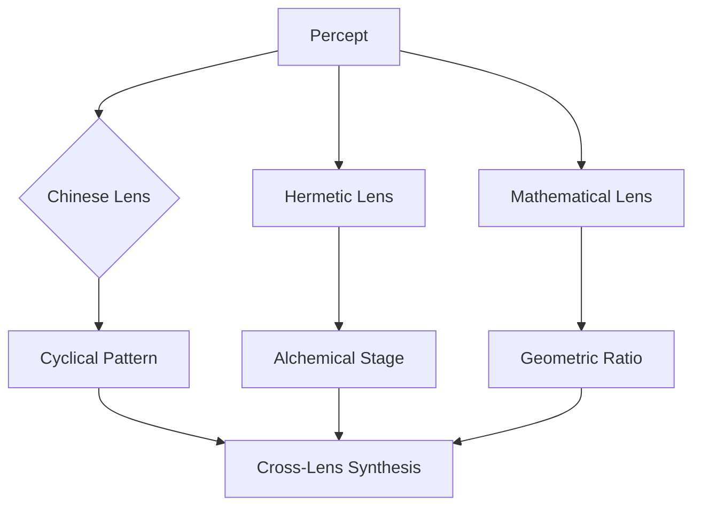
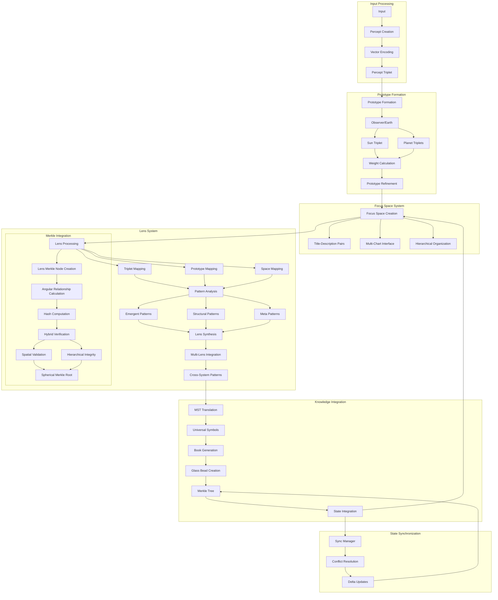

# 2.13. Lenses

The Symbolic Lenses system provides a modular framework for analyzing percepts through diverse cultural and scientific paradigms. Each lens represents a different symbolic system that can interpret percepts through its unique perspective while maintaining compatibility with other lenses.


*Figure 1: Lens Processing Flow, showing how a single percept is processed through multiple lens systems to produce unique patterns that combine in cross-lens synthesis, demonstrating the parallel symbolic interpretation capabilities of the system*

Starting from the percept-triplet layer, lenses can applied to each construction in the processing path, including:

- percept-triplets
- prototypes
- focus spaces

## Core structure

The Astrological Lens serves as the primary lens, providing:

- **Celestial Objects**: Sun, Moon, planets, nodes
- **Zodiacal Signs**: Fire, Earth, Air, Water triplicities 
- **Houses**: Angular, Succedent, Cadent divisions
- **Aspects**: Major and minor angular relationships
- **Event Types**: Mundane and personal transits
- **Pattern Recognition**: Temporal, spatial, symbolic patterns

## Lens framework

### Universal House System
All lenses map to a common house framework:
- **Identity (1st)**: Hero (Jungian), Magician (Tarot), Aries (Astrology)
- **Resources (2nd)**: High Priestess (Tarot), Taurus (Astrology), Earth (I Ching)
- **Communication (3rd)**: Empress (Tarot), Gemini (Astrology), Thunder (I Ching)
- **Foundations (4th)**: Emperor (Tarot), Cancer (Astrology), Water (I Ching)

### Universal House System
The Universal House System provides the foundational framework that enables translation between different symbolic lenses. Based on the astrological house structure, it creates consistent mapping points that preserve symbolic relationships across diverse systems.

#### Core Structure
The twelve-house framework divides symbolic space into distinct domains:

1. **Identity (1st)**: Self, identity, appearance, beginnings, emergence
2. **Resources (2nd)**: Values, possessions, talents, material manifestation
3. **Communication (3rd)**: Learning, information exchange, connections
4. **Foundations (4th)**: Origins, roots, emotional core, inheritance
5. **Expression (5th)**: Creativity, joy, recreation, manifestation
6. **Analysis (6th)**: Service, refinement, improvement, systems
7. **Relationships (7th)**: Partnerships, balance, contracts, reflection
8. **Transformation (8th)**: Shared resources, depth, regeneration, mystery
9. **Expansion (9th)**: Philosophy, higher learning, meaning, principles
10. **Achievement (10th)**: Authority, structure, manifestation, organization
11. **Community (11th)**: Groups, networks, innovation, collective patterns
12. **Integration (12th)**: Unconscious, synthesis, dissolution, unity

#### Interpretive Perspectives
Each house simultaneously operates on four levels:

1. **Personal/Natal**: Individual development, psychology, life path
2. **Mundane Organization**: Projects, resources, systems, operations
3. **Conceptual/Symbolic**: Pattern recognition, symbolic language, concept relationships
4. **Events/Temporal**: Historical patterns, cycles, trends, timelines

#### House Classifications

**By Quality:**
- **Angular Houses** (1, 4, 7, 10): Powerful, initiating energy, direct action
- **Succedent Houses** (2, 5, 8, 11): Building upon angular energy, stability, resources
- **Cadent Houses** (3, 6, 9, 12): Adaptation, mental activities, preparation, adjustment

**By Element:**
- **Fire Houses** (1, 5, 9): Personal expression, action, inspiration, creativity
- **Earth Houses** (2, 6, 10): Practical manifestation, resources, structure, tangible results
- **Air Houses** (3, 7, 11): Communication, relationships, social connections, concepts
- **Water Houses** (4, 8, 12): Emotional depth, psychological understanding, intuition

### Cross-system mappings

| Astrological | Tarot | I Ching | Kabbalah | Musical | Alchemical |
|--------------|-------|----------|-----------|----------|------------|
| Aries (1st)  | Magician | Heaven (☰) | Chokmah | Maj 3rd | Calcination |
| Taurus (2nd)  | High Priestess | Earth (☷) | Kether | P4 | Dissolution |
| Gemini (3rd)  | Empress | Thunder (☳) | Binah | Maj 2nd | Separation |
| Cancer (4th) | Emperor | Water (☵) | Chesed | Min 3rd | Conjunction |
| Leo (5th) | Hierophant | Mountain (☶) | Tiphereth | Maj 5th | Fermentation |
| Virgo (6th) | Lovers | Wind (☴) | Geburah | Min 6th | Distillation |
| Libra (7th) | Chariot | Fire (☲) | Netzach | Maj 6th | Coagulation |
| Scorpio (8th) | Strength | Lake (☱) | Yesod | Min 7th | Multiplication |
| Sagittarius (9th) | Hermit | Heaven (☰) | Hod | Maj 7th | Projection |
| Capricorn (10th) | Wheel of Fortune | Earth (☷) | Malkuth | Octave | Crystallization |
| Aquarius (11th) | Justice | Thunder (☳) | Chokmah | Min 2nd | Circulation |
| Pisces (12th) | Hanged Man | Water (☵) | Binah | Tritone | Sublimation |

#### Symbolic Integration Benefits

The Universal House System enables:

1. **Cross-cultural translation**: Preserves semantic relationships across different cultural systems
2. **Pattern recognition**: Identifies resonances between systems that might otherwise be missed
3. **Conceptual scaffolding**: Provides a structured framework for organizing symbolic knowledge
4. **Dimensional mapping**: Places symbols in a consistent relational space for comparison
5. **Multi-perspective analysis**: Allows examination of concepts through multiple symbolic lenses
6. **Verification redundancy**: Cross-checks interpretations across multiple systems
7. **Computational compatibility**: Creates consistent addressing for symbolic processing
8. **Knowledge integration**: Builds bridges between previously isolated symbolic domains

Each lens maintains its authentic structure and integrity while gaining the ability to communicate with other lenses through the consistent house framework, allowing for rich pattern recognition across diverse symbolic systems.

### Lens types

1. **Traditional Esoteric**
   - Chinese (I Ching, Wu Xing)
   - Western Esoteric (Tarot, Alchemy)
   - Kabbalistic (Tree of Life)
   - Hermetic (Seven Principles)
   - Vedic (Chakras, Nakshatras)

   The Vedic lens includes detailed mappings between the 27 Nakshatras and Western zodiacal degrees, as well as correspondences between the seven chakras and planetary archetypes. Future implementations will expand to include Tibetan Bon cosmology, Japanese Shinto symbolism, and indigenous American medicine wheel traditions. Each non-Western system maintains its authentic symbolic integrity while enabling cross-cultural translation through the universal framework of the percept-triplet structure.

2. **Scientific & Mathematical**
   - Mathematical (Number theory)
   - Sacred Geometry (Platonic solids)
   - Quantum Mechanics (Wave-particle)
   - Systems Theory (Structures)

3. **Psychological & Experiential**
   - Jungian (Archetypes)
   - Phenomenological (Experience)
   - Cognitive Science (Mental processes)

## Technical implementation

### Lens structure
```rust
pub struct Lens {
    name: String,
    dimensions: u32,
    mappings: HashMap<Symbol, Vec<Symbol>>,
    hybrid_coordinates: HybridCoordinates,
    merkle_node: LensMerkleNode,
}

struct LensMerkleNode {
    data: Vec<u8>,                              // Lens data
    children: Vec<NodeId>,                      // Child nodes
    angular_relationships: HashMap<NodeId, Angle>, // Angular relationships between lenses
    coordinate_data: [f32; 4],                  // [θ, φ, r, κ] coordinates
    hash: [u8; 32],                             // Combined hash
}

impl Lens {
    pub fn new(name: String, dimensions: u32, coordinates: HybridCoordinates) -> Self {
        let mappings = HashMap::new();
        let data = Self::serialize_lens_data(&name, dimensions);
        
        let merkle_node = LensMerkleNode {
            data,
            children: Vec::new(),
            angular_relationships: HashMap::new(),
            coordinate_data: [
                coordinates.theta, 
                coordinates.phi, 
                coordinates.radius, 
                coordinates.kappa
            ],
            hash: [0; 32], // Will be calculated
        };
        
        Self {
            name,
            dimensions,
            mappings,
            hybrid_coordinates: coordinates,
            merkle_node,
        }
    }

    pub fn transform(&self, percept: &Percept) -> LensOutput {
        let symbols = self.map_symbols(percept);
        let interpretation = self.interpret(symbols);
        
        LensOutput {
            lens: self.name.clone(),
            symbols,
            interpretation,
            hybrid_coordinates: self.hybrid_coordinates.clone(),
        }
    }
    
    pub fn calculate_hash(&self) -> [u8; 32] {
        self.merkle_node.calculate_hash()
    }
    
    pub fn add_angular_relationship(&mut self, lens_id: NodeId, angle: Angle) {
        self.merkle_node.angular_relationships.insert(lens_id, angle);
        self.merkle_node.hash = self.merkle_node.calculate_hash();
    }
    
    fn serialize_lens_data(name: &str, dimensions: u32) -> Vec<u8> {
        let mut data = Vec::new();
        data.extend_from_slice(name.as_bytes());
        data.extend_from_slice(&dimensions.to_le_bytes());
        data
    }
}

impl LensMerkleNode {
    fn calculate_hash(&self) -> [u8; 32] {
        // Include lens data, relationships, and coordinates in hash
        let data_hash = hash_data(&self.data);
        
        // Sort relationships for deterministic hashing
        let mut relationships = self.angular_relationships
            .iter()
            .map(|(k, v)| (*k, *v))
            .collect::<Vec<(NodeId, Angle)>>();
        relationships.sort_by_key(|(id, _)| *id);
        
        let angle_hash = hash_data(&relationships);
        let coord_hash = hash_data(&self.coordinate_data);
        
        hash_combine_multiple(&[data_hash, angle_hash, coord_hash])
    }
}
```

### Lens verification

```rust
struct LensVerifier {
    merkle_verifier: MerkleVerifier,
    spatial_verifier: SpatialVerifier,
}

impl LensVerifier {
    fn verify(&self, proof: SphericalMerkleProof, root_hash: Hash) -> VerificationResult {
        // Verify merkle structure (hierarchical integrity)
        let merkle_valid = self.merkle_verifier.verify(
            proof.merkle_components, 
            root_hash
        );
        
        // Verify lens spatial relationships (angular integrity)
        let spatial_valid = self.spatial_verifier.verify_angular_consistency(
            proof.coordinate_data,
            proof.angular_relationships
        );
        
        // Check for curvature consistency
        let curvature_valid = self.spatial_verifier.verify_curvature_consistency(
            proof.curvature_fields
        );
        
        VerificationResult {
            valid: merkle_valid && spatial_valid && curvature_valid,
            hierarchical_integrity: merkle_valid,
            spatial_integrity: spatial_valid,
            curvature_integrity: curvature_valid
        }
    }
}
```

### Curvature-aware lens processing

```rust
struct HybridLens {
    base_lens: Lens,
    coordinates: HybridCoordinates,
}

impl HybridLens {
    fn new(lens: Lens, coordinates: HybridCoordinates) -> Self {
        Self {
            base_lens: lens,
            coordinates,
        }
    }
    
    fn transform(&self, percept: &Percept) -> HybridLensOutput {
        // Apply base transformation
        let base_output = self.base_lens.transform(percept);
        
        // Adjust interpretation based on curvature
        let curvature_adjusted = if self.coordinates.kappa > 0.0 {
            // Hyperbolic space - emphasize hierarchical relationships
            self.adjust_for_hyperbolic(base_output)
        } else {
            // Spherical space - emphasize angular/symbolic relationships
            self.adjust_for_spherical(base_output)
        };
        
        HybridLensOutput {
            base: base_output,
            curvature_adjusted,
            coordinates: self.coordinates.clone(),
        }
    }
    
    fn calculate_angular_relationship(&self, other: &HybridLens) -> Angle {
        // Calculate angular relationship between lenses
        let spherical_angle = calculate_spherical_angle(
            self.coordinates.theta, self.coordinates.phi,
            other.coordinates.theta, other.coordinates.phi
        );
        
        // Apply curvature adjustments
        let curvature_factor = ((self.coordinates.kappa + other.coordinates.kappa) / 2.0).abs();
        let adjustment = 1.0 + (0.2 * curvature_factor); // 20% max adjustment
        
        spherical_angle * adjustment
    }
}
```

### Example implementations

1. **Theosophical Lens**
```rust
struct TarotTheosophicalLens {
    lens: Lens,
    tarot_mappings: HashMap<TarotCard, Symbol>,
    merkle_proof: Option<SphericalMerkleProof>,
}

impl TarotTheosophicalLens {
    fn new(coordinates: HybridCoordinates) -> Self {
        let lens = Lens::new(
            "Tarot Theosophical".to_string(),
            78, // 78 cards in a tarot deck
            coordinates
        );
        
        Self {
            lens,
            tarot_mappings: Self::initialize_tarot_mappings(),
            merkle_proof: None,
        }
    }
    
    fn apply(&self, percept: &PerceptTriplet) -> LensOutput {
        // Transform using tarot symbolism
        let output = self.lens.transform(percept);
        
        // Verify transformation integrity
        if let Some(proof) = &self.merkle_proof {
            let verifier = LensVerifier::new();
            let result = verifier.verify(proof.clone(), self.lens.calculate_hash());
            
            if !result.valid {
                log::warn!("Tarot lens transformation verification failed");
            }
        }
        
        output
    }
    
    fn generate_merkle_proof(&self) -> SphericalMerkleProof {
        // Create proof with angular relationships
        SphericalMerkleProof {
            merkle_components: self.generate_merkle_path(),
            coordinate_data: [
                self.lens.hybrid_coordinates.theta,
                self.lens.hybrid_coordinates.phi,
                self.lens.hybrid_coordinates.radius,
                self.lens.hybrid_coordinates.kappa
            ],
            angular_relationships: self.lens.merkle_node.angular_relationships.clone(),
            curvature_fields: self.generate_curvature_fields(),
        }
    }
}
```

2. **Music Theory Lens**
```rust
struct MusicTheoryLens {
    lens: Lens,
    intervals: HashMap<Interval, Symbol>,
    merkle_proof: Option<SphericalMerkleProof>,
}

impl MusicTheoryLens {
    fn new(coordinates: HybridCoordinates) -> Self {
        let lens = Lens::new(
            "Music Theory".to_string(),
            12, // 12 semitones in an octave
            coordinates
        );
        
        Self {
            lens,
            intervals: Self::initialize_intervals(),
            merkle_proof: None,
        }
    }
    
    fn apply(&self, percept: &PerceptTriplet) -> LensOutput {
        // Transform using musical intervals
        let output = self.lens.transform(percept);
        
        // Verify transformation integrity
        if let Some(proof) = &self.merkle_proof {
            let verifier = LensVerifier::new();
            let result = verifier.verify(proof.clone(), self.lens.calculate_hash());
            
            if !result.valid {
                log::warn!("Music theory lens transformation verification failed");
            }
        }
        
        output
    }
    
    fn generate_merkle_proof(&self) -> SphericalMerkleProof {
        // Create proof with angular relationships
        SphericalMerkleProof {
            merkle_components: self.generate_merkle_path(),
            coordinate_data: [
                self.lens.hybrid_coordinates.theta,
                self.lens.hybrid_coordinates.phi,
                self.lens.hybrid_coordinates.radius,
                self.lens.hybrid_coordinates.kappa
            ],
            angular_relationships: self.lens.merkle_node.angular_relationships.clone(),
            curvature_fields: self.generate_curvature_fields(),
        }
    }
}
```

## Pattern recognition

The system identifies patterns across lenses:
- **Cross-System**: Archetype correspondences, resonances, cycles
- **Universal**: Mathematical symmetries, quantum states, dynamics
- **Temporal**: Cycles, progressions, rhythms
- **Spatial**: Geometric forms, relationships, structures

### Pattern preservation

Lens-based patterns are preserved in the Spherical Merkle Tree structure:

```rust
struct LensPattern {
    pattern_data: Vec<u8>,
    related_lenses: Vec<NodeId>,
    angular_pattern: HashMap<(NodeId, NodeId), Angle>,
    hybrid_coordinates: HybridCoordinates,
    merkle_node: LensPatternMerkleNode,
}

struct LensPatternMerkleNode {
    data: Vec<u8>,
    angular_relationships: HashMap<(NodeId, NodeId), Angle>,
    coordinate_data: [f32; 4],
    hash: [u8; 32],
}

impl LensPattern {
    fn new(data: Vec<u8>, coordinates: HybridCoordinates) -> Self {
        let merkle_node = LensPatternMerkleNode {
            data: data.clone(),
            angular_relationships: HashMap::new(),
            coordinate_data: [
                coordinates.theta,
                coordinates.phi,
                coordinates.radius,
                coordinates.kappa
            ],
            hash: [0; 32],
        };
        
        Self {
            pattern_data: data,
            related_lenses: Vec::new(),
            angular_pattern: HashMap::new(),
            hybrid_coordinates: coordinates,
            merkle_node,
        }
    }
    
    fn add_angular_pattern(&mut self, lens1: NodeId, lens2: NodeId, angle: Angle) {
        self.angular_pattern.insert((lens1, lens2), angle);
        self.merkle_node.angular_relationships.insert((lens1, lens2), angle);
        self.merkle_node.hash = self.merkle_node.calculate_hash();
    }
    
    fn calculate_hash(&self) -> [u8; 32] {
        self.merkle_node.calculate_hash()
    }
}

impl LensPatternMerkleNode {
    fn calculate_hash(&self) -> [u8; 32] {
        // Hash pattern data
        let data_hash = hash_data(&self.data);
        
        // Hash angular patterns
        let mut sorted_patterns: Vec<((NodeId, NodeId), Angle)> = 
            self.angular_relationships.iter()
                .map(|((id1, id2), angle)| ((*id1, *id2), *angle))
                .collect();
        sorted_patterns.sort_by_key(|((id1, id2), _)| (*id1, *id2));
        
        let angular_hash = hash_data(&sorted_patterns);
        let coord_hash = hash_data(&self.coordinate_data);
        
        hash_combine_multiple(&[data_hash, angular_hash, coord_hash])
    }
}
```

## Custom lens creation

Advanced users can create their own lens systems through:

### Definition interface
```rust
pub trait LensDefinition {
    fn define_symbols(&self) -> Vec<Symbol>;
    fn define_mappings(&self) -> HashMap<Symbol, Vec<Symbol>>;
    fn define_rules(&self) -> Vec<Rule>;
    fn define_coordinates(&self) -> HybridCoordinates;
}
```

### Requirements
- Complete mapping to Universal House System
- Symbol correspondence tables
- Pattern recognition rules
- Validation criteria
- Hybrid coordinates for Spherical Merkle Tree integration

### Example custom lens
```rust
struct CustomLens {
    lens: Lens,
    symbols: Vec<Symbol>,
    house_mappings: HashMap<House, Symbol>,
    rules: Vec<Rule>,
}

impl CustomLens {
    fn new(name: String, coordinates: HybridCoordinates) -> Self {
        let lens = Lens::new(name, 0, coordinates);
        
        Self {
            lens,
            symbols: Vec::new(),
            house_mappings: HashMap::new(),
            rules: Vec::new(),
        }
    }
    
    fn calculate_angle(&self, other: &CustomLens) -> Angle {
        calculate_spherical_angle(
            self.lens.hybrid_coordinates.theta,
            self.lens.hybrid_coordinates.phi,
            other.lens.hybrid_coordinates.theta,
            other.lens.hybrid_coordinates.phi
        )
    }
    
    fn calculate_angular_relationships(&self, other_lenses: &[&CustomLens]) -> HashMap<NodeId, Angle> {
        let mut relationships = HashMap::new();
        
        for other in other_lenses {
            let angle = self.calculate_angle(other);
            
            // Only store significant relationships
            if is_significant_angle(angle, self.lens.hybrid_coordinates.kappa) {
                relationships.insert(other.id(), angle);
            }
        }
        
        relationships
    }
}

impl LensDefinition for CustomLens {
    fn define_symbols(&self) -> Vec<Symbol> {
        self.symbols.clone()
    }
    
    fn define_mappings(&self) -> HashMap<Symbol, Vec<Symbol>> {
        let mut mappings = HashMap::new();
        
        for (house, symbol) in &self.house_mappings {
            mappings.insert(symbol.clone(), vec![house_to_symbol(*house)]);
        }
        
        mappings
    }
    
    fn define_rules(&self) -> Vec<Rule> {
        self.rules.clone()
    }
    
    fn define_coordinates(&self) -> HybridCoordinates {
        self.lens.hybrid_coordinates.clone()
    }
}
```

## Percept-triplet integration

Lenses transform percept-triplets by mapping their components (subject, predicate, object) into lens-specific symbolic representations while preserving spatial relationships:

```rust
pub struct PerceptLens {
    lens: Box<dyn Lens>,
    mappings: SymbolicMappings,
    coordinates: HybridCoordinates,
    merkle_node: LensMerkleNode,
}

impl PerceptLens {
    pub fn new(lens: Box<dyn Lens>, mappings: SymbolicMappings, coordinates: HybridCoordinates) -> Self {
        let data = Self::serialize_mappings(&mappings);
        
        let merkle_node = LensMerkleNode {
            data,
            children: Vec::new(),
            angular_relationships: HashMap::new(),
            coordinate_data: [
                coordinates.theta,
                coordinates.phi,
                coordinates.radius,
                coordinates.kappa
            ],
            hash: [0; 32],
        };
        
        Self {
            lens,
            mappings,
            coordinates,
            merkle_node,
        }
    }

    pub fn transform(&self, triplet: &PerceptTriplet) -> LensedPerceptWithProof {
        let lensed = LensedPercept {
            subject: self.map_component(&triplet.subject),
            predicate: self.map_component(&triplet.predicate),
            object: self.map_component(&triplet.object),
            relationships: self.analyze_relationships(triplet),
            patterns: self.detect_patterns(triplet)
        };
        
        // Create merkle proof for verification
        let merkle_proof = self.create_spherical_merkle_proof();
        
        LensedPerceptWithProof {
            lensed_percept: lensed,
            merkle_proof,
            hybrid_coordinates: self.coordinates.clone(),
        }
    }

    fn analyze_relationships(&self, triplet: &PerceptTriplet) -> Vec<SymbolicRelation> {
        // Analyze symbolic relationships between components
        // e.g., astrological aspects, elemental affinities
        Vec::new()
    }
    
    fn map_component(&self, component: &PerceptComponent) -> SymbolicComponent {
        // Map component to symbolic representation
        SymbolicComponent::default()
    }
    
    fn detect_patterns(&self, triplet: &PerceptTriplet) -> Vec<Pattern> {
        let mut patterns = Vec::new();
        
        // Archetypal patterns
        patterns.extend(self.detect_archetypal_patterns(triplet));
        
        // Elemental combinations
        patterns.extend(self.analyze_elemental_harmony(triplet));
        
        // Symbolic resonance
        patterns.extend(self.find_symbolic_echoes(triplet));
        
        patterns
    }
    
    fn create_spherical_merkle_proof(&self) -> SphericalMerkleProof {
        // Create proof that includes angular relationships
        SphericalMerkleProof {
            merkle_components: self.generate_merkle_path(),
            coordinate_data: [
                self.coordinates.theta,
                self.coordinates.phi,
                self.coordinates.radius,
                self.coordinates.kappa
            ],
            angular_relationships: self.merkle_node.angular_relationships.clone(),
            curvature_fields: self.generate_curvature_fields(),
        }
    }
    
    fn serialize_mappings(mappings: &SymbolicMappings) -> Vec<u8> {
        // Serialize mappings to bytes
        Vec::new()
    }
    
    fn generate_merkle_path(&self) -> Vec<MerkleProofComponent> {
        // Generate merkle path for proof
        Vec::new()
    }
    
    fn generate_curvature_fields(&self) -> Vec<CurvatureField> {
        // Generate curvature fields for proof
        Vec::new()
    }
    
    fn detect_archetypal_patterns(&self, triplet: &PerceptTriplet) -> Vec<Pattern> {
        // Detect archetypal patterns
        Vec::new()
    }
    
    fn analyze_elemental_harmony(&self, triplet: &PerceptTriplet) -> Vec<Pattern> {
        // Analyze elemental harmony
        Vec::new()
    }
    
    fn find_symbolic_echoes(&self, triplet: &PerceptTriplet) -> Vec<Pattern> {
        // Find symbolic echoes
        Vec::new()
    }
}
```

### Component mapping examples

- **Astrological**: 
  - Subject → House placement
  - Predicate → Planetary aspect
  - Object → Sign position

- **I Ching**:
  - Subject → Lower trigram
  - Predicate → Changing lines
  - Object → Upper trigram

## Prototype integration

Lenses analyze prototypes both holistically and at the individual triplet level while maintaining angular relationships in Spherical Merkle Trees:

```rust
pub struct PrototypeLens {
    lens: Box<dyn Lens>,
    triplet_analyzer: PerceptLens,
    coordinates: HybridCoordinates,
    merkle_root: [u8; 32],
}

impl PrototypeLens {
    pub fn new(lens: Box<dyn Lens>, triplet_analyzer: PerceptLens, coordinates: HybridCoordinates) -> Self {
        Self {
            lens,
            triplet_analyzer,
            coordinates,
            merkle_root: [0; 32],
        }
    }

    pub fn analyze(&self, prototype: &Prototype) -> LensedPrototypeWithProof {
        // Analyze individual triplets
        let triplet_analyses: Vec<LensedPercept> = prototype.triplets
            .iter()
            .map(|t| self.triplet_analyzer.transform(t).lensed_percept)
            .collect();

        // Analyze emergent patterns
        let emergent_patterns = self.analyze_emergent_patterns(&triplet_analyses);
        
        // Analyze prototype structure
        let structural_patterns = self.analyze_structure(prototype);

        let lensed = LensedPrototype {
            triplet_analyses,
            emergent_patterns,
            structural_patterns,
            holistic_interpretation: self.synthesize_interpretation(
                &triplet_analyses,
                &emergent_patterns,
                &structural_patterns
            )
        };
        
        // Generate spherical merkle tree for verification
        let merkle_nodes = self.generate_merkle_nodes(&lensed);
        let spherical_tree = self.build_spherical_merkle_tree(merkle_nodes);
        
        // Create proof that includes angular relationships
        let merkle_proof = spherical_tree.generate_proof();
        
        LensedPrototypeWithProof {
            lensed_prototype: lensed,
            merkle_proof,
            hybrid_coordinates: self.coordinates.clone(),
        }
    }

    fn analyze_emergent_patterns(&self, analyses: &[LensedPercept]) -> Vec<Pattern> {
        // Detect patterns that emerge from triplet relationships:
        // - Symbolic resonance between triplets
        // - Recurring themes or motifs
        // - Archetypal configurations
        Vec::new()
    }

    fn analyze_structure(&self, prototype: &Prototype) -> Vec<StructuralPattern> {
        // Analyze prototype's organizational structure:
        // - Hierarchical relationships
        // - Network topology
        // - Temporal sequences
        Vec::new()
    }
    
    fn synthesize_interpretation(&self,
                                triplet_analyses: &[LensedPercept],
                                emergent_patterns: &[Pattern],
                                structural_patterns: &[StructuralPattern]) -> Interpretation {
        // Synthesize holistic interpretation
        Interpretation::default()
    }
    
    fn generate_merkle_nodes(&self, lensed: &LensedPrototype) -> Vec<LensMerkleNode> {
        let mut nodes = Vec::new();
        
        // Create node for each triplet analysis
        for analysis in &lensed.triplet_analyses {
            let coords = self.derive_coordinates(analysis);
            let node = LensMerkleNode {
                data: self.serialize_analysis(analysis),
                children: Vec::new(),
                angular_relationships: HashMap::new(),
                coordinate_data: [
                    coords.theta,
                    coords.phi,
                    coords.radius,
                    coords.kappa
                ],
                hash: [0; 32],
            };
            nodes.push(node);
        }
        
        // Add nodes for pattern analyses
        for pattern in &lensed.emergent_patterns {
            let coords = self.derive_pattern_coordinates(pattern);
            let node = LensMerkleNode {
                data: self.serialize_pattern(pattern),
                children: Vec::new(),
                angular_relationships: HashMap::new(),
                coordinate_data: [
                    coords.theta,
                    coords.phi,
                    coords.radius,
                    coords.kappa
                ],
                hash: [0; 32],
            };
            nodes.push(node);
        }
        
        // Calculate angular relationships between nodes
        self.calculate_angular_relationships(&mut nodes);
        
        // Calculate hashes
        for node in &mut nodes {
            node.hash = node.calculate_hash();
        }
        
        nodes
    }
    
    fn calculate_angular_relationships(&self, nodes: &mut Vec<LensMerkleNode>) {
        for i in 0..nodes.len() {
            for j in (i+1)..nodes.len() {
                let angle = calculate_angular_relationship(
                    &nodes[i].coordinate_data,
                    &nodes[j].coordinate_data
                );
                
                // Only store significant relationships
                if is_significant_angle(angle, nodes[i].coordinate_data[3]) {
                    nodes[i].angular_relationships.insert(j as NodeId, angle);
                    nodes[j].angular_relationships.insert(i as NodeId, angle);
                }
            }
        }
    }
    
    fn build_spherical_merkle_tree(&self, nodes: Vec<LensMerkleNode>) -> SphericalMerkleTree {
        // Build spherical merkle tree
        SphericalMerkleTree::new(nodes)
    }
    
    fn serialize_analysis(&self, analysis: &LensedPercept) -> Vec<u8> {
        // Serialize analysis to bytes
        Vec::new()
    }
    
    fn serialize_pattern(&self, pattern: &Pattern) -> Vec<u8> {
        // Serialize pattern to bytes
        Vec::new()
    }
    
    fn derive_coordinates(&self, analysis: &LensedPercept) -> HybridCoordinates {
        // Derive coordinates from analysis
        HybridCoordinates::default()
    }
    
    fn derive_pattern_coordinates(&self, pattern: &Pattern) -> HybridCoordinates {
        // Derive coordinates from pattern
        HybridCoordinates::default()
    }
}
```

### Triplet relationship analysis

```rust
impl PrototypeLens {
    fn analyze_triplet_relationships(&self, triplets: &[PerceptTriplet]) -> Vec<Relationship> {
        let mut relationships = Vec::new();
        
        for (i, t1) in triplets.iter().enumerate() {
            for t2 in triplets.iter().skip(i + 1) {
                // Analyze symbolic connections
                if let Some(connection) = self.find_symbolic_connection(t1, t2) {
                    relationships.push(connection);
                }
                
                // Analyze shared elements
                if let Some(shared) = self.analyze_shared_elements(t1, t2) {
                    relationships.push(shared);
                }
            }
        }
        
        relationships
    }
    
    fn find_symbolic_connection(&self, t1: &PerceptTriplet, t2: &PerceptTriplet) -> Option<Relationship> {
        // Find symbolic connection
        None
    }
    
    fn analyze_shared_elements(&self, t1: &PerceptTriplet, t2: &PerceptTriplet) -> Option<Relationship> {
        // Analyze shared elements
        None
    }
}
```

### Pattern synthesis

The lens combines individual triplet patterns with prototype-level patterns:

```rust
pub struct PatternSynthesis {
    triplet_patterns: Vec<Pattern>,
    structural_patterns: Vec<StructuralPattern>,
    emergent_patterns: Vec<Pattern>,
    meta_patterns: Vec<MetaPattern>,
    merkle_root: [u8; 32],
}

impl PrototypeLens {
    fn synthesize_patterns(&self, prototype: &Prototype) -> PatternSynthesis {
        // Collect patterns at all levels
        let triplet_patterns = self.collect_triplet_patterns(prototype);
        let structural_patterns = self.analyze_structure(prototype);
        let emergent_patterns = self.find_emergent_patterns(&triplet_patterns);
        
        // Find meta-patterns across levels
        let meta_patterns = self.detect_meta_patterns(
            &triplet_patterns,
            &structural_patterns,
            &emergent_patterns
        );
        
        // Create Merkle nodes for pattern synthesis
        let nodes = self.create_pattern_merkle_nodes(
            &triplet_patterns,
            &structural_patterns,
            &emergent_patterns,
            &meta_patterns
        );
        
        // Build Merkle tree and get root
        let merkle_root = self.build_pattern_merkle_tree(nodes).root_hash();
        
        PatternSynthesis {
            triplet_patterns,
            structural_patterns,
            emergent_patterns,
            meta_patterns,
            merkle_root,
        }
    }
    
    fn collect_triplet_patterns(&self, prototype: &Prototype) -> Vec<Pattern> {
        // Collect triplet patterns
        Vec::new()
    }
    
    fn find_emergent_patterns(&self, triplet_patterns: &[Pattern]) -> Vec<Pattern> {
        // Find emergent patterns
        Vec::new()
    }
    
    fn detect_meta_patterns(&self,
                          triplet_patterns: &[Pattern],
                          structural_patterns: &[StructuralPattern],
                          emergent_patterns: &[Pattern]) -> Vec<MetaPattern> {
        // Detect meta-patterns
        Vec::new()
    }
    
    fn create_pattern_merkle_nodes(&self,
                                 triplet_patterns: &[Pattern],
                                 structural_patterns: &[StructuralPattern],
                                 emergent_patterns: &[Pattern],
                                 meta_patterns: &[MetaPattern]) -> Vec<LensMerkleNode> {
        // Create Merkle nodes for patterns
        Vec::new()
    }
    
    fn build_pattern_merkle_tree(&self, nodes: Vec<LensMerkleNode>) -> SphericalMerkleTree {
        // Build pattern Merkle tree
        SphericalMerkleTree::new(nodes)
    }
}
```

## Focus space integration

Lenses dynamically transform focus spaces by:

1. **Symbolic Mapping**: Converting focus space elements into lens-specific symbols
2. **Pattern Analysis**: Identifying symbolic patterns within the transformed space
3. **Cross-lens Synthesis**: Combining insights from multiple lens perspectives

### Implementation

```rust
pub struct FocusSpaceLens {
    lens: Box<dyn Lens>,
    space: FocusSpace,
    active_patterns: Vec<Pattern>,
    coordinates: HybridCoordinates,
    merkle_root: [u8; 32],
}

impl FocusSpaceLens {
    pub fn new(lens: Box<dyn Lens>, space: FocusSpace, coordinates: HybridCoordinates) -> Self {
        Self {
            lens,
            space,
            active_patterns: Vec::new(),
            coordinates,
            merkle_root: [0; 32],
        }
    }

    pub fn apply(&self) -> LensedSpaceWithProof {
        // Map focus space to symbols through lens
        let symbols = self.lens.map_space(&self.space);
        
        // Analyze patterns in symbolic space
        let patterns = self.lens.analyze_patterns(&symbols);
        
        // Interpret patterns
        let interpretation = self.lens.interpret(patterns.clone());
        
        let lensed = LensedSpace {
            original: self.space.clone(),
            symbols,
            patterns: patterns.clone(),
            interpretation,
        };
        
        // Create merkle nodes for lens transformation
        let merkle_nodes = self.generate_merkle_nodes(&lensed);
        
        // Build spherical merkle tree
        let spherical_tree = self.build_spherical_merkle_tree(merkle_nodes);
        
        // Generate proof with angular relationships
        let merkle_proof = spherical_tree.generate_proof();
        
        LensedSpaceWithProof {
            lensed_space: lensed,
            merkle_proof,
            hybrid_coordinates: self.coordinates.clone(),
        }
    }
    
    fn generate_merkle_nodes(&self, lensed: &LensedSpace) -> Vec<LensMerkleNode> {
        let mut nodes = Vec::new();
        
        // Create node for each symbolic mapping
        for (id, symbol) in &lensed.symbols {
            let coords = self.derive_coordinates(symbol);
            nodes.push((id, LensMerkleNode {
                data: self.serialize_symbol(symbol),
                children: Vec::new(),
                angular_relationships: HashMap::new(),
                coordinate_data: [
                    coords.theta,
                    coords.phi,
                    coords.radius,
                    coords.kappa
                ],
                hash: [0; 32],
            }));
        }
        
        // Create nodes for patterns
        for pattern in &lensed.patterns {
            let coords = self.derive_pattern_coordinates(pattern);
            nodes.push((pattern.id(), LensMerkleNode {
                data: self.serialize_pattern(pattern),
                children: Vec::new(),
                angular_relationships: HashMap::new(),
                coordinate_data: [
                    coords.theta,
                    coords.phi,
                    coords.radius,
                    coords.kappa
                ],
                hash: [0; 32],
            }));
        }
        
        // Calculate angular relationships between nodes
        self.calculate_angular_relationships(&mut nodes);
        
        // Calculate hashes
        for (_, node) in &mut nodes {
            node.hash = node.calculate_hash();
        }
        
        nodes.into_iter().map(|(_, node)| node).collect()
    }
    
    fn calculate_angular_relationships(&self, nodes: &mut Vec<(NodeId, LensMerkleNode)>) {
        for i in 0..nodes.len() {
            for j in (i+1)..nodes.len() {
                let angle = calculate_angular_relationship(
                    &nodes[i].1.coordinate_data,
                    &nodes[j].1.coordinate_data
                );
                
                // Only store significant relationships
                if is_significant_angle(angle, nodes[i].1.coordinate_data[3]) {
                    nodes[i].1.angular_relationships.insert(nodes[j].0, angle);
                    nodes[j].1.angular_relationships.insert(nodes[i].0, angle);
                }
            }
        }
    }
    
    fn build_spherical_merkle_tree(&self, nodes: Vec<LensMerkleNode>) -> SphericalMerkleTree {
        // Build spherical merkle tree
        SphericalMerkleTree::new(nodes)
    }
    
    fn serialize_symbol(&self, symbol: &Symbol) -> Vec<u8> {
        // Serialize symbol to bytes
        Vec::new()
    }
    
    fn serialize_pattern(&self, pattern: &Pattern) -> Vec<u8> {
        // Serialize pattern to bytes
        Vec::new()
    }
    
    fn derive_coordinates(&self, symbol: &Symbol) -> HybridCoordinates {
        // Derive coordinates from symbol
        HybridCoordinates::default()
    }
    
    fn derive_pattern_coordinates(&self, pattern: &Pattern) -> HybridCoordinates {
        // Derive coordinates from pattern
        HybridCoordinates::default()
    }
}
```

### Pattern recognition in focus spaces

- **Temporal Patterns**: Cyclic relationships between focus states
- **Spatial Patterns**: Geometric arrangements of focus elements
- **Symbolic Patterns**: Archetypal themes across different lenses
- **Dynamic Patterns**: Evolution of patterns over time

### Multi-lens analysis

Focus spaces can be analyzed through multiple lenses simultaneously while maintaining spatial relationships through Spherical Merkle Trees:

```rust
pub struct MultiLensAnalysis {
    space: FocusSpace,
    lenses: Vec<Box<dyn Lens>>,
    synthesis: Box<dyn PatternSynthesizer>,
    verifier: LensVerifier,
    coordinates: HybridCoordinates,
}

impl MultiLensAnalysis {
    pub fn new(space: FocusSpace, lenses: Vec<Box<dyn Lens>>, coordinates: HybridCoordinates) -> Self {
        Self {
            space,
            lenses,
            synthesis: Box::new(DefaultPatternSynthesizer::new()),
            verifier: LensVerifier::new(),
            coordinates,
        }
    }

    pub fn analyze(&self) -> Vec<LensedSpaceWithProof> {
        // Analyze through each lens
        let mut lensed_spaces = Vec::new();
        
        for lens in &self.lenses {
            let lens_merkle = FocusSpaceLens::new(
                lens.clone(),
                self.space.clone(),
                self.derive_lens_coordinates(lens),
            );
            
            let lensed_with_proof = lens_merkle.apply();
            lensed_spaces.push(lensed_with_proof);
        }
        
        // Create cross-lens angular relationships
        self.add_cross_lens_relationships(&mut lensed_spaces);
        
        lensed_spaces
    }
    
    fn add_cross_lens_relationships(&self, spaces: &mut Vec<LensedSpaceWithProof>) {
        for i in 0..spaces.len() {
            for j in (i+1)..spaces.len() {
                // Calculate symbolic relationships between lenses
                let cross_lens_angle = calculate_cross_lens_angle(
                    &spaces[i].hybrid_coordinates,
                    &spaces[j].hybrid_coordinates
                );
                
                // Add to merkle proofs if significant
                if is_significant_angle(cross_lens_angle, spaces[i].hybrid_coordinates.kappa) {
                    spaces[i].merkle_proof.add_cross_lens_relationship(
                        spaces[j].lensed_space.lens_id, 
                        cross_lens_angle
                    );
                    
                    spaces[j].merkle_proof.add_cross_lens_relationship(
                        spaces[i].lensed_space.lens_id, 
                        cross_lens_angle
                    );
                }
            }
        }
    }
    
    fn verify_all(&self, spaces: &[LensedSpaceWithProof]) -> bool {
        for space in spaces {
            if !self.verifier.verify(space.merkle_proof.clone(), space.merkle_root) {
                return false;
            }
        }
        true
    }
    
    fn derive_lens_coordinates(&self, lens: &Box<dyn Lens>) -> HybridCoordinates {
        // Derive coordinates for lens
        HybridCoordinates::default()
    }
}
```

## Technical Flow

The lens system extends the focus space processing pipeline by adding symbolic transformation and pattern analysis layers:


*Figure 2: Complete Memorativa Processing Pipeline, illustrating the flow from input through lens processing to knowledge integration, highlighting how the lens system interfaces with other major components while maintaining data integrity through Merkle verification*

This technical flow enables:

1. **Core architecture**
   - Astrological lens as foundation
   - Universal house system mapping
   - Modular lens design
   - Cross-system compatibility
   - Hybrid spherical-hyperbolic space integration

2. **Processing layers**
   - Percept-triplet transformation
   - Prototype analysis and synthesis
   - Focus space integration
   - Multi-lens analysis capabilities
   - Lens-specific Merkle nodes preserving angular relationships

3. **Pattern recognition**
   - Component-level patterns
   - Emergent relationships
   - Structural analysis
   - Meta-pattern synthesis
   - Temporal and spatial dynamics
   - Spatial pattern preservation in Merkle structure

4. **Technical implementation**
   - Rust-based transformation system
   - Type-safe lens definitions
   - Efficient pattern detection
   - Modular component design
   - Hybrid verification system for both content and relationships
   - Curvature-aware processing for different geometric contexts

5. **Integration features**
   - Triplet component mapping
   - Prototype relationship analysis
   - Focus space transformation
   - Cross-lens synthesis
   - Spherical Merkle Tree integration preserving angular relationships
   - Coordinate preservation in verification proofs

6. **Benefits**
   - Rich symbolic interpretation
   - Multi-level pattern analysis
   - Extensible architecture
   - Cultural synthesis
   - Mathematical rigor
   - Verifiable integrity of both content and spatial relationships
   - Consistent integration with Glass Beads and other components
   - Efficient hybrid verification system for lens data

## Citations

- [1] Jung, C.G. (1968). *Man and His Symbols*. Dell Publishing.
- [2] Merkle, R. C. (1987). "A Digital Signature Based on a Conventional Encryption Function." *CRYPTO '87*, pp. 369-378.
- [3] Bohm, D. (1980). *Wholeness and the Implicate Order*. Routledge.
- [4] Penrose, R. (1989). *The Emperor's New Mind*. Oxford University Press.
- [5] Steiner, R. (1923). *The Four Temperaments*. Anthroposophic Press.