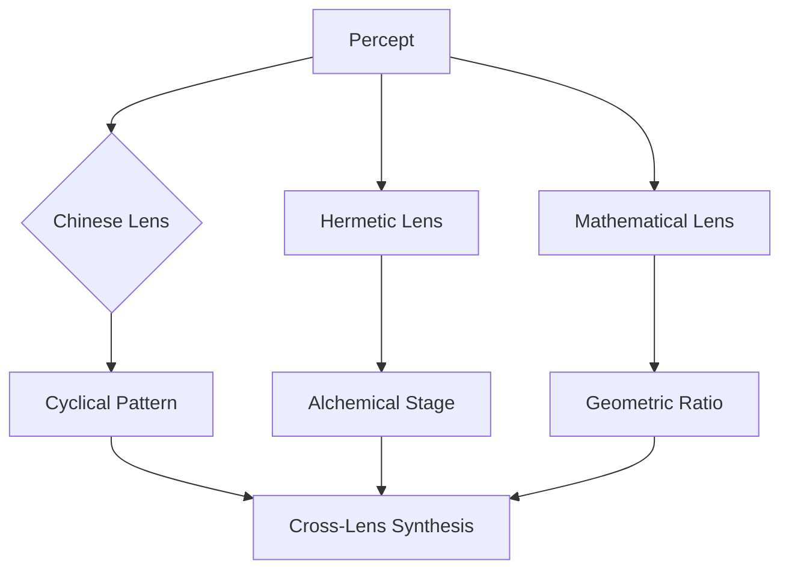
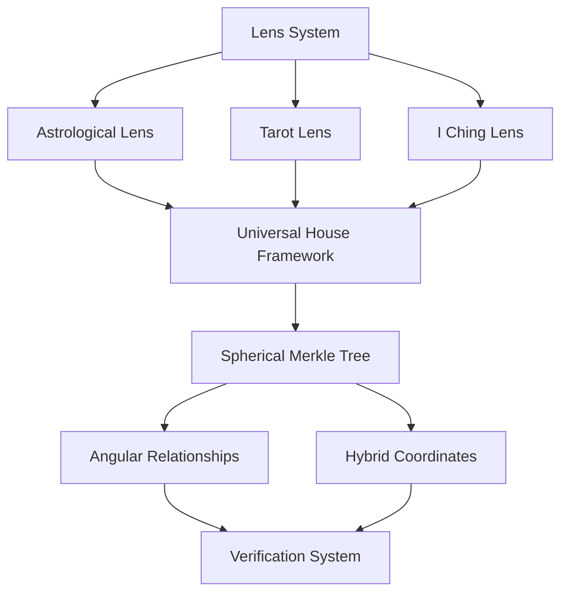

# 2.13. Lenses

The Symbolic Lenses system provides a modular framework for analyzing percepts through diverse cultural and scientific paradigms. Each lens represents a different symbolic system that can interpret percepts through its unique perspective while maintaining compatibility with other lenses.


*Figure 1: Lens Processing Flow, showing how a single percept is processed through multiple lens systems to produce unique patterns that combine in cross-lens synthesis, demonstrating the parallel symbolic interpretation capabilities of the system*

Starting from the percept-triplet layer, lenses can applied to each construction in the processing path, including:

- percept-triplets
- prototypes
- focus spaces

## Core structure

The Astrological Lens serves as the primary lens, providing:

- **Celestial Objects**: Sun, Moon, planets, nodes
- **Zodiacal Signs**: Fire, Earth, Air, Water triplicities 
- **Houses**: Angular, Succedent, Cadent divisions
- **Aspects**: Major and minor angular relationships
- **Event Types**: Mundane and personal transits
- **Pattern Recognition**: Temporal, spatial, symbolic patterns


## Lens framework

### Universal House System
All lenses map to a common house framework:
- **Identity (1st)**: Hero (Jungian), Magician (Tarot), Aries (Astrology)
- **Resources (2nd)**: High Priestess (Tarot), Taurus (Astrology), Earth (I Ching)
- **Communication (3rd)**: Empress (Tarot), Gemini (Astrology), Thunder (I Ching)
- **Foundations (4th)**: Emperor (Tarot), Cancer (Astrology), Water (I Ching)

### Universal House System
The Universal House System provides the foundational framework that enables translation between different symbolic lenses. Based on the astrological house structure, it creates consistent mapping points that preserve symbolic relationships across diverse systems.

#### Core Structure
The twelve-house framework divides symbolic space into distinct domains:

1. **Identity (1st)**: Self, identity, appearance, beginnings, emergence
2. **Resources (2nd)**: Values, possessions, talents, material manifestation
3. **Communication (3rd)**: Learning, information exchange, connections
4. **Foundations (4th)**: Origins, roots, emotional core, inheritance
5. **Expression (5th)**: Creativity, joy, recreation, manifestation
6. **Analysis (6th)**: Service, refinement, improvement, systems
7. **Relationships (7th)**: Partnerships, balance, contracts, reflection
8. **Transformation (8th)**: Shared resources, depth, regeneration, mystery
9. **Expansion (9th)**: Philosophy, higher learning, meaning, principles
10. **Achievement (10th)**: Authority, structure, manifestation, organization
11. **Community (11th)**: Groups, networks, innovation, collective patterns
12. **Integration (12th)**: Unconscious, synthesis, dissolution, unity

#### Interpretive Perspectives
Each house simultaneously operates on four levels:

1. **Personal/Natal**: Individual development, psychology, life path
2. **Mundane Organization**: Projects, resources, systems, operations
3. **Conceptual/Symbolic**: Pattern recognition, symbolic language, concept relationships
4. **Events/Temporal**: Historical patterns, cycles, trends, timelines

#### House Classifications

**By Quality:**
- **Angular Houses** (1, 4, 7, 10): Powerful, initiating energy, direct action
- **Succedent Houses** (2, 5, 8, 11): Building upon angular energy, stability, resources
- **Cadent Houses** (3, 6, 9, 12): Adaptation, mental activities, preparation, adjustment

**By Element:**
- **Fire Houses** (1, 5, 9): Personal expression, action, inspiration, creativity
- **Earth Houses** (2, 6, 10): Practical manifestation, resources, structure, tangible results
- **Air Houses** (3, 7, 11): Communication, relationships, social connections, concepts
- **Water Houses** (4, 8, 12): Emotional depth, psychological understanding, intuition

### Cross-system mappings

| Astrological | Tarot | I Ching | Kabbalah | Musical | Alchemical |
|--------------|-------|----------|-----------|----------|------------|
| Aries (1st)  | Magician | Heaven (☰) | Chokmah | Maj 3rd | Calcination |
| Taurus (2nd)  | High Priestess | Earth (☷) | Kether | P4 | Dissolution |
| Gemini (3rd)  | Empress | Thunder (☳) | Binah | Maj 2nd | Separation |
| Cancer (4th) | Emperor | Water (☵) | Chesed | Min 3rd | Conjunction |
| Leo (5th) | Hierophant | Mountain (☶) | Tiphereth | Maj 5th | Fermentation |
| Virgo (6th) | Lovers | Wind (☴) | Geburah | Min 6th | Distillation |
| Libra (7th) | Chariot | Fire (☲) | Netzach | Maj 6th | Coagulation |
| Scorpio (8th) | Strength | Lake (☱) | Yesod | Min 7th | Multiplication |
| Sagittarius (9th) | Hermit | Heaven (☰) | Hod | Maj 7th | Projection |
| Capricorn (10th) | Wheel of Fortune | Earth (☷) | Malkuth | Octave | Crystallization |
| Aquarius (11th) | Justice | Thunder (☳) | Chokmah | Min 2nd | Circulation |
| Pisces (12th) | Hanged Man | Water (☵) | Binah | Tritone | Sublimation |

#### Symbolic Integration Benefits

The Universal House System enables:

1. **Cross-cultural translation**: Preserves semantic relationships across different cultural systems
2. **Pattern recognition**: Identifies resonances between systems that might otherwise be missed
3. **Conceptual scaffolding**: Provides a structured framework for organizing symbolic knowledge
4. **Dimensional mapping**: Places symbols in a consistent relational space for comparison
5. **Multi-perspective analysis**: Allows examination of concepts through multiple symbolic lenses
6. **Verification redundancy**: Cross-checks interpretations across multiple systems
7. **Computational compatibility**: Creates consistent addressing for symbolic processing
8. **Knowledge integration**: Builds bridges between previously isolated symbolic domains

Each lens maintains its authentic structure and integrity while gaining the ability to communicate with other lenses through the consistent house framework, allowing for rich pattern recognition across diverse symbolic systems.

### Lens types

1. **Traditional Esoteric**
   - Chinese (I Ching, Wu Xing)
   - Western Esoteric (Tarot, Alchemy)
   - Kabbalistic (Tree of Life)
   - Hermetic (Seven Principles)
   - Vedic (Chakras, Nakshatras)

   The Vedic lens includes detailed mappings between the 27 Nakshatras and Western zodiacal degrees, as well as correspondences between the seven chakras and planetary archetypes. Future implementations will expand to include Tibetan Bon cosmology, Japanese Shinto symbolism, and indigenous American medicine wheel traditions. Each non-Western system maintains its authentic symbolic integrity while enabling cross-cultural translation through the universal framework of the percept-triplet structure.

2. **Scientific & Mathematical**
   - Mathematical (Number theory)
   - Sacred Geometry (Platonic solids)
   - Quantum Mechanics (Wave-particle)
   - Systems Theory (Structures)

3. **Psychological & Experiential**
   - Jungian (Archetypes)
   - Phenomenological (Experience)
   - Cognitive Science (Mental processes)

## Technical implementation

### Lens structure


*Figure 2: Technical Architecture of the Lens System, illustrating how different lenses connect through the Universal House Framework and are verified using the Spherical Merkle Tree structure, demonstrating both the hierarchical organization and relational integrity preservation mechanisms of the system*

## Pattern recognition

The system identifies patterns across lenses:
- **Cross-System**: Archetype correspondences, resonances, cycles
- **Universal**: Mathematical symmetries, quantum states, dynamics
- **Temporal**: Cycles, progressions, rhythms
- **Spatial**: Geometric forms, relationships, structures

### Pattern preservation

Lens-based patterns are preserved in the Spherical Merkle Tree structure.

## Percept-triplet integration

Lenses transform percept-triplets by mapping their components (subject, predicate, object) into lens-specific symbolic representations while preserving spatial relationships.

### Component mapping examples

- **Astrological**: 
  - Subject → House placement
  - Predicate → Planetary aspect
  - Object → Sign position

- **I Ching**:
  - Subject → Lower trigram
  - Predicate → Changing lines
  - Object → Upper trigram

## Prototype integration

Lenses analyze prototypes both holistically and at the individual triplet level while maintaining angular relationships in Spherical Merkle Trees.

### Triplet relationship analysis

### Pattern synthesis

The lens combines individual triplet patterns with prototype-level patterns.

## Focus space integration

Lenses dynamically transform focus spaces by:

1. **Symbolic Mapping**: Converting focus space elements into lens-specific symbols
2. **Pattern Analysis**: Identifying symbolic patterns within the transformed space
3. **Cross-lens Synthesis**: Combining insights from multiple lens perspectives

### Pattern recognition in focus spaces

- **Temporal Patterns**: Cyclic relationships between focus states
- **Spatial Patterns**: Geometric arrangements of focus elements
- **Symbolic Patterns**: Archetypal themes across different lenses
- **Dynamic Patterns**: Evolution of patterns over time

### Multi-lens analysis

Focus spaces can be analyzed through multiple lenses simultaneously while maintaining spatial relationships through Spherical Merkle Trees.

## Technical Flow

The lens system extends the focus space processing pipeline by adding symbolic transformation and pattern analysis layers.

## Operational Costs

Each Lens operation consumes GBT tokens according to a relative cost structure designed to balance system sustainability with symbolic exploration:

| Operation | Relative Cost | Rationale |
|-----------|----------|-------------|
| Lens Creation | Highest | Creation of new symbolic frameworks requires significant conceptual resources |
| Lens Application | Medium-High | Transforming data through lenses impacts system state and requires verification |
| Pattern Recognition | Medium | Identifying patterns across multiple lenses requires computational resources |
| Angular Relationship Update | Medium-Low | Maintaining symbolic relationships should be accessible but protected |
| Cross-Lens Synthesis | Low | Knowledge integration should be encouraged to develop richness |
| Lens Verification | Lowest | Verifying existing lens structures promotes system integrity |

The lens token economics follow these principles:
- **Complexity-Based Pricing**: Operations creating more complex symbolic transformations cost proportionally more
- **Integration Incentives**: Lower costs for actions that contribute to symbolic synthesis and cross-system understanding
- **Verification Rewards**: Verifying lens integrity may generate small token rewards to encourage system validation
- **Collaborative Discounts**: Multi-user lens operations receive discounts to encourage collective meaning-making
- **Anti-Spam Protection**: Sufficient costs to prevent system abuse while enabling genuine symbolic exploration
- **Dynamic Adjustment**: Costs may be adjusted based on network activity, conceptual complexity, and governance decisions

### Computational Complexity

The lens system's hybrid spherical-hyperbolic geometry introduces specific computational complexity considerations:

| **Operation** | **Time Complexity** | **Notes** |
|---------------|---------------------|-----------|
| Lens Application | O(n) | Linear with number of percepts being processed |
| Angular Relationship Calculation | O(n²) | Quadratic when calculating all relationships between lens elements |
| Cross-Lens Synthesis | O(n log n) | For efficiently combining patterns across multiple lenses |
| Merkle Tree Verification | O(log n) | Logarithmic verification of lens integrity |
| Pattern Matching | O(k × n) | Linear to the product of pattern complexity (k) and percepts (n) |

### Storage Requirements

The lens system requires careful storage management to balance symbolic richness with system performance:

| **Component** | **Storage Cost** | **Scaling Factor** |
|--------------|------------------|---------------------|
| Base Lens Definition | 1-2 KB | Fixed per lens type |
| Symbol Mappings | 100-500 bytes per symbol | Linear with lens symbol count |
| Angular Relationships | 12 bytes per relationship | Quadratic with number of symbols (optimizable) |
| Hybrid Coordinates | 16 bytes per point | Linear with number of symbols |
| Merkle Tree Structure | 32 bytes per node | Linear with total symbol count |
| Lens Transformations | 50-200 bytes per transform | Linear with application count |

### Optimization Strategies

1. **Lens Sharding**
   - Partition large lens systems into manageable shards
   - Load only relevant lens components for specific operations
   - Maintain cross-shard references for global pattern recognition

2. **Lazy Evaluation**
   - Calculate lens transformations only when needed
   - Cache frequent transformations for reuse
   - Implement progressive loading for complex lens hierarchies

3. **Adaptive Precision**
   - Use variable precision for angular relationships based on significance
   - Reduce coordinate precision for distant or weakly-related elements
   - Implement level-of-detail mechanisms for large lens systems

```rust
struct LensOptimizationManager {
    precision_thresholds: HashMap<LensRelationshipType, f32>,
    transformation_cache: LruCache<TransformationKey, LensOutput>,
    active_shards: HashSet<LensShardId>,
    
    fn compute_transformation(&mut self, percept: &Percept, lens: &Lens) -> LensOutput {
        // Check cache first
        let key = TransformationKey::new(percept.id(), lens.id());
        if let Some(cached) = self.transformation_cache.get(&key) {
            return cached.clone();
        }
        
        // Determine if we need high precision for this transformation
        let precision = self.get_required_precision(percept, lens);
        
        // Load relevant shards if needed
        self.ensure_shard_loaded(lens, percept.focus_area());
        
        // Perform transformation with appropriate precision
        let output = lens.transform_with_precision(percept, precision);
        
        // Cache result
        self.transformation_cache.put(key, output.clone());
        
        output
    }
    
    fn get_required_precision(&self, percept: &Percept, lens: &Lens) -> Precision {
        // Determine precision based on percept significance and lens type
        if percept.is_significant() || lens.is_primary() {
            Precision::High
        } else if self.is_in_active_focus(percept) {
            Precision::Medium
        } else {
            Precision::Low
        }
    }
    
    fn ensure_shard_loaded(&mut self, lens: &Lens, focus_area: &FocusArea) {
        let required_shards = lens.get_required_shards(focus_area);
        
        for shard_id in required_shards {
            if !self.active_shards.contains(&shard_id) {
                let shard = load_lens_shard(shard_id);
                self.active_shards.insert(shard_id);
            }
        }
    }
}
```

### GBT Token Costs

Lens operations consume GBT tokens according to a standardized cost structure that balances system sustainability with symbolic exploration:

| **Operation** | **Base GBT Cost** | **Scaling Factor** | **Rationale** |
|---------------|-------------------|---------------------|---------------|
| Lens Creation | 25.0 | +5.0 per dimension | Creation of new symbolic frameworks requires significant conceptual resources |
| Lens Application | 3.0 | +0.5 per percept | Transforming data through lenses impacts system state |
| Pattern Recognition | 2.0 | +0.2 per pattern element | Identifying symbolic patterns requires computational resources |
| Angular Relationship | 1.0 | +0.1 per relationship | Maintaining symbolic connections should be accessible but protected |
| Cross-Lens Synthesis | 5.0 | +1.0 per lens included | Knowledge integration increases with lens count |
| Lens Verification | 0.5 | +0.05 per verification depth | Validating lens integrity is crucial but should be low-cost |

### Integration with Core Game Tokenomics

These lens operation costs complement the core game operation costs outlined in [Section 2.2: The Core Game](../2.%20the%20cybernetic%20system/memorativa-2-2-the-core-game.md). While the core game handles fundamental operations like percept creation (5-10 GBT), focus space generation (10-15 GBT), and book creation (20-50 GBT), the lens system extends these with specialized symbolic transformation capabilities. The costs are proportionally aligned—lens creation is comparable to book generation in complexity, while lens application is aligned with vector modification costs (3-7 GBT). This consistency ensures that players can seamlessly integrate lens operations into their broader interaction with the Memorativa system while maintaining a balanced token economy that rewards valuable contributions while preventing computational waste.

Additional modifiers apply based on:
- **Complexity Multiplier**: +10-50% for lenses with high dimensional counts
- **Novelty Bonus**: -15% for operations creating previously undiscovered patterns
- **Volume Discount**: -5% per 10 operations performed in sequence
- **Tradition Factor**: -20% for lenses that maintain classical symbolic connections
- **Hybridization Cost**: +25% for operations combining multiple lens types

For collaborative lens work, special pricing applies:
- Host pays initial setup cost (5.0 GBT)
- Each participant contributes 1.0 GBT per lens sharing session
- Operations during collaboration receive a 30% discount
- Pattern discoveries are credited to all participants proportionally

The system implements graduated pricing to ensure accessibility:
- New users receive 3 free lens applications
- Educational accounts receive 15 GBT monthly allowance
- Contributions to lens validation earn kickback rewards
- Open-source lenses generate 0.03 GBT per unique application

### GBT Rewards for Lens Operations

The lens system not only consumes GBT for operations but also generates rewards for meaningful contributions to the symbolic ecosystem:

| **Contribution** | **GBT Reward** | **Criteria** |
|------------------|----------------|--------------|
| Lens Creation | 15-30 GBT | Based on lens utility, originality, and dimensional complexity |
| Cross-system Pattern Discovery | 8-20 GBT | For identifying valuable patterns across different symbolic systems |
| Lens Validation | 3-7 GBT | For verifying lens integrity and relationship accuracy |
| Lens Application Documentation | 5-12 GBT | For documenting practical applications of lens frameworks |
| Collaborative Lens Development | 10-25 GBT | For meaningful collaborative lens creation and refinement |
| Pattern Library Contribution | 2-6 GBT | For adding verified patterns to the community library |

These rewards align with the core game reward structure outlined in [Section 2.2](../2.%20the%20cybernetic%20system/memorativa-2-2-the-core-game.md), where players earn tokens for valuable contributions such as creating quality percepts (5-10 GBT), refining vectors (3-7 GBT), and generating books (20-50 GBT). The lens system extends these rewards to encourage symbolic exploration and cross-system synthesis, creating a cohesive economic ecosystem that rewards diverse forms of knowledge contribution.


### Collaborative Operational Costs

Collaborative lens operations introduce additional considerations:

1. **Synchronization Overhead**
   - Lens state synchronization adds 5-15% computational overhead
   - Delta compression reduces bandwidth by 70-90% for lens updates
   - Spherical Merkle Tree provides O(log n) verification complexity

2. **Concurrent Access Performance**
   - Performance scales well up to 5-8 concurrent lens users
   - Sublinear degradation with sharded lens architecture
   - Geographic distribution introduces 50-200ms latency depending on distance

3. **Cross-System Integration**
   - Bridging between different lens systems requires translation overhead
   - Hybrid coordinate reconciliation adds 10-25% processing time
   - Cached translation tables reduce overhead by 40-60% for repeated operations

4. **Mobile Considerations**
   - Simplified lens versions available with 60-80% reduced storage requirements
   - Progressive loading prioritizes essential symbolic relationships
   - Offline-first architecture supports disconnected lens operations with later synchronization

## Key Points

- The Lens System provides a modular framework for interpreting percepts through diverse cultural and scientific paradigms while maintaining cross-system compatibility [1][3]
- Each lens represents a distinct symbolic system with its own internal logic, yet all lenses map to a common house framework that enables translation between systems [1][5]
- The Universal House System serves as the foundational framework that preserves symbolic relationships across diverse systems, from astrological to scientific and psychological [2]
- Angular relationships between lenses in the Spherical Merkle Tree structure maintain the integrity of symbolic mappings and enable verification of lens transformations [2][4]
- Multi-lens analysis enables rich pattern recognition across cultural and scientific domains, revealing connections that might be missed within a single symbolic framework [3]
- The system balances computational complexity with symbolic expressiveness through specialized data structures and optimization strategies like lens sharding and lazy evaluation
- Cross-lens synthesis creates new knowledge by identifying patterns that emerge from the interplay of different symbolic systems, contributing to an integrated understanding [3][5]
- The token economics of the system incentivize collaboration and knowledge integration while preventing system abuse through complexity-based pricing and verification rewards

## Key Visual Insights

- The Lens Processing Flow (Figure 1) demonstrates how different symbolic systems can process the same percept in parallel, highlighting the system's ability to maintain distinct interpretative frameworks while enabling cross-lens synthesis
- The hierarchical organization of lenses enables both specialized interpretation through individual lenses and integrated understanding through cross-lens synthesis
- The angular relationships between lenses in the Spherical Merkle Tree preserve symbolic meaning across different paradigms, creating a cohesive multi-dimensional symbolic structure
- The Technical Architecture diagram (Figure 2) illustrates how the Spherical Merkle Tree structure provides both organizational hierarchy and verification mechanisms to ensure the integrity of lens relationships

## Code Examples

### Lens structure
```rust
pub struct Lens {
    name: String,
    dimensions: u32,
    mappings: HashMap<Symbol, Vec<Symbol>>,
    hybrid_coordinates: HybridCoordinates,
    merkle_node: LensMerkleNode,
}

struct LensMerkleNode {
    data: Vec<u8>,                              // Lens data
    children: Vec<NodeId>,                      // Child nodes
    angular_relationships: HashMap<NodeId, Angle>, // Angular relationships between lenses
    coordinate_data: [f32; 4],                  // [θ, φ, r, κ] coordinates
    hash: [u8; 32],                             // Combined hash
}

impl Lens {
    pub fn new(name: String, dimensions: u32, coordinates: HybridCoordinates) -> Self {
        let mappings = HashMap::new();
        let data = Self::serialize_lens_data(&name, dimensions);
        
        let merkle_node = LensMerkleNode {
            data,
            children: Vec::new(),
            angular_relationships: HashMap::new(),
            coordinate_data: [
                coordinates.theta, 
                coordinates.phi, 
                coordinates.radius, 
                coordinates.kappa
            ],
            hash: [0; 32], // Will be calculated
        };
        
        Self {
            name,
            dimensions,
            mappings,
            hybrid_coordinates: coordinates,
            merkle_node,
        }
    }

    pub fn transform(&self, percept: &Percept) -> LensOutput {
        let symbols = self.map_symbols(percept);
        let interpretation = self.interpret(symbols);
        
        LensOutput {
            lens: self.name.clone(),
            symbols,
            interpretation,
            hybrid_coordinates: self.hybrid_coordinates.clone(),
        }
    }
    
    pub fn calculate_hash(&self) -> [u8; 32] {
        self.merkle_node.calculate_hash()
    }
    
    pub fn add_angular_relationship(&mut self, lens_id: NodeId, angle: Angle) {
        self.merkle_node.angular_relationships.insert(lens_id, angle);
        self.merkle_node.hash = self.merkle_node.calculate_hash();
    }
    
    fn serialize_lens_data(name: &str, dimensions: u32) -> Vec<u8> {
        let mut data = Vec::new();
        data.extend_from_slice(name.as_bytes());
        data.extend_from_slice(&dimensions.to_le_bytes());
        data
    }
}

impl LensMerkleNode {
    fn calculate_hash(&self) -> [u8; 32] {
        // Include lens data, relationships, and coordinates in hash
        let data_hash = hash_data(&self.data);
        
        // Sort relationships for deterministic hashing
        let mut relationships = self.angular_relationships
            .iter()
            .map(|(k, v)| (*k, *v))
            .collect::<Vec<(NodeId, Angle)>>();
        relationships.sort_by_key(|(id, _)| *id);
        
        let angle_hash = hash_data(&relationships);
        let coord_hash = hash_data(&self.coordinate_data);
        
        hash_combine_multiple(&[data_hash, angle_hash, coord_hash])
    }
}
```

### Lens verification

```rust
struct LensVerifier {
    merkle_verifier: MerkleVerifier,
    spatial_verifier: SpatialVerifier,
}

impl LensVerifier {
    fn verify(&self, proof: SphericalMerkleProof, root_hash: Hash) -> VerificationResult {
        // Verify merkle structure (hierarchical integrity)
        let merkle_valid = self.merkle_verifier.verify(
            proof.merkle_components, 
            root_hash
        );
        
        // Verify lens spatial relationships (angular integrity)
        let spatial_valid = self.spatial_verifier.verify_angular_consistency(
            proof.coordinate_data,
            proof.angular_relationships
        );
        
        // Check for curvature consistency
        let curvature_valid = self.spatial_verifier.verify_curvature_consistency(
            proof.curvature_fields
        );
        
        VerificationResult {
            valid: merkle_valid && spatial_valid && curvature_valid,
            hierarchical_integrity: merkle_valid,
            spatial_integrity: spatial_valid,
            curvature_integrity: curvature_valid
        }
    }
}
```

### Curvature-aware lens processing

```rust
struct HybridLens {
    base_lens: Lens,
    coordinates: HybridCoordinates,
}

impl HybridLens {
    fn new(lens: Lens, coordinates: HybridCoordinates) -> Self {
        Self {
            base_lens: lens,
            coordinates,
        }
    }
    
    fn transform(&self, percept: &Percept) -> HybridLensOutput {
        // Apply base transformation
        let base_output = self.base_lens.transform(percept);
        
        // Adjust interpretation based on curvature
        let curvature_adjusted = if self.coordinates.kappa > 0.0 {
            // Hyperbolic space - emphasize hierarchical relationships
            self.adjust_for_hyperbolic(base_output)
        } else {
            // Spherical space - emphasize angular/symbolic relationships
            self.adjust_for_spherical(base_output)
        };
        
        HybridLensOutput {
            base: base_output,
            curvature_adjusted,
            coordinates: self.coordinates.clone(),
        }
    }
    
    fn calculate_angular_relationship(&self, other: &HybridLens) -> Angle {
        // Calculate angular relationship between lenses
        let spherical_angle = calculate_spherical_angle(
            self.coordinates.theta, self.coordinates.phi,
            other.coordinates.theta, other.coordinates.phi
        );
        
        // Apply curvature adjustments
        let curvature_factor = ((self.coordinates.kappa + other.coordinates.kappa) / 2.0).abs();
        let adjustment = 1.0 + (0.2 * curvature_factor); // 20% max adjustment
        
        spherical_angle * adjustment
    }
}
```

### Example implementations

```rust
struct TarotTheosophicalLens {
    lens: Lens,
    tarot_mappings: HashMap<TarotCard, Symbol>,
    merkle_proof: Option<SphericalMerkleProof>,
}

impl TarotTheosophicalLens {
    fn new(coordinates: HybridCoordinates) -> Self {
        let lens = Lens::new(
            "Tarot Theosophical".to_string(),
            78, // 78 cards in a tarot deck
            coordinates
        );
        
        Self {
            lens,
            tarot_mappings: Self::initialize_tarot_mappings(),
            merkle_proof: None,
        }
    }
    
    fn apply(&self, percept: &PerceptTriplet) -> LensOutput {
        // Transform using tarot symbolism
        let output = self.lens.transform(percept);
        
        // Verify transformation integrity
        if let Some(proof) = &self.merkle_proof {
            let verifier = LensVerifier::new();
            let result = verifier.verify(proof.clone(), self.lens.calculate_hash());
            
            if !result.valid {
                log::warn!("Tarot lens transformation verification failed");
            }
        }
        
        output
    }
    
    fn generate_merkle_proof(&self) -> SphericalMerkleProof {
        // Create proof with angular relationships
        SphericalMerkleProof {
            merkle_components: self.generate_merkle_path(),
            coordinate_data: [
                self.lens.hybrid_coordinates.theta,
                self.lens.hybrid_coordinates.phi,
                self.lens.hybrid_coordinates.radius,
                self.lens.hybrid_coordinates.kappa
            ],
            angular_relationships: self.lens.merkle_node.angular_relationships.clone(),
            curvature_fields: self.generate_curvature_fields(),
        }
    }
}
```

### Multi-lens analysis

```rust
pub struct MultiLensAnalysis {
    space: FocusSpace,
    lenses: Vec<Box<dyn Lens>>,
    synthesis: Box<dyn PatternSynthesizer>,
    verifier: LensVerifier,
    coordinates: HybridCoordinates,
}

impl MultiLensAnalysis {
    pub fn new(space: FocusSpace, lenses: Vec<Box<dyn Lens>>, coordinates: HybridCoordinates) -> Self {
        Self {
            space,
            lenses,
            synthesis: Box::new(DefaultPatternSynthesizer::new()),
            verifier: LensVerifier::new(),
            coordinates,
        }
    }

    pub fn analyze(&self) -> Vec<LensedSpaceWithProof> {
        // Analyze through each lens
        let mut lensed_spaces = Vec::new();
        
        for lens in &self.lenses {
            let lens_merkle = FocusSpaceLens::new(
                lens.clone(),
                self.space.clone(),
                self.derive_lens_coordinates(lens),
            );
            
            let lensed_with_proof = lens_merkle.apply();
            lensed_spaces.push(lensed_with_proof);
        }
        
        // Create cross-lens angular relationships
        self.add_cross_lens_relationships(&mut lensed_spaces);
        
        lensed_spaces
    }
    
    fn add_cross_lens_relationships(&self, spaces: &mut Vec<LensedSpaceWithProof>) {
        for i in 0..spaces.len() {
            for j in (i+1)..spaces.len() {
                // Calculate symbolic relationships between lenses
                let cross_lens_angle = calculate_cross_lens_angle(
                    &spaces[i].hybrid_coordinates,
                    &spaces[j].hybrid_coordinates
                );
                
                // Add to merkle proofs if significant
                if is_significant_angle(cross_lens_angle, spaces[i].hybrid_coordinates.kappa) {
                    spaces[i].merkle_proof.add_cross_lens_relationship(
                        spaces[j].lensed_space.lens_id, 
                        cross_lens_angle
                    );
                    
                    spaces[j].merkle_proof.add_cross_lens_relationship(
                        spaces[i].lensed_space.lens_id, 
                        cross_lens_angle
                    );
                }
            }
        }
    }
}
```

## See Also

- [Section 2.11: Percept-Triplets](../2.%20the%20cybernetic%20system/memorativa-2-11-percept-triplets.md) — Details the fundamental building blocks that lenses transform and interpret
- [Section 2.12: Focus Spaces](../2.%20the%20cybernetic%20system/memorativa-2-12-focus-spaces.md) — Explains the conceptual spaces that lenses operate within and transform
- [Section 3.7: Merkle Tree Implementation](../3.%20the%20machine%20system/memorativa-3-7-merkle-tree.md) — Provides technical details on the Spherical Merkle Tree structure used for lens verification
- [Section 4.2: Archetypal Systems](../4.%20the%20pantheon%20system/memorativa-4-2-archetypal-systems.md) — Explores the symbolic frameworks that inform the design of various lenses

## Citations

- [1] Jung, C.G. (1968). *Man and His Symbols*. Dell Publishing.
- [2] Merkle, R. C. (1987). "A Digital Signature Based on a Conventional Encryption Function." *CRYPTO '87*, pp. 369-378.
- [3] Bohm, D. (1980). *Wholeness and the Implicate Order*. Routledge.
- [4] Penrose, R. (1989). *The Emperor's New Mind*. Oxford University Press.
- [5] Steiner, R. (1923). *The Four Temperaments*. Anthroposophic Press.


