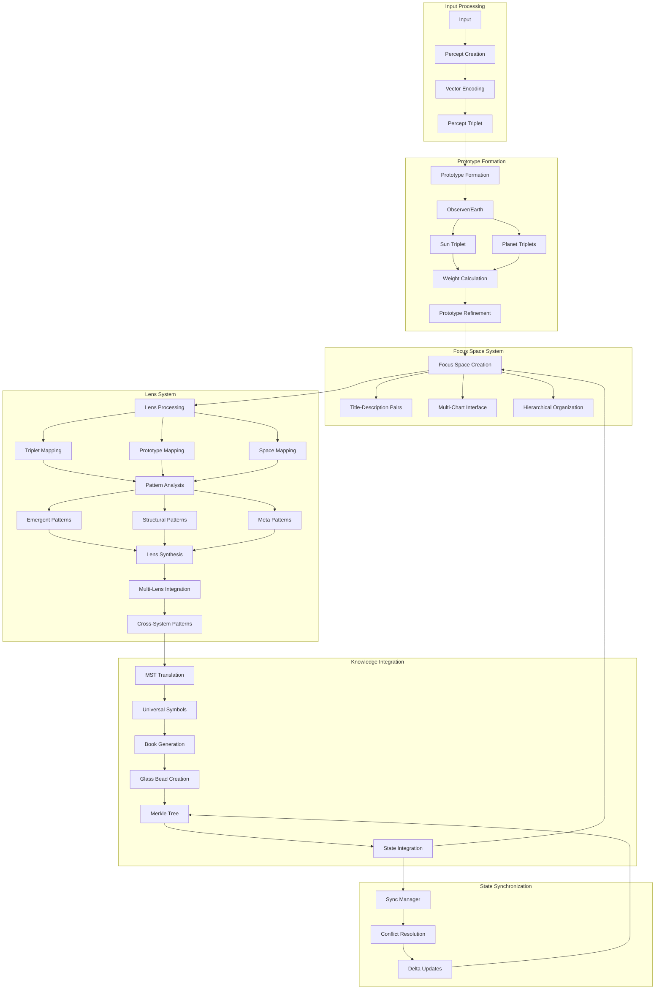

# 2.13. Lenses

The Symbolic Lenses system provides a modular framework for analyzing percepts through diverse cultural and scientific paradigms. Each lens represents a different symbolic system that can interpret percepts through its unique perspective while maintaining compatibility with other lenses.


Starting from the percept-triplet layer, lenses can applied to each construction in the processing path, including:

- percept-triplets
- prototypes
- focus spaces

## Core structure

The Astrological Lens serves as the primary lens, providing:

- **Celestial Objects**: Sun, Moon, planets, nodes
- **Zodiacal Signs**: Fire, Earth, Air, Water triplicities 
- **Houses**: Angular, Succedent, Cadent divisions
- **Aspects**: Major and minor angular relationships
- **Event Types**: Mundane and personal transits
- **Pattern Recognition**: Temporal, spatial, symbolic patterns

## Lens framework

### Universal House System
All lenses map to a common house framework:
- **Identity (1st)**: Hero (Jungian), Magician (Tarot), Aries (Astrology)
- **Resources (2nd)**: High Priestess (Tarot), Taurus (Astrology), Earth (I Ching)
- **Communication (3rd)**: Empress (Tarot), Gemini (Astrology), Thunder (I Ching)
- **Foundations (4th)**: Emperor (Tarot), Cancer (Astrology), Water (I Ching)

### Cross-system mappings

| Astrological | Tarot | I Ching | Kabbalah | Musical | Alchemical |
|--------------|-------|----------|-----------|----------|------------|
| Aries ♈︎ | Emperor | Hex 34 | Netzach | Maj 3rd | Calcination |
| Taurus ♉︎ | Hierophant | Hex 27 | Yesod | P4 | Coagulation |
| Gemini ♊︎ | Lovers | Hex 37 | Hod | Maj 2nd | Sublimation |
| Cancer | Chariot | Hex 29 | Tiphareth | Min 3rd | Dissolution |
| Leo | Strength | Hex 14 | Geburah | Maj 5th | Separation |
| Virgo | Hermit | Hex 15 | Chesed | Min 6th | Fermentation |
| Libra | Justice | Hex 13 | Binah | Maj 6th | Distillation |
| Scorpio | Death | Hex 47 | Chokmah | Min 7th | Putrefaction |
| Sagittarius | Temperance | Hex 55 | Kether | Maj 7th | Projection |
| Capricorn | The Devil | Hex 24 | Malkuth | Octave | Fixation |
| Aquarius | The Star | Hex 44 | Daath | Min 2nd | Multiplication |
| Pisces | The Moon | Hex 64 | Ain Soph | Tritone | Conjunction |

### Lens types

1. **Traditional Esoteric**
   - Chinese (I Ching, Wu Xing)
   - Western Esoteric (Tarot, Alchemy)
   - Kabbalistic (Tree of Life)
   - Hermetic (Seven Principles)
   - Vedic (Chakras, Nakshatras)

2. **Scientific & Mathematical**
   - Mathematical (Number theory)
   - Sacred Geometry (Platonic solids)
   - Quantum Mechanics (Wave-particle)
   - Systems Theory (Structures)

3. **Psychological & Experiential**
   - Jungian (Archetypes)
   - Phenomenological (Experience)
   - Cognitive Science (Mental processes)

## Technical implementation

### Base lens structure
```rust
pub struct Lens {
    name: String,
    dimensions: u32,
    mappings: HashMap<Symbol, Vec<Symbol>>,
}

impl Lens {
    pub fn transform(&self, percept: &Percept) -> LensOutput {
        let symbols = self.map_symbols(percept);
        let interpretation = self.interpret(symbols);
        
        LensOutput {
            lens: self.name.clone(),
            symbols,
            interpretation,
        }
    }
}
```

### Example implementations

1. **Theosophical Lens**
```rust
struct TarotTheosophicalLens;

impl Lens for TarotTheosophicalLens {
    fn apply(&self, percept: &PerceptTriplet) -> LensOutput {
        // Implementation details...
    }
}
```

2. **Music Theory Lens**
```rust
struct MusicTheoryLens;

impl Lens for MusicTheoryLens {
    fn apply(&self, percept: &PerceptTriplet) -> LensOutput {
        // Implementation details...
    }
}
```

## Pattern recognition

The system identifies patterns across lenses:
- **Cross-System**: Archetype correspondences, resonances, cycles
- **Universal**: Mathematical symmetries, quantum states, dynamics
- **Temporal**: Cycles, progressions, rhythms
- **Spatial**: Geometric forms, relationships, structures

## Custom lens creation

Advanced users can create their own lens systems through:

### Definition interface
```rust
pub trait LensDefinition {
    fn define_symbols(&self) -> Vec<Symbol>;
    fn define_mappings(&self) -> HashMap<Symbol, Vec<Symbol>>;
    fn define_rules(&self) -> Vec<Rule>;
}
```

### Requirements
- Complete mapping to Universal House System
- Symbol correspondence tables
- Pattern recognition rules
- Validation criteria

### Example custom lens
```rust
struct CustomLens {
    symbols: Vec<Symbol>,
    house_mappings: HashMap<House, Symbol>,
    rules: Vec<Rule>,
}

impl LensDefinition for CustomLens {
    fn define_symbols(&self) -> Vec<Symbol> {
        // User-defined symbols
    }
    
    fn define_mappings(&self) -> HashMap<Symbol, Vec<Symbol>> {
        // User-defined mappings to other lens systems
    }
    
    fn define_rules(&self) -> Vec<Rule> {
        // User-defined pattern recognition rules
    }
}
```

## Percept-triplet integration

Lenses transform percept-triplets by mapping their components (subject, predicate, object) into lens-specific symbolic representations:

```rust
pub struct PerceptLens {
    lens: Box<dyn Lens>,
    mappings: SymbolicMappings,
}

impl PerceptLens {
    pub fn transform(&self, triplet: &PerceptTriplet) -> LensedPercept {
        LensedPercept {
            subject: self.map_component(&triplet.subject),
            predicate: self.map_component(&triplet.predicate),
            object: self.map_component(&triplet.object),
            relationships: self.analyze_relationships(triplet),
            patterns: self.detect_patterns(triplet)
        }
    }

    fn analyze_relationships(&self, triplet: &PerceptTriplet) -> Vec<SymbolicRelation> {
        // Analyze symbolic relationships between components
        // e.g., astrological aspects, elemental affinities
    }
}
```

### Component mapping examples

- **Astrological**: 
  - Subject → House placement
  - Predicate → Planetary aspect
  - Object → Sign position

- **I Ching**:
  - Subject → Lower trigram
  - Predicate → Changing lines
  - Object → Upper trigram

### Pattern detection

```rust
impl PerceptLens {
    fn detect_patterns(&self, triplet: &PerceptTriplet) -> Vec<Pattern> {
        let mut patterns = Vec::new();
        
        // Archetypal patterns
        patterns.extend(self.detect_archetypal_patterns(triplet));
        
        // Elemental combinations
        patterns.extend(self.analyze_elemental_harmony(triplet));
        
        // Symbolic resonance
        patterns.extend(self.find_symbolic_echoes(triplet));
        
        patterns
    }
}
```
## Prototype integration

Lenses analyze prototypes both holistically and at the individual triplet level:

```rust
pub struct PrototypeLens {
    lens: Box<dyn Lens>,
    triplet_analyzer: PerceptLens,
}

impl PrototypeLens {
    pub fn analyze(&self, prototype: &Prototype) -> LensedPrototype {
        // Analyze individual triplets
        let triplet_analyses: Vec<LensedPercept> = prototype.triplets
            .iter()
            .map(|t| self.triplet_analyzer.transform(t))
            .collect();

        // Analyze emergent patterns
        let emergent_patterns = self.analyze_emergent_patterns(&triplet_analyses);
        
        // Analyze prototype structure
        let structural_patterns = self.analyze_structure(prototype);

        LensedPrototype {
            triplet_analyses,
            emergent_patterns,
            structural_patterns,
            holistic_interpretation: self.synthesize_interpretation(
                &triplet_analyses,
                &emergent_patterns,
                &structural_patterns
            )
        }
    }

    fn analyze_emergent_patterns(&self, analyses: &[LensedPercept]) -> Vec<Pattern> {
        // Detect patterns that emerge from triplet relationships:
        // - Symbolic resonance between triplets
        // - Recurring themes or motifs
        // - Archetypal configurations
    }

    fn analyze_structure(&self, prototype: &Prototype) -> Vec<StructuralPattern> {
        // Analyze prototype's organizational structure:
        // - Hierarchical relationships
        // - Network topology
        // - Temporal sequences
    }
}
```

### Triplet relationship analysis

```rust
impl PrototypeLens {
    fn analyze_triplet_relationships(&self, triplets: &[PerceptTriplet]) -> Vec<Relationship> {
        let mut relationships = Vec::new();
        
        for (i, t1) in triplets.iter().enumerate() {
            for t2 in triplets.iter().skip(i + 1) {
                // Analyze symbolic connections
                if let Some(connection) = self.find_symbolic_connection(t1, t2) {
                    relationships.push(connection);
                }
                
                // Analyze shared elements
                if let Some(shared) = self.analyze_shared_elements(t1, t2) {
                    relationships.push(shared);
                }
            }
        }
        
        relationships
    }
}
```

### Pattern synthesis

The lens combines individual triplet patterns with prototype-level patterns:

```rust
pub struct PatternSynthesis {
    triplet_patterns: Vec<Pattern>,
    structural_patterns: Vec<StructuralPattern>,
    emergent_patterns: Vec<Pattern>,
    meta_patterns: Vec<MetaPattern>,
}

impl PrototypeLens {
    fn synthesize_patterns(&self, prototype: &Prototype) -> PatternSynthesis {
        // Collect patterns at all levels
        let triplet_patterns = self.collect_triplet_patterns(prototype);
        let structural_patterns = self.analyze_structure(prototype);
        let emergent_patterns = self.find_emergent_patterns(&triplet_patterns);
        
        // Find meta-patterns across levels
        let meta_patterns = self.detect_meta_patterns(
            &triplet_patterns,
            &structural_patterns,
            &emergent_patterns
        );
        
        PatternSynthesis {
            triplet_patterns,
            structural_patterns,
            emergent_patterns,
            meta_patterns,
        }
    }
}
```

## Focus space integration

Lenses dynamically transform focus spaces by:

1. **Symbolic Mapping**: Converting focus space elements into lens-specific symbols
2. **Pattern Analysis**: Identifying symbolic patterns within the transformed space
3. **Cross-lens Synthesis**: Combining insights from multiple lens perspectives

### Implementation

```rust
pub struct FocusSpaceLens {
    lens: Box<dyn Lens>,
    space: FocusSpace,
    active_patterns: Vec<Pattern>,
}

impl FocusSpaceLens {
    pub fn apply(&self) -> LensedSpace {
        let symbols = self.lens.map_space(&self.space);
        let patterns = self.lens.analyze_patterns(&symbols);
        
        LensedSpace {
            original: self.space.clone(),
            symbols,
            patterns,
            interpretation: self.lens.interpret(patterns)
        }
    }
}
```

### Pattern recognition in focus spaces

- **Temporal Patterns**: Cyclic relationships between focus states
- **Spatial Patterns**: Geometric arrangements of focus elements
- **Symbolic Patterns**: Archetypal themes across different lenses
- **Dynamic Patterns**: Evolution of patterns over time

### Multi-lens analysis

Focus spaces can be analyzed through multiple lenses simultaneously:

```rust
pub struct MultiLensAnalysis {
    space: FocusSpace,
    lenses: Vec<Box<dyn Lens>>,
    synthesis: Box<dyn PatternSynthesizer>,
}

impl MultiLensAnalysis {
    pub fn analyze(&self) -> Vec<LensedSpace> {
        self.lenses.iter()
            .map(|lens| lens.analyze(&self.space))
            .collect()
    }
}
```

## Technical Flow

The lens system extends the focus space processing pipeline by adding symbolic transformation and pattern analysis layers:



### Processing Pipeline

1. **Lens Application**
```rust
pub struct LensProcessor {
    lenses: Vec<Box<dyn Lens>>,
    pattern_analyzer: PatternAnalyzer,
    synthesizer: LensSynthesizer,
}

impl LensProcessor {
    pub fn process(&self, focus_space: &FocusSpace) -> LensResults {
        // Apply each lens
        let lens_outputs: Vec<LensOutput> = self.lenses.iter()
            .map(|lens| lens.transform(focus_space))
            .collect();
            
        // Analyze patterns
        let patterns = self.pattern_analyzer.analyze(&lens_outputs);
        
        // Synthesize results
        self.synthesizer.synthesize(patterns)
    }
}
```

2. **Pattern Analysis**
```rust
pub struct PatternAnalyzer {
    detectors: Vec<Box<dyn PatternDetector>>,
    validators: Vec<Box<dyn PatternValidator>>,
}

impl PatternAnalyzer {
    pub fn analyze(&self, outputs: &[LensOutput]) -> Vec<Pattern> {
        let mut patterns = Vec::new();
        
        // Detect patterns across lens outputs
        for detector in &self.detectors {
            patterns.extend(detector.detect(outputs));
        }
        
        // Validate patterns
        patterns.retain(|p| self.validators.iter()
            .all(|v| v.validate(p)));
            
        patterns
    }
}
```

3. **Multi-Lens Integration**
```rust
pub struct LensSynthesizer {
    cross_mappings: HashMap<(LensType, LensType), CrossMapping>,
    meta_patterns: Vec<MetaPatternTemplate>,
}

impl LensSynthesizer {
    pub fn synthesize(&self, patterns: Vec<Pattern>) -> LensSynthesis {
        // Find cross-system patterns
        let cross_patterns = self.detect_cross_patterns(&patterns);
        
        // Generate meta-patterns
        let meta_patterns = self.generate_meta_patterns(
            &patterns,
            &cross_patterns
        );
        
        LensSynthesis {
            patterns,
            cross_patterns,
            meta_patterns,
        }
    }
}
```

This technical flow enables:
- Parallel lens processing
- Multi-level pattern detection
- Cross-system synthesis
- Integration with existing focus space and glass bead systems
- State consistency through Merkle validation

## Key points

1. **Core architecture**
   - Astrological lens as foundation
   - Universal house system mapping
   - Modular lens design
   - Cross-system compatibility

2. **Processing layers**
   - Percept-triplet transformation
   - Prototype analysis and synthesis
   - Focus space integration
   - Multi-lens analysis capabilities

3. **Pattern recognition**
   - Component-level patterns
   - Emergent relationships
   - Structural analysis
   - Meta-pattern synthesis
   - Temporal and spatial dynamics

4. **Technical implementation**
   - Rust-based transformation system
   - Type-safe lens definitions
   - Efficient pattern detection
   - Modular component design

5. **Integration features**
   - Triplet component mapping
   - Prototype relationship analysis
   - Focus space transformation
   - Cross-lens synthesis

6. **Benefits**
   - Rich symbolic interpretation
   - Multi-level pattern analysis
   - Extensible architecture
   - Cultural synthesis
   - Mathematical rigor