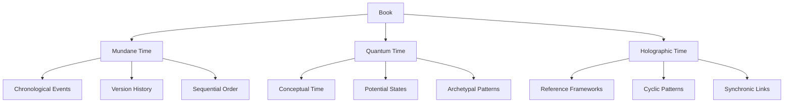
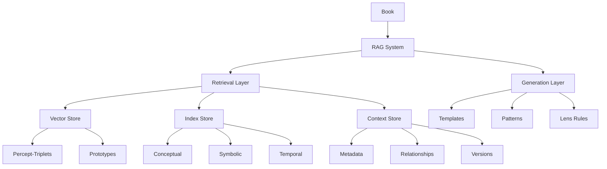
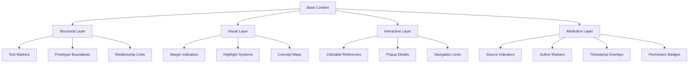
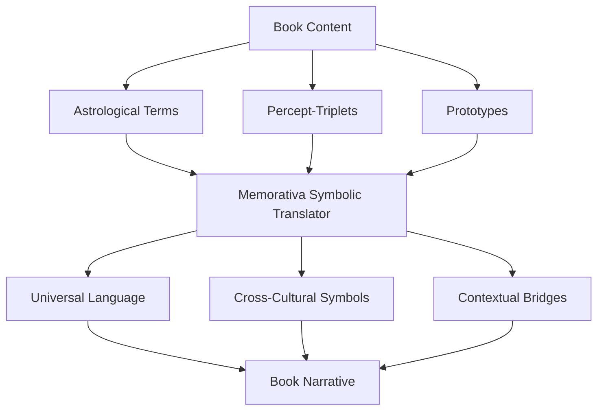
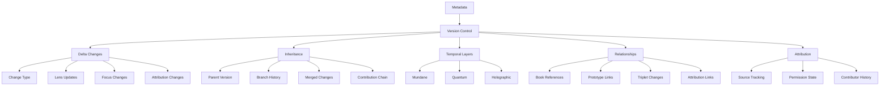
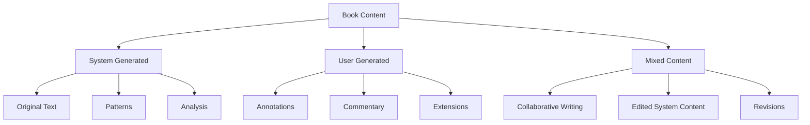
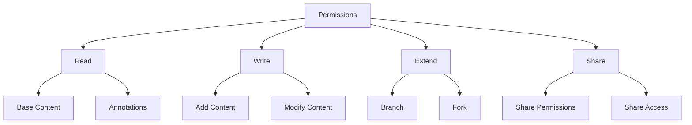
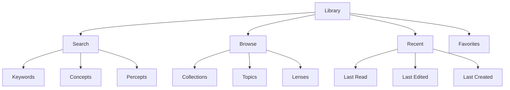
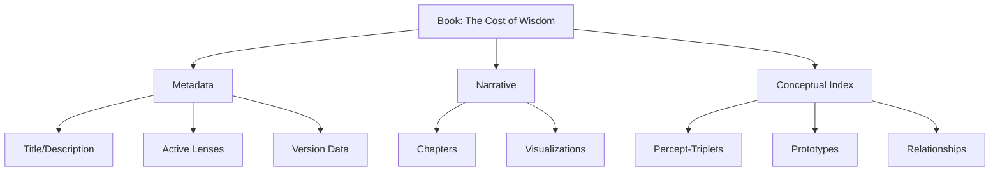
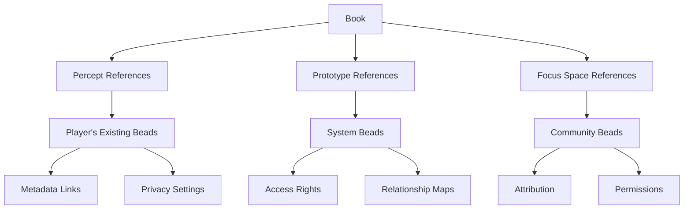

# 2.14. Books

A *Book* in Memorativa serves as both a structured repository for percepts and their associated structures (percept-triplets and prototypes), and a narrative/analytical framework that organizes and contextualizes these elements. Books function as both human-readable narratives and machine-processable inputs for further analysis.

## Purpose and structure

Multi-layer format:

- **Human Layer**: Narrative text, chapters, sections, visualizations
- **Machine Layer**: Structured data mapping percepts, triplets, prototypes
- **Bridge Layer**: Markup system linking narrative to structured data

## Core components

| Component | Sub-components |
|-----------|---------------|
| Metadata | Title, Description, Focus Parameters, Temporal Context, Active Lenses, Version Data, Content Attribution, Access Control |
| Percept-Triplets | Planet-Sign-House combinations with title-description pairs, transformed by Lenses |
| Prototypes | Structures composed of percept-triplets, interpreted through Lenses |
| Symbolic Data | Angular relationships (aspects), MST-translated labels, filtered through Lenses |
| Narrative Content | Chapters/Sections with analytical commentary, shaped by Lenses |
| Visualizations | Horoscope charts, aspect networks, temporal overlays, influenced by Lenses |
| Conceptual Index | Mappings between narrative elements and structured data |
| Attribution Data | Content Type Markers, Author IDs, Timestamps, Edit History, Permissions |
| Validation Data | Integrity Checks, Error States, Recovery Points |

## Processing and generation

### Input processing
When content enters the system as a Book:
1. Extract structural elements
2. Map concepts to percept-triplets
3. Identify and construct prototypes
4. Build conceptual relationships
5. Apply active Lenses

### Temporal context processing
Books handle three distinct time states that affect their content and relationships:

**1. Mundane Time State**
- Tracks concrete timestamps and chronological events
- Examples:
  - Book creation/modification dates
  - Historical events referenced in content
  - Sequential relationships between Books
- Used for:
  - Version control
  - Content chronology
  - Event sequencing

**2. Quantum Time State**
- Represents conceptual or indeterminate time
- Examples:
  - Mythological narratives
  - Abstract concepts
  - Potential future scenarios
- Used for:
  - Pattern analysis
  - Archetypal relationships
  - Conceptual mapping

**3. Holographic Time State**
- Links Books to reference time frameworks
- Examples:
  - Books referenced to natal charts
  - Cultural cycle analysis
  - Evolutionary patterns
- Used for:
  - Cross-temporal analysis
  - Pattern recognition
  - Synchronic relationships

**4. Time State Interactions**
Books can:
- Exist in multiple time states simultaneously
- Shift between states based on context
- Form relationships across different time states
- Generate new temporal patterns through interaction

### Output generation
Books are generated with:
1. Structured narrative content
2. Machine-readable metadata
3. Conceptual indices
4. Lens-specific interpretations
5. Visualization mappings

### RAG compatibility
Books are designed to integrate with the Memorativa RAG system in several ways:

**1. Structured Data Layer**
- Percept-triplets and prototypes are stored in vector-encodable format
- Title-description pairs maintain semantic relationships
- Lens transformations preserve symbolic mappings
- Temporal states are explicitly tagged for retrieval
- Content attribution metadata enables source-aware retrieval

**2. Knowledge Base Integration**
- Books serve as primary corpus for RAG retrieval
- Each Book's narrative content enriches the dynamic knowledge base
- Conceptual indices enable precise context retrieval
- Cross-Book relationships form semantic networks
- Attribution tracking enables filtered knowledge access

**3. Retrieval Optimization**
- Metadata fields support multi-dimensional search
- Symbolic relationships enable conceptual querying
- Version history allows temporal-aware retrieval
- Privacy levels control access granularity

**4. Generation Enhancement**
- Books provide structured templates for new content
- Prototype patterns guide coherent generation
- Lens configurations shape output style
- Temporal contexts inform narrative flow

**5. Feedback Loop**
- Generated content can form new Books
- User interactions refine retrieval patterns
- System learning improves generation quality
- Cross-Book analysis reveals emergent patterns

## Validation and error handling

### Content validation
- Structural integrity checks
- Attribution verification
- Permission validation
- Reference consistency
- Temporal coherence

### Error recovery
- Version rollback capability
- Contribution conflict resolution
- Reference repair mechanisms
- Attribution reconciliation
- Permission correction protocols

## Conceptual indexing and demarcation

### Concept demarcation
Books implement concept demarcation through:

**1. Structural Markers**
- Inline concept tags linked to percept-triplets
- Prototype boundary markers
- Relationship indicators
- Temporal state markers

**2. Visual Overlays**

**3. Implementation Features**
- **Automatic Detection**: Pattern matching for known concepts
- **Manual Marking**: User-defined concept boundaries
- **Inheritance**: Concept propagation through references
- **Lens-Specific**: Demarcation varies by active lens

**4. Overlay Types**
- Concept heat maps
- Relationship networks
- Temporal flows
- Prototype patterns
- Focus space mappings
- Attribution markers
- Contribution timelines
- Permission boundaries

### Visualization system
The overlay system provides:

**1. Layer Management**
- Multiple concurrent overlays
- Layer opacity control
- Layer combination rules
- Context-sensitive display
- Attribution visibility toggles

**2. Interactive Features**
- Zoom levels for detail
- Click-through to references
- Drag-select for concept groups
- Real-time lens switching
- Author/source filtering
- Permission-aware interactions

**3. Navigation Tools**
- Concept-based jumping
- Related concept discovery
- Pattern exploration
- Timeline traversal

## MST integration

Books leverage the Memorativa Symbolic Translator (MST) to transform astrological encodings into universal symbolic language:

**1. Translation Layer**

**2. Translation Functions**
- Converts planetary positions to universal concepts
- Maps astrological houses to conceptual domains
- Translates aspects into relationship patterns
- Preserves semantic relationships during translation

**3. Cultural Integration**
- Generates culturally neutral narratives
- Maps equivalent symbols across traditions
- Maintains conceptual integrity across translations
- Bridges symbolic and conceptual contexts

**4. Narrative Generation**
The MST enables Books to:
- Present complex astrological structures in accessible language
- Generate dynamic narratives from symbolic patterns
- Create cross-cultural interpretations
- Bridge technical and intuitive understanding

This integration ensures Books remain:
- Accessible to non-astrological readers
- Culturally inclusive
- Conceptually precise
- Symbolically rich

## Lens system integration

### Lens management
- Dynamic activation/deactivation of Lenses
- Multiple simultaneous Lens views
- Lens-specific interpretations
- Cross-Lens analysis

### Contextual Adaptation
- Content reframing through different Lenses
- Symbolic translation across paradigms
- Cultural/philosophical context shifting
- Scientific framework alignment

## Version control and branching

### Version control
Each Book maintains a version history tracking:
- Changes to percept-triplets and prototypes
- Evolution of narrative content
- Modifications to symbolic relationships
- Updates to visualizations
- Changes in applied Lenses
- Content attribution changes
- Permission modifications

### Metadata Evolution
The metadata system tracks changes across versions through:

**1. Core Metadata Fields**
- Version number and timestamp
- Author/contributor chain
- Change descriptions
- Parent version references
- Active Lenses configuration
- Focus Parameters state
- Temporal Context markers
- Content attribution markers
- Contribution source tracking
- Permission inheritance rules

**2. Differential Tracking**
The system maintains:
- Delta changes between versions
- Metadata inheritance patterns
- Breaking vs. non-breaking changes
- Lens configuration changes
- Focus parameter shifts
- Attribution state changes
- Permission boundary updates
- Content type transitions

**3. Temporal Layer Management**
Tracks how temporal contexts evolve:
- Mundane time state changes
- Quantum state transitions
- Holographic reference updates
- Cross-temporal relationships

**4. Relationship Versioning**
Maintains version-aware relationships:
- Inter-Book references
- Prototype evolution chains
- Percept-triplet transformations
- Conceptual lineage tracking
- Attribution hierarchies
- Permission inheritance chains
- Contribution networks

## Content attribution and extensions

### Content types
- **System Content**: Generated synthetically by Memorativa
- **User Content**: Direct contributions from players
- **Mixed Content**: Collaborative human-AI content
- **Referenced Content**: Content quoted from other Books/sources

### Extension mechanisms

### Attribution tracking
Each content block maintains:
- Author identification
- Creation timestamp
- Content type marker
- Edit history
- Source references
- Permission settings

### Extension features
Players can:
- Add personal annotations
- Extend existing chapters
- Create new sections
- Fork custom versions
- Share contributions
- Merge collaborative work

All extensions preserve:
- Clear attribution boundaries
- Original content integrity
- Version relationships
- Access permissions
- Contribution history

### Branching System
Books can be branched to:
- Explore alternative interpretations
- Develop parallel analyses
- Create specialized versions for different contexts
- Support collaborative development

Branch types:
1. **Development Branches**: For iterative refinement
2. **Interpretation Branches**: For alternative analytical approaches
3. **Application Branches**: For context-specific adaptations
4. **Collaborative Branches**: For multi-user contributions

### Fork Management
Users can fork existing Books to:
- Create independent copies
- Develop divergent interpretations
- Customize for specific use cases
- Maintain separate ownership

Fork features:
- Maintains reference to original Book
- Independent version history
- Separate access controls
- Option to merge back to original

## Privacy and access control

### Access levels
- **Private**: Only owner can access
- **Shared**: Specific users/groups granted access
- **Public**: Available to all users
- **System**: Core system Books

### Permission types

### Inheritance rules
- Permission inheritance follows Book hierarchy
- Child Books inherit parent permissions
- Forks establish new permission roots
- Contributions maintain original attribution

## Book library system

### Library organization
The Book Library provides intuitive access through multiple classification schemes:
- **Collections**: User-defined groupings
- **Topics**: Automatically generated based on conceptual indices
- **Lens Views**: Books filtered by active Lenses
- **Temporal Streams**: Books organized by time states
- **Relationship Networks**: Books linked by conceptual connections

### Access methods

### Reading interface
- **Dual View Mode**: 
  - Narrative view for reading
  - Structure view for analysis
- **Dynamic Navigation**:
  - Concept-based hyperlinks
  - Prototype relationship maps
  - Temporal progression paths
- **Annotation System**:
  - Personal notes
  - Concept tagging
  - Relationship marking

### Search and discovery

#### Search mechanisms
- Full-text search
- Concept-based search
- Attribution search
- Permission-aware results
- Temporal context search

#### Discovery features
- Related Book suggestions
- Contribution recommendations
- Collaborative opportunities
- Version comparisons
- Attribution networks

### Working environment
- **Workspace Features**:
  - Multiple book comparison
  - Side-by-side analysis
  - Cross-reference tracking
- **Creation Tools**:
  - Book templating
  - Concept mapping
  - Prototype building
- **Collaboration Options**:
  - Shared reading spaces
  - Group annotations
  - Branch synchronization

## Example book structure

- **Title**: *"The Cost of Wisdom"*
- **Description**: *Exploring archetypes of forbidden knowledge across cultures.*

**Focus Parameters**
- Archetypes: Venus (desire), Pluto (transformation)
- Aspects: Squares (90°) tagged as "Moral Conflict"
- Time States: Quantum (timeless myths), Mundane (historical events)
- Active Lenses: Astrological Lens, Jungian Psychological Lens, I Ching Lens

**Chapters**
1. *Edenic Archetypes*: Analysis of Venus-Pluto dynamics in mythological narratives
2. *Cultural Transformations*: How societies encode ethical dilemmas symbolically
3. *Future Implications*: The role of forbidden knowledge in shaping technological ethics

**Visualizations**
1. Horoscope chart showing Venus-Pluto square in Libra-Capricorn
2. Aspect network linking "Eve's Apple" to "Prometheus' Fire"
3. Temporal overlay of cyclical transformations

## Glass Bead integration

### Book as bead curator
A Book functions as a structured reference system for existing Glass Beads, organizing and contextualizing them to create coherent narratives and analyses.

**1. Reference Structure**
- Books don't generate new beads
- Books organize and reference existing beads
- Books provide contextual frameworks for bead relationships
- Books create narrative paths through bead collections

**2. Bead Reference Types**

**3. Reading Mechanics**
Players can:
- Navigate through referenced bead collections
- Discover relationships between their beads
- Access permitted beads from other players
- Create new relationships between existing beads

**4. Reference Properties**
Each bead reference maintains:
- Original bead ownership data
- Access permissions
- Context within Book structure
- Relationship mappings
- Attribution metadata

### Book organization
Books organize beads through:
- Thematic groupings
- Conceptual relationships
- Temporal sequences
- Lens perspectives
- Focus space contexts

### Integration benefits
1. **Knowledge Discovery**
   - Find connections between existing beads
   - Reveal hidden patterns
   - Map conceptual territories
   - Track bead evolution

2. **Value Preservation**
   - Maintains original bead ownership
   - Respects privacy settings
   - Preserves attribution
   - Enables controlled sharing

## Key points

Core Functionality:
- Books serve as both human-readable narratives and machine-processable structured data repositories
- Multi-layered format combines narrative text, structured data, and bridging markup
- Handles three time states: Mundane (concrete), Quantum (conceptual), and Holographic (referential)
- Provides robust validation and error recovery mechanisms

Integration Features:
- Fully integrated with RAG system for retrieval and generation
- Uses MST to translate between astrological and universal symbolic language
- Functions as curator and organizer of Glass Beads
- Implements concept demarcation through structural markers and visual overlays

Collaboration Features:
- Supports version control, branching, and collaborative development
- Tracks content attribution and permissions across all operations
- Supports granular access control and permission inheritance
- Enables collaborative extensions while preserving original content

User Experience:
- Provides flexible visualization and navigation systems
- Maintains comprehensive metadata tracking across versions
- Offers sophisticated search and discovery features

