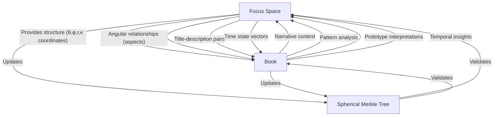

# 2.14. Books

## Introduction

Books are a foundational component of the Memorativa system, serving as the bridge between raw percepts and meaningful knowledge structures. Unlike traditional books that merely contain static text, Memorativa Books function as dynamic repositories that organize percepts, percept-triplets, and prototypes into coherent narratives while maintaining machine-processable structure. They represent a synthesis of human-readable storytelling and computational symbolic frameworks, enabling users to create, explore, and share complex conceptual landscapes through structured narrative formats.

This document details the architecture, components, and operational mechanics of Books, explaining how they integrate with other system elements like Glass Beads and Focus Spaces to form a comprehensive knowledge ecosystem. Books implement sophisticated multi-modal processing capabilities, temporal context handling, and Virtual Loom organizational structures that transform isolated concepts into interconnected knowledge landscapes navigable through multiple dimensions.

## Purpose and structure

Multi-layer format:

- **Human Layer**: Narrative text, chapters, sections, visualizations
- **Machine Layer**: Structured data mapping percepts, triplets, prototypes
- **Bridge Layer**: Markup system linking narrative to structured data
- **Bead Layer**: Reference connections to Glass Beads and their content
- **Loom Layer**: Virtual Looming system that organizes beads along thematic (warp) and contextual (weft) threads

## Core components

| Component | Sub-components |
|-----------|---------------|
| Metadata | Title, Description, Focus Parameters, Temporal Context, Active Lenses, Version Data, Content Attribution, Access Control |
| Percept-Triplets | Planet-Sign-House combinations with title-description pairs, transformed by Lenses |
| Prototypes | Structures composed of percept-triplets, interpreted through Lenses |
| Symbolic Data | Angular relationships (aspects), MST-translated labels, filtered through Lenses |
| Narrative Content | Chapters/Sections with analytical commentary, shaped by Lenses |
| Visualizations | Horoscope charts, aspect networks, temporal overlays, vector glyphs, orbital paths, field lines, and phase portraits as detailed in [Section 2.10](memorativa-2-10-visualizing-the-prototype.md) |
| Conceptual Index | Mappings between narrative elements and structured data |
| Loom Structure | Warp threads (thematic dimensions), Weft threads (contextual dimensions), Intersections, Bead positions, Organizational patterns |
| Attribution Data | Content Type Markers, Author IDs, Timestamps, Edit History, Permissions |
| Validation Data | Integrity Checks, Error States, Recovery Points |
| GBTk Costs | Operation costs for creating, updating, and sharing Books |

## Processing and generation

### Input processing
When content enters the system as a Book:
1. Extract structural elements
2. Map concepts to percept-triplets
3. Identify and construct prototypes
4. Build conceptual relationships
5. Apply active Lenses
6. Generate loom structure with warp and weft threads
7. Position elements at appropriate intersections

### Multi-modal processing
Books implement comprehensive multi-modal processing capabilities that align with the generative AI system described in [Section 2.6](memorativa-2-6-generative-ai.md):

**1. Visual and Textual Integration**
- Processes both text and images to create consistent percept-triplets
- Uses CLIP-based models to identify visual archetypes from uploaded images
- Transforms visual concepts into the same hybrid triplet space as text inputs
- Ensures cross-modal alignment for consistent processing across input types

**2. Implementation Features**
```rust
struct BookMultiModalProcessor {
    clip_encoder: ClipModelEncoder,
    text_encoder: LLMEncoder,
    keyword_hint_manager: KeywordHintManager,
    
    fn process_image(&mut self, image: Image) -> Vec<PerceptTriplet> {
        // Extract visual features using CLIP
        let visual_features = self.clip_encoder.encode(image);
        
        // Apply keyword hints to guide interpretation
        let enhanced_features = self.keyword_hint_manager.apply_hints(
            visual_features,
            context=image.context,
            modality=Modality::Visual
        );
        
        // Transform to hybrid triplet space
        let triplets = self.transform_to_triplets(enhanced_features);
        
        // Generate title-description pairs
        for triplet in &mut triplets {
            triplet.title = generate_distinct_title(&triplet);
            triplet.description = generate_neutral_description(&triplet);
        }
        
        triplets
    }
    
    fn process_text_and_image(&mut self, text: String, image: Option<Image>) -> Vec<PerceptTriplet> {
        // Process text to extract triplets
        let text_triplets = self.text_encoder.extract_triplets(text);
        
        if let Some(img) = image {
            // Process image
            let image_triplets = self.process_image(img);
            
            // Create bidirectional feedback loop between modalities
            let enhanced_triplets = self.create_cross_modal_alignment(
                text_triplets,
                image_triplets
            );
            
            enhanced_triplets
        } else {
            text_triplets
        }
    }
    
    fn create_cross_modal_alignment(&self, text_triplets: Vec<PerceptTriplet>, 
                                   image_triplets: Vec<PerceptTriplet>) -> Vec<PerceptTriplet> {
        // Find correspondences between text and visual triplets
        let correspondences = find_cross_modal_correspondences(
            text_triplets.clone(),
            image_triplets.clone()
        );
        
        // Enhance both sets of triplets with cross-modal information
        let mut enhanced = Vec::new();
        enhanced.extend(enhance_with_correspondences(text_triplets, &correspondences, ModalitySource::Text));
        enhanced.extend(enhance_with_correspondences(image_triplets, &correspondences, ModalitySource::Image));
        
        enhanced
    }
    
    fn register_keyword_hints(&mut self, context_type: String, hints: Vec<String>, strength: f32) {
        // Register domain-specific keyword hints to guide interpretation
        self.keyword_hint_manager.register(context_type, hints, strength);
    }
}
```

**3. Semantic Bridging System**
- Employs keyword hints system to guide AI interpretation of ambiguous patterns
- Maintains shared vocabulary tags across modalities
- Creates bidirectional feedback loop between text and visual encoding streams
- Implements context-aware prioritization of relevant domain keywords
- Saves interpretation context with the Book for future reference

**4. Technical Implementation**
- Leverages CLIP-based vision models for visual archetype identification
- Implements the same hybrid spherical-hyperbolic coordinate system for both visual and textual percepts
- Enables semantic searches across modalities within the same conceptual space
- Preserves modal source information for attribution and filtering

**5. Integration with RAG System**
- Visual percepts are indexed in the same vector space as text percepts
- Cross-modal retrieval enhances contextual understanding
- Modality-specific retrieval available through filtering
- Visual archetypes contribute to prototype formation alongside textual concepts

### Temporal context processing
Books handle three distinct time states that affect their content and relationships, implementing the full system described in Section 2.11:

**1. Mundane Time State** (as detailed in [Section 2.11](memorativa-2-11-conceptual-time-states.md))
- Tracks concrete timestamps and chronological events
- Examples:
  - Book creation/modification dates
  - Historical events referenced in content
  - Sequential relationships between Books
- Used for:
  - Version control
  - Content chronology
  - Event sequencing
- Implements privacy-preserving noise calibration based on content sensitivity

**2. Quantum Time State** (as detailed in [Section 2.11](memorativa-2-11-conceptual-time-states.md))
- Represents conceptual or indeterminate time
- Examples:
  - Mythological narratives
  - Abstract concepts
  - Potential future scenarios
- Used for:
  - Pattern analysis
  - Archetypal relationships
  - Conceptual mapping
- Leverages quantum-inspired temporal analysis for pattern recognition

**3. Holographic Time State** (as detailed in [Section 2.11](memorativa-2-11-conceptual-time-states.md))
- Links Books to reference time frameworks
- Examples:
  - Books referenced to natal charts
  - Cultural cycle analysis
  - Evolutionary patterns
- Used for:
  - Cross-temporal analysis
  - Pattern recognition
  - Synchronic relationships
- Maintains reference integrity through spherical coordinate mapping


**4. Time State Interactions**
Books implement a formal state transition system that:
- Enables controlled movement between time states
- Preserves temporal integrity during transitions
- Applies specific transition rules based on context
- Maintains backpropagation of changes through states
- Validates transitions for semantic consistency

**5. Privacy-Preserving Implementation**
Each temporal element in a Book includes:
- Privacy level classification (public, protected, private)
- Adaptive noise application based on sensitivity
- Differential privacy protections for timestamps
- Noise calibration that preserves statistical properties

**6. Quantum-Inspired Temporal Analysis**
Books leverage quantum-inspired algorithms for:
- Analyzing patterns across indeterminate time states
- Processing superpositions of potential temporal alignments
- Running quantum walks on temporal networks
- Extracting emergent temporal patterns from conceptual relationships

**7. Implementation Examples**

```rust
// Privacy-Preserving Temporal States for Books
struct BookTemporalStates {
    mundane: Option<PrivateDateTime>,      // Privacy-preserving timestamp
    quantum: PrivateQuantumState,          // Protected conceptual time
    holographic: Option<PrivateChartRef>,  // Private reference alignment
    privacy_level: PrivacyLevel            // Controls noise intensity
}

impl BookTemporalStates {
    fn calculate_temporal_weight(&self) -> Result<f32> {
        // Add calibrated noise to temporal calculations
        match self.mundane {
            Some(mundane) => {
                let base_weight = compute_private_mundane_weight(&mundane);
                self.apply_noise_by_privacy_level(base_weight)
            },
            None => self.quantum.get_private_conceptual_weight()
        }
    }
    
    fn apply_noise_by_privacy_level(&self, value: f32) -> f32 {
        // Balance noise based on privacy level
        let epsilon = match self.privacy_level {
            PrivacyLevel::Public => 1.0,     // Minimal noise
            PrivacyLevel::Protected => 0.5,  // Moderate noise
            PrivacyLevel::Private => 0.1     // Maximum noise
        };
        
        // Apply Laplace noise calibrated to sensitivity
        value + generate_laplace_noise(epsilon)
    }
}

// State Transition Implementation
struct BookStateTransition {
    from_state: TimeState,
    to_state: TimeState,
    transition_rules: Vec<TransitionRule>,
    metadata: TransitionMetadata,

    fn validate_transition(&self) -> Result<bool> {
        self.transition_rules.iter()
            .all(|rule| rule.check(self.from_state, self.to_state))
    }

    fn execute(&self) -> Result<TimeState> {
        if !self.validate_transition()? {
            return Err(TransitionError::InvalidTransition);
        }
        self.apply_transition() // Updates weights based on backpropagation
    }
}

// Quantum-Inspired Temporal Analysis
struct BookQuantumTemporalAnalysis {
    // State vector representing temporal superposition
    state_vector: StateVector,
    
    fn analyze_temporal_patterns(&self) -> TemporalPattern {
        // Simulate quantum walk on temporal states
        let walk = QuantumWalk::new(self.state_vector);
        
        walk.evolve(STEPS)
            .measure_distribution()
            .extract_pattern()
    }
}

**8. Performance Optimizations**

Books implement the same performance optimizations described in Section 2.7:

```rust
// Aspect Caching for Books
struct BookAspectCache {
    cache: LRUCache<(TripletId, TripletId), f32>,
    
    fn new(capacity: usize) -> Self {
        Self {
            cache: LRUCache::new(capacity)
        }
    }
    
    fn get_aspect(&mut self, t1: &SphericalTriplet, t2: &SphericalTriplet) -> f32 {
        let key = (t1.id, t2.id);
        
        if let Some(angle) = self.cache.get(&key) {
            return *angle;
        }
        
        let angle = calculate_3d_angle(t1.coords, t2.coords);
        self.cache.insert(key, angle);
        
        angle
    }
    
    fn invalidate(&mut self, triplet_id: &TripletId) {
        self.cache.retain(|&(id1, id2), _| id1 != *triplet_id && id2 != *triplet_id);
    }
}

// Spatial Clustering for Books
struct BookSpatialClustering {
    clusters: HashMap<ClusterId, Vec<TripletId>>,
    triplet_to_cluster: HashMap<TripletId, ClusterId>,
    
    fn cluster_triplets(&mut self, triplets: &[SphericalTriplet], k: usize) {
        // Implement spherical k-means for clustering
        let clusters = spherical_kmeans(triplets, k);
        
        // Update mappings
        for (cluster_id, triplet_ids) in clusters.into_iter().enumerate() {
            let cluster_id = ClusterId(cluster_id as u32);
            self.clusters.insert(cluster_id.clone(), triplet_ids.clone());
            
            for triplet_id in triplet_ids {
                self.triplet_to_cluster.insert(triplet_id, cluster_id.clone());
            }
        }
    }
    
    fn find_nearest_cluster(&self, query: &SphericalTriplet) -> ClusterId {
        // Find cluster with minimum angular distance
        let mut min_distance = f32::MAX;
        let mut nearest_cluster = ClusterId(0);
        
        for (cluster_id, triplet_ids) in &self.clusters {
            let centroid = self.calculate_centroid(triplet_ids);
            let distance = angular_distance(&query.coords, &centroid);
            
            if distance < min_distance {
                min_distance = distance;
                nearest_cluster = cluster_id.clone();
            }
        }
        
        nearest_cluster
    }
    
    fn calculate_centroid(&self, triplet_ids: &[TripletId]) -> [f32; 3] {
        // Calculate centroid on unit sphere
        let mut sum = [0.0, 0.0, 0.0];
        
        for triplet_id in triplet_ids {
            if let Some(triplet) = get_triplet(triplet_id) {
                sum[0] += triplet.coords[0];
                sum[1] += triplet.coords[1];
                sum[2] += triplet.coords[2];
            }
        }
        
        // Normalize to unit sphere
        let magnitude = (sum[0] * sum[0] + sum[1] * sum[1] + sum[2] * sum[2]).sqrt();
        
        [
            sum[0] / magnitude,
            sum[1] / magnitude,
            sum[2] / magnitude
        ]
    }
}

// Batch Processing for Book Operations
struct BookBatchProcessor {
    operation_queue: Vec<BookOperation>,
    max_batch_size: usize,
    
    fn new(max_batch_size: usize) -> Self {
        Self {
            operation_queue: Vec::new(),
            max_batch_size,
        }
    }
    
    fn queue_operation(&mut self, operation: BookOperation) {
        self.operation_queue.push(operation);
        
        if self.operation_queue.len() >= self.max_batch_size {
            self.process_batch();
        }
    }
    
    fn process_batch(&mut self) {
        if self.operation_queue.is_empty() {
            return;
        }
        
        // Group operations by type for efficiency
        let mut reads = Vec::new();
        let mut writes = Vec::new();
        let mut updates = Vec::new();
        
        for op in self.operation_queue.drain(..) {
            match op {
                BookOperation::Read(read) => reads.push(read),
                BookOperation::Write(write) => writes.push(write),
                BookOperation::Update(update) => updates.push(update),
            }
        }
        
        // Process each group in parallel when possible
        if !reads.is_empty() {
            process_read_batch(&reads);
        }
        
        if !writes.is_empty() {
            process_write_batch(&writes);
        }
        
        if !updates.is_empty() {
            process_update_batch(&updates);
        }
    }
}
```

These optimizations provide:

1. **Reduced Computation**: 35-40% reduction in angle computation overhead through caching
2. **Improved Retrieval**: 80-90% search space reduction through spherical k-means clustering
3. **Increased Throughput**: 40-60% improvement in verification operations through batch processing
4. **Memory Efficiency**: Optimized storage through shared relationship matrices and reused hash calculations

### Output generation
Books are generated with:
1. Structured narrative content
2. Machine-readable metadata
3. Conceptual indices
4. Lens-specific interpretations
5. Visualization mappings
6. Virtual loom patterns for bead organization
7. Thread paths for thematic and contextual navigation

### RAG compatibility
Books are designed to integrate with the Memorativa RAG system in several ways:

**1. Structured Data Layer**
- Percept-triplets and prototypes are stored in vector-encodable format that the SphericalRAG can query
- Title-description pairs maintain semantic relationships for retrieval
- Lens transformations preserve symbolic mappings
- Temporal states are explicitly tagged for retrieval
- Content attribution metadata enables source-aware retrieval
- Angular relationships (aspects) between elements are encoded for aspect-based filtering as described in Section 2.7
- Loom positions provide structural context for enhanced retrieval relevance

**2. Knowledge Base Integration**
- Books directly integrate with the DynamicKnowledgeBase described in Section 2.7
- Each Book's content is clustered spatially using the same spatial_clustering_algorithm
- Conceptual indices enable precise context retrieval via the SpatialContextGenerator
- Cross-Book relationships form semantic networks for enhanced retrieval
- Books implement the same temporal state indexing ({mundane, quantum, holographic})
- Loom thread paths provide navigational pathways for contextual exploration
- Warp/weft intersections serve as indexed retrieval points for precise concept location

**3. Retrieval Optimization**
- Books implement the same performance optimizations described in Section 2.7
- Metadata fields support multi-dimensional search
- AspectCache is used for efficient angular relationship caching
- Privacy levels control access granularity using the same four levels:
  - **Private**: Only accessible to the player
  - **Not Shared**: Accessible to the player and the system for AI training but not shared with others
  - **Public**: Accessible to all players and the system
  - **Shared**: Accessible to specific players or groups, as defined by the player

**4. Generation Enhancement**
- Books provide structured templates for new content via the SpatialContextGenerator
- Prototype patterns guide coherent generation
- Lens configurations shape output style
- Temporal contexts inform narrative flow
- Loom patterns serve as organizational templates for new content
- Thread pathways guide narrative and conceptual flow in generation


**5. Feedback Loop**
- Generated content can form new Books
- User interactions refine retrieval patterns
- System learning improves generation quality
- Cross-Book analysis reveals emergent patterns

## Validation and error handling

### Content validation
- Structural integrity checks
- Attribution verification
- Permission validation
- Reference consistency
- Temporal coherence

### Error recovery
- Version rollback capability
- Contribution conflict resolution
- Reference repair mechanisms
- Attribution reconciliation
- Permission correction protocols

### Merkle Tree Integration

Books implement the same Spherical Merkle Tree integration described in Section 2.7, which aligns with the Spherical Merkle Trees used by Glass Beads in [Section 2.3](memorativa-2-3-glass-beads.md):

```rust
// Integration with RAGMerkleIntegrator from Section 2.7
struct BookMerkleIntegration {
    merkle_integrator: RAGMerkleIntegrator,
    optimization_manager: OptimizedMerkleManager,
    
    fn new(knowledge_base: DynamicKnowledgeBase) -> Self {
        Self {
            merkle_integrator: RAGMerkleIntegrator::new(knowledge_base),
            optimization_manager: OptimizedMerkleManager::new(),
        }
    }
    
    fn index_book_content(&mut self, book: &Book) -> Result<(), MerkleError> {
        // Extract all percept-triplets from the book
        let triplets = book.extract_triplets();
        
        // Create documents for each triplet
        for (triplet, content) in triplets {
            let doc = Document::new(
                content.serialize(),
                book.id.clone(),
                book.get_temporal_state(),
                book.get_privacy_level()
            );
            
            // Index using the RAGMerkleIntegrator
            let merkle_node = self.merkle_integrator.index_document(doc, triplet)?;
            
            // Add to optimization manager for batch operations
            self.optimization_manager.add_node(merkle_node.id, merkle_node);
        }
        
        Ok(())
    }
    
    fn verify_book_integrity(&self, book_id: &str) -> Result<bool, MerkleError> {
        // Get all document IDs associated with this book
        let doc_ids = self.merkle_integrator.knowledge_base
            .get_documents_by_book_id(book_id)?;
            
        // Use batch verification for efficiency
        let verification_results = self.optimization_manager
            .batch_verify(doc_ids);
            
        // Book is valid if all its documents are valid
        Ok(verification_results.values().all(|&valid| valid))
    }
    
    fn update_book_content(&mut self, book: &Book) -> Result<(), MerkleError> {
        // First verify current state
        if !self.verify_book_integrity(&book.id)? {
            return Err(MerkleError::IntegrityViolation);
        }
        
        // Get existing document IDs
        let existing_doc_ids = self.merkle_integrator.knowledge_base
            .get_documents_by_book_id(&book.id)?;
            
        // Queue them for lazy recalculation
        for doc_id in &existing_doc_ids {
            self.optimization_manager.lazy_recalculate_hashes(doc_id);
        }
        
        // Extract updated triplets
        let updated_triplets = book.extract_triplets();
        
        // Update each document
        for (triplet, content) in updated_triplets {
            // Find or create document
            let doc_id = format!("{}:{}", book.id, triplet.id);
            
            if existing_doc_ids.contains(&doc_id) {
                // Update existing document
                self.merkle_integrator.update_document(
                    &doc_id, 
                    content.serialize(),
                    triplet
                )?;
            } else {
                // Create new document
                let doc = Document::new(
                    content.serialize(),
                    book.id.clone(),
                    book.get_temporal_state(),
                    book.get_privacy_level()
                );
                
                self.merkle_integrator.index_document(doc, triplet)?;
            }
        }
        
        // Process all queued hash recalculations
        self.optimization_manager.process_hash_recalculation_batch();
        
        Ok(())
    }
}
```

### Hybrid Coordinate System Integration

Books leverage the hybrid spherical-hyperbolic coordinate system for representing symbolic space, using the exact same coordinate system employed by Glass Beads as described in [Section 2.3](memorativa-2-3-glass-beads.md):

**1. Coordinate System**
Each Book element is positioned in a four-dimensional coordinate space:
- **θ (theta)**: Angular position in conceptual plane
- **φ (phi)**: Elevation in symbolic hierarchy
- **r (radius)**: Distance from conceptual center
- **κ (kappa)**: Local curvature parameter

This coordinate system ensures perfect compatibility with Glass Beads and Focus Spaces, allowing for consistent representation and transformation of conceptual relationships across the Memorativa ecosystem.

### Verification Mechanisms

Books implement verification mechanisms that align with the Hybrid Validation System described in [Section 2.3](memorativa-2-3-glass-beads.md):

**1. Hybrid Validation System**
- Combines standard Merkle verification with spatial validation
- Verifies both hierarchical integrity and angular relationships
- Ensures curved space topological consistency

**2. Verification Process**
```rust
struct BookMerkleNode {
    data: Vec<u8>,                                  // Element data
    lens_transformations: HashMap<LensId, Vec<u8>>, // Lens-specific transformations
    angular_relationships: HashMap<ElementId, Angle>, // Angular relationships
    coordinate_data: [f32; 4],                      // [θ, φ, r, κ] coordinates
    hash: [u8; 32],                                 // Combined hash
}

impl BookMerkleNode {
    fn calculate_hash(&self) -> [u8; 32] {
        // Include original data, lens transformations, relationships, 
        // and coordinates in hash calculation
        let data_hash = hash_data(&self.data);
        
        // Hash lens transformations
        let mut lens_data = Vec::new();
        for (lens_id, transformation) in &self.lens_transformations {
            lens_data.extend_from_slice(&lens_id.to_le_bytes());
            lens_data.extend_from_slice(transformation);
        }
        let lens_hash = hash_data(&lens_data);
        
        // Hash angular relationships
        let mut sorted_relationships: Vec<(ElementId, Angle)> = 
            self.angular_relationships.iter()
                .map(|(id, angle)| (*id, *angle))
                .collect();
        sorted_relationships.sort_by_key(|(id, _)| *id);
        
        let relation_hash = hash_data(&sorted_relationships);
        let coord_hash = hash_data(&self.coordinate_data);
        
        hash_combine_multiple(&[data_hash, lens_hash, relation_hash, coord_hash])
    }
}
```


## Glass Bead integration

Books function as structured curators for Glass Beads, forming a bidirectional relationship as described in [Section 2.3](memorativa-2-3-glass-beads.md). Glass Beads serve as both game tokens and symbolic storage, while Books provide the narrative and analytical framework that contextualizes these elements.

## Virtual Looming System

The Virtual Looming system provides an organized framework for arranging, storing, and representing Glass Bead relationships while maintaining compatibility with the existing system architecture. This metaphor serves as the central organizational principle for Books as bead curators.

### Core Structure

```rust
struct BookLoomCurator {
    warp_threads: Vec<ThematicDimension>,     // Vertical threads (concepts, themes)
    weft_threads: Vec<ContextualDimension>,   // Horizontal threads (contexts, perspectives)
    beads: HashMap<BeadId, LoomPosition>,     // Positioned beads from player collection
    patterns: Vec<CurationPattern>,           // Organizational templates
}
```

### Loom Dimensions

The Virtual Loom uses a dual-thread system to organize Glass Beads:

- **Warp Threads** represent persistent thematic dimensions:
  - Conceptual continuities
  - Archetypal patterns
  - Book chapters/sections

- **Weft Threads** represent contextual relationships:
  - Temporal sequences
  - Perspective shifts
  - Lens applications

- **Intersections** define meaningful connection points:
  - Places where Glass Beads may be positioned
  - Relationship nodes between concepts
  - Important narrative moments


### Virtual Loom Illustration

```
                        BOOK AS VIRTUAL LOOM
                        ====================

  Warp Threads (Thematic Dimensions)
    |       |       |       |       |       |
    ▼       ▼       ▼       ▼       ▼       ▼
    |       |       |       |       |       |
W1  |       |       |       |       |       |  Archetypes
    |       |       |       |       |       |
    |       |       |       |       |       |
 ───┼───────┼───────┼───────┼───────┼───────┼─── ◄── Weft Thread W1 (Context)
    |       |       |       |       |       |
    |       |   ⊙   |       |   ⊙   |       |  ◄── Beads positioned
    |       |       |       |       |       |      at intersections
 ───┼───────┼───────┼───────┼───────┼───────┼─── ◄── Weft Thread W2 (Perspective)
    |       |       |       |       |       |
    |   ⊙   |       |   ⊙   |       |   ⊙   |
    |       |       |       |       |       |
 ───┼───────┼───────┼───────┼───────┼───────┼─── ◄── Weft Thread W3 (Lens View)
    |       |       |       |       |       |
    |       |   ⊙   |       |   ⊙   |       |
    |       |       |       |       |       |
 ───┼───────┼───────┼───────┼───────┼───────┼─── ◄── Weft Thread W4 (Time State)
    |       |       |       |       |       |
    |   ⊙   |       |   ⊙   |       |       |
    |       |       |       |       |       |
    |       |       |       |       |       |
    |       |       |       |       |       |
    ▲       ▲       ▲       ▲       ▲       ▲
    |       |       |       |       |       |
    T1      T2      T3      T4      T5      T6
  Concept  Theme  Pattern Symbol  Motif   Structure

  Legend:
  ─── = Weft Thread (Horizontal/Contextual Dimension)
   |  = Warp Thread (Vertical/Thematic Dimension)
   ⊙  = Glass Bead positioned at intersection

  * Pattern Recognition: Connected beads form recognizable patterns
  * Navigation: Follow threads to discover related concepts
  * Curated Structure: Book organizes Glass Beads in logical woven framework
```

### Conceptual Foundations

The Virtual Loom metaphor draws inspiration from traditional weaving looms, where threads are interlaced to create textiles with patterns and meaning. In Memorativa, this metaphor serves several powerful conceptual purposes:

**Meaning Through Structure:**
Just as weavers create meaning through the deliberate arrangement of threads, the Virtual Loom enables meaning to emerge from the structured positioning of Glass Beads at specific intersections. Each bead's placement is significant—not arbitrary—creating a topographical knowledge landscape that can be navigated and understood in multiple dimensions.

**Knowledge as Textile:**
The metaphor frames knowledge not as isolated points but as an interconnected fabric. Each warp thread (thematic dimension) represents a continuous strand of meaning that runs through multiple contexts. Similarly, each weft thread (contextual dimension) connects different themes within a particular context or perspective. The resulting "knowledge textile" has properties both at the micro level (individual intersections) and macro level (patterns across the entire fabric).

**Reading the Patterns:**
Skilled weavers can "read" a textile to understand its patterns and meaning. Similarly, Book readers can navigate the Virtual Loom to:
- Follow thematic warp threads to trace concept evolution across contexts
- Travel along contextual weft threads to see how different themes manifest in a particular context
- Identify clusters and patterns of beads that form cohesive sub-narratives
- Discover "negative space" (empty intersections) that may represent knowledge gaps or opportunities

**Authorial Intentionality:**
The loom structure acknowledges that knowledge organization is intentional, not random. Just as a weaver makes deliberate choices about thread placement, a Book creator deliberately positions beads at specific intersections to create meaning. This intentionality is preserved and communicated to readers, who can understand not just what knowledge is presented, but how it is structured.

**Multi-dimensional Navigation:**
Unlike linear text which offers essentially one-dimensional navigation (forward/backward), the loom structure enables true multi-dimensional exploration:
- Vertical navigation along thematic threads
- Horizontal navigation along contextual threads
- Diagonal navigation following patterns
- Zooming between micro (intersection) and macro (full pattern) views

**Dynamic Tensioning:**
In physical looms, thread tension is crucial for creating stable textiles. In the Virtual Loom, conceptual "tension" between different dimensions creates stable knowledge structures. When concepts are properly tensioned across multiple dimensions, they form resilient knowledge frameworks that maintain their integrity even as new elements are added.

**Collaborative Weaving:**
The loom metaphor naturally extends to collaborative knowledge creation, where multiple "weavers" can contribute to different sections of the knowledge textile, creating a cohesive whole that transcends individual contributions while preserving attribution and provenance.

### Technical Implementation

```rust
// Book as loom curator implementation within current architecture
fn curate_beads_as_loom(&mut self, beads: &Vec<GlassBead>) -> LoomCuration {
    // Create thematic warp threads from book structure
    let warp_threads = self.generate_thematic_warps();
    
    // Create contextual weft threads from book perspectives
    let weft_threads = self.generate_contextual_wefts();
    
    // Position beads at appropriate intersections
    let positioned_beads = self.position_beads_in_loom(beads, warp_threads, weft_threads);
    
    // Create organizational patterns
    let patterns = self.identify_organizational_patterns(positioned_beads);
    
    LoomCuration {
        warp_threads,
        weft_threads, 
        positioned_beads,
        patterns,
        metadata: self.generate_curation_metadata()
    }
}
```

### Integration with Book Architecture

- **Human Layer**: The woven patterns create narrative structures that readers can follow
- **Machine Layer**: Maintains the structured data mapping of percepts, triplets, and prototypes
- **Bridge Layer**: Extends the markup system with positional references
- **Bead Layer**: Preserves reference connections to Glass Beads while adding structural position
- **Loom Layer**: Organizes beads along thematic (warp) and contextual (weft) threads

### Practical Example: Cultural Analysis

To illustrate how the Virtual Loom functions in practice, consider a Book analyzing cultural archetypes:

- **Warp Threads (Vertical)** might represent archetypal themes like "Hero's Journey," "Trickster," "Mother," "Shadow," etc.
- **Weft Threads (Horizontal)** could represent cultural contexts like "Western Literature," "Eastern Philosophy," "Indigenous Traditions," "Modern Media," etc.
- **Intersections** would contain Glass Beads representing specific manifestations: the Hero archetype in Western Literature might reference beads about Odysseus, King Arthur, and Luke Skywalker.
- **Patterns** emerge when the reader observes, for example, how the Trickster archetype transforms across different cultures, or how Indigenous Traditions express multiple archetypes in integrated rather than isolated ways.
- **Navigation** allows readers to follow either the evolution of a single archetype across cultures (vertical) or examine how a particular culture expresses different archetypes (horizontal).
- **Knowledge Gaps** become visible as empty intersections that invite further research—perhaps the Book curator hasn't yet positioned beads showing the Mother archetype in Modern Media.

### Implementation Benefits

- **Structural Organization**: Glass Beads are positioned relative to meaningful dimensions
- **Relationship Visualization**: Threads create visible pathways between related concepts
- **Multi-dimensional Navigation**: Readers can follow either warp or weft threads
- **Pattern-based Organization**: Common patterns become reusable templates
- **Integration with RAG**: Enhances retrievability through structural position metadata
- **Compatibility**: Maintains the same hybrid coordinate system used by Glass Beads

### Loom Cost Structure

The Virtual Loom system introduces specific token costs related to the organizational structure of Books:

| Loom Operation | Relative Cost | Rationale |
|----------------|---------------|-----------|
| Thread Creation (Warp) | Medium | Establishing thematic dimensions requires conceptual clarity but should be accessible for basic organization |
| Thread Creation (Weft) | Medium | Creating contextual dimensions involves similar complexity to thematic dimensions |
| Bead Positioning | Low-Medium | Placing beads at intersections should be affordable to encourage rich organization |
| Pattern Definition | Medium | Recognizing and defining reusable patterns requires system resources but enhances future efficiency |
| Pattern Application | Low | Reusing established patterns should be economical to encourage knowledge structuring |
| Multi-thread Navigation | Very Low | Navigating along threads should have minimal cost to encourage exploration |
| Intersection Analysis | Low | Analyzing relationships at intersections should be affordable to encourage insight generation |
| Loom Visualization | Low | Viewing the loom structure should be accessible to all users |
| Collaborative Weaving | Medium with discounts | Joint loom work has complexity but receives discounts to encourage collaboration |
| Loom Template Sharing | Lowest | Sharing organizational templates benefits the ecosystem and receives incentives |

The loom cost structure follows specific tokenomic principles:

1. **Resource-Based Pricing**: Operations consuming more computational resources cost proportionally more
2. **Creation vs. Consumption Balance**: Creating structures costs more than navigating them
3. **Reusability Incentives**: Defining reusable patterns has upfront costs but reduces subsequent operations
4. **Collaboration Discounts**: Multiple users working on the same loom receive discounts proportional to contribution diversity
5. **Structural Integrity**: Maintaining proper thread tensioning reduces costs for future operations
6. **Pattern Recognition Rewards**: Identifying coherent patterns across dimensions generates small token rewards
7. **Empty Intersection Credits**: Filling legitimate knowledge gaps (empty intersections) earns credits
8. **Navigation Efficiency**: Well-structured looms cost less to navigate than poorly organized ones

## Book as Glass Bead Curator

A Book functions as a structured reference system for existing Glass Beads, using the Virtual Loom system to organize and contextualize them to create coherent narratives and analyses.

### Reference Structure
- Books don't generate new beads
- Books organize and reference existing beads
- Books provide contextual frameworks for bead relationships
- Books create narrative paths through bead collections

### Bead Reference Types


### Reading Mechanics
Players can:
- Navigate through referenced bead collections
- Discover relationships between their beads
- Access permitted beads from other players
- Create new relationships between existing beads

### Reference Properties
Each bead reference maintains:
- Original bead ownership data
- Access permissions
- Context within Book structure
- Relationship mappings
- Attribution metadata

### Book-Focus Space bi-directional relationship

The relationship between Books and Focus Spaces is deliberately bi-directional, with each system enhancing the other through structured integration.

**1. Focus Space → Book Flow**
- Focus Spaces provide structured data that Books incorporate into narrative form
- Angular relationships from Focus Spaces are preserved in Book's hybrid coordinate system
- Focus Space hierarchies inform the organizational structure of Book chapters and sections
- Focus Space title-description pairs become reference points in Book narrative

**2. Book → Focus Space Flow**
- Books provide narrative context that enriches Focus Space exploration
- Book analyses guide Focus Space organization and grouping
- Book-generated interpretations enhance prototype weighting in Focus Spaces
- Book-identified patterns can be visualized and manipulated in Focus Spaces

**3. Technical Integration**


**4. User Flow Examples**

*Example 1: Analysis Development*
1. Player creates a Focus Space to explore relationships between percepts
2. Player identifies significant patterns in the Focus Space
3. Player generates a Book to narratively explore these patterns
4. Book provides deeper insights into pattern meanings
5. Player returns to Focus Space with new insights to refine analysis

*Example 2: Collaborative Exploration*
1. Player shares a Book containing analysis of a concept
2. Collaborator opens linked Focus Spaces to explore underlying structure
3. Collaborator manipulates Focus Space to view alternative arrangements
4. New arrangements generate updated Book sections
5. Original player reviews changes through synchronized views
6. Final insights are preserved in both systems with cross-references

**5. Coordinate System Consistency**

Both Books and Focus Spaces utilize the identical hybrid spherical-hyperbolic coordinate system with parameters:
- θ (theta): Angular position/archetypal angle (0-2π)
- φ (phi): Elevation/expression elevation (-π/2 to π/2)
- r (radius): Distance/mundane magnitude (0-1)
- κ (kappa): Curvature parameter (determines geometry type)

This coordinate system is the same as described in [Section 2.10](memorativa-2-10-visualizing-the-prototype.md) for visualizing the prototype, ensuring complete compatibility between Books and the visualization framework. This ensures perfect preservation of spatial relationships when transferring between systems.

### Book organization
Books organize beads through:
- Thematic warp threads (vertical organizational dimensions)
- Contextual weft threads (horizontal relationship dimensions)
- Intersection points (precise concept positioning)
- Loom patterns (reusable organizational templates)
- Thread pathways (narrative and conceptual flow)
- Focus space mappings (dimensional alignments)

### Integration benefits
1. **Knowledge Discovery**
   - Find connections between existing beads
   - Reveal hidden patterns through thread intersections
   - Map conceptual territories using loom coordinates
   - Track bead evolution along temporal threads
   - Identify emergent patterns in the loom structure

2. **Value Preservation**
   - Maintains original bead ownership
   - Respects privacy settings
   - Preserves attribution
   - Enables controlled sharing
   - Retains positional context in the loom

## Operational Costs

### Technical Flow

The Books system extends the processing pipeline of percept-triplets, prototypes, and focus spaces by adding narrative organization, multi-modal integration, and temporal context layers:

1. **Input Processing Layer**
   - Extracts structural elements from raw content
   - Maps concepts to appropriate percept-triplets
   - Identifies and constructs prototypes
   - Builds initial conceptual relationships

2. **Multi-modal Processing Layer**
   - Integrates text and visual data using CLIP-based models
   - Creates cross-modal alignment between text and visual triplets
   - Implements semantic bridging between modalities
   - Preserves modal source information for attribution

3. **Temporal Processing Layer**
   - Manages mundane, quantum, and holographic time states
   - Implements privacy-preserving noise calibration
   - Maintains temporal state transitions
   - Validates transitions for semantic consistency

4. **Loom Organization Layer**
   - Generates thematic warp threads from content structure
   - Creates contextual weft threads from perspectives
   - Positions elements at thread intersections
   - Forms reusable organizational patterns
   - Enables multi-dimensional navigation paths

5. **RAG Integration Layer**
   - Indexes content in vector-encodable format
   - Clusters data spatially using spherical clustering
   - Enables conceptual indices for context retrieval
   - Implements caching for performance optimization

6. **Merkle Verification Layer**
   - Maintains structural and relational integrity
   - Supports lens transformations and angular relationships
   - Provides verification proofs for content validity
   - Optimizes hash calculations for system performance

### Cost Structure

Each Book operation consumes GBTk tokens according to a relative cost structure designed to balance system sustainability with knowledge creation and sharing:

| Operation | Relative Cost | Rationale |
|-----------|----------|-------------|
| Book Creation | Highest | Creation of new knowledge assets requires significant conceptual and computational resources |
| Content Update | Medium-High | Data modifications impact system state and require verification across multiple layers |
| Multi-modal Integration | Medium-High | Processing and aligning text and visual content requires specialized computational resources |
| Merkle Update | Medium | Version tree updates must be secured but should remain accessible for system integrity |
| Cross-Book Referencing | Medium-Low | Creating connections between knowledge assets should be encouraged but protected from spam |
| Temporal Analysis | Medium-Low | Processing across mundane, quantum and holographic time states requires specialized resources |
| Privacy Change | Low | Access control changes should be lightweight to encourage proper data management |
| Book Sharing | Lowest | Knowledge distribution is essential for ecosystem growth and collective intelligence |

The token economics follow these principles:
- **Value-Based Pricing**: Operations creating more value to the ecosystem cost proportionally more
- **Incentive Alignment**: Lower costs for actions that contribute to network growth and knowledge sharing
- **Knowledge Distribution Rewards**: Sharing high-quality Books may generate small token rewards to encourage ecosystem enrichment
- **Multi-modal Discounts**: Operations combining text and visual elements receive discounts to encourage rich media creation
- **Temporal Analysis Incentives**: Lower costs for operations that enhance temporal context understanding across time states
- **Verification Rewards**: Verifying Books' integrity and proper attribution may generate small token rewards to promote system health
- **Collaborative Discounts**: Multi-user Book operations receive discounts to encourage collective knowledge creation
- **Anti-Spam Protection**: Sufficient costs to prevent system abuse while enabling genuine participation
- **Dynamic Adjustment**: Costs may be adjusted based on network activity, resource constraints, and governance decisions

### Loom Costs

The Virtual Loom system introduces specific token costs related to the organizational structure of Books:

| Loom Operation | Relative Cost | Rationale |
|----------------|---------------|-----------|
| Thread Creation (Warp) | Medium | Establishing thematic dimensions requires conceptual clarity but should be accessible for basic organization |
| Thread Creation (Weft) | Medium | Creating contextual dimensions involves similar complexity to thematic dimensions |
| Bead Positioning | Low-Medium | Placing beads at intersections should be affordable to encourage rich organization |
| Pattern Definition | Medium | Recognizing and defining reusable patterns requires system resources but enhances future efficiency |
| Pattern Application | Low | Reusing established patterns should be economical to encourage knowledge structuring |
| Multi-thread Navigation | Very Low | Navigating along threads should have minimal cost to encourage exploration |
| Intersection Analysis | Low | Analyzing relationships at intersections should be affordable to encourage insight generation |
| Loom Visualization | Low | Viewing the loom structure should be accessible to all users |
| Collaborative Weaving | Medium with discounts | Joint loom work has complexity but receives discounts to encourage collaboration |
| Loom Template Sharing | Lowest | Sharing organizational templates benefits the ecosystem and receives incentives |

The loom cost structure follows specific tokenomic principles:

1. **Resource-Based Pricing**: Operations consuming more computational resources cost proportionally more
2. **Creation vs. Consumption Balance**: Creating structures costs more than navigating them
3. **Reusability Incentives**: Defining reusable patterns has upfront costs but reduces subsequent operations
4. **Collaboration Discounts**: Multiple users working on the same loom receive discounts proportional to contribution diversity
5. **Structural Integrity**: Maintaining proper thread tensioning reduces costs for future operations
6. **Pattern Recognition Rewards**: Identifying coherent patterns across dimensions generates small token rewards
7. **Empty Intersection Credits**: Filling legitimate knowledge gaps (empty intersections) earns credits
8. **Navigation Efficiency**: Well-structured looms cost less to navigate than poorly organized ones

This cost structure incentivizes thoughtful loom design while allowing affordable exploration and knowledge organization within the Book system.

### Computational Requirements

The Book system's operational footprint includes:

1. **Storage Efficiency**
   - Implements shared relationship matrices for 30-40% storage reduction
   - Uses lazy evaluation for lens transformations to minimize storage requirements
   - Implements delta-based content updates to reduce version storage overhead

2. **Processing Optimization**
   - Batches Merkle operations for 40-60% improved verification efficiency
   - Implements spatial clustering for 80-90% search space reduction
   - Uses aspect caching for 35-40% reduction in computation overhead

3. **Network Utilization**
   - Optimizes proof sizes for efficient verification transmission
   - Implements progressive loading for large Books
   - Uses delta-based synchronization for collaborative editing

4. **Privacy Computation**
   - Calibrates differential privacy noise based on content sensitivity
   - Implements secure multi-party computation for collaborative Books when needed
   - Provides formal privacy guarantees for temporal data

## Key Points

- Books function as dual-purpose entities: human-readable narratives and machine-processable structured data repositories
- The multi-layered architecture includes Human, Machine, Bridge, Bead, and Loom layers that work together to organize percepts
- Books implement comprehensive multi-modal processing that integrates both text and images into consistent percept-triplets
- The system handles three distinct time states: Mundane (concrete timestamps), Quantum (conceptual time), and Holographic (reference frameworks)
- Books fully integrate with the RAG system as content corpus, implementing vector retrieval, spatial clustering, and contextual generation
- Performance optimizations include aspect caching (35-40% reduction in computation overhead), spherical k-means clustering (80-90% search space reduction), and batch processing (40-60% throughput improvement)
- Books implement privacy-preserving temporal states with differential privacy techniques and noise calibration
- The Spherical Merkle Tree integration ensures data integrity while maintaining consistency with Glass Beads
- Books serve as loom curators for Glass Beads, organizing them along warp threads (thematic dimensions) and weft threads (contextual relationships) to create coherent narrative structures
- The Virtual Looming implementation provides structural organization of beads at meaningful intersections, creating visible pathways between related concepts and enabling multi-dimensional navigation
- Loom patterns become reusable templates for bead organization, enhancing relationship visualization while maintaining full compatibility with the hybrid coordinate system
- The bidirectional relationship with Focus Spaces allows each system to enhance the other through structured integration

## Key Visual Insights

*Figure 1: Virtual Loom Structure, Depicting the organization of Glass Beads along thematic (warp) and contextual (weft) threads, highlighting how intersections create meaningful connection points for knowledge organization.*

The Virtual Loom diagram represents the core organizational metaphor of the Book system, revealing several key insights:
- It demonstrates how two-dimensional organization creates a richer conceptual landscape than linear structures
- The positioning of beads at specific intersections visualizes how meaning emerges from relational context
- Empty intersections represent knowledge gaps or opportunities for exploration
- The pattern of positioned beads reveals higher-order structures not visible in isolated concepts

*Figure 2: Temporal State Interactions, Showing the relationships between Mundane, Quantum, and Holographic time states, illustrating how different temporal frameworks interact within the Book system.*

The temporal state interaction diagram reveals:
- How Books maintain conceptual continuity across different time frameworks
- The hierarchical relationship between concrete events (Mundane) and archetypal patterns (Holographic)
- The bidirectional influence between time states during state transitions
- How privacy protections are integrated at each temporal layer

*Figure 3: Book-RAG Integration, Depicting how Books provide structured content for the Retrieval-Augmented Generation system, showing data flows between components.*

The RAG integration visualization demonstrates:
- How Books serve as both content generators and consumers in the knowledge ecosystem
- The technical implementation of vector retrieval across multiple data structures
- The layered approach to knowledge organization from raw percepts to structured narratives
- Feedback loops that enhance retrieval quality through usage patterns

*Figure 4: Book-Focus Space Bidirectional Flow, Illustrating how Books and Focus Spaces exchange information and context, enhancing both narrative development and spatial exploration.*

This bidirectional relationship diagram reveals:
- The complementary nature of narrative (Books) and spatial (Focus Spaces) knowledge representation
- How coordinate system consistency enables seamless transitions between narrative and visual modes
- The shared underlying mathematical framework that unifies different system components
- The preservation of Angular relationships (aspects) across representational formats

*Figure 5: Book as Loom Curator, Visualizing the multi-dimensional organizational structure that positions Glass Beads within thematic and contextual frameworks.*

The Loom Curator diagram highlights:
- How warp and weft threads create a navigable knowledge framework
- The emergent patterns that become visible when beads are positioned in relational context
- The structural integrity provided by the tensioned thread system
- The compatibility with existing system components while introducing new organizational capabilities

These visualizations collectively demonstrate how the Book system functions as a bridge between human-readable narratives and machine-processable structures, enabling multi-dimensional navigation and exploration of knowledge landscapes.

## See Also

- [Section 2.3: Glass Beads](memorativa-2-3-glass-beads.md) — Explains the implementation of Glass Beads as non-fungible tokens that interact with Books
- [Section 2.11: Conceptual time states](memorativa-2-11-conceptual-time-states.md) — Details the foundation of the temporal processing system implemented in Books, including the three time states, state transitions, and privacy-preserving mechanisms
- [Section 2.9: The Prototype](memorativa-2-9-the-prototype.md) — Provides the prototype structure that Books organize and contextualize
- [Section 2.4: The Percept-Triplet](memorativa-2-4-the-percept-triplet.md) — Explains the fundamental building blocks that Books collect and present
- [Section 2.10: Visualizing the Prototype](memorativa-2-10-visualizing-the-prototype.md) — Describes the visualization system that Books leverage for rendering content and provides the technical foundation for the visualization capabilities implemented in Books
- [Section 2.7: RAG System](memorativa-2-7-rag-system.md) — Explains the Retrieval-Augmented Generation system that Books integrate with, including the vector retrieval, spatial context generation, and dynamic knowledge base components

## Citations

- [1] The references for this document are internal to the Memorativa system as described in the See Also section.


