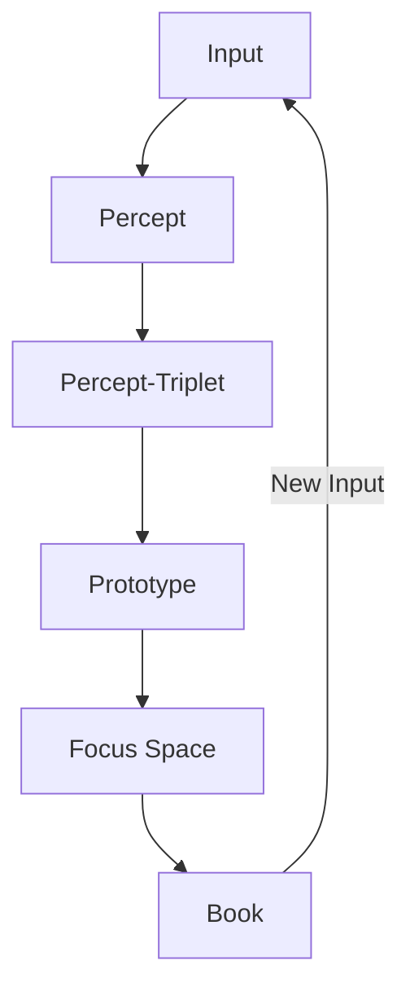
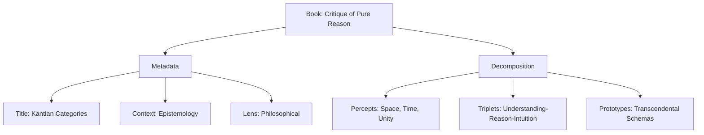
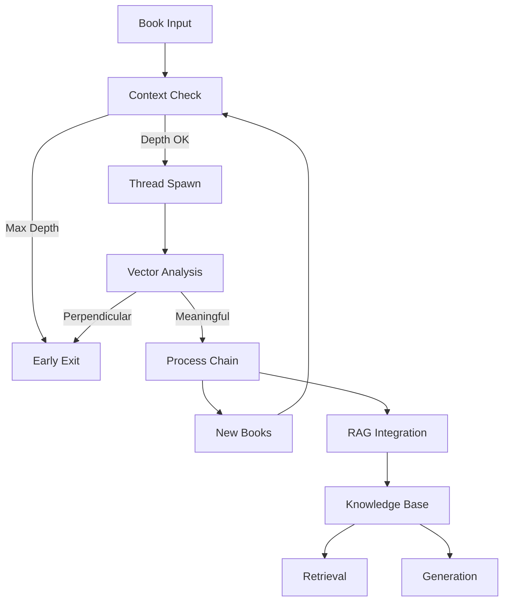
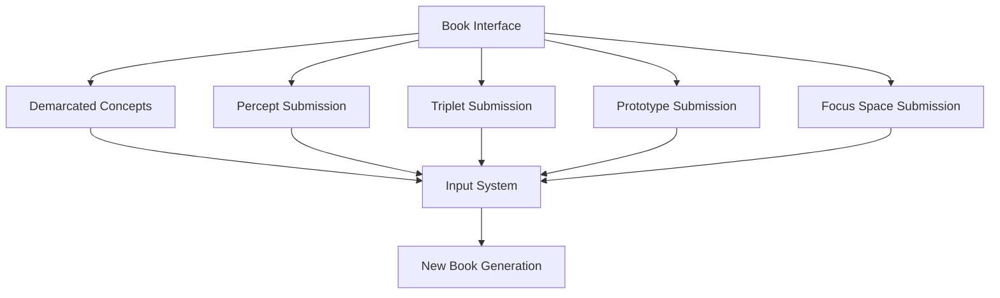

# 2.15. Chain-of-thought

In summary, the Memorativa system models the inner, intangible, and in some cases inexpressible world on the "inner cosmos" of perception and thought with data structures that represent the instantiation of these inner intangibles.

| Cognitive Process | Memorativa Structure | Description | Output |
|------------------|---------------------|-------------|---------|
| Perception | Input Entry | Raw content enters system with title/description | Percept |
| Conceptualization | Percept-Triplet | Input mapped to Planet-Sign-House structure | Structured Percept |
| Pattern Recognition | Prototype | Multiple percept-triplets form conceptual pattern | Conceptual Pattern |
| Analysis | Focus Space | Prototypes analyzed through Lenses | Interpreted Pattern |
| Synthesis | Book | Structured collection of analyzed percepts and prototypes | Narrative + Structure |
| Reflection | Book Library | Books organized and related through multiple views | Knowledge Network |
| Understanding | Concept Marking | Content boundaries and relationships identified | Demarcated Concept in the Book structure|

This progression represents how the system transforms raw perceptual input into structured knowledge, mirroring the human cognitive cycle of perception, conceptualization, analysis, and reflection.

## Terminal synthesis

The structure progression represents how the system transforms raw perceptual input into structured knowledge, mirroring the human cognitive cycle of perception, conceptualization, analysis, and reflection.

The Book serves as the terminal output of this cognitive chain, where:

1. **Structure Integration**
   - References all prior Glass Beads (percepts, prototypes, focus spaces)
   - Maintains relationships between cognitive components through multi-layer format:
     - Human Layer: Narrative text, chapters, sections
     - Machine Layer: Structured data mappings
     - Bridge Layer: Markup linking narrative to data
   - Preserves temporal context across three states:
     - Mundane Time: Concrete chronological events
     - Quantum Time: Conceptual/indeterminate time
     - Holographic Time: Reference frameworks

2. **Narrative Completion**
   - Provides human-readable context for machine structures
   - Synthesizes relationships into coherent narratives
   - Bridges symbolic and conceptual frameworks through MST integration
   - Supports multiple simultaneous lens views

3. **Recursive Potential**
   - Completed Books can serve as new inputs
   - Enables nested levels of conceptual analysis
   - Supports evolving knowledge structures



This terminal synthesis creates a closed loop where Books can become new inputs, enabling continuous cognitive development and knowledge expansion.

## Book recursion and decomposition

When a Book enters the system as input, it follows the cognitive chain in reverse:

1. **Input Framing**
   - Title and description guide interpretation
   - Contextual metadata shapes analysis
   - Active lenses filter perception
   - Focus parameters direct attention

2. **Structural Decomposition**
   - Narrative content → Percepts
   - Conceptual relationships → Percept-Triplets
   - Pattern structures → Prototypes
   - Analysis frameworks → Focus Spaces

3. **Example Flow**


4. **Processing Modes**
   - **Whole Book**: Complete conceptual framework analysis
   - **Book Section**: Focused pattern extraction
   - **Book Fragment**: Specific concept isolation
   - **Cross-Book**: Relationship mapping between sources

This decomposition enables:
- Recursive analysis of existing knowledge
- Integration of historical insights
- Discovery of hidden patterns
- Creation of new conceptual connections

## Book processing controls

The Book→Percept processing chain implements strict recursion controls to prevent infinite loops while preserving meaningful conceptual development. These controls ensure stable knowledge evolution while preventing computational overflow.

### Processing context

Each Book processing operation maintains a context that tracks:
- Current recursion depth (max 64 levels)
- Previously visited Books in the chain
- Thread state and stack allocation
- Vector relationship metrics

The `ProcessingContext` struct and its can_process method are designed to manage and control the execution of book processing operations. The `ProcessingContext` keeps track of the recursion depth, maximum allowed depth, and a set of already visited books to detect cycles. The `can_process` method is used before starting to process a book to ensure that processing it will not exceed the depth limit or create a processing cycle, thus preventing errors like stack overflow and infinite loops. This is a common pattern in recursive algorithms or processes that involve graph traversal to ensure stability and prevent uncontrolled execution.

```rust
struct ProcessingContext {
    depth: u32,
    max_depth: u32,
    visited_books: HashSet<BookId>,
    thread_stack: Vec<BookState>,
}

impl ProcessingContext {
    fn can_process(&mut self, book: &Book) -> Result<(), ProcessingError> {
        if self.depth >= self.max_depth {
            return Err(ProcessingError::MaxDepthExceeded);
        }
        if !self.visited_books.insert(book.id) {
            return Err(ProcessingError::CycleDetected);
        }
        Ok(())
    }
}
```

### Thread management

Each Book processing chain runs in an isolated thread with dedicated stack space:

```rust
fn process_book_chain(book: Book, context: ProcessingContext) -> Result<Vec<Percept>> {
    thread::Builder::new()
        .stack_size(8 * 1024 * 1024) // 8MB stack
        .spawn(move || {
            context.can_process(&book)?;
            let percepts = decompose_book(book)?;
            context.depth += 1;
            
            // Process derived books with depth checking
            process_derived_books(percepts, context)
        })?
}
```

### Vector analysis

The system monitors vector relationships to detect and terminate unproductive processing chains:

```rust
fn should_terminate_processing(vectors: &[Vector]) -> bool {
    // Terminate if ≥75% of vector relationships are perpendicular
    let perpendicular_count = count_perpendicular_relationships(vectors);
    perpendicular_count as f32 / vectors.len() as f32 >= 0.75
}
```

### Processing flow



This control system ensures:
- Bounded recursion depth (configurable, default 64 levels)
- Cycle detection through Book ID tracking
- Early termination of unproductive chains
- Memory safety through thread isolation
- Preservation of meaningful conceptual relationships

The controls integrate with the existing version control and branching systems, using version metadata to track processing history and maintain coherent knowledge evolution paths.

## Direct input interface

Books provide direct submission interfaces for their component structures:



**1. Component Resubmission**
Players can directly submit:
- Demarcated concepts from any layer
- Individual percepts from narrative content
- Percept-triplets from concept mappings
- Prototypes from pattern structures
- Focus space configurations
- Any combination of the above

**2. Interface Features**
- One-click submission of demarcated content
- One-click submission of marked concepts
- Drag-and-drop pattern selection
- Context menu for submission options
- Batch submission capabilities
- Submission preview and editing

**3. Submission Context**
Each submission preserves:
- Demarcation metadata
- Original Book reference
- Active lens configuration
- Temporal state context
- Relationship metadata
- User annotations

This direct submission capability creates a fluid cycle between reading and analysis, allowing immediate exploration of new insights as they emerge during Book interaction.

## Key points

Core Cognitive Chain:
- Transforms raw perceptual input through structured stages: perception → conceptualization → pattern recognition → analysis → synthesis → reflection → understanding
- Each stage maps to specific Memorativa structures: Input Entry → Percept-Triplet → Prototype → Focus Space → Book → Book Library → Concept Marking
- Books serve as terminal synthesis points that integrate all prior cognitive components
- Understanding emerges through active orientation within the conceptual space

Book Processing:
- Multi-layered structure combines human narrative, machine data, and bridging markup
- Handles three temporal contexts: Mundane (concrete), Quantum (conceptual), and Holographic (referential)
- Implements strict recursion controls to prevent infinite loops while enabling meaningful conceptual development
- Integrates with RAG system for knowledge base building and retrieval

Recursive Features:
- Books can serve as new inputs, creating closed cognitive loops
- Decomposition process reverses the cognitive chain for analysis
- Multiple processing modes support different analytical depths
- Thread isolation and vector analysis prevent unproductive processing

Interface Design:
- Direct submission interfaces for all component structures
- Preserves context and relationships across submissions
- Supports one-click and batch operations
- Maintains metadata integrity throughout processing chain

Cognitive Model:
- Models understanding as active orientation in conceptual space
- Mirrors human cognitive development patterns
- Supports both analytical and intuitive knowledge formation
- Enables progressive refinement of understanding through recursive processing

The system models cognitive development as an iterative process where each cycle builds upon previous understanding, creating increasingly sophisticated knowledge structures while maintaining computational stability and conceptual coherence.
