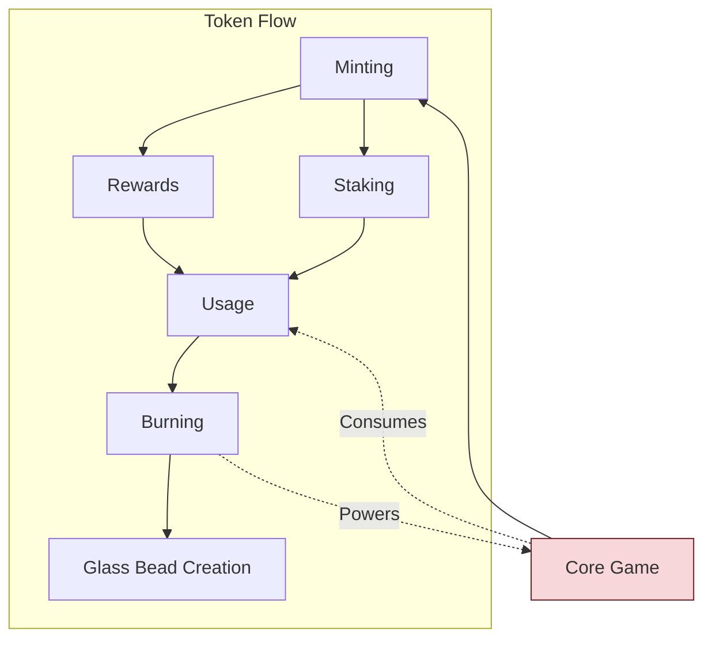
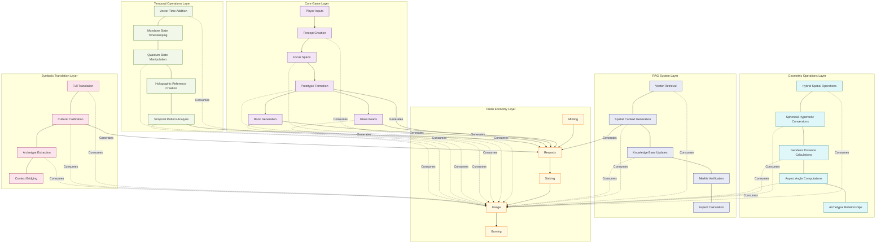

# 2.15. Gas Bead Tokens

Gas Bead Tokens (GBT) function as the essential utility token and computational fuel that powers the Memorativa ecosystem. By providing a unified economic layer for all system operations, GBT enables the creation, transformation, and validation of knowledge artifacts. While Glass Bead Tokens (GBTk) embody the actual knowledge structures with their hybrid spherical-hyperbolic spatial encoding (section 2.16), Gas Bead Tokens represent the computational resources required to manipulate these structures, forming a complementary economic system that balances resource utilization with value creation.

## Core Game Integration

Gas Bead Tokens are the fundamental fuel that powers the Core Game described in section 2.2. They enable:

1. **Player Inputs Processing**: Each player input in the Glass Bead Game requires GBT to filter, process, and prepare for percept creation.
2. **Percept Creation**: The creation of percepts from player inputs consumes GBT based on input complexity and processing requirements.
3. **Focus Space Generation**: Establishing new focus spaces for concept visualization requires GBT payment.
4. **Prototype Formation**: The computational resources needed to form and maintain prototypes are funded through GBT.
5. **Book Generation**: The creation of knowledge Books consumes GBT proportional to their complexity and depth.

This integration ensures that all Core Game activities have a corresponding economic cost and reward, creating a sustainable ecosystem for knowledge creation and curation.

### Core Game Reward Alignment

The Gas Bead Token reward structure directly aligns with the Core Game mechanics described in section 2.2:

| Core Game Activity | GBT Reward | Alignment Purpose |
|-------------------|------------|-------------------|
| Quality Percept Creation | 5-10 GBT | Incentivizes thoughtful input reflection rather than quantity |
| Focus Space Development | 5-15 GBT | Rewards the organization of conceptual spaces |
| Prototype Formation | 10-20 GBT | Encourages the synthesis of percepts into coherent wholes |
| Book Creation | 20-50 GBT | Rewards comprehensive knowledge artifact creation |
| Vector Refinement | 3-7 GBT | Encourages continuous improvement of concept representation |
| Knowledge Sharing | 5-15 GBT | Promotes collaborative knowledge building |

This reward structure ensures that players receive appropriate compensation for their contributions to the knowledge network while maintaining the economic equilibrium of the system. The rewards scale with the computational complexity and knowledge value of each contribution, creating an incentive structure that naturally guides users toward high-quality knowledge work.

## Core Functions

### System Operations
- Powers computational tasks like:
  - Percept-triplet calculations
  - Prototype formation
  - Focus space operations
  - Book generation
  - RAG system queries
- Covers costs for:
  - LLM inference
  - Vector calculations
  - Spatial indexing
  - Merkle tree updates

### Economic Incentives
- Rewards for:
  - Contributing percepts
  - Validating prototypes
  - Creating Books
  - Sharing knowledge
  - System maintenance
  - Gamified validation activities
- Burned to:
  - Mint Glass Bead Tokens
  - Create new focus spaces
  - Generate Books
  - Access premium features

### Gamified Validation System
```rust
struct ValidationGame {
    leaderboard: Leaderboard,
    streak_counter: StreakCounter,
    accuracy_tracker: AccuracyTracker,
    difficulty_level: Difficulty,
}

impl ValidationGame {
    fn validate_percept(&self, percept: Percept, gas: GasBeadToken) -> Result<ValidationReward> {
        let difficulty = self.calculate_difficulty(percept);
        let reward = self.calculate_reward(difficulty);
        
        gas.burn_for_operation(Operation::ValidatePercept, difficulty.base_cost())?;
        let validation_result = validate(percept)?;
        
        self.update_leaderboard(validation_result);
        self.update_streak(validation_result);
        self.update_accuracy(validation_result);
        
        gas.mint_rewards(reward)
    }

    fn calculate_reward(&self, difficulty: Difficulty) -> u64 {
        let base = match difficulty {
            Difficulty::Easy => 1,
            Difficulty::Medium => 3,
            Difficulty::Hard => 5,
            Difficulty::Expert => 10,
        };
        
        base * self.streak_multiplier() * self.accuracy_bonus()
    }
}
```

### Reward Structure
| Activity | GBT Reward | Description |
|----------|------------|-------------|
| Quality Percept Creation | 5-10 GBT | Contributing meaningful percepts with well-defined archetypal vectors |
| Vector Modification | 3-7 GBT | Refining expression or mundane vectors in existing percepts |
| Spatial Query Processing | 2-5 GBT | Executing and validating complex spatial searches |
| Coordinate Transformation | 2-5 GBT | Converting between different geometric representations |
| Prototype Integration | 1-3 GBT | Connecting percepts to form coherent knowledge structures |
| Attribute Updates | 1-2 GBT | Refining metadata and descriptive elements |
| Verification Activities | 0.5-1 GBT | Validating semantic integrity of percepts |
| Book Creation | 20-50 GBT | Generating comprehensive Books |
| Focus Space Sharing | 5-15 GBT | Making spaces public |
| Knowledge Synthesis | 10-30 GBT | Combining multiple concepts |
| Validation Streak | 1-5x | Multiplier for consecutive correct validations |
| Accuracy Bonus | 1-3x | Multiplier based on historical accuracy |
| Difficulty Bonus | 1-10x | Multiplier based on validation complexity |

*Note: The reward structure directly mirrors the operational costs defined in section 2.4, ensuring that more complex and computationally intensive operations (like creation and vector modification) receive proportionally higher rewards. This alignment creates a balanced economy where users are compensated fairly for the computational resources their contributions consume.*

### Sustainability Model
- Regular users should earn 15-30 GBT daily through basic participation
- Active contributors can earn 50-100 GBT daily
- Monthly active users should maintain positive GBT flow
- Bulk rewards for consistent quality contributions
- Bonus rewards for first-time operations
- Community rewards for collaborative activities

This model ensures:
- Basic operations remain accessible
- Quality contributions are incentivized
- Regular users maintain positive token flow
- System sustainability through balanced tokenomics

## Token Mechanics


*Figure 1: Gas Bead Token Flow Diagram, showing the cyclical relationship between minting, rewards, staking, usage, and burning processes within the Memorativa ecosystem, highlighting how the Core Game both contributes to and consumes tokens in a sustainable economic cycle*

### Minting
- Initial distribution through:
  - System participation
  - Contribution rewards
  - Validation activities
- Dynamic supply based on:
  - System activity
  - Burning rate
  - Knowledge growth

### Burning
- Required for:
  - Glass Bead Token minting
  - Focus space creation
  - Book generation
  - Premium feature access
- Burns create deflationary pressure

### Tiered Cost Structure
| Operation Type | Cost Range | Description |
|---------------|------------|-------------|
| Exploratory | 0.1-1 GBT | Draft percepts, prototype sketching, focus space experiments |
| Development | 1-10 GBT | Refining percepts, evolving prototypes, space organization |
| Production | 10-100 GBT | Final books, validated prototypes, public spaces |

### Cost Calculation
```rust
pub enum OperationTier {
    Exploratory,
    Development, 
    Production
}

pub fn calculate_operation_cost(
    op: Operation,
    tier: OperationTier,
    complexity: Complexity,
    resources: Resources
) -> u64 {
    let base_cost = match tier {
        OperationTier::Exploratory => op.base_cost() * 0.1,
        OperationTier::Development => op.base_cost(),
        OperationTier::Production => op.base_cost() * 10.0,
    };
    
    let complexity_multiplier = complexity.factor();
    let resource_adjustment = resources.adjustment();
    
    (base_cost * complexity_multiplier * resource_adjustment) as u64
}
```

### Integration Example
```rust
fn create_percept(
    input: Input, 
    tier: OperationTier,
    gas: GasBeadToken
) -> Result<Percept> {
    let cost = calculate_operation_cost(
        Operation::CreatePercept,
        tier,
        input.complexity(),
        system.resources()
    );
    
    gas.burn_for_operation(Operation::CreatePercept, cost)?;
    process_percept(input)
}
```

## Token Design

### SPL Implementation
```rust
struct GasBeadMetadata {
    mint: Pubkey,
    owner: Pubkey,
    operation_history: Vec<OperationRecord>,
    staking_info: Option<StakingData>,
    burn_metrics: BurnMetrics,
}

struct OperationRecord {
    operation_type: Operation,
    cost: u64,
    timestamp: i64,
    resource_metrics: ResourceUsage,
}

struct StakingData {
    amount: u64,
    locked_until: i64,
    reward_rate: f32,
    validator_pubkey: Option<Pubkey>,
}

struct BurnMetrics {
    total_burned: u64,
    operation_burns: HashMap<Operation, u64>,
    burn_rate: ExponentialMovingAverage,
}
```

### Operation Controls
```rust
impl GasBeadToken {
    fn verify_operation(&self, op: Operation, cost: u64) -> Result<()> {
        // Verify sufficient balance
        if self.balance < cost {
            return Err(InsufficientGas);
        }

        // Check operation rate limits
        if !self.rate_limiter.can_execute(op) {
            return Err(RateLimitExceeded);
        }

        // Verify operation permissions
        if !self.permissions.can_execute(op) {
            return Err(OperationNotAllowed);
        }

        Ok(())
    }

    fn burn_for_operation(&mut self, op: Operation, cost: u64) -> Result<()> {
        self.verify_operation(op, cost)?;
        
        // Record burn metrics
        self.burn_metrics.record_burn(op, cost);
        
        // Execute burn
        self.balance -= cost;
        
        // Update operation history
        self.record_operation(op, cost);
        
        Ok(())
    }
}
```

### Staking Mechanics
```rust
impl GasBeadStaking {
    fn stake(&mut self, amount: u64, duration: i64) -> Result<()> {
        // Verify stake amount
        if amount > self.available_balance() {
            return Err(InsufficientBalance);
        }

        // Calculate reward rate based on amount and duration
        let rate = self.calculate_reward_rate(amount, duration);
        
        // Lock tokens
        self.staking_info = Some(StakingData {
            amount,
            locked_until: current_timestamp() + duration,
            reward_rate: rate,
            validator_pubkey: None,
        });

        Ok(())
    }

    fn claim_rewards(&mut self) -> Result<u64> {
        let rewards = self.calculate_pending_rewards()?;
        self.mint_rewards(rewards)
    }
}
```

### Cross-chain Bridge
```rust
pub trait GasBeadBridge {
    fn verify_gas_balance(proof: MerkleProof) -> Result<u64>;
    fn transfer_cross_chain(
        destination_chain: ChainId,
        amount: u64,
        recipient: Pubkey
    ) -> Result<TransferProof>;
    fn receive_cross_chain(
        source_chain: ChainId,
        proof: TransferProof
    ) -> Result<()>;
}
```

### Rate Limiting
```rust
struct RateLimiter {
    operation_counts: HashMap<Operation, WindowCounter>,
    tier_limits: HashMap<OperationTier, RateLimit>,
}

impl RateLimiter {
    fn can_execute(&self, op: Operation) -> bool {
        let counter = self.operation_counts.get(&op).unwrap();
        let limit = self.tier_limits.get(&op.tier()).unwrap();
        
        counter.count_in_window() < limit.max_operations
    }
}
```

This token design enables:
- Efficient operation verification and execution
- Flexible staking mechanisms
- Cross-chain interoperability
- Rate limiting for system stability
- Detailed operation tracking
- Predictable burn mechanics 

## System Benefits

### Computational Efficiency
- Pay-per-use model ensures efficient resource utilization
- Cost structure incentivizes optimized operations
- Dynamic pricing based on system load

### Economic Sustainability
- Rewards valuable contributions
- Creates natural token velocity
- Maintains supply-demand balance
- Supports system growth

### User Incentives
- Clear value proposition for participation
- Tangible rewards for contributions
- Flexible usage options
- Staking opportunities

## Integration Examples

### Percept Creation
```rust
fn create_percept(input: Input, gas: GasBeadToken) -> Result<Percept> {
    // Calculate operation cost
    let cost = calculate_operation_cost(
        Operation::CreatePercept,
        OperationTier::Exploratory,
        input.complexity(),
        system.resources()
    );
    
    // Burn gas for operation
    gas.burn_for_operation(Operation::CreatePercept, cost)?;
    
    // Process percept
    process_percept(input)
}
```

### Book Generation
```rust
fn generate_book(
    prototype: Prototype,
    gas: GasBeadToken
) -> Result<Book> {
    // Verify sufficient gas
    let cost = calculate_book_cost(prototype);
    gas.verify_balance(cost)?;
    
    // Burn gas incrementally
    for section in prototype.sections() {
        gas.burn_for_operation(Operation::GenerateSection)?;
        generate_section(section)?;
    }
    
    finalize_book(prototype)
}
```

### RAG System Operations

Gas Bead Tokens power the Retrieval-Augmented Generation (RAG) system described in section 2.7, with a specific cost structure designed to balance computational resources with player engagement:

```rust
enum RAGOperation {
    VectorRetrieval,         // Finding and filtering relevant documents
    SpatialContextGeneration, // Creating context-aware responses
    KnowledgeBaseUpdate,     // Updating document indices
    MerkleVerification,      // Validating document integrity
    AspectCalculation,       // Computing 3D angles
    ClusterSelection,        // Finding nearest spatial cluster
    CacheLookup,             // Retrieving pre-calculated values
}

fn calculate_rag_operation_cost(
    operation: RAGOperation,
    document_count: usize,
    complexity: OperationComplexity
) -> u64 {
    // Base costs aligned with RAG operation costs from section 2.7
    let base_cost = match operation {
        RAGOperation::VectorRetrieval => 5,
        RAGOperation::SpatialContextGeneration => 7,
        RAGOperation::KnowledgeBaseUpdate => 4,
        RAGOperation::MerkleVerification => 3,
        RAGOperation::AspectCalculation => 2,
        RAGOperation::ClusterSelection => 1,
        RAGOperation::CacheLookup => 0.1,
    };
    
    // Complexity multiplier
    let complexity_multiplier = match complexity {
        OperationComplexity::Low => 1.0,
        OperationComplexity::Medium => 1.5,
        OperationComplexity::High => 2.5,
    };
    
    // Document count adjustment
    // More documents require more processing
    let count_factor = 1.0 + (document_count as f64 * 0.02).min(1.0);
    
    (base_cost as f64 * complexity_multiplier * count_factor) as u64
}

// Example integration with RAG retrieval function
fn retrieve_with_hybrid_aspects(
    query: HybridTriplet,
    document_count: usize,
    gas: GasBeadToken
) -> Result<Vec<Document>> {
    // Calculate operation complexity
    let complexity = calculate_query_complexity(query);
    
    // Calculate cost for vector retrieval operation
    let cost = calculate_rag_operation_cost(
        RAGOperation::VectorRetrieval,
        document_count,
        complexity
    );
    
    // Verify and burn gas
    gas.burn_for_operation(Operation::RAGRetrieval, cost)?;
    
    // Perform retrieval using SphericalRAG
    let rag = SphericalRAG::new();
    rag.retrieve_relevant(query, document_count)
}
```

The cost structure follows these principles:
- Operations requiring 3D spatial calculations cost proportionally more
- Angular relationship calculations have costs reflecting their symbolic value
- Verification operations ensuring data integrity cost more than simple retrievals
- Cached operations receive significant cost reductions
- Batch operations receive discounts to encourage efficiency
- Public knowledge contributions receive cost reductions to encourage sharing

| RAG Operation | GBT Cost | Description |
|---------------|----------|-------------|
| Vector Retrieval | 5-8 GBT | Finding documents with hybrid aspect filtering |
| Spatial Context Generation | 7-12 GBT | Creating responses with aspect relationships |
| Knowledge Base Update | 4-9 GBT | Adding documents to spatial and temporal indices |
| Merkle Verification | 3-6 GBT | Validating document integrity with angular preservation |
| Aspect Calculation | 2-5 GBT | Computing 3D angles between spherical coordinates |
| Cluster Selection | 1-2 GBT | Finding nearest cluster to query point |
| Cache Lookup | 0.1-0.5 GBT | Retrieving pre-calculated values from memory |

This directly maps to the operational costs defined in section 2.7, ensuring complete alignment between the token economics and the RAG system implementation.

### Conceptual Time States Operations

Gas Bead Tokens power the conceptual time state operations described in section 2.11, with costs that reflect the computational complexity of temporal manipulations:

```rust
enum TimeStateOperation {
    VectorAddition,        // Adding time vector to percept-triplet
    MundaneTimestamping,   // Concrete timestamp assignment
    QuantumManipulation,   // Operations on indeterminate time states
    HolographicReference,  // Establishing temporal reference frames
    StateTransition,       // Converting between different time states
    TemporalPatternAnalysis, // Identifying patterns across time states
    PrivacyPreservingTimeEncoding // Enhanced privacy operations
}

fn calculate_time_state_operation_cost(
    operation: TimeStateOperation,
    complexity: OperationComplexity,
    privacy_level: PrivacyLevel,
    time_states_count: usize
) -> u64 {
    // Base costs aligned with time state operation costs from section 2.11
    let base_cost = match operation {
        TimeStateOperation::VectorAddition => 5,
        TimeStateOperation::MundaneTimestamping => 3,
        TimeStateOperation::QuantumManipulation => 8,
        TimeStateOperation::HolographicReference => 10,
        TimeStateOperation::StateTransition => 5,
        TimeStateOperation::TemporalPatternAnalysis => 12,
        TimeStateOperation::PrivacyPreservingTimeEncoding => 7
    };
    
    // Complexity multiplier
    let complexity_multiplier = match complexity {
        OperationComplexity::Low => 1.0,
        OperationComplexity::Medium => 1.5,
        OperationComplexity::High => 2.5,
    };
    
    // Privacy level factor - more privacy requires more computation
    let privacy_factor = match privacy_level {
        PrivacyLevel::Public => 1.0,
        PrivacyLevel::Protected => 1.3,
        PrivacyLevel::Private => 1.5
    };
    
    // Scale with number of time states being processed
    let count_factor = 1.0 + (time_states_count as f64 * 0.05).min(1.0);
    
    (base_cost as f64 * complexity_multiplier * privacy_factor * count_factor) as u64
}

// Example integration with time state transition
fn transition_time_state(
    from_state: TimeState,
    to_state: TimeState,
    rules: Vec<TransitionRule>,
    gas: GasBeadToken
) -> Result<TimeState> {
    // Calculate operation complexity based on transition rules
    let complexity = calculate_transition_complexity(&rules);
    
    // Determine privacy level needed for this transition
    let privacy_level = determine_privacy_requirements(&from_state, &to_state);
    
    // Calculate operation cost
    let cost = calculate_time_state_operation_cost(
        TimeStateOperation::StateTransition,
        complexity,
        privacy_level,
        1 // Single transition
    );
    
    // Verify and burn gas
    gas.burn_for_operation(Operation::TimeStateTransition, cost)?;
    
    // Create state transition
    let transition = StateTransition {
        from_state,
        to_state,
        transition_rules: rules,
        metadata: create_transition_metadata()
    };
    
    // Execute transition
    transition.execute()
}

// Example for quantum-inspired temporal analysis
fn analyze_temporal_patterns(
    time_states: Vec<TimeState>,
    gas: GasBeadToken
) -> Result<TemporalPatterns> {
    // Calculate operation complexity based on states and analysis depth
    let complexity = calculate_analysis_complexity(&time_states);
    
    // Determine privacy level for the analysis
    let privacy_level = determine_analysis_privacy_level(&time_states);
    
    // Calculate operation cost
    let cost = calculate_time_state_operation_cost(
        TimeStateOperation::TemporalPatternAnalysis,
        complexity,
        privacy_level,
        time_states.len()
    );
    
    // Verify and burn gas
    gas.burn_for_operation(Operation::TemporalPatternAnalysis, cost)?;
    
    // Create quantum-inspired analysis
    let analysis = QuantumInspiredTemporalState::new(time_states);
    
    // Execute temporal pattern analysis
    analysis.analyze_temporal_patterns()
}
```

This implementation ensures that:

1. Each time state operation from section 2.11 has a corresponding GBT cost
2. The privacy-preserving features described in section 2.11 are properly accounted for in the token economy
3. Computational costs scale with complexity and number of time states involved
4. The quantum-inspired temporal analysis has appropriate token costs based on its computational requirements
5. The token costs align with the operational costs defined in section 2.11

The GBT reward structure for time state-related activities is also aligned with the computational costs:

| Time State Activity | GBT Cost | GBT Reward | Description |
|-------------------|----------|------------|-------------|
| **Time Vector Addition** | 3-6 GBT | - | Adding a time vector to a percept-triplet |
| **Mundane State Timestamping** | 2-4 GBT | - | Concrete timestamp assignment |
| **Quantum State Manipulation** | 5-10 GBT | - | Operations on indeterminate time states |
| **Holographic Reference Creation** | 8-12 GBT | - | Establishing temporal reference frames |
| **State Transition** | 4-7 GBT | - | Converting between different time states |
| **Temporal Pattern Analysis** | 10-15 GBT | 7-15 GBT | Identifying patterns across time states |
| **Privacy-Preserving Time Encoding** | +50% to base cost | - | Additional cost for enhanced privacy |

Players are rewarded with GBT when their temporal operations contribute value to the knowledge network:

- Establishing meaningful temporal connections between concepts (3-8 GBT)
- Creating useful temporal reference frames (5-10 GBT)
- Identifying significant temporal patterns (7-15 GBT)
- Contributing to temporal analysis algorithms (10-25 GBT)

This reward structure creates a sustainable economy for temporal operations, ensuring that players are incentivized to contribute valuable temporal insights while discouraging wasteful computation.

### Prototype Integration

Gas Bead Tokens directly power the geocentric prototype structure described in section 2.9, with costs that reflect the computational complexity of observer-centric operations:

```rust
enum PrototypeOperation {
    Formation,             // Creating a new prototype from percept-triplets
    AspectCalculation,     // Computing angular relationships between triplets
    PatternRecognition,    // Identifying significant patterns within a prototype
    Refinement,            // Updating prototype based on feedback
    Validation,            // Verifying prototype coherence and integrity
    AiFeedback,            // Generating AI-enhanced feedback
    SphericalMerkleUpdate  // Updating the verification structure
}

fn calculate_prototype_operation_cost(
    operation: PrototypeOperation,
    triplet_count: usize,
    complexity: OperationComplexity,
    observer_context: ObserverContext
) -> u64 {
    // Base costs aligned with prototype operation costs from section 2.9
    let base_cost = match operation {
        PrototypeOperation::Formation => 12,          // O(t²) complexity
        PrototypeOperation::AspectCalculation => 5,   // O(t²) for pairwise calculations
        PrototypeOperation::PatternRecognition => 7,  // Pattern analysis complexity
        PrototypeOperation::Refinement => 8,          // Prototype refinement costs
        PrototypeOperation::Validation => 5,          // Verification operations
        PrototypeOperation::AiFeedback => 8,          // AI-enhanced feedback generation
        PrototypeOperation::SphericalMerkleUpdate => 4, // Merkle tree update operations
    };
    
    // Triplet count adjustment - quadratic scaling for some operations
    let count_factor = match operation {
        PrototypeOperation::Formation | PrototypeOperation::AspectCalculation => {
            // Quadratic scaling for pairwise operations
            1.0 + (triplet_count as f64 * triplet_count as f64 * 0.01).min(3.0)
        },
        _ => {
            // Linear scaling for other operations
            1.0 + (triplet_count as f64 * 0.1).min(2.0)
        }
    };
    
    // Complexity multiplier
    let complexity_multiplier = match complexity {
        OperationComplexity::Low => 1.0,
        OperationComplexity::Medium => 1.5,
        OperationComplexity::High => 2.5,
    };
    
    // Observer context adjustment
    // Operations in highly curved spaces require more resources
    let curvature_factor = 1.0 + (observer_context.curvature.abs() / 5.0);
    
    (base_cost as f64 * count_factor * complexity_multiplier * curvature_factor) as u64
}

// Example integration with prototype formation
fn form_prototype(
    triplets: Vec<PerceptTriplet>,
    observer: Observer,
    gas: GasBeadToken
) -> Result<Prototype> {
    // Calculate number of triplets
    let triplet_count = triplets.len();
    
    // Determine operation complexity based on curvature and structure
    let complexity = calculate_triplet_complexity(&triplets);
    
    // Get observer context for cost calculation
    let observer_context = ObserverContext {
        curvature: calculate_semantic_curvature(&triplets),
        position: observer.position,
        temporal_state: observer.temporal_state
    };
    
    // Calculate formation cost
    let cost = calculate_prototype_operation_cost(
        PrototypeOperation::Formation,
        triplet_count,
        complexity,
        observer_context
    );
    
    // Verify and burn gas
    gas.burn_for_operation(Operation::PrototypeFormation, cost)?;
    
    // Form prototype using geocentric model
    let prototype = Prototype::create_geocentric(
        observer,
        triplets,
        complexity
    );
    
    // Calculate aspects between triplets from observer perspective
    calculate_geocentric_aspects(&mut prototype, &observer)?;
    
    Ok(prototype)
}

// Calculate aspects between all triplets from observer perspective
fn calculate_geocentric_aspects(
    prototype: &mut Prototype,
    observer: &Observer
) -> Result<()> {
    // Get all triplets
    let all_triplets = prototype.all_triplets();
    let triplet_count = all_triplets.len();
    
    // Prepare for aspect calculation
    let mut aspects = Vec::new();
    
    // Calculate aspects between all pairs
    for i in 0..triplet_count {
        for j in (i+1)..triplet_count {
            let t1 = &all_triplets[i];
            let t2 = &all_triplets[j];
            
            // Calculate angular relationship from observer perspective
            let angle = calculate_geocentric_angle(t1, t2, observer);
            
            // Only store significant aspects
            if is_significant_aspect(angle) {
                aspects.push(Aspect {
                    source_index: i,
                    target_index: j,
                    angle,
                    strength: calculate_aspect_strength(angle)
                });
            }
        }
    }
    
    // Store aspects in prototype
    prototype.set_aspects(aspects);
    
    Ok(())
}
```

This implementation ensures that:

1. Each prototype operation from section 2.9 has a corresponding GBT cost
2. The geocentric model is preserved with the observer at the center of all calculations
3. The computational complexity of operations scales according to the prototype structure:
   - Quadratic scaling for pairwise operations like aspect calculation
   - Linear scaling for operations on individual triplets
4. Operations in more complex geometric spaces (higher curvature) require more GBT
5. The token costs align with the operational costs defined in section 2.9

The GBT reward structure for prototype-related activities is also aligned with the computational costs:

| Prototype Activity | GBT Cost | GBT Reward | Description |
|-------------------|----------|------------|-------------|
| **Prototype Formation** | 10-15 GBT | - | Creating a new prototype from percept-triplets |
| **Aspect Calculation** | 3-7 GBT | - | Computing angular relationships between triplets |
| **Pattern Recognition** | 5-8 GBT | - | Identifying significant patterns |
| **Prototype Refinement** | 5-12 GBT | 5-12 GBT | Updating prototype based on feedback |
| **Validation** | 3-8 GBT | 3-8 GBT | Verifying prototype coherence and integrity |
| **Prototype Sharing** | 2-5 GBT | 5-15 GBT | Making prototype available for others |
| **Vector Refinement** | 3-7 GBT | 3-7 GBT | Adjusting vector weights in prototype |

This ensures that players are properly rewarded for their contributions to prototype development, with rewards scaling based on the computational complexity and knowledge value of their contribution, while maintaining alignment with the geocentric model that is central to the prototype design.

### Symbolic Translation Operations

The GBT system fully integrates with the Memorativa Symbolic Translator (MST) described in section 2.5, powering its operations through a specialized cost structure:

```rust
enum SymbolicTranslationOperation {
    FullTranslation,       // Complete conversion with full context
    CulturalCalibration,   // Cross-cultural symbolic adjustment
    ArchetypeExtraction,   // Universal concept identification
    ContextBridging,       // Relationship integrity maintenance
    BasicLookup            // Simple correspondence table access
}

fn calculate_mst_operation_cost(
    operation: SymbolicTranslationOperation,
    input_complexity: Complexity,
    cultural_breadth: usize
) -> u64 {
    // Base costs aligned with MST operation costs from section 2.5
    let base_cost = match operation {
        SymbolicTranslationOperation::FullTranslation => 15,
        SymbolicTranslationOperation::CulturalCalibration => 10,
        SymbolicTranslationOperation::ArchetypeExtraction => 7,
        SymbolicTranslationOperation::ContextBridging => 4,
        SymbolicTranslationOperation::BasicLookup => 2,
    };
    
    // Complexity multiplier
    let complexity_multiplier = match input_complexity {
        Complexity::Low => 1.0,
        Complexity::Medium => 1.5,
        Complexity::High => 2.5,
    };
    
    // Cultural breadth adjustment
    // More cross-cultural mappings require more computation
    let cultural_factor = 1.0 + (cultural_breadth as f64 * 0.1);
    
    (base_cost as f64 * complexity_multiplier * cultural_factor) as u64
}

// Example integration with MST translation function
fn translate_percept_to_symbol(
    percept: Percept,
    cultural_frameworks: Vec<CulturalFramework>,
    gas: GasBeadToken
) -> Result<SymbolicRepresentation> {
    // Calculate operation complexity based on percept structure
    let complexity = calculate_percept_complexity(percept);
    
    // Determine cultural breadth of translation
    let cultural_breadth = cultural_frameworks.len();
    
    // Calculate operational cost
    let cost = calculate_mst_operation_cost(
        SymbolicTranslationOperation::FullTranslation,
        complexity,
        cultural_breadth
    );
    
    // Verify and burn gas
    gas.burn_for_operation(Operation::SymbolicTranslation, cost)?;
    
    // Perform translation operation using MST
    let mst = MemorativaSymbolicTranslator::new(cultural_frameworks);
    let translation = mst.translate(percept)?;
    
    // Return symbolic representation
    Ok(translation)
}
```

This implementation ensures that:

1. Each MST operation from section 2.5 has a corresponding GBT cost
2. Translation complexity factors (like cultural breadth) influence gas consumption
3. The economic model incentivizes efficient symbolic translations
4. Gas costs scale proportionally with the computational resources needed for different translation types
5. The RAG-based translation system described in section 2.5 is properly fueled by the token economy

### Percept-Triplet Operations

The Gas Bead Token system directly maps to the percept-triplet operations defined in section 2.4, ensuring computational resources are properly allocated for these fundamental semantic structures. Each percept-triplet operation consumes GBT according to its relative cost structure:

```rust
enum PerceptTripletOperation {
    Creation,            // High cost - establishing new conceptual structures
    VectorModification,  // Medium-High cost - changing core vectors
    SpatialQuery,        // Medium cost - geometric searches
    CoordinateTransform, // Medium cost - geometric transformations
    Integration,         // Low-Medium cost - connecting to Glass Beads
    AttributeUpdate,     // Low cost - metadata changes
    Verification,        // Lowest cost - confirming validity
}

fn calculate_triplet_operation_cost(
    operation: PerceptTripletOperation,
    triplet: HybridTriplet,
    complexity: OperationComplexity
) -> u64 {
    // Base cost from operation type
    let base_cost = match operation {
        PerceptTripletOperation::Creation => 10,
        PerceptTripletOperation::VectorModification => 7,
        PerceptTripletOperation::SpatialQuery => 5,
        PerceptTripletOperation::CoordinateTransform => 5,
        PerceptTripletOperation::Integration => 3,
        PerceptTripletOperation::AttributeUpdate => 2,
        PerceptTripletOperation::Verification => 1,
    };
    
    // Adjust for geometric complexity
    // Higher curvature (κ) values require more computational resources
    let curvature_factor = 1.0 + triplet.curvature.abs() / 5.0;
    
    // Apply complexity multiplier
    let complexity_multiplier = match complexity {
        OperationComplexity::Low => 1.0,
        OperationComplexity::Medium => 1.5,
        OperationComplexity::High => 2.5,
    };
    
    (base_cost as f64 * curvature_factor * complexity_multiplier) as u64
}
```

This implementation ensures that:

1. Each percept-triplet operation from section 2.4 has a corresponding GBT cost
2. Operations in more complex geometric spaces (higher curvature) require more GBT
3. The relative cost structure aligns with the operational costs defined in section 2.4
4. Computational resources are allocated efficiently for these fundamental semantic operations

## Glass Bead Token Integration

The Gas Bead Token system is designed to work in concert with Glass Bead Tokens (GBTk) as described in section 2.16. The integration follows these key principles:

### Operation Mapping
- Each GBTk spatial operation (using the hybrid spherical-hyperbolic geometry) has a corresponding GBT cost
- Operations in highly curved spaces (high |κ|) require more gas due to computational complexity
- State transitions between mundane, quantum, and holographic states are gas-intensive operations

### Spatial Operations Costing
```rust
fn calculate_spatial_operation_cost(
    operation: SpatialOperation,
    source_coordinates: HybridTriplet,
    target_coordinates: HybridTriplet
) -> u64 {
    // Base cost for spatial operations
    let base_cost = operation.base_cost();
    
    // Calculate curvature complexity factor
    let source_kappa = source_coordinates.kappa;
    let target_kappa = target_coordinates.kappa;
    let curvature_factor = 1.0 + (source_kappa.abs() + target_kappa.abs()) / 2.0;
    
    // Calculate geodesic distance cost factor
    let distance = calculate_geodesic_distance(source_coordinates, target_coordinates);
    let distance_factor = 1.0 + distance / 10.0;  // Normalize to reasonable range
    
    // Calculate total cost
    (base_cost * curvature_factor * distance_factor) as u64
}
```

### Spatial Operations Costing
```rust
fn calculate_spatial_operation_cost(
    operation: SpatialOperation,
    source: HybridTriplet,
    target: HybridTriplet
) -> u64 {
    // Base cost for spatial operations
    let base_cost = operation.base_cost();
    
    // Extract geometric parameters from section 2.4's hybrid triplet structure
    // θ (Theta): Archetypal angle (0 to 2π) 
    // φ (Phi): Expression elevation (-π/2 to π/2)
    // r (Radius): Mundane magnitude (0 to 1)
    // κ (Kappa): Curvature parameter
    
    // Calculate curvature complexity factor
    // Operations in highly curved spaces (high |κ|) require more computation
    let curvature_factor = 1.0 + (source.curvature.abs() + target.curvature.abs()) / 2.0;
    
    // Calculate geodesic distance based on hybrid spherical-hyperbolic geometry
    let distance = match (source.curvature.signum(), target.curvature.signum()) {
        // Both in spherical space (negative κ)
        (-1, -1) => calculate_spherical_distance(
            source.theta, source.phi, 
            target.theta, target.phi
        ),
        
        // Both in hyperbolic space (positive κ)
        (1, 1) => calculate_hyperbolic_distance(
            source.theta, source.phi, source.radius,
            target.theta, target.phi, target.radius
        ),
        
        // Mixed space - use blended distance formula from section 2.4
        _ => calculate_hybrid_distance(source, target)
    };
    
    // Apply distance cost factor
    let distance_factor = 1.0 + distance / 10.0;
    
    // Apply archetype complexity factor (based on θ difference)
    // Different archetypes require more computational resources to relate
    let archetype_diff = ((source.theta - target.theta).abs() % (2.0 * std::f32::consts::PI)) 
                          / (2.0 * std::f32::consts::PI);
    let archetype_factor = 1.0 + archetype_diff;
    
    // Calculate total cost with all factors
    (base_cost as f64 * curvature_factor * distance_factor * archetype_factor as f64) as u64
}

// Implements the spherical distance formula from section 2.4
fn calculate_spherical_distance(theta1: f32, phi1: f32, theta2: f32, phi2: f32) -> f32 {
    (phi1.sin() * phi2.sin() + phi1.cos() * phi2.cos() * (theta1 - theta2).cos()).acos()
}

// Implements the hyperbolic distance formula from section 2.4
fn calculate_hyperbolic_distance(
    theta1: f32, phi1: f32, r1: f32,
    theta2: f32, phi2: f32, r2: f32
) -> f32 {
    // Convert to Poincaré coordinates
    let p1 = spherical_to_poincare(theta1, phi1, r1);
    let p2 = spherical_to_poincare(theta2, phi2, r2);
    
    // Calculate squared norms
    let norm1_sq = p1.0*p1.0 + p1.1*p1.1 + p1.2*p1.2;
    let norm2_sq = p2.0*p2.0 + p2.1*p2.1 + p2.2*p2.2;
    
    // Calculate euclidean distance
    let dx = p1.0 - p2.0;
    let dy = p1.1 - p2.1;
    let dz = p1.2 - p2.2;
    let euclid_dist_sq = dx*dx + dy*dy + dz*dz;
    
    // Implement formula from section 2.4:
    // dₕ(p₁, p₂) = acosh(1 + 2‖p₁-p₂‖²/((1-‖p₁‖²)(1-‖p₂‖²)))
    let numerator = 2.0 * euclid_dist_sq;
    let denominator = (1.0 - norm1_sq) * (1.0 - norm2_sq);
    
    (1.0 + numerator / denominator).acosh()
}

// Implements the hybrid distance formula for mixed geometry case
fn calculate_hybrid_distance(source: HybridTriplet, target: HybridTriplet) -> f32 {
    // Use the blending formula from section 2.4:
    // d(p₁, p₂) = ω·dₕ(p₁, p₂) + (1-ω)·dₛ(p₁, p₂)
    
    // Calculate the spherical component
    let d_spherical = calculate_spherical_distance(
        source.theta, source.phi,
        target.theta, target.phi
    );
    
    // Calculate the hyperbolic component
    let d_hyperbolic = calculate_hyperbolic_distance(
        source.theta, source.phi, source.radius,
        target.theta, target.phi, target.radius
    );
    
    // Calculate blending factor based on curvature values
    // Positive curvature emphasizes hyperbolic, negative emphasizes spherical
    let blend_weight = (source.curvature + target.curvature) / 
                       (2.0 * (source.curvature.abs() + target.curvature.abs()));
    
    // Return the weighted blend
    blend_weight * d_hyperbolic + (1.0 - blend_weight) * d_spherical
}
```

### Token Interaction Flow
- GBT powers the creation and transformation of GBTk
- GBTk spatial properties influence GBT consumption rates
- GBT rewards are issued for valuable GBTk contributions
- GBT burning creates deflationary pressure balancing GBTk creation

This integration ensures computational resources are allocated efficiently while maintaining the economic flywheel that powers the knowledge creation process within Memorativa.


The Gas Bead Token system creates a self-regulating economy that incentivizes knowledge creation while maintaining system efficiency and scalability.

## Unified System Architecture

The Gas Bead Token system and Core Game work as complementary aspects of a unified system, with multiple specialized operational layers that interact through token economics:


*Figure 2: Unified System Architecture Diagram, illustrating the multi-layered relationship between Core Game activities, specialized operational layers, and Token Economy mechanisms. The diagram shows how each component consumes tokens while specific high-value operations generate rewards that feed back into the system.*

This comprehensive architecture ensures that:

1. Every Core Game activity has an associated token cost representing its computational resources
2. The hybrid spherical-hyperbolic spatial operations from sections 2.4 and 2.16 are properly represented in the token economics
3. The conceptual time state operations from section 2.11 are integrated into the unified system
4. The RAG system operations from section 2.7 have appropriate token costs and rewards
5. The geocentric prototype operations from section 2.9 are properly fueled by the token economy
6. The symbolic translation operations from section 2.5 are integrated in the economic model
7. Each valuable contribution to the knowledge network generates token rewards proportional to its value
8. The token economy and operational mechanics are inherently balanced across all system layers
9. The player experience remains focused on knowledge creation while token mechanics operate seamlessly in the background

By aligning all operational sections (2.2, 2.4, 2.5, 2.7, 2.9, 2.11, and 2.16) with the token economics in section 2.18, we create a cohesive framework where game mechanics and economic incentives work together to create a sustainable ecosystem for knowledge creation, curation, and exchange.

## Key Math

### Token Economic Model

The Gas Bead Token economy follows a mathematical model based on dynamic equilibrium between token creation (minting) and consumption (burning):

$$\Delta S(t) = M(t) - B(t)$$

Where:
- $\Delta S(t)$ represents the change in token supply at time $t$
- $M(t)$ represents the minting rate at time $t$
- $B(t)$ represents the burning rate at time $t$

Long-term sustainability requires that $\lim_{T \to \infty} \frac{1}{T} \int_0^T \Delta S(t) dt \approx 0$, meaning minting and burning rates should approximately balance over time.

### Operation Cost Model

The generalized cost function for any operation in the system can be formalized as:

$$C(op, \tau, \xi, \rho) = c_{base}(op) \times f_{\tau}(\tau) \times f_{\xi}(\xi) \times f_{\rho}(\rho)$$

Where:
- $C$ is the total cost in GBT
- $op$ is the operation type
- $\tau$ is the operation tier (Exploratory, Development, Production)
- $\xi$ is the operation complexity
- $\rho$ represents system resource availability
- $c_{base}(op)$ is the base cost of operation $op$
- $f_{\tau}$, $f_{\xi}$, and $f_{\rho}$ are scaling functions

The tier scaling function $f_{\tau}$ is defined as:

$$f_{\tau}(\tau) = \begin{cases}
0.1 & \text{if } \tau = \text{Exploratory} \\
1.0 & \text{if } \tau = \text{Development} \\
10.0 & \text{if } \tau = \text{Production}
\end{cases}$$

### Reward Function Model

The reward function for validation activities follows a multiplicative model:

$$R(d, s, a) = R_{base}(d) \times M_s(s) \times M_a(a)$$

Where:
- $R$ is the total reward in GBT
- $d$ is the difficulty level
- $s$ is the streak count
- $a$ is the historical accuracy
- $R_{base}(d)$ is the base reward based on difficulty
- $M_s(s)$ is the streak multiplier
- $M_a(a)$ is the accuracy multiplier

The base reward function is defined as:

$$R_{base}(d) = \begin{cases}
1 & \text{if } d = \text{Easy} \\
3 & \text{if } d = \text{Medium} \\
5 & \text{if } d = \text{Hard} \\
10 & \text{if } d = \text{Expert}
\end{cases}$$

The streak multiplier increases linearly with consecutive correct validations up to a maximum:

$$M_s(s) = \min(1 + 0.1s, 5)$$

The accuracy multiplier scales with historical validation accuracy:

$$M_a(a) = 1 + 2a^2$$

Where $a \in [0,1]$ represents the proportion of correct validations.

### Hybrid Geometric Space Calculations

Operations in the hybrid spherical-hyperbolic space incur costs proportional to the complexity of geometric calculations. The distance calculation in this hybrid space is defined as:

$$d(p_1, p_2) = \omega \cdot d_h(p_1, p_2) + (1-\omega) \cdot d_s(p_1, p_2)$$

Where:
- $d(p_1, p_2)$ is the hybrid distance between points $p_1$ and $p_2$
- $d_h$ is the hyperbolic distance function
- $d_s$ is the spherical distance function
- $\omega \in [0,1]$ is the blending factor based on curvature

The spherical distance component is computed as:

$$d_s(\theta_1, \phi_1, \theta_2, \phi_2) = \arccos(\sin\phi_1 \sin\phi_2 + \cos\phi_1 \cos\phi_2 \cos(\theta_1 - \theta_2))$$

Where $\theta$ is the azimuthal angle and $\phi$ is the polar angle.

The hyperbolic distance component in the Poincaré ball model is:

$$d_h(p_1, p_2) = \text{acosh}\left(1 + \frac{2\|p_1-p_2\|^2}{(1-\|p_1\|^2)(1-\|p_2\|^2)}\right)$$

The cost for spatial operations scales with the computational complexity of these distance calculations, curvature, and the geometric transformation complexity.

### Token Circulation Model

The circulation velocity of Gas Bead Tokens can be modeled using a modified quantity theory of money:

$$V = \frac{T}{S \cdot P}$$

Where:
- $V$ is the velocity of token circulation
- $T$ is the total transaction volume (in GBT)
- $S$ is the token supply
- $P$ is the average price level of operations

For system stability, velocity should remain within bounds:

$$\underline{V} \leq V \leq \overline{V}$$

Where $\underline{V}$ and $\overline{V}$ represent the lower and upper bound constraints.

### System Efficiency Model

The efficiency of the GBT system can be quantified using the ratio of knowledge value created to computational resources consumed:

$$\eta = \frac{\sum_{i=1}^{n} K_i}{\sum_{i=1}^{n} C_i}$$

Where:
- $\eta$ is the system efficiency
- $K_i$ is the knowledge value of contribution $i$
- $C_i$ is the computational cost (in GBT) of contribution $i$
- $n$ is the total number of contributions

The goal is to maximize $\eta$ through incentive alignment, ensuring that valuable knowledge production is rewarded appropriately.

### Staking Reward Formula

The staking reward function is defined as:

$$R_{stake}(a, t) = a \cdot r \cdot \frac{t}{t_{base}} \cdot f_{system}(u)$$

Where:
- $R_{stake}$ is the staking reward
- $a$ is the amount staked
- $r$ is the base reward rate
- $t$ is the staking duration
- $t_{base}$ is the reference staking period
- $f_{system}$ is a system utilization adjustment function
- $u$ is the current system utilization

This creates a dynamic reward system that adapts to both individual staking behavior and system-wide conditions.

## See Also

- [Section 2.16: Glass Bead Tokens](../2.%20the%20cybernetic%20system/memorativa-2-16-glass-bead-tokens.md) — Details the knowledge artifacts that Gas Bead Tokens help create and transform
- [Section 2.24: Tokenomics](../2.%20the%20cybernetic%20system/memorativa-2-24-tokenomics.md) — Describes the economic system built around both Gas and Glass Bead Tokens
- [Section 2.4: The Percept-Triplet](../2.%20the%20cybernetic%20system/memorativa-2-4-the-percept-triplet.md) — Explains the fundamental structures that Gas Beads help to compute
- [Section 2.14: Books](../2.%20the%20cybernetic%20system/memorativa-2-14-books.md) — Covers the knowledge artifacts that require Gas Beads to generate

## Citations

- [1] Nakamoto, S. (2008). *Bitcoin: A Peer-to-Peer Electronic Cash System*. Bitcoin.org.
- [2] Buterin, V. (2014). *Ethereum: A Next-Generation Smart Contract and Decentralized Application Platform*. Ethereum Foundation.
- [3] Ostrom, E. (1990). *Governing the Commons: The Evolution of Institutions for Collective Action*. Cambridge University Press.
- [4] Thurston, W. (1997). *Three-dimensional Geometry and Topology*. Princeton University Press.
- [5] Lakoff, G. & Johnson, M. (1980). *Metaphors We Live By*. University of Chicago Press.