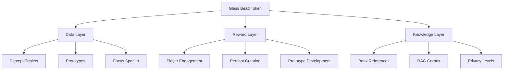
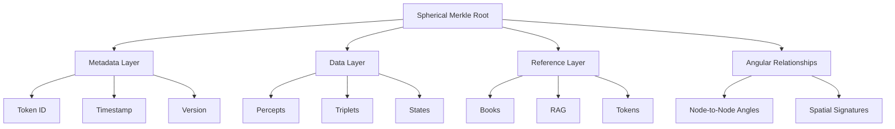
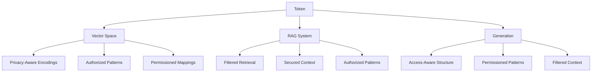

# 2.16. Glass Bead Tokens (GBTk)

Glass Bead tokens serve as the fundamental data structure and reward system within Memorativa. Each token encapsulates a complete percept-triplet, prototype, or focus space, including its associated metadata, relationships, and temporal states. The tokens are implemented as Solana Program Library (SPL) tokens, enabling verifiable ownership, transfer, and evolution tracking.

## Core structure

### Metadata layer
- Token identifier
- Creation timestamp
- Version history
- Privacy settings
- Owner information
- Access permissions
- Merkle root reference
- Temporal state markers (mundane, quantum, holographic)
- Active lens configurations
- Focus parameters
- Attribution data

### Data layer
- Percept-triplet encodings in hybrid spherical-hyperbolic space
- Prototype structures with spatial coordinates
- Focus space configurations
- Angular relationships (aspects)
- Spatial indices for efficient retrieval
- Component trees for verification
- Title-description pairs
- MST-translated universal symbols
- Book references and relationships

### Reference layer
- Book references
- RAG corpus links
- Related token pointers
- External resource links
- Version lineage
- Fork history
- Attribution chains
- Permission inheritance paths

## Spatial encoding

```rust
struct GlassBeadSpatial {
    // Hybrid geometry coordinates
    coordinates: HybridTriplet,  
    // Cached aspect relationships
    aspect_cache: HashMap<BeadId, AspectRelation>,
    // Spatial index for retrieval
    spatial_index: HybridSpatialIndex,
    // Lens-specific transformations
    lens_transforms: HashMap<LensType, LensTransform>
}

impl GlassBeadSpatial {
    fn update_spatial_relations(&mut self, other_beads: &[GlassBead]) {
        for bead in other_beads {
            let angle = hybrid_aspect_angle(&self.coordinates, &bead.coordinates);
            if is_significant_hybrid_aspect(angle, self.coordinates.curvature) {
                let relation = AspectRelation::new(angle);
                self.aspect_cache.insert(bead.id, relation);
            }
        }
        
        self.spatial_index.update(self.coordinates);
    }
    
    fn apply_lens_transform(&mut self, lens_type: LensType) -> HybridTriplet {
        if let Some(transform) = self.lens_transforms.get(&lens_type) {
            // Apply lens-specific coordinate transformation
            let transformed = transform.apply(&self.coordinates);
            
            // Create spherical Merkle node for this transformation
            let node = SphericalMerkleNode::new();
            
            // Set coordinate data
            node.coordinate_data = [
                transformed.theta,
                transformed.phi,
                transformed.radius,
                transformed.curvature
            ];
            
            // Return transformed coordinates
            transformed
        } else {
            // Return original coordinates if no lens transform exists
            self.coordinates.clone()
        }
    }
    
    fn update_lens_relations(&mut self, lens_type: LensType, other_lens_types: &[LensType]) {
        let transformed = self.apply_lens_transform(lens_type);
        
        // Update angular relationships with other lenses
        for other_type in other_lens_types {
            if *other_type == lens_type {
                continue;
            }
            
            let other_transformed = self.apply_lens_transform(*other_type);
            
            // Calculate angular relationship in hybrid space
            let angle = hybrid_angle(&transformed, &other_transformed);
            
            // Store relationship if significant
            if is_significant_hybrid_aspect(angle, transformed.curvature) {
                // Get or create lens transform
                let transform = self.lens_transforms
                    .entry(lens_type)
                    .or_insert_with(|| LensTransform::new(lens_type));
                
                // Update angular relationship
                let other_id = LensNodeId::from(*other_type);
                transform.angular_relationships.insert(other_id, angle);
                
                // Update spherical Merkle node
                transform.update_merkle_node();
            }
        }
    }
    
    fn generate_lens_merkle_proof(&self, lens_type: LensType) -> SphericalMerkleProof {
        if let Some(transform) = self.lens_transforms.get(&lens_type) {
            // Generate proof for this lens transform
            return transform.generate_merkle_proof();
        }
        
        // Return empty proof if lens not found
        SphericalMerkleProof::empty()
    }
}

struct LensTransform {
    lens_type: LensType,
    // Transformation parameters
    rotation: [f32; 3],
    scale: f32,
    offset: [f32; 3],
    curvature_modifier: f32,
    // Angular relationships to other lenses
    angular_relationships: HashMap<LensNodeId, Angle>,
    // Merkle node for verification
    merkle_node: SphericalMerkleNode
}

impl LensTransform {
    fn new(lens_type: LensType) -> Self {
        Self {
            lens_type,
            rotation: [0.0, 0.0, 0.0],
            scale: 1.0,
            offset: [0.0, 0.0, 0.0],
            curvature_modifier: 0.0,
            angular_relationships: HashMap::new(),
            merkle_node: SphericalMerkleNode::new()
        }
    }
    
    fn apply(&self, coords: &HybridTriplet) -> HybridTriplet {
        // Apply transformation to coordinates
        let mut transformed = coords.clone();
        
        // Apply rotation
        transformed.theta += self.rotation[0];
        transformed.phi += self.rotation[1];
        
        // Apply scale
        transformed.radius *= self.scale;
        
        // Apply curvature modification
        transformed.curvature += self.curvature_modifier;
        
        transformed
    }
    
    fn update_merkle_node(&mut self) {
        // Update node data
        self.merkle_node.data = serialize_transform_data(self);
        
        // Update coordinate data
        self.merkle_node.coordinate_data = [
            self.rotation[0],
            self.rotation[1],
            self.scale,
            self.curvature_modifier
        ];
        
        // Update angular relationships
        for (id, angle) in &self.angular_relationships {
            self.merkle_node.angular_relationships.insert(id.to_node_id(), *angle);
        }
        
        // Recalculate hash
        self.merkle_node.hash = self.merkle_node.calculate_hash();
    }
    
    fn generate_merkle_proof(&self) -> SphericalMerkleProof {
        // Generate spherical Merkle proof for this transform
        SphericalMerkleProof {
            merkle_path: generate_merkle_path(&self.merkle_node),
            coordinate_data: vec![self.merkle_node.coordinate_data],
            angular_relationships: self.angular_relationships
                .iter()
                .map(|(id, angle)| (id.to_node_id(), *angle))
                .collect()
        }
    }
}
```

The spatial encoding system integrates with the lens system through:

1. **Lens-specific transforms**: Each lens applies a unique transformation to the token's coordinates
2. **Angular relationship tracking**: Angular relationships between lenses are preserved through spherical Merkle nodes
3. **Verification proofs**: Lens transformations can be verified using spherical Merkle proofs
4. **Hybrid geometry awareness**: The system adapts to both spherical and hyperbolic regions based on curvature

This integration enables:
- Multiple symbolic interpretations of the same data
- Preservation of spatial relationships across different lens views
- Verifiable transformations through spherical Merkle proofs
- Dynamic adaptation to different conceptual geometries

## Temporal integration

Each token maintains three temporal states:

```rust
struct TemporalStates {
    mundane: Option<DateTime>,    // Concrete timestamps
    quantum: QuantumState,        // Indeterminate/conceptual time
    holographic: Option<ChartRef>, // Reference chart alignment
    
    // Track state transitions
    state_history: Vec<StateTransition>,
    // Cache temporal relationships
    temporal_cache: LRUCache<BeadId, TemporalRelation>
}

impl TemporalStates {
    fn calculate_temporal_weight(&self) -> f32 {
        match self {
            Some(mundane) => compute_mundane_weight(mundane),
            None => self.quantum.get_conceptual_weight()
        }
    }
    
    fn update_temporal_state(&mut self, new_state: TemporalState) {
        // Record transition
        self.state_history.push(StateTransition::new(
            self.current_state(),
            new_state
        ));
        
        // Update state
        match new_state {
            TemporalState::Mundane(dt) => self.mundane = Some(dt),
            TemporalState::Quantum(qs) => self.quantum = qs,
            TemporalState::Holographic(cr) => self.holographic = Some(cr)
        }
        
        // Invalidate cached relations
        self.temporal_cache.clear();
    }
}
```

## Privacy and access control

```rust
enum PrivacyLevel {
    Private,    // Owner only
    NotShared,  // AI training allowed
    Public,     // Full system access
    Shared(Vec<Pubkey>) // Specific users
}

struct AccessControl {
    privacy: PrivacyLevel,
    owner: Pubkey,
    readers: Vec<Pubkey>,
    encryption: Option<Pubkey>,
    // Track permission changes
    permission_history: Vec<PermissionChange>,
    // Inherited permissions
    parent_permissions: Option<Box<AccessControl>>
}

impl AccessControl {
    fn can_access(&self, user: &Pubkey) -> bool {
        match &self.privacy {
            PrivacyLevel::Private => *user == self.owner,
            PrivacyLevel::NotShared => *user == self.owner,
            PrivacyLevel::Public => true,
            PrivacyLevel::Shared(users) => users.contains(user)
        }
    }
    
    fn update_permissions(&mut self, new_privacy: PrivacyLevel) {
        self.permission_history.push(PermissionChange::new(
            self.privacy.clone(),
            new_privacy.clone()
        ));
        self.privacy = new_privacy;
    }
}
```

## Version control

The token implements hierarchical Spherical Merkle trees for efficient versioning with lens support:

```rust
struct VersionControl {
    component_trees: HashMap<ComponentType, SphericalMerkleTree>,
    delta_proofs: Vec<DeltaProof>,
    version_map: BTreeMap<u64, VersionMetadata>,
    importance_metrics: ImportanceMetrics,
    // Track lens configurations
    lens_versions: HashMap<LensType, Vec<LensVersion>>,
    // Book relationships
    book_references: Vec<BookReference>
}

impl VersionControl {
    fn create_delta(&mut self, changes: &[Change]) -> DeltaProof {
        let previous = self.current_root();
        let modified = self.apply_changes(changes);
        
        // Create proof
        let proof = DeltaProof {
            previous_root: previous,
            new_elements: modified,
            operations: changes.to_ops(),
            angular_changes: extract_angular_changes(changes)
        };
        
        // Update version metadata
        self.version_map.insert(
            self.next_version(),
            VersionMetadata::new(&proof)
        );
        
        proof
    }
    
    fn update_lens_version(&mut self, lens_type: LensType, lens_transform: &LensTransform) -> LensVersionDelta {
        // Get current lens version
        let current_version = self
            .lens_versions
            .entry(lens_type)
            .or_insert_with(Vec::new)
            .last()
            .cloned();
        
        // Create new lens version
        let new_version = LensVersion {
            lens_type,
            transform: lens_transform.clone(),
            timestamp: current_timestamp(),
            version: self.next_lens_version(lens_type),
            spherical_node: lens_transform.merkle_node.clone()
        };
        
        // Calculate delta between versions
        let delta = match current_version {
            Some(current) => calculate_lens_version_delta(&current, &new_version),
            None => LensVersionDelta::new_full(&new_version)
        };
        
        // Store new version
        self.lens_versions
            .get_mut(&lens_type)
            .unwrap()
            .push(new_version);
        
        // Update component tree for this lens
        self.update_lens_component_tree(lens_type, &delta);
        
        delta
    }
    
    fn update_lens_component_tree(&mut self, lens_type: LensType, delta: &LensVersionDelta) {
        // Get component tree for lens components
        let component_type = ComponentType::Lens(lens_type);
        let tree = self.component_trees
            .entry(component_type)
            .or_insert_with(|| SphericalMerkleTree::new());
        
        // Update tree with lens delta
        for change in &delta.changes {
            match change {
                LensChange::TransformUpdate(data) => {
                    tree.update_node(
                        NodePath::from("transform"),
                        data.clone()
                    );
                },
                LensChange::AngularRelationshipAdd(id, angle) => {
                    tree.add_angular_relationship(
                        NodePath::from("relationships"),
                        *id,
                        *angle
                    );
                },
                LensChange::AngularRelationshipRemove(id) => {
                    tree.remove_angular_relationship(
                        NodePath::from("relationships"),
                        *id
                    );
                },
                LensChange::CoordinateUpdate(coords) => {
                    tree.update_coordinates(
                        NodePath::from("coordinates"),
                        coords.clone()
                    );
                }
            }
        }
        
        // Recalculate tree root
        tree.recalculate_root();
    }
    
    fn generate_lens_version_proof(&self, lens_type: LensType, version: Option<u64>) -> SphericalMerkleProof {
        // Get component tree for lens components
        let component_type = ComponentType::Lens(lens_type);
        
        if let Some(tree) = self.component_trees.get(&component_type) {
            // Get lens version
            let version_number = version.unwrap_or_else(|| self.latest_lens_version(lens_type));
            
            // Generate proof for this version
            return tree.generate_spherical_proof(
                NodePath::from(format!("version_{}", version_number))
            );
        }
        
        // Return empty proof if lens or version not found
        SphericalMerkleProof::empty()
    }
    
    fn latest_lens_version(&self, lens_type: LensType) -> u64 {
        self.lens_versions
            .get(&lens_type)
            .map(|versions| versions.len() as u64)
            .unwrap_or(0)
    }
    
    fn next_lens_version(&self, lens_type: LensType) -> u64 {
        self.latest_lens_version(lens_type) + 1
    }
}

struct LensVersion {
    lens_type: LensType,
    transform: LensTransform,
    timestamp: Timestamp,
    version: u64,
    spherical_node: SphericalMerkleNode
}

struct LensVersionDelta {
    lens_type: LensType,
    from_version: Option<u64>,
    to_version: u64,
    changes: Vec<LensChange>,
    angular_changes: Vec<(NodeId, Angle)>
}

enum LensChange {
    TransformUpdate(Vec<u8>),
    AngularRelationshipAdd(NodeId, Angle),
    AngularRelationshipRemove(NodeId),
    CoordinateUpdate([f32; 4])
}

impl LensVersionDelta {
    fn new_full(version: &LensVersion) -> Self {
        // Create full delta for new lens version
        let mut changes = Vec::new();
        let mut angular_changes = Vec::new();
        
        // Add transform data
        changes.push(LensChange::TransformUpdate(
            serialize_transform_data(&version.transform)
        ));
        
        // Add coordinates
        changes.push(LensChange::CoordinateUpdate(
            version.spherical_node.coordinate_data
        ));
        
        // Add all angular relationships
        for (id, angle) in &version.transform.angular_relationships {
            let node_id = id.to_node_id();
            changes.push(LensChange::AngularRelationshipAdd(node_id, *angle));
            angular_changes.push((node_id, *angle));
        }
        
        Self {
            lens_type: version.lens_type,
            from_version: None,
            to_version: version.version,
            changes,
            angular_changes
        }
    }
}
```

The spherical-enhanced version control provides:

1. **Angular-aware delta tracking**: Captures changes to both hierarchical structure and angular relationships
2. **Lens version history**: Maintains complete history of lens transformations
3. **Efficient proofs**: Generates compact proofs for lens versions
4. **Hybrid verification**: Validates both data integrity and spatial relationships
5. **Angular relationship preservation**: Ensures lens relationships are maintained across versions

## RAG integration 

Tokens integrate with the RAG system through:

```rust
struct RAGInterface {
    vector_store: VectorDB,
    retrieval_index: HybridSpatialIndex,
    privacy_filter: PrivacyAwareRetriever,
    // Track usage in RAG system
    usage_metrics: RAGMetrics,
    // Cache common retrievals
    retrieval_cache: LRUCache<QueryHash, Vec<TokenRef>>
}

impl RAGInterface {
    fn retrieve_context(&self, query: &HybridTriplet) -> Vec<TokenRef> {
        // Check cache
        if let Some(cached) = self.retrieval_cache.get(&query.hash()) {
            return cached.clone();
        }
        
        // Query both spaces
        let spatial_matches = self.retrieval_index
            .query_neighbors(query)
            .filter(|t| self.privacy_filter.can_access(t));
            
        let vectors = self.vector_store
            .lookup_embeddings(spatial_matches);
            
        // Rank and cache results
        let results = rank_by_relevance(vectors, query);
        self.retrieval_cache.insert(query.hash(), results.clone());
        
        results
    }
}
```



## Token structure

### Metadata layer
- Token identifier
- Creation timestamp
- Version history
- Privacy settings
- Owner information
- Access permissions
- Optimized Merkle root reference 

### Data Layer
- Percept-triplet encodings with optimized vector storage 
- Prototype structures with quantized representations 
- Focus space configurations
- Temporal state markers
- Lens configurations 
- MST translations
- Component trees for efficient verification

### Reference layer
- Book references
- RAG corpus links
- Related token pointers
- External resource links
- Version lineage
- Fork history

## Merkle tree implementation

Glass Bead tokens use Spherical Merkle trees to:
- Track structural changes
- Verify data integrity
- Manage token evolution
- Enable efficient proofs
- Support partial updates
- Maintain version history
- Preserve angular relationships in curved space



### Spherical Merkle Implementation

```rust
struct SphericalMerkleNode {
    data: Vec<u8>,
    children: Vec<NodeId>,
    angular_relationships: HashMap<NodeId, Angle>,
    coordinate_data: [f32; 4],  // [θ, φ, r, κ] coordinates
    hash: [u8; 32],
}

impl SphericalMerkleNode {
    fn calculate_hash(&self) -> [u8; 32] {
        // Include data, relationships, and coordinates in hash
        let data_hash = hash_data(&self.data);
        
        // Sort relationships for deterministic hashing
        let mut relationships = self.angular_relationships
            .iter()
            .map(|(k, v)| (*k, *v))
            .collect::<Vec<(NodeId, Angle)>>();
        relationships.sort_by_key(|(id, _)| *id);
        
        let angle_hash = hash_data(&relationships);
        let coord_hash = hash_data(&self.coordinate_data);
        
        hash_combine_multiple(&[data_hash, angle_hash, coord_hash])
    }
}
```

## Lens system integration

Glass Bead tokens integrate the lens system with spherical Merkle trees to enable multiple symbolic interpretations while preserving spatial relationships:

```rust
struct LensIntegration {
    // Active lenses applied to token
    active_lenses: HashMap<LensType, LensState>,
    
    // Lens-specific spatial transformations
    lens_transforms: HashMap<LensType, HybridCoordinates>,
    
    // Angular relationships between lenses
    lens_relationships: HashMap<(LensType, LensType), Angle>,
    
    // Spherical Merkle nodes for each lens
    lens_merkle_nodes: HashMap<LensType, SphericalMerkleNode>,
    
    // Verification cache
    verification_cache: LRUCache<LensType, VerificationResult>
}

impl LensIntegration {
    fn apply_lens(&mut self, lens_type: LensType, token_data: &TokenData) -> LensOutput {
        // Get or create lens state
        let lens_state = self.active_lenses
            .entry(lens_type)
            .or_insert_with(|| LensState::new(lens_type));
            
        // Apply lens transformation
        let output = lens_state.transform(token_data);
        
        // Update spherical Merkle node
        self.update_lens_merkle_node(lens_type, &output);
        
        // Update angular relationships with other lenses
        self.update_lens_relationships(lens_type);
        
        output
    }
    
    fn update_lens_merkle_node(&mut self, lens_type: LensType, output: &LensOutput) {
        let node = self.lens_merkle_nodes
            .entry(lens_type)
            .or_insert_with(|| SphericalMerkleNode::new());
            
        // Update node data
        node.data = serialize_lens_output(output);
        
        // Update coordinates based on lens transform
        if let Some(coords) = self.lens_transforms.get(&lens_type) {
            node.coordinate_data = [
                coords.theta,
                coords.phi,
                coords.radius,
                coords.kappa
            ];
        }
        
        // Recalculate hash
        node.hash = node.calculate_hash();
    }
    
    fn update_lens_relationships(&mut self, lens_type: LensType) {
        // Update angular relationships between this lens and others
        for other_type in self.active_lenses.keys() {
            if *other_type == lens_type {
                continue;
            }
            
            // Calculate angular relationship
            let angle = self.calculate_lens_angle(lens_type, *other_type);
            
            // Store relationship
            self.lens_relationships.insert((lens_type, *other_type), angle);
            
            // Update Merkle nodes with relationship
            if let Some(node) = self.lens_merkle_nodes.get_mut(&lens_type) {
                let other_id = NodeId::from(*other_type);
                node.angular_relationships.insert(other_id, angle);
                node.hash = node.calculate_hash();
            }
        }
    }
    
    fn calculate_lens_angle(&self, lens1: LensType, lens2: LensType) -> Angle {
        // Get coordinate transforms for both lenses
        if let (Some(coords1), Some(coords2)) = (
            self.lens_transforms.get(&lens1),
            self.lens_transforms.get(&lens2)
        ) {
            // Calculate angular relationship in hybrid space
            return calculate_hybrid_angle(coords1, coords2);
        }
        
        // Default angle if coordinates not available
        Angle::default()
    }
    
    fn verify_lens(&self, lens_type: LensType, root_hash: [u8; 32]) -> VerificationResult {
        // Check cache first
        if let Some(result) = self.verification_cache.get(&lens_type) {
            return result.clone();
        }
        
        // Generate proof for lens
        let proof = self.generate_lens_merkle_proof(lens_type);
        
        // Verify with hybrid verifier
        let verifier = HybridVerifier::new();
        let result = verifier.verify(proof, root_hash);
        
        // Cache result
        self.verification_cache.insert(lens_type, result.clone());
        
        result
    }
}
```

The integration enables:

1. **Multi-lens interpretation**: Apply different symbolic systems to the same data
2. **Angular preservation**: Maintain spatial relationships between lenses
3. **Verification**: Validate lens transformations with spherical Merkle proofs
4. **Hybrid geometry**: Support both hierarchical (hyperbolic) and symbolic (spherical) relationships
5. **Lens evolution**: Track changes to lens configurations and transformations

## Privacy levels

Each Glass Bead token supports multiple privacy settings:

1. **Private**
   - Only accessible to owner
   - Not included in RAG corpus
   - No external references

2. **Not Shared**
   - Owner accessible
   - Used for AI training
   - No public visibility

3. **Public**
   - Full system access
   - RAG corpus inclusion
   - Community visible

4. **Shared**
   - Specific user access
   - Controlled visibility
   - Collaborative features

## Token evolution

Glass Bead tokens can evolve through:

1. **Version Updates**
   - Metadata changes
   - Structure refinements
   - Reference updates
   - Privacy adjustments

2. **Forking**
   - Independent copies
   - Separate ownership
   - Divergent development
   - Optional remerging

3. **Merging**
   - Combine token structures
   - Integrate metadata
   - Resolve conflicts
   - Preserve history

## Implementation architecture

### Token structure
```rust
struct GlassBeadMetadata {
    // Core SPL token fields
    mint: Pubkey,
    owner: Pubkey,
    
    // Access control fields  
    privacy_level: PrivacyLevel,
    authorized_readers: Vec<Pubkey>,
    encryption_pubkey: Option<Pubkey>,
    merkle_root: [u8; 32],
}

enum PrivacyLevel {
    Private,
    NotShared, 
    Public,
    Shared(Vec<Pubkey>) // List of authorized accounts
}
```

### Access control system
- **On-Chain Controls**: Managed through SPL token capabilities
- **Off-Chain Encryption**: 
  - Private/NotShared: Content encrypted with owner's public key
  - Shared: Content encrypted with shared symmetric key
  - Public: Unencrypted content
  - All levels: Merkle proofs verify content integrity

### Cross-chain interoperability
```rust
pub trait SpvVerification {
    // Verify token exists on source chain
    fn verify_token(proof: MerkleProof) -> Result<bool>;
    
    // Verify token ownership
    fn verify_owner(proof: MerkleProof, owner: Pubkey) -> Result<bool>;
    
    // Verify access rights
    fn verify_access(proof: MerkleProof, reader: Pubkey) -> Result<bool>;
}
```

The cross-chain verification system:
- Uses block headers for lightweight verification
- Maintains minimal state for cross-chain awareness
- Supports bilateral verification with other chains
- Preserves privacy levels across chains

## Integration with LLMs

Glass Bead tokens enable LLM integration through:

1. **Vector Encoding**
   - Percept-triplet vectorization with privacy-aware masking
   - Prototype pattern encoding respecting access controls
   - Focus space mapping with permission boundaries
   - Temporal state representation with encrypted states

2. **RAG Enhancement**
   - Token-based retrieval filtered by access rights
   - Context enrichment within privacy constraints
   - Pattern recognition across authorized tokens
   - Symbolic analysis with privacy preservation

3. **Generation Support**
   - Structure-aware outputs respecting privacy levels
   - Pattern-based generation with access control
   - Context-sensitive responses filtered by permissions
   - Symbolic grounding with encrypted references

This token architecture creates a robust foundation for:
- Verifiable knowledge ownership
- Structured data evolution
- Collaborative development
- AI-enhanced analysis
- Privacy-aware sharing
- System-wide integration



## Key points

- Tokens combine game mechanics with semantic storage using SPL standard
- Hybrid spherical-hyperbolic spatial encoding for conceptual relationships
- Triple temporal state system (mundane, quantum, holographic) with state tracking
- Hierarchical Merkle trees with delta proofs for versioning
- Privacy-aware RAG integration with spatial retrieval and caching
- Self-balancing spatial organization with aspect caching
- Lens system integration for multiple symbolic interpretations
- Book reference tracking and relationship management
- Attribution and permission inheritance systems
- Comprehensive version control with lens configuration tracking
- Fundamental data structure encapsulating percepts, prototypes, and focus spaces
- Multi-layer architecture with metadata, data, and reference layers
- Efficient caching systems for aspects, temporal relations, and retrievals
- Robust permission model with inheritance and history tracking
- Complete integration with MST for universal symbolic translation

## Hybrid verification for lens systems

The Glass Bead token provides robust verification for lens systems using spherical Merkle trees:

```rust
struct HybridLensVerifier {
    merkle_verifier: MerkleVerifier,
    spatial_verifier: SpatialVerifier,
}

impl HybridLensVerifier {
    fn verify_lens(&self, 
                  lens_type: LensType, 
                  proof: SphericalMerkleProof, 
                  root_hash: Hash) -> VerificationResult {
        // Verify merkle structure (hierarchical integrity)
        let merkle_valid = self.merkle_verifier.verify(
            proof.merkle_components, 
            root_hash
        );
        
        // Verify lens spatial relationships (angular integrity)
        let spatial_valid = self.spatial_verifier.verify_angular_consistency(
            proof.coordinate_data,
            proof.angular_relationships
        );
        
        // Check for curvature consistency
        let curvature_valid = self.spatial_verifier.verify_curvature_consistency(
            proof.curvature_fields
        );
        
        VerificationResult {
            valid: merkle_valid && spatial_valid && curvature_valid,
            hierarchical_integrity: merkle_valid,
            spatial_integrity: spatial_valid,
            curvature_integrity: curvature_valid
        }
    }
    
    fn verify_multiple_lenses(&self, 
                             lens_proofs: HashMap<LensType, SphericalMerkleProof>,
                             root_hash: Hash) -> HashMap<LensType, VerificationResult> {
        let mut results = HashMap::new();
        
        // Verify each lens proof individually
        for (lens_type, proof) in lens_proofs {
            results.insert(
                lens_type,
                self.verify_lens(lens_type, proof, root_hash)
            );
        }
        
        // Verify cross-lens angular relationships
        self.verify_cross_lens_relationships(&lens_proofs, &mut results);
        
        results
    }
    
    fn verify_cross_lens_relationships(&self,
                                      lens_proofs: &HashMap<LensType, SphericalMerkleProof>,
                                      results: &mut HashMap<LensType, VerificationResult>) {
        // Extract all angular relationships
        let mut angular_relationships = HashMap::new();
        for (lens_type, proof) in lens_proofs {
            for (node_id, angle) in &proof.angular_relationships {
                angular_relationships.insert(
                    (*lens_type, node_id_to_lens_type(*node_id)),
                    *angle
                );
            }
        }
        
        // Check for consistency in angular relationships
        for ((lens1, lens2), angle) in &angular_relationships {
            // Look for the reverse relationship
            if let Some(reverse_angle) = angular_relationships.get(&(*lens2, *lens1)) {
                // Check if angles are complementary
                let is_consistent = is_complementary_angle(*angle, *reverse_angle);
                
                // Update verification results
                if let Some(result) = results.get_mut(lens1) {
                    result.relationship_consistency &= is_consistent;
                    result.valid &= is_consistent;
                }
                
                if let Some(result) = results.get_mut(lens2) {
                    result.relationship_consistency &= is_consistent;
                    result.valid &= is_consistent;
                }
            }
        }
    }
}

struct SpatialVerifier {
    // Maximum allowed angular deviation
    angle_tolerance: f32,
    // Maximum allowed curvature deviation
    curvature_tolerance: f32,
}

impl SpatialVerifier {
    fn verify_angular_consistency(&self, 
                                coordinates: &[[f32; 4]], 
                                relationships: &[(NodeId, Angle)]) -> bool {
        // Build coordinate lookup
        let coord_map = coordinates.iter()
            .enumerate()
            .map(|(i, coords)| (i as NodeId, *coords))
            .collect::<HashMap<NodeId, [f32; 4]>>();
        
        // Verify each relationship
        for (node_id, claimed_angle) in relationships {
            if let (Some(coord1), Some(coord2)) = (
                coord_map.get(&0), // Reference node
                coord_map.get(node_id)
            ) {
                // Calculate expected angle
                let expected_angle = calculate_angle_between_coordinates(coord1, coord2);
                
                // Check if within tolerance
                if !is_angle_within_tolerance(expected_angle, *claimed_angle, self.angle_tolerance) {
                    return false;
                }
            } else {
                // Missing coordinates
                return false;
            }
        }
        
        true
    }
    
    fn verify_curvature_consistency(&self, curvature_fields: &[CurvatureField]) -> bool {
        // Skip if no curvature fields
        if curvature_fields.is_empty() {
            return true;
        }
        
        // Check for consistency in overlapping regions
        for i in 0..curvature_fields.len() {
            for j in (i+1)..curvature_fields.len() {
                let field1 = &curvature_fields[i];
                let field2 = &curvature_fields[j];
                
                // Check for overlap
                if fields_overlap(field1, field2) {
                    // Check curvature consistency in overlap
                    if !is_curvature_consistent(field1, field2, self.curvature_tolerance) {
                        return false;
                    }
                }
            }
        }
        
        true
    }
}

struct VerificationResult {
    valid: bool,
    hierarchical_integrity: bool,
    spatial_integrity: bool,
    curvature_integrity: bool,
    relationship_consistency: bool,
}
```

The hybrid verification system enables:

1. **Complete integrity validation**: Verify both data content and spatial relationships
2. **Cross-lens consistency**: Ensure angular relationships between lenses are consistent
3. **Curvature validation**: Verify that curvature fields are consistent across overlapping regions
4. **Granular verification status**: Get detailed feedback on which aspects of verification passed or failed
5. **Efficient batch verification**: Verify multiple lenses in a single operation

This verification system is critical for:
- Ensuring lens transformations are applied correctly
- Validating that angular relationships between lenses are preserved
- Confirming that spherical Merkle trees maintain both hierarchical and spatial integrity
- Detecting tampering or corruption in lens configurations
