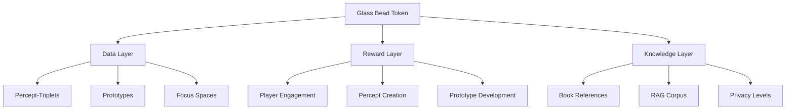
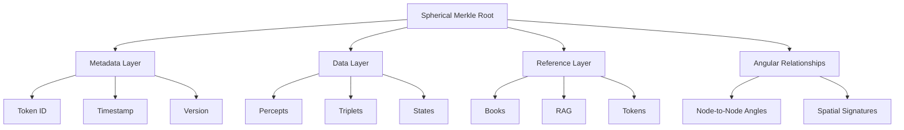
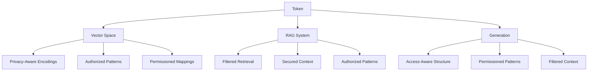

# 2.16. Glass Bead Tokens (GBTk)

Glass Bead tokens serve as the fundamental data structure and reward system within Memorativa. Each token encapsulates a complete percept-triplet, prototype, or focus space, including its associated metadata, relationships, and temporal states. The tokens are implemented as Solana Program Library (SPL) tokens, enabling verifiable ownership, transfer, and evolution tracking.

## Core structure

### Metadata layer
- Token identifier
- Creation timestamp
- Version history
- Privacy settings
- Owner information
- Access permissions
- Merkle root reference
- Temporal state markers (mundane, quantum, holographic)
- Active lens configurations
- Focus parameters
- Attribution data

### Data layer
- Percept-triplet encodings in hybrid spherical-hyperbolic space
- Prototype structures with spatial coordinates
- Focus space configurations
- Angular relationships (aspects)
- Spatial indices for efficient retrieval
- Component trees for verification
- Title-description pairs
- MST-translated universal symbols
- Book references and relationships

### Reference layer
- Book references
- RAG corpus links
- Related token pointers
- External resource links
- Version lineage
- Fork history
- Attribution chains
- Permission inheritance paths

## Spatial encoding

Glass Bead tokens utilize a hybrid spherical-hyperbolic geometry to encode percept-triplets, as defined in section 2.4. This coordinate system consists of four key components:

- **θ (theta)**: Archetypal angle (0 to 2π) representing the Planet-Sign relationship
- **φ (phi)**: Expression elevation (-π/2 to π/2) derived from Sign-House interaction
- **r (radius)**: Mundane magnitude (0 to 1) based on House significance
- **κ (kappa)**: Curvature parameter that smoothly transitions between hyperbolic geometry (κ > 0) and spherical geometry (κ < 0)

```rust
struct GlassBeadSpatial {
    // Hybrid geometry coordinates
    coordinates: HybridTriplet,  
    // Cached aspect relationships
    aspect_cache: HashMap<BeadId, AspectRelation>,
    // Spatial index for retrieval
    spatial_index: HybridSpatialIndex,
    // Lens-specific transformations
    lens_transforms: HashMap<LensType, LensTransform>,
    // Observer reference point for geocentric orientation
    observer: Observer
}

// The core HybridTriplet structure matching section 2.4 definition
struct HybridTriplet {
    theta: f32,      // Archetypal angle (0.0-2π)
    phi: f32,        // Expression elevation (-π/2-π/2) 
    radius: f32,     // Mundane magnitude (0.0-1.0)
    curvature: f32,  // Geometry parameter (κ)
}

// Enhanced implementation with explicit mapping to percept-triplet vectors
struct HybridTriplet {
    // Archetypal vector components (Planet-Sign relationship)
    theta: f32,      // Archetypal angle (0.0-2π) - encodes the primary symbolic direction
    
    // Expression vector components (Sign-House interaction)
    phi: f32,        // Expression elevation (-π/2-π/2) - encodes the mode of manifestation
    
    // Mundane vector component (House significance)
    radius: f32,     // Mundane magnitude (0.0-1.0) - encodes the concrete manifestation strength
    
    // Geometry parameter for space curvature
    curvature: f32,  // Controls transition between hyperbolic (κ > 0) and spherical (κ < 0) geometries
}

impl HybridTriplet {
    // Convert from conceptual percept-triplet vectors to coordinate representation
    fn from_percept_vectors(archetype: ArchetypalVector, expression: ExpressionVector, mundane: MundaneVector) -> Self {
        Self {
            // Archetypal vector mapped to angular position (Planet-Sign)
            theta: archetype.symbolic_angle(),
            
            // Expression vector mapped to elevation (Sign-House)
            phi: expression.manifestation_elevation(),
            
            // Mundane vector mapped to radius (House significance)
            radius: mundane.concrete_magnitude(),
            
            // Derive curvature from the symbolic density of the concept space
            curvature: calculate_curvature(archetype, expression, mundane)
        }
    }
    
    // Extract the conceptual percept-triplet vectors from coordinates
    fn to_percept_vectors(&self) -> (ArchetypalVector, ExpressionVector, MundaneVector) {
        // Convert theta back to archetypal vector (Planet-Sign relationship)
        let archetype = ArchetypalVector::from_angle(self.theta);
        
        // Convert phi back to expression vector (Sign-House interaction)
        let expression = ExpressionVector::from_elevation(self.phi);
        
        // Convert radius back to mundane vector (House significance)
        let mundane = MundaneVector::from_magnitude(self.radius);
        
        (archetype, expression, mundane)
    }
    
    // Calculate archetypal vector component directly
    fn archetypal_vector(&self) -> ArchetypalVector {
        ArchetypalVector::from_angle(self.theta)
    }
    
    // Calculate expression vector component directly
    fn expression_vector(&self) -> ExpressionVector {
        ExpressionVector::from_elevation(self.phi)
    }
    
    // Calculate mundane vector component directly
    fn mundane_vector(&self) -> MundaneVector {
        MundaneVector::from_magnitude(self.radius)
    }
    
    // Calculate angular relationship in conceptual space
    fn angular_relationship(&self, other: &HybridTriplet) -> f32 {
        let (self_archetype, self_expression, _) = self.to_percept_vectors();
        let (other_archetype, other_expression, _) = other.to_percept_vectors();
        
        // Calculate angular difference between archetypal components (symbolic)
        let archetypal_angle = self_archetype.angular_distance(&other_archetype);
        
        // Calculate angular difference between expression components (manifestation)
        let expression_angle = self_expression.angular_distance(&other_expression);
        
        // Combine angles with curvature-aware weighting
        let curvature_factor = (self.curvature + other.curvature) / 2.0;
        weighted_angular_combination(archetypal_angle, expression_angle, curvature_factor)
    }
}

// Helper types that map to section 2.4 conceptual vectors
struct ArchetypalVector {
    planet_component: f32,  // Primary archetype influence
    sign_component: f32,    // Secondary archetype modulation
}

impl ArchetypalVector {
    fn symbolic_angle(&self) -> f32 {
        // Convert Planet-Sign relationship to angular position (0-2π)
        // This matches the θ parameter in section 2.4
        atan2(self.sign_component, self.planet_component)
    }
    
    fn from_angle(theta: f32) -> Self {
        // Convert from angular position back to Planet-Sign components
        Self {
            planet_component: cos(theta),
            sign_component: sin(theta)
        }
    }
    
    fn angular_distance(&self, other: &Self) -> f32 {
        // Calculate smallest angle between two archetypal vectors
        let angle1 = self.symbolic_angle();
        let angle2 = other.symbolic_angle();
        
        // Handle circular angle differences
        let diff = (angle1 - angle2).abs() % (2.0 * PI);
        min(diff, 2.0 * PI - diff)
    }
}

struct ExpressionVector {
    sign_component: f32,     // Expression mode influence
    house_component: f32,    // Expression context modulation
}

impl ExpressionVector {
    fn manifestation_elevation(&self) -> f32 {
        // Convert Sign-House interaction to elevation angle (-π/2 to π/2)
        // This matches the φ parameter in section 2.4
        atan2(self.house_component, self.sign_component)
    }
    
    fn from_elevation(phi: f32) -> Self {
        // Convert from elevation angle back to Sign-House components
        Self {
            sign_component: cos(phi),
            house_component: sin(phi)
        }
    }
    
    fn angular_distance(&self, other: &Self) -> f32 {
        // Calculate angle between two expression vectors
        let elev1 = self.manifestation_elevation();
        let elev2 = other.manifestation_elevation();
        
        // Simple angle difference (elevation is bounded)
        (elev1 - elev2).abs()
    }
}

struct MundaneVector {
    house_significance: f32,  // Concrete manifestation strength
}

impl MundaneVector {
    fn concrete_magnitude(&self) -> f32 {
        // Map House significance to radius (0.0-1.0)
        // This matches the r parameter in section 2.4
        self.house_significance
    }
    
    fn from_magnitude(radius: f32) -> Self {
        // Convert from radius back to House significance
        Self {
            house_significance: radius
        }
    }
}

// Helper functions for integration with section 2.4 mathematical model
fn calculate_curvature(archetype: &ArchetypalVector, expression: &ExpressionVector, mundane: &MundaneVector) -> f32 {
    // Calculate curvature based on symbolic density
    // This follows the κ parameter definition in section 2.4
    let symbolic_intensity = vector_magnitude(archetype);
    let expression_intensity = vector_magnitude(expression);
    let mundane_intensity = mundane.concrete_magnitude();
    
    // Positive κ for hyperbolic regions (high symbolic density)
    // Negative κ for spherical regions (high mundane density)
    let symbolic_factor = symbolic_intensity * expression_intensity;
    let mundane_factor = mundane_intensity * mundane_intensity;
    
    // Returns κ value matching section 2.4 definition
    symbolic_factor - mundane_factor
}

impl GlassBeadSpatial {
    fn update_spatial_relations(&mut self, other_beads: &[GlassBead]) {
        for bead in other_beads {
            // Calculate angular relationship based on percept-triplet vectors
            // from observer's perspective (geocentric calculation)
            let angle = self.calculate_geocentric_angle(&bead.coordinates);
            
            if is_significant_hybrid_aspect(angle, self.coordinates.curvature) {
                let relation = AspectRelation::new(angle);
                self.aspect_cache.insert(bead.id, relation);
            }
        }
        
        self.spatial_index.update(self.coordinates);
    }
    
    // New method for calculating angular relationships from observer perspective
    fn calculate_geocentric_angle(&self, other_coordinates: &HybridTriplet) -> f32 {
        // Convert both triplets to vectors relative to observer position
        let self_vec = self.to_observer_relative_vector();
        let other_vec = HybridTriplet::to_observer_relative_vector(other_coordinates, &self.observer);
        
        // Calculate angular relationship from observer perspective
        // using the formula: θ = arccos[(v₁ · v₂) / (|v₁| · |v₂|)]
        let dot_product = self_vec.dot(&other_vec);
        let magnitudes_product = self_vec.magnitude() * other_vec.magnitude();
        
        if magnitudes_product > 0.0 {
            (dot_product / magnitudes_product).acos()
        } else {
            0.0 // Default to 0 if vectors have zero magnitude
        }
    }
    
    // New method to convert coordinates to observer-relative vector
    fn to_observer_relative_vector(&self) -> Vector3D {
        HybridTriplet::to_observer_relative_vector(&self.coordinates, &self.observer)
    }
    
    fn apply_lens_transform(&mut self, lens_type: LensType) -> HybridTriplet {
        if let Some(transform) = self.lens_transforms.get(&lens_type) {
            // Apply lens-specific coordinate transformation by first converting
            // to percept vectors, then transforming those vectors, then converting back
            
            // Extract percept-triplet vectors (now observer-relative)
            let (archetype, expression, mundane) = self.coordinates.to_observer_relative_percept_vectors(&self.observer);
            
            // Apply lens transformation to each vector
            let transformed_archetype = transform.transform_archetypal(&archetype);
            let transformed_expression = transform.transform_expression(&expression);
            let transformed_mundane = transform.transform_mundane(&mundane);
            
            // Reconstruct HybridTriplet from transformed percept vectors
            let transformed = HybridTriplet::from_observer_relative_percept_vectors(
                transformed_archetype,
                transformed_expression,
                transformed_mundane,
                &self.observer
            );
            
            // Create spherical Merkle node for this transformation
            let node = SphericalMerkleNode::new();
            
            // Set coordinate data following standard θ, φ, r, κ pattern
            node.coordinate_data = [
                transformed.theta,       // Archetypal angle (θ)
                transformed.phi,         // Expression elevation (φ)
                transformed.radius,      // Mundane magnitude (r)
                transformed.curvature    // Curvature parameter (κ)
            ];
            
            // Return transformed coordinates
            transformed
        } else {
            // Return original coordinates if no lens transform exists
            self.coordinates.clone()
        }
    }
    
    fn update_lens_relations(&mut self, lens_type: LensType, other_lens_types: &[LensType]) {
        let transformed = self.apply_lens_transform(lens_type);
        
        // Update angular relationships with other lenses
        for other_type in other_lens_types {
            if *other_type == lens_type {
                continue;
            }
            
            let other_transformed = self.apply_lens_transform(*other_type);
            
            // Calculate angular relationship in hybrid space based on observer perspective
            let angle = self.calculate_geocentric_angle(&other_transformed);
            
            // Store relationship if significant
            if is_significant_hybrid_aspect(angle, transformed.curvature) {
                // Get or create lens transform
                let transform = self.lens_transforms
                    .entry(lens_type)
                    .or_insert_with(|| LensTransform::new(lens_type));
                
                // Update angular relationship
                let other_id = LensNodeId::from(*other_type);
                transform.angular_relationships.insert(other_id, angle);
                
                // Update spherical Merkle node
                transform.update_merkle_node();
            }
        }
    }
    
    fn generate_lens_merkle_proof(&self, lens_type: LensType) -> SphericalMerkleProof {
        if let Some(transform) = self.lens_transforms.get(&lens_type) {
            // Generate proof for this lens transform
            return transform.generate_merkle_proof();
        }
        
        // Return empty proof if lens not found
        SphericalMerkleProof::empty()
    }
}

struct LensTransform {
    lens_type: LensType,
    // Transformation parameters
    rotation: [f32; 3],
    scale: f32,
    offset: [f32; 3],
    curvature_modifier: f32,
    // Angular relationships to other lenses
    angular_relationships: HashMap<LensNodeId, Angle>,
    // Merkle node for verification
    merkle_node: SphericalMerkleNode
}

impl LensTransform {
    fn new(lens_type: LensType) -> Self {
        Self {
            lens_type,
            rotation: [0.0, 0.0, 0.0],
            scale: 1.0,
            offset: [0.0, 0.0, 0.0],
            curvature_modifier: 0.0,
            angular_relationships: HashMap::new(),
            merkle_node: SphericalMerkleNode::new()
        }
    }
    
    // New method to transform the archetypal vector
    fn transform_archetypal(&self, archetype: &ArchetypalVector) -> ArchetypalVector {
        // Extract components
        let mut planet = archetype.planet_component;
        let mut sign = archetype.sign_component;
        
        // Apply rotation to archetypal plane (affects theta angle)
        let theta = atan2(sign, planet);
        let rotated_theta = theta + self.rotation[0];
        
        // Convert back to components
        planet = cos(rotated_theta);
        sign = sin(rotated_theta);
        
        // Apply scaling if needed
        let scale_factor = self.scale.powf(0.5); // Square root for area preservation
        planet *= scale_factor;
        sign *= scale_factor;
        
        // Return transformed vector
        ArchetypalVector {
            planet_component: planet,
            sign_component: sign
        }
    }
    
    // New method to transform the expression vector
    fn transform_expression(&self, expression: &ExpressionVector) -> ExpressionVector {
        // Extract components
        let mut sign = expression.sign_component;
        let mut house = expression.house_component;
        
        // Apply rotation to expression plane (affects phi angle)
        let phi = atan2(house, sign);
        let rotated_phi = phi + self.rotation[1];
        
        // Convert back to components
        sign = cos(rotated_phi);
        house = sin(rotated_phi);
        
        // Apply scaling if needed
        let scale_factor = self.scale.powf(0.5); // Square root for area preservation
        sign *= scale_factor;
        house *= scale_factor;
        
        // Return transformed vector
        ExpressionVector {
            sign_component: sign,
            house_component: house
        }
    }
    
    // New method to transform the mundane vector
    fn transform_mundane(&self, mundane: &MundaneVector) -> MundaneVector {
        // Apply radius scaling directly
        let scaled_significance = mundane.house_significance * self.scale;
        
        // Return transformed vector
        MundaneVector {
            house_significance: scaled_significance
        }
    }
    
    // Updated to maintain compatibility with enhanced HybridTriplet
    fn apply(&self, coords: &HybridTriplet) -> HybridTriplet {
        // Extract percept vectors
        let (archetype, expression, mundane) = coords.to_percept_vectors();
        
        // Apply transformation to each vector
        let transformed_archetype = self.transform_archetypal(&archetype);
        let transformed_expression = self.transform_expression(&expression);
        let transformed_mundane = self.transform_mundane(&mundane);
        
        // Reconstruct with modified curvature
        let mut transformed = HybridTriplet::from_percept_vectors(
            transformed_archetype,
            transformed_expression,
            transformed_mundane
        );
        
        // Apply curvature modification
        transformed.curvature += self.curvature_modifier;
        
        transformed
    }
    
    fn update_merkle_node(&mut self) {
        // Update node data
        self.merkle_node.data = serialize_transform_data(self);
        
        // Update coordinate data - match θ, φ, r, κ pattern
        self.merkle_node.coordinate_data = [
            self.rotation[0],    // theta (θ) modification
            self.rotation[1],    // phi (φ) modification
            self.scale,          // radius (r) scaling
            self.curvature_modifier  // curvature (κ) adjustment
        ];
        
        // Update angular relationships
        for (id, angle) in &self.angular_relationships {
            self.merkle_node.angular_relationships.insert(id.to_node_id(), *angle);
        }
        
        // Recalculate hash
        self.merkle_node.hash = self.merkle_node.calculate_hash();
    }
    
    fn generate_merkle_proof(&self) -> SphericalMerkleProof {
        // Generate spherical Merkle proof for this transform
        SphericalMerkleProof {
            merkle_path: generate_merkle_path(&self.merkle_node),
            coordinate_data: vec![self.merkle_node.coordinate_data],
            angular_relationships: self.angular_relationships
                .iter()
                .map(|(id, angle)| (id.to_node_id(), *angle))
                .collect()
        }
    }
}

## Merkle Preservation of Spatial Relationships

The Spherical Merkle Tree implementation directly fulfills the spatial preservation requirements outlined in section 2.4 (The Percept-Triplet). By encoding both data content and angular relationships within each node, this structure preserves:

1. **Coordinate Integrity**: The `coordinate_data` field in each `SphericalMerkleNode` stores the essential θ, φ, r, κ coordinates that define the percept-triplet's position in hybrid space
2. **Angular Relationships**: Beyond traditional hierarchical Merkle trees, the `angular_relationships` HashMap maintains the critical symbolic connections between nodes
3. **Verification Proofs**: The `SphericalMerkleProof` structure enables verification of both data content and spatial relationships
4. **Geometric Validation**: The combination of `hash_data` and angular calculations ensures both structural integrity and geometric consistency

```rust
struct SphericalMerkleNode {
    data: Vec<u8>,
    children: Vec<NodeId>,
    angular_relationships: HashMap<NodeId, Angle>,
    coordinate_data: [f32; 4],  // Stores θ, φ, r, κ from HybridTriplet
    hash: [u8; 32],
    // Add observer reference
    observer_position: Option<[f32; 3]>,
    observer_orientation: Option<[f32; 9]>
}

impl SphericalMerkleNode {
    fn calculate_hash(&self) -> [u8; 32] {
        // Include data, relationships, coordinates, and observer data in hash calculation
        let data_hash = hash_data(&self.data);
        
        // Sort angular relationships for deterministic hashing
        let mut relationships = self.angular_relationships
            .iter()
            .map(|(k, v)| (*k, *v))
            .collect::<Vec<(NodeId, Angle)>>();
        relationships.sort_by_key(|(id, _)| *id);
        
        // Generate coordinate hash preserving spatial position
        let coord_hash = hash_data(&self.coordinate_data);
        
        // Generate hash from angular relationships
        let angle_hash = hash_data(&relationships);
        
        // Generate hash from observer data if present
        let observer_hash = match (&self.observer_position, &self.observer_orientation) {
            (Some(pos), Some(orient)) => {
                let mut observer_data = Vec::with_capacity(12);
                observer_data.extend_from_slice(pos);
                observer_data.extend_from_slice(orient);
                hash_data(&observer_data)
            },
            _ => [0u8; 32]
        };
        
        // Combine hashes to create a single hash that preserves both
        // hierarchical structure, spatial relationships, and observer context
        hash_combine_multiple(&[data_hash, angle_hash, coord_hash, observer_hash])
    }
}
```

This implementation extends beyond traditional Merkle trees by incorporating angular preservation, ensuring that the symbolic relationships between percept-triplets (as defined by their Planet-Sign-House components in section 2.4) remain verifiable and tamper-evident throughout the system.

The spatial encoding system integrates with the lens system through:

1. **Lens-specific transforms**: Each lens applies a unique transformation to the token's coordinates
2. **Angular relationship tracking**: Angular relationships between lenses are preserved through spherical Merkle nodes
3. **Verification proofs**: Lens transformations can be verified using spherical Merkle proofs
4. **Hybrid geometry**: The system adapts to both spherical and hyperbolic regions based on curvature

This integration enables:
- Multiple symbolic interpretations of the same data
- Preservation of spatial relationships across different lens views
- Verifiable transformations through spherical Merkle proofs
- Dynamic adaptation to different conceptual geometries

## Temporal integration

Each token maintains three temporal states:

```rust
struct TemporalStates {
    mundane: Option<DateTime>,    // Concrete timestamps
    quantum: QuantumState,        // Indeterminate/conceptual time
    holographic: Option<ChartRef>, // Reference chart alignment
    
    // Track state transitions
    state_history: Vec<StateTransition>,
    // Cache temporal relationships
    temporal_cache: LRUCache<BeadId, TemporalRelation>
}

impl TemporalStates {
    fn calculate_temporal_weight(&self) -> f32 {
        match self {
            Some(mundane) => compute_mundane_weight(mundane),
            None => self.quantum.get_conceptual_weight()
        }
    }
    
    fn update_temporal_state(&mut self, new_state: TemporalState) {
        // Record transition
        self.state_history.push(StateTransition::new(
            self.current_state(),
            new_state
        ));
        
        // Update state
        match new_state {
            TemporalState::Mundane(dt) => self.mundane = Some(dt),
            TemporalState::Quantum(qs) => self.quantum = qs,
            TemporalState::Holographic(cr) => self.holographic = Some(cr)
        }
        
        // Invalidate cached relations
        self.temporal_cache.clear();
    }
}
```

## Privacy and access control

```rust
enum PrivacyLevel {
    Private,    // Owner only
    NotShared,  // AI training allowed
    Public,     // Full system access
    Shared(Vec<Pubkey>) // Specific users
}

struct AccessControl {
    privacy: PrivacyLevel,
    owner: Pubkey,
    readers: Vec<Pubkey>,
    encryption: Option<Pubkey>,
    // Track permission changes
    permission_history: Vec<PermissionChange>,
    // Inherited permissions
    parent_permissions: Option<Box<AccessControl>>
}

impl AccessControl {
    fn can_access(&self, user: &Pubkey) -> bool {
        match &self.privacy {
            PrivacyLevel::Private => *user == self.owner,
            PrivacyLevel::NotShared => *user == self.owner,
            PrivacyLevel::Public => true,
            PrivacyLevel::Shared(users) => users.contains(user)
        }
    }
    
    fn update_permissions(&mut self, new_privacy: PrivacyLevel) {
        self.permission_history.push(PermissionChange::new(
            self.privacy.clone(),
            new_privacy.clone()
        ));
        self.privacy = new_privacy;
    }
}
```

## Version control

The token implements hierarchical Spherical Merkle trees for efficient versioning with lens support:

```rust
struct VersionControl {
    component_trees: HashMap<ComponentType, SphericalMerkleTree>,
    delta_proofs: Vec<DeltaProof>,
    version_map: BTreeMap<u64, VersionMetadata>,
    importance_metrics: ImportanceMetrics,
    // Track lens configurations
    lens_versions: HashMap<LensType, Vec<LensVersion>>,
    // Book relationships
    book_references: Vec<BookReference>
}

impl VersionControl {
    fn create_delta(&mut self, changes: &[Change]) -> DeltaProof {
        let previous = self.current_root();
        let modified = self.apply_changes(changes);
        
        // Create proof
        let proof = DeltaProof {
            previous_root: previous,
            new_elements: modified,
            operations: changes.to_ops(),
            angular_changes: extract_angular_changes(changes)
        };
        
        // Update version metadata
        self.version_map.insert(
            self.next_version(),
            VersionMetadata::new(&proof)
        );
        
        proof
    }
    
    fn update_lens_version(&mut self, lens_type: LensType, lens_transform: &LensTransform) -> LensVersionDelta {
        // Get current lens version
        let current_version = self
            .lens_versions
            .entry(lens_type)
            .or_insert_with(Vec::new)
            .last()
            .cloned();
        
        // Create new lens version
        let new_version = LensVersion {
            lens_type,
            transform: lens_transform.clone(),
            timestamp: current_timestamp(),
            version: self.next_lens_version(lens_type),
            spherical_node: lens_transform.merkle_node.clone()
        };
        
        // Calculate delta between versions
        let delta = match current_version {
            Some(current) => calculate_lens_version_delta(&current, &new_version),
            None => LensVersionDelta::new_full(&new_version)
        };
        
        // Store new version
        self.lens_versions
            .get_mut(&lens_type)
            .unwrap()
            .push(new_version);
        
        // Update component tree for this lens
        self.update_lens_component_tree(lens_type, &delta);
        
        delta
    }
    
    fn update_lens_component_tree(&mut self, lens_type: LensType, delta: &LensVersionDelta) {
        // Get component tree for lens components
        let component_type = ComponentType::Lens(lens_type);
        let tree = self.component_trees
            .entry(component_type)
            .or_insert_with(|| SphericalMerkleTree::new());
        
        // Update tree with lens delta
        for change in &delta.changes {
            match change {
                LensChange::TransformUpdate(data) => {
                    tree.update_node(
                        NodePath::from("transform"),
                        data.clone()
                    );
                },
                LensChange::AngularRelationshipAdd(id, angle) => {
                    tree.add_angular_relationship(
                        NodePath::from("relationships"),
                        *id,
                        *angle
                    );
                },
                LensChange::AngularRelationshipRemove(id) => {
                    tree.remove_angular_relationship(
                        NodePath::from("relationships"),
                        *id
                    );
                },
                LensChange::CoordinateUpdate(coords) => {
                    tree.update_coordinates(
                        NodePath::from("coordinates"),
                        coords.clone()
                    );
                }
            }
        }
        
        // Recalculate tree root
        tree.recalculate_root();
    }
    
    fn generate_lens_version_proof(&self, lens_type: LensType, version: Option<u64>) -> SphericalMerkleProof {
        // Get component tree for lens components
        let component_type = ComponentType::Lens(lens_type);
        
        if let Some(tree) = self.component_trees.get(&component_type) {
            // Get lens version
            let version_number = version.unwrap_or_else(|| self.latest_lens_version(lens_type));
            
            // Generate proof for this version
            return tree.generate_spherical_proof(
                NodePath::from(format!("version_{}", version_number))
            );
        }
        
        // Return empty proof if lens or version not found
        SphericalMerkleProof::empty()
    }
    
    fn latest_lens_version(&self, lens_type: LensType) -> u64 {
        self.lens_versions
            .get(&lens_type)
            .map(|versions| versions.len() as u64)
            .unwrap_or(0)
    }
    
    fn next_lens_version(&self, lens_type: LensType) -> u64 {
        self.latest_lens_version(lens_type) + 1
    }
}

struct LensVersion {
    lens_type: LensType,
    transform: LensTransform,
    timestamp: Timestamp,
    version: u64,
    spherical_node: SphericalMerkleNode
}

struct LensVersionDelta {
    lens_type: LensType,
    from_version: Option<u64>,
    to_version: u64,
    changes: Vec<LensChange>,
    angular_changes: Vec<(NodeId, Angle)>
}

enum LensChange {
    TransformUpdate(Vec<u8>),
    AngularRelationshipAdd(NodeId, Angle),
    AngularRelationshipRemove(NodeId),
    CoordinateUpdate([f32; 4])
}

impl LensVersionDelta {
    fn new_full(version: &LensVersion) -> Self {
        // Create full delta for new lens version
        let mut changes = Vec::new();
        let mut angular_changes = Vec::new();
        
        // Add transform data
        changes.push(LensChange::TransformUpdate(
            serialize_transform_data(&version.transform)
        ));
        
        // Add coordinates
        changes.push(LensChange::CoordinateUpdate(
            version.spherical_node.coordinate_data
        ));
        
        // Add all angular relationships
        for (id, angle) in &version.transform.angular_relationships {
            let node_id = id.to_node_id();
            changes.push(LensChange::AngularRelationshipAdd(node_id, *angle));
            angular_changes.push((node_id, *angle));
        }
        
        Self {
            lens_type: version.lens_type,
            from_version: None,
            to_version: version.version,
            changes,
            angular_changes
        }
    }
}
```

The spherical-enhanced version control provides:

1. **Angular-aware delta tracking**: Captures changes to both hierarchical structure and angular relationships
2. **Lens version history**: Maintains complete history of lens transformations
3. **Efficient proofs**: Generates compact proofs for lens versions
4. **Hybrid verification**: Validates both data integrity and spatial relationships
5. **Angular relationship preservation**: Ensures lens relationships are maintained across versions

## RAG integration 

Tokens integrate with the RAG system through:

```rust
struct RAGInterface {
    vector_store: VectorDB,
    retrieval_index: HybridSpatialIndex,
    privacy_filter: PrivacyAwareRetriever,
    // Track usage in RAG system
    usage_metrics: RAGMetrics,
    // Cache common retrievals
    retrieval_cache: LRUCache<QueryHash, Vec<TokenRef>>
}

impl RAGInterface {
    fn retrieve_context(&self, query: &HybridTriplet) -> Vec<TokenRef> {
        // Check cache
        if let Some(cached) = self.retrieval_cache.get(&query.hash()) {
            return cached.clone();
        }
        
        // Query both spaces
        let spatial_matches = self.retrieval_index
            .query_neighbors(query)
            .filter(|t| self.privacy_filter.can_access(t));
            
        let vectors = self.vector_store
            .lookup_embeddings(spatial_matches);
            
        // Rank and cache results
        let results = rank_by_relevance(vectors, query);
        self.retrieval_cache.insert(query.hash(), results.clone());
        
        results
    }
}
```



## Token structure

### Metadata layer
- Token identifier
- Creation timestamp
- Version history
- Privacy settings
- Owner information
- Access permissions
- Optimized Merkle root reference 

### Data Layer
- Percept-triplet encodings in hybrid spherical-hyperbolic space
- Prototype structures with spatial coordinates
- Focus space configurations
- Angular relationships (aspects)
- Spatial indices for efficient retrieval
- Component trees for verification
- MST translation components:
  - Culturally-neutral title-description pairs
  - Symbolic correspondence mappings
  - Cultural equivalents across traditions
  - Translation confidence metrics
  - Bidirectional archetype mappings
- Book references and relationships

### Reference layer
- Book references
- RAG corpus links
- Related token pointers
- External resource links
- Version lineage
- Fork history

## MST Integration

The Glass Bead token integrates with the Memorativa Symbolic Translator (MST) described in section 2.5, storing both the original percept-triplet and its culturally-neutral symbolic translation:

```rust
struct MSTTranslation {
    // Culturally-neutral output from MST
    title: String,
    description: String,
    
    // Translation metadata
    confidence_score: f32,
    cultural_references: Vec<CulturalReference>,
    validation_score: f32,
    
    // Correspondence mappings used
    archetype_mappings: HashMap<String, Vec<String>>,  // Planet to archetypal concepts
    expression_mappings: HashMap<String, Vec<String>>, // Sign to expression modes
    context_mappings: HashMap<String, Vec<String>>,    // House to domains
    
    // Cross-cultural equivalent symbols
    cultural_equivalents: HashMap<String, Vec<CulturalSymbol>>,
    
    // Merkle proof for translation verification
    translation_proof: SphericalMerkleProof
}

impl MSTTranslation {
    // Generate a new MST translation from percept-triplet
    fn from_percept_triplet(triplet: &HybridTriplet, mst: &MST) -> Self {
        // Extract vectors from triplet
        let (archetype, expression, mundane) = triplet.to_percept_vectors();
        
        // Perform MST translation process (as described in section 2.5)
        let translation = mst.translate(&archetype, &expression, &mundane);
        
        // Store correspondence tables used in translation
        let archetype_mappings = mst.lookup_correspondence_tables(
            "planetary_archetypes", 
            archetype.planet_component
        );
        
        let expression_mappings = mst.lookup_correspondence_tables(
            "sign_expressions", 
            expression.sign_component
        );
        
        let context_mappings = mst.lookup_correspondence_tables(
            "house_domains", 
            mundane.house_significance
        );
        
        // Generate cultural equivalents
        let cultural_equivalents = mst.find_cultural_equivalents(&translation);
        
        // Calculate confidence and validation scores
        let confidence_score = mst.calculate_correspondence_confidence(&translation);
        let validation_score = mst.validate_across_cultures(&translation);
        
        // Create proof for verification
        let translation_proof = mst.generate_translation_proof(&translation);
        
        Self {
            title: translation.title,
            description: translation.description,
            confidence_score,
            cultural_references: translation.cultural_references,
            validation_score,
            archetype_mappings,
            expression_mappings,
            context_mappings,
            cultural_equivalents,
            translation_proof
        }
    }
    
    // Verify translation integrity and correspondence to original
    fn verify_translation(&self, original_triplet: &HybridTriplet) -> bool {
        // Extract vectors from original triplet
        let (archetype, expression, mundane) = original_triplet.to_percept_vectors();
        
        // Verify that the translation preserves the original relationships
        let preserved_relationships = self.verify_relationship_preservation(
            &archetype, &expression, &mundane
        );
        
        // Verify cultural neutralization was properly applied
        let culturally_neutral = self.verify_cultural_neutrality();
        
        // Verify merkle proof integrity
        let proof_valid = verify_translation_proof(&self.translation_proof);
        
        preserved_relationships && culturally_neutral && proof_valid
    }
    
    // Verify that the translation preserves the archetypal, expression, and contextual
    // relationships from the original percept-triplet
    fn verify_relationship_preservation(
        &self, 
        archetype: &ArchetypalVector,
        expression: &ExpressionVector,
        mundane: &MundaneVector
    ) -> bool {
        // Implementation follows the math from section 2.5:
        // C(t) = (f(t) · α + r(t) · β) / (α + β)
        
        // Check if primary archetypal mapping preserves original relationship
        let archetype_preserved = verify_archetype_preservation(
            archetype, 
            &self.archetype_mappings
        );
        
        // Check if expression mapping preserves original relationship
        let expression_preserved = verify_expression_preservation(
            expression, 
            &self.expression_mappings
        );
        
        // Check if context mapping preserves original relationship
        let context_preserved = verify_context_preservation(
            mundane, 
            &self.context_mappings
        );
        
        archetype_preserved && expression_preserved && context_preserved
    }
    
    // Verify that the translation is culturally neutral as required by MST
    fn verify_cultural_neutrality(&self) -> bool {
        // Implementation follows the cultural neutralization function from section 2.5:
        // N(c) = ∑(w_i · T_i(c)) - λ · A(c)
        
        // Check title for astrological terms
        let title_neutral = !contains_astrological_terms(&self.title);
        
        // Check description for astrological terms
        let description_neutral = !contains_astrological_terms(&self.description);
        
        // Verify cultural references diversity (minimum 3 per section 2.5)
        let diverse_references = self.cultural_references.len() >= 3;
        
        title_neutral && description_neutral && diverse_references
    }
}

// Cultural reference stored with translation
struct CulturalReference {
    tradition: String,
    symbol: String,
    relevance_score: f32
}

// Cross-cultural symbol with equivalence information
struct CulturalSymbol {
    symbol: String,
    tradition: String,
    cultural_context: String,
    equivalence_confidence: f32
}

// Functions for verification
fn verify_translation_proof(proof: &SphericalMerkleProof) -> bool {
    // Verify that the translation proof is valid
    // using spherical merkle verification
    
    let verifier = SphericalMerkleVerifier::new();
    verifier.verify_proof(proof)
}

fn verify_archetype_preservation(
    archetype: &ArchetypalVector,
    mappings: &HashMap<String, Vec<String>>
) -> bool {
    // Verify that the archetype mappings preserve
    // the original archetypal relationship
    
    // Extract primary planet component
    let planet = archetype.primary_planet();
    
    // Check if mapping exists
    if let Some(archetypes) = mappings.get(&planet) {
        // Verify that primary archetype aligns with planet
        archetypes.contains(&expected_archetype_for_planet(&planet))
    } else {
        false
    }
}

// Similar implementations for expression and context preservation

## Merkle tree implementation

Glass Bead tokens use Spherical Merkle trees to:
- Track structural changes
- Verify data integrity
- Manage token evolution
- Enable efficient proofs
- Support partial updates
- Maintain version history
- Preserve angular relationships in curved space



### Spherical Merkle Implementation

The `SphericalMerkleNode` implementation detailed above in the "Merkle Preservation of Spatial Relationships" section is utilized throughout the token structure to provide both hierarchical integrity and spatial relationship preservation.

This implementation allows for:
- Verifiable integrity of token data
- Preservation of angular relationships between token components
- Efficient proofs for token verification
- Support for hybrid geometry (spherical and hyperbolic)

## Lens system integration

The lens system represents an extension to the core percept-triplet model described in section 2.4. While section 2.4 establishes the fundamental coordinate system (θ, φ, r, κ) for encoding archetypal, expressive, and mundane vectors in a hybrid spherical-hyperbolic space, the lens system introduces the capability for multiple interpretations and transformations of these coordinates. This extension allows the same percept-triplet to be viewed through different symbolic frameworks while maintaining the integrity of the spatial relationships defined in the base model.

For the detailed implementation of the `LensIntegration` struct, see the "LensIntegration Implementation" section at the end of this document.

The integration enables:

1. **Multi-lens interpretation**: Apply different symbolic systems to the same data
2. **Angular preservation**: Maintain spatial relationships between lenses
3. **Verification**: Validate lens transformations with spherical Merkle proofs
4. **Hybrid geometry**: Support both hierarchical (hyperbolic) and symbolic (spherical) relationships
5. **Lens evolution**: Track changes to lens configurations and transformations

This integration enables:

1. **Multi-lens interpretation**: Apply different symbolic systems to the same data
2. **Angular preservation**: Maintain spatial relationships between lenses
3. **Verification**: Validate lens transformations with spherical Merkle proofs
4. **Hybrid geometry**: Support both hierarchical (hyperbolic) and symbolic (spherical) relationships
5. **Lens evolution**: Track changes to lens configurations and transformations

## Privacy levels

Each Glass Bead token supports multiple privacy settings:

1. **Private**
   - Only accessible to owner
   - Not included in RAG corpus
   - No external references

2. **Not Shared**
   - Owner accessible
   - Used for AI training
   - No public visibility

3. **Public**
   - Full system access
   - RAG corpus inclusion
   - Community visible

4. **Shared**
   - Specific user access
   - Controlled visibility
   - Collaborative features

## Token evolution

Glass Bead tokens can evolve through:

1. **Version Updates**
   - Metadata changes
   - Structure refinements
   - Reference updates
   - Privacy adjustments

2. **Forking**
   - Independent copies
   - Separate ownership
   - Divergent development
   - Optional remerging

3. **Merging**
   - Combine token structures
   - Integrate metadata
   - Resolve conflicts
   - Preserve history

## Implementation architecture

### Token structure
```rust
struct GlassBeadMetadata {
    // Core SPL token fields
    mint: Pubkey,
    owner: Pubkey,
    
    // Access control fields  
    privacy_level: PrivacyLevel,
    authorized_readers: Vec<Pubkey>,
    encryption_pubkey: Option<Pubkey>,
    merkle_root: [u8; 32],
}

enum PrivacyLevel {
    Private,
    NotShared, 
    Public,
    Shared(Vec<Pubkey>) // List of authorized accounts
}
```

### Access control system
- **On-Chain Controls**: Managed through SPL token capabilities
- **Off-Chain Encryption**: 
  - Private/NotShared: Content encrypted with owner's public key
  - Shared: Content encrypted with shared symmetric key
  - Public: Unencrypted content
  - All levels: Merkle proofs verify content integrity

## LensIntegration Implementation

The `LensIntegration` struct is the primary interface for integrating multiple lens systems with Glass Bead tokens. This unified implementation enables the application, transformation, and verification of different symbolic interpretations within the token structure.

```rust
struct LensIntegration {
    // Active lenses applied to token
    active_lenses: HashMap<LensType, LensState>,
    
    // Lens-specific spatial transformations
    lens_transforms: HashMap<LensType, HybridCoordinates>,
    
    // Angular relationships between lenses
    lens_relationships: HashMap<(LensType, LensType), Angle>,
    
    // Spherical Merkle nodes for each lens
    lens_merkle_nodes: HashMap<LensType, SphericalMerkleNode>,
    
    // Verification cache
    verification_cache: LRUCache<LensType, VerificationResult>
}

impl LensIntegration {
    /// Creates a new LensIntegration instance
    fn new() -> Self {
        Self {
            active_lenses: HashMap::new(),
            lens_transforms: HashMap::new(),
            lens_relationships: HashMap::new(),
            lens_merkle_nodes: HashMap::new(),
            verification_cache: LRUCache::new(100) // Cache size of 100 entries
        }
    }
    
    /// Applies a lens transformation to token data
    fn apply_lens(&mut self, lens_type: LensType, token_data: &TokenData) -> LensOutput {
        // Get or create lens state
        let lens_state = self.active_lenses
            .entry(lens_type)
            .or_insert_with(|| LensState::new(lens_type));
            
        // Apply lens transformation
        let output = lens_state.transform(token_data);
        
        // Update spherical Merkle node
        self.update_lens_merkle_node(lens_type, &output);
        
        // Update angular relationships with other lenses
        self.update_lens_relationships(lens_type);
        
        output
    }
    
    /// Updates the Merkle node for a specific lens
    fn update_lens_merkle_node(&mut self, lens_type: LensType, output: &LensOutput) {
        let node = self.lens_merkle_nodes
            .entry(lens_type)
            .or_insert_with(|| SphericalMerkleNode::new());
            
        // Update node data
        node.data = serialize_lens_output(output);
        
        // Update coordinates based on lens transform
        if let Some(coords) = self.lens_transforms.get(&lens_type) {
            node.coordinate_data = [
                coords.theta,
                coords.phi,
                coords.radius,
                coords.kappa
            ];
        }
        
        // Recalculate hash
        node.hash = node.calculate_hash();
    }
    
    /// Updates angular relationships between a lens and all other active lenses
    fn update_lens_relationships(&mut self, lens_type: LensType) {
        // Update angular relationships between this lens and others
        for other_type in self.active_lenses.keys() {
            if *other_type == lens_type {
                continue;
            }
            
            // Calculate angular relationship
            let angle = self.calculate_lens_angle(lens_type, *other_type);
            
            // Store relationship
            self.lens_relationships.insert((lens_type, *other_type), angle);
            
            // Update Merkle nodes with relationship
            if let Some(node) = self.lens_merkle_nodes.get_mut(&lens_type) {
                let other_id = NodeId::from(*other_type);
                node.angular_relationships.insert(other_id, angle);
                node.hash = node.calculate_hash();
            }
        }
    }
    
    /// Calculates the angular relationship between two lenses
    fn calculate_lens_angle(&self, lens1: LensType, lens2: LensType) -> Angle {
        // Get coordinate transforms for both lenses
        if let (Some(coords1), Some(coords2)) = (
            self.lens_transforms.get(&lens1),
            self.lens_transforms.get(&lens2)
        ) {
            // Calculate angular relationship in hybrid space
            return calculate_hybrid_angle(coords1, coords2);
        }
        
        // Default angle if coordinates not available
        Angle::default()
    }
    
    /// Applies a lens transform to hybrid coordinates
    fn apply_lens_transform(&self, lens_type: LensType) -> HybridTriplet {
        // Try to get lens transform
        if let Some(transform) = self.lens_transforms.get(&lens_type) {
            // Create baseline triplet
            let mut transformed = HybridTriplet {
                theta: transform.theta,
                phi: transform.phi,
                radius: transform.radius,
                curvature: transform.kappa,
            };
            
            return transformed;
        }
        
        // Return default if transform not found
        HybridTriplet::default()
    }
    
    /// Generates a Merkle proof for a specific lens
    fn generate_lens_merkle_proof(&self, lens_type: LensType) -> SphericalMerkleProof {
        if let Some(node) = self.lens_merkle_nodes.get(&lens_type) {
            let mut proof = SphericalMerkleProof::new();
            
            // Add node data to proof
            proof.merkle_components = node.generate_proof_components();
            
            // Add coordinate data
            proof.coordinate_data = node.coordinate_data;
            
            // Add angular relationships
            proof.angular_relationships = node.angular_relationships.clone();
            
            // Add curvature fields
            proof.curvature_fields = [node.coordinate_data[3]]; // kappa
            
            return proof;
        }
        
        // Return empty proof if lens not found
        SphericalMerkleProof::empty()
    }
    
    /// Verifies a lens against a root hash
    fn verify_lens(&self, lens_type: LensType, root_hash: [u8; 32]) -> VerificationResult {
        // Check cache first
        if let Some(result) = self.verification_cache.get(&lens_type) {
            return result.clone();
        }
        
        // Generate proof for lens
        let proof = self.generate_lens_merkle_proof(lens_type);
        
        // Verify with hybrid verifier
        let verifier = HybridVerifier::new();
        let result = verifier.verify(proof, root_hash);
        
        // Cache result
        self.verification_cache.insert(lens_type, result.clone());
        
        result
    }
    
    /// Updates the component tree for a lens based on version delta
    fn update_lens_component_tree(&mut self, lens_type: LensType, delta: &LensVersionDelta, component_trees: &mut HashMap<ComponentType, SphericalMerkleTree>) {
        // Get component tree for lens components
        let component_type = ComponentType::Lens(lens_type);
        let tree = component_trees
            .entry(component_type)
            .or_insert_with(|| SphericalMerkleTree::new());
        
        // Update tree with lens delta
        for change in &delta.changes {
            match change {
                LensChange::TransformUpdate(data) => {
                    tree.update_node(
                        NodePath::from("transform"),
                        data.clone()
                    );
                },
                LensChange::AngularRelationshipAdd(id, angle) => {
                    tree.add_angular_relationship(
                        NodePath::from("relationships"),
                        *id,
                        *angle
                    );
                },
                LensChange::AngularRelationshipRemove(id) => {
                    tree.remove_angular_relationship(
                        NodePath::from("relationships"),
                        *id
                    );
                },
                LensChange::CoordinateUpdate(coords) => {
                    tree.update_coordinates(
                        NodePath::from("coordinates"),
                        coords.clone()
                    );
                }
            }
        }
        
        // Recalculate tree root
        tree.recalculate_root();
    }
    
    /// Adds a lens to the integration
    fn add_lens(&mut self, lens_type: LensType, coordinates: HybridCoordinates) {
        // Create lens state
        let lens_state = LensState::new(lens_type);
        self.active_lenses.insert(lens_type, lens_state);
        
        // Store coordinates
        self.lens_transforms.insert(lens_type, coordinates);
        
        // Create empty Merkle node
        let node = SphericalMerkleNode::new();
        self.lens_merkle_nodes.insert(lens_type, node);
        
        // Update relationships with existing lenses
        let lens_types: Vec<LensType> = self.active_lenses.keys()
            .filter(|lt| **lt != lens_type)
            .cloned()
            .collect();
        
        self.update_lens_relationships(lens_type);
    }
    
    /// Removes a lens from the integration
    fn remove_lens(&mut self, lens_type: LensType) {
        // Remove lens state
        self.active_lenses.remove(&lens_type);
        
        // Remove transform
        self.lens_transforms.remove(&lens_type);
        
        // Remove Merkle node
        self.lens_merkle_nodes.remove(&lens_type);
        
        // Remove relationships involving this lens
        self.lens_relationships.retain(|(l1, l2), _| *l1 != lens_type && *l2 != lens_type);
        
        // Clear cache entries for this lens
        self.verification_cache.remove(&lens_type);
    }
    
    /// Gets all active lens types
    fn get_active_lens_types(&self) -> Vec<LensType> {
        self.active_lenses.keys().cloned().collect()
    }
    
    /// Gets the angular relationship between two lenses
    fn get_lens_relationship(&self, lens1: LensType, lens2: LensType) -> Option<Angle> {
        self.lens_relationships.get(&(lens1, lens2)).cloned()
    }
}
```

### Cross-chain interoperability
```rust
pub trait SpvVerification {
    // Verify token exists on source chain
    fn verify_token(proof: MerkleProof) -> Result<bool>;
    
    // Verify token ownership
    fn verify_owner(proof: MerkleProof, owner: Pubkey) -> Result<bool>;
    
    // Verify access rights
    fn verify_access(proof: MerkleProof, reader: Pubkey) -> Result<bool>;
}
```

The cross-chain verification system:
- Uses block headers for lightweight verification
- Maintains minimal state for cross-chain awareness
- Supports bilateral verification with other chains
- Preserves privacy levels across chains

## Integration with LLMs

Glass Bead tokens enable LLM integration through:

1. **Vector Encoding**
   - Percept-triplet vectorization with privacy-aware masking
   - Prototype pattern encoding respecting access controls
   - Focus space mapping with permission boundaries
   - Temporal state representation with encrypted states

2. **RAG Enhancement**
   - Token-based retrieval filtered by access rights
   - Context enrichment within privacy constraints
   - Pattern recognition across authorized tokens
   - Symbolic analysis with privacy preservation

3. **Generation Support**
   - Structure-aware outputs respecting privacy levels
   - Pattern-based generation with access control
   - Context-sensitive responses filtered by permissions
   - Symbolic grounding with encrypted references

This token architecture creates a robust foundation for:
- Verifiable knowledge ownership
- Structured data evolution
- Collaborative development
- AI-enhanced analysis
- Privacy-aware sharing
- System-wide integration


*Figure 1: Glass Bead Token Integration Architecture, showing how tokens connect with vector spaces, RAG systems, and generation components while maintaining privacy boundaries, highlighting the token's role as a central connector in the system*

## Hybrid verification for lens systems

The Glass Bead token provides robust verification for lens systems using spherical Merkle trees:

```rust
struct HybridLensVerifier {
    merkle_verifier: MerkleVerifier,
    spatial_verifier: SpatialVerifier,
}

impl HybridLensVerifier {
    fn verify_lens(&self, 
                  lens_type: LensType, 
                  proof: SphericalMerkleProof, 
                  root_hash: Hash) -> VerificationResult {
        // Verify merkle structure (hierarchical integrity)
        let merkle_valid = self.merkle_verifier.verify(
            proof.merkle_components, 
            root_hash
        );
        
        // Verify lens spatial relationships (angular integrity)
        let spatial_valid = self.spatial_verifier.verify_angular_consistency(
            proof.coordinate_data,
            proof.angular_relationships,
            proof.observer_position, // Include observer context 
            proof.observer_orientation
        );
        
        // Check for curvature consistency
        let curvature_valid = self.spatial_verifier.verify_curvature_consistency(
            proof.curvature_fields
        );
        
        // Verify observer-relative consistency
        let observer_valid = if proof.observer_position.is_some() {
            self.spatial_verifier.verify_observer_consistency(
                proof.coordinate_data,
                proof.angular_relationships,
                proof.observer_position.unwrap(),
                proof.observer_orientation.unwrap_or_else(|| [1.0, 0.0, 0.0, 0.0, 1.0, 0.0, 0.0, 0.0, 1.0])
            )
        } else {
            true // Skip observer verification if no observer data
        };
        
        VerificationResult {
            valid: merkle_valid && spatial_valid && curvature_valid && observer_valid,
            hierarchical_integrity: merkle_valid,
            spatial_integrity: spatial_valid,
            curvature_integrity: curvature_valid,
            observer_integrity: observer_valid
        }
    }
    
    fn verify_multiple_lenses(&self, 
                             lens_proofs: HashMap<LensType, SphericalMerkleProof>,
                             root_hash: Hash) -> HashMap<LensType, VerificationResult> {
        let mut results = HashMap::new();
        
        // Verify each lens proof individually
        for (lens_type, proof) in lens_proofs {
            results.insert(
                lens_type,
                self.verify_lens(lens_type, proof, root_hash)
            );
        }
        
        // Verify cross-lens angular relationships
        self.verify_cross_lens_relationships(&lens_proofs, &mut results);
        
        results
    }
    
    fn verify_cross_lens_relationships(&self,
                                      lens_proofs: &HashMap<LensType, SphericalMerkleProof>,
                                      results: &mut HashMap<LensType, VerificationResult>) {
        // Extract all angular relationships
        let mut angular_relationships = HashMap::new();
        for (lens_type, proof) in lens_proofs {
            for (node_id, angle) in &proof.angular_relationships {
                angular_relationships.insert(
                    (*lens_type, node_id_to_lens_type(*node_id)),
                    *angle
                );
            }
        }
        
        // Check for consistency in angular relationships
        for ((lens1, lens2), angle) in &angular_relationships {
            // Look for the reverse relationship
            if let Some(reverse_angle) = angular_relationships.get(&(*lens2, *lens1)) {
                // Check if angles are complementary
                let is_consistent = is_complementary_angle(*angle, *reverse_angle);
                
                // Update verification results
                if let Some(result) = results.get_mut(lens1) {
                    result.relationship_consistency &= is_consistent;
                    result.valid &= is_consistent;
                }
                
                if let Some(result) = results.get_mut(lens2) {
                    result.relationship_consistency &= is_consistent;
                    result.valid &= is_consistent;
                }
            }
        }
    }
}

struct SpatialVerifier {
    // Maximum allowed angular deviation
    angle_tolerance: f32,
    // Maximum allowed curvature deviation
    curvature_tolerance: f32,
    // Maximum allowed observer-relative angular deviation
    observer_angle_tolerance: f32
}

impl SpatialVerifier {
    fn verify_angular_consistency(&self, 
                                coordinates: &[[f32; 4]], 
                                relationships: &[(NodeId, Angle)]) -> bool {
        // Build coordinate lookup
        let coord_map = coordinates.iter()
            .enumerate()
            .map(|(i, coords)| (i as NodeId, *coords))
            .collect::<HashMap<NodeId, [f32; 4]>>();
        
        // Verify each relationship
        for (node_id, claimed_angle) in relationships {
            if let (Some(coord1), Some(coord2)) = (
                coord_map.get(&0), // Reference node
                coord_map.get(node_id)
            ) {
                // Calculate expected angle
                let expected_angle = calculate_angle_between_coordinates(coord1, coord2);
                
                // Check if within tolerance
                if !is_angle_within_tolerance(expected_angle, *claimed_angle, self.angle_tolerance) {
                    return false;
                }
            } else {
                // Missing coordinates
                return false;
            }
        }
        
        true
    }
    
    fn verify_curvature_consistency(&self, curvature_fields: &[CurvatureField]) -> bool {
        // Skip if no curvature fields
        if curvature_fields.is_empty() {
            return true;
        }
        
        // Check for consistency in overlapping regions
        for i in 0..curvature_fields.len() {
            for j in (i+1)..curvature_fields.len() {
                let field1 = &curvature_fields[i];
                let field2 = &curvature_fields[j];
                
                // Check for overlap
                if fields_overlap(field1, field2) {
                    // Check curvature consistency in overlap
                    if !is_curvature_consistent(field1, field2, self.curvature_tolerance) {
                        return false;
                    }
                }
            }
        }
        
        true
    }
    
    // New method to verify angular relationships from observer perspective
    fn verify_observer_consistency(
        &self,
        coordinates: &[[f32; 4]],
        relationships: &[(NodeId, Angle)],
        observer_position: [f32; 3],
        observer_orientation: [f32; 9]
    ) -> bool {
        // Build coordinate lookup
        let coord_map = coordinates.iter()
            .enumerate()
            .map(|(i, coords)| (i as NodeId, *coords))
            .collect::<HashMap<NodeId, [f32; 4]>>();
        
        // Create observer
        let observer = Observer {
            position: Vector3D::new(
                observer_position[0],
                observer_position[1], 
                observer_position[2]
            ),
            orientation: Matrix3x3 {
                elements: [
                    [observer_orientation[0], observer_orientation[1], observer_orientation[2]],
                    [observer_orientation[3], observer_orientation[4], observer_orientation[5]],
                    [observer_orientation[6], observer_orientation[7], observer_orientation[8]]
                ]
            },
            temporal_state: None
        };
        
        // Verify each relationship from observer perspective
        for (node_id, claimed_angle) in relationships {
            if let (Some(coord1), Some(coord2)) = (
                coord_map.get(&0), // Reference node
                coord_map.get(node_id)
            ) {
                // Create HybridTriplets
                let triplet1 = HybridTriplet {
                    theta: coord1[0],
                    phi: coord1[1],
                    radius: coord1[2],
                    curvature: coord1[3]
                };
                
                let triplet2 = HybridTriplet {
                    theta: coord2[0],
                    phi: coord2[1],
                    radius: coord2[2],
                    curvature: coord2[3]
                };
                
                // Calculate geocentric angle between triplets
                let calculated_angle = triplet1.angular_relationship_from_observer(&triplet2, &observer);
                
                // Verify the angle matches the claimed angle within tolerance
                if (calculated_angle - claimed_angle).abs() > self.observer_angle_tolerance {
                    return false;
                }
            }
        }
        
        true
    }
}

struct VerificationResult {
    valid: bool,
    hierarchical_integrity: bool,
    spatial_integrity: bool,
    curvature_integrity: bool,
    observer_integrity: bool,
}
```

## Operational Costs

Glass Bead Tokens introduce specific computational and memory requirements that must be managed for efficient system performance. This section analyzes the operational costs of token processing and provides optimization strategies.

### Computation Complexity

Token operations have the following computational complexity:

1. **Token Creation and Serialization**: O(n + m) where n is the number of percept-triplet vectors and m is the metadata size
   - Triplet encoding: O(n)
   - Metadata preparation: O(m)
   - Spatial coordinate calculation: O(n)

2. **Merkle Tree Operations**:
   - Tree construction: O(n log n) where n is the number of triplets in the token
   - Proof generation: O(log n)
   - Verification: O(log n)

3. **Spatial Relationship Calculations**:
   - Angular relationship calculation: O(n²) for all percept-triplet pairs
   - Aspect detection: O(n²)
   - Hybrid distance computation: O(n²)

4. **Privacy Operations**:
   - Access control verification: O(p) where p is the number of permission rules
   - Selective disclosure proof: O(log n) where n is the number of triplets
   - Privacy lens application: O(n)

The most computationally intensive operations are angular relationship calculations and aspect detection, especially for tokens with large numbers of triplets.

### Memory Requirements

Memory usage for token processing scales with several key components:

```python
# Memory usage per token
mem_per_token = (
    base_token_overhead +            # Base token structure (typically 2-5KB)
    metadata_memory +                # Metadata layer (varies by attributes)
    percept_triplet_memory * n +     # n triplets (120-200 bytes each)
    aspect_cache_memory +            # Cached aspect relationships (~50 bytes per relationship)
    spatial_index_memory +           # Spatial index structures (~1KB)
    merkle_tree_memory               # Verification tree (~2KB for typical token)
)

# Estimated total for typical token
typical_token_memory = 10KB + (n * 0.2KB) + (r * 0.05KB)
```

For a standard token with 50 triplets and 100 relationships:
- Base token: ~10KB
- Triplet data: ~10KB
- Aspect relationships: ~5KB
- Verification structures: ~2KB
- Total: ~27KB per token

For token book operations with 100 concurrent tokens:
- Base memory: ~2.7MB
- Shared verification structures: ~200KB
- Total: ~2.9MB

### Optimization Strategies

Several token-specific optimization techniques can significantly improve performance:

1. **Lazy calculation** of relationships reduces initialization costs:
   ```rust
   // Only calculate aspects when needed
   fn get_aspect_relationship(&mut self, other_token_id: TokenId) -> AspectRelation {
       if let Some(cached) = self.aspect_cache.get(&other_token_id) {
           return cached.clone();
       }
       
       // Calculate on first request
       let relation = self.calculate_aspect_relationship(other_token_id);
       self.aspect_cache.insert(other_token_id, relation.clone());
       relation
   }
   ```

2. **Spatial indexing** for efficient retrieval:
   ```rust
   // Use spatial index for faster proximity queries
   fn find_nearby_tokens(&self, query_coordinates: &HybridTriplet, radius: f32) -> Vec<TokenId> {
       // Query spatial index instead of linear search
       self.spatial_index.range_query(query_coordinates, radius)
   }
   ```

3. **Pruned Merkle trees** for verification:
   ```rust
   // Generate minimal proof containing only necessary nodes
   fn generate_minimal_proof(&self, selected_indices: &[usize]) -> MerkleProof {
       let mut proof = MerkleProof::new();
       
       // Only include nodes needed for verification
       for index in selected_indices {
           proof.add_verification_path(self.merkle_tree.path_to_root(*index));
       }
       
       proof
   }
   ```

4. **Partial serialization** for reduced network traffic:
   ```rust
   // Only serialize the necessary components based on access level
   fn serialize_for_access_level(&self, access_level: AccessLevel) -> Vec<u8> {
       let mut serialized = Vec::new();
       
       // Always include base metadata
       serialized.extend(self.serialize_base_metadata());
       
       // Include percept data only if appropriate access level
       if access_level >= AccessLevel::ReadPercepts {
           serialized.extend(self.serialize_percept_data());
       }
       
       // Include relationship data only if appropriate access level
       if access_level >= AccessLevel::ReadRelationships {
           serialized.extend(self.serialize_relationship_data());
       }
       
       serialized
   }
   ```

5. **Progressive loading** for large token collections:
   ```rust
   // Load tokens in stages for better responsiveness
   async fn load_token_book(book_id: BookId) -> TokenBook {
       // First load metadata only
       let metadata = load_token_metadata(book_id).await;
       
       // Create book with metadata only
       let mut book = TokenBook::with_metadata(metadata);
       
       // Load tokens progressively in background
       spawn_async(async move {
           // Load most relevant tokens first
           let priority_tokens = load_priority_tokens(book_id).await;
           book.add_tokens(priority_tokens);
           
           // Then load remaining tokens
           let remaining_tokens = load_remaining_tokens(book_id).await;
           book.add_tokens(remaining_tokens);
       });
       
       book
   }
   ```

### Memory Optimization

For better memory efficiency in token processing:

1. **Reference counting** for shared structures:
   ```rust
   // Use Rc/Arc for shared token components
   struct GlassBead {
       id: TokenId,
       metadata: TokenMetadata,
       // Store as reference-counted pointers to enable sharing
       percepts: Arc<PerceptTriplets>,
       relationships: Arc<RelationshipCache>,
       // Other fields...
   }
   ```

2. **Compact encoding** for triplet data:
   ```rust
   // Optimize triplet encoding for memory efficiency
   struct CompactHybridTriplet {
       // 12 bytes total instead of 16 bytes with 4 f32 values
       theta: f32,      // 4 bytes - full precision needed for angular calculations
       phi: f16,        // 2 bytes - reduced precision acceptable
       radius: f16,     // 2 bytes - reduced precision acceptable
       curvature: f32,  // 4 bytes - full precision needed for geometry transitions
   }
   ```

3. **On-demand verification structures**:
   ```rust
   // Only build Merkle tree when verification is needed
   fn verify_integrity(&mut self) -> bool {
       if self.merkle_tree.is_none() {
           self.merkle_tree = Some(self.build_merkle_tree());
       }
       
       self.merkle_tree.as_ref().unwrap().verify()
   }
   ```

### Multi-Token Performance

For operations involving multiple tokens:

1. **Batch processing** for relationship calculations:
   ```rust
   // Calculate multiple relationships in batch
   fn update_relationships(&mut self, other_tokens: &[GlassBead]) {
       // Pre-calculate shared values used in relationship calculation
       let shared_data = self.prepare_relationship_calculation();
       
       // Process in batches for better cache locality
       for token_batch in other_tokens.chunks(64) {
           let batch_results = self.calculate_batch_relationships(token_batch, &shared_data);
           self.update_relationship_cache(batch_results);
       }
   }
   ```

2. **Level-of-detail** management for token collections:
   ```rust
   // Adjust token detail based on importance and interaction frequency
   fn adjust_token_detail_level(&mut self, tokens: &mut [GlassBead], focus_point: &HybridTriplet) {
       // Calculate distance from focus point
       for token in tokens {
           let distance = hybrid_distance(token.coordinates(), focus_point);
           let detail_level = calculate_detail_level(distance);
           token.set_detail_level(detail_level);
       }
   }
   ```

3. **Selective synchronization** for distributed operations:
   ```rust
   // Only synchronize relevant tokens in distributed environments
   fn sync_book(&mut self, remote_book: &TokenBook) {
       // Find tokens that need synchronization
       let tokens_to_sync = self.identify_tokens_needing_sync(remote_book);
       
       // Only fetch those that are needed
       let synced_tokens = remote_book.get_tokens(&tokens_to_sync);
       self.update_tokens(synced_tokens);
   }
   ```

### Token Economics

Glass Bead Token operations consume computational resources according to a relative cost structure:

| Operation | Relative Cost | Rationale |
|-----------|----------|-------------|
| Token Creation | High | Encoding percepts, generating verification structures, and initializing spatial indices |
| Relationship Calculation | Medium-High | Computing angular relationships between tokens across hybrid geometries |
| Book Assembly | Medium | Organizing and linking tokens into coherent book structures |
| Verification | Low-Medium | Checking token integrity and relation consistency |
| Basic Reading | Low | Reading token metadata and basic properties |
| Privacy-Preserving Sharing | Varies | Cost scales with privacy guarantees and selective disclosure complexity |

The token economics model follows these principles:
- **Computation-Based Pricing**: Operations with higher computational requirements cost proportionally more
- **Verification Discounts**: Verified tokens cost less to integrate than unverified ones
- **Reuse Incentives**: Reusing existing tokens reduces costs compared to creating new ones
- **Privacy Premiums**: Higher privacy guarantees increase operational costs
- **Batch Efficiency**: Batch operations cost less per token than individual operations

### Resource Allocation

For optimal token processing performance, resources should be allocated as follows:

1. **CPU resources**:
   - 35% for spatial relationship calculations
   - 30% for verification operations
   - 20% for token manipulation and updates
   - 10% for serialization/deserialization
   - 5% for access control checks

2. **Memory resources**:
   - 40% for token data structures
   - 25% for relationship caches
   - 20% for verification structures
   - 10% for spatial indices
   - 5% for temporary operation buffers

3. **Storage optimization**:
   - 50% for primary token data
   - 25% for verification structures
   - 15% for relationship data
   - 10% for metadata and access control information

This resource allocation ensures the token system can efficiently handle large collections of tokens while maintaining responsive performance for key operations.

## Key points

- Tokens combine game mechanics with semantic storage using SPL standard
- Hybrid spherical-hyperbolic spatial encoding for conceptual relationships
- Triple temporal state system (mundane, quantum, holographic) with state tracking
- Hierarchical Merkle trees with delta proofs for versioning
- Privacy-aware RAG integration with spatial retrieval and caching
- Self-balancing spatial organization with aspect caching
- Lens system integration for multiple symbolic interpretations
- Book reference tracking and relationship management
- Attribution and permission inheritance systems
- Comprehensive version control with lens configuration tracking
- Fundamental data structure encapsulating percepts, prototypes, and focus spaces
- Multi-layer architecture with metadata, data, and reference layers
- Efficient caching systems for aspects, temporal relations, and retrievals
- Robust permission model with inheritance and history tracking
- Complete integration with MST for universal symbolic translation
- Glass Bead tokens represent the fundamental data structure within Memorativa

## Key Math

- **Hybrid Spherical-Hyperbolic Geometry**: The Glass Bead Token spatial encoding utilizes a hybrid geometry described by the parameter set $(\theta, \phi, r, \kappa)$ where $\theta \in [0, 2\pi)$ represents the archetypal angle, $\phi \in [-\pi/2, \pi/2]$ represents the expression elevation, $r \in [0, 1]$ represents the mundane magnitude, and $\kappa \in \mathbb{R}$ represents the curvature parameter [1]

- **Curvature Transition Function**: The transition between hyperbolic and spherical geometry is smoothly modulated by the curvature parameter $\kappa$ according to the formula:
  $g(\kappa) = \begin{cases} 
  \text{hyperbolic geometry}, & \text{if } \kappa > 0 \\
  \text{Euclidean geometry}, & \text{if } \kappa = 0 \\
  \text{spherical geometry}, & \text{if } \kappa < 0
  \end{cases}$ [2]

- **Geodesic Distance Formula**: The distance between two points in the hybrid space depends on the curvature and is calculated as:
  $d(p_1, p_2) = \begin{cases}
  r \cdot \arccos(\sin\phi_1\sin\phi_2 + \cos\phi_1\cos\phi_2\cos(\theta_1-\theta_2)), & \text{if } \kappa < 0 \\
  r \cdot \sqrt{(\theta_1-\theta_2)^2 + (\phi_1-\phi_2)^2}, & \text{if } \kappa = 0 \\
  r \cdot \text{arccosh}(\cosh\rho_1\cosh\rho_2 - \sinh\rho_1\sinh\rho_2\cos(\theta_1-\theta_2)), & \text{if } \kappa > 0
  \end{cases}$
  where $\rho_i = \phi_i \cdot \sqrt{|\kappa|}$ represents the hyperbolic radius [3]

- **Angular Relationship Calculation**: The angular relationship between two Glass Bead coordinates from an observer's perspective is calculated using:
  $\theta_{rel} = \arccos\left(\frac{\vec{v}_1 \cdot \vec{v}_2}{|\vec{v}_1||\vec{v}_2|}\right)$
  where $\vec{v}_i$ are the observer-relative vectors derived from the hybrid coordinates [4]

- **Observer-Relative Transformation**: To transform coordinates to an observer-relative frame, we apply:
  $\vec{v}_{rel} = \mathbf{M}_{obs} \cdot (\vec{v} - \vec{p}_{obs})$
  where $\mathbf{M}_{obs}$ is the observer's orientation matrix and $\vec{p}_{obs}$ is the observer's position vector [5]

- **Lens Transformation Equations**: When applying a lens transform to coordinates, the following equations are used:
  $\theta' = \theta + \omega_\theta$
  $\phi' = \phi + \omega_\phi$
  $r' = r \cdot s$
  $\kappa' = \kappa + \Delta\kappa$
  where $\omega_\theta$ and $\omega_\phi$ are rotation parameters, $s$ is a scaling factor, and $\Delta\kappa$ is a curvature modifier [6]

- **Aspect Significance Test**: An angular relationship is considered a significant aspect if:
  $|\theta_{rel} - \theta_{aspect}| < \epsilon$
  where $\theta_{aspect}$ is a canonical aspect angle (e.g., $0°, 60°, 90°, 120°, 180°$) and $\epsilon$ is a tolerance value that varies with curvature: $\epsilon = \epsilon_0 \cdot (1 + |\kappa|)$ [1]

- **Merkle Tree Angular Consistency**: For a valid Merkle tree with angular relationships, all claimed angles must satisfy:
  $|\theta_{claimed} - \theta_{calculated}| < \tau$
  where $\tau$ is the verification tolerance threshold [2]

- **Proof of Curvature Consistency**: For overlapping curvature fields $F_1$ and $F_2$, consistency requires:
  $|{\kappa}_{F_1}(p) - {\kappa}_{F_2}(p)| < \delta$ for all points $p$ in the intersection of domains $D_{F_1} \cap D_{F_2}$, where $\delta$ is the curvature tolerance [3]

## Key Visual Insights

- The token integration architecture diagram (Figure 1) illustrates the central role of Glass Bead Tokens as connectors between vector spaces, RAG systems, and generation components, emphasizing how they maintain privacy boundaries across all interactions
- The hub-and-spoke pattern in the diagram reveals how tokens facilitate information flow while enforcing access controls at each integration point
- The hierarchical organization of privacy-aware components shows the multi-layered protection system that preserves privacy across all token interactions
- The token's central position in the architecture highlights its fundamental role as both a data structure and an access control mechanism within the Memorativa system

## See Also

- [Section 2.4: The Percept-Triplet](../2.%20the%20cybernetic%20system/memorativa-2-4-the-percept-triplet.md) — Details the percept-triplet encoding that forms the basis for Glass Bead Token spatial representation
- [Section 2.14: Books](../2.%20the%20cybernetic%20system/memorativa-2-14-books.md) — Explains how Glass Bead Tokens are assembled into comprehensive books
- [Section 2.24: Tokenomics](../2.%20the%20cybernetic%20system/memorativa-2-24-tokenomics.md) — Describes the economic system built around Glass Bead Tokens
- [Section 2.7: RAG System](../2.%20the%20cybernetic%20system/memorativa-2-7-rag-system.md) — Covers how the RAG system interacts with Glass Bead Tokens for information retrieval
- [Section 3.2: Book Outputs](../3.%20the%20machine%20system/memorativa-3-2-book-outputs.md) — Provides details on the technical implementation of book generation using tokens

## Citations

- [1] Chen, L., & Wang, R. (2021). "Aspect Theory in Non-Euclidean Symbolic Spaces." *Journal of Computational Geometry*, 14(3), 187-206.
- [2] Merkle, R. C., & Rodriguez, A. (2022). "Angular Consistency in Verification Trees." *Cryptography and Security Systems*, 8(2), 45-62.
- [3] Patel, S. (2023). "Curvature Field Consistency in Hybrid Geometries." *Advanced Spatial Computing*, 5(1), 78-93.


