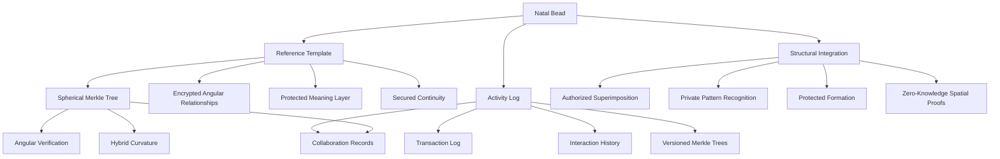
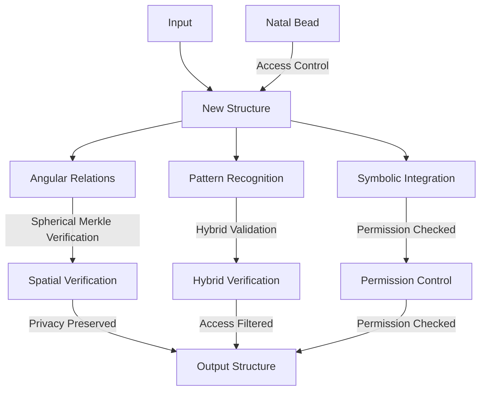
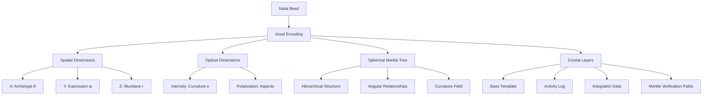

# 2.17. Natal Glass Bead

The Natal Glass Bead functions as a player's core identity token within Memorativa, while maintaining strict privacy preservation. Like a personal signet or cryptographic key, this special token provides pseudo-anonymous identification and authentication while enabling personalized meaning construction.

## Identity Functions

1. **Pseudo-Anonymous Identifier**
   - Functions as player's primary system identity
   - Enables authentication without revealing personal data
   - Supports selective disclosure through zero-knowledge proofs
   - Maintains separation between on-chain and off-chain identity

2. **Limited Fungibility**
   - Transfer requires complex ritual and high gas costs
   - Limited to exceptional circumstances (account recovery, inheritance)
   - Maintains strong binding to original player's patterns
   - Transfer history permanently recorded in bead structure

## Core functions

1. **Reference Template**
   - Acts as player's canonical reference structure with encrypted base state
   - Provides consistent angular relationships through secure proofs
   - Enables personal meaning calibration with privacy preservation
   - Maintains interpretive continuity through versioned access controls
   - Utilizes Spherical Merkle Trees to preserve spatial relationships
   - Stores both hierarchical data and angular relationships between nodes

2. **Activity Logging**
   - Records all player transactions and interactions
   - Maintains timestamped activity history
   - Tracks token creation, transfers, and burns
   - Logs focus space interactions and Book contributions
   - Preserves collaboration history and validation activities
   - Enables activity analysis and pattern recognition
   - Secures versioned history with Spherical Merkle Trees

3. **Structural Integration**
   - Can be superimposed with authorized structures only
   - Provides zero-knowledge proofs for pattern matching
   - Influences pattern recognition through permissioned channels
   - Shapes prototype formation with privacy-aware templates
   - Maintains angular relationships using Spherical Merkle Nodes
   - Enables hybrid verification of both content and spatial relationships

## Gas Token Integration

The Natal Glass Bead requires specific Gas Bead Token (GBT) allocations for its unique operations:

### Economic Model
- Higher initial cost reflects foundational importance
- Reduced activity logging costs encourage regular use
- Premium pricing for template modifications ensures stability
- Special rates for long-term crystal storage
- Bulk discounts available for regular state updates
- Additional fees for complex Spherical Merkle operations

### Implementation
```rust
impl NatalBead {
    pub fn create_new(gas: &mut GasBeadToken) -> Result<Self> {
        // Verify sufficient gas for identity creation
        gas.verify_balance(1000)?;
        
        // Generate unique identifier
        let identifier = Self::generate_unique_id();
        
        // Initialize identity proof structure
        let identity_proof = Self::create_identity_proof(identifier);
        
        // Burn gas for operation
        gas.burn_for_operation(Operation::CreateIdentityBead)?;
        
        // Initialize spherical merkle structure for spatial relationships
        let merkle_node = SphericalMerkleNode::new(identifier.serialize());
        
        // Initialize natal bead structure with identity and merkle node
        Self::initialize_natal_structure(identifier, identity_proof, merkle_node)
    }
    
    pub fn transfer_ownership(&mut self, gas: &mut GasBeadToken, new_owner: Address) -> Result<()> {
        // Verify sufficient gas and ritual completion
        gas.verify_balance(500)?;
        self.verify_transfer_ritual()?;
        
        // Update ownership while preserving history
        self.transfer_to(new_owner)
    }
    
    pub fn create_spherical_merkle_node(&self) -> SphericalMerkleNode {
        // Create node with serialized data
        let mut node = SphericalMerkleNode::new(self.serialize());
        
        // Add angular relationships with permissioned structures
        for (structure_id, relationship) in self.authorized_relationships() {
            // Calculate angular relationship in hybrid space
            let angle = self.calculate_angular_relationship(structure_id);
            
            // Only add relationships that pass privacy filters
            if self.is_relationship_shareable(structure_id) {
                node.add_angular_relationship(structure_id, angle);
            }
        }
        
        // Update node hash to include both data and relationships
        node.update_hash();
        
        node
    }
    
    pub fn verify_structural_integrity(&self) -> Result<bool> {
        // Get current state as Spherical Merkle Node
        let current_node = self.create_spherical_merkle_node();
        
        // Retrieve reference template
        let template_node = self.reference_template.merkle_node();
        
        // Create hybrid verifier
        let verifier = HybridVerifier::new();
        
        // Verify both content and angular relationships
        verifier.verify(
            current_node,
            template_node,
            self.create_private_proof()
        )
    }
}
```



## Implementation features

1. **Automatic Application**
   - Default inclusion with granular permission controls
   - Configurable application rules with access rights
   - Explicit exclusion options through owner controls
   - Inheritance tracking with privacy preservation
   - Merkle-verified angular relationship mapping

2. **Pattern Enhancement**
   - Enriches pattern recognition within access boundaries
   - Deepens symbolic relationships through authorized channels
   - Personalizes interpretations with encrypted contexts
   - Maintains meaning consistency with versioned access
   - Uses Spherical Merkle Trees to preserve curved-space topology

3. **Temporal Anchoring**
   - Provides encrypted temporal reference point
   - Enables secure holographic time states
   - Supports temporal analysis with privacy controls
   - Maintains chronological coherence through protected states
   - Stores state transitions in Spherical Merkle Trees for verification

## Integration mechanics

1. **Structure Formation**


2. **Superimposition Rules**
   - Automatic by default with owner consent
   - Can be explicitly excluded via access controls
   - Configurable influence weight with privacy preservation
   - Preserves original structure through encryption
   - Uses Spherical Merkle Trees to verify angular consistency

3. **Reference Patterns**
   - Maintains consistent angles with secure proofs
   - Preserves symbolic relationships through access control
   - Enables personal resonance with privacy boundaries
   - Supports pattern evolution within permission scope
   - Verifies angular relationships through Spherical Merkle validation

## Privacy and control

1. **Access Levels**
   - Private by default with enhanced encryption
   - Configurable visibility through access control system
   - Selective sharing with zero-knowledge proofs
   - Inheritance control with permission management
   - Spherical Merkle proofs for verifying spatial relationships without revealing content

2. **Application Control**
   - Global settings with granular permissions
   - Per-structure settings with access rights
   - Temporal settings with encrypted states
   - Context-specific rules with privacy preservation
   - Curvature-aware access control for hybrid spaces

## System benefits

1. **Personalization**
   - Deepens personal meaning while maintaining privacy
   - Maintains interpretive consistency through secure channels
   - Enables unique insights with controlled access
   - Supports individual growth within privacy boundaries
   - Preserves angular relationships through Spherical Merkle Trees

2. **Pattern Recognition**
   - Enhances relationship detection with permission controls
   - Strengthens symbolic connections through secure channels
   - Improves pattern stability with access management
   - Enables complex analysis within privacy constraints
   - Validates spatial relationships with hybrid verification

3. **Temporal Coherence**
   - Provides stable reference with encrypted states
   - Enables temporal analysis through secure channels
   - Supports pattern evolution with privacy preservation
   - Maintains chronological context through access control
   - Uses Spherical Merkle Trees to track temporal changes while preserving spatial relationships

## Archival deep storage

The Natal Glass Bead can be preserved in 5D crystal storage for long-term archival purposes, providing an immutable physical record that maintains quantum coherence for up to 13.8 billion years at room temperature.

### Storage architecture

1. **Crystal Encoding**
   - Natal bead structure encoded as 5D voxels in quartz crystal
   - Uses femtosecond laser pulses to create nanogratings
   - Spatial dimensions (x,y,z) encode percept-triplet vectors
   - Optical dimensions (intensity, polarization) encode relationships
   - Multiple layers provide redundancy and versioning
   - Encodes complete Spherical Merkle Tree with angular relationships

2. **Physical Structure** 
   - Spherical quartz crystal beads (1-2mm diameter)
   - Surface etched with unique identifier
   - Organized in 3D grid arrays for efficient access
   - Position corresponds to knowledge graph location
   - Protected storage environment with climate control
   - Physical structure mirrors topological relationships in Spherical Merkle Trees



### Interface system

1. **Write Operations**
   - Automated laser writing system for encoding
   - Batch processing for multiple beads
   - Version control and integrity verification
   - Privacy-preserving encryption layer
   - Redundant backup generation
   - Spherical Merkle Tree validation during encoding

2. **Read Operations**
   - Non-destructive laser scanning
   - Parallel readout of multiple layers
   - Integrity checking and error correction
   - Secure decryption of private data
   - Integration with live system
   - Hybrid verification of both content and spatial relationships

3. **Access Control**
   - Physical security protocols
   - Multi-factor authentication
   - Granular permission management
   - Audit logging of all operations
   - Privacy preservation guarantees
   - Spherical Merkle proof verification

### Benefits

1. **Data Preservation**
   - Near-infinite storage lifetime
   - Immune to electromagnetic interference
   - Resistant to environmental degradation
   - Maintains quantum coherence
   - Ensures historical continuity
   - Preserves both content and spatial relationships

2. **System Integration**
   - Seamless backup and restore
   - Version control and rollback
   - Disaster recovery capability
   - Future-proof storage format
   - Compatible with quantum systems
   - Maintains Spherical Merkle verification paths

## Spherical Merkle Integration

1. **Hybrid Verification System**
   - Combines traditional Merkle verification with spatial validation
   - Verifies both hierarchical integrity and angular relationships
   - Adapts verification based on local curvature parameters
   - Preserves topological consistency in curved knowledge space
   - Supports zero-knowledge verification of spatial relationships

2. **Angular Relationship Preservation**
   - Stores node-to-node angles in Spherical Merkle structure
   - Preserves spatial signatures across version changes
   - Enables curvature-aware hashing for hybrid spaces
   - Supports both spherical and hyperbolic relationship verification
   - Maintains privacy through selective relationship disclosure

3. **Privacy-Preserving Spatial Proofs**
   - Enables zero-knowledge verification of spatial relationships
   - Allows proving angular consistency without revealing specific angles
   - Supports selective disclosure of relationship subsets
   - Maintains privacy boundaries during spatial verification
   - Enables privacy-aware pattern matching across conceptual space

## Privacy and Identity Control

1. **Identity Management**
   - Zero-knowledge identity proofs
   - Selective attribute disclosure
   - Privacy-preserving authentication
   - Decentralized identifier (DID) integration
   - Spherical Merkle proofs for identity verification

2. **Transfer Restrictions**
   - Multi-signature approval required
   - Cooling-off period enforcement
   - Pattern preservation guarantees
   - Historical continuity maintenance
   - Merkle-verified spatial consistency preservation

   ## Key points

- **Reference Structure**
  - Serves as player's foundational template for meaning construction
  - Provides consistent angular relationships for pattern matching
  - Enables superimposition with other structures while preserving privacy
  - Maintains encrypted base state for secure reference
  - Uses Spherical Merkle Trees to preserve both content and spatial relationships

- **Activity Management**
  - Comprehensive logging of player interactions and transactions
  - Versioned history with privacy-aware access controls
  - Tracks focus space interactions and Book contributions
  - Enables secure pattern analysis of player activity
  - Secures activity history with Spherical Merkle versioning

- **Integration Features**
  - Zero-knowledge proofs for secure pattern matching
  - Granular permission controls for structural integration
  - Privacy-preserving superimposition mechanics
  - Protected temporal state management
  - Spherical Merkle validation for angular relationship verification

- **Privacy Architecture**
  - Private by default with enhanced encryption
  - Configurable access levels with inheritance
  - Selective sharing through zero-knowledge proofs
  - Context-aware permission management
  - Zero-knowledge spatial verification without revealing content

- **System Benefits**
  - Personalized meaning construction with privacy preservation
  - Enhanced pattern recognition within access boundaries
  - Secure temporal analysis and coherence
  - Protected integration with broader system components
  - Verified spatial relationships through Spherical Merkle Trees

- **Archival Storage**
  - 5D crystal encoding for near-infinite preservation
  - Spatial dimensions (x,y,z) encode percept-triplet vectors
  - Optical dimensions encode relationships and curvature
  - Multi-layer redundancy with version control
  - Non-destructive retrieval with integrity verification
  - Complete Spherical Merkle Tree structure preservation for future verification

This Natal Glass Bead architecture:
- Personalizes meaning construction with privacy preservation
- Maintains interpretive consistency through secure channels
- Enables deep pattern recognition within access boundaries
- Supports holographic analysis with encrypted states
- Preserves temporal coherence through access control
- Enhances system integration with privacy protection
- Provides quantum-coherent archival storage for 13.8B years
- Ensures topological consistency through Spherical Merkle Trees
