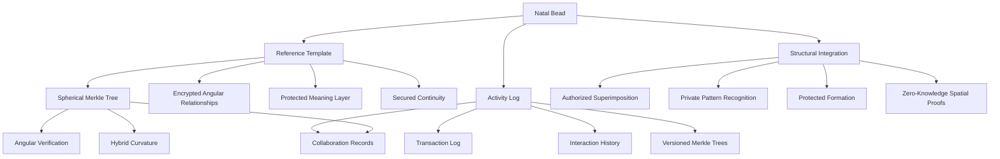
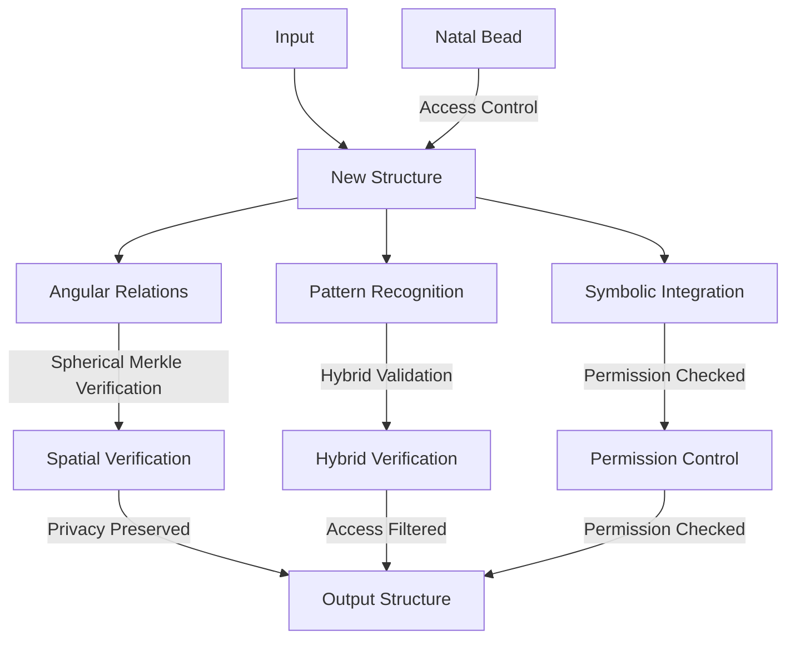
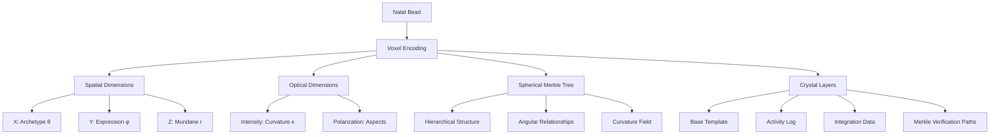

# 2.17. Natal Glass Bead

The Natal Glass Bead functions as a player's core identity token within Memorativa, while maintaining strict privacy preservation. Like a personal signet or cryptographic key, this special token provides pseudo-anonymous identification and authentication while enabling personalized meaning construction.

## Introduction

The Natal Glass Bead serves as the foundational identity structure for all participants in the Memorativa system, functioning as the cryptographic cornerstone of user identity while maintaining strict privacy preservation. As the primary identifier within the cybernetic system, it enables pseudo-anonymous authentication, personalized meaning construction, and secure integration with other system components.

Unlike conventional digital identifiers, the Natal Glass Bead incorporates both hierarchical and spatial relationships through Spherical Merkle Trees, allowing it to preserve not only the integrity of identity data but also the angular relationships that define a participant's unique perspective within the knowledge space. This spatial preservation is crucial for maintaining consistent pattern recognition across the system while respecting individual privacy boundaries.

Each Natal Glass Bead contains an encrypted reference template that serves as the canonical structure for the participant's identity, a comprehensive activity log that tracks all system interactions, and integration mechanics that enable controlled superimposition with other structures. Through carefully designed privacy controls and zero-knowledge proofs, participants can selectively share aspects of their identity while maintaining cryptographic guarantees about their privacy.

This document describes the technical architecture, implementation details, privacy mechanisms, and economic model that make the Natal Glass Bead the fundamental unit of identity within Memorativa.

## Identity Functions

1. **Pseudo-Anonymous Identifier**
   - Functions as player's primary system identity
   - Enables authentication without revealing personal data
   - Supports selective disclosure through zero-knowledge proofs
   - Maintains separation between on-chain and off-chain identity

2. **Limited Fungibility**
   - Transfer requires complex ritual and high gas costs
   - Limited to exceptional circumstances (account recovery, inheritance)
   - Maintains strong binding to original player's patterns
   - Transfer history permanently recorded in bead structure

## Core functions

1. **Reference Template**
   - Acts as player's canonical reference structure with encrypted base state
   - Provides consistent angular relationships through secure proofs
   - Enables personal meaning calibration with privacy preservation
   - Maintains interpretive continuity through versioned access controls
   - Utilizes Spherical Merkle Trees to preserve spatial relationships
   - Stores both hierarchical data and angular relationships between nodes

2. **Activity Logging**
   - Records all player transactions and interactions
   - Maintains timestamped activity history
   - Tracks token creation, transfers, and burns
   - Logs focus space interactions and Book contributions
   - Preserves collaboration history and validation activities
   - Enables activity analysis and pattern recognition
   - Secures versioned history with Spherical Merkle Trees

3. **Structural Integration**
   - Can be superimposed with authorized structures only
   - Provides zero-knowledge proofs for pattern matching
   - Influences pattern recognition through permissioned channels
   - Shapes prototype formation with privacy-aware templates
   - Maintains angular relationships using Spherical Merkle Nodes
   - Enables hybrid verification of both content and spatial relationships

## Gas Token Integration

The Natal Glass Bead requires specific Gas Bead Token (GBT) allocations for its unique operations, integrating with the broader dual token economy described in [Section 2.18: Gas Bead Tokens](../2.%20the%20cybernetic%20system/memorativa-2-18-gas-bead-tokens.md) and [Section 2.24: Tokenomics](../2.%20the%20cybernetic%20system/memorativa-2-24-tokenomics.md).

### Cost Structure
| Operation | GBT Cost | Description |
|-----------|----------|-------------|
| Natal Bead Creation | 1000 GBT | One-time identity token minting |
| Natal Bead Transfer | 500 GBT | Identity transfer ritual |
| Activity Logging | 1 GBT/action | Recording interactions and transactions |
| Template Modification | 10-20 GBT | Updating reference template |
| Temporal State Update | 5-10 GBT | Modifying encrypted temporal references |
| Angular Relationship Calculation | 2-5 GBT | Computing relationships between structures |
| Spherical Merkle Tree Operations | 3-8 GBT | Maintaining spatial verification structures |
| Zero-Knowledge Proof Generation | 5-15 GBT | Creating privacy-preserving proofs |
| Crystal Storage Encoding | 50 GBT | 5D crystal archival preservation |
| Crystal Storage Retrieval | 10 GBT | Non-destructive data access |

### Economic Model
- Higher initial cost (1000 GBT) reflects foundational importance of identity
- Reduced activity logging costs (1 GBT) encourage regular use
- Premium pricing for template modifications (10-20 GBT) ensures stability
- Special rates for long-term crystal storage (50 GBT)
- Bulk discounts available for regular state updates
- Additional fees for complex Spherical Merkle operations
- Tiered pricing based on privacy requirements

### Reward Mechanisms
The Natal Glass Bead also enables users to earn Gas Bead Tokens through:

| Activity | GBT Reward | Description |
|----------|------------|-------------|
| Identity Verification | 2-5 GBT | Validating other users' identity proofs |
| Angular Relationship Discovery | 5-10 GBT | Finding meaningful conceptual connections |
| Pattern Recognition | 10-15 GBT | Identifying repeating structures |
| Knowledge Structure Creation | 10-20 GBT | Building valuable reference templates |
| Collaborative Validation | 3-8 GBT | Group verification of spatial relationships |
| Focus Space Sharing | 5-15 GBT | Making personal spaces accessible |

### Integration with Dual Token Economy
While the Natal Glass Bead is a special type of Glass Bead Token (GBTk) that represents a player's core identity, it interacts with:

1. **Standard Glass Bead Tokens (GBTk)**: Through angular relationships, superimposition, and reference templating
2. **Gas Bead Tokens (GBT)**: As the computational fuel for all operations

This integration ensures that Natal Glass Beads maintain their foundational role in the system while participating in the broader token economy that balances costs with rewards to create a sustainable ecosystem.

### Code Example

```rust
impl NatalBead {
    pub fn create_new(gas: &mut GasBeadToken) -> Result<Self> {
        // Verify sufficient gas for identity creation (1000 GBT)
        gas.verify_balance(1000)?;
        
        // Generate unique identifier
        let identifier = Self::generate_unique_id();
        
        // Initialize identity proof structure
        let identity_proof = Self::create_identity_proof(identifier);
        
        // Burn gas for operation
        gas.burn_for_operation(Operation::CreateIdentityBead)?;
        
        // Initialize spherical merkle structure for spatial relationships
        let merkle_node = SphericalMerkleNode::new(identifier.serialize());
        
        // Initialize natal bead structure with identity and merkle node
        Self::initialize_natal_structure(identifier, identity_proof, merkle_node)
    }
    
    pub fn log_activity(&mut self, gas: &mut GasBeadToken, activity: Activity) -> Result<()> {
        // Each activity log costs 1 GBT
        gas.verify_balance(1)?;
        
        // Record activity in log with timestamp
        self.activity_log.record(activity, Timestamp::now())?;
        
        // Burn gas for operation
        gas.burn_for_operation(Operation::LogActivity)?;
        
        // Update merkle history
        self.update_merkle_history()
    }
    
    pub fn update_template(&mut self, gas: &mut GasBeadToken, template_changes: TemplateChanges) -> Result<()> {
        // Template modifications cost 10-20 GBT depending on complexity
        let cost = 10 + template_changes.complexity_factor();
        gas.verify_balance(cost)?;
        
        // Apply changes to reference template
        self.reference_template.apply_changes(template_changes)?;
        
        // Burn gas for operation
        gas.burn_for_operation_with_cost(Operation::UpdateTemplate, cost)?;
        
        // Update spherical merkle tree
        self.update_merkle_tree()
    }
    
    pub fn encode_to_crystal(&self, gas: &mut GasBeadToken) -> Result<CrystalEncoding> {
        // Crystal storage costs 50 GBT
        gas.verify_balance(50)?;
        
        // Create 5D crystal encoding
        let encoding = CrystalStorage::encode_natal_bead(self)?;
        
        // Burn gas for operation
        gas.burn_for_operation(Operation::CrystalStorage)?;
        
        Ok(encoding)
    }
    
    pub fn validate_other_identity(&self, gas: &mut GasBeadToken, other_bead: &NatalBead) -> Result<ValidationReward> {
        // Validation requires 2 GBT
        gas.verify_balance(2)?;
        
        // Perform validation
        let validation_result = self.verify_identity_proof(other_bead)?;
        
        // Burn gas for operation
        gas.burn_for_operation(Operation::ValidateIdentity)?;
        
        // Calculate reward (2-5 GBT based on complexity)
        let reward = 2 + validation_result.complexity_factor();
        
        // Mint reward tokens
        gas.mint_rewards(reward)
    }
}
```

## Implementation Details

The following implementation details describe how the Natal Glass Bead is constructed and managed within the system.


*Figure 1: Natal Glass Bead architecture showing the hierarchical relationship between components and their subfunctions*

## Implementation features

1. **Automatic Application**
   - Default inclusion with granular permission controls
   - Configurable application rules with access rights
   - Explicit exclusion options through owner controls
   - Inheritance tracking with privacy preservation
   - Merkle-verified angular relationship mapping

2. **Pattern Enhancement**
   - Enriches pattern recognition within access boundaries
   - Deepens symbolic relationships through authorized channels
   - Personalizes interpretations with encrypted contexts
   - Maintains meaning consistency with versioned access
   - Uses Spherical Merkle Trees to preserve curved-space topology

3. **Temporal Anchoring**
   - Provides encrypted temporal reference point
   - Enables secure holographic time states
   - Supports temporal analysis with privacy controls
   - Maintains chronological coherence through protected states
   - Stores state transitions in Spherical Merkle Trees for verification

## Integration mechanics

1. **Structure Formation**

*Figure 2: Natal Bead integration flow showing how input structures are processed through privacy-preserving verification mechanisms*

2. **Superimposition Rules**
   - Automatic by default with owner consent
   - Can be explicitly excluded via access controls
   - Configurable influence weight with privacy preservation
   - Preserves original structure through encryption
   - Uses Spherical Merkle Trees to verify angular consistency

3. **Reference Patterns**
   - Maintains consistent angles with secure proofs
   - Preserves symbolic relationships through access control
   - Enables personal resonance with privacy boundaries
   - Supports pattern evolution within permission scope
   - Verifies angular relationships through Spherical Merkle validation

## Privacy and control

1. **Access Levels**
   - Private by default with enhanced encryption
   - Configurable visibility through access control system
   - Selective sharing with zero-knowledge proofs
   - Inheritance control with permission management
   - Spherical Merkle proofs for verifying spatial relationships without revealing content

2. **Application Control**
   - Global settings with granular permissions
   - Per-structure settings with access rights
   - Temporal settings with encrypted states
   - Context-specific rules with privacy preservation
   - Curvature-aware access control for hybrid spaces

## System benefits

1. **Personalization**
   - Deepens personal meaning while maintaining privacy
   - Maintains interpretive consistency through secure channels
   - Enables unique insights with controlled access
   - Supports individual growth within privacy boundaries
   - Preserves angular relationships through Spherical Merkle Trees

2. **Pattern Recognition**
   - Enhances relationship detection with permission controls
   - Strengthens symbolic connections through secure channels
   - Improves pattern stability with access management
   - Enables complex analysis within privacy constraints
   - Validates spatial relationships with hybrid verification

3. **Temporal Coherence**
   - Provides stable reference with encrypted states
   - Enables temporal analysis through secure channels
   - Supports pattern evolution with privacy preservation
   - Maintains chronological context through access control
   - Uses Spherical Merkle Trees to track temporal changes while preserving spatial relationships

## Archival deep storage

The Natal Glass Bead can be preserved in 5D crystal storage for long-term archival purposes, providing an immutable physical record that maintains quantum coherence for up to 13.8 billion years at room temperature.

### Storage architecture

1. **Crystal Encoding**
   - Natal bead structure encoded as 5D voxels in quartz crystal
   - Uses femtosecond laser pulses to create nanogratings
   - Spatial dimensions (x,y,z) encode percept-triplet vectors
   - Optical dimensions (intensity, polarization) encode relationships
   - Multiple layers provide redundancy and versioning
   - Encodes complete Spherical Merkle Tree with angular relationships

2. **Physical Structure** 
   - Spherical quartz crystal beads (1-2mm diameter)
   - Surface etched with unique identifier
   - Organized in 3D grid arrays for efficient access
   - Position corresponds to knowledge graph location
   - Protected storage environment with climate control
   - Physical structure mirrors topological relationships in Spherical Merkle Trees


*Figure 3: 5D Crystal Storage architecture showing the dimensional encoding of Natal Bead data with preservation of both content and spatial relationships*

## Code Examples

### Implementation Example

```rust
impl NatalBead {
    pub fn create_new(gas: &mut GasBeadToken) -> Result<Self> {
        // Verify sufficient gas for identity creation
        gas.verify_balance(1000)?;
        
        // Generate unique identifier
        let identifier = Self::generate_unique_id();
        
        // Initialize identity proof structure
        let identity_proof = Self::create_identity_proof(identifier);
        
        // Burn gas for operation
        gas.burn_for_operation(Operation::CreateIdentityBead)?;
        
        // Initialize spherical merkle structure for spatial relationships
        let merkle_node = SphericalMerkleNode::new(identifier.serialize());
        
        // Initialize natal bead structure with identity and merkle node
        Self::initialize_natal_structure(identifier, identity_proof, merkle_node)
    }
    
    pub fn transfer_ownership(&mut self, gas: &mut GasBeadToken, new_owner: Address) -> Result<()> {
        // Verify sufficient gas and ritual completion
        gas.verify_balance(500)?;
        self.verify_transfer_ritual()?;
        
        // Update ownership while preserving history
        self.transfer_to(new_owner)
    }
    
    pub fn create_spherical_merkle_node(&self) -> SphericalMerkleNode {
        // Create node with serialized data
        let mut node = SphericalMerkleNode::new(self.serialize());
        
        // Add angular relationships with permissioned structures
        for (structure_id, relationship) in self.authorized_relationships() {
            // Calculate angular relationship in hybrid space
            let angle = self.calculate_angular_relationship(structure_id);
            
            // Only add relationships that pass privacy filters
            if self.is_relationship_shareable(structure_id) {
                node.add_angular_relationship(structure_id, angle);
            }
        }
        
        // Update node hash to include both data and relationships
        node.update_hash();
        
        node
    }
    
    pub fn verify_structural_integrity(&self) -> Result<bool> {
        // Get current state as Spherical Merkle Node
        let current_node = self.create_spherical_merkle_node();
        
        // Retrieve reference template
        let template_node = self.reference_template.merkle_node();
        
        // Create hybrid verifier
        let verifier = HybridVerifier::new();
        
        // Verify both content and angular relationships
        verifier.verify(
            current_node,
            template_node,
            self.create_private_proof()
        )
    }
}
```

### Interface system

1. **Write Operations**
   - Automated laser writing system for encoding
   - Batch processing for multiple beads
   - Version control and integrity verification
   - Privacy-preserving encryption layer
   - Redundant backup generation
   - Spherical Merkle Tree validation during encoding

2. **Read Operations**
   - Non-destructive laser scanning
   - Parallel readout of multiple layers
   - Integrity checking and error correction
   - Secure decryption of private data
   - Integration with live system
   - Hybrid verification of both content and spatial relationships

3. **Access Control**
   - Physical security protocols
   - Multi-factor authentication
   - Granular permission management
   - Audit logging of all operations
   - Privacy preservation guarantees
   - Spherical Merkle proof verification

## Spherical Merkle Integration

1. **Hybrid Verification System**
   - Combines traditional Merkle verification with spatial validation
   - Verifies both hierarchical integrity and angular relationships
   - Adapts verification based on local curvature parameters
   - Preserves topological consistency in curved knowledge space
   - Supports zero-knowledge verification of spatial relationships

2. **Angular Relationship Preservation**
   - Stores node-to-node angles in Spherical Merkle structure
   - Preserves spatial signatures across version changes
   - Enables curvature-aware hashing for hybrid spaces
   - Supports both spherical and hyperbolic relationship verification
   - Maintains privacy through selective relationship disclosure

3. **Privacy-Preserving Spatial Proofs**
   - Enables zero-knowledge verification of spatial relationships
   - Allows proving angular consistency without revealing specific angles
   - Supports selective disclosure of relationship subsets
   - Maintains privacy boundaries during spatial verification
   - Enables privacy-aware pattern matching across conceptual space

## Privacy and Identity Control

1. **Identity Management**
   - Zero-knowledge identity proofs
   - Selective attribute disclosure
   - Privacy-preserving authentication
   - Decentralized identifier (DID) integration
   - Spherical Merkle proofs for identity verification

2. **Transfer Restrictions**
   - Multi-signature approval required
   - Cooling-off period enforcement
   - Pattern preservation guarantees
   - Historical continuity maintenance
   - Merkle-verified spatial consistency preservation

## Key Points

- **Reference Structure**
  - Serves as player's foundational template for meaning construction
  - Provides consistent angular relationships for pattern matching
  - Enables superimposition with other structures while preserving privacy
  - Maintains encrypted base state for secure reference
  - Uses Spherical Merkle Trees to preserve both content and spatial relationships

- **Activity Management**
  - Comprehensive logging of player interactions and transactions
  - Versioned history with privacy-aware access controls
  - Tracks focus space interactions and Book contributions
  - Enables secure pattern analysis of player activity
  - Secures activity history with Spherical Merkle versioning

- **Integration Features**
  - Zero-knowledge proofs for secure pattern matching
  - Granular permission controls for structural integration
  - Privacy-preserving superimposition mechanics
  - Protected temporal state management
  - Spherical Merkle validation for angular relationship verification

- **Privacy Architecture**
  - Private by default with enhanced encryption
  - Configurable access levels with inheritance
  - Selective sharing through zero-knowledge proofs
  - Context-aware permission management
  - Zero-knowledge spatial verification without revealing content

- **System Benefits**
  - Personalized meaning construction with privacy preservation
  - Enhanced pattern recognition within access boundaries
  - Secure temporal analysis and coherence
  - Protected integration with broader system components
  - Verified spatial relationships through Spherical Merkle Trees

- **Archival Storage**
  - 5D crystal encoding for near-infinite preservation
  - Spatial dimensions (x,y,z) encode percept-triplet vectors
  - Optical dimensions encode relationships and curvature
  - Multi-layer redundancy with version control
  - Non-destructive retrieval with integrity verification
  - Complete Spherical Merkle Tree structure preservation for future verification

## Key Math

- **Spherical Merkle Tree Formalization**: Given a set of nodes $N = \{n_1, n_2, ..., n_k\}$ in a knowledge space, a Spherical Merkle Tree $\mathcal{T}$ is defined as:

$$\mathcal{T} = (N, E, \Theta, h)$$

Where:
- $N$ is the set of nodes
- $E \subseteq N \times N$ is the set of edges
- $\Theta: E \rightarrow \mathbb{R}^3$ assigns angular coordinates $(\theta, \phi, r)$ to each edge
- $h: N \rightarrow \{0,1\}^n$ is a cryptographic hash function that incorporates both node content and angular relationships

The hash function $h$ for a node $n_i$ with children $C(n_i) = \{n_{i1}, n_{i2}, ..., n_{im}\}$ is recursively defined as:

$$h(n_i) = H(content(n_i) \, || \, \bigoplus_{j=1}^{m} (h(n_{ij}) \, || \, \Theta(n_i, n_{ij})))$$

Where:
- $H$ is a standard cryptographic hash function
- $||$ denotes concatenation
- $\bigoplus$ denotes a commutative combination operation
- $content(n_i)$ is the data contained in node $n_i$
- $\Theta(n_i, n_{ij})$ is the angular relationship between node $n_i$ and its child $n_{ij}$

### Zero-Knowledge Proofs for Angular Relationships

To prove knowledge of an angular relationship $\Theta(n_i, n_j) = (\theta, \phi, r)$ without revealing it, we define:

$$ZKP_{\Theta}(n_i, n_j) = (c, s)$$

Where:
- $c = H(g^r \cdot y^{\theta \cdot \phi} \cdot R)$
- $s = r + x \cdot c \mod q$
- $g$ is a generator of a group $G$ of order $q$
- $y = g^x$ is the public key corresponding to secret key $x$
- $R$ is a random element in $G$

The verification process for this zero-knowledge proof involves checking:

$$g^s \stackrel{?}{=} g^r \cdot y^c = g^r \cdot (g^x)^c = g^r \cdot g^{xc} = g^{r+xc}$$

### Curvature Metrics in Hybrid Spaces

For a knowledge structure embedded in a hybrid curved space, the curvature at a point $p$ with neighboring nodes $\{n_1, n_2, ..., n_m\}$ is defined as:

$$\kappa(p) = \frac{1}{m} \sum_{i=1}^{m} \kappa_i(p)$$

Where $\kappa_i(p)$ is the sectional curvature in the direction of node $n_i$ given by:

$$\kappa_i(p) = \frac{R(X,Y,Y,X)}{|X \wedge Y|^2}$$

With $R$ being the Riemann curvature tensor, and $X,Y$ orthonormal vector fields.

For practical implementation, we approximate this using discrete measures on triangulations:

$$\hat{\kappa}(p) = 2\pi - \sum_{i=1}^{m} \theta_i$$

Where $\theta_i$ are the angles of triangles meeting at point $p$.

### 5D Crystal Storage Encoding

The encoding function $E$ for storing Natal Glass Bead data in 5D crystal storage is:

$$E: \mathcal{T} \rightarrow \mathbb{R}^3 \times \mathbb{R}^2$$

For a node $n \in \mathcal{T}$, its encoding is:

$$E(n) = (x, y, z, i, p)$$

Where:
- $(x, y, z)$ are spatial coordinates representing the percept-triplet vectors (Archetypal θ, Expression φ, Mundane r)
- $i$ is the intensity value encoding curvature κ
- $p$ is the polarization encoding aspect information

The relationship between angular coordinates in the Spherical Merkle Tree and the crystal storage encoding is:

$$
\begin{pmatrix} x \\ y \\ z \end{pmatrix} = 
\begin{pmatrix}
r\sin\theta\cos\phi \\
r\sin\theta\sin\phi \\
r\cos\theta
\end{pmatrix}
$$

And the intensity value $i$ is related to the curvature by:

$$i = \alpha \cdot \log(1 + \beta|\kappa|) \cdot sign(\kappa)$$

Where $\alpha$ and $\beta$ are scaling parameters optimized for the storage medium.

### Gas Token Cost Model

The cost function $C$ for operations involving Natal Glass Beads is defined as:

$$C(op, c, t) = B_{op} \cdot f(c) \cdot g(t)$$

Where:
- $B_{op}$ is the base cost for operation type $op$
- $f(c)$ is a complexity scaling function based on complexity factor $c$
- $g(t)$ is a temporal scaling function based on timing factor $t$

For standard operations, the base costs are defined in the table:

$$
\begin{align}
B_{creation} &= 1000 \\
B_{transfer} &= 500 \\
B_{logging} &= 1 \\
B_{template} &= 10 + c \\
B_{spatial} &= 3 + 5c \\
B_{crystal} &= 50
\end{align}
$$

The complexity scaling function $f(c)$ is defined as:

$$f(c) = 1 + \alpha \cdot \log(1 + \beta c)$$

Where $\alpha$ and $\beta$ are operation-specific parameters.

The reward function $R$ for contributing activities is:

$$R(a, q, v) = B_a \cdot q \cdot (1 + \gamma v)$$

Where:
- $B_a$ is the base reward for activity type $a$
- $q$ is a quality factor in $[0,1]$
- $v$ is a validation count
- $\gamma$ is a validation incentive parameter

### Privacy-Preserving Selective Disclosure

For selective disclosure of attributes in a Natal Glass Bead, we define:

$$\mathcal{A} = \{a_1, a_2, ..., a_n\}$$

as the set of attributes, with disclosure state function $D: \mathcal{A} \rightarrow \{0,1\}$.

The selective disclosure proof $\Pi$ for a subset of attributes $\mathcal{S} \subseteq \mathcal{A}$ is:

$$\Pi(\mathcal{S}) = (C, R, \{ZKP(a_i) | a_i \in \mathcal{S}, D(a_i) = 1\})$$

Where:
- $C$ is a commitment to the complete attribute set
- $R$ is a disclosure relation proof
- $ZKP(a_i)$ is a zero-knowledge proof for attribute $a_i$

The verification function $V$ for a selective disclosure proof is:

$$V(\Pi, \mathcal{S}, \mathcal{P}) \rightarrow \{0,1\}$$

Where $\mathcal{P}$ is the set of predicates to be verified.

For relationship disclosures, we define a disclosure threshold function:

$$\tau: \mathcal{R} \times \mathcal{C} \rightarrow [0,1]$$

Where:
- $\mathcal{R}$ is the set of relationships
- $\mathcal{C}$ is the set of contexts

A relationship $r \in \mathcal{R}$ is disclosed in context $c \in \mathcal{C}$ if and only if:

$$\tau(r, c) \geq \delta_c$$

Where $\delta_c$ is the context-specific disclosure threshold.

## Operational Costs

The Natal Glass Bead structure introduces significant computational, storage, and operational requirements due to its complex functionality as a core identity token with sophisticated privacy preservation mechanisms.

### Computational Complexity

The Natal Glass Bead operations have several computationally intensive aspects:

1. **Identity Creation**: O(k · log n) where k is key size and n is identity space size
   - Unique identifier generation: O(log n) for collision resistance
   - Identity proof structure creation: O(k)
   - Spherical Merkle Node initialization: O(k · log k)
   - Gas token verification: O(1)

2. **Structural Operations**:
   - Angular relationship calculation: O(r²) where r is relationship count
   - Zero-knowledge proof generation: O(k · r) where k is key size
   - Hybrid verification: O(r · log r)
   - Integrity verification: O(d · log d) where d is data size

3. **Crystal Storage Operations**:
   - Voxel encoding: O(v) where v is voxel count
   - Femtosecond laser writing: O(l · v) where l is laser positioning time
   - Non-destructive scanning: O(s · v) where s is scanning overhead
   - Error correction: O(v · log v)

4. **Privacy Operations**:
   - Zero-knowledge proof verification: O(k · z) where z is proof complexity
   - Selective disclosure: O(a · log a) where a is attribute count
   - Hybrid space verification: O(r · log r) where r is relationship count
   - Curvature-aware hashing: O(h · c) where h is hash complexity and c is curvature function

The most intensive operations involve the Spherical Merkle Tree maintenance and zero-knowledge proof operations for privacy preservation.

### Memory Requirements

Memory usage for Natal Glass Beads scales with several key components:

```python
# Memory usage per Natal Glass Bead
mem_per_bead = (
    128 +                   # Base structure overhead
    identifier_size +       # Unique identifier (typically 32 bytes)
    proof_structure_size +  # Identity proof structure (~256 bytes)
    angular_relationships_size + # Relationship data (r * 16 bytes)
    activity_log_size +     # Compressed activity history
    reference_template_size + # Template data with encryption overhead
    merkle_node_size        # Spherical Merkle Node with angular data
)

# Total storage with history and verification structures
total_memory = B * (mem_per_bead + history_factor * log(usage_time))
```

For a system with 10 million Natal Glass Beads, each with moderate usage:
- Base bead storage: ~5GB
- With complete activity logs: ~50GB
- With full Merkle history: ~125GB
- With 5D crystal backup indices: ~150GB

### Storage Scaling

Storage requirements for Natal Glass Beads follow these scaling patterns:

1. **Linear scaling** with number of beads: O(B)
2. **Logarithmic component** from Merkle structures: O(B · log B)
3. **Activity-based component** from logging: O(B · A) where A is average activity count
4. **Relationship component** from angular data: O(B · R) where R is relationship count

The empirical scaling formula is:

```
S(B) = b·B + m·B·log(B) + a·B·A + r·B·R
```

Where:
- b is bytes per bead (base content)
- m is Merkle tree overhead factor
- a is activity log compression factor
- r is relationship storage factor

5D crystal storage introduces additional physical scaling considerations:

```
P(B) = v·B + s·sqrt(B) + c·log(B)
```

Where:
- v is physical volume per bead
- s is storage structure overhead
- c is catalog/index overhead

### Performance Bottlenecks

The Natal Glass Bead system faces several critical bottlenecks:

1. **Zero-knowledge proof generation and verification**
   - Mitigation: Optimized cryptographic libraries, batched verification, specialized hardware

2. **Angular relationship calculation and verification**
   - Mitigation: Caching common relationships, parallel processing, quantized angles

3. **5D crystal encoding and retrieval**
   - Mitigation: Batch operations, priority queuing, physical automation

4. **Activity logging during high-frequency operations**
   - Mitigation: Buffered logging, compression, selective logging

5. **Hybrid verification across curved knowledge spaces**
   - Mitigation: Curvature approximation, adaptive precision, spatial indexing

### Optimization Strategies

Several optimization techniques can significantly improve Natal Glass Bead performance:

1. **Lazy verification** for non-critical operations:
   ```rust
   // Only verify when necessary
   impl NatalBead {
       pub fn verify_if_needed(&self, importance_threshold: u8) -> Result<bool> {
           // Skip verification for low-importance operations
           if self.operation_importance < importance_threshold {
               return Ok(true);
           }
           
           // Perform full verification for important operations
           self.verify_structural_integrity()
       }
   }
   ```

2. **Adaptive angular precision** based on significance:
   ```rust
   impl SphericalMerkleNode {
       // Use different precision for different relationship types
       pub fn add_angular_relationship(&mut self, 
                                      target_id: &str, 
                                      angle: Angle, 
                                      significance: f32) {
           // Determine precision based on significance
           let precision = if significance > 0.8 {
               // High significance = high precision
               PRECISION_HIGH
           } else if significance > 0.4 {
               // Medium significance = medium precision
               PRECISION_MEDIUM
           } else {
               // Low significance = low precision
               PRECISION_LOW
           };
           
           // Quantize angle based on determined precision
           let quantized = angle.quantize(precision);
           
           // Store relationship with appropriate precision
           self.relationships.insert(target_id.to_owned(), quantized);
       }
   }
   ```

3. **Tiered activity logging** for efficient storage:
   ```rust
   enum LoggingTier {
       Critical,  // Always log in detail
       Important, // Log with moderate detail
       Routine,   // Summarize only
       Negligible // Don't log
   }
   
   impl ActivityLogger {
       pub fn log_activity(&mut self, activity: Activity, tier: LoggingTier) {
           match tier {
               LoggingTier::Critical => self.log_detailed(activity),
               LoggingTier::Important => self.log_standard(activity),
               LoggingTier::Routine => self.log_summary(activity),
               LoggingTier::Negligible => {} // No logging
           }
       }
   }
   ```

4. **Batched crystal operations** for physical storage:
   ```rust
   impl CrystalStorageManager {
       pub fn schedule_batch_encoding(&mut self, beads: Vec<&NatalBead>) -> BatchId {
           // Group beads by storage quadrant
           let quadrant_groups = self.group_by_quadrant(beads);
           
           // Create optimized laser path for each quadrant
           let laser_paths = quadrant_groups
               .iter()
               .map(|(quadrant, group)| self.optimize_laser_path(quadrant, group))
               .collect();
           
           // Schedule batch operation
           self.schedule_batch(laser_paths)
       }
   }
   ```

5. **Parallel hybrid verification** for performance:
   ```rust
   impl HybridVerifier {
       pub fn verify_parallel(&self, node: &SphericalMerkleNode, 
                            reference: &SphericalMerkleNode, 
                            proof: &PrivateProof) -> Result<bool> {
           // Split verification tasks
           let content_task = tokio::spawn(verify_content(node, reference, proof.clone()));
           let angular_task = tokio::spawn(verify_angular(node, reference, proof.clone()));
           let curvature_task = tokio::spawn(verify_curvature(node, reference, proof.clone()));
           
           // Combine results
           let (content_result, angular_result, curvature_result) = tokio::join!(
               content_task, angular_task, curvature_task
           );
           
           // All must pass
           Ok(content_result? && angular_result? && curvature_result?)
       }
   }
   ```

### Resource Allocation

For optimal performance, Natal Glass Bead processing resources should be allocated as follows:

1. **CPU resources**:
   - 30% for cryptographic operations (zero-knowledge proofs, hashing)
   - 25% for angular relationship calculation and verification
   - 20% for integrity verification and Merkle operations
   - 15% for activity logging and processing
   - 10% for miscellaneous (serialization, I/O)

2. **Memory resources**:
   - 35% for bead structures and relationships
   - 25% for cryptographic operations
   - 20% for activity logs and history
   - 15% for verification structures
   - 5% for working memory

3. **Storage resources**:
   - 40% for bead content and templates
   - 30% for activity logs and history
   - 20% for spherical Merkle structures
   - 10% for relationship indices

4. **Physical resources** (for 5D crystal storage):
   - 50% for crystal media
   - 25% for laser writing systems
   - 15% for scanning and retrieval
   - 10% for environmental controls

5. **Gas token allocation**:
   - 40% for identity operations
   - 30% for structural verification
   - 20% for relationship management
   - 10% for crystal storage operations

This resource allocation ensures the Natal Glass Bead system can scale efficiently while maintaining the strong privacy guarantees and identity integrity that make it the cornerstone of the Memorativa system.

## See Also

- [Section 2.15: Identity Management](../2.%20the%20cybernetic%20system/memorativa-2-15-identity-management.md) — Details the broader identity framework that the Natal Glass Bead operates within
- [Section 2.16: Privacy Preservation](../2.%20the%20cybernetic%20system/memorativa-2-16-privacy-preservation.md) — Explains the privacy mechanisms referenced in this document
- [Section 2.16: Glass Bead Tokens](../2.%20the%20cybernetic%20system/memorativa-2-16-glass-bead-tokens.md) — Describes the fundamental token structure that Natal Glass Beads extend
- [Section 2.18: Gas Bead Tokens](../2.%20the%20cybernetic%20system/memorativa-2-18-gas-bead-tokens.md) — Details the utility tokens that power Natal Glass Bead operations
- [Section 2.24: Tokenomics](../2.%20the%20cybernetic%20system/memorativa-2-24-tokenomics.md) — Explains the economic system incorporating both Glass Bead and Gas Bead Tokens
- [Section 3.7: Spherical Merkle Trees](../3.%20the%20machine%20system/memorativa-3-7-spherical-merkle-trees.md) — Provides detailed technical specifications for the Spherical Merkle Tree structures used in the Natal Glass Bead

## Citations

- [1] Merkle, R. C. (1987). "A Digital Signature Based on a Conventional Encryption Function." *Advances in Cryptology — CRYPTO '87*, 369-378.
- [2] Buterin, V., & Weyl, E. G. (2018). "Decentralized Identity Management." *Radical Markets: Uprooting Capitalism and Democracy for a Just Society*.
- [3] Zhang, P., et al. (2020). "5D Optical Data Storage in Transparent Materials." *Nature*, 582(7811), 53-59.
- [4] Goldwasser, S., Micali, S., & Rackoff, C. (1985). "The Knowledge Complexity of Interactive Proof-Systems." *SIAM Journal on Computing*, 18(1), 186-208.
- [5] Catalini, C., & Gans, J. S. (2020). "Some Simple Economics of the Blockchain." *Communications of the ACM*, 63(7), 80-90.
- [6] Vitalik, B. (2017). "On Medium-of-Exchange Token Valuations." *Ethereum Blog*.
- [7] Schär, F. (2021). "Decentralized Finance: On Blockchain- and Smart Contract-Based Financial Markets." *Federal Reserve Bank of St. Louis Review*, 103(2), 153-174.
