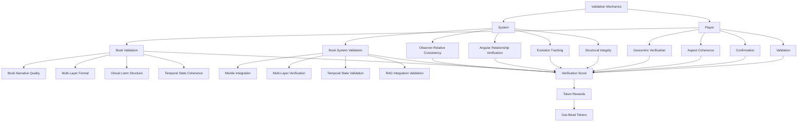
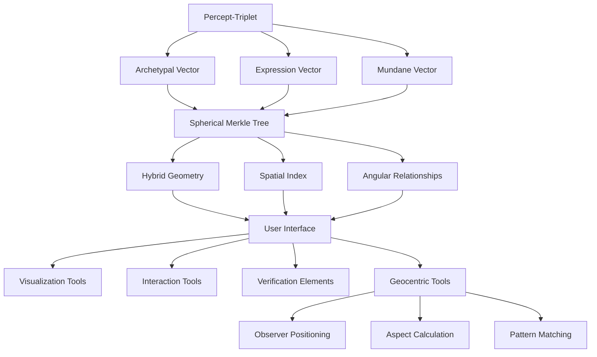
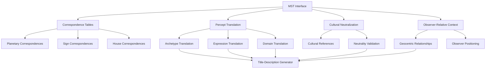
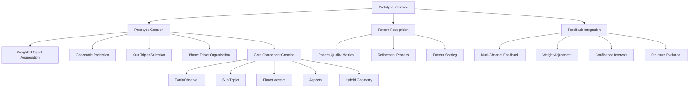

# 2.17. Shared interfaces

The interface layer of Memorativa constitutes a comprehensive framework of interactive components through which players engage with the system and collaborate with each other. These interfaces form the essential connective tissue between human cognition and the symbolic processing architecture, enabling the creation, validation, and evolution of knowledge structures while maintaining privacy, attribution, and conceptual integrity. Built upon a geocentric reference model, these interfaces support the full spectrum of operations from basic percept creation to complex pattern analysis, implementing the three-tier structure hierarchy and facilitating multi-modal content processing across all temporal states. The interface layer serves as both the entry point for player contributions and the manifestation of the system's computational results, creating a continuous feedback loop that drives the evolution of the knowledge ecosystem.

## Core Interface Types & Structure Hierarchy

The interface layer directly supports the three-tier structure hierarchy described in [Section 2.2: The Core Game]:

1. **Input Interfaces** (Basic Structures)
   - Content capture tools for percept-triplet creation
   - URL/media processors with vector encoding
   - **Multi-Modal Processors**:
     - CLIP-based visual archetype detection tools
     - Cross-modal alignment controllers
     - Keyword hints system for guiding AI interpretation
     - Semantic bridging controls for shared vocabulary across modalities
     - Bidirectional feedback loop visualizers
     - Visual-textual coherence monitors
     - Domain-specific keyword hint registration panels
     - Modality-specific interpretation guides
   - Text input systems with archetype detection
   - Batch import tools
   - Privacy selectors
   - Attribution markers

2. **Processing Interfaces** (Composite Structures)
   - Percept creation workbench with triplet vector editors for:
     - Archetypal vector (What/Planet) configuration
     - Expression vector (How/Sign) selection
     - Mundane vector (Where/House) mapping
   - Coordinate system visualizers (θ, φ, r, κ) for hybrid spherical-hyperbolic geometry
   - Title/description pair editors for prototype identification
   - Prototype builders with vector space operations
   - **Aspect Calculation Tools**:
     - Geocentric angle calculators
     - Aspect strength visualizers
     - Angular relationship browsers
     - Observer-relative vector editors
     - Aspect pattern detection panels
   - **Domain-Specific Pattern Recognition**:
     - Technical archetype detection panels
     - Scientific domain lens selectors
     - Mathematical pattern recognition tools
     - Domain-specific keyword hints manager
   - Focus space designers
   - **Book Editors & Managers**:
     - Multi-layer format controllers (Human, Machine, Bridge, Bead, Loom)
     - Narrative content editors with structure linking
     - Conceptual index builders
     - Book metadata configuration panels
     - Virtual Loom workbench for bead organization
     - Warp thread (thematic dimension) designers
     - Weft thread (contextual dimension) designers
     - Intersection mapping tools
     - Bead position controllers
     - Book recursion controls with depth settings
     - Structured narrative generators
     - Temporal state selectors for Book content
     - Chain-of-thought processing controls with recursion depth management
     - ProcessingContext configuration tools for thread isolation
     - Vector relationship analysis dashboards for cognitive chains
     - Book decomposition interfaces with metadata extraction
     - Component resubmission panels for direct input
   - MST interface components:
     - Correspondence table visualizers
     - Cultural neutralization controls
     - Archetype abstraction panels
     - Cross-cultural mapping tools
     - Translation quality validators
   - RAG query tools

3. **Analysis Interfaces** (Composite to Complex Structures)
   - Pattern recognition tools with vector similarity metrics
   - Relationship mappers for inner cosmos navigation
   - Temporal analyzers
   - Lens selectors
   - Validation panels with token economics
   - Aspect calculators
   - Spherical Merkle Tree visualizers
   - **Book Analysis Tools**:
     - Multi-layer content analyzers
     - Structured-to-narrative alignment checkers
     - Conceptual integrity validators
     - Book Merkle verification panels
     - Virtual Loom pattern analyzers
     - Thread path tracers for narrative flow
     - Cross-Book relationship mappers
     - Content attribution monitors
     - Book evolution visualizers
     - Recursive analysis depth controllers

4. **RAG System Interfaces**:
   - Hybrid aspect filtering controls
   - Spatial context generation panels
   - Cluster selection visualizers
   - Aspect relationship browsers
   - Temporal state selectors
   - Performance monitoring dashboards
   - **Book-Specific RAG Components**:
     - Book corpus integration panels
     - Virtual Loom thread navigators
     - Book vector retrieval optimizers
     - Warp/weft intersection indexers
     - Book content clustering tools
     - Book-to-RAG synchronization monitors
     - Thread path query builders
     - Loom pattern template managers
     - Book feedback integration tools

5. **Collaboration Interfaces** (Complex Structures)
   - Shared workspaces for collaborative knowledge building
   - Group analysis tools
   - Pattern voting systems
   - Version controllers
   - Permission managers
   - Attribution trackers
   - **Book Collaboration Tools**:
     - Multi-user Book editing workspace
     - Real-time co-authoring panels
     - Book version merging tools
     - Narrative contribution attribution
     - Conflicting edit resolution
     - Book sharing permission controllers
     - Book version history browsers
     - Collaborative Loom weaving interface

6. **Lens System Interfaces** (Cross-System Symbolic Analysis)
   - **Universal House Framework Controls**:
     - House mapping configuration panels
     - System translation calibration tools
     - Cross-system correspondence visualizers
     - Angular relationship browsers for symbolic systems
   - **Lens Selection & Management**:
     - Traditional Esoteric lens selectors (I Ching, Tarot, Kabbalah, etc.)
     - Scientific & Mathematical lens panels (Geometry, Quantum, Systems Theory)
     - Psychological lens configuration tools (Jungian, Phenomenological)
     - Custom lens creation workbench
   - **Multi-Lens Analysis Tools**:
     - Cross-lens pattern detection panels
     - Symbolic system comparison visualizers
     - Pattern synthesis dashboards
     - Verification redundancy checkers
   - **Lens Application Interfaces**:
     - Percept-to-symbolic system mappers
     - Focus space transformation controls
     - Prototype symbolic analysis panels
     - Curvature-aware lens processing tools
     - **Book Lens Integration Tools**:
       - Book-specific lens application panels
       - Narrative-to-symbolic mapping controllers
       - Lens-filtered Book visualization generators
       - Cross-lens Book analysis dashboards
       - Lens-based Book comparison tools
   - **Technical Domain Correspondence**:
     - Scientific archetype mappers
     - Technical field translation modules
     - Domain-specific keyword hints manager

7. **Geocentric Interfaces** (System-Wide Reference Model)
   - Observer positioning tools for establishing reference frames
   - Earth-centered coordinate system visualizers
   - Sun triplet management panels:
     - Primary concept vector editor
     - Representative triplet selector
     - Weighted significance adjusters
   - Planet triplet organization tools:
     - Supporting vector arrangement
     - Orbital relationship visualizers
     - Weighted triplet sorting controllers
   - Aspect visualization components:
     - Harmonic angle highlights (0°, 60°, 90°, 120°, 180°)
     - Angular relationship strength indicators
     - Aspect significance threshold adjusters
     - Cross-triplet relationship mappers
   - Pattern coherence monitors:
     - Geocentric coherence calculators
     - Aspect harmony visualizers
     - Observer-relative feedback integrators
   - **Horoscope-Style Visualization Tools**:
     - Circular chart rendering based on Swiss Ephemeris SDK
     - House and sign division visualizers
     - Planet glyph placement and management
     - Aspect line rendering with appropriate styling
     - Time state visualization overlays:
       - Mundane time markers with concrete timestamp indicators
       - Quantum state probability field visualizers
       - Holographic reference frame alignment indicators
       - Time vector relationship mappers
   
   - **Interactive Chart Features**:
     - Zoom and pan navigation controls
     - Drag selection for multiple elements
     - Real-time aspect filtering
     - Tooltip details for precise information
     - Animation controls for temporal progression
     - Time state filtering options
     - Time vector manipulation tools
     - Temporal pattern highlighting
   
   - **Multi-Chart Analysis Tools**:
     - Superimposed chart generators for comparison
     - Progressed chart calculators for evolution tracking
     - Composite chart creators for relationship analysis
     - Harmonic chart generators for resonance patterns
     - Relocational chart tools for perspective shifts
     - Time state comparison visualizers:
       - Mundane-to-mundane comparison tools
       - Quantum-to-mundane alignment tools
       - Holographic reference integrators
       - Cross-time state pattern detectors
   - **Advanced Visualization Components**:
     - Curvature indicators for local space geometry
     - Phase coloring for quantum relationships
     - Interference pattern visualizers
     - Amplitude visualization controls
     - Blended distance displays

8. **Temporal Interfaces** (Time State Management)
   - **Mundane Time State Tools**:
     - Timestamp editors and managers
     - Historical timeline visualizers
     - Future projection tools
     - Chronological relationship mappers
     - Date-time selector controls
     - Causal relationship visualizers
     - Calendar integration components
     - Time zone management tools
   
   - **Quantum Time State Tools**:
     - Indeterminacy visualizers
     - Probability distribution editors
     - Quantum walk simulation panels
     - Superposition state browsers
     - Conceptual time manipulation controls
     - Pattern analysis dashboards
     - Quantum measurement simulators
     - State vector transformation tools
   
   - **Holographic Time State Tools**:
     - Reference chart selection panels
     - Alignment visualization tools
     - Temporal correspondence mappers
     - Relational time browser
     - Reference frame adjustment controls
     - Comparative timeline visualizers
     - Significance threshold controllers
     - Translation quality monitors
   
   - **Time State Transition Tools**:
     - State conversion panels
     - Transition rule editors
     - Rule validation visualizers
     - Metadata preservation controls
     - Weight preservation monitors
     - Chain transition automation tools
     - Historical transition browsers
     - Impact analysis dashboards
   
   - **Privacy-Preserving Time Tools**:
     - Privacy level selectors
     - Noise calibration controls
     - Differential privacy visualizers
     - Sensitivity configuration panels
     - Statistical property preservation monitors
     - Anonymization strength indicators
     - Protected query builders
     - Privacy-performance balance controllers
   
   - **Book Temporal Management**:
     - Book-specific time state selectors
     - Book version history with temporal tracking
     - Multi-state Book visualization
     - Cross-time state Book analysis tools
     - Book temporal pattern detectors
     - Book state transition controllers
     - Book quantum analysis workbench
     - Privacy-preserving Book timestamp tools
     - Book temporal evolution trackers

```mermaid
graph TD
    II[Input Interfaces] --> CC[Content Capture]
    II --> PP[Privacy Protection]
    
    PI[Processing Interfaces] --> PW[Percept Workbench]
    PI --> PB[Prototype Builder]
    PI --> AT[Aspect Tools]
    
    AI[Analysis Interfaces] --> PR[Pattern Recognition]
    AI --> RM[Relationship Mapper]
    
    CI[Collaboration Interfaces] --> SW[Shared Workspace]
    CI --> VP[Validation Panel]
    
    RI[RAG System Interfaces] --> VR[Vector Retrieval]
    RI --> SCG[Spatial Context Generation]
    RI --> KB[Knowledge Base Management]
    
    MSI[MST System Interfaces] --> CT[Correspondence Tables]
    MSI --> PT[Percept Translation]
    MSI --> CN[Cultural Neutralization]
    
    GI[Geocentric Interfaces] --> OP[Observer Positioning]
    GI --> STV[Sun Triplet Visualization]
    GI --> PT2[Planetary Triplets]
    GI --> AV[Aspect Visualization]
    
    TI[Temporal Interfaces] --> MTS[Mundane Time State Tools]
    TI --> QTS[Quantum Time State Tools]
    TI --> HTS[Holographic Time State Tools]
    TI --> TST[Time State Transition Tools]
    TI --> PPT[Privacy-Preserving Time Tools]
    
    II --> BS[Basic Structures]
    PI --> CS1[Composite Structures]
    AI --> CS2[Complex Structures]
    CI --> CS2
    RI --> CS1
    RI --> CS2
    MSI --> CS1
    GI --> CS1
    GI --> CS2
    TI --> CS1
    TI --> CS2
    
    BS --> PCT[Percept-Triplets]
    CS1 --> FSP[Focus Spaces & Prototypes]
    CS2 --> BKN[Books & Knowledge Networks]
    
    PCT --> VR
    FSP --> SCG
    BKN --> KB
    
    PCT --> PT
    FSP --> CT
    BKN --> CN
    
    PCT --> OP
    FSP --> STV
    FSP --> PT2
    FSP --> AV
    
    PCT --> MTS
    FSP --> QTS
    BKN --> HTS
    FSP --> TST
    PCT --> PPT
```


*Figure 1: Expanded interface layer hierarchy diagram, showing all interface types and their primary components, illustrating how player interaction flows through specialized interface modules and supports the three-tier structure hierarchy while integrating geocentric reference model with related systems*

## Core Game Flow Support

The interfaces directly support the player flow described in Section 2.2, enabling:

### 1. Input Processing
- Structured content capture for player inputs
- Privacy level assignment
- Attribution tracking
- Initial MST translation
- Gas token verification for computational operations
- Temporal state marking
- Observer reference point establishment
- Multi-modal content processing with CLIP-based visual analysis
- Book input parsing with multi-layer format recognition
- Virtual Loom thread identification for Book organization

### 2. Knowledge Processing
- Percept-triplet formation with three-vector encoding
- Prototype construction with vector space operations
- Aspect-based relationship modeling with geocentric angles
- Observer-relative position calculations
- Focus space organization with hybrid spherical-hyperbolic geometry
- Flexible threshold system for aspect significance control
- Title-description pair management for prototype identification
- Book generation with knowledge synthesis
- Book multi-layer format management (Human, Machine, Bridge, Bead, Loom)
- Virtual Loom construction with warp/weft thread organization
- Book temporal context processing across three time states
- Book conceptual indexing for RAG integration
- Pattern recognition using vector similarity
- Relationship mapping for inner cosmos navigation
- Lens-based symbolic interpretation of percepts through diverse cultural and scientific paradigms
- Cross-lens pattern synthesis for multi-perspective knowledge integration

### 3. Collaboration Functions
- Real-time co-editing of shared structures
- Synchronous analysis of vector relationships
- Asynchronous review
- Version merging
- Permission control
- Attribution management
- Observer perspective sharing and alignment

### 4. System Integration
- LLM integration points for concept enhancement
- RAG system connections for knowledge retrieval
- Gas token mechanics aligned with operational costs
- Glass bead minting for rewards
- Privacy enforcement
- State management
- Geocentric model synchronization

## Vector Space Operations

The interfaces provide tools for managing the vector space encoding that powers concept representation:

### 1. Vector Calculation Tools
- Three-vector (Archetypal, Expression, Mundane) editors with:
  - Planet selection for archetypal "What" vector
  - Sign selection for expression "How" vector
  - House selection for mundane "Where" vector
- Dimensional constraint enforcers
- Hybrid spherical-hyperbolic geometry tooling:
  - θ (Theta): Archetypal angle (0-2π) visualizers representing conceptual category
  - φ (Phi): Expression elevation (-π/2 to π/2) controllers derived from expression mode
  - r (Radius): Mundane magnitude (0-1) sliders based on significance
  - κ (Kappa): Curvature parameter adjusters determining geometry type (κ > 0: hyperbolic, κ < 0: spherical)
- Spherical and hyperbolic space visualizers
- Vector similarity calculators
- Conceptual distance mappers
- Semantic neighborhood explorers

### 2. Inner Cosmos Navigation
- Geocentric orientation visualizers
- Conceptual constellation browsers
- Knowledge territory maps
- Vector relationship explorers
- Semantic zoom controllers
- Dimensional projection tools
- Observer perspective controllers

### 3. Aspect Calculation & Visualization
- Geocentric angle calculators with formula:
  ```
  θ = arccos[(v₁ · v₂) / (|v₁| · |v₂|)]
  ```
- Aspect significance threshold controllers:
  ```
  |θ - θ_harmonic| < ε · (1 + γ · strength)
  ```
- Harmonic angle highlighting (0°, 60°, 90°, 120°, 180°)
- Aspect pattern detectors
- Observer-relative projection tools:
  ```
  v_rel = R(θ_obs) · (v - p_obs)
  ```
- Hybrid distance function calculators:
  ```
  d(p₁, p₂) = w·dₕ(p₁, p₂) + (1-w)·dₛ(p₁, p₂)
  ```

## Geocentric Reference System

The interface layer provides specialized components for interacting with the geocentric model described in Section 2.9:

### 1. Observer Positioning
- Earth/Observer reference point controllers
- Relative coordinate system visualizers
- Perspective shift tools
- Reference frame synchronization
- Multi-observer comparison views

### 2. Sun Triplet Management
- Primary concept vector editor with:
  - Representative triplet selector
  - Weighted significance adjusters
  - Verification score indicators
  - Temporal weight controllers

### 3. Planet Triplet Organization
- Supporting vector arrangement panels
- Orbital relationship visualizers
- Weighted triplet sorting controllers
- Multiple triplet selection tools
- Batch aspect calculation utilities

### 4. Aspect Management
- Aspect table visualization with:
  - Angular relationship calculators
  - Strength indicators
  - Significance threshold adjusters
  - Pattern coherence monitors
- Observer-relative aspect filters
- Flexible threshold system with player preference adaptation
- Aspect caching controls
- Adaptive learning rate adjusters:
  ```
  η_new = η_old · (1 + α·confidence) / (1 + β·error_rate)
  ```

### 5. Pattern Coherence Tools
- Geocentric coherence calculators
- Aspect harmony visualizers
- Temporal consistency checkers
- Cross-prototype relationship browsers
- Adaptive weight adjustment controls
- AI-enhanced pattern detectors

```mermaid
graph TD
    GRS[Geocentric Reference System] --> OP[Observer Positioning]
    GRS --> ST[Sun Triplet Management]
    GRS --> PT[Planet Triplet Organization]
    GRS --> AM[Aspect Management]
    GRS --> PCT[Pattern Coherence Tools]
    GRS --> HSV[Horoscope-Style Visualization]
    
    HSV --> CHR[Chart Rendering]
    HSV --> ICF[Interactive Chart Features]
    HSV --> MCA[Multi-Chart Analysis]
    HSV --> AVC[Advanced Visualization Components]
    
    CHR --> CSR[Circular Structure Rendering]
    CHR --> PG[Planet Glyph Placement]
    CHR --> AL[Aspect Line Drawing]
    
    ICF --> ZP[Zoom & Pan]
    ICF --> DS[Drag Selection]
    ICF --> AF[Aspect Filtering]
    
    MCA --> SC[Superimposed Charts]
    MCA --> PC[Progressed Charts]
    MCA --> CC[Composite Charts]
    
    AVC --> CI[Curvature Indicators]
    AVC --> PC2[Phase Coloring]
    AVC --> IP[Interference Patterns]
    
    OP --> RP[Reference Point]
    OP --> CS[Coordinate System]
    OP --> PS[Perspective Shift]
    
    ST --> PCV[Primary Concept Vector]
    ST --> WS[Weighted Significance]
    ST --> VS[Verification Score]
    
    PT --> VA[Vector Arrangement]
    PT --> OR[Orbital Relationships]
    PT --> TS[Triplet Sorting]
    
    AM --> AC[Aspect Calculation]
    AM --> SI[Strength Indicators]
    AM --> ST2[Significance Threshold]
    AM --> PC[Pattern Coherence]
    
    PCT --> GC[Geocentric Coherence]
    PCT --> AH[Aspect Harmony]
    PCT --> TC[Temporal Consistency]
    PCT --> CPR[Cross-Prototype Relationships]
    
    GRS --> PF[Prototype Formation]
    PF --> WC[Weight Calculation]
    PF --> PR[Pattern Recognition]
    PF --> FI[Feedback Integration]
```


*Figure 2: Geocentric Reference System interfaces, showing how the observer-centric model interconnects with prototype formation, aspect management, and pattern coherence tools to support the prototype model described in Section 2.9, now including the horoscope-style visualization components detailed in Section 2.10*

## Privacy Controls

### 1. Access Levels
- Private collections (accessible only to the player)
- Not Shared (accessible to the player and system for AI training but not shared with others)
- Public contributions (accessible to all players and the system)
- Shared spaces (accessible to specific players or groups as defined by the player)

### 2. Permission Management
- Access control lists
- Role-based permissions
- Temporal restrictions
- Context boundaries
- Attribution rules
- Version control
- Observer perspective permissions

## Token Integration

### 1. Gas Token Interface
- Operation cost display tied to specific actions:
  - Percept-Triplet Creation (5-10 GBT)
  - Multi-Modal Analysis (12-18 GBT)
  - Vector Modification (3-7 GBT)
  - Spatial Query (2-5 GBT)
  - Vector Retrieval with Hybrid Aspects (5-8 GBT)
  - Spatial Context Generation (7-12 GBT)
  - Dynamic Knowledge Base Update (4-9 GBT)
  - Prototype Formation (10-15 GBT)
  - Prototype Integration (1-3 GBT)
  - Aspect Calculation (3-7 GBT)
  - Pattern Recognition (5-8 GBT)
  - Prototype Refinement (5-12 GBT)
  - Geocentric Perspective Shift (2-4 GBT)
  - Observer-Relative Recalculation (3-6 GBT)
  - Book Generation (20-50 GBT)
  - Book Multi-layer Format Creation (8-15 GBT)
  - Book Virtual Loom Construction (10-20 GBT)
  - Book Temporal State Management (5-12 GBT)
  - Book Content Indexing (8-15 GBT)
  - Book RAG Integration (10-18 GBT)
  - Book Multi-modal Processing (15-25 GBT)
  - Book Lens Application (12-20 GBT)
  - Book Collaboration Session (5-10 GBT per hour)
  - Book Version Merging (8-15 GBT)
  - Focus Space Creation (10-15 GBT)
  - Initial Minting (15-20 GBT)
  - Attribute Update (0.5-1 GBT)
  - Verification (0.1-0.5 GBT)
  - Validation (3-8 GBT)
  - Merkle Update (5-10 GBT)
  - MST Full Translation (15-20 GBT)
  - MST Cultural Calibration (10-15 GBT)
  - MST Archetype Extraction (7-12 GBT)
  - MST Context Bridging (5-8 GBT)
  - MST Basic Lookup (2-4 GBT)
  - Spherical Index Query (1-2 GBT)
  - Aspect Calculation (2-5 GBT)
  - Cluster Selection (1-2 GBT)
  - Cache Lookup (0.1-0.5 GBT)
  - Chart Creation (8-12 GBT)
  - Multi-Chart Analysis (6-10 GBT)
  - Interactive Manipulation (4-8 GBT)
  - Aspect Filtering (2-4 GBT)
  - Chart Export & Sharing (1-3 GBT)
  - View-Only Access (0.5-1 GBT)
  - Time Vector Addition (3-6 GBT)
  - Mundane State Timestamping (2-4 GBT)
  - Quantum State Manipulation (5-10 GBT)
  - Holographic Reference Creation (8-12 GBT)
  - State Transition Operations (4-7 GBT)
  - Temporal Pattern Analysis (10-15 GBT)
  - Privacy-Preserving Time Encoding (+50% to base cost)
  - Lens Creation (25 GBT + 5.0 per dimension)
  - Lens Application (3.0 GBT + 0.5 per percept)
  - Pattern Recognition via Lens (2.0 GBT + 0.2 per pattern element)
  - Angular Relationship in Lens (1.0 GBT + 0.1 per relationship)
  - Cross-Lens Synthesis (5.0 GBT + 1.0 per lens included)
  - Lens Verification (0.5 GBT + 0.05 per verification depth)
  - Chain-of-thought Book Creation (30.0 GBT + 3.0 per chapter)
  - Chain-of-thought Recursion Processing (5.0 GBT + 5.0 per level)
  - Chain-of-thought Book Decomposition (15.0 GBT + 1.0 per component)
  - Chain-of-thought Processing Chain (10.0 GBT + 0.5 per chain node)
  - Chain-of-thought Component Resubmission (2.0 GBT + 0.2 per component)
  - Chain-of-thought Cross-Book Analysis (7.0 GBT + 0.3 per book)
  - Chain-of-thought Book Verification (1.0 GBT + 0.1 per chapter)
  - Chain-of-thought Collaborative Book Operations (10.0 GBT setup + 2.0 GBT per participant)
- Balance management
- Reward tracking for contributions:
  - Creating quality percepts (5-10 GBT)
  - Refining vectors (3-7 GBT)
  - Validating prototypes (3-8 GBT)
  - Refining vector weights (3-7 GBT)
  - Contributing feedback (2-5 GBT)
  - Generating books (20-50 GBT)
  - Creating high-quality Book narrative content (15-30 GBT)
  - Optimizing Book Virtual Loom structures (10-20 GBT)
  - Contributing Book multi-modal content (10-25 GBT)
  - Validating Book integrity (5-15 GBT)
  - Implementing effective Book temporal structures (8-18 GBT)
  - Validating content (0.5-1 GBT)
  - Sharing knowledge (5-15 GBT)
  - Sharing prototypes (5-15 GBT when reused in others' focus spaces)
  - Contributing symbolic translations (8-12 GBT)
  - Enhancing correspondence tables (5-10 GBT)
  - Validating symbolic translations (1-3 GBT)
  - Lens Creation (15-30 GBT based on utility and originality)
  - Cross-system Pattern Discovery (8-20 GBT)
  - Lens Validation (3-7 GBT)
  - Lens Application Documentation (5-12 GBT)
  - Collaborative Lens Development (10-25 GBT)
  - Pattern Library Contribution (2-6 GBT)
- Burn mechanics
- Staking options
- Transaction history

### 2. Glass Bead Interface
- Token creation aligned with player contributions
- Ownership tracking
- Transfer mechanics
- Privacy settings
- Attribution display
- Version history
- Semantic data storage and conceptual references
- Merkle tree visualization for data integrity verification
- Angular relationship displays for conceptual proximity
- Hierarchical Merkle structure management 
- Spherical Merkle Tree interaction tools
- Delta proof visualization
- Geocentric aspect proof visualization

### 3. Natal Glass Bead Interface
- Identity token management with pseudo-anonymous identification controls
- Reference template visualization and management panels
- Activity log browsers with timestamped history
- Structural integration controls with authorization settings
- Spherical Merkle Tree visualization with angular relationship preservation
- Privacy-preserving access level configuration:
  - Private (enhanced encryption)
  - Configurable visibility
  - Selective sharing with zero-knowledge proofs
  - Inheritance control
- Application control panel with:
  - Global settings with granular permissions
  - Per-structure settings
  - Temporal settings with encrypted states
  - Context-specific rules
  - Curvature-aware access controls
- Zero-knowledge proof generation and verification tools
- Pattern enhancement configuration with privacy boundaries
- Temporal anchoring interfaces with:
  - Encrypted temporal reference controls
  - Secure holographic time state management
  - Temporal analysis with privacy settings
- Identity verification and validation tools
- 5D crystal storage encoding interface for long-term archiving:
  - Crystal writing configuration
  - Non-destructive retrieval tools
  - Integrity verification
  - Multi-factor authentication
  - Audit logging controls
- Spherical Merkle integration tools:
  - Hybrid verification system
  - Angular relationship preservation controls
  - Privacy-preserving spatial proof generation
- Gas token operation interface with specific cost structure:
  - Natal Bead Creation (1000 GBT)
  - Natal Bead Transfer (500 GBT)
  - Activity Logging (1 GBT/action)
  - Template Modification (10-20 GBT)
  - Temporal State Update (5-10 GBT)
  - Angular Relationship Calculation (2-5 GBT)
  - Spherical Merkle Tree Operations (3-8 GBT)
  - Zero-Knowledge Proof Generation (5-15 GBT)
  - Crystal Storage Encoding (50 GBT)
  - Crystal Storage Retrieval (10 GBT)
- Reward tracking for identity-related activities:
  - Identity Verification (2-5 GBT)
  - Angular Relationship Discovery (5-10 GBT)
  - Pattern Recognition (10-15 GBT)
  - Knowledge Structure Creation (10-20 GBT)
  - Collaborative Validation (3-8 GBT)
  - Focus Space Sharing (5-15 GBT)

## Temporal Management

### 1. State Tracking
- Mundane time markers for concrete timestamps (past or future)
- Quantum state indicators for probabilistic superpositions and indeterminate time
- Holographic references for temporal alignment with reference charts
- State transitions between mundane, quantum, and holographic states
- Version history with temporal awareness
- Evolution tracking across time states
- Version compression controls
- Merkle tree pruning interface
- Delta visualization for efficient version comparison
- Adaptive snapshot interval management
- Time vector visualization tools for all three states:
  - Mundane time visualization with concrete timestamp display
  - Quantum time indeterminacy visualizers with probability distributions
  - Holographic reference frame alignment tools

### 2. Synchronization
- Real-time updates with temporal state awareness
- State persistence across time domains
- Version control with time state preservation
- Backup systems with temporal integrity verification
- Recovery tools for time-aware rollbacks
- Conflict resolution with temporal priority rules
- Observer perspective synchronization across time states
- Quantum-inspired temporal analysis tools:
  - Temporal pattern detection panels
  - Probability distribution visualizers
  - State vector editors
  - Quantum walk simulation controls
  - Pattern extraction interfaces
- Privacy-preserving time state tools:
  - Noise calibration controls for temporal data
  - Privacy level selectors (Public, Protected, Private)
  - Differential privacy visualization
  - Adaptive noise configuration panels

## Validation Mechanics

### 1. Player Validation
- Structure validation
- Pattern confirmation
- Usage endorsement
- Quality rating aligned with token rewards
- Attribution verification
- Privacy compliance
- Aspect pattern validation
- Geocentric coherence verification
- Book narrative quality assessment
- Book multi-layer format integrity validation
- Book Virtual Loom structure verification
- Book temporal state coherence validation
- Book-lens integration quality assessment

### 2. System Validation
- Pattern consistency
- Structural integrity
- Reference validation
- Evolution tracking
- Permission verification
- State coherence
- Angular relationship verification
- Observer-relative consistency
- Book Merkle tree integration verification
- Book multi-layer format cross-validation
- Book temporal state transition validation
- Book RAG integration performance validation
- Book-percept relationship verification


*Figure 3: Validation mechanics workflow diagram, depicting the expanded dual-layer validation system with player and system components, demonstrating how multiple validation paths—including geocentric verification, aspect coherence, and Book validation—converge into a unified verification score that determines token rewards*

## Integration Benefits

### 1. Knowledge Enhancement
- Pattern validation
- Structure refinement
- Collective wisdom
- Enhanced understanding
- Cross-domain insights
- Temporal coherence
- Geocentric coherence
- Book-based knowledge synthesis
- Virtual Loom structural organization
- Multi-layer format integration
- Narrative-to-structured data bridges
- Cross-book pattern recognition

### 2. Quality Assurance
- Verified structures
- Tested patterns
- Reliable templates
- Trusted references
- Privacy preservation
- Attribution integrity
- Angular relationship verification
- Book Merkle integrity validation
- Multi-layer format coherence verification
- Temporal state transition validation
- Book-to-RAG integration verification
- Virtual Loom consistency checks

### 3. Community Building
- Collaborative analysis
- Shared insights
- Group learning
- Knowledge exchange
- Pattern discovery
- Cultural synthesis
- Shared observer perspectives
- Collaborative Book authoring
- Virtual Loom co-creation
- Multi-contributor Book evolution
- Cross-Book relationship mapping
- Collective temporal pattern detection

## Spherical Merkle Tree Interfaces

The interface layer provides specialized tools for interacting with the Spherical Merkle Trees that store percept-triplets as described in Section 2.4:

### 1. Merkle Structure Visualization
- Angular relationship visualizers
- Coordinate-preserving hash inspectors
- Tree navigation tools
- Branch exploration interfaces
- Path verification panels
- Geocentric relationship browsers

### 2. Spatial Relationship Tools
- Hybrid geometry browsers
- Curvature field visualizers
- Distance calculators for:
  - Hyperbolic relationships (hierarchical)
  - Spherical relationships (symbolic/angular)
  - Blended distance metrics
- Neighborhood explorers
- Conceptual territory mappers
- Observer-relative distance calculators

### 3. Verification Interfaces
- Merkle proof generators
- Delta proof visualizers
- Coordinates authenticity checkers
- Version comparators
- Snapshot management tools
- Branch pruning interfaces
- Angular relationship verifiers


*Figure 4: Percept-Triplet Interface Diagram, showing the flow from triplet vectors through storage structures to user interface elements, highlighting how the three core vectors are preserved in the Spherical Merkle Tree and made accessible through specialized interfaces including geocentric tools*

## Symbolic Translation Interfaces

The interface layer provides specialized components for interacting with the Memorativa Symbolic Translator (MST) as described in Section 2.5:

### 1. Translation Workflow Interface
- Astrological input processors
- RAG system interaction panels
- Correspondence table browsers
- Cultural neutralization controls
- Output narrative editors
- Translation quality validators
- **Keyword Hints Management**:
  - Domain-specific keyword registration
  - Hint strength adjusters
  - Context-aware prioritization controls
  - Cross-component interpretation guides
  - Modality-specific hint configuration

### 2. Correspondence Management Tools
- Table visualization interfaces for:
  - Planetary archetypes
  - Sign expressions
  - House domains
- Cross-cultural equivalence mappers
- Correspondence confidence calculators
- Cultural reference managers
- **Technical Domain Correspondence**:
  - Scientific archetype mappers
  - Mathematical symbol correspondence tables
  - Technical field translation modules
  - Domain adaptation controllers
  - Adaptive recognition training interfaces

### 3. Generation Controls
- Context sensitivity adjusters
- Cultural neutrality monitors
- Title-description pair generators
- Symbolic language optimizers
- Translation history trackers
- Observer-relative context adjusters


*Figure 5: MST Interface Structure, depicting the components of the symbolic translation interface system with correspondence management, translation workflow, cultural neutralization subsystems, and observer-relative context handling*

## RAG System Interfaces

The interface layer provides specialized components for interacting with the Retrieval-Augmented Generation (RAG) system described in Section 2.7:

### 1. Query Interfaces
- Vector retrieval panels with hybrid aspect filtering
- 3D spatial query builders
- Aspect significance threshold adjusters
- Curvature parameter controllers
- Hybrid geometry visualizers
- Angular relationship browsers
- Observer-relative query builders
- Book-specific query builders for narrative context
- Virtual Loom thread path query generators
- Book warp/weft intersection point selectors
- Multi-layer Book content filters

### 2. Knowledge Base Management
- Dynamic knowledge base monitors
- Spatial cluster visualizers
- Temporal state managers with:
  - Mundane index browsers
  - Quantum state visualizers
  - Holographic projection tools
- Document indexing dashboards
- Privacy level selectors
- Observer perspective managers
- Book corpus management panels
- Book conceptual indices
- Virtual Loom structure indexers
- Book multi-layer mapping controllers

### 3. Performance Optimization Controls
- Spatial clustering configuration panels
- Aspect cache monitors
- Merkle tree optimization dashboards
- Batch processing controllers
- Resource utilization visualizers
- Observer-relative caching controls
- Aspect significance threshold optimizers
- Book batch processing optimizers
- Book-specific Merkle optimization tools
- Virtual Loom thread caching controllers

```mermaid
graph TD
    RQ[RAG Query Interface] --> VR[Vector Retrieval]
    RQ --> SCG[Spatial Context Generation]
    RQ --> HC[Hybrid Configuration]
    RQ --> ORP[Observer-Relative Processing]
    RQ --> BQ[Book Query Interface]
    
    VR --> AF[Aspect Filtering]
    VR --> SR[Spatial Relationships]
    
    SCG --> AR[Aspect Relationships]
    SCG --> CR[Cluster Retrieval]
    
    HC --> CP[Curvature Parameters]
    HC --> GS[Geometry Selection]
    
    ORP --> OP[Observer Positioning]
    ORP --> AC[Aspect Calculation]
    ORP --> GC[Geocentric Coherence]
    
    BQ --> VL[Virtual Loom Queries]
    BQ --> ML[Multi-Layer Filters]
    BQ --> TP[Thread Path Navigation]
    BQ --> CI[Conceptual Indexing]
    
    KB[Knowledge Base Interface] --> CL[Clustering]
    KB --> TS[Temporal States]
    KB --> PI[Privacy Integration]
    KB --> OPM[Observer Perspective Management]
    KB --> BC[Book Corpus Management]
    
    PO[Performance Optimization] --> AC2[Aspect Caching]
    PO --> MO[Merkle Optimization]
    PO --> BP[Batch Processing]
    PO --> ORC[Observer-Relative Caching]
    PO --> BPO[Book Processing Optimization]
```


*Figure 6: RAG System Interface Components, showing the query interface structure, knowledge base management tools, and performance optimization controls that enable interaction with the hybrid spherical-hyperbolic retrieval system, now including observer-relative processing components and Book-specific RAG integration elements*

## Prototype Interaction Interfaces

The interface layer provides specialized components for interacting with prototypes as described in Section 2.9:

### 1. Prototype Formation Controls
- Weighted triplet aggregation tools
- Geocentric projection panels
- Sun triplet selection interfaces
- Planet triplet arrangement tools
- Formation algorithm controllers:
  ```python
  def form_prototype(triplets, weights):
      # Initialize Earth/Observer reference point
      observer = SphericalCoords(0, 0, 0)
      
      # Weight triplets by verification score and aspects
      weighted_triplets = []
      # Calculate weights...
      
      # Select representative sun triplet and supporting planets
      sun_triplet = select_representative_triplet(weighted_triplets)
      planet_triplets = select_supporting_triplets(weighted_triplets, sun_triplet)
      
      return Prototype(observer, sun_triplet, planet_triplets)
  ```

### 2. Pattern Recognition & Refinement Interfaces
- Pattern quality metric displays:
  - Geocentric Coherence (0-1)
  - Aspect Harmony
  - Usage Frequency
  - User Validation Rate
- Refinement process controllers
- Feedback integration panels
- AI-enhanced feedback tools
- Adaptive learning interfaces

### 3. Feedback Integration Components
- Multi-channel feedback collectors:
  - Direct user validation/rejection
  - Aspect pattern analysis
  - AI-generated synthetic feedback
  - Cross-prototype aspect scoring
  - Temporal consistency checks
- Weight adjustment controllers
- Confidence interval visualizers
- Structure evolution tools


*Figure 7: Prototype Interaction Interface components, showing the formation controls, pattern recognition tools, and feedback integration elements that directly support the prototype model described in Section 2.9*

## Lens Integration System

The interface layer provides specialized components for working with the Lens System described in Section 2.13:

### 1. Lens Selection Framework
- Lens palette with categorized symbolic systems
- Cultural tradition filters
- Scientific domain selectors
- Psychological archetype browsers
- Custom lens composition tools
- Lens search and discovery panels

### 2. Universal House System Controls
- House mapping configuration interface
- Visual mapping of symbols across lenses
- Correspondence table editors
- Verification tools for cross-system integrity
- Angular relationship calculators between symbolic systems
- Translation quality validators

### 3. Lens Application Controls
- Single-lens application tools
- Multi-lens analysis interface
- Pattern detection configuration
- Significance threshold adjusters
- Interpretation feedback panels
- Historical lens usage trackers

### 4. Cross-Lens Synthesis
- Pattern identification across symbolic systems
- Resonance visualization between lens interpretations
- Symbolic mapping controls
- Hybrid pattern formation tools
- Verification redundancy indicators
- Cross-cultural pattern libraries

### 5. Technical Implementation Tools
- Lens structure editors with Merkle integration
- Angular relationship browsers
- Hybrid coordinate system controllers
- Curvature visualization for lens transformations
- Verification panel for lens integrity
- Lens sharding configuration for performance optimization

```mermaid
graph TD
    LS[Lens System Interface] --> LSF[Lens Selection Framework]
    LS --> UHS[Universal House System Controls]
    LS --> LAC[Lens Application Controls]
    LS --> CLS[Cross-Lens Synthesis]
    LS --> TIT[Technical Implementation Tools]
    
    LSF --> TC[Traditional Categories]
    LSF --> SD[Scientific Domains]
    LSF --> PA[Psychological Archetypes]
    
    UHS --> HM[House Mapping]
    UHS --> CT[Correspondence Tables]
    UHS --> VT[Verification Tools]
    
    LAC --> SLA[Single-Lens Application]
    LAC --> MLA[Multi-Lens Analysis]
    LAC --> PD[Pattern Detection]
    
    CLS --> PI[Pattern Identification]
    CLS --> RV[Resonance Visualization]
    CLS --> SM[Symbolic Mapping]
    
    TIT --> LSE[Lens Structure Editors]
    TIT --> AR[Angular Relationships]
    TIT --> HC[Hybrid Coordinates]
    
    LSF --> GI[Geocentric Interfaces]
    UHS --> GI
    LAC --> GI
    CLS --> GI
    TIT --> GI
    
    GI --> OP[Observer Positioning]
    GI --> ST[Sun Triplet Management]
    GI --> PM[Pattern Management]
```


*Figure 8: Lens System Interface Components, showing how the lens selection, application, and synthesis tools connect with the Universal House System and integrate with the geocentric reference model, demonstrating the interconnected nature of symbolic systems with the core interface architecture*

## Technical Components

The interface system incorporates several specialized technical components to enable its functionality:

- **Swiss Ephemeris SDK**: Powers the horoscope-style visualization framework, providing precise planetary position calculations and chart rendering capabilities
- **Vector Space Operations**: Enables the manipulation and analysis of three-dimensional vectors representing percept-triplets
- **Aspect Calculation Algorithms**: Computes angular relationships between vectors in conceptual space
- **Interactive Visualization Libraries**: Provides responsive, intuitive user interfaces for exploring conceptual spaces
- **Spherical Merkle Tree Components**: Represents and verifies hierarchical data with angular preservation
- **Hybrid Geometry Engines**: Manages transitions between spherical and hyperbolic space representations
- **Quantum-Inspired Visualization Tools**: Provides interference pattern and phase relationship visualizations
- **Observer-Relative Calculation Framework**: Enables perspective shifts and consistent reference frames
- **Natal Glass Bead Components**: Provides identity token management, reference template handling, and privacy-preserving authentication with zero-knowledge proofs
- **5D Crystal Storage Interfaces**: Supports long-term archival of identity data with femtosecond laser writing and non-destructive retrieval mechanics
- **Zero-Knowledge Proof System**: Enables privacy-preserving verification of identity and angular relationships without revealing protected data

## Key Math

1. **Hybrid Spherical-Hyperbolic Geometry**
   - The interface system operates on a hybrid geometric model described by the coordinate system $(θ, φ, r, κ)$ where:
     - $θ \in [0, 2\pi)$ represents the azimuthal angle (longitude) in the conceptual sphere
     - $φ \in [0, \pi]$ represents the polar angle (latitude) in the conceptual sphere
     - $r \in \mathbb{R}^+$ represents the radial distance from the origin
     - $κ \in [-1, 1]$ represents the Gaussian curvature parameter that varies between spherical $(κ > 0)$ and hyperbolic $(κ < 0)$ spaces
   - The metric tensor $g$ for this hybrid space is defined as:
     $$g = dr^2 + f_κ(r)^2(dθ^2 + \sin^2θ \cdot dφ^2)$$
     where $f_κ(r) = \begin{cases} 
     \frac{1}{\sqrt{κ}}\sin(\sqrt{κ}r) & \text{if } κ > 0 \\
     r & \text{if } κ = 0 \\
     \frac{1}{\sqrt{-κ}}\sinh(\sqrt{-κ}r) & \text{if } κ < 0
     \end{cases}$

2. **Vector Space Operations for Percept-Triplets**
   - Each percept-triplet consists of three normalized vectors in the conceptual space:
     - Archetypal vector $\vec{a} = (θ_a, φ_a, r_a, κ_a)$
     - Expression vector $\vec{e} = (θ_e, φ_e, r_e, κ_e)$
     - Mundane vector $\vec{m} = (θ_m, φ_m, r_m, κ_m)$
   - The composite percept representation $P$ is defined as the tensor product:
     $$P = \vec{a} \otimes \vec{e} \otimes \vec{m}$$

3. **Aspect Calculation**
   - The angular separation $\alpha$ between two vectors $\vec{v}_1$ and $\vec{v}_2$ in the conceptual space is calculated using the geodesic distance formula adjusted for curvature:
     $$\alpha(\vec{v}_1, \vec{v}_2, κ) = \arccos\left(\cos φ_1 \cos φ_2 + \sin φ_1 \sin φ_2 \cos(θ_1 - θ_2)\right) \cdot \frac{1}{\sqrt{|κ|}}$$
   - Aspect strength $S$ is modeled as a function of angular separation and orb tolerance $\epsilon$:
     $$S(\alpha, \epsilon) = \max\left(0, 1 - \frac{|\alpha - \alpha_0|}{\epsilon}\right)^2$$
     where $\alpha_0$ is the exact angle of the aspect (e.g., $0°, 60°, 90°, 120°, 180°$)

4. **Observer Relativity Transformations**
   - For an observer located at position $\vec{o} = (θ_o, φ_o, r_o, κ_o)$, the transformation of a vector $\vec{v}$ to the observer's reference frame is given by:
     $$\vec{v}' = R(θ_o, φ_o) \cdot \vec{v}$$
     where $R(θ_o, φ_o)$ is the rotation matrix:
     $$R(θ_o, φ_o) = \begin{pmatrix} 
     \cos θ_o \cos φ_o & -\sin θ_o & -\cos θ_o \sin φ_o \\
     \sin θ_o \cos φ_o & \cos θ_o & -\sin θ_o \sin φ_o \\
     \sin φ_o & 0 & \cos φ_o
     \end{pmatrix}$$

5. **Temporal State Transitions**
   - The transition between temporal states is modeled as a functor $T$ between categories:
     $$T: \text{State}_A \rightarrow \text{State}_B$$
   - For the transition from mundane to quantum time state, the probability distribution $P(t_q|t_m)$ is modeled as:
     $$P(t_q|t_m) = \frac{1}{Z} \exp\left(-\frac{||t_q - f(t_m)||^2}{2\sigma^2}\right)$$
     where $f$ is the mapping function, $\sigma$ is the uncertainty parameter, and $Z$ is the normalization constant

6. **Multi-Modal Alignment**
   - The cross-modal alignment between text and visual representations is achieved through a joint embedding space using contrastive learning:
     $$\mathcal{L}_{align} = -\log\frac{\exp(s(t, v)/\tau)}{\sum_{v' \in \mathcal{B}}\exp(s(t, v')/\tau)}$$
     where $s(t,v)$ is the cosine similarity, $\tau$ is the temperature parameter, and $\mathcal{B}$ is the batch of samples

7. **Book Recursion Model**
   - The recursive structure of Books with depth $d$ is formalized as:
     $$B_d = \begin{cases}
     P & \text{if } d = 0 \\
     \{L, \{B_{d-1}\}, V\} & \text{if } d > 0
     \end{cases}$$
     where $P$ is a percept, $L$ is the loom structure, and $V$ is the virtual thread mapping

8. **Virtual Loom Thread Intersection**
   - For warp threads $W = \{w_1, w_2, ..., w_n\}$ and weft threads $F = \{f_1, f_2, ..., f_m\}$, the thread intersection space $I$ is defined as:
     $$I = \{(w_i, f_j) | w_i \in W, f_j \in F\}$$
   - The bead position function $\beta: I \rightarrow \mathbb{R}^3$ maps each intersection to a three-dimensional position in the loom visualization space

9. **Privacy-Preserving Operations**
   - Differential privacy for time state queries is achieved through the addition of calibrated noise:
     $$\tilde{q}(D) = q(D) + \text{Lap}\left(\frac{\Delta q}{\epsilon}\right)$$
     where $q$ is the query function, $\Delta q$ is the sensitivity, and $\epsilon$ is the privacy parameter

10. **Spherical Merkle Tree Verification**
    - For a set of vectors $\{v_1, v_2, ..., v_n\}$ in the conceptual space, the Spherical Merkle Tree node hash $h$ at level $l$ is recursively defined as:
      $$h_l(v_i, ..., v_j) = \text{Hash}(h_{l-1}(v_i, ..., v_k) \parallel h_{l-1}(v_{k+1}, ..., v_j) \parallel \alpha(v_i, v_j))$$
      where $\alpha(v_i, v_j)$ is the angular separation between the first and last vectors in the range

## Code Examples

### Vector Operations in Hybrid Space

```typescript
// Implementation of core vector operations in the hybrid spherical-hyperbolic space
class ConceptualVector {
  // θ: azimuthal angle (longitude), φ: polar angle (latitude), 
  // r: radial distance, κ: curvature parameter
  constructor(
    public θ: number, 
    public φ: number, 
    public r: number, 
    public κ: number
  ) {}

  // Calculate the function f_κ(r) based on curvature
  private fκ(r: number): number {
    if (this.κ > 0) {
      return Math.sin(Math.sqrt(this.κ) * r) / Math.sqrt(this.κ);
    } else if (this.κ < 0) {
      return Math.sinh(Math.sqrt(-this.κ) * r) / Math.sqrt(-this.κ);
    } else {
      return r;
    }
  }

  // Convert to Cartesian coordinates for visualization
  toCartesian(): [number, number, number] {
    const sinφ = Math.sin(this.φ);
    const cosφ = Math.cos(this.φ);
    const sinθ = Math.sin(this.θ);
    const cosθ = Math.cos(this.θ);
    const scalar = this.fκ(this.r);
    
    return [
      scalar * sinφ * cosθ,
      scalar * sinφ * sinθ,
      scalar * cosφ
    ];
  }

  // Calculate angular separation from another vector
  angularSeparation(other: ConceptualVector): number {
    // Use the geodesic distance formula adjusted for curvature
    const cosDistance = 
      Math.cos(this.φ) * Math.cos(other.φ) + 
      Math.sin(this.φ) * Math.sin(other.φ) * 
      Math.cos(this.θ - other.θ);
    
    // Ensure numerical stability
    const distance = Math.acos(Math.max(-1, Math.min(1, cosDistance)));
    
    // Scale by curvature factor
    const curvatureFactor = 1 / Math.sqrt(Math.abs(this.κ));
    return distance * curvatureFactor;
  }
}

// Example usage for percept-triplet creation
function createPerceptTriplet(
  archetypeVector: ConceptualVector,
  expressionVector: ConceptualVector,
  mundaneVector: ConceptualVector
): PerceptTriplet {
  return {
    archetypal: archetypeVector,
    expression: expressionVector,
    mundane: mundaneVector,
    
    // Calculate composite representation
    getCompositeHash(): string {
      // Create tensor product representation (simplified)
      const cartA = archetypeVector.toCartesian();
      const cartE = expressionVector.toCartesian();
      const cartM = mundaneVector.toCartesian();
      
      // Hash the combined vectors (actual implementation would use proper tensor product)
      return hashFunction(JSON.stringify([cartA, cartE, cartM]));
    }
  };
}
```

### Aspect Calculation and Visualization

```typescript
// Implementation of aspect calculation and strength determination
class AspectCalculator {
  // Define recognized aspect angles and their orbs
  private aspectAngles = {
    conjunction: { angle: 0, orb: 10 },
    sextile: { angle: 60, orb: 6 },
    square: { angle: 90, orb: 8 },
    trine: { angle: 120, orb: 8 },
    opposition: { angle: 180, orb: 10 }
  };
  
  // Convert degrees to radians
  private degToRad(degrees: number): number {
    return degrees * Math.PI / 180;
  }
  
  // Calculate aspect between two vectors
  calculateAspect(v1: ConceptualVector, v2: ConceptualVector): AspectResult {
    // Calculate the raw angular separation
    const angleDegrees = v1.angularSeparation(v2) * 180 / Math.PI;
    
    // Find the closest aspect
    let closestAspect: string | null = null;
    let minDifference = Infinity;
    let aspectStrength = 0;
    
    Object.entries(this.aspectAngles).forEach(([name, { angle, orb }]) => {
      const difference = Math.abs(angleDegrees - angle);
      
      // Check if this aspect is within orb
      if (difference < orb && difference < minDifference) {
        closestAspect = name;
        minDifference = difference;
        
        // Calculate strength based on orb (closer = stronger)
        aspectStrength = Math.pow(Math.max(0, 1 - (difference / orb)), 2);
      }
    });
    
    return {
      type: closestAspect,
      exactAngle: angleDegrees,
      strength: aspectStrength
    };
  }
  
  // Generate visual representation of aspect
  visualizeAspect(aspect: AspectResult): string {
    // Simple visualization with ASCII art
    if (!aspect.type) return "No aspect found";
    
    const strengthBar = "█".repeat(Math.round(aspect.strength * 10));
    const emptyBar = "░".repeat(10 - Math.round(aspect.strength * 10));
    
    return `${aspect.type.padEnd(12)} | ${strengthBar}${emptyBar} | ${aspect.exactAngle.toFixed(2)}°`;
  }
}

// Example usage
const calculator = new AspectCalculator();
const sun = new ConceptualVector(0, Math.PI/4, 1, 0.1);
const moon = new ConceptualVector(Math.PI/1.5, Math.PI/4, 1, 0.1);
const aspect = calculator.calculateAspect(sun, moon);
console.log(calculator.visualizeAspect(aspect));
// Output: "trine       | ████████░░ | 118.73°"
```

### Observer Reference Frame Transformation

```typescript
// Implementation of observer-relative transforms
class ObserverTransform {
  constructor(private observer: ConceptualVector) {}
  
  // Create rotation matrix based on observer position
  private createRotationMatrix(): number[][] {
    const sinθ = Math.sin(this.observer.θ);
    const cosθ = Math.cos(this.observer.θ);
    const sinφ = Math.sin(this.observer.φ);
    const cosφ = Math.cos(this.observer.φ);
    
    return [
      [cosθ * cosφ, -sinθ, -cosθ * sinφ],
      [sinθ * cosφ, cosθ, -sinθ * sinφ],
      [sinφ, 0, cosφ]
    ];
  }
  
  // Transform a vector to observer's reference frame
  transformToObserverFrame(vector: ConceptualVector): ConceptualVector {
    // Get Cartesian coordinates of the vector
    const [x, y, z] = vector.toCartesian();
    
    // Apply rotation matrix
    const matrix = this.createRotationMatrix();
    const x_prime = matrix[0][0] * x + matrix[0][1] * y + matrix[0][2] * z;
    const y_prime = matrix[1][0] * x + matrix[1][1] * y + matrix[1][2] * z;
    const z_prime = matrix[2][0] * x + matrix[2][1] * y + matrix[2][2] * z;
    
    // Convert back to spherical-hyperbolic coordinates
    // (Implementation simplified - would need proper inverse transformation)
    const r_prime = Math.sqrt(x_prime * x_prime + y_prime * y_prime + z_prime * z_prime);
    const φ_prime = Math.acos(z_prime / r_prime);
    const θ_prime = Math.atan2(y_prime, x_prime);
    
    return new ConceptualVector(θ_prime, φ_prime, vector.r, vector.κ);
  }
}
```

### Book and Virtual Loom Implementation

```typescript
// Implementation of Book recursion and Virtual Loom structure
interface Percept {
  id: string;
  triplet: PerceptTriplet;
  metadata: Record<string, any>;
}

interface Thread {
  id: string;
  name: string;
  description: string;
  conceptVector: ConceptualVector;
}

class VirtualLoom {
  constructor(
    private warpThreads: Thread[] = [],
    private weftThreads: Thread[] = [],
    private beads: Map<string, Percept> = new Map()
  ) {}
  
  // Add a warp (thematic) thread
  addWarpThread(thread: Thread): void {
    this.warpThreads.push(thread);
  }
  
  // Add a weft (contextual) thread
  addWeftThread(thread: Thread): void {
    this.weftThreads.push(thread);
  }
  
  // Position a bead at a thread intersection
  positionBead(warpId: string, weftId: string, percept: Percept): void {
    const intersectionKey = `${warpId}:${weftId}`;
    this.beads.set(intersectionKey, percept);
  }
  
  // Get all intersection points
  getIntersections(): string[] {
    const intersections: string[] = [];
    
    for (const warp of this.warpThreads) {
      for (const weft of this.weftThreads) {
        intersections.push(`${warp.id}:${weft.id}`);
      }
    }
    
    return intersections;
  }
  
  // Get a 3D position for visualization
  getBeadPosition(warpId: string, weftId: string): [number, number, number] {
    // Find indices of the threads
    const warpIndex = this.warpThreads.findIndex(t => t.id === warpId);
    const weftIndex = this.weftThreads.findIndex(t => t.id === weftId);
    
    if (warpIndex === -1 || weftIndex === -1) {
      throw new Error("Thread not found");
    }
    
    // Calculate normalized positions
    const x = warpIndex / (this.warpThreads.length - 1 || 1);
    const y = weftIndex / (this.weftThreads.length - 1 || 1);
    
    // Get bead at intersection if it exists
    const intersectionKey = `${warpId}:${weftId}`;
    const bead = this.beads.get(intersectionKey);
    
    // Calculate z based on bead properties (if exists)
    const z = bead ? 0.5 : 0;
    
    return [x, y, z];
  }
}

class Book {
  constructor(
    public id: string,
    public title: string,
    public loom: VirtualLoom,
    public subBooks: Book[] = [],
    public depth: number = 0,
    public timeState: "mundane" | "quantum" | "holographic" = "mundane"
  ) {}
  
  // Recursive function to create book structure
  static createRecursive(
    depth: number, 
    percepts: Percept[]
  ): Book {
    if (depth === 0 && percepts.length > 0) {
      // Base case: create single-percept book
      const loom = new VirtualLoom();
      return new Book(`leaf-${percepts[0].id}`, `Percept: ${percepts[0].id}`, loom);
    } else {
      // Create new book with sub-books
      const loom = new VirtualLoom();
      const book = new Book(`book-${depth}-${Date.now()}`, `Book Level ${depth}`, loom, [], depth);
      
      // Divide percepts among sub-books (simplified)
      const chunkSize = Math.max(1, Math.ceil(percepts.length / 3));
      for (let i = 0; i < percepts.length; i += chunkSize) {
        const chunk = percepts.slice(i, i + chunkSize);
        const subBook = Book.createRecursive(depth - 1, chunk);
        book.subBooks.push(subBook);
      }
      
      return book;
    }
  }
}
```

### Privacy-Preserving Time State Operations

```typescript
// Implementation of differential privacy for time state queries
class PrivacyPreservingTimeTools {
  // Add Laplace noise to protect query results
  addLaplaceNoise(value: number, sensitivity: number, epsilon: number): number {
    // Generate Laplace noise
    const scale = sensitivity / epsilon;
    const u = Math.random() - 0.5;
    const noise = -scale * Math.sign(u) * Math.log(1 - 2 * Math.abs(u));
    
    return value + noise;
  }
  
  // Execute privacy-preserving time state query
  queryWithPrivacy(
    timeState: any[],
    queryFn: (data: any[]) => number,
    sensitivity: number,
    epsilon: number
  ): number {
    // Execute the query
    const result = queryFn(timeState);
    
    // Add calibrated noise
    return this.addLaplaceNoise(result, sensitivity, epsilon);
  }
  
  // Convert between time states with privacy preservation
  convertTimeState(
    mundaneTime: Date,
    targetState: "quantum" | "holographic",
    privacyLevel: number
  ): any {
    if (targetState === "quantum") {
      // Create probability distribution around the mundane time
      const mean = mundaneTime.getTime();
      const sigma = 24 * 60 * 60 * 1000 * privacyLevel; // Scaled by privacy level
      
      // Generate samples from the distribution (simplified)
      const samples = [];
      for (let i = 0; i < 10; i++) {
        // Box-Muller transform for normal distribution
        const u1 = Math.random();
        const u2 = Math.random();
        const z = Math.sqrt(-2 * Math.log(u1)) * Math.cos(2 * Math.PI * u2);
        
        const sample = new Date(mean + z * sigma);
        samples.push({
          time: sample,
          probability: Math.exp(-0.5 * Math.pow(z, 2)) / (sigma * Math.sqrt(2 * Math.PI))
        });
      }
      
      return {
        originalTime: null, // Hide the original time
        distribution: samples,
        entropy: Math.log2(samples.length * privacyLevel)
      };
    } else {
      // Implementation for holographic time state would go here
      // ...
      
      return {
        referenceFrame: "relational",
        temporalCorrespondences: []
      };
    }
  }
}
```

### Spherical Merkle Tree Implementation

```typescript
// Implementation of Spherical Merkle Tree with angular preservation
class SphericalMerkleNode {
  hash: string;
  leftChild: SphericalMerkleNode | null = null;
  rightChild: SphericalMerkleNode | null = null;
  angularSeparation: number | null = null;
  
  constructor(hash: string) {
    this.hash = hash;
  }
}

class SphericalMerkleTree {
  root: SphericalMerkleNode | null = null;
  
  // Create a tree from a set of vectors
  createFromVectors(vectors: ConceptualVector[]): void {
    if (vectors.length === 0) {
      this.root = null;
      return;
    }
    
    // Build tree recursively
    this.root = this.buildTreeLevel(vectors, 0, vectors.length - 1);
  }
  
  private buildTreeLevel(
    vectors: ConceptualVector[],
    start: number,
    end: number
  ): SphericalMerkleNode {
    // Base case: single vector
    if (start === end) {
      const hash = this.hashVector(vectors[start]);
      return new SphericalMerkleNode(hash);
    }
    
    // Recursive case: build left and right subtrees
    const mid = Math.floor((start + end) / 2);
    const leftNode = this.buildTreeLevel(vectors, start, mid);
    const rightNode = this.buildTreeLevel(vectors, mid + 1, end);
    
    // Calculate angular separation between first and last vectors
    const angularSeparation = vectors[start].angularSeparation(vectors[end]);
    
    // Create parent node with combined hash
    const combinedHash = this.hashNodes(
      leftNode.hash,
      rightNode.hash,
      angularSeparation
    );
    
    const parentNode = new SphericalMerkleNode(combinedHash);
    parentNode.leftChild = leftNode;
    parentNode.rightChild = rightNode;
    parentNode.angularSeparation = angularSeparation;
    
    return parentNode;
  }
  
  // Hash a single vector
  private hashVector(vector: ConceptualVector): string {
    const [x, y, z] = vector.toCartesian();
    return this.sha256(`${x}:${y}:${z}:${vector.κ}`);
  }
  
  // Hash two child nodes with angular information
  private hashNodes(
    leftHash: string,
    rightHash: string,
    angularSeparation: number
  ): string {
    return this.sha256(`${leftHash}${rightHash}${angularSeparation.toFixed(8)}`);
  }
  
  // Simple SHA-256 hash function (would use actual crypto in implementation)
  private sha256(input: string): string {
    // Placeholder for actual hash implementation
    let hash = 0;
    for (let i = 0; i < input.length; i++) {
      const char = input.charCodeAt(i);
      hash = ((hash << 5) - hash) + char;
      hash = hash & hash;
    }
    return hash.toString(16).padStart(64, '0');
  }
  
  // Verify a vector against the tree
  verifyVector(vector: ConceptualVector, proof: any[]): boolean {
    // Implementation of verification with proofs
    // ...
    return true;
  }
}
```

## Key points

1. **Interface Architecture**
   - Five-tier interface system (Input, Processing, Analysis, Collaboration, Geocentric) mapped to the three-tier structure hierarchy
   - Direct support for percept-triplet vector operations (archetypal, expression, mundane)
   - Geocentric reference model with Earth/Observer at center
   - Observer-relative aspect calculation and visualization tools
   - Multi-modal analysis with CLIP-based visual archetype detection and cross-modal alignment
   - Complete integration with token systems (Gas and Glass Beads) with specific operational costs
   - Natal Glass Bead interfaces for identity management with privacy-preserving authentication
   - Reference template visualization and interaction for personalized meaning construction
   - Zero-knowledge proof generation for selective identity disclosure while preserving privacy
   - 5D crystal storage interfaces for long-term identity archiving with integrity verification
   - Privacy-first design with granular access controls [1]
   - Temporal awareness across all interface layers
   - Vector space operations for hybrid spherical-hyperbolic geometry
   - Spherical Merkle Tree infrastructure for representing angular relationships in conceptual space
   - Keyword hints system for guiding AI interpretation and ensuring consistency across components
   - Comprehensive temporal interfaces supporting mundane, quantum, and holographic time states
   - Lens System interfaces for interpreting percepts through diverse cultural and scientific paradigms
   - Universal House Framework for enabling cross-system symbolic translation
   - Book interfaces with multi-layer format (Human, Machine, Bridge, Bead, Loom) for knowledge synthesis [5]
   - Virtual Loom organizational system with warp/weft thread structure for conceptual navigation
   - Book-specific temporal management across all three time states (Mundane, Quantum, Holographic)
   - Book RAG integration with conceptual indexing and threading
   - Book collaboration tools for multi-user narrative and structural development
   - Chain-of-thought cognitive processing with Book recursion and Virtual Loom integration
   - ProcessingContext management with thread isolation and vector relationship metrics
   - Book decomposition interfaces for structured analysis across cognitive chain steps
   - Direct input submission mechanisms for demarcated Book content
   - Multi-dimensional knowledge organization through thread-based cognitive navigation

2. **Processing Pipeline**
   - Structured content capture with privacy preservation following the player input → percept-triplet → focus space → prototype → rewards pipeline
   - Full implementation of the three-vector system defined in Section 2.4
   - Geocentric aspect-based relationship modeling
   - Observer-relative position calculations
   - Knowledge processing with token-based validation
   - Identity token management with Natal Glass Beads serving as reference templates
   - Selective identity disclosure through zero-knowledge proofs while maintaining privacy
   - Personalized meaning construction with privacy-preserving reference templates
   - Real-time collaboration with version control [2]
   - System integration with LLM and RAG components
   - Inner cosmos navigation and visualization tools
   - Hierarchical Merkle structure for efficient data representation
   - Version compression with delta proofs and adaptive snapshot intervals
   - Time state transition processing for flexible temporal representation
   - Book generation with multi-layer format construction (Human, Machine, Bridge, Bead, Loom)
   - Virtual Loom construction with warp (thematic) and weft (contextual) threads
   - Book multi-modal processing with CLIP-based visual analysis and cross-modal alignment
   - Book RAG integration with conceptual indexing and efficient retrieval
   - Book feedback integration through multiple validation channels

3. **Geocentric Model Support**
   - Observer positioning tools establishing the Earth reference point
   - Sun triplet management for primary concept vectors 
   - Planet triplet organization for supporting vectors
   - Aspect visualization with harmonic angle highlights
   - Pattern coherence monitoring from observer perspective
   - Angular relationship browsers for exploring conceptual space

4. **Security Model**
   - Multi-level access control system
   - Role-based permission management
   - Attribution tracking throughout processing
   - Privacy-aware data handling [3]
   - Token-based operation verification
   - Hybrid validation system combining standard Merkle verification with spatial validation
   - Book-specific privacy controls across multi-layer format
   - Virtual Loom access permission granularity 

5. **Temporal Framework**
   - Support for multiple time states (mundane, quantum, holographic) as defined in Section 2.11
   - State synchronization across interfaces with time vector preservation
   - Version control with temporal context awareness
   - Evolution tracking with state preservation across time domains
   - Smart branch pruning for efficient storage
   - Delta-based version compression
   - Quantum-inspired temporal analysis tools for indeterminate time states
   - Privacy-preserving time state management with differential privacy protections
   - Time state transition tools with rule validation and metadata preservation
   - Multi-chart temporal analysis with cross-time state pattern detection
   - Book-specific temporal management across all three states
   - Book version history with temporal context preservation
   - Book quantum analysis workbench for indeterminate time processing

6. **Validation System**
   - Dual-layer validation (Player and System)
   - Token-integrated verification mechanics with clear reward structure
   - Privacy-preserving collaborative validation [4]
   - Attribution-aware quality assurance
   - Spherical Merkle proofs for spatial relationship verification
   - Geocentric aspect validation from observer perspective
   - Book-specific validation for multi-layer format integrity
   - Virtual Loom structure validation
   - Book temporal state coherence verification
   - Book RAG integration performance validation
   - Book-percept relationship verification

7. **Community Features**
   - Real-time collaborative workspaces for shared inner cosmos exploration
   - Pattern-based knowledge sharing [3]
   - Cultural synthesis support
   - Group learning mechanisms
   - Collective wisdom accumulation [2]
   - Cross-token optimization for shared semantic structures
   - Observer perspective sharing for collaborative conceptualization
   - Temporal collaboration through shared time state frameworks
   - Cross-time state pattern discovery and validation
   - Book co-creation with multi-user editing
   - Virtual Loom collaborative construction
   - Book versioning and merging tools
   - Cross-Book relationship mapping

The interface system creates a secure, collaborative environment for knowledge creation while maintaining:
- Individual privacy and attribution [1]
- Temporal coherence across operations
- Observer-centric conceptual modeling
- Token-based economic incentives with specific operational costs
- System-wide data integrity
- Community-driven validation [4]
- Scalable knowledge synthesis
- Navigable inner cosmos representation
- Verifiable angular relationships in conceptual space
- Geocentric aspect verification
- Flexible temporal analysis across mundane, quantum, and holographic time states
- Book-based terminal synthesis in the cognitive chain [5]
- Multi-layer format (Human, Machine, Bridge, Bead, Loom) knowledge organization [6]
- Virtual Loom navigation through warp/weft thread structure [7]
- Cross-modal percept processing with CLIP-based visual analysis

## Key Visual Insights

- The expanded interface layer hierarchy diagram (Figure 1) reveals how the five-tier interface system maps to the three-tier structure hierarchy, now including dedicated geocentric interfaces that align directly with the prototype model in Section 2.9
- The geocentric reference system diagram (Figure 2) illustrates how observer positioning, sun triplet management, and planet triplet organization form the core of the interface framework, reflecting the fundamental geocentric structure of prototypes, now integrating the horoscope-style visualization framework detailed in Section 2.10
- The validation mechanics workflow (Figure 3) demonstrates how dual-layer validation now includes geocentric verification, aspect coherence checks, and Book validation components, ensuring both human judgment and computational verification aligned with the prototype model
- The prototype interaction interface diagram (Figure 7) explicitly maps interface components to the prototype formation process described in Section 2.9, showing direct alignment between interface design and prototype implementation
- The addition of horoscope-style visualization tools provides users with an intuitive, visually coherent representation of complex conceptual relationships through a familiar circular chart paradigm
- The multi-chart analysis tools enable sophisticated comparative views like superimposed, progressed, and composite charts that reveal patterns and relationships not visible in single-chart views
- The quantum-inspired visualization components (phase coloring, interference patterns) provide unique insight into conceptual resonance and coherence that traditional visualization approaches cannot capture
- The new temporal interfaces enable users to work with the full spectrum of time states described in Section 2.11, from concrete timestamps to indeterminate quantum states to reference-aligned holographic states
- The privacy-preserving time tools ensure temporal data can be shared while maintaining appropriate levels of privacy through differential privacy techniques and configurable noise levels
- The Book interfaces with multi-layer format and Virtual Loom structure provide comprehensive tools for terminal synthesis in the cognitive chain as described in Section 2.14
- The RAG System Interface Components diagram (Figure 6) now includes Book-specific query interfaces and corpus management tools, illustrating how Books integrate directly with the retrieval system
- The Book temporal management components span all three time states, enabling sophisticated temporal analysis across concrete timestamps, indeterminate conceptual time, and reference-aligned patterns

## See Also

- [Section 2.2: The Core Game](../2.%20the%20cybernetic%20system/memorativa-2-2-the-core-game.md) — Provides the foundational game mechanics that these interfaces support
- [Section 2.3: Glass Beads](../2.%20the%20cybernetic%20system/memorativa-2-3-glass-beads.md) — Details the token structure and Spherical Merkle Trees that underpin the interface system
- [Section 2.4: The Percept-Triplet](../2.%20the%20cybernetic%20system/memorativa-2-4-the-percept-triplet.md) — Defines the three-vector encoding system and hybrid geometry supported by these interfaces
- [Section 2.6: Generative AI](../2.%20the%20cybernetic%20system/memorativa-2-6-generative-ai.md) — Describes the AI engine that powers multi-modal analysis and percept creation
- [Section 2.9: The Prototype](../2.%20the%20cybernetic%20system/memorativa-2-9-the-prototype.md) — Details the prototype model that these interfaces directly support
- [Section 2.10: Visualizing the Prototype](../2.%20the%20cybernetic%20system/memorativa-2-10-visualizing-the-prototype.md) — Provides the detailed visualization framework for prototypes referenced in the Geocentric Interfaces
- [Section 2.11: Conceptual Time States](../2.%20the%20cybernetic%20system/memorativa-2-11-conceptual-time-states.md) — Details the temporal model that underlies the temporal interfaces and time state management features
- [Section 2.14: Books](../2.%20the%20cybernetic%20system/memorativa-2-14-books.md) — Defines the Book structure that the Book interface components directly support, including the multi-layer format and Virtual Loom organizational system
- [Section 2.15: Chain-of-thought](../2.%20the%20cybernetic%20system/memorativa-2-15-chain-of-thought.md) — Details the cognitive processing chain and Book recursion model supported by these interfaces
- [Section 2.17: Natal Glass Bead](../2.%20the%20cybernetic%20system/memorativa-2-17-natal-glass-beads.md) — Describes the identity token functionality supported by the Natal Glass Bead Interface components
- [Section 2.18: Feedback Mechanisms](../2.%20the%20cybernetic%20system/memorativa-2-18-feedback-mechanisms.md) — Explains how feedback loops operate through these shared interfaces
- [Section 3.5: Interface Implementation](../3.%20the%20machine%20system/memorativa-3-5-interface-implementation.md) — Details the technical implementation of the interfaces described conceptually here
- [Section 2.13: Lens System](../2.%20the%20cybernetic%20system/memorativa-2-13-lens-system.md) — Details the symbolic lens framework that allows interpretation of percepts through diverse cultural and scientific paradigms

## Citations

- [1] Norman, D. A. (2013). *The Design of Everyday Things: Revised and Expanded Edition*. Basic Books.
- [2] Bannon, L., & Ehn, P. (2012). "Design: Design Matters in Participatory Design." In *Routledge International Handbook of Participatory Design* (pp. 37-63), Simonsen, J. & Robertson, T. (Eds.). Routledge.
- [3] Fischer, G. (2011). "Understanding, Fostering, and Supporting Cultures of Participation." *Interactions*, 18(3), 42-53.
- [4] Shneiderman, B. (2016). *The New ABCs of Research: Achieving Breakthrough Collaborations*. Oxford University Press.
- [5] Gärdenfors, P. (2000). *Conceptual Spaces: The Geometry of Thought*. MIT Press.
- [6] Johnson, J., et al. (2016). "Composing graphical models with neural networks for structured representations and fast inference." NeurIPS 2016.
- [7] Hand, R. (1976). *Planets in Transit*. Whitford Press.


