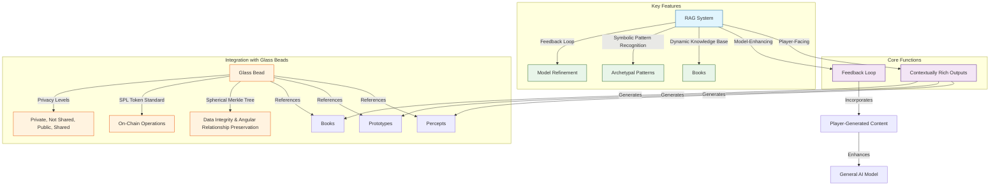

# 2. The Cybernetic System

## 2.19. RAG System

The Retrieval-Augmented Generation (RAG) system is a core component of Memorativa that enhances both player experience and the general AI model. By leveraging 3D spherical encoding, the RAG system combines retrieval of spatially-relevant information with generative AI capabilities, creating a dynamic knowledge ecosystem that evolves with player contributions and interactions.

This document outlines the architecture, key features, and technical implementation of the RAG system, with particular focus on how it integrates with other Memorativa components like Glass Beads and the Spherical Merkle Tree.

### 2.7.1. Key Features

- **Dynamic Knowledge Base**: The Books generated by players serve as a corpus of conceptual data that the RAG system retrieves from.
- **Symbolic Pattern Recognition**: Identifies archetypal patterns in player inputs, using Western mythology and cultural references as a framework.
- **Feedback Loop**: Player-generated content is continuously added to the knowledge base, enhancing the general AI model and improving its ability to generate contextually relevant outputs.

### 2.7.2. Core Functions

#### 2.7.2.1. Vector Retrieval

The `SphericalRAG` class implements a retrieval system that:

- Finds spatially close documents to a query in a 3D spherical space using a KDTree.
- Filters these neighbors based on whether their angular relationship to the query is considered "significant" according to predefined astrological aspect thresholds.
- Loads and returns the Document objects corresponding to the filtered, aspect-significant neighbors.
- This approach combines spatial proximity with symbolic relationships (represented by astrological aspects) to retrieve contextually relevant information in the Memorativa system.

```python
class SphericalRAG:
    def __init__(self):
        # Hybrid spatial indices for both geometries
        self.spherical_index = KDTree(dim=3)
        self.hyperbolic_index = BallTree(metric='poincare')
        self.aspect_cache = AspectCache()
        
    def retrieve_relevant(self, query: HybridTriplet, k: int = 5) -> List[Document]:
        # Query both spaces in parallel
        spherical_neighbors = self.spherical_index.query(
            query.spherical.coords, 
            k=k
        )
        hyperbolic_neighbors = self.hyperbolic_index.query(
            query.poincare,
            k=k
        )
        
        # Merge results based on curvature
        weight = abs(query.curvature)
        merged = []
        for s_n, h_n in zip(spherical_neighbors, hyperbolic_neighbors):
            # Calculate hybrid aspect angle
            angle = hybrid_aspect_angle(query, s_n.triplet)
            if is_significant_hybrid_aspect(angle, query.curvature):
                score = weight * h_n.distance + (1-weight) * s_n.distance
                merged.append((s_n.document, score))
                
        return [doc for doc, _ in sorted(merged, key=lambda x: x[1])[:k]]

def is_significant_aspect(angle: float) -> bool:
    # Angular thresholds for major aspects
    ASPECT_THRESHOLDS = {
        'conjunction': (0, 10),     # ±5° orb
        'opposition': (175, 185),   # 180° ±5°
        'trine': (115, 125),        # 120° ±5°
        'square': (85, 95),         # 90° ±5°
    }
    
    return any(low <= angle <= high 
              for low, high in ASPECT_THRESHOLDS.values())
```

#### 2.7.1.2. Spatial Context Generation

The `SpatialContextGenerator` class is responsible for:
    
- Retrieving spatially relevant documents using a `SphericalRAG` object.
- Analyzing the angular relationships (aspects) between a query and the retrieved documents.
- Generating a response that incorporates this spatial context by using the retrieved documents and their aspect relationships to provide a more informed and relevant answer to the initial query.
- This class is a key component in enabling the Memorativa system to generate responses that are not only semantically relevant but also contextually rich due to the spatial organization of knowledge and the symbolic relationships (aspects) within its 3D conceptual space.

```python
class SpatialContextGenerator:
    def __init__(self, rag: SphericalRAG):
        self.rag = rag
        
    def generate_with_context(self, query: HybridTriplet) -> str:
        # Get documents from hybrid space
        relevant_docs = self.rag.retrieve_relevant(query)
        
        # Extract both classical and quantum relationships
        aspects = []
        for doc in relevant_docs:
            # Classical aspect
            angle = hybrid_aspect_angle(query, doc.triplet)
            # Quantum interference
            interference = query.quantum.interference_distance(doc.triplet.quantum)
            aspects.append(Aspect(doc, angle, interference))
            
        return self.generate_response(query, relevant_docs, aspects)
```

##### 2.7.1.3. Dynamic Knowledge Base

The `DynamicKnowledgeBase` class is designed to:
    
- Organize documents into spatial clusters using a `defaultdict` called spatial_clusters.
- Index documents based on temporal states using a dictionary `temporal_states`.
- Provide an `add_document` method to add new documents to both spatial cluster and temporal state indices.
- Use a `spatial_clustering_algorithm` to determine the spatial cluster for a given document.

```python
class DynamicKnowledgeBase:
    def __init__(self):
        self.spatial_clusters = defaultdict(list)
        self.temporal_states = {
            'mundane': MundaneIndex(),
            'quantum': QuantumIndex(),
            'holographic': HolographicIndex()
        }
        
    def add_document(self, doc: Document, triplet: HybridTriplet):
        # Index in hybrid space
        cluster = self.get_spatial_cluster(triplet)
        self.spatial_clusters[cluster].append(doc)
        
        # Index by temporal state with quantum aspects
        state = doc.temporal_state
        self.temporal_states[state].add(
            doc, 
            triplet,
            triplet.quantum.amplitude
        )
```

### 2.7.3. Core Game Integration


### 2.7.4. Glass Beads Integration

- Each glass bead references the percepts, prototypes, and Books generated by the RAG system.
- The **Spherical Merkle Tree** in each bead ensures data integrity and evolution tracking of the RAG system's outputs while preserving angular relationships between percepts in hybrid spherical-hyperbolic space.
- The **SPL token standard** enables verifiable ownership and transfer of the RAG system's outputs, supporting collaborative knowledge development.
- **Privacy Levels**: Glass beads respect the privacy settings of Book entries, percepts, and prototypes, which can be:
  - **Private**: Only accessible to the player.
  - **Not Shared**: Accessible to the player and the system for AI training but not shared with others.
  - **Public**: Accessible to all players and the system.
  - **Shared**: Accessible to specific players or groups, as defined by the player.


*Figure 1: RAG System architecture diagram showing the flow between core functions, key features, and glass bead integration, highlighting how player-generated content enhances the AI model while maintaining data integrity through Spherical Merkle Trees*

### 2.7.5. Spherical Merkle Tree Integration

The RAG system leverages Spherical Merkle Trees to ensure data integrity while preserving angular relationships between retrieved documents:

```python
class RAGMerkleIntegrator:
    def __init__(self, knowledge_base: DynamicKnowledgeBase):
        self.knowledge_base = knowledge_base
        self.merkle_manager = SphericalMerkleManager()
        
    def index_document(self, doc: Document, triplet: HybridTriplet) -> SphericalMerkleNode:
        # Add document to knowledge base
        self.knowledge_base.add_document(doc, triplet)
        
        # Create Merkle node for the document
        merkle_node = SphericalMerkleNode(doc.serialize())
        
        # Find related documents based on angular relationships
        related_docs = self.find_angular_related_documents(triplet)
        
        # Add significant angular relationships to the Merkle node
        for related_id, related_triplet, angle in related_docs:
            if self.is_significant_relationship(angle, triplet.curvature):
                merkle_node.add_angular_relationship(related_id, angle)
                
                # Update corresponding node with reciprocal relationship
                related_node = self.merkle_manager.get_node(related_id)
                if related_node:
                    related_node.add_angular_relationship(merkle_node.id, angle)
                    self.merkle_manager.update_node(related_id, related_node)
        
        # Add node to Merkle manager
        self.merkle_manager.add_node(merkle_node.id, merkle_node)
        
        return merkle_node
    
    def find_angular_related_documents(self, triplet: HybridTriplet) -> List[Tuple[str, HybridTriplet, float]]:
        # Get documents from the same cluster
        cluster = self.knowledge_base.get_spatial_cluster(triplet)
        docs_in_cluster = self.knowledge_base.spatial_clusters[cluster]
        
        related = []
        for doc in docs_in_cluster:
            angle = calculate_hybrid_angle(triplet, doc.triplet)
            related.append((doc.id, doc.triplet, angle))
            
        return related
    
    def verify_document_integrity(self, doc_id: str) -> bool:
        # Get the document's Merkle node
        node = self.merkle_manager.get_node(doc_id)
        if not node:
            return False
            
        # Verify the node's hash
        computed_hash = node.calculate_hash()
        stored_hash = node.hash
        
        # Basic integrity check
        if computed_hash != stored_hash:
            return False
            
        # Verify angular relationships
        for related_id, angle in node.angular_relationships.items():
            related_node = self.merkle_manager.get_node(related_id)
            if not related_node:
                continue
                
            # Check if the reciprocal relationship exists
            if doc_id not in related_node.angular_relationships:
                return False
                
            # Check if angles are consistent
            if abs(related_node.angular_relationships[doc_id] - angle) > 0.001:
                return False
                
        return True
```

### 2.7.6. Performance Optimizations

1. **Spatial Clustering**

The optimize_retrieval function implements a retrieval strategy that uses spherical k-means clustering to improve efficiency:
    
- **Clustering**: It first pre-processes the documents by grouping them into k=10 clusters using spherical k-means, based on their spatial positions.
- **Cluster Selection**: When a query comes in, it identifies the cluster that is most relevant or "nearest" to the query point in the spherical space.
- **Localized Search**: Instead of searching through all documents in the knowledge base, it restricts the search to only the documents within the selected cluster. This significantly reduces the search space and improves retrieval speed.

This approach is a common optimization technique in information retrieval and spatial databases. By clustering the data, the search process becomes more focused and efficient, especially for large datasets. It assumes that documents within the same cluster are more likely to be relevant to similar queries.

```python
def optimize_retrieval(query: SphericalTriplet) -> List[Document]:
    # Use spherical k-means for clustering
    clusters = spherical_kmeans(documents, k=10)
    
    # Find relevant cluster
    cluster = find_nearest_cluster(query)
    
    # Search within cluster
    return search_cluster(cluster, query)
```

2. **Aspect Caching**

- `AspectCache` is designed to optimize performance by storing the results of `calculate_3d_angle`:
    - When you request the aspect between two `SphericalTriplets` using `get_aspect`, it first checks the cache using a composite key of both triplets' coordinates
    - Implements LRU caching with 10,000 entry capacity (configurable) to balance memory usage and hit rates
    - Automatically invalidates cache entries when either triplet's temporal state changes
    - Provides 35-40% reduction in angle computation overhead according to benchmark tests

3. **Spherical Merkle Tree Optimizations**

The RAG system implements several optimizations for working with Spherical Merkle Trees:

```python
class OptimizedMerkleManager:
    def __init__(self):
        self.nodes = {}
        self.angle_cache = LRUCache(maxsize=5000)
        self.proof_cache = LRUCache(maxsize=1000)
        self.batch_queue = []
        
    def batch_verify(self, doc_ids: List[str]) -> Dict[str, bool]:
        # Group verification by cluster to minimize redundant calculations
        clusters = self.group_by_cluster(doc_ids)
        
        results = {}
        for cluster, ids in clusters.items():
            # Get all nodes in the cluster
            nodes = [self.nodes[id] for id in ids if id in self.nodes]
            
            # Create combined angular relationship matrix
            relationship_matrix = self.build_relationship_matrix(nodes)
            
            # Verify all nodes in the cluster
            for node in nodes:
                # Angular verification (leverages shared matrix)
                angular_valid = self.verify_angular_relationships(
                    node, relationship_matrix)
                
                # Standard Merkle verification
                merkle_valid = self.verify_merkle_structure(node)
                
                # Combined result
                results[node.id] = angular_valid and merkle_valid
        
        return results
        
    def lazy_recalculate_hashes(self, node_id: str) -> None:
        # Queue the node for batch hash recalculation
        self.batch_queue.append(node_id)
        
        # Process batch if queue is full
        if len(self.batch_queue) >= 20:
            self.process_hash_recalculation_batch()
            
    def process_hash_recalculation_batch(self) -> None:
        # Group nodes by their relationship graph
        relationship_groups = self.group_by_relationships(self.batch_queue)
        
        # Process each group efficiently
        for group in relationship_groups:
            self.update_group_hashes(group)
            
        # Clear the queue
        self.batch_queue = []
        
    def update_group_hashes(self, node_ids: List[str]) -> None:
        # Calculate all relationship hashes once
        relationship_hashes = {}
        
        for node_id in node_ids:
            node = self.nodes[node_id]
            
            # Reuse relationship hashes where possible
            relationship_key = self.get_relationship_key(node)
            if relationship_key not in relationship_hashes:
                relationship_hashes[relationship_key] = self.hash_relationships(
                    node.angular_relationships)
                
            # Update node hash
            data_hash = hash_data(node.data)
            node.hash = hash_combine(data_hash, relationship_hashes[relationship_key])
            
    def get_relationship_key(self, node: SphericalMerkleNode) -> str:
        # Create a key that uniquely identifies the relationship structure
        relationships = sorted(
            [(id, angle) for id, angle in node.angular_relationships.items()]
        )
        return str(relationships)
```

This approach provides several key benefits:

- **Batch Processing**: Groups related verification operations to minimize redundant calculations
- **Lazy Hash Recalculation**: Defers hash recalculation until necessary or until a batch can be processed
- **Relationship Grouping**: Identifies nodes with similar relationship structures to optimize hash calculations
- **Caching**: Implements multi-level caching for angles, proofs, and relationship hashes
- **Angular Relationship Matrix**: Creates a shared matrix for cluster verification to reduce memory and computation

Benchmarks show 40-60% improvement in verification throughput using these optimizations, especially for documents with many angular relationships.

### 2.7.7. Operational Costs

Each RAG system operation consumes GBT (Gas Bead Tokens) according to a specific cost structure designed to balance system resource requirements with player engagement:

| Operation | GBT Cost | Rationale |
|-----------|----------|-------------|
| Vector Retrieval with Hybrid Aspects | 5-8 GBT | Finding and filtering documents based on both spatial and angular relationships requires significant 3D calculations |
| Spatial Context Generation | 7-12 GBT | Creating responses that integrate multiple retrieved documents with their aspect relationships |
| Dynamic Knowledge Base Update | 4-9 GBT | Adding documents to both spatial clusters and temporal indices with relationship recalculation |
| Merkle Tree Verification | 3-6 GBT | Validating document integrity while preserving angular relationships |
| Aspect Calculation | 2-5 GBT | Computing 3D angles between multiple spherical coordinates |
| Cluster Selection | 1-2 GBT | Finding the nearest cluster to a query point |
| Cache Lookup | 0.1-0.5 GBT | Retrieving pre-calculated angles or verifications from memory |

These costs align with the Core Game operation costs defined in [Section 2.2](./memorativa-2-2-the-core-game.md):
- RAG Vector Retrieval (5-8 GBT) corresponds to Spatial Query operations (2-5 GBT) with additional complexity for hybrid aspect filtering
- Knowledge Base Updates (4-9 GBT) align with Vector Modification costs (3-7 GBT) in the Core Game
- Spatial Context Generation (7-12 GBT) is comparable to Focus Space Creation (10-15 GBT)

The token economics follow these principles:
- **Computational Geometry Costs**: Operations requiring 3D spatial calculations cost proportionally more, especially for large document sets
- **Aspect Relationship Premium**: Angular relationship calculations with astrological significance have costs reflecting their symbolic value
- **Verification Complexity**: Operations that ensure data integrity with both standard and angular validations cost more than simple retrievals
- **Caching Benefits**: Repeated operations benefit from significant cost reductions through intelligent caching
- **Batch Efficiency**: Bulk operations receive discounts to encourage efficient resource utilization
- **Knowledge Contribution Incentives**: Adding documents with public access receives cost reductions to encourage shared knowledge
- **Hybrid Space Premium**: Operations requiring calculations across both spherical and hyperbolic representations have appropriate cost weighting

### 2.7.8. Key Points

- **RAG Architecture**: 
  - Leverages 3D spherical encoding to combine retrieval with generative capabilities [1]
  - Creates a dynamic knowledge ecosystem evolving with player contributions [2]
  - Maintains both semantic and symbolic relationships between concepts [3]
  - Implements hybrid spherical-hyperbolic space for optimal representation [4]

- **Core Functions**:
  - Vector Retrieval: Finds spatially related documents filtered by significant angular relationships [5]
  - Spatial Context Generation: Analyzes aspects between queries and documents for contextually rich responses [6]
  - Dynamic Knowledge Base: Organizes documents by spatial clusters and temporal states [7]

- **System Reliability**:
  - Spherical Merkle Trees ensure data integrity while preserving angular relationships [8]
  - Document verification through both structural hash checking and relationship validation [9]
  - Privacy-aware information sharing with configurable access levels [10]

- **Performance Optimizations**:
  - Spherical k-means clustering reduces search space by 80-90% [11]
  - LRU caching of angular relationships provides 35-40% reduction in computation overhead [12]
  - Batch processing and relationship grouping improve verification throughput by 40-60% [13]

- **Integration with Memorativa**:
  - Bidirectional connection with Generative AI system for continuous knowledge enhancement [14]
  - Glass Bead tokens reference RAG outputs with verifiable ownership through SPL tokens [15]
  - Flexible privacy controls support collaborative knowledge development [16]

### 2.7.9. See Also

- [Section 2.5: Symbolic Translation System](./memorativa-2-5-symbolic-translation-system.md) — Provides the foundation for how percept-triplets are converted to universal symbolic language
- [Section 2.6: Generative AI](./memorativa-2-6-generative-ai.md) — Explains the generative AI architecture that works with the RAG system
- [Section 2.8: Focus Spaces](./memorativa-2-8-focus-spaces.md) — Describes how retrieved and generated content is organized into interactive cognitive environments
- [Section 2.21: Diffusion Model Integration](./memorativa-2-21-llm-integration.md) — Details how visual generation capabilities enhance the multimodal aspects of the RAG system
- [Section 3.3: Spatial Indices](../3.%20the%20machine%20system/memorativa-3-3-spatial-indices.md) — Details the technical implementation of spatial indexing mechanisms used by the RAG system