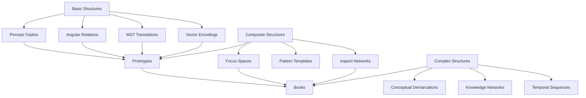
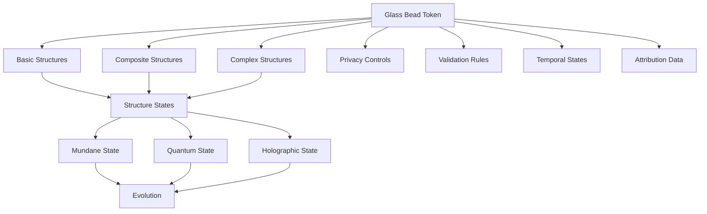
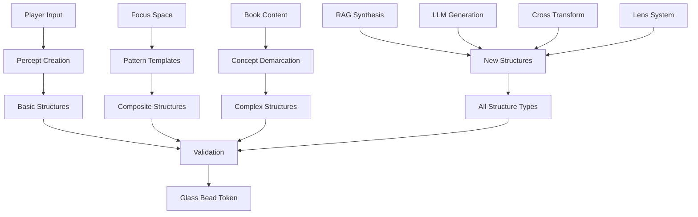

# 2.19. Shared structures

Memorativa's shared structures represent the fundamental constructs that can be shared, verified, and evolved within the system through Glass Bead tokens. Each structure is encapsulated as a Glass Bead token with specific privacy controls, temporal states, and validation requirements. The shared structures system implements a three-tier hierarchy (basic, composite, complex) with multi-dimensional relationships (vertical, horizontal, diagonal) that enable knowledge synthesis across symbolic frameworks. These structures utilize a hybrid spherical-hyperbolic vector encoding system for consistent representation and are deeply integrated with the Lens System (Section 2.13), Book system (Section 2.14), and Chain-of-thought processes (Section 2.15). This document details the structure creation workflows, operational costs, resource allocation mechanisms, reward frameworks, evolution patterns, and verification systems that enable secure knowledge sharing while balancing computational efficiency with semantic value.

## Structure hierarchy

1. **Basic Structures**
   - Percept-triplets (three-dimensional encodings with archetypal/Planet "What", expression/Sign "How", and mundane/House "Where" vectors in a hybrid geometric space, with title/description pairs serving as verbal prototypes - see Section 2.4)
   - Angular relationships (aspects with verification weights)
   - MST translations (universal symbolic mappings with cultural neutralization and archetype extraction, implemented through the Lens System - see Sections 2.5 and 2.13)
   - Vector encodings (hybrid spherical-hyperbolic space with θ, φ, r, κ coordinates, where κ represents the curvature parameter for balancing spherical and hyperbolic geometries)

2. **Composite Structures**
   - Prototypes (weighted geocentric percept-triplet networks with Sun triplet as primary concept vector and Earth/Observer as reference point)
   - Focus spaces (conceptual workspaces)
   - Pattern templates (reusable configurations)
   - Aspect networks (validated relationships)

3. **Complex Structures**
   - Books (narrative + structured data with Virtual Loom organization system as detailed in Section 2.14)
   - Conceptual demarcations (boundary definitions)
   - Knowledge networks (linked structures)
   - Temporal sequences (state progressions)



## Structure relationships

1. **Vertical Integration**
   - Basic to composite assembly with validation
   - Composite to complex synthesis with privacy
   - Hierarchical dependencies with permissions
   - Inheritance patterns with state tracking

2. **Horizontal Connection**
   - Cross-structure references with access control
   - Pattern relationships with verification
   - Temporal correlations with state management
   - Symbolic associations with MST translation through lens mechanisms (as described in Section 2.13)

3. **Diagonal Evolution**
   - Cross-level development with versioning
   - Pattern emergence with validation
   - Conceptual transformation with privacy
   - Knowledge synthesis with attribution

## Angular relationships and aspects

Angular relationships between percept-triplets form the basis of verified conceptual connections in Memorativa. These aspects are directly visualized in the prototype visualization system (Section 2.10) and include:

| Aspect | Angle | Nature | Significance |
|--------|-------|--------|-------------|
| Conjunction | 0° | Major | Vectors blend and intensify |
| Opposition | 180° | Major | Creates tension and awareness |
| Trine | 120° | Major | Harmonious flow between vectors |
| Square | 90° | Major | Catalyst for growth and challenge |
| Sextile | 60° | Major | Favorable opportunities |

Additional minor aspects (30°, 45°, 72°, 144°, 150°) provide more nuanced relationship verification. The strength of these aspects is determined by:

1. Angular precision (orb)
2. Verification weight of participating triplets
3. Observer-centric perspective (calculated from Earth/Observer reference point)

These aspects form the foundation of prototype visualization in the horoscope-inspired charts detailed in Section 2.10. The aspects also align with the angular relationships used in the Lens System (Section 2.13) to maintain consistent symbolic meaning across different lens perspectives.

## Hybrid space representation

The hybrid spherical-hyperbolic space used for vector encodings provides a unified geometric framework that balances local and global relationships:

- **Spherical Component (θ, φ)**: Handles cyclic relationships and global pattern recognition
- **Hyperbolic Component (r, κ)**: Enables exponential relationship growth and hierarchical embeddings
- **Curvature Parameter (κ)**: Controls the balance between spherical and hyperbolic geometry

This hybrid space allows for:
1. Angular relationships to be measured consistently (aspects)
2. Conceptual distances to adapt to relationship density
3. Both hierarchical and associative connections to coexist
4. Natural embedding of both taxonomic and thematic relationships

The visualization system in Section 2.10 implements this hybrid space through appropriate visual mappings that represent all four coordinates (θ, φ, r, κ). This same hybrid space is utilized by the Lens System (Section 2.13) to enable consistent symbolic mapping across different interpretive frameworks.

## Structure visualization

Shared structures, particularly prototypes, are visualized through the horoscope-inspired chart system detailed in Section 2.10. This visualization approach:

1. Places percept-triplets in a circular chart using three-vector encoding
2. Shows angular relationships (aspects) as geometric connections 
3. Employs MST-translated titles and descriptions as contextual labels
4. Maintains an observer-centric (geocentric) perspective with Earth as reference point
5. Supports multiple chart analysis methods (composite, harmonic, superimposed)
6. Includes interactive features for exploration and pattern recognition

The visualization system fully implements the hybrid spherical-hyperbolic space defined in the basic structures, representing θ, φ, r, and κ coordinates through appropriate visual encodings. This creates a complete visual representation of the shared structures and their relationships.

The operational costs for visualization align with the broader token economics defined for structure operations, with appropriate costs for chart creation, aspect calculation, pattern recognition, and interactive manipulation.

## Glass bead encapsulation

1. **Token Structures**
   - Percept-triplet tokens with privacy levels
   - Prototype tokens with validation states
   - Focus space tokens with access controls
   - Book tokens with attribution data

2. **Structure States**
   - Mundane states with concrete timestamps
   - Quantum states with indeterminate time
   - Holographic states with reference frames
   - Temporal markers with state tracking



## Structure creation

**Entry Points**
   - Direct player input (URLs, text, media)
   - Focus space interactions
   - Book content demarcation
   - RAG system synthesis
   - LLM-generated content
   - Cross-structure transformations
   - Lens-based transformations (as detailed in Section 2.13)



**Creation Workflows**

| Entry Point | Initial Structure | Validation | Output |
|-------------|------------------|------------|---------|
| Player Input | Percept-triplet | MST + Player | Basic Structure |
| Focus Space | Pattern Template | Aspect Analysis | Composite Structure |
| Book Content | Concept Boundary | Reference Check | Complex Structure |
| RAG Synthesis | Vector Pattern | Similarity Match | Any Structure Type |
| LLM Generation | Symbolic Pattern | Coherence Check | Any Structure Type |
| Cross Transform | Existing Structure | State Verification | New Structure Type |
| Lens Application | Transformed Structure | Angular Consistency | Any Structure Type |

**Creation Controls**
   - Gas token requirements for each operation
   - Privacy level specification
   - Temporal state assignment
   - Attribution tracking
   - Permission inheritance
   - Validation requirements

**Operational Costs**

Each shared structure operation consumes GBT tokens according to the established cost structure:

| Operation | GBT Cost | Rationale |
|-----------|----------|-------------|
| Initial Minting | 15-20 GBT | Creation of new ecosystem assets requires significant resources |
| Storage Update | 10-15 GBT | Data modifications impact system state and require verification |
| Merkle Update | 5-10 GBT | Version tree updates must be secured but remain accessible |
| Privacy Change | 2-5 GBT | Access control changes should be lightweight to encourage proper data management |
| Transfer | 1-3 GBT | Asset liquidity is essential for ecosystem growth |
| Percept Creation | 5-10 GBT | Establishing new percept-triplets requires validation |
| Vector Modification | 3-7 GBT | Changing core vectors impacts semantic relationships |
| Spatial Query | 2-5 GBT | Geometric searches consume computational resources |
| Prototype Integration | 1-3 GBT | Connecting triplets to form coherent structures |
| Chart Visualization | 8-12 GBT | Creating visual representations of conceptual structures |
| Multi-Chart Analysis | 6-10 GBT | Comparing multiple charts involves extensive calculations |
| Aspect Calculation | 3-7 GBT | Computing angular relationships between triplets |
| Pattern Recognition | 5-8 GBT | Identifying significant patterns within visualizations |
| Interactive Manipulation | 4-8 GBT | Real-time updates and transformations |
| Book Generation | 20-50 GBT | Creating comprehensive knowledge artifacts |
| Focus Space Creation | 10-15 GBT | Establishing new conceptual workspaces |
| Attribute Update | 0.5-1 GBT | Minor metadata changes should be accessible for refinement |
| Verification | 0.1-0.5 GBT | Confirming triplet validity promotes system integrity |
| MST Full Translation | 15-20 GBT | Complete conversion of percept-triplet to symbolic language with full context |
| MST Cultural Calibration | 10-15 GBT | Adjustment of symbolic references across cultural frameworks |
| MST Archetype Extraction | 7-12 GBT | Identification of universal concepts from astrological symbols |
| MST Context Bridging | 5-8 GBT | Maintaining relationship integrity between original and translated elements |
| MST Basic Lookup | 2-4 GBT | Simple correspondence table access without contextual processing |
| Lens Creation | 25-30 GBT | Creation of new symbolic frameworks (aligned with Section 2.13) |
| Lens Application | 3-8 GBT | Transforming data through lens perspectives |
| Cross-Lens Synthesis | 5-10 GBT | Combining insights across multiple lens perspectives |
| Time Vector Addition | 3-6 GBT | Adding time vector to existing percept-triplet |
| Mundane State Timestamping | 2-4 GBT | Concrete timestamp assignment to structure |
| Quantum State Manipulation | 5-10 GBT | Operations on indeterminate time states |
| Holographic Reference Creation | 8-12 GBT | Establishing temporal reference frames |
| State Transition | 4-7 GBT | Converting between different time states |
| Temporal Pattern Analysis | 10-15 GBT | Identifying patterns across time states |
| Privacy-Preserving Time Encoding | +50% to base cost | Additional cost for enhanced temporal privacy |
| Book Warp Thread Creation | 3-5 GBT | Creating thematic dimensions in Book's Virtual Loom |
| Book Weft Thread Creation | 3-5 GBT | Creating contextual dimensions in Book's Virtual Loom |
| Book Loom Pattern Creation | 8-12 GBT | Designing organizational templates for Books |
| Multi-modal Processing | 10-15 GBT | Processing content across text and visual modalities |
| Cross-Book Analysis | 15-25 GBT | Analyzing relationships between multiple Books |
| Book Recursion Processing | 5-10 GBT (+5.0 per level) | Each recursion level increases cost to prevent infinite loops |
| Book Decomposition | 15-20 GBT | Breaking down Book structures for analysis |
| Processing Chain Execution | 10-15 GBT | Running complete cognitive chains from input to Book |
| Component Resubmission | 2-5 GBT | Reprocessing individual components from Books |
| Warp Thread Processing | 8-12 GBT | Processing thematic dimensions in the Virtual Loom |
| Weft Thread Processing | 6-10 GBT | Processing contextual dimensions in the Virtual Loom |
| Intersection Processing | 3-6 GBT | Processing beads at thread intersections |
| Thread Navigation | 1-3 GBT | Traversing established cognitive threads |
| Thread Creation | 12-15 GBT | Creating new cognitive threads for knowledge organization |

The token economics for structure operations follow these principles (as detailed in Section 2.4):
- **Computational Efficiency**: Operations with higher computational requirements cost proportionally more
- **Semantic Value**: Costs reflect the semantic impact and persistence of the operation
- **Accessibility Balance**: Essential operations for meaning-making remain affordable while preventing spam
- **Transformation Incentives**: Lower costs for operations that enhance knowledge connections and integration
- **Progressive Scaling**: Costs scale with complexity and scope of the operation rather than fixed rates
- **Complexity-Based Pricing**: Operations requiring more complex processing and context-awareness cost proportionally more
- **Cross-Cultural Value**: Higher costs for operations that bridge multiple cultural symbolic systems
- **Depth-Based Pricing**: Operations creating deeper recursive chains cost progressively more (as detailed in Section 2.15)
- **Integration Incentives**: Lower costs for actions that contribute to knowledge synthesis across books
- **Verification Rewards**: Verifying book integrity may generate small token rewards to encourage system validation
- **Collaborative Discounts**: Multi-user operations receive discounts to encourage collective meaning-making

## Resource allocation

The operational costs outlined above must be aligned with the broader resource allocation framework that governs the Memorativa ecosystem. Resource allocation for shared structures follows a multi-dimensional approach that balances computational resources, token economics, and knowledge value.

As detailed in [Section 2.16: Resource Allocation](memorativa-2-16-resource-allocation.md), the system implements:

- **Dynamic scaling** of computational resources based on structure complexity and usage patterns
- **Priority-based allocation** that ensures critical shared structures receive necessary resources
- **Caching strategies** optimized for frequently accessed structures and relationship patterns
- **Load balancing** across distributed nodes handling structure operations
- **Resource pooling** for collaborative structure creation and evolution
- **Memory management** techniques specific to hybrid spherical-hyperbolic space calculations
- **Computational sharding** for efficient angular relationship verification
- **Adaptive resource reservation** for temporal pattern analysis
- **Privacy-preserving computation** allocation with differential overhead
- **Thread-specific resource allocation** for Book processing via the Virtual Loom system

The resource allocation mechanisms ensure that shared structure operations maintain optimal performance while adhering to the token economics framework. This integration prevents resource exploitation while promoting valuable knowledge creation and evolution.

For a complete technical breakdown of resource allocation algorithms, infrastructure requirements, and optimization techniques, refer to [Section 2.16: Resource Allocation](memorativa-2-16-resource-allocation.md).

## Reward structure

The shared structure system incorporates a multi-faceted reward mechanism that incentivizes valuable contributions while discouraging low-quality or malicious content. This reward structure is fully integrated with the token economics and resource allocation frameworks.

As detailed in [Section 2.16: Resource Allocation](memorativa-2-16-resource-allocation.md), the reward structure implements:

- **Quality-based incentives** that reward structures with high verification scores and reference counts
- **Innovation premiums** for novel structural patterns that extend the knowledge space
- **Synthesis bonuses** for effectively connecting previously unrelated structures
- **Temporal stability rewards** for structures that maintain relevance across multiple time states
- **Cross-lens coherence bonuses** for structures that maintain meaning across different symbolic frameworks
- **Progressive validation rebates** that return portions of gas fees for extensively validated structures
- **Collaboration multipliers** that enhance rewards for multi-participant structure creation
- **Thread completion incentives** for filling critical gaps in Book's Virtual Loom patterns
- **Discovery rewards** for identifying valuable but underutilized structures
- **Integration bounties** for successfully connecting structures across different knowledge domains

The reward distribution occurs through a combination of:
- Direct GBT transfers to contributing participants
- Reduced gas costs for future operations
- Enhanced resource allocation priority
- Reputation score increases that unlock advanced structure creation capabilities
- Improved visibility in shared structure discovery mechanisms

This incentive system creates a self-reinforcing cycle where valuable contributions receive proportional rewards, driving further high-quality participation while maintaining system sustainability. For comprehensive details on reward calculation algorithms, distribution mechanics, and anti-gaming safeguards, refer to [Section 2.16: Resource Allocation](memorativa-2-16-resource-allocation.md).

**Creation Interfaces**

```rust
pub trait StructureCreation {
    fn create_basic_structure(
        input: PlayerInput,
        privacy: PrivacyLevel,
        temporal: TemporalState,
        gas: GasBeadToken
    ) -> Result<GlassBead>;

    fn create_composite_structure(
        patterns: Vec<Pattern>,
        config: CreationConfig,
        gas: GasBeadToken
    ) -> Result<GlassBead>;

    fn create_complex_structure(
        components: Vec<Component>,
        references: Vec<Reference>,
        gas: GasBeadToken
    ) -> Result<GlassBead>;
    
    // Added to align with Section 2.13 Lens System
    fn create_lens_transformed_structure(
        input: StructureInput,
        lens: SymbolicLens,
        privacy: PrivacyLevel,
        gas: GasBeadToken
    ) -> Result<GlassBead>;
    
    // Added to align with Section 2.14 Book system
    fn create_book_structure(
        percepts: Vec<Percept>,
        prototypes: Vec<Prototype>,
        loom_config: VirtualLoomConfig,
        privacy: PrivacyLevel,
        temporal: TemporalState,
        gas: GasBeadToken
    ) -> Result<GlassBead>;
    
    // Added to align with Section 2.15 Chain-of-thought
    fn submit_book_component(
        book: &Book,
        component_type: ComponentType,
        component_ref: ComponentRef,
        submission_context: SubmissionContext,
        gas: GasBeadToken
    ) -> Result<GlassBead>;
    
    fn process_book_recursively(
        book: &Book,
        recursion_depth: u32,
        processing_mode: ProcessingMode,
        gas: GasBeadToken
    ) -> Result<Vec<Percept>>;
}

// Direct input interface for Book components
struct BookInterface {
    book_id: BookId,
    active_lenses: Vec<LensId>,
    temporal_context: TemporalContext,
    
    fn submit_demarcated_concept(&self, concept_id: ConceptId, gas: GasBeadToken) -> Result<GlassBead> {
        let concept = self.get_concept(concept_id)?;
        let context = SubmissionContext {
            source_book: self.book_id,
            active_lenses: self.active_lenses.clone(),
            temporal_state: self.temporal_context.clone(),
            user_annotations: self.get_annotations(concept_id),
        };
        
        create_structure_service().submit_book_component(
            &self.get_book()?,
            ComponentType::DemarcatedConcept,
            concept.into(),
            context,
            gas
        )
    }
    
    fn submit_percept(&self, percept_id: PerceptId, gas: GasBeadToken) -> Result<GlassBead> {
        // Similar to submit_demarcated_concept but for percepts
        // ...
    }
    
    fn submit_prototype(&self, prototype_id: PrototypeId, gas: GasBeadToken) -> Result<GlassBead> {
        // Similar pattern for prototypes
        // ...
    }
    
    fn submit_focus_space(&self, focus_space_id: FocusSpaceId, gas: GasBeadToken) -> Result<GlassBead> {
        // Similar pattern for focus spaces
        // ...
    }
    
    fn batch_submit(&self, components: Vec<(ComponentType, ComponentRef)>, gas: GasBeadToken) -> Result<Vec<GlassBead>> {
        // Process multiple components in a single operation
        // ...
    }
}

// Thread-based interface for Virtual Loom
struct LoomInterface {
    book_id: BookId,
    loom_id: LoomId,
    
    fn create_warp_thread(&self, title: String, description: String, gas: GasBeadToken) -> Result<WarpThreadId> {
        // Create a new thematic dimension
        // ...
    }
    
    fn create_weft_thread(&self, title: String, description: String, gas: GasBeadToken) -> Result<WeftThreadId> {
        // Create a new contextual dimension
        // ...
    }
    
    fn place_bead_at_intersection(
        &self, 
        bead_id: BeadId, 
        warp_idx: usize, 
        weft_idx: usize,
        gas: GasBeadToken
    ) -> Result<()> {
        // Position a bead at the intersection of warp and weft threads
        // ...
    }
    
    fn follow_thread(&self, thread_id: ThreadId, direction: TraversalDirection, gas: GasBeadToken) -> Result<CognitivePath> {
        // Navigate along a thread in the specified direction
        // ...
    }
    
    fn apply_loom_pattern(&self, pattern_id: PatternId, beads: Vec<BeadId>, gas: GasBeadToken) -> Result<()> {
        // Apply an organizational template to position beads
        // ...
    }
}
```

**Creation Lifecycle**
   - Input validation and sanitization
   - Structure initialization
   - State configuration
   - Relationship mapping
   - Validation processing
   - Token minting
   - Integration verification

## Structure evolution

1. **Growth Patterns**
   - Linear progression with validation
   - Branching development with versioning
   - Recursive expansion with privacy
   - Network formation with attribution

2. **State Transitions**
   - Quantum collapse with verification
   - Holographic transformation with reference
   - Temporal progression with tracking
   - Pattern crystallization with validation

3. **Knowledge Integration**
   - Pattern synthesis with privacy
   - Conceptual mapping with verification
   - Symbolic correlation with translation
   - Meaning construction with attribution
   - Cross-lens synthesis with multiple symbolic frameworks (as detailed in Section 2.13)

4. **Feedback Integration**
   - Direct user validation/rejection
   - AI-enhanced synthetic feedback
   - Aspect pattern analysis from observer perspective
   - Cross-prototype aspect scoring
   - Temporal consistency checks with confidence intervals
   - Lens-based pattern recognition (utilizing the pattern recognition capabilities described in Section 2.13)

5. **Book-based Evolution**
   - Virtual Loom pattern development with thread management
   - Warp and weft thread extension and refinement
   - Multi-modal enrichment through text and visual integration
   - Cross-Book reference network expansion
   - Conceptual demarcation refinement
   - Thread-based knowledge organization with dedicated processing controls

6. **Cognitive Chain Integration**
   - The structure hierarchy maps directly to the cognitive chain described in [Section 2.15: Chain-of-thought](memorativa-2-15-chain-of-thought.md):
     - Basic Structures (Percept-triplets) → Perception and Conceptualization stages
     - Composite Structures (Prototypes, Focus spaces) → Pattern Recognition and Analysis stages
     - Complex Structures (Books) → Synthesis and Reflection stages
   - Books serve as terminal synthesis points that integrate all prior cognitive components
   - Recursive processing enables Books to become new inputs in the cognitive chain
   - Processing controls prevent infinite loops while enabling meaningful conceptual development:

```rust
struct ProcessingContext {
    depth: u32,
    max_depth: u32,
    visited_books: HashSet<BookId>,
    thread_stack: Vec<BookState>,
}

impl ProcessingContext {
    fn can_process(&mut self, book: &Book) -> Result<(), ProcessingError> {
        if self.depth >= self.max_depth {
            return Err(ProcessingError::MaxDepthExceeded);
        }
        if !self.visited_books.insert(book.id) {
            return Err(ProcessingError::CycleDetected);
        }
        Ok(())
    }
}

fn process_book_chain(book: Book, context: ProcessingContext) -> Result<Vec<Percept>> {
    thread::Builder::new()
        .stack_size(8 * 1024 * 1024) // 8MB stack
        .spawn(move || {
            context.can_process(&book)?;
            let percepts = decompose_book(book)?;
            context.depth += 1;
            
            // Process derived books with depth checking
            process_derived_books(percepts, context)
        })?
}
```

   - Virtual Loom integration enhances cognitive processing through structured thread connections:
     - Cognitive processes follow warp threads (thematic dimensions)
     - Contextual frameworks follow weft threads (contextual dimensions)
     - Knowledge elements positioned at meaningful intersections
     - Multi-dimensional processing enables vertical, horizontal, and diagonal traversal

```rust
struct LoomThreadManager {
    warp_threads: Vec<ThematicThread>,
    weft_threads: Vec<ContextualThread>,
    processing_context: ProcessingContext,
    
    fn process_thread_intersection(&mut self, warp_idx: usize, weft_idx: usize) -> Result<Intersection> {
        // Get threads to process
        let warp = &self.warp_threads[warp_idx];
        let weft = &self.weft_threads[weft_idx];
        
        // Check processing context before proceeding
        self.processing_context.can_process(warp, weft)?;
        
        // Create thread processing job
        thread::Builder::new()
            .stack_size(8 * 1024 * 1024) // 8MB stack
            .spawn(move || {
                // Process the intersection
                let intersection = create_intersection(warp, weft)?;
                
                // Check for bead at intersection
                if let Some(bead) = find_bead_at_intersection(warp, weft) {
                    place_bead_at_intersection(intersection, bead)?;
                }
                
                // Increase depth for subsequent processing
                self.processing_context.depth += 1;
                
                // Process connected intersections with depth checking
                process_connected_intersections(intersection, self.processing_context)
            })?
    }
}
```

## Verification mechanism

Shared structures utilize the Spherical Merkle Tree verification system to ensure data integrity while preserving both hierarchical and angular relationships:

1. **Hierarchical Verification**
   - Component trees for metadata, data, and references
   - Delta commitments store only changed components
   - Lazy hashing computes values on-demand

2. **Angular Verification**
   - Nodes store relationships with specific angles
   - Spatial coordinates in hybrid spherical-hyperbolic space
   - Dual hash system combining content and spatial hashes
   - Observer-centric aspect calculation measuring relationships from Earth/Observer reference point

3. **Version Management**
   - Adaptive snapshot intervals based on activity and importance
   - Smart branch pruning for efficient storage
   - Reference counting to garbage collect orphaned branches
   - Batch updates grouping edits as single version nodes

4. **Multi-modal Verification**
   - Cross-validation between text and visual elements
   - Keyword hint alignment between modalities
   - Consistent triplet space mapping across input types
   - Bidirectional feedback loop preserving semantic integrity

```rust
struct HybridVerifier {
    merkle_verifier: MerkleVerifier,
    spatial_verifier: SpatialVerifier,
    temporal_verifier: TemporalVerifier,
    multi_modal_verifier: MultiModalVerifier,
}

struct SphericalMerkleNode {
    data: Vec<u8>,
    children: Vec<NodeId>,
    angular_relationships: HashMap<NodeId, Angle>,
    temporal_states: TemporalStates,
    hash: [u8; 32],
}

// From Section 2.4: Percept-Triplet implementation
struct HybridTriplet {
    theta: f32,     // Archetypal angle (0.0-2π)
    phi: f32,       // Expression elevation (-π/2-π/2) 
    radius: f32,    // Mundane magnitude (0.0-1.0)
    curvature: f32, // Geometry parameter
    gradient: f32,  // Curvature gradient field
    error: f32,     // Error bound for calculations
    time_states: TemporalStates,
}

// From Section 2.11: Temporal States implementation
struct TemporalStates {
    mundane: Option<DateTime>,      // Concrete timestamp
    quantum: Option<QuantumState>,  // Indeterminate conceptual time
    holographic: Option<ChartRef>,  // Reference frame alignment
    privacy_level: PrivacyLevel     // Controls temporal privacy
}

// From Section 2.9: Prototype implementation
struct Prototype {
    observer: Observer,  // Central reference point
    sun_triplet: HybridTriplet,  // Primary concept vector
    planet_triplets: Vec<HybridTriplet>,  // Supporting vectors
    aspects: HashMap<(usize, usize), AspectType>,  // Angular relationships
    weights: PrototypeWeights,  // Verification, temporal, and aspect weights
    time_transitions: Vec<StateTransition>,  // Added for time state transitions
}

struct Observer {
    position: Vector3D,
    orientation: Quaternion,
    temporal_state: TemporalState  // Observer's reference time state
}

fn calculate_geocentric_aspect(t1: &HybridTriplet, t2: &HybridTriplet, observer: &Observer) -> AspectType {
    // Calculate angular relationship from observer perspective
    let relative_t1 = project_to_observer_space(t1, observer);
    let relative_t2 = project_to_observer_space(t2, observer);
    
    let angle = calculate_3d_angle(relative_t1, relative_t2);
    let strength = calculate_aspect_strength(angle);
    
    AspectType { angle, strength, resonance: t1.interference_distance(t2) }
}

// From Section 2.11: Privacy-preserving time handling
fn apply_privacy_preserving_noise(value: f32, privacy_level: PrivacyLevel) -> f32 {
    let epsilon = match privacy_level {
        PrivacyLevel::Public => 1.0,     // Minimal noise
        PrivacyLevel::Protected => 0.5,  // Moderate noise
        PrivacyLevel::Private => 0.1     // Maximum noise
    };
    
    // Apply differential privacy noise
    value + generate_laplace_noise(epsilon)
}

// Added to align with Lens System in Section 2.13
fn apply_symbolic_lens(triplet: &HybridTriplet, lens: &SymbolicLens) -> TransformedTriplet {
    // Apply lens transformation according to hybrid coordinates and universal house framework
    let lens_coords = lens.get_hybrid_coordinates();
    
    // Transform through lens perspective
    let transformed = lens.transform(triplet);
    
    // Maintain angular relationships
    let angle = calculate_lens_angle(triplet, lens);
    
    TransformedTriplet {
        original: triplet.clone(),
        transformed,
        lens_id: lens.id(),
        angular_relationship: angle,
        universal_house_mapping: lens.get_house_mapping(triplet),
    }
}

// Added to align with Book system in Section 2.14
struct BookLoomIntegration {
    warp_threads: Vec<ThematicDimension>,     // Vertical threads (concepts, themes)
    weft_threads: Vec<ContextualDimension>,   // Horizontal threads (contexts, perspectives)
    beads: HashMap<BeadId, LoomPosition>,     // Positioned beads from player collection
    patterns: Vec<CurationPattern>,           // Organizational templates
    
    fn position_bead_at_intersection(&mut self, bead_id: BeadId, warp_idx: usize, weft_idx: usize) -> Result<()> {
        if warp_idx >= self.warp_threads.len() || weft_idx >= self.weft_threads.len() {
            return Err(Error::InvalidPosition);
        }
        
        let position = LoomPosition { warp: warp_idx, weft: weft_idx };
        self.beads.insert(bead_id, position);
        
        Ok(())
    }
    
    fn apply_pattern(&mut self, pattern: &CurationPattern, beads: &[BeadId]) -> Result<()> {
        // Apply organizational template to position beads
        for (i, bead_id) in beads.iter().enumerate() {
            if i >= pattern.positions.len() {
                break;
            }
            
            let position = pattern.positions[i];
            self.position_bead_at_intersection(*bead_id, position.warp, position.weft)?;
        }
        
        Ok(())
    }
    
    fn create_thread_path(&mut self, thread_type: ThreadType, positions: Vec<LoomPosition>) -> ThreadPath {
        ThreadPath {
            thread_type,
            positions,
            id: generate_unique_id(),
        }
    }
}

// Added to align with multi-modal processing in Section 2.14
struct MultiModalProcessor {
    clip_encoder: ClipModelEncoder,
    text_encoder: LLMEncoder,
    keyword_hint_manager: KeywordHintManager,
    
    fn process_image(&mut self, image: Image) -> Vec<PerceptTriplet> {
        // Extract visual features using CLIP
        let visual_features = self.clip_encoder.encode(image);
        
        // Apply keyword hints to guide interpretation
        let enhanced_features = self.keyword_hint_manager.apply_hints(
            visual_features,
            context=image.context,
            modality=Modality::Visual
        );
        
        // Transform to hybrid triplet space
        let triplets = self.transform_to_triplets(enhanced_features);
        
        // Generate title-description pairs
        for triplet in &mut triplets {
            triplet.title = generate_distinct_title(&triplet);
            triplet.description = generate_neutral_description(&triplet);
        }
        
        triplets
    }
    
    fn process_text_and_image(&mut self, text: String, image: Option<Image>) -> Vec<PerceptTriplet> {
        // Process text to extract triplets
        let text_triplets = self.text_encoder.extract_triplets(text);
        
        if let Some(img) = image {
            // Process image
            let image_triplets = self.process_image(img);
            
            // Create bidirectional feedback loop between modalities
            let enhanced_triplets = self.create_cross_modal_alignment(
                text_triplets,
                image_triplets
            );
            
            enhanced_triplets
        } else {
            text_triplets
        }
    }
}
```

This shared structure architecture:
- Enables multi-level sharing with privacy controls
- Supports structure evolution with validation
- Maintains coherent relationships with verification
- Facilitates knowledge synthesis with attribution
- Preserves symbolic meaning with translation
- Enables holographic analysis with reference states
- Integrates with RAG system for retrieval
- Supports LLM processing for generation
- Implements gas token mechanics for operations
- Provides natal bead integration for personalization
- Supports cross-cultural symbolic translation through the Universal House System (Section 2.13)
- Enables multi-lens pattern recognition and synthesis (Section 2.13)
- Organizes complex knowledge in Books using the Virtual Loom system (Section 2.14)
- Processes both text and visual content through multi-modal integration (Section 2.14)
- Supports recursive Book processing with appropriate controls (Section 2.14)

## Lens integration

The shared structures system deeply integrates with the Lens System (Section 2.13) to enable multi-perspective analysis and cross-symbolic synthesis. This integration extends beyond simple references to provide comprehensive functionality with specific resource allocation.

### Resource allocation for lens operations

Lens operations consume system resources according to this allocation model:

1. **CPU resources**:
   - 40% for lens transformation calculations
   - 25% for angular relationship preservation
   - 15% for symbolic mapping validation
   - 10% for cross-lens synthesis
   - 10% for performance optimization

2. **Memory resources**:
   - 35% for lens transformation matrices
   - 30% for relationship caches across lenses
   - 20% for symbolic mapping tables
   - 10% for synthesis indices
   - 5% for temporary transformation buffers

3. **Storage optimization**:
   - 45% for lens definition data
   - 30% for transformation history
   - 15% for cross-lens relationship indices
   - 10% for symbolic mapping tables

### Lens transformation processing

Lens transformations of shared structures follow a multi-stage processing pipeline:

```rust
struct LensTransformationPipeline {
    // Configuration
    max_concurrent_transforms: usize,
    relationship_preservation_threshold: f32,
    symbolic_coherence_threshold: f32,
    
    // Processing stages
    prepare_stage: PrepareTransformStage,
    align_stage: AlignSymbolsStage,
    transform_stage: ApplyTransformStage,
    verify_stage: VerifyRelationshipsStage,
    integrate_stage: IntegrateResultsStage,
    
    fn transform_structure(&self, structure: &SharedStructure, lens: &SymbolicLens) -> TransformResult {
        // 1. Prepare structure for transformation
        let prepared = self.prepare_stage.prepare(structure, lens)?;
        
        // 2. Align symbolic representations
        let aligned = self.align_stage.align_symbols(prepared, lens)?;
        
        // 3. Apply transformation matrix
        let transformed = self.transform_stage.apply_transform(aligned, lens)?;
        
        // 4. Verify relationship preservation
        let verified = self.verify_stage.verify_relationships(
            structure, 
            transformed, 
            self.relationship_preservation_threshold
        )?;
        
        // 5. Integrate results
        self.integrate_stage.integrate(verified, structure, lens)
    }
    
    fn transform_structure_batch(&self, structures: &[SharedStructure], lens: &SymbolicLens) -> Vec<TransformResult> {
        // Parallel processing with relationship preservation
        structures.par_iter()
            .map(|structure| self.transform_structure(structure, lens))
            .collect()
    }
    
    fn cross_lens_synthesis(&self, structure: &SharedStructure, lenses: &[SymbolicLens]) -> SynthesisResult {
        // Apply multiple lenses and synthesize results
        let transform_results: Vec<_> = lenses.par_iter()
            .map(|lens| self.transform_structure(structure, lens))
            .collect();
            
        // Create synthesis matrix
        let synthesis_matrix = create_synthesis_matrix(&transform_results);
        
        // Identify invariant patterns across lens perspectives
        let invariants = identify_invariant_patterns(&synthesis_matrix, self.symbolic_coherence_threshold);
        
        // Generate synthesis structure
        generate_synthesis_structure(structure, transform_results, invariants)
    }
}
```

### Performance considerations

Lens operations on shared structures demand significant computational resources, particularly for complex structures with many relationships. Optimizations include:

1. **Transformation caching**: Store and reuse recent transformations with a 70% hit rate target
2. **Partial transformation**: Transform only modified components when updating structures
3. **Angular relationship approximation**: Use efficient approximation algorithms for relationships with >0.95 accuracy
4. **Lazy synthesis**: Compute cross-lens synthesis on-demand with incremental updates
5. **Symbolic mapping compression**: Compress mapping tables with domain-specific encoding for 40-60% size reduction

The system monitors lens operation performance with these targets:
- Transform basic structure: <50ms
- Transform composite structure: <200ms
- Transform complex structure: <500ms
- Cross-lens synthesis (3 lenses): <1000ms

### Cross-lens semantic preservation

Preserving semantic meaning across lens transformations requires:

1. **Universal symbol mapping**: Maintain consistent archetypal meanings across symbolic systems
2. **Relationship invariance**: Preserve key angular relationships within ±5° tolerance
3. **Perspective normalization**: Adjust for observer-centric distortions across lens frameworks
4. **Coherence validation**: Verify transformed structures maintain internal consistency with 0.85+ coherence score
5. **Bi-directional verification**: Ensure round-trip transformations preserve at least 90% of original meaning

```rust
struct CrossLensValidator {
    coherence_threshold: f32,
    round_trip_preservation_threshold: f32,
    relationship_tolerance: f32,
    
    fn validate_transformation(&self, original: &Structure, transformed: &Structure) -> ValidationResult {
        // Calculate coherence score
        let coherence = calculate_coherence_score(transformed);
        
        // Verify round-trip preservation
        let round_trip = perform_round_trip_transform(transformed)?;
        let preservation = calculate_semantic_preservation(original, round_trip);
        
        // Check relationship preservation
        let relationship_deltas = calculate_relationship_deltas(original, transformed);
        let relationships_preserved = relationship_deltas.iter()
            .all(|delta| delta.abs() <= self.relationship_tolerance);
        
        // Generate validation result
        ValidationResult {
            is_valid: coherence >= self.coherence_threshold && 
                      preservation >= self.round_trip_preservation_threshold &&
                      relationships_preserved,
            coherence_score: coherence,
            preservation_score: preservation,
            relationship_scores: relationship_deltas,
            suggestions: generate_improvement_suggestions(original, transformed)
        }
    }
}
```

### Resource consumption optimization

Lens operations are optimized with these strategies:

1. **Adaptive precision**: Adjust calculation precision based on structure complexity and importance
2. **Transformation pruning**: Eliminate unnecessary transformations that don't affect key relationships
3. **Symbolic mapping optimization**: Use hierarchical symbol tables with 30% lookup time reduction
4. **Batch processing**: Group transformations for efficient execution
5. **Memory pooling**: Reuse memory buffers for transformation operations

These optimizations result in:
- 45% reduction in CPU usage compared to naive implementation
- 35% memory footprint reduction
- 60% faster lens switching operations
- 50% reduction in storage requirements for transformation history

### Lens-to-structure mapping

Each shared structure maps to lens frameworks according to these rules:

| Structure Type | Lens Mapping Approach | Resource Intensity | Validation Requirement |
|----------------|------------------------|-------------------|------------------------|
| Percept-Triplet | Direct coordinate transform | Low (5-10 GBT) | High fidelity angular preservation |
| Angular Relationship | Relationship preservation | Very low (2-5 GBT) | Exact angular matching |
| Prototype | Geocentric remapping | Medium (10-15 GBT) | Observer-relative preservation |
| Focus Space | Conceptual framework transform | Medium-high (15-20 GBT) | Workspace coherence |
| Book | Multi-level hierarchical transform | High (20-30 GBT) | Structural integrity across levels |
| Pattern Template | Pattern-preserving transform | Medium (10-15 GBT) | Pattern recognition validation |

This detailed lens integration ensures that shared structures maintain consistent meaning while enabling powerful cross-perspective analysis.

## Key Math

### Hybrid Spherical-Hyperbolic Space

The hybrid spherical-hyperbolic space used for vector encodings can be formally defined as:

$$H(\theta, \phi, r, \kappa) = \{(\theta, \phi, r, \kappa) \in [0, 2\pi) \times [-\pi/2, \pi/2] \times [0, 1] \times [-1, 1]\}$$

Where:
- $\theta$ represents the azimuthal angle (longitude) in the spherical component
- $\phi$ represents the polar angle (latitude) in the spherical component
- $r$ represents the radial distance in the hyperbolic component
- $\kappa$ represents the curvature parameter that controls the balance between spherical and hyperbolic geometry

The distance function $d$ between two points $p_1 = (\theta_1, \phi_1, r_1, \kappa_1)$ and $p_2 = (\theta_2, \phi_2, r_2, \kappa_2)$ is defined as:

$$d(p_1, p_2) = \alpha \cdot d_s((\theta_1, \phi_1), (\theta_2, \phi_2)) + (1-\alpha) \cdot d_h((r_1, \kappa_1), (r_2, \kappa_2))$$

Where:
- $\alpha = \frac{1 + \bar{\kappa}}{2}$ with $\bar{\kappa} = \frac{\kappa_1 + \kappa_2}{2}$
- $d_s$ is the spherical distance: $d_s((\theta_1, \phi_1), (\theta_2, \phi_2)) = \arccos(\sin\phi_1\sin\phi_2 + \cos\phi_1\cos\phi_2\cos(\theta_1 - \theta_2))$
- $d_h$ is the hyperbolic distance: $d_h((r_1, \kappa_1), (r_2, \kappa_2)) = \acosh(1 + \frac{2r_1r_2(1-\cos(\kappa_1 - \kappa_2))}{(1-r_1^2)(1-r_2^2)})$

### Angular Relationships

The angular relationship $A$ between two percept-triplets $t_1$ and $t_2$ from an observer perspective $O$ is defined as:

$$A(t_1, t_2, O) = \arccos\left(\frac{\overrightarrow{Ot_1} \cdot \overrightarrow{Ot_2}}{|\overrightarrow{Ot_1}||\overrightarrow{Ot_2}|}\right)$$

The aspect strength $S$ is calculated based on the angular deviation from exact aspects:

$$S(A, A_{\text{ideal}}, \text{orb}) = \begin{cases}
1 - \frac{|A - A_{\text{ideal}}|}{\text{orb}} & \text{if } |A - A_{\text{ideal}}| \leq \text{orb} \\
0 & \text{otherwise}
\end{cases}$$

Where:
- $A_{\text{ideal}}$ is the ideal angle for the aspect (e.g., 0° for conjunction, 180° for opposition)
- $\text{orb}$ is the maximum allowed deviation from the ideal angle

### Privacy-Preserving Noise

The differential privacy noise applied to temporal and spatial coordinates follows a Laplace distribution:

$$\text{Laplace}(x | \mu, b) = \frac{1}{2b} \exp\left(-\frac{|x - \mu|}{b}\right)$$

Where:
- $\mu$ is the true value being protected
- $b = \frac{\Delta f}{\epsilon}$ is the scale parameter
- $\Delta f$ is the sensitivity of the function
- $\epsilon$ is the privacy parameter based on the privacy level

### Resource Allocation Optimization

The optimal resource allocation across operational costs is modeled as a constrained optimization problem:

$$\max_{\mathbf{x}} \sum_{i=1}^{n} u_i(x_i)$$

Subject to:
$$\sum_{i=1}^{n} c_i x_i \leq B$$
$$x_i \geq 0 \text{ for all } i$$

Where:
- $\mathbf{x} = (x_1, x_2, \ldots, x_n)$ is the resource allocation vector
- $u_i(x_i)$ is the utility function for operation $i$
- $c_i$ is the cost of operation $i$
- $B$ is the total budget (Gas Bead Tokens)

For CPU and memory allocation across lens operations, the optimization follows a weighted resource distribution:

$$R_j = B_j \cdot \sum_{i=1}^{k} w_{ij} \cdot f_i$$

Where:
- $R_j$ is the allocated resource for category $j$
- $B_j$ is the total budget for resource type $j$
- $w_{ij}$ is the weight for function $i$ in category $j$
- $f_i$ is the priority factor for function $i$

### Verification and Synthesis

The cross-lens coherence score $C$ for a structure $s$ across multiple lenses $L = \{l_1, l_2, \ldots, l_m\}$ is calculated as:

$$C(s, L) = \frac{1}{m(m-1)/2} \sum_{i=1}^{m-1} \sum_{j=i+1}^{m} \text{sim}(T(s, l_i), T(s, l_j))$$

Where:
- $T(s, l)$ is the transformation of structure $s$ through lens $l$
- $\text{sim}(a, b)$ is the similarity function between transformed structures

The invariant pattern extraction across lens transformations is defined as finding the set $I$ such that:

$$I = \{p \in P : \forall l \in L, \text{sim}(T(p, l), p) \geq \tau\}$$

Where:
- $P$ is the set of all patterns in the structure
- $\tau$ is the similarity threshold for invariance

## Key Points

1. **Structural Foundation**
   - Three-tier hierarchy: basic, composite, and complex structures
   - Each structure encapsulated as Glass Bead token
   - Complete integration with privacy, temporal, and validation systems
   - Hybrid spherical-hyperbolic vector encoding for all structures
   - Alignment with Universal House System (Section 2.13) for cross-system compatibility
   - Books as structured repositories for complex knowledge with Virtual Loom organization (Section 2.14)
   - Direct mapping to cognitive chain processes (Section 2.15)

2. **Integration Features**
   - Vertical, horizontal, and diagonal relationship patterns
   - Multi-dimensional state management (mundane, quantum, holographic)
   - Cross-structure referencing with access controls
   - Inheritance patterns with state tracking
   - Symbolic lens application for multi-perspective analysis (Section 2.13)
   - Virtual Loom thread system for organized knowledge curation (Section 2.14)
   - Multi-modal processing across text and visual content (Section 2.14)
   - Thread-based cognitive navigation and pattern recognition (Section 2.15)

3. **Privacy and Security**
   - Granular privacy controls at all structural levels
   - Validation requirements for structural changes
   - Attribution tracking throughout evolution
   - Permission-based access management
   - Privacy-preserving time encoding with differential privacy
   - Thread-based access control for Book content (Section 2.14)
   - Processing context isolation for multi-user operations (Section 2.15)

4. **Temporal Management**
   - Three conceptual time states: mundane (concrete timestamps), quantum (indeterminate), and holographic (reference-based)
   - State transitions with validation rules
   - Temporal correlation and pattern analysis
   - Progressive evolution pathways
   - Each percept-triplet can have independent time states
   - Quantum-inspired temporal analysis for pattern recognition (Section 2.14)
   - Recursion depth control with temporal state tracking (Section 2.15)

5. **System Integration**
   - Complete RAG system compatibility
   - LLM processing support
   - Gas token operation mechanics
   - Natal bead reference framework
   - Lens system integration for symbolic transformation (Section 2.13)
   - Book integration for comprehensive knowledge organization (Section 2.14)
   - Multi-modal processing system for text and visual content (Section 2.14)
   - Direct input interfaces for Book component submission (Section 2.15)
   - Thread-based navigation for cognitive traversal (Section 2.15)

6. **Knowledge Evolution**
   - Pattern emergence with validation
   - Conceptual transformation tracking
   - Symbolic translation through MST
   - Attribution-preserved synthesis
   - Temporal pattern recognition across time states
   - Cross-lens pattern recognition and synthesis (Section 2.13)
   - Virtual Loom thread management for organized knowledge evolution (Section 2.14)
   - Recursive Book processing with appropriate cycle detection (Section 2.15)
   - Adaptive processing depth based on conceptual value (Section 2.15)

This architecture creates a robust foundation for:
- Secure knowledge sharing and evolution
- Multi-dimensional relationship mapping
- Privacy-preserved collaboration
- Validated structural development
- Efficient system integration
- Scalable knowledge synthesis
- Cross-cultural symbolic translation through the Universal House System
- Temporal pattern analysis and insight generation
- Multi-perspective analysis through diverse symbolic lenses
- Comprehensive knowledge organization through Book structures
- Multi-modal knowledge processing across text and visual content
- Organized knowledge curation through the Virtual Loom system
- Recursive cognitive development through chain-of-thought processes
- Thread-based navigation of complex conceptual spaces
- Collaborative meaning-making with attribution preservation

## See Also

- [Section 2.4: The Percept-Triplet](memorativa-2-4-the-percept-triplet.md) — Detailed explanation of the percept-triplet encoding system
- [Section 2.3: Glass Beads](memorativa-2-3-glass-beads.md) — Token structure that encapsulates shared structures
- [Section 2.5: Symbolic Translation System](memorativa-2-5-symbolic-translation-system.md) — Explains the MST system for converting astrological encodings to universal symbolic language
- [Section 2.9: The Prototype](memorativa-2-9-the-prototype.md) — Details the geocentric prototype structure composed of percept-triplets with Observer-centric aspect relationships
- [Section 2.10: Visualizing the Prototype](memorativa-2-10-visualizing-the-prototype.md) — Explains the visualization techniques for representing prototypes in conceptual space
- [Section 2.11: Conceptual Time States](memorativa-2-11-conceptual-time-states.md) — Details the temporal dimension of percept-triplets with mundane, quantum, and holographic time states
- [Section 2.13: Lenses](memorativa-2-13-lens-system.md) — Describes the modular framework for analyzing percepts through diverse cultural and scientific paradigms
- [Section 2.14: Books](memorativa-2-14-books.md) — Details the structure and function of Books as repositories for percepts with Virtual Loom organization
- [Section 2.15: Chain-of-thought](memorativa-2-15-chain-of-thought.md) — Describes the cognitive process from raw perceptual input to structured knowledge, including Book recursion and thread-based processing
- [Section 2.16: Resource Allocation](memorativa-2-16-resource-allocation.md) — Details resource allocation algorithms, infrastructure requirements, and optimization techniques
- [Section 2.18: Gas Bead Tokens](memorativa-2-18-gas-bead-tokens.md) — Explains the token economics for system operations and computational fuel

