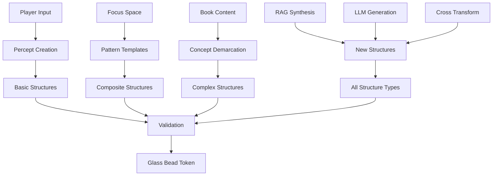

# 2.19. Shared structures

Memorativa's shared structures represent the fundamental constructs that can be shared, verified, and evolved within the system through Glass Bead tokens. Each structure is encapsulated as a Glass Bead token with specific privacy controls, temporal states, and validation requirements.

## Structure hierarchy

1. **Basic Structures**
   - Percept-triplets (Planet-Sign-House with temporal states)
   - Angular relationships (aspects with verification weights)
   - MST translations (universal symbolic mappings)
   - Vector encodings (hybrid spherical-hyperbolic)

2. **Composite Structures**
   - Prototypes (weighted percept-triplet networks)
   - Focus spaces (conceptual workspaces)
   - Pattern templates (reusable configurations)
   - Aspect networks (validated relationships)

3. **Complex Structures**
   - Books (narrative + structured data)
   - Conceptual demarcations (boundary definitions)
   - Knowledge networks (linked structures)
   - Temporal sequences (state progressions)


## Structure relationships

1. **Vertical Integration**
   - Basic to composite assembly with validation
   - Composite to complex synthesis with privacy
   - Hierarchical dependencies with permissions
   - Inheritance patterns with state tracking

2. **Horizontal Connection**
   - Cross-structure references with access control
   - Pattern relationships with verification
   - Temporal correlations with state management
   - Symbolic associations with MST translation

3. **Diagonal Evolution**
   - Cross-level development with versioning
   - Pattern emergence with validation
   - Conceptual transformation with privacy
   - Knowledge synthesis with attribution

## Glass bead encapsulation

1. **Token Structures**
   - Percept-triplet tokens with privacy levels
   - Prototype tokens with validation states
   - Focus space tokens with access controls
   - Book tokens with attribution data

2. **Structure States**
   - Active states with verification
   - Quantum superpositions with probabilities
   - Holographic projections with references
   - Temporal markers with state tracking


## Structure creation

**Entry Points**
   - Direct player input (URLs, text, media)
   - Focus space interactions
   - Book content demarcation
   - RAG system synthesis
   - LLM-generated content
   - Cross-structure transformations



**Creation Workflows**

| Entry Point | Initial Structure | Validation | Output |
|-------------|------------------|------------|---------|
| Player Input | Percept-triplet | MST + Player | Basic Structure |
| Focus Space | Pattern Template | Aspect Analysis | Composite Structure |
| Book Content | Concept Boundary | Reference Check | Complex Structure |
| RAG Synthesis | Vector Pattern | Similarity Match | Any Structure Type |
| LLM Generation | Symbolic Pattern | Coherence Check | Any Structure Type |
| Cross Transform | Existing Structure | State Verification | New Structure Type |

**Creation Controls**
   - Gas token requirements for each operation
   - Privacy level specification
   - Temporal state assignment
   - Attribution tracking
   - Permission inheritance
   - Validation requirements

**Creation Interfaces**

```rust
pub trait StructureCreation {
    fn create_basic_structure(
        input: PlayerInput,
        privacy: PrivacyLevel,
        temporal: TemporalState,
        gas: GasBeadToken
    ) -> Result<GlassBead>;

    fn create_composite_structure(
        patterns: Vec<Pattern>,
        config: CreationConfig,
        gas: GasBeadToken
    ) -> Result<GlassBead>;

    fn create_complex_structure(
        components: Vec<Component>,
        references: Vec<Reference>,
        gas: GasBeadToken
    ) -> Result<GlassBead>;
}
```

**Creation Lifecycle**
   - Input validation and sanitization
   - Structure initialization
   - State configuration
   - Relationship mapping
   - Validation processing
   - Token minting
   - Integration verification

## Structure evolution

1. **Growth Patterns**
   - Linear progression with validation
   - Branching development with versioning
   - Recursive expansion with privacy
   - Network formation with attribution

2. **State Transitions**
   - Quantum collapse with verification
   - Holographic transformation with reference
   - Temporal progression with tracking
   - Pattern crystallization with validation

3. **Knowledge Integration**
   - Pattern synthesis with privacy
   - Conceptual mapping with verification
   - Symbolic correlation with translation
   - Meaning construction with attribution

This shared structure architecture:
- Enables multi-level sharing with privacy controls
- Supports structure evolution with validation
- Maintains coherent relationships with verification
- Facilitates knowledge synthesis with attribution
- Preserves symbolic meaning with translation
- Enables holographic analysis with reference states
- Integrates with RAG system for retrieval
- Supports LLM processing for generation
- Implements gas token mechanics for operations
- Provides natal bead integration for personalization

## Key points

1. **Structural Foundation**
   - Three-tier hierarchy: basic, composite, and complex structures
   - Each structure encapsulated as Glass Bead token
   - Complete integration with privacy, temporal, and validation systems
   - Hybrid spherical-hyperbolic vector encoding for all structures

2. **Integration Features**
   - Vertical, horizontal, and diagonal relationship patterns
   - Multi-dimensional state management (active, quantum, holographic)
   - Cross-structure referencing with access controls
   - Inheritance patterns with state tracking

3. **Privacy and Security**
   - Granular privacy controls at all structural levels
   - Validation requirements for structural changes
   - Attribution tracking throughout evolution
   - Permission-based access management

4. **Temporal Management**
   - Multiple temporal states (mundane, quantum, holographic)
   - State transitions with verification
   - Temporal correlation tracking
   - Progressive evolution pathways

5. **System Integration**
   - Complete RAG system compatibility
   - LLM processing support
   - Gas token operation mechanics
   - Natal bead reference framework

6. **Knowledge Evolution**
   - Pattern emergence with validation
   - Conceptual transformation tracking
   - Symbolic translation through MST
   - Attribution-preserved synthesis

This architecture creates a robust foundation for:
- Secure knowledge sharing and evolution
- Multi-dimensional relationship mapping
- Privacy-preserved collaboration
- Validated structural development
- Efficient system integration
- Scalable knowledge synthesis


Incorporation of Shared Structures (2-19)
Hierarchy Integration: 
Beads encapsulate basic structures (e.g., percept-triplets, ~1.8 KB), composite structures (e.g., prototypes, ~5-10 KB), and evolve into complex structures (e.g., Books, ~1 MB) within life crystals.
Relationships: 
Vertical (e.g., percept-triplet to Book), horizontal (e.g., aspect networks across players), and diagonal (e.g., prototype to knowledge network) structures are mapped by CBOS, etched into spheres.
Glass Bead Tokens: 
Each structure type (basic, composite, complex) is a bead (~1.8 KB base), with privacy (e.g., private percept-triplets), temporal states (e.g., quantum prototypes), and validation (e.g., MST for Books), minted via Solana (2-19).
Creation and Evolution: 
Players input percept-triplets (e.g., "Mars-Virgo-10th"), nodes/temples synthesize Books, CBOS validates and clusters, life crystals evolve with new structures monthly (2-19).
Reader Display: 
Shows percept-triplets (e.g., "Mars-Virgo-10th"), aspect networks (e.g., trine at 120°), and Books, with privacy levels and attribution visible (2-19).
Conclusion
The hybrid Memorativa Pantheon System with shared structures creates a dynamic tapestry: nodes and temples generate percept-triplets, prototypes, and Books (2-19), CBOS crystallizes them into life crystals, and regional farms store them with failovers and backups. A single sphere (10 MB initial, ~100 MB after 10 years) holds a player’s cosmic and collaborative legacy, updatable monthly (30 seconds), accessible via a reader (~20-40 min scan). AstroFan’s "Mars in Virgo" life crystal—token in wallet, sphere in hand—grows with every shared structure, a validated, privacy-preserved bridge between human creativity and machine intelligence in Pantheon’s grand design.