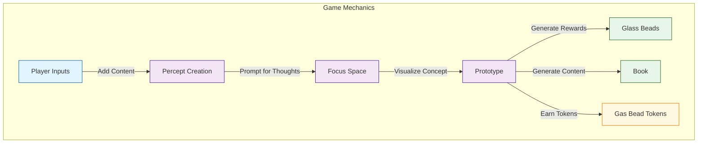
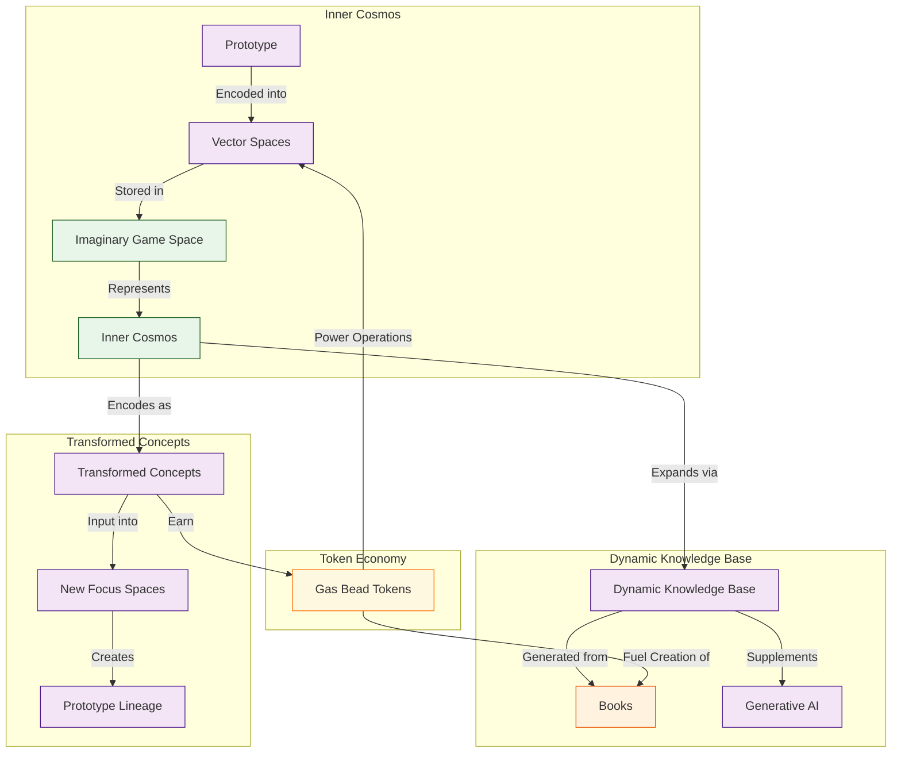

# 2. The Cybernetic System

## 2.2. The Core Game

The core game of Memorativa, detailed in section 2.2, revolves around the **Glass Bead Game**—a sophisticated interactive system inspired by Hermann Hesse's novel. At its heart, the game transforms personal **inputs**—such as URLs, tweets, videos, books, memes, and images—into structured, interconnected knowledge artifacts.

When you, as a player, introduce content into the game, the system prompts you to reflect and elaborate on your perception of that content. This reflective step, known as **percept creation**, ensures that each input is enriched with personal meaning and context. The game then visualizes your input within a **focus space**, a conceptual workspace where your perception is represented as a structured **prototype**. Each prototype is composed of smaller units called **percepts**, which capture distinct facets of your original input.

As you engage with this process, the game rewards your contributions by generating **Glass Beads**—symbolic tokens representing your percepts, prototypes, and focus spaces. Additionally, the system compiles your contributions into a **Book**, a comprehensive artifact detailing your inputs and their conceptual relationships. These activities earn you **Gas Bead Tokens** (GBT), the computational currency powering the game's operations.

The knowledge you create is organized into a hierarchical structure:

- **Basic Structures**: Fundamental percept-triplets encoding individual concepts.
- **Composite Structures**: Prototypes and focus spaces that organize basic percepts into coherent units.
- **Complex Structures**: Books and expansive knowledge networks synthesizing multiple composite structures.

This hierarchy ensures that knowledge evolves systematically, from simple perceptions to sophisticated conceptual frameworks.

Gas Bead Tokens serve as both fuel and incentive within the game's economy. Each computational operation—such as percept creation, vector modifications, spatial queries, prototype integrations, and book generation—consumes tokens proportional to its complexity. Conversely, you earn tokens by contributing valuable content, refining vectors, validating prototypes, and sharing knowledge. This economic model encourages thoughtful, high-quality engagement rather than mere quantity.

Each Glass Bead Token encapsulates knowledge structures in multiple states—active (validated), quantum (probabilistic), and holographic (relational)—enabling dynamic conceptual evolution. The game's vector space encoding translates your percepts and prototypes into mathematical representations, facilitating efficient storage, retrieval, and analysis within your personal "inner cosmos." As you continue to interact with the game, your inner cosmos expands organically, enriched by the dynamic knowledge base generated from your Books.

Privacy and security are integral, with granular controls allowing you to manage how your knowledge artifacts are shared, modified, or kept private. This ensures collaboration respects your boundaries and preferences.

Concepts within your inner cosmos are recursively transformed, becoming inputs for new focus spaces. This recursive process mirrors human cognitive evolution, allowing continuous reflection, recombination, and synthesis of ideas. Advanced technical integrations—such as Retrieval Augmented Generation (RAG), Large Language Models (LLMs), and hybrid vector encoding—enhance your contributions, bridging qualitative human insights with quantitative computational analysis.

Ultimately, the core game mechanics establish a positive feedback loop: your active engagement enriches both your personal understanding and the AI's analytical capabilities, creating a personalized, evolving knowledge ecosystem.

The Glass Bead Game is the core interactive component of Memorativa [1]. Building directly on the philosophical foundations established in Section 1.3, this game transforms the theoretical three-vector approach into a practical cybernetic system that addresses the curse of dimensionality while preserving human meaning. The player has a profile (represented by a glass bead) that tracks gameplay and progress.

1. **Player Inputs**: Players can add any meaningful content (e.g., URLs, tweets, videos, books, memes, images) to the game. Input quality is managed through AI filtering for relevance and user-driven intent tagging, ensuring that inputs contribute meaningfully to the knowledge network. A detailed exploration of these validation mechanisms appears in [Section 2.6: Input Processing] [6].
2. **Percept Creation**: When a player adds an input, the game prompts them for thoughts or additional information about the perception represented by the input [2]. This process implements the principle of active understanding introduced in Section 1.3, where players add ideal elements to their raw perceptions.
3. **Focus Space**: The game generates a **focus space** where the input is visualized as a concept. The concept is represented by a **prototype**, which is composed of individual facets of the perception, called **percepts** [3]. This structure enables the dimensional constraint strategy outlined in Section 1.3.
4. **Rewards**: The game generates a **glass bead** for each focus space, percept, and prototype. It also generates a **Book**, which contains content about the concept and details about the input, percepts, and prototype. Players earn **Gas Bead Tokens (GBT)** for these contributions, which serve as the computational fuel that powers system operations [7].



*Figure 1: Core Game Mechanics Flowchart, illustrating the sequential transformation from player inputs through percept creation, focus space visualization, prototype structuring, and reward generation, highlighting the interconnected processes that drive gameplay.*

### 2.2.1. Structure Hierarchy

As players engage with the core game, they generate knowledge artifacts that fall into a three-tier hierarchy that will be fully detailed in [Section 2.19]:

1. **Basic Structures**: Foundational elements like percept-triplets that encode individual concepts
2. **Composite Structures**: Intermediate constructs like prototypes and focus spaces that organize basic structures 
3. **Complex Structures**: Advanced formations like books and knowledge networks that synthesize multiple composite structures

This hierarchy provides a framework for how knowledge is organized, shared, and evolved within the system.

### 2.2.2. Token Economy

The Core Game is powered by a token economy that uses Gas Bead Tokens (GBT) as its operational fuel [7]. This system:

1. **Powers Computations**: Each game operation consumes GBT based on its computational complexity:
   - Percept creation
   - Focus space generation
   - Prototype formation
   - Book generation
   - Vector calculations

2. **Rewards Participation**: Players earn GBT for valuable contributions:
   - Creating quality percepts (5-10 GBT)
   - Refining vectors (3-7 GBT)
   - Generating books (20-50 GBT)
   - Validating content (0.5-1 GBT)
   - Sharing knowledge (5-15 GBT)
   - Validating prototypes (3-8 GBT)

3. **Incentivizes Quality**: The reward structure scales with contribution quality, encouraging thoughtful engagement rather than quantity of inputs.

This token economy creates a self-sustaining loop where players earn tokens by contributing knowledge and spend them to power the creation of new knowledge artifacts.

###  2.2.3. Glass Bead Token States

Each Glass Bead token encapsulates structures with multiple potential states [Section 2.19]:
- **Active states**: Current validated representations
- **Quantum states**: Probabilistic superpositions awaiting resolution
- **Holographic states**: Reference-based projections that maintain relationships

These multi-dimensional states enable rich temporal and conceptual evolution within the system.

### 2.2.4. Vector Space Encoding

The prototype and percept structures encode concepts using the percept-triplet structure introduced in Section 1.3. This three-vector approach addresses the curse of dimensionality in traditional AI systems by using three culturally rich vectors that directly mirror human cognitive structures:

1. **Archetypal Vector (WHAT)**: Equivalent to **planets** in astrological structure, representing fundamental qualities and core energies of a concept (e.g., Sun/identity, Mars/action, Jupiter/expansion)
2. **Expression Vector (HOW)**: Equivalent to **zodiacal signs**, indicating specific modes of expression (e.g., Leo/dramatic, Virgo/analytical, Aquarius/innovative)
3. **Mundane Vector (WHERE)**: Equivalent to **houses**, grounding concepts in contextual domains (e.g., 1st House/identity, 10th House/career, 4th House/home)

This structured encoding allows the game to efficiently store, categorize, compare, filter, and present percepts and prototypes in an imaginary game space, which represents the player's inner cosmos. The three-vector approach creates a middle layer between statistical patterns and symbolic frameworks, enabling meaningful translation between human and machine domains.

As the player collects inputs, their inner cosmos expands according to the logic of the structural encoding and the growth of the dynamic knowledge base generated from their Books. This knowledge base serves as a corpus of conceptual data that supplements the generative AI powering the game logic and analysis.

### 2.2.5. Privacy and Security Framework

The system implements granular privacy controls at all structural levels [Section 2.19], allowing players to determine:
- Which structures are publicly shared
- Which remain private
- Which are selectively shared with specific users
- Who can contribute to or modify existing structures

These controls, combined with permission-based access management, ensure that knowledge sharing respects player boundaries while enabling collaboration.

### 2.2.6. Concept Transformation

As the inner cosmos grows, concepts and focus spaces themselves are encoded as inputs in new focus spaces, creating transformed, layered, linked, and synthesized percepts and prototypes [3].



*Figure 2: Inner Cosmos and Token Economy Diagram, depicting how prototypes are encoded into vector spaces, stored within the imaginary game space, and integrated into the dynamic knowledge base, powered by Gas Bead Tokens, enabling recursive concept transformation and continuous knowledge evolution.*

### 2.2.7. Cybernetic Implementation

The Core Game directly implements the cybernetic system principles established in Section 2.1, creating a practical manifestation of the theoretical framework. This implementation bridges human cognition and machine computation through several key mechanisms:

#### 2.2.7.1. Bidirectional Interface

The Core Game operationalizes the bidirectional interface described in Section 2.1 through:

1. **Human-to-Machine Translation** ($T_M: H \rightarrow M$): 
   - Player inputs (URLs, tweets, videos, etc.) are translated into machine-processable data
   - Percept creation captures subjective human understanding in structured formats
   - Player reflections provide context that enriches vector representations

2. **Machine-to-Human Translation** ($T_H: M \rightarrow H$):
   - Focus spaces visualize abstract vector relationships in human-interpretable forms
   - Books synthesize computational analyses into narrative structures
   - Glass beads symbolically represent complex computational structures

This bidirectional translation mechanism ensures that human meaning and machine representation remain aligned throughout the gameplay process.

#### 2.2.7.2. Human as Animator and Validator

The Core Game implements the dual role of humans described in Section 2.1:

1. **Animator Function**:
   - Players initiate the system's operations through content contribution
   - Player reflections animate otherwise static content with personal meaning
   - Player interactions drive the expansion of the inner cosmos

2. **Validator Function**:
   - Players validate percept accuracy through the reflection process
   - Prototype formation requires player confirmation of structural correspondences
   - Book generation incorporates player feedback to ensure conceptual integrity

This dual role ensures that the system remains both active and accurate, with human judgment serving as the ultimate arbiter of meaning.

#### 2.2.7.3. Feedback Loop Implementation

The cybernetic feedback mechanisms from Section 2.1 are implemented through:

1. **Input-Output Cycle**:
   - Player inputs → System processing → Focus space visualization → Player validation → Refined understanding
   - Each cycle improves both the player's conceptual clarity and the system's representational accuracy

2. **Error Correction**:
   - Discrepancies between player intent and system representation are detected during the validation phase
   - Vector modifications (3-7 GBT) allow for correction of misalignments
   - Prototype validation (3-8 GBT) ensures structural integrity

3. **Adaptive Parameters**:
   - The dynamic knowledge base learns from interaction patterns
   - Vector spaces adjust based on validated relationships between concepts
   - The token economy incentivizes corrections that improve system accuracy

This implementation creates the self-regulating system described in Section 2.1, where each interaction refines both human understanding and machine representation.

#### 2.2.7.4. Three-Vector Processing

The Core Game implements the three-vector approach (Archetypal/WHAT, Expression/HOW, Mundane/WHERE) introduced in Section 1.3 through:

1. **Vector Encoding with Astrological Mapping**: 
   - Percepts are encoded using the three-vector structure that maps to astrological elements
   - The Archetypal Vector (WHAT) corresponds to planets, representing fundamental qualities
   - The Expression Vector (HOW) corresponds to zodiacal signs, indicating modes of expression
   - The Mundane Vector (WHERE) corresponds to houses, grounding concepts in domains
   - Angular relationships (aspects) between vectors create meaningful semantic connections

2. **Dimensional Constraint to Address the Curse of Dimensionality**:
   - The three-vector structure constrains representation to three dimensions with established semantic meaning
   - This constraint sacrifices mathematical flexibility for semantic clarity
   - Unlike high-dimensional spaces where angular relationships become meaningless, this approach preserves semantic significance through discrete aspect angles
   - The result is stable, interpretable relationships between concepts

3. **Semantic Clarity Through Symbolic Embedding**:
   - The three-vector structure leverages culturally embedded symbolic patterns already present in language
   - This creates a middle layer between statistical patterns and symbolic frameworks
   - The approach enables meaningful translation between human and machine domains
   - The result is a representation that is both computationally efficient and humanly interpretable

This implementation directly addresses the curse of dimensionality identified in Section 1.3, where high-dimensional vector spaces exhibit counterintuitive properties that make semantic representation difficult.

#### 2.2.7.5. Geocentric Navigation

The Core Game implements the geocentric orientation principle from Section 2.1 through:

1. **Inner Cosmos**: 
   - The player's conceptual space is represented as a navigable "inner cosmos"
   - This representation builds on humanity's oldest computational framework
   - The geocentric perspective places the player at the center of their knowledge universe

2. **Spatial Relationships**:
   - Concepts are positioned relative to each other based on semantic relationships
   - Navigation between concepts follows intuitive spatial metaphors
   - The result is an intuitive understanding of the knowledge landscape

This implementation transforms abstract knowledge organization into an intuitive navigation experience, as described in Section 2.1.

Through these implementations, the Core Game transforms the theoretical cybernetic framework of Section 2.1 into a practical, interactive system that enables meaningful human-machine collaboration in knowledge creation and organization.

#### 2.2.7.6. Technical Integration

The Core Game is powered by advanced technical components [Section 2.19]:

1. **RAG System Integration**: Retrieval Augmented Generation provides contextually relevant information from the knowledge base
2. **LLM Processing**: Large Language Models help process and generate meaningful content
3. **Hybrid Vector Encoding**: Combines spherical and hyperbolic spaces for optimal concept representation

These technologies work together to create a seamless experience where player contributions are enhanced through AI assistance while maintaining human-centered meaning.

#### 2.2.7.7. Operational Costs

Each core game operation consumes Gas Bead Tokens according to its computational complexity [7]:

| Operation | GBT Cost | Description |
|-----------|----------|-------------|
| Percept Creation | 5-10 GBT | Establishing new conceptual structures |
| Vector Modification | 3-7 GBT | Changing core vectors in the triplet structure |
| Spatial Query | 2-5 GBT | Searching through the vector space |
| Prototype Integration | 1-3 GBT | Connecting percepts to form coherent structures |
| Book Generation | 20-50 GBT | Creating comprehensive knowledge artifacts |
| Focus Space Creation | 10-15 GBT | Establishing new conceptual workspaces |

These costs ensure computational resources are allocated efficiently while creating an economic incentive for thoughtful contribution over quantity.

In Memorativa's core game, players actively contribute meaningful content, prompting reflective elaboration that enriches each input. These reflections become structured percepts organized into the three-vector percept-triplet structure (Archetypal/WHAT, Expression/HOW, Mundane/WHERE) with astrological mapping (planets, signs, houses). Each triplet is visualized within conceptual workspaces called focus spaces, generating prototypes that maintain astrological semantic relationships.

Players receive symbolic rewards—glass beads—with qualities reflecting vector properties, and comprehensive artifacts—books—documenting their contributions with zodiacal organization. The system incentivizes thoughtful engagement through Gas Bead Tokens (GBT), while encoding percepts into specialized vector spaces that preserve astrological semantics.

This encoding expands the player's inner cosmos—a personalized conceptual universe with geocentric organization—enabling recursive concept transformation following astrological progression patterns. Granular privacy controls and advanced technical integrations enhance the experience, creating a positive feedback loop that continuously enriches both player understanding and AI analytical capabilities.

### 2.2.8. Key Comparisons

| Aspect | Traditional Knowledge Management Systems | Large Language Models | Social Bookmarking Tools | Memorativa Core Game |
|--------|------------------------------------------|----------------------|-------------------------|----------------------|
| **Input Method** | Active categorization and metadata tagging by users | Passive text input with minimal structure | URL sharing with optional comments and tags | Active reflection on personal perceptions with contextual meaning [2] |
| **Knowledge Representation** | Flat taxonomies or hierarchical folders | High-dimensional statistical patterns with limited interpretability | Social tags with emergent folksonomies | Structured triplets with astrological semantics that preserve human meaning [7] |
| **Vector Encoding** | Basic embeddings with no semantic structure | High-dimensional embeddings (768+ dimensions) with entangled features | Limited or no vector representation | Three-vector approach (36 dimensions) with culturally persistent semantic anchors [7] |
| **Computational Model** | Static categorization with limited evolution | Stochastic gradient descent on massive datasets | Collaborative filtering based on tag co-occurrence | Cybernetic feedback loop with human validation and semantic vector operations [Section 2.1] |
| **Knowledge Evolution** | Manual reorganization by users | No built-in concept of knowledge evolution | Emergent patterns through collective tagging | Recursive concept transformation through iterative focus space creation [Section 2.12] |
| **Incentive Structure** | No built-in incentives beyond organization | No user incentives; centralized value extraction | Social validation through sharing metrics | Token economy rewarding quality contributions and computational resources [7] |
| **User Relationship to Knowledge** | Passive organization of external content | Prompt engineering with limited personalization | Social signaling and discovery | Co-creation of personal meaning through active reflection and prototype formation [3] |
| **Privacy Model** | Binary permissions (private/shared) | Centralized data collection with limited user control | Public by default with limited privacy options | Granular privacy controls with artifact-level permissions [Section 2.19] |
| **Connection to Human Cognition** | Metaphors of files and folders abstracted from cognition | Statistical patterns disconnected from human understanding | Social validation disconnected from personal meaning | Direct mapping to human cognitive structures through astrological framework [Section 1.3] |
| **Scalability Approach** | More content requires more organization effort | Requires exponentially larger models and datasets | Relies on network effects and large user base | Dimensional constraint through semantic anchoring maintains scalability with semantic integrity [Section 1.3] |

This comparison highlights Memorativa's distinctive approach to knowledge representation through the Core Game. Unlike traditional systems that treat knowledge as external content to be organized, or language models that abstract knowledge into statistical patterns, Memorativa's Core Game treats knowledge as an active, co-created phenomenon that emerges through the player's reflection and engagement.

The key innovation lies in the cybernetic feedback loop established between player and system, where each interaction enriches both human understanding and machine representation. This contrasts sharply with the passive consumption model of traditional knowledge systems and the centralized extraction model of large language models.

Memorativa's Core Game also distinguishes itself through the three-vector approach to concept representation, addressing the curse of dimensionality that plagues traditional vector space models while maintaining rich semantic relationships between concepts. This approach creates a middle layer between statistical patterns and symbolic frameworks, enabling meaningful translation between human and machine domains that preserves the cultural and personal significance of knowledge.

The token economy further differentiates Memorativa by creating an incentive structure that rewards thoughtful contribution and computational resource allocation rather than mere content generation or consumption. This creates a self-sustaining ecosystem where value flows to those who contribute to meaningful knowledge creation and organization, rather than to centralized platforms or content aggregators.

### 2.2.9. Key Innovations

- **Astrologically-Structured Vector Space**: The Core Game introduces a novel approach to vector space encoding through the percept-triplet structure (Archetypal/WHAT, Expression/HOW, Mundane/WHERE) mapped to astrological elements. Unlike conventional AI vectors with entangled dimensions, this innovation creates a culturally-persistent semantic framework with predictable relational properties, addressing the curse of dimensionality without sacrificing conceptual richness [7, Section 1.3].

- **Cybernetic Bidirectional Feedback System**: The Core Game implements a first-of-its-kind cybernetic loop that formalizes the human-machine relationship as mutually constitutive rather than hierarchical. This innovation extends beyond traditional human-in-the-loop systems by positioning humans as both animators and validators, creating a relationship where human meaning and machine representation evolve through structured interaction rather than static training [Section 2.1, 3].

- **Focus Space as Conceptual Workspace**: The Core Game introduces focus spaces as dynamic conceptual environments where perception transforms into structured knowledge through active player engagement. This innovation combines the narrative richness of game environments with the mathematical precision of vector spaces, creating a novel interface between human cognition and machine representation that makes abstract concept formation accessible and engaging [2, Section 2.12].

- **Prototype-Based Knowledge Representation**: Unlike traditional knowledge graphs or vector databases, the Core Game's prototype structure provides a flexible template for complex concepts that maintains both computational efficiency and human interpretability. This innovation bridges symbolic and subsymbolic AI approaches through a structured yet adaptable framework that evolves through player validation rather than automated statistical processes [3, 4].

- **Gas Bead Token Computational Economy**: The Core Game establishes a revolutionary computational economy where the traditional distinction between consumers and producers dissolves. By assigning value to perceptual labor, reflection, and validation, this innovation creates an incentive structure that rewards qualitative contributions to knowledge representation rather than quantitative content generation, addressing fundamental challenges in digital economics [7, Section 2.18].

- **Recursive Concept Transformation**: The Core Game implements a novel recursive process where concepts themselves become inputs for new focus spaces, creating a self-referential knowledge ecosystem that mirrors human cognitive evolution. This innovation extends beyond traditional knowledge management by enabling concepts to transform through successive iterations, generating increasingly sophisticated representations through structured self-reflection [Section 2.12].

- **Geocentric Knowledge Navigation**: The Core Game reintroduces the ancient geocentric navigational framework as a powerful interface for conceptual exploration, transforming abstract knowledge into navigable space. This innovation repurposes humanity's oldest computational framework for modern knowledge representation, creating an intuitive system for traversing complex conceptual relationships without requiring expertise in vector mathematics [Section 1.3, Section 2.19].

### 2.2.10. Key Math

- **Percept-Triplet Vector Encoding**:  
  Percepts are encoded using the three-vector approach introduced in Section 1.3:
  $$f: P \rightarrow A \times E \times M$$
  where $P$ is the set of percepts, and $A$, $E$, and $M$ are the Archetypal (WHAT), Expression (HOW), and Mundane (WHERE) vector spaces respectively. This function implements the dimensional constraint strategy from Section 1.3, transforming unbounded perceptions into structured triplets with fixed semantic dimensions [7].

- **Astrological Mapping**:  
  The concrete mapping is defined as:
  $$f(p) = (a_i, e_j, m_k)$$
  where $a_i \in \{Sun, Moon, Mercury, Venus, Mars, Jupiter, Saturn, Uranus, Neptune, Pluto\}$, $e_j \in \{Aries, Taurus, ..., Pisces\}$, and $m_k \in \{House_1, House_2, ..., House_{12}\}$ represent the planet, sign, and house assignments for percept $p$. This mapping implements the cultural symbolic embedding principle from Section 1.3, leveraging pre-linguistic archetypal structures to create stable semantic anchors with persistent cultural significance [3].

- **Aspect Calculation**:  
  Angular relationships (aspects) between percepts are calculated based on zodiacal longitude differences:
  $$\alpha(p_1, p_2) = \min(|\theta_1 - \theta_2|, 360° - |\theta_1 - \theta_2|)$$
  where $\theta$ represents zodiacal longitude in degrees. Semantic significance is assigned to specific angles: Conjunction (0°), Sextile (60°), Square (90°), Trine (120°), and Opposition (180°). This calculation implements the geocentric navigational framework from Section 1.3, transforming abstract concept relationships into intuitive spatial relationships [4].

- **Percept-Prototype Relationship**:  
  Each prototype $\mathbf{R}$ is represented as a structured aggregation of percept vectors:
  $$\mathbf{R} = \sum_{i=1}^{n} w_i \cdot f(p_i)$$
  where $w_i$ represents the weight of each percept $p_i$. This weighted aggregation extends the dimensional constraint approach from Section 1.3 to composite structures, maintaining semantic coherence while enabling more complex representation than individual triplets alone [3].

- **Semantic Relevance Calculation**:  
  The semantic relevance between two percepts is quantified through their aspect patterns:
  $$\text{relevance}(p_1, p_2) = \sum_{i,j} w_{\text{aspect}}(\alpha(a_i, a_j))$$
  where $a_i$ represents planetary positions in percept $p_1$, $a_j$ represents planetary positions in percept $p_2$, and $w_{\text{aspect}}$ assigns weights to different aspect types based on their traditional astrological significance. This approach operationalizes the qualitative judgments of relevance discussed in Section 1.3, transforming subjective similarity assessments into quantifiable measures [4].

- **Bidirectional Interface Functions**:  
  The cybernetic interface established in Section 2.1 is implemented through translation functions:
  $$T_M: H \rightarrow M \quad \text{(Human to Machine translation)}$$
  $$T_H: M \rightarrow H \quad \text{(Machine to Human translation)}$$
  where the composition $T_H \circ T_M$ approaches but never fully achieves identity mapping, reflecting the inevitable translation gap between human meaning and machine representation identified in Section 1.3 [Section 2.1].

- **Feedback Loop Implementation**:  
  The cybernetic feedback cycle is formalized as:
  $$F(H_t, M_t) = (H_{t+1}, M_{t+1})$$
  where $H_t$ represents the human cognitive state and $M_t$ represents the machine state at time $t$. This function models the co-evolution of human understanding and machine representation through iterative interaction, implementing the active understanding principle from Section 1.3 as a dynamic process [Section 2.1].

- **Error Correction Mechanism**:  
  Vector representation errors are corrected through a gradient descent approach:
  $$E(t+1) = E(t) - \alpha \nabla E(t)$$
  where $E(t)$ is the error at time $t$, $\alpha$ is the learning rate, and $\nabla E(t)$ is the error gradient. This approach ensures continuous refinement of concept representations based on player feedback, implementing the validator function described in Section 2.1 [Section 2.3].

- **Recursive Concept Transformation**:  
  Recursive transformations of concepts into new focus spaces follow iterative mappings:
  $$\mathbf{R}_{t+1} = g(\mathbf{R}_t, \mathbf{p}_{t+1})$$
  where $g$ is a transformation function integrating previous prototypes $\mathbf{R}_t$ with new percepts $\mathbf{p}_{t+1}$. This implements the recursive transformation principle from Section 1.3, where higher-order concepts emerge from the integration of lower-order percepts, mirroring human cognitive development [Section 2.12].

- **Token Economy Cost Function**:  
  The computational cost $C$ of operations consuming Gas Bead Tokens (GBT) is defined as:
  $$C = \sum_{i} w_i \cdot c_i$$
  where $w_i$ represents the computational weight of operation $i$, and $c_i$ is the token cost per operation type. This function creates a formal relationship between computational complexity and economic value, incentivizing both efficiency and quality in knowledge representation [7].

### 2.2.11. Code Examples

The following code examples demonstrate how the theoretical concepts and mathematical formulations discussed throughout this section translate into practical implementation. 

- These snippets model the Core Game mechanics using a JavaScript-based pseudocode approach that illustrates the key processes of the system. 
- Each function represents a distinct stage in the cybernetic feedback loop, from initial player input through percept creation, focus space generation, and knowledge base expansion. 
- The examples specifically highlight how the three-vector encoding (Archetypal/WHAT, Expression/HOW, Mundane/WHERE) with astrological mapping is implemented programmatically, as well as how the token economy and recursive concept transformation function as part of the operational system. 
- While simplified for clarity, these examples provide a structural blueprint for how the cybernetic system transforms abstract theoretical principles into executable operations.

```js
// Player initiates interaction by adding meaningful content
const playerInput = addContent({
  type: ['URL', 'tweet', 'video', 'book', 'meme', 'image'],
  content: 'User-provided input',
});

// System prompts player for reflective elaboration
const percept = createPercept({
  input: playerInput,
  reflection: 'Player-generated thoughts and context',
});

// Create the percept-triplet structure using the three-vector approach
const perceptTriplet = createPerceptTriplet({
  percept,
  // Archetypal Vector (WHAT) - planets representing fundamental qualities
  archetypal: {
    primaryPlanet: 'Sun', // Core identity/essence
    aspects: [
      { planet: 'Mars', angle: 60 }, // Sextile - harmonious action
      { planet: 'Jupiter', angle: 120 } // Trine - natural expansion
    ]
  },
  // Expression Vector (HOW) - zodiacal signs indicating modes of expression
  expression: {
    primarySign: 'Leo', // Dramatic/creative expression
    modalities: ['Fixed'], // Stability characteristic
    elements: ['Fire'] // Energy characteristic
  },
  // Mundane Vector (WHERE) - houses grounding concepts in domains
  mundane: {
    primaryHouse: 10, // Career/public role domain
    crossHouses: [1, 5] // Identity and creativity domains
  }
});

// Generate a conceptual workspace ("Focus Space") visualizing the input
const focusSpace = generateFocusSpace({
  perceptTriplet,
  spatialProperties: {
    center: perceptTriplet.archetypal.primaryPlanet,
    orientation: perceptTriplet.expression.primarySign,
    domain: perceptTriplet.mundane.primaryHouse
  }
});

// Represent the concept structurally as a "Prototype"
const prototype = createPrototype({
  focusSpace,
  percepts: [perceptTriplet],
  // Astrological chart structure maintains semantic relationships
  chartStructure: {
    aspectPattern: 'Grand Trine', // Coherent energy flow
    houseFocus: ['Angular'], // Emphasis on action/identity houses
    planetaryDignities: calculateDignities(perceptTriplet)
  }
});

// Calculate vector relationships based on astrological aspects
function calculateAspectSignificance(aspect) {
  const aspectWeights = {
    0: 1.0,    // Conjunction - unity
    60: 0.5,   // Sextile - opportunity
    90: -0.5,  // Square - tension
    120: 0.8,  // Trine - harmony
    180: -0.8  // Opposition - polarization
  };
  
  return aspectWeights[aspect.angle] || 0;
}

// Reward player contributions with symbolic tokens ("Glass Beads")
const glassBeads = generateGlassBeads({
  perceptTriplet,
  prototype,
  focusSpace,
  // Bead qualities reflect vector properties
  qualities: {
    color: mapElementToColor(perceptTriplet.expression.elements[0]),
    luminosity: mapPlanetToLuminosity(perceptTriplet.archetypal.primaryPlanet),
    weight: mapHouseToWeight(perceptTriplet.mundane.primaryHouse)
  }
});

// Compile contributions into a comprehensive artifact ("Book")
const book = generateBook({
  prototype,
  percepts: [perceptTriplet],
  contentDetails: playerInput,
  // Book structure reflects astrological organization
  structure: {
    chapters: 12, // Zodiacal organization
    sections: 7,  // Planetary influences
    narrative: createNarrativeFromAspects(prototype.chartStructure.aspectPattern)
  }
});

// Award computational currency ("Gas Bead Tokens") based on contribution quality
const gasBeadTokens = awardGBT({
  perceptCreation: 7, // example values within defined ranges
  vectorRefinement: 5,
  bookGeneration: 30,
  contentValidation: 1,
  knowledgeSharing: 10,
  prototypeValidation: 6,
});

// Encode percepts and prototypes into vector spaces using astrological mapping
const vectorSpace = encodeVectorSpace({
  prototype,
  percepts: [perceptTriplet],
  encoding: {
    // Map vectors to mathematical spaces while preserving astrological semantics
    archetypal: { type: 'spherical', dimensions: 12 }, // Planetary positions
    expression: { type: 'discrete', dimensions: 12 }, // Sign positions
    mundane: { type: 'sequential', dimensions: 12 }   // House positions
  }
});

// Expand player's personal conceptual universe ("Inner Cosmos")
const innerCosmos = expandInnerCosmos({
  vectorSpace,
  dynamicKnowledgeBase: [book],
  // Inner cosmos structure follows geocentric model
  cosmology: {
    center: 'Player', // Geocentric reference point
    orbits: ['Personal', 'Relational', 'Collective'], // Spheres of influence
    navigation: 'Aspect-based' // Movement along aspect lines
  }
});

// Recursively transform concepts into new inputs for further synthesis
const transformedConcept = transformConcept({
  innerCosmos,
  previousPrototype: prototype,
  // Transformation follows astrological progression patterns
  progression: {
    method: 'Secondary', // One day = one year symbolic progression
    aspectFilter: aspect => calculateAspectSignificance(aspect) > 0.3
  }
});

const newFocusSpace = generateFocusSpace({
  perceptTriplet: transformedConcept,
});

// Manage privacy and sharing settings for knowledge artifacts
setPrivacyControls({
  artifact: book,
  visibility: 'selective', // public, private, selective
  permissions: ['view', 'edit', 'contribute'],
});

// Technical integrations enhancing player contributions
const enhancedContent = technicalIntegration({
  retrievalAugmentedGeneration: true,
  largeLanguageModel: true,
  vectorEncoding: {
    archetypal: 'spherical',
    expression: 'discrete',
    mundane: 'sequential'
  },
  knowledgeBase: innerCosmos,
});

// Positive feedback loop: player engagement enriches AI capabilities
updateDynamicKnowledgeBase({
  contributions: [enhancedContent],
  tokensSpent: gasBeadTokens,
  feedbackMechanisms: {
    humanValidator: true,
    machineAnalysis: true,
    astrologicalCoherence: validateAstrologicalStructure(perceptTriplet)
  }
});
```

### 2.2.12. Key Points

- The **Glass Bead Game** transforms personal content into an interconnected knowledge network through a gamified interface, drawing inspiration from Hermann Hesse's novel while implementing a practical system for knowledge organization and discovery [1]

- The chain of thought progresses from player input to percept creation to focus space generation to reward distribution, establishing a complete cycle that transforms raw content into structured knowledge representations [2][3]

- Players build their **personal knowledge base** naturally through daily content consumption and reflection, creating an evolving "inner cosmos" that grows organically with each interaction rather than requiring artificial learning structures [5]

- The system creates meaningful connections between concepts by encoding them in comparable **vector spaces**, enabling mathematical operations on conceptual relationships that preserve semantic meaning while facilitating computational analysis [4]

- This vector-based approach bridges the gap between qualitative human understanding and quantitative machine representation, allowing the system to identify patterns and relationships that might not be immediately apparent to the human player [Section 2.1]

- Each interaction enriches both the player's understanding and the AI's ability to generate insights, creating a **positive feedback loop** where the system becomes increasingly personalized and valuable over time [Section 2.3]

- The game mechanics encourage **active engagement** with content rather than passive consumption, transforming the player from a consumer to a co-creator who actively participates in meaning-making [2]

- The **prototype structure** serves as a flexible template for representing complex concepts, allowing for both standardization (for machine processing) and customization (for human expression) within the same framework [3]

- As the player's inner cosmos expands, concepts themselves become inputs for new focus spaces, enabling **recursive transformation** and synthesis that mirrors how human understanding evolves through reflection and recombination [Section 2.12]

- The Core Game establishes the fundamental interaction pattern that powers all other components of Memorativa, creating a foundation for more complex features like collaborative spaces, concept evolution tracking, and knowledge visualization [Section 2.14]

- The game implements the **percept-triplet structure** introduced in Section 1.3, providing a concrete implementation of the three-vector approach (Archetypal/WHAT, Expression/HOW, Mundane/WHERE) that addresses the curse of dimensionality in traditional vector spaces

- The focus space generation process embodies the principle of **active understanding** established in Section 1.3, creating a structured environment for concept formation that aligns with Steiner's epistemological approach to adding ideal elements to perceptions

- By encoding player content into the three-vector structure with astrological mapping (planets, signs, houses), the Core Game practically applies the **dimensional constraint** strategy outlined in Section 1.3, sacrificing mathematical flexibility for semantic clarity while maintaining stable and interpretable relationships between concepts

- The Inner Cosmos concept directly implements the **geocentric orientation** principle from Section 1.3, giving players a navigable conceptual space that mirrors humanity's oldest computational framework

- The recursive transformation of concepts within the game space demonstrates the **symbolic embedding** principle introduced in Section 1.3, leveraging culturally embedded symbolic patterns already present in language to create a bridge between human cognition and machine computation

- The **Gas Bead Token system** creates an economic incentive structure that rewards valuable contributions while ensuring computational efficiency, creating a self-sustaining ecosystem that powers knowledge creation and transformation [7]

- The **three-tier structure hierarchy** provides a comprehensive framework for knowledge organization that evolves from basic elements to complex systems, enabling both granular and holistic approaches to knowledge management [Section 2.19]

### 2.2.13. Citations

- [1] Hesse, H. (1943). *The Glass Bead Game*. Picador.
- [2] Steiner, R. (1894). *The Philosophy of Freedom*. Rudolf Steiner Press.
- [3] Mikolov, T., et al. (2013). "Distributed Representations of Words and Phrases and their Compositionality." *Advances in Neural Information Processing Systems*, 26.
- [4] Rumelhart, D.E., Hinton, G.E., & Williams, R.J. (1986). "Learning representations by back-propagating errors." *Nature*, 323(6088), 533-536.
- [5] Li, F.F., & Perona, P. (2005). "A Bayesian hierarchical model for learning natural scene categories." *IEEE Computer Society Conference on Computer Vision and Pattern Recognition*, 2, 524-531.
- [6] Vaswani, A., et al. (2017). "Attention is All You Need." *Advances in Neural Information Processing Systems*, 30.
- [7] Johnson, M. (1987). *The Body in the Mind: The Bodily Basis of Meaning, Imagination, and Reason*. University of Chicago Press.


### 2.2.14. See Also

- [Section 2.1] The Cybernetic System
- [Section 2.4] The Percept Triplet
- [Section 2.6] Input Processing
- [Section 2.12] Focus Spaces
- [Section 2.14] Books
- [Section 2.18] Gas Bead Tokens
- [Section 2.19] Structure Hierarchy
- [Section 1.3] Perceptual Encoding
