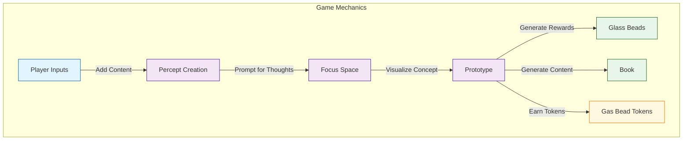
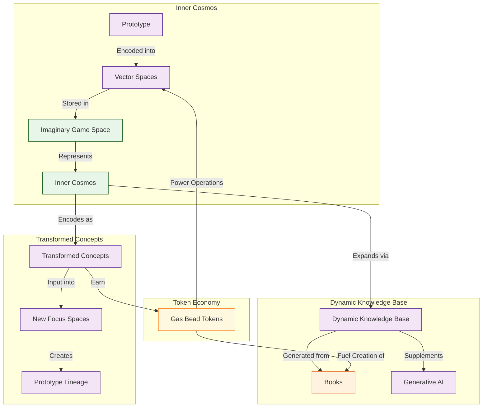

# 2.2. The Core Game

The Glass Bead Game is the core interactive component of Memorativa [1]. The player has a profile (represented by a glass bead) that tracks gameplay and progress.

1. **Player Inputs**: Players can add any meaningful content (e.g., URLs, tweets, videos, books, memes, images) to the game. Input quality is managed through AI filtering for relevance and user-driven intent tagging, ensuring that inputs contribute meaningfully to the knowledge network. A detailed exploration of these validation mechanisms appears in [Section 2.6: Input Processing] [6].
2. **Percept Creation**: When a player adds an input, the game prompts them for thoughts or additional information about the perception represented by the input [2].
3. **Focus Space**: The game generates a **focus space** where the input is visualized as a concept. The concept is represented by a **prototype**, which is composed of individual facets of the perception, called **percepts** [3].
4. **Rewards**: The game generates a **glass bead** for each focus space, percept, and prototype. It also generates a **Book**, which contains content about the concept and details about the input, percepts, and prototype. Players earn **Gas Bead Tokens (GBT)** for these contributions, which serve as the computational fuel that powers system operations [7].

## Token Economy

The Core Game is powered by a token economy that uses Gas Bead Tokens (GBT) as its operational fuel [7]. This system:

1. **Powers Computations**: Each game operation consumes GBT based on its computational complexity:
   - Percept creation
   - Focus space generation
   - Prototype formation
   - Book generation
   - Vector calculations

2. **Rewards Participation**: Players earn GBT for valuable contributions:
   - Creating quality percepts (5-10 GBT)
   - Refining vectors (3-7 GBT)
   - Generating books (20-50 GBT)
   - Validating content (0.5-1 GBT)
   - Sharing knowledge (5-15 GBT)
   - Validating prototypes (3-8 GBT)

3. **Incentivizes Quality**: The reward structure scales with contribution quality, encouraging thoughtful engagement rather than quantity of inputs.

This token economy creates a self-sustaining loop where players earn tokens by contributing knowledge and spend them to power the creation of new knowledge artifacts.

## Vector Space Encoding

The prototype and percept structures encode the concept into data structures that can be represented in vector spaces [4]. This allows the game to efficiently store, categorize, compare, filter, and present the percepts and prototypes in an imaginary game space, which represents the player's inner cosmos.

As the player collects inputs, their inner cosmos expands according to the logic of the structural encoding and the growth of the dynamic knowledge base generated from their Books [5]. This knowledge base serves as a corpus of conceptual data that supplements the generative AI powering the game logic and analysis.

## Concept Transformation

As the inner cosmos grows, concepts and focus spaces themselves are encoded as inputs in new focus spaces, creating transformed, layered, linked, and synthesized percepts and prototypes [3].

## Operational Costs

Each core game operation consumes Gas Bead Tokens according to its computational complexity [7]:

| Operation | GBT Cost | Description |
|-----------|----------|-------------|
| Percept Creation | 5-10 GBT | Establishing new conceptual structures |
| Vector Modification | 3-7 GBT | Changing core vectors in the triplet structure |
| Spatial Query | 2-5 GBT | Searching through the vector space |
| Prototype Integration | 1-3 GBT | Connecting percepts to form coherent structures |
| Book Generation | 20-50 GBT | Creating comprehensive knowledge artifacts |
| Focus Space Creation | 10-15 GBT | Establishing new conceptual workspaces |

These costs ensure computational resources are allocated efficiently while creating an economic incentive for thoughtful contribution over quantity.

## Key Points

- The **Glass Bead Game** transforms personal content into an interconnected knowledge network through a gamified interface, drawing inspiration from Hermann Hesse's novel while implementing a practical system for knowledge organization and discovery [1]

- The chain of thought progresses from player input to percept creation to focus space generation to reward distribution, establishing a complete cycle that transforms raw content into structured knowledge representations [2][3]

- Players build their **personal knowledge base** naturally through daily content consumption and reflection, creating an evolving "inner cosmos" that grows organically with each interaction rather than requiring artificial learning structures [5]

- The system creates meaningful connections between concepts by encoding them in comparable **vector spaces**, enabling mathematical operations on conceptual relationships that preserve semantic meaning while facilitating computational analysis [4]

- This vector-based approach bridges the gap between qualitative human understanding and quantitative machine representation, allowing the system to identify patterns and relationships that might not be immediately apparent to the human player [Section 2.1]

- Each interaction enriches both the player's understanding and the AI's ability to generate insights, creating a **positive feedback loop** where the system becomes increasingly personalized and valuable over time [Section 2.3]

- The game mechanics encourage **active engagement** with content rather than passive consumption, transforming the player from a consumer to a co-creator who actively participates in meaning-making [2]

- The **prototype structure** serves as a flexible template for representing complex concepts, allowing for both standardization (for machine processing) and customization (for human expression) within the same framework [3]

- As the player's inner cosmos expands, concepts themselves become inputs for new focus spaces, enabling **recursive transformation** and synthesis that mirrors how human understanding evolves through reflection and recombination [Section 2.12]

- The Core Game establishes the fundamental interaction pattern that powers all other components of Memorativa, creating a foundation for more complex features like collaborative spaces, concept evolution tracking, and knowledge visualization [Section 2.14]

- The game implements the **percept-triplet structure** introduced in Section 1.5, providing a concrete implementation of the three-vector approach (Archetypal, Expression, and Mundane) that addresses the curse of dimensionality in traditional vector spaces [Section 1.5]

- The focus space generation process embodies the principle of **active understanding** established in Section 1.5, creating a structured environment for concept formation that aligns with Steiner's epistemological approach to adding ideal elements to perceptions [Section 1.2]

- By encoding player content into the three-vector structure, the Core Game practically applies the **dimensional constraint** strategy outlined in Section 1.5, sacrificing mathematical flexibility for semantic clarity while maintaining stable and interpretable relationships between concepts [Section 1.5]

- The Inner Cosmos concept directly implements the **geocentric orientation** principle from Section 1.5, giving players a navigable conceptual space that mirrors the ancient "sky computer" approach to knowledge organization [Section 1.4]

- The recursive transformation of concepts within the game space demonstrates the **symbolic foundations** principle introduced in Section 1.5, leveraging the power of mythology embedded in language to create a bridge between human cognition and machine computation [Section 1.5]

- The **Gas Bead Token system** creates an economic incentive structure that rewards valuable contributions while ensuring computational efficiency, creating a self-sustaining ecosystem that powers knowledge creation and transformation [7]

## Citations

- [1] Hesse, H. (1943). *The Glass Bead Game*. Picador.
- [2] [Section 2.4] The Percept Triplet.
- [3] [Section 2.12] Focus Spaces.
- [4] Mikolov, T., et al. (2013). "Distributed Representations of Words and Phrases and their Compositionality." *Advances in Neural Information Processing Systems*, 26.
- [5] [Section 2.14] Books.
- [6] [Section 2.6] Input Processing.
- [7] [Section 2.18] Gas Bead Tokens.
