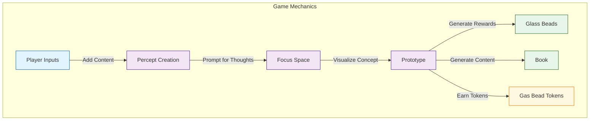
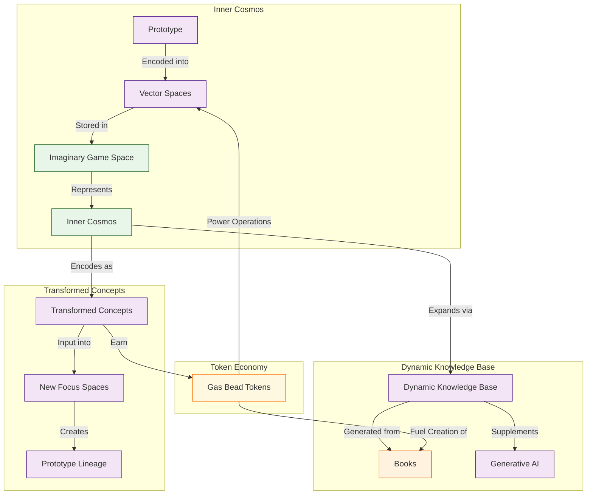

# 2.2. The Core Game

## Summary

The core game of Memorativa, detailed in section 2.2, revolves around the Glass Bead Game—a sophisticated interactive system inspired by Hermann Hesse's novel. At its heart, the game transforms personal inputs—such as URLs, tweets, videos, books, memes, and images—into structured, interconnected knowledge artifacts.

When you, as a player, introduce content into the game, the system prompts you to reflect and elaborate on your perception of that content. This reflective step, known as percept creation, ensures that each input is enriched with personal meaning and context. The game then visualizes your input within a "focus space," a conceptual workspace where your perception is represented as a structured "prototype." Each prototype is composed of smaller units called percepts, which capture distinct facets of your original input.

As you engage with this process, the game rewards your contributions by generating "glass beads"—symbolic tokens representing your percepts, prototypes, and focus spaces. Additionally, the system compiles your contributions into a "Book," a comprehensive artifact detailing your inputs and their conceptual relationships. These activities earn you Gas Bead Tokens (GBT), the computational currency powering the game's operations.

The knowledge you create is organized into a hierarchical structure:

- **Basic Structures**: Fundamental percept-triplets encoding individual concepts.
- **Composite Structures**: Prototypes and focus spaces that organize basic percepts into coherent units.
- **Complex Structures**: Books and expansive knowledge networks synthesizing multiple composite structures.

This hierarchy ensures that knowledge evolves systematically, from simple perceptions to sophisticated conceptual frameworks.

Gas Bead Tokens serve as both fuel and incentive within the game's economy. Each computational operation—such as percept creation, vector modifications, spatial queries, prototype integrations, and book generation—consumes tokens proportional to its complexity. Conversely, you earn tokens by contributing valuable content, refining vectors, validating prototypes, and sharing knowledge. This economic model encourages thoughtful, high-quality engagement rather than mere quantity.

Each Glass Bead Token encapsulates knowledge structures in multiple states—active (validated), quantum (probabilistic), and holographic (relational)—enabling dynamic conceptual evolution. The game's vector space encoding translates your percepts and prototypes into mathematical representations, facilitating efficient storage, retrieval, and analysis within your personal "inner cosmos." As you continue to interact with the game, your inner cosmos expands organically, enriched by the dynamic knowledge base generated from your Books.

Privacy and security are integral, with granular controls allowing you to manage how your knowledge artifacts are shared, modified, or kept private. This ensures collaboration respects your boundaries and preferences.

Concepts within your inner cosmos are recursively transformed, becoming inputs for new focus spaces. This recursive process mirrors human cognitive evolution, allowing continuous reflection, recombination, and synthesis of ideas. Advanced technical integrations—such as Retrieval Augmented Generation (RAG), Large Language Models (LLMs), and hybrid vector encoding—enhance your contributions, bridging qualitative human insights with quantitative computational analysis.

Ultimately, the core game mechanics establish a positive feedback loop: your active engagement enriches both your personal understanding and the AI's analytical capabilities, creating a personalized, evolving knowledge ecosystem.


## Introduction

The Glass Bead Game is the core interactive component of Memorativa [1]. The player has a profile (represented by a glass bead) that tracks gameplay and progress.

1. **Player Inputs**: Players can add any meaningful content (e.g., URLs, tweets, videos, books, memes, images) to the game. Input quality is managed through AI filtering for relevance and user-driven intent tagging, ensuring that inputs contribute meaningfully to the knowledge network. A detailed exploration of these validation mechanisms appears in [Section 2.6: Input Processing] [6].
2. **Percept Creation**: When a player adds an input, the game prompts them for thoughts or additional information about the perception represented by the input [2].
3. **Focus Space**: The game generates a **focus space** where the input is visualized as a concept. The concept is represented by a **prototype**, which is composed of individual facets of the perception, called **percepts** [3].
4. **Rewards**: The game generates a **glass bead** for each focus space, percept, and prototype. It also generates a **Book**, which contains content about the concept and details about the input, percepts, and prototype. Players earn **Gas Bead Tokens (GBT)** for these contributions, which serve as the computational fuel that powers system operations [7].



*Figure 1: Core Game Mechanics Flowchart, illustrating the sequential transformation from player inputs through percept creation, focus space visualization, prototype structuring, and reward generation, highlighting the interconnected processes that drive gameplay.*

## Structure Hierarchy

As players engage with the core game, they generate knowledge artifacts that fall into a three-tier hierarchy that will be fully detailed in [Section 2.19]:

1. **Basic Structures**: Foundational elements like percept-triplets that encode individual concepts
2. **Composite Structures**: Intermediate constructs like prototypes and focus spaces that organize basic structures 
3. **Complex Structures**: Advanced formations like books and knowledge networks that synthesize multiple composite structures

This hierarchy provides a framework for how knowledge is organized, shared, and evolved within the system.

## Token Economy

The Core Game is powered by a token economy that uses Gas Bead Tokens (GBT) as its operational fuel [7]. This system:

1. **Powers Computations**: Each game operation consumes GBT based on its computational complexity:
   - Percept creation
   - Focus space generation
   - Prototype formation
   - Book generation
   - Vector calculations

2. **Rewards Participation**: Players earn GBT for valuable contributions:
   - Creating quality percepts (5-10 GBT)
   - Refining vectors (3-7 GBT)
   - Generating books (20-50 GBT)
   - Validating content (0.5-1 GBT)
   - Sharing knowledge (5-15 GBT)
   - Validating prototypes (3-8 GBT)

3. **Incentivizes Quality**: The reward structure scales with contribution quality, encouraging thoughtful engagement rather than quantity of inputs.

This token economy creates a self-sustaining loop where players earn tokens by contributing knowledge and spend them to power the creation of new knowledge artifacts.

## Glass Bead Token States

Each Glass Bead token encapsulates structures with multiple potential states [Section 2.19]:
- **Active states**: Current validated representations
- **Quantum states**: Probabilistic superpositions awaiting resolution
- **Holographic states**: Reference-based projections that maintain relationships

These multi-dimensional states enable rich temporal and conceptual evolution within the system.

## Vector Space Encoding

The prototype and percept structures encode concepts using the percept-triplet structure introduced in Section 1.3. This three-vector approach addresses the curse of dimensionality in traditional AI systems by using three culturally rich vectors that directly mirror human cognitive structures:

1. **Archetypal Vector (WHAT)**: Equivalent to **planets** in astrological structure, representing fundamental qualities and core energies of a concept (e.g., Sun/identity, Mars/action, Jupiter/expansion)
2. **Expression Vector (HOW)**: Equivalent to **zodiacal signs**, indicating specific modes of expression (e.g., Leo/dramatic, Virgo/analytical, Aquarius/innovative)
3. **Mundane Vector (WHERE)**: Equivalent to **houses**, grounding concepts in contextual domains (e.g., 1st House/identity, 10th House/career, 4th House/home)

This structured encoding allows the game to efficiently store, categorize, compare, filter, and present percepts and prototypes in an imaginary game space, which represents the player's inner cosmos. The three-vector approach creates a middle layer between statistical patterns and symbolic frameworks, enabling meaningful translation between human and machine domains.

As the player collects inputs, their inner cosmos expands according to the logic of the structural encoding and the growth of the dynamic knowledge base generated from their Books. This knowledge base serves as a corpus of conceptual data that supplements the generative AI powering the game logic and analysis.

## Privacy and Security Framework

The system implements granular privacy controls at all structural levels [Section 2.19], allowing players to determine:
- Which structures are publicly shared
- Which remain private
- Which are selectively shared with specific users
- Who can contribute to or modify existing structures

These controls, combined with permission-based access management, ensure that knowledge sharing respects player boundaries while enabling collaboration.

## Concept Transformation

As the inner cosmos grows, concepts and focus spaces themselves are encoded as inputs in new focus spaces, creating transformed, layered, linked, and synthesized percepts and prototypes [3].



*Figure 2: Inner Cosmos and Token Economy Diagram, depicting how prototypes are encoded into vector spaces, stored within the imaginary game space, and integrated into the dynamic knowledge base, powered by Gas Bead Tokens, enabling recursive concept transformation and continuous knowledge evolution.*

## Cybernetic Implementation

The Core Game directly implements the cybernetic system principles established in Section 2.1, creating a practical manifestation of the theoretical framework. This implementation bridges human cognition and machine computation through several key mechanisms:

### Bidirectional Interface

The Core Game operationalizes the bidirectional interface described in Section 2.1 through:

1. **Human-to-Machine Translation** ($T_M: H \rightarrow M$): 
   - Player inputs (URLs, tweets, videos, etc.) are translated into machine-processable data
   - Percept creation captures subjective human understanding in structured formats
   - Player reflections provide context that enriches vector representations

2. **Machine-to-Human Translation** ($T_H: M \rightarrow H$):
   - Focus spaces visualize abstract vector relationships in human-interpretable forms
   - Books synthesize computational analyses into narrative structures
   - Glass beads symbolically represent complex computational structures

This bidirectional translation mechanism ensures that human meaning and machine representation remain aligned throughout the gameplay process.

### Human as Animator and Validator

The Core Game implements the dual role of humans described in Section 2.1:

1. **Animator Function**:
   - Players initiate the system's operations through content contribution
   - Player reflections animate otherwise static content with personal meaning
   - Player interactions drive the expansion of the inner cosmos

2. **Validator Function**:
   - Players validate percept accuracy through the reflection process
   - Prototype formation requires player confirmation of structural correspondences
   - Book generation incorporates player feedback to ensure conceptual integrity

This dual role ensures that the system remains both active and accurate, with human judgment serving as the ultimate arbiter of meaning.

### Feedback Loop Implementation

The cybernetic feedback mechanisms from Section 2.1 are implemented through:

1. **Input-Output Cycle**:
   - Player inputs → System processing → Focus space visualization → Player validation → Refined understanding
   - Each cycle improves both the player's conceptual clarity and the system's representational accuracy

2. **Error Correction**:
   - Discrepancies between player intent and system representation are detected during the validation phase
   - Vector modifications (3-7 GBT) allow for correction of misalignments
   - Prototype validation (3-8 GBT) ensures structural integrity

3. **Adaptive Parameters**:
   - The dynamic knowledge base learns from interaction patterns
   - Vector spaces adjust based on validated relationships between concepts
   - The token economy incentivizes corrections that improve system accuracy

This implementation creates the self-regulating system described in Section 2.1, where each interaction refines both human understanding and machine representation.

### Three-Vector Processing

The Core Game implements the three-vector approach (Archetypal/WHAT, Expression/HOW, Mundane/WHERE) introduced in Section 1.3 through:

1. **Vector Encoding with Astrological Mapping**: 
   - Percepts are encoded using the three-vector structure that maps to astrological elements
   - The Archetypal Vector (WHAT) corresponds to planets, representing fundamental qualities
   - The Expression Vector (HOW) corresponds to zodiacal signs, indicating modes of expression
   - The Mundane Vector (WHERE) corresponds to houses, grounding concepts in domains
   - Angular relationships (aspects) between vectors create meaningful semantic connections

2. **Dimensional Constraint to Address the Curse of Dimensionality**:
   - The three-vector structure constrains representation to three dimensions with established semantic meaning
   - This constraint sacrifices mathematical flexibility for semantic clarity
   - Unlike high-dimensional spaces where angular relationships become meaningless, this approach preserves semantic significance through discrete aspect angles
   - The result is stable, interpretable relationships between concepts

3. **Semantic Clarity Through Symbolic Embedding**:
   - The three-vector structure leverages culturally embedded symbolic patterns already present in language
   - This creates a middle layer between statistical patterns and symbolic frameworks
   - The approach enables meaningful translation between human and machine domains
   - The result is a representation that is both computationally efficient and humanly interpretable

This implementation directly addresses the curse of dimensionality identified in Section 1.3, where high-dimensional vector spaces exhibit counterintuitive properties that make semantic representation difficult.

### Geocentric Navigation

The Core Game implements the geocentric orientation principle from Section 2.1 through:

1. **Inner Cosmos**: 
   - The player's conceptual space is represented as a navigable "inner cosmos"
   - This representation builds on humanity's oldest computational framework
   - The geocentric perspective places the player at the center of their knowledge universe

2. **Spatial Relationships**:
   - Concepts are positioned relative to each other based on semantic relationships
   - Navigation between concepts follows intuitive spatial metaphors
   - The result is an intuitive understanding of the knowledge landscape

This implementation transforms abstract knowledge organization into an intuitive navigation experience, as described in Section 2.1.

Through these implementations, the Core Game transforms the theoretical cybernetic framework of Section 2.1 into a practical, interactive system that enables meaningful human-machine collaboration in knowledge creation and organization.

## Technical Integration

The Core Game is powered by advanced technical components [Section 2.19]:

1. **RAG System Integration**: Retrieval Augmented Generation provides contextually relevant information from the knowledge base
2. **LLM Processing**: Large Language Models help process and generate meaningful content
3. **Hybrid Vector Encoding**: Combines spherical and hyperbolic spaces for optimal concept representation

These technologies work together to create a seamless experience where player contributions are enhanced through AI assistance while maintaining human-centered meaning.

## Operational Costs

Each core game operation consumes Gas Bead Tokens according to its computational complexity [7]:

| Operation | GBT Cost | Description |
|-----------|----------|-------------|
| Percept Creation | 5-10 GBT | Establishing new conceptual structures |
| Vector Modification | 3-7 GBT | Changing core vectors in the triplet structure |
| Spatial Query | 2-5 GBT | Searching through the vector space |
| Prototype Integration | 1-3 GBT | Connecting percepts to form coherent structures |
| Book Generation | 20-50 GBT | Creating comprehensive knowledge artifacts |
| Focus Space Creation | 10-15 GBT | Establishing new conceptual workspaces |

These costs ensure computational resources are allocated efficiently while creating an economic incentive for thoughtful contribution over quantity.

## Code Summary

Here's a concise, structured code summary of section 2.2, synthesizing all examples into a unified narrative:

```js
// Player initiates interaction by adding meaningful content
const playerInput = addContent({
  type: ['URL', 'tweet', 'video', 'book', 'meme', 'image'],
  content: 'User-provided input',
});

// System prompts player for reflective elaboration
const percept = createPercept({
  input: playerInput,
  reflection: 'Player-generated thoughts and context',
});

// Generate a conceptual workspace ("Focus Space") visualizing the input
const focusSpace = generateFocusSpace({
  percept,
});

// Represent the concept structurally as a "Prototype"
const prototype = createPrototype({
  focusSpace,
  percepts: [percept],
});

// Reward player contributions with symbolic tokens ("Glass Beads")
const glassBeads = generateGlassBeads({
  percept,
  prototype,
  focusSpace,
});

// Compile contributions into a comprehensive artifact ("Book")
const book = generateBook({
  prototype,
  percepts: [percept],
  contentDetails: playerInput,
});

// Award computational currency ("Gas Bead Tokens") based on contribution quality
const gasBeadTokens = awardGBT({
  perceptCreation: 7, // example values within defined ranges
  vectorRefinement: 5,
  bookGeneration: 30,
  contentValidation: 1,
  knowledgeSharing: 10,
  prototypeValidation: 6,
});

// Encode percepts and prototypes into structured vector spaces
const vectorSpace = encodeVectorSpace({
  prototype,
  percepts: [percept],
  encodingType: 'hybrid', // spherical and hyperbolic
});

// Expand player's personal conceptual universe ("Inner Cosmos")
const innerCosmos = expandInnerCosmos({
  vectorSpace,
  dynamicKnowledgeBase: [book],
});

// Recursively transform concepts into new inputs for further synthesis
const transformedConcept = transformConcept({
  innerCosmos,
  previousPrototype: prototype,
});

const newFocusSpace = generateFocusSpace({
  percept: transformedConcept,
});

// Manage privacy and sharing settings for knowledge artifacts
setPrivacyControls({
  artifact: book,
  visibility: 'selective', // public, private, selective
  permissions: ['view', 'edit', 'contribute'],
});

// Technical integrations enhancing player contributions
const enhancedContent = technicalIntegration({
  retrievalAugmentedGeneration: true,
  largeLanguageModel: true,
  vectorEncoding: 'hybrid',
  knowledgeBase: innerCosmos,
});

// Positive feedback loop: player engagement enriches AI capabilities
updateDynamicKnowledgeBase({
  contributions: [enhancedContent],
  tokensSpent: gasBeadTokens,
});
```

### Narrative Explanation:

In Memorativa's core game, players actively contribute meaningful content, prompting reflective elaboration that enriches each input. These reflections become structured percepts, visualized within conceptual workspaces called focus spaces. Each focus space generates a prototype, a structured representation composed of percepts. Players receive symbolic rewards—glass beads—and comprehensive artifacts—books—documenting their contributions.

The system incentivizes thoughtful engagement through Gas Bead Tokens (GBT), awarded based on contribution quality and spent to power computational operations. Percepts and prototypes are encoded into hybrid vector spaces, expanding the player's inner cosmos—a personalized conceptual universe. Concepts recursively transform, becoming inputs for new synthesis cycles, mirroring human cognitive evolution.

Granular privacy controls ensure respectful collaboration, while advanced technical integrations (RAG, LLMs, hybrid vectors) enhance player-generated content. This creates a positive feedback loop, continuously enriching both player understanding and AI analytical capabilities, fostering a dynamic, evolving knowledge ecosystem.

## Key Math

Here's a concise and clear **Key Math** section tailored specifically for **Section 2.2: The Core Game**:

- **Percept-Triplet Vector Encoding**:  
  Concepts and percepts are encoded using the three-vector approach from Section 1.3:
  \[
  f: P \rightarrow A \times E \times M
  \]
  where \( P \) is the set of percepts, and \( A \), \( E \), and \( M \) are the Archetypal (WHAT), Expression (HOW), and Mundane (WHERE) vector spaces respectively.

- **Astrological Mapping**:  
  The mapping is defined as:
  \[
  f(p) = (a_i, e_j, m_k)
  \]
  where \( a_i \in \{Sun, Moon, Mercury,...\} \), \( e_j \in \{Aries, Taurus,...\} \), and \( m_k \in \{House_1, House_2,...\} \) represent the planet, sign, and house assignments for percept \( p \).

- **Aspect Calculation**:  
  Angular relationships (aspects) between two percepts are calculated based on zodiacal longitude differences:
  \[
  \alpha(p_1, p_2) = \min(|\theta_1 - \theta_2|, 360° - |\theta_1 - \theta_2|)
  \]
  where \( \theta \) represents zodiacal longitude. Semantic significance is assigned to specific angles: Conjunction (0°), Sextile (60°), Square (90°), Trine (120°), and Opposition (180°).

- **Percept-Prototype Relationship**:  
  Each prototype \( \mathbf{R} \) is represented as a structured aggregation of percept vectors:
  \[
  \mathbf{R} = \sum_{i=1}^{n} w_i \cdot f(p_i)
  \]
  where \( w_i \) represents the weight of each percept. This weighted aggregation ensures semantic coherence within the prototype structure.

- **Semantic Relevance Calculation**:  
  The semantic relevance between percepts is quantified based on their aspect patterns:
  \[
  relevance(p_1, p_2) = \sum_{i,j} w_{aspect}(\alpha(a_i, a_j))
  \]
  where \( a_i \) represents planets in percept \( p_1 \), \( a_j \) represents planets in percept \( p_2 \), and \( w_{aspect} \) assigns weights to different aspect types.

- **Recursive Concept Transformation**:  
  Recursive transformations of concepts into new focus spaces can be modeled as iterative mappings:
  \[
  \mathbf{R}_{t+1} = g(\mathbf{R}_t, \mathbf{p}_{t+1})
  \]
  where \( g \) is a transformation function integrating previous prototypes with new percepts, enabling continuous conceptual evolution.

- **Token Economy Cost Function**:  
  The computational cost \( C \) of operations consuming Gas Bead Tokens (GBT) is defined as:
  \[
  C = \sum_{i} w_i \cdot c_i
  \]
  where \( w_i \) represents the computational weight of operation \( i \), and \( c_i \) is the token cost per operation type, ensuring resource allocation aligns with computational complexity [7].

### Explanation:

This **Key Math** section formalizes the mathematical foundations underlying the core game mechanics described in Section 2.2. It explicitly defines:

- How percepts are encoded using the three-vector approach with astrological mapping
- How angular relationships (aspects) between percepts are calculated and assigned semantic meaning
- The mathematical relationship between percepts and their aggregated prototypes
- How semantic relevance between percepts is calculated based on aspect patterns
- The recursive mathematical model for concept transformation and evolution
- The computational cost function governing the token economy

These formulations provide clarity and precision, connecting the conceptual framework directly to mathematical representations, facilitating deeper understanding and potential computational implementation.

## Key Points

- The **Glass Bead Game** transforms personal content into an interconnected knowledge network through a gamified interface, drawing inspiration from Hermann Hesse's novel while implementing a practical system for knowledge organization and discovery [1]

- The chain of thought progresses from player input to percept creation to focus space generation to reward distribution, establishing a complete cycle that transforms raw content into structured knowledge representations [2][3]

- Players build their **personal knowledge base** naturally through daily content consumption and reflection, creating an evolving "inner cosmos" that grows organically with each interaction rather than requiring artificial learning structures [5]

- The system creates meaningful connections between concepts by encoding them in comparable **vector spaces**, enabling mathematical operations on conceptual relationships that preserve semantic meaning while facilitating computational analysis [4]

- This vector-based approach bridges the gap between qualitative human understanding and quantitative machine representation, allowing the system to identify patterns and relationships that might not be immediately apparent to the human player [Section 2.1]

- Each interaction enriches both the player's understanding and the AI's ability to generate insights, creating a **positive feedback loop** where the system becomes increasingly personalized and valuable over time [Section 2.3]

- The game mechanics encourage **active engagement** with content rather than passive consumption, transforming the player from a consumer to a co-creator who actively participates in meaning-making [2]

- The **prototype structure** serves as a flexible template for representing complex concepts, allowing for both standardization (for machine processing) and customization (for human expression) within the same framework [3]

- As the player's inner cosmos expands, concepts themselves become inputs for new focus spaces, enabling **recursive transformation** and synthesis that mirrors how human understanding evolves through reflection and recombination [Section 2.12]

- The Core Game establishes the fundamental interaction pattern that powers all other components of Memorativa, creating a foundation for more complex features like collaborative spaces, concept evolution tracking, and knowledge visualization [Section 2.14]

- The game implements the **percept-triplet structure** introduced in Section 1.3, providing a concrete implementation of the three-vector approach (Archetypal/WHAT, Expression/HOW, Mundane/WHERE) that addresses the curse of dimensionality in traditional vector spaces

- The focus space generation process embodies the principle of **active understanding** established in Section 1.3, creating a structured environment for concept formation that aligns with Steiner's epistemological approach to adding ideal elements to perceptions

- By encoding player content into the three-vector structure with astrological mapping (planets, signs, houses), the Core Game practically applies the **dimensional constraint** strategy outlined in Section 1.3, sacrificing mathematical flexibility for semantic clarity while maintaining stable and interpretable relationships between concepts

- The Inner Cosmos concept directly implements the **geocentric orientation** principle from Section 1.3, giving players a navigable conceptual space that mirrors humanity's oldest computational framework

- The recursive transformation of concepts within the game space demonstrates the **symbolic embedding** principle introduced in Section 1.3, leveraging culturally embedded symbolic patterns already present in language to create a bridge between human cognition and machine computation

- The **Gas Bead Token system** creates an economic incentive structure that rewards valuable contributions while ensuring computational efficiency, creating a self-sustaining ecosystem that powers knowledge creation and transformation [7]

- The **three-tier structure hierarchy** provides a comprehensive framework for knowledge organization that evolves from basic elements to complex systems, enabling both granular and holistic approaches to knowledge management [Section 2.19]

## Citations

- [1] Hesse, H. (1943). *The Glass Bead Game*. Picador.
- [2] [Section 2.4] The Percept Triplet.
- [3] [Section 2.12] Focus Spaces.
- [4] Mikolov, T., et al. (2013). "Distributed Representations of Words and Phrases and their Compositionality." *Advances in Neural Information Processing Systems*, 26.
- [5] [Section 2.14] Books.
- [6] [Section 2.6] Input Processing.
- [7] [Section 2.18] Gas Bead Tokens.
- [8] [Section 1.3] Perceptual Encoding.
