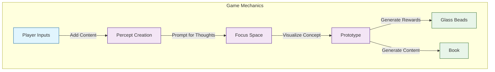
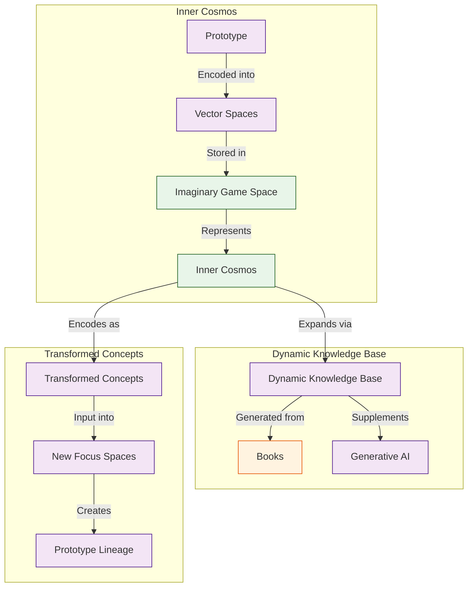

# 2.2. The Core Game

The Glass Bead Game is the core interactive component of Memorativa. The player has a profile (represented by a glass bead) that tracks gameplay and progress.

1. **Player Inputs**: Players can add any meaningful content (e.g., URLs, tweets, videos, books, memes, images) to the game.
2. **Percept Creation**: When a player adds an input, the game prompts them for thoughts or additional information about the perception represented by the input.
3. **Focus Space**: The game generates a **focus space** where the input is visualized as a concept. The concept is represented by a **prototype**, which is composed of individual facets of the perception, called **percepts**.
4. **Rewards**: The game generates a **glass bead** for each focus space, percept, and prototype. It also generates a **Book**, which contains content about the concept and details about the input, percepts, and prototype.

The prototype and percept structures encode the concept into data structures that can be represented in vector spaces. This allows the game to efficiently store, categorize, compare, filter, and present the percepts and prototypes in an imaginary game space, which represents the player's inner cosmos.

As the player collects inputs, their inner cosmos expands according to the logic of the structural encoding and the growth of the dynamic knowledge base generated from their Books. This knowledge base serves as a corpus of conceptual data that supplements the generative AI powering the game logic and analysis.

As the inner cosmos grows, concepts and focus spaces themselves are encoded as inputs in new focus spaces, creating transformed, layered, linked, and synthesized percepts and prototypes.

## Key points

- The Glass Bead Game transforms personal content into an interconnected knowledge network through a gamified interface
- Players build their knowledge base naturally through daily content consumption and reflection
- The system creates meaningful connections between concepts by encoding them in comparable vector spaces
- Each interaction enriches both the player's understanding and the AI's ability to generate insights
- The game mechanics encourage active engagement with content rather than passive consumption