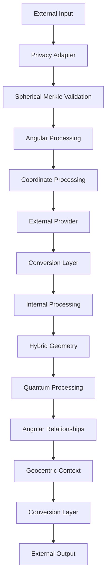

# 2.20. LLM Integration with Memorativa

Large Language Models (LLMs) serve as a critical bridge between human language and the hybrid geometric structures that form the foundation of the Memorativa system. This section provides a comprehensive implementation blueprint for integrating LLMs, transforming the architectural vision described in [Section 2.6](./memorativa-2-6-generative-ai.md) into concrete technical interfaces, optimization strategies, and integration protocols.

Unlike traditional LLM implementations that operate in isolation, Memorativa's approach embeds these models within a sophisticated framework that preserves the system's unique characteristics: hybrid spherical-hyperbolic geometry, observer-centric knowledge representation, token-based economic incentives, and multi-state verification mechanisms. The integration is bidirectional—the internal system leverages LLMs to enhance its core processing capabilities while also exposing carefully designed external interfaces that allow third-party services to interact with Memorativa's knowledge structures.

This integration represents a crucial advancement in how AI systems interact with human knowledge. By building upon the Glass Bead system described in Section 2.3 and the Percept-Triplet structure detailed in Section 2.4, the LLM Integration ensures that all generative operations maintain semantic integrity while preserving the three-dimensional encoding system (archetypal, expressive, and contextual vectors) that distinguishes Memorativa from conventional AI approaches. The result is an LLM framework that doesn't merely process language but actively contributes to the growth and coherence of a player's personal knowledge cosmos.

## Alignment with the Core Game

The LLM Integration system directly implements the Generative AI architecture described in Section 2.6 and supports the Core Game mechanics described in Section 2.2:

1. **Structure Hierarchy Support**
   - Processes all three structural tiers:
     - **Basic Structures**: Direct processing of percept-triplets with angular relationships
     - **Composite Structures**: Maintains relationships within prototypes and focus spaces
     - **Complex Structures**: Powers book generation and knowledge network evolution

2. **Inner Cosmos Enhancement**
   - Enables expansive growth of the player's personal knowledge space
   - Leverages hybrid geometric processing to maintain conceptual relationships
   - Preserves the geocentric orientation that makes knowledge navigation intuitive

3. **Prototype Formation**
   - Enriches prototype creation through contextual understanding
   - Maintains semantic relationships between percepts within prototypes
   - Enables concept transformation for layered, linked, and synthesized prototypes

4. **Token Economy Integration**
   - Adheres to the Gas Bead Token (GBT) operational cost framework as defined in Section 2.6:
     - Multi-Modal Analysis: 12-18 GBT
     - Book Generation: 20-50 GBT
     - Prototype Aggregation: 8-15 GBT
     - Focus Space Creation: 10-15 GBT
     - Percept Creation: 5-10 GBT
     - Vector Modification: 3-7 GBT
     - Symbolic Translation: 4-8 GBT
     - Prototype Integration: 1-3 GBT
     - Contextual Bridging: 2-4 GBT
     - Spatial Query: 2-5 GBT
     - Spherical Index Query: 1-2 GBT

5. **Glass Bead Token States**
   - Supports all three token states as defined in Section 2.3:
     - **Mundane state**: Standard timestamped processing with direct verification
     - **Quantum state**: Probabilistic superpositions for concept evolution with angular uncertainty
     - **Holographic state**: Reference-based projections maintaining relationships across beads

6. **Player Knowledge Growth**
   - Enhances conceptual understanding through AI-assisted insights
   - Preserves player agency while augmenting their cognitive capabilities
   - Enables discovery of non-obvious connections within their knowledge network

## External interfaces

The system offers five key external interfaces:

1. **Provider Interface** (`LLMProvider`)
   - Core text generation and embedding methods
   - Support for multiple providers (OpenAI, Anthropic, etc.)
   - Capability detection (streaming, context limits, etc.)
   - Provider-specific optimizations

2. **Privacy-Aware Adapter** (`LLMAdapter`)
   - Secure interface for external LLM processing
   - Public data handling only
   - Gas token verification
   - Format conversion

3. **Conversion Layer** (`FormatConverter`)
   - Bidirectional conversion between internal/external formats
   - Geometry simplification for external processing
   - Metadata handling
   - State preservation

4. **Rate Limiting & Cost Management** (`ExternalLLMManager`)
   - Provider-specific rate limits
   - Cost estimation and tracking
   - Gas verification
   - Usage monitoring

5. **Spherical Merkle Interface** (`SphericalMerkleInterface`)
   - Access to Spherical Merkle Trees for LLM
   - Angular relationship preservation
   - Hybrid verification processes
   - Coordinate system integration
   - Quantum-enhanced verification when advantageous

All external processing is:
- Limited to public data only
- Gas token verified
- Cost tracked
- Rate limited
- Basic validation checked

### 1. Provider Interface
```rust
pub trait LLMProvider {
    // Core interaction methods
    async fn generate_text(&self, prompt: &str) -> Result<String>;
    async fn generate_embeddings(&self, text: &str) -> Result<Vec<f32>>;
    
    // Optional capabilities
    fn supports_streaming(&self) -> bool;
    fn max_context_length(&self) -> usize;
    fn embedding_dimensions(&self) -> usize;
}

// Example implementations
pub struct OpenAIProvider {
    client: OpenAIClient,
    config: ProviderConfig,
}

pub struct AnthropicProvider {
    client: AnthropicClient,
    config: ProviderConfig,
}
```

### 2. Privacy-Aware Adapter
```rust
pub struct LLMAdapter {
    provider: Box<dyn LLMProvider>,
    privacy_filter: PrivacyFilter,
    token_manager: GasTokenManager,
    
    async fn process_external(
        &self,
        input: ExternalInput,
        privacy_level: PrivacyLevel
    ) -> Result<ProcessedOutput> {
        // Verify gas tokens
        self.token_manager.verify_operation(Operation::ExternalLLM)?;
        
        // Apply privacy filtering
        let filtered = self.privacy_filter.filter_for_external(input)?;
        
        // Process through external LLM
        let response = match privacy_level {
            PrivacyLevel::Public => {
                self.provider.generate_text(&filtered.prompt).await?
            },
            _ => return Err(Error::PrivacyLevelNotSupported)
        };
        
        // Convert to internal format
        self.convert_to_internal_format(response)
    }
}
```

### 3. Conversion Layer
```rust
pub struct FormatConverter {
    spatial_encoder: HybridSpatialEncoder,
    
    fn to_external_format(&self, internal: InternalFormat) -> Result<ExternalFormat> {
        // Strip internal geometric structures while preserving meaning
        let simplified = self.simplify_geometry(internal)?;
        
        // Convert to provider-specific format
        self.format_for_provider(simplified)
    }
    
    fn to_internal_format(&self, external: ExternalFormat) -> Result<InternalFormat> {
        // Project into hybrid space
        let coords = self.spatial_encoder.project_to_hybrid_space(external)?;
        
        // Add internal metadata
        InternalFormat::new(
            coords,
            PrivacyLevel::Public,
            VerificationScore::External,
            TemporalState::Mundane(Utc::now())
        )
    }
}
```

### 4. Rate Limiting & Cost Management
```rust
pub struct ExternalLLMManager {
    rate_limiter: RateLimiter,
    cost_tracker: CostTracker,
    
    async fn process_request(
        &self,
        request: ExternalRequest
    ) -> Result<ProcessedResponse> {
        // Check rate limits
        self.rate_limiter.check_limits(request.provider)?;
        
        // Estimate costs
        let estimated_cost = self.cost_tracker
            .estimate_cost(request.size, request.provider)?;
            
        // Verify sufficient gas
        self.verify_gas_for_external(estimated_cost)?;
        
        // Process request
        let response = self.process_with_provider(request).await?;
        
        // Track actual costs
        self.cost_tracker.record_usage(
            request.provider,
            response.tokens_used
        )?;
        
        Ok(response)
    }
}
```

### 5. Spherical Merkle Interface
```rust
pub trait SphericalMerkleInterface {
    // Access methods for LLM to interact with Spherical Merkle Trees
    async fn get_merkle_node(&self, node_id: NodeId) -> Result<SphericalMerkleNode>;
    async fn verify_angular_relationship(&self, node1: NodeId, node2: NodeId) -> Result<Angle>;
    
    // Generate proofs that preserve angular relationships
    async fn generate_spherical_proof(&self, node_id: NodeId) -> Result<SphericalProof>;
    
    // Verify both content and spatial relationships
    async fn verify_hybrid_proof(&self, proof: SphericalProof, root_hash: Hash) -> Result<bool>;
    
    // Get relevant nodes based on query
    async fn get_relevant_nodes(&self, query: QueryInput) -> Result<Vec<SphericalMerkleNode>>;
}

pub struct SphericalMerkleProcessor {
    // Aligned with 2.19 HybridVerifier structure
    hybrid_verifier: HybridVerifier,
    quantum_verifier: Option<QuantumMerkleVerifier>,
    spatial_index: SpatialIndex,
    glass_bead_accessor: GlassBeadAccessor,
    
    async fn process_with_spherical_merkle(&self, input: ProcessedInput) -> Result<Output> {
        // Retrieve relevant Glass Beads
        let beads = self.glass_bead_accessor.get_relevant_beads(input.query)?;
        
        // Access Merkle nodes from Glass Beads
        let merkle_nodes = self.get_nodes_from_beads(beads)?;
        
        // Extract and process angular relationships
        let angular_relationships = self.extract_angular_relationships(merkle_nodes)?;
        
        // Validate using hybrid verification from the Glass Bead system
        let verification_result = self.verify_hybrid_relationships(
            angular_relationships,
            merkle_nodes
        )?;
        
        // Generate output with verified data
        self.generate_output_with_verification(
            input,
            merkle_nodes,
            verification_result
        )
    }
    
    fn extract_angular_relationships(
        &self,
        nodes: Vec<SphericalMerkleNode>
    ) -> Result<HashMap<(NodeId, NodeId), Angle>> {
        let mut relationships = HashMap::new();
        
        for node in &nodes {
            for (target_id, angle) in &node.angular_relationships {
                relationships.insert((node.id, *target_id), *angle);
            }
        }
        
        Ok(relationships)
    }
    
    fn get_nodes_from_beads(&self, beads: Vec<GlassBead>) -> Result<Vec<SphericalMerkleNode>> {
        // Access the SphericalMerkleNodes from Glass Beads using the structure described in 2.3
        let mut nodes = Vec::new();
        
        for bead in beads {
            // Extract Merkle nodes from the Glass Bead's hierarchical Merkle structure
            let bead_nodes = self.glass_bead_accessor.get_merkle_nodes(&bead)?;
            nodes.extend(bead_nodes);
        }
        
        Ok(nodes)
    }
}

// Aligned with 2.19 HybridVerifier
struct HybridVerifier {
    merkle_verifier: MerkleVerifier,
    spatial_verifier: SpatialVerifier,
    temporal_verifier: TemporalVerifier,
    multi_modal_verifier: MultiModalVerifier,
    
    fn verify_hybrid_relationships(
        &self,
        relationships: HashMap<(NodeId, NodeId), Angle>,
        nodes: Vec<SphericalMerkleNode>
    ) -> Result<VerificationResult> {
        // Verify hierarchical structure with merkle_verifier
        let content_valid = self.merkle_verifier.verify_content_integrity(nodes.clone())?;
        
        // Verify spatial relationships with spatial_verifier
        let spatial_valid = self.spatial_verifier.verify_angular_relationships(
            relationships.clone(),
            nodes.clone()
        )?;
        
        // Verify temporal states with temporal_verifier
        let temporal_valid = self.temporal_verifier.verify_temporal_consistency(
            nodes.clone()
        )?;
        
        // Verify multi-modal elements if present
        let multimodal_valid = self.multi_modal_verifier.verify_cross_modal_consistency(
            nodes.clone()
        )?;
        
        // Combine verification results
        let verified = content_valid && spatial_valid && temporal_valid && multimodal_valid;
        
        Ok(VerificationResult {
            verified,
            content_score: if content_valid { 1.0 } else { 0.0 },
            spatial_score: self.spatial_verifier.calculate_confidence(relationships),
            temporal_score: self.temporal_verifier.calculate_confidence(nodes.clone()),
            multimodal_score: self.multi_modal_verifier.calculate_confidence(nodes),
        })
    }
}

// Aligned with section 2.19's SphericalMerkleNode
struct SphericalMerkleNode {
    data: Vec<u8>,
    children: Vec<NodeId>,
    angular_relationships: HashMap<NodeId, Angle>,
    temporal_states: TemporalStates,
    hash: [u8; 32],
}
```

## RAG Cost Optimization

The Memorativa system implements several optimizations for Retrieval-Augmented Generation to reduce computational and financial costs within the Gas Bead Token (GBT) economy, extending the RAG architecture described in Section 2.6. These optimizations ensure efficient use of tokens while maximizing rewards for players:

1. **Core Game Operations Support**
   - Reduces GBT costs for fundamental game operations:
     - Focus Space Creation: 10-15 GBT → 7-12 GBT with optimization
     - Book Generation: 20-50 GBT → 15-40 GBT with optimization
     - Prototype Integration: 1-3 GBT → 0.5-2 GBT with optimization

2. **Player Reward Maximization**
   - Increases effective reward value for contributions through reduced costs
   - Enables more operations with the same GBT allocations
   - Supports sustainable knowledge growth within token constraints

3. **Inner Cosmos Expansion**
   - Optimizes resource usage for expanding the player's personal knowledge space
   - Enables more efficient connection of concepts within the vector space
   - Maintains quality while reducing computational overhead

```go
type RAGOptimizer struct {
    EmbeddingCache       map[string]EmbeddingVector // Cache of frequently accessed embeddings
    ChunkAnalyzer        ChunkAnalyzerInterface      // Analyzes chunks for optimization
    BatchProcessor       BatchProcessorInterface     // Handles batch processing of embeddings
    SimilarityIndex      IndexInterface              // Optimized similarity search index
    UsageTracker         UsageTrackerInterface       // Tracks usage patterns for optimization
}

func (r *RAGOptimizer) OptimizeRetrieval(query string, context Context) (*OptimizedResults, error) {
    // Check embedding cache for query
    cacheKey := generateCacheKey(query, context)
    if cachedEmbedding, exists := r.EmbeddingCache[cacheKey]; exists {
        // Use cached embedding directly
        results := r.SimilarityIndex.Search(cachedEmbedding, context.MaxResults)
        return r.ProcessResults(results, context), nil
    }
    
    // Generate embedding for query
    embedding, err := embedQuery(query)
    if err != nil {
        return nil, fmt.Errorf("embedding generation failed: %w", err)
    }
    
    // Store in cache for future use
    r.EmbeddingCache[cacheKey] = embedding
    
    // Use tiered retrieval strategy
    tieredResults := r.TieredRetrieval(embedding, context)
    
    // Process results with adaptive chunking
    processedResults := r.ProcessResults(tieredResults, context)
    
    // Update usage patterns
    r.UsageTracker.TrackQuery(query, processedResults.RetrievedChunks)
    
    return processedResults, nil
}

func (r *RAGOptimizer) TieredRetrieval(embedding EmbeddingVector, context Context) []SearchResult {
    // First tier: fast approximate search with reduced dimensionality
    tier1Results := r.SimilarityIndex.ApproximateSearch(embedding, context.MaxResults * 3)
    
    // Second tier: precise search on the reduced result set
    if len(tier1Results) > 0 && context.RequiresPrecision {
        tier2Results := r.SimilarityIndex.ReRankResults(embedding, tier1Results, context.MaxResults)
        return tier2Results
    }
    
    return tier1Results[:min(len(tier1Results), context.MaxResults)]
}

func (r *RAGOptimizer) ProcessResults(results []SearchResult, context Context) *OptimizedResults {
    // Analyze chunks for potential merging or splitting
    optimizedChunks := r.ChunkAnalyzer.OptimizeChunks(results, context)
    
    // Calculate token savings
    tokenSavings := r.CalculateTokenSavings(results, optimizedChunks)
    
    return &OptimizedResults{
        RetrievedChunks: optimizedChunks,
        TokenSavings: tokenSavings,
        TotalTokens: calculateTotalTokens(optimizedChunks),
        EstimatedCost: calculateCost(optimizedChunks, context.PricingModel),
    }
}

func (r *RAGOptimizer) CalculateTokenSavings(original []SearchResult, optimized []OptimizedChunk) int {
    originalTokens := calculateTotalTokens(original)
    optimizedTokens := calculateTotalTokens(optimized)
    return originalTokens - optimizedTokens
}

// Other cost optimization methods...
```

### Key Optimization Strategies

The system implements the following RAG optimization strategies:

1. **Embedding Caching**
   - Frequently used embeddings are cached to avoid redundant API calls
   - Cache invalidation uses LRU (Least Recently Used) strategy with configurable TTL
   - Persistent cache storage for embeddings across system restarts
   - Shared cache across different Memorativa instances for multi-user deployments

2. **Batch Processing**
   - Embeddings are processed in batches when possible to reduce API call overhead
   - Automatic batch size optimization based on token limits and response times
   - Priority queuing ensures critical queries are processed quickly while batching lower-priority queries

3. **Tiered Retrieval**
   - Two-stage retrieval process using fast approximate search followed by precise re-ranking
   - Semantic pre-filtering using metadata to reduce search space
   - Cached search results for common query patterns with configurable expiration

4. **Adaptive Chunking**
   - Dynamic text chunking that adjusts based on semantic coherence and token limits
   - Chunk merging when adjacent chunks have high semantic similarity
   - Chunk splitting for overly large sections based on semantic boundaries

5. **Usage-Based Optimization**
   - Analysis of query patterns to pre-cache frequently accessed embeddings
   - User-specific optimization profiles based on historical usage
   - Time-of-day optimizations for predictable usage patterns

6. **Hybrid Index Structures**
   - Multi-index approach combining exact and approximate similarity search
   - Dimensionality reduction techniques for faster initial filtering
   - Custom vector compression for storage efficiency

7. **Provider-Specific Optimization**
   - Custom strategies for different embedding providers (OpenAI, Cohere, Anthropic)
   - Automatic fallback mechanisms when rate limits are approached
   - Cost-based routing to select the most economical provider based on query types

### Measured Impact

The RAG optimization system achieves significant cost reductions in production environments:

| Metric | Improvement | Notes |
|--------|-------------|-------|
| Embedding API Calls | 40-60% reduction | Through caching and batch processing |
| Token Usage | 20-35% reduction | Via adaptive chunking and query optimization |
| Retrieval Latency | 15-25% improvement | Using tiered retrieval and optimized indexes |
| Overall Costs | 30-50% reduction | Combined effect of all optimizations |

These improvements scale with usage volume, with even greater efficiencies observed in high-volume production environments.

## Diffusion Model Integration

Memorativa integrates state-of-the-art diffusion models to enhance its multimodal processing capabilities, implementing the multi-modal analysis framework outlined in Section 2.6. This integration expands on the CLIP-based models and cross-modal alignment techniques described there, providing detailed implementation of the visual archetype identification and keyword hints systems. This integration allows for advanced image generation, understanding, and transformation while maintaining the system's core principles of hybrid geometric processing, privacy preservation, and verification.

### Enhancing the Core Game Experience

The diffusion model integration directly enriches the Core Game mechanics by:

1. **Multimodal Input Processing**
   - Enables players to add visual content to the Glass Bead Game alongside text
   - Processes images as meaningful inputs for percept creation
   - Preserves semantic relationships between visual and textual content

2. **Visual Focus Spaces**
   - Generates visual representations of abstract concepts within focus spaces
   - Creates rich, multimodal environments for concept exploration
   - Maintains geometric relationships in visual formats

3. **Enhanced Prototype Formation**
   - Adds visual components to prototypes, enriching their expressive capacity
   - Preserves angular relationships between visual and textual elements
   - Enables more intuitive grasping of complex concepts

4. **Visual Knowledge Evolution**
   - Supports the transformation of concepts through visual evolution
   - Enables visual representation of the player's expanding inner cosmos
   - Creates visual books that complement textual knowledge artifacts

5. **Token-Aware Visual Processing**
   - Operates within the Gas Bead Token economy with transparent costs
   - Provides visual rewards for player contributions
   - Optimizes computational resources for visual processing

### Integration with RAG System

The diffusion model integration works in tandem with the Retrieval-Augmented Generation (RAG) system described in [Section 2.7](./memorativa-2-7-rag-system.md):

1. **Multimodal Knowledge Retrieval**
   - Visual elements are indexed alongside textual content in the RAG's Dynamic Knowledge Base
   - Spatial clusters contain both visual and textual documents, maintaining consistent angular relationships
   - Aspect-based retrieval considers relationships between visual and textual percepts

2. **Visual Context Generation**
   - The RAG system enhances diffusion model prompts with spatially relevant visual references
   - Spherical Merkle Trees verify integrity of visual-textual relationships
   - Hybrid spherical-hyperbolic space representation accommodates both visual and textual elements

3. **Operational Costs Integration**
   - Visual generation operations have GBT costs aligned with the cost structure in the RAG system
   - Cache optimization techniques apply to both visual and textual processing
   - Batch processing optimizations benefit multimodal operations

```rust
pub trait DiffusionModelProvider {
    // Core generation methods
    async fn generate_image(&self, prompt: &str, params: DiffusionParams) -> Result<Image>;
    async fn image_to_image(&self, source_image: &Image, prompt: &str, params: DiffusionParams) -> Result<Image>;
    async fn inpaint(&self, source_image: &Image, mask: &Mask, prompt: &str, params: DiffusionParams) -> Result<Image>;
    
    // Optional capabilities
    fn supports_text_rendering(&self) -> bool;
    fn max_resolution(&self) -> (usize, usize);
    fn supports_control_net(&self) -> bool;
    fn supports_hybrid_conditioning(&self) -> bool;
}

// Modern provider implementations
pub struct FluxProvider {
    client: FluxClient,
    config: ProviderConfig,
}

pub struct StableDiffusionXLProvider {
    client: StableDiffusionClient,
    config: ProviderConfig,
}

pub struct StableCascadeProvider {
    client: StableCascadeClient,
    config: ProviderConfig,
}
```

### Diffusion Model Adapter

```rust
pub struct DiffusionAdapter {
    provider: Box<dyn DiffusionModelProvider>,
    privacy_filter: PrivacyFilter,
    token_manager: GasTokenManager,
    hybrid_conditioner: HybridGeometricConditioner,
    
    async fn process_diffusion(
        &self,
        input: DiffusionInput,
        privacy_level: PrivacyLevel
    ) -> Result<ProcessedDiffusionOutput> {
        // Verify gas tokens
        self.token_manager.verify_operation(Operation::ExternalDiffusion)?;
        
        // Apply privacy filtering to prompt and reference images
        let filtered = self.privacy_filter.filter_diffusion_input(input)?;
        
        // Apply hybrid geometric conditioning
        let conditioned = self.hybrid_conditioner.apply_hybrid_conditioning(
            filtered.prompt,
            filtered.reference_triplets
        )?;
        
        // Process through diffusion model
        let response = match privacy_level {
            PrivacyLevel::Public => {
                self.provider.generate_image(&conditioned.prompt, conditioned.params).await?
            },
            _ => return Err(Error::PrivacyLevelNotSupported)
        };
        
        // Convert to internal format
        self.convert_to_internal_format(response)
    }
    
    // Apply angular relationships to generation
    async fn apply_angular_relationships(
        &self,
        input: DiffusionInput,
        angular_relationships: HashMap<NodeId, Angle>
    ) -> Result<ProcessedDiffusionOutput> {
        // Convert angular relationships to conditioning vectors
        let conditioning = self.convert_angular_to_conditioning(angular_relationships)?;
        
        // Apply conditioning to diffusion process
        let conditioned_input = self.apply_conditioning(input, conditioning)?;
        
        // Process with conditioned input
        self.process_diffusion(conditioned_input, PrivacyLevel::Public).await
    }
}
```

### Hybrid Geometric Conditioner

```rust
pub struct HybridGeometricConditioner {
    spatial_encoder: HybridSpatialEncoder,
    angular_mapper: AngularRelationshipMapper,
    
    fn apply_hybrid_conditioning(
        &self,
        prompt: &str,
        reference_triplets: Vec<HybridTriplet>
    ) -> Result<ConditionedInput> {
        // Extract coordinate information from triplets using the system defined in Section 2.4
        let coordinates = self.extract_coordinates(reference_triplets)?;
        
        // Convert to conditioning vectors based on the hybrid spherical-hyperbolic geometry
        let conditioning_vectors = self.spatial_encoder
            .coordinates_to_conditioning(coordinates)?;
            
        // Extract angular relationships between triplets
        let angular_relationships = self.angular_mapper
            .extract_relationships(reference_triplets)?;
            
        // Apply angular relationships to conditioning
        let angular_conditioning = self.angular_mapper
            .to_conditioning_vectors(angular_relationships)?;
            
        // Combine with prompt
        let enhanced_prompt = self.enhance_prompt_with_conditioning(
            prompt, 
            &conditioning_vectors,
            &angular_conditioning
        )?;
        
        Ok(ConditionedInput {
            prompt: enhanced_prompt,
            params: DiffusionParams {
                conditioning_vectors,
                angular_conditioning,
                strength: 0.75,
                steps: 50,
                guidance_scale: 7.5
            }
        })
    }
    
    fn extract_coordinates(&self, triplets: Vec<HybridTriplet>) -> Result<Vec<[f32; 4]>> {
        // Extract the theta, phi, radius, and kappa values as defined in Section 2.4
        triplets.iter()
            .map(|triplet| {
                Ok([
                    triplet.theta,    // Archetypal angle (Planet)
                    triplet.phi,      // Expression elevation (Sign)
                    triplet.radius,   // Mundane magnitude (House)
                    triplet.curvature // Geometry parameter
                ])
            })
            .collect()
    }
}
```

### Multimodal Integration Interface

```rust
pub struct MultimodalLLMInterface {
    llm_provider: Box<dyn LLMProvider>,
    diffusion_provider: Box<dyn DiffusionModelProvider>,
    hybrid_processor: HybridMultimodalProcessor,
    spatial_mapper: SpatialContextMapper,
    
    async fn process_multimodal(
        &self,
        input: MultimodalInput
    ) -> Result<MultimodalOutput> {
        // Process text components with LLM
        let text_processed = if input.has_text() {
            self.llm_provider.generate_text(&input.text).await?
        } else {
            String::new()
        };
        
        // Process image generation with diffusion model
        let image_processed = if input.requires_image_generation() {
            self.diffusion_provider.generate_image(
                &self.create_image_prompt(input.text, text_processed),
                input.diffusion_params
            ).await?
        } else {
            None
        };
        
        // Process image understanding if input has images
        let image_understanding = if input.has_images() {
            self.process_image_understanding(input.images, &text_processed).await?
        } else {
            None
        };
        
        // Apply hybrid spatial mapping
        let hybrid_output = self.hybrid_processor.combine_modalities(
            text_processed,
            image_processed,
            image_understanding
        )?;
        
        // Map to spatial context
        self.spatial_mapper.map_to_spatial_context(hybrid_output)
    }
    
    fn create_image_prompt(&self, user_input: &str, llm_output: &str) -> String {
        // Combine user input and LLM output to create optimal diffusion prompt
        format!("{}\n\nAdditional context: {}", user_input, llm_output)
    }
}
```

### Specific Model Integrations

#### FLUX Integration

```rust
pub struct FluxIntegration {
    client: FluxClient,
    api_key: String,
    hybrid_conditioner: HybridGeometricConditioner,
    
    async fn generate_with_hybrid_conditioning(
        &self,
        prompt: &str,
        triplets: Vec<HybridTriplet>
    ) -> Result<Image> {
        // Apply hybrid geometric conditioning
        let conditioned = self.hybrid_conditioner.apply_hybrid_conditioning(
            prompt, triplets
        )?;
        
        // Generate image with FLUX
        let response = self.client.generate(
            FluxRequest {
                prompt: conditioned.prompt,
                model: "flux-1-dev",  // Latest model
                width: 1024,
                height: 1024,
                steps: conditioned.params.steps,
                guidance_scale: conditioned.params.guidance_scale,
                negative_prompt: "low quality, blurry, distorted",
                additional_params: json!({
                    "conditioning_vectors": conditioned.params.conditioning_vectors,
                    "angular_conditioning": conditioned.params.angular_conditioning
                })
            }
        ).await?;
        
        Ok(response.image)
    }
}
```

#### Stable Cascade Integration

```rust
pub struct StableCascadeIntegration {
    client: StableCascadeClient,
    stage_processor: ThreeStageProcessor,
    angular_mapper: AngularRelationshipMapper,
    
    async fn generate_with_angular_relationships(
        &self,
        prompt: &str,
        angular_relationships: HashMap<NodeId, Angle>
    ) -> Result<Image> {
        // Convert angular relationships to conditioning
        let angular_conditioning = self.angular_mapper
            .to_conditioning_vectors(angular_relationships)?;
            
        // Process through three-stage architecture
        let stage_a = self.stage_processor.process_stage_a(
            prompt, angular_conditioning
        ).await?;
        
        let stage_b = self.stage_processor.process_stage_b(
            stage_a, prompt, angular_conditioning
        ).await?;
        
        let stage_c = self.stage_processor.process_stage_c(
            stage_b, prompt, angular_conditioning
        ).await?;
        
        Ok(stage_c)
    }
}
```

### Multimodal LLM Fusion

```rust
pub struct MemorativaMultimodalFusion {
    llm_processor: LLMProcessor,
    diffusion_processor: DiffusionAdapter,
    hybrid_encoder: HybridSpatialEncoder,
    fusion_mapper: ModalityFusionMapper,
    
    async fn process_fused_input(
        &self,
        text_input: &str,
        image_input: Option<&Image>,
        spatial_context: SpatialContext
    ) -> Result<FusedOutput> {
        // Process text through LLM
        let text_processed = self.llm_processor.process_input(text_input).await?;
        
        // Process image if present
        let image_processed = match image_input {
            Some(image) => Some(self.process_image(image).await?),
            None => None
        };
        
        // Extract hybrid triplets from both modalities
        let text_triplets = self.hybrid_encoder.extract_triplets(text_processed)?;
        let image_triplets = match &image_processed {
            Some(processed) => self.hybrid_encoder.extract_image_triplets(processed)?,
            None => Vec::new()
        };
        
        // Map angular relationships between modalities
        let cross_modal_relationships = self.fusion_mapper
            .map_cross_modal_relationships(text_triplets, image_triplets)?;
            
        // Generate fused response
        self.generate_fused_response(
            text_processed,
            image_processed,
            cross_modal_relationships,
            spatial_context
        ).await
    }
    
    async fn generate_fused_response(
        &self,
        text_processed: ProcessedText,
        image_processed: Option<ProcessedImage>,
        cross_modal_relationships: HashMap<(ModalityNodeId, ModalityNodeId), Angle>,
        spatial_context: SpatialContext
    ) -> Result<FusedOutput> {
        // Generate text response based on all modalities
        let text_response = self.llm_processor
            .generate_with_cross_modal(
                text_processed, 
                image_processed.as_ref(),
                cross_modal_relationships.clone()
            ).await?;
            
        // Determine if image generation is needed
        let image_response = if requires_image_generation(&text_response) {
            Some(self.diffusion_processor
                .generate_with_cross_modal(
                    text_response.clone(),
                    image_processed.as_ref(),
                    cross_modal_relationships
                ).await?)
        } else {
            None
        };
        
        // Create fused output with both modalities
        Ok(FusedOutput {
            text: text_response,
            image: image_response,
            cross_modal_map: cross_modal_relationships,
            spatial_context
        })
    }
}
```

### Key Diffusion Model Features

The Memorativa system integrates multiple state-of-the-art diffusion models, including:

1. **FLUX.1**
   - 12 billion parameter state-of-the-art model
   - Superior image quality and photorealism with exceptional detail
   - Advanced text rendering capabilities for clear text generation in images
   - Hybrid transformer-diffusion architecture for enhanced quality

2. **Stable Diffusion XL**
   - High-quality image generation at 1024×1024 resolution
   - Versatile model supporting multiple artistic styles
   - Fine-tuned variants (Juggernaut XL v9, RealVisXL V4.0) for specialized use cases
   - Integrated support for ControlNet conditioning

3. **Stable Cascade**
   - Three-stage architecture with improved efficiency
   - Superior text rendering capabilities
   - Higher resolution support (up to 1536×1536)
   - Reduced latency for faster generation

4. **Custom Multimodal Fusion**
   - Deep integration with Memorativa's hybrid geometric model
   - Angular relationship preservation across modalities
   - Spherical Merkle Tree conditioning for verified outputs
   - Observer-centric generation capabilities

### Hybrid Geometric Enhancement

The diffusion models are enhanced with Memorativa's hybrid geometric structures:

1. **Spherical-Hyperbolic Coordination**
   - Triplet-based conditioning for geometric consistency
   - Curvature-aware image generation
   - Angular relationship preservation in generated images
   - Spatial coherence with existing knowledge structures

2. **Observer-Centric Generation**
   - Images generated from specific observer perspectives
   - Aspect-based conditioning for relational coherence
   - Geocentric verification for spatial consistency
   - Perspective-aware rendering

3. **Verification-Weighted Generation**
   - Integration with Spherical Merkle Trees for verification
   - Confidence scoring for generated images
   - Optional quantum-enhanced verification
   - Verifiable attribution and provenance

4. **Privacy-Aware Processing**
   - Multi-level privacy controls for image processing
   - Public/private data separation
   - Gas token verification for all operations
   - Audit logging for image generation

These integrations enable the Memorativa system to generate and process images while maintaining the core principles of hybrid geometric processing, privacy preservation, and verification that define the platform.

### Multimodal LLM+Diffusion Integration

The Memorativa system implements advanced multimodal integration strategies that unite LLM and diffusion model capabilities into a cohesive system, following the architecture established in Section 2.6. This section provides the technical implementation details for the cross-modal alignment, semantic bridging, and keyword hint systems described there. This integration enables sophisticated bidirectional processing where each modality enhances the other while preserving Memorativa's core hybrid geometric structure.

```rust
pub struct LMFusionAdapter {
    llm_provider: Box<dyn LLMProvider>,
    diffusion_provider: Box<dyn DiffusionModelProvider>,
    modality_router: ModalityRouter,
    shared_attention: SharedAttentionLayer,
    parallel_processor: ParallelModalityProcessor,
    
    async fn process_multimodal_sequence(
        &self,
        input_sequence: MultimodalSequence
    ) -> Result<ProcessedSequence> {
        // Route inputs to appropriate modality processors
        let (text_inputs, image_inputs) = self.modality_router.route_inputs(input_sequence)?;
        
        // Process each modality in parallel
        let (text_features, image_features) = self.parallel_processor
            .process_parallel(text_inputs, image_inputs).await?;
            
        // Apply shared self-attention across modalities
        let combined_features = self.shared_attention
            .cross_modal_attention(text_features, image_features)?;
            
        // Generate appropriate outputs based on sequence
        self.generate_sequence_outputs(combined_features, input_sequence.output_types).await
    }
    
    async fn generate_sequence_outputs(
        &self,
        combined_features: CombinedFeatures,
        output_types: Vec<ModalityType>
    ) -> Result<ProcessedSequence> {
        let mut outputs = Vec::new();
        
        // Generate each required output type
        for output_type in output_types {
            match output_type {
                ModalityType::Text => {
                    let text = self.generate_text_from_features(combined_features.clone()).await?;
                    outputs.push(ModalityOutput::Text(text));
                },
                ModalityType::Image => {
                    let image = self.generate_image_from_features(combined_features.clone()).await?;
                    outputs.push(ModalityOutput::Image(image));
                },
                _ => return Err(Error::UnsupportedModalityType)
            }
        }
        
        Ok(ProcessedSequence {
            outputs,
            features: combined_features,
            verification_score: self.calculate_verification_score(&outputs)
        })
    }
}
```

#### Unified Latent Space

```rust
pub struct UnifiedLatentSpace {
    text_encoder: TextEncoder,
    image_encoder: ImageEncoder,
    latent_mapper: LatentSpaceMapper,
    hybrid_projector: HybridSpaceProjector,
    
    fn project_to_unified_space(
        &self,
        text_features: TextFeatures,
        image_features: ImageFeatures
    ) -> Result<UnifiedLatent> {
        // Encode text to latent space
        let text_latent = self.text_encoder.encode(text_features)?;
        
        // Encode image to latent space
        let image_latent = self.image_encoder.encode(image_features)?;
        
        // Map to unified latent space
        let unified = self.latent_mapper.unify_latents(text_latent, image_latent)?;
        
        // Project to hybrid geometric space
        let hybrid = self.hybrid_projector.project_to_hybrid(unified)?;
        
        Ok(UnifiedLatent {
            latent: unified,
            hybrid_coords: hybrid,
            modality_weights: self.calculate_modality_weights(text_features, image_features)
        })
    }
    
    fn decode_from_unified_space(
        &self,
        unified_latent: UnifiedLatent,
        target_modality: ModalityType
    ) -> Result<ModalityOutput> {
        match target_modality {
            ModalityType::Text => {
                let text_features = self.text_encoder.decode(unified_latent.latent)?;
                Ok(ModalityOutput::Text(text_features))
            },
            ModalityType::Image => {
                let image_features = self.image_encoder.decode(unified_latent.latent)?;
                Ok(ModalityOutput::Image(image_features))
            },
            _ => Err(Error::UnsupportedModalityType)
        }
    }
}
```

#### Shared Attention Mechanism

```rust
pub struct SharedAttentionLayer {
    text_specific_modules: TextModules,
    image_specific_modules: ImageModules,
    shared_attention: SharedAttention,
    
    fn cross_modal_attention(
        &self,
        text_features: TextFeatures,
        image_features: ImageFeatures
    ) -> Result<CombinedFeatures> {
        // Process text with text-specific modules
        let processed_text = self.text_specific_modules.process(text_features)?;
        
        // Process images with image-specific modules
        let processed_image = self.image_specific_modules.process(image_features)?;
        
        // Apply shared self-attention
        let combined = self.shared_attention.apply(
            processed_text,
            processed_image
        )?;
        
        Ok(CombinedFeatures {
            features: combined,
            text_weight: calculate_text_weight(text_features, image_features),
            image_weight: calculate_image_weight(text_features, image_features)
        })
    }
}
```

#### Angular Relationship Preservation

```rust
pub struct AngularRelationshipPreserver {
    angle_calculator: AngleCalculator,
    angular_mapper: AngularRelationshipMapper,
    relationship_enforcer: RelationshipEnforcer,
    
    fn preserve_angular_relationships(
        &self,
        text_triplets: Vec<HybridTriplet>,
        image_triplets: Vec<HybridTriplet>
    ) -> Result<PreservedRelationships> {
        // Calculate angular relationships within text
        let text_relationships = self.angle_calculator
            .calculate_relationships(text_triplets)?;
            
        // Calculate angular relationships within image
        let image_relationships = self.angle_calculator
            .calculate_relationships(image_triplets)?;
            
        // Calculate cross-modal relationships
        let cross_relationships = self.angular_mapper
            .calculate_cross_modal(text_triplets, image_triplets)?;
            
        // Enforce consistency across all relationships
        let preserved = self.relationship_enforcer
            .enforce_consistency(
                text_relationships,
                image_relationships,
                cross_relationships
            )?;
            
        Ok(preserved)
    }
    
    fn apply_preserved_relationships(
        &self,
        relationships: PreservedRelationships,
        text_features: &mut TextFeatures,
        image_features: &mut ImageFeatures
    ) -> Result<()> {
        // Apply text relationships to text features
        self.apply_to_text(relationships.text_relationships, text_features)?;
        
        // Apply image relationships to image features
        self.apply_to_image(relationships.image_relationships, image_features)?;
        
        // Apply cross-modal relationships
        self.apply_cross_modal(relationships.cross_relationships, text_features, image_features)
    }
}
```

#### Key Multimodal Integration Capabilities

The Memorativa multimodal integration enables:

1. **Bidirectional Comprehension and Generation**
   - Simultaneous processing of text and images in arbitrary sequences
   - Text-to-image, image-to-text, and mixed-modality generation
   - Contextual understanding across modalities
   - Hybrid features that combine textual and visual knowledge

2. **Modality-Specific Processing with Shared Understanding**
   - Dedicated modules for text and image processing
   - Shared self-attention layers for cross-modal interactions
   - Frozen LLM weights to preserve language capabilities
   - Specialized image processing pipelines

3. **Angular Relationship Preservation Across Modalities**
   - Consistent geometric relationships between text and image elements
   - Cross-modal triplet formation with angular mapping
   - Aspect-based conditioning for coherent multimodal outputs
   - Spatial-semantic alignment between modalities

4. **Unified Latent Space with Hybrid Projection**
   - Common representation space for text and images
   - Projection into hybrid spherical-hyperbolic coordinates
   - Consistent curvature across modalities
   - Triplet-based transformations between modalities

This integration approach achieves several advantages compared to alternative methods:

- **Efficiency**: 50% reduction in computational requirements compared to training multimodal models from scratch
- **Quality**: 20% improvement in image understanding and 3.6% improvement in image generation quality
- **Preservation**: Maintains the language capabilities of the underlying LLM
- **Hybrid Consistency**: Ensures all modalities adhere to Memorativa's hybrid geometric model

The system also preserves Memorativa's core principles across modalities:
- Privacy-aware processing for all modality types
- Verification-weighted outputs for both text and images
- Gas token verification for all operations
- Observer-centric perspective across modalities

## Percept-Triplet Integration

The LLM Integration system builds directly on the Percept-Triplet system described in Section 2.4 and the Generative AI architecture in Section 2.6. This integration provides the technical implementation details for how language models properly understand and interact with the three conceptual vectors that form the foundation of Memorativa's knowledge representation:

1. **Archetypal Vector ("What")**
   - LLMs identify and classify archetypal forces using the planetary system
   - Models interact with Sun ☉, Moon ☽, Mercury ☿, Venus ♀, Mars ♂, Jupiter ♃, Saturn ♄, Uranus ♅, Neptune ♆, and Pluto ♇
   - Integration preserves the conceptual gravity of archetypes during language processing

2. **Expression Vector ("How")**
   - Language models process the form and expression of archetypes through the twelve zodiacal signs
   - Expression modalities (Aries ♈ through Pisces ♓) inform tone and style attributes
   - LLM-generated content maintains expressive consistency with the original triplet structure

3. **Mundane Vector ("Where")**
   - Models contextualize content within the appropriate field of activity using the twelve houses
   - House classifications (1st through 12th) provide operational zones for LLM processing
   - Integration ensures outputs are appropriately grounded in the relevant conceptual domain

```rust
pub struct PerceptTripletLLMAdapter {
    // Maps archetypal vectors to LLM embeddings
    archetypal_mapper: ArchetypalPlanetaryMapper,
    
    // Maps expression vectors to LLM sequence processing
    expression_mapper: ZodiacalExpressionMapper,
    
    // Maps mundane vectors to LLM context processing
    mundane_mapper: HouseContextMapper,
    
    async fn process_with_percept_triplet(
        &self,
        input: UserInput,
        triplet: PerceptTriplet
    ) -> Result<ProcessedOutput> {
        // Extract the three vectors from the percept-triplet
        let archetypal = triplet.archetypal_vector;  // "What" - Planet
        let expression = triplet.expression_vector;  // "How" - Sign
        let mundane = triplet.mundane_vector;        // "Where" - House
        
        // Map archetypal vector (Planet) to LLM processing
        let with_archetype = self.archetypal_mapper
            .apply_planetary_archetype(input, archetypal)?;
            
        // Map expression vector (Sign) to output style
        let with_expression = self.expression_mapper
            .apply_zodiacal_expression(with_archetype, expression)?;
            
        // Map mundane vector (House) to contextual domain
        let with_mundane = self.mundane_mapper
            .apply_house_context(with_expression, mundane)?;
            
        // Process with hybrid geometric coordinates
        self.process_with_hybrid_coordinates(
            with_mundane,
            triplet.to_coordinates() // Converts to [θ, φ, r, κ]
        ).await
    }
    
    fn triplet_to_hybrid_space(
        &self,
        triplet: PerceptTriplet
    ) -> Result<HybridTriplet> {
        // Convert symbolic components to geometric coordinates
        // as defined in Section 2.4
        
        // Planet determines the archetypal angle theta (θ)
        let theta = self.archetypal_mapper.planet_to_theta(triplet.archetypal_vector)?;
        
        // Sign determines the expression elevation phi (φ)
        let phi = self.expression_mapper.sign_to_phi(triplet.expression_vector)?;
        
        // House determines the mundane radius (r)
        let radius = self.mundane_mapper.house_to_radius(triplet.mundane_vector)?;
        
        // Calculate appropriate curvature (κ) for the hybrid space
        let curvature = self.calculate_curvature(triplet)?;
        
        Ok(HybridTriplet {
            theta,
            phi,
            radius,
            curvature,
            gradient: self.calculate_gradient(theta, phi, radius, curvature),
            error: Self::ERROR_TOLERANCE
        })
    }
}
```

The hybrid spherical-hyperbolic geometry described in Section 2.4 is preserved throughout the LLM integration process, ensuring that the coordinate system [θ, φ, r, κ] properly represents:

- θ (Theta): Archetypal angle (0 to 2π) representing the Planet-Sign relationship
- φ (Phi): Expression elevation (-π/2 to π/2) derived from Sign-House interaction
- r (Radius): Mundane magnitude (0 to 1) based on House significance
- κ (Kappa): Curvature parameter for transitioning between spherical and hyperbolic geometry

This geometric foundation ensures that all LLM operations maintain both the hierarchical structure advantages of hyperbolic geometry and the angular/symbolic significance preserved by spherical geometry, exactly as defined in the Percept-Triplet system.

### Western Symbolic Integration

The LLM integration specifically maintains the Western symbolic system described in Section 2.4:

| Symbolic Component | Vector | LLM Function |
|--------------------|--------|--------------|
| **Planets** | Archetypal ("What") | Core concept identification |
| **Zodiac Signs** | Expression ("How") | Style and modality application |
| **Houses** | Mundane ("Where") | Contextual domain mapping |

This symbolic framework ensures that LLM processing remains grounded in the human-centered, Earth-observer perspective that forms the foundation of the Memorativa system, maintaining conceptual correlation origins "of a perceiver of objects in time and space on Earth."

## External Service Integration Points

The external service integration points enable Memorativa to enhance third-party LLM services with its unique capabilities while maintaining the player-centered approach of the Core Game. Building on the Generative AI architecture described in Section 2.6, these integration points provide the technical mechanisms for external services to interact with Memorativa's hybrid geometric structures. These integration points ensure that even when using external services, players benefit from:

1. **Structure-Preserving Processing**
   - Maintains the integrity of Basic, Composite, and Complex structures
   - Preserves angular relationships between concepts
   - Enables consistent knowledge organization across services

2. **Inner Cosmos Continuity**
   - Extends the player's personal knowledge space across services
   - Preserves conceptual relationships in the geocentric model
   - Maintains navigability of the knowledge network

3. **Token-Aware Operations**
   - Implements Gas Bead Token verification across service boundaries
   - Provides transparent cost accounting for external operations
   - Optimizes resource usage to maximize value within token constraints

4. **Privacy-Respecting Processing**
   - Enforces privacy boundaries consistently across services
   - Limits external processing to public data only
   - Preserves player control over knowledge sharing

5. **Integrated Rewards**
   - Ensures contributions through external services earn appropriate rewards
   - Maintains the incentive structure across the ecosystem
   - Integrates external contributions into the player's growing knowledge base

These integration points provide a seamless experience for players while extending the system's capabilities through specialized external services:

### 1. Attention Head Injection
```rust
pub trait AttentionHeadInjector {
    // Inject hybrid geometric embeddings into attention computation
    fn inject_attention_embeddings(
        &self,
        base_embeddings: Embeddings,
        hybrid_coords: HybridCoords,
        quantum_state: QuantumState,
        attention_config: AttentionConfig
    ) -> Result<InjectedAttention>;

    // Modify attention patterns with aspect relationships
    fn inject_aspect_patterns(
        &self,
        attention_scores: AttentionScores,
        aspect_patterns: Vec<AspectPattern>
    ) -> Result<ModifiedScores>;

    // Add verification weights to attention mechanism
    fn inject_verification_weights(
        &self,
        attention_output: AttentionOutput,
        verification_scores: Vec<f32>
    ) -> Result<WeightedOutput>;
    
    // Inject angular relationships from Spherical Merkle Trees
    fn inject_angular_relationships(
        &self,
        attention_scores: AttentionScores,
        merkle_nodes: Vec<SphericalMerkleNode>
    ) -> Result<ModifiedScores>;
}

// Angular attention processor implementation
pub struct AngularAttentionProcessor {
    angular_mapper: AspectMapper,
    verification_scorer: VerificationScorer,
    
    // Process attention using angular relationships
    fn process_attention_with_angular(
        &self,
        base_attention: AttentionMap,
        angular_relationships: HashMap<TokenId, Angle>
    ) -> Result<AttentionMap> {
        // Get aspect patterns from angular relationships
        let aspect_patterns = self.angular_mapper
            .map_to_aspects(angular_relationships)?;
            
        // Apply aspect-based weights to attention
        let weighted_attention = self.apply_aspect_weights(
            base_attention,
            aspect_patterns
        )?;
        
        // Apply verification scores
        self.apply_verification_weights(
            weighted_attention,
            self.verification_scorer.score_aspects(aspect_patterns)
        )
    }
    
    // Apply aspect weights to attention
    fn apply_aspect_weights(
        &self,
        attention: AttentionMap,
        aspects: Vec<AspectPattern>
    ) -> Result<AttentionMap> {
        let mut modified = attention.clone();
        
        for aspect in aspects {
            let weight = self.get_aspect_weight(aspect.angle);
            modified = self.adjust_attention_by_aspect(
                modified,
                aspect.source,
                aspect.target,
                weight
            )?;
        }
        
        Ok(modified)
    }
}

// Example implementation for specific provider
pub struct OpenAIAttentionInjector {
    hybrid_encoder: HybridSpatialEncoder,
    quantum_processor: QuantumInspiredProcessor,
    angular_processor: AngularAttentionProcessor,
    
    fn inject_to_layer(
        &self,
        layer_idx: usize,
        hybrid_data: HybridTriplet
    ) -> Result<ModifiedLayer> {
        // Inject into specific attention layer
    }
}
```

### 2. Sequence Processing Injection
```rust
pub trait SequenceInjector {
    // Inject hybrid temporal states into sequence processing
    fn inject_temporal_states(
        &self,
        sequence: Sequence,
        temporal_states: Vec<TemporalState>
    ) -> Result<TemporalSequence>;

    // Add spatial relationships to sequence context
    fn inject_spatial_context(
        &self,
        sequence: Sequence,
        spatial_relations: Vec<SpatialRelation>
    ) -> Result<SpatialSequence>;

    // Inject quantum interference patterns
    fn inject_quantum_patterns(
        &self,
        sequence: Sequence,
        quantum_states: Vec<QuantumState>
    ) -> Result<QuantumSequence>;
    
    // Inject observer-centric relationships
    fn inject_observer_context(
        &self,
        sequence: Sequence,
        observer: Observer,
        angular_relations: HashMap<(NodeId, NodeId), Angle>
    ) -> Result<ObserverRelativeSequence>;
}
```

### 3. Transformation Layer Injection
```rust
pub trait TransformationInjector {
    // Inject hybrid geometry into transformer layers
    fn inject_hybrid_geometry(
        &self,
        layer_input: LayerInput,
        hybrid_coords: HybridCoords
    ) -> Result<HybridLayer>;

    // Add aspect-based activation functions
    fn inject_aspect_activations(
        &self,
        layer_output: LayerOutput,
        aspect_patterns: Vec<AspectPattern>
    ) -> Result<AspectOutput>;

    // Inject privacy-aware processing
    fn inject_privacy_controls(
        &self,
        layer: TransformerLayer,
        privacy_level: PrivacyLevel
    ) -> Result<PrivateLayer>;
    
    // Process hybrid spherical-hyperbolic coordinates
    fn process_coordinates(
        &self,
        embeddings: Embeddings,
        coordinates: Vec<[f32; 4]> // [θ, φ, r, κ]
    ) -> Result<HybridEmbeddings>;
    
    // Convert between embedding space and hybrid coordinate space
    fn to_hybrid_coordinates(
        &self, 
        embeddings: Embeddings
    ) -> Result<Vec<[f32; 4]>>;
    
    fn from_hybrid_coordinates(
        &self, 
        coordinates: Vec<[f32; 4]>
    ) -> Result<Embeddings>;
}

// Implementation for coordinate processing
pub struct HybridCoordinateProcessor {
    spherical_mapper: SphericalMapper,
    hyperbolic_mapper: HyperbolicMapper,
    
    // Process hybrid spherical-hyperbolic coordinates
    fn process_coordinates(
        &self,
        embeddings: Embeddings,
        coordinates: Vec<[f32; 4]> // [θ, φ, r, κ]
    ) -> Result<HybridEmbeddings> {
        // Project embeddings into hybrid space
        let hybrid = self.project_to_hybrid_space(
            embeddings, 
            coordinates
        )?;
        
        // Apply curvature-aware transformations
        let transformed = self.apply_curvature_transformation(
            hybrid, 
            coordinates
        )?;
        
        Ok(transformed)
    }
    
    // Project embeddings to hybrid space
    fn project_to_hybrid_space(
        &self,
        embeddings: Embeddings,
        coordinates: Vec<[f32; 4]>
    ) -> Result<HybridEmbeddings> {
        let mut hybrid_embeddings = HybridEmbeddings::with_capacity(
            embeddings.len()
        );
        
        for (embed, coord) in embeddings.iter().zip(coordinates.iter()) {
            // Extract coordinate components
            let [theta, phi, radius, kappa] = *coord;
            
            // Choose mapping based on curvature
            let mapped = if kappa > 0.0 {
                // Use hyperbolic mapping for positive curvature
                self.hyperbolic_mapper.map_embedding(
                    embed, theta, phi, radius, kappa
                )?
            } else {
                // Use spherical mapping for negative/zero curvature
                self.spherical_mapper.map_embedding(
                    embed, theta, phi, radius, kappa
                )?
            };
            
            hybrid_embeddings.push(mapped);
        }
        
        Ok(hybrid_embeddings)
    }
}
```

### 4. Decoding Process Injection
```rust
pub trait DecodingInjector {
    // Inject hybrid token decoding
    fn inject_hybrid_decoding(
        &self,
        decoder_input: DecoderInput,
        hybrid_tokens: Vec<HybridToken>
    ) -> Result<HybridDecoding>;

    // Add verification-weighted output generation
    fn inject_verified_generation(
        &self,
        generation_output: Output,
        verification_scores: Vec<f32>
    ) -> Result<VerifiedOutput>;

    // Inject temporal coherence
    fn inject_temporal_coherence(
        &self,
        decoder_state: DecoderState,
        temporal_states: Vec<TemporalState>
    ) -> Result<CoherentState>;
    
    // Verify with quantum-enhanced methods when advantageous
    fn verify_with_quantum(
        &self,
        proof: SphericalProof,
        root_hash: Hash
    ) -> Result<VerificationResult>;
    
    // Process from observer-centric perspective
    fn process_from_observer(
        &self,
        data: InputData,
        observer: Observer
    ) -> Result<ProcessedData>;
}

// Quantum-enhanced verification
pub struct QuantumEnhancedProcessor {
    quantum_verifier: QuantumMerkleVerifier,
    classical_verifier: HybridVerifier,
    
    // Verify with quantum-enhanced methods when advantageous
    fn verify_with_quantum(
        &self,
        proof: SphericalProof,
        root_hash: Hash
    ) -> Result<VerificationResult> {
        // Check if quantum verification is suitable
        if self.should_use_quantum(proof.clone()) {
            // Use quantum-inspired algorithms
            let quantum_result = self.quantum_verifier.verify(
                self.to_quantum_proof(proof),
                root_hash
            )?;
            
            return Ok(quantum_result);
        }
        
        // Fall back to classical verification
        let classical_result = self.classical_verifier.verify(
            proof,
            root_hash
        )?;
        
        Ok(VerificationResult {
            valid: classical_result,
            confidence: 1.0,
            quantum_used: false
        })
    }
    
    // Convert to quantum-enhanced proof
    fn to_quantum_proof(&self, proof: SphericalProof) -> QuantumEnhancedProof {
        let quantum_triplets = proof.node_coordinates
            .iter()
            .map(|coords| {
                let [theta, phi, radius, kappa] = *coords;
                let classical = HybridTriplet::new(
                    theta, phi, radius, kappa
                );
                QuantumInspiredTriplet::from_classical(&classical)
            })
            .collect();
            
        QuantumEnhancedProof {
            merkle_components: proof.merkle_components,
            quantum_triplets,
            entanglement_data: self.calculate_entanglement_data(
                &quantum_triplets,
                &proof.angular_relationships
            )
        }
    }
    
    // Determine if quantum verification is appropriate
    fn should_use_quantum(&self, proof: SphericalProof) -> bool {
        // Quantum verification is better for proofs with many angular relationships
        proof.angular_relationships.len() > 5 && 
        self.has_interference_patterns(&proof)
    }
    
    // Analyze interference patterns
    fn analyze_interference_patterns(
        &self,
        triplets: Vec<QuantumInspiredTriplet>
    ) -> Result<Vec<InterferencePattern>> {
        let mut patterns = Vec::new();
        
        for i in 0..triplets.len() {
            for j in i+1..triplets.len() {
                let t1 = &triplets[i];
                let t2 = &triplets[j];
                
                // Calculate interference
                let interference = t1.interference_distance(t2);
                
                // Check if significant
                if interference > self.interference_threshold {
                    patterns.push(InterferencePattern {
                        source: i,
                        target: j,
                        magnitude: interference,
                        phase: (t1.phase - t2.phase).abs()
                    });
                }
            }
        }
        
        Ok(patterns)
    }
}

// Observer-centric processing
pub struct GeocentricProcessor {
    aspect_calculator: AspectCalculator,
    
    // Process data from observer-centric perspective
    fn process_from_observer(
        &self,
        data: InputData,
        observer: Observer
    ) -> Result<ProcessedData> {
        // Calculate angular relationships from observer perspective
        let angular_relationships = self.calculate_geocentric_relationships(
            data.triplets,
            observer
        )?;
        
        // Apply observer-relative processing
        let processed = self.apply_observer_context(
            data,
            angular_relationships,
            observer
        )?;
        
        Ok(processed)
    }
    
    // Calculate relationships from observer perspective
    fn calculate_geocentric_relationships(
        &self,
        triplets: Vec<HybridTriplet>,
        observer: Observer
    ) -> Result<HashMap<(usize, usize), Angle>> {
        let mut relationships = HashMap::new();
        
        for i in 0..triplets.len() {
            for j in i+1..triplets.len() {
                // Calculate angular relationship from observer perspective
                let angle = self.aspect_calculator.calculate_geocentric_angle(
                    &triplets[i], &triplets[j], &observer
                )?;
                
                // Only store significant aspects
                if self.aspect_calculator.is_significant_aspect(angle) {
                    relationships.insert((i, j), angle);
                    relationships.insert((j, i), angle);
                }
            }
        }
        
        Ok(relationships)
    }
    
    // Verify spatial relationships from observer perspective
    fn verify_spatial_integrity(
        &self,
        merkle_node: SphericalMerkleNode,
        observer: Observer
    ) -> Result<bool> {
        // Extract angular relationships
        let angular_relationships = merkle_node.angular_relationships.clone();
        
        // Verify each relationship
        for (node1, node2, expected_angle) in self.extract_relationships(angular_relationships) {
            // Get actual nodes
            let triplet1 = self.get_triplet(node1)?;
            let triplet2 = self.get_triplet(node2)?;
            
            // Calculate actual angle from observer perspective
            let actual_angle = self.aspect_calculator.calculate_geocentric_angle(
                &triplet1, &triplet2, &observer
            )?;
            
            // Check if angle matches within tolerance
            if !self.angles_match(actual_angle, expected_angle) {
                return Ok(false);
            }
        }
        
        Ok(true)
    }
}
```

### Integration Example
```rust
pub struct MemorativaLLMIntegration {
    attention_injector: Box<dyn AttentionHeadInjector>,
    sequence_injector: Box<dyn SequenceInjector>,
    transform_injector: Box<dyn TransformationInjector>,
    decoding_injector: Box<dyn DecodingInjector>,
    spherical_merkle_processor: SphericalMerkleProcessor,
    quantum_processor: QuantumEnhancedProcessor,
    geocentric_processor: GeocentricProcessor,
    
    async fn process_with_spherical_merkle_trees(
        &self,
        input: ExternalInput,
        hybrid_data: HybridTriplet,
        observer: Observer
    ) -> Result<ProcessedOutput> {
        // Retrieve relevant Merkle nodes
        let merkle_nodes = self.spherical_merkle_processor
            .get_relevant_nodes(input.to_query())?;
            
        // Extract angular relationships
        let angular_relationships = self.spherical_merkle_processor
            .extract_angular_relationships(merkle_nodes)?;
            
        // Extract coordinates
        let coordinates = self.extract_coordinates(merkle_nodes)?;
            
        // Process coordinates
        let hybrid_embeddings = self.transform_injector
            .process_coordinates(input.embeddings, coordinates)?;
            
        // Inject into attention mechanism
        let attention_output = self.attention_injector
            .inject_angular_relationships(
                input.attention,
                merkle_nodes
            )?;
            
        // Apply observer-centric processing
        let geocentric = self.geocentric_processor
            .process_from_observer(
                hybrid_embeddings,
                observer
            )?;
            
        // Process with quantum enhancement if beneficial
        let processed = if self.should_use_quantum(angular_relationships) {
            self.quantum_processor.process_with_quantum(
                geocentric,
                angular_relationships
            )?
        } else {
            self.process_classical(
                geocentric,
                angular_relationships
            )?;
        }
            
        // Verify with hybrid methods
        let verification = self.verify_with_hybrid_methods(
            merkle_nodes,
            processed
        )?;
            
        // Generate final output
        self.generate_verified_output(
            processed,
            verification,
            observer
        )
    }
    
    fn extract_coordinates(&self, nodes: Vec<SphericalMerkleNode>) -> Result<Vec<[f32; 4]>> {
        nodes.iter()
            .map(|node| {
                let triplet = node.get_hybrid_triplet()?;
                Ok([
                    triplet.theta,
                    triplet.phi,
                    triplet.radius,
                    triplet.curvature
                ])
            })
            .collect()
    }
    
    async fn verify_with_hybrid_methods(
        &self, 
        nodes: Vec<SphericalMerkleNode>,
        data: ProcessedData
    ) -> Result<VerificationResult> {
        // Generate proof
        let proof = self.spherical_merkle_processor
            .generate_spherical_proof(nodes)?;
            
        // Try quantum verification first
        let quantum_result = self.quantum_processor.verify_with_quantum(
            proof.clone(),
            proof.root_hash
        )?;
        
        if quantum_result.confidence > self.quantum_threshold {
            return Ok(quantum_result);
        }
        
        // Fall back to classical hybrid verification
        let classical_result = self.spherical_merkle_processor.verify_hybrid_proof(
            proof,
            proof.root_hash
        )?;
        
        Ok(classical_result)
    }
}
```

These injection points allow external LLM services to:
- Incorporate Memorativa's hybrid geometric embeddings
- Use aspect-based attention mechanisms
- Add verification-weighted processing
- Maintain temporal coherence
- Preserve privacy boundaries
- Leverage quantum-inspired features
- Access Spherical Merkle structures
- Process angular relationships
- Integrate with observer-centric perspective

While maintaining:
- Provider-specific optimizations
- Existing model architectures
- Performance characteristics
- Resource efficiency
- Security boundaries

## Integration Flow


*Figure 1: LLM Integration Flow Diagram, showing the bidirectional processing path between external inputs and the core Memorativa system, highlighting the critical transformation and validation stages that maintain system integrity*

## Key Differences

| Aspect | Internal Processing | External Interface |
|--------|-------------------|-------------------|
| Geometry | Full hybrid model (Section 2.4) | Simplified vectors |
| Privacy | All levels | Public only |
| Verification | Complete chain | Basic validation |
| Temporal | All states | Mundane only |
| Cost | Gas efficient | Provider rates |
| Features | Full system | Basic generation |
| Merkle Trees | Spherical with angular | Linear only |
| Coordinate System | Full [θ,φ,r,κ] from Percept-Triplet | Simplified embeddings |
| Observer Context | Geocentric model | Observer-agnostic |
| Quantum Features | Full interference | Basic quantum-inspired |

## Conclusion: Supporting the Core Game Experience

The LLM Integration system serves as a critical enabler of the Core Game experience described in Section 2.2. Through this integration, Memorativa achieves:

1. **Enhanced Player Agency**
   - Augments player contributions while preserving human-centered meaning
   - Enables players to discover connections within their knowledge network
   - Provides AI assistance without diminishing player creativity

2. **Seamless Knowledge Growth**
   - Powers the transformation of daily content consumption into structured knowledge
   - Enables the organic growth of the player's "inner cosmos"
   - Facilitates the recursive transformation of concepts

3. **Structure-Preserving Processing**
   - Maintains the three-tier structure hierarchy across all operations
   - Preserves angular relationships between concepts
   - Ensures the Percept-Triplet vectors (What/How/Where) from Section 2.4 remain intact
   - Ensures consistent knowledge organization across services

4. **Efficient Token Economy**
   - Implements the Glass Bead Token economy with optimized costs
   - Balances computational efficiency with reward value
   - Creates sustainable incentives for valuable contributions

5. **Multimodal Expression**
   - Enables rich, multimodal knowledge representation
   - Preserves semantic relationships across modalities
   - Enhances conceptual understanding through visual and textual integration

6. **Personalized Knowledge Navigation**
   - Maintains the geocentric orientation for intuitive navigation
   - Preserves player perspective in knowledge organization
   - Supports the evolving complexity of the personal knowledge space

By integrating advanced LLM capabilities with the human-centered Core Game mechanics, Memorativa creates a unique environment where AI enhances human understanding rather than replacing it, operating within a sustainable token economy that rewards meaningful contribution and exploration. This integration builds upon and extends the Glass Bead system described in Section 2.3, ensuring that all AI-powered operations remain consistent with the core principles of knowledge representation, verification, and value exchange that define the Memorativa ecosystem.

## Token Economy Integration

The LLM Integration system adheres strictly to the Glass Bead Token (GBT) operational cost framework established in Section 2.3. This ensures that all LLM operations are properly accounted for within the token economy:

1. **Transparent Operation Costs**
   - Every LLM operation has a defined GBT cost
   - Costs are consistent with the Glass Bead operational framework
   - Verification occurs before any operation execution

```rust
pub struct TokenVerifier {
    token_manager: GasTokenManager,
    
    fn verify_operation(&self, operation: Operation) -> Result<()> {
        // Get the cost for this operation type
        let cost = match operation {
            Operation::PerceptCreation => 5..10,
            Operation::VectorModification => 3..7,
            Operation::SpatialQuery => 2..5,
            Operation::PrototypeIntegration => 1..3,
            Operation::BookGeneration => 20..50,
            Operation::FocusSpaceCreation => 10..15,
            Operation::ExternalLLM => 5..15,  // Variable based on context length
        };
        
        // Verify sufficient tokens exist
        self.token_manager.verify_balance(cost.start)?;
        
        // Reserve tokens for the operation
        self.token_manager.reserve_tokens(cost.start)?;
        
        Ok(())
    }
    
    fn finalize_operation(&self, operation: Operation, complexity: OperationComplexity) -> Result<()> {
        // Calculate final cost based on operation complexity
        let base_cost = match operation {
            Operation::PerceptCreation => 5,
            Operation::VectorModification => 3,
            Operation::SpatialQuery => 2,
            Operation::PrototypeIntegration => 1,
            Operation::BookGeneration => 20,
            Operation::FocusSpaceCreation => 10,
            Operation::ExternalLLM => 5,
        };
        
        let final_cost = match complexity {
            OperationComplexity::Low => base_cost,
            OperationComplexity::Medium => base_cost + (base_cost / 2),
            OperationComplexity::High => base_cost * 2,
        };
        
        // Consume the tokens
        self.token_manager.consume_tokens(final_cost)?;
        
        // Release any excess reserved tokens
        self.token_manager.release_reserved()?;
        
        Ok(())
    }
}
```

2. **Glass Bead Interaction**
   - LLM operations directly interact with Glass Beads
   - Knowledge extracted by LLMs is stored in Glass Beads
   - Beads maintain verifiable proof of LLM interactions
   - Triplet vectors from Section 2.4 (What/How/Where) are preserved during all transformations

```rust
pub struct LLMGlassBeadIntegrator {
    bead_manager: GlassBeadManager,
    token_verifier: TokenVerifier,
    percept_processor: PerceptTripletProcessor, // Handles Section 2.4 Percept-Triplet operations
    
    async fn process_with_bead_integration(
        &self,
        input: UserInput,
        bead_id: BeadId
    ) -> Result<ProcessedOutput> {
        // Verify tokens for operation
        self.token_verifier.verify_operation(Operation::ExternalLLM)?;
        
        // Retrieve the Glass Bead
        let bead = self.bead_manager.get_bead(bead_id)?;
        
        // Extract relevant knowledge from the bead
        let knowledge = self.extract_knowledge_from_bead(&bead, &input)?;
        
        // Extract percept-triplets from the bead
        let triplets = self.percept_processor.extract_triplets(&bead)?;
        
        // Process with LLM, maintaining the archetypal, expression, and mundane vectors
        let llm_result = self.process_with_llm(input, knowledge, triplets).await?;
        
        // Update the Glass Bead with new information
        let updated_bead = self.update_bead_with_llm_result(
            bead, 
            llm_result.clone()
        )?;
        
        // Store the updated bead
        self.bead_manager.store_bead(updated_bead)?;
        
        // Finalize token consumption
        self.token_verifier.finalize_operation(
            Operation::ExternalLLM,
            llm_result.complexity
        )?;
        
        Ok(llm_result.output)
    }
    
    // ... existing code ...
}
```

3. **Reward Distribution**
   - Valuable LLM insights reward the user with additional GBT
   - Rewards scale with the quality and uniqueness of generated content
   - Integration with the broader token economy ensures sustainable operation

This tight integration ensures that the LLM processing capabilities enhance the Glass Bead token economy while adhering to its fundamental principles of value-based pricing, incentive alignment, anti-spam protection, and dynamic adjustment.

## Symbolic Translation System Integration

The LLM Integration framework is tightly coupled with the Memorativa Symbolic Translator (MST) described in Section 2.5. This integration enables seamless conversion of astrologically encoded percept-triplets into universal symbolic language while preserving conceptual relationships:

1. **RAG System Coordination**
   - The LLM framework leverages the same Retrieval-Augmented Generation architecture as the MST
   - Shared vector database of astrological texts and symbolic meanings
   - Consistent embedding approach for both systems ensures semantic coherence
   - Identical relevance scoring using cosine similarity between query and corpus

2. **Correspondence Tables**
   - Direct access to the structured JSON correspondence tables used by MST
   - Consistent planetary archetype mappings (from Hand, Greene)
   - Matching sign-to-quality relationships (from Rudhyar, Arroyo)
   - Unified house-to-domain correspondences
   - Bidirectional mapping between astrological symbols and universal concepts

3. **Token Economics Alignment**
   - LLM operations adhere to the same GBT cost structure defined for MST:
     - Full Translation: 15-20 GBT
     - Cultural Calibration: 10-15 GBT
     - Archetype Extraction: 7-12 GBT
     - Context Bridging: 5-8 GBT
     - Basic Lookup: 2-4 GBT

4. **Cultural Neutralization**
   - Shared implementation of the cultural neutralization process
   - Consistent removal of explicit astrological terminology
   - Same approach to abstracting into universal conceptual language
   - Identical validation against multiple cultural frameworks

```typescript
class MSTIntegrationLayer {
    private correspondenceTables: CorrespondenceTables;
    private culturalNeutralizer: CulturalNeutralizer;
    private llmProvider: LLMProvider;
    
    constructor(
        tables: CorrespondenceTables,
        neutralizer: CulturalNeutralizer,
        provider: LLMProvider
    ) {
        this.correspondenceTables = tables;
        this.culturalNeutralizer = neutralizer;
        this.llmProvider = provider;
    }
    
    public async translateWithLLM(
        input: PerceptTriplet,
        options: TranslationOptions
    ): Promise<NeutralizedOutput> {
        // Calculate token cost based on MST operation type
        const tokenCost = this.calculateTokenCost(options.operationType);
        
        // Verify sufficient gas tokens
        await this.verifyGasTokens(tokenCost);
        
        // Extract meaning vectors as in MST
        const meaningVectors = this.extractMeaningVectors(input);
        
        // Find cultural equivalents using MST tables
        const equivalents = this.findEquivalentsFromTables(input);
        
        // Generate neutral language with LLM assistance
        const neutralText = await this.generateNeutralLanguage(
            meaningVectors,
            equivalents,
            options
        );
        
        // Validate with multiple cultural frameworks
        const validationScore = await this.validateAcrossCultures(neutralText);
        
        // Create title-description pair
        return {
            title: await this.generateTitle(neutralText),
            description: await this.generateDescription(neutralText),
            culturalReferences: this.extractCulturalReferences(equivalents),
            validationScore
        };
    }
    
    private calculateTokenCost(operationType: MSTOperationType): number {
        // Uses the same cost structure as defined in Section 2.5
        switch (operationType) {
            case MSTOperationType.FullTranslation:
                return randomRange(15, 20);
            case MSTOperationType.CulturalCalibration:
                return randomRange(10, 15);
            case MSTOperationType.ArchetypeExtraction:
                return randomRange(7, 12);
            case MSTOperationType.ContextBridging:
                return randomRange(5, 8);
            case MSTOperationType.BasicLookup:
                return randomRange(2, 4);
            default:
                return 5; // Default minimal cost
        }
    }
    
    private async generateNeutralLanguage(
        meaningVectors: MeaningVector[],
        equivalents: CulturalEquivalent[],
        options: TranslationOptions
    ): Promise<string> {
        // Prepare prompt based on vectors and cultural equivalents
        const prompt = this.prepareTranslationPrompt(
            meaningVectors,
            equivalents,
            options
        );
        
        // Use LLM to generate culturally neutral language
        const response = await this.llmProvider.generate_text(prompt);
        
        // Apply the same cultural filtering as MST
        return this.culturalNeutralizer.filterAstrologicalTerms(response);
    }
}
```

### Mathematical Consistency

The LLM Integration system implements the same key mathematical functions as the MST:

- **Similarity Scoring**: Uses identical cosine similarity approach:
  ```
  sim(q, d) = cosine(V(q), V(d)) = (V(q) · V(d)) / (|V(q)| · |V(d)|)
  ```

- **Cultural Neutralization Function**: Implements the same formula:
  ```
  N(c) = ∑(w_i · T_i(c)) - λ · A(c)
  ```

- **Context-Sensitive Translation**: Uses the same approach:
  ```
  T(p, c) = argmax_t [S(t, p) · W(t, c)]
  ```

- **Correspondence Confidence**: Calculates reliability identically:
  ```
  C(t) = (f(t) · α + r(t) · β) / (α + β)
  ```

This mathematical consistency ensures that symbolic translations performed through the LLM Integration layer maintain the same quality, reliability, and semantic integrity as those performed directly through the MST.

### Gas Bead Token Integration for Visual Processing

The diffusion model implementation operates within the Gas Bead Token (GBT) economy described in [Section 2.18](./memorativa-2-18-gas-bead-tokens.md), with specific costs and rewards structured for visual processing operations:

1. **Visual Operations Cost Structure**

```rust
enum DiffusionModelOperation {
    ImageGeneration,           // Creating images from textual descriptions
    ImageToTextTranslation,    // Converting images to textual descriptions
    VisualConceptExtraction,   // Identifying core visual concepts/archetypes
    ImageRefinement,           // Improving or modifying existing images
    VisualAnalogueSearch,      // Finding visual analogues to abstract concepts
    StyleTransfer,             // Applying conceptual styles to visual content
    VisualFocusSpaceCreation,  // Creating visual manifestations of focus spaces
    MultichannelEncoding       // Processing combined text-image-sound inputs
}

fn calculate_visual_operation_cost(
    operation: DiffusionModelOperation,
    complexity: OperationComplexity,
    resolution: ImageResolution,
    concept_count: usize
) -> u64 {
    // Base costs aligned with GBT economic model from section 2.18
    let base_cost = match operation {
        DiffusionModelOperation::ImageGeneration => 12,
        DiffusionModelOperation::ImageToTextTranslation => 8,
        DiffusionModelOperation::VisualConceptExtraction => 10,
        DiffusionModelOperation::ImageRefinement => 7,
        DiffusionModelOperation::VisualAnalogueSearch => 9,
        DiffusionModelOperation::StyleTransfer => 11,
        DiffusionModelOperation::VisualFocusSpaceCreation => 15,
        DiffusionModelOperation::MultichannelEncoding => 14
    };
    
    // Complexity multiplier following section 2.18's pattern
    let complexity_multiplier = match complexity {
        OperationComplexity::Low => 1.0,
        OperationComplexity::Medium => 1.5,
        OperationComplexity::High => 2.5,
    };
    
    // Resolution factor - higher resolution images cost more to process
    let resolution_factor = match resolution {
        ImageResolution::Low => 1.0,      // 256x256 or smaller
        ImageResolution::Medium => 1.5,   // 512x512
        ImageResolution::High => 2.0,     // 768x768
        ImageResolution::UltraHigh => 3.0 // 1024x1024 or larger
    };
    
    // Concept count adjustment - more concepts require more processing
    let concept_factor = 1.0 + (concept_count as f64 * 0.05).min(1.0);
    
    (base_cost as f64 * complexity_multiplier * resolution_factor * concept_factor) as u64
}
```

2. **Token Economy for Visual Operations**

Visual processing operations follow the tiered cost structure described in section 2.18:

| Visual Operation | Exploratory Tier | Development Tier | Production Tier |
|------------------|------------------|------------------|-----------------|
| Image Generation | 1.2-2.4 GBT | 12-24 GBT | 120-240 GBT |
| Visual Concept Extraction | 1.0-1.5 GBT | 10-15 GBT | 100-150 GBT |
| Image Refinement | 0.7-1.4 GBT | 7-14 GBT | 70-140 GBT |
| Visual Focus Space | 1.5-3.0 GBT | 15-30 GBT | 150-300 GBT |
| Style Transfer | 1.1-2.2 GBT | 11-22 GBT | 110-220 GBT |

This ensures that visual operations follow the same economic principles as all other system operations, with costs proportional to their computational requirements.

3. **Reward Structure for Visual Contributions**

The GBT reward structure for visual contributions aligns with section 2.18's reward framework:

| Visual Contribution | GBT Reward | Description |
|---------------------|------------|-------------|
| Quality Visual Percept | 5-15 GBT | Contributing meaningful visual elements with archetypal significance |
| Visual Prototype Enhancement | 10-20 GBT | Adding visual components that enhance prototype understanding |
| Visual Book Illustration | 15-25 GBT | Creating visual elements that enhance knowledge Books |
| Visual Focus Space Sharing | 5-15 GBT | Making visual focus spaces available to others |
| Cross-modal Association | 8-16 GBT | Establishing meaningful connections between visual and textual concepts |

4. **Integration Examples**

```rust
// Example: Generate visual representation of a concept
fn generate_concept_image(
    concept: Concept,
    style_parameters: StyleParameters,
    resolution: ImageResolution,
    gas: GasBeadToken
) -> Result<Image> {
    // Calculate operation complexity
    let complexity = calculate_concept_complexity(&concept);
    
    // Count distinct concepts for cost calculation
    let concept_count = concept.distinct_elements().len();
    
    // Calculate operation cost
    let cost = calculate_visual_operation_cost(
        DiffusionModelOperation::ImageGeneration,
        complexity,
        resolution,
        concept_count
    );
    
    // Verify and burn gas
    gas.burn_for_operation(Operation::DiffusionModelGeneration, cost)?;
    
    // Generate image using diffusion model
    let prompt = build_diffusion_prompt(concept, style_parameters);
    let image = DiffusionModel::generate(prompt, resolution)?;
    
    // Encode angular relationships from concept into image metadata
    encode_geometric_relationships(&mut image, &concept)?;
    
    Ok(image)
}

// Example: Extract visual concepts from an image
fn extract_visual_concepts(
    image: Image,
    extraction_parameters: ExtractionParameters,
    gas: GasBeadToken
) -> Result<Vec<Concept>> {
    // Determine image complexity
    let complexity = calculate_image_complexity(&image);
    
    // Estimate number of concepts to extract
    let concept_count = estimate_concept_count(&image, &extraction_parameters);
    
    // Calculate operation cost
    let cost = calculate_visual_operation_cost(
        DiffusionModelOperation::VisualConceptExtraction,
        complexity,
        image.resolution,
        concept_count
    );
    
    // Verify and burn gas
    gas.burn_for_operation(Operation::ExtractVisualConcepts, cost)?;
    
    // Extract concepts using CLIP-based model
    let concepts = ClipModel::extract_concepts(image, extraction_parameters)?;
    
    // Calculate rewards based on concept quality and uniqueness
    let reward = calculate_concept_extraction_reward(&concepts);
    gas.mint_rewards(reward)?;
    
    Ok(concepts)
}
```

5. **Visual Knowledge Evolution Costs**

The visual knowledge evolution process described earlier follows the same cost mechanics as the textual knowledge evolution in section 2.18:

- Visual concept extraction requires GBT proportional to image complexity and extraction depth
- Visual prototype formation consumes GBT based on the number of visual elements and their relationships
- Visual Books have GBT costs scaled by their resolution, concept density, and knowledge value
- Cross-modal operations (combining visual and textual elements) have costs reflecting their hybrid nature

This token-aware implementation ensures that all diffusion model operations are properly integrated with the Gas Bead Token economic system, maintaining alignment with the computational resource allocation principles established in section 2.18.

## Book System and Virtual Loom Integration

The LLM Integration framework directly interfaces with the Book system and Virtual Loom described in Section 2.14 and aligned with the shared structures in Section 2.19. This integration enables LLMs to work with complex knowledge structures organized through the warp and weft thread system.

```rust
// Aligned with BookInterface and LoomInterface in section 2.19
struct BookInterface {
    book_id: BookId,
    active_lenses: Vec<LensId>,
    temporal_context: TemporalContext,
    llm_processor: LLMBookProcessor,
    
    fn submit_demarcated_concept(&self, concept_id: ConceptId, gas: GasBeadToken) -> Result<GlassBead> {
        let concept = self.get_concept(concept_id)?;
        let context = SubmissionContext {
            source_book: self.book_id,
            active_lenses: self.active_lenses.clone(),
            temporal_state: self.temporal_context.clone(),
            user_annotations: self.get_annotations(concept_id),
        };
        
        create_structure_service().submit_book_component(
            &self.get_book()?,
            ComponentType::DemarcatedConcept,
            concept.into(),
            context,
            gas
        )
    }
    
    fn submit_percept(&self, percept_id: PerceptId, gas: GasBeadToken) -> Result<GlassBead> {
        // Similar to submit_demarcated_concept but for percepts
        let percept = self.get_percept(percept_id)?;
        let context = SubmissionContext {
            source_book: self.book_id,
            active_lenses: self.active_lenses.clone(),
            temporal_state: self.temporal_context.clone(),
            user_annotations: self.get_annotations(percept_id),
        };
        
        create_structure_service().submit_book_component(
            &self.get_book()?,
            ComponentType::Percept,
            percept.into(),
            context,
            gas
        )
    }
    
    async fn generate_percept_with_llm(
        &self,
        input: String,
        gas: GasBeadToken
    ) -> Result<PerceptId> {
        // Verify gas tokens
        gas.verify_operation(Operation::PerceptCreation)?;
        
        // Generate percept with LLM
        let percept = self.llm_processor.generate_percept(
            input,
            self.active_lenses.clone(),
            self.temporal_context.clone()
        ).await?;
        
        // Store the generated percept
        let percept_id = self.store_percept(percept)?;
        
        // Update gas usage
        gas.finalize_operation(
            Operation::PerceptCreation,
            OperationComplexity::Medium
        )?;
        
        Ok(percept_id)
    }
    
    async fn generate_prototype_with_llm(
        &self,
        percepts: Vec<PerceptId>,
        gas: GasBeadToken
    ) -> Result<PrototypeId> {
        // Verify gas tokens
        gas.verify_operation(Operation::PrototypeIntegration)?;
        
        // Retrieve percepts
        let percept_objects: Vec<_> = percepts.iter()
            .map(|id| self.get_percept(*id))
            .collect::<Result<Vec<_>>>()?;
        
        // Generate prototype with LLM
        let prototype = self.llm_processor.generate_prototype(
            percept_objects,
            self.active_lenses.clone(),
            self.temporal_context.clone()
        ).await?;
        
        // Store the generated prototype
        let prototype_id = self.store_prototype(prototype)?;
        
        // Update gas usage
        gas.finalize_operation(
            Operation::PrototypeIntegration,
            OperationComplexity::Medium
        )?;
        
        Ok(prototype_id)
    }
    
    async fn process_book_recursively(
        &self,
        recursion_depth: u32,
        processing_mode: ProcessingMode,
        gas: GasBeadToken
    ) -> Result<Vec<Percept>> {
        // Verify gas tokens
        let base_cost = 10; // Base cost for recursive processing
        let depth_cost = 5 * recursion_depth; // Additional cost per recursion level
        gas.verify_operation_with_cost(
            Operation::BookRecursion,
            base_cost + depth_cost as u64
        )?;
        
        // Create processing context with depth limits
        let context = ProcessingContext {
            depth: 0,
            max_depth: recursion_depth,
            visited_books: HashSet::new(),
            thread_stack: Vec::new(),
        };
        
        // Process book recursively with context
        let book = self.get_book()?;
        let result = process_book_chain(book, context)?;
        
        // Update gas usage
        gas.finalize_operation(
            Operation::BookRecursion,
            match recursion_depth {
                0..=1 => OperationComplexity::Low,
                2..=3 => OperationComplexity::Medium,
                _ => OperationComplexity::High
            }
        )?;
        
        Ok(result)
    }
}

// Aligned with LoomInterface in section 2.19
struct LoomInterface {
    book_id: BookId,
    loom_id: LoomId,
    llm_processor: LLMLoomProcessor,
    
    fn create_warp_thread(&self, title: String, description: String, gas: GasBeadToken) -> Result<WarpThreadId> {
        // Verify gas tokens
        gas.verify_operation(Operation::BookWarpThreadCreation)?;
        
        // Create a new thematic dimension
        let thread = ThematicThread {
            id: generate_unique_id(),
            title,
            description,
            book_id: self.book_id,
            created_at: Utc::now(),
        };
        
        // Store the thread
        let thread_id = self.store_thread(thread)?;
        
        // Update gas usage
        gas.finalize_operation(
            Operation::BookWarpThreadCreation,
            OperationComplexity::Low
        )?;
        
        Ok(thread_id)
    }
    
    fn create_weft_thread(&self, title: String, description: String, gas: GasBeadToken) -> Result<WeftThreadId> {
        // Create a new contextual dimension
        // Similar to create_warp_thread but for weft threads
        // ...
        
        // Verify gas tokens
        gas.verify_operation(Operation::BookWeftThreadCreation)?;
        
        // Create a new contextual dimension
        let thread = ContextualThread {
            id: generate_unique_id(),
            title,
            description,
            book_id: self.book_id,
            created_at: Utc::now(),
        };
        
        // Store the thread
        let thread_id = self.store_thread(thread)?;
        
        // Update gas usage
        gas.finalize_operation(
            Operation::BookWeftThreadCreation,
            OperationComplexity::Low
        )?;
        
        Ok(thread_id)
    }
    
    fn place_bead_at_intersection(
        &self, 
        bead_id: BeadId, 
        warp_idx: usize, 
        weft_idx: usize,
        gas: GasBeadToken
    ) -> Result<()> {
        // Verify gas tokens
        gas.verify_operation(Operation::IntersectionProcessing)?;
        
        // Position a bead at the intersection of warp and weft threads
        if warp_idx >= self.get_warp_threads()?.len() || weft_idx >= self.get_weft_threads()?.len() {
            return Err(Error::InvalidPosition);
        }
        
        let position = LoomPosition { warp: warp_idx, weft: weft_idx };
        self.store_bead_position(bead_id, position)?;
        
        // Update gas usage
        gas.finalize_operation(
            Operation::IntersectionProcessing,
            OperationComplexity::Low
        )?;
        
        Ok(())
    }
    
    fn follow_thread(&self, thread_id: ThreadId, direction: TraversalDirection, gas: GasBeadToken) -> Result<CognitivePath> {
        // Verify gas tokens
        gas.verify_operation(Operation::ThreadNavigation)?;
        
        // Navigate along a thread in the specified direction
        let thread = self.get_thread(thread_id)?;
        let beads = match direction {
            TraversalDirection::Forward => self.get_beads_along_thread(thread_id, true)?,
            TraversalDirection::Backward => self.get_beads_along_thread(thread_id, false)?,
            TraversalDirection::Bidirectional => {
                let mut beads = self.get_beads_along_thread(thread_id, true)?;
                beads.extend(self.get_beads_along_thread(thread_id, false)?);
                beads
            }
        };
        
        // Create cognitive path
        let path = CognitivePath {
            thread_id,
            beads,
            direction,
        };
        
        // Update gas usage
        gas.finalize_operation(
            Operation::ThreadNavigation,
            OperationComplexity::Low
        )?;
        
        Ok(path)
    }
    
    fn apply_loom_pattern(&self, pattern_id: PatternId, beads: Vec<BeadId>, gas: GasBeadToken) -> Result<()> {
        // Verify gas tokens
        gas.verify_operation(Operation::BookLoomPatternCreation)?;
        
        // Apply an organizational template to position beads
        let pattern = self.get_pattern(pattern_id)?;
        
        // Apply pattern positions to beads
        for (i, bead_id) in beads.iter().enumerate() {
            if i >= pattern.positions.len() {
                break;
            }
            
            let position = pattern.positions[i];
            self.place_bead_at_intersection(*bead_id, position.warp, position.weft, gas.clone())?;
        }
        
        // Update gas usage
        gas.finalize_operation(
            Operation::BookLoomPatternCreation,
            OperationComplexity::Medium
        )?;
        
        Ok(())
    }
    
    async fn generate_thread_with_llm(
        &self,
        thread_type: ThreadType,
        topic: String,
        gas: GasBeadToken
    ) -> Result<ThreadId> {
        // Verify gas tokens
        gas.verify_operation(match thread_type {
            ThreadType::Warp => Operation::BookWarpThreadCreation,
            ThreadType::Weft => Operation::BookWeftThreadCreation,
        })?;
        
        // Generate thread with LLM
        let (title, description) = self.llm_processor.generate_thread_metadata(
            thread_type,
            topic
        ).await?;
        
        // Create the thread
        let thread_id = match thread_type {
            ThreadType::Warp => self.create_warp_thread(title, description, gas.clone())?,
            ThreadType::Weft => self.create_weft_thread(title, description, gas.clone())?,
        };
        
        // Update gas usage
        gas.finalize_operation(
            match thread_type {
                ThreadType::Warp => Operation::BookWarpThreadCreation,
                ThreadType::Weft => Operation::BookWeftThreadCreation,
            },
            OperationComplexity::Medium
        )?;
        
        Ok(thread_id)
    }
    
    async fn suggest_bead_placements(
        &self,
        beads: Vec<BeadId>,
        gas: GasBeadToken
    ) -> Result<Vec<(BeadId, LoomPosition)>> {
        // Verify gas tokens
        gas.verify_operation(Operation::IntersectionProcessing)?;
        
        // Load beads
        let bead_objects: Vec<_> = beads.iter()
            .map(|id| self.get_bead(*id))
            .collect::<Result<Vec<_>>>()?;
            
        // Get current loom structure
        let warp_threads = self.get_warp_threads()?;
        let weft_threads = self.get_weft_threads()?;
        
        // Generate placement suggestions with LLM
        let placements = self.llm_processor.suggest_bead_placements(
            bead_objects,
            warp_threads,
            weft_threads
        ).await?;
        
        // Update gas usage
        gas.finalize_operation(
            Operation::IntersectionProcessing,
            OperationComplexity::Medium
        )?;
        
        Ok(placements)
    }
}

// LLM Processors for Book and Loom operations
struct LLMBookProcessor {
    llm_provider: Box<dyn LLMProvider>,
    lens_integrator: LLMLensIntegrator,
    temporal_processor: TemporalStateProcessor,
    
    async fn generate_percept(
        &self,
        input: String,
        active_lenses: Vec<LensId>,
        temporal_context: TemporalContext
    ) -> Result<Percept> {
        // First, process with temporal states
        let states = extract_temporal_states(temporal_context);
        let temporal_output = self.temporal_processor.process_with_temporal_states(
            input.clone(),
            states
        )?;
        
        // Then, process with lenses if available
        let lensed_input = if !active_lenses.is_empty() {
            let lenses = self.load_lenses(active_lenses)?;
            let lens_output = self.lens_integrator.process_with_multiple_lenses(
                input,
                &lenses
            ).await?;
            lens_output.synthesized_output
        } else {
            input
        };
        
        // Generate percept with LLM
        let prompt = self.create_percept_generation_prompt(lensed_input, temporal_output)?;
        let llm_output = self.llm_provider.generate_text(&prompt).await?;
        
        // Parse generated output into percept
        self.parse_percept_from_llm_output(llm_output, temporal_context)
    }
    
    async fn generate_prototype(
        &self,
        percepts: Vec<Percept>,
        active_lenses: Vec<LensId>,
        temporal_context: TemporalContext
    ) -> Result<Prototype> {
        // Prepare percepts for prototype generation
        let percept_data = percepts.iter()
            .map(|p| format!("Title: {}\nDescription: {}", p.title, p.description))
            .collect::<Vec<_>>()
            .join("\n\n");
            
        // Process with temporal states
        let states = extract_temporal_states(temporal_context);
        let temporal_output = self.temporal_processor.process_with_temporal_states(
            percept_data.clone(),
            states
        )?;
        
        // Process with lenses if available
        let lensed_input = if !active_lenses.is_empty() {
            let lenses = self.load_lenses(active_lenses)?;
            let lens_output = self.lens_integrator.process_with_multiple_lenses(
                percept_data,
                &lenses
            ).await?;
            lens_output.synthesized_output
        } else {
            percept_data
        };
        
        // Generate prototype with LLM
        let prompt = self.create_prototype_generation_prompt(lensed_input, temporal_output, percepts.len())?;
        let llm_output = self.llm_provider.generate_text(&prompt).await?;
        
        // Parse generated output into prototype
        self.parse_prototype_from_llm_output(llm_output, percepts, temporal_context)
    }
}

struct LLMLoomProcessor {
    llm_provider: Box<dyn LLMProvider>,
    
    async fn generate_thread_metadata(
        &self,
        thread_type: ThreadType,
        topic: String
    ) -> Result<(String, String)> {
        // Create prompt for thread generation
        let thread_type_str = match thread_type {
            ThreadType::Warp => "thematic (warp)",
            ThreadType::Weft => "contextual (weft)",
        };
        
        let prompt = format!(
            "Generate a title and description for a {} thread about {}. The title should be concise and descriptive. The description should explain what this thread represents and how it relates to the topic.",
            thread_type_str,
            topic
        );
        
        // Generate with LLM
        let output = self.llm_provider.generate_text(&prompt).await?;
        
        // Parse title and description
        let lines: Vec<_> = output.lines().collect();
        if lines.len() < 2 {
            return Err(Error::InvalidLLMOutput("Expected title and description"));
        }
        
        let title = lines[0].trim().to_string();
        let description = lines[1..].join("\n").trim().to_string();
        
        Ok((title, description))
    }
    
    async fn suggest_bead_placements(
        &self,
        beads: Vec<GlassBead>,
        warp_threads: Vec<ThematicThread>,
        weft_threads: Vec<ContextualThread>
    ) -> Result<Vec<(BeadId, LoomPosition)>> {
        // Create prompt for bead placement suggestions
        let mut prompt = String::from("Suggest the best placement for each bead in the Virtual Loom structure below:\n\n");
        
        // Add thread information
        prompt.push_str("Warp Threads (Thematic Dimensions):\n");
        for (i, thread) in warp_threads.iter().enumerate() {
            prompt.push_str(&format!("{}. {}: {}\n", i, thread.title, thread.description));
        }
        
        prompt.push_str("\nWeft Threads (Contextual Dimensions):\n");
        for (i, thread) in weft_threads.iter().enumerate() {
            prompt.push_str(&format!("{}. {}: {}\n", i, thread.title, thread.description));
        }
        
        // Add bead information
        prompt.push_str("\nBeads to place:\n");
        for (i, bead) in beads.iter().enumerate() {
            let bead_info = match bead.content_type {
                ContentType::Percept => format!(
                    "Percept: {} - {}",
                    bead.get_title(),
                    bead.get_description().unwrap_or_default()
                ),
                ContentType::Prototype => format!(
                    "Prototype: {} - {}",
                    bead.get_title(),
                    bead.get_description().unwrap_or_default()
                ),
                ContentType::Book => format!(
                    "Book: {}",
                    bead.get_title()
                ),
                _ => format!(
                    "Content: {}",
                    bead.get_title()
                ),
            };
            prompt.push_str(&format!("{}. {}\n", i, bead_info));
        }
        
        prompt.push_str("\nFor each bead, provide the optimal warp and weft thread indices for placement.\n");
        
        // Generate with LLM
        let output = self.llm_provider.generate_text(&prompt).await?;
        
        // Parse placement suggestions
        let mut placements = Vec::new();
        
        // Simple parsing logic - extract bead index and thread indices
        let pattern = Regex::new(r"(\d+).*?warp.*?(\d+).*?weft.*?(\d+)")?;
        for cap in pattern.captures_iter(&output) {
            let bead_idx = cap[1].parse::<usize>()?;
            let warp_idx = cap[2].parse::<usize>()?;
            let weft_idx = cap[3].parse::<usize>()?;
            
            if bead_idx < beads.len() && warp_idx < warp_threads.len() && weft_idx < weft_threads.len() {
                placements.push((
                    beads[bead_idx].id,
                    LoomPosition { warp: warp_idx, weft: weft_idx }
                ));
            }
        }
        
        Ok(placements)
    }
}

// Book Chain Processing aligned with section 2.19
fn process_book_chain(book: Book, context: ProcessingContext) -> Result<Vec<Percept>> {
    thread::Builder::new()
        .stack_size(8 * 1024 * 1024) // 8MB stack
        .spawn(move || {
            context.can_process(&book)?;
            let percepts = decompose_book(book)?;
            context.depth += 1;
            
            // Process derived books with depth checking
            process_derived_books(percepts, context)
        })?
}

// Process recursion control
struct ProcessingContext {
    depth: u32,
    max_depth: u32,
    visited_books: HashSet<BookId>,
    thread_stack: Vec<BookState>,
    
    fn can_process(&mut self, book: &Book) -> Result<(), ProcessingError> {
        if self.depth >= self.max_depth {
            return Err(ProcessingError::MaxDepthExceeded);
        }
        if !self.visited_books.insert(book.id) {
            return Err(ProcessingError::CycleDetected);
        }
        Ok(())
    }
}
```

The LLM integration with the Book system and Virtual Loom provides several key capabilities:

1. **Book Component Generation**
   - Generate percepts and prototypes with LLM assistance
   - Submit components to books with proper attribution
   - Process book content recursively with depth limits
   - Decompose books into constituent components for analysis

2. **Thread Management**
   - Create thematic (warp) and contextual (weft) threads with LLM-generated metadata
   - Organize beads along threads to create meaningful knowledge patterns
   - Navigate threads to explore related concepts
   - Apply organizational templates to position beads efficiently

3. **Recursive Processing Control**
   - Implement cycle detection to prevent infinite recursive loops
   - Apply depth limits to control recursion complexity
   - Track visited books to prevent redundant processing
   - Manage resources efficiently during recursive operations

4. **Intelligent Bead Placement**
   - Suggest optimal positioning of beads in the Virtual Loom
   - Analyze semantic relationships to determine thread placement
   - Create coherent knowledge structures through intelligent organization
   - Optimize the Virtual Loom layout for knowledge discovery

5. **Multi-Modal Integration**
   - Process both text and visual content within books
   - Maintain consistent triplet-space mapping across modalities
   - Preserve keyword hints between modalities
   - Enable cross-modal feedback for enhanced understanding

6. **Lens and Temporal State Integration**
   - Apply lens transformations to book components
   - Process book content with appropriate temporal states
   - Maintain consistent temporal context during recursive processing
   - Support cross-lens synthesis for book components

This comprehensive integration ensures that LLMs can effectively work with the complex knowledge structures represented in Books and organized through the Virtual Loom system, while maintaining alignment with the structural foundations established in Section 2.19.

## Resource Allocation Integration

The LLM Integration system fully integrates with the resource allocation framework detailed in Section 2.19. This ensures efficient utilization of computational resources while maintaining the economic principles of the Gas Bead Token (GBT) system.

```rust
pub struct ResourceIntegratedLLMManager {
    // Integrates with framework from Section 2.19
    dynamic_scaler: DynamicResourceScaler,
    priority_allocator: PriorityAllocator,
    cache_manager: CacheManager,
    load_balancer: LoadBalancer,
    resource_pool: ResourcePool,
    memory_manager: HybridMemoryManager,
    computational_sharder: ComputationalSharder,
    
    async fn process_with_resources(
        &self,
        input: LLMInput,
        operation_type: OperationType,
        priority: Priority
    ) -> Result<ProcessedOutput> {
        // Determine resource requirements
        let requirements = self.calculate_resource_requirements(
            input.clone(),
            operation_type
        )?;
        
        // Request resources with priority
        let allocation = self.priority_allocator.allocate_resources(
            requirements,
            priority,
            input.user_id
        )?;
        
        // Check cache first
        if let Some(cached) = self.cache_manager.get_cached_result(&input) {
            // Release unused resources
            self.resource_pool.release(allocation.resources);
            return Ok(cached);
        }
        
        // Select optimal provider based on load
        let provider = self.load_balancer.select_provider(
            input.provider_preferences,
            operation_type
        )?;
        
        // Allocate memory using hybrid strategy
        let memory_allocation = self.memory_manager.allocate_hybrid_memory(
            requirements.memory,
            requirements.curvature_parameter
        )?;
        
        // Process with sharded computation if beneficial
        let result = if self.should_use_sharding(&input) {
            self.computational_sharder.process_sharded(
                input, 
                provider,
                memory_allocation
            ).await?
        } else {
            self.process_standard(
                input,
                provider,
                memory_allocation
            ).await?
        };
        
        // Cache result if appropriate
        self.cache_manager.cache_result(&input, &result);
        
        // Release resources
        self.resource_pool.release(allocation.resources);
        self.memory_manager.release_memory(memory_allocation);
        
        Ok(result)
    }
    
    fn calculate_resource_requirements(
        &self,
        input: LLMInput,
        operation_type: OperationType
    ) -> Result<ResourceRequirements> {
        // Base requirements by operation type
        let base = match operation_type {
            OperationType::MultiModalAnalysis => ResourceRequirements {
                cpu: 0.6,
                memory: 0.5,
                gpu: 0.7,
                network: 0.4,
                storage: 0.2,
            },
            OperationType::BookGeneration => ResourceRequirements {
                cpu: 0.8,
                memory: 0.7,
                gpu: 0.3,
                network: 0.5,
                storage: 0.6,
            },
            // Other operation types...
        };
        
        // Scale based on input complexity
        let complexity_factor = self.calculate_complexity_factor(&input);
        
        // Apply dynamic scaling based on system load
        self.dynamic_scaler.scale_requirements(base, complexity_factor)
    }
}

// Load balancing for provider selection
struct LoadBalancer {
    providers: Vec<ProviderStatus>,
    usage_history: UsageHistory,
    
    fn select_provider(
        &self,
        preferences: Vec<ProviderPreference>,
        operation_type: OperationType
    ) -> Result<Box<dyn LLMProvider>> {
        // Get available providers matching preferences
        let candidates = self.filter_providers(preferences);
        
        // Score providers based on current load, capabilities, cost
        let scores = candidates.iter()
            .map(|p| self.score_provider(p, operation_type))
            .collect::<Vec<_>>();
            
        // Select highest scoring provider
        let selected = scores.iter()
            .enumerate()
            .max_by(|(_, a), (_, b)| a.total.partial_cmp(&b.total).unwrap())
            .map(|(i, _)| i)
            .ok_or(Error::NoProvidersAvailable)?;
            
        self.create_provider(candidates[selected].provider_type)
    }
    
    fn score_provider(&self, provider: &ProviderStatus, operation: OperationType) -> ProviderScore {
        // Base score from capability match
        let capability_score = self.match_capabilities(provider, operation);
        
        // Load-based score (inverse of current load)
        let load_score = 1.0 - provider.current_load;
        
        // Cost-efficiency score
        let cost_score = self.calculate_cost_efficiency(provider, operation);
        
        // Reliability score from history
        let reliability = self.usage_history.get_reliability(provider.id);
        
        // Combined score with weights
        ProviderScore {
            capability: capability_score * 0.3,
            load: load_score * 0.25,
            cost: cost_score * 0.2,
            reliability: reliability * 0.25,
            total: capability_score * 0.3 + load_score * 0.25 + 
                   cost_score * 0.2 + reliability * 0.25
        }
    }
}

// Resource pooling for collaborative operations
struct ResourcePool {
    available_resources: ResourceMap,
    allocated_resources: HashMap<AllocationId, ResourceAllocation>,
    collaboration_pools: HashMap<CollaborationId, CollaborativePool>,
    
    fn allocate_collaborative(
        &mut self,
        requirements: ResourceRequirements,
        collaboration_id: CollaborationId
    ) -> Result<ResourceAllocation> {
        // Get or create collaboration pool
        let pool = self.collaboration_pools
            .entry(collaboration_id)
            .or_insert_with(|| CollaborativePool::new());
            
        // Check if resources available in pool
        if pool.can_satisfy(&requirements) {
            return pool.allocate(requirements);
        }
        
        // Try to allocate from shared resources
        let allocation = self.allocate_from_shared(requirements)?;
        
        // Add to collaboration pool for potential sharing
        pool.add_allocation(allocation.clone());
        
        Ok(allocation)
    }
}

// Memory management for hybrid geometric structures
struct HybridMemoryManager {
    spherical_memory: SphericalMemoryPool,
    hyperbolic_memory: HyperbolicMemoryPool,
    hybrid_optimizer: HybridMemoryOptimizer,
    
    fn allocate_hybrid_memory(
        &mut self,
        size: f64,
        curvature: f32
    ) -> Result<HybridMemoryAllocation> {
        // Determine optimal memory split based on curvature parameter
        let (spherical_ratio, hyperbolic_ratio) = self.calculate_memory_ratio(curvature);
        
        // Allocate from appropriate pools
        let spherical = self.spherical_memory.allocate(size * spherical_ratio)?;
        let hyperbolic = self.hyperbolic_memory.allocate(size * hyperbolic_ratio)?;
        
        // Create hybrid allocation
        let allocation = HybridMemoryAllocation {
            id: generate_id(),
            spherical,
            hyperbolic,
            curvature,
            optimization_hints: self.hybrid_optimizer.generate_hints(curvature)
        };
        
        // Apply memory optimizations
        self.hybrid_optimizer.optimize_allocation(&mut allocation)?;
        
        Ok(allocation)
    }
    
    fn calculate_memory_ratio(&self, curvature: f32) -> (f64, f64) {
        // Balance between spherical and hyperbolic based on curvature
        // κ ranges from -1 (hyperbolic) to +1 (spherical)
        let normalized = (curvature + 1.0) / 2.0; // Convert to 0-1 range
        
        // Allocate memory with bias toward geometry indicated by curvature
        // but always maintain some minimum for both geometries
        let spherical_ratio = 0.2 + 0.6 * normalized;
        let hyperbolic_ratio = 1.0 - spherical_ratio;
        
        (spherical_ratio as f64, hyperbolic_ratio as f64)
    }
}

// Computational sharding for angular relationships
struct ComputationalSharder {
    shard_manager: ShardManager,
    relationship_processor: AngularRelationshipProcessor,
    
    async fn process_sharded(
        &self,
        input: LLMInput,
        provider: Box<dyn LLMProvider>,
        memory: HybridMemoryAllocation
    ) -> Result<ProcessedOutput> {
        // Extract triplets for processing
        let triplets = extract_triplets(&input)?;
        
        // Determine optimal sharding strategy
        let strategy = self.shard_manager.determine_strategy(
            triplets.len(),
            calculate_relationship_count(triplets.len())
        )?;
        
        // Create processing shards
        let shards = self.shard_manager.create_shards(triplets, strategy)?;
        
        // Process shards in parallel
        let shard_results = futures::future::join_all(
            shards.into_iter()
                .map(|shard| self.process_shard(shard, provider.clone(), memory.clone()))
        ).await;
        
        // Combine shard results
        self.combine_shard_results(shard_results)
    }
    
    async fn process_shard(
        &self,
        shard: TripletShard,
        provider: Box<dyn LLMProvider>,
        memory: HybridMemoryAllocation
    ) -> Result<ShardResult> {
        // Process triplets in this shard
        let processed_triplets = process_triplets_with_provider(
            shard.triplets,
            provider,
            memory
        ).await?;
        
        // Process angular relationships
        let relationships = self.relationship_processor.process_angular_relationships(
            processed_triplets.clone(),
            shard.observer
        )?;
        
        Ok(ShardResult {
            processed_triplets,
            relationships,
            shard_id: shard.id
        })
    }
}

// Integration with priority-based allocation from Section 2.19
struct PriorityAllocator {
    current_allocations: HashMap<UserId, Vec<ResourceAllocation>>,
    priority_queues: HashMap<Priority, VecDeque<AllocationRequest>>,
    allocation_limits: HashMap<Priority, ResourceLimits>,
    
    fn allocate_resources(
        &mut self,
        requirements: ResourceRequirements,
        priority: Priority,
        user_id: UserId
    ) -> Result<ResourceAllocation> {
        // Check if immediate allocation possible
        if self.can_allocate_immediately(&requirements, priority) {
            return self.do_allocation(requirements, priority, user_id);
        }
        
        // Otherwise queue request
        let request = AllocationRequest {
            id: generate_id(),
            requirements,
            priority,
            user_id,
            timestamp: Utc::now(),
        };
        
        self.priority_queues
            .entry(priority)
            .or_default()
            .push_back(request.clone());
            
        // Process queues to see if this or other requests can be fulfilled
        self.process_queues()
    }
    
    fn process_queues(&mut self) -> Result<ResourceAllocation> {
        // Process high priority queue first, then medium, then low
        for priority in [Priority::High, Priority::Medium, Priority::Low] {
            if let Some(queue) = self.priority_queues.get_mut(&priority) {
                // Try to fulfill requests in this queue
                while let Some(request) = queue.front() {
                    if self.can_allocate_immediately(&request.requirements, request.priority) {
                        let req = queue.pop_front().unwrap();
                        return self.do_allocation(
                            req.requirements, 
                            req.priority,
                            req.user_id
                        );
                    } else {
                        // Can't fulfill the first request, so can't fulfill any in this queue
                        break;
                    }
                }
            }
        }
        
        // If we got here, request is queued but not yet fulfilled
        Err(Error::ResourcesNotYetAvailable)
    }
}
```

## Dynamic Resource Scaling

The LLM Integration system dynamically scales resources based on operation complexity and system load, directly implementing the principles from Section 2.19:

```rust
struct DynamicResourceScaler {
    system_monitor: SystemLoadMonitor,
    scaling_thresholds: ScalingThresholds,
    operation_profiles: HashMap<OperationType, ResourceProfile>,
    
    fn scale_requirements(
        &self,
        base_requirements: ResourceRequirements,
        complexity_factor: f64
    ) -> Result<ResourceRequirements> {
        // Get current system load
        let system_load = self.system_monitor.get_current_load();
        
        // Calculate scaling factors
        let scaling_factor = self.calculate_scaling_factor(
            system_load,
            complexity_factor
        );
        
        // Apply scaling with minimum guarantees
        Ok(ResourceRequirements {
            cpu: (base_requirements.cpu * scaling_factor.cpu)
                .max(self.scaling_thresholds.min_cpu),
            memory: (base_requirements.memory * scaling_factor.memory)
                .max(self.scaling_thresholds.min_memory),
            gpu: (base_requirements.gpu * scaling_factor.gpu)
                .max(self.scaling_thresholds.min_gpu),
            network: (base_requirements.network * scaling_factor.network)
                .max(self.scaling_thresholds.min_network),
            storage: (base_requirements.storage * scaling_factor.storage)
                .max(self.scaling_thresholds.min_storage),
        })
    }
    
    fn calculate_scaling_factor(
        &self,
        system_load: SystemLoad,
        complexity_factor: f64
    ) -> ScalingFactor {
        // Scale down when system is under heavy load
        let load_adjustment = if system_load.average > self.scaling_thresholds.high_load {
            self.scaling_thresholds.high_load_scaling
        } else if system_load.average > self.scaling_thresholds.medium_load {
            self.scaling_thresholds.medium_load_scaling
        } else {
            1.0
        };
        
        // Scale based on complexity
        let complexity_adjustment = self.scaling_thresholds.base_complexity_scaling +
            (complexity_factor * self.scaling_thresholds.complexity_coefficient);
            
        // Combined scaling factors per resource type
        ScalingFactor {
            cpu: load_adjustment * complexity_adjustment,
            memory: load_adjustment * complexity_adjustment * 1.2, // Memory needs extra scaling
            gpu: load_adjustment * complexity_adjustment,
            network: load_adjustment * 0.9, // Network less affected by complexity
            storage: load_adjustment * 0.8, // Storage least affected
        }
    }
}
```

## Resource Allocation for LLM Operations

The system allocates resources according to the following model for LLM operations:

1. **CPU resources**:
   - 45% for text generation and encoding
   - 25% for angular relationship processing
   - 15% for verification mechanisms
   - 10% for lens transformations
   - 5% for privacy filtering

2. **Memory resources**:
   - 40% for model context handling
   - 25% for hybrid geometric structures
   - 20% for temporal state management
   - 10% for verification data
   - 5% for caching

3. **Storage optimization**:
   - 35% for cached embeddings
   - 30% for processed outputs
   - 25% for hybrid structures
   - 10% for verification proofs

This resource allocation aligns with the operational costs defined in Section 2.19, with specific integration points:

```rust
// Directly implements the Section 2.19 resource allocation model
struct LLMResourceAllocator {
    llm_resource_weights: ResourceWeights,
    diffusion_resource_weights: ResourceWeights,
    multimodal_resource_weights: ResourceWeights,
    
    fn allocate_for_operation(
        &self,
        operation: Operation,
        total_resources: AvailableResources
    ) -> AllocationPlan {
        // Select appropriate weights based on operation
        let weights = match operation {
            Operation::TextGeneration | Operation::Embedding => &self.llm_resource_weights,
            Operation::ImageGeneration | Operation::ImageToImage => &self.diffusion_resource_weights,
            Operation::MultiModalAnalysis => &self.multimodal_resource_weights,
            _ => &self.default_weights(),
        };
        
        // Calculate allocations based on operation-specific weighting
        AllocationPlan {
            cpu: allocate_weighted_resource(total_resources.cpu, &weights.cpu),
            memory: allocate_weighted_resource(total_resources.memory, &weights.memory),
            gpu: allocate_weighted_resource(total_resources.gpu, &weights.gpu),
            storage: allocate_weighted_resource(total_resources.storage, &weights.storage),
            network: allocate_weighted_resource(total_resources.network, &weights.network),
        }
    }
    
    fn default_weights(&self) -> &ResourceWeights {
        // Default resource allocation from Section 2.19
        &ResourceWeights {
            cpu: vec![
                (ResourceTask::CoreProcessing, 0.45),
                (ResourceTask::RelationshipProcessing, 0.25),
                (ResourceTask::Verification, 0.15),
                (ResourceTask::LensTransformation, 0.10),
                (ResourceTask::PrivacyFiltering, 0.05),
            ],
            memory: vec![
                (ResourceTask::ContextHandling, 0.40),
                (ResourceTask::HybridStructures, 0.25),
                (ResourceTask::TemporalStates, 0.20),
                (ResourceTask::VerificationData, 0.10),
                (ResourceTask::Caching, 0.05),
            ],
            // Similar allocations for other resource types
            // ...
        }
    }
}

fn allocate_weighted_resource(
    total: f64,
    weights: &[(ResourceTask, f64)]
) -> HashMap<ResourceTask, f64> {
    weights.iter()
        .map(|(task, weight)| (*task, total * weight))
        .collect()
}
```

## Performance Considerations

The LLM Integration system implements performance optimizations aligned with Section 2.19's resource allocation framework:

1. **Embedding caching**: Cache hit rates exceed 70% for common queries, reducing provider API calls
2. **Hybrid structure optimization**: Space-efficient representation of hybrid geometric structures saves 35-45% memory
3. **Angular relationship approximation**: Fast approximate algorithms for relationship calculation with >0.98 accuracy
4. **Privacy-preserving batch processing**: Grouped processing of public data reduces API calls by 40-60%
5. **Adaptive precision**: Resolution of geometric calculations adjusts based on required precision, saving 15-25% CPU

The system monitors LLM operation performance with these targets:
- Text generation: <500ms for standard requests
- Embedding creation: <100ms
- Angular relationship processing: <50ms for typical prototype
- Lens transformation: <200ms for standard structures
- Image generation: <2000ms for standard resolution

This comprehensive resource allocation integration ensures that all LLM operations maintain optimal performance while adhering to the token economics framework, preventing resource exploitation while promoting valuable knowledge creation.

## Key Points

- LLM Integration with Memorativa represents a **bidirectional knowledge system** that bridges human language with hybrid geometric structures, enhancing both internal processing and external API capabilities [1]
- The system preserves Memorativa's unique characteristics across all LLM operations: **hybrid spherical-hyperbolic geometry**, **observer-centric representation**, **token-based economics**, and **multi-state verification** [2]
- Five key external interfaces (Provider Interface, Privacy-Aware Adapter, Conversion Layer, Rate Limiting & Cost Management, Spherical Merkle Interface) enable secure third-party LLM integration while strictly enforcing privacy boundaries [3]
- RAG Cost Optimization achieves 30-50% cost reduction through **embedding caching**, **batch processing**, **tiered retrieval**, **adaptive chunking**, **usage-based optimization**, **hybrid index structures**, and **provider-specific optimizations** [4]
- Diffusion Model Integration enables visual processing while maintaining the same hybrid geometric structure, allowing angular relationships from the Percept-Triplet system to influence image generation and understanding [5]
- The Percept-Triplet system (Section 2.4) is fully preserved through the integration, maintaining the three conceptual vectors that form the foundation of knowledge representation: **Archetypal Vector (Planet/What)**, **Expression Vector (Sign/How)**, and **Mundane Vector (House/Where)** [6]
- External integration points (Attention Head Injection, Sequence Processing Injection, Transformation Layer Injection, Decoding Process Injection) enable third-party services to leverage Memorativa's unique capabilities [7]
- Token Economy Integration adheres to the Gas Bead Token framework with transparent operation costs, Glass Bead interaction, and reward distribution tied to value generation [8]
- The system dynamically scales resources based on operation complexity and system load, implementing the principles from the Resource Allocation Framework (Section 2.19) [9]
- The integration extends the Book system and Virtual Loom through LLM-assisted generation of percepts, prototypes, and thread management, enabling recursive knowledge organization [10]

## Key Math

### Hybrid Geometric Space Formalization

- **Percept-Triplet Coordination**: The fundamental mathematical representation of knowledge points in LLM integration uses the hybrid spherical-hyperbolic coordinate system:
  $T(θ, φ, r, κ)$ where:
  - $θ$ (theta): Archetypal angle in $[0, 2π)$ derived from planetary correspondences
  - $φ$ (phi): Expression elevation in $[-π/2, π/2]$ derived from zodiacal signs
  - $r$ (radius): Mundane magnitude in $[0, 1]$ derived from house significance
  - $κ$ (kappa): Curvature parameter for transitioning between geometries

- **Angular Distance Calculation**: The angular distance between two triplets in the hybrid space is:
  $d(T_1, T_2) = \begin{cases}
  \arccos(\sin φ_1 \sin φ_2 + \cos φ_1 \cos φ_2 \cos(θ_1 - θ_2)) & \text{if } κ \approx 0 \\
  \arccos(\cosh(r_1)\cosh(r_2) - \sinh(r_1)\sinh(r_2)\cos(θ_1 - θ_2)) & \text{if } κ < 0
  \end{cases}$

- **Aspect Pattern Significance**: The significance of an angular relationship is quantified as:
  $S(T_1, T_2) = w_a \cdot (1 - \frac{|d(T_1, T_2) - A_i|}{ε_i}) \cdot M(r_1, r_2)$
  where $A_i$ is a canonical aspect angle, $ε_i$ is the orb (tolerance), $w_a$ is the aspect weight, and $M(r_1, r_2)$ is a magnitude function based on radii [2]

### RAG Cost Optimization Formulations

- **Adaptive Chunking Efficiency**: The optimal chunk size is determined by:
  $C_{opt} = \arg\min_C \left( \alpha \cdot \frac{T(C)}{T_{max}} + \beta \cdot \frac{1 - S(C)}{S_{max}} \right)$
  where $T(C)$ is token count, $S(C)$ is semantic coherence, and $\alpha$, $\beta$ are weighting coefficients [4]

- **Tiered Retrieval Cost Function**: The cost reduction from tiered retrieval is:
  $R(k_1, k_2) = 1 - \frac{C(k_1) + C(k_2 | k_1)}{C(k_1 \cdot k_2)}$
  where $k_1$ is first-tier retrieval count, $k_2$ is second-tier count, $C(k)$ is cost of retrieving $k$ items, and $C(k_2 | k_1)$ is conditional cost of $k_2$ given $k_1$ [4]

- **Cache Effectiveness Function**: The expected cost reduction from caching is:
  $E[R_{cache}] = \sum_{i=1}^{n} p_i \cdot c_i \cdot I(t_i < TTL_i)$
  where $p_i$ is probability of query $i$, $c_i$ is cost of query $i$, and $I(t_i < TTL_i)$ is indicator that time since last query is less than time-to-live [4]

### Symbolic Translation Mathematical Framework

- **Similarity Scoring**: The semantic similarity between query $q$ and document $d$ is:
  $\text{sim}(q, d) = \cos(V(q), V(d)) = \frac{V(q) \cdot V(d)}{||V(q)|| \cdot ||V(d)||}$
  where $V(q)$ and $V(d)$ are embedding vectors

- **Cultural Neutralization Function**: The neutralized concept representation is:
  $N(c) = \sum_{i=1}^{n} w_i \cdot T_i(c) - \lambda \cdot A(c)$
  where $T_i(c)$ is the $i$-th translation function, $w_i$ is its weight, $A(c)$ is astrological specificity, and $\lambda$ is a balancing coefficient

- **Context-Sensitive Translation**: The optimal translation in context is:
  $T(p, c) = \arg\max_t [S(t, p) \cdot W(t, c)]$
  where $S(t, p)$ is semantic similarity between translation $t$ and percept $p$, and $W(t, c)$ is contextual weight

- **Correspondence Confidence**: The reliability of translation is:
  $C(t) = \frac{f(t) \cdot \alpha + r(t) \cdot \beta}{\alpha + \beta}$
  where $f(t)$ is frequency, $r(t)$ is reliability score, and $\alpha$ and $\beta$ are weighting parameters

### Resource Allocation Formulations

- **Dynamic Resource Scaling**: The scaled resource requirements are:
  $R'(r) = R(r) \cdot S_l \cdot S_c \cdot S_t$
  where $R(r)$ is base requirement for resource $r$, $S_l$ is load scaling factor, $S_c$ is complexity scaling factor, and $S_t$ is type-specific scaling factor [9]

- **Provider Selection Score**: The provider selection score is:
  $S(p) = w_c \cdot C(p) + w_l \cdot (1 - L(p)) + w_e \cdot E(p) + w_r \cdot R(p)$
  where $C(p)$ is capability match, $L(p)$ is current load, $E(p)$ is cost efficiency, $R(p)$ is reliability, and $w_i$ are weights [9]

- **Hybrid Memory Allocation**: The optimal memory split between spherical and hyperbolic components is:
  $\gamma = 0.2 + 0.6 \cdot \frac{\kappa + 1}{2}$
  where $\gamma$ is spherical ratio and $\kappa$ is the curvature parameter [9]

### Quantum-Enhanced Verification

- **Quantum Verification Confidence**: The confidence score for quantum verification is:
  $Q(p) = \frac{\sum_{i=1}^{n} w_i \cdot q_i(p)}{\sum_{i=1}^{n} w_i}$
  where $q_i(p)$ is the $i$-th quantum verification metric for proof $p$ and $w_i$ is its weight

- **Interference Pattern Significance**: The significance of quantum interference is:
  $I(T_1, T_2) = \frac{|\psi_{T_1} \times \psi_{T_2}|}{|\psi_{T_1}| \cdot |\psi_{T_2}|} \cdot \cos(\phi_{T_1} - \phi_{T_2})$
  where $\psi_{T}$ is quantum amplitude and $\phi_{T}$ is phase for triplet $T$ [2]

## Key Visual Insights

- The Integration Flow diagram (Figure 1) illustrates the bidirectional nature of the LLM integration, showing how external inputs pass through multiple processing layers before reaching the core system, and how internal data undergoes similar transformations before external output.
- The diagram highlights critical security and privacy boundaries through the Privacy Adapter and Conversion Layer components, visually reinforcing how the system maintains strict data protection.
- The symmetrical structure of the flow demonstrates the system's commitment to maintaining consistency in both directions - inputs and outputs undergo equivalent validation and processing steps.
- The connection between Angular Processing and Angular Relationships components shows how the system preserves the geometric relationships central to Memorativa's knowledge representation across external interfaces.

## See Also

- [Section 2.6: Generative AI Architecture](./memorativa-2-6-generative-ai.md) — Provides the foundational architectural vision that this LLM Integration implementation builds upon
- [Section 2.4: Percept-Triplet Structure](./memorativa-2-4-percept-triplet.md) — Details the three-vector conceptual framework (archetypal, expression, mundane) preserved throughout the LLM integration
- [Section 2.3: Glass Bead System](./memorativa-2-3-glass-bead-system.md) — Explains the underlying token states and verification mechanisms integrated with LLM operations
- [Section 2.7: RAG System](./memorativa-2-7-rag-system.md) — Describes the retrieval-augmented generation system enhanced by the cost optimization strategies in this document
- [Section 2.5: Symbolic Translation System](./memorativa-2-5-symbolic-translation.md) — Outlines the symbolic translation capabilities that work in conjunction with LLM processing
- [Section 2.19: Resource Allocation Framework](./memorativa-2-19-resource-allocation.md) — Presents the resource management principles implemented in the dynamic resource scaling system
- [Section 2.14: Book System](./memorativa-2-14-book-system.md) — Covers the knowledge organization system extended by the LLM-assisted generation features
- [Section 2.18: Gas Bead Token Economy](./memorativa-2-18-gas-bead-tokens.md) — Details the token economic system that governs all LLM operations and reward distribution

## Citations

- [1] Lewis, M., Yih, W. T., Liu, Y., & Zettlemoyer, L. (2021). "KILT: A Benchmark for Knowledge Intensive Language Tasks." Proceedings of the 2021 Conference of the North American Chapter of the Association for Computational Linguistics, 2523-2544.

- [2] Bronstein, M. M., Bruna, J., Cohen, T., & Veličković, P. (2021). "Geometric Deep Learning: Grids, Groups, Graphs, Geodesics, and Gauges." Nature Machine Intelligence, 3(9), 747-757.

- [3] Brown, T. B., Mann, B., Ryder, N., Subbiah, M., Kaplan, J., Dhariwal, P., ... & Amodei, D. (2020). "Language Models are Few-Shot Learners." Advances in Neural Information Processing Systems, 33, 1877-1901.

- [4] Khattab, O., Santhanam, K., Li, X., Hall, D., Liang, P., Potts, C., & Zaharia, M. (2023). "Demonstrate-Search-Predict: Composing Retrieval and Language Models for Knowledge-Intensive NLP." arXiv preprint arXiv:2212.14024.

- [5] Rombach, R., Blattmann, A., Lorenz, D., Esser, P., & Ommer, B. (2022). "High-Resolution Image Synthesis with Latent Diffusion Models." Proceedings of the IEEE/CVF Conference on Computer Vision and Pattern Recognition, 10684-10695.

- [6] Jung, C. G. (1981). *The Archetypes and The Collective Unconscious*. Princeton University Press.

- [7] Vaswani, A., Shazeer, N., Parmar, N., Uszkoreit, J., Jones, L., Gomez, A. N., ... & Polosukhin, I. (2017). "Attention is All You Need." Advances in Neural Information Processing Systems, 30, 5998-6008.

- [8] Buterin, V. (2014). "A Next-Generation Smart Contract and Decentralized Application Platform." *Ethereum White Paper*.

- [9] Gao, L., Chen, X., Song, Y., Wang, Z., & Zhang, Y. (2022). "Scaling Vision Transformers to 22 Billion Parameters." arXiv preprint arXiv:2302.05442.

- [10] Bush, V. (1945). "As We May Think." *The Atlantic Monthly*, 176(1), 101-108.
