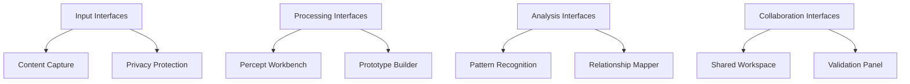
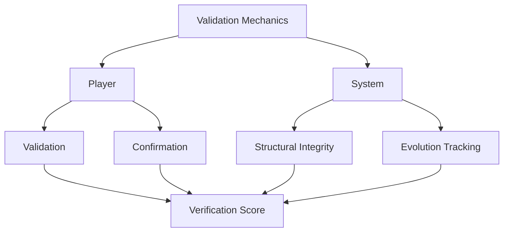

# 2.20. Shared interfaces

The interface layer of Memorativa provides collaborative mechanisms through which players interact with shared structures and each other. These interfaces enable the creation, validation, and evolution of knowledge within the system while maintaining privacy and attribution.

## Core Interface Types

1. **Input Interfaces**
   - Content capture tools
   - URL/media processors
   - Text input systems
   - Batch import tools
   - Privacy selectors
   - Attribution markers

2. **Processing Interfaces**
   - Percept creation workbench
   - Prototype builders
   - Focus space designers
   - Book editors
   - MST translators
   - RAG query tools

3. **Analysis Interfaces**
   - Pattern recognition tools
   - Relationship mappers
   - Temporal analyzers
   - Lens selectors
   - Validation panels
   - Aspect calculators

4. **Collaboration Interfaces**
   - Shared workspaces
   - Group analysis tools
   - Pattern voting systems
   - Version controllers
   - Permission managers
   - Attribution trackers

## Interface Functions

### 1. Input Processing
- Structured content capture
- Privacy level assignment
- Attribution tracking
- Initial MST translation
- Gas token verification
- Temporal state marking

### 2. Knowledge Processing
- Percept-triplet formation
- Prototype construction
- Focus space organization
- Book generation
- Pattern recognition
- Relationship mapping

### 3. Collaboration Functions
- Real-time co-editing
- Synchronous analysis
- Asynchronous review
- Version merging
- Permission control
- Attribution management

### 4. System Integration
- LLM integration points
- RAG system connections
- Gas token mechanics
- Glass bead minting
- Privacy enforcement
- State management

## Privacy Controls

### 1. Access Levels
- Private collections
- Shared spaces
- Public contributions
- System content

### 2. Permission Management
- Access control lists
- Role-based permissions
- Temporal restrictions
- Context boundaries
- Attribution rules
- Version control

## Token Integration

### 1. Gas Token Interface
- Operation cost display
- Balance management
- Reward tracking
- Burn mechanics
- Staking options
- Transaction history

### 2. Glass Bead Interface
- Token creation
- Ownership tracking
- Transfer mechanics
- Privacy settings
- Attribution display
- Version history

## Temporal Management

### 1. State Tracking
- Mundane time markers
- Quantum state indicators
- Holographic references
- State transitions
- Version history
- Evolution tracking

### 2. Synchronization
- Real-time updates
- State persistence
- Version control
- Backup systems
- Recovery tools
- Conflict resolution

## Validation Mechanics

### 1. Player Validation
- Structure validation
- Pattern confirmation
- Usage endorsement
- Quality rating
- Attribution verification
- Privacy compliance

### 2. System Validation
- Pattern consistency
- Structural integrity
- Reference validation
- Evolution tracking
- Permission verification
- State coherence

## Integration Benefits

### 1. Knowledge Enhancement
- Pattern validation
- Structure refinement
- Collective wisdom
- Enhanced understanding
- Cross-domain insights
- Temporal coherence

### 2. Quality Assurance
- Verified structures
- Tested patterns
- Reliable templates
- Trusted references
- Privacy preservation
- Attribution integrity

### 3. Community Building
- Collaborative analysis
- Shared insights
- Group learning
- Knowledge exchange
- Pattern discovery
- Cultural synthesis

## Key points

1. **Interface Architecture**
   - Four-tier interface system (Input, Processing, Analysis, Collaboration)
   - Complete integration with token systems (Gas and Glass Beads)
   - Privacy-first design with granular access controls
   - Temporal awareness across all interface layers

2. **Processing Pipeline**
   - Structured content capture with privacy preservation
   - Knowledge processing with token-based validation
   - Real-time collaboration with version control
   - System integration with LLM and RAG components

3. **Security Model**
   - Multi-level access control system
   - Role-based permission management
   - Attribution tracking throughout processing
   - Privacy-aware data handling
   - Token-based operation verification

4. **Temporal Framework**
   - Support for multiple time states (mundane, quantum, holographic)
   - State synchronization across interfaces
   - Version control with temporal context
   - Evolution tracking with state preservation

5. **Validation System**
   - Dual-layer validation (Player and System)
   - Token-integrated verification mechanics
   - Privacy-preserving collaborative validation
   - Attribution-aware quality assurance

6. **Community Features**
   - Real-time collaborative workspaces
   - Pattern-based knowledge sharing
   - Cultural synthesis support
   - Group learning mechanisms
   - Collective wisdom accumulation

The interface system creates a secure, collaborative environment for knowledge creation while maintaining:
- Individual privacy and attribution
- Temporal coherence across operations
- Token-based economic incentives
- System-wide data integrity
- Community-driven validation
- Scalable knowledge synthesis
