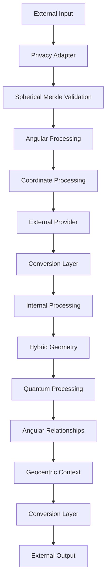

# 2.21. LLM Integration with Memorativa

The Memorativa system provides both internal processing and external interfaces for Large Language Models (LLMs). The internal system handles core processing with hybrid geometric structures, while external interfaces enable integration with third-party LLM services.

## External interfaces

The system offers five key external interfaces:

1. **Provider Interface** (`LLMProvider`)
   - Core text generation and embedding methods
   - Support for multiple providers (OpenAI, Anthropic, etc.)
   - Capability detection (streaming, context limits, etc.)
   - Provider-specific optimizations

2. **Privacy-Aware Adapter** (`LLMAdapter`)
   - Secure interface for external LLM processing
   - Public data handling only
   - Gas token verification
   - Format conversion

3. **Conversion Layer** (`FormatConverter`)
   - Bidirectional conversion between internal/external formats
   - Geometry simplification for external processing
   - Metadata handling
   - State preservation

4. **Rate Limiting & Cost Management** (`ExternalLLMManager`)
   - Provider-specific rate limits
   - Cost estimation and tracking
   - Gas verification
   - Usage monitoring

5. **Spherical Merkle Interface** (`SphericalMerkleInterface`)
   - Access to Spherical Merkle Trees for LLM
   - Angular relationship preservation
   - Hybrid verification processes
   - Coordinate system integration
   - Quantum-enhanced verification when advantageous

All external processing is:
- Limited to public data only
- Gas token verified
- Cost tracked
- Rate limited
- Basic validation checked

### 1. Provider Interface
```rust
pub trait LLMProvider {
    // Core interaction methods
    async fn generate_text(&self, prompt: &str) -> Result<String>;
    async fn generate_embeddings(&self, text: &str) -> Result<Vec<f32>>;
    
    // Optional capabilities
    fn supports_streaming(&self) -> bool;
    fn max_context_length(&self) -> usize;
    fn embedding_dimensions(&self) -> usize;
}

// Example implementations
pub struct OpenAIProvider {
    client: OpenAIClient,
    config: ProviderConfig,
}

pub struct AnthropicProvider {
    client: AnthropicClient,
    config: ProviderConfig,
}
```

### 2. Privacy-Aware Adapter
```rust
pub struct LLMAdapter {
    provider: Box<dyn LLMProvider>,
    privacy_filter: PrivacyFilter,
    token_manager: GasTokenManager,
    
    async fn process_external(
        &self,
        input: ExternalInput,
        privacy_level: PrivacyLevel
    ) -> Result<ProcessedOutput> {
        // Verify gas tokens
        self.token_manager.verify_operation(Operation::ExternalLLM)?;
        
        // Apply privacy filtering
        let filtered = self.privacy_filter.filter_for_external(input)?;
        
        // Process through external LLM
        let response = match privacy_level {
            PrivacyLevel::Public => {
                self.provider.generate_text(&filtered.prompt).await?
            },
            _ => return Err(Error::PrivacyLevelNotSupported)
        };
        
        // Convert to internal format
        self.convert_to_internal_format(response)
    }
}
```

### 3. Conversion Layer
```rust
pub struct FormatConverter {
    spatial_encoder: HybridSpatialEncoder,
    
    fn to_external_format(&self, internal: InternalFormat) -> Result<ExternalFormat> {
        // Strip internal geometric structures while preserving meaning
        let simplified = self.simplify_geometry(internal)?;
        
        // Convert to provider-specific format
        self.format_for_provider(simplified)
    }
    
    fn to_internal_format(&self, external: ExternalFormat) -> Result<InternalFormat> {
        // Project into hybrid space
        let coords = self.spatial_encoder.project_to_hybrid_space(external)?;
        
        // Add internal metadata
        InternalFormat::new(
            coords,
            PrivacyLevel::Public,
            VerificationScore::External,
            TemporalState::Mundane(Utc::now())
        )
    }
}
```

### 4. Rate Limiting & Cost Management
```rust
pub struct ExternalLLMManager {
    rate_limiter: RateLimiter,
    cost_tracker: CostTracker,
    
    async fn process_request(
        &self,
        request: ExternalRequest
    ) -> Result<ProcessedResponse> {
        // Check rate limits
        self.rate_limiter.check_limits(request.provider)?;
        
        // Estimate costs
        let estimated_cost = self.cost_tracker
            .estimate_cost(request.size, request.provider)?;
            
        // Verify sufficient gas
        self.verify_gas_for_external(estimated_cost)?;
        
        // Process request
        let response = self.process_with_provider(request).await?;
        
        // Track actual costs
        self.cost_tracker.record_usage(
            request.provider,
            response.tokens_used
        )?;
        
        Ok(response)
    }
}
```

### 5. Spherical Merkle Interface
```rust
pub trait SphericalMerkleInterface {
    // Access methods for LLM to interact with Spherical Merkle Trees
    async fn get_merkle_node(&self, node_id: NodeId) -> Result<SphericalMerkleNode>;
    async fn verify_angular_relationship(&self, node1: NodeId, node2: NodeId) -> Result<Angle>;
    
    // Generate proofs that preserve angular relationships
    async fn generate_spherical_proof(&self, node_id: NodeId) -> Result<SphericalProof>;
    
    // Verify both content and spatial relationships
    async fn verify_hybrid_proof(&self, proof: SphericalProof, root_hash: Hash) -> Result<bool>;
    
    // Get relevant nodes based on query
    async fn get_relevant_nodes(&self, query: QueryInput) -> Result<Vec<SphericalMerkleNode>>;
}

pub struct SphericalMerkleProcessor {
    hybrid_verifier: HybridVerifier,
    quantum_verifier: Option<QuantumMerkleVerifier>,
    spatial_index: SpatialIndex,
    
    async fn process_with_spherical_merkle(&self, input: ProcessedInput) -> Result<Output> {
        // Retrieve relevant nodes
        let merkle_nodes = self.get_relevant_nodes(input.query)?;
        
        // Extract and process angular relationships
        let angular_relationships = self.extract_angular_relationships(merkle_nodes)?;
        
        // Validate using hybrid verification
        let verification_result = self.verify_hybrid_relationships(
            angular_relationships,
            merkle_nodes
        )?;
        
        // Generate output with verified data
        self.generate_output_with_verification(
            input,
            merkle_nodes,
            verification_result
        )
    }
    
    fn extract_angular_relationships(
        &self,
        nodes: Vec<SphericalMerkleNode>
    ) -> Result<HashMap<(NodeId, NodeId), Angle>> {
        let mut relationships = HashMap::new();
        
        for node in &nodes {
            for (target_id, angle) in &node.angular_relationships {
                relationships.insert((node.id, *target_id), *angle);
            }
        }
        
        Ok(relationships)
    }
}
```

## External Service Integration Points

### 1. Attention Head Injection
```rust
pub trait AttentionHeadInjector {
    // Inject hybrid geometric embeddings into attention computation
    fn inject_attention_embeddings(
        &self,
        base_embeddings: Embeddings,
        hybrid_coords: HybridCoords,
        quantum_state: QuantumState,
        attention_config: AttentionConfig
    ) -> Result<InjectedAttention>;

    // Modify attention patterns with aspect relationships
    fn inject_aspect_patterns(
        &self,
        attention_scores: AttentionScores,
        aspect_patterns: Vec<AspectPattern>
    ) -> Result<ModifiedScores>;

    // Add verification weights to attention mechanism
    fn inject_verification_weights(
        &self,
        attention_output: AttentionOutput,
        verification_scores: Vec<f32>
    ) -> Result<WeightedOutput>;
    
    // Inject angular relationships from Spherical Merkle Trees
    fn inject_angular_relationships(
        &self,
        attention_scores: AttentionScores,
        merkle_nodes: Vec<SphericalMerkleNode>
    ) -> Result<ModifiedScores>;
}

// Angular attention processor implementation
pub struct AngularAttentionProcessor {
    angular_mapper: AspectMapper,
    verification_scorer: VerificationScorer,
    
    // Process attention using angular relationships
    fn process_attention_with_angular(
        &self,
        base_attention: AttentionMap,
        angular_relationships: HashMap<TokenId, Angle>
    ) -> Result<AttentionMap> {
        // Get aspect patterns from angular relationships
        let aspect_patterns = self.angular_mapper
            .map_to_aspects(angular_relationships)?;
            
        // Apply aspect-based weights to attention
        let weighted_attention = self.apply_aspect_weights(
            base_attention,
            aspect_patterns
        )?;
        
        // Apply verification scores
        self.apply_verification_weights(
            weighted_attention,
            self.verification_scorer.score_aspects(aspect_patterns)
        )
    }
    
    // Apply aspect weights to attention
    fn apply_aspect_weights(
        &self,
        attention: AttentionMap,
        aspects: Vec<AspectPattern>
    ) -> Result<AttentionMap> {
        let mut modified = attention.clone();
        
        for aspect in aspects {
            let weight = self.get_aspect_weight(aspect.angle);
            modified = self.adjust_attention_by_aspect(
                modified,
                aspect.source,
                aspect.target,
                weight
            )?;
        }
        
        Ok(modified)
    }
}

// Example implementation for specific provider
pub struct OpenAIAttentionInjector {
    hybrid_encoder: HybridSpatialEncoder,
    quantum_processor: QuantumInspiredProcessor,
    angular_processor: AngularAttentionProcessor,
    
    fn inject_to_layer(
        &self,
        layer_idx: usize,
        hybrid_data: HybridTriplet
    ) -> Result<ModifiedLayer> {
        // Inject into specific attention layer
    }
}
```

### 2. Sequence Processing Injection
```rust
pub trait SequenceInjector {
    // Inject hybrid temporal states into sequence processing
    fn inject_temporal_states(
        &self,
        sequence: Sequence,
        temporal_states: Vec<TemporalState>
    ) -> Result<TemporalSequence>;

    // Add spatial relationships to sequence context
    fn inject_spatial_context(
        &self,
        sequence: Sequence,
        spatial_relations: Vec<SpatialRelation>
    ) -> Result<SpatialSequence>;

    // Inject quantum interference patterns
    fn inject_quantum_patterns(
        &self,
        sequence: Sequence,
        quantum_states: Vec<QuantumState>
    ) -> Result<QuantumSequence>;
    
    // Inject observer-centric relationships
    fn inject_observer_context(
        &self,
        sequence: Sequence,
        observer: Observer,
        angular_relations: HashMap<(NodeId, NodeId), Angle>
    ) -> Result<ObserverRelativeSequence>;
}
```

### 3. Transformation Layer Injection
```rust
pub trait TransformationInjector {
    // Inject hybrid geometry into transformer layers
    fn inject_hybrid_geometry(
        &self,
        layer_input: LayerInput,
        hybrid_coords: HybridCoords
    ) -> Result<HybridLayer>;

    // Add aspect-based activation functions
    fn inject_aspect_activations(
        &self,
        layer_output: LayerOutput,
        aspect_patterns: Vec<AspectPattern>
    ) -> Result<AspectOutput>;

    // Inject privacy-aware processing
    fn inject_privacy_controls(
        &self,
        layer: TransformerLayer,
        privacy_level: PrivacyLevel
    ) -> Result<PrivateLayer>;
    
    // Process hybrid spherical-hyperbolic coordinates
    fn process_coordinates(
        &self,
        embeddings: Embeddings,
        coordinates: Vec<[f32; 4]> // [θ, φ, r, κ]
    ) -> Result<HybridEmbeddings>;
    
    // Convert between embedding space and hybrid coordinate space
    fn to_hybrid_coordinates(
        &self, 
        embeddings: Embeddings
    ) -> Result<Vec<[f32; 4]>>;
    
    fn from_hybrid_coordinates(
        &self, 
        coordinates: Vec<[f32; 4]>
    ) -> Result<Embeddings>;
}

// Implementation for coordinate processing
pub struct HybridCoordinateProcessor {
    spherical_mapper: SphericalMapper,
    hyperbolic_mapper: HyperbolicMapper,
    
    // Process hybrid spherical-hyperbolic coordinates
    fn process_coordinates(
        &self,
        embeddings: Embeddings,
        coordinates: Vec<[f32; 4]> // [θ, φ, r, κ]
    ) -> Result<HybridEmbeddings> {
        // Project embeddings into hybrid space
        let hybrid = self.project_to_hybrid_space(
            embeddings, 
            coordinates
        )?;
        
        // Apply curvature-aware transformations
        let transformed = self.apply_curvature_transformation(
            hybrid, 
            coordinates
        )?;
        
        Ok(transformed)
    }
    
    // Project embeddings to hybrid space
    fn project_to_hybrid_space(
        &self,
        embeddings: Embeddings,
        coordinates: Vec<[f32; 4]>
    ) -> Result<HybridEmbeddings> {
        let mut hybrid_embeddings = HybridEmbeddings::with_capacity(
            embeddings.len()
        );
        
        for (embed, coord) in embeddings.iter().zip(coordinates.iter()) {
            // Extract coordinate components
            let [theta, phi, radius, kappa] = *coord;
            
            // Choose mapping based on curvature
            let mapped = if kappa > 0.0 {
                // Use hyperbolic mapping for positive curvature
                self.hyperbolic_mapper.map_embedding(
                    embed, theta, phi, radius, kappa
                )?
            } else {
                // Use spherical mapping for negative/zero curvature
                self.spherical_mapper.map_embedding(
                    embed, theta, phi, radius, kappa
                )?
            };
            
            hybrid_embeddings.push(mapped);
        }
        
        Ok(hybrid_embeddings)
    }
}
```

### 4. Decoding Process Injection
```rust
pub trait DecodingInjector {
    // Inject hybrid token decoding
    fn inject_hybrid_decoding(
        &self,
        decoder_input: DecoderInput,
        hybrid_tokens: Vec<HybridToken>
    ) -> Result<HybridDecoding>;

    // Add verification-weighted output generation
    fn inject_verified_generation(
        &self,
        generation_output: Output,
        verification_scores: Vec<f32>
    ) -> Result<VerifiedOutput>;

    // Inject temporal coherence
    fn inject_temporal_coherence(
        &self,
        decoder_state: DecoderState,
        temporal_states: Vec<TemporalState>
    ) -> Result<CoherentState>;
    
    // Verify with quantum-enhanced methods when advantageous
    fn verify_with_quantum(
        &self,
        proof: SphericalProof,
        root_hash: Hash
    ) -> Result<VerificationResult>;
    
    // Process from observer-centric perspective
    fn process_from_observer(
        &self,
        data: InputData,
        observer: Observer
    ) -> Result<ProcessedData>;
}

// Quantum-enhanced verification
pub struct QuantumEnhancedProcessor {
    quantum_verifier: QuantumMerkleVerifier,
    classical_verifier: HybridVerifier,
    
    // Verify with quantum-enhanced methods when advantageous
    fn verify_with_quantum(
        &self,
        proof: SphericalProof,
        root_hash: Hash
    ) -> Result<VerificationResult> {
        // Check if quantum verification is suitable
        if self.should_use_quantum(proof.clone()) {
            // Use quantum-inspired algorithms
            let quantum_result = self.quantum_verifier.verify(
                self.to_quantum_proof(proof),
                root_hash
            )?;
            
            return Ok(quantum_result);
        }
        
        // Fall back to classical verification
        let classical_result = self.classical_verifier.verify(
            proof,
            root_hash
        )?;
        
        Ok(VerificationResult {
            valid: classical_result,
            confidence: 1.0,
            quantum_used: false
        })
    }
    
    // Convert to quantum-enhanced proof
    fn to_quantum_proof(&self, proof: SphericalProof) -> QuantumEnhancedProof {
        let quantum_triplets = proof.node_coordinates
            .iter()
            .map(|coords| {
                let [theta, phi, radius, kappa] = *coords;
                let classical = HybridTriplet::new(
                    theta, phi, radius, kappa
                );
                QuantumInspiredTriplet::from_classical(&classical)
            })
            .collect();
            
        QuantumEnhancedProof {
            merkle_components: proof.merkle_components,
            quantum_triplets,
            entanglement_data: self.calculate_entanglement_data(
                &quantum_triplets,
                &proof.angular_relationships
            )
        }
    }
    
    // Determine if quantum verification is appropriate
    fn should_use_quantum(&self, proof: SphericalProof) -> bool {
        // Quantum verification is better for proofs with many angular relationships
        proof.angular_relationships.len() > 5 && 
        self.has_interference_patterns(&proof)
    }
    
    // Analyze interference patterns
    fn analyze_interference_patterns(
        &self,
        triplets: Vec<QuantumInspiredTriplet>
    ) -> Result<Vec<InterferencePattern>> {
        let mut patterns = Vec::new();
        
        for i in 0..triplets.len() {
            for j in i+1..triplets.len() {
                let t1 = &triplets[i];
                let t2 = &triplets[j];
                
                // Calculate interference
                let interference = t1.interference_distance(t2);
                
                // Check if significant
                if interference > self.interference_threshold {
                    patterns.push(InterferencePattern {
                        source: i,
                        target: j,
                        magnitude: interference,
                        phase: (t1.phase - t2.phase).abs()
                    });
                }
            }
        }
        
        Ok(patterns)
    }
}

// Observer-centric processing
pub struct GeocentricProcessor {
    aspect_calculator: AspectCalculator,
    
    // Process data from observer-centric perspective
    fn process_from_observer(
        &self,
        data: InputData,
        observer: Observer
    ) -> Result<ProcessedData> {
        // Calculate angular relationships from observer perspective
        let angular_relationships = self.calculate_geocentric_relationships(
            data.triplets,
            observer
        )?;
        
        // Apply observer-relative processing
        let processed = self.apply_observer_context(
            data,
            angular_relationships,
            observer
        )?;
        
        Ok(processed)
    }
    
    // Calculate relationships from observer perspective
    fn calculate_geocentric_relationships(
        &self,
        triplets: Vec<HybridTriplet>,
        observer: Observer
    ) -> Result<HashMap<(usize, usize), Angle>> {
        let mut relationships = HashMap::new();
        
        for i in 0..triplets.len() {
            for j in i+1..triplets.len() {
                // Calculate angular relationship from observer perspective
                let angle = self.aspect_calculator.calculate_geocentric_angle(
                    &triplets[i], &triplets[j], &observer
                )?;
                
                // Only store significant aspects
                if self.aspect_calculator.is_significant_aspect(angle) {
                    relationships.insert((i, j), angle);
                    relationships.insert((j, i), angle);
                }
            }
        }
        
        Ok(relationships)
    }
    
    // Verify spatial relationships from observer perspective
    fn verify_spatial_integrity(
        &self,
        merkle_node: SphericalMerkleNode,
        observer: Observer
    ) -> Result<bool> {
        // Extract angular relationships
        let angular_relationships = merkle_node.angular_relationships.clone();
        
        // Verify each relationship
        for (node1, node2, expected_angle) in self.extract_relationships(angular_relationships) {
            // Get actual nodes
            let triplet1 = self.get_triplet(node1)?;
            let triplet2 = self.get_triplet(node2)?;
            
            // Calculate actual angle from observer perspective
            let actual_angle = self.aspect_calculator.calculate_geocentric_angle(
                &triplet1, &triplet2, &observer
            )?;
            
            // Check if angle matches within tolerance
            if !self.angles_match(actual_angle, expected_angle) {
                return Ok(false);
            }
        }
        
        Ok(true)
    }
}
```

### Integration Example
```rust
pub struct MemorativaLLMIntegration {
    attention_injector: Box<dyn AttentionHeadInjector>,
    sequence_injector: Box<dyn SequenceInjector>,
    transform_injector: Box<dyn TransformationInjector>,
    decoding_injector: Box<dyn DecodingInjector>,
    spherical_merkle_processor: SphericalMerkleProcessor,
    quantum_processor: QuantumEnhancedProcessor,
    geocentric_processor: GeocentricProcessor,
    
    async fn process_with_spherical_merkle_trees(
        &self,
        input: ExternalInput,
        hybrid_data: HybridTriplet,
        observer: Observer
    ) -> Result<ProcessedOutput> {
        // Retrieve relevant Merkle nodes
        let merkle_nodes = self.spherical_merkle_processor
            .get_relevant_nodes(input.to_query())?;
            
        // Extract angular relationships
        let angular_relationships = self.spherical_merkle_processor
            .extract_angular_relationships(merkle_nodes)?;
            
        // Extract coordinates
        let coordinates = self.extract_coordinates(merkle_nodes)?;
            
        // Process coordinates
        let hybrid_embeddings = self.transform_injector
            .process_coordinates(input.embeddings, coordinates)?;
            
        // Inject into attention mechanism
        let attention_output = self.attention_injector
            .inject_angular_relationships(
                input.attention,
                merkle_nodes
            )?;
            
        // Apply observer-centric processing
        let geocentric = self.geocentric_processor
            .process_from_observer(
                hybrid_embeddings,
                observer
            )?;
            
        // Process with quantum enhancement if beneficial
        let processed = if self.should_use_quantum(angular_relationships) {
            self.quantum_processor.process_with_quantum(
                geocentric,
                angular_relationships
            )?
        } else {
            self.process_classical(
                geocentric,
                angular_relationships
            )?;
        }
            
        // Verify with hybrid methods
        let verification = self.verify_with_hybrid_methods(
            merkle_nodes,
            processed
        )?;
            
        // Generate final output
        self.generate_verified_output(
            processed,
            verification,
            observer
        )
    }
    
    fn extract_coordinates(&self, nodes: Vec<SphericalMerkleNode>) -> Result<Vec<[f32; 4]>> {
        nodes.iter()
            .map(|node| {
                let triplet = node.get_hybrid_triplet()?;
                Ok([
                    triplet.theta,
                    triplet.phi,
                    triplet.radius,
                    triplet.curvature
                ])
            })
            .collect()
    }
    
    async fn verify_with_hybrid_methods(
        &self, 
        nodes: Vec<SphericalMerkleNode>,
        data: ProcessedData
    ) -> Result<VerificationResult> {
        // Generate proof
        let proof = self.spherical_merkle_processor
            .generate_spherical_proof(nodes)?;
            
        // Try quantum verification first
        let quantum_result = self.quantum_processor.verify_with_quantum(
            proof.clone(),
            self.calculate_root_hash(nodes)?
        )?;
        
        if quantum_result.confidence > self.quantum_threshold {
            return Ok(quantum_result);
        }
        
        // Fall back to classical hybrid verification
        let classical_result = self.spherical_merkle_processor.verify_hybrid_proof(
            proof,
            self.calculate_root_hash(nodes)?
        )?;
        
        Ok(VerificationResult {
            valid: classical_result,
            confidence: 1.0,
            quantum_used: false
        })
    }
}
```

These injection points allow external LLM services to:
- Incorporate Memorativa's hybrid geometric embeddings
- Use aspect-based attention mechanisms
- Add verification-weighted processing
- Maintain temporal coherence
- Preserve privacy boundaries
- Leverage quantum-inspired features
- Access Spherical Merkle structures
- Process angular relationships
- Integrate with observer-centric perspective

While maintaining:
- Provider-specific optimizations
- Existing model architectures
- Performance characteristics
- Resource efficiency
- Security boundaries

## Integration Flow



## Key Differences

| Aspect | Internal Processing | External Interface |
|--------|-------------------|-------------------|
| Geometry | Full hybrid model | Simplified vectors |
| Privacy | All levels | Public only |
| Verification | Complete chain | Basic validation |
| Temporal | All states | Mundane only |
| Cost | Gas efficient | Provider rates |
| Features | Full system | Basic generation |
| Merkle Trees | Spherical with angular | Linear only |
| Coordinate System | Full [θ,φ,r,κ] | Simplified embeddings |
| Observer Context | Geocentric model | Observer-agnostic |
| Quantum Features | Full interference | Basic quantum-inspired |


## Internal Processing System

The LLM integration system processes content through four main stages, each handling specific aspects of the hybrid geometric model while maintaining privacy, verification, and temporal coherence:

1. Input Processing transforms raw content into hybrid spherical-hyperbolic coordinates with quantum states
2. Percept-Triplet Formation creates quantum-inspired triplets with universal symbolic mappings
3. Focus Space Integration enables lens-based analysis with pattern detection
4. Book Generation synthesizes knowledge with privacy-aware RAG retrieval

Each stage preserves:
- Hybrid geometry (spherical + hyperbolic)
- Quantum states
- Privacy levels
- Verification scores
- Temporal states
- Aspect relationships

### 1. Input Processing
```rust
pub struct LLMProcessor {
    privacy_filter: PrivacyAwareFilter,
    token_manager: GasTokenManager,
    spatial_encoder: HybridSpatialEncoder,
    quantum_processor: QuantumInspiredProcessor,
    
    async fn process_input(&self, input: PlayerInput) -> Result<ProcessedInput> {
        // Verify gas tokens for operation
        self.token_manager.verify_operation(Operation::ProcessInput)?;
        
        // Apply privacy filtering
        let filtered = self.privacy_filter.filter_sensitive_content(input)?;
        
        // Generate hybrid embeddings
        let spherical = self.spatial_encoder.to_spherical(filtered)?;
        let hyperbolic = self.spatial_encoder.to_hyperbolic(filtered)?;
        let coords = HybridCoords::new(spherical, hyperbolic);
        
        // Add quantum state
        let quantum_state = self.quantum_processor
            .encode_state(coords, filtered.temporal_state)?;
        
        Ok(ProcessedInput {
            coords,
            quantum_state,
            privacy_level: filtered.privacy_level,
            temporal_state: filtered.temporal_state,
            verification_score: 1.0
        })
    }
}
```

### 2. Percept-Triplet Formation
```rust
impl PerceptTripletProcessor {
    async fn form_triplet(&self, input: ProcessedInput) -> Result<PerceptTriplet> {
        // Initialize quantum-inspired triplet
        let triplet = QuantumInspiredTriplet::new(
            input.coords,
            input.quantum_state
        );
        
        // Generate title-description through LLM
        let (title, desc) = self.generate_title_desc(triplet)?;
        
        // Translate through MST
        let universal = self.mst.translate((title, desc))?;
        
        // Create hybrid triplet with quantum state
        Ok(HybridTriplet::new(
            triplet,
            universal,
            input.verification_score,
            input.privacy_level,
            input.temporal_state
        ))
    }
}
```

### 3. Focus Space Integration

```rust
pub struct FocusSpaceLLM {
    lens_manager: LensManager,
    pattern_detector: HybridPatternDetector,
    privacy_guard: PrivacyGuard,
    quantum_processor: QuantumInspiredProcessor,
    
    async fn process_focus_space(&self, space: FocusSpace) -> Result<ProcessedSpace> {
        // Apply active lenses
        let lens_views = self.lens_manager.apply_lenses(space)?;
        
        // Detect hybrid patterns with privacy preservation
        let aspect_patterns = self.pattern_detector
            .detect_aspect_patterns(lens_views)?;
            
        let quantum_patterns = self.quantum_processor
            .detect_interference_patterns(lens_views)?;
            
        // Combine patterns
        let hybrid_patterns = self.pattern_detector
            .combine_patterns(aspect_patterns, quantum_patterns)?;
            
        // Generate insights through LLM
        let insights = self.generate_private_insights(hybrid_patterns)?;
        
        Ok(ProcessedSpace {
            lens_views,
            hybrid_patterns,
            insights,
            verification_score: calculate_pattern_verification(hybrid_patterns)
        })
    }
}
```

### 4. Book Generation

```rust
pub struct BookGenerator {
    rag_interface: RAGInterface,
    token_manager: GasTokenManager,
    
    async fn generate_book(&self, prototype: Prototype) -> Result<Book> {
        // Verify gas for operation
        self.token_manager.verify_operation(Operation::GenerateBook)?;
        
        // Retrieve relevant context
        let context = self.rag_interface.retrieve_context(prototype)?;
        
        // Generate content with privacy preservation
        let content = self.generate_private_content(prototype, context)?;
        
        // Structure into book format
        Ok(Book::new(content, prototype.metadata()))
    }
}
```

### 5. Spherical Merkle Integration

```rust
pub struct SphericalMerkleLLMProcessor {
    merkle_interface: SphericalMerkleInterface,
    angular_processor: AngularAttentionProcessor,
    coordinate_processor: HybridCoordinateProcessor,
    quantum_processor: QuantumEnhancedProcessor,
    geocentric_processor: GeocentricProcessor,
    
    async fn process_with_spherical_merkle(&self, input: ProcessedInput) -> Result<Output> {
        // Retrieve relevant Merkle nodes
        let merkle_nodes = self.merkle_interface.get_relevant_nodes(input)?;
        
        // Process hybrid coordinates
        let coordinates = extract_coordinates(merkle_nodes);
        let hybrid_embeddings = self.coordinate_processor.process_coordinates(
            input.embeddings,
            coordinates
        )?;
        
        // Process angular relationships
        let angular_map = extract_angular_relationships(merkle_nodes);
        let modified_attention = self.angular_processor.process_attention_with_angular(
            input.attention,
            angular_map
        )?;
        
        // Apply observer-centric processing
        let geocentric = self.geocentric_processor.process_from_observer(
            hybrid_embeddings,
            input.observer
        )?;
        
        // Generate output with verified relationships
        let output = generate_output_with_verification(
            geocentric,
            modified_attention,
            self.merkle_interface
        )?;
        
        Ok(output)
    }
    
    async fn verify_with_hybrid_methods(&self, proof: SphericalProof) -> Result<bool> {
        // Try quantum-enhanced verification first
        let quantum_result = self.quantum_processor.verify_with_quantum(
            proof.clone(),
            proof.root_hash
        )?;
        
        if quantum_result.confidence > quantum_threshold {
            return Ok(quantum_result.valid);
        }
        
        // Fall back to classical hybrid verification
        let classical_result = self.merkle_interface.verify_hybrid_proof(
            proof,
            proof.root_hash
        )?;
        
        Ok(classical_result)
    }
    
    fn extract_coordinates(&self, nodes: Vec<SphericalMerkleNode>) -> Vec<[f32; 4]> {
        nodes.iter()
            .map(|node| {
                let triplet = node.get_hybrid_triplet();
                [
                    triplet.theta,
                    triplet.phi,
                    triplet.radius,
                    triplet.curvature
                ]
            })
            .collect()
    }
    
    fn extract_angular_relationships(
        &self, 
        nodes: Vec<SphericalMerkleNode>
    ) -> HashMap<TokenId, Angle> {
        let mut relationships = HashMap::new();
        
        for node in nodes {
            for (target_id, angle) in node.angular_relationships {
                relationships.insert(target_id, angle);
            }
        }
        
        relationships
    }
}
```

### Privacy-Aware Processing

```rust
pub struct LatticeEncryptedProcessor {
    // Add lattice-based encryption scheme
    lattice_params: LatticeParams,
    fhe_scheme: FHEParams,  // Fully Homomorphic Encryption
}

impl PrivacyAwareLLM for LatticeEncryptedProcessor {
    fn process_encrypted<T>(&self, input: T) -> Result<ProcessedOutput> {
        // Convert to lattice-based encryption
        let encrypted = lattice_encrypt(input, self.lattice_params)?;
        let processed = self.local_model.process(encrypted)?;
        Ok(lattice_decrypt(processed, self.lattice_params)?)
    }
}

// Modified privacy guard with PQC algorithms
pub struct PostQuantumPrivacyGuard {
    kyber: Kyber768,
    dilithium: Dilithium3,
}

impl PostQuantumPrivacyGuard {
    fn verify_access(&self, bead: GlassBead) -> Result<()> {
        // Use quantum-resistant signatures
        let valid = dilithium.verify(bead.signature, bead.data)?;
        // ... existing checks ...
    }
}
```

### Token-Aware Operations

```rust
pub struct TokenAwareLLM {
    gas_manager: GasTokenManager,
    glass_bead_manager: GlassBeadManager,
    
    async fn process_with_tokens(&self, operation: Operation) -> Result<Output> {
        // Verify gas tokens
        self.gas_manager.verify_operation(operation)?;
        
        // Process operation
        let result = self.process_operation(operation)?;
        
        // Mint glass beads if needed
        if operation.requires_glass_bead() {
            self.glass_bead_manager.mint_bead(result)?;
        }
        
        Ok(result)
    }
}
```

### Temporal Integration

```rust
pub struct TemporalLLM {
    state_manager: TemporalStateManager,
    
    async fn process_with_time(&self, input: Input) -> Result<Output> {
        match input.temporal_state {
            TemporalState::Mundane(timestamp) => {
                // Process with concrete time
                self.process_mundane(input, timestamp)
            },
            TemporalState::Quantum => {
                // Process without time constraints
                self.process_quantum(input)
            },
            TemporalState::Holographic(reference) => {
                // Process with reference time
                self.process_holographic(input, reference)
            }
        }
    }
}
```

### Key Benefits

1. **Privacy Preservation**
   - Privacy-aware processing at all levels
   - Encrypted operations for sensitive content
   - Granular access controls
   - Attribution preservation

2. **Token Integration**
   - Gas token verification for operations
   - Glass bead minting integration
   - Cost-aware processing
   - Reward distribution

3. **Temporal Awareness**
   - Support for multiple time states
   - State-aware processing
   - Temporal coherence
   - Reference time handling

4. **System Integration**
   - Complete RAG system compatibility
   - Focus space integration
   - Book generation support
   - Pattern recognition capabilities

5. **Spherical Merkle Integration**
   - Angular relationship preservation
   - Hybrid validation system
   - Coordinate system processing
   - Observer-centric analysis
   - Quantum-enhanced verification
   - Topological consistency in non-linear space

This architecture provides:
- Complete integration with hybrid geometric model
- Enhanced pattern detection through quantum features
- Secure and verifiable token operations
- Privacy-preserved knowledge evolution
- Efficient spatial relationship processing
- Robust temporal state management
- Spherical Merkle Tree support for angular relationships

