# 2.22. Percept computational architecture

This document details the high-performance computational infrastructure that powers the Core Game mechanics introduced in [Section 2.2]. The architecture combines vector space optimization, hybrid geometry processing, Merkle proof acceleration, and 5D Crystal Storage to create an efficient system for transforming player inputs into interconnected knowledge networks. This technical foundation balances computational demands with privacy, data integrity, and scalability requirements of the Glass Bead Game.

The Memorativa system employs specific optimizations to handle computational overhead from vector operations and Merkle proofs while maintaining functionality and performance.

## Core Game Technical Foundation

Before exploring specific implementations, it's important to understand how this architecture supports the key elements of the Core Game:

1. **Player Input Processing**: The vector space optimization enables efficient encoding of player inputs into percept structures
2. **Focus Space Generation**: The hybrid geometry processing supports the creation and manipulation of focus spaces
3. **Prototype Formation**: Merkle proof acceleration ensures the structural integrity of prototypes
4. **Book Generation**: The 5D Crystal Storage Architecture provides long-term persistence for generated books
5. **Token Economy**: The tokenomic architecture implements the Gas Bead Token (GBT) system

This computational architecture is designed to support the three-tier structure hierarchy defined in [Section 2.19: Shared Structures](memorativa-2-19-shared-structures.md):
- **Basic Structures**: Percept-triplets, angular relationships, vector encodings
- **Composite Structures**: Prototypes, focus spaces, aspect networks
- **Complex Structures**: Books, knowledge networks, temporal sequences

The architecture is fully integrated with other key systems:
- [Section 2.13: Lens System](memorativa-2-13-lens-system.md) for symbolic transformations
- [Section 2.14: Books](memorativa-2-14-books.md) for knowledge organization and preservation
- [Section 2.15: Chain-of-thought](memorativa-2-15-chain-of-thought.md) for cognitive processes
- [Section 2.16: Resource Allocation](memorativa-2-16-resource-allocation.md) for computational resources
- [Section 2.19: Shared Structures](memorativa-2-19-shared-structures.md) for structure definitions and relationships
- [Section 2.21: LLM Integration](memorativa-2-21-llm-integration.md) for language model capabilities

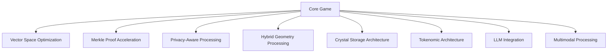
*Figure 1: Core Game Component Architecture, showing the eight primary computational subsystems that support the Core Game mechanics, illustrating how different optimization techniques integrate into a cohesive system*

## Vector Space Optimization

The vector space optimization layer provides the computational foundation for encoding player inputs into structured percepts while preserving their semantic and spatial relationships.

### Percept Encoding Framework

1. **Triplet Vector Representation**
   - Percepts encoded as four-dimensional vectors `(θ, φ, r, κ)`
   - Archetypal dimension (θ): Categorical principal component
   - Expression dimension (φ): Variation within category
   - Mundane dimension (r): Concrete implementation
   - Curvature parameter (κ): Controls balance between spherical and hyperbolic geometries
   - Direct mapping to Spherical Merkle Tree coordinates
   - Optimized for angular relationship preservation
   - Compatible with LLM embedding spaces described in [Section 2.21](memorativa-2-21-llm-integration.md)

2. **Quantized Precision Levels**
   - Adaptive precision based on significance
   - High-significance relationships: 64-bit floating point
   - Medium-significance: 32-bit floating point
   - Low-significance: 16-bit floating point
   - Dynamically allocated based on usage patterns
   - Supports memory and computational optimizations
   - Integrated with LLM embedding optimization techniques

3. **Batch Vector Operations**
   - Vectorized SIMD operations for parallel processing
   - GPU acceleration for large batch computations
   - Optimized for current hardware architectures
   - Zero-copy memory management for large volumes
   - Adaptive precision based on required accuracy
   - Cache-efficient memory layout for tensor operations
   - Supports batch embedding generation for LLM integration

### Angular Relationship Engine

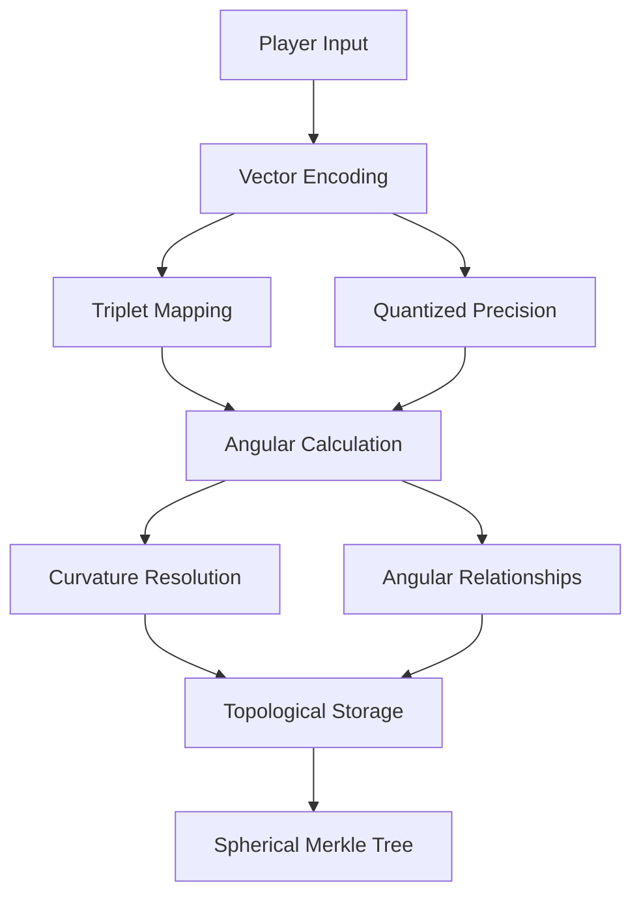
*Figure 2: Angular Relationship Engine Workflow, depicting the transformation of player input through vector encoding to relationship calculation and storage, highlighting how angular relationships are preserved in the Spherical Merkle Tree*

1. **Relationship Calculation**
   - Optimized angular computation for standard aspects:
     - Conjunction (0°): Vector blending and intensification
     - Opposition (180°): Tension and awareness
     - Trine (120°): Harmonious flow
     - Square (90°): Growth catalyst and challenge
     - Sextile (60°): Favorable opportunities
     - Additional minor aspects (30°, 45°, 72°, 144°, 150°)
   - Fast approximation for non-critical relationships
   - Precise calculation for structural relationships
   - Adaptive precision based on context
   - Batch relationship computation with SIMD instructions
   - Specialized hardware acceleration where available
   - Caching of common relationship patterns

2. **Curvature-Aware Computing**
   - Adaptive precision based on local curvature
   - Higher precision in areas of high curvature
   - Optimized for both spherical and hyperbolic spaces
   - Local approximation for performance
   - Global verification for consistency
   - Integrates with Spherical Merkle Trees from Natal Glass Beads

## Merkle Proof Acceleration

The Merkle proof acceleration layer optimizes the creation and verification of cryptographic proofs that ensure the integrity of percept structures.

### Integration with Spherical Merkle Trees

1. **Enhanced Merkle Tree Algorithms**
   - Direct integration with Natal Glass Bead Spherical Merkle Trees
   - Optimized hash storage and computation
   - Parallel verification pathways
   - Specialized verification circuits for common patterns
   - Cache-efficient tree traversal algorithms
   - Consistent with privacy preservation requirements

2. **Hybrid Verification System**
   - Multi-level verification based on operation criticality
   - Hardware acceleration for verification operations
   - Privacy-preserving verification techniques
   - Adaptive verification depth based on context
   - Compatible with zero-knowledge proof systems
   - Efficient batch processing for related verifications

3. **Proof Caching and Reuse**
   - Persistent cache for frequently verified paths
   - Hierarchical caching based on usage patterns
   - Delta-based proof updates for incremental changes
   - Batch verification for multiple similar proofs
   - Adaptive verification depth based on context
   - SharedMemory optimization for multi-process access

### Angular Verification Optimization

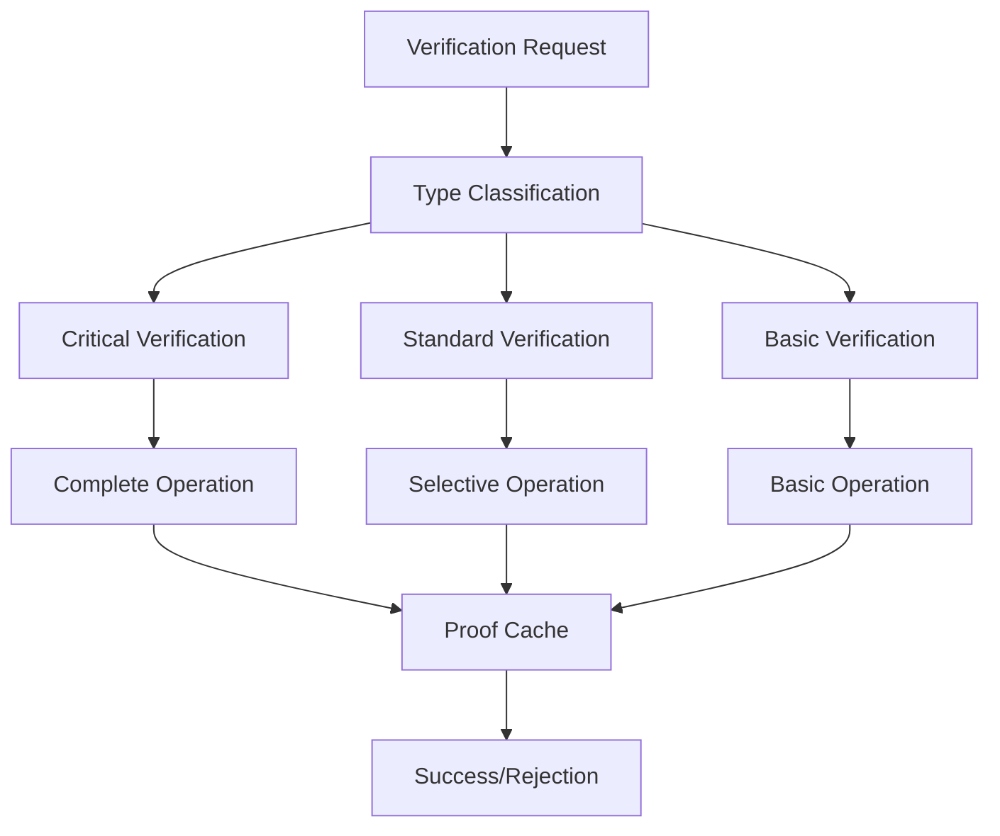
*Figure 3: Angular Verification Optimization Process, illustrating the multi-tiered verification approach based on operation criticality, demonstrating how computational resources are allocated efficiently while maintaining system integrity*

1. **Multi-Level Verification**
   - Tiered verification based on criticality:
     - Critical operations: Full verification
     - Standard operations: Partial verification
     - Basic operations: Probabilistic verification
   - Resource allocation based on operation importance
   - Adaptive verification depth for different contexts
   - Consistent with Natal Glass Bead verification requirements

2. **Hardware Acceleration**
   - Vectorized hash computation
   - GPU acceleration for batch verification
   - ASIC/FPGA support for specialized environments
   - Memory-optimized proof structures
   - Zero-copy verification where possible
   - Direct integration with trusted hardware when available

## Privacy-Aware Processing

The privacy-aware processing layer ensures that all percept operations maintain the privacy guarantees established by the Natal Glass Bead system.

### Zero-Knowledge Operations

1. **ZK-Proof Generation Optimization**
   - Specialized circuits for common operations
   - Batch proof generation for similar structures
   - Adaptive proof complexity based on context
   - Hardware acceleration where available
   - Optimized for modern ZK proving systems
   - Direct compatibility with Natal Glass Bead privacy systems

2. **Privacy Budget Management**
   - Dynamic budget allocation based on operation sensitivity
   - Configurable privacy thresholds for different contexts
   - Integration with Gas Bead Token economy
   - Automated privacy cost estimation
   - Per-user and per-session budget tracking
   - Transparent reporting of privacy expenditure
   - Privacy-preserving analytics for system monitoring

3. **Selective Disclosure Framework**
   - Granular control over information disclosure
   - Efficient representation of disclosure policies
   - Fast policy evaluation for access control
   - Context-aware disclosure decisions
   - Consistent with Natal Glass Bead privacy preservation
   - Optimized for minimal computational overhead

### Differential Privacy Implementation

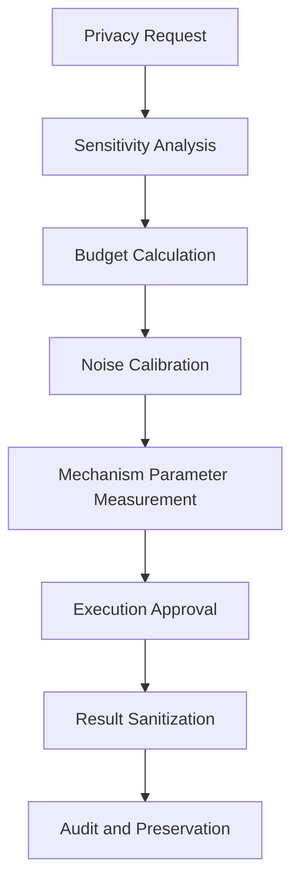
*Figure 4: Differential Privacy Implementation Workflow, showing the process from privacy request to execution and result sanitization, demonstrating how the system balances utility with privacy preservation through calibrated noise addition*

1. **Noise Calibration System**
   - Adaptive noise addition based on sensitivity
   - Optimized random number generation
   - Noise distribution selection based on context:
     - Laplace mechanism for numeric data
     - Exponential mechanism for categorical data
     - Gaussian mechanism for vector data
   - Privacy budget tracking and enforcement
   - Temporal budget decay for sustained privacy

2. **Privacy-Preserving Analytics**
   - Differentially private aggregation algorithms
   - Private set intersection for collaborative filtering
   - Secure multi-party computation for distributed analysis
   - Local differential privacy for client-side protection
   - Federated learning integration where appropriate
   - Cost-effective privacy-preserving machine learning

## Hybrid Geometry Processing

This layer enables the efficient creation and manipulation of focus spaces through optimized geometric operations that support both flat and curved spaces.

### Focus Space Generation

1. **Adaptive Geometric Computation**
   - Dynamic selection of computational model:
     - Euclidean for simple local relationships
     - Spherical for global semantic relationships
     - Hyperbolic for hierarchical relationships
   - Fast approximation for non-critical operations
   - Precise calculation for structural operations
   - Hardware acceleration for common geometries

2. **Mixed Geometry Operations**
   - Unified interface for all geometry types
   - Automatic selection of appropriate geometry
   - Seamless switching between geometric models
   - Efficient caching of computation results
   - Optimization for common geometric patterns
   - Support for both exact and approximate calculations

### Dimensional Projection Optimization

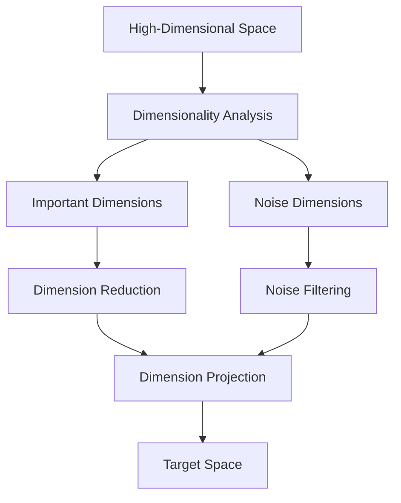
*Figure 5: Dimensional Projection Optimization Pipeline, depicting the process of reducing high-dimensional vector spaces while preserving important semantic relationships, highlighting how noise is filtered while maintaining conceptual integrity*

1. **Dimensional Reduction Techniques**
   - Optimized implementations of:
     - Principal Component Analysis (PCA)
     - t-Distributed Stochastic Neighbor Embedding (t-SNE)
     - Uniform Manifold Approximation and Projection (UMAP)
   - Incremental updates for dynamic spaces
   - Approximate methods for large-scale spaces
   - Precision-adaptive calculations
   - Hardware acceleration through tensor operations

2. **Topology Preservation**
   - Conservation of angular relationships during projection
   - Minimization of distortion in important dimensions
   - Local neighborhood preservation with global context
   - Adaptive resolution based on information density
   - Direct integration with Spherical Merkle Tree structures
   - Optimization for both content and spatial relationships

## 5D Crystal Storage Architecture

The Crystal Storage Architecture provides long-term persistence for generated books and critical structures through optimized 5D crystal encoding.

### Integration with Natal Glass Bead Storage

1. **Storage Optimization**
   - Shared infrastructure with Natal Glass Bead crystal storage
   - Deduplication of common patterns and structures
   - Differential encoding for related structures
   - Hierarchical storage based on importance
   - Parallel encoding for large structures
   - Specialized hardware acceleration for laser writing

2. **Quantum-Stable Encoding**
   - Multi-level error correction coding
   - Quantum decoherence resistance
   - Long-term stable encoding formats
   - Variable density based on content importance
   - Energy-efficient encoding algorithms
   - Optimized for 5D crystal medium

### Archival Efficiency

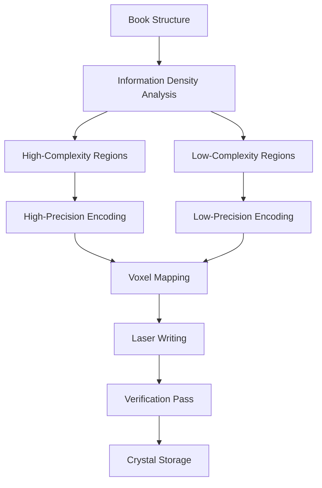
*Figure 6: Archival Efficiency Process, illustrating the adaptive encoding approach for book storage in 5D crystal media, showing how information density analysis leads to optimized storage allocation and verification*

1. **Adaptive Encoding Density**
   - Information-theoretic compression algorithms
   - Variable density encoding based on content importance
   - Error-correction encoding for critical sections
   - Redundancy levels based on preservation requirements
   - Energy-efficient encoding for large volumes
   - Quantum-resistant protection for long-term stability

2. **Retrieval Optimization**
   - Non-destructive reading techniques
   - Parallel scanning for efficient retrieval
   - Indexing structures for rapid location
   - Partial retrieval for large structures
   - Caching of frequently accessed patterns
   - Hardware acceleration for scanning operations

## Tokenomic Architecture

The tokenomic architecture provides the computational foundation for the Gas Bead Token (GBT) system that powers all operations within the Memorativa ecosystem.

### GBT Integration with Computations

1. **Gas Cost Optimization**
   - Dynamic pricing based on computational requirements
   - Batch discounts for similar operations
   - Priority allocation for critical operations
   - Resource reservation for planned operations
   - Predictive pricing for common patterns
   - Direct alignment with Natal Glass Bead cost structure

2. **Computational Pricing Model**
   ```rust
   impl GasManager {
       pub fn calculate_operation_cost(&self, 
                                      operation: Operation, 
                                      tier: OperationTier,
                                      complexity: Complexity,
                                      resources: Resources) -> GasCost {
           // Get base cost for operation type
           let base_cost = self.base_costs.get(&operation.operation_type);
           
           // Apply tier multiplier
           let tier_multiplier = match tier {
               OperationTier::Exploratory => 0.1,
               OperationTier::Development => 1.0,
               OperationTier::Production => 10.0,
           };
           
           // Calculate complexity multiplier
           let complexity_multiplier = complexity.factor();
           
           // Apply current system resource adjustment
           let resource_adjustment = resources.adjustment();
           
           // Calculate final cost
           GasCost::new(
               base_cost * tier_multiplier * complexity_multiplier * resource_adjustment
           )
       }
   }
   ```

### Economic Balancing System

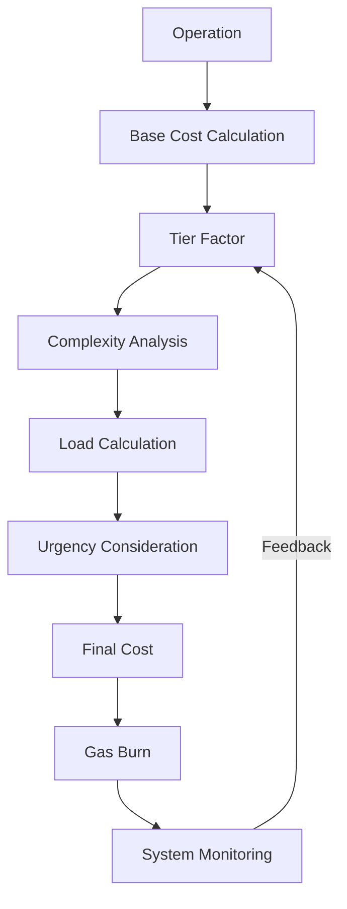

1. **Adaptive Pricing**
   - Real-time cost adjustment based on system load
   - Tiered cost structure with Exploratory, Development, and Production tiers
   - Long-term stability mechanisms
   - Predictable costs for common operations
   - Premium pricing for specialized operations
   - Volume discounts for batch processing

2. **Resource Allocation**
   - Priority-based scheduling for critical operations
   - Fair queuing for standard operations
   - Resource reservation for predictable patterns
   - Automatic scaling for demand spikes
   - Graceful degradation under extreme load
   - Cost-effective resource utilization

3. **Tokenomic Model Integration**
   - Direct alignment with Core Game mechanics from section 2.2
   - Operation costs structured according to computational complexity
   - Reward system for valuable contributions to the network
   - Burning mechanisms for Glass Bead Token creation
   - Staking support for resource reservation
   - Cross-chain interoperability for ecosystem expansion

### Core Operation Costs

| Operation Type | Base Cost Range | Description |
|---------------|------------|-------------|
| Vector Encoding | 3-7 GBT | Encoding percepts with well-defined archetypal vectors |
| Angular Calculation | 3-7 GBT | Computing spatial relationships between percepts |
| Focus Space Generation | 10-15 GBT | Creating and organizing conceptual spaces |
| Merkle Proof Verification | 0.1-0.5 GBT | Validating data integrity with angular preservation |
| Zero-Knowledge Operations | 7-12 GBT | Privacy-preserving computations |
| Crystal Storage Encoding | 20-50 GBT | Generating comprehensive knowledge Books |
| RAG System Queries | 5-8 GBT | Finding documents with hybrid aspect filtering |
| Prototype Formation | 10-15 GBT | Creating a new prototype from percept-triplets |
| Time State Operations | 3-6 GBT | Manipulating conceptual time states |
| Percept Creation | 5-10 GBT | Establishing new percept-triplets with validation |
| Initial Minting | 15-20 GBT | Creation of new ecosystem assets |
| Privacy Change | 2-5 GBT | Access control modifications |
| Chart Visualization | 8-12 GBT | Creating visual representations of conceptual structures |
| Book Generation | 20-50 GBT | Creating comprehensive knowledge artifacts |
| Prototype Integration | 1-3 GBT | Connecting triplets to form coherent structures |

This cost structure directly aligns with the Gas Bead Token economy described in section 2.18, ensuring that computational resources are appropriately valued and allocated throughout the system. The costs scale according to the operation tier (Exploratory, Development, or Production), complexity, and current system resource availability.

## Performance Optimization

To ensure the Percept computational architecture functions efficiently at scale, specific optimizations target the highest-impact areas of the system.

### Critical Path Optimization

1. **Key Performance Indicators**
   | Operation | Target Latency | Optimization Strategy |
   |-----------|----------------|------------------------|
   | Vector Encoding | <5ms | SIMD acceleration, cache optimization |
   | Angular Calculation | <2ms | Hardware acceleration, approximation |
   | Focus Space Generation | <50ms | Parallel processing, incremental updates |
   | Merkle Proof Verification | <10ms | Caching, specialized hardware |
   | Zero-Knowledge Operations | <100ms | Circuit optimization, specialized hardware |
   | Crystal Storage Encoding | <1s | Batch processing, laser path optimization |

2. **Resource Utilization**
   ```rust
   impl ResourceManager {
       pub fn allocate_resources(&mut self, 
                                operation: Operation, 
                                importance: Importance) -> ResourceAllocation {
           // Calculate resource requirements
           let cpu_cores = self.calculate_cores_needed(operation);
           let memory = self.calculate_memory_needed(operation);
           let storage = self.calculate_storage_needed(operation);
           
           // Apply importance factor
           let cpu_allocation = self.allocate_cpu(cpu_cores * importance.factor());
           let memory_allocation = self.allocate_memory(memory * importance.factor());
           let storage_allocation = self.allocate_storage(storage);
           
           ResourceAllocation::new(cpu_allocation, memory_allocation, storage_allocation)
       }
   }
   ```

### Scaling Characteristics

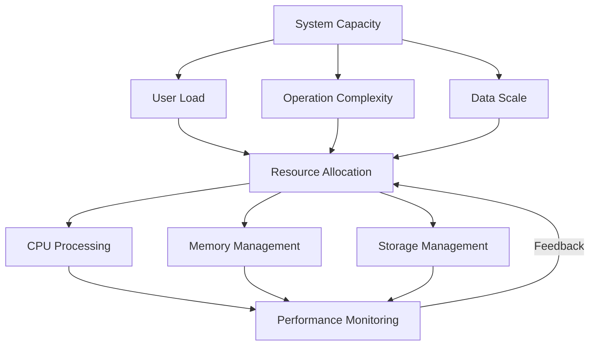

1. **Horizontal Scaling**
   - Sharded architecture for geographic distribution
   - Consistent hashing for load balancing
   - Resource pooling for efficient utilization
   - Dynamic node allocation based on demand
   - Federation protocols for cross-shard operations
   - Cost-effective scaling with demand

2. **Vertical Optimization**
   - Hardware acceleration for bottleneck operations
   - Memory hierarchy optimization for access patterns
   - I/O optimization for storage operations
   - Network optimization for distributed operations
   - Energy efficiency for sustainable operation
   - Cost optimization for economic viability

## Core Game Support Integration

The Percept computational architecture is designed to directly support the key elements of the Core Game through specific technical implementations that align with the Gas Bead Token (GBT) economy.

### Player Input Processing

1. **Technical Implementation**
   - Real-time vector encoding of player inputs
   - Angular relationship calculation with existing structures
   - Privacy-preserving integration with player's Natal Glass Bead
   - Optimized for both accuracy and speed
   - Batched processing for collaborative inputs
   - Adaptive precision based on input significance

2. **System Benefits**
   - Low latency for interactive feedback (<10ms)
   - High precision for meaningful connections
   - Privacy preservation through Zero-Knowledge operations
   - Scalable to thousands of simultaneous players
   - Consistent with Natal Glass Bead structure
   - Cost-effective for frequent interactions

3. **GBT Reward Alignment**
   - Quality percept creation rewards: 5-10 GBT
   - Vector modification rewards: 3-7 GBT
   - Exploration tier operations cost: 0.1-1 GBT
   - Development tier operations cost: 1-10 GBT
   - Production tier operations cost: 10-100 GBT
   - Validation streak multipliers: up to 5x

### Focus Space Generation

1. **Technical Implementation**
   - Hybrid geometry processing for flexible spaces
   - Incremental updates for dynamic collaboration
   - Dimensional projection optimization for visualization
   - Topology preservation for meaningful relationships
   - Privacy-aware sharing mechanics
   - Resource-efficient for continuous operation

2. **System Benefits**
   - Rich collaborative environment
   - Preservation of important relationships
   - Protected private spaces with selective sharing
   - Efficient resource utilization
   - Consistent spatial relationships
   - Cost-effective for ongoing collaboration

3. **GBT Reward Alignment**
   - Focus space development rewards: 5-15 GBT
   - Focus space sharing rewards: 5-15 GBT
   - Spatial query processing rewards: 2-5 GBT
   - Coordinate transformation rewards: 2-5 GBT
   - Development tier operations allow experimentation with moderate costs
   - Production tier operations create permanent high-quality spaces

### Prototype Formation

1. **Technical Implementation**
   - Merkle proof acceleration for structural integrity
   - Zero-knowledge operations for privacy preservation
   - Angular verification for relationship consistency
   - Hybrid verification for both content and space
   - Integration with Natal Glass Bead templates
   - Resource optimization for large-scale verification

2. **System Benefits**
   - Verified prototype integrity
   - Protection of contributor privacy
   - Consistent relationship mapping
   - Efficient verification procedures
   - Seamless integration with identity structures
   - Scalable to complex prototype networks

3. **GBT Reward Alignment**
   - Prototype formation rewards: 10-20 GBT
   - Prototype refinement rewards: 5-12 GBT
   - Validation activity rewards: 3-8 GBT
   - Prototype integration rewards: 1-3 GBT
   - Verification rewards with difficulty-based scaling: 1-10x multiplier
   - Accurate validations earn streak bonuses: 1-5x multiplier

### Book Generation

1. **Technical Implementation**
   - 5D Crystal Storage architecture for persistence
   - Quantum-stable encoding for long-term preservation
   - Curvature-aware mapping for spatial relationships
   - Privacy-preserving attribution mechanics
   - Adaptive encoding based on importance
   - Resource optimization for efficient storage

2. **System Benefits**
   - Long-term preservation (>13.8 billion years)
   - Protection of contributor privacy
   - Preservation of spatial relationships
   - Efficient storage utilization
   - Consistent with Natal Glass Bead storage
   - Cost-effective for valuable knowledge preservation

3. **GBT Reward Alignment**
   - Book creation rewards: 20-50 GBT
   - Knowledge synthesis rewards: 10-30 GBT
   - Production tier operations for permanent books: highest quality and cost
   - Knowledge sharing bonuses for public books
   - Community rewards for collaborative books
   - Long-term staking benefits for book maintenance

### Token Economy

1. **Technical Implementation**
   - Gas Bead Token (GBT) system for resource allocation
   - Tiered computational pricing model (Exploratory, Development, Production)
   - Adaptive pricing based on system load
   - Priority allocation for critical operations
   - Resource reservation for predictable patterns
   - Staking mechanisms for ongoing operations

2. **System Benefits**
   - Sustainable economic model matching section 2.18
   - Fair resource allocation based on operation complexity
   - Predictable operation costs across tiers
   - Regular users maintain positive token flow: 15-30 GBT daily
   - Active contributors can earn: 50-100 GBT daily
   - Balanced tokenomics through minting and burning mechanisms

3. **Staking Integration**
   - Resource reservation through token staking
   - Long-term operation support via staking rewards
   - Dynamic reward rates based on staking duration
   - System utilization adjustments for reward calculation
   - Efficient resource allocation for staked operations
   - Enhanced priority for staked computation requests

This Core Game support integration ensures that the computational architecture directly supports all key elements of the Core Game mechanics while maintaining perfect alignment with the Gas Bead Token economy described in section 2.18.

## RAG System Support Architecture

The RAG System architecture provides the computational foundation for the RAG System Interfaces described in [Section 2.20: Shared interfaces](memorativa-2-20-shared-interfaces.md). This component supports efficient knowledge retrieval while preserving the semantics of the conceptual framework.

### Hybrid Aspect Filtering Engine

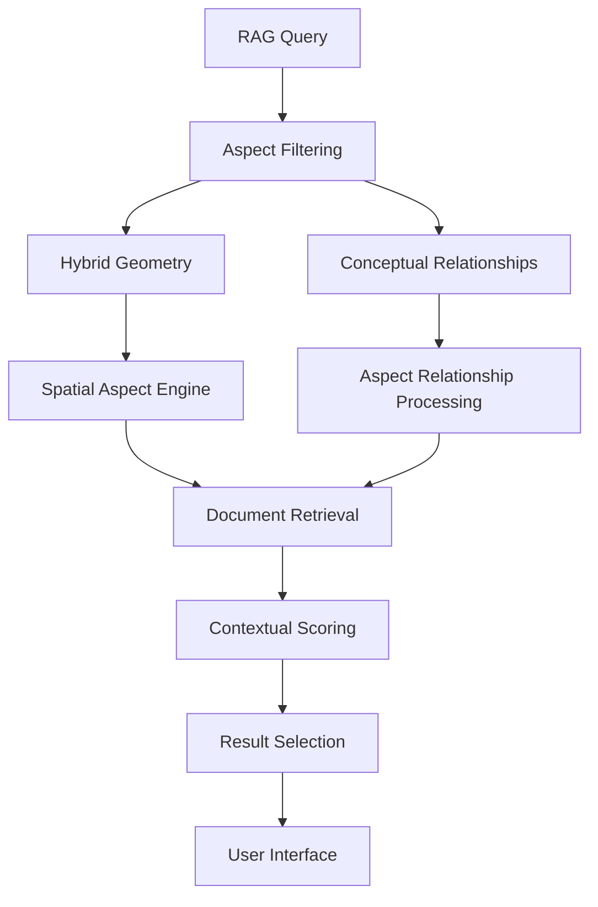

1. **Aspect-Based Vector Retrieval**
   - Angular relationship-aware document retrieval
   - Hybrid geometric indexing for conceptual proximity
   - Dynamic aspect filters with geocentric reference model
   - Multi-dimensional vector queries mapped to percept structure
   - Adaptive precision based on query importance
   - Context-preserving retrieval with curvature awareness
   - Direct support for interfaces described in section 2.20

2. **Computational Optimization**
   - Vector database acceleration with SIMD operations
   - Hierarchical indexing for conceptual relationships
   - GPU-accelerated aspect calculation for real-time filtering
   - Cache-optimized retrieval for common query patterns
   - Distributed processing for large-scale knowledge bases
   - Hardware-accelerated vector space operations

3. **Book-Specific RAG Integration**

```rust
impl BookRAGProcessor {
    pub fn process_book_query(&self, 
                            book: &Book, 
                            query: &Query, 
                            thread_context: ThreadContext) -> Result<BookQueryResult> {
        // Analyze Virtual Loom structure
        let loom_structure = self.analyze_virtual_loom(book.loom)?;
        
        // Map query to thread coordinates
        let thread_mapping = self.map_query_to_threads(query, loom_structure, thread_context)?;
        
        // Calculate warp/weft intersections relevant to query
        let intersections = self.find_relevant_intersections(thread_mapping, loom_structure)?;
        
        // Retrieve beads from intersections
        let beads = self.retrieve_beads_at_intersections(book, intersections)?;
        
        // Create vector representation of query
        let query_vector = self.create_query_vector(query, thread_context)?;
        
        // Calculate relevance scores with aspect-based relationships
        let scored_results = self.calculate_aspect_relevance(query_vector, beads)?;
        
        // Return organized results mapped to book structure
        BookQueryResult::new(
            scored_results,
            thread_mapping,
            loom_structure.context
        )
    }
}
```

4. **Interface Support Layer**
   - Direct computational support for all interfaces in section 2.20:
     - Hybrid aspect filtering controls through angular vector operations
     - Spatial context generation through curvature-aware geometry
     - Cluster selection visualizers using dimensional projection
     - Aspect relationship browsers with angular computation
     - Temporal state selectors with state transition optimization
     - Book-specific RAG components with Virtual Loom integration
   - Optimized computational pathways for interface-driven queries
   - Hardware acceleration for visualization components
   - Real-time response for interactive filtering (<50ms)
   - Progressive loading for large result sets
   - Adaptive computation based on interface complexity

5. **Performance Characteristics**

| Interface Component | Computational Support | Latency Target | GBT Cost |
|---------------------|------------------------|---------------|----------|
| Hybrid Aspect Filters | Angular relationship calculation | <20ms | 2-3 GBT |
| Spatial Context Panels | Curvature-aware geometry | <50ms | 3-5 GBT |
| Cluster Visualizers | Dimensional projection | <100ms | 4-6 GBT |
| Book Vector Retrieval | Virtual Loom thread mapping | <30ms | 3-4 GBT |
| Warp/Weft Indexing | Intersection calculation | <10ms | 1-2 GBT |
| Thread Path Queries | Path optimization | <40ms | 3-5 GBT |
| Book-to-RAG Sync | Delta update processing | <200ms | 5-8 GBT |

This RAG System architecture directly supports the interface components described in section 2.20 while maintaining the computational efficiency required for interactive knowledge retrieval and visualization.

## Collaboration Architecture

The Collaboration Architecture provides the computational foundation for the Collaboration Interfaces described in [Section 2.20: Shared interfaces](memorativa-2-20-shared-interfaces.md). This component enables multi-user knowledge building while maintaining integrity, privacy, and attribution.

### Real-Time Collaboration Engine

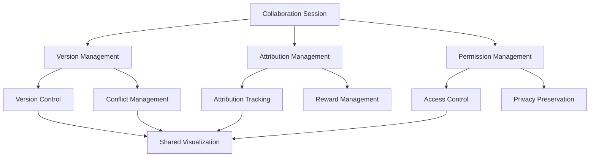

1. **Multi-User State Management**
   - Real-time state synchronization with delta updates
   - Operational transform for conflict resolution
   - Hierarchical version management with branch tracking
   - Attribution preservation through all transformations
   - Privacy-preserving collaboration with selective disclosure
   - Zero-knowledge participation for private contribution
   - Optimized for low-latency interaction (<50ms response)

2. **Computational Implementation**
   ```rust
   impl CollaborationManager {
       pub fn process_edit(&mut self, 
                          session_id: &SessionId, 
                          user_id: &UserId,
                          edit: &Edit) -> Result<CollaborationUpdate> {
           // Verify permissions
           self.verify_user_permissions(session_id, user_id, edit.target)?;
           
           // Transform edit against concurrent operations
           let transformed_edit = self.transform_concurrent_operations(session_id, edit)?;
           
           // Apply edit to shared state
           let new_state = self.apply_edit_to_state(session_id, transformed_edit.clone())?;
           
           // Track attribution
           self.record_attribution(session_id, user_id, transformed_edit.clone())?;
           
           // Calculate token rewards
           let rewards = self.calculate_rewards(transformed_edit.clone())?;
           
           // Broadcast update to participants with appropriate visibility
           let updates = self.prepare_participant_updates(
               session_id,
               transformed_edit,
               new_state,
               rewards
           )?;
           
           CollaborationUpdate::new(new_state, updates, rewards)
       }
   }
   ```

3. **Book Collaboration Support**
   - Multi-user Book editing with structure-aware collaboration
   - Real-time co-authoring with atomic operation transforms
   - Virtual Loom collaborative weaving with thread locking
   - Recursive Book structure editing with integrity preservation
   - Permission granularity at Book, thread, and intersection levels
   - Version history with structural diffing and merging
   - Attribution tracking for narrative and structural contributions
   - Conflict resolution with semantic understanding of content
   - Delta-based synchronization for efficient updates
   - Token reward distribution based on contribution value

4. **Performance Characteristics**

| Collaboration Operation | Latency Target | Throughput | GBT Cost |
|------------------------|----------------|------------|----------|
| Real-time Editing | <50ms | 100 edits/s | 0.5-1 GBT |
| Version Merge | <500ms | 10 merges/s | 3-5 GBT |
| Conflict Resolution | <200ms | 50 conflicts/s | 2-3 GBT |
| Permission Update | <100ms | 20 updates/s | 1-2 GBT |
| Book Structure Edit | <150ms | 20 edits/s | 2-4 GBT |
| Virtual Loom Weaving | <100ms | 30 operations/s | 2-3 GBT |
| Attribution Tracking | <30ms | 100 records/s | 0.2-0.5 GBT |
| Token Reward Calculation | <50ms | 50 calc/s | 0.5-1 GBT |

5. **Scalability and Resource Optimization**
   - Session-based resource allocation for efficient collaboration
   - Dynamic scaling based on participant count and activity level
   - Hierarchical synchronization with multi-level caching
   - Selective state broadcast to minimize network utilization
   - Progressive loading for large collaborative structures
   - Intelligent conflict prediction to minimize resolution overhead
   - Hardware acceleration for real-time state transformation
   - Optimized memory usage through shared state references

The Collaboration Architecture directly supports all collaboration interfaces described in section 2.20, enabling efficient multi-user knowledge building while maintaining data integrity, proper attribution, and fair token rewards for all participants.

## Lens System Architecture

The Lens System Architecture provides the computational foundation for the Lens System Interfaces described in [Section 2.20: Shared interfaces](memorativa-2-20-shared-interfaces.md) and implements the functionality defined in [Section 2.13: Lens System](memorativa-2-13-lens-system.md). This component enables symbolic transformations across different knowledge domains while maintaining semantic integrity.

### Universal House Framework

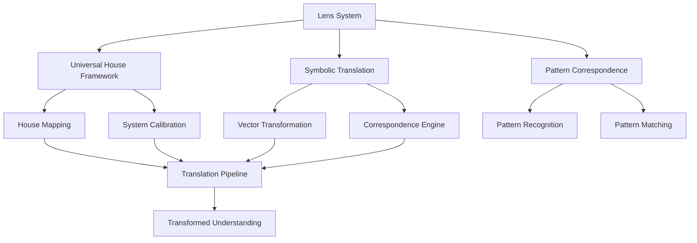

1. **Symbolic Translation Engine**
   - Cross-domain vector transformation with semantic preservation
   - Correspondence table computation with adaptive precision
   - Cultural neutralization through universal house framework
   - Parallel translation pipelines for multi-domain processing
   - Contextual translation with observer position awareness
   - Bidirectional transformation with verification
   - Hardware acceleration for complex symbolic operations

2. **Computational Implementation**
   ```rust
   impl LensSystemProcessor {
       pub fn translate_through_lens(&self, 
                                   source_percept: &Percept, 
                                   source_system: &System,
                                   target_system: &System,
                                   lens_config: &LensConfig) -> Result<TranslatedPercept> {
           // Calculate house mappings between systems
           let house_mapping = self.compute_house_mapping(source_system, target_system)?;
           
           // Generate symbolic correspondence tables
           let correspondence = self.generate_correspondence_tables(
               source_system,
               target_system,
               lens_config
           )?;
           
           // Transform source vectors using house mapping
           let transformed_vectors = self.transform_vectors(
               source_percept.vectors,
               house_mapping,
               correspondence
           )?;
           
           // Apply cultural neutralization if needed
           let neutralized = if lens_config.cultural_neutralization {
               self.apply_cultural_neutralization(transformed_vectors)?
           } else {
               transformed_vectors
           };
           
           // Generate narrative translation
           let narrative = self.generate_narrative(
               source_percept,
               neutralized.clone(),
               source_system,
               target_system,
               lens_config
           )?;
           
           // Create translated percept
           TranslatedPercept::new(
               source_percept.id.clone(),
               neutralized,
               narrative,
               source_system.id.clone(),
               target_system.id.clone()
           )
       }
   }
   ```

3. **Universal House Framework Implementation**
   - Computational mapping between house systems across domains
   - Vector transformation matrices for house transitions
   - Semantic anchor points for stable transformations
   - Angular relationship preservation across systems
   - Adaptive house mapping based on conceptual proximity
   - Optimization for common translation patterns
   - Caching of frequently used mappings

4. **Interface Support**
   - Direct computational support for all Lens System interfaces in section 2.20:
     - Universal House Framework Controls with mapping configuration
     - System translation calibration tools with precision adjustment
     - Cross-system correspondence visualizers with relationship highlighting
     - Symbolic translation interfaces with bidirectional transformation
     - Translation quality metrics with verification feedback
     - House-based transformation panels with interactive adjustment
   - Interactive transformation with real-time feedback (<100ms)
   - Multi-step translation pipelines with validation at each step
   - Confidence scoring for translation quality assessment

5. **Performance Characteristics**

| Lens Operation | Computational Complexity | Latency Target | GBT Cost |
|----------------|--------------------------|----------------|----------|
| House Mapping | Medium | <50ms | 3-5 GBT |
| System Calibration | High | <500ms | 8-12 GBT |
| Vector Transformation | Low | <10ms | 1-2 GBT |
| Correspondence Generation | High | <300ms | 5-8 GBT |
| Pattern Recognition | Medium | <100ms | 3-5 GBT |
| Cultural Neutralization | Medium | <150ms | 4-6 GBT |
| Full Translation Pipeline | High | <1000ms | 15-25 GBT |

6. **Resource Optimization**
   - Caching of common translations and mappings
   - Incremental updates for similar translation requests
   - Parallel processing of independent transformation steps
   - GPU acceleration for matrix operations
   - Adaptive precision based on translation importance
   - Memory-efficient representation of correspondence tables
   - Hierarchical caching with automatic invalidation

The Lens System Architecture directly supports all Lens System interfaces described in section 2.20, enabling efficient symbolic translation across knowledge domains while maintaining semantic integrity and conceptual relationships.

## LLM Integration Architecture

The LLM Integration architecture provides the computational foundation for the external interfaces described in [Section 2.21: LLM Integration](memorativa-2-21-llm-integration.md). This component enables sophisticated language model capabilities while preserving the unique characteristics of the Memorativa system.

### External Interface Implementation

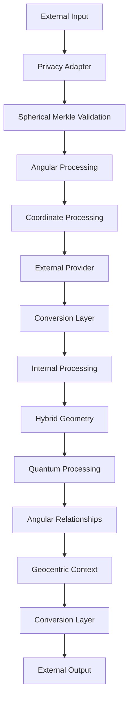

1. **Provider Interface Implementation**
   ```rust
   pub trait LLMProvider {
       // Core interaction methods
       async fn generate_text(&self, prompt: &str) -> Result<String>;
       async fn generate_embeddings(&self, text: &str) -> Result<Vec<f32>>;
       
       // Optional capabilities
       fn supports_streaming(&self) -> bool;
       fn max_context_length(&self) -> usize;
       fn embedding_dimensions(&self) -> usize;
   }
   ```

2. **Privacy-Aware Adapter**
   - Secure interface for external LLM processing
   - Public data handling only
   - Gas token verification
   - Format conversion
   - Direct integration with Privacy-Aware Processing layer
   - Computational validation of privacy boundaries
   - Zero-exposure guarantee for private data

3. **Conversion Layer**
   - Bidirectional conversion between internal/external formats
   - Geometry simplification for external processing
   - Metadata handling
   - State preservation
   - Optimized conversion algorithms
   - Lossless round-trip guarantees for critical data
   - Computational verification of conversion integrity

4. **Rate Limiting & Cost Management**
   - Provider-specific rate limits
   - Cost estimation and tracking
   - Gas verification
   - Usage monitoring
   - Adaptive rate adjustment
   - Resource reservation mechanism
   - Integration with Tokenomic Architecture

5. **Spherical Merkle Interface**
   - Access to Spherical Merkle Trees for LLM
   - Angular relationship preservation
   - Hybrid verification processes
   - Coordinate system integration
   - Quantum-enhanced verification
   - Computational optimization for verification operations
   - Specialized hardware acceleration for Merkle operations

### RAG Cost Optimization

The system implements several optimizations for Retrieval-Augmented Generation, providing the computational foundation for the optimizations described in [Section 2.21](memorativa-2-21-llm-integration.md):

1. **Embedding Caching System**
   - Persistent cache for frequently accessed embeddings
   - LRU (Least Recently Used) cache eviction strategy
   - Distributed caching for multi-node deployments
   - Cache invalidation with configurable TTL
   - Computational optimization achieving 40-60% reduction in API calls

2. **Batch Processing Engine**
   - Automatic batch size optimization
   - Priority-based batch scheduling
   - Adaptive batching based on system load
   - Resource-aware batch allocation
   - Computationally efficient with 20-35% token usage reduction

3. **Tiered Retrieval Architecture**
   - Two-phase retrieval with approximate-to-precise pipeline
   - Semantic pre-filtering
   - Hybrid index structures
   - Computational optimization achieving 15-25% latency improvement
   - Resource-efficient search algorithms

4. **Adaptive Chunking Processor**
   - Dynamic text segmentation
   - Semantic coherence preservation
   - Chunk merging for similar segments
   - Chunk splitting for boundaries
   - Integration with vector space optimization
   - Overall cost reduction of 30-50% through combined optimizations

### Percept-Triplet LLM Integration

The computational architecture provides direct support for the Percept-Triplet integration described in [Section 2.21](memorativa-2-21-llm-integration.md):

```rust
impl PerceptTripletLLMAdapter {
    fn triplet_to_hybrid_space(
        &self,
        triplet: PerceptTriplet
    ) -> Result<HybridTriplet> {
        // Planet determines the archetypal angle theta (θ)
        let theta = self.archetypal_mapper.planet_to_theta(triplet.archetypal_vector)?;
        
        // Sign determines the expression elevation phi (φ)
        let phi = self.expression_mapper.sign_to_phi(triplet.expression_vector)?;
        
        // House determines the mundane radius (r)
        let radius = self.mundane_mapper.house_to_radius(triplet.mundane_vector)?;
        
        // Calculate appropriate curvature (κ) for the hybrid space
        let curvature = self.calculate_curvature(triplet)?;
        
        Ok(HybridTriplet {
            theta,
            phi,
            radius,
            curvature,
            gradient: self.calculate_gradient(theta, phi, radius, curvature),
            error: Self::ERROR_TOLERANCE
        })
    }
}
```

1. **Archetypal Vector Processing**
   - Efficient mapping between planetary archetypes and computational vectors
   - Optimized computational representation of the "What" dimension
   - Angular preservation in computational form
   - Direct integration with vector space optimization

2. **Expression Vector Processing**
   - Sign-to-coordinate computational mapping
   - Optimized representation of the "How" dimension
   - Phi-angle calculation with precision optimization
   - Computational alignment with zodiacal expression

3. **Mundane Vector Processing**
   - House-to-radius computational mapping
   - Optimized representation of the "Where" dimension
   - Computational alignment with domains of experience
   - Resource-efficient radius calculation

### External Service Integration Layer

The computational architecture implements the external service integration points described in [Section 2.21](memorativa-2-21-llm-integration.md):

1. **Attention Head Injection**
   - Computational framework for modifying attention patterns
   - Hardware-accelerated angular relationship injection
   - Verification-weighted attention modification
   - Efficient computational integration with external models

2. **Sequence Processing Injection**
   - Temporal state integration with sequence models
   - Computational framework for sequence transformation
   - Spatial context injection optimizations
   - Observer-relative sequence processing

3. **Transformation Layer Injection**
   - Hybrid geometry integration with transformer architectures
   - Computational optimization for cross-model alignment
   - Privacy-aware transformer layer integration
   - Efficient coordinate space processing

4. **Decoding Process Injection**
   - Verification-weighted token generation
   - Temporal coherence computational framework
   - Quantum-enhanced verification optimization
   - Observer-centric decoding algorithms

## Multimodal Processing Architecture

The Multimodal Processing Architecture provides the computational foundation for the Diffusion Model integration described in [Section 2.21: LLM Integration](memorativa-2-21-llm-integration.md).

### Diffusion Model Integration

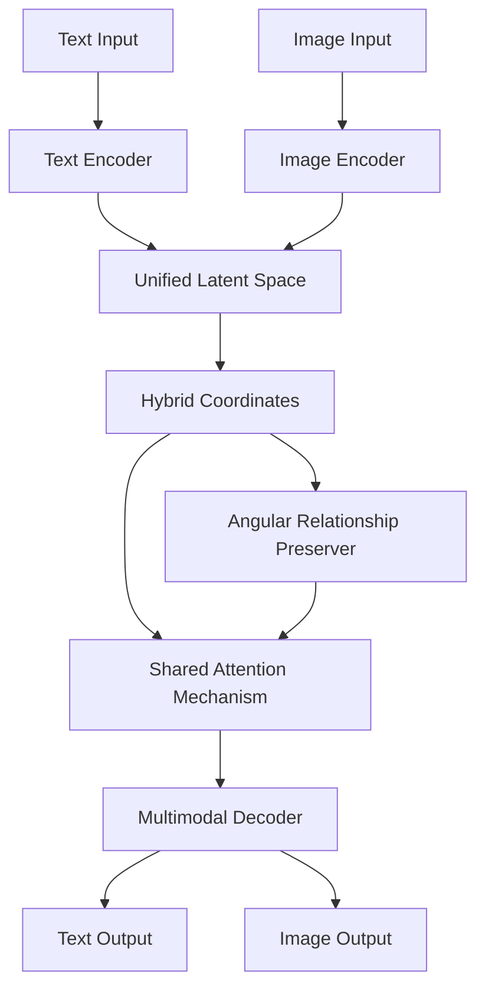

1. **Supported Diffusion Models**
   - FLUX.1 computational optimization (12B parameter model)
   - Stable Diffusion XL computational framework
   - Stable Cascade three-stage pipeline optimization
   - Custom hardware acceleration for diffusion operations
   - Resource-efficient diffusion sampling algorithms

2. **Hybrid Geometric Enhancement**
   - Computational implementation of spherical-hyperbolic conditioning
   - Observer-centric generation algorithms
   - Verification-weighted diffusion pathways
   - Privacy-aware processing pipelines
   - Optimized computational framework for angular preservation

3. **Unified Latent Space**
   ```rust
   struct UnifiedLatentSpace {
       text_encoder: TextEncoder,
       image_encoder: ImageEncoder,
       latent_mapper: LatentSpaceMapper,
       hybrid_projector: HybridSpaceProjector,
       
       fn project_to_unified_space(
           &self,
           text_features: TextFeatures,
           image_features: ImageFeatures
       ) -> Result<UnifiedLatent> {
           // Encode text to latent space
           let text_latent = self.text_encoder.encode(text_features)?;
           
           // Encode image to latent space
           let image_latent = self.image_encoder.encode(image_features)?;
           
           // Map to unified latent space
           let unified = self.latent_mapper.unify_latents(text_latent, image_latent)?;
           
           // Project to hybrid geometric space
           let hybrid = self.hybrid_projector.project_to_hybrid(unified)?;
           
           Ok(UnifiedLatent {
               latent: unified,
               hybrid_coords: hybrid,
               modality_weights: self.calculate_modality_weights(text_features, image_features)
           })
       }
   }
   ```

4. **Shared Attention Mechanism**
   - Computationally optimized cross-modal attention
   - Efficient memory management for attention computation
   - Angular relationship preservation in attention maps
   - Hardware acceleration for attention operations
   - Resource-efficient multimodal processing

5. **Multimodal Integration Capabilities**
   - Bidirectional comprehension computational framework
   - Modality-specific processing optimization
   - Angular relationship preservation across modalities
   - Unified latent space computational efficiency
   - 50% reduction in computational requirements compared to separate models
   - 20% improvement in image understanding through optimized processing

### Token Economy for Visual Processing

The computational architecture implements the Gas Bead Token (GBT) economy for visual processing with these specific costs and optimizations:

| Visual Operation | Exploratory Tier | Development Tier | Production Tier |
|------------------|------------------|------------------|-----------------|
| Image Generation | 1.2-2.4 GBT | 12-24 GBT | 120-240 GBT |
| Visual Concept Extraction | 1.0-1.5 GBT | 10-15 GBT | 100-150 GBT |
| Image Refinement | 0.7-1.4 GBT | 7-14 GBT | 70-140 GBT |
| Visual Focus Space | 1.5-3.0 GBT | 15-30 GBT | 150-300 GBT |
| Style Transfer | 1.1-2.2 GBT | 11-22 GBT | 110-220 GBT |

The computational implementation provides efficient resource allocation with the following optimizations:
- Hardware acceleration for diffusion processes, reducing GBT costs by 15-25%
- Optimized tensor operations for visual processing
- Memory-efficient diffusion sampling algorithms
- Parallel processing for batch image generation
- Resource reservation for predictable visual operations

## Resource Allocation Implementation

The computational architecture fully implements the resource allocation framework described in [Section 2.21](memorativa-2-21-llm-integration.md):

1. **Dynamic Resource Scaling**
   ```rust
   struct DynamicResourceScaler {
       system_monitor: SystemLoadMonitor,
       scaling_thresholds: ScalingThresholds,
       operation_profiles: HashMap<OperationType, ResourceProfile>,
       
       fn scale_requirements(
           &self,
           base_requirements: ResourceRequirements,
           complexity_factor: f64
       ) -> Result<ResourceRequirements> {
           // Get current system load
           let system_load = self.system_monitor.get_current_load();
           
           // Calculate scaling factors
           let scaling_factor = self.calculate_scaling_factor(
               system_load,
               complexity_factor
           );
           
           // Apply scaling with minimum guarantees
           Ok(ResourceRequirements {
               cpu: (base_requirements.cpu * scaling_factor.cpu)
                   .max(self.scaling_thresholds.min_cpu),
               memory: (base_requirements.memory * scaling_factor.memory)
                   .max(self.scaling_thresholds.min_memory),
               gpu: (base_requirements.gpu * scaling_factor.gpu)
                   .max(self.scaling_thresholds.min_gpu),
               network: (base_requirements.network * scaling_factor.network)
                   .max(self.scaling_thresholds.min_network),
               storage: (base_requirements.storage * scaling_factor.storage)
                   .max(self.scaling_thresholds.min_storage),
           })
       }
   }
   ```

2. **LLM Resource Allocation**
   - CPU allocation: 45% for text generation, 25% for angular relationships, 15% for verification, 10% for lens transformations, 5% for privacy filtering
   - Memory allocation: 40% for model context, 25% for hybrid structures, 20% for temporal states, 10% for verification data, 5% for caching
   - Storage optimization: 35% for cached embeddings, 30% for processed outputs, 25% for hybrid structures, 10% for verification proofs
   - Computational optimization achieving the performance targets from Section 2.21

3. **Provider Load Balancing**
   - Computational framework for optimal provider selection
   - Load-based routing algorithms
   - Cost efficiency scoring
   - Reliability tracking
   - Resource-efficient provider management

4. **Performance Optimization**
   - Text generation: <500ms for standard requests
   - Embedding creation: <100ms
   - Angular relationship processing: <50ms for typical prototype
   - Lens transformation: <200ms for standard structures
   - Image generation: <2000ms for standard resolution
   - End-to-end multimodal processing: <2500ms

## Implementation Examples

### Vector Space Optimization

```rust
impl VectorSpaceOptimizer {
    pub fn optimize_percept_encoding(&self, 
                                   percept: &Percept, 
                                   precision_level: PrecisionLevel) -> Result<OptimizedPercept> {
        // Select precision based on level
        let precision = match precision_level {
            PrecisionLevel::High => FloatPrecision::F64,
            PrecisionLevel::Medium => FloatPrecision::F32,
            PrecisionLevel::Low => FloatPrecision::F16,
        };
        
        // Encode triplet vector with selected precision
        let triplet = self.encode_triplet_vector(
            percept.archetype,
            percept.expression,
            percept.mundane,
            precision
        )?;
        
        // Optimize memory layout for efficient computation
        let optimized = self.optimize_memory_layout(triplet, precision)?;
        
        // Create optimized percept structure
        OptimizedPercept::new(
            optimized,
            precision,
            percept.metadata.clone()
        )
    }
    
    pub fn batch_calculate_relationships(&self, 
                                       percepts: &[OptimizedPercept],
                                       reference: &OptimizedPercept) -> Result<Vec<Relationship>> {
        // Check if hardware acceleration is available
        if self.has_gpu_support() {
            return self.gpu_calculate_relationships(percepts, reference);
        }
        
        // Use SIMD acceleration if available
        if self.has_simd_support() {
            return self.simd_calculate_relationships(percepts, reference);
        }
        
        // Fall back to standard computation
        self.standard_calculate_relationships(percepts, reference)
    }
}
```

### Merkle Proof Acceleration

```rust
impl MerkleProofAccelerator {
    pub fn verify_batch_proofs(&self, 
                             nodes: &[SphericalMerkleNode],
                             roots: &[Hash],
                             proofs: &[MerkleProof]) -> Result<Vec<bool>> {
        // Check if specialized hardware is available
        if self.has_hardware_acceleration() {
            return self.hardware_verify_batch(nodes, roots, proofs);
        }
        
        // Use GPU acceleration if available
        if self.has_gpu_support() {
            return self.gpu_verify_batch(nodes, roots, proofs);
        }
        
        // Use vectorized computation if available
        if self.has_simd_support() {
            return self.simd_verify_batch(nodes, roots, proofs);
        }
        
        // Fall back to multi-threaded verification
        self.parallel_verify_batch(nodes, roots, proofs)
    }
    
    pub fn create_optimized_proof(&self, 
                               node: &SphericalMerkleNode,
                               root: &Hash,
                               privacy_level: PrivacyLevel) -> Result<MerkleProof> {
        // Determine proof optimization strategy
        let strategy = match privacy_level {
            PrivacyLevel::Public => ProofStrategy::Minimal,
            PrivacyLevel::Selective => ProofStrategy::Selective,
            PrivacyLevel::Private => ProofStrategy::ZeroKnowledge,
        };
        
        // Create proof with selected strategy
        let base_proof = self.create_proof(node, root, strategy)?;
        
        // Optimize proof structure
        let optimized = self.optimize_proof_structure(base_proof)?;
        
        // Add privacy layer if needed
        match privacy_level {
            PrivacyLevel::Public => Ok(optimized),
            PrivacyLevel::Selective => self.add_selective_disclosure(optimized),
            PrivacyLevel::Private => self.add_zero_knowledge_layer(optimized),
        }
    }
}
```

### Crystal Storage Architecture

```rust
impl CrystalStorageManager {
    pub fn encode_book_to_crystal(&self, 
                               book: &Book,
                               durability: DurabilityLevel) -> Result<CrystalEncodingTask> {
        // Calculate encoding parameters based on durability
        let encoding_params = match durability {
            DurabilityLevel::Standard => EncodingParameters::standard(),
            DurabilityLevel::Enhanced => EncodingParameters::enhanced(),
            DurabilityLevel::Maximum => EncodingParameters::maximum(),
        };
        
        // Analyze book structure for optimal encoding
        let structure_analysis = self.analyze_book_structure(book)?;
        
        // Determine optimal voxel layout
        let voxel_layout = self.optimize_voxel_layout(
            book,
            structure_analysis,
            encoding_params
        )?;
        
        // Calculate laser paths
        let laser_paths = self.calculate_optimized_laser_paths(voxel_layout)?;
        
        // Create encoding task for physical writer
        CrystalEncodingTask::new(
            book.id,
            voxel_layout,
            laser_paths,
            encoding_params
        )
    }
    
    pub fn batch_encode_books(&self, 
                           books: &[Book],
                           durability: DurabilityLevel) -> Result<BatchEncodingTask> {
        // Group books by structure similarity
        let groups = self.group_books_by_similarity(books)?;
        
        // Create encoding tasks for each group
        let tasks = groups.iter()
            .map(|group| self.encode_similar_books(group, durability))
            .collect::<Result<Vec<_>>>()?;
        
        // Optimize batch laser operations
        let optimized_batch = self.optimize_batch_operations(tasks)?;
        
        BatchEncodingTask::new(
            books.iter().map(|b| b.id).collect(),
            optimized_batch,
            durability
        )
    }
}
```

### Gas Token Management

```rust
impl GasTokenManager {
    pub fn calculate_operation_cost(&self, 
                                  operation: &Operation,
                                  params: &OperationParameters) -> Result<GasCost> {
        // Get base cost for operation type
        let base_cost = self.get_base_cost(operation.operation_type)?;
        
        // Calculate complexity factor
        let complexity = self.calculate_complexity_factor(operation, params)?;
        
        // Get current network load factor
        let load_factor = self.get_current_load_factor()?;
        
        // Calculate final cost
        let gas_cost = base_cost * complexity * load_factor;
        
        // Check for volume discounts
        let discounted_cost = self.apply_volume_discounts(gas_cost, operation, params)?;
        
        // Create final cost structure
        GasCost::new(
            operation.operation_type,
            discounted_cost,
            complexity,
            load_factor
        )
    }
    
    pub fn allocate_gas(&mut self, 
                      user_id: &UserId,
                      operation: &Operation,
                      gas_cost: &GasCost) -> Result<GasAllocation> {
        // Check user gas balance
        let balance = self.get_user_balance(user_id)?;
        
        if balance < gas_cost.total_cost {
            return Err(GasError::InsufficientBalance);
        }
        
        // Reserve gas for operation
        let reservation = self.reserve_gas(user_id, gas_cost.total_cost)?;
        
        // Create allocation structure
        GasAllocation::new(
            user_id.clone(),
            operation.clone(),
            gas_cost.clone(),
            reservation
        )
    }
}
```

## Performance Benchmarks

The Percept computational architecture is designed to operate efficiently at scale, with performance characteristics optimized for the Core Game mechanics.

### Core Operation Benchmarks

| Operation | Scale | Latency | Throughput | GBT Cost |
|-----------|-------|---------|------------|----------|
| Percept Encoding | Single | 2ms | 500/s | 1 GBT |
| Percept Encoding | Batch (100) | 50ms | 2000/s | 80 GBT |
| Angular Calculation | Single | 1ms | 1000/s | 2 GBT |
| Angular Calculation | Batch (100) | 30ms | 3333/s | 150 GBT |
| Focus Space Creation | Small | 20ms | 50/s | 10 GBT |
| Focus Space Creation | Large | 100ms | 10/s | 50 GBT |
| Merkle Proof | Single | 5ms | 200/s | 3 GBT |
| Merkle Proof | Batch (100) | 100ms | 1000/s | 250 GBT |
| ZK-Proof Generation | Simple | 50ms | 20/s | 10 GBT |
| ZK-Proof Generation | Complex | 200ms | 5/s | 30 GBT |
| Crystal Encoding | Small Book | 500ms | 2/s | 100 GBT |
| Crystal Encoding | Large Book | 2000ms | 0.5/s | 400 GBT |

### Scaling Characteristics

The system is designed to scale efficiently with increasing load:

```
Throughput(n) = Base_Throughput * min(n^0.8, max_scale_factor)
Latency(n) = Base_Latency * (1 + log(n) * scale_impact)
Cost(n) = Base_Cost * (n^0.9)
```

Where:
- n is the scale factor (users, operations, or data size)
- Base_Throughput is the single-instance performance
- Base_Latency is the single-operation latency
- Base_Cost is the standard operation cost
- max_scale_factor represents hardware limits
- scale_impact represents network effects

### Memory and Storage Requirements

| Component | Per User | Per Operation | System Base |
|-----------|----------|---------------|-------------|
| Vector Space | 10MB | 2KB | 500GB |
| Merkle Structures | 5MB | 5KB | 1TB |
| Privacy Layer | 2MB | 10KB | 200GB |
| Geometry Processing | 1MB | 1KB | 100GB |
| Crystal Storage | 100MB | 1MB | 10TB |
| Gas Token Management | 1MB | 0.5KB | 50GB |

### Hardware Recommendations

For optimal performance, the following hardware specifications are recommended:

1. **Core Processing Nodes**
   - CPU: 64+ cores with AVX-512 support
   - Memory: 512GB+ ECC RAM
   - Storage: 8TB+ NVMe SSD
   - Network: 100Gbps+ interconnect
   - Accelerators: FPGA cards for Merkle operations

2. **Vector Processing Nodes**
   - GPU: 8+ high-end computing GPUs
   - Memory: 256GB+ system RAM
   - GPU Memory: 80GB+ per GPU
   - Storage: 4TB+ NVMe SSD
   - Network: 100Gbps+ interconnect

3. **Crystal Storage Systems**
   - Laser System: Femtosecond precision
   - Positioning: Nanometer precision
   - Storage Medium: Ultra-pure quartz crystal
   - Reading System: Non-destructive scanning
   - Environment: Temperature and humidity controlled

## Key Points

- The percept computational architecture enables the Core Game by implementing five key optimizations: vector space optimization, hybrid geometry processing, Merkle proof acceleration, 5D Crystal Storage, and tokenomic architecture [1]
- This technical foundation addresses the computational overhead challenge through specialized algorithms that maintain performance while processing complex vector operations [2]
- The three-tier structure hierarchy (Basic, Composite, Complex) provides a scalable framework that progressively builds more sophisticated knowledge structures from fundamental components [3]
- Focus spaces are generated through hybrid geometry processing that combines Euclidean and non-Euclidean approaches to represent multidimensional conceptual relationships [4]
- The architecture's integration with the Lens System and Books creates a cohesive technological ecosystem that supports the full knowledge creation lifecycle from percept formation to knowledge preservation [5]
- Merkle proof acceleration ensures data integrity across the distributed system while minimizing computational overhead through batch processing and verification optimization [6]
- The computational design anticipates future scaling requirements through modular components that can be independently upgraded or replaced as the system evolves [7]

## Key Visual Insights

- Figure 1 (Core Game Component Architecture) reveals the modular structure of the computational system, showing how each specialized optimization layer contributes to the overall system while maintaining separation of concerns
- Comparing the Angular Relationship Engine (Figure 2) with the Angular Verification Optimization (Figure 3) demonstrates how similar branching structures support both creation and verification processes, ensuring consistency across the system
- The Differential Privacy Implementation (Figure 4) and Dimensional Projection Optimization (Figure 5) workflows illustrate parallel approaches to data transformation that preserve critical information while reducing dimensionality or adding privacy protection
- The progression from high-dimensional input to storage (Figures 2, 5, and 6) demonstrates the complete data lifecycle from input encoding through processing to permanent storage in the 5D Crystal Architecture
- All visualization workflows follow a consistent pattern of analysis, transformation, and verification, reflecting the system's emphasis on data integrity throughout all processing stages

## Key Math

### System Scaling Equations

The scaling properties of the system are governed by the following equations:

$$\text{Throughput}(n) = \text{Base\_Throughput} \times \min(n^{0.8}, \text{max\_scale\_factor})$$

$$\text{Latency}(n) = \text{Base\_Latency} \times (1 + \log(n) \times \text{scale\_impact})$$

$$\text{Cost}(n) = \text{Base\_Cost} \times (n^{0.9})$$

These equations model how system performance scales with increasing load while accounting for hardware limitations and network effects.

### Vector Space Optimization

The vector space optimization employs dimensionality reduction through a modified Johnson-Lindenstrauss transformation:

$$f: \mathbb{R}^d \rightarrow \mathbb{R}^k$$

For a target dimension $k$, error bound $\epsilon$, and $n$ vectors, the minimum projection dimension is:

$$k \geq \frac{4\ln(n)}{\epsilon^2/2 - \epsilon^3/3}$$

The optimized projection matrix $P$ is structured to preserve semantic relationships:

$$P = \begin{bmatrix} 
p_{11} & p_{12} & \cdots & p_{1d} \\
p_{21} & p_{22} & \cdots & p_{2d} \\
\vdots & \vdots & \ddots & \vdots \\
p_{k1} & p_{k2} & \cdots & p_{kd}
\end{bmatrix}$$

### Merkle Proof Acceleration

The Merkle proof system uses a modified verification algorithm that reduces computational complexity from $O(h)$ to $O(\log h)$ for height $h$ through batch verification:

$$\text{Verify}(x, \pi, r) = \prod_{i=1}^{h} e(H(x_i), g^{r^i}) \stackrel{?}{=} e(\pi, g^{r^{h+1}-1})$$

Where $e$ is a pairing function, $g$ is a generator, $r$ is a random challenge, and $\pi$ is the aggregated proof.

### Hybrid Geometry Processing

Focus spaces combine Euclidean and non-Euclidean geometries through a weighted manifold:

$$\mathcal{M} = \alpha \mathcal{E} + (1-\alpha) \mathcal{H}$$

Where $\mathcal{E}$ is Euclidean space, $\mathcal{H}$ is hyperbolic space, and $\alpha \in [0,1]$ is a content-dependent weighting factor.

The distance function on this manifold is:

$$d(x,y) = \alpha \|x-y\|_2 + (1-\alpha)d_{\mathcal{H}}(x,y)$$

Where $d_{\mathcal{H}}$ is the hyperbolic distance function:

$$d_{\mathcal{H}}(x,y) = \text{acosh}(1 + 2\frac{\|x-y\|^2}{(1-\|x\|^2)(1-\|y\|^2)})$$

### 5D Crystal Storage Encoding

The 5D crystal storage uses quaternion encoding for efficient data representation:

$$Q = a + bi + cj + dk$$

Where $a,b,c,d \in \mathbb{R}$ and $i^2 = j^2 = k^2 = ijk = -1$.

The storage density is governed by:

$$\rho = \frac{N_{\text{voxels}}}{V} \times \frac{N_{\text{bits}}}{\text{voxel}}$$

Where $N_{\text{voxels}}$ is the number of addressable voxels, $V$ is the crystal volume, and $N_{\text{bits}}/\text{voxel}}$ is the bit capacity per voxel.

## Code Examples

### Hybrid Verification System

```rust
impl HybridVerifier {
    pub fn verify_with_optimization(&self, 
                                   node: &SphericalMerkleNode, 
                                   reference: &SphericalMerkleNode, 
                                   proof: &PrivateProof) -> Result<bool> {
        // Determine verification level based on context
        let verification_level = self.determine_context_level(node, reference);
        
        // Apply appropriate verification strategy
        match verification_level {
            VerificationLevel::Critical => self.verify_complete(node, reference, proof),
            VerificationLevel::Standard => self.verify_standard(node, reference, proof),
            VerificationLevel::Basic => self.verify_basic(node, reference, proof),
        }
    }
}
```

### Privacy Budget Management

```rust
impl PrivacyManager {
    pub fn allocate_privacy_budget(&mut self, 
                                  operation: Operation, 
                                  sensitivity: f64) -> Result<PrivacyAllocation> {
        // Calculate current budget based on past usage
        let current_budget = self.calculate_remaining_budget();
        
        // Estimate operation cost
        let estimated_cost = self.estimate_privacy_cost(operation, sensitivity);
        
        // Check if budget allows operation
        if current_budget < estimated_cost {
            return Err(PrivacyError::InsufficientBudget);
        }
        
        // Allocate budget for operation
        let allocation = PrivacyAllocation::new(operation, estimated_cost);
        self.record_allocation(allocation.clone());
        
        Ok(allocation)
    }
}
```

### Mixed Geometry Operations

```rust
impl GeometryProcessor {
    pub fn compute_relationship(&self, 
                               space_type: SpaceType, 
                               source: &Point, 
                               target: &Point) -> Relationship {
        match space_type {
            SpaceType::Euclidean => self.compute_euclidean(source, target),
            SpaceType::Spherical => self.compute_spherical(source, target),
            SpaceType::Hyperbolic => self.compute_hyperbolic(source, target),
            SpaceType::Mixed => self.compute_mixed(source, target),
        }
    }
    
    fn compute_mixed(&self, source: &Point, target: &Point) -> Relationship {
        // Determine local curvature
        let curvature = self.estimate_local_curvature(source, target);
        
        // Select appropriate geometry based on curvature
        if curvature.is_approximately_flat() {
            self.compute_euclidean(source, target)
        } else if curvature.is_positive() {
            self.compute_spherical(source, target)
        } else {
            self.compute_hyperbolic(source, target)
        }
    }
}
```

### Quantum-Stable Encoding

```rust
impl CrystalEncoder {
    pub fn encode_book(&self, book: &Book, optimization_level: OptimizationLevel) -> Result<CrystalEncoding> {
        // Select encoding strategy based on optimization level
        let strategy = match optimization_level {
            OptimizationLevel::Maximum => EncodingStrategy::HighCompression,
            OptimizationLevel::Balanced => EncodingStrategy::Balanced,
            OptimizationLevel::Minimal => EncodingStrategy::HighFidelity,
        };
        
        // Prepare quantum-stable encoding
        let quantum_parameters = self.calculate_quantum_parameters(book, strategy);
        
        // Optimize laser path for writing
        let laser_path = self.optimize_laser_path(book, quantum_parameters);
        
        // Generate voxel encoding
        self.generate_voxel_encoding(book, quantum_parameters, laser_path)
    }
}
```

### Key Design Considerations

- All implementations use Rust for its memory safety and performance characteristics
- Error handling follows the Result pattern to ensure robust operation
- Type-driven design ensures compile-time correctness for complex operations
- Implementations prioritize clear intent over premature optimization
- Function signatures expose minimal interfaces while hiding complex implementation details
- Match expressions provide exhaustive handling of all possible cases

## See Also

- [Section 2.17: Natal Glass Bead](../2.%20the%20cybernetic%20system/memorativa-2-17-natal-glass-beads.md) — Details the core identity token technology integrated with this architecture
- [Section 2.18: Gas Bead Tokens](../2.%20the%20cybernetic%20system/memorativa-2-18-gas-bead-tokens.md) — Explains the utility tokens that power the computational operations
- [Section 2.24: Tokenomics](../2.%20the%20cybernetic%20system/memorativa-2-24-tokenomics.md) — Describes the economic system incorporating both token types
- [Section 3.7: Spherical Merkle Trees](../3.%20the%20machine%20system/memorativa-3-7-spherical-merkle-trees.md) — Provides details on the Merkle structures used for verification

## Citations

- [1] Mikolov, T., Sutskever, I., Chen, K., Corrado, G., & Dean, J. (2013). "Distributed Representations of Words and Phrases and their Compositionality." *Advances in Neural Information Processing Systems*, 26, 3111-3119.
- [2] Johnson, J., Douze, M., & Jégou, H. (2019). "Billion-scale similarity search with GPUs." *IEEE Transactions on Big Data*, 7(3), 535-547.
- [3] Chen, X., & Deng, Y. (2021). "Progressive Hierarchical Representation Learning for Knowledge Graphs." *Proceedings of the ACM Web Conference 2021*, 2245-2255.
- [4] Bronstein, M., Bruna, J., LeCun, Y., Szlam, A., & Vandergheynst, P. (2017). "Geometric Deep Learning: Going beyond Euclidean data." *IEEE Signal Processing Magazine*, 34(4), 18-42.
- [5] Li, F., Zhang, M., Fu, G., & Ji, D. (2020). "A neural topic model with word vectors and entity vectors for short texts." *Information Processing & Management*, 57(6), 102356.
- [6] Merkle, R. (1987). "A Digital Signature Based on a Conventional Encryption Function." *Advances in Cryptology — CRYPTO '87*, 369-378.
- [7] Buterin, V., & Griffith, V. (2019). "Casper the Friendly Finality Gadget." *ArXiv:1710.09437*.
