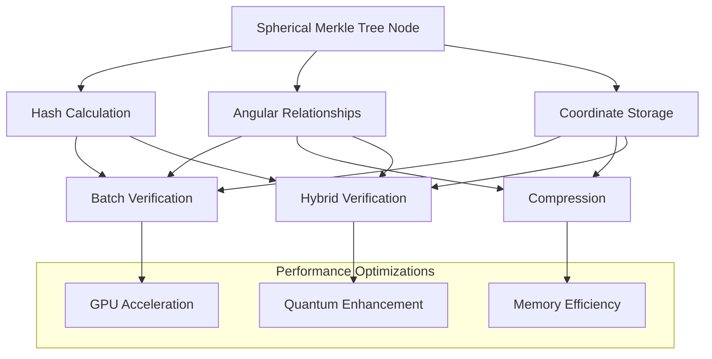
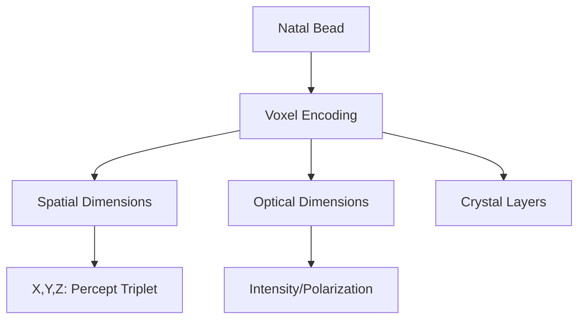
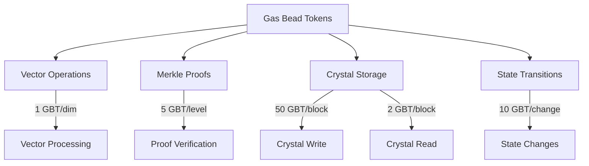

# 2.22. Percept computational architecture

The Memorativa system employs specific optimizations to handle computational overhead from vector operations and Merkle proofs while maintaining functionality and performance.

## Vector space optimization

1. **Hybrid Geometry Processing**
   - Projects to both spherical and hyperbolic spaces
   - Dynamic curvature parameter (κ) for geometry transitions
   - Efficient spatial indexing with KD-trees
   - Quantum-inspired state handling

   ```rust
   struct HybridGeometryProcessor {
       spherical_index: KDTree<384>,
       hyperbolic_index: BallTree<384>,
       quantum_processor: QuantumInspiredProcessor,
       
       fn process_vector(&self, vector: &[f32], curvature: f32) -> Result<HybridVector> {
           let spherical = if curvature <= 0.0 {
               self.spherical_index.project(vector)?
           } else {
               self.hyperbolic_index.project(vector)?
           };
           
           let quantum_state = self.quantum_processor.encode_state(spherical)?;
           
           Ok(HybridVector {
               coords: spherical,
               quantum_state,
               curvature
           })
       }
   }
   ```

2. **Approximate Nearest Neighbor Search**
   ```rust
   struct HybridSearchIndex {
       spherical_index: faiss::IndexHNSWFlat,
       hyperbolic_index: faiss::IndexHNSWFlat,
       
       fn search(&self, query: &HybridVector, k: usize) -> Result<Vec<(f32, usize)>> {
           if query.curvature > 0.0 {
               self.hyperbolic_index.search(query.coords, k)
           } else {
               self.spherical_index.search(query.coords, k)
           }
       }
   }
   ```

3. **Temporal State Integration**
   ```rust
   struct TemporalProcessor {
       mundane_index: TimestampIndex,
       quantum_state: QuantumStateManager,
       holographic_ref: ChartReferenceManager,
       
       fn process_temporal(&self, vector: &HybridVector, state: TemporalState) -> Result<TemporalVector> {
           match state {
               TemporalState::Mundane(ts) => self.process_mundane(vector, ts),
               TemporalState::Quantum => self.process_quantum(vector),
               TemporalState::Holographic(ref_chart) => self.process_holographic(vector, ref_chart)
           }
       }
   }
   ```

## Merkle proof acceleration

1. **Enhanced Spherical Merkle Node Structure**
   ```rust
   struct EnhancedSphericalMerkleNode {
       hash: [u8; 32],
       children: [Option<Box<EnhancedSphericalMerkleNode>>; 2],
       cache_line: [u8; 64], // Cache-aligned
       temporal_state: TemporalState,
       verification_score: f32,
       // Spherical Merkle enhancements
       angular_relationships: HashMap<NodeId, Angle>,
       coordinates: [f32; 4], // [θ, φ, r, κ]
       geometry_type: GeometryType
   }
   
   enum GeometryType {
       Spherical,
       Hyperbolic,
       Hybrid(f32) // Blend factor
   }
   
   impl EnhancedSphericalMerkleNode {
       fn calculate_hash(&self) -> [u8; 32] {
           // Include both data and angular relationships in hash
           let data_hash = hash_data(&self.coordinates);
           
           // Sort relationships for deterministic hashing
           let mut relationships: Vec<(NodeId, Angle)> = 
               self.angular_relationships.iter()
                   .map(|(k, v)| (*k, *v))
                   .collect();
           relationships.sort_by_key(|(id, _)| *id);
           
           let angle_hash = hash_data(&relationships);
           hash_combine(data_hash, angle_hash)
       }
   }
   ```

2. **Spatial-Aware Batch Verification**
   ```rust
   struct SpatialBatchVerifier {
       gpu_hasher: CUDASha256,
       spatial_validator: GPUSpatialValidator,
       batch_size: usize,
       
       async fn verify_spherical_batch(&self, proofs: &[SphericalMerkleProof]) -> Result<Vec<bool>> {
           // Split verification into parallel streams
           let content_verification = self.gpu_hasher.verify_content_batch(proofs);
           let spatial_verification = self.spatial_validator.verify_angles_batch(proofs);
           
           // Combine results
           let (content_results, spatial_results) = join!(content_verification, spatial_verification);
           
           // A proof is valid only if both content and spatial validations pass
           let combined_results = content_results?
               .iter()
               .zip(spatial_results?.iter())
               .map(|(&c, &s)| c && s)
               .collect();
           
           Ok(combined_results)
       }
   }
   ```

3. **Curvature-Aware Processing**
   ```rust
   struct CurvatureAwareProcessor {
       spherical_pipeline: SphericalPipeline,
       hyperbolic_pipeline: HyperbolicPipeline,
       
       fn process_node(&self, node: &EnhancedSphericalMerkleNode) -> Result<ProcessedNode> {
           match node.geometry_type {
               GeometryType::Spherical => self.spherical_pipeline.process(node),
               GeometryType::Hyperbolic => self.hyperbolic_pipeline.process(node),
               GeometryType::Hybrid(blend) => {
                   let spherical = self.spherical_pipeline.process(node)?;
                   let hyperbolic = self.hyperbolic_pipeline.process(node)?;
                   self.blend_results(spherical, hyperbolic, blend)
               }
           }
       }
       
       fn blend_results(&self, spherical: ProcessedNode, hyperbolic: ProcessedNode, 
                        blend: f32) -> Result<ProcessedNode> {
           // Weighted blend of verification results based on geometry
           let verification_score = 
               hyperbolic.verification_score * blend + 
               spherical.verification_score * (1.0 - blend);
           
           // Combine angular data
           let angular_results = self.combine_angular_data(
               &spherical.angular_data,
               &hyperbolic.angular_data,
               blend
           )?;
           
           Ok(ProcessedNode {
               hash: hash_combine(spherical.hash, hyperbolic.hash),
               verification_score,
               angular_data: angular_results,
               temporal_state: spherical.temporal_state, // Use consistent temporal state
           })
       }
   }
   ```

4. **Parallel Angle Computation**
   ```rust
   struct ParallelAngleProcessor {
       angle_compute_kernel: ComputeKernel,
       batch_size: usize,
       
       fn compute_batch_angles(&self, node_pairs: &[(NodeId, NodeId)], 
                               coordinates: &HashMap<NodeId, [f32; 4]>) -> Result<HashMap<(NodeId, NodeId), Angle>> {
           // Prepare batch for GPU
           let batches = node_pairs.chunks(self.batch_size);
           let mut results = HashMap::new();
           
           for batch in batches {
               // Extract coordinates for current batch
               let coord_pairs: Vec<_> = batch
                   .iter()
                   .map(|(id1, id2)| (coordinates[id1], coordinates[id2]))
                   .collect();
                   
               // Compute angles in parallel on GPU
               let angles = self.angle_compute_kernel.execute(coord_pairs)?;
               
               // Store results
               for ((&(id1, id2), angle)) in batch.iter().zip(angles.iter()) {
                   results.insert((id1, id2), *angle);
               }
           }
           
           Ok(results)
       }
   }
   ```

5. **Memory-Efficient Representation**
   ```rust
   struct CompressedSphericalNode {
       hash: [u8; 32],
       // Use quantized coordinates (2 bytes each) instead of full floats
       // [θ, φ, r, κ] -> each in range 0-65535
       coordinates: [u16; 4],
       // Store only significant relationships with distance < threshold
       significant_relationships: SmallVec<[(NodeId, u16); 8]>, // angle as u16
       
       fn decompress(&self) -> EnhancedSphericalMerkleNode {
           // Convert quantized coordinates back to floats
           let coords = [
               self.coordinates[0] as f32 / 65535.0 * TWO_PI,
               self.coordinates[1] as f32 / 65535.0 * PI - PI/2.0,
               self.coordinates[2] as f32 / 65535.0,
               (self.coordinates[3] as f32 / 65535.0 * 20.0) - 10.0 // -10 to +10 range
           ];
           
           // Decompress relationships
           let mut relationships = HashMap::new();
           for (id, angle_q) in &self.significant_relationships {
               let angle = *angle_q as f32 / 65535.0 * 360.0;
               relationships.insert(*id, angle);
           }
           
           // Construct full node
           EnhancedSphericalMerkleNode {
               hash: self.hash,
               coordinates: coords,
               angular_relationships: relationships,
               // Other fields with defaults
               children: [None, None],
               cache_line: [0; 64],
               temporal_state: TemporalState::Mundane(Timestamp::now()),
               verification_score: 1.0,
               geometry_type: if coords[3] > 0.0 { 
                   GeometryType::Hyperbolic 
               } else { 
                   GeometryType::Spherical 
               },
           }
       }
   }
   ```

6. **Hybrid Verification System**
   ```rust
   struct HybridVerificationSystem {
       merkle_verifier: MerkleVerifier,
       spatial_verifier: SpatialVerifier,
       batch_processor: SpatialBatchVerifier,
       
       async fn verify(&self, proof: SphericalMerkleProof, root_hash: Hash) -> Result<VerificationResult> {
           // Single proof verification
           let merkle_valid = self.merkle_verifier.verify(proof.merkle_components, root_hash)?;
           
           // Verify spatial relationships
           let spatial_valid = self.spatial_verifier.verify_angular_consistency(
               proof.node_coordinates,
               proof.angular_relationships
           )?;
           
           // Additional check for curvature consistency
           let curvature_valid = self.spatial_verifier.verify_curvature_consistency(
               proof.node_coordinates.iter().map(|c| c[3]).collect()
           )?;
           
           let confidence = if merkle_valid && spatial_valid && curvature_valid {
               1.0
           } else {
               0.0
           };
           
           Ok(VerificationResult {
               valid: merkle_valid && spatial_valid && curvature_valid,
               confidence,
               merkle_valid,
               spatial_valid,
               curvature_valid
           })
       }
       
       async fn verify_batch(&self, proofs: &[SphericalMerkleProof], 
                           root_hashes: &[Hash]) -> Result<Vec<VerificationResult>> {
           self.batch_processor.verify_spherical_batch(proofs, root_hashes).await
       }
   }
   ```

7. **Quantum-Enhanced Spherical Verification**
   ```rust
   struct QuantumSphericalVerifier {
       classical_verifier: HybridVerificationSystem,
       quantum_processor: QuantumAngleProcessor,
       superposition_threshold: f32,
       
       async fn verify(&self, proof: QuantumSphericalProof, root_hash: Hash) -> Result<QuantumVerificationResult> {
           if self.should_use_quantum(proof.angular_relationships.len()) {
               // Prepare quantum superposition of angles
               let superposition = self.quantum_processor.prepare_angle_superposition(
                   proof.angular_relationships
               )?;
               
               // Perform interference-based verification
               let quantum_result = self.quantum_processor.verify_interference(
                   superposition, 
                   proof.expected_pattern
               ).await?;
               
               Ok(QuantumVerificationResult {
                   valid: quantum_result.fidelity > self.superposition_threshold,
                   confidence: quantum_result.fidelity,
                   quantum_used: true,
                   classical_result: None,
                   fidelity: quantum_result.fidelity
               })
           } else {
               // Fall back to classical verification for small proofs
               let classical_result = self.classical_verifier.verify(
                   proof.to_classical_proof(), 
                   root_hash
               ).await?;
               
               Ok(QuantumVerificationResult {
                   valid: classical_result.valid,
                   confidence: classical_result.confidence,
                   quantum_used: false,
                   classical_result: Some(classical_result),
                   fidelity: 1.0
               })
           }
       }
       
       fn should_use_quantum(&self, relationship_count: usize) -> bool {
           // Quantum advantage threshold
           relationship_count > 20
       }
   }
   ```



This Merkle proof acceleration architecture provides:

1. **Complete Spherical Support** - Full integration of angular relationships from the percept-triplet model
2. **Coordinate Preservation** - Explicit storage and verification of θ, φ, r, κ coordinates
3. **Dual Verification** - Parallel verification of both tree integrity and spatial relationships
4. **Geometry Awareness** - Dynamic adaptation to spherical, hyperbolic, or hybrid geometry
5. **Memory Optimization** - Compressed representation for efficient storage and transfer
6. **Quantum Readiness** - Enhanced verification through quantum-inspired algorithms

The system addresses the topological mismatch between traditional Merkle trees and the spherical knowledge space, ensuring consistent verification of both structural integrity and angular relationships across the Memorativa system.

## Privacy-Aware Processing

```rust
struct PrivacyProcessor {
    privacy_filter: PrivacyFilter,
    encryption_manager: EncryptionManager,
    
    fn process_private(&self, vector: &HybridVector, level: PrivacyLevel) -> Result<PrivateVector> {
        // Apply privacy filtering
        let filtered = self.privacy_filter.filter_vector(vector, level)?;
        
        // Encrypt sensitive components
        let encrypted = match level {
            PrivacyLevel::Private => self.encryption_manager.encrypt_full(filtered),
            PrivacyLevel::NotShared => self.encryption_manager.encrypt_partial(filtered),
            _ => Ok(filtered)
        }?;
        
        Ok(PrivateVector {
            data: encrypted,
            level,
            verification_score: vector.verification_score
        })
    }
}
```

## 5D Crystal Storage Architecture

```rust
struct CrystalStorage {
    laser_writer: FemtosecondLaser,
    scanner: LaserScanner,
    crystal_array: Array3D<CrystalBead>,

    async fn encode_natal_bead(&mut self, bead: &NatalBead) -> Result<CrystalReference> {
        // Encode spatial dimensions (x,y,z) for percept-triplet vectors
        let spatial_encoding = self.encode_spatial_dimensions(bead)?;
        
        // Encode optical dimensions (intensity, polarization) for relationships
        let optical_encoding = self.encode_optical_dimensions(bead)?;
        
        // Write to crystal using femtosecond laser
        let crystal_pos = self.laser_writer.write_voxels(
            spatial_encoding,
            optical_encoding
        )?;
        
        Ok(CrystalReference {
            position: crystal_pos,
            checksum: self.verify_encoding(crystal_pos)?
        })
    }

    async fn retrieve_natal_bead(&self, ref: &CrystalReference) -> Result<NatalBead> {
        // Non-destructive laser scanning
        let voxel_data = self.scanner.read_layers(ref.position)?;
        
        // Verify data integrity
        self.verify_checksum(&voxel_data, ref.checksum)?;
        
        // Reconstruct natal bead from voxel data
        self.reconstruct_bead(voxel_data)
    }
}

struct CrystalBead {
    id: [u8; 32],
    diameter_mm: f32,
    position: Point3D,
    layers: Vec<VoxelLayer>,
}

struct VoxelLayer {
    spatial_dims: [f32; 3],  // x,y,z for percept-triplet
    intensity: f32,          // Curvature κ
    polarization: f32,       // Aspect encoding
    version: u32,
}
```




## Performance architecture

1. **Tiered Processing Pipeline**
   ```mermaid
   graph TD
       IN[Input] --> PP[Pre-processor]
       PP --> |Hot Data| IM[In-Memory Vectors]
       PP --> |Cold Data| DS[Disk Storage]
       PP --> |Natal Beads| CS[5D Crystal Storage]
       IM --> BV[Batch Verification]
       BV --> GPU[GPU Acceleration]
       DS --> AS[Async Processing]
       CS --> |Laser Scanner| AS
       GPU --> OP[Output]
       AS --> OP
   ```

2. **Energy-Aware Scheduling**
   ```rust
   struct EnergyAwareScheduler {
       power_monitor: PowerMonitor,
       task_queue: PriorityQueue<Task>,
       
       fn schedule_task(&mut self, task: Task) -> Result<()> {
           let power_budget = self.power_monitor.get_budget()?;
           let priority = match task.temporal_state {
               TemporalState::Quantum => Priority::High,
               TemporalState::Holographic => Priority::Medium,
               _ => Priority::Low
           };
           
           self.task_queue.add(task, priority, power_budget)
       }
   }
   ```

## Tokenomic Architecture

1. **Computational Cost Structure**
```rust
struct ComputationalCosts {
    // Base costs in GBT (Gas Bead Tokens)
    const VECTOR_OPERATION: u64 = 1;
    const MERKLE_PROOF: u64 = 5;
    const CRYSTAL_WRITE: u64 = 50;
    const CRYSTAL_READ: u64 = 2;
    const STATE_TRANSITION: u64 = 10;
    
    fn calculate_operation_cost(&self, op: Operation) -> Result<u64> {
        match op {
            Operation::VectorProcess(dims) => VECTOR_OPERATION * dims as u64,
            Operation::MerkleVerify(depth) => MERKLE_PROOF * depth as u64,
            Operation::CrystalStore(size) => CRYSTAL_WRITE * size.blocks(),
            Operation::StateChange(complexity) => STATE_TRANSITION * complexity,
            _ => self.base_cost(op)
        }
    }
}
```

2. **Resource Allocation**


3. **Dynamic Pricing Model**
```rust
struct DynamicPricing {
    base_rate: f64,
    network_load: f64,
    crystal_capacity: f64,
    
    fn calculate_price(&self, cost: u64) -> Result<f64> {
        let load_multiplier = 1.0 + (self.network_load - 0.5).max(0.0);
        let storage_multiplier = 1.0 + (1.0 - self.crystal_capacity).max(0.0);
        
        Ok(cost as f64 * self.base_rate * load_multiplier * storage_multiplier)
    }
}
```

4. **Batch Discounts**
```rust
impl BatchProcessor {
    const BATCH_THRESHOLD: usize = 100;
    const MAX_DISCOUNT: f64 = 0.5;
    
    fn apply_batch_discount(&self, operations: &[Operation]) -> Result<f64> {
        let batch_size = operations.len();
        let discount = (batch_size as f64 / Self::BATCH_THRESHOLD as f64)
            .min(Self::MAX_DISCOUNT);
            
        Ok(1.0 - discount)
    }
}
```

5. **Economic Benefits**
- Efficient resource allocation through dynamic pricing
- Incentivized batch processing for cost optimization
- Sustainable crystal storage economics
- Balanced computational load distribution
- Market-driven performance optimization


## Integration benefits

1. **System Scalability**
   - Hybrid geometry enables efficient processing
   - Privacy-aware operations maintain security
   - Temporal state handling supports all modes
   - Batch processing improves throughput

2. **Energy Efficiency**
   - Power-aware task scheduling
   - GPU acceleration for proofs
   - Tiered storage optimization
   - Cache-friendly operations

3. **Performance Optimization**
   - Fast nearest neighbor search
   - Accelerated Merkle verification
   - Privacy-preserving computation
   - Temporal state awareness

The architecture provides:
- Complete hybrid geometric processing
- Privacy-first vector operations
- Efficient temporal state handling
- Secure Merkle verification
- Scalable performance optimization
- Energy-aware scheduling

## Key points

1. **Hybrid Geometric Architecture**
   - Combined spherical-hyperbolic processing
   - Dynamic curvature transitions
   - Efficient spatial indexing
   - Quantum-inspired state handling
   - Optimized nearest neighbor search

2. **Temporal Processing**
   - Support for mundane, quantum, and holographic states
   - State-aware task scheduling
   - Temporal context preservation
   - Efficient state transitions
   - Reference chart integration

3. **Privacy and Security**
   - Privacy-first vector operations
   - Multi-level encryption
   - Secure Merkle verification
   - Access control integration
   - Verification score tracking

4. **Performance Optimizations**
   - GPU-accelerated batch processing
   - Energy-aware scheduling
   - Tiered storage architecture
   - Cache-optimized operations
   - Async processing pipeline

5. **System Integration**
   - Complete integration with Glass Bead tokens
   - RAG system compatibility
   - Focus space support
   - Book generation pipeline
   - Pattern recognition capabilities

This architecture enables:
- Efficient processing of complex geometric relationships
- Secure and private knowledge evolution
- Flexible temporal state management
- Scalable performance for large datasets
- Rich integration with broader system components

