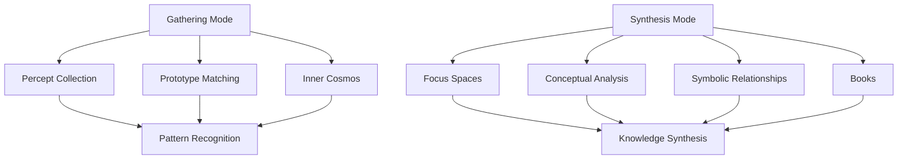
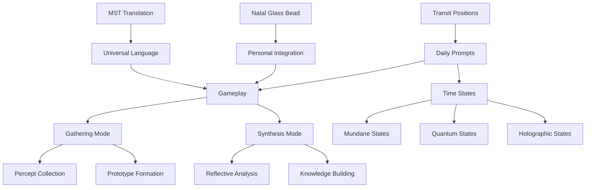
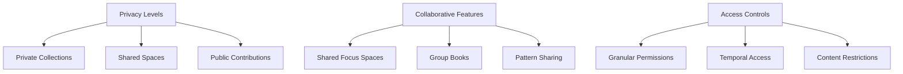
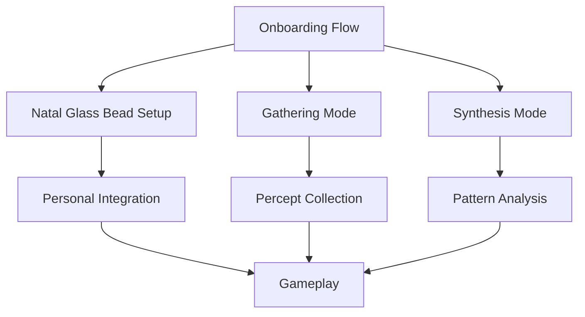
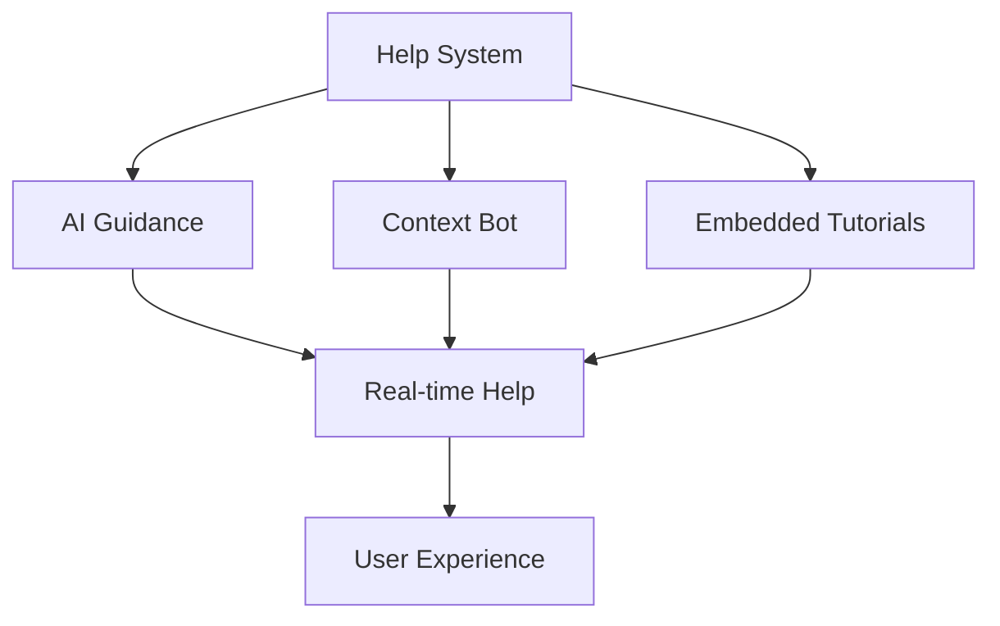

# 2.23. Gameplay

Memorativa gameplay operates on two distinct cognitive levels, each representing different modes of human thinking and interaction with the system. The game is driven by daily planetary transits and anchored by each player's Natal Glass Bead.

## Cognitive levels

1. **Gathering Mode**
   - Focuses on percept collection and curation
   - Mirrors natural human prototype matching
   - Enables personal cosmos construction
   - Supports intuitive pattern recognition
   - Aligns with Basic Structures in the hierarchy as defined in Section 2.19

2. **Synthesis Mode**
   - Enables reflective conceptual analysis
   - Works with focus spaces and structures
   - Creates and analyzes Books
   - Explores deeper symbolic relationships
   - Supports active knowledge construction
   - Enables recursive knowledge development
   - Operates on Composite and Complex Structures as defined in Section 2.19


*Figure 1: Cognitive Mode Structure Diagram, showing the relationship between Gathering and Synthesis modes with their respective components, highlighting how pattern recognition and knowledge synthesis represent the core outcomes of each mode*

## Game modes

1. **Gathering Mode**
   - **Digital Scrapbook**: Players collect and curate percepts into their inner cosmos
   - **Prototype Formation**: Natural matching of percepts to archetypal patterns
   - **Intuitive Collection**: Similar to Pinterest-style curation but with symbolic depth
   - **Model Refinement**: Continuous improvement of personal prototype collection
   - **Cultural Anchoring**: Supports both mimetic and cultural prototype development
   - **Vector Encoding**: Transforms perceptions into the three-vector structure (Archetypal/What, Expression/How, and Mundane/Where) as percept-triplets in hybrid spherical-hyperbolic space
     - Creates **Sun Triplet** (primary concept vector) and **Planet Triplets** (supporting vectors)
     - Establishes Earth/Observer as central reference point for geocentric measurement
     - Applies verification, temporal, and angular weights to all triplets
     - Generates aspects (angular relationships) measured from central observer perspective
     - Uses hybrid coordinate system with parameters (θ, φ, r, κ) where θ (theta) represents archetypal angle, φ (phi) is expression elevation, r is mundane magnitude, and κ (kappa) determines geometry type, consistent with the coordinate system described in Section 2.13
     - Can be extended with three time state vectors (Mundane, Quantum, Holographic) for complete 6-vector model as detailed in Section 2.11

2. **Synthesis Mode**
   - **Reflective Analysis**: Deep exploration of conceptual foundations
   - **Structure Work**: Active engagement with focus spaces
   - **Pattern Recognition**: Discovery of deeper symbolic connections
   - **Knowledge Construction**: Building and analyzing Books
   - **Self-Directed Learning**: Active rather than passive knowledge development
   - **Focus Space Integration**: Utilizes Focus Spaces as primary workspaces for organizing percepts into meaningful patterns and Books
   - **Book Creation and Analysis**: Creates Books with multi-layer architecture that includes:
     - **Human Layer**: Narrative text, chapters, sections, and visualizations
     - **Machine Layer**: Structured data mapping percepts, triplets, and prototypes
     - **Bridge Layer**: Markup system linking narrative elements to structured data
     - **Bead Layer**: Reference connections to Glass Beads and their content
     - **Loom Layer**: Virtual Looming system that organizes beads along thematic (warp) and contextual (weft) threads
   - **Book Recursion**: Enables completed Books to serve as new inputs to the system, creating a closed cognitive loop for continuous knowledge development with:
     - Processing controls to prevent infinite recursion
     - Depth limitations (configurable, default 64 levels)
     - Cycle detection through Book ID tracking
     - Early termination of unproductive chains
   - **Vector Operations**: Performs mathematical operations on percept-triplets within the hybrid spherical-hyperbolic geometry while preserving semantic meaning
     - Calculates geocentric aspects between Sun and Planet triplets
     - Applies hybrid distance functions that combine spherical and hyperbolic spaces
     - Uses curvature parameter κ to optimize representation for different concept types
   - **Lens Application**: Applies Symbolic Lenses as described in Section 2.13 to transform and analyze percepts through diverse cultural and scientific paradigms

## Transit-driven gameplay

1. **Daily Prompts**
   - Generated from planetary positions (e.g., Mars at 10° Capricorn)
   - Forms aspects to player's existing beads
   - Creates dynamic, personalized challenges
   - Example: "Mars squares your Venus—add a percept"
   - Influences Glass Bead token states
   - Connects to the Universal House System described in Section 2.13

2. **Natal Glass Bead Integration**
   - Acts as personal reference beam and core identity token
   - Derived from player's birth chart (e.g., Sun-Leo-1st at 5°)
   - Provides pseudo-anonymous identification while preserving privacy
   - Tunes quantum bead states through Spherical Merkle Trees
   - Personalizes transit interpretations while maintaining privacy
   - Serves as the foundation for lens-based interpretation of percepts
   - Requires 1000 GBT for initial creation as detailed in Section 2.17
   - Preserves angular relationships between concepts through secure proofs

3. **MST Translation Layer**
   - Converts astrological encodings to universal language
   - Example: Venus-Libra-9th → "Harmonious Ethics"
   - Ensures accessibility for all players
   - Maintains symbolic depth while removing astrological complexity
   - Implements the cross-system mappings defined in the Lens System (Section 2.13)
   - GBT costs aligned with Section 2.5 and Section 2.13:
     - Full Translation: 15-20 GBT
     - Cultural Calibration: 10-15 GBT
     - Archetype Extraction: 7-12 GBT
     - Context Bridging: 5-8 GBT
     - Basic Lookup: 2-4 GBT

4. **Conceptual Time States**
   - **Mundane time states**: Specific timestamps (past/future) linked to percepts, affected by transits
   - **Quantum time states**: Probabilistic superpositions awaiting resolution, enabling "tuning" of placement
   - **Holographic time states**: Reference-based projections that maintain relationships with natal charts
   - Transit aspects trigger state transitions and transformations according to rules defined in Section 2.11
   - Each percept-triplet can have independent time states, allowing complex temporal relationships
   - Implements privacy-preserving time states with dynamic noise balancing based on sensitivity:
     - Public data: Minimal noise added
     - Private data: Maximum noise applied
     - Mixed sensitivity: Adaptive noise levels

5. **Multi-Chart Interface**
   - Supports up to 12 active charts simultaneously as specified in Section 2.12
   - Enables comparison between different time states and chart configurations
   - Preserves angular relationships across chart overlays
   - Supports specialized chart types (composite, harmonic, relocational, draconic)
   - Integrates with multiple Symbolic Lenses to enable cross-lens analysis as described in Section 2.13


*Figure 2: Transit-Driven Gameplay System, illustrating how celestial positions generate personalized challenges that influence time states and gameplay modes, demonstrating the interconnection between astrological frameworks and knowledge structures*

## Gameplay progression

1. **Initial Phase**
   - Create personal Natal Glass Bead (1000 GBT)
   - Learn basic percept collection
   - Begin prototype recognition
   - Explore focus spaces
   - Understand vector space basics
   - Introduction to basic Symbolic Lenses

2. **Development Phase**
   - Build inner cosmos
   - Form complex prototypes
   - Create first Books with basic loom patterns
   - Engage with transit prompts
   - Master vector relationships
   - Apply multiple Symbolic Lenses to percepts
   - Explore cross-system mappings

3. **Mastery Phase**
   - Deep pattern analysis
   - Advanced Book creation with complex Virtual Loom structures
   - Collaborative synthesis
   - Knowledge network building
   - Sophisticated vector operations
   - Multi-lens analysis for pattern recognition
   - Create custom Symbolic Lenses
   - Design recursive Book chains with controlled processing depth

## Reward mechanics

1. **Glass Bead Generation**
   - Earned through percept collection
   - Awarded for prototype formation
   - Generated from Book creation
   - Gained through collaboration
   - Rewarded for lens application and validation

2. **Achievement System**
   - Personal development milestones
   - Pattern recognition achievements
   - Knowledge construction goals
   - Collaborative accomplishments
   - Cross-lens pattern discovery achievements

3. **Progress Tracking**
   - Inner cosmos growth metrics
   - Prototype quality measures
   - Book development tracking
   - Collaboration statistics
   - Vector space complexity metrics
   - Lens utilization and pattern discovery metrics

These reward mechanics directly implement the formal reward structure defined in Section 2.19, including:
- **Quality-based incentives** for high verification scores
- **Innovation premiums** for novel structural patterns 
- **Synthesis bonuses** for connecting previously unrelated structures
- **Temporal stability rewards** for relevance across time states
- **Cross-lens coherence bonuses** for structures with consistent meaning
- **Progressive validation rebates** returning portions of gas fees
- **Collaboration multipliers** enhancing rewards for group creation
- **Thread completion incentives** for Virtual Loom patterns
- **Discovery rewards** for identifying valuable underutilized structures
- **Integration bounties** for cross-domain connections

## Privacy and collaboration

1. **Privacy Levels**
   - **Private**: Only accessible to the player
   - **Not Shared**: Accessible to the player and the system for AI training but not shared with others
   - **Public**: Accessible to all players and the system
   - **Shared**: Accessible to specific players or groups, as defined by the player

2. **Collaborative Features**
   - Shared focus spaces
   - Group Book creation
   - Pattern sharing networks
   - Knowledge synthesis teams
   - Collaborative lens application with specialized pricing:
     - Host pays initial setup cost (5.0 GBT)
     - Each participant contributes 1.0 GBT per lens sharing session
     - Operations during collaboration receive a 30% discount
     - Pattern discoveries are credited to all participants proportionally

3. **Access Controls**
   - Granular permission settings
   - Temporal access limits
   - Content type restrictions
   - Usage tracking
   - Hierarchical structure permissions


*Figure 3: Privacy and Collaboration Framework, depicting the relationship between privacy levels, collaborative features, and access controls, showing how the system balances personal knowledge protection with collaborative creation*

## UI and progressive onboarding

1. **Guided Onboarding Flow**
   - Multi-stage tutorial ("Beginner's Quest")
   - Progress indicators and achievement badges
   - Contextual help and tooltips
   - Gradual feature introduction
   - Progressive introduction to Symbolic Lenses


*Figure 4: Progressive Onboarding System, showing the player journey from Natal Glass Bead creation through engagement with both cognitive modes, illustrating how distinct entry points converge into integrated gameplay*

2. **Adaptive Interface**
   - Dynamic UI panels based on user level
   - Context-sensitive tooltips and overlays
   - Progressive feature unveiling
   - Customizable complexity settings
   - Lens system complexity adapts to user proficiency

3. **Sandbox Environment**
   - Safe experimentation space
   - Simulated transit prompts
   - Practice percept collection
   - Risk-free prototype formation
   - Lens exploration without GBT costs

4. **Help System**
   - AI-powered guidance
   - Context-aware chatbot
   - Embedded tutorials
   - Real-time explanations
   - Lens application guidance


*Figure 5: Help System Architecture, depicting the hierarchy of AI guidance, contextual assistance, and embedded tutorials that collectively provide real-time support, demonstrating how layered assistance enhances user experience*

5. **Visual Framework**
   - Unified symbolic language
   - Animated visualizations
   - Interactive horoscope charts
   - Clear visual hierarchies
   - Cross-lens visualization tools

6. **Feature Progression**
   - Tiered access system
   - Achievement-based unlocks
   - Collaborative tool access
   - Advanced analysis features
   - Progressive lens system access:
     - Traditional Esoteric lenses (initial access)
     - Scientific & Mathematical lenses (intermediate)
     - Psychological & Experiential lenses (advanced)
     - Custom lens creation (mastery)

## Technical Integration

The gameplay is powered by sophisticated technical components that directly implement the interfaces defined in Section 2.19:

1. **RAG System Integration**
   - Retrieval Augmented Generation provides contextually relevant information
   - Enhances both Gathering and Synthesis modes
   - Improves quality of focus spaces and Books
   - Implements vector retrieval with significant angular relationships filtering
   - Utilizes spatial context generation for rich, contextually relevant responses
   - Maintains dynamic knowledge base organized by spatial clusters and temporal states
   - Ensures data integrity through Spherical Merkle Trees while preserving angular relationships
   - Employs performance optimizations including spatial clustering (80-90% search space reduction) and aspect caching (35-40% computation reduction) as detailed in Section 2.21
   - Books integrate with RAG as structured repositories with percept-triplets in vector-encodable format
   - Book loom threads provide navigational pathways for contextual exploration and retrieval

2. **LLM Processing**
   - Powers conversational interfaces and content generation
   - Assists in prototype formation and pattern recognition
   - Provides contextual guidance during gameplay
   - Supports linguistic analysis for Symbolic Lens application
   - Implements all five key external interfaces detailed in Section 2.21: Provider Interface, Privacy-Aware Adapter, Conversion Layer, Rate Limiting & Cost Management, and Spherical Merkle Interface

3. **Hybrid Vector Encoding**
   - Combines spherical and hyperbolic spaces for optimal concept representation
   - Encodes percept-triplets with coordinates (θ, φ, r, κ) as specified in Section 2.4 and Section 2.13
   - Enables mathematical operations on conceptual relationships
   - Supports both Gathering and Synthesis modes with appropriate geometric transformations
   - Utilizes SphericalRAG for vector retrieval with KDTree and BallTree implementations
   - Filters neighbors based on significant angular relationships (astrological aspects)
   - Implements hybrid aspect angle calculations that respect both geometries
   - Optimizes performance through spatial clustering and aspect caching
   - Integrates with Lens System's curvature-aware processing for optimal symbolic representation
   - Applies the same Angular Relationship Preservation techniques described in Section 2.21

4. **Multi-Modal Analysis**
   - Processes text and images to create percepts and prototypes
   - Leverages CLIP-based models to identify visual archetypes from uploaded images
   - Transforms visual concepts into the same hybrid triplet space as text inputs
   - Cross-modal alignment ensures consistent processing across input types
   - Employs keyword hints system to guide AI interpretation of ambiguous patterns
   - Applies Symbolic Lenses to both textual and visual percepts
   - Books implement comprehensive multi-modal processing capabilities that integrate text and images into consistent percept-triplets
   - Uses CLIP-based vision models for visual archetype identification in Book content
   - Implements the Diffusion Model Integration described in Section 2.21 for advanced image generation, understanding, and transformation

5. **Lens System Integration**
   - Implements the full Symbolic Lens framework described in Section 2.13
   - Enables analysis through Traditional Esoteric, Scientific & Mathematical, and Psychological & Experiential lenses
   - Supports Universal House System as common framework for cross-lens compatibility
   - Utilizes the lens optimization strategies including:
     - Lens sharding for improved performance
     - Lazy evaluation to calculate transformations only when needed
     - Adaptive precision for angular relationships
     - Cached translation tables for efficient cross-system operations
   - Applies the full GBT token cost structure for lens operations as defined in Section 2.13
   - Integrates with the LLM processing system described in Section 2.21 for enhanced symbolic translation

These technologies create a seamless experience where player contributions are enhanced through AI assistance while maintaining human-centered meaning, utilizing the technical interfaces defined in Section 2.19:

```rust
pub trait StructureCreation {
    fn create_basic_structure(
        input: PlayerInput,
        privacy: PrivacyLevel,
        temporal: TemporalState,
        gas: GasBeadToken
    ) -> Result<GlassBead>;

    fn create_composite_structure(
        patterns: Vec<Pattern>,
        config: CreationConfig,
        gas: GasBeadToken
    ) -> Result<GlassBead>;

    fn create_complex_structure(
        components: Vec<Component>,
        references: Vec<Reference>,
        gas: GasBeadToken
    ) -> Result<GlassBead>;
    
    // ... additional interface methods aligned with Section 2.19
}
```

## Conceptual Time States integration

Gameplay fully implements the three conceptual time states defined in Section 2.19:

1. **Mundane time states**: Specific timestamps (past/future) linked to percepts, affected by transits
2. **Quantum time states**: Probabilistic superpositions awaiting resolution, enabling "tuning" of placement
3. **Holographic time states**: Reference-based projections that maintain relationships with natal charts

These time states follow the formal definitions and operations described in Section 2.19, including:
- Transit aspects trigger state transitions and transformations
- Each percept-triplet can have independent time states
- Privacy-preserving time states with dynamic noise balancing
- Clear transition rules between states

## Structure hierarchy integration

All gameplay elements operate within the three-tier structure hierarchy defined in Section 2.19:

1. **Basic Structures**
   - Percept-triplets (Gathering Mode)
   - Individual Glass Beads
   - Vector representations
   - Basic lens mappings

2. **Composite Structures**
   - Prototypes (Gathering/Synthesis transition)
   - Focus Spaces
   - Collections of related percepts
   - Lens transformations

3. **Complex Structures**
   - Books (Synthesis Mode)
   - Knowledge networks
   - Collaborative spaces
   - Multi-lens analysis systems
   - Cross-system pattern networks

This hierarchy provides a framework for how knowledge is organized, shared, and evolved within the system, with each gameplay mode primarily operating at different structural levels as detailed in Section 2.19.

## Structure creation and workflows

Gameplay implements the structure creation workflows defined in Section 2.19:

| Entry Point | Initial Structure | Validation | Output |
|-------------|------------------|------------|---------|
| Player Input | Percept-triplet | MST + Player | Basic Structure |
| Focus Space | Pattern Template | Aspect Analysis | Composite Structure |
| Book Content | Concept Boundary | Reference Check | Complex Structure |
| RAG Synthesis | Vector Pattern | Similarity Match | Any Structure Type |
| LLM Generation | Symbolic Pattern | Coherence Check | Any Structure Type |
| Cross Transform | Existing Structure | State Verification | New Structure Type |
| Lens Application | Transformed Structure | Angular Consistency | Any Structure Type |

Creation Controls align with Section 2.19:
   - Gas token requirements for each operation
   - Privacy level specification
   - Temporal state assignment
   - Attribution tracking
   - Permission inheritance
   - Validation requirements

## Resource allocation integration

The gameplay mechanics utilize the resource allocation framework detailed in Section 2.19 and Section 2.16:

1. **Dynamic scaling** of computational resources based on gameplay activity
2. **Priority-based allocation** for critical shared structures
3. **Caching strategies** for frequently accessed patterns
4. **Load balancing** across distributed nodes
5. **Resource pooling** for collaborative gameplay
6. **Memory management** optimized for hybrid space calculations
7. **Computational sharding** for efficient verification
8. **Adaptive resource reservation** for temporal analysis
9. **Privacy-preserving computation** with differential overhead
10. **Thread-specific allocation** for Book processing

These mechanisms ensure optimal performance while adhering to the token economics framework, preventing resource exploitation while promoting valuable knowledge creation. The implementation follows the detailed approach described in Section 2.21, including:

- **DynamicResourceScaler** that adjusts resource requirements based on operation complexity and system load
- **PriorityAllocator** that handles resource allocation based on operation priority
- **HybridMemoryManager** that efficiently allocates memory between spherical and hyperbolic geometries using the curvature parameter (κ)
- **LoadBalancer** that selects optimal providers based on capability matching, current load, cost efficiency, and reliability
- **ResourcePool** that facilitates collaborative resource sharing
- **ComputationalSharder** that optimizes processing of angular relationships

The system dynamically allocates resources according to the following model, as specified in Section 2.21:

1. **CPU resources**:
   - 45% for text generation and encoding
   - 25% for angular relationship processing
   - 15% for verification mechanisms
   - 10% for lens transformations
   - 5% for privacy filtering

2. **Memory resources**:
   - 40% for model context handling
   - 25% for hybrid geometric structures
   - 20% for temporal state management
   - 10% for verification data
   - 5% for caching

3. **Storage optimization**:
   - 35% for cached embeddings
   - 30% for processed outputs
   - 25% for hybrid structures
   - 10% for verification proofs

This ensures that all gameplay operations maintain optimal performance while adhering to the token economics framework, preventing resource exploitation while promoting valuable knowledge creation.

## Prototype Formation and Processing

The gameplay directly implements the prototype structure defined in Section 2.9 and follows the formation principles outlined in Section 2.19, with specific mechanics to support its geocentric architecture and feedback systems:

1. **Geocentric Structure Implementation**
   - **Earth/Observer Center**: The player's viewpoint serves as the central reference point
   - **Sun Triplet Selection**: The most significant percept becomes the primary concept vector
   - **Planet Triplet Organization**: Supporting percepts arranged as secondary vectors
   - **Aspect Calculation**: Angular relationships calculated from central reference point
   - **Weighted Aggregation**: Triplets weighted by verification score, temporal significance, and aspect strength
   - **Flexible Threshold System**: Implements adjustable aspect orbs that adapt to user preferences while maintaining mathematical integrity, as detailed in Section 2.12

2. **Pattern Recognition & Refinement**
   - **Geocentric Coherence**: Measures how well patterns align from observer perspective (0-1)
   - **Aspect Harmony**: Evaluates angular relationships between vectors
   - **Usage Tracking**: Monitors pattern frequency and application
   - **User Validation**: Incorporates player feedback as verification scores
   - **Cross-Lens Pattern Recognition**: Identifies patterns that emerge from analyzing percepts through multiple Symbolic Lenses

3. **Feedback Integration System**
   - **Multi-channel Feedback**:
     - Direct user validation/rejection
     - Aspect pattern analysis
     - AI-generated synthetic feedback
     - Cross-prototype aspect scoring
     - Temporal consistency checks
   - **Observer-relative Processing**: All feedback evaluated from Earth/Observer perspective
   - **Weight Adjustment**: Verification, temporal, and angular weights updated based on feedback
   - **Structure Evolution**: Prototype reorganization based on aspect patterns

4. **Spherical Merkle Tree Integration**
   - **Angular Relationship Preservation**: Unlike traditional Merkle trees, preserves both content integrity and angular relationships
   - **Hybrid Verification**: Validates both data content and spatial relationships
   - **Geocentric Angular Proof**: Verifies angular relationships from observer perspective
   - **Temporal State Tracking**: Documents prototype evolution through state transitions
   - **Glass Bead Attestation**: Links verified prototypes to Glass Bead tokens
   - **Lens Verification**: Validates lens transformations and cross-lens relationships as described in Section 2.13

This implementation directly corresponds to the prototype formation workflows defined in Section 2.19, ensuring full alignment between gameplay mechanics and the formal structure framework.

## Adaptive Learning Process

The gameplay implements a multi-stage learning process that continuously refines prototypes, following the structure evolution patterns defined in Section 2.19:

1. **Initial Feedback Collection**
   - **User Validation**: Direct player signals (validation/rejection)
   - **Aspect Analysis**: Evaluation of angular pattern coherence
   - **AI Augmentation**: AI-generated synthetic validation
   - **Lens-based Validation**: Verification through multiple Symbolic Lenses

2. **Geocentric Analysis**
   - **Aspect Coherence**: Verification of angular relationships from observer center
   - **Temporal Consistency**: Validation of pattern evolution through time
   - **Cross-Prototype Mapping**: Analysis of relationships between different prototypes
   - **Cross-Lens Analysis**: Evaluation of pattern consistency across different symbolic systems

3. **Weight Adjustment**
   - **Dynamic Confidence**: Confidence intervals based on feedback consistency
   - **Adaptive Learning Rates**: Adjusted based on feedback quality:
     ```
     η_new = η_old · (1 + α·confidence) / (1 + β·error_rate)
     ```
   - **Aspect Modulation**: Strengthening/weakening of angular relationships
   - **Lens-based Weighting**: Adjusting weights based on cross-system validation

4. **Structure Evolution**
   - **Aspect-Based Reorganization**: Restructuring prototypes based on aspect patterns
   - **Vector Emergence**: Formation of new supporting vectors
   - **Pattern Pruning**: Removal of obsolete or weak patterns
   - **Lens-Informed Evolution**: Restructuring based on insights from multiple symbolic systems

5. **Time State Transitions**
   - **Quantum to Mundane Transitions**: Occurs when a quantum state concept gets anchored to a specific timestamp
     - Triggered by user setting a timestamp, system detecting temporal references, or pattern matching
     - Preserves original quantum properties as metadata
   - **Mundane to Quantum Transitions**: Occurs when temporal specificity needs to be relaxed
     - Triggered by pattern analysis requiring flexibility, user removing timestamp, or merging states
     - Maintains link to original mundane timestamp as reference
   - **Privacy-Preserving Temporal Adjustments**:
     - Applies calibrated noise based on privacy level (Public: minimal, Private: maximum)
     - Uses differential privacy techniques to protect specific timestamps
     - Preserves statistical properties at aggregate level

This continuous feedback loop ensures prototypes evolve to better represent concepts through player interaction, aspect-based relationships, appropriate time state transitions, and insights from multiple Symbolic Lenses, implementing the structure evolution mechanisms defined in Section 2.19.

## Lens System Integration

Building on the technical foundation, the gameplay fully implements the Symbolic Lens framework from Section 2.13, with direct connections to the shared structures system in Section 2.19:

1. **Lens Types**
   - Traditional Esoteric lenses (astrological, tarot, I Ching)
   - Scientific & Mathematical lenses (information theory, systems dynamics, complexity)
   - Psychological & Experiential lenses (cognitive frameworks, emotional taxonomies)

2. **Cross-System Integration**
   - Universal House System for cross-lens compatibility
   - Cross-lens pattern recognition for rich symbolic interpretation
   - Lens-specific GBT costs and rewards aligned with Section 2.19's operational costs
   - Optimization strategies for efficient lens operations
   - Progressive access to more complex lens systems

3. **Structure Integration**
   - Lens operations apply to all structure types defined in Section 2.19
   - Consistent angular relationships preserved across lens transformations
   - Hybrid spherical-hyperbolic geometry maintained in all lens operations
   - Merged temporal state handling across lens perspectives

This implementation ensures that the Lens System provides consistent knowledge representation across different symbolic frameworks while preserving the integrity of the shared structure system defined in Section 2.19.

## Key points

1. **Core Gameplay Structure**
   - Two cognitive modes: Gathering and Synthesis
   - Transit-driven daily challenges
   - Natal Glass Bead anchoring for personalization and identity verification
   - Progressive feature unlocking
   - Adaptive interface complexity
   - Three-tier structure hierarchy integration
   - Percept-triplet vector encoding with consistent terminology: Archetypal/What (planets), Expression/How (signs), and Mundane/Where (houses)
   - Geocentric model with Earth/Observer at center, Sun triplet as primary vector, and Planet triplets as supporting vectors
   - Integration with Symbolic Lens system for diverse interpretations

2. **Token Economy**
   - Glass Bead Tokens (GBTk) implemented as SPL tokens for symbolic storage and gameplay
   - Gas Bead Tokens (GBT) power all operations with structured costs aligned with Section 2.6 and Section 2.13
   - MST translation operations with costs defined in Section 2.5
   - Time state operations with costs aligned with Section 2.11
   - Lens operations with costs defined in Section 2.13
   - Balanced cost structure for core actions
   - Sustainable daily reward allocation
   - Multiple earning opportunities
   - Incentivized quality contributions

3. **Temporal Framework**
   - Three distinct conceptual time states: Mundane, Quantum, and Holographic
   - 6-vector model combining 3 percept-triplet vectors with 3 time state vectors
   - State transitions following rules defined in Section 2.11
   - Privacy-preserving temporal operations with dynamic noise balancing
   - Quantum-inspired temporal analysis for pattern discovery
   - Independent time states for each percept-triplet within a prototype

4. **Collaborative Framework**
   - Multiple sharing models with defined costs/rewards
   - Privacy-preserving collaboration tools
   - Clear attribution and reward tracking
   - Scalable group interactions
   - Transit-driven group challenges
   - Collaborative lens application with specialized pricing

5. **Privacy Architecture**
   - Granular privacy levels (Private, Not Shared, Public, Shared)
   - Hierarchical permission system
   - Inheritance-based access control
   - Secure version tracking using Merkle Trees
   - Protected collaboration spaces

6. **Progression System**
   - Achievement-based feature unlocks
   - Skill-appropriate interface adaptation
   - Guided onboarding process
   - Safe experimentation environment
   - Comprehensive help system
   - Progressive lens system access

7. **Reward Mechanics**
   - Individual contribution rewards
   - Group achievement bonuses
   - Quality-based multipliers
   - Community impact incentives
   - Collaborative success sharing
   - Cross-system pattern discovery rewards

8. **Technical Foundation**
   - RAG system for contextual retrieval-augmented generation
   - Vector retrieval with significant angular relationship filtering
   - Spatial context generation for rich, contextually relevant responses
   - Dynamic knowledge base organized by spatial clusters and temporal states
   - Performance optimizations including clustering (80-90% search space reduction) and caching (35-40% computation reduction)
   - Spherical Merkle Trees for data integrity while preserving angular relationships
   - LLM processing for content generation
   - Hybrid spherical-hyperbolic encoding for percept-triplets
   - Multi-modal analysis with CLIP-based models and keyword hints
   - Multi-state token system with Spherical Merkle verification
   - Vector-based knowledge operations within the coordinate system (θ, φ, r, κ)
   - MST translation system using correspondence tables and cultural neutralization
   - Observer-relative feedback processing with multi-channel integration
   - Adaptive learning with dynamic confidence intervals and aspect modulation
   - Structure evolution through aspect-based reorganization
   - Symbolic Lens system for multi-paradigm interpretation
   - Books as multi-layered structures with Human, Machine, Bridge, Bead, and Loom layers
   - Virtual Looming system for organizing beads along thematic and contextual threads
   - Book recursion with controlled processing depth for continuous knowledge development
   - Direct implementation of technical interfaces defined in Section 2.19

This gameplay design creates a cohesive system that fully aligns with the shared structures defined in Section 2.19, creating:
- Engaging daily activities driven by transits
- Sustainable token economy
- Privacy-first collaboration
- Clear progression paths
- Fair reward distribution
- Rich knowledge synthesis opportunities
- Seamless integration of technical components
- Coherent geocentric structure as defined in Section 2.9
- Multi-perspective symbolic interpretation through the Lens System
- Comprehensive Book creation with multi-layer architecture
- Virtual Loom patterns for organized knowledge representation
- Controlled Book recursion for continuous knowledge development

## Key Math

### 1. Hybrid Spherical-Hyperbolic Vector Space

The percept-triplet encoding uses a hybrid geometry with coordinate system $(θ, φ, r, κ)$ where:
- $θ$ (theta): Archetypal angle in the spherical plane, representing "What"
- $φ$ (phi): Expression elevation angle, representing "How"
- $r$: Mundane magnitude, representing "Where"
- $κ$ (kappa): Curvature parameter determining geometry type (spherical, flat, or hyperbolic)

The distance function between two percepts $p_1$ and $p_2$ with coordinates $(θ_1, φ_1, r_1, κ_1)$ and $(θ_2, φ_2, r_2, κ_2)$ is defined as:

$$d(p_1, p_2) = \begin{cases}
r_1 r_2 \cdot \cos^{-1}(\sin φ_1 \sin φ_2 + \cos φ_1 \cos φ_2 \cos(θ_1 - θ_2)) & \text{if } κ > 0 \text{ (spherical)} \\
\sqrt{r_1^2 + r_2^2 - 2r_1r_2(\cos θ_1 \cos θ_2 + \sin θ_1 \sin θ_2) \cos(φ_1 - φ_2)} & \text{if } κ = 0 \text{ (flat)} \\
r_1 r_2 \cdot \cosh^{-1}(\cosh r_1 \cosh r_2 - \sinh r_1 \sinh r_2 \cos(θ_1 - θ_2)) & \text{if } κ < 0 \text{ (hyperbolic)}
\end{cases}$$

### 2. Angular Relationship (Aspect) Calculation

Aspects between triplets are calculated using the angular separation $α$ between two points on the hybrid space:

$$α(p_1, p_2) = \cos^{-1}\left(\frac{\vec{p_1} \cdot \vec{p_2}}{|\vec{p_1}||\vec{p_2}|}\right)$$

An aspect is considered significant when:

$$|α - α_{\text{exact}}| < \text{orb}(α_{\text{exact}})$$

where $α_{\text{exact}}$ is one of the standard aspect angles (0°, 60°, 90°, 120°, 180°), and $\text{orb}(α_{\text{exact}})$ is the allowed deviation for that aspect.

### 3. Weighted Prototype Formation

For a prototype with Sun triplet $S$ and planet triplets $P = \{p_1, p_2, ..., p_n\}$, the weighted vector representation $\vec{V}$ is:

$$\vec{V} = w_S \cdot \vec{S} + \sum_{i=1}^{n} w_i \cdot \vec{p_i}$$

where weights are calculated as:

$$w_i = \frac{v_i \cdot t_i \cdot a_i}{\sum_{j=1}^{n} v_j \cdot t_j \cdot a_j}$$

with:
- $v_i$: Verification score (0-1)
- $t_i$: Temporal weight based on time state
- $a_i$: Angular weight based on aspect strength

### 4. Temporal State Transition Probabilities

The probability of transitioning from Quantum to Mundane state can be modeled as:

$$P(Q \rightarrow M) = β \cdot \text{verification} + (1-β) \cdot \text{transit\_influence}$$

where $β$ is a balancing parameter between user verification and transit influences.

The noise addition for privacy preservation follows:

$$p' = p + N(0, σ)$$

where $σ$ varies based on privacy level:
- Public: $σ = σ_{\text{min}}$
- Private: $σ = σ_{\text{max}}$
- Other: $σ = σ_{\text{min}} + \alpha \cdot (σ_{\text{max}} - σ_{\text{min}})$, with $\alpha$ determined by privacy settings

### 5. Lens Transformation Functions

A lens transformation $L$ applied to a percept $p$ creates a new percept $p'$:

$$p' = L(p) = T_L \cdot R_L \cdot S_L \cdot p$$

where:
- $T_L$ is the translation matrix
- $R_L$ is the rotation matrix
- $S_L$ is the scaling matrix

For cross-lens operations, a mapping function $M_{L_1→L_2}$ converts between lens systems:

$$p_{L_2} = M_{L_1→L_2}(p_{L_1})$$

The GBT cost of lens operations follows:

$$\text{Cost}_{lens} = c_{\text{base}} + c_{\text{complexity}} \cdot n + c_{\text{precision}} \cdot \frac{1}{ε}$$

where $n$ is the number of operations and $ε$ is the required precision.

### 6. Adaptive Learning Rate

The learning rate adjustment for prototype evolution follows:

$$η_{\text{new}} = η_{\text{old}} \cdot \frac{1 + α \cdot \text{confidence}}{1 + β \cdot \text{error\_rate}}$$

where confidence is calculated as:

$$\text{confidence} = 1 - \frac{σ_{\text{feedback}}}{μ_{\text{feedback}}}$$

### 7. Resource Allocation Optimization

The resource allocation problem is formulated as:

$$\max_{\mathbf{x}} \sum_{i=1}^{n} U_i(x_i)$$

subject to:
$$\sum_{i=1}^{n} x_i \leq X_{\text{total}}$$
$$x_i \geq 0 \text{ for all } i$$

where:
- $U_i(x_i)$ is the utility function for resource allocation $x_i$ to operation $i$
- $X_{\text{total}}$ is the total available resource

The optimization uses gradient descent with the update rule:

$$\mathbf{x}^{(t+1)} = \mathbf{x}^{(t)} + γ \nabla U(\mathbf{x}^{(t)})$$

This formulation ensures optimal allocation across all gameplay operations while respecting system constraints defined in Section 2.21.

## Key Visual Insights

The visualizations throughout this document provide several critical insights into the Memorativa gameplay system:

- **Cognitive Duality Integration** (Figure 1): The Cognitive Mode Structure Diagram reveals how the two modes of thinking (Gathering and Synthesis) are not separate systems but interconnected processes that feed into each other, with pattern recognition serving as the bridge between percept collection and knowledge synthesis.

- **Celestial-Cognitive Connection** (Figure 2): The Transit-Driven Gameplay System visualization demonstrates how astronomical positions are translated into meaningful gameplay mechanics, creating a connection between observable celestial phenomena and knowledge organization that grounds abstract concepts in measurable coordinates.

- **Privacy-Collaboration Balance** (Figure 3): The Privacy and Collaboration Framework illustrates the system's approach to resolving the tension between personal knowledge protection and collaborative creation, showing how granular controls enable precise sharing boundaries.

- **Coherent Player Journey** (Figure 4): The Progressive Onboarding System reveals how seemingly disparate elements (natal chart creation, percept collection, pattern analysis) converge into an integrated gameplay experience, creating a smooth transition from novice to advanced user.

- **Layered Assistance Model** (Figure 5): The Help System Architecture highlights the multi-layered approach to player support, where different types of guidance work together to provide contextually relevant assistance without overwhelming the player.

Collectively, these visualizations demonstrate how Memorativa integrates multiple complex systems (astrological frameworks, knowledge structures, privacy controls, onboarding processes, and help systems) into a cohesive gameplay experience that balances structure with flexibility, personal exploration with collaborative creation, and intuitive collection with analytical synthesis.

## See Also

- [Technical Implementation (2.24)](../2.%20the%20cybernetic%20system/memorativa-2-24-technical-implementation.md) — Details the technical architecture supporting the gameplay mechanisms, including the RAG system, vector encoding implementation, and computational infrastructure.

- [User Interface Design (2.25)](../2.%20the%20cybernetic%20system/memorativa-2-25-user-interface-design.md) — Expands on the interface components briefly described in this document, providing comprehensive layouts and interaction patterns for both Gathering and Synthesis modes.

- [Client Architecture (2.26)](../2.%20the%20cybernetic%20system/memorativa-2-26-client-architecture.md) — Explains the technical organization of the client-side application, including state management, data flow, and integration with the core system components.