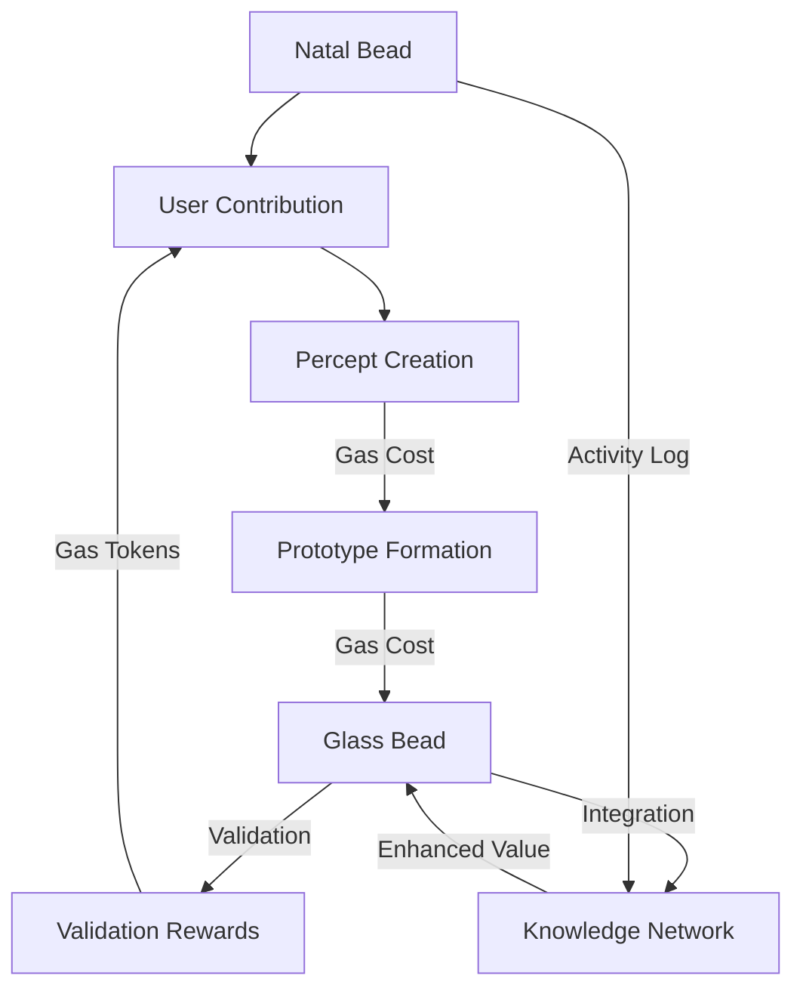

# 2.24. Tokenomics

The Memorativa token economy employs a dual token model:

1. Glass Bead Tokens (GBTk) - Knowledge artifacts representing verified human thought
2. Gas Bead Tokens (GBT) - Utility tokens powering system operations

## Glass Bead Token Economy

Glass Bead Tokens represent verified knowledge artifacts in the system:

### Token Types
- Natal Glass Beads (NGB) - Core identity and reference tokens
- Standard Glass Beads (GBTk) - Knowledge artifacts
- Gas Bead Tokens (GBT) - Utility tokens

### Natal Glass Bead Properties
- One-time minting cost: 1000 GBT
- Non-fungible identity token
- Rare transfer capability (500 GBT)
- Activity logging (1 GBT per action)
- Template updates (10-20 GBT)
- Crystal archival storage (50 GBT)
- Required for system participation

### Token Properties
- SPL token standard implementation
- Encapsulates percept-triplets, prototypes, and focus spaces
- Maintains privacy levels and access controls
- Tracks verification scores and temporal states
- Preserves attribution and ownership data
- Supports Merkle tree verification

### Value Generation
- Created through human conceptual work
- Validated through peer review and system verification
- Enhanced through pattern recognition and synthesis
- Evolved through knowledge development
- Enriched by collaborative refinement

### Token Utility
- Knowledge artifact ownership
- RAG system contribution
- Pattern template creation
- Focus space development
- Book generation
- Collaborative synthesis

## Gas Bead Token Economy

Gas Bead Tokens power all system operations:

### Core Operations
| Operation | Cost | Description |
|-----------|------|-------------|
| Natal Bead Creation | 1000 GBT | One-time identity token |
| Natal Bead Transfer | 500 GBT | Identity transfer ritual |
| Natal Template Update | 10-20 GBT | Reference modification |
| Crystal Archival | 50 GBT | 5D storage encoding |
| Percept Creation | 1-5 GBT | Adding new percepts |
| Prototype Formation | 5-15 GBT | Creating patterns |
| Focus Space Creation | 10-30 GBT | Opening workspaces |
| Book Generation | 20-50 GBT | Synthesizing knowledge |
| Template Updates | 10-20 GBT | Reference modification |

### Reward Structure
| Activity | Reward | Description |
|----------|--------|-------------|
| Quality Percepts | 5-10 GBT | Meaningful contributions |
| Prototype Validation | 2-5 GBT | Pattern verification |
| Book Creation | 20-50 GBT | Knowledge synthesis |
| System Validation | 1-3 GBT | Basic maintenance |
| Focus Space Sharing | 5-15 GBT | Public space creation |
| Knowledge Synthesis | 10-30 GBT | Pattern combination |

### Daily Allocation
- Basic activities earn 15-30 GBT
- Active contributors earn 50-100 GBT
- Monthly active users maintain positive flow
- Bonus rewards for first-time operations
- Community rewards for collaboration

## Economic Flow

### Value Creation Cycle
1. Users spend Gas Beads to create content
2. Quality contributions generate Glass Beads
3. Validation activities earn Gas Bead rewards
4. Knowledge synthesis creates additional value
5. Collaboration amplifies token utility

## Collaborative Economics

### Sharing Models
| Model | Gas Cost | Reward | Description |
|-------|----------|---------|-------------|
| Read-Only | 1 GBT/link | 0.1 GBT/viewer | View-only access |
| Full Access | 5 GBT/user | 2 GBT/contribution | Edit permissions |
| Temporary | 3 GBT/hour | Split by metrics | Time-limited access |
| Fork-Merge | 10 GBT fork | 15 GBT merge | Async collaboration |

### Group Rewards
- Collective challenges: 20-50 GBT pool
- Shared discoveries: 15-30 GBT split
- Community validation: 5-15 GBT distributed

### Bonus Multipliers
- Consistent collaboration: 1.5x
- High-quality patterns: 2x
- Novel connections: 1.8x
- Community impact: 1.3x

## System Sustainability

### Economic Balance
- Operation costs offset by rewards
- Quality incentivized through verification
- Collaboration encouraged via multipliers
- Value creation through knowledge synthesis
- Sustainable token velocity maintained

### Token Distribution
- Initial allocation through participation
- Continuous earning through contribution
- Bonus distribution for quality work
- Community rewards for collaboration
- System maintenance incentives

### Value Preservation
- Token burning through operations
- Quality-based scarcity
- Verification requirements
- Privacy-preserved value
- Attribution protection

## Key Benefits

1. **Dual Token Synergy**
   - Glass Beads capture knowledge value
   - Gas Beads enable system operation
   - Combined utility drives engagement
   - Balanced economic incentives
   - Sustainable token velocity

2. **Quality Incentives**
   - Verification-based rewards
   - Pattern quality multipliers
   - Collaboration bonuses
   - Community validation
   - Attribution preservation

3. **Economic Sustainability**
   - Balanced cost structure
   - Multiple earning paths
   - Value preservation mechanics
   - Collaboration incentives
   - System maintenance rewards

4. **Growth Mechanics**
   - Knowledge network effects
   - Collaborative amplification
   - Pattern evolution value
   - Synthesis opportunities
   - Community development

## Key points

1. **Dual Token Architecture**
   - Glass Beads represent verified knowledge artifacts
   - Gas Beads power system operations
   - Complementary token utilities create sustainable economy
   - Clear value flows between token types
   - Balanced incentive structures

2. **Economic Mechanisms**
   - Operation costs range from 1-100 GBT
   - Daily rewards of 15-100 GBT for active users
   - Multipliers for quality and collaboration
   - Token burning through system operations
   - Value preservation through scarcity

3. **Collaborative Framework**
   - Multiple sharing models with defined costs/rewards
   - Group rewards for collective achievements
   - Bonus multipliers for sustained collaboration
   - Fair attribution and reward distribution
   - Privacy-preserved transactions

4. **Value Generation**
   - Human conceptual work creates Glass Beads
   - System operations consume Gas Beads
   - Quality validation enhances token value
   - Knowledge synthesis compounds worth
   - Network effects amplify utility

5. **System Sustainability**
   - Self-balancing token velocity
   - Quality-driven scarcity
   - Multiple earning pathways
   - Collaborative incentives
   - Long-term value preservation

The tokenomics model establishes a sustainable knowledge economy that:
- Rewards quality human contributions
- Enables efficient system operations
- Encourages collaborative development
- Preserves privacy and attribution
- Supports continuous growth
- Maintains economic balance