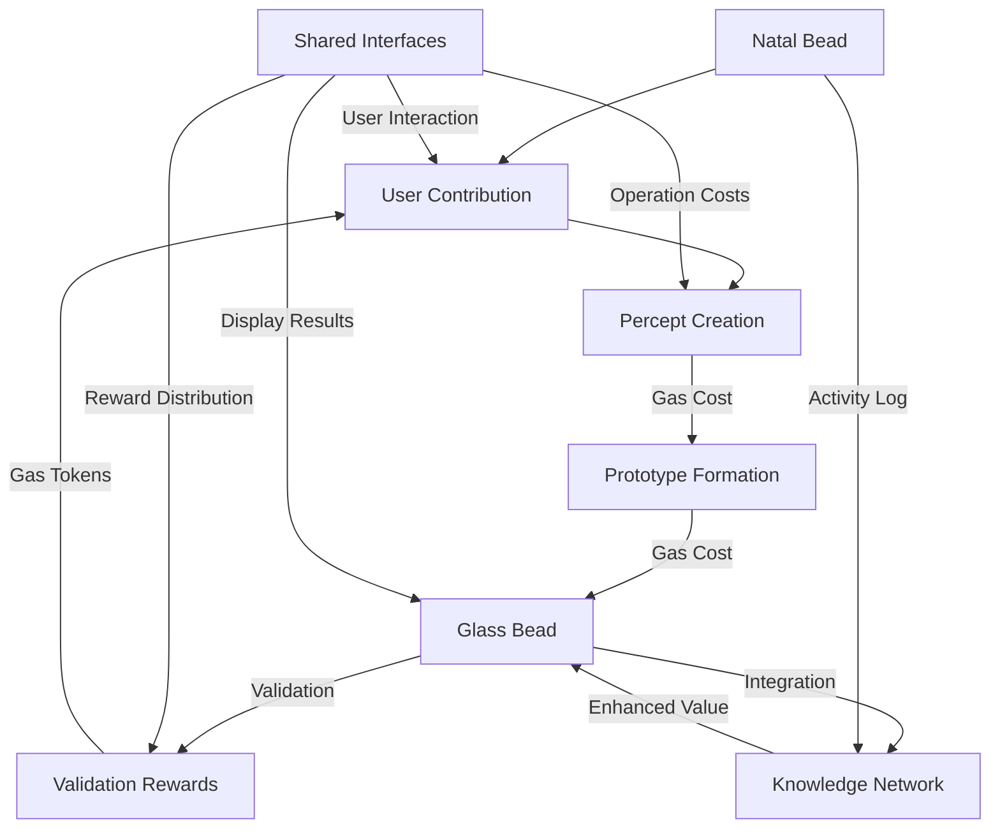

# 2.24. Tokenomics

The Memorativa token economy forms the foundational economic layer that powers all system operations, incentivizes quality contributions, and ensures sustained value creation within the knowledge ecosystem. Tokenomics in Memorativa is not merely a financial mechanism but a cognitive incentive structure designed to align individual contributions with collective knowledge advancement.

This economic framework addresses several critical challenges in knowledge systems: attribution preservation, quality validation, collaborative incentives, computational resource allocation, and long-term sustainability. By tokenizing both knowledge artifacts and system operations, Memorativa creates a self-reinforcing economy where value flows to contributors while maintaining system integrity.

The Memorativa token economy employs a dual token model:

1. **Glass Bead Tokens (GBTk)** - Knowledge artifacts representing verified human thought, implemented as non-fungible SPL tokens with spatial-semantic encoding
2. **Gas Bead Tokens (GBT)** - Utility tokens powering system operations with adaptive pricing based on computational requirements

This dual token approach separates knowledge value (GBTk) from operational utility (GBT), creating distinct but complementary economic flows that support the system's cognitive architecture. The token economy dynamically responds to usage patterns, transit-influenced conditions, and quality metrics to maintain balance while rewarding meaningful contributions.

## Glass Bead Token Economy

Glass Beads represent verified knowledge artifacts in the system:

### Token Types
- Natal Glass Beads (NGB) - Core identity and reference tokens
- Standard Glass Beads (GBTk) - Knowledge artifacts
- Gas Bead Tokens (GBT) - Utility tokens

### Natal Glass Bead Properties
- One-time minting cost: 1000 GBT
- Non-fungible identity token
- Rare transfer capability (500 GBT)
- Activity logging (1 GBT per action)
- Template updates (10-20 GBT)
- Crystal archival storage (50 GBT)
- Required for system participation

### Token Properties
- SPL token standard implementation with multi-layer architecture:
  - Metadata layer (token ID, timestamps, permissions)
  - Data layer (percept-triplet encodings)
  - Reference layer (relationships to other tokens)
- Encapsulates percept-triplets with their three-vector structure (archetypal, expression, mundane)
- Maintains privacy levels and access controls
- Tracks verification scores and temporal states
- Preserves attribution and ownership data
- Supports Merkle tree verification
- Implements Spherical Merkle Tree structure with hybrid spherical-hyperbolic geometry for complex conceptual relationships

### Value Generation
- Created through human conceptual work
- Validated through peer review and system verification
- Enhanced through pattern recognition and synthesis
- Evolved through knowledge development
- Enriched by collaborative refinement

### Token Utility
- Knowledge artifact ownership
- RAG system contribution
- Pattern template creation
- Focus space development
- Book generation
- Collaborative synthesis

## Gas Bead Token Economy

Gas Bead Tokens power all system operations and interface interactions described in [Section 2.20: Shared Interfaces], utilizing the computational architecture detailed in [Section 2.22: Percept Computational Architecture]:

### Core Operations
| Operation Type | Base Cost Range | Description |
|---------------|------------|-------------|
| Vector Encoding | 3-7 GBT | Encoding percepts with well-defined archetypal vectors using (θ, φ, r, κ) coordinate system |
| Angular Calculation | 3-7 GBT | Computing spatial relationships between percepts using hybrid spherical-hyperbolic geometry |
| Focus Space Generation | 10-15 GBT | Creating and organizing conceptual spaces |
| Merkle Proof Verification | 0.1-0.5 GBT | Validating data integrity with angular preservation |
| Zero-Knowledge Operations | 7-12 GBT | Privacy-preserving computations |
| Crystal Storage Encoding | 20-50 GBT | Generating comprehensive knowledge Books |
| RAG System Queries | 5-8 GBT | Finding documents with hybrid aspect filtering |
| Prototype Formation | 10-15 GBT | Creating a new prototype from percept-triplets |
| Time State Operations | 3-6 GBT | Manipulating conceptual time states |
| Natal Bead Creation | 1000 GBT | One-time identity token |
| Natal Bead Transfer | 500 GBT | Identity transfer ritual |
| Natal Template Update | 10-20 GBT | Reference modification |
| Crystal Archival | 50 GBT | 5D storage encoding |
| Multi-Modal Analysis | 12-18 GBT | Processing images alongside text |
| Initial Minting | 15-20 GBT | Creation of new ecosystem assets |
| Percept Creation | 5-10 GBT | Adding new percepts |
| Vector Modification | 3-7 GBT | Changing core vectors |
| Spatial Query | 2-5 GBT | Searching vector space |
| Sun Triplet Definition | 7-12 GBT | Establishing primary concept vector in geocentric structure |
| Planet Triplet Addition | 4-8 GBT | Adding supporting vectors around Sun Triplet |
| Geocentric Aspect Calculation | 3-6 GBT | Computing angular relationships from Earth/Observer perspective |
| Geocentric Coherence Scoring | 5-9 GBT | Measuring pattern alignment from observer perspective |
| Prototype Aggregation | 8-15 GBT | Creating patterns |
| Prototype Refinement | 5-12 GBT | Updating prototype based on feedback |
| Aspect Calculation | 3-7 GBT | Computing angular relationships between triplets |
| Pattern Recognition | 5-8 GBT | Identifying significant patterns within a prototype |
| Prototype Integration | 1-3 GBT | Connecting percepts |
| Contextual Bridging | 2-4 GBT | Maintaining semantic relationships |
| Focus Space Creation | 10-15 GBT | Opening workspaces |
| Book Generation | 20-50 GBT | Synthesizing knowledge |
| Book Creation | 30.0 GBT | +3.0 per chapter | Terminal synthesis creation |
| Book Decomposition | 15.0 GBT | +1.0 per component | Breaking down book structures |
| Recursion Processing | 5.0 GBT | +5.0 per level | Processing recursive book operations |
| Processing Chain | 10.0 GBT | +0.5 per chain node | Running cognitive chains |
| Component Resubmission | 2.0 GBT | +0.2 per component | Submitting book components back to system |
| Cross-Book Analysis | 7.0 GBT | +0.3 per book | Analyzing relationships between books |
| Book Verification | 1.0 GBT | +0.1 per chapter | Verifying book integrity |
| Book Recursion Initialization | 8-12 GBT | Setting up a book to serve as input to the system |
| Recursion Depth Control | 0.5 GBT | +0.5 per allowed level | Configuring maximum recursion depth (default: 64 levels) |
| Recursion Cycle Detection | 3-5 GBT | Tracking Book IDs to prevent infinite loops |
| Recursion Early Termination | 2-4 GBT | Stopping unproductive recursion chains |
| Storage Update | 10-15 GBT | Data modifications requiring verification |
| Merkle Update | 5-10 GBT | Version tree updates |
| Privacy Change | 2-5 GBT | Access control modifications |
| Transfer | 1-3 GBT | Asset transfer between users |
| Attribute Update | 0.5-1 GBT | Minor metadata changes |
| Verification | 0.1-0.5 GBT | Confirming triplet validity |
| Spherical Index Query | 1-2 GBT | Simple retrieval of spatially-related elements |
| MST Full Translation | 15-20 GBT | Complete conversion of percept-triplet to symbolic language with full context |
| MST Cultural Calibration | 10-15 GBT | Adjustment of symbolic references across multiple cultural frameworks |
| MST Archetype Extraction | 7-12 GBT | Identification of universal concepts from astrological symbols |
| MST Context Bridging | 5-8 GBT | Maintaining relationship integrity between original and translated elements |
| MST Basic Lookup | 2-4 GBT | Simple correspondence table access without contextual processing |
| RAG Vector Retrieval | 5-8 GBT | Finding and filtering documents based on both spatial and angular relationships |
| RAG Spatial Context Generation | 7-12 GBT | Creating responses that integrate multiple retrieved documents with their aspect relationships |
| RAG Knowledge Base Update | 4-9 GBT | Adding documents to both spatial clusters and temporal indices with relationship recalculation |
| RAG Merkle Verification | 3-6 GBT | Validating document integrity while preserving angular relationships |
| RAG Aspect Calculation | 2-5 GBT | Computing 3D angles between multiple spherical coordinates |
| RAG Cluster Selection | 1-2 GBT | Finding the nearest cluster to a query point |
| RAG Cache Lookup | 0.1-0.5 GBT | Retrieving pre-calculated angles or verifications from memory |
| Time Vector Addition | 3-6 GBT | Adding a time vector to an existing percept-triplet |
| Mundane State Timestamping | 2-4 GBT | Concrete timestamp assignment |
| Quantum State Manipulation | 5-10 GBT | Operations on indeterminate time states |
| Holographic Reference Creation | 8-12 GBT | Establishing temporal reference frames |
| State Transition | 4-7 GBT | Converting between different time states |
| Temporal Pattern Analysis | 10-15 GBT | Identifying patterns across time states |
| Privacy-Preserving Time Encoding | +50% to base cost | Additional cost for enhanced privacy operations on temporal data |
| Time State Transition (Quantum → Mundane) | 5-8 GBT | Resolving a superposition state to a concrete timestamp |
| Time State Transition (Mundane → Quantum) | 4-6 GBT | Converting a specific timestamp to a probabilistic state |
| Time State Transition (Quantum → Holographic) | 8-12 GBT | Creating reference-based projections from quantum states |
| Time State Transition (Holographic → Quantum) | 7-10 GBT | Converting reference projections back to superposition states |
| Time State Transition (Mundane → Holographic) | 9-14 GBT | Creating reference projections from concrete timestamps |
| Time State Transition (Holographic → Mundane) | 6-9 GBT | Resolving reference-based projections to concrete timestamps |
| Transit-Influenced State Transition | -20% to base cost | Discount applied when transitions are triggered by active transits |
| Multi-State Synchronization | 7-12 GBT | +2.0 per additional state | Maintaining consistency across multiple time states |
| Temporal Coherence Verification | 3-5 GBT | Validating consistency between related time states |
| Create Focus Space | 10 GBT | +0.5 per hierarchy level | Creation of a new focus space workspace |
| Add Prototype to Focus Space | 0.5 GBT | +0.2 per significant relationship | Adding prototypes to focus spaces |
| Modify Aspect Weights | 0.2 GBT | +0.1 per aspect modified | Adjusting aspect relationships in focus spaces |
| Chart Operation | 0.1 GBT | +0.05 per additional chart | Manipulating charts in focus spaces |
| Space Hierarchy Change | 2.0 GBT | +1.0 per level depth changed | Reorganizing focus space structure |
| Share/Collaborate Focus Space | 1.0 GBT | +0.2 per collaborator | Establishing shared focus spaces |
| Export Focus Space to Glass Bead | 3.0 GBT | +1.0 per 100 prototypes | Creating permanent records from focus spaces |
| Merge Focus Spaces | 4.0 GBT | +0.5 per space merged | Combining multiple focus spaces |
| Lens Creation | 25 GBT | +5.0 per dimension | Creating new symbolic frameworks for interpretation |
| Traditional Esoteric Lens Creation | 20-30 GBT | Creating astrological, tarot, or I Ching based symbolic frameworks |
| Scientific & Mathematical Lens Creation | 25-35 GBT | Creating information theory, systems dynamics, or complexity based symbolic frameworks |
| Psychological & Experiential Lens Creation | 22-32 GBT | Creating cognitive frameworks or emotional taxonomy based symbolic frameworks |
| Lens Application | 3 GBT | +0.5 per percept | Transforming data through symbolic lenses |
| Cross-System Pattern Recognition | 2 GBT | +0.2 per pattern element | Identifying patterns across symbolic systems |
| Angular Relationship Update | 1 GBT | +0.1 per relationship | Maintaining symbolic connections between lenses |
| Cross-Lens Synthesis | 5 GBT | +1.0 per lens included | Combining insights from multiple lens perspectives |
| Lens Verification | 0.5 GBT | +0.05 per verification depth | Verifying lens integrity and relationship accuracy |
| Book Thread Creation (Warp) | 5-8 GBT | Establishing thematic dimensions for Book organization |
| Book Thread Creation (Weft) | 5-8 GBT | Creating contextual dimensions for Book organization |
| Warp Thread Processing | 8.0 GBT | +1.0 per node | Processing thematic threads |
| Weft Thread Processing | 6.0 GBT | +0.8 per node | Processing contextual threads |
| Intersection Processing | 3.0 GBT | +0.5 per bead | Processing beads at thread intersections |
| Pattern Recognition | 10.0 GBT | +1.5 per pattern | Cognitive pattern identification |
| Book Bead Positioning | 3-5 GBT | Placing beads at loom intersections in Books |
| Book Pattern Definition | 7-12 GBT | Recognizing and defining reusable Book patterns |
| Book Pattern Application | 2-3 GBT | Reusing established patterns in Books |
| Book Multi-thread Navigation | 0.5-1 GBT | Navigating along threads in Books |
| Book Intersection Analysis | 2-4 GBT | Analyzing relationships at loom intersections |
| Book Loom Visualization | 1-2 GBT | Viewing the loom structure in Books |
| Book Collaborative Weaving | 8-15 GBT | Joint loom work in Books with collaboration discounts |
| Book Loom Template Sharing | 0.1-0.5 GBT | Sharing organizational templates between Books |
| Book Multi-modal Processing | 8-12 GBT | Processing both text and images in Books |
| Book Temporal State Transition | 4-7 GBT | Converting between different time states in Books |
| Book Merkle Verification | 3-6 GBT | Validating Book integrity using Spherical Merkle Trees |
| Book Submission to Cognitive Chain | 5-10 GBT | Submitting Books as inputs to the cognitive chain |
| Book Component Resubmission | 1-3 GBT | Submitting specific Book components back into the system |
| Chart Creation | 8-12 GBT | Creating complex visual representations of prototypes |
| Multi-Chart Analysis | 6-10 GBT | Comparing multiple charts in composite, synastry, or transit views |
| Interactive Manipulation | 4-8 GBT | Real-time updates and transformations of visualizations |
| Aspect Filtering | 2-4 GBT | Dynamic filtering of aspects by type, strength, or significance |
| Export & Sharing | 1-3 GBT | Generating shareable visualization artifacts |
| View-Only Access | 0.5-1 GBT | Passive viewing of existing visualizations |
| Adaptive Learning Operations | 5-10 GBT | Implementing the adaptive learning system for prototype evolution |
| Feedback Collection | 2-4 GBT | Gathering multi-channel feedback from various sources |
| Confidence Calculation | 3-6 GBT | Computing confidence intervals based on feedback consistency |
| Learning Rate Adjustment | 4-7 GBT | Updating learning rates based on confidence and error rates |
| Weight Adjustment | 3-5 GBT | Adjusting verification, temporal, and angular weights |
| Structure Reorganization | 6-9 GBT | Reorganizing prototypes based on aspect patterns |
| Thread Creation | 12-15 GBT | Creating new cognitive threads for knowledge organization |
| Thread Navigation | 1-3 GBT | Traversing established cognitive threads |
| Interface Operation | 0.1-1 GBT | Basic interface interactions supporting all shared interfaces |
| GeoCentric Interface Access | 0.5-2 GBT | Using the geocentric reference model interfaces |
| Multi-Modal Interface Processing | 1-5 GBT | Interface operations for cross-modal content |
| Collaborative Interface Usage | 0.2-2 GBT | Using shared workspace interfaces |
| Temporal Interface Operations | 1-3 GBT | Using time state management interfaces |
| External LLM Processing | 5-15 GBT | Processing content through external LLM providers with privacy controls |
| Multimodal LLM Fusion | 8-18 GBT | Combining text and visual processing through LLM integration |
| Image Generation | 12-24 GBT | Creating images from textual descriptions using diffusion models |
| Visual Concept Extraction | 10-15 GBT | Identifying core visual concepts from images |
| Image Refinement | 7-14 GBT | Improving or modifying existing images |
| Visual Focus Space Creation | 15-30 GBT | Creating visual manifestations of focus spaces |
| Style Transfer | 11-22 GBT | Applying conceptual styles to visual content |
| Visual Prototype Enhancement | 10-20 GBT | Adding visual components to enhance prototype understanding |
| Cross-Modal Integration | 12-18 GBT | Processing both text and images with relationship preservation |

These costs are directly aligned with the computational architecture described in [Section 2.22: Percept Computational Architecture], reflecting the actual computational resources required for each operation in the Vector Space Optimization, Merkle Proof Acceleration, Privacy-Aware Processing, Hybrid Geometry Processing, 5D Crystal Storage Architecture, and Tokenomic Architecture subsystems.

### Reward Structure
| Activity | Reward | Description |
|----------|--------|-------------|
| Quality Percepts | 5-10 GBT | Meaningful contributions |
| Refining Vectors | 3-7 GBT | Vector optimization |
| Prototype Validation | 3-8 GBT | Verification of prototype coherence and integrity |
| Refining Prototype Weights | 3-7 GBT | Meaningful adjustments to prototype weights |
| Book Creation | 20-50 GBT | Knowledge synthesis |
| Content Validation | 0.5-1 GBT | Basic maintenance |
| Focus Space Sharing | 5-15 GBT | Public space creation |
| Knowledge Synthesis | 10-30 GBT | Pattern combination |
| Symbolic Translation | 8-12 GBT | Contributing high-quality symbolic translations |
| Correspondence Tables | 5-10 GBT | Enhancing cross-cultural correspondence tables |
| Translation Validation | 1-3 GBT | Validating symbolic translations |
| Aspect Pattern Analysis | 2-6 GBT | Identifying meaningful aspect patterns in prototypes |
| Contributing Prototype Feedback | 2-5 GBT | Providing useful feedback that improves prototype coherence |
| Sharing Prototypes | 5-15 GBT | When prototypes are reused in others' focus spaces |
| Establishing Temporal Connections | 3-8 GBT | Creating meaningful temporal relationships between concepts |
| Creating Temporal Reference Frames | 5-10 GBT | Developing useful time state reference frameworks |
| Identifying Temporal Patterns | 7-15 GBT | Discovering significant patterns across time states |
| Contributing to Temporal Analysis | 10-25 GBT | Developing or improving temporal analysis algorithms |
| Lens Creation | 15-30 GBT | Creating valuable new symbolic frameworks based on utility and dimensional complexity |
| Cross-System Pattern Discovery | 8-20 GBT | Identifying valuable patterns across different symbolic systems |
| Lens Validation | 3-7 GBT | Verifying lens integrity and relationship accuracy |
| Lens Application Documentation | 5-12 GBT | Documenting practical applications of lens frameworks |
| Collaborative Lens Development | 10-25 GBT | Meaningful collaborative lens creation and refinement |
| Pattern Library Contribution | 2-6 GBT | Adding verified patterns to the community library |
| Book Thread Development | 5-10 GBT | Creating effective thematic or contextual threads for Books |
| Book Pattern Recognition | 5-10 GBT | Identifying reusable organizational patterns in Books |
| Book Loom Template Creation | 8-15 GBT | Developing shareable Book organization templates |
| Book Multi-modal Integration | 10-20 GBT | Successfully integrating text and visual content in Books |
| Book Cognitive Chain Contribution | 10-25 GBT | Books that effectively function in the cognitive chain |
| Book Knowledge Gap Filling | 7-15 GBT | Filling legitimate knowledge gaps in Book structures |
| Book Collaborative Authoring | 15-30 GBT | Successful collaborative Book creation |
| Innovation Premiums | 5-15 GBT | For novel structural patterns that extend the knowledge space |
| Synthesis Bonuses | 8-20 GBT | For effectively connecting previously unrelated structures |
| Temporal Stability Rewards | 5-12 GBT | For structures that maintain relevance across multiple time states |
| Cross-lens Coherence Bonuses | 10-20 GBT | For structures that maintain meaning across different symbolic frameworks |
| Thread Completion Incentives | 5-10 GBT | For filling critical gaps in Book's Virtual Loom patterns |
| Interface Contribution Rewards | 3-10 GBT | For creating useful interface customizations or templates |
| Geocentric Model Enhancement | 5-15 GBT | For improving the geocentric reference model visualization |
| Multi-Modal Integration Rewards | 8-18 GBT | For effective cross-modal content processing contributions |
| Quality Visual Percept | 5-15 GBT | Contributing meaningful visual elements with archetypal significance |
| Visual Prototype Enhancement | 10-20 GBT | Adding visual components that enhance prototype understanding |
| Visual Book Illustration | 15-25 GBT | Creating visual elements that enhance knowledge Books |
| Visual Focus Space Sharing | 5-15 GBT | Making visual focus spaces available to others |
| Cross-modal Association | 8-16 GBT | Establishing meaningful connections between visual and textual concepts |

### Daily Allocation
- Basic activities earn 15-30 GBT
- Active contributors earn 50-100 GBT
- Monthly active users maintain positive flow
- Bonus rewards for first-time operations
- Community rewards for collaboration

### Operations by Cognitive Mode

The operation costs are aligned with the two cognitive modes described in Section 2.23: Gathering Mode and Synthesis Mode.

#### Gathering Mode Operations
| Operation | Cost Range | Description |
|-----------|------------|-------------|
| Percept Creation | 5-10 GBT | Adding new percepts to inner cosmos |
| Vector Encoding | 3-7 GBT | Encoding percepts using (θ, φ, r, κ) coordinate system |
| Sun Triplet Definition | 7-12 GBT | Establishing primary concept vector |
| Planet Triplet Addition | 4-8 GBT | Adding supporting vectors |
| Geocentric Aspect Calculation | 3-6 GBT | Computing angular relationships from observer perspective |
| MST Basic Lookup | 2-4 GBT | Simple correspondence table access |
| Vector Modification | 3-7 GBT | Changing core vectors |
| Spatial Query | 2-5 GBT | Searching vector space |
| Time Vector Addition | 3-6 GBT | Adding time vector to percept-triplet |
| Interface Operation | 0.1-1 GBT | Basic interface interactions |
| Multi-Modal Interface Processing | 1-5 GBT | Cross-modal content operations |
| Image Generation | 12-24 GBT | Creating images from textual descriptions |
| Visual Concept Extraction | 10-15 GBT | Identifying core visual concepts |

#### Synthesis Mode Operations
| Operation | Cost Range | Description |
|-----------|------------|-------------|
| Focus Space Generation | 10-15 GBT | Creating conceptual workspaces |
| Prototype Formation | 10-15 GBT | Creating prototype from percept-triplets |
| Prototype Refinement | 5-12 GBT | Updating prototype based on feedback |
| Geocentric Coherence Scoring | 5-9 GBT | Measuring pattern alignment |
| Book Creation | 30.0 GBT | +3.0 per chapter | Terminal synthesis creation |
| Book Generation | 20-50 GBT | Synthesizing knowledge |
| MST Full Translation | 15-20 GBT | Complete conversion with full context |
| Chart Creation | 8-12 GBT | Creating complex visualizations |
| Lens Application | 3 GBT | +0.5 per percept | Applying symbolic frameworks |
| Cross-System Pattern Recognition | 2 GBT | +0.2 per pattern element | Finding patterns across systems |
| Temporal Pattern Analysis | 10-15 GBT | Identifying patterns across time states |
| Book Recursion Initialization | 8-12 GBT | Setting up Book as system input |
| Adaptive Learning Operations | 5-10 GBT | Implementing learning for evolution |
| Structure Reorganization | 6-9 GBT | Reorganizing based on aspect patterns |

These operations directly support the daily activities in each cognitive mode, with Gathering Mode focused on percept collection and curation, and Synthesis Mode enabling reflective conceptual analysis and knowledge construction.

## Economic Flow


*Figure 1: Memorativa Token Economy Flow Diagram, illustrating the circular flow of value between Natal Beads, User Contributions, and Glass Beads, highlighting how gas costs and rewards create a sustainable economic cycle that incentivizes quality contributions and system engagement*

### Transit-Driven Economic Effects

Daily planetary transits directly influence the token economy through:

1. **Operation Cost Modifiers**
   - Favorable transits (trines, sextiles): 5-15% discount on related operations
   - Challenging transits (squares, oppositions): 5-15% premium on related operations
   - Active transit to Natal Glass Bead: 10-20% discount on personal operations
   - Transit-triggered time state transitions: 20% discount on transition costs

2. **Reward Amplifiers**
   - Contributions during favorable transits: 10-25% reward bonus
   - Challenging transit resolutions: 15-30% reward bonus for quality work
   - Rare transits (outer planet stations): 25-40% bonus for relevant contributions
   - Transit-aligned pattern formation: 15-25% additional rewards

3. **Temporal Window Incentives**
   - Limited-time rewards during specific transit windows
   - Scheduled reward multipliers aligned with significant transits
   - Progressive bonuses for sustained activity during transit sequences
   - Special rewards for eclipse and station-period contributions

4. **Natal Glass Bead Integration**
   - Personalized discount schedule based on natal chart
   - Custom reward profiles tied to personal transits
   - Enhanced bonuses during solar return periods
   - Special operations available only during specific personal transits

These transit-driven economic effects create personalized incentive structures while maintaining system-wide economic balance.

### Value Creation Cycle
1. Users spend Gas Beads to create content through shared interfaces
2. Quality contributions generate Glass Beads
3. Validation activities earn Gas Bead rewards
4. Knowledge synthesis creates additional value
5. Collaboration amplifies token utility
6. Interface interactions facilitate all operations and exchanges

## Collaborative Economics

### Sharing Models
| Model | Gas Cost | Reward | Description |
|-------|----------|---------|-------------|
| Read-Only | 1 GBT/link | 0.1 GBT/viewer | View-only access |
| Full Access | 5 GBT/user | 2 GBT/contribution | Edit permissions |
| Temporary | 3 GBT/hour | Split by metrics | Time-limited access |
| Fork-Merge | 10 GBT fork | 15 GBT merge | Async collaboration |

### Group Rewards
- Collective challenges: 20-50 GBT pool
- Shared discoveries: 15-30 GBT split
- Community validation: 5-15 GBT distributed

### Bonus Multipliers
- Consistent collaboration: 1.5x
- High-quality patterns: 2x
- Novel connections: 1.8x
- Community impact: 1.3x
- Geocentric coherence: 1.7x
- Aspect harmony: 1.4x
- Observer-relative value: 1.5x
- Interface improvement contributions: 1.4x

## System Sustainability

### Economic Balance
- Operation costs offset by rewards
- Quality incentivized through verification
- Collaboration encouraged via multipliers
- Value creation through knowledge synthesis
- Sustainable token velocity maintained
- Interface usage costs aligned with computational complexity

### Token Distribution
- Initial allocation through participation
- Continuous earning through contribution
- Bonus distribution for quality work
- Community rewards for collaboration
- System maintenance incentives

### Value Preservation
- Token burning through operations
- Quality-based scarcity
- Verification requirements
- Privacy-preserved value
- Attribution protection

## Technical Implementation

Gas Bead Tokens utilize the computational architecture described in [Section 2.22: Percept Computational Architecture] to ensure efficient and sustainable operations:

1. **Vector Space Optimization**: Enables efficient encoding of player inputs into percept structures through optimized vector operations
2. **Merkle Proof Acceleration**: Ensures the structural integrity of knowledge artifacts through efficient verification  
3. **Privacy-Aware Processing**: Maintains privacy guarantees through zero-knowledge operations and differential privacy
4. **Hybrid Geometry Processing**: Supports the creation and manipulation of focus spaces through optimized geometric operations
5. **5D Crystal Storage Architecture**: Provides long-term persistence for generated books through optimized crystal encoding
6. **Tokenomic Architecture**: Implements the Gas Bead Token (GBT) system with adaptive pricing based on computational requirements

### Tokenomic Architecture Implementation

The Gas Bead Token system is implemented with these key components:

1. **Gas Cost Optimization**
   - Dynamic pricing based on computational requirements
   - Batch discounts for similar operations
   - Priority allocation for critical operations
   - Resource reservation for planned operations
   - Predictive pricing for common patterns

2. **Tiered Cost Structure**
   - Exploratory tier: 0.1× base cost (drafts, experiments)
   - Development tier: 1.0× base cost (refinement, evolution)
   - Production tier: 10.0× base cost (final artifacts, public sharing)

3. **Adaptive Pricing**
   - Real-time adjustment based on system load
   - Complexity multipliers for resource-intensive operations
   - Privacy premiums for enhanced security operations
   - Volume discounts for batch processing
   - Scale factors for large-scale operations

4. **Resource Allocation**
   - Priority-based scheduling for critical operations
   - Fair queuing for standard operations
   - Resource reservation for predictable patterns
   - Automatic scaling for demand spikes
   - Graceful degradation under extreme load

5. **Advanced Merkle Verification**: Spherical Merkle Trees verify both hierarchical structure and angular relationships with:
   - Angular consistency validation: |θ<sub>claimed</sub> - θ<sub>calculated</sub>| < τ
   - Curvature consistency: |κ<sub>F1</sub>(p) - κ<sub>F2</sub>(p)| < δ

6. **Interface Integration**: Token operations directly support all shared interfaces described in Section 2.20:
   - Input interface interactions for content capture
   - Processing interface operations for knowledge structuring
   - Analysis interface support for pattern recognition
   - Collaboration interface facilitation for shared workspaces
   - Geocentric interface operations for reference model visualization
   - Temporal interface support for time state management
   - Book interface interactions for complex knowledge synthesis

7. **LLM Cost Optimization**: Improves efficiency of LLM operations through:
   - Embedding caching with 40-60% reduction in API calls
   - Tiered retrieval strategy using fast approximate search followed by precise re-ranking
   - Adaptive chunking that adjusts based on semantic coherence
   - Usage-based optimization with pre-caching of frequent queries
   - Batch processing for reduced overhead
   - Provider-specific optimization strategies

8. **Visual Processing Integration**: Supports diffusion model operations with:
    - Angular relationship preservation across modalities
    - Keyword hint systems for cross-modal alignment
    - Observer-centric image generation
    - Verification-weighted visual outputs
    - Privacy-aware visual processing within token economy

## Key Benefits

1. **Dual Token Synergy**
   - Glass Beads capture knowledge value
   - Gas Beads enable system operation
   - Combined utility drives engagement
   - Balanced economic incentives
   - Sustainable token velocity

2. **Quality Incentives**
   - Verification-based rewards
   - Pattern quality multipliers
   - Collaboration bonuses
   - Community validation
   - Attribution preservation

3. **Economic Sustainability**
   - Balanced cost structure
   - Multiple earning paths
   - Value preservation mechanics
   - Collaboration incentives
   - System maintenance rewards

4. **Growth Mechanics**
   - Knowledge network effects
   - Collaborative amplification
   - Pattern evolution value
   - Synthesis opportunities
   - Community development

5. **Interface Facilitation**
   - Token operations support all interface interactions
   - Cost structure reflects computational complexity of interface operations
   - Reward system incentivizes high-quality interface usage
   - Token burning through interface operations maintains scarcity
   - Interface contributions rewarded through bonus multipliers

## Macro-Economic Framework

### 1. Token Supply & Issuance

#### Gas Bead Tokens (GBT)
- **Initial Supply**: 100 million GBT
- **Supply Model**: Semi-inflationary with balanced burn mechanisms
- **Inflation Rate**: 4% annual target (adjusted dynamically based on system activity)
- **Issuance Schedule**: 
  - 20% allocated to founders/core team (4-year vesting)
  - 15% for early backers/investors (staged releases)
  - 15% kept in Treasury for ecosystem development
  - 50% for system rewards and user acquisition

#### Glass Bead Tokens (GBTk)
- **Supply Model**: Dynamically minted based on knowledge creation
- **Pricing Tiers**: 
  - Standard Glass Beads: 15-20 GBT base minting cost
  - Verified Knowledge Beads: 25-40 GBT (higher verification scores)
  - Master Pattern Beads: 50-100 GBT (complex pattern recognition)
- **Uniqueness**: Each Glass Bead has unique spatial coordinates and verification signatures

#### Natal Glass Beads (NGB)
- **Supply Cap**: 1 per user identity
- **Minting Cost**: 1000 GBT one-time fee
- **Transfer Limits**: Rare transfer capability costing 500 GBT

### 2. Circulation & Velocity

#### Burn Mechanisms
- **Operation Costs**: All system operations burn GBT (detailed in cost tables)
- **Progressive Burning**: Higher-tier operations burn more GBT
- **Verification Burns**: 5% of verification costs permanently removed from circulation
- **Feature Unlocks**: Premium features require additional GBT burning

#### Dynamic Flow Controls
- **Velocity Dampers**: System slows token velocity during high-demand periods
- **Anti-inflation Measures**: 
  - Algorithmic burning increases with total supply growth
  - Treasury absorbs excess circulation during low-demand periods
  - Operation costs adjust based on network congestion (5-20% variability)

#### Balance Controls
- **Daily Reward Caps**: Individual users limited to earning 200-500 GBT daily
- **Reward Adjustments**: Algorithmic reward scaling based on ecosystem participation
- **Automated Stabilizers**: Treasury interventions during severe imbalances

### 3. Exchange Mechanisms

#### Internal Exchange
- **P2P Market**: Direct exchange of GBT and Glass Beads between users
- **Pricing Discovery**: Auction system for unique Glass Beads
- **Fee Structure**: 
  - 1.5% on all internal exchanges
  - 50% of fees burned
  - 50% to system Treasury

#### External Integrations
- **Blockchain Integration**: Solana-based cross-chain bridge for external liquidity
- **Exchange Listings**: Specialized knowledge economy exchanges
- **Conversion Rates**: Oracle-driven pricing for external conversions

#### Content Marketplace
- **Pattern Licensing**: License valuable patterns for GBT fees
- **Book Publishing**: Monetize Books through GBT licensing
- **Template Trading**: Premium templates exchanged for GBT

### 4. Staking Mechanisms

#### Knowledge Staking
- **Prototype Staking**: Lock Glass Beads into prototypes for rewards
- **Verification Staking**: Stake on verification outcomes
- **Pattern Staking**: Stake GBT on pattern recognition success

#### Liquidity Provisions
- **Focus Space Liquidity**: Provide GBT liquidity to focus spaces
- **Collaboration Pools**: Joint staking for collaborative work
- **Duration Bonuses**: Rewards increase with stake duration

#### Governance Staking
- **Proposal Staking**: 500-5000 GBT to submit governance proposals
- **Voting Power**: Proportional to GBT staked
- **Validator Staking**: 50,000+ GBT to operate verification nodes

### 5. Economic Incentive Alignment

#### Quality-Driven Rewards
- **Verification Premium**: Higher verification scores earn 30-100% reward boost
- **Coherence Multipliers**: Well-formed patterns receive 20-50% more rewards
- **Synthesis Bonuses**: Connect disparate knowledge for 25-75% bonuses

#### Collaboration Economics
- **Skill Synergy**: Complementary skill collaborations receive 15-30% bonus
- **Scale Effects**: Larger collaborations unlock progressive discounts (5-25%)
- **Network Amplifiers**: Contributions that expand the network receive multipliers

#### Temporal Value Mechanisms
- **Value Appreciation**: Glass Beads gain value based on usage and references
- **Decay Prevention**: Regular use/verification prevents value degradation
- **Historical Premium**: Proven knowledge artifacts appreciate 5-10% annually

### 6. Reputation Economy

#### Trust Metrics
- **Verification History**: Impacts reward multipliers (0.8-1.5x)
- **Contribution Quality**: Affects operation costs (±20%)
- **Network Value Added**: Determines priority in reward distribution

#### Roles & Privileges
- **Content Creator**: Standard rewards for basic contributions
- **Pattern Recognizer**: Enhanced rewards for identifying connections
- **Verifier**: Special rewards for quality verification
- **Synthesizer**: Premium rewards for effective knowledge integration
- **Lens Maker**: Specialized rewards for creating interpretive frameworks

#### Reputation Staking
- **Verification Endorsements**: Stake reputation on verification outcomes
- **Certification Authority**: High-reputation users certify content
- **Expert Domains**: Establish authority in specific knowledge areas

### 7. Advanced Economic Mechanisms

#### DAO Treasury Management
- **Treasury Allocation**: Community-driven investment in system development
- **Reward Pool Management**: Dynamic allocation to incentivize underserved areas
- **Economic Balancing**: Algorithmic interventions to maintain token equilibrium

#### Knowledge Derivatives
- **Future Contracts**: Stake on emerging knowledge patterns
- **Verification Insurance**: Hedge against verification challenges
- **Pattern Options**: Rights to build on established patterns

#### Temporal Rewards Modulation
- **Transit-Aligned Rewards**: Enhanced rewards during favorable transits (10-40%)
- **Seasonal Activities**: Special rewards for solstice/equinox contributions
- **Retrograde Discounts**: Operation cost reductions during challenging transits

### 8. Technical Implementation

#### SPL Token Integration
- **Solana Program Library**: Efficient, low-cost token operations
- **Merkle-Verified Transactions**: Ensures data integrity with minimal overhead
- **Zero-Knowledge Proofs**: Privacy-preserving transaction verification

#### Multi-Chain Strategy
- **Core Operations**: Solana-based for efficiency and throughput
- **Cross-Chain Bridges**: Ethereum, Cosmos, and other ecosystem connections
- **Layer-2 Solutions**: For high-frequency, low-value transactions

#### Smart Contract Architecture
- **Automatic Reward Distribution**: Algorithm-driven reward allocation
- **Programmable Escrow**: For collaboration and verification
- **Self-Executing Agreements**: For knowledge licensing and pattern usage

## Key Tokenomics Principles

1. **Knowledge Value Capture**: The economy effectively captures and rewards valuable human knowledge contributions

2. **Sustainable Economics**: Balanced inflation/burn mechanisms create long-term viability

3. **Quality Incentives**: Economic rewards directly proportional to contribution quality

4. **Collaborative Amplification**: Economic benefits multiply through effective collaboration

5. **Temporal Alignment**: Transit-influenced rewards create natural economic cycles

6. **Scalable Structure**: Economy scales efficiently with network growth

7. **Governance Integration**: Token utility extends to system governance

8. **Privacy Preservation**: Economic activity maintains knowledge privacy when needed

This framework builds upon the operational costs and rewards already defined, creating a comprehensive token economy that supports Memorativa's knowledge ecosystem.


## Key points

1. **Dual Token Architecture**
   - Glass Beads represent verified knowledge artifacts
   - Gas Beads power system operations
   - Complementary token utilities create sustainable economy
   - Clear value flows between token types
   - Balanced incentive structures

2. **Economic Mechanisms**
   - Operation costs range from 1-100 GBT
   - Daily rewards of 15-100 GBT for active users
   - Multipliers for quality and collaboration
   - Token burning through system operations
   - Value preservation through scarcity

3. **Collaborative Framework**
   - Multiple sharing models with defined costs/rewards
   - Group rewards for collective achievements
   - Bonus multipliers for sustained collaboration
   - Fair attribution and reward distribution
   - Privacy-preserved transactions

4. **Value Generation**
   - Human conceptual work creates Glass Beads
   - System operations consume Gas Beads
   - Quality validation enhances token value
   - Knowledge synthesis compounds worth
   - Network effects amplify utility

5. **System Sustainability**
   - Self-balancing token velocity
   - Quality-driven scarcity
   - Multiple earning pathways
   - Collaborative incentives
   - Long-term value preservation

6. **Technical Foundation**
   - SPL token standard implementation
   - Multi-layer token architecture
   - Hybrid spherical-hyperbolic spatial encoding
   - Observer-relative processing for relationships
   - Merkle-based verification with angular preservation
   - Efficient resource allocation for system operations

7. **Interface Integration**
   - Token operations fully support all shared interfaces
   - Cost structure aligns with interface computational requirements
   - Reward system incentivizes quality interface usage
   - Collaboration interfaces supported through token mechanics
   - Multi-modal interface operations enabled through token economy

The tokenomics model establishes a sustainable knowledge economy that:
- Rewards quality human contributions
- Enables efficient system operations
- Encourages collaborative development
- Preserves privacy and attribution
- Supports continuous growth
- Maintains economic balance
- Facilitates all interface interactions

## Key Math

- **Glass Bead Value Function**: The value of a Glass Bead token is calculated as:
  $V_{GBTk} = \beta \cdot (Q \cdot C \cdot R \cdot T)$
  
  Where:
  - $\beta$ is the base value coefficient (system parameter)
  - $Q$ is the quality score (verification rating from 0.1 to 2.0)
  - $C$ is the connection factor (1 + 0.05n where n = number of references)
  - $R$ is the reuse factor (1 + 0.1u where u = utilization count)
  - $T$ is the time factor ($1 + \log_{10}(d + 1)$ where d = days since creation)

### Adaptive Pricing

- **Gas Bead Operation Cost**: The actual cost of an operation is dynamically calculated as:
  $C_{op} = C_{base} \cdot L \cdot P \cdot T \cdot D$
  
  Where:
  - $C_{base}$ is the base cost from the operation tables
  - $L$ is the system load factor (0.8 to 1.5)
  - $P$ is the privacy premium (1.0 to 1.5 based on privacy requirements)
  - $T$ is the transit modifier (0.85 to 1.15 based on planetary transits)
  - $D$ is the depth modifier (1.0 + 0.05d where d = recursive depth)

### Transit Modifiers

- **Transit Discount Function**: The discount applied during favorable transits:
  $D_{transit} = 1 - (0.05 + 0.01 \cdot h \cdot a)$
  
  Where:
  - $h$ is the transit harmony score (0 to 10)
  - $a$ is the aspect strength (0 to 1)

- **Transit Premium Function**: The premium applied during challenging transits:
  $P_{transit} = 1 + (0.05 + 0.01 \cdot c \cdot a)$
  
  Where:
  - $c$ is the transit challenge score (0 to 10)
  - $a$ is the aspect strength (0 to 1)

### Reward Calculations

- **Base Reward Function**: The base reward for contributions:
  $R_{base} = \alpha \cdot Q \cdot E$
  
  Where:
  - $\alpha$ is the base reward coefficient (system parameter)
  - $Q$ is the quality score (0.1 to 2.0)
  - $E$ is the effort factor (estimated computational/cognitive effort)

- **Collaboration Multiplier**: The reward multiplier for collaborative work:
  $M_{collab} = 1 + (\frac{n-1}{10} \cdot \frac{S_d}{S_{max}})$
  
  Where:
  - $n$ is the number of collaborators
  - $S_d$ is the skill diversity score
  - $S_{max}$ is the maximum possible skill diversity

### Economic Equilibrium

- **Token Velocity Equation**: The circulation velocity of Gas Bead Tokens:
  $V_{GBT} = \frac{T \cdot P}{M}$
  
  Where:
  - $T$ is the transaction volume
  - $P$ is the average operation price
  - $M$ is the monetary supply of GBT

- **Sustainable Supply Growth**: The target supply growth rate is calculated as:
  $g_{target} = \max(0, \min(0.04, \frac{U_g - U_c}{U_c} \cdot k))$
  
  Where:
  - $U_g$ is the user growth rate
  - $U_c$ is the current user base
  - $k$ is an adjustment coefficient (typically 0.5)
  - 0.04 represents the 4% annual inflation cap

### Merkle Verification Mathematics

- **Angular Consistency Validation**: For verifying integrity of angular relationships:
  $|\theta_{claimed} - \theta_{calculated}| < \tau$
  
  Where:
  - $\theta_{claimed}$ is the claimed angle between concepts
  - $\theta_{calculated}$ is the computed angle
  - $\tau$ is the tolerance threshold

- **Curvature Consistency**: For concepts across different reference frames:
  $|\kappa_{F1}(p) - \kappa_{F2}(p)| < \delta$
  
  Where:
  - $\kappa_{F1}(p)$ is the curvature of percept p in frame F1
  - $\kappa_{F2}(p)$ is the curvature of the same percept in frame F2
  - $\delta$ is the allowable difference threshold

### Spherical-Hyperbolic Coordinate System

- **Percept Vector Encoding**: Each percept is encoded using spherical-hyperbolic coordinates:
  $(θ, φ, r, κ)$
  
  Where:
  - $θ$ is the azimuthal angle (0 to 2π)
  - $φ$ is the polar angle (0 to π)
  - $r$ is the radial distance
  - $κ$ is the curvature parameter

- **Angular Relation Between Percepts**: The effective angle between percepts p₁ and p₂:
  $\Theta_{eff}(p_1, p_2) = \cos^{-1}(\sin φ_1 \sin φ_2 \cos(θ_1 - θ_2) + \cos φ_1 \cos φ_2) \cdot f(κ_1, κ_2)$
  
  Where:
  - $f(κ_1, κ_2)$ is a curvature adjustment function

## Code Examples

### Adaptive Pricing System Implementation

The following code examples demonstrate the implementation of the Gas Bead Token (GBT) operation cost calculation system, which is central to the tokenomics model.

#### Conceptual Pseudocode

```
// Calculates the final cost of an operation based on various modifiers
function CalculateOperationCost(operationType, userData, systemState):
    // Step 1: Retrieve base cost from operation tables
    baseCost = GetBaseOperationCost(operationType)
    
    // Step 2: Calculate system load factor based on current usage
    loadFactor = CalculateSystemLoad(systemState.currentLoad, systemState.capacity)
    
    // Step 3: Determine privacy premium based on operation requirements
    privacyPremium = DeterminePrivacyPremium(operationType, userData.privacyLevel)
    
    // Step 4: Calculate transit modifiers based on current planetary positions
    transitModifier = CalculateTransitModifier(userData.natalChart, systemState.currentTransits)
    
    // Step 5: Calculate recursive depth modifier if applicable
    depthModifier = 1.0
    if HasRecursiveDepth(operationType):
        depthModifier = 1.0 + (0.05 * operationType.recursiveDepth)
    
    // Step 6: Apply all modifiers to calculate final cost
    finalCost = baseCost * loadFactor * privacyPremium * transitModifier * depthModifier
    
    // Step 7: Apply any special discounts (e.g., first-time operations)
    if IsEligibleForDiscount(userData, operationType):
        finalCost = ApplyDiscount(finalCost, GetDiscountRate(userData, operationType))
    
    // Return the final rounded cost with a minimum of 0.1 GBT
    return Max(0.1, Round(finalCost, 1))
```

#### Implementation Example (TypeScript)

```typescript
/**
 * Gas Bead Token Operation Cost Calculator
 * 
 * This module implements the dynamic pricing system for the Memorativa tokenomics model,
 * calculating the final GBT cost for operations based on multiple contextual factors.
 */
 
// Operation cost configuration interface
interface OperationCostConfig {
  baseRate: number;           // Base GBT cost from operation tables
  privacyMultiplier: boolean; // Whether operation is subject to privacy premium
  recursionTracking: boolean; // Whether operation depth affects cost
  transitSensitive: boolean;  // Whether operation is affected by planetary transits
  operationCategory: string;  // Category used for transit calculations
}

// User context interface
interface UserContext {
  natalChart: NatalChart;        // User's natal astrological chart
  privacyPreference: number;     // User's privacy level (0-1)
  operationHistory: Map<string, number>; // History of operations performed
}

// System state interface
interface SystemState {
  currentLoad: number;       // Current system load (0-1)
  capacityUtilization: number; // Overall capacity utilization (0-1)
  currentTransits: Transit[]; // Current planetary transit aspects
}

/**
 * Main function to calculate the final operation cost
 * @param operationType - Type of operation being performed
 * @param config - Cost configuration for this operation
 * @param userContext - User's context including natal chart
 * @param systemState - Current system state
 * @returns Final operation cost in GBT
 */
export function calculateOperationCost(
  operationType: string,
  config: OperationCostConfig,
  userContext: UserContext,
  systemState: SystemState,
  recursionDepth: number = 0
): number {
  // Step 1: Start with base cost
  let cost = config.baseRate;
  
  // Step 2: Apply system load factor (ranges from 0.8 to 1.5)
  const loadFactor = calculateLoadFactor(systemState);
  cost *= loadFactor;
  
  // Step 3: Apply privacy premium if applicable (ranges from 1.0 to 1.5)
  if (config.privacyMultiplier) {
    const privacyPremium = calculatePrivacyPremium(userContext.privacyPreference);
    cost *= privacyPremium;
  }
  
  // Step 4: Apply transit modifiers if applicable (ranges from 0.85 to 1.15)
  if (config.transitSensitive) {
    const transitModifier = calculateTransitModifier(
      userContext.natalChart,
      systemState.currentTransits,
      config.operationCategory
    );
    cost *= transitModifier;
  }
  
  // Step 5: Apply recursion depth modifier if applicable
  if (config.recursionTracking && recursionDepth > 0) {
    const depthModifier = 1.0 + (0.05 * recursionDepth);
    cost *= depthModifier;
  }
  
  // Step 6: Apply any first-time operation discounts
  if (!userContext.operationHistory.has(operationType)) {
    cost *= 0.8; // 20% discount for first-time operations
  }
  
  // Ensure minimum cost of 0.1 GBT
  return Math.max(0.1, Math.round(cost * 10) / 10);
}

/**
 * Calculate the system load factor based on current load
 * @param systemState - Current system state
 * @returns Load factor multiplier (0.8-1.5)
 */
function calculateLoadFactor(systemState: SystemState): number {
  // When system is under low load (<30%), provide a discount
  if (systemState.currentLoad < 0.3) {
    return 0.8 + (systemState.currentLoad / 0.3) * 0.2;
  }
  
  // Linear scaling between 30% and 70% load (1.0-1.2)
  if (systemState.currentLoad < 0.7) {
    return 1.0 + ((systemState.currentLoad - 0.3) / 0.4) * 0.2;
  }
  
  // Exponential scaling for high load (1.2-1.5)
  const highLoadPortion = (systemState.currentLoad - 0.7) / 0.3;
  return 1.2 + Math.pow(highLoadPortion, 2) * 0.3;
}

/**
 * Calculate the privacy premium based on user preference
 * @param privacyLevel - User's privacy preference (0-1)
 * @returns Privacy premium multiplier (1.0-1.5)
 */
function calculatePrivacyPremium(privacyLevel: number): number {
  // Linear scaling from 1.0 (no privacy) to 1.5 (maximum privacy)
  return 1.0 + (privacyLevel * 0.5);
}

/**
 * Calculate transit modifier based on planetary positions
 * @param natalChart - User's natal chart
 * @param currentTransits - Current planetary transits
 * @param operationCategory - Category of operation for aspect relevance
 * @returns Transit modifier (0.85-1.15)
 */
function calculateTransitModifier(
  natalChart: NatalChart,
  currentTransits: Transit[],
  operationCategory: string
): number {
  let harmonicScore = 0;
  let challengeScore = 0;
  let totalRelevantAspects = 0;
  
  // Calculate harmonic and challenging aspects
  for (const transit of currentTransits) {
    // Skip transits not relevant to this operation category
    if (!isTransitRelevantToCategory(transit, operationCategory)) {
      continue;
    }
    
    const aspectStrength = calculateAspectStrength(transit);
    totalRelevantAspects++;
    
    if (isHarmonicAspect(transit.aspectType)) {
      harmonicScore += aspectStrength * getHarmonyScore(transit.aspectType);
    } else if (isChallengingAspect(transit.aspectType)) {
      challengeScore += aspectStrength * getChallengeScore(transit.aspectType);
    }
  }
  
  // No relevant transits
  if (totalRelevantAspects === 0) {
    return 1.0;
  }
  
  // Calculate discount for harmonious transits
  const harmonicDiscount = totalRelevantAspects > 0 
    ? 0.05 + 0.01 * (harmonicScore / totalRelevantAspects)
    : 0;
    
  // Calculate premium for challenging transits
  const challengePremium = totalRelevantAspects > 0
    ? 0.05 + 0.01 * (challengeScore / totalRelevantAspects)
    : 0;
    
  // Final modifier combines both effects (capped at 0.85-1.15 range)
  return Math.min(1.15, Math.max(0.85, 1.0 - harmonicDiscount + challengePremium));
}

/**
 * Helper functions for transit calculations
 */
function isHarmonicAspect(aspectType: string): boolean {
  return ['trine', 'sextile', 'conjunction'].includes(aspectType);
}

function isChallengingAspect(aspectType: string): boolean {
  return ['square', 'opposition', 'quincunx'].includes(aspectType);
}

function getHarmonyScore(aspectType: string): number {
  const scores = {
    'trine': 10,      // 120° - most harmonious
    'sextile': 8,     // 60° - moderately harmonious
    'conjunction': 5  // 0° - depends on planets involved
  };
  return scores[aspectType] || 0;
}

function getChallengeScore(aspectType: string): number {
  const scores = {
    'opposition': 10, // 180° - most challenging
    'square': 8,      // 90° - moderately challenging
    'quincunx': 5     // 150° - minor irritation
  };
  return scores[aspectType] || 0;
}

function calculateAspectStrength(transit: Transit): number {
  // Calculate aspect strength based on orb (closeness to exact aspect)
  // Returns value between 0 and 1
  const maxOrb = getMaxOrbForAspect(transit.aspectType);
  const strength = 1 - (Math.abs(transit.orb) / maxOrb);
  return Math.max(0, Math.min(1, strength));
}

function isTransitRelevantToCategory(transit: Transit, category: string): boolean {
  // Determine if a particular transit affects a specific operation category
  // Using a mapping from planet/aspect combinations to operation categories
  const relevanceMappings = {
    'mercury': ['communication', 'data_processing', 'pattern_recognition'],
    'venus': ['valuation', 'collaboration', 'lens_creation'],
    'mars': ['vector_encoding', 'spatial_operations', 'merkle_verification'],
    'jupiter': ['knowledge_synthesis', 'book_generation', 'pattern_expansion'],
    'saturn': ['verification', 'structure_organization', 'time_operations'],
    'uranus': ['prototype_formation', 'innovation', 'recursion'],
    'neptune': ['privacy_operations', 'symbolic_translation', 'holographic_reference'],
    'pluto': ['transformation', 'deep_pattern', 'crystal_storage']
  };
  
  return relevanceMappings[transit.planet]?.includes(category) || false;
}

function getMaxOrbForAspect(aspectType: string): number {
  // Define the maximum orb (allowable deviation) for different aspect types
  const maxOrbs = {
    'conjunction': 10,
    'opposition': 10,
    'trine': 8,
    'square': 8,
    'sextile': 6,
    'quincunx': 3
  };
  return maxOrbs[aspectType] || 5;
}
```

### Key Design Considerations

- The implementation uses a modular approach to separate different pricing factors
- Dynamic pricing factors reflect both system conditions and user-specific contexts
- Transit calculations incorporate astrological principles while maintaining computational efficiency
- The system maintains a 0.85-1.15 range for transit modifiers to ensure predictable costs
- Time complexity: O(n) where n is the number of relevant transits
- Space complexity: O(1) for the calculation itself (excluding input data structures)

### Glass Bead Token Value System

The following code examples demonstrate the implementation of the Glass Bead Token (GBTk) value calculation system, which determines the economic value of knowledge artifacts in the Memorativa ecosystem.

#### Conceptual Pseudocode

```
// Calculates the value of a Glass Bead Token based on its properties
function CalculateGlassBeadValue(glassBeadId, tokenMetadata, systemParameters):
    // Step 1: Retrieve the base token data
    tokenData = GetGlassBeadData(glassBeadId)
    
    // Step 2: Calculate quality score based on verification ratings
    qualityScore = CalculateQualityScore(tokenData.verificationRatings)
    
    // Step 3: Calculate connection factor based on references
    connectionCount = CountReferences(tokenData.references)
    connectionFactor = 1.0 + (0.05 * connectionCount)
    
    // Step 4: Calculate reuse factor based on utilization
    utilizationCount = CountUtilizations(glassBeadId)
    reuseFactor = 1.0 + (0.1 * utilizationCount)
    
    // Step 5: Calculate time factor based on age
    daysSinceCreation = CalculateDaysSince(tokenData.creationTimestamp)
    timeFactor = 1.0 + log10(daysSinceCreation + 1)
    
    // Step 6: Multiply all factors by the base coefficient
    baseCoefficient = systemParameters.glassBeadBaseValue
    tokenValue = baseCoefficient * qualityScore * connectionFactor * reuseFactor * timeFactor
    
    // Step 7: Apply any special modifiers based on token category
    if HasSpecialCategory(tokenData.category):
        categoryMultiplier = GetCategoryMultiplier(tokenData.category)
        tokenValue *= categoryMultiplier
    
    return tokenValue
```

#### Implementation Example (TypeScript)

```typescript
/**
 * Glass Bead Token Value Calculator
 * 
 * This module implements the value calculation system for Glass Bead Tokens (GBTk),
 * determining the economic value of knowledge artifacts based on multiple factors.
 */

// Glass Bead Token metadata interface
interface GlassBeadMetadata {
  id: string;                       // Unique identifier
  creationTimestamp: number;        // Unix timestamp of creation
  verificationRatings: Rating[];    // Array of verification ratings
  references: Reference[];          // References to other Glass Beads
  utilizations: Utilization[];      // Records of token utilization
  category: string;                 // Knowledge category
  attributions: Attribution[];      // Creator and contributor attributions
  privacyLevel: number;             // Privacy setting (0-1)
  spatialCoordinates: SpatialCoordinate; // Position in concept space
}

// Verification rating interface
interface Rating {
  verifierId: string;               // ID of the verifier
  score: number;                    // Rating score (0.1-2.0)
  timestamp: number;                // When verification occurred
  weight: number;                   // Verifier's weight/authority (0-1)
  dimension: string;                // What aspect was verified
}

// Reference to another Glass Bead
interface Reference {
  targetId: string;                 // ID of referenced bead
  relationshipType: string;         // Type of relationship
  strength: number;                 // Strength of connection (0-1)
  direction: 'inbound' | 'outbound' | 'bidirectional';
}

// Record of token utilization
interface Utilization {
  contextId: string;                // Where the token was used
  utilizationType: string;          // How the token was used
  timestamp: number;                // When the token was used
  contributionValue: number;        // Value added in this context
}

// System parameters interface
interface SystemParameters {
  glassBeadBaseValue: number;       // Base value coefficient (β)
  qualityScoreWeights: {            // Weights for different verification dimensions
    coherence: number;
    novelty: number;
    utility: number;
    clarity: number;
    [key: string]: number;
  };
  categoryMultipliers: {            // Value multipliers for different categories
    [category: string]: number;
  };
  timeDecayFactor: number;          // How quickly verification ratings decay
  maxVerificationAge: number;       // Maximum age for verification relevance
}

/**
 * Calculate the economic value of a Glass Bead Token
 * @param metadata - The Glass Bead Token metadata
 * @param parameters - System parameters for value calculation
 * @param currentTimestamp - Current Unix timestamp
 * @returns The calculated token value in GBT equivalent
 */
export function calculateGlassBeadValue(
  metadata: GlassBeadMetadata,
  parameters: SystemParameters,
  currentTimestamp: number
): number {
  // Step 1: Calculate quality score (verification rating)
  const qualityScore = calculateQualityScore(
    metadata.verificationRatings,
    parameters.qualityScoreWeights,
    parameters.timeDecayFactor,
    currentTimestamp,
    parameters.maxVerificationAge
  );
  
  // Step 2: Calculate connection factor
  const connectionFactor = calculateConnectionFactor(metadata.references);
  
  // Step 3: Calculate reuse factor
  const reuseFactor = calculateReuseFactor(metadata.utilizations);
  
  // Step 4: Calculate time factor
  const timeFactor = calculateTimeFactor(metadata.creationTimestamp, currentTimestamp);
  
  // Step 5: Calculate base value
  let value = parameters.glassBeadBaseValue * qualityScore * connectionFactor * reuseFactor * timeFactor;
  
  // Step 6: Apply category multiplier if applicable
  if (parameters.categoryMultipliers[metadata.category]) {
    value *= parameters.categoryMultipliers[metadata.category];
  }
  
  // Step 7: Apply attribution factor based on contributor diversity
  const attributionFactor = calculateAttributionFactor(metadata.attributions);
  value *= attributionFactor;
  
  // Round to 3 decimal places to prevent float precision issues
  return Math.round(value * 1000) / 1000;
}

/**
 * Calculate quality score based on verification ratings
 * @param ratings - Array of verification ratings
 * @param weights - Weights for different verification dimensions
 * @param decayFactor - How quickly ratings decay with time
 * @param currentTimestamp - Current Unix timestamp
 * @param maxAge - Maximum age for verification relevance
 * @returns Quality score between 0.1 and 2.0
 */
function calculateQualityScore(
  ratings: Rating[],
  weights: {[key: string]: number},
  decayFactor: number,
  currentTimestamp: number,
  maxAge: number
): number {
  if (ratings.length === 0) {
    return 0.1; // Minimum quality score for unverified beads
  }
  
  let weightedSum = 0;
  let totalWeight = 0;
  
  for (const rating of ratings) {
    // Skip ratings that are too old
    const ageInDays = (currentTimestamp - rating.timestamp) / (24 * 60 * 60);
    if (ageInDays > maxAge) {
      continue;
    }
    
    // Calculate time decay factor
    const timeFactor = Math.exp(-decayFactor * ageInDays / maxAge);
    
    // Get dimension weight (default to 1.0 if not specified)
    const dimensionWeight = weights[rating.dimension] || 1.0;
    
    // Calculate effective weight
    const effectiveWeight = rating.weight * dimensionWeight * timeFactor;
    
    // Add to weighted sum
    weightedSum += rating.score * effectiveWeight;
    totalWeight += effectiveWeight;
  }
  
  // If all ratings were too old, return minimum score
  if (totalWeight === 0) {
    return 0.1;
  }
  
  // Calculate average score and clamp between 0.1 and 2.0
  const averageScore = weightedSum / totalWeight;
  return Math.max(0.1, Math.min(2.0, averageScore));
}

/**
 * Calculate connection factor based on references
 * @param references - Array of references to other Glass Beads
 * @returns Connection factor (1 + 0.05n)
 */
function calculateConnectionFactor(references: Reference[]): number {
  // Count unique reference targets (to prevent gaming the system)
  const uniqueTargets = new Set(references.map(ref => ref.targetId));
  return 1.0 + (0.05 * uniqueTargets.size);
}

/**
 * Calculate reuse factor based on utilization
 * @param utilizations - Array of token utilization records
 * @returns Reuse factor (1 + 0.1u)
 */
function calculateReuseFactor(utilizations: Utilization[]): number {
  // Count unique utilization contexts
  const uniqueContexts = new Set(utilizations.map(util => util.contextId));
  return 1.0 + (0.1 * uniqueContexts.size);
}

/**
 * Calculate time factor based on token age
 * @param creationTimestamp - Token creation Unix timestamp
 * @param currentTimestamp - Current Unix timestamp
 * @returns Time factor (1 + log10(d + 1))
 */
function calculateTimeFactor(creationTimestamp: number, currentTimestamp: number): number {
  // Calculate age in days
  const ageInDays = Math.max(0, (currentTimestamp - creationTimestamp) / (24 * 60 * 60));
  // Apply log10 function with offset to ensure positive values
  return 1.0 + Math.log10(ageInDays + 1);
}

/**
 * Calculate attribution factor based on contributor diversity
 * @param attributions - Array of creator and contributor attributions
 * @returns Attribution factor multiplier
 */
function calculateAttributionFactor(attributions: Attribution[]): number {
  // Start with base factor
  const baseFactor = 1.0;
  
  // Count unique contributors
  const uniqueContributors = new Set(attributions.map(attr => attr.contributorId));
  
  // Apply small boost for collaborative work
  if (uniqueContributors.size > 1) {
    // 5% boost per additional contributor, up to 30% max
    const collaborationBoost = Math.min(0.3, 0.05 * (uniqueContributors.size - 1));
    return baseFactor + collaborationBoost;
  }
  
  return baseFactor;
}

/**
 * Example usage:
 */
const exampleGlassBead: GlassBeadMetadata = {
  id: "gbtk_12345",
  creationTimestamp: 1620000000, // May 3, 2021
  verificationRatings: [
    {
      verifierId: "user_789",
      score: 1.8,
      timestamp: 1620086400, // May 4, 2021
      weight: 0.9,
      dimension: "coherence"
    },
    {
      verifierId: "user_456",
      score: 1.5,
      timestamp: 1620172800, // May 5, 2021
      weight: 0.8,
      dimension: "utility"
    }
  ],
  references: [
    {
      targetId: "gbtk_789",
      relationshipType: "builds_upon",
      strength: 0.8,
      direction: "outbound"
    },
    {
      targetId: "gbtk_456",
      relationshipType: "contrasts_with",
      strength: 0.6,
      direction: "bidirectional"
    }
  ],
  utilizations: [
    {
      contextId: "focus_space_123",
      utilizationType: "component",
      timestamp: 1620259200, // May 6, 2021
      contributionValue: 0.7
    },
    {
      contextId: "book_456",
      utilizationType: "reference",
      timestamp: 1620345600, // May 7, 2021
      contributionValue: 0.5
    }
  ],
  category: "knowledge_synthesis",
  attributions: [
    {
      contributorId: "user_123",
      contributionType: "creator",
      contributionPercentage: 0.7,
      timestamp: 1620000000
    },
    {
      contributorId: "user_456",
      contributionType: "refiner",
      contributionPercentage: 0.3,
      timestamp: 1620086400
    }
  ],
  privacyLevel: 0.3,
  spatialCoordinates: {
    theta: 2.1,
    phi: 1.2,
    radius: 0.8,
    kappa: 0.2
  }
};

const systemParams: SystemParameters = {
  glassBeadBaseValue: 10.0,
  qualityScoreWeights: {
    coherence: 1.2,
    novelty: 1.0,
    utility: 1.5,
    clarity: 0.8
  },
  categoryMultipliers: {
    knowledge_synthesis: 1.2,
    pattern_recognition: 1.3,
    prototype_evolution: 1.1
  },
  timeDecayFactor: 0.5,
  maxVerificationAge: 365 // days
};

const currentTime = Date.now() / 1000; // Current Unix timestamp
const tokenValue = calculateGlassBeadValue(exampleGlassBead, systemParams, currentTime);
console.log(`Glass Bead Token Value: ${tokenValue} GBT`);
```

### Key Design Considerations

- The implementation uses multiple weighted factors to determine token value
- Time-based decay ensures that verification remains current and valuable
- Connection and reuse factors incentivize both references and practical application
- Category multipliers allow the system to prioritize certain knowledge domains
- Collaborative work is rewarded through the attribution factor
- Verified Glass Beads are worth significantly more than unverified ones
- Time complexity: O(v + r + u) where v = verification count, r = reference count, u = utilization count
- All calculations maintain deterministic outcomes for consistent valuation

### Collaboration Reward Distribution System

The following code examples demonstrate the implementation of the Collaboration Reward Distribution system, which calculates and distributes rewards among multiple contributors based on their expertise diversity and contribution quality.

#### Conceptual Pseudocode

```
// Calculates and distributes rewards for collaborative work
function DistributeCollaborationRewards(contributorIds, contributions, skillProfiles, baseReward):
    // Step 1: Calculate the skill diversity score
    skillDiversity = CalculateSkillDiversity(contributorIds, skillProfiles)
    
    // Step 2: Calculate the collaboration multiplier
    collaboratorCount = contributorIds.length
    maxPossibleDiversity = CalculateMaxPossibleDiversity(contributorIds.length)
    collaborationMultiplier = 1.0 + ((collaboratorCount - 1) / 10.0) * (skillDiversity / maxPossibleDiversity)
    
    // Step 3: Apply the multiplier to the base reward
    totalReward = baseReward * collaborationMultiplier
    
    // Step 4: Calculate individual contribution weights
    contributionWeights = []
    totalContributionValue = 0
    
    for each contribution in contributions:
        // Calculate weight based on contribution quality, effort, and temporal factors
        weight = CalculateContributionWeight(contribution)
        contributionWeights.append(weight)
        totalContributionValue += weight
    
    // Step 5: Distribute rewards based on contribution weights
    individualRewards = []
    
    for each weight in contributionWeights:
        reward = (weight / totalContributionValue) * totalReward
        individualRewards.append(reward)
    
    // Step 6: Apply any special bonuses for key contributions
    for i = 0 to contributorIds.length - 1:
        if HasSpecialContribution(contributions[i]):
            bonusAmount = CalculateSpecialBonus(contributions[i], totalReward)
            individualRewards[i] += bonusAmount
    
    // Step 7: Return the distributed rewards with contributor details
    return {
        collaborationMultiplier: collaborationMultiplier,
        totalReward: totalReward,
        individualRewards: zip(contributorIds, individualRewards)
    }
```

#### Implementation Example (TypeScript)

```typescript
/**
 * Collaboration Reward Distribution System
 * 
 * This module implements the reward distribution system for collaborative work in the
 * Memorativa ecosystem, calculating rewards based on contributor diversity and contribution quality.
 */

// Contributor skill profile interface
interface SkillProfile {
  userId: string;
  skills: {
    [skillName: string]: number; // Skill name mapped to proficiency level (0-1)
  };
  specializations: string[];     // Areas of specialization
  contributionHistory: {
    [category: string]: number;  // Category mapped to number of contributions
  };
  reputationScore: number;       // Overall reputation score (0-1)
}

// Contribution data interface
interface Contribution {
  contributorId: string;
  timestamp: number;             // When the contribution was made
  contributionType: string;      // Type of contribution (e.g., 'creation', 'refinement', 'verification')
  elements: ContributionElement[]; // Elements contributed
  qualityRatings: QualityRating[]; // Ratings from other collaborators
  effortEstimate: number;        // Estimated effort (0-1)
  revisionCount: number;         // Number of revisions made
}

// Element of a contribution
interface ContributionElement {
  elementType: string;           // Type of element (e.g., 'percept', 'prototype', 'aspect')
  elementId: string;             // ID of the element
  contribution: string;          // Nature of contribution ('created', 'modified', 'verified')
  importance: number;            // Importance to the final artifact (0-1)
}

// Quality rating from other collaborators
interface QualityRating {
  raterId: string;
  score: number;                 // Rating score (0-1)
  dimension: string;             // Dimension being rated
  weight: number;                // Weight of this rating (0-1)
}

// Reward distribution parameters
interface RewardDistributionParams {
  baseReward: number;            // Base reward amount in GBT
  collaborationScalingFactor: number; // How much to scale collaboration (default: 0.1)
  minContributionThreshold: number;   // Minimum contribution to receive rewards
  specialBonusThreshold: number;      // Threshold for special bonuses
  specialBonusAmount: number;        // Amount of special bonus as percentage of total
  skillWeights: {                    // Weights for different skill categories
    [category: string]: number;
  };
}

/**
 * Calculate and distribute rewards for collaborative work
 * @param contributors - Array of contributor IDs
 * @param skillProfiles - Map of skill profiles indexed by contributor ID
 * @param contributions - Array of contributions made to the collaborative work
 * @param params - Reward distribution parameters
 * @returns Distributed rewards with details
 */
export function distributeCollaborationRewards(
  contributors: string[],
  skillProfiles: Map<string, SkillProfile>,
  contributions: Contribution[],
  params: RewardDistributionParams
): {
  collaborationMultiplier: number;
  totalReward: number;
  individualRewards: Array<{contributorId: string, reward: number, percentage: number}>;
} {
  // Step 1: Calculate skill diversity score
  const skillDiversity = calculateSkillDiversity(contributors, skillProfiles, params.skillWeights);
  
  // Step 2: Calculate collaboration multiplier
  const collaboratorCount = contributors.length;
  const maxPossibleDiversity = calculateMaxPossibleDiversity(collaboratorCount);
  const collaborationMultiplier = 1.0 + ((collaboratorCount - 1) / 10.0) * (skillDiversity / maxPossibleDiversity);
  
  // Step 3: Apply multiplier to base reward
  const totalReward = params.baseReward * collaborationMultiplier;
  
  // Step 4: Calculate contribution weights
  const contributionWeights = new Map<string, number>();
  let totalContributionValue = 0;
  
  // Initialize weights
  for (const contributor of contributors) {
    contributionWeights.set(contributor, 0);
  }
  
  // Calculate weights based on contributions
  for (const contribution of contributions) {
    const weight = calculateContributionWeight(contribution, skillProfiles.get(contribution.contributorId)?.reputationScore || 0.5);
    const currentWeight = contributionWeights.get(contribution.contributorId) || 0;
    contributionWeights.set(contribution.contributorId, currentWeight + weight);
    totalContributionValue += weight;
  }
  
  // Step 5: Distribute rewards based on weights
  const individualRewards: Array<{contributorId: string, reward: number, percentage: number}> = [];
  
  for (const contributor of contributors) {
    const weight = contributionWeights.get(contributor) || 0;
    // Skip contributors below minimum threshold
    if (weight < params.minContributionThreshold) {
      continue;
    }
    
    const percentage = weight / totalContributionValue;
    const reward = percentage * totalReward;
    
    individualRewards.push({
      contributorId: contributor,
      reward,
      percentage
    });
  }
  
  // Step 6: Apply special bonuses for key contributions
  const contributorSpecialBonuses = identifySpecialContributions(
    contributions, 
    params.specialBonusThreshold, 
    params.specialBonusAmount, 
    totalReward
  );
  
  // Apply special bonuses
  for (const bonus of contributorSpecialBonuses) {
    const rewardIndex = individualRewards.findIndex(r => r.contributorId === bonus.contributorId);
    if (rewardIndex >= 0) {
      individualRewards[rewardIndex].reward += bonus.bonusAmount;
    }
  }
  
  // Step 7: Recalculate percentages after bonuses
  const finalTotalReward = individualRewards.reduce((sum, reward) => sum + reward.reward, 0);
  for (const reward of individualRewards) {
    reward.percentage = reward.reward / finalTotalReward;
  }
  
  return {
    collaborationMultiplier,
    totalReward: finalTotalReward,
    individualRewards
  };
}

/**
 * Calculate the skill diversity score among contributors
 * @param contributors - Array of contributor IDs
 * @param skillProfiles - Map of skill profiles indexed by contributor ID
 * @param skillWeights - Weights for different skill categories
 * @returns Skill diversity score
 */
function calculateSkillDiversity(
  contributors: string[],
  skillProfiles: Map<string, SkillProfile>,
  skillWeights: {[category: string]: number}
): number {
  if (contributors.length <= 1) {
    return 0; // No diversity with 0 or 1 contributor
  }
  
  // Collect all unique skills across contributors
  const allSkills = new Set<string>();
  for (const contributorId of contributors) {
    const profile = skillProfiles.get(contributorId);
    if (!profile) continue;
    
    Object.keys(profile.skills).forEach(skill => allSkills.add(skill));
  }
  
  // Calculate skill distribution
  const skillDistribution = new Map<string, number[]>();
  for (const skill of allSkills) {
    const skillVector = contributors.map(contributorId => {
      const profile = skillProfiles.get(contributorId);
      return profile?.skills[skill] || 0;
    });
    skillDistribution.set(skill, skillVector);
  }
  
  // Calculate skill diversity score
  let diversityScore = 0;
  
  for (const [skill, distribution] of skillDistribution.entries()) {
    // Skip skills with no variance (all contributors have same level)
    const variance = calculateVariance(distribution);
    if (variance === 0) continue;
    
    // Calculate how many contributors have this skill
    const contributorsWithSkill = distribution.filter(level => level > 0).length;
    
    // Calculate complementarity (higher when different contributors have different skill levels)
    const complementarity = variance * (contributorsWithSkill / contributors.length);
    
    // Apply skill weight if available, otherwise default to 1.0
    const skillWeight = skillWeights[skill] || 1.0;
    
    diversityScore += complementarity * skillWeight;
  }
  
  return diversityScore / allSkills.size;
}

/**
 * Calculate the maximum possible diversity for a given number of contributors
 * @param contributorCount - Number of contributors
 * @returns Maximum possible diversity score
 */
function calculateMaxPossibleDiversity(contributorCount: number): number {
  if (contributorCount <= 1) return 1; // Avoid division by zero
  
  // Maximum diversity occurs when each contributor has unique skills
  // This is a theoretical maximum that increases with contributor count
  // but with diminishing returns
  return 1.0 - (1.0 / Math.sqrt(contributorCount));
}

/**
 * Calculate the weight of a contribution based on quality, effort, and other factors
 * @param contribution - The contribution data
 * @param reputationScore - Contributor's reputation score
 * @returns Contribution weight
 */
function calculateContributionWeight(contribution: Contribution, reputationScore: number): number {
  // Base weight from effort estimate
  let weight = contribution.effortEstimate;
  
  // Factor in element importance
  const importanceScore = contribution.elements.reduce((sum, element) => {
    return sum + element.importance;
  }, 0) / Math.max(1, contribution.elements.length);
  
  weight *= (0.5 + 0.5 * importanceScore); // Scale by importance
  
  // Factor in quality ratings if available
  if (contribution.qualityRatings.length > 0) {
    const qualityScore = contribution.qualityRatings.reduce((sum, rating) => {
      return sum + (rating.score * rating.weight);
    }, 0) / contribution.qualityRatings.reduce((sum, rating) => sum + rating.weight, 0);
    
    weight *= (0.3 + 0.7 * qualityScore); // Scale by quality
  }
  
  // Factor in reputation score
  weight *= (0.7 + 0.3 * reputationScore);
  
  // Factor in revision count (diminishing returns)
  if (contribution.revisionCount > 0) {
    weight *= (1.0 + 0.1 * Math.min(5, contribution.revisionCount));
  }
  
  return weight;
}

/**
 * Identify contributions deserving special bonuses
 * @param contributions - Array of contributions
 * @param threshold - Quality threshold for special bonuses
 * @param bonusPercentage - Bonus amount as percentage of total reward
 * @param totalReward - Total reward amount
 * @returns Array of special bonuses
 */
function identifySpecialContributions(
  contributions: Contribution[],
  threshold: number,
  bonusPercentage: number,
  totalReward: number
): Array<{contributorId: string, bonusAmount: number, reason: string}> {
  const specialBonuses: Array<{contributorId: string, bonusAmount: number, reason: string}> = [];
  
  // Look for high-quality, high-importance contributions
  for (const contribution of contributions) {
    // Skip contributions with few elements
    if (contribution.elements.length < 3) continue;
    
    // Calculate average importance of elements
    const avgImportance = contribution.elements.reduce((sum, element) => {
      return sum + element.importance;
    }, 0) / contribution.elements.length;
    
    // Calculate average quality rating
    const avgQuality = contribution.qualityRatings.length > 0
      ? contribution.qualityRatings.reduce((sum, rating) => {
          return sum + (rating.score * rating.weight);
        }, 0) / contribution.qualityRatings.reduce((sum, rating) => sum + rating.weight, 0)
      : 0;
    
    // Combined score
    const combinedScore = avgImportance * avgQuality * contribution.effortEstimate;
    
    // Check if exceeds threshold
    if (combinedScore > threshold) {
      const bonusAmount = totalReward * bonusPercentage;
      specialBonuses.push({
        contributorId: contribution.contributorId,
        bonusAmount,
        reason: `Exceptional contribution with score ${combinedScore.toFixed(2)}`
      });
    }
  }
  
  return specialBonuses;
}

/**
 * Calculate variance of an array of numbers
 * @param values - Array of numbers
 * @returns Variance
 */
function calculateVariance(values: number[]): number {
  if (values.length <= 1) return 0;
  
  const mean = values.reduce((sum, value) => sum + value, 0) / values.length;
  const squaredDifferences = values.map(value => Math.pow(value - mean, 2));
  return squaredDifferences.reduce((sum, value) => sum + value, 0) / values.length;
}

/**
 * Example usage:
 */
// Define sample skill profiles
const sampleSkillProfiles = new Map<string, SkillProfile>([
  ['user_123', {
    userId: 'user_123',
    skills: {
      'vector_encoding': 0.9,
      'pattern_recognition': 0.7,
      'symbolic_translation': 0.3,
      'knowledge_synthesis': 0.4
    },
    specializations: ['vector_encoding', 'pattern_recognition'],
    contributionHistory: {
      'percept_creation': 120,
      'prototype_formation': 45,
      'pattern_verification': 30
    },
    reputationScore: 0.85
  }],
  ['user_456', {
    userId: 'user_456',
    skills: {
      'vector_encoding': 0.4,
      'pattern_recognition': 0.3,
      'symbolic_translation': 0.9,
      'lens_creation': 0.8
    },
    specializations: ['symbolic_translation', 'lens_creation'],
    contributionHistory: {
      'percept_creation': 50,
      'symbolic_translation': 85,
      'lens_application': 60
    },
    reputationScore: 0.78
  }],
  ['user_789', {
    userId: 'user_789',
    skills: {
      'pattern_recognition': 0.5,
      'knowledge_synthesis': 0.9,
      'book_creation': 0.8,
      'focus_space_management': 0.7
    },
    specializations: ['knowledge_synthesis', 'book_creation'],
    contributionHistory: {
      'book_creation': 25,
      'focus_space_creation': 40,
      'knowledge_synthesis': 65
    },
    reputationScore: 0.92
  }]
]);

// Define sample contributions
const sampleContributions: Contribution[] = [
  {
    contributorId: 'user_123',
    timestamp: 1620000000,
    contributionType: 'creation',
    elements: [
      { elementType: 'percept', elementId: 'percept_1', contribution: 'created', importance: 0.9 },
      { elementType: 'percept', elementId: 'percept_2', contribution: 'created', importance: 0.7 },
      { elementType: 'prototype', elementId: 'proto_1', contribution: 'created', importance: 0.8 }
    ],
    qualityRatings: [
      { raterId: 'user_456', score: 0.85, dimension: 'coherence', weight: 1.0 },
      { raterId: 'user_789', score: 0.9, dimension: 'novelty', weight: 0.8 }
    ],
    effortEstimate: 0.7,
    revisionCount: 3
  },
  {
    contributorId: 'user_456',
    timestamp: 1620086400,
    contributionType: 'refinement',
    elements: [
      { elementType: 'prototype', elementId: 'proto_1', contribution: 'modified', importance: 0.6 },
      { elementType: 'symbolic_translation', elementId: 'symb_1', contribution: 'created', importance: 0.9 }
    ],
    qualityRatings: [
      { raterId: 'user_123', score: 0.8, dimension: 'utility', weight: 1.0 },
      { raterId: 'user_789', score: 0.75, dimension: 'clarity', weight: 0.7 }
    ],
    effortEstimate: 0.6,
    revisionCount: 2
  },
  {
    contributorId: 'user_789',
    timestamp: 1620172800,
    contributionType: 'synthesis',
    elements: [
      { elementType: 'book', elementId: 'book_1', contribution: 'created', importance: 0.95 },
      { elementType: 'focus_space', elementId: 'focus_1', contribution: 'created', importance: 0.8 }
    ],
    qualityRatings: [
      { raterId: 'user_123', score: 0.95, dimension: 'coherence', weight: 0.9 },
      { raterId: 'user_456', score: 0.9, dimension: 'utility', weight: 1.0 }
    ],
    effortEstimate: 0.8,
    revisionCount: 1
  }
];

// Define reward distribution parameters
const distributionParams: RewardDistributionParams = {
  baseReward: 50.0, // 50 GBT base reward
  collaborationScalingFactor: 0.1,
  minContributionThreshold: 0.1,
  specialBonusThreshold: 0.7,
  specialBonusAmount: 0.05, // 5% bonus
  skillWeights: {
    'vector_encoding': 1.2,
    'pattern_recognition': 1.1,
    'symbolic_translation': 1.3,
    'knowledge_synthesis': 1.4,
    'book_creation': 1.5,
    'lens_creation': 1.2,
    'focus_space_management': 1.0
  }
};

// Calculate rewards
const rewardDistribution = distributeCollaborationRewards(
  ['user_123', 'user_456', 'user_789'],
  sampleSkillProfiles,
  sampleContributions,
  distributionParams
);

console.log(`Collaboration Multiplier: ${rewardDistribution.collaborationMultiplier.toFixed(2)}`);
console.log(`Total Reward: ${rewardDistribution.totalReward.toFixed(2)} GBT`);
console.log('Individual Rewards:');
for (const reward of rewardDistribution.individualRewards) {
  console.log(`- ${reward.contributorId}: ${reward.reward.toFixed(2)} GBT (${(reward.percentage * 100).toFixed(2)}%)`);
}
```

### Key Design Considerations

- The implementation rewards skill diversity while ensuring fair distribution based on actual contributions
- Each contributor's input is weighted by quality, effort, and importance
- Special bonuses recognize exceptional contributions that meet quality thresholds
- Reputation scores influence reward distribution but are not dominant factors
- The system can scale to accommodate any number of contributors
- Time complexity: O(c * s + e) where c = contributor count, s = skill count, e = element count
- Space complexity: O(c * s) for storing skill profiles and distribution calculations
- The model dynamically adapts to different collaboration sizes and skill compositions

### Token Minting System

The following code examples demonstrate the implementation of the token minting process in Memorativa, covering both Glass Bead Token (GBTk) and Gas Bead Token (GBT) creation mechanisms.

#### Conceptual Pseudocode

```
// Glass Bead Token Minting Process
function MintGlassBeadToken(creator, contentHash, metadata, verifications):
    // Step 1: Validate content and metadata
    if !ValidateContent(contentHash, metadata):
        return Error("Invalid content or metadata")
    
    // Step 2: Check minimum verification threshold
    if verifications.length < MINIMUM_VERIFICATIONS:
        return Error("Insufficient verifications")
    
    // Step 3: Calculate initial token value
    initialValue = CalculateInitialTokenValue(metadata, verifications)
    
    // Step 4: Generate unique token identifier
    tokenId = GenerateTokenId(contentHash, creator, timestamp)
    
    // Step 5: Create token on-chain
    token = {
        id: tokenId,
        creator: creator,
        contentHash: contentHash,
        metadata: metadata,
        verifications: verifications,
        value: initialValue,
        creationTime: timestamp,
        category: metadata.category
    }
    
    // Step 6: Emit token creation event and update indices
    EmitTokenCreated(token)
    UpdateContentIndex(contentHash, tokenId)
    UpdateCreatorIndex(creator, tokenId)
    
    // Step 7: Assign token to creator and apply any reward distributions
    AssignTokenToCreator(creator, tokenId)
    DistributeVerificationRewards(verifications)
    
    return token

// Gas Bead Token Minting Process
function MintGasBeadTokens(amount, mintingAuthority, targetAddress, mintingReason):
    // Step 1: Validate minting authority has permission
    if !ValidateMintingAuthority(mintingAuthority):
        return Error("Unauthorized minting attempt")
    
    // Step 2: Check economic parameters and limits
    economicState = GetCurrentEconomicState()
    if !ValidateMintingLimits(amount, economicState):
        return Error("Minting amount exceeds current economic limits")
    
    // Step 3: Calculate any adjustment factors based on economic state
    adjustmentFactor = CalculateAdjustmentFactor(economicState)
    adjustedAmount = amount * adjustmentFactor
    
    // Step 4: Record minting event with reason
    mintEvent = {
        authority: mintingAuthority,
        recipient: targetAddress,
        amount: adjustedAmount,
        reason: mintingReason,
        timestamp: timestamp,
        economicState: economicState,
        adjustmentFactor: adjustmentFactor
    }
    
    // Step 5: Execute token minting transaction
    ExecuteMintTransaction(targetAddress, adjustedAmount)
    EmitMintingEvent(mintEvent)
    
    // Step 6: Update economic indicators
    UpdateCirculatingSupply(adjustedAmount)
    UpdateTokenVelocityMetrics()
    
    return {
        mintingEvent: mintEvent,
        newBalance: GetBalance(targetAddress),
        tokenId: GenerateBatchId(timestamp, mintingAuthority)
    }
```

#### Implementation Example (TypeScript)

```typescript
/**
 * Token Minting System
 * 
 * This module implements the token creation process for both Glass Bead Tokens (GBTk)
 * and Gas Bead Tokens (GBT) within the Memorativa ecosystem.
 */

// Glass Bead Token specification
interface GlassBeadToken {
  id: string;
  creator: string;
  contentHash: string;
  spatial: {
    x: number;
    y: number;
    z: number;
  };
  metadata: {
    title: string;
    description: string;
    category: string;
    tags: string[];
    mediaType: string;
    contentType: string;
    parentReferences: string[];
    externalReferences: {
      uri: string;
      type: string;
    }[];
  };
  verifications: {
    verifierId: string;
    timestamp: number;
    rating: number;
    dimension: string;
    stake: number;
    comment?: string;
  }[];
  utilization: {
    usedIn: string[];
    referenceCount: number;
    lastUsedTimestamp: number;
  };
  value: number;
  creationTime: number;
  modificationHistory: {
    timestamp: number;
    modifierId: string;
    action: string;
  }[];
}

// Gas Bead Token specification
interface GasBeadTokenMint {
  batchId: string;
  recipient: string;
  amount: number;
  authority: string;
  reason: MintingReason;
  timestamp: number;
  transactionHash: string;
  economicParams: EconomicParameters;
}

// Minting authorities and their permissions
enum MintingAuthority {
  SYSTEM = "system",
  DAO_TREASURY = "dao_treasury",
  REWARD_ENGINE = "reward_engine",
  VERIFICATION_POOL = "verification_pool"
}

// Valid reasons for minting tokens
enum MintingReason {
  INITIAL_DISTRIBUTION = "initial_distribution",
  KNOWLEDGE_REWARD = "knowledge_reward",
  VERIFICATION_REWARD = "verification_reward",
  ECONOMIC_STABILITY = "economic_stability",
  ECOSYSTEM_GRANT = "ecosystem_grant",
  COLLABORATION_REWARD = "collaboration_reward"
}

// System economic parameters
interface EconomicParameters {
  circulatingGBTSupply: number;
  circulatingGBTkCount: number;
  totalGBTkValue: number;
  targetInflationRate: number;
  currentTokenVelocity: number;
  rewardPoolSize: number;
  operationVolumeDaily: number;
  varianceFromTargetPrice: number;
  currentEpoch: number;
}

// Content validation result
interface ContentValidationResult {
  isValid: boolean;
  hashMatches: boolean;
  contentTypeValid: boolean;
  contentSizeValid: boolean;
  containsProhibitedContent: boolean;
  validationTimestamp: number;
}

/**
 * Mint a new Glass Bead Token
 * @param creator - Address of the token creator
 * @param contentHash - IPFS hash or other content identifier
 * @param metadata - Token metadata
 * @param verifications - Array of verification data
 * @param spatialCoordinates - Position in the knowledge space
 * @returns Newly created Glass Bead Token or error
 */
export async function mintGlassBeadToken(
  creator: string,
  contentHash: string,
  metadata: GlassBeadToken['metadata'],
  verifications: GlassBeadToken['verifications'],
  spatialCoordinates: GlassBeadToken['spatial']
): Promise<GlassBeadToken | Error> {
  try {
    // Step 1: Validate content and metadata
    const validationResult = await validateContent(contentHash, metadata);
    if (!validationResult.isValid) {
      return new Error(`Content validation failed: ${JSON.stringify(validationResult)}`);
    }
    
    // Step 2: Check minimum verification threshold
    const MINIMUM_VERIFICATIONS = getMinimumVerificationsForCategory(metadata.category);
    if (verifications.length < MINIMUM_VERIFICATIONS) {
      return new Error(`Insufficient verifications: ${verifications.length}/${MINIMUM_VERIFICATIONS} required`);
    }
    
    // Step 3: Calculate initial token value
    const initialValue = await calculateInitialTokenValue(metadata, verifications, spatialCoordinates);
    
    // Step 4: Generate unique token identifier
    const timestamp = Date.now();
    const tokenId = generateTokenId(contentHash, creator, timestamp);
    
    // Step 5: Create token data structure
    const token: GlassBeadToken = {
      id: tokenId,
      creator,
      contentHash,
      spatial: spatialCoordinates,
      metadata,
      verifications,
      utilization: {
        usedIn: [],
        referenceCount: 0,
        lastUsedTimestamp: timestamp
      },
      value: initialValue,
      creationTime: timestamp,
      modificationHistory: [{
        timestamp,
        modifierId: creator,
        action: 'created'
      }]
    };
    
    // Step 6: Store token on-chain and in IPFS
    await storeTokenData(token);
    
    // Step 7: Emit token creation event
    await emitTokenCreated(token);
    
    // Step 8: Update indices for fast access
    await Promise.all([
      updateContentIndex(contentHash, tokenId),
      updateCreatorIndex(creator, tokenId),
      updateCategoryIndex(metadata.category, tokenId),
      updateSpatialIndex(spatialCoordinates, tokenId)
    ]);
    
    // Step 9: Assign token to creator
    await assignTokenToWallet(creator, tokenId);
    
    // Step 10: Distribute verification rewards if applicable
    if (verifications.length > 0) {
      await distributeVerificationRewards(verifications, tokenId, initialValue);
    }
```

## See Also

- [Section 2.3: Glass Beads](memorativa-2-3-glass-beads.md) — Provides technical details on Glass Bead implementation, including Spherical Merkle Trees and verification mechanisms
- [Section 2.4: The Percept-Triplet](memorativa-2-4-the-percept-triplet.md) — Explains the three-vector structure that forms the core semantic content of Glass Beads
- [Section 2.5: Symbolic Translation System](memorativa-2-5-symbolic-translation-system.md) — Details the Memorativa Symbolic Translator (MST) operations and their associated costs
- [Section 2.7: RAG System](memorativa-2-7-rag-system.md) — Describes the Retrieval-Augmented Generation system operations and their associated costs
- [Section 2.9: The Prototype](memorativa-2-9-the-prototype.md) — Explains the prototype structure, which extends percept-triplets and requires specific token operations and rewards
- [Section 2.10: Visualizing the Prototype](memorativa-2-10-visualizing-the-prototype.md) — Details the visualization techniques and their token costs for representing prototypes in conceptual space
- [Section 2.11: Conceptual Time States](memorativa-2-11-conceptual-time-states.md) — Explains how percept-triplets can be augmented with time vectors and their associated token costs
- [Section 2.12: Focus Spaces](memorativa-2-12-focus-spaces.md) — Describes focus spaces as conceptual workspaces for organizing percepts and prototypes, with detailed operational costs
- [Section 2.13: Lenses](memorativa-2-13-lens-system.md) — Details the lens system for analyzing percepts through diverse cultural and scientific paradigms with their GBT costs and rewards
- [Section 2.14: Books](memorativa-2-14-books.md) — Explains the Book system as terminal synthesis in the cognitive chain, the Virtual Looming system, and Book operations with their associated GBT costs
- [Section 2.15: Chain-of-thought](memorativa-2-15-chain-of-thought.md) — Details the cognitive processing chain, book recursion, and processing controls with their GBT costs and computational complexity
- [Section 2.16: Glass Bead Tokens](memorativa-2-16-glass-bead-tokens.md) — Provides the technical implementation details for Glass Bead Tokens, including their multi-layer architecture and spatial encoding
- [Section 2.18: Gas Bead Tokens](memorativa-2-18-gas-bead-tokens.md) — Details the implementation of Gas Bead Tokens, including their utility functions, cost structures, and reward mechanisms that align with this tokenomics framework
- [Section 2.19: Shared Structures](memorativa-2-19-shared-structures.md) — Defines the fundamental structures that can be shared, verified, and evolved within Memorativa, with detailed operational costs and resource allocation mechanisms that align with this tokenomics framework
- [Section 2.20: Shared Interfaces](memorativa-2-20-shared-interfaces.md) — Describes the comprehensive interface framework through which players engage with the system, all of which is supported by the token economics model detailed in this section
- [Section 2.21: LLM Integration](memorativa-2-21-llm-integration.md) — Details the integration of Large Language Models within Memorativa, including external interfaces, cost optimization strategies, multimodal capabilities, and token-aware processing
- [Section 2.22: Percept Computational Architecture](memorativa-2-22-percept-computational-architecture.md) — Provides the technical implementation details for the computational systems that power the token economy, including Vector Space Optimization, Merkle Proof Acceleration, Privacy-Aware Processing, Hybrid Geometry Processing, 5D Crystal Storage Architecture, and Tokenomic Architecture