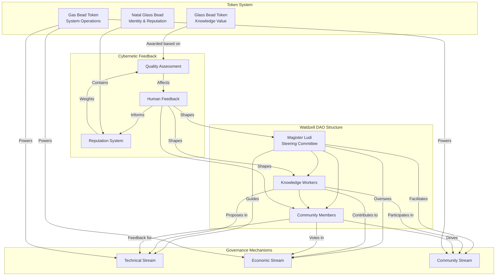

# 2.25. The Waldzell DAO

The Waldzell DAO governs Memorativa through a cybernetic system inspired by Hermann Hesse's *The Glass Bead Game*, where the pursuit of knowledge synthesis meets decentralized governance.


*Figure 1: The Waldzell DAO Cybernetic Structure, showing relationships between governance roles, token systems, and feedback mechanisms that enable a self-regulating knowledge synthesis community*

The diagram illustrates how the Waldzell DAO functions as an integrated cybernetic system where human governance, token economics, and feedback mechanisms work together. At its core, the hierarchical structure (Magister Ludi, Knowledge Workers, Community Members) interacts with specialized governance streams (Technical, Economic, Community) through defined roles. The three token types serve distinct functions: GBTk tokens represent knowledge value, NGB tokens establish identity and reputation, and GBT tokens power system operations. Most critically, the cybernetic feedback loop (shown bottom right) creates a self-regulating mechanism where human input shapes reputation, which weights quality assessment, which in turn affects future human contributions. This creates a continuous adaptive system that rewards quality knowledge synthesis while maintaining democratic access through the community layer. The connections between components allow value, information, and governance signals to flow bidirectionally, enabling the system to evolve based on both expert guidance and community consensus.

## Core Principles

1. **Knowledge Synthesis** - Like the Glass Bead Game players who connect ideas across disciplines, DAO members evaluate and integrate knowledge patterns
2. **Cybernetic Feedback** - Human feedback shapes the system's evolution through:
   - Quality assessment of generated content
   - Direction of research priorities
   - Governance proposals
3. **Meritocratic Governance** - Influence is earned through contributions, not token holdings
4. **Identity-Bound Participation** - Natal Glass Beads provide secure, privacy-preserving identity and reputation tracking

## Structure

### Magister Ludi (Steering Committee)
- Elected experts who guide overall direction
- Rotating positions to prevent entrenchment
- Must demonstrate both technical and humanistic expertise

### Knowledge Workers
- Researchers, developers, content creators
- Earn reputation through peer review
- Can propose and vote on system improvements

### Community Members
- Provide feedback and testing
- Participate in governance votes
- Earn tokens through valuable contributions

## Token Economics

### Dual Token System

1. **Glass Bead Token (GBTk)**
   - Knowledge artifact NFTs representing verified human thought
   - Created through quality contributions
   - Required for governance participation
   - Staked for proposal submission
   - Non-transferable during staking periods
   - Value derived from knowledge quality

2. **Natal Glass Bead (NGB)**
   - Core identity token for DAO participation
   - Records contribution history and reputation
   - Enables privacy-preserving voting
   - Required for role qualification
   - Nearly non-transferable (only for account recovery)

3. **Gas Bead Token (GBT)**
   - Powers all system operations
   - Required for proposal creation
   - Earned through:
     - Quality percept creation (5-10 GBT)
     - Prototype validation (2-5 GBT)
     - Book creation (20-50 GBT)
     - System validation (1-3 GBT)

### Reputation System
- Non-transferable score (0-100) bound to Natal Glass Bead
- Calculated using the function from [Section 2.24: Tokenomics](memorativa-2-24-tokenomics.md):
  ```python
  class ReputationScore:
      def calculate_score(self, member: Address) -> f32:
          base_score = self.contribution_quality * self.participation_rate
          expertise_bonus = self.calculate_expertise_bonus()
          time_factor = self.calculate_time_decay()
          
          return base_score * expertise_bonus * time_factor
  ```
  Where:
  - `contribution_quality` measures the verified quality of member contributions
  - `participation_rate` tracks consistent system engagement
  - `expertise_bonus` adds domain-specific expertise multipliers
  - `time_factor` applies appropriate decay/growth based on activity
- Zero-knowledge proofs for anonymous reputation verification
- Weighted by expertise domains
- Affects voting power on technical decisions
- Required minimums for certain roles:
  - Magister Ludi: 90+ with 2+ years of recorded NGB history
  - Knowledge Worker: 70+ with 1+ year of NGB history
  - Community Member: 0+ with active NGB

### Economic Flows

1. **Contribution Rewards**
   - Daily activities: 15-30 GBT
   - Active contributors: 50-100 GBT
   - Quality multipliers: 1.5x-2x
   - Collaboration bonuses: 1.3x-1.8x

2. **Governance Costs**
   - Proposal submission: 50 GBT + GBTk stake
   - Technical proposal: 100 GBT + Expert validation
   - Emergency action: 200 GBT + Magister approval

3. **Value Accrual**
   - GBTk value from knowledge quality, calculated using the value function:
     ```
     V_{GBTk} = β · (Q · C · R · T)
     ```
     Where:
     - β is the base value coefficient (system parameter)
     - Q is the quality score (verification rating from 0.1 to 2.0)
     - C is the connection factor (1 + 0.05n where n = number of references)
     - R is the reuse factor (1 + 0.1u where u = utilization count)
     - T is the time factor (1 + log₁₀(d + 1) where d = days since creation)
     (For complete tokenomics details, see [Section 2.24: Tokenomics](memorativa-2-24-tokenomics.md))
   - GBT burning through governance
   - Reputation-weighted distributions
   - Impact-based rewards

## Governance Mechanisms

### Proposal System

1. **Creation Process**
   ```python
   class Proposal:
       def __init__(self, proposer: Address, category: ProposalType):
           self.required_gbt = category.base_cost
           self.required_glass = category.stake_requirement
           self.required_reputation = category.min_reputation
           self.timelock = category.timelock_period
           self.voting_period = category.voting_duration
           
       def validate(self) -> Result<()>:
           # Verify proposer meets requirements
           if not self.verify_proposer_requirements():
               return Err("Proposer does not meet requirements")
           
           # Lock required tokens
           self.lock_tokens()?
           
           # Initialize voting state
           self.initialize_voting()
           
           Ok(())
   ```

2. **Voting Mechanics**
   ```python
   class Vote:
       def cast_vote(self, voter: Address, support: bool) -> Result<()>:
           # Calculate voting power
           power = self.calculate_voting_power(voter)
           
           # Apply time-weighted bonus
           power *= self.time_weight_multiplier()
           
           # Record vote
           self.record_vote(voter, power, support)
           
           # Check thresholds
           self.check_execution_threshold()
   ```

3. **Execution Logic**
   ```python
   class ProposalExecution:
       def execute(self) -> Result<()>:
           # Verify timelock expired
           if !self.timelock_expired():
               return Err("Timelock active")
           
           # Verify quorum and approval
           if !self.verify_thresholds():
               return Err("Thresholds not met")
           
           # Calculate execution cost using adaptive pricing system
           execution_cost = self.calculate_execution_cost()
           
           # Execute proposal actions
           self.execute_actions()?
           
           # Distribute rewards/slashing
           self.handle_rewards()
           
           Ok(())
       
       def calculate_execution_cost(self) -> f32:
           # Implementation of adaptive pricing from Section 2.24
           base_cost = self.proposal_category.execution_base_cost
           
           # Apply system load factor (0.8-1.5)
           load_factor = self.get_system_load_factor()
           
           # Apply privacy premium if applicable (1.0-1.5)
           privacy_premium = self.get_privacy_premium()
           
           # Apply transit modifiers (0.85-1.15)
           transit_modifier = self.calculate_transit_modifier()
           
           # Apply recursion depth modifier if applicable
           depth_modifier = 1.0 + (0.05 * self.recursion_depth)
           
           # Calculate final cost using the formula from Section 2.24: Tokenomics
           # C_{op} = C_{base} · L · P · T · D
           final_cost = base_cost * load_factor * privacy_premium * transit_modifier * depth_modifier
           
           return max(0.1, round(final_cost, 1))  # Minimum 0.1 GBT, rounded to 0.1
   ```

   The execution cost calculation implements the adaptive pricing system detailed in [Section 2.24: Tokenomics](memorativa-2-24-tokenomics.md), which ensures that governance costs dynamically adjust based on:
   
   - **System Load**: Costs increase during high network utilization (up to 1.5×) and decrease during low utilization (down to 0.8×)
   - **Privacy Requirements**: Operations requiring enhanced privacy incur a premium of up to 1.5×
   - **Transit Conditions**: Planetary transits modify costs by ±15% based on aspect harmony/challenge
   - **Execution Complexity**: Recursive or complex operations have incrementally higher costs (5% per depth level)
   
   This adaptive system ensures economic balance while optimizing for efficient resource utilization and encouraging strategically timed governance actions.

### Transit-Driven Governance Modifiers

Governance activities are directly influenced by planetary transits, as detailed in [Section 2.24: Tokenomics](memorativa-2-24-tokenomics.md):

1. **Proposal Costs**
   - Favorable transits (trines, sextiles): 5-15% discount on proposal submission costs
   - Challenging transits (squares, oppositions): 5-15% premium on proposal costs
   - Active transit to proposer's Natal Glass Bead: 10-20% discount on personal proposals

2. **Voting Power Adjustments**
   - Votes cast during favorable transits gain 10-15% additional weight
   - Harmonious aspects between voter and proposal domains increase influence
   - Rare transits (outer planet stations) create 25-40% voting power bonuses in related domains

3. **Execution Windows**
   - Proposal execution costs vary by 15-25% based on transit conditions
   - Optimal execution windows identified through transit forecasting
   - Complex proposals may include conditional execution paths based on transit conditions

4. **Reputation Effects**
   - Reputation gains amplified by 10-25% during favorable transits
   - Challenging transits create opportunities for higher reputation growth through resolution
   - Personal transits to a member's Natal Glass Bead create specialized governance opportunities

The adaptive pricing formula for governance activities follows:
```
C_gov = C_base · (1 ± T_m)
```
Where:
- C_gov is the final governance cost
- C_base is the base cost from governance tables
- T_m is the transit modifier (typically ±0.05-0.25)

### Specialized Governance Tracks

1. **Technical Governance**
   - Architecture changes require expert validation
   - Multi-stage review process:
     1. Initial expert review (85+ reputation)
     2. Community feedback period
     3. Final expert vote
   - Higher GBT costs and longer timelocks
   - Requires proof-of-expertise validation

2. **Economic Governance**
   - Token parameter adjustments
   - Reward rate modifications
   - Cost structure updates
   - Requires economic simulation results
   - Impact analysis requirements

3. **Community Governance**
   - Partnership decisions
   - Research direction
   - Resource allocation
   - Lower thresholds but longer voting periods
   - Community feedback requirements

### Delegation System

```python
class Delegation:
    def delegate_power(
        self,
        delegator: Address,
        delegate: Address,
        power_type: PowerType
    ) -> Result<()>:
        match power_type:
            case PowerType.VotingPower:
                self.delegate_votes(delegator, delegate)
            case PowerType.ExpertiseValidation:
                self.delegate_validation(delegator, delegate)
            case PowerType.ProposalCreation:
                self.delegate_proposal_rights(delegator, delegate)
```

1. **Delegation Types**
   - Vote delegation
   - Expertise validation
   - Proposal creation rights
   - Partial power delegation
   - Time-limited delegation

2. **Delegation Rules**
   - Maximum delegation depth of 2
   - No circular delegation
   - Minimum self-retention of 10%
   - Expertise requirements for delegates
   - Real-time delegation updates

### Reputation-Weighted Voting

1. **Reputation Calculation**
```python
class ReputationScore:
    def calculate_score(self, member: Address) -> f32:
        base_score = self.contribution_quality * self.participation_rate
        expertise_bonus = self.calculate_expertise_bonus()
        time_factor = self.calculate_time_decay()
        
        return base_score * expertise_bonus * time_factor
```

2. **Expertise Domains**
   - Technical expertise
   - Economic understanding
   - Community leadership
   - Research contributions
   - Pattern recognition skill

3. **Time Decay**
   - Linear decay for inactivity
   - Bonus for consistent participation
   - Expertise preservation mechanics
   - Recovery through re-engagement

### Emergency Systems

1. **Emergency Actions**
   ```python
   class EmergencyAction:
       def trigger_emergency(self, condition: EmergencyCondition) -> Result<()>:
           if !self.verify_magister_approval(90):
               return Err("Insufficient approval")
           
           self.pause_affected_systems()
           self.notify_stakeholders()
           self.initiate_response()
   ```

2. **Circuit Breakers**
   - Automatic system pauses
   - Gradual recovery mechanisms
   - Magister override capabilities
   - Stakeholder notification system

3. **Recovery Procedures**
   - System state verification
   - Gradual feature re-enabling
   - Impact assessment requirements
   - Community communication protocols

### Governance Analytics

1. **Participation Metrics**
   - Voter turnout tracking
   - Proposal success rates
   - Delegation patterns
   - Expert engagement levels
   - Community feedback volume

2. **Quality Metrics**
   - Proposal implementation success
   - Community impact measures
   - Technical stability metrics
   - Economic efficiency indicators
   - Pattern quality scores

3. **System Health Indicators**
   - Token velocity metrics
   - Reputation distribution
   - Expert availability
   - Governance participation
   - Pattern validation rates

### Identity and Privacy

```python
class GovernanceIdentity:
    def verify_participation_rights(self, natal_bead: NatalBead) -> Result<()>:
        # Verify NGB authenticity and activity history
        if !natal_bead.verify_authenticity():
            return Err("Invalid Natal Glass Bead")
            
        # Generate zero-knowledge proof of reputation
        let reputation_proof = natal_bead.generate_reputation_proof()
        
        # Verify role requirements
        self.verify_role_requirements(reputation_proof)
```

This governance system ensures:
- Technical excellence through expert validation
- Economic stability through careful parameter management
- Community engagement through accessible participation
- System security through multi-layered protection
- Continuous improvement through analytics-driven iteration

The integration with the dual-token model creates a balanced system where:
- GBTk tokens represent knowledge quality and governance rights
- GBT enables system operation and proposal creation
- Reputation scores weight technical decisions
- Multiple governance tracks serve different needs
- Emergency systems protect against failures

## Key Points

- The Waldzell DAO implements a cybernetic governance system inspired by Hermann Hesse's *Glass Bead Game*, creating a knowledge-driven meritocracy where influence is earned through contributions rather than token holdings [Section 2.24: Tokenomics](memorativa-2-24-tokenomics.md)
- The triple-token system (GBTk, NGB, GBT) creates a self-regulating economy that rewards quality content creation while preserving the integrity of governance through non-transferable identity and reputation mechanisms
- The reputation system functions as a cybernetic feedback loop, where human assessment of contribution quality directly affects governance weight, creating alignment between system outcomes and human values
- Specialized governance tracks (Technical, Economic, Community) ensure that decisions are made by those with appropriate expertise while maintaining broad stakeholder participation
- Transit-driven governance modifiers introduce temporal variability that encourages strategic participation and creates natural governance cycles, mirroring natural systems
- The delegation system enables expertise-pooling while maintaining accountability through delegation depth limits and expertise requirements
- Emergency systems provide circuit-breaker mechanisms that protect the DAO from catastrophic failures while ensuring transparent recovery procedures
- Privacy-preserving identity verification through zero-knowledge proofs enables anonymous participation without sacrificing accountability
- The Magister Ludi structure implements rotation mechanics to prevent entrenchment while maintaining continuity of expertise and institutional knowledge
- This governance model connects to the broader Memorativa cybernetic system by embedding human feedback loops within automated processes, ensuring that knowledge synthesis remains aligned with human understanding and values

## Key Math

### Reputation Calculation

The core reputation formula follows:

$$\text{Reputation} = \text{base\_score} \times \text{expertise\_bonus} \times \text{time\_factor}$$

Where:
- $\text{base\_score} = \text{contribution\_quality} \times \text{participation\_rate}$
- $\text{expertise\_bonus} = 1 + \sum_{i=1}^{n} (w_i \times e_i)$ where $w_i$ is the domain weight and $e_i$ is expertise level
- $\text{time\_factor} = \begin{cases}
1 - 0.1d & \text{if inactive for } d \text{ days} \\
1 + 0.05c & \text{if consistently active for } c \text{ cycles}
\end{cases}$

### Voting Power Calculation

Voting power for a member is calculated as:

$$\text{Voting Power} = \text{base\_reputation} \times \text{domain\_relevance} \times \text{time\_weight} \times \text{transit\_modifier}$$

Where:
- $\text{base\_reputation}$ is the member's normalized reputation score (0-100)
- $\text{domain\_relevance} = 0.5 + 0.5 \times \text{similarity}(\text{expertise\_domain}, \text{proposal\_domain})$
- $\text{time\_weight} = 1 + 0.1 \times (1 - \frac{t}{\text{voting\_period}})$ where $t$ is time elapsed in voting period
- $\text{transit\_modifier}$ ranges from 0.85 to 1.40 based on transit conditions

### Token Value Functions

The GBTk value function is defined as:

$$V_{\text{GBTk}} = \beta \times (Q \times C \times R \times T)$$

Where:
- $\beta$ is the base value coefficient (system parameter)
- $Q$ is the quality score (verification rating from 0.1 to 2.0)
- $C$ is the connection factor: $1 + 0.05n$ where $n$ = number of references
- $R$ is the reuse factor: $1 + 0.1u$ where $u$ = utilization count
- $T$ is the time factor: $1 + \log_{10}(d + 1)$ where $d$ = days since creation

### Governance Cost Calculation

The adaptive pricing formula for governance operations follows:

$$C_{\text{op}} = C_{\text{base}} \times L \times P \times T \times D$$

Where:
- $C_{\text{base}}$ is the base cost from governance tables
- $L$ is the system load factor (0.8-1.5)
- $P$ is the privacy premium (1.0-1.5)
- $T$ is the transit modifier (0.85-1.15)
- $D$ is the depth modifier: $1 + 0.05d$ where $d$ is recursion depth

The simplified transit-driven governance formula is:

$$C_{\text{gov}} = C_{\text{base}} \times (1 \pm T_m)$$

Where:
- $C_{\text{gov}}$ is the final governance cost
- $C_{\text{base}}$ is the base cost from governance tables
- $T_m$ is the transit modifier (typically ±0.05-0.25)

### Delegation Theory

For delegated voting power:

$$\text{Delegated Power} = \sum_{i=1}^{n} (d_i \times \text{Voting Power}_i) \times (1 - \text{depth\_penalty})$$

Where:
- $d_i$ is the delegation percentage from delegator $i$
- $\text{Voting Power}_i$ is the original voting power of delegator $i$
- $\text{depth\_penalty} = 0.1 \times \text{delegation\_depth}$ (max depth = 2)

The minimum self-retention constraint requires that:
$$\text{Self Retained Power} \geq 0.1 \times \text{Original Voting Power}$$

### Quorum and Threshold Functions

For proposal execution:

$$\text{Approval Threshold Reached} = \begin{cases}
\text{True} & \text{if } \frac{\sum \text{Supporting Votes}}{\sum \text{Total Votes}} \geq \text{Threshold} \text{ and } \sum \text{Total Votes} \geq \text{Quorum} \\
\text{False} & \text{otherwise}
\end{cases}$$

Where:
- Threshold varies by proposal type (0.5 for simple, 0.66 for significant, 0.8 for critical)
- Quorum varies by proposal type (10% for simple, 20% for significant, 30% for critical)
- Total Votes and Supporting Votes are weighted by voting power

## See Also

- [Section 2.24: Tokenomics](memorativa-2-24-tokenomics.md) — Foundation for the economic models and token mechanics implemented in the Waldzell DAO
- [Section 2.20: Cybernetic Feedback Loops](memorativa-2-20-cybernetic-feedback-loops.md) — Elaborates on the feedback mechanisms incorporated into the DAO governance system
- [Section 2.15: Human-in-the-Loop Systems](memorativa-2-15-human-in-the-loop.md) — Details the theoretical basis for human participation in system evaluation and governance
- [Section 3.10: Identity and Access Management](../3.%20the%20machine%20system/memorativa-3-10-identity-management.md) — Technical implementation of the Natal Glass Bead identity system
- [Section 4.05: Archetypal Patterns in Governance](../4.%20the%20pantheon%20system/memorativa-4-05-archetypal-governance.md) — Explores how archetypal patterns influence governance structures
- [Section 5.02: Integrated System Architecture](../5.%20the%20memorativa%20system/memorativa-5-02-integrated-architecture.md) — Shows how the DAO governance integrates with the complete Memorativa system
