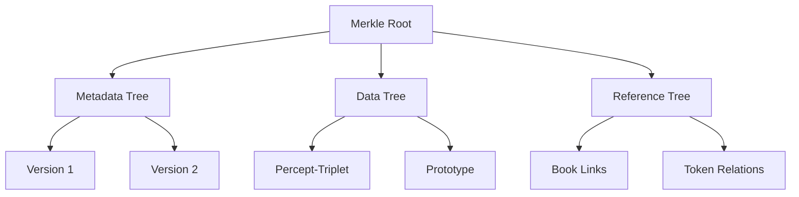
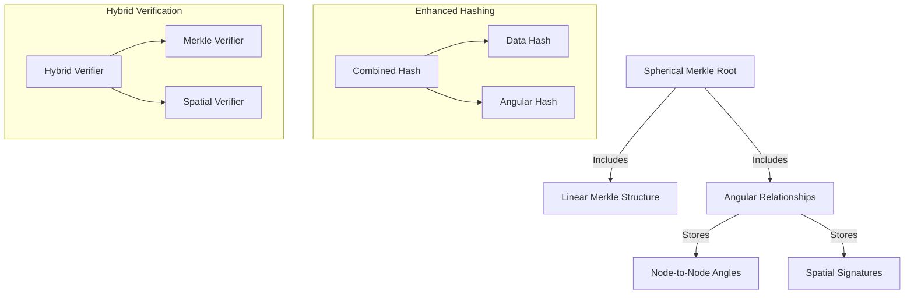

# The Cybernetic System

## 2.3. Glass Beads

Glass Beads in Memorativa are non-fungible SPL tokens that serve dual roles: as game tokens and storage within Memorativa [1]. Each bead is a crystallized fragment of a player's inner cosmos, capturing percepts, prototypes, and their intricate relationships. This dual-purpose design bridges human meaning-making with machine understanding, creating a sustainable ecosystem for personal knowledge development and AI training.

In the context of the Core Game (Section 2.2), Glass Beads function as tangible rewards for player actions such as percept creation, vector modification, book generation, and focus space creation. As described in Section 2.2, the game generates a glass bead for each focus space, percept, and prototype created by the player. Each operation involving Glass Beads consumes GBT tokens, with costs structured to balance sustainability, incentivize meaningful engagement, and prevent spam. For instance, focus space creation requires 10-15 GBT, reflecting its foundational role in the ecosystem, while simpler operations like transfers are cheaper (1-3 GBT), promoting liquidity and collaboration.

At their core, Glass Beads encapsulate three primary components:

1. **Data**: Semantic content including percepts, prototypes, and focus spaces.
2. **Metadata**: Relationships, version changes, and historical context.
3. **Attributes**: Ownership and transferability details.

These components are structured within a sophisticated hierarchical Merkle tree system, ensuring data integrity and efficient version tracking. Each bead maintains separate Merkle roots for metadata, data, and references, allowing granular updates and optimized storage through delta commitments and lazy hashing.

However, traditional linear Merkle trees fall short in representing the spherical, cyclic nature of Memorativa's conceptual space. To address this, Memorativa introduces **Spherical Merkle Trees**, an enhanced structure that integrates angular relationships and spatial coordinates into the verification process [3]. This technical implementation directly supports the three-vector encoding approach described in Section 2.2, where concepts are represented in a spherical knowledge space with angular relationships. Nodes within these trees store not only hierarchical data but also angular connections, forming a spherical network that accurately reflects conceptual proximity and relationships. Verification thus becomes hybrid, combining standard hierarchical checks with spatial validation to ensure both content integrity and topological consistency [5].

To manage storage efficiently, Memorativa employs advanced version compression techniques [4]. Adaptive snapshot intervals, smart branch pruning, reference counting, and batch updates optimize storage usage. Cross-token optimizations further enhance efficiency by sharing common data pools and reusing verification paths across beads. These technical components work together to create a seamless experience where players can focus on meaningful engagement with content rather than worrying about the underlying data structures.

Looking forward, Glass Beads will support transformative applications such as lens-based spatial transformations, collaborative knowledge synthesis, and integration with AI systems. Each user's identity will be anchored by a Natal Glass Bead, providing personalized calibration and privacy-preserving verification. Ultimately, Glass Beads form the backbone of a dynamic knowledge economy, where human conceptual work translates into tangible, verifiable digital assets, fostering a collaborative ecosystem of meaning creation and evolution.

### 2.3.1. Glass Bead Tokens (GBTk)

- **Glass Bead Tokens (GBTk)**: Glass beads are implemented as non-fungible Solana Program Library (SPL) tokens **(GBTk)** that serve as both game tokens and storage within Memorativa [1]. 
- **GBT Tokens (GBT)**: Each operation on Glass Beads (GBTk) requires GBT tokens to execute.
- **Game Tokens**: Glass beads act as rewards for player engagement, tracking progress and achievements in the Glass Bead Game. As described in Section 2.2, the game generates a glass bead for each focus space, percept, and prototype created by the player.
- **Symbolic Storage**: Each bead stores semantic data about the player's inner cosmos, including percepts, prototypes, and their relationships.
- **Symbolic conceptual reference**: Each bead references the content found in each Book.
- **Utility Tokens**: Beads enable verifiable ownership and transfer of semantic assets, supporting collaborative knowledge development and AI training.
- **Merkle Trees**: Each bead contains a Merkle tree that verifies the state and lineage of its semantic content, ensuring data integrity and evolution tracking [3].
- **SPL Token Standard**: Built on the SPL, beads support on-chain operations like transfer, ownership, and metadata management [1].
- **Dynamic Evolution**: Beads evolve as the player's inner cosmos grows, capturing layered, linked, and synthesized percepts and prototypes.

This dual-purpose architecture bridges human meaning-making and machine understanding, creating a sustainable ecosystem for personal knowledge development and AI training.

### 2.3.1.1. Hierarchical Merkle Structure

Glass Beads employ a sophisticated hierarchical Merkle tree system that divides data into specialized components, enabling efficient storage, updates, and verification. This architecture is critical to the bead's function as both game token and dynamic storage medium. Each Glass Bead maintains multiple interconnected Merkle trees—specialized for metadata, semantic content, and external references—allowing parts of the bead to be modified independently without rebuilding the entire structure. This separation mirrors how human knowledge naturally compartmentalizes different types of information while maintaining their relationships. Through this hierarchical approach, beads can efficiently evolve alongside the player's expanding conceptual space, precisely tracking the provenance and relationships of each knowledge artifact.

- **Component Trees**: Separate Merkle roots for metadata/data/references [3]
- **Delta Commitments**: Store only changed components in new versions [4]
- **Lazy Hashing**: Compute hashes on-demand for inactive branches [4]


*Figure 1: Hierarchical Merkle Structure, illustrating the component-based tree organization with separate branches for different data types, enabling efficient updates and version tracking*

### 2.3.2. Connection to Core Game Mechanics

While the technical implementation details of Glass Beads may seem abstract, they directly support and enhance the gameplay experience described in Section 2.2. Glass Beads aren't just a technical solution—they're the tangible manifestation of a player's journey through the game, crystallizing their cognitive efforts into verifiable digital assets. Each component of the technical architecture is carefully designed to enable specific gameplay mechanics, creating a seamless bridge between human meaning-making and computational representation. The following sections outline how each technical element supports core gameplay functions, enabling players to build their personal knowledge cosmos without being burdened by the underlying complexity.

1. **Hierarchical Merkle Structure**: Enables the efficient storage and verification of player-created percepts, prototypes, and focus spaces. This allows players to build their "inner cosmos" with confidence that their knowledge artifacts remain intact and verifiable.

2. **Spherical Merkle Trees**: An innovation in the Memorativa system that supports the three-vector encoding approach described in Section 2.2, where concepts are represented in a spherical knowledge space with angular relationships. This implementation ensures that the semantic relationships between concepts (like the astrological aspects) are preserved and verifiable.

3. **Version Compression**: Facilitates the recursive transformation of concepts described in Section 2.2, where concepts evolve over time and become inputs for new focus spaces. The efficient storage of version history allows players to track the evolution of their knowledge artifacts.

4. **Hybrid Verification**: Ensures the integrity of both the content and the spatial relationships of knowledge artifacts, supporting the vector space encoding that forms the foundation of the player's inner cosmos.

These technical components work together to create a seamless experience where players can focus on meaningful engagement with content rather than worrying about the underlying data structures. The implementation is designed to be invisible to the player while providing the necessary infrastructure for the core game mechanics to function effectively.

### 2.3.3. Spherical Merkle Trees

Memorativa employs an enhanced Merkle structure called **Spherical Merkle Trees** to address the topological mismatch between linear Merkle trees and the system's spherical conceptual space [3].

```
        Root Hash
       /    |    \
      /     |     \
   Node1   Node2  Node3
   /  \     |     /  \
  A    B    C    D    E
   \   |   / \   |   /
    \  |  /   \  |  /
     Angular Relationships
```
*Figure 2: Spherical Merkle Tree ASCII representation, depicting both hierarchical structure and angular relationships between nodes, showcasing the dual-nature of the verification system*

Unlike traditional Merkle trees that only represent parent-child relationships, Spherical Merkle Trees have:

- Angular Connections: Nodes store relationships to other nodes with specific angles between them, measured from an observer point
- Spatial Coordinates: Each node contains coordinates in hybrid spherical-hyperbolic space (θ, φ, r, κ)
- Dual Hash System: Combines content hashes with spatial relationship hashes

Each Spherical Merkle Node contains:
- Standard components: data, children nodes, content hash
- Spatial components: angular relationships, coordinates, spatial hash

The spatial relationships appear as additional connections between nodes that represent their angular proximity in conceptual space, forming a network that resembles a sphere with the observer at the center [3].

When verifying, both traditional hierarchical structure and angular relationships are checked:
- Standard verification confirms data integrity
- Spatial verification ensures angular relationships are preserved
- Combined verification guarantees both content and spatial consistency

This dual nature makes Spherical Merkle Trees particularly suitable for representing conceptual relationships where both hierarchical structure and symbolic/angular relationships matter.

#### 2.3.3.1. Problem Addressed

- **Topological Mismatch**: Traditional Merkle trees assume linear parent-child relationships, while Glass Beads exist in a spherical knowledge space with cyclic relationships [3]
- **Angular Dependencies**: Spatial relationships between beads require angular metrics not captured by conventional Merkle structures
- **Verification Challenges**: Standard proofs cannot account for curved space relationships

#### 2.3.3.2. Implementation


*Figure 4: Spherical Merkle Implementation Diagram, showing the parallel processing of traditional and spatial data structures, illustrating how the system maintains both hierarchical integrity and topological relationships*

The system stores both traditional hierarchical data and angular relationships between nodes [5]. 

For the detailed Rust implementation of `DeltaProof`, refer to the [Code Narrative](#code-narrative-implementing-glass-beads-in-memorativa) section below.

### 2.3.4. Version Compression

Version compression is essential for the long-term sustainability of Glass Beads in Memorativa. As players create and evolve their knowledge structures over time, the volume of historical data could quickly become overwhelming without optimization. The system employs compression techniques that preserve the integrity and traceability of knowledge evolution while minimizing storage requirements. These techniques intelligently determine what to keep fully accessible, what to compress, and what to archive based on usage patterns and semantic importance. The compression methods balance immediate accessibility with storage efficiency, ensuring that Glass Beads remain practical for storing years of cognitive development without sacrificing verification capabilities or retrieval speed of important historical versions.

- **Adaptive Snapshot Interval**: Dynamically adjusts based on [4]:
  - User activity frequency
  - System load metrics  
  - Storage constraints
  - Data criticality
- **Smart Branch Pruning**: Prunes branches based on:
  - Branch importance score
  - Usage patterns
  - Relationship density
  - Historical significance
- **Reference Counting**: Garbage collect orphaned branches
- **Batch Updates**: Group ≤10 edits as single version node

Cross-token optimization:

- **Common Data Pool**: Shared subtrees for identical components  
- **Cross-Token Proofs**: Reuse verification paths across beads  
- **Differential Hashing**: Only hash changed portions  

The following data structures are designed for an optimized Merkle tree implementation that supports [4]:
- **Componentization**: Dividing data into different components (Metadata, PerceptData, etc.) and managing a separate Merkle tree for each component. This allows for more granular updates and verification.
- **Delta Proofs**: Generating and storing delta proofs to efficiently track and verify changes between versions. Delta proofs are more compact than storing full Merkle trees for each version and allow for efficient verification of updates.
- **Versioning**: Maintaining a version history of the Merkle tree structure, allowing you to revert to previous states and track the evolution of the data over time.
- **Efficient Updates**: By using delta proofs and component trees, the system aims to minimize the computational overhead of updating the Merkle tree when data changes, as only the affected components and changes need to be processed and proven.

These structures ensures data integrity, version control, and efficient updates.

The system uses optimized Merkle tree implementations, including componentization, delta proofs, and efficient versioning. Detailed Rust implementations of these structures, such as `MerkleWrapper`, `SphericalMerkleNode`, and `HybridVerifier`, are provided in the [Code Narrative](#code-narrative-implementing-glass-beads-in-memorativa) section below.

### 2.3.5. Verification

Verification mechanisms form the backbone of trust in Memorativa's knowledge ecosystem. As players create and share conceptual artifacts, the system must guarantee their authenticity, prevent tampering, and validate both content and topological relationships. Glass Beads implement a multi-layered verification approach that combines traditional cryptographic techniques with spatial validation methods tailored to the system's spherical geometry. This hybrid verification ensures that not only is the content of each bead accurately preserved, but the angular relationships between concepts—crucial for meaning representation—are also secured. The verification system balances computational efficiency with comprehensive validation, enabling rapid verification of complex knowledge structures without prohibitive resource costs. This foundation of trust enables the safe transfer and evolution of knowledge assets throughout the ecosystem.

- **Sparse Merkle Proofs**: O(log n) size for n versions [3]
- **Aggregate Proofs**: Single proof for multiple tokens
- **Hybrid Validation System** [5]:
  - Combines standard Merkle verification with spatial validation
  - Verifies both hierarchical integrity and angular relationships
  - Ensures curved space topological consistency

The verification system employs a hybrid approach combining standard Merkle verification with spatial validation. For detailed implementation of the `HybridVerifier`, refer to the [Code Narrative](#code-narrative-implementing-glass-beads-in-memorativa) section below.

### 2.3.6. Operational Costs

Each Glass Bead (GBTk) operation consumes GBT tokens according to a cost structure designed to balance system sustainability with user engagement [2]:

| Operation | GBT Cost | Rationale |
|-----------|----------|-------------|
| Initial Minting/Focus Space Creation | 10-15 GBT | Creation of new conceptual workspaces requires significant resources |
| Storage Update | 10-15 GBT | Data modifications impact system state and require verification |
| Merkle Update | 5-10 GBT | Version tree updates must be secured but should remain accessible |
| Privacy Change | 2-5 GBT | Access control changes should be lightweight to encourage proper data management |
| Transfer | 1-3 GBT | Asset liquidity is essential for ecosystem growth |

These costs align with the core game operations outlined in Section 2.2, where:
- Percept Creation costs 5-10 GBT
- Vector Modification costs 3-7 GBT
- Book Generation costs 20-50 GBT
- Focus Space Creation costs 10-15 GBT
- Spatial Query costs 2-5 GBT
- Prototype Integration costs 1-3 GBT

The token economics follow these principles:
- **Value-Based Pricing**: Operations creating more value to the ecosystem cost proportionally more
- **Incentive Alignment**: Lower costs for actions that contribute to network growth and knowledge sharing
- **Anti-Spam Protection**: Sufficient costs to prevent system abuse while enabling genuine participation
- **Dynamic Adjustment**: Costs may be adjusted based on network activity, resource constraints, and governance decisions

```mermaid
graph TD
    GB[Glass Bead] --> |Encapsulates| D[Data]
    GB --> |Encapsulates| M[Metadata]
    GB --> |Encapsulates| A[Attributes]
    D --> |Includes| FS[Focus Spaces]
    D --> |Includes| P[Percepts]
    D --> |Includes| PR[Prototypes]
    M --> |Includes| R[Relationships]
    M --> |Includes| C[Changes]
    A --> |Includes| O[Ownership]
    A --> |Includes| T[Transfer]

    GB --> |References| B[Books]

    subgraph "Core Functions"
        GB --> |Game Tokens| GT[Rewards for Engagement]
        GB --> |Symbolic Storage| SS[Semantic Data Storage]
        GB --> |Utility Tokens| UT[Verifiable Ownership & Transfer]
    end

    subgraph "Key Features"
        GB --> |Merkle Trees| MT[Data Integrity & Evolution Tracking]
        GB --> |SPL Token Standard| SPL[On-Chain Operations]
        GB --> |Dynamic Evolution| DE[Layered, Linked, Synthesized Content]
    end

    classDef bead fill:#e1f5fe,stroke:#01579b
    classDef data fill:#f3e5f5,stroke:#4a148c
    classDef function fill:#e8f5e9,stroke:#1b5e20
    classDef feature fill:#fff3e0,stroke:#e65100

    class GB bead
    class D,M,A data
    class GT,SS,UT function
    class MT,SPL,DE feature
```

Glass Beads encapsulate semantic content primarily structured as percept-triplets, prototypes, and their intricate relationships. Conceptual relationships within Glass Beads are encoded using a hybrid spherical-hyperbolic geometry, enabling efficient representation of both hierarchical and symbolic relationships. Operational costs align precisely with percept-triplet operations detailed in Section 2.4, ensuring consistency across the Memorativa ecosystem.


*Figure 3: Glass Bead Component Architecture, showing the hierarchical structure of data, metadata, and attributes, highlighting how beads encapsulate player information while connecting to core gameplay systems*

## Key Comparisons

Glass Beads represent a unique approach to knowledge representation and tokenization that can be contextualized through comparison with related systems:

| Aspect | Traditional NFTs | Standard Merkle Trees | Knowledge Graphs | Glass Beads (GBTk) |
|--------|------------------|----------------------|------------------|-------------------|
| **Primary Purpose** | Digital collectibles and ownership | Data integrity verification | Semantic relationship mapping | Dual-purpose: game tokens and semantic storage [1][2] |
| **Data Structure** | Typically points to external content | Hierarchical, parent-child only | Graph-based, focused on entity relationships | Hierarchical with angular/spatial relationships [8] |
| **Verification Method** | Standard cryptographic proofs | Linear path verification | Schema validation | Hybrid verification (hierarchical + spatial) [9] |
| **Knowledge Representation** | Minimal or external metadata | Not designed for knowledge representation | Predicate-based triples (subject-predicate-object) | Spherical vector space with angular relationships [8] |
| **Evolution Mechanics** | Static or simple state changes | Version control through new trees | Edge/node additions and deletions | Dynamic evolution with compressed version history [7] |
| **Computational Efficiency** | O(1) verification | O(log n) verification | O(n) for complex queries | O(log n + m) for verification with aggregation [6] |
| **Integration with Human Cognition** | Limited semantic meaning | Technical structure only | Logical relationship modeling | Direct mapping to symbolic and spatial human thinking [3] |

Glass Beads innovate beyond existing systems primarily through their spherical knowledge representation and hybrid verification approach. While traditional NFTs focus on ownership rights and Knowledge Graphs excel at relationship modeling, Glass Beads uniquely combine these strengths while adding spatial dimensions that more closely align with human conceptual thinking. The Spherical Merkle Tree structure represents a fundamental advancement over traditional Merkle trees by accommodating both hierarchical and spatial relationships in a verifiable structure.

Unlike traditional token systems that primarily track ownership or access rights, Glass Beads create a sustainable economic value system directly tied to knowledge creation and organization. This positions them as a bridge between human meaning-making and machine understanding, addressing limitations in both traditional blockchain tokens and semantic web technologies.

### 2.3.7. Future Applications

Glass Beads are foundational to the entire Memorativa ecosystem beyond their primary roles as game tokens and storage entities. Their future applications include:

1. **Lens-Based Transformations**: Glass Beads will support spatial coordinate transformations through specialized lenses, enabling different perspectives on the same knowledge artifacts [13]. Each lens (Chinese, Hermetic, Mathematical, etc.) will apply unique rotations and curvature modifications while maintaining verifiable relationships through the Spherical Merkle structure.

2. **Collaborative Knowledge Synthesis**: The token structure will enable multiple users to collaborate on shared conceptual spaces while maintaining privacy boundaries [11]. This will include:
   - Vertical integration from basic to complex structures
   - Horizontal connections with access controls
   - Diagonal evolution with versioning and attribution
   - Multiple sharing models with defined costs/rewards
   - Cross-structure references with verification

3. **Focus Space Integration**: Glass Beads will encode focus spaces as conceptual workspaces that filter, organize, and transform prototypes [14]. These spaces will:
   - Function as a conceptual focus using title-description pairs
   - Maintain time state vectors across mundane, quantum, and holographic states
   - Store angular relationships between concepts
   - Support hierarchical organization with inheritance
   - Enable multi-chart interfaces for complex pattern analysis

4. **Integration with Natal Glass Beads**: Each user's identity will be represented by a special Natal Glass Bead that functions as a reference template for all other Glass Beads [12]. This creates:
   - Pseudo-anonymous identification with selective disclosure
   - Activity logging with timestamp verification
   - Structural integration with authorized patterns only
   - Zero-knowledge proofs for pattern matching
   - Personalized meaning calibration with privacy preservation

5. **AI-Enhanced Evolution**: Glass Beads will interface with LLMs and other AI systems through privacy-aware adapters [15]. These interfaces will:
   - Convert between internal hybrid geometry and external formats
   - Preserve angular relationships during AI processing
   - Support bidirectional conversion with state preservation
   - Maintain privacy boundaries during external processing
   - Apply Gas token verification for all operations

6. **Economic Value Network**: Glass Beads will participate in a sustainable knowledge economy where human conceptual work creates tangible digital assets [5]. The system will include:
   - Quality validation with verification weights
   - Knowledge synthesis with attribution tracking
   - Collaboration incentives with multipliers
   - Cross-token optimization for efficiency
   - Value preservation through scarcity mechanisms

This multi-layered infrastructure enables a knowledge economy where meaning creation, verification, and evolution become explicit, traceable processes that bridge human cognition and machine computation while maintaining privacy, attribution, and verifiability.

### 2.3.8. Code Narrative: Implementing Glass Beads in Memorativa

In Memorativa, Glass Beads are more than mere tokens—they encapsulate a player's evolving inner cosmos. To achieve this, we leverage Rust's expressive type system and efficient hashing mechanisms, building upon the Solana Program Library (SPL) token standard.

#### 2.3.8.1. Structuring the Bead: Hierarchical Merkle Trees

Each Glass Bead contains multiple Merkle trees, organized by component type—metadata, percept data, references, and access logs. This granular structure allows efficient updates and precise verification:

```rust
struct MerkleWrapper {
    component_trees: HashMap<ComponentType, MerkleTree>,
    delta_proofs: Vec<DeltaProof>,
    version_map: BTreeMap<u64, VersionMetadata>,
    access_patterns: AccessTracker,
    importance_metrics: ImportanceMetrics,
}

enum ComponentType {
    Metadata,
    PerceptData,
    References,
    AccessLogs,
}

struct DeltaProof {
    previous_root: [u8; 32],
    new_elements: Vec<HashedComponent>,
    patch_operations: Vec<PatchOp>,
}
```

For the detailed Rust implementation of `DeltaProof`, refer to the [Code Narrative](#code-narrative-implementing-glass-beads-in-memorativa) section below.

#### 2.3.8.2. Bridging Linear and Spherical Spaces: Spherical Merkle Trees

Traditional Merkle trees assume linear, hierarchical relationships. However, Memorativa's conceptual space is spherical, with angular relationships between nodes. To represent this accurately, we introduce **Spherical Merkle Trees**:

```rust
struct SphericalMerkleNode {
    data: Vec<u8>,
    children: Vec<NodeId>,
    angular_relationships: HashMap<NodeId, Angle>,
    hash: [u8; 32],
}

impl SphericalMerkleNode {
    fn calculate_hash(&self) -> [u8; 32] {
        let data_hash = hash_data(&self.data);
        let angles_data: Vec<(NodeId, Angle)> = self.angular_relationships
            .iter().map(|(k, v)| (*k, *v)).collect();
        let angle_hash = hash_data(&angles_data);
        
        hash_combine(data_hash, angle_hash)
    }
}
```

Each node stores both hierarchical data and angular relationships, forming a spherical network. The `calculate_hash` method combines these two aspects into a single hash, ensuring both content integrity and spatial consistency.

#### 2.3.8.3. Hybrid Verification: Ensuring Integrity Across Dimensions

Verification in Memorativa is hybrid, combining traditional Merkle verification with spatial validation. This dual-layered approach ensures that both hierarchical and angular relationships remain consistent:

```rust
struct HybridVerifier {
    merkle_verifier: MerkleVerifier,
    spatial_verifier: SpatialVerifier,
}

impl HybridVerifier {
    fn verify(&self, node: &SphericalMerkleNode) -> bool {
        self.merkle_verifier.verify(node.hash)
            && self.spatial_verifier.verify(node.angular_relationships.clone())
    }
}
```

The `HybridVerifier` simultaneously checks the Merkle hash for data integrity and validates angular relationships, ensuring the bead's conceptual structure remains intact.

#### 2.3.8.4. Future-Proofing: Lens-Based Transformations

Looking ahead, Glass Beads will support lens-based transformations, allowing players to view their knowledge from multiple perspectives—mathematical, hermetic, or otherwise. Here's a speculative implementation (flagged as future-oriented):

```rust
fn apply_lens_transform(&mut self, lens_type: LensType) -> HybridTriplet {
    let mut transformed = self.coordinates.clone();
    
    match lens_type {
        LensType::Mathematical => {
            transformed.theta += self.rotation[0];
            transformed.phi += self.rotation[1];
            transformed.radius *= self.scale;
            transformed.curvature += self.curvature_modifier;
        },
        LensType::Hermetic => {
            // Hermetic-specific transformations
        },
        _ => {},
    }
    
    transformed
}
```

This function adjusts spatial coordinates based on the selected lens, preserving verification integrity while offering diverse conceptual views.

### 2.3.9. Key Math

The mathematical foundations underlying Glass Beads in Memorativa revolve around cryptographic hashing, spherical geometry, and efficient data structures. Here are the key mathematical concepts and formulas:

#### 2.3.9.1. Merkle Tree Hashing

Merkle trees rely on cryptographic hash functions to ensure data integrity. Given two child nodes $H_L$ and $H_R$, the parent hash $H_P$ is computed as:

$$
H_P = \text{Hash}(H_L \parallel H_R)
$$

where $\parallel$ denotes concatenation. For delta proofs, only changed nodes are recalculated, significantly reducing computational overhead:

$$
\Delta H = \text{Hash}(H_{\text{old}} \parallel \Delta_{\text{new}})
$$

#### 2.3.9.2. Spherical Merkle Trees: Angular Relationships

Nodes in Spherical Merkle Trees store angular relationships, represented by spherical coordinates $(\theta, \phi, r)$:

- $\theta$: Azimuthal angle (longitude), $0 \leq \theta < 2\pi$
- $\phi$: Polar angle (latitude), $0 \leq \phi \leq \pi$
- $r$: Radial distance from the observer (conceptual center)

Angular distance $d$ between two nodes $A(\theta_1, \phi_1)$ and $B(\theta_2, \phi_2)$ on a unit sphere is calculated using the spherical law of cosines:

$$
d = \arccos(\sin\phi_1\sin\phi_2 + \cos\phi_1\cos\phi_2\cos(\theta_1 - \theta_2))
$$

#### 2.3.9.3. Hybrid Hashing: Combining Spatial and Data Hashes

Each node's combined hash $H_C$ integrates both data hash $H_D$ and angular hash $H_A$:

$$
H_C = \text{Hash}(H_D \parallel H_A)
$$

where:

- $H_D = \text{Hash}(\text{data})$
- $H_A = \text{Hash}(\text{angular relationships})$

#### 2.3.9.4. Version Compression Metrics

Adaptive snapshot intervals and smart pruning rely on metrics such as importance score $I$:

$$
I = w_1 \cdot R + w_2 \cdot F + w_3 \cdot H
$$

where:

- $R$: Relationship density (number of connections)
- $F$: Access frequency (usage patterns)
- $H$: Historical significance (age and relevance)
- $w_1, w_2, w_3$: Tunable weights based on system governance

#### 2.3.9.5. Verification Complexity

Sparse Merkle proofs have logarithmic complexity $O(\log n)$, where $n$ is the number of nodes. Aggregate proofs further optimize verification by combining multiple proofs into a single proof, reducing complexity to:

$$
O(\log n + m)
$$

where $m$ is the number of aggregated proofs.

#### 2.3.9.6. Lens-Based Coordinate Transformations

Lens transformations apply rotations and scaling to spherical coordinates. A general transformation $T$ for coordinates $(\theta, \phi, r)$ is:

$$
T(\theta, \phi, r) = (\theta + \Delta\theta, \phi + \Delta\phi, r \cdot s)
$$

where:

- $\Delta\theta, \Delta\phi$: Angular rotations specific to the lens type
- $s$: Scaling factor adjusting conceptual distance

These mathematical structures ensure Glass Beads maintain verifiable integrity, efficient storage, and accurate representation of complex conceptual relationships within Memorativa's spherical knowledge space.

### 2.3.10. Key Points

- Glass Beads serve dual purposes as game tokens and semantic data storage, directly supporting the core game mechanics [1]
- The token economics are designed to align with the Core Game operations, incentivizing meaningful engagement and knowledge creation [2]
- Spherical Merkle Trees enable representation of complex conceptual relationships in a verifiable structure [3]
- Version compression techniques optimize storage while maintaining data integrity [4]
- The hybrid verification system ensures both hierarchical and spatial consistency [5]
- The technical implementation is designed to be invisible to the player while providing the necessary infrastructure for the core game mechanics to function effectively

### 2.3.11. Citations

- [1] Solana Labs. (2021). *Solana Program Library (SPL) Token Standard*. Solana Documentation.
- [2] Buterin, V. (2014). "A Next-Generation Smart Contract and Decentralized Application Platform." *Ethereum White Paper*.
- [3] Merkle, R. C. (1987). "A Digital Signature Based on a Conventional Encryption Function." *Advances in Cryptology — CRYPTO '87*, pp. 369-378.
- [4] Crosby, S. A., & Wallach, D. S. (2009). "Efficient Data Structures for Tamper-Evident Logging." *USENIX Security Symposium*, pp. 317-334.
- [5] Boneh, D., & Lynn, B. (2003). "Aggregate Signatures and Multisignatures." *Eurocrypt*, pp. 416-432.

### 2.3.12. See Also

- [Section 2.2: The Core Game](memorativa-2-2-the-core-game.md) — Provides the foundational gameplay concepts that Glass Beads reward and track
- [Section 2.4: The Percept Triplet](memorativa-2-4-the-percept-triplet.md) — Details the semantic data structures stored within Glass Beads
- [Section 2.10: Visualizing the Prototype](memorativa-2-10-visualizing-the-prototype.md) — Expands on the spherical knowledge space that necessitates the Spherical Merkle Tree structure
- [Section 2.16: Glass Bead Tokens](memorativa-2-16-glass-bead-tokens.md) — Provides detailed implementation specifications for the token economics and verification systems
- [Section 2.24: Tokenomics](memorativa-2-24-tokenomics.md) — Describes the broader economic system that Glass Beads operate within

