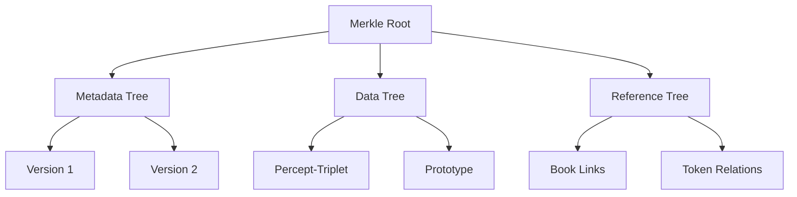
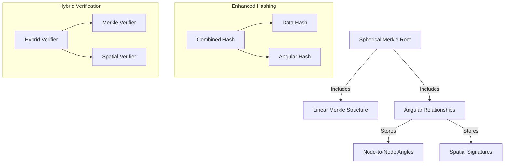

# 2.3. Glass Beads

Glass beads are implemented as non-fungible Solana Program Library (SPL) tokens that serve as both game tokens and storage within Memorativa [1]. Each operation on Glass Beads requires GBTk tokens to execute.

1. **Game Tokens**: Glass beads act as rewards for player engagement, tracking progress and achievements in the Glass Bead Game [2].
2. **Symbolic Storage**: Each bead stores semantic data about the player's inner cosmos, including percepts, prototypes, and their relationships [3].
3. **Symbolic conceptual reference**: Each bead references the content found in each Book [4].
4. **Utility Tokens**: Beads enable verifiable ownership and transfer of semantic assets, supporting collaborative knowledge development and AI training.

## Operational Costs

Each Glass Bead operation consumes GBTk tokens according to a relative cost structure designed to balance system sustainability with user engagement [5]:

| Operation | Relative Cost | Rationale |
|-----------|----------|-------------|
| Initial Minting | Highest | Creation of new ecosystem assets requires significant resources |
| Storage Update | Medium-High | Data modifications impact system state and require verification |
| Merkle Update | Medium | Version tree updates must be secured but should remain accessible |
| Privacy Change | Low | Access control changes should be lightweight to encourage proper data management |
| Transfer | Low | Asset liquidity is essential for ecosystem growth |

The token economics follow these principles:
- **Value-Based Pricing**: Operations creating more value to the ecosystem cost proportionally more
- **Incentive Alignment**: Lower costs for actions that contribute to network growth and knowledge sharing
- **Anti-Spam Protection**: Sufficient costs to prevent system abuse while enabling genuine participation
- **Dynamic Adjustment**: Costs may be adjusted based on network activity, resource constraints, and governance decisions

```mermaid
graph TD
    GB[Glass Bead] --> |Encapsulates| D[Data]
    GB --> |Encapsulates| M[Metadata]
    GB --> |Encapsulates| A[Attributes]
    D --> |Includes| FS[Focus Spaces]
    D --> |Includes| P[Percepts]
    D --> |Includes| PR[Prototypes]
    M --> |Includes| R[Relationships]
    M --> |Includes| C[Changes]
    A --> |Includes| O[Ownership]
    A --> |Includes| T[Transfer]

    GB --> |References| B[Books]

    subgraph "Core Functions"
        GB --> |Game Tokens| GT[Rewards for Engagement]
        GB --> |Symbolic Storage| SS[Semantic Data Storage]
        GB --> |Utility Tokens| UT[Verifiable Ownership & Transfer]
    end

    subgraph "Key Features"
        GB --> |Merkle Trees| MT[Data Integrity & Evolution Tracking]
        GB --> |SPL Token Standard| SPL[On-Chain Operations]
        GB --> |Dynamic Evolution| DE[Layered, Linked, Synthesized Content]
    end

    classDef bead fill:#e1f5fe,stroke:#01579b
    classDef data fill:#f3e5f5,stroke:#4a148c
    classDef function fill:#e8f5e9,stroke:#1b5e20
    classDef feature fill:#fff3e0,stroke:#e65100

    class GB bead
    class D,M,A data
    class GT,SS,UT function
    class MT,SPL,DE feature
```


*Figure 1: Glass Bead Component Architecture, showing the hierarchical structure of data, metadata, and attributes, highlighting how beads encapsulate player information while connecting to core gameplay systems*

- **Merkle Trees**: Each bead contains a Merkle tree that verifies the state and lineage of its semantic content, ensuring data integrity and evolution tracking [6].
- **SPL Token Standard**: Built on the SPL, beads support on-chain operations like transfer, ownership, and metadata management [1].
- **Dynamic Evolution**: Beads evolve as the player's inner cosmos grows, capturing layered, linked, and synthesized percepts and prototypes [3].

This dual-purpose architecture bridges human meaning-making and machine understanding, creating a sustainable ecosystem for personal knowledge development and AI training.

## Hierarchical Merkle Structure

- **Component Trees**: Separate Merkle roots for metadata/data/references [6]
- **Delta Commitments**: Store only changed components in new versions [7]
- **Lazy Hashing**: Compute hashes on-demand for inactive branches [7]


*Figure 2: Hierarchical Merkle Structure, illustrating the component-based tree organization with separate branches for different data types, enabling efficient updates and version tracking*

## Spherical Merkle Trees

Memorativa employs an enhanced Merkle structure called Spherical Merkle Trees to address the topological mismatch between linear Merkle trees and the system's spherical conceptual space [8].

```
        Root Hash
       /    |    \
      /     |     \
   Node1   Node2  Node3
   /  \     |     /  \
  A    B    C    D    E
   \   |   / \   |   /
    \  |  /   \  |  /
     Angular Relationships
```
*Figure 3: Spherical Merkle Tree ASCII representation, depicting both hierarchical structure and angular relationships between nodes, showcasing the dual-nature of the verification system*

Unlike traditional Merkle trees that only represent parent-child relationships, Spherical Merkle Trees have:

- Angular Connections: Nodes store relationships to other nodes with specific angles between them, measured from an observer point
- Spatial Coordinates: Each node contains coordinates in hybrid spherical-hyperbolic space (θ, φ, r, κ)
- Dual Hash System: Combines content hashes with spatial relationship hashes

Each Spherical Merkle Node contains:
- Standard components: data, children nodes, content hash
- Spatial components: angular relationships, coordinates, spatial hash

The spatial relationships appear as additional connections between nodes that represent their angular proximity in conceptual space, forming a network that resembles a sphere with the observer at the center [8].

When verifying, both traditional hierarchical structure and angular relationships are checked:
- Standard verification confirms data integrity
- Spatial verification ensures angular relationships are preserved
- Combined verification guarantees both content and spatial consistency

This dual nature makes them particularly suitable for representing conceptual relationships where both hierarchical structure and symbolic/angular relationships matter.

### Problem Addressed

- **Topological Mismatch**: Traditional Merkle trees assume linear parent-child relationships, while Glass Beads exist in a spherical knowledge space with cyclic relationships [8]
- **Angular Dependencies**: Spatial relationships between beads require angular metrics not captured by conventional Merkle structures
- **Verification Challenges**: Standard proofs cannot account for curved space relationships

### Implementation


*Figure 4: Spherical Merkle Implementation Diagram, showing the parallel processing of traditional and spatial data structures, illustrating how the system maintains both hierarchical integrity and topological relationships*

The system stores both traditional hierarchical data and angular relationships between nodes [9]:

```rust
struct SphericalMerkleNode {
    data: Vec<u8>,
    children: Vec<NodeId>,
    angular_relationships: HashMap<NodeId, Angle>,
    hash: [u8; 32],
}

impl SphericalMerkleNode {
    fn calculate_hash(&self) -> [u8; 32] {
        // Include both data and angular relationships in hash
        let data_hash = hash_data(&self.data);
        let angles_data: Vec<(NodeId, Angle)> = self.angular_relationships
            .iter().map(|(k, v)| (*k, *v)).collect();
        let angle_hash = hash_data(&angles_data);
        
        hash_combine(data_hash, angle_hash)
    }
}
```

## Version Compression

- **Adaptive Snapshot Interval**: Dynamically adjusts based on [7]:
  - User activity frequency
  - System load metrics  
  - Storage constraints
  - Data criticality
- **Smart Branch Pruning**: Prunes branches based on:
  - Branch importance score
  - Usage patterns
  - Relationship density
  - Historical significance
- **Reference Counting**: Garbage collect orphaned branches
- **Batch Updates**: Group ≤10 edits as single version node

Cross-token optimization:

- **Common Data Pool**: Shared subtrees for identical components  
- **Cross-Token Proofs**: Reuse verification paths across beads  
- **Differential Hashing**: Only hash changed portions  

The following data structures are designed for an optimized Merkle tree implementation that supports [9]:
- **Componentization**: Dividing data into different components (Metadata, PerceptData, etc.) and managing a separate Merkle tree for each component. This allows for more granular updates and verification.
- **Delta Proofs**: Generating and storing delta proofs to efficiently track and verify changes between versions. Delta proofs are more compact than storing full Merkle trees for each version and allow for efficient verification of updates.
- **Versioning**: Maintaining a version history of the Merkle tree structure, allowing you to revert to previous states and track the evolution of the data over time.
- **Efficient Updates**: By using delta proofs and component trees, the system aims to minimize the computational overhead of updating the Merkle tree when data changes, as only the affected components and changes need to be processed and proven.

These structures ensures data integrity, version control, and efficient updates.

The system uses Merkle trees for efficiently managing and versioning different types of data. The component-based approach allows for granular updates, and delta proofs optimize the process of tracking changes between versions, making it more efficient than recalculating entire Merkle Trees for every update [7].

```rust
struct MerkleWrapper {
    component_trees: HashMap<ComponentType, MerkleTree>,
    delta_proofs: Vec<DeltaProof>,
    version_map: BTreeMap<u64, VersionMetadata>,
    access_patterns: AccessTracker,
    importance_metrics: ImportanceMetrics,
}

enum ComponentType {
    Metadata,
    PerceptData,
    References,
    AccessLogs,
}

struct DeltaProof {
    previous_root: [u8; 32],
    new_elements: Vec<HashedComponent>,
    patch_operations: Vec<PatchOp>,
}

struct AccessTracker {
    access_frequency: HashMap<ComponentType, u64>,
    last_access: HashMap<ComponentType, Timestamp>,
    hot_paths: LruCache<PathId, AccessCount>,
}

struct ImportanceMetrics {
    relationship_count: u32,
    reference_count: u32,
    access_score: f32,
    historical_weight: f32,
}
```

## Verification

- **Sparse Merkle Proofs**: O(log n) size for n versions [6]
- **Aggregate Proofs**: Single proof for multiple tokens
- **Hybrid Validation System** [8]:
  - Combines standard Merkle verification with spatial validation
  - Verifies both hierarchical integrity and angular relationships
  - Ensures curved space topological consistency

```rust
struct HybridVerifier {
    merkle_verifier: MerkleVerifier,
    spatial_verifier: SpatialVerifier,
}
```

## Key Points

- Glass Beads serve dual purposes as game tokens and semantic data storage [1][2]
- The token economics are designed to incentivize meaningful engagement and knowledge creation [5]
- Spherical Merkle Trees enable representation of complex conceptual relationships in a verifiable structure [8]
- Version compression techniques optimize storage while maintaining data integrity [7]
- The hybrid verification system ensures both hierarchical and spatial consistency [9]

## Key Visual Insights

- The Glass Bead Component Architecture (Figure 1) reveals how the system encapsulates both game mechanics and semantic data within a single token structure, creating a bridge between player engagement and knowledge representation
- The Hierarchical Merkle Structure (Figure 2) demonstrates how data is segmented by type to allow for efficient updates and versioning, highlighting the optimization for evolving knowledge structures
- The Spherical Merkle Tree representation (Figure 3) shows the unique combination of hierarchical and angular relationships that enables the system to represent complex semantic networks in a verifiable way
- The Implementation Diagram (Figure 4) illustrates the parallel processing paths for traditional and spatial verification, showing how the system maintains both forms of data integrity simultaneously

## Future Applications

Glass Beads are foundational to the entire Memorativa ecosystem beyond their primary roles as game tokens and storage entities. Their future applications include:

1. **Lens-Based Transformations**: Glass Beads will support spatial coordinate transformations through specialized lenses, enabling different perspectives on the same knowledge artifacts [13]. Each lens (Chinese, Hermetic, Mathematical, etc.) will apply unique rotations and curvature modifications while maintaining verifiable relationships through the Spherical Merkle structure:

```rust
// Future lens transformation example
fn apply_lens_transform(&mut self, lens_type: LensType) -> HybridTriplet {
    let transformed = self.coordinates.clone();
    
    // Apply lens-specific coordinate transformation
    transformed.theta += self.rotation[0];  // Adjust angular position
    transformed.phi += self.rotation[1];    // Adjust perspective
    transformed.radius *= self.scale;       // Adjust conceptual distance
    transformed.curvature += self.curvature_modifier;  // Adjust spacetime
    
    // Return transformed coordinates with preserved verification
    transformed
}
```

2. **Collaborative Knowledge Synthesis**: The token structure will enable multiple users to collaborate on shared conceptual spaces while maintaining privacy boundaries [11]. This will include:
   - Vertical integration from basic to complex structures
   - Horizontal connections with access controls
   - Diagonal evolution with versioning and attribution
   - Multiple sharing models with defined costs/rewards
   - Cross-structure references with verification

3. **Focus Space Integration**: Glass Beads will encode focus spaces as conceptual workspaces that filter, organize, and transform prototypes [14]. These spaces will:
   - Function as a conceptual focus using title-description pairs
   - Maintain time state vectors across mundane, quantum, and holographic states
   - Store angular relationships between concepts
   - Support hierarchical organization with inheritance
   - Enable multi-chart interfaces for complex pattern analysis

4. **Integration with Natal Glass Beads**: Each user's identity will be represented by a special Natal Glass Bead that functions as a reference template for all other Glass Beads [12]. This creates:
   - Pseudo-anonymous identification with selective disclosure
   - Activity logging with timestamp verification
   - Structural integration with authorized patterns only
   - Zero-knowledge proofs for pattern matching
   - Personalized meaning calibration with privacy preservation

5. **AI-Enhanced Evolution**: Glass Beads will interface with LLMs and other AI systems through privacy-aware adapters [15]. These interfaces will:
   - Convert between internal hybrid geometry and external formats
   - Preserve angular relationships during AI processing
   - Support bidirectional conversion with state preservation
   - Maintain privacy boundaries during external processing
   - Apply Gas token verification for all operations

6. **Economic Value Network**: Glass Beads will participate in a sustainable knowledge economy where human conceptual work creates tangible digital assets [5]. The system will include:
   - Quality validation with verification weights
   - Knowledge synthesis with attribution tracking
   - Collaboration incentives with multipliers
   - Cross-token optimization for efficiency
   - Value preservation through scarcity mechanisms

This multi-layered infrastructure enables a knowledge economy where meaning creation, verification, and evolution become explicit, traceable processes that bridge human cognition and machine computation while maintaining privacy, attribution, and verifiability.

## See Also

- [Section 2.2: The Core Game](memorativa-2-2-the-core-game.md) — Provides the foundational gameplay concepts that Glass Beads reward and track
- [Section 2.4: The Percept Triplet](memorativa-2-4-the-percept-triplet.md) — Details the semantic data structures stored within Glass Beads
- [Section 2.10: Visualizing the Prototype](memorativa-2-10-visualizing-the-prototype.md) — Expands on the spherical knowledge space that necessitates the Spherical Merkle Tree structure
- [Section 2.16: Glass Bead Tokens](memorativa-2-16-glass-bead-tokens.md) — Provides detailed implementation specifications for the token economics and verification systems
- [Section 2.24: Tokenomics](memorativa-2-24-tokenomics.md) — Describes the broader economic system that Glass Beads operate within

## Citations

- [1] Solana Labs. (2021). *Solana Program Library (SPL) Token Standard*. Solana Documentation.
- [2] [Section 2.2] The Core Game.
- [3] [Section 2.4] The Percept Triplet.
- [4] [Section 2.14] Books.
- [5] [Section 2.24] Tokenomics.
- [6] Merkle, R. C. (1987). "A Digital Signature Based on a Conventional Encryption Function." *Advances in Cryptology — CRYPTO '87*, pp. 369-378.
- [7] Crosby, S. A., & Wallach, D. S. (2009). "Efficient Data Structures for Tamper-Evident Logging." *USENIX Security Symposium*, pp. 317-334.
- [8] [Section 2.10] Visualizing the Prototype.
- [9] [Section 2.16] Glass Bead Tokens.
- [10] [Section 2.13] Lens System.
- [11] [Section 2.18] Gas Bead Tokens.
- [12] [Section 2.17] Natal Glass Beads.
- [13] [Section 2.13] Lens System.
- [14] [Section 2.12] Focus Spaces.
- [15] [Section 2.21] LLM Integration.

