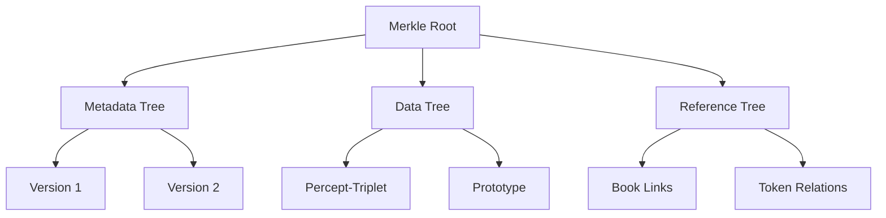

```mermaid
graph TD
    GB[Glass Bead] --> |Encapsulates| D[Data]
    GB --> |Encapsulates| M[Metadata]
    GB --> |Encapsulates| A[Attributes]
    D --> |Includes| FS[Focus Spaces]
    D --> |Includes| P[Percepts]
    D --> |Includes| PR[Prototypes]
    M --> |Includes| R[Relationships]
    M --> |Includes| C[Changes]
    A --> |Includes| O[Ownership]
    A --> |Includes| T[Transfer]

    GB --> |References| B[Books]

    subgraph "Core Functions"
        GB --> |Game Tokens| GT[Rewards for Engagement]
        GB --> |Symbolic Storage| SS[Semantic Data Storage]
        GB --> |Utility Tokens| UT[Verifiable Ownership & Transfer]
    end

    subgraph "Key Features"
        GB --> |Merkle Trees| MT[Data Integrity & Evolution Tracking]
        GB --> |SPL Token Standard| SPL[On-Chain Operations]
        GB --> |Dynamic Evolution| DE[Layered, Linked, Synthesized Content]
    end

    classDef bead fill:#e1f5fe,stroke:#01579b
    classDef data fill:#f3e5f5,stroke:#4a148c
    classDef function fill:#e8f5e9,stroke:#1b5e20
    classDef feature fill:#fff3e0,stroke:#e65100

    class GB bead
    class D,M,A data
    class GT,SS,UT function
    class MT,SPL,DE feature
```

# 2.3. Glass Beads

Glass beads are implemented as non-fungible Solana Program Library (SPL) tokens that serve as both game tokens and storage within Memorativa. Each operation on Glass Beads requires GBTk tokens to execute.

1. **Game Tokens**: Glass beads act as rewards for player engagement, tracking progress and achievements in the Glass Bead Game.
2. **Symbolic Storage**: Each bead stores semantic data about the player's inner cosmos, including percepts, prototypes, and their relationships.
3. **Symbolic conceptual reference**: Each bead references the content found in each Book.
4. **Utility Tokens**: Beads enable verifiable ownership and transfer of semantic assets, supporting collaborative knowledge development and AI training.

### Operational Costs
Each Glass Bead operation consumes GBTk tokens:

| Operation | GBTk Cost | Description |
|-----------|----------|-------------|
| Initial Minting | 10 GBTk | Create new Glass Bead |
| Storage Update | 2-5 GBTk | Modify stored data |
| Merkle Update | 1-3 GBTk | Update version tree |
| Privacy Change | 1 GBTk | Modify access settings |
| Transfer | 1 GBTk | Change ownership |



- **Merkle Trees**: Each bead contains a Merkle tree that verifies the state and lineage of its semantic content, ensuring data integrity and evolution tracking.
- **SPL Token Standard**: Built on the SPL, beads support on-chain operations like transfer, ownership, and metadata management.
- **Dynamic Evolution**: Beads evolve as the player's inner cosmos grows, capturing layered, linked, and synthesized percepts and prototypes.

This dual-purpose architecture bridges human meaning-making and machine understanding, creating a sustainable ecosystem for personal knowledge development and AI training.

## Hierarchical Merkle structure

- **Component Trees**: Separate Merkle roots for metadata/data/references  
- **Delta Commitments**: Store only changed components in new versions  
- **Lazy Hashing**: Compute hashes on-demand for inactive branches  



## Version compression

- **Adaptive Snapshot Interval**: Dynamically adjusts based on:
  - User activity frequency
  - System load metrics  
  - Storage constraints
  - Data criticality
- **Smart Branch Pruning**: Prunes branches based on:
  - Branch importance score
  - Usage patterns
  - Relationship density
  - Historical significance
- **Reference Counting**: Garbage collect orphaned branches
- **Batch Updates**: Group ≤10 edits as single version node

Cross-token optimization:

- **Common Data Pool**: Shared subtrees for identical components  
- **Cross-Token Proofs**: Reuse verification paths across beads  
- **Differential Hashing**: Only hash changed portions  

The following data structures are designed for an optimized Merkle tree implementation that supports:
- **Componentization**: Dividing data into different components (Metadata, PerceptData, etc.) and managing a separate Merkle tree for each component. This allows for more granular updates and verification.
- **Delta Proofs**: Generating and storing delta proofs to efficiently track and verify changes between versions. Delta proofs are more compact than storing full Merkle trees for each version and allow for efficient verification of updates.
- **Versioning**: Maintaining a version history of the Merkle tree structure, allowing you to revert to previous states and track the evolution of the data over time.
- **Efficient Update**s: By using delta proofs and component trees, the system aims to minimize the computational overhead of updating the Merkle tree when data changes, as only the affected components and changes need to be processed and proven.

These structures ensures data integrity, version control, and efficient updates.

The system uses Merkle trees for efficiently managing and versioning different types of data. The component-based approach allows for granular updates, and delta proofs optimize the process of tracking changes between versions, making it more efficient than recalculating entire Merkle Trees for every update.

```rust
struct MerkleWrapper {
    component_trees: HashMap<ComponentType, MerkleTree>,
    delta_proofs: Vec<DeltaProof>,
    version_map: BTreeMap<u64, VersionMetadata>,
    access_patterns: AccessTracker,
    importance_metrics: ImportanceMetrics,
}

enum ComponentType {
    Metadata,
    PerceptData,
    References,
    AccessLogs,
}

struct DeltaProof {
    previous_root: [u8; 32],
    new_elements: Vec<HashedComponent>,
    patch_operations: Vec<PatchOp>,
}

struct AccessTracker {
    access_frequency: HashMap<ComponentType, u64>,
    last_access: HashMap<ComponentType, Timestamp>,
    hot_paths: LruCache<PathId, AccessCount>,
}

struct ImportanceMetrics {
    relationship_count: u32,
    reference_count: u32,
    access_score: f32,
    historical_weight: f32,
}
```

## Verification

- **Sparse Merkle Proofs**: O(log n) size for n versions
- **Aggregate Proofs**: Single proof for multiple tokens
- **Adaptive Probabilistic Checking**:
  - Dynamic sampling rates based on access patterns
  - Higher verification frequency for critical paths
  - Reduced checking for stable regions
  - Anomaly-triggered deep verification
- **Tiered Cache Architecture**:
  - L1: Hot proof paths (in-memory)
  - L2: Frequent component trees (memory-mapped)
  - L3: Historical versions (disk-based)
  - Cache migration based on access patterns

Each Glass Bead token maintains its spatial coordinates and relationships:

The system defines how spatial information is managed for Glass Bead tokens in Memorativa. The `GlassBeadSpatial` struct holds the 3D coordinates, a cache of aspect relationships with other beads, and a spatial index for efficient lookups. The `update_spatial_relations` method is used to dynamically update these spatial relationships and the spatial index as the system evolves and new beads are introduced or bead positions change. This is crucial for maintaining the 3D conceptual space and enabling features like aspect-based analysis and retrieval in the Memorativa system.

```rust
struct GlassBeadSpatial {
    coordinates: PrivateSphericalTriplet,
    aspect_cache: PrivateAspectCache,
    spatial_index: PrivateKdTreeIndex,
}

impl GlassBeadSpatial {
    fn update_spatial_relations(&mut self, other_beads: &[GlassBead]) -> Result<()> {
        let noised_coords = self.coordinates.with_noise(NoiseConfig::default());
        
        for bead in other_beads {
            let angle = calculate_private_angle(&noised_coords, &bead.coordinates)?;
            if is_significant_aspect(angle) {
                self.aspect_cache.insert_private(bead.id, angle)?;
            }
        }
        
        self.spatial_index.update_private(noised_coords)
    }
}
```

## Privacy-preserving operations

Each Glass Bead implements zero-knowledge proofs and differential privacy:

| Operation | Privacy Mechanism | Description |
|-----------|------------------|-------------|
| Structure Validation | Zero-Knowledge Proofs | Verify bead validity without revealing contents |
| Spatial Queries | Differential Privacy | Add calibrated noise to protect location privacy |
| Content Access | Encrypted Storage | Authenticated encryption with access control |
| Relationship Proofs | ZK Relationship Proofs | Prove relationships without exposing data |

Each glass bead token encapsulates data, metadata, and attributes of focus spaces, percepts, and prototypes, using Merkle tree structures to capture data structures, relationships, and changes. The beads reference the conceptual knowledge base of Books.

## Key points

- **Dual-purpose architecture**: Combines game mechanics with semantic data storage on Solana
- **Adaptive data management**: Dynamic snapshots and smart pruning based on usage patterns and importance metrics
- **Multi-tiered caching**: L1/L2/L3 cache layers with access pattern-based migration
- **Intelligent verification**: Context-aware probabilistic checking with anomaly detection
- **Dynamic spatial organization**: Self-balancing 3D coordinates with density management
- **Semantic relationships**: Strength-weighted connections based on content similarity
- **Cross-token optimization**: Shared subtrees and differential hashing for scalability
- **Access-aware evolution**: Content and structure adapt to usage patterns and importance

