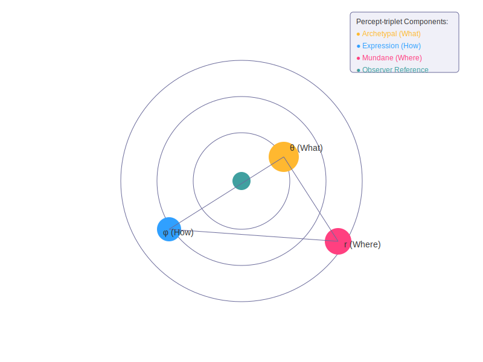
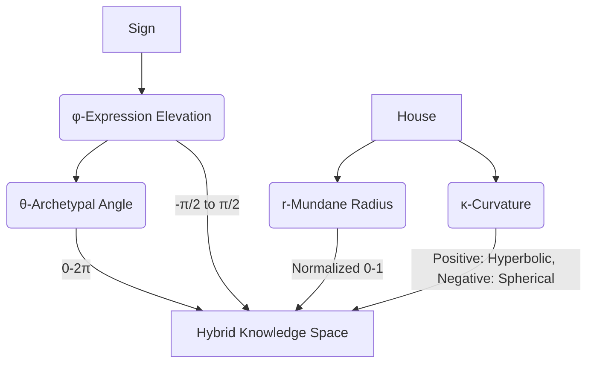
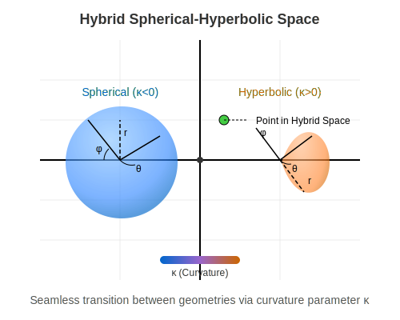
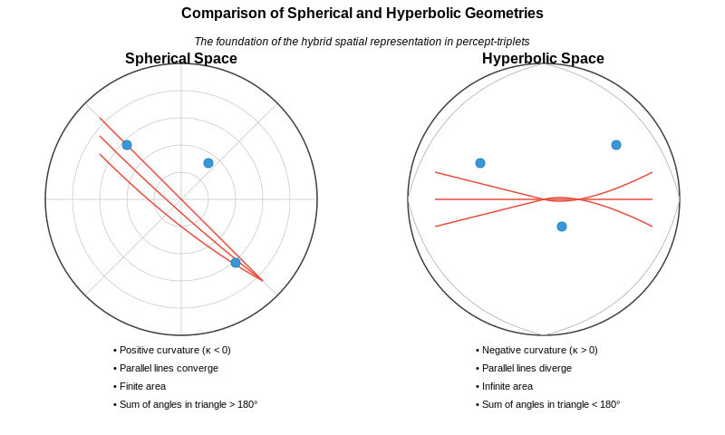
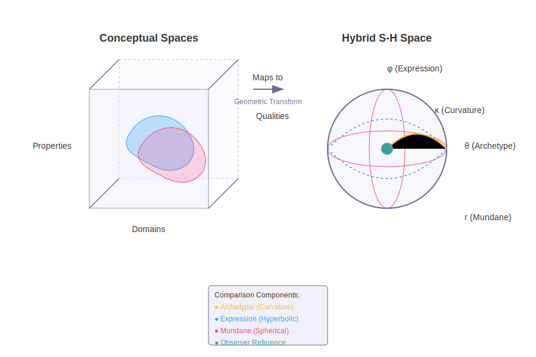
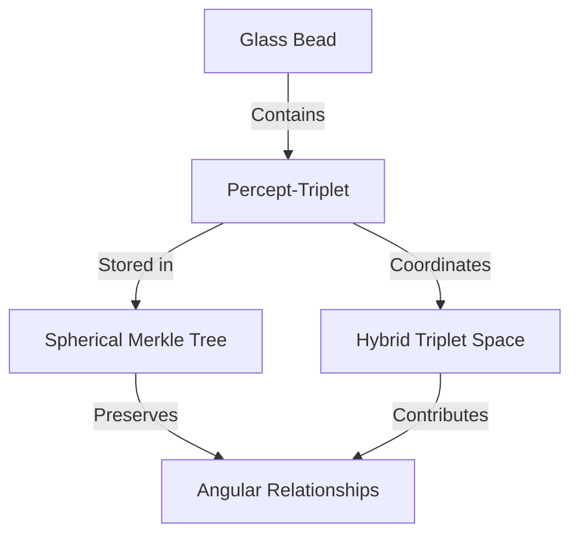

# 2.4. The Percept-Triplet

## Summary

The percept-triplet is a sophisticated encoding system at the heart of Memorativa, designed to represent human perception through three interconnected conceptual vectors: the archetypal ("What"), expressive ("How"), and contextual ("Where"). Drawing from Western symbolic traditions, it leverages planetary archetypes, zodiacal expressions, and astrological houses to form a structured semantic framework. Each percept-triplet encapsulates a unique conceptual identity, defined by a concise title and description, enabling intuitive human understanding and efficient computational processing.

Central to this system is a hybrid spherical-hyperbolic geometry, which elegantly balances hierarchical and symbolic relationships through a dynamic curvature parameter. This geometry maps percept-triplets into a four-dimensional coordinate space, preserving their semantic relationships and enabling efficient spatial queries. The coordinates are securely stored and verified using Spherical Merkle Trees, integrating seamlessly into the broader Glass Bead storage framework.

Compared to traditional conceptual space theories, the percept-triplet model offers significant computational advantages through its fixed dimensionality and dynamic geometry, providing a universal yet expressive representation of conceptual relationships. Operationally, percept-triplets are managed through a token-based economy (GBT), balancing computational efficiency with semantic richness.

In essence, the percept-triplet system forms the semantic backbone of Memorativa, translating complex human perceptions into structured, computationally tractable representations that bridge symbolic tradition and modern computational methods.


## Introduction

The percept-triplet is a three-dimensional encoding system that represents human perception through archetypal (What), expressive (How), and contextual (Where) vectors. It combines Western symbolic systems with hybrid spherical-hyperbolic geometry to create computationally efficient representations of conceptual relationships. These triplets form the core semantic content of Glass Beads (see Section 2.3) and are stored using Spherical Merkle Trees that preserve their spatial relationships.

In the Memorativa model, human perception can be conceptually categorized according to three conceptual vectors, called the *percept-triplet*:

- **What**: the archetype - *the archetype vector*
- **How**: the form of expression of the archetype - *the expression vector*
- **Where**: the form of expression of the archetype in the conceptual field of activity - *the contextual vector*

Additionally, each percept-triplet has an identifying title and description to distinguish it from it's archetype vector (the what). The title/distinction pair serves as a distinct, compact, verbal prototype for the structure.

Each of these conceptual correlations originate from an observer that has a certain cosmological orientation, that is, *of a perceiver of objects in time and space on Earth*.

Percept-triplets can be applied to humans, things, and events to calculate encapsulating concepts. Keywords can be used as identifiers to correlate percepts to a data dictionary of concepts.

Western mythology and symbology provide prototypes that are encoded into the English language and culture (which is of concern to large language models and other semantic processors) and that can serve as the "data dictionary" for percept encoding.

### The Archetype Vector

The **archetype vector** is defined as:

- Outside the bounds of conceptualization
- An active force and dynamic principle
- Something that can be represented by prototypes
- A conceptual goal and a kind of center of conceptual gravity for prototypes
- Universal and consistent 

Memorativa uses archetypes as the "What" vector, and specifically Western prototypes of archetypes. In Memorativa, prototypes act as the representation of the input enjoined with a concept. The more closely a prototype "gravitates" towards the conceptual field of the archetype, the more clearly the prototype expresses the encapsulating concept of the percept.

**Planets**, with their centers of gravity and symbolic potency, provide the core prototypes for the archetypal "what" vector of the percept-triplets.

These are prototypical classical Planets of Western mythology, with some conceptual correlations:

- **Sun ☉**: Identity, vitality, consciousness, purpose
- **Moon ☽**: Emotions, instincts, nurturing, cycles
- **Mercury ☿**: Communication, learning, analysis, connection
- **Venus ♀**: Values, relationships, harmony, attraction
- **Mars ♂**: Action, drive, assertion, energy
- **Jupiter ♃**: Expansion, wisdom, growth, opportunity
- **Saturn ♄**: Structure, limitation, responsibility, time

These are the prototypical modern Planets, with some conceptual correlations:

- **Uranus ♅**: Innovation, freedom, disruption, awakening
- **Neptune ♆**: Spirituality, dissolution, imagination, unity
- **Pluto ♇**: Transformation, power, depth, regeneration

The archetype system is extensible; minor planets like Chiron could integrate additional archetypal nuances such as wounding/healing dynamics, as further explored in Section 4.2: Archetypal Structures.

Each of these conceptual correlations are multivariate depending on if the percept is something personal, mundane, or itself conceptual. Thus "Sun" can be used to conceptually categorize people, events, or things. Different kinds of conceptual temporal states are also encoded into the planetary archetypes.

### The Expression Vector

The **expression vector** represents the form and expression of the archetype (the "How" vector) and is defined by:

- One of twelve symbols that modify the Planet archetypal force
- A representation of style, tone, and modality for the archetype
- The expression and manifestation of the archetype
- Determines how force is channeled

In keeping with an analogous structure to represent the different kinds of modalities and expressions of a Planet, the Western mythological classification of the constellations demarcating the ecliptic, the **Zodiac Signs**, serve as the twelve primary symbols of the "How" vector. According to the established mythology, each Zodiacal Sign has a "ruling" Planet that encodes a further vector of conceptual significance. In the case of the conceptual correlations for Signs, the vector particularly relates to the observer's understanding of the nature of the percept as an expression of the archetype.

Signs provide many additional correlated conceptual vectors, such as body parts, plants and minerals, month of the year, ruling Planet, etc.

| **Sign**                          |  **Modes**                |
|-----------------------------------|---------------------------|
| **♈ Aries, The Ram**              |  Energetic                |
| **♉ Taurus, The Bull**            |  Reliable                 |
| **♊ Gemini, The Twins**           |  Expressive               |
| **♋ Cancer, The Crab**            |  Protective               |
| **♌ Leo, The Lion**               |  Dramatic                 |
| **♍ Virgo, The Virgin**           |  Analytical               |
| **♎ Libra, The Scales**           |  Harmonious               |
| **♏ Scorpio, The Scorpion**       |  Intense                  |
| **♐ Sagittarius, The Archer**     |  Philosophical            |
| **♑ Capricorn, The Sea-Goat**     |  Practical                |
| **♒ Aquarius, The Water Bearer**  |  Inventive                 |
| **♓ Pisces, The Fish**            |  Artistic                 |

### The Contextual Vector

The **contextual vector** (the "Where") is the area of reality where the archetypal form of expression manifests, and is defined by:

- One of 12 areas called Houses
- The operational zone of activity for the percept
- Correlations to cycles, times, phases, and durations of human observed events
- Grounds symbolism in tangible reality, reflecting where energies manifest most visibly

Houses are categorized in Western astrology as follows:

| **House**                                |  **Area**                 |
|------------------------------------------|---------------------------|
|  **1st: The Ascendant**                  |  Identity                 |
|  **2nd: The House of Value**             |  Resources                |
|  **3rd: The House of Communication**     |  Learning                 |
|  **4th: The Nadir/IC**                   |  Home                     |
|  **5th: The House of Pleasure**          |  Creativity               |
|  **6th: The House of Service**           |  Routine                  |
|  **7th: The Descendant**                 |  Relationships            |
|  **8th: The House of Transformation**    |  Shared resources         |
|  **9th: The House of Philosophy**        |  Beliefs                  |
|  **10th: The Midheaven/MC**              |  Authority                |
|  **11th: The House of Friendship**       |  Groups                   |
|  **12th: The House of the Unconscious**  |  Hidden matters           |

The percept-triplet structure is geometrically encoded in a hybrid spherical-hyperbolic knowledge space, combining the benefits of both geometries:



*Figure 1: Percept-triplet Visualization, showing the three-dimensional representation of archetypal, expressive, and mundane vectors in a hybrid geometric space, illustrating how conceptual relationships maintain both hierarchical structure and angular significance*



*Figure 2: Coordinate Mapping Graph, illustrating the transformation from symbolic components (Planet, Sign, House) to geometric coordinates in the hybrid knowledge space, highlighting the multi-dimensional nature of the encoding*

### Coordinate Mapping

The hybrid spherical-hyperbolic space is represented by four key coordinates:

- θ (Theta): Archetypal angle (0 to 2π) representing the Planet-Sign relationship
- φ (Phi): Expression elevation (-π/2 to π/2) derived from Sign-House interaction
- r (Radius): Mundane magnitude (0 to 1) based on House significance
- κ (Kappa): Curvature parameter that smoothly transitions between:
  - Hyperbolic geometry (κ > 0): Better for hierarchical relationships
  - Spherical geometry (κ < 0): Better for symbolic/angular relationships



*Figure 3: Coordinate Visualization, showing how points are mapped in the hybrid space with both spherical and hyperbolic components, demonstrating the smooth transition between geometries controlled by the curvature parameter*

Here's what these spaces look like:



*Figure 4: Comparison of Spherical and Hyperbolic Geometries, illustrating the fundamental differences in curvature, parallel line behavior, and spatial properties that form the basis of the hybrid geometric approach, demonstrating why this combined geometry enables both hierarchical organization and symbolic angular relationships within the percept-triplet system*

Percept-triplet coordinates can also be represented as vector embeddings, facilitating integration with retrieval-augmented generation systems.

### Merkle Preservation of Coordinates

These coordinates are preserved in the Spherical Merkle Tree structure, connecting the percept-triplet system directly to the Glass Bead storage framework described in Section 2.3.

Coordinates and angular relationships are preserved and verified using Spherical Merkle Trees, employing the hybrid verification system detailed in Section 2.3.

### Comparison to Conceptual Spaces

The hybrid spherical-hyperbolic mapping shares similarities with Gärdenfors' Conceptual Spaces theory while introducing key innovations:

| Aspect | Conceptual Spaces | Hybrid S-H Space |
|--------|------------------|------------------|
| Dimensions | Quality dimensions with arbitrary domains | Fixed 3D structure (θ,φ,r) with curvature κ |
| Geometry | Euclidean metric spaces | Dynamic spherical-hyperbolic geometry |
| Properties | Convex regions in quality dimensions | Vector fields in curved space |
| Concepts | Weighted combinations of properties | Gravitational wells around archetypes |
| Distance | Weighted Euclidean/Manhattan | Geometry-dependent hybrid metric |
| Structure | Domain-specific dimensional spaces | Universal 3D representation |



*Figure 5: Conceptual Space Mapping Comparison, contrasting traditional quality dimension approaches with the hybrid geometric model, highlighting the efficiency advantages of the fixed-dimensional universal structure*

Key advantages of the hybrid approach:

1. **Fixed Dimensionality**: Maintains computational efficiency while preserving expressiveness
2. **Dynamic Geometry**: Adapts to hierarchical vs symbolic relationships through curvature
3. **Universal Structure**: Provides consistent mapping across all conceptual domains
4. **Gravitational Metaphor**: Intuitive understanding of conceptual attraction and prototypes

The hybrid model trades some of the flexibility of arbitrary quality dimensions for a more constrained but computationally tractable universal representation.

### Integration with Spherical Merkle Trees

Percept-triplets are stored and verified within Glass Beads using Spherical Merkle Trees that preserve their spatial relationships:



*Figure 6: Integration with Glass Beads, showing how percept-triplets are embedded within the Glass Bead structure using Spherical Merkle Trees, demonstrating the preservation of both data integrity and spatial relationships*

## Operational Costs

Each percept-triplet operation consumes GBT (Gas Bead Tokens) according to the following cost structure designed to balance computational efficiency with semantic expressiveness:

| Operation | GBT Cost | Rationale |
|-----------|----------|-------------|
| Percept Creation | 5-10 GBT | Establishing new conceptual structures requires significant validation |
| Vector Modification | 3-7 GBT | Changing core vectors impacts semantic relationships across the system |
| Spatial Query | 2-5 GBT | Geometric searches consume computational resources proportional to scope |
| Prototype Integration | 1-3 GBT | Connecting triplets to form coherent structures |
| Book Generation | 20-50 GBT | Creating comprehensive knowledge artifacts |
| Focus Space Creation | 10-15 GBT | Establishing new conceptual workspaces |
| Attribute Update | 0.5-1 GBT | Minor metadata changes should be accessible for refinement |
| Verification | 0.1-0.5 GBT | Confirming triplet validity promotes system integrity |

The token economics for percept-triplet operations follow these principles:
- **Computational Efficiency**: Operations with higher computational requirements cost proportionally more
- **Semantic Value**: Costs reflect the semantic impact and persistence of the operation
- **Accessibility Balance**: Essential operations for meaning-making remain affordable while preventing spam
- **Transformation Incentives**: Lower costs for operations that enhance knowledge connections and integration
- **Progressive Scaling**: Costs scale with complexity and scope of the operation rather than fixed rates


## Key Math

The mathematical foundations underlying the percept-triplet system revolve around cryptographic hashing, spherical geometry, and hybrid spatial encoding:

### 1. Merkle Tree Hashing

Merkle trees ensure data integrity through cryptographic hashes. Given two child nodes \(H_L\) and \(H_R\), the parent hash \(H_P\) is computed as:

\[ H_P = \text{Hash}(H_L \| H_R) \]

### 2. Spherical Geometry

Angular distance \(d\) between two points \(A(\theta_1, \phi_1)\) and \(B(\theta_2, \phi_2)\) on a unit sphere is calculated using the spherical law of cosines:

\[ d = \arccos(\sin\phi_1\sin\phi_2 + \cos\phi_1\cos\phi_2\cos(\theta_1 - \theta_2)) \]

### 3. Hybrid Hashing

Each percept-triplet's combined hash \(H_C\) integrates data hash \(H_D\) and angular hash \(H_A\):

\[ H_C = \text{Hash}(H_D \| H_A) \]

### 4. Verification Complexity

Sparse Merkle proofs have logarithmic complexity \(O(\log n)\), where \(n\) is the number of nodes. Aggregate proofs optimize verification further:

\[ O(\log n + m) \]

where \(m\) is the number of aggregated proofs.

## Code Examples

### Hybrid Triplet Implementation

This code defines a way to represent concepts spatially using a HybridTriplet structure, where the spatial coordinates and geometry are derived from astrological concepts: Planets, Zodiac Signs, and Houses.

```rust
struct HybridTriplet {
    theta: f32,     // Archetype vector (0.0-2π)
    phi: f32,       // Expression vector (-π/2-π/2) 
    radius: f32,    // Mundane magnitude (0.0-1.0)
    curvature: f32, // Geometry parameter
    gradient: f32,  // Curvature gradient field
    error: f32      // Error bound for calculations
}

impl HybridTriplet {
    const MAX_CURVATURE: f32 = 10.0;
    const MIN_CURVATURE: f32 = -10.0;
    const ERROR_TOLERANCE: f32 = 1e-6;

    fn from_astrological(p: Planet, s: Sign, h: House) -> Self {
        let theta = p.base_angle() + s.angular_offset();
        let phi = s.elevation() * h.temporal_weight();
        let radius = h.mundane_significance();
        let curvature = h.determine_curvature()
            .clamp(Self::MIN_CURVATURE, Self::MAX_CURVATURE);
        let gradient = calculate_curvature_gradient(curvature, radius);
        let error = calculate_error_bound(theta, phi, radius, curvature);
        
        Self { theta, phi, radius, curvature, gradient, error }
    }

    fn calculate_distance(&self, other: &Self) -> Result<f32, CurvatureError> {
        // Check error bounds before calculation
        if (self.error + other.error) > Self::ERROR_TOLERANCE {
            return Err(CurvatureError::ExcessiveError);
        }

        // Blend distance metrics based on gradient field
        let hyperbolic_dist = self.hyperbolic_distance(other);
        let spherical_dist = self.spherical_distance(other);
        
        // Smooth transition using gradient
        let blend = (self.gradient + other.gradient) / 2.0;
        Ok(hyperbolic_dist * blend + spherical_dist * (1.0 - blend))
    }

    fn hyperbolic_distance(&self, other: &Self) -> f32 {
        // Poincaré ball model distance formula
        let dx = self.poincare[0] - other.poincare[0];
        let dy = self.poincare[1] - other.poincare[1];
        let dz = self.poincare[2] - other.poincare[2];
        let euclid_norm = (dx*dx + dy*dy + dz*dz).sqrt();
        let denominator = (1.0 - self.norm_squared()).sqrt() 
                       * (1.0 - other.norm_squared()).sqrt();

        (1.0 + 2.0*euclid_norm/denominator).acosh()
    }
    
    // Serialization for Merkle tree integration
    fn serialize(&self) -> Vec<u8> {
        let mut buffer = Vec::with_capacity(24); // 6 f32 values * 4 bytes
        
        buffer.extend_from_slice(&self.theta.to_le_bytes());
        buffer.extend_from_slice(&self.phi.to_le_bytes());
        buffer.extend_from_slice(&self.radius.to_le_bytes());
        buffer.extend_from_slice(&self.curvature.to_le_bytes());
        buffer.extend_from_slice(&self.gradient.to_le_bytes());
        buffer.extend_from_slice(&self.error.to_le_bytes());
        
        buffer
    }
}
```

### Merkle Tree Integration

```rust
struct PerceptTripletMerkleNode {
    triplet: HybridTriplet,
    children: Vec<NodeId>,
    angular_relationships: HashMap<NodeId, Angle>,
    hash: [u8; 32],
}

impl PerceptTripletMerkleNode {
    fn new(triplet: HybridTriplet) -> Self {
        let data = triplet.serialize();
        Self {
            triplet,
            children: Vec::new(),
            angular_relationships: HashMap::new(),
            hash: hash_data(&data),
        }
    }

    fn calculate_hash(&self) -> [u8; 32] {
        // Include both triplet data and angular relationships in hash
        let data_hash = hash_data(&self.triplet.serialize());
        
        // Sort angular relationships for deterministic hashing
        let mut relationships: Vec<(NodeId, Angle)> = 
            self.angular_relationships.iter()
                .map(|(k, v)| (*k, *v))
                .collect();
        relationships.sort_by_key(|(id, _)| *id);
        
        let angle_hash = hash_data(&relationships);
        hash_combine(data_hash, angle_hash)
    }
}
```

### Hybrid Spatial Index

```python
class HybridSpatialIndex:
    def __init__(self):
        self.spherical_index = KDTree(dim=3)
        self.hyperbolic_index = BallTree(metric='poincare')
        self.aspect_cache = LRUCache(maxsize=10000)
        
    def query_neighbors(self, triplet: HybridTriplet, k: int = 5) -> List[HybridTriplet]:
        # Query both spaces in parallel
        spherical_neighbors = self.spherical_index.query(
            triplet.spherical.coords, 
            k=k
        )
        hyperbolic_neighbors = self.hyperbolic_index.query(
            triplet.poincare,
            k=k
        )
        
        # Merge results based on curvature
        weight = abs(triplet.curvature)
        merged = []
        for s_n, h_n in zip(spherical_neighbors, hyperbolic_neighbors):
            score = weight * h_n.distance + (1-weight) * s_n.distance
            merged.append((s_n.triplet, score))
            
        return sorted(merged, key=lambda x: x[1])[:k]
```

## Key Points

- The percept-triplet consists of three conceptual vectors (archetypal, expression, and contextual) that together form a comprehensive representation of human perception [1]
- Western symbolic systems (Planets, Zodiac Signs, and Houses) provide a rich foundation for encoding conceptual relationships through the percept-triplet system [2]
- The hybrid spherical-hyperbolic geometry enables efficient representation of both hierarchical and symbolic relationships, with dynamic adaptation through the curvature parameter [3]
- Merkle preservation of coordinates ensures that spatial relationships are maintained throughout storage and verification processes, connecting directly to the Glass Bead storage framework [4]
- The fixed 3D structure offers computational advantages over arbitrary quality dimensions while still preserving expressive power through dynamic geometry [5]
- Percept-triplets serve as the core semantic content of Glass Beads, forming the foundation of the Memorativa knowledge representation system [6]
- Each triplet has a unique title/description pair that serves as a verbal prototype, distinguishing it from its archetypal vector and enabling intuitive human understanding [7]

## See Also

- [Section 2.3: Glass Beads](memorativa-2-3-glass-beads.md) — Describes the token structure that contains and preserves percept-triplets
- [Section 2.10: Visualizing the Prototype](memorativa-2-10-visualizing-the-prototype.md) — Provides further details on the visualization and interaction with the hybrid geometric space
- [Section 2.12: Focus Spaces](memorativa-2-12-focus-spaces.md) — Explains how percept-triplets are organized and filtered within conceptual workspaces
- [Section 3.4: Vector Spaces](../3.%20the%20machine%20system/memorativa-3-4-vector-spaces.md) — Connects the percept-triplet geometry to machine learning and computational models
- [Section 4.2: Archetypal Structures](../4.%20the%20pantheon%20system/memorativa-4-2-archetypal-structures.md) — Provides deeper context for the archetypal vector components

## Citations

- [1] Jung, C. G. (1959). *The Archetypes and the Collective Unconscious*. Princeton University Press.
- [2] Campion, N. (2008). *A History of Western Astrology: The Ancient World*. Continuum.
- [3] Gromov, M. (1987). "Hyperbolic Groups." *Essays in Group Theory*, pp. 75-263.
- [4] Merkle, R. C. (1987). "A Digital Signature Based on a Conventional Encryption Function." *Advances in Cryptology — CRYPTO '87*, pp. 369-378.
- [5] Gärdenfors, P. (2000). *Conceptual Spaces: The Geometry of Thought*. MIT Press.
- [6] [Section 2.3] Glass Beads.
- [7] Lakoff, G., & Johnson, M. (1980). *Metaphors We Live By*. University of Chicago Press.
- [8] Cannon, J., Floyd, W., Kenyon, R., & Parry, W. (1997). "Hyperbolic Geometry." *Flavors of Geometry*, 31, pp. 59-115.
- [9] Sarkar, R. (2011). "Low Distortion Delaunay Embedding of Trees in Hyperbolic Plane." *Graph Drawing*, pp. 355-366.


